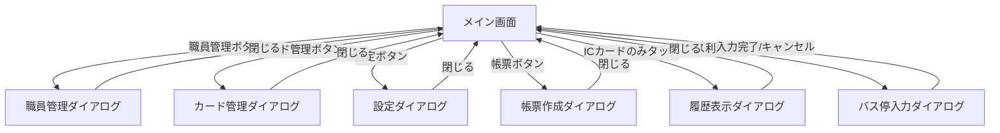
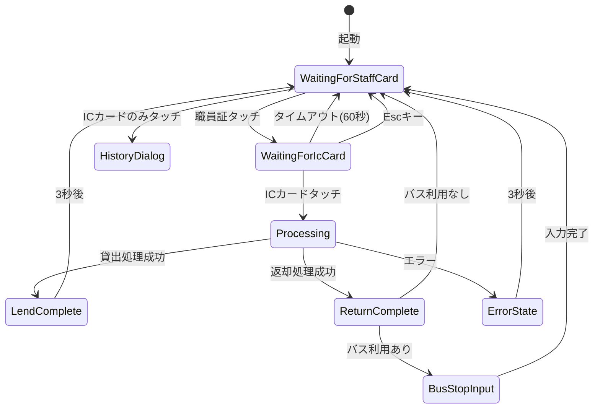

# 画面設計書

## 1. 画面遷移図



---

## 2. 画面一覧

| No. | 画面名 | ファイル名 | 概要 |
|-----|--------|------------|------|
| 1 | メイン画面 | MainWindow.xaml | 貸出・返却の操作画面 |
| 2 | 職員管理ダイアログ | StaffManageDialog.xaml | 職員の登録・編集・削除 |
| 3 | カード管理ダイアログ | CardManageDialog.xaml | ICカードの登録・編集・削除 |
| 4 | 設定ダイアログ | SettingsDialog.xaml | アプリケーション設定 |
| 5 | 帳票作成ダイアログ | ReportDialog.xaml | 月次帳票の作成 |
| 6 | 履歴表示ダイアログ | HistoryDialog.xaml | 利用履歴の照会 |
| 7 | バス停入力ダイアログ | BusStopInputDialog.xaml | バス停名の手入力 |

---

## 3. 画面詳細設計

### 3.1 メイン画面（MainWindow）

#### 3.1.1 画面レイアウト

```
+------------------------------------------------------------------+
| [ヘッダー]                                                        |
| 交通系ICカード管理システム    2024/04/01 09:30  [設定][帳票][管理] |
+------------------------------------------------------------------+
|                                           |  [サイドバー]         |
|                                           |  貸出中のカード       |
|              [メインエリア]               |  ・はやかけん H001    |
|                                           |    4/1 9:00～         |
|                 💳                        |  ・nimoca N002        |
|           職員証をタッチしてください       |    4/1 8:30～         |
|                                           |                       |
|              残り 58 秒                    |  [警告]               |
|                                           |  ・H003 残高不足      |
+------------------------------------------------------------------+
| [操作ヒント] 職員証→ICカードで貸出/返却 | [Esc]キャンセル       |
+------------------------------------------------------------------+
| 状態: 職員証タッチ待ち | 貸出中: 2枚                              |
+------------------------------------------------------------------+
```

#### 3.1.2 領域説明

| 領域 | 説明 |
|------|------|
| ヘッダー | システム名、現在日時、各種ボタン |
| メインエリア | 状態アイコン、ステータスメッセージ、タイムアウト表示 |
| サイドバー | 貸出中カード一覧、警告メッセージ |
| 操作ヒント | 操作方法のガイダンス |
| ステータスバー | 現在の状態、貸出中カード数 |

#### 3.1.3 状態別表示

| 状態 | アイコン | メッセージ | 背景色 |
|------|----------|------------|--------|
| 職員証タッチ待ち | 💳 | 職員証をタッチしてください | 白 |
| ICカードタッチ待ち | 🚃 | ICカードをタッチしてください | 白 |
| 貸出完了 | 🚃→ | 貸出しました | #FFE0B2（薄いオレンジ） |
| 返却完了 | 🏠← | 返却しました | #B3E5FC（薄い水色） |
| エラー | ⚠️ | エラーメッセージ | #FFEBEE（薄い赤） |

---

### 3.2 状態遷移図



#### 状態説明

| 状態 | 説明 | タイムアウト |
|------|------|--------------|
| WaitingForStaffCard | 職員証タッチ待ち | なし |
| WaitingForIcCard | ICカードタッチ待ち | 60秒 |
| Processing | 処理中 | なし |
| LendComplete | 貸出完了 | 3秒 |
| ReturnComplete | 返却完了 | 3秒 |
| ErrorState | エラー表示 | 3秒 |
| BusStopInput | バス停入力待ち | なし |

---

### 3.3 職員管理ダイアログ（StaffManageDialog）

```
+--------------------------------------------------+
| 職員管理                                    [×] |
+--------------------------------------------------+
| [新規登録]                                       |
|                                                  |
| +----------------------------------------------+ |
| | 職員証IDm    | 氏名        | 職員番号 | 操作 | |
| |--------------|-------------|----------|------| |
| | 0102030...   | 山田 太郎   | A001     | [編集]| |
| | 1112131...   | 鈴木 花子   | A002     | [削除]| |
| +----------------------------------------------+ |
|                                                  |
| [閉じる]                                         |
+--------------------------------------------------+
```

#### 機能

- 職員一覧表示（論理削除されていないもの）
- 新規登録（職員証タッチでIDm取得）
- 編集（氏名、職員番号、備考）
- 論理削除

---

### 3.4 カード管理ダイアログ（CardManageDialog）

```
+--------------------------------------------------+
| カード管理                                  [×] |
+--------------------------------------------------+
| [新規登録]                                       |
|                                                  |
| +----------------------------------------------+ |
| | 種別      | 管理番号 | 状態    | 操作        | |
| |-----------|----------|---------|-------------| |
| | はやかけん | H001     | 返却済  | [編集][削除]| |
| | nimoca    | N002     | 貸出中  | [編集]      | |
| +----------------------------------------------+ |
|                                                  |
| [閉じる]                                         |
+--------------------------------------------------+
```

#### 機能

- カード一覧表示（論理削除されていないもの）
- 新規登録（ICカードタッチでIDm取得、種別自動判別）
- 編集（管理番号、備考）
- 論理削除（貸出中のカードは削除不可）

---

### 3.5 設定ダイアログ（SettingsDialog）

```
+--------------------------------------------------+
| 設定                                        [×] |
+--------------------------------------------------+
|                                                  |
| 文字サイズ:                                      |
| (●) 小  (○) 中  (○) 大  (○) 特大              |
|                                                  |
| 残高警告閾値:                                    |
| [    10000    ] 円                               |
|                                                  |
| 音声フィードバック:                              |
| [✓] 有効                                         |
|                                                  |
+--------------------------------------------------+
| [保存]  [キャンセル]                             |
+--------------------------------------------------+
```

#### 設定項目

| 項目 | 設定値 | デフォルト |
|------|--------|------------|
| 文字サイズ | 小/中/大/特大 | 中 |
| 残高警告閾値 | 0～99999円 | 10000円 |
| 音声フィードバック | 有効/無効 | 有効 |

---

### 3.6 帳票作成ダイアログ（ReportDialog）

```
+--------------------------------------------------+
| 帳票作成                                    [×] |
+--------------------------------------------------+
|                                                  |
| 対象年月:                                        |
| [2024]年 [4]月 ▼                                 |
|                                                  |
| 対象カード:                                      |
| [✓] はやかけん H001                              |
| [✓] nimoca N002                                  |
| [ ] SUGOCA S003                                  |
| [全選択] [全解除]                                |
|                                                  |
| 出力先フォルダ:                                  |
| [C:\Users\...\Documents              ] [参照]   |
|                                                  |
+--------------------------------------------------+
| [作成]  [キャンセル]                             |
+--------------------------------------------------+
```

#### 機能

- 対象年月の選択
- 対象カードの複数選択
- 出力先フォルダの指定
- 帳票の一括作成

---

### 3.7 履歴表示ダイアログ（HistoryDialog）

```
+--------------------------------------------------+
| 履歴表示 - はやかけん H001                  [×] |
+--------------------------------------------------+
| 期間: [2024/04/01] ～ [2024/04/30] [検索]        |
|                                                  |
| +----------------------------------------------+ |
| | 日付  | 摘要                | 受入 | 払出    | |
| |-------|---------------------|------|--------| |
| | 4/1   | 鉄道（博多～天神）  |      | 260    | |
| | 4/1   | バス（★）          |      | 200    | |
| | 4/2   | 役務費によりチャージ| 3000 |        | |
| +----------------------------------------------+ |
|                                                  |
| [閉じる]                                         |
+--------------------------------------------------+
```

#### 機能

- 期間指定による検索
- 利用履歴の一覧表示
- 摘要、受入金額、払出金額の表示

---

### 3.8 バス停入力ダイアログ（BusStopInputDialog）

```
+--------------------------------------------------+
| バス停の入力                                [×] |
+--------------------------------------------------+
|                                                  |
| バス利用が検出されました。                       |
| バス停名を入力してください。                     |
|                                                  |
| 利用日時: 2024/04/01 09:15                       |
| 利用額: 200円                                    |
|                                                  |
| バス停名:                                        |
| [                                       ]        |
|                                                  |
| 履歴: [博多駅前→天神] [博多駅→福岡空港]         |
|                                                  |
+--------------------------------------------------+
| [登録]  [スキップ]                               |
+--------------------------------------------------+
```

#### 機能

- バス利用情報の表示
- バス停名の入力
- 過去の入力履歴からの選択
- スキップ（★マークで保存）

---

## 4. UI/UXガイドライン

### 4.1 色の使用方針

| 用途 | 色コード | 色名 | 説明 |
|------|----------|------|------|
| 貸出完了 | #FFE0B2 | 薄いオレンジ | 暖色系で「外に出る」イメージ |
| 返却完了 | #B3E5FC | 薄い水色 | 寒色系で「戻る」イメージ |
| エラー | #FFEBEE | 薄い赤 | 警告・注意 |
| ヘッダー | #2196F3 | 青 | システムカラー |
| 操作ヒント | #E3F2FD | 薄い青 | 情報表示 |

### 4.2 アクセシビリティ対応

#### 4.2.1 色覚多様性対応
- 暖色（貸出）と寒色（返却）で色相差を明確に
- 色だけでなくアイコン・テキストでも状態を表現

#### 4.2.2 多重表現
状態は以下の4要素で伝達：
1. **色**: 背景色で視覚的に区別
2. **アイコン**: 絵文字で直感的に理解
3. **テキスト**: メッセージで明確に説明
4. **音**: フィードバック音で聴覚的に通知

#### 4.2.3 文字サイズ変更
- 小/中/大/特大の4段階
- 高齢者でも読みやすい大きさに変更可能

### 4.3 音声フィードバック

| イベント | 音 | ファイル |
|----------|-----|----------|
| 貸出成功 | ピッ | lend.wav |
| 返却成功 | ピピッ | return.wav |
| エラー | ピー | error.wav |
| 警告 | ピポ | warning.wav |

### 4.4 操作フィードバック

| 操作 | フィードバック |
|------|----------------|
| カードタッチ | 背景色変化 + 音 + メッセージ |
| ボタンクリック | ボタン無効化（二重クリック防止） |
| 処理中 | オーバーレイ + プログレスバー |
| タイムアウト | カウントダウン表示 |

---

## 5. キーボード操作

| キー | 画面 | 動作 |
|------|------|------|
| Esc | メイン画面 | ICカード待ち状態をキャンセル |
| Enter | 各ダイアログ | デフォルトボタンの実行 |
| Tab | 各画面 | フォーカス移動 |
