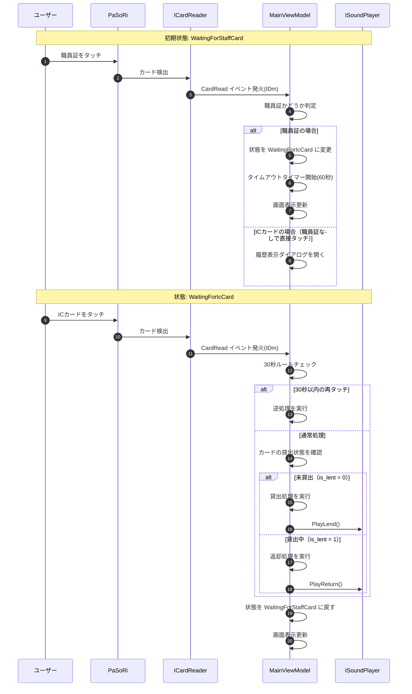
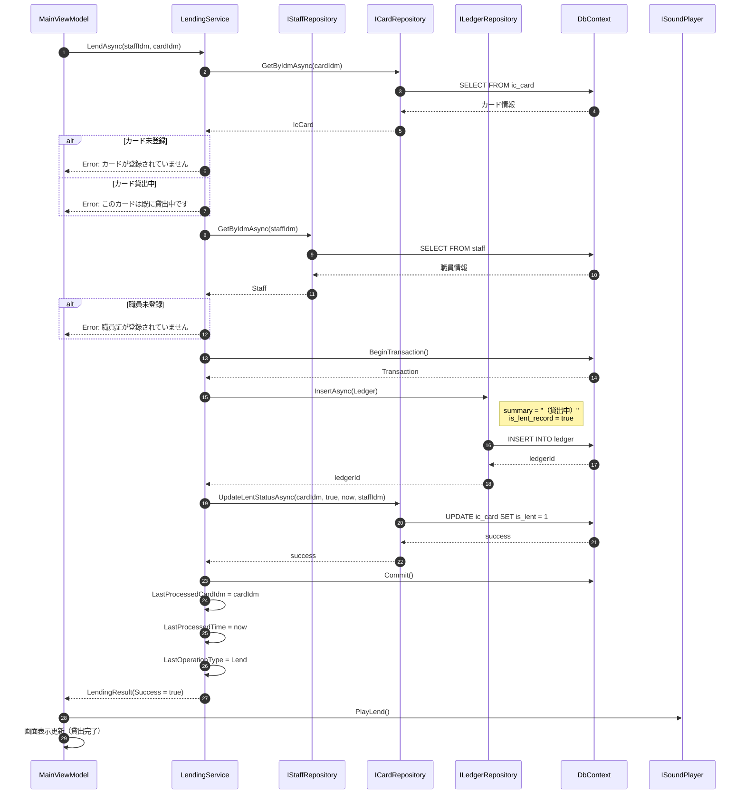
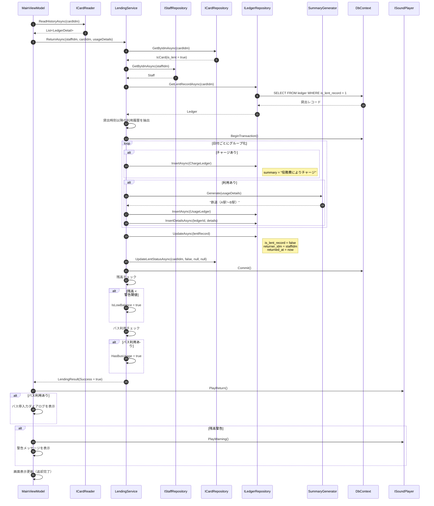
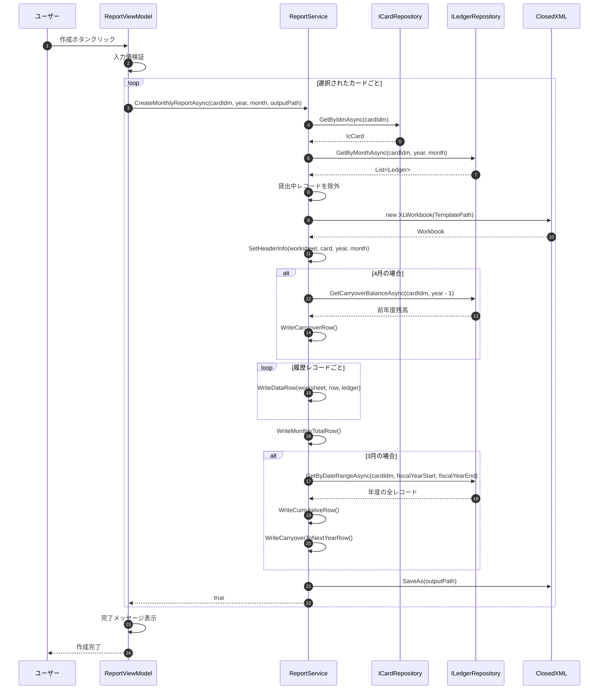
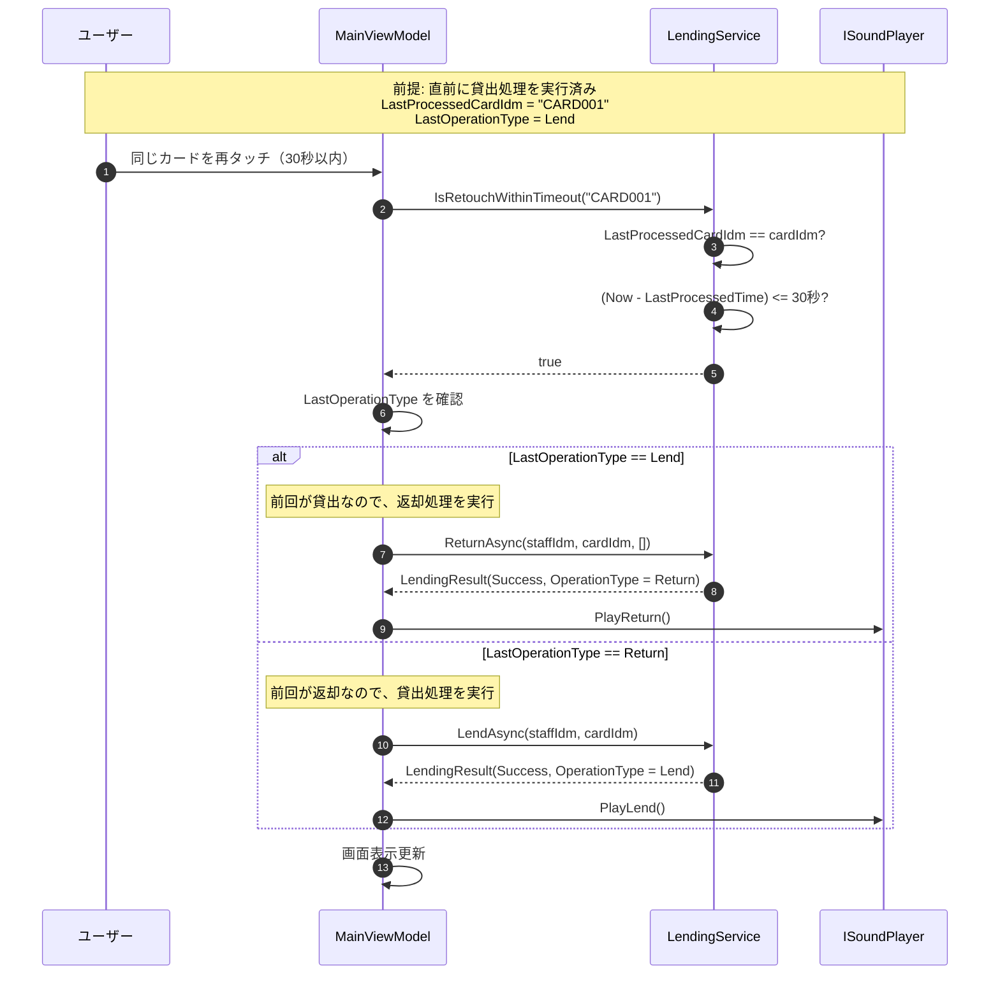
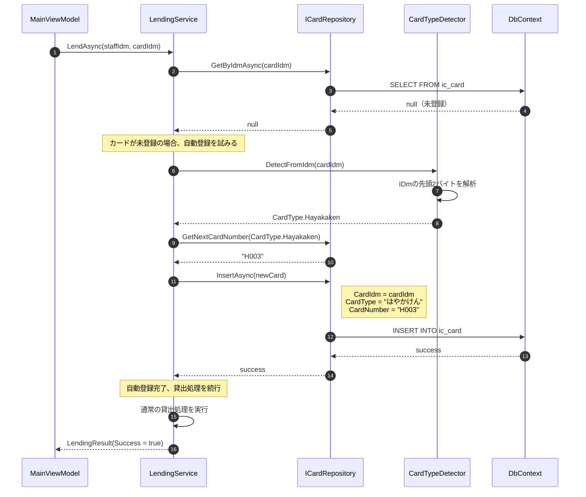
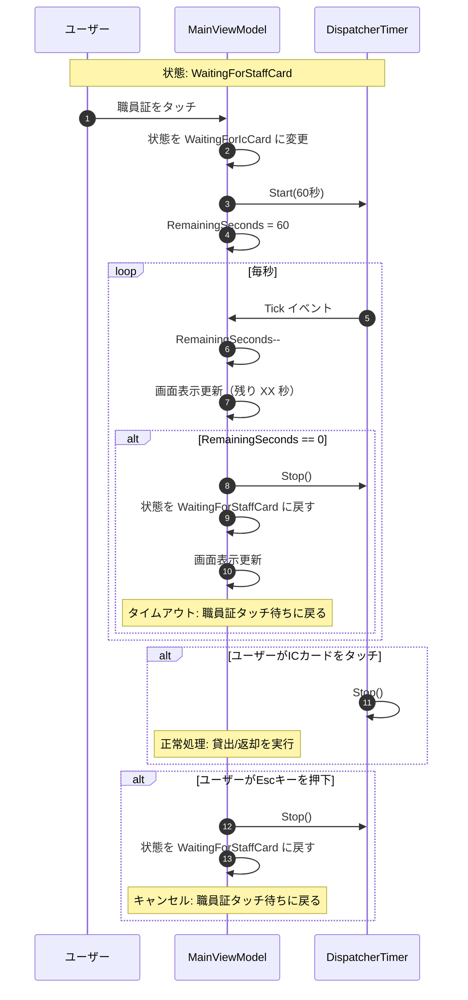
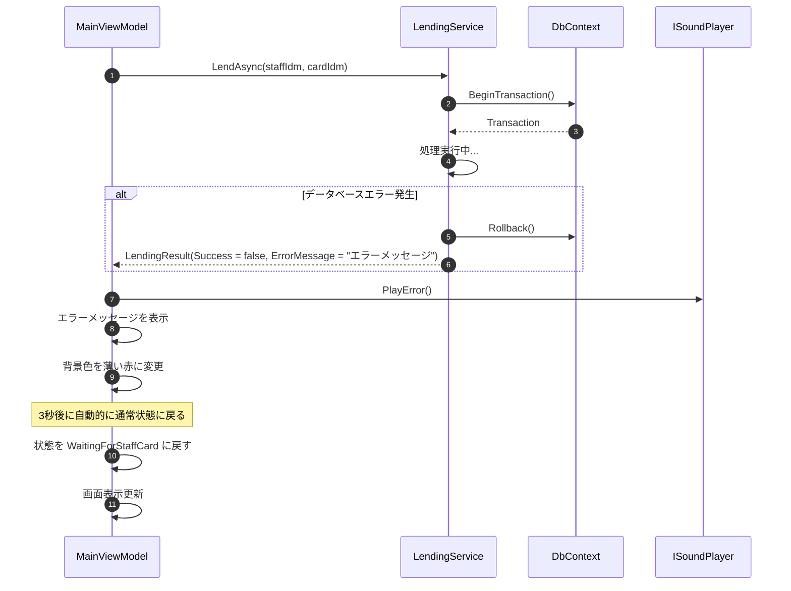

# シーケンス図

## 1. 職員証タッチ～ICカードタッチのフロー

---

## 2. 貸出処理シーケンス

---

## 3. 返却処理シーケンス

---

## 4. 帳票出力シーケンス

---

## 5. 30秒ルール適用シーケンス

---

## 6. カード自動登録シーケンス

---

## 7. タイムアウト処理シーケンス

---

## 8. エラー処理シーケンス

