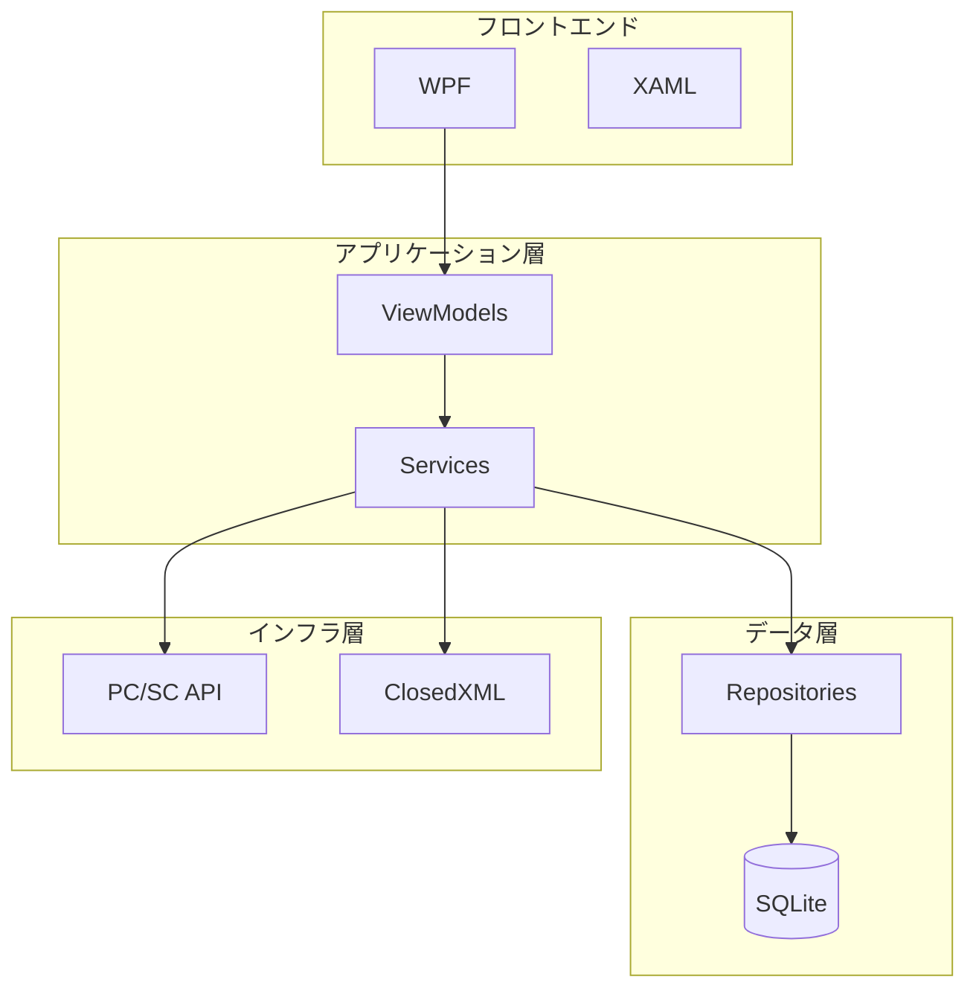
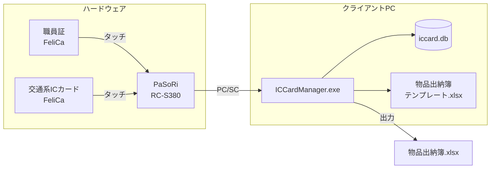

# システム概要設計書

## 1. システム目的・背景

### 1.1 背景
複数の交通系ICカード（はやかけん、nimoca、SUGOCA等）を複数職員でシェア利用する運用において、以下の課題が存在していた：

- ICカードの貸出・返却の記録が手作業で煩雑
- 物品出納簿の作成に多大な工数がかかる
- 利用履歴の追跡が困難
- カード残高の管理が不十分

### 1.2 目的
本システムは、交通系ICカードの貸出・返却管理を自動化し、物品出納簿の作成を効率化することを目的とする。

### 1.3 導入効果
- 貸出・返却記録の自動化による業務効率化
- ICカードの利用履歴から物品出納簿を自動生成
- 残高不足の早期検知による運用トラブル防止
- 監査対応に必要なデータの自動保存（6年間）

---

## 2. 主要機能一覧

| No. | 機能名 | 概要 |
|-----|--------|------|
| 1 | 職員証認証 | 職員証（FeliCa）をタッチして操作者を特定 |
| 2 | ICカード貸出 | 交通系ICカードの貸出を記録 |
| 3 | ICカード返却 | 交通系ICカードの返却と利用履歴の記録 |
| 4 | 30秒ルール | 誤操作時に30秒以内の再タッチで逆処理を実行 |
| 5 | 職員管理 | 職員情報の登録・編集・削除（論理削除） |
| 6 | カード管理 | ICカード情報の登録・編集・削除（論理削除） |
| 7 | 月次帳票作成 | 物品出納簿（Excel形式）の自動生成 |
| 8 | 履歴照会 | 過去の利用履歴の検索・閲覧 |
| 9 | バス停入力 | バス利用時のバス停名を手入力 |
| 10 | 設定管理 | 文字サイズ、残高警告閾値等の設定 |

---

## 3. 技術スタック

| カテゴリ | 技術 | バージョン |
|----------|------|------------|
| 言語 | C# | 10 |
| フレームワーク | .NET Framework | 4.8 |
| UIフレームワーク | WPF | - |
| データベース | SQLite | 3.x |
| ICカードリーダー | PC/SC API | - |
| Excel出力 | ClosedXML | 0.102.x |
| MVVMツールキット | CommunityToolkit.Mvvm | 8.x |

---

## 4. システム構成図

### 4.1 ハードウェア構成

| 機器 | 用途 | 備考 |
|------|------|------|
| クライアントPC | アプリケーション実行 | Windows 11 |
| PaSoRi (RC-S380) | ICカード読み取り | PC/SC対応 |
| 職員証 | 操作者の認証 | FeliCa対応 |
| 交通系ICカード | 管理対象 | はやかけん/nimoca/SUGOCA等 |

### 4.2 ソフトウェア構成

| ソフトウェア | 用途 | 備考 |
|--------------|------|------|
| ICCardManager.exe | 本システム | 自己完結型ビルド |
| iccard.db | データベース | SQLite |
| 物品出納簿テンプレート.xlsx | 帳票テンプレート | - |

---

## 5. 運用環境要件

### 5.1 ハードウェア要件

| 項目 | 要件 |
|------|------|
| OS | Windows 11 |
| CPU | x64プロセッサ |
| メモリ | 4GB以上 |
| ストレージ | 100MB以上の空き容量 |
| USBポート | 1ポート（PaSoRi用） |

### 5.2 ソフトウェア要件

| 項目 | 要件 |
|------|------|
| .NET Runtime | 不要（自己完結型ビルド） |
| ドライバ | PaSoRiドライバ |
| Excel | 出力ファイルの閲覧に必要 |

### 5.3 ネットワーク要件

| 項目 | 要件 |
|------|------|
| インターネット接続 | **不要**（オフライン動作） |
| LAN接続 | 不要 |

> **重要**: 本システムはインターネット非接続環境で動作することを前提としている。クラウドサービスは利用しない。

### 5.4 データ保持要件

| 項目 | 要件 |
|------|------|
| 利用履歴（ledger） | 6年間保持、以降自動削除 |
| 操作ログ（operation_log） | 永続保存（削除しない） |
| バックアップ | 手動（DBファイルのコピー） |

---

## 6. セキュリティ要件

### 6.1 認証

- 職員証（FeliCa）による操作者認証
- パスワード認証は不要（物理カード所持で認証）

### 6.2 データ保護

- データベースファイルはローカル保存
- ネットワーク経由のアクセスなし
- 論理削除による履歴追跡性の確保

### 6.3 監査対応

- 全操作のログ記録（operation_log）
- 職員名のスナップショット保存（ledger.staff_name）
- 6年間のデータ保持

---

## 7. 制約事項

1. **プラットフォーム**: Windows 11専用（クロスプラットフォーム対応不要）
2. **ネットワーク**: オフライン動作のみ
3. **同時利用**: シングルユーザー（排他制御なし）
4. **カード履歴**: 最大20件まで取得可能（ICカードの仕様制限）
5. **バス利用**: 駅名が取得できないため、手入力が必要
