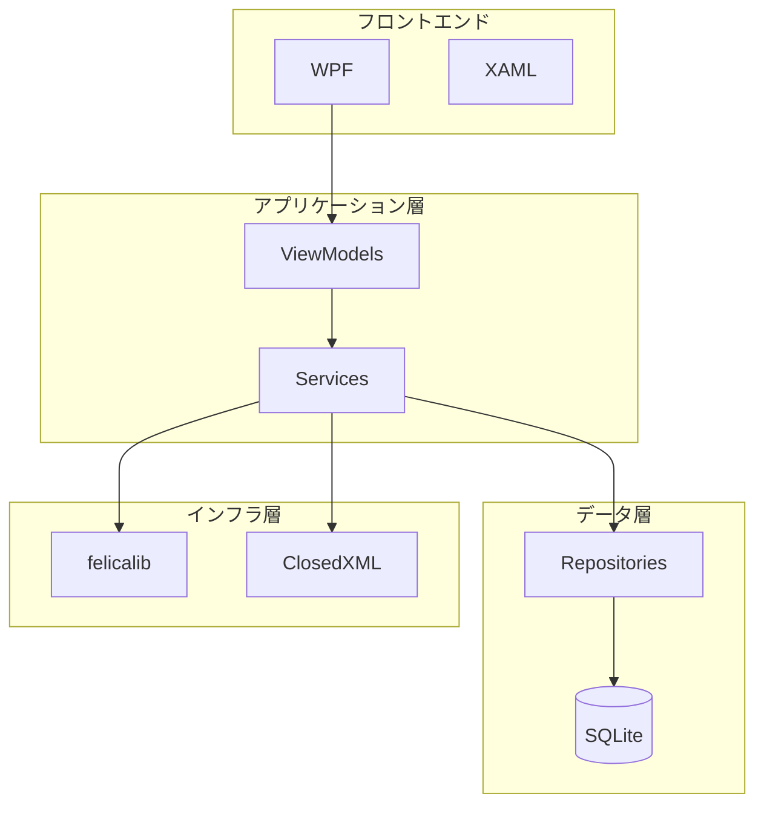
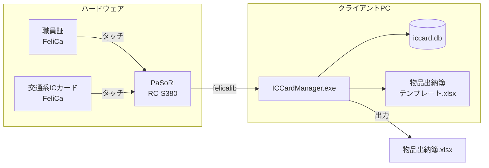
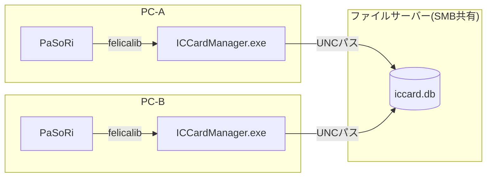

# システム概要設計書

## 0. このドキュメントについて

| 項目 | 内容 |
|------|------|
| **対象読者** | 本システムに初めて触れる人全員(開発者・管理者・運用担当者)。設計書シリーズの最初に読むべきドキュメント |
| **前提知識** | 特になし。業務知識(物品出納簿等)は本文で説明 |
| **このドキュメントで答えられる問い** | ・本システムは何を解決するものか ・誰が、どんな環境で使うのか ・技術的にどう構成されているか ・オフライン/共有フォルダモードとは何か ・どんな制約があるのか |
| **関連ドキュメント** | 詳細設計は `02_DB設計書.md` 以降を参照 |

> **読み方のヒント**: まず §1 で業務背景、§3〜§4 で技術構成、§7 で制約を押さえてください。それだけで他の設計書に進む準備は整います。

---

## 1. システム目的・背景

### 1.1 背景

複数の交通系ICカード(はやかけん、nimoca、SUGOCA等)を複数職員でシェア利用する運用において、以下の課題が存在していました。

- 交通系ICカードの貸出・返却の記録が手作業で煩雑
- 物品出納簿(行政の金券類の出納記録)の作成に多大な工数がかかる
- 利用履歴の追跡が困難
- カード残高の管理が不十分

### 1.2 目的

本システムは、交通系ICカードの貸出・返却管理を自動化し、物品出納簿の作成を効率化することを目的とします。

### 1.3 導入効果

- 貸出・返却記録の自動化による業務効率化
- 交通系ICカードの利用履歴から物品出納簿を自動生成
- 残高不足の早期検知による運用トラブル防止
- 監査対応に必要なデータの自動保存(6年間)

### 1.4 対象読者別ガイド

| あなたの立場 | まず読むべき章 | 次に読むもの |
|---|---|---|
| 開発者(新規参画) | §1〜§4, §7 | `02_DB設計書.md` → `04_機能設計書.md` |
| 開発者(特定機能改修) | §2 主要機能一覧 から該当機能の章 | `04_機能設計書.md` の該当章 → `05_クラス設計書.md` |
| システム管理者 | §1, §4, §5, §7 | `docs/manual/管理者マニュアル.md` |
| 運用担当 | §1.1〜§1.3 のみ | `docs/manual/ユーザーマニュアル.md` |

---

## 2. 主要機能一覧

| No. | 機能名 | 概要 |
|-----|--------|------|
| 1 | 職員証認証 | 職員証(FeliCa)をタッチして操作者を特定 |
| 2 | 交通系ICカード貸出 | 交通系ICカードの貸出を記録 |
| 3 | 交通系ICカード返却 | 交通系ICカードの返却と利用履歴の記録 |
| 4 | 30秒ルール | 誤操作時に30秒以内の再タッチで逆処理を実行 |
| 5 | 職員管理 | 職員情報の登録・編集・削除(論理削除) |
| 6 | カード管理 | 交通系ICカード情報の登録・編集・削除(論理削除) |
| 7 | 月次帳票作成 | 物品出納簿(Excel形式)の自動生成 |
| 8 | 履歴照会 | 過去の利用履歴の検索・閲覧 |
| 9 | バス停入力 | バス利用時のバス停名を手入力 |
| 10 | 設定管理 | 文字サイズ、残高警告閾値等の設定 |

> 各機能の詳細は `04_機能設計書.md` を参照。

---

## 3. 技術スタック

### 3.1 全体構成

```mermaid
graph TB
    subgraph "フロントエンド"
        WPF[WPF]
        XAML[XAML]
    end

    subgraph "アプリケーション層"
        VM[ViewModels]
        SVC[Services]
    end

    subgraph "データ層"
        REPO[Repositories]
        DB[(SQLite)]
    end

    subgraph "インフラ層"
        FELICA[felicalib]
        EXCEL[ClosedXML]
    end

    WPF --> VM
    VM --> SVC
    SVC --> REPO
    REPO --> DB
    SVC --> FELICA
    SVC --> EXCEL
```

### 3.2 採用技術と選定理由

| カテゴリ | 技術 | バージョン | 選定理由 |
|----------|------|------------|---|
| 言語 | C# | 10 | .NET環境での主要言語。既存ノウハウ活用 |
| フレームワーク | .NET Framework | 4.8 | オフライン環境での自己完結配布。インストーラーが小さい |
| UIフレームワーク | WPF | - | Windows デスクトップで実績豊富。XAML + MVVM と相性が良い |
| データベース | SQLite | 3.x | ローカル/共有フォルダ配置可能。サーバ不要でオフライン環境に最適 |
| ICカードリーダー | FelicaLib.DotNet | 1.2.x | PaSoRi 経由で FeliCa 読み取りが可能。軽量 |
| Excel出力 | ClosedXML | 0.102.x | テンプレート(.xlsx)を活用した帳票出力に適する |
| MVVMツールキット | CommunityToolkit.Mvvm | 8.x | `[ObservableProperty]` 等のソース生成で記述量削減 |

---

## 4. システム構成

### 4.1 基本構成(スタンドアロン)

```mermaid
graph LR
    subgraph "クライアントPC"
        APP[ICCardManager.exe]
        DB[(iccard.db)]
        TEMPLATE[物品出納簿<br>テンプレート.xlsx]
    end

    subgraph "ハードウェア"
        PASORI[PaSoRi<br>RC-S380]
        STAFF_CARD[職員証<br>FeliCa]
        IC_CARD[交通系ICカード<br>FeliCa]
    end

    PASORI -->|felicalib| APP
    STAFF_CARD -->|タッチ| PASORI
    IC_CARD -->|タッチ| PASORI
    APP --> DB
    APP --> TEMPLATE
    APP -->|出力| OUTPUT[物品出納簿.xlsx]
```

### 4.2 共有フォルダモード(オプション)

複数PCで同一データベースを共有する運用形態です。SMB共有フォルダ上にDBファイルを配置します。

```mermaid
graph LR
    subgraph "PC-A"
        APP_A[ICCardManager.exe]
        PASORI_A[PaSoRi]
    end

    subgraph "PC-B"
        APP_B[ICCardManager.exe]
        PASORI_B[PaSoRi]
    end

    subgraph "ファイルサーバー(SMB共有)"
        SHARED_DB[(iccard.db)]
    end

    APP_A -->|UNCパス| SHARED_DB
    APP_B -->|UNCパス| SHARED_DB
    PASORI_A -->|felicalib| APP_A
    PASORI_B -->|felicalib| APP_B
```

**要点:**
- `C:\ProgramData\ICCardManager\database_config.txt` にUNCパス(例: `\\server\share\iccard.db`)を指定することで有効化
- インストーラーの「データベースの保存先」ページまたは設定画面(F5)から設定可能
- 最大約20台を想定
- SQLiteのロック機構 + アプリ層リトライで同時アクセスを制御

> **インフラ詳細**は `02_DB設計書.md` §10〜§11 と `04_機能設計書.md` §18 を参照。

### 4.3 ハードウェア構成

| 機器 | 用途 | 備考 |
|------|------|------|
| クライアントPC | アプリケーション実行 | Windows 10/11 |
| PaSoRi (RC-S380) | ICカード読み取り | Sony NFCポートソフトウェア + felicalib 経由 |
| 職員証 | 操作者の認証 | FeliCa対応 |
| 交通系ICカード | 管理対象 | はやかけん/nimoca/SUGOCA等 |

---

## 5. 運用環境要件

### 5.1 ハードウェア要件

| 項目 | 要件 |
|------|------|
| OS | Windows 10/11 |
| CPU | x86/x64プロセッサ |
| メモリ | 4GB以上 |
| ストレージ | 100MB以上の空き容量 |
| USBポート | 1ポート(PaSoRi用) |

### 5.2 ソフトウェア要件

| 項目 | 要件 |
|------|------|
| .NET Runtime | 不要(自己完結型ビルド) |
| ドライバ | PaSoRiドライバ |
| Excel | 出力ファイルの閲覧に必要 |

### 5.3 ネットワーク要件

| 項目 | 要件 |
|------|------|
| インターネット接続 | **不要**(オフライン動作) |
| LAN接続 | 共有フォルダモード使用時のみ必要(SMBアクセス可能なLAN) |

> **重要**: 本システムはインターネット非接続環境で動作することを前提としています。クラウドサービスは利用しません。共有フォルダモードを使用する場合は、SMB共有フォルダにアクセス可能なLAN環境が必要になります。

### 5.4 データ保持要件

| 項目 | 要件 |
|------|------|
| 利用履歴(ledger) | 6年間保持、以降自動削除 |
| 操作ログ(operation_log) | 6年間保持、以降自動削除 |
| バックアップ | 手動(DBファイルのコピー) |

---

## 6. セキュリティ要件

### 6.1 認証

- 職員証(FeliCa)による操作者認証
- パスワード認証は不要(物理カード所持で認証)

### 6.2 データ保護

- データベースファイルはローカル/共有フォルダ保存
- インターネット経由のアクセスなし
- 論理削除による履歴追跡性の確保

### 6.3 監査対応

- 全操作のログ記録(`operation_log`)
- 職員名のスナップショット保存(`ledger.staff_name`)
- 6年間のデータ保持

---

## 7. 制約事項

1. **プラットフォーム**: Windows 10/11対応(クロスプラットフォーム対応不要)
2. **ネットワーク**: スタンドアロン動作が基本(共有フォルダモード時はLAN必要)
3. **同時利用**: スタンドアロンモードではシングルユーザー。共有フォルダモードでは最大約20台のPCから同一DBに接続可能(SQLiteの `busy_timeout` + リトライによる排他制御)
4. **カード履歴**: 最大20件まで取得可能(交通系ICカードの仕様制限)
5. **バス利用**: 駅名が取得できないため、手入力が必要

---

## 付録A. 関連ドキュメント

| ドキュメント | 内容 |
|---|---|
| `02_DB設計書.md` | データベーススキーマ・論理削除方針・共有フォルダモードインフラ |
| `03_画面設計書.md` | 画面遷移・各画面の仕様 |
| `04_機能設計書.md` | 業務ロジック・機能仕様 |
| `05_クラス設計書.md` | クラス構成・DI設計 |
| `06_シーケンス図.md` | 主要処理の時系列 |
| `07_テスト設計書.md` | テスト計画・テストケース |
| `docs/manual/ユーザーマニュアル.md` | 一般利用者向け操作マニュアル |
| `docs/manual/管理者マニュアル.md` | 管理者向け運用マニュアル |
| `docs/manual/開発者ガイド.md` | 開発・保守ガイド |
