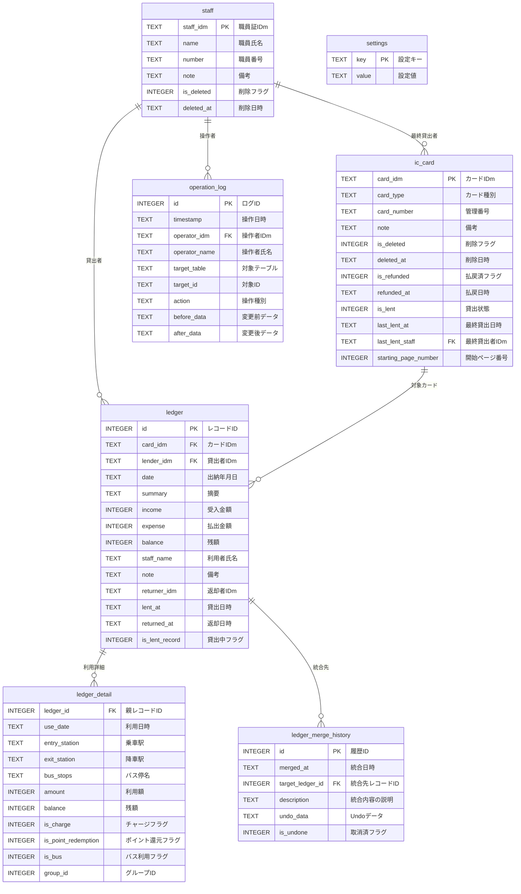

# DB設計書

## 1. ER図



---

## 2. テーブル定義

### 2.1 staff（職員）

職員情報を管理するマスタテーブル。

| カラム名 | 型 | NULL | デフォルト | 説明 |
|----------|-----|------|------------|------|
| staff_idm | TEXT | NO | - | 職員証IDm（主キー、16進数16文字） |
| name | TEXT | NO | - | 職員氏名 |
| number | TEXT | YES | NULL | 職員番号 |
| note | TEXT | YES | NULL | 備考 |
| is_deleted | INTEGER | NO | 0 | 削除フラグ（0:有効, 1:削除済） |
| deleted_at | TEXT | YES | NULL | 削除日時（ISO 8601形式） |

**インデックス:**
- `idx_staff_deleted` ON staff(is_deleted)

### 2.2 ic_card（交通系ICカード）

交通系ICカード情報を管理するマスタテーブル。

| カラム名 | 型 | NULL | デフォルト | 説明 |
|----------|-----|------|------------|------|
| card_idm | TEXT | NO | - | カードIDm（主キー、16進数16文字） |
| card_type | TEXT | NO | - | カード種別（はやかけん/nimoca等） |
| card_number | TEXT | NO | - | 管理番号（通し番号） |
| note | TEXT | YES | NULL | 備考 |
| is_deleted | INTEGER | NO | 0 | 削除フラグ（0:有効, 1:削除済） |
| deleted_at | TEXT | YES | NULL | 削除日時（ISO 8601形式） |
| is_refunded | INTEGER | NO | 0 | 払戻済フラグ（0:通常, 1:払戻済）（Issue #530） |
| refunded_at | TEXT | YES | NULL | 払戻日時（ISO 8601形式）（Issue #530） |
| is_lent | INTEGER | NO | 0 | 貸出状態（0:返却済, 1:貸出中） |
| last_lent_at | TEXT | YES | NULL | 最終貸出日時（ISO 8601形式） |
| last_lent_staff | TEXT | YES | NULL | 最終貸出者IDm（FK→staff） |
| starting_page_number | INTEGER | NO | 1 | 帳票の開始ページ番号（Issue #510） |

**インデックス:**
- `idx_card_deleted` ON ic_card(is_deleted)
- `idx_card_lent_deleted` ON ic_card(is_lent, is_deleted)

**外部キー:**
- last_lent_staff → staff(staff_idm)

### 2.3 ledger（利用履歴概要）

物品出納簿の1行に対応するトランザクションテーブル。

| カラム名 | 型 | NULL | デフォルト | 説明 |
|----------|-----|------|------------|------|
| id | INTEGER | NO | 自動採番 | レコードID（主キー） |
| card_idm | TEXT | NO | - | カードIDm（FK→ic_card） |
| lender_idm | TEXT | YES | NULL | 貸出者IDm（FK→staff） |
| date | TEXT | NO | - | 出納年月日（YYYY-MM-DD） |
| summary | TEXT | NO | - | 摘要 |
| income | INTEGER | NO | 0 | 受入金額（チャージ額） |
| expense | INTEGER | NO | 0 | 払出金額（利用額） |
| balance | INTEGER | NO | - | 残額 |
| staff_name | TEXT | YES | NULL | 利用者氏名（スナップショット） |
| note | TEXT | YES | NULL | 備考 |
| returner_idm | TEXT | YES | NULL | 返却者IDm |
| lent_at | TEXT | YES | NULL | 貸出日時（ISO 8601形式） |
| returned_at | TEXT | YES | NULL | 返却日時（ISO 8601形式） |
| is_lent_record | INTEGER | NO | 0 | 貸出中フラグ（0:通常, 1:貸出中） |

**インデックス:**
- `idx_ledger_date` ON ledger(date)
- `idx_ledger_summary` ON ledger(summary)
- `idx_ledger_card_date` ON ledger(card_idm, date)
- `idx_ledger_lender` ON ledger(lender_idm)

**外部キー:**
- card_idm → ic_card(card_idm)
- lender_idm → staff(staff_idm)

### 2.4 ledger_detail（利用履歴詳細）

ICカードの個別利用記録を保存するテーブル。

| カラム名 | 型 | NULL | デフォルト | 説明 |
|----------|-----|------|------------|------|
| ledger_id | INTEGER | NO | - | 親レコードID（FK→ledger） |
| use_date | TEXT | YES | NULL | 利用日時（ISO 8601形式） |
| entry_station | TEXT | YES | NULL | 乗車駅 |
| exit_station | TEXT | YES | NULL | 降車駅 |
| bus_stops | TEXT | YES | NULL | バス停名（手入力） |
| amount | INTEGER | YES | NULL | 利用額/チャージ額 |
| balance | INTEGER | YES | NULL | 残額 |
| is_charge | INTEGER | NO | 0 | チャージフラグ（0:利用, 1:チャージ） |
| is_point_redemption | INTEGER | NO | 0 | ポイント還元フラグ（0:通常, 1:ポイント還元） |
| is_bus | INTEGER | NO | 0 | バス利用フラグ（0:鉄道, 1:バス） |
| group_id | INTEGER | YES | NULL | グループID（乗り継ぎ統合用、NULLは自動判定）（Issue #484） |

**インデックス:**
- `idx_detail_ledger` ON ledger_detail(ledger_id)
- `idx_detail_bus` ON ledger_detail(is_bus)

**外部キー:**
- ledger_id → ledger(id) ON DELETE CASCADE

**乗り継ぎ統合機能（Issue #484）:**

`group_id` は複数の利用詳細を1つの乗り継ぎとして摘要に統合するためのカラム。

- 同じ `group_id` を持つ詳細レコードは、1つの乗り継ぎ区間として `SummaryGenerator` が摘要を生成する（例: 「鉄道（A駅～C駅）」）
- `group_id` が NULL の場合は従来通り自動判定（往復パターン・乗継パターンの検出）を行う
- ユーザーが履歴詳細画面から手動で統合・分割を操作すると `group_id` が設定される

**シーケンス番号（Issue #548）:**

モデルクラス `LedgerDetail` には `SequenceNumber` プロパティが存在するが、これはDBの物理カラムではなくSQLiteの `rowid` から取得される仮想値。チャージが間に入っても正しい時系列順序を保持するために使用される。

### 2.5 operation_log（操作ログ）

監査用の操作記録テーブル。

| カラム名 | 型 | NULL | デフォルト | 説明 |
|----------|-----|------|------------|------|
| id | INTEGER | NO | 自動採番 | ログID（主キー） |
| timestamp | TEXT | NO | CURRENT_TIMESTAMP | 操作日時（ISO 8601形式） |
| operator_idm | TEXT | NO | - | 操作者IDm |
| operator_name | TEXT | NO | - | 操作者氏名 |
| target_table | TEXT | YES | NULL | 対象テーブル名 |
| target_id | TEXT | YES | NULL | 対象レコードID |
| action | TEXT | YES | NULL | 操作種別（INSERT/UPDATE/DELETE等） |
| before_data | TEXT | YES | NULL | 変更前データ（JSON） |
| after_data | TEXT | YES | NULL | 変更後データ（JSON） |

**インデックス:**
- `idx_log_timestamp` ON operation_log(timestamp)

### 2.6 ledger_merge_history（統合履歴）

履歴統合操作の記録を保存するテーブル（Issue #548）。統合のundo（取り消し）機能を実現するため、統合時の操作内容とundo用データをJSON形式で保持する。

| カラム名 | 型 | NULL | デフォルト | 説明 |
|----------|-----|------|------------|------|
| id | INTEGER | NO | 自動採番 | 履歴ID（主キー） |
| merged_at | TEXT | NO | CURRENT_TIMESTAMP | 統合日時（ISO 8601形式） |
| target_ledger_id | INTEGER | NO | - | 統合先のledger ID |
| description | TEXT | NO | - | 統合内容の説明（表示用） |
| undo_data | TEXT | NO | - | Undo用データ（JSON形式） |
| is_undone | INTEGER | NO | 0 | 取消済フラグ（0:有効, 1:取消済） |

**インデックス:**
- `idx_merge_history_target` ON ledger_merge_history(target_ledger_id)

**undo_dataの構造:**

`undo_data` には統合前の状態を復元するために必要な情報がJSON形式で格納される。統合のundo操作時にこのデータを読み込み、統合元のledgerレコードを再作成し、detailのledger_idを元に戻す。

### 2.7 settings（設定）

アプリケーション設定を保存するテーブル。

| カラム名 | 型 | NULL | デフォルト | 説明 |
|----------|-----|------|------------|------|
| key | TEXT | NO | - | 設定キー（主キー） |
| value | TEXT | YES | NULL | 設定値 |

**初期データ:**
| key | value | 説明 |
|-----|-------|------|
| warning_balance | 10000 | 残高警告閾値（円） |
| font_size | medium | 文字サイズ（small/medium/large/extra_large） |

---

## 3. インデックス設計

### 3.1 インデックス一覧

| テーブル | インデックス名 | カラム | 用途 |
|----------|----------------|--------|------|
| staff | idx_staff_deleted | is_deleted | 有効な職員の検索 |
| ic_card | idx_card_deleted | is_deleted | 有効なカードの検索 |
| ledger | idx_ledger_date | date | 日付での検索 |
| ledger | idx_ledger_summary | summary | 摘要での検索 |
| ledger | idx_ledger_card_date | card_idm, date | カード×日付の複合検索 |
| ledger | idx_ledger_lender | lender_idm | 貸出者での検索 |
| ledger_detail | idx_detail_ledger | ledger_id | 親レコードの紐付け |
| ledger_detail | idx_detail_bus | is_bus | バス利用の検索 |
| ic_card | idx_card_lent_deleted | is_lent, is_deleted | 貸出状態×削除フラグの複合検索 |
| ledger | idx_ledger_card_id | card_idm, id DESC | カード別の最新履歴取得 |
| ledger_merge_history | idx_merge_history_target | target_ledger_id | 統合先レコードの検索 |
| operation_log | idx_log_timestamp | timestamp | 時系列での検索 |

---

## 4. 論理削除の方針

### 4.1 削除方式の選択

| テーブル | 削除方式 | 理由 |
|----------|----------|------|
| staff | 論理削除 | 過去の履歴参照時に氏名を表示するため |
| ic_card | 論理削除 | 過去の履歴参照時にカード情報を表示するため |
| ledger | 物理削除 | 6年経過後に自動削除（監査対応期間経過後） |
| ledger_detail | 物理削除 | 親レコード（ledger）に連動してCASCADE削除 |
| ledger_merge_history | 削除しない | undo操作のため永続保存（is_undoneで取消済を管理） |
| operation_log | 削除しない | 監査証跡として永続保存 |
| settings | 物理削除 | マスタデータとして管理 |

### 4.2 論理削除の実装

```sql
-- 職員の論理削除
UPDATE staff
SET is_deleted = 1, deleted_at = datetime('now')
WHERE staff_idm = ?;

-- 有効な職員のみ取得
SELECT * FROM staff WHERE is_deleted = 0;

-- 削除済みを含む全件取得（履歴参照用）
SELECT * FROM staff;
```

---

## 5. データ保持期間

### 5.1 保持期間ルール

| データ種別 | 保持期間 | 削除タイミング |
|------------|----------|----------------|
| 利用履歴（ledger） | 6年間 | アプリ起動時に自動削除 |
| 利用詳細（ledger_detail） | 6年間 | 親レコードに連動 |
| 操作ログ（operation_log） | 無期限 | 削除しない |
| マスタ（staff, ic_card） | 無期限 | 論理削除のみ |

### 5.2 自動削除の実装

```sql
-- 6年経過したledgerを削除
DELETE FROM ledger WHERE date < date('now', '-6 years');
```

> アプリケーション起動時に`DbContext.CleanupOldData()`で実行される。

---

## 6. 日付型の取り扱い

### 6.1 保存形式

- **形式**: TEXT型（ISO 8601形式）
- **日付のみ**: `YYYY-MM-DD`（例: 2024-04-01）
- **日時**: `YYYY-MM-DD HH:MM:SS`（例: 2024-04-01 09:30:00）

### 6.2 日付型を選択した理由

1. SQLiteには日付型がないため、TEXT型で統一
2. ISO 8601形式は文字列比較でソートが可能
3. SQLiteの日付関数（date(), datetime()等）と互換性がある
4. 人間が読みやすい形式

### 6.3 和暦変換

- データベースには西暦で保存
- 表示時に`WarekiConverter`で和暦に変換
- 帳票出力時も和暦に変換

---

## 7. 外部キー制約

### 7.1 有効化

```sql
PRAGMA foreign_keys = ON;
```

> DbContext.GetConnection()で接続時に必ず実行される。

### 7.2 制約一覧

| 子テーブル | 親テーブル | 制約 |
|------------|------------|------|
| ic_card.last_lent_staff | staff.staff_idm | REFERENCES |
| ledger.card_idm | ic_card.card_idm | REFERENCES |
| ledger.lender_idm | staff.staff_idm | REFERENCES |
| ledger_detail.ledger_id | ledger.id | ON DELETE CASCADE |

---

## 8. データベースファイル

### 8.1 保存場所

```
%PROGRAMDATA%\ICCardManager\iccard.db
```

例: `C:\ProgramData\ICCardManager\iccard.db`

> **設計理由**: CommonApplicationData（`%PROGRAMDATA%`）を使用することで、異なるWindowsユーザーがログインしても同じデータベースにアクセスでき、複数職員での共有利用に対応する。

### 8.2 バックアップ

- 自動バックアップ機能なし
- 手動でDBファイルをコピーしてバックアップ
- VACUUMコマンドでファイルサイズを最適化可能
