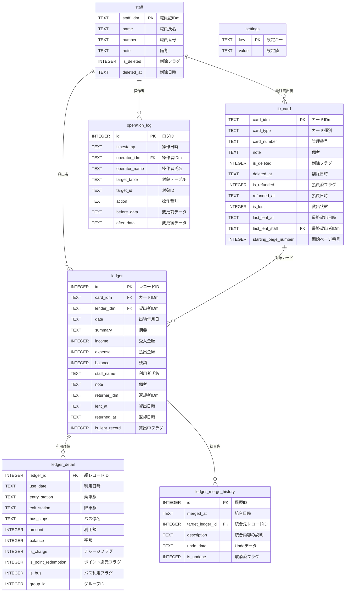

# DB設計書

## 0. このドキュメントについて

| 項目 | 内容 |
|------|------|
| **対象読者** | 本システムの開発者・保守担当者。SQLとリレーショナルDBの基本知識があることを前提とします |
| **前提知識** | `01_システム概要設計書.md` を一読していること。業務用語(貸出/返却/物品出納簿/IDm 等)については `04_機能設計書.md` を参照 |
| **このドキュメントで答えられる問い** | ・どのテーブルに何が入っているか<br>・どのテーブルが論理削除でどれが物理削除か、その理由<br>・スキーマがこれまでどう進化してきたか(マイグレーション履歴)<br>・共有フォルダモード時にどう同時アクセス制御しているか |
| **関連ドキュメント** | `04_機能設計書.md`(業務ロジック) / `05_クラス設計書.md`(Data層クラス) / `08_ドキュメント設計書.md` |

> **読み方のヒント**: スキーマ全体像だけ掴みたい人は §1〜§3 を読めば十分です。インフラ寄りの話(同時アクセス制御・バックアップ等)は §10〜§11 にまとめてあるので、必要になった時に参照してください。

---

## 1. はじめに ─ 設計の前提とコアテーブル

### 1.1 設計の3大前提

本DB設計は、以下3つの業務的・運用的前提から導かれています。スキーマの妥当性を判断する際の出発点になります。

1. **「物品出納簿」を再現する必要がある** — 本システムは行政の物品出納簿(現金出納簿に類する帳簿)をデジタル化したもの。1行=1取引(チャージ/利用)で、受入・払出・残高の3列を持ちます。これが `ledger` テーブルの形を決めています。
2. **6年間の監査保存義務がある** — 利用履歴と操作ログは6年間保存する必要があり、それを過ぎたら速やかに削除します。これが `ledger` / `operation_log` を**物理削除(自動)**にしている理由です。
3. **過去履歴の表示時に職員名・カード情報が必要** — 6年経った履歴を表示する時、その時点で在籍していた職員や登録されていたカードの情報を表示できなければなりません。これが `staff` / `ic_card` を**論理削除**にしている理由です。

### 1.2 コアテーブル クイックツアー

スキーマには8つのテーブルがありますが、業務の中心となるのは以下の3つです。これらを理解すれば残りは付随的なものとして読めます。

```
┌──────────┐  貸し出す  ┌──────────┐  記録する   ┌──────────┐
│  staff   │──────────▶│ ic_card  │───────────▶│  ledger  │
│ (職員)   │            │(交通系IC)│             │ (履歴)   │
└──────────┘            └──────────┘             └──────────┘
   論理削除                論理削除                物理削除(6年)
```

| テーブル | 役割(1行で言うと) | 業務上の重要度 | 削除方式 |
|---|---|:---:|---|
| **staff** | 職員のマスタ。職員証IDmで識別。 | ★★★ | 論理削除 |
| **ic_card** | 交通系ICカードのマスタ。カードIDmで識別し、現在の貸出状態 (`is_lent`) を保持。 | ★★★ | 論理削除 |
| **ledger** | 物品出納簿の1行に対応する利用履歴。受入(チャージ)・払出(利用)・残額を持つ。 | ★★★ | 物理削除(6年後) |

その他のテーブルの位置づけ:

| テーブル | 位置づけ | 重要度 |
|---|---|:---:|
| ledger_detail | `ledger` 1行の内訳(乗車駅・降車駅・金額等)を保持する子テーブル | ★★ |
| ledger_merge_history | 履歴統合操作のundo用記録 (Issue #548) | ★ |
| operation_log | 監査用の操作ログ。`before_data` / `after_data` をJSONで保持 | ★ |
| settings | アプリ設定 (key-value) | ★ |

---

## 2. ER図


```mermaid
erDiagram
    staff ||--o{ ledger : "貸出者"
    staff ||--o{ ic_card : "最終貸出者"
    ic_card ||--o{ ledger : "対象カード"
    ledger ||--o{ ledger_detail : "利用詳細"
    ledger ||--o{ ledger_merge_history : "統合先"
    staff ||--o{ operation_log : "操作者"

    staff {
        TEXT staff_idm PK "職員証IDm"
        TEXT name "職員氏名"
        TEXT number "職員番号"
        TEXT note "備考"
        INTEGER is_deleted "削除フラグ"
        TEXT deleted_at "削除日時"
    }

    ic_card {
        TEXT card_idm PK "カードIDm"
        TEXT card_type "カード種別"
        TEXT card_number "管理番号"
        TEXT note "備考"
        INTEGER is_deleted "削除フラグ"
        TEXT deleted_at "削除日時"
        INTEGER is_refunded "払戻済フラグ"
        TEXT refunded_at "払戻日時"
        INTEGER is_lent "貸出状態"
        TEXT last_lent_at "最終貸出日時"
        TEXT last_lent_staff FK "最終貸出者IDm"
        INTEGER starting_page_number "開始ページ番号"
    }

    ledger {
        INTEGER id PK "レコードID"
        TEXT card_idm FK "カードIDm"
        TEXT lender_idm FK "貸出者IDm"
        TEXT date "出納年月日"
        TEXT summary "摘要"
        INTEGER income "受入金額"
        INTEGER expense "払出金額"
        INTEGER balance "残額"
        TEXT staff_name "利用者氏名"
        TEXT note "備考"
        TEXT returner_idm "返却者IDm"
        TEXT lent_at "貸出日時"
        TEXT returned_at "返却日時"
        INTEGER is_lent_record "貸出中フラグ"
    }

    ledger_detail {
        INTEGER ledger_id FK "親レコードID"
        TEXT use_date "利用日時"
        TEXT entry_station "乗車駅"
        TEXT exit_station "降車駅"
        TEXT bus_stops "バス停名"
        INTEGER amount "利用額"
        INTEGER balance "残額"
        INTEGER is_charge "チャージフラグ"
        INTEGER is_point_redemption "ポイント還元フラグ"
        INTEGER is_bus "バス利用フラグ"
        INTEGER group_id "グループID"
    }

    operation_log {
        INTEGER id PK "ログID"
        TEXT timestamp "操作日時"
        TEXT operator_idm FK "操作者IDm"
        TEXT operator_name "操作者氏名"
        TEXT target_table "対象テーブル"
        TEXT target_id "対象ID"
        TEXT action "操作種別"
        TEXT before_data "変更前データ"
        TEXT after_data "変更後データ"
    }

    ledger_merge_history {
        INTEGER id PK "履歴ID"
        TEXT merged_at "統合日時"
        INTEGER target_ledger_id FK "統合先レコードID"
        TEXT description "統合内容の説明"
        TEXT undo_data "Undoデータ"
        INTEGER is_undone "取消済フラグ"
    }

    settings {
        TEXT key PK "設定キー"
        TEXT value "設定値"
    }
```

> **図の読み方**: `||--o{` は「左1対右多」の関係を表します。例えば `staff ||--o{ ledger` は「1人の職員が複数のledger行を持ちうる(=複数回貸し出しを行いうる)」を意味します。

---

## 3. テーブル定義

各テーブルの定義です。重要度バッジ(★)と1行サマリを冒頭に付けています。バッジは「業務理解上どれだけ中心的か」の目安です。

### 3.1 staff(職員)  ★★★

> 職員のマスタテーブル。職員証IDmを主キーとし、論理削除で履歴上の職員名表示を維持する。

| カラム名 | 型 | NULL | デフォルト | 説明 |
|----------|-----|------|------------|------|
| staff_idm | TEXT | NO | - | 職員証IDm(主キー、16進数16文字) |
| name | TEXT | NO | - | 職員氏名 |
| number | TEXT | YES | NULL | 職員番号 |
| note | TEXT | YES | NULL | 備考 |
| is_deleted | INTEGER | NO | 0 | 削除フラグ(0:有効, 1:削除済) |
| deleted_at | TEXT | YES | NULL | 削除日時(ISO 8601形式) |

**インデックス:**
- `idx_staff_deleted` ON staff(is_deleted)

> **なぜ論理削除か** — 6年前の履歴を表示する時、その時点で在籍していた職員の氏名を画面に出す必要があるためです。物理削除すると過去履歴の `lender_idm` が宙に浮きます。

### 3.2 ic_card(交通系ICカード)  ★★★

> 交通系ICカードのマスタ。現在の貸出状態(`is_lent`)を持つ"動的な"マスタである点に注意。

| カラム名 | 型 | NULL | デフォルト | 説明 |
|----------|-----|------|------------|------|
| card_idm | TEXT | NO | - | カードIDm(主キー、16進数16文字) |
| card_type | TEXT | NO | - | カード種別(はやかけん/nimoca等) |
| card_number | TEXT | NO | - | 管理番号(通し番号) |
| note | TEXT | YES | NULL | 備考 |
| is_deleted | INTEGER | NO | 0 | 削除フラグ(0:有効, 1:削除済) |
| deleted_at | TEXT | YES | NULL | 削除日時(ISO 8601形式) |
| is_refunded | INTEGER | NO | 0 | 払戻済フラグ(0:通常, 1:払戻済)(Issue #530) |
| refunded_at | TEXT | YES | NULL | 払戻日時(ISO 8601形式)(Issue #530) |
| is_lent | INTEGER | NO | 0 | 貸出状態(0:返却済, 1:貸出中) |
| last_lent_at | TEXT | YES | NULL | 最終貸出日時(ISO 8601形式) |
| last_lent_staff | TEXT | YES | NULL | 最終貸出者IDm(FK→staff) |
| starting_page_number | INTEGER | NO | 1 | 帳票の開始ページ番号(Issue #510) |

**インデックス:**
- `idx_card_deleted` ON ic_card(is_deleted)
- `idx_card_lent_deleted` ON ic_card(is_lent, is_deleted)
- `idx_card_type_number_active` UNIQUE ON ic_card(card_type, card_number) WHERE is_deleted = 0 — 有効カード間での種別＋番号の重複を防止

**外部キー:**
- last_lent_staff → staff(staff_idm)

> **設計上の特徴** — 通常マスタテーブルは静的ですが、`ic_card` は `is_lent` / `last_lent_at` 等の動的状態を持ちます。これは「カードの現在の貸出状態は1か所(=このテーブル)で唯一の真実とする」ためで、`ledger` を集計しなくても `is_lent` を見るだけで現状が分かるようにする設計判断です。

### 3.3 ledger(利用履歴概要)  ★★★

> 物品出納簿の1行に対応するトランザクションテーブル。1取引=1行(チャージと利用は別行)。

| カラム名 | 型 | NULL | デフォルト | 説明 |
|----------|-----|------|------------|------|
| id | INTEGER | NO | 自動採番 | レコードID(主キー) |
| card_idm | TEXT | NO | - | カードIDm(FK→ic_card) |
| lender_idm | TEXT | YES | NULL | 貸出者IDm(FK→staff) |
| date | TEXT | NO | - | 出納年月日(YYYY-MM-DD) |
| summary | TEXT | NO | - | 摘要 |
| income | INTEGER | NO | 0 | 受入金額(チャージ額) |
| expense | INTEGER | NO | 0 | 払出金額(利用額) |
| balance | INTEGER | NO | - | 残額 |
| staff_name | TEXT | YES | NULL | 利用者氏名(スナップショット) |
| note | TEXT | YES | NULL | 備考 |
| returner_idm | TEXT | YES | NULL | 返却者IDm |
| lent_at | TEXT | YES | NULL | 貸出日時(ISO 8601形式) |
| returned_at | TEXT | YES | NULL | 返却日時(ISO 8601形式) |
| is_lent_record | INTEGER | NO | 0 | 貸出中フラグ(0:通常, 1:貸出中) |

**インデックス:**
- `idx_ledger_date` ON ledger(date)
- `idx_ledger_summary` ON ledger(summary)
- `idx_ledger_card_date` ON ledger(card_idm, date)
- `idx_ledger_lender` ON ledger(lender_idm)

**外部キー:**
- card_idm → ic_card(card_idm)
- lender_idm → staff(staff_idm)

> **`staff_name` の冗長保存について** — `lender_idm` から `staff` テーブルを引けば氏名は取得できますが、敢えて `staff_name` をスナップショットとして保存しています。これは帳票出力時に当時の氏名(改姓前など)を保持するため、および職員レコードが完全削除された場合の安全装置です。
>
> **摘要(`summary`)の生成ルール**は `04_機能設計書.md` の「摘要文字列生成ルール」を参照してください。

### 3.4 ledger_detail(利用履歴詳細)  ★★

> ICカードの個別利用記録を保存するテーブル。`ledger` 1行の内訳。

| カラム名 | 型 | NULL | デフォルト | 説明 |
|----------|-----|------|------------|------|
| ledger_id | INTEGER | NO | - | 親レコードID(FK→ledger) |
| use_date | TEXT | YES | NULL | 利用日時(ISO 8601形式) |
| entry_station | TEXT | YES | NULL | 乗車駅 |
| exit_station | TEXT | YES | NULL | 降車駅 |
| bus_stops | TEXT | YES | NULL | バス停名(手入力) |
| amount | INTEGER | YES | NULL | 利用額/チャージ額 |
| balance | INTEGER | YES | NULL | 残額 |
| is_charge | INTEGER | NO | 0 | チャージフラグ(0:利用, 1:チャージ) |
| is_point_redemption | INTEGER | NO | 0 | ポイント還元フラグ(0:通常, 1:ポイント還元) |
| is_bus | INTEGER | NO | 0 | バス利用フラグ(0:鉄道, 1:バス) |
| group_id | INTEGER | YES | NULL | グループID(乗り継ぎ統合用、NULLは自動判定)(Issue #484) |

**インデックス:**
- `idx_detail_ledger` ON ledger_detail(ledger_id)
- `idx_detail_bus` ON ledger_detail(is_bus)

**外部キー:**
- ledger_id → ledger(id) ON DELETE CASCADE

#### 乗り継ぎ統合機能(Issue #484)

`group_id` は複数の利用詳細を1つの乗り継ぎとして摘要に統合するためのカラムです。

- 同じ `group_id` を持つ詳細レコードは、1つの乗り継ぎ区間として `SummaryGenerator` が摘要を生成します(例: 「鉄道(A駅～C駅)」)
- `group_id` が NULL の場合は従来通り自動判定(往復パターン・乗継パターンの検出)を行います
- ユーザーが履歴詳細画面から手動で統合・分割を操作すると `group_id` が設定されます

#### シーケンス番号(Issue #548)

モデルクラス `LedgerDetail` には `SequenceNumber` プロパティが存在しますが、これはDBの物理カラムではなく **SQLiteの `rowid` から取得される仮想値**です。チャージが間に入っても正しい時系列順序を保持するために使用されます。

> **なぜ `is_bus` を保持するか** — バス利用は「entry_station と exit_station が空欄かつチャージでもポイント還元でもない」という消去法で判定できますが、それを毎回計算するとクエリが複雑になります。判定結果を `is_bus` カラムに固定化することで `idx_detail_bus` インデックスでの絞り込みが可能になります。判定ロジックの詳細は `04_機能設計書.md` の「バス利用判別ロジック」参照。

### 3.5 operation_log(操作ログ)  ★

> 監査用の操作記録テーブル。変更前後の状態をJSONで保存。6年経過後に自動削除。

| カラム名 | 型 | NULL | デフォルト | 説明 |
|----------|-----|------|------------|------|
| id | INTEGER | NO | 自動採番 | ログID(主キー) |
| timestamp | TEXT | NO | CURRENT_TIMESTAMP | 操作日時(ISO 8601形式) |
| operator_idm | TEXT | NO | - | 操作者IDm |
| operator_name | TEXT | NO | - | 操作者氏名 |
| target_table | TEXT | YES | NULL | 対象テーブル名 |
| target_id | TEXT | YES | NULL | 対象レコードID |
| action | TEXT | YES | NULL | 操作種別(INSERT/UPDATE/DELETE等) |
| before_data | TEXT | YES | NULL | 変更前データ(JSON) |
| after_data | TEXT | YES | NULL | 変更後データ(JSON) |

**インデックス:**
- `idx_log_timestamp` ON operation_log(timestamp)

#### before_data / after_data の JSON フォーマット

`before_data` と `after_data` は、対象テーブルの該当行を表す **平坦なキーバリューJSONオブジェクト** として保存します。`target_table` のカラム名をキーとし、値はDB上の表現(文字列・数値・null)をそのまま埋め込みます。INSERT 時の `before_data` と DELETE 時の `after_data` は `null` とします。

**例: ic_card テーブルの UPDATE**

```json
// before_data
{
  "card_idm": "0114B07012345678",
  "card_type": "はやかけん",
  "card_number": "001",
  "note": "",
  "is_lent": 0,
  "last_lent_at": null,
  "last_lent_staff": null
}
// after_data
{
  "card_idm": "0114B07012345678",
  "card_type": "はやかけん",
  "card_number": "001",
  "note": "更新後コメント",
  "is_lent": 1,
  "last_lent_at": "2026-04-07 09:30:00",
  "last_lent_staff": "0114B07087654321"
}
```

シリアライズには `System.Text.Json` を使用し、`null` フィールドも省略せず出力します(差分比較を容易にするため)。

### 3.6 ledger_merge_history(統合履歴)  ★

> 履歴統合操作のundo記録(Issue #548)。統合前の状態を JSON で保持し取り消し可能にする。

| カラム名 | 型 | NULL | デフォルト | 説明 |
|----------|-----|------|------------|------|
| id | INTEGER | NO | 自動採番 | 履歴ID(主キー) |
| merged_at | TEXT | NO | CURRENT_TIMESTAMP | 統合日時(ISO 8601形式) |
| target_ledger_id | INTEGER | NO | - | 統合先のledger ID |
| description | TEXT | NO | - | 統合内容の説明(表示用) |
| undo_data | TEXT | NO | - | Undo用データ(JSON形式) |
| is_undone | INTEGER | NO | 0 | 取消済フラグ(0:有効, 1:取消済) |

**インデックス:**
- `idx_merge_history_target` ON ledger_merge_history(target_ledger_id)

**undo_dataの構造:**

`undo_data` には統合前の状態を復元するために必要な情報がJSON形式で格納されます。統合のundo操作時にこのデータを読み込み、統合元のledgerレコードを再作成し、detailのledger_idを元に戻します。

> **このテーブルだけ削除しない** — 他の履歴系テーブルが6年で物理削除されるのに対し、このテーブルは削除しません。「いつでもundoできる」という保証を維持するため、`is_undone` フラグでの状態管理のみとしています。

### 3.7 settings(設定)  ★

> アプリケーション設定を保存する key-value テーブル。

| カラム名 | 型 | NULL | デフォルト | 説明 |
|----------|-----|------|------------|------|
| key | TEXT | NO | - | 設定キー(主キー) |
| value | TEXT | YES | NULL | 設定値 |

**初期データ:**
| key | value | 説明 |
|-----|-------|------|
| warning_balance | 10000 | 残高警告閾値(円) |
| font_size | medium | 文字サイズ(small/medium/large/extra_large) |

---

## 4. マイグレーション履歴

> 旧版では「2.8 マイグレーション履歴」としてテーブル定義の最後尾に置いていましたが、スキーマ進化の歴史はDB理解上の独立した重要トピックなので、独立章に昇格しました。

スキーマ変更は `src/ICCardManager/Data/Migrations/` の連番マイグレーションクラスとして実装されており、`MigrationRunner` がアプリ起動時に未適用分を順次実行します。

| No. | クラス | 概要 | 関連Issue |
|-----|--------|------|-----------|
| 001 | Migration_001_Initial | 初期スキーマ(staff / ic_card / ledger / ledger_detail / operation_log / settings)作成 | - |
| 002 | Migration_002_AddPointRedemption | `ledger_detail.is_point_redemption` カラム追加 | - |
| 003 | Migration_003_AddTripGroupId | `ledger_detail.group_id` カラム追加(乗継統合) | #484 |
| 004 | Migration_004_AddPerformanceIndexes | パフォーマンス向上用のインデックス追加(`idx_card_lent_deleted`, `idx_ledger_card_id` など) | - |
| 005 | Migration_005_AddStartingPageNumber | `ic_card.starting_page_number` カラム追加(帳票開始ページ番号) | #510 |
| 006 | Migration_006_AddRefundedStatus | `ic_card.is_refunded` / `refunded_at` カラム追加(払戻管理) | #530 |
| 007 | Migration_007_AddMergeHistory | `ledger_merge_history` テーブル追加(統合履歴とundo) | #548 |
| 008 | Migration_008_AddCardTypeNumberUniqueIndex | `idx_card_type_number_active` UNIQUE 部分インデックス追加 | - |

> **新規マイグレーションを追加した際のチェックリスト**:
> 1. 本表に1行追加する
> 2. 該当テーブル定義(§3)のカラム説明に「(マイグレーション番号 / Issue番号)」を追記する
> 3. `MigrationRunner` のテストを追加する(`07_テスト設計書.md` 参照)

---

## 5. インデックス設計

### 5.1 インデックス一覧

| テーブル | インデックス名 | カラム | 用途 |
|----------|----------------|--------|------|
| staff | idx_staff_deleted | is_deleted | 有効な職員の検索 |
| ic_card | idx_card_deleted | is_deleted | 有効なカードの検索 |
| ic_card | idx_card_type_number_active | card_type, card_number (WHERE is_deleted = 0) | 種別＋番号の重複防止(UNIQUE、部分インデックス) |
| ic_card | idx_card_lent_deleted | is_lent, is_deleted | 貸出状態×削除フラグの複合検索 |
| ledger | idx_ledger_date | date | 日付での検索 |
| ledger | idx_ledger_summary | summary | 摘要での検索 |
| ledger | idx_ledger_card_date | card_idm, date | カード×日付の複合検索 |
| ledger | idx_ledger_lender | lender_idm | 貸出者での検索 |
| ledger | idx_ledger_card_id | card_idm, id DESC | カード別の最新履歴取得 |
| ledger_detail | idx_detail_ledger | ledger_id | 親レコードの紐付け |
| ledger_detail | idx_detail_bus | is_bus | バス利用の検索 |
| ledger_merge_history | idx_merge_history_target | target_ledger_id | 統合先レコードの検索 |
| operation_log | idx_log_timestamp | timestamp | 時系列での検索 |

### 5.2 設計方針

- **論理削除フラグはほぼ常に検索条件に入る**ため、`is_deleted` を含む複合インデックスを優先しています(`idx_card_lent_deleted` 等)
- **部分インデックス**(`WHERE is_deleted = 0`)を活用することで、削除済みレコードを含めずに UNIQUE 制約を成立させています(`idx_card_type_number_active`)
- 月次帳票生成では「カード × 日付」での絞り込みが頻出するため、`idx_ledger_card_date` を用意しています

---

## 6. 論理削除の方針

### 6.1 削除方式の選択

| テーブル | 削除方式 | 理由 |
|----------|----------|------|
| staff | 論理削除 | 過去の履歴参照時に氏名を表示するため |
| ic_card | 論理削除 | 過去の履歴参照時にカード情報を表示するため |
| ledger | 物理削除 | 6年経過後に自動削除(監査対応期間経過後) |
| ledger_detail | 物理削除 | 親レコード(ledger)に連動してCASCADE削除 |
| ledger_merge_history | 削除しない | undo操作のため永続保存(is_undoneで取消済を管理) |
| operation_log | 物理削除 | 6年経過後に自動削除(ledgerと同じ保存期間) |
| settings | 物理削除 | マスタデータとして管理 |

### 6.2 論理削除の実装

```sql
-- 職員の論理削除
UPDATE staff
SET is_deleted = 1, deleted_at = datetime('now')
WHERE staff_idm = ?;

-- 有効な職員のみ取得
SELECT * FROM staff WHERE is_deleted = 0;

-- 削除済みを含む全件取得(履歴参照用)
SELECT * FROM staff;
```

> **混在する2方式が共存している理由**は §1.1 に記載した「6年保存義務」と「過去履歴の表示要件」の両立にあります。判断に迷った時はこの2点に立ち返ってください。

---

## 7. データ保持期間

### 7.1 保持期間ルール

| データ種別 | 保持期間 | 削除タイミング |
|------------|----------|----------------|
| 利用履歴(ledger) | 6年間 | アプリ起動時に自動削除 |
| 利用詳細(ledger_detail) | 6年間 | 親レコードに連動 |
| 操作ログ(operation_log) | 6年間 | アプリ起動時に自動削除 |
| マスタ(staff, ic_card) | 無期限 | 論理削除のみ |

### 7.2 自動削除の実装

```sql
-- 6年経過したledgerを削除
DELETE FROM ledger WHERE date(date) < date('now', '-6 years', 'localtime');

-- 6年経過したoperation_logを削除
DELETE FROM operation_log WHERE date(timestamp) < date('now', '-6 years', 'localtime');
```

> アプリケーション起動時に `DbContext.CleanupOldData()` で実行されます。

---

## 8. 日付型の取り扱い

### 8.1 保存形式

- **形式**: TEXT型(ISO 8601形式)
- **日付のみ**: `YYYY-MM-DD`(例: 2024-04-01)
- **日時**: `YYYY-MM-DD HH:MM:SS`(例: 2024-04-01 09:30:00)

### 8.2 日付型を選択した理由

1. SQLiteには日付型がないため、TEXT型で統一
2. ISO 8601形式は文字列比較でソートが可能
3. SQLiteの日付関数(date(), datetime()等)と互換性がある
4. 人間が読みやすい形式

### 8.3 和暦変換

- データベースには西暦で保存
- 表示時に `WarekiConverter` で和暦に変換
- 帳票出力時も和暦に変換

---

## 9. 外部キー制約

### 9.1 有効化

```sql
PRAGMA foreign_keys = ON;
```

> `DbContext.GetConnection()` で接続時に必ず実行されます。SQLiteは外部キー制約をデフォルトで無効化しているため、明示的に有効化する必要があります(よくあるハマりどころ)。

### 9.2 制約一覧

| 子テーブル | 親テーブル | 制約 |
|------------|------------|------|
| ic_card.last_lent_staff | staff.staff_idm | REFERENCES |
| ledger.card_idm | ic_card.card_idm | REFERENCES |
| ledger.lender_idm | staff.staff_idm | REFERENCES |
| ledger_detail.ledger_id | ledger.id | ON DELETE CASCADE |

---

## 10. データベースファイル配置

### 10.1 既定の保存場所(ローカルモード)

```
%PROGRAMDATA%\ICCardManager\iccard.db
```

例: `C:\ProgramData\ICCardManager\iccard.db`

> **設計理由**: CommonApplicationData(`%PROGRAMDATA%`)を使用することで、異なるWindowsユーザーがログインしても同じデータベースにアクセスでき、複数職員での共有利用に対応します。

### 10.2 共有フォルダモード

`C:\ProgramData\ICCardManager\database_config.txt` にUNCパスを指定することで、SMB共有フォルダ上のデータベースファイルを使用できます(共有フォルダモード)。

```
\\server\share\ICCardManager\iccard.db
```

| 項目 | 説明 |
|------|------|
| 設定方法 | インストーラーの「データベースの保存先」ページ または 設定画面(F5)から設定。設定値は `database_config.txt` に保存される |
| 未設定時 | ローカルの `%PROGRAMDATA%\ICCardManager\iccard.db` を使用 |
| 対応パス形式 | UNCパス(`\\server\share\...`)およびローカルパス |
| 共有フォルダ要件 | SMBアクセス可能、読み書き権限あり |
| 最大接続台数 | 約20台(人間のカードタッチ速度による低頻度書き込みが前提) |

> **ローカル / 共有モードの判定**: パスが UNC 形式かどうかで `DbContext` が自動判定します。共有モードが選ばれると §11 の同時アクセス制御が有効化されます。

### 10.3 バックアップ

- 自動バックアップ機能なし
- SQLite Backup APIを使用してバックアップを実行(`File.Copy` ではなく、DB接続中でも安全にバックアップ可能)
- 共有フォルダモードでは他PCが接続中でもBackup APIにより安全にバックアップ可能
- VACUUMコマンドでファイルサイズを最適化可能(ただし共有フォルダモードで他PCが接続中の場合はVACUUMが失敗する可能性があり、その場合はエラーにせず `false` を返す)

---

## 11. 同時アクセス制御(共有フォルダモード)

> **読み飛ばし可能セクション**: スキーマや業務ロジックを理解する目的では本章は読まなくて構いません。共有フォルダモード下のロック・リトライ・ヘルスチェックといった**インフラ実装の詳細**を扱います。トラブルシュート時や `DbContext` の改修時に参照してください。

### 11.1 ロック戦略

共有フォルダモードでは、複数PCからSQLiteデータベースに同時アクセスが発生します。SQLiteのファイルレベルロックとアプリケーション層のリトライ機構で排他制御を行います。

| 項目 | ローカルモード | 共有モード | 説明 |
|------|--------------|-----------|------|
| busy_timeout | 5000ms | 15000ms | ロック待機の最大時間。共有モードではSMBの遅延と最大20台の同時アクセスを考慮して長く設定 |
| journal_mode | DELETE | DELETE(フォールバック: TRUNCATE → PERSIST) | ジャーナルモード。DELETEが設定できない場合はTRUNCATE、PERSISTの順にフォールバック |

#### WALモードを使用しない理由

SQLiteのWAL(Write-Ahead Logging)モードはネットワーク共有上のデータベースでは正しく動作しません。WALモードは共有メモリ(`-shm`ファイル)を使用しますが、SMB/CIFS経由ではメモリマップドファイルの一貫性が保証されないため、データ破損のリスクがあります。そのため、DELETEジャーナルモードを明示的に指定しています。DELETEが設定できない環境(一部のNAS等)では、TRUNCATE → PERSISTの順にフォールバックします。OFFモード(クラッシュ耐性なし)は使用しません。

### 11.2 リトライ機構

`SQLITE_BUSY`(データベースがロック中)および `SQLITE_LOCKED`(テーブルがロック中)エラー発生時に、指数バックオフでリトライを行います。共有モードではリトライ回数と待機時間を増加し、ジッター(ランダム遅延)を付加して thundering herd 問題を緩和します。

**ローカルモード:**

| リトライ回数 | 待機時間 |
|-------------|---------|
| 1回目 | 100ms |
| 2回目 | 500ms |
| 3回目 | 2000ms |
| 4回目以降 | リトライせずエラーとする |

**共有モード(ジッター付き):**

| リトライ回数 | 基本待機時間 | ジッター |
|-------------|------------|---------|
| 1回目 | 200ms | 0〜100ms |
| 2回目 | 500ms | 0〜250ms |
| 3回目 | 1000ms | 0〜500ms |
| 4回目 | 2000ms | 0〜1000ms |
| 5回目 | 5000ms | 0〜2500ms |
| 6回目以降 | リトライせずエラーとする |

### 11.3 接続ヘルスチェック

共有フォルダモードでは、ネットワーク切断によりDB接続が失われる可能性があります。定期的にヘルスチェックを実行し、接続が失われた場合は自動再接続を試みます。

| 項目 | 値 |
|------|-----|
| ヘルスチェック間隔 | 30秒 |
| チェック方法 | 軽量なSQLクエリ実行(例: `SELECT 1`) |
| 接続断検出時 | 自動再接続を試行し、失敗時は `WarningType.DatabaseConnectionLost` 警告を表示 |

### 11.4 物理ICカードによる自然な排他制御

本システムでは、物理的なICカードをPaSoRiにタッチして操作を行います。**同一の物理ICカードを同時に2台のPCでタッチすることは物理的に不可能**であるため、同一カードに対する同時書き込みは原理的に発生しません。このため、楽観的ロック(バージョン管理等)のような追加のアプリケーションレベル排他制御は不要です。

> これは設計上の重要な前提です。将来「リモートからAPIで貸出操作」のような物理タッチを介さない経路を追加する場合は、この前提が崩れるため別途排他制御の検討が必要になります。

---

## 付録A. 用語クイックリファレンス

| 用語 | 意味 |
|------|------|
| IDm | FeliCaカードの製造ID。16進数16文字。本システムでは職員証・交通系ICカードの主キーとして使用 |
| 物品出納簿 | 行政の現金/物品の受払を記録する帳簿。本システムは交通系ICカードの利用履歴をこの形式で出力する |
| 貸出 / 返却 | 職員に交通系ICカードを物理的に渡す/受け取る操作。`ic_card.is_lent` で状態管理 |
| 論理削除 | レコードを物理削除せず `is_deleted = 1` で無効化する方式 |
| 共有フォルダモード | SMB共有上のDBファイルを複数PCで共有する運用形態。§10.2 / §11 参照 |
| 乗り継ぎ統合 | 複数の鉄道利用を1つの摘要にまとめる機能。`ledger_detail.group_id` で表現(Issue #484) |

> 本格的な用語集は今後 `00_用語集.md` として整備予定(Issue #1214)。

---

## 付録B. 関連ドキュメント

| ドキュメント | 関連箇所 |
|---|---|
| `01_システム概要設計書.md` | システム全体像、技術スタック |
| `04_機能設計書.md` | 摘要生成ルール、バス利用判別、貸出/返却フロー |
| `05_クラス設計書.md` | `DbContext`、`MigrationRunner`、各 Repository の実装 |
| `06_シーケンス図.md` | DB アクセスを伴う処理フロー |
| `07_テスト設計書.md` | マイグレーションテスト、Repository テスト |
