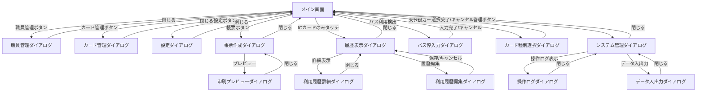
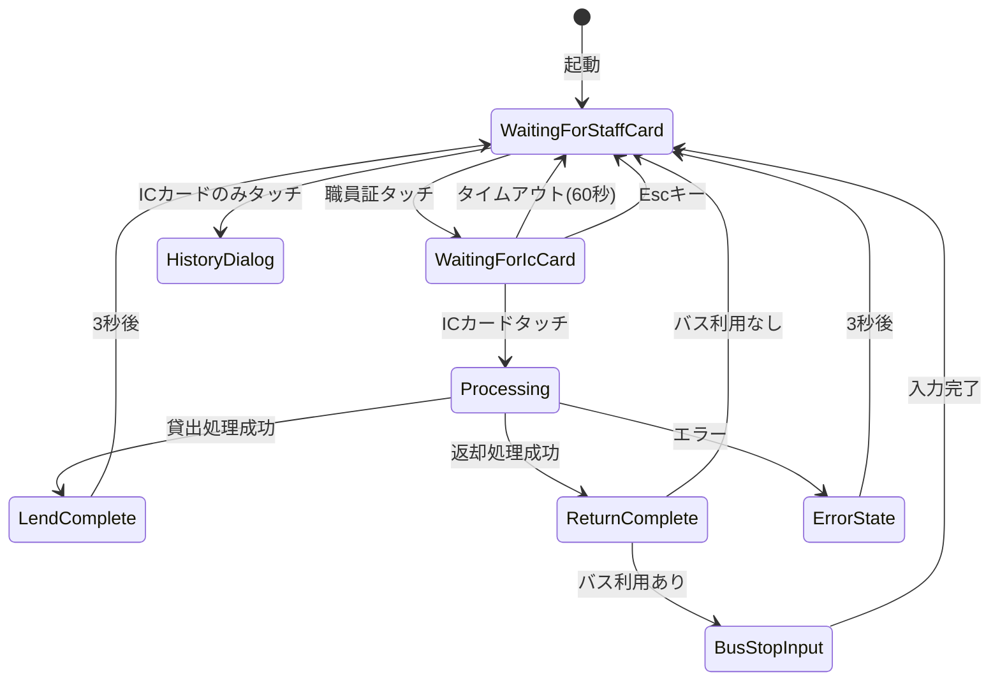

# 画面設計書

## 1. 画面遷移図



---

## 2. 画面一覧

| No. | 画面名 | ファイル名 | 概要 |
|-----|--------|------------|------|
| 1 | メイン画面 | MainWindow.xaml | 貸出・返却の操作画面 |
| 2 | 職員管理ダイアログ | StaffManageDialog.xaml | 職員の登録・編集・削除 |
| 3 | カード管理ダイアログ | CardManageDialog.xaml | ICカードの登録・編集・削除 |
| 4 | 設定ダイアログ | SettingsDialog.xaml | アプリケーション設定 |
| 5 | 帳票作成ダイアログ | ReportDialog.xaml | 月次帳票の作成 |
| 6 | 履歴表示ダイアログ | HistoryDialog.xaml | 利用履歴の照会 |
| 7 | バス停入力ダイアログ | BusStopInputDialog.xaml | バス停名の手入力 |
| 8 | カード種別選択ダイアログ | CardTypeSelectionDialog.xaml | 未登録カードの種別選択 |
| 9 | データ入出力ダイアログ | DataExportImportDialog.xaml | CSV形式でのデータ入出力 |
| 10 | 利用履歴詳細ダイアログ | LedgerDetailDialog.xaml | 利用履歴の詳細表示 |
| 11 | 利用履歴編集ダイアログ | LedgerEditDialog.xaml | 利用履歴の編集 |
| 12 | 操作ログダイアログ | OperationLogDialog.xaml | 操作ログの検索・表示 |
| 13 | 印刷プレビューダイアログ | PrintPreviewDialog.xaml | 帳票の印刷プレビュー |
| 14 | システム管理ダイアログ | SystemManageDialog.xaml | システム管理機能 |

---

## 3. 画面詳細設計

### 3.1 メイン画面（MainWindow）

#### 3.1.1 画面レイアウト

```
+------------------------------------------------------------------+
| [ヘッダー]                                                        |
| 交通系ICカード管理システム    2024/04/01 09:30  [設定][帳票][管理] |
+------------------------------------------------------------------+
|                                           |  [サイドバー]         |
|                                           |  貸出中のカード       |
|              [メインエリア]               |  ・はやかけん H001    |
|                                           |    4/1 9:00～         |
|                 💳                        |  ・nimoca N002        |
|           職員証をタッチしてください       |    4/1 8:30～         |
|                                           |                       |
|              残り 58 秒                    |  [警告]               |
|                                           |  ・H003 残高不足      |
+------------------------------------------------------------------+
| [操作ヒント] 職員証→ICカードで貸出/返却 | [Esc]キャンセル       |
+------------------------------------------------------------------+
| 状態: 職員証タッチ待ち | 貸出中: 2枚                              |
+------------------------------------------------------------------+
```

#### 3.1.2 領域説明

| 領域 | 説明 |
|------|------|
| ヘッダー | システム名、現在日時、各種ボタン |
| メインエリア | 状態アイコン、ステータスメッセージ、タイムアウト表示 |
| サイドバー | 貸出中カード一覧、警告メッセージ |
| 操作ヒント | 操作方法のガイダンス |
| ステータスバー | 現在の状態、貸出中カード数 |

#### 3.1.3 状態別表示

| 状態 | アイコン | メッセージ | 背景色 |
|------|----------|------------|--------|
| 職員証タッチ待ち | 💳 | 職員証をタッチしてください | 白 |
| ICカードタッチ待ち | 🚃 | ICカードをタッチしてください | 白 |
| 貸出完了 | 🚃→ | 貸出しました | #FFE0B2（薄いオレンジ） |
| 返却完了 | 🏠← | 返却しました | #B3E5FC（薄い水色） |
| エラー | ⚠️ | エラーメッセージ | #FFEBEE（薄い赤） |

---

### 3.2 状態遷移図



#### 状態説明

| 状態 | 説明 | タイムアウト |
|------|------|--------------|
| WaitingForStaffCard | 職員証タッチ待ち | なし |
| WaitingForIcCard | ICカードタッチ待ち | 60秒 |
| Processing | 処理中 | なし |
| LendComplete | 貸出完了 | 3秒 |
| ReturnComplete | 返却完了 | 3秒 |
| ErrorState | エラー表示 | 3秒 |
| BusStopInput | バス停入力待ち | なし |

---

### 3.3 職員管理ダイアログ（StaffManageDialog）

```
+--------------------------------------------------+
| 職員管理                                    [×] |
+--------------------------------------------------+
| [新規登録]                                       |
|                                                  |
| +----------------------------------------------+ |
| | 職員証IDm    | 氏名        | 職員番号 | 操作 | |
| |--------------|-------------|----------|------| |
| | 0102030...   | 山田 太郎   | A001     | [編集]| |
| | 1112131...   | 鈴木 花子   | A002     | [削除]| |
| +----------------------------------------------+ |
|                                                  |
| [閉じる]                                         |
+--------------------------------------------------+
```

#### 機能

- 職員一覧表示（論理削除されていないもの）
- 新規登録（職員証タッチでIDm取得）
- 編集（氏名、職員番号、備考）
- 論理削除

---

### 3.4 カード管理ダイアログ（CardManageDialog）

```
+--------------------------------------------------+
| カード管理                                  [×] |
+--------------------------------------------------+
| [新規登録]                                       |
|                                                  |
| +----------------------------------------------+ |
| | 種別      | 管理番号 | 状態    | 操作        | |
| |-----------|----------|---------|-------------| |
| | はやかけん | H001     | 返却済  | [編集][削除]| |
| | nimoca    | N002     | 貸出中  | [編集]      | |
| +----------------------------------------------+ |
|                                                  |
| [閉じる]                     [削除][払い戻し]   |
+--------------------------------------------------+
```

#### 機能

- カード一覧表示（論理削除されていないもの）
- 新規登録（ICカードタッチでIDm取得、種別自動判別）
- 編集（管理番号、備考）
- 論理削除（貸出中のカードは削除不可）
- 払い戻し（残高を払出金額として記録し、カードを論理削除）

---

### 3.5 設定ダイアログ（SettingsDialog）

```
+--------------------------------------------------+
| 設定                                        [×] |
+--------------------------------------------------+
|                                                  |
| 文字サイズ:                                      |
| (●) 小  (○) 中  (○) 大  (○) 特大              |
|                                                  |
| 残高警告閾値:                                    |
| [    10000    ] 円                               |
|                                                  |
| 音声フィードバック:                              |
| [✓] 有効                                         |
|                                                  |
+--------------------------------------------------+
| [保存]  [キャンセル]                             |
+--------------------------------------------------+
```

#### 設定項目

| 項目 | 設定値 | デフォルト |
|------|--------|------------|
| 文字サイズ | 小/中/大/特大 | 中 |
| 残高警告閾値 | 0～99999円 | 10000円 |
| 音声フィードバック | 有効/無効 | 有効 |

---

### 3.6 帳票作成ダイアログ（ReportDialog）

```
+--------------------------------------------------+
| 帳票作成                                    [×] |
+--------------------------------------------------+
|                                                  |
| 対象年月:                                        |
| [2024]年 [4]月 ▼                                 |
|                                                  |
| 対象カード:                                      |
| [✓] はやかけん H001                              |
| [✓] nimoca N002                                  |
| [ ] SUGOCA S003                                  |
| [全選択] [全解除]                                |
|                                                  |
| 出力先フォルダ:                                  |
| [C:\Users\...\Documents              ] [参照]   |
|                                                  |
+--------------------------------------------------+
| [作成]  [キャンセル]                             |
+--------------------------------------------------+
```

#### 機能

- 対象年月の選択
- 対象カードの複数選択
- 出力先フォルダの指定
- 帳票の一括作成

---

### 3.7 履歴表示ダイアログ（HistoryDialog）

```
+--------------------------------------------------+
| 履歴表示 - はやかけん H001                  [×] |
+--------------------------------------------------+
| 期間: [2024/04/01] ～ [2024/04/30] [検索]        |
|                                                  |
| +----------------------------------------------+ |
| | 日付  | 摘要                | 受入 | 払出    | |
| |-------|---------------------|------|--------| |
| | 4/1   | 鉄道（博多～天神）  |      | 260    | |
| | 4/1   | バス（★）          |      | 200    | |
| | 4/2   | 役務費によりチャージ| 3000 |        | |
| +----------------------------------------------+ |
|                                                  |
| [閉じる]                                         |
+--------------------------------------------------+
```

#### 機能

- 期間指定による検索
- 利用履歴の一覧表示
- 摘要、受入金額、払出金額の表示

---

### 3.8 バス停入力ダイアログ（BusStopInputDialog）

```
+--------------------------------------------------+
| バス停の入力                                [×] |
+--------------------------------------------------+
|                                                  |
| バス利用が検出されました。                       |
| バス停名を入力してください。                     |
|                                                  |
| 利用日時: 2024/04/01 09:15                       |
| 利用額: 200円                                    |
|                                                  |
| バス停名:                                        |
| [                                       ]        |
|                                                  |
| 履歴: [博多駅前→天神] [博多駅→福岡空港]         |
|                                                  |
+--------------------------------------------------+
| [登録]  [スキップ]                               |
+--------------------------------------------------+
```

#### 機能

- バス利用情報の表示
- バス停名の入力
- 過去の入力履歴からの選択
- スキップ（★マークで保存）

---

### 3.9 カード種別選択ダイアログ（CardTypeSelectionDialog）

```
+--------------------------------------------------+
| カード種別の選択                            [×] |
+--------------------------------------------------+
|                                                  |
| ❓ 未登録のカードです                            |
|    どのように登録しますか？                      |
|                                                  |
| +----------------------------------------------+ |
| | 💡 ヒント: 職員の認証に使用するカードは「職員証」、|
| |    交通費精算に使用するカードは「交通系ICカード」 |
| |    を選択してください。                        |
| +----------------------------------------------+ |
|                                                  |
| [職員証]  [交通系ICカード]  [キャンセル]         |
+--------------------------------------------------+
```

#### 機能

- 未登録カードを検出した際の種別選択
- 職員証として登録するか、交通系ICカードとして登録するかを選択
- ヒント表示による操作ガイダンス

#### ボタン説明

| ボタン | 色 | 動作 |
|--------|-----|------|
| 職員証 | 青(#2196F3) | 職員登録ダイアログを開く |
| 交通系ICカード | 緑(#4CAF50) | カード登録ダイアログを開く |
| キャンセル | グレー | 登録せずに閉じる |

---

### 3.10 データ入出力ダイアログ（DataExportImportDialog）

```
+------------------------------------------------------------------+
| データエクスポート/インポート                               [×] |
+------------------------------------------------------------------+
| [エクスポート]                                                   |
| データをCSVファイルに出力します                                  |
|                                                                  |
| データ種別: [職員         ▼]                                     |
| 対象期間:   [2024/04/01] ～ [2024/04/30]  (履歴のみ)             |
| [✓] 削除済みデータを含める                                       |
|                                                                  |
| [CSVエクスポート]                                                |
+------------------------------------------------------------------+
| [インポート]                                                     |
| CSVファイルからデータを取り込みます                              |
|                                                                  |
| データ種別: [職員         ▼]                                     |
| [✓] 既存データはスキップする                                     |
|                                                                  |
| [プレビュー]  [インポート実行]  [直接インポート]                 |
+------------------------------------------------------------------+
| [変更点プレビュー] [エラー詳細]                                  |
| +--------------------------------------------------------------+ |
| | 行 | IDm    | 名前   | 追加情報 | アクション | 変更点        | |
| |----|--------|--------|----------|------------|---------------| |
| | 1  | 0102.. | 山田   | A001     | 新規追加   |               | |
| | 2  | 1112.. | 鈴木   | A002     | 更新       | 氏名変更      | |
| +--------------------------------------------------------------+ |
|                                                   [閉じる]       |
+------------------------------------------------------------------+
```

#### 機能

**エクスポート**
- データ種別選択（職員/カード/履歴）
- 期間指定（履歴のみ）
- 削除済みデータの包含オプション
- CSVファイルへの出力

**インポート**
- データ種別選択（職員/カード）
- プレビュー機能（変更点の事前確認）
- 既存データのスキップオプション
- エラー詳細表示

#### データ種別

| 種別 | エクスポート | インポート |
|------|--------------|------------|
| 職員 | ○ | ○ |
| カード | ○ | ○ |
| 履歴 | ○ | × |

---

### 3.11 利用履歴詳細ダイアログ（LedgerDetailDialog）

```
+------------------------------------------------------------------+
| 利用履歴詳細                                                [×] |
+------------------------------------------------------------------+
| +--------------------------------------------------------------+ |
| | 4/1(月)    鉄道（博多駅～天神）           受入:     払出: 260 | |
| | 利用者: 山田太郎   備考: 出張               残高: ¥9,740     | |
| +--------------------------------------------------------------+ |
|                                                                  |
| +--------------------------------------------------------------+ |
| | 日時             | 区間              | 金額    | 残高        | |
| |------------------|-------------------|---------|-------------| |
| | 4/1 09:15        | 博多駅 → 天神    | -260円  | ¥9,740      | |
| | 4/1 17:30        | 天神 → 博多駅    | -260円  | ¥9,480      | |
| +--------------------------------------------------------------+ |
|                                                                  |
| 2件の利用詳細                                         [閉じる]   |
+------------------------------------------------------------------+
```

#### 機能

- 利用履歴の詳細情報（日付、摘要、金額、残高）をヘッダーに表示
- 個別の乗車記録（詳細）をDataGridで一覧表示
- チャージ行は緑背景で強調
- バス利用行は斜体で表示

#### 行スタイル

| 条件 | スタイル |
|------|----------|
| チャージ | 薄い緑背景(#E8F5E9) |
| バス利用 | 斜体(Italic) |

---

### 3.12 利用履歴編集ダイアログ（LedgerEditDialog）

```
+--------------------------------------------------+
| 利用履歴の変更                              [×] |
+--------------------------------------------------+
| +----------------------------------------------+ |
| | 4/1(月)              受入:     払出: 260    | |
| | 利用者: 山田太郎             残高: ¥9,740   | |
| +----------------------------------------------+ |
|                                                  |
| 摘要:                                            |
| [鉄道（博多駅～天神）                         ]  |
|                                                  |
| 備考:                                            |
| +----------------------------------------------+ |
| | 出張（福岡本社訪問）                         | |
| |                                              | |
| +----------------------------------------------+ |
|                                                  |
| [キャンセル]  [保存]                             |
+--------------------------------------------------+
```

#### 機能

- 利用履歴の摘要（summary）を編集
- 備考（note）を編集
- 金額・日付・利用者は読み取り専用で表示

#### 編集可能項目

| 項目 | 編集可否 | 説明 |
|------|----------|------|
| 摘要 | ○ | 鉄道（A駅～B駅）など |
| 備考 | ○ | 自由記述（任意） |
| 日付 | × | 読み取り専用 |
| 金額 | × | 読み取り専用 |
| 利用者 | × | 読み取り専用 |

---

### 3.13 操作ログダイアログ（OperationLogDialog）

```
+------------------------------------------------------------------+
| 操作ログ                                                    [×] |
+------------------------------------------------------------------+
| 📝 操作ログ検索  システムで行われた操作の履歴を確認できます      |
+------------------------------------------------------------------+
| 期間: [2024/04/01] ～ [2024/04/30]  [今日][今月][先月]           |
| 操作種別: [全て      ▼]  対象: [全て     ▼]                      |
| 対象ID: [                ]  操作者名: [              ]           |
|                                           [クリア]  [検索]       |
+------------------------------------------------------------------+
| +--------------------------------------------------------------+ |
| | 日時        | 操作   | 対象    | 対象ID   | 操作者 | 詳細    | |
| |-------------|--------|---------|----------|--------|--------| |
| | 4/1 09:15   | INSERT | ledger  | 12345... | 山田   | 貸出    | |
| | 4/1 10:30   | UPDATE | ic_card | 0102...  | 鈴木   | 残高更新| |
| | 4/1 11:00   | DELETE | staff   | 1112...  | 管理者 | 論理削除| |
| +--------------------------------------------------------------+ |
|                                                                  |
| 全3件中 1-3件表示  | 表示件数:[50▼]  [⏮][◀] 1/1ページ [▶][⏭]  |
|                                                                  |
| [CSVエクスポート]                                     [閉じる]   |
+------------------------------------------------------------------+
```

#### 機能

- 期間指定による検索
- 操作種別フィルタ（INSERT/UPDATE/DELETE）
- 対象テーブルフィルタ（staff/ic_card/ledger等）
- 対象ID・操作者名による部分一致検索
- ページネーション
- CSVエクスポート

#### 操作種別の色分け

| 操作 | 色 | 説明 |
|------|-----|------|
| INSERT | 緑 | 新規登録 |
| UPDATE | オレンジ | 更新 |
| DELETE | 赤 | 削除 |

#### フィルタ条件

| 項目 | 検索方法 |
|------|----------|
| 期間 | 範囲指定 |
| 操作種別 | 完全一致 |
| 対象テーブル | 完全一致 |
| 対象ID | 部分一致 |
| 操作者名 | 部分一致 |

---

### 3.14 印刷プレビューダイアログ（PrintPreviewDialog）

```
+------------------------------------------------------------------+
| 印刷プレビュー - 物品出納簿_H001_2024年04月.xlsx            [×] |
+------------------------------------------------------------------+
| ズーム: [−] [100% ▼] [＋] [100%]  ページ: [⏮][◀] 1/3ページ [▶][⏭]|
|                                   用紙方向: [横 (Landscape)▼] [印刷]|
+------------------------------------------------------------------+
|                                                                  |
|    +--------------------------------------------------------+    |
|    |                                                        |    |
|    |                   [印刷プレビュー]                     |    |
|    |                                                        |    |
|    |                   物品出納簿                           |    |
|    |                   令和6年4月                           |    |
|    |                   はやかけん H001                      |    |
|    |                                                        |    |
|    +--------------------------------------------------------+    |
|                                                                  |
+------------------------------------------------------------------+
| プレビューを表示中                                    [閉じる]   |
+------------------------------------------------------------------+
```

#### 機能

- 帳票の印刷プレビュー表示
- ズーム操作（縮小/拡大/100%リセット）
- ページナビゲーション（←→キーでも操作可能）
- 用紙方向選択（縦/横）
- 印刷実行

#### ズーム操作

| 操作 | ショートカット |
|------|----------------|
| 拡大 | Ctrl + + |
| 縮小 | Ctrl + - |
| 100%リセット | ボタン |
| 前ページ | ← |
| 次ページ | → |

---

### 3.15 システム管理ダイアログ（SystemManageDialog）

```
+--------------------------------------------------+
| システム管理                                [×] |
+--------------------------------------------------+
| [操作ログ]                                       |
| システムの操作履歴を確認できます。               |
|                                                  |
| [操作ログを表示]                                 |
+--------------------------------------------------+
| [手動バックアップ]                               |
| 任意のタイミングでデータベースのバックアップを   |
| 作成できます。                                   |
|                                                  |
| [バックアップを作成]  [バックアップフォルダを開く]|
+--------------------------------------------------+
| [リストア（データ復元）]                         |
| バックアップファイルを選択してデータを復元します。|
|                                                  |
| +----------------------------------------------+ |
| | ファイル名        | 作成日時       | サイズ  | |
| |-------------------|----------------|--------| |
| | backup_2024...db  | 2024/04/01 9:00| 128 KB | |
| | backup_2024...db  | 2024/03/01 9:00| 120 KB | |
| +----------------------------------------------+ |
|                                                  |
| [選択したバックアップからリストア]               |
| [ファイルを指定してリストア] [一覧を更新]        |
+--------------------------------------------------+
|                                         [閉じる] |
+--------------------------------------------------+
```

#### 機能

**操作ログ**
- 操作ログダイアログを開く

**手動バックアップ**
- データベースのバックアップ作成
- バックアップフォルダを開く

**リストア**
- バックアップファイル一覧表示
- 選択したバックアップからリストア
- 任意のファイルを指定してリストア

#### バックアップファイル一覧

| 項目 | 説明 |
|------|------|
| ファイル名 | バックアップファイル名 |
| 作成日時 | ファイルの作成日時 |
| サイズ | ファイルサイズ（KB/MB表示） |

---

## 4. UI/UXガイドライン

### 4.1 色の使用方針

| 用途 | 色コード | 色名 | 説明 |
|------|----------|------|------|
| 貸出完了 | #FFE0B2 | 薄いオレンジ | 暖色系で「外に出る」イメージ |
| 返却完了 | #B3E5FC | 薄い水色 | 寒色系で「戻る」イメージ |
| エラー | #FFEBEE | 薄い赤 | 警告・注意 |
| ヘッダー | #2196F3 | 青 | システムカラー |
| 操作ヒント | #E3F2FD | 薄い青 | 情報表示 |

### 4.2 アクセシビリティ対応

#### 4.2.1 色覚多様性対応
- 暖色（貸出）と寒色（返却）で色相差を明確に
- 色だけでなくアイコン・テキストでも状態を表現

#### 4.2.2 多重表現
状態は以下の4要素で伝達：
1. **色**: 背景色で視覚的に区別
2. **アイコン**: 絵文字で直感的に理解
3. **テキスト**: メッセージで明確に説明
4. **音**: フィードバック音で聴覚的に通知

#### 4.2.3 文字サイズ変更
- 小/中/大/特大の4段階
- 高齢者でも読みやすい大きさに変更可能

### 4.3 音声フィードバック

| イベント | 音 | ファイル |
|----------|-----|----------|
| 貸出成功 | ピッ | lend.wav |
| 返却成功 | ピピッ | return.wav |
| エラー | ピー | error.wav |
| 警告 | ピポ | warning.wav |

### 4.4 操作フィードバック

| 操作 | フィードバック |
|------|----------------|
| カードタッチ | 背景色変化 + 音 + メッセージ |
| ボタンクリック | ボタン無効化（二重クリック防止） |
| 処理中 | オーバーレイ + プログレスバー |
| タイムアウト | カウントダウン表示 |

---

## 5. キーボード操作

| キー | 画面 | 動作 |
|------|------|------|
| Esc | メイン画面 | ICカード待ち状態をキャンセル |
| Enter | 各ダイアログ | デフォルトボタンの実行 |
| Tab | 各画面 | フォーカス移動 |
