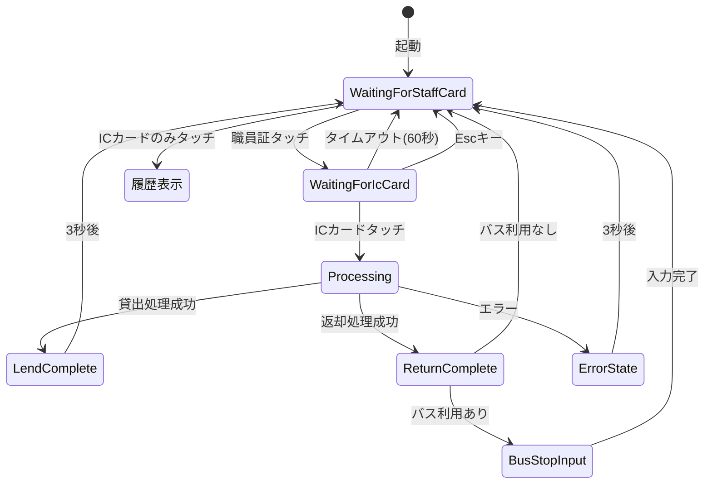

# 画面設計書

## 0. このドキュメントについて

| 項目 | 内容 |
|------|------|
| **対象読者** | 本システムの開発者・保守担当者。UI 設計・変更・改修を行う人 |
| **前提知識** | `01_システム概要設計書.md`(主要機能の概要) / `04_機能設計書.md`(業務ロジック) |
| **このドキュメントで答えられる問い** | ・どんな画面/ダイアログがあるか<br>・画面間でどう遷移するか<br>・メイン画面の状態遷移と各状態の表示仕様<br>・UI/UX の色・音・フォント・アクセシビリティ方針 |
| **関連ドキュメント** | `04_機能設計書.md`(各機能仕様) / `05_クラス設計書.md`(ViewModel の責務) |

> **読み方のヒント**: まず §1 の画面遷移図で俯瞰 → §2 の画面一覧で探している画面を特定 → §3 の各画面詳細へ、という順で見てください。UI/UX の横断ルールは §4 にまとめています。

---

## 1. 画面遷移図


```mermaid
graph TB
    MAIN[メイン画面]
    STAFF[職員管理ダイアログ]
    CARD[カード管理ダイアログ]
    SETTINGS[設定ダイアログ]
    REPORT[帳票作成ダイアログ]
    HISTORY[履歴表示ダイアログ]
    BUSSTOP[バス停入力ダイアログ]
    CARDTYPE[カード種別選択ダイアログ]
    DATAEXIMP[データ入出力ダイアログ]
    LEDGERDETAIL[利用履歴詳細ダイアログ]
    LEDGERROWEDIT[利用履歴行編集ダイアログ]
    OPLOG[操作ログダイアログ]
    PREVIEW[印刷プレビューダイアログ]
    SYSMGMT[システム管理ダイアログ]
    CARDREGMODE[カード登録モードダイアログ]
    STAFFAUTH[職員認証ダイアログ]
    MERGEHIST[統合履歴ダイアログ]
    INCBUSSTOP[バス停名未入力履歴ダイアログ]
    VIRTUALCARD[仮想カードダイアログ]

    MAIN -->|職員管理ボタン| STAFF
    MAIN -->|カード管理ボタン| CARD
    MAIN -->|設定ボタン| SETTINGS
    MAIN -->|帳票ボタン| REPORT
    MAIN -->|ICカードのみタッチ| HISTORY
    MAIN -->|バス利用検出| BUSSTOP
    MAIN -->|未登録カードタッチ| CARDTYPE
    MAIN -->|システム管理ボタン| SYSMGMT

    STAFF -->|閉じる| MAIN
    CARD -->|閉じる| MAIN
    SETTINGS -->|閉じる| MAIN
    REPORT -->|プレビュー| PREVIEW
    REPORT -->|閉じる| MAIN
    HISTORY -->|詳細表示| LEDGERDETAIL
    HISTORY -->|履歴編集| LEDGERROWEDIT
    HISTORY -->|閉じる| MAIN
    BUSSTOP -->|入力完了/キャンセル| MAIN
    CARDTYPE -->|選択完了/キャンセル| MAIN
    LEDGERDETAIL -->|閉じる| HISTORY
    LEDGERROWEDIT -->|保存/キャンセル| HISTORY
    SYSMGMT -->|操作ログ表示| OPLOG
    SYSMGMT -->|データ入出力| DATAEXIMP
    SYSMGMT -->|閉じる| MAIN
    OPLOG -->|閉じる| SYSMGMT
    DATAEXIMP -->|閉じる| SYSMGMT
    PREVIEW -->|閉じる| REPORT
    CARD -->|カード登録| CARDREGMODE
    CARDREGMODE -->|選択完了/キャンセル| CARD
    HISTORY -->|統合取り消し| MERGEHIST
    MERGEHIST -->|選択/閉じる| HISTORY
    LEDGERROWEDIT -->|職員認証| STAFFAUTH
    STAFFAUTH -->|認証完了/キャンセル| LEDGERROWEDIT
    MAIN -->|バス停名未入力あり| INCBUSSTOP
    INCBUSSTOP -->|バス停名入力| BUSSTOP
    INCBUSSTOP -->|閉じる| MAIN
    SYSMGMT -->|仮想カード| VIRTUALCARD
    VIRTUALCARD -->|閉じる| SYSMGMT
```

---

## 2. 画面一覧

| No. | 画面名 | ファイル名 | 概要 |
|-----|--------|------------|------|
| 1 | メイン画面 | MainWindow.xaml | 貸出・返却の操作画面 |
| 2 | 職員管理ダイアログ | StaffManageDialog.xaml | 職員の登録・編集・削除 |
| 3 | カード管理ダイアログ | CardManageDialog.xaml | ICカードの登録・編集・削除 |
| 4 | 設定ダイアログ | SettingsDialog.xaml | アプリケーション設定 |
| 5 | 帳票作成ダイアログ | ReportDialog.xaml | 月次帳票の作成 |
| 6 | バス停入力ダイアログ | BusStopInputDialog.xaml | バス停名の手入力 |
| 7 | カード種別選択ダイアログ | CardTypeSelectionDialog.xaml | 未登録カードの種別選択 |
| 8 | データ入出力ダイアログ | DataExportImportDialog.xaml | CSV形式でのデータ入出力 |
| 9 | 利用履歴詳細ダイアログ | LedgerDetailDialog.xaml | 利用履歴の詳細表示 |
| 10 | 利用履歴行編集ダイアログ | LedgerRowEditDialog.xaml | 利用履歴の追加・編集 |
| 11 | 操作ログダイアログ | OperationLogDialog.xaml | 操作ログの検索・表示 |
| 12 | 印刷プレビューダイアログ | PrintPreviewDialog.xaml | 帳票の印刷プレビュー |
| 13 | システム管理ダイアログ | SystemManageDialog.xaml | システム管理機能 |
| 14 | カード登録モードダイアログ | CardRegistrationModeDialog.xaml | カード登録方法の選択（Issue #510） |
| 15 | 職員認証ダイアログ | StaffAuthDialog.xaml | 職員証による操作者認証 |
| 16 | 統合履歴ダイアログ | MergeHistoryDialog.xaml | 統合履歴の一覧・取り消し（Issue #548） |
| 17 | バス停名未入力履歴ダイアログ | IncompleteBusStopDialog.xaml | バス停名未入力の履歴一覧・入力誘導（Issue #672） |
| 18 | 仮想カードダイアログ | VirtualCardDialog.xaml | DEBUGモード用仮想ICカードタッチ |

---

## 3. 画面詳細設計

### 3.1 メイン画面（MainWindow）

#### 3.1.1 画面レイアウト

```
+----------------------------------------------------------------------------+
| [ヘッダー]                                                                  |
| 交通系ICカード管理システム：ピッすい    2024/04/01 09:30  [設定][帳票][管理] |
+----------------------------------------------------------------------------+
|                                                     |  [サイドバー]         |
|                                                     |  貸出中のカード       |
|                    [メインエリア]                    |  ・はやかけん H001    |
|                                                     |    4/1 9:00～         |
|                       💳                            |  ・nimoca N002        |
|             職員証をタッチしてください                |    4/1 8:30～         |
|                                                     |                       |
|                    残り 58 秒                        |  [警告]               |
|                                                     |  ・H003 残高不足      |
+----------------------------------------------------------------------------+
| [操作ヒント] 職員証→ICカードで貸出/返却   | [Esc]キャンセル               |
+----------------------------------------------------------------------------+
| 状態: 職員証タッチ待ち | 🔗 共有モード | 貸出中: 2枚                         |
+----------------------------------------------------------------------------+
```

> **共有モードインジケーター**: 共有フォルダモード（`database_config.txt` にパスが設定されている場合）で動作中の場合、ステータスバーに「🔗 共有モード」を表示する。スタンドアロンモード時は非表示。

> **ネットワーク切断警告バナー**: 共有フォルダモードでDB接続が失われた場合、メインエリア上部に警告バナー（`WarningType.DatabaseConnectionLost`）を表示する。背景色: #FFEBEE（薄い赤）。接続が回復すると自動的に非表示となる。

#### 3.1.2 領域説明

| 領域 | 説明 |
|------|------|
| ヘッダー | システム名、現在日時、各種ボタン |
| メインエリア | 状態アイコン、ステータスメッセージ、タイムアウト表示 |
| サイドバー | 貸出中カード一覧、警告メッセージ |
| カードダッシュボード | 登録カードの残高・貸出状態・最終利用日を一覧表示。並び替え機能あり |
| 操作ヒント | 操作方法のガイダンス |
| ステータスバー | 現在の状態、貸出中カード数、共有モードインジケーター |

#### 3.1.3 状態別表示

| 状態 | アイコン | メッセージ | 背景色 |
|------|----------|------------|--------|
| 職員証タッチ待ち | 💳 | 職員証をタッチしてください | 白 |
| 交通系ICカードタッチ待ち | 🚃 | 交通系ICカードをタッチしてください | 白 |
| 貸出完了 | 🚃→ | 貸出しました | #FFE0B2（薄いオレンジ） |
| 返却完了 | 🏠← | 返却しました | #B3E5FC（薄い水色） |
| エラー | ⚠️ | エラーメッセージ | #FFEBEE（薄い赤） |

#### 3.1.4 カードダッシュボードの並び替え

カードダッシュボードは以下の基準で並び替え可能。

| 並び替え | 説明 |
|----------|------|
| カード名順 | カード種別・管理番号順（デフォルト） |
| 残高（少ない順） | 残高が少ないカードを先頭に表示 |
| 残高（多い順） | 残高が多いカードを先頭に表示 |
| 最終利用日順 | 最後に使用されたカードを先頭に表示 |

---

### 3.2 状態遷移図


```mermaid
stateDiagram-v2
    [*] --> WaitingForStaffCard: 起動

    WaitingForStaffCard --> WaitingForIcCard: 職員証タッチ
    WaitingForStaffCard --> 履歴表示: ICカードのみタッチ

    WaitingForIcCard --> Processing: ICカードタッチ
    WaitingForIcCard --> WaitingForStaffCard: タイムアウト(60秒)
    WaitingForIcCard --> WaitingForStaffCard: Escキー

    Processing --> LendComplete: 貸出処理成功
    Processing --> ReturnComplete: 返却処理成功
    Processing --> ErrorState: エラー

    LendComplete --> WaitingForStaffCard: 3秒後
    ReturnComplete --> BusStopInput: バス利用あり
    ReturnComplete --> WaitingForStaffCard: バス利用なし

    BusStopInput --> WaitingForStaffCard: 入力完了

    ErrorState --> WaitingForStaffCard: 3秒後
```

#### 状態説明

| 状態 | 説明 | タイムアウト |
|------|------|--------------|
| WaitingForStaffCard | 職員証タッチ待ち | なし |
| WaitingForIcCard | ICカードタッチ待ち | 60秒 |
| Processing | 処理中 | なし |
| LendComplete | 貸出完了 | 3秒 |
| ReturnComplete | 返却完了 | 3秒 |
| ErrorState | エラー表示 | 3秒 |
| BusStopInput | バス停入力待ち | なし |

---

### 3.3 職員管理ダイアログ（StaffManageDialog）

```
+--------------------------------------------------+
| 職員管理                                    [×] |
+--------------------------------------------------+
| [新規登録]                                       |
|                                                  |
| +----------------------------------------------+ |
| | 職員番号 | 氏名        | 備考           | |
| |----------|-------------|----------------| |
| | A001     | 山田 太郎   |                | |
| | A002     | 鈴木 花子   | 総務課         | |
| +----------------------------------------------+ |
|                                                  |
| [閉じる]                                         |
+--------------------------------------------------+
```

#### 機能

- 職員一覧表示（論理削除されていないもの）
- 新規登録（職員証タッチでIDm取得）
- 編集（氏名、職員番号、備考）
- 論理削除

---

### 3.4 カード管理ダイアログ（CardManageDialog）

```
+--------------------------------------------------+
| カード管理                                  [×] |
+--------------------------------------------------+
| [新規登録]                                       |
|                                                  |
| +----------------------------------------------+ |
| | 種別      | 管理番号 | 備考   | 状態    | |
| |-----------|----------|--------|---------|  |
| | はやかけん | H001     |        | 返却済  | |
| | nimoca    | N002     |        | 貸出中  | |
| +----------------------------------------------+ |
|                                                  |
| [閉じる]                     [削除][払い戻し]   |
+--------------------------------------------------+
```

#### 機能

- カード一覧表示（論理削除されていないもの）
- 新規登録（ICカードタッチでIDm取得、種別はユーザーが手動選択）
- 編集（管理番号、備考）
- 論理削除（貸出中のカードは削除不可）
- 払い戻し（残高を払出金額として記録し、カードを論理削除）

---

### 3.5 設定ダイアログ（SettingsDialog）

```
+--------------------------------------------------+
| 設定                                        [×] |
+--------------------------------------------------+
|                                                  |
| 文字サイズ:                                      |
| (●) 小  (○) 中  (○) 大  (○) 特大              |
|                                                  |
| 残高警告閾値:                                    |
| [    10000    ] 円                               |
|                                                  |
| 音声フィードバック:                              |
| [✓] 有効                                         |
|                                                  |
+--------------------------------------------------+
| [保存]  [キャンセル]                             |
+--------------------------------------------------+
```

#### 設定項目

設定項目は `Models/AppSettings.cs` のプロパティ順に対応する。

| 項目 | プロパティ | 設定値 | デフォルト |
|------|-----------|--------|------------|
| 残高警告閾値 | `WarningBalance` | 0～20,000円 | 10,000円 |
| バックアップ先フォルダ | `BackupPath` | 任意のフォルダパス | アプリケーションフォルダ |
| 文字サイズ | `FontSize` | 小/中/大/特大 | 中 |
| 最終VACUUM実行日 | `LastVacuumDate` | 自動記録（UI非表示） | NULL |
| メインウィンドウ位置・サイズ | `MainWindowSettings` | 自動記録（UI非表示） | 既定 |
| 音声モード | `SoundMode` | 効果音/音声（男性）/音声（女性）/無し | 効果音 |
| トースト通知の表示位置 | `ToastPosition` | 右上/左上/右下/左下 | 右上 |
| 部署種別 | `DepartmentType` | 市長事務部局（役務費）/企業会計部局（旅費） | 市長事務部局 |
| 返却時のバス停入力スキップ | `SkipBusStopInputOnReturn` | 有効/無効 | 無効 |
| 帳票出力先フォルダ | `ReportOutputFolder` | 任意のフォルダパス | 空（毎回ダイアログで選択） |
| データベースパス | （`database_config.txt`） | フォルダパス（UNCパス対応） | 空（ローカルデフォルト） |

> `LastVacuumDate` および `MainWindowSettings` はアプリが内部的に保存する状態であり、設定ダイアログには表示しない。
> データベースパスは settings テーブルではなく `C:\ProgramData\ICCardManager\database_config.txt` で管理する。

> **データベースパス設定**: データベースファイルの保存先フォルダを指定する。UNCパス（例: `\\server\share\ICCardManager`）を指定すると共有フォルダモードとなり、複数PCからの同時利用が可能となる。空の場合はローカルの`%PROGRAMDATA%\ICCardManager`が使用される。フォルダ選択ダイアログで指定可能。設定変更後はアプリケーションの再起動が必要。

---

### 3.6 帳票作成ダイアログ（ReportDialog）

```
+--------------------------------------------------+
| 帳票作成                                    [×] |
+--------------------------------------------------+
|                                                  |
| 対象年月:                                        |
| [2024]年 [4]月 ▼                                 |
|                                                  |
| 対象カード:                                      |
| [✓] はやかけん H001                              |
| [✓] nimoca N002                                  |
| [ ] SUGOCA S003                                  |
| [全選択] [全解除]                                |
|                                                  |
| 出力先フォルダ:                                  |
| [C:\Users\...\Documents              ] [参照]   |
|                                                  |
+--------------------------------------------------+
| [作成]  [キャンセル]                             |
+--------------------------------------------------+
```

#### 機能

- 対象年月の選択
- 対象カードの複数選択
- 出力先フォルダの指定
- 帳票の一括作成

---

### 3.7 履歴表示エリア（メインウィンドウ内）

メインウィンドウ内に埋め込まれた利用履歴の表示エリア。交通系ICカードをタッチすると表示される。

```
+--------------------------------------------------+
| はやかけん 5042  現在残高: 76円   [✕ 閉じる]     |
+--------------------------------------------------+
| 表示期間: [2026年3月]  [先月] [今月] [その他の月…]|
|            [＋ 行を追加] [📦 統合] [↩ 元に戻す]  |
| +----------------------------------------------+ |
| |☐| 日付  | 摘要              | 受入 | 払出   | |
| |--|-------|-------------------|------|--------| |
| |☐| 4/1   | 鉄道（博多～天神）|      | 260    | |
| |☐| 4/1   | バス（★）        |      | 200    | |
| |☐| 4/2   | 役務費によりチャージ| 3000|        | |
| +----------------------------------------------+ |
| ⏮ ◀ ページ 1/1 ▶ ⏭    表示件数: [50] 全3件   |
+--------------------------------------------------+
```

#### 機能

- 月単位の期間選択（先月・今月のクイック選択、その他の月の任意選択）
- 表示期間テキスト（「2026年3月」等）のクリックで月選択ポップアップを表示
- 利用履歴の一覧表示（日付、摘要、受入、払出、残高、利用者、備考、操作）
- ページネーション（表示件数選択付き）
- チェックボックスによる履歴の統合・統合の取り消し
- 行の手動追加・変更・詳細表示

---

### 3.8 バス停入力ダイアログ（BusStopInputDialog）

```
+--------------------------------------------------+
| バス停の入力                                [×] |
+--------------------------------------------------+
|                                                  |
| バス利用が検出されました。                       |
| バス停名を入力してください。                     |
|                                                  |
| 利用日時: 2024/04/01 09:15                       |
| 利用額: 200円                                    |
|                                                  |
| バス停名:                                        |
| [                                       ]        |
|                                                  |
| 履歴: [博多駅前→天神] [博多駅→福岡空港]         |
|                                                  |
+--------------------------------------------------+
| [登録]  [スキップ]                               |
+--------------------------------------------------+
```

#### 機能

- バス利用情報の表示
- バス停名の入力
- 過去の入力履歴からの選択
- スキップ（★マークで保存）

---

### 3.9 カード種別選択ダイアログ（CardTypeSelectionDialog）

```
+--------------------------------------------------+
| カード種別の選択                            [×] |
+--------------------------------------------------+
|                                                  |
| ❓ 未登録のカードです                            |
|    どのように登録しますか？                      |
|                                                  |
| +----------------------------------------------+ |
| | 💡 ヒント: 職員の認証に使用するカードは「職員証」、|
| |    交通費精算に使用するカードは「交通系ICカード」 |
| |    を選択してください。                        |
| +----------------------------------------------+ |
|                                                  |
| [職員証]  [交通系ICカード]  [キャンセル]         |
+--------------------------------------------------+
```

#### 機能

- 未登録カードを検出した際の種別選択
- 職員証として登録するか、交通系ICカードとして登録するかを選択
- ヒント表示による操作ガイダンス

#### ボタン説明

| ボタン | 色 | 動作 |
|--------|-----|------|
| 職員証 | 青(#2196F3) | 職員登録ダイアログを開く |
| 交通系ICカード | 緑(#4CAF50) | カード登録ダイアログを開く |
| キャンセル | グレー | 登録せずに閉じる |

---

### 3.10 データ入出力ダイアログ（DataExportImportDialog）

```
+------------------------------------------------------------------+
| データエクスポート/インポート                               [×] |
+------------------------------------------------------------------+
| [エクスポート]                                                   |
| データをCSVファイルに出力します                                  |
|                                                                  |
| データ種別: [職員         ▼]                                     |
| 対象期間:   [2024/04/01] ～ [2024/04/30]  (履歴のみ)             |
| [✓] 削除済みデータを含める                                       |
|                                                                  |
| [CSVエクスポート]                                                |
+------------------------------------------------------------------+
| [インポート]                                                     |
| CSVファイルからデータを取り込みます                              |
|                                                                  |
| データ種別: [職員         ▼]                                     |
| [✓] 既存データはスキップする                                     |
|                                                                  |
| [プレビュー]  [インポート実行]  [直接インポート]                 |
+------------------------------------------------------------------+
| [変更点プレビュー] [エラー詳細]                                  |
| +--------------------------------------------------------------+ |
| | 行 | IDm    | 名前   | 追加情報 | アクション | 変更点        | |
| |----|--------|--------|----------|------------|---------------| |
| | 1  | 0102.. | 山田   | A001     | 新規追加   |               | |
| | 2  | 1112.. | 鈴木   | A002     | 更新       | 氏名変更      | |
| +--------------------------------------------------------------+ |
|                                                   [閉じる]       |
+------------------------------------------------------------------+
```

#### 機能

**エクスポート**
- データ種別選択（職員/カード/履歴/履歴詳細）
- 期間指定（履歴・履歴詳細のみ）
- 削除済みデータの包含オプション
- CSVファイルへの出力

**インポート**
- データ種別選択（職員/カード/履歴/履歴詳細）
- プレビュー機能（変更点の事前確認）
- 既存データのスキップオプション
- インポート先カード指定（履歴インポート時のみ）
- エラー詳細表示

#### データ種別

| 種別 | エクスポート | インポート |
|------|--------------|------------|
| 職員 | ○ | ○ |
| カード | ○ | ○ |
| 履歴 | ○ | ○ |
| 履歴詳細 | ○ | ○ |

---

### 3.11 利用履歴詳細ダイアログ（LedgerDetailDialog）

```
+------------------------------------------------------------------+
| 利用履歴詳細                                                [×] |
+------------------------------------------------------------------+
| +--------------------------------------------------------------+ |
| | 4/1(月)    鉄道（博多駅～天神）           受入:     払出: 260 | |
| | 利用者: 山田太郎   備考: 出張               残高: ¥9,740     | |
| +--------------------------------------------------------------+ |
|                                                                  |
| +--------------------------------------------------------------+ |
| | 日時             | 区間              | 金額    | 残高        | |
| |------------------|-------------------|---------|-------------| |
| | 4/1 09:15        | 博多駅 → 天神    | -260円  | ¥9,740      | |
| | 4/1 17:30        | 天神 → 博多駅    | -260円  | ¥9,480      | |
| +--------------------------------------------------------------+ |
|                                                                  |
| 2件の利用詳細                                         [閉じる]   |
+------------------------------------------------------------------+
```

#### 機能

- 利用履歴の詳細情報（日付、摘要、金額、残高）をヘッダーに表示
- 個別の乗車記録（詳細）をDataGridで一覧表示
- チャージ行は緑背景で強調
- バス利用行は斜体で表示
- ポイント還元行は専用ラベルで識別表示

#### 行スタイル

| 条件 | スタイル | 備考 |
|------|----------|------|
| チャージ（`is_charge=1`） | 薄い緑背景(#E8F5E9) | 区間欄に「チャージ」と表示 |
| バス利用（`is_bus=1`） | 斜体(Italic) | 区間欄にバス停名を表示 |
| ポイント還元（`is_point_redemption=1`） | 薄い黄背景(#FFF9C4) | 区間欄に「ポイント還元」と表示、金額は `+` 表記 |

---

### 3.12 利用履歴行編集ダイアログ（LedgerRowEditDialog）

```
+--------------------------------------------------+
| 利用履歴の変更                              [×] |
+--------------------------------------------------+
| 日付:    [2024/04/01          ▼]                 |
| 摘要:    [鉄道（博多駅～天神）              ]    |
| 受入:    [              ] 円                     |
| 払出:    [260            ] 円                    |
| 残高:    [9740           ] 円  ☑ 自動計算       |
| 利用者:  [山田太郎        ▼] [×]                 |
| 備考:                                            |
| +----------------------------------------------+ |
| | 出張（福岡本社訪問）                         | |
| +----------------------------------------------+ |
|                                                  |
| ■ 挿入位置プレビュー（追加モード時のみ表示）    |
| | 4/1  鉄道（天神～博多駅）       ¥9,740       | |
| | ▶▶▶ ここに挿入 ◀◀◀                          | |
| | [▲ 上へ]  [▼ 下へ]                           | |
|                                                  |
|                   [キャンセル]  [保存]            |
+--------------------------------------------------+
```

#### 機能

- 利用履歴の行を追加（Addモード）または全項目を編集（Editモード）
- 職員認証（StaffAuthDialog）による操作者記録
- 挿入位置プレビュー（追加モード時のみ）で前後の行を確認可能
- バリデーション・警告メッセージ表示

#### 編集可能項目

| 項目 | 編集可否 | 説明 |
|------|----------|------|
| 日付 | ○ | 出納年月日（DatePicker） |
| 摘要 | ○ | 鉄道（A駅～B駅）など |
| 受入金額 | ○ | チャージ額 |
| 払出金額 | ○ | 利用額 |
| 残高 | ○ | 自動計算ON時は前行残高+受入-払出で自動算出 |
| 利用者 | ○ | 職員をComboBoxで選択（任意、クリア可能） |
| 備考 | ○ | 自由記述（任意） |

---

### 3.13 操作ログダイアログ（OperationLogDialog）

```
+------------------------------------------------------------------+
| 操作ログ                                                    [×] |
+------------------------------------------------------------------+
| 📝 操作ログ検索  システムで行われた操作の履歴を確認できます      |
+------------------------------------------------------------------+
| 期間: [2024/04/01] ～ [2024/04/30]  [今日][今月][先月]           |
| 操作種別: [全て      ▼]  対象: [全て     ▼]                      |
| 対象ID: [                ]  操作者名: [              ]           |
|                                           [クリア]  [検索]       |
+------------------------------------------------------------------+
| +--------------------------------------------------------------+ |
| | 日時        | 操作   | 対象    | 対象ID   | 操作者 | 詳細    | |
| |-------------|--------|---------|----------|--------|--------| |
| | 4/1 09:15   | INSERT | ledger  | 12345... | 山田   | 貸出    | |
| | 4/1 10:30   | UPDATE | ic_card | 0102...  | 鈴木   | 残高更新| |
| | 4/1 11:00   | DELETE | staff   | 1112...  | 管理者 | 論理削除| |
| +--------------------------------------------------------------+ |
|                                                                  |
| 全3件中 1-3件表示  | 表示件数:[50▼]  [⏮][◀] 1/1ページ [▶][⏭]  |
|                                                                  |
| [CSVエクスポート]                                     [閉じる]   |
+------------------------------------------------------------------+
```

#### 機能

- 期間指定による検索
- 操作種別フィルタ（INSERT/UPDATE/DELETE）
- 対象テーブルフィルタ（staff/ic_card/ledger等）
- 対象ID・操作者名による部分一致検索
- ページネーション
- CSVエクスポート

#### 操作種別の色分け

| 操作 | 色 | 説明 |
|------|-----|------|
| INSERT | 緑 | 新規登録 |
| UPDATE | オレンジ | 更新 |
| DELETE | 赤 | 削除 |

#### フィルタ条件

| 項目 | 検索方法 |
|------|----------|
| 期間 | 範囲指定 |
| 操作種別 | 完全一致 |
| 対象テーブル | 完全一致 |
| 対象ID | 部分一致 |
| 操作者名 | 部分一致 |

---

### 3.14 印刷プレビューダイアログ（PrintPreviewDialog）

```
+------------------------------------------------------------------+
| 印刷プレビュー - 物品出納簿_H001_2024年04月.xlsx            [×] |
+------------------------------------------------------------------+
| ズーム: [−] [100% ▼] [＋] [100%]  ページ: [⏮][◀] 1/3ページ [▶][⏭]|
|                                   用紙方向: [横 (Landscape)▼] [印刷]|
+------------------------------------------------------------------+
|                                                                  |
|    +--------------------------------------------------------+    |
|    |                                                        |    |
|    |                   [印刷プレビュー]                     |    |
|    |                                                        |    |
|    |                   物品出納簿                           |    |
|    |                   令和6年4月                           |    |
|    |                   はやかけん H001                      |    |
|    |                                                        |    |
|    +--------------------------------------------------------+    |
|                                                                  |
+------------------------------------------------------------------+
| プレビューを表示中                                    [閉じる]   |
+------------------------------------------------------------------+
```

#### 機能

- 帳票の印刷プレビュー表示
- ズーム操作（縮小/拡大/100%リセット）
- ページナビゲーション（←→キーでも操作可能）
- 用紙方向選択（縦/横）
- 印刷実行

#### ズーム操作

| 操作 | ショートカット |
|------|----------------|
| 拡大 | Ctrl + + |
| 縮小 | Ctrl + - |
| 100%リセット | ボタン |
| 前ページ | ← |
| 次ページ | → |

---

### 3.15 システム管理ダイアログ（SystemManageDialog）

```
+--------------------------------------------------+
| システム管理                                [×] |
+--------------------------------------------------+
| [操作ログ]                                       |
| システムの操作履歴を確認できます。               |
|                                                  |
| [操作ログを表示]                                 |
+--------------------------------------------------+
| [手動バックアップ]                               |
| 任意のタイミングでデータベースのバックアップを   |
| 作成できます。                                   |
|                                                  |
| [バックアップを作成]  [バックアップフォルダを開く]|
+--------------------------------------------------+
| [リストア（データ復元）]                         |
| バックアップファイルを選択してデータを復元します。|
|                                                  |
| +----------------------------------------------+ |
| | ファイル名        | 作成日時       | サイズ  | |
| |-------------------|----------------|--------| |
| | backup_2024...db  | 2024/04/01 9:00| 128 KB | |
| | backup_2024...db  | 2024/03/01 9:00| 120 KB | |
| +----------------------------------------------+ |
|                                                  |
| [選択したバックアップからリストア]               |
| [ファイルを指定してリストア] [一覧を更新]        |
+--------------------------------------------------+
|                                         [閉じる] |
+--------------------------------------------------+
```

#### 機能

**操作ログ**
- 操作ログダイアログを開く

**手動バックアップ**
- データベースのバックアップ作成
- バックアップフォルダを開く

**リストア**
- バックアップファイル一覧表示
- 選択したバックアップからリストア
- 任意のファイルを指定してリストア

#### バックアップファイル一覧

| 項目 | 説明 |
|------|------|
| ファイル名 | バックアップファイル名 |
| 作成日時 | ファイルの作成日時 |
| サイズ | ファイルサイズ（KB/MB表示） |

### 3.16 カード登録モードダイアログ（CardRegistrationModeDialog）

```
+--------------------------------------------------+
| 🗂 カード登録方法の選択                      [×] |
+--------------------------------------------------+
|                                                  |
| このカードはどのように登録しますか？             |
|                                                  |
| +----------------------------------------------+ |
| | (●) 新規購入                                 | |
| |   新しく購入したカードを登録します           | |
| +----------------------------------------------+ |
|                                                  |
| +----------------------------------------------+ |
| | (○) 紙の出納簿からの繰越                     | |
| |   年度途中から本アプリを使用する場合に       | |
| |   選択します                                 | |
| |                                              | |
| |   繰越月: [ 1月 ▼]  開始ページ: [  1  ]     | |
| |   繰越額:   [      ] 円                      | |
| |   ※紙の出納簿の前月末残高を入力してください  | |
| |   累計受入: [      ] 円                      | |
| |   累計払出: [      ] 円                      | |
| |   ※月次帳票の「累計」欄に加算されます        | |
| |     （当該年度のみ）                         | |
| +----------------------------------------------+ |
|                                                  |
| 💡 CSVインポートでも過去の出納簿データを        |
|    取り込むことができます                        |
|    月途中からの導入時は管理者マニュアルの        |
|    「5.6 利用開始時の交通系ICカード登録」を      |
|    ご参照ください                                |
|                                                  |
+--------------------------------------------------+
| [OK]  [キャンセル]                               |
+--------------------------------------------------+
```

#### 機能

- カード登録時に「新規購入」か「紙の出納簿からの繰越」を選択
- 繰越の場合は繰越元の月と開始ページ番号を指定可能
- 繰越額（前月末残高）、累計受入、累計払出を入力可能（Issue #756, #1215）
- 3月を選択した場合は「前年度より繰越」として扱い、受入金額に残高を記録
- 開始ページ番号は正の整数のみ入力可（バリデーションあり）

#### 項目定義

| 項目 | 型 | デフォルト | 説明 |
|------|-----|------------|------|
| 登録方法 | ラジオボタン | 新規購入 | 「新規購入」または「紙の出納簿からの繰越」 |
| 繰越月 | コンボボックス | 前月 | 繰越元の月（4月～3月の年度順）。3月選択時は「前年度より繰越」扱い |
| 開始ページ | テキスト入力 | 1 | 帳票出力時の開始ページ番号（正の整数） |
| 繰越額 | テキスト入力 | カード残高 | 紙の出納簿の前月末残高（0以上の整数） |
| 累計受入 | テキスト入力 | 0 | 紙の出納簿の前月末時点の累計受入金額（0以上の整数）(Issue #1215) |
| 累計払出 | テキスト入力 | 0 | 紙の出納簿の前月末時点の累計払出金額（0以上の整数）(Issue #1215) |

#### 操作仕様

| 操作 | 動作 |
|------|------|
| 「新規購入」選択 | 繰越オプション（月・ページ）を無効化 |
| 「紙の出納簿からの繰越」選択 | 繰越オプションを有効化 |
| 無効化された入力欄のクリック | 対応するモードに自動切替（例: 繰越欄クリック→「紙の出納簿からの繰越」を選択） |
| OK | 入力をバリデーションし、結果を返してダイアログを閉じる |
| キャンセル | 選択を破棄してダイアログを閉じる |

---

### 3.17 職員認証ダイアログ（StaffAuthDialog）

```
+--------------------------------------------------+
| 職員証による認証                             [×] |
+--------------------------------------------------+
|                                                  |
|                  🔐                              |
|                                                  |
|  操作者を記録するため、                          |
|  職員証をタッチしてください                      |
|                                                  |
| +----------------------------------------------+ |
| | 操作内容: 履歴の編集                         | |
| +----------------------------------------------+ |
|                                                  |
|                                                  |
|              残り時間: 60秒                      |
|                                                  |
+--------------------------------------------------+
|                              [キャンセル]        |
+--------------------------------------------------+
```

#### 機能

- 履歴編集など認証が必要な操作の前に、ICカードリーダーで職員証をタッチさせて操作者を特定
- 60秒のタイムアウト付き（残り10秒以下で赤色表示）
- タイムアウト時はエラー音を鳴らしてダイアログを自動で閉じる

#### 項目定義

| 項目 | 説明 |
|------|------|
| 操作内容 | 呼び出し元から設定される操作の説明（デフォルト: 「履歴の編集」） |
| 残り時間 | 60秒からカウントダウン表示 |
| ステータスメッセージ | 認証失敗時のエラーメッセージ（通常は非表示） |

#### 操作仕様

| 操作 | 動作 |
|------|------|
| 登録済み職員証タッチ | 認証成功：職員IDm・氏名を記録し、ダイアログを閉じる |
| 未登録カードタッチ | ステータスに「この職員証は登録されていません」を表示 |
| タイムアウト（60秒） | エラー音を鳴らしてダイアログを自動で閉じる（認証失敗） |
| キャンセル / Escape | ダイアログを閉じる（認証失敗） |

---

### 3.18 統合履歴ダイアログ（MergeHistoryDialog）

```
+--------------------------------------------------+
| 統合の取り消し                               [×] |
+--------------------------------------------------+
|                                                  |
| 元に戻す統合履歴を選択してください               |
|                                                  |
| +----------------------------------------------+ |
| | 統合日時         | 内容                      | |
| |------------------|---------------------------| |
| | 2024/06/15 10:30 | 3件の履歴を統合           | |
| | 2024/06/10 14:00 | 2件の履歴を統合           | |
| +----------------------------------------------+ |
|                                                  |
+--------------------------------------------------+
| [選択した統合を元に戻す]              [閉じる]   |
+--------------------------------------------------+
```

#### 機能

- 過去の履歴統合操作を一覧表示
- 選択した統合を取り消し（undo）可能
- ダブルクリックでも取り消しを実行可能

#### 項目定義

| 項目 | 説明 |
|------|------|
| 統合日時 | 統合操作が行われた日時 |
| 内容 | 統合操作の説明テキスト |

#### 操作仕様

| 操作 | 動作 |
|------|------|
| 一覧から項目を選択 | 「選択した統合を元に戻す」ボタンを有効化 |
| 「選択した統合を元に戻す」クリック | 選択された統合のIDを返してダイアログを閉じる |
| 一覧をダブルクリック | 即座にundo実行（ボタンクリックと同等） |
| 閉じる / Escape | 操作せずダイアログを閉じる |

---

### 3.19 バス停名未入力履歴ダイアログ（IncompleteBusStopDialog）

```
+------------------------------------------------------------------+
| バス停名未入力の履歴                                        [×] |
+------------------------------------------------------------------+
| バス停名未入力の履歴一覧                                         |
| バス停名が未入力（★マーク）の利用履歴です。項目を選択して       |
| 「バス停名を入力」を押すと、バス停名入力画面に遷移します。       |
+------------------------------------------------------------------+
| 利用日: [全て▼]   カード: [全て            ▼]                    |
+------------------------------------------------------------------+
| +--------------------------------------------------------------+ |
| | 利用日    | カード名     | 摘要             | 金額  | 利用者 | |
| |-----------|-------------|------------------|-------|--------| |
| | 4/1       | はやかけん   | バス（★）       | 230   | 山田   | |
| | 4/3       | nimoca      | バス（★）       | 260   | 鈴木   | |
| +--------------------------------------------------------------+ |
|                                                                  |
| 2件                         [バス停名を入力]          [閉じる]   |
+------------------------------------------------------------------+
```

#### 機能

- バス停名が未入力（★マーク）の利用履歴を一覧表示
- 利用日・カード名によるフィルタリング
- 項目を選択して「バス停名を入力」でBusStopInputDialogに遷移
- ダブルクリックでも遷移可能
- 処理中はオーバーレイを表示

#### 項目定義

| 項目 | 説明 |
|------|------|
| 利用日 | 利用年月日 |
| カード名 | 交通系ICカードの表示名 |
| 摘要 | 摘要テキスト（バス停名未入力の場合は「バス（★）」） |
| 金額 | 払出金額（右寄せ） |
| 利用者 | 利用した職員名 |

#### フィルタ

| フィルタ | 説明 |
|----------|------|
| 利用日 | 年月で絞り込み（「全て」で全件表示） |
| カード | カード名で絞り込み（「全て」で全件表示） |

#### 操作仕様

| 操作 | 動作 |
|------|------|
| 「バス停名を入力」クリック | 選択された履歴のバス停名入力画面（BusStopInputDialog）を開く |
| 一覧をダブルクリック | 同上 |
| 閉じる / Escape | ダイアログを閉じる |

---

### 3.20 仮想カードダイアログ（VirtualCardDialog）

```
+------------------------------------------------------------------+
| 仮想交通系ICカード設定 [DEBUG]                              [×] |
+------------------------------------------------------------------+
| [DEBUG専用] 仮想的にICカードをタッチします。                     |
| 最大20件の履歴を指定できます。                                   |
+------------------------------------------------------------------+
| 交通系ICカード: [はやかけん▼]  職員: [山田太郎▼]  現在残高:[  ] |
+------------------------------------------------------------------+
| +--------------------------------------------------------------+ |
| | 日付         | 乗車駅   | 降車駅   | 金額  | チャージ        | |
| |-------------|----------|----------|-------|----------------| |
| | 2024/04/01  | 博多     | 天神     | 260   | □              | |
| | 2024/04/01  |          |          | 230   | □              | |
| +--------------------------------------------------------------+ |
| [追加] [削除]   2 / 20 件                                        |
|                                                                  |
|                          [タッチ実行]  [閉じる]                  |
+------------------------------------------------------------------+
```

#### 機能

- DEBUGモード専用：仮想的にICカードをタッチしたことをシミュレーション
- 交通系ICカード・職員・残高を選択
- 最大20件の利用履歴を手動入力（日付・乗車駅・降車駅・金額・チャージフラグ）
- 「タッチ実行」で仮想タッチを実行

#### 項目定義

| 項目 | 説明 |
|------|------|
| 交通系ICカード | シミュレーション対象のカードをComboBoxで選択 |
| 職員 | タッチする職員をComboBoxで選択 |
| 現在残高 | カードの現在残高を数値入力 |

#### 履歴エントリの列定義

| 列 | 編集可否 | 説明 |
|----|----------|------|
| 日付 | ○ | 利用日（DatePicker） |
| 乗車駅 | ○ | 乗車駅名（テキスト入力） |
| 降車駅 | ○ | 降車駅名（テキスト入力） |
| 金額 | ○ | 利用額またはチャージ額 |
| チャージ | ○ | チャージ行かどうか（CheckBox） |

#### 操作仕様

| 操作 | 動作 |
|------|------|
| 追加 | 履歴エントリを1件追加（最大20件） |
| 削除 | 選択した履歴エントリを削除 |
| タッチ実行 | 指定した情報で仮想ICカードタッチをシミュレーション実行 |
| 閉じる | ダイアログを閉じる |

---

## 4. UI/UXガイドライン

### 4.1 色の使用方針

| 用途 | 色コード | 色名 | 説明 |
|------|----------|------|------|
| 貸出完了 | #FFE0B2 | 薄いオレンジ | 暖色系で「外に出る」イメージ |
| 返却完了 | #B3E5FC | 薄い水色 | 寒色系で「戻る」イメージ |
| エラー | #FFEBEE | 薄い赤 | 警告・注意 |
| ヘッダー | #2196F3 | 青 | システムカラー |
| 操作ヒント | #E3F2FD | 薄い青 | 情報表示 |

### 4.2 アクセシビリティ対応

#### 4.2.1 色覚多様性対応
- 暖色（貸出）と寒色（返却）で色相差を明確に
- 色だけでなくアイコン・テキストでも状態を表現

#### 4.2.2 多重表現
状態は以下の4要素で伝達：
1. **色**: 背景色で視覚的に区別
2. **アイコン**: 絵文字で直感的に理解
3. **テキスト**: メッセージで明確に説明
4. **音**: フィードバック音で聴覚的に通知

#### 4.2.3 文字サイズ変更
- 小/中/大/特大の4段階
- 高齢者でも読みやすい大きさに変更可能

### 4.3 音声フィードバック

| イベント | 音 | ファイル |
|----------|-----|----------|
| 貸出成功 | ピッ | lend.wav |
| 返却成功 | ピピッ | return.wav |
| エラー | ピー | error.wav |
| 警告 | ピポ | warning.wav |

### 4.4 操作フィードバック

| 操作 | フィードバック |
|------|----------------|
| カードタッチ | 背景色変化 + 音 + メッセージ |
| ボタンクリック | ボタン無効化（二重クリック防止） |
| 処理中 | オーバーレイ + プログレスバー |
| タイムアウト | カウントダウン表示 |

---

## 5. キーボード操作

| キー | 画面 | 動作 |
|------|------|------|
| Esc | メイン画面 | 交通系ICカード待ち状態をキャンセル |
| Enter | 各ダイアログ | デフォルトボタンの実行 |
| Tab | 各画面 | フォーカス移動 |

---

## 付録A. 関連ドキュメント

| ドキュメント | 関連箇所 |
|---|---|
| `04_機能設計書.md` | 各画面から呼び出される業務機能の仕様 |
| `05_クラス設計書.md` | 各画面に対応する ViewModel の責務 |
| `06_シーケンス図.md` | 画面とバックエンドのインタラクション時系列 |
| `docs/manual/ユーザーマニュアル.md` | 利用者視点の画面操作手順 |
