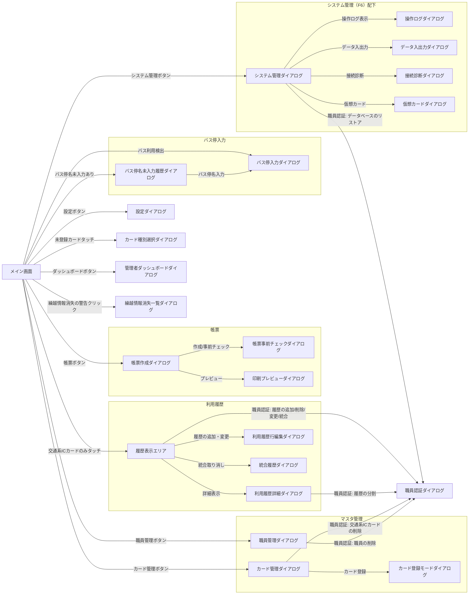
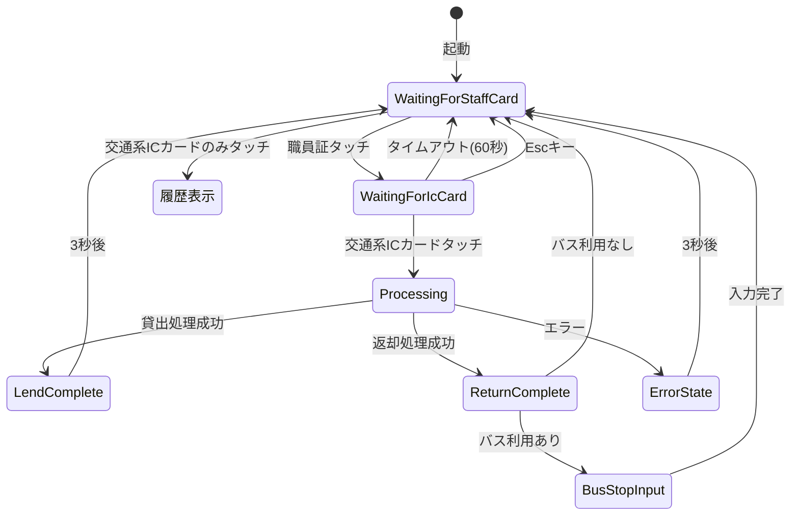

# 画面設計書

## 0. このドキュメントについて

| 項目 | 内容 |
|------|------|
| **対象読者** | 本システムの開発者・保守担当者。UI 設計・変更・改修を行う人 |
| **前提知識** | `01_システム概要設計書.md`(主要機能の概要) / `04_機能設計書.md`(業務ロジック) |
| **このドキュメントで答えられる問い** | ・どんな画面/ダイアログがあるか<br>・画面間でどう遷移するか<br>・メイン画面の状態遷移と各状態の表示仕様<br>・UI/UX の色・音・フォント・アクセシビリティ方針 |
| **関連ドキュメント** | `04_機能設計書.md`(各機能仕様) / `05_クラス設計書.md`(ViewModel の責務) |

> **読み方のヒント**: まず §1 の画面遷移図で俯瞰 → §2 の画面一覧で探している画面を特定 → §3 の各画面詳細へ、という順で見てください。UI/UX の横断ルールは §4 にまとめています。

---

## 1. 画面遷移図


```mermaid
graph LR
    MAIN[メイン画面]
    SETTINGS[設定ダイアログ]
    CARDTYPE[カード種別選択ダイアログ]
    STAFFAUTH[職員認証ダイアログ]
    ADMINDASH[管理者ダッシュボードダイアログ]

    subgraph SG_MASTER[マスタ管理]
        STAFF[職員管理ダイアログ]
        CARD[カード管理ダイアログ]
        CARDREGMODE[カード登録モードダイアログ]
    end

    subgraph SG_HISTORY[利用履歴]
        HISTORY[履歴表示エリア]
        LEDGERDETAIL[利用履歴詳細ダイアログ]
        LEDGERROWEDIT[利用履歴行編集ダイアログ]
        MERGEHIST[統合履歴ダイアログ]
    end

    subgraph SG_REPORT[帳票]
        REPORT[帳票作成ダイアログ]
        PREFLIGHT[帳票事前チェックダイアログ]
        PREVIEW[印刷プレビューダイアログ]
    end

    subgraph SG_BUSSTOP[バス停入力]
        BUSSTOP[バス停入力ダイアログ]
        INCBUSSTOP[バス停名未入力履歴ダイアログ]
    end

    CARRYLOSS[繰越情報消失一覧ダイアログ]

    subgraph SG_SYSTEM[システム管理（F6）配下]
        SYSMGMT[システム管理ダイアログ]
        OPLOG[操作ログダイアログ]
        DATAEXIMP[データ入出力ダイアログ]
        DIAG[接続診断ダイアログ]
        VIRTUALCARD[仮想カードダイアログ]
    end

    MAIN -->|職員管理ボタン| STAFF
    MAIN -->|カード管理ボタン| CARD
    MAIN -->|設定ボタン| SETTINGS
    MAIN -->|帳票ボタン| REPORT
    MAIN -->|システム管理ボタン| SYSMGMT
    MAIN -->|ダッシュボードボタン| ADMINDASH
    MAIN -->|交通系ICカードのみタッチ| HISTORY
    MAIN -->|バス利用検出| BUSSTOP
    MAIN -->|未登録カードタッチ| CARDTYPE
    MAIN -->|バス停名未入力あり| INCBUSSTOP
    MAIN -->|繰越情報消失の警告クリック| CARRYLOSS

    CARD -->|カード登録| CARDREGMODE
    HISTORY -->|詳細表示| LEDGERDETAIL
    HISTORY -->|履歴の追加・変更| LEDGERROWEDIT
    HISTORY -->|統合取り消し| MERGEHIST
    REPORT -->|作成/事前チェック| PREFLIGHT
    REPORT -->|プレビュー| PREVIEW
    INCBUSSTOP -->|バス停名入力| BUSSTOP
    SYSMGMT -->|操作ログ表示| OPLOG
    SYSMGMT -->|データ入出力| DATAEXIMP
    SYSMGMT -->|接続診断| DIAG
    SYSMGMT -->|仮想カード| VIRTUALCARD

    CARD -->|職員認証: 交通系ICカードの削除| STAFFAUTH
    STAFF -->|職員認証: 職員の削除| STAFFAUTH
    HISTORY -->|職員認証: 履歴の追加/削除/変更/統合| STAFFAUTH
    LEDGERDETAIL -->|職員認証: 履歴の分割| STAFFAUTH
    SYSMGMT -->|職員認証: データベースのリストア| STAFFAUTH
```

> **図の読み方**
>
> - **戻りの遷移は描いていない**。各ダイアログは「閉じる」「キャンセル」で**呼び出し元の画面へ戻る**（例: 操作ログダイアログ → システム管理ダイアログ）。この規則は全ダイアログに共通するため、1 本ずつ描くとエッジ数が倍増して図が読めなくなる。呼び出し元**以外**へ遷移する例外だけをエッジで示す（`バス停名未入力履歴ダイアログ → バス停入力ダイアログ` が該当）。
> - **「〜ダイアログ」以外のノードは独立したウィンドウではない**。`HISTORY[履歴表示エリア]` は `MainWindow` 内に埋め込まれた表示領域（§3.7）であり、`Views/Dialogs/` に対応するファイルは存在しない。`MAIN[メイン画面]` はメインウィンドウそのもの（`MainWindow.xaml`）。それ以外のノードはすべて §2 画面一覧のダイアログと 1 対 1 に対応する。
> - **職員認証は「操作の前」の関門であり、編集ダイアログの内側ではない**。たとえば履歴の追加は `MainViewModel.AddLedgerRow` が先に `IStaffAuthService.RequestAuthenticationAsync("履歴の追加")` を実行し、認証で得た職員 IDm を渡して利用履歴行編集ダイアログを開く。したがって認証のエッジは行編集ダイアログではなく、その呼び出し元（履歴表示エリア）から出る。
> - 職員認証を要求する操作は 8 種、エッジの起点は 5 画面（交通系ICカードの削除／職員の削除／履歴の追加・削除・変更・統合／履歴の分割／データベースのリストア）。内訳は §3.17 の「認証を要求する操作」表を参照。この対応関係は `ScreenTransitionDiagramConsistencyTests` で実装と突合している（Issue #1715）。

---

## 2. 画面一覧

| No. | 画面名 | ファイル名 | 概要 |
|-----|--------|------------|------|
| 1 | メイン画面 | MainWindow.xaml | 貸出・返却の操作画面 |
| 2 | 職員管理ダイアログ | StaffManageDialog.xaml | 職員の登録・編集・削除 |
| 3 | カード管理ダイアログ | CardManageDialog.xaml | 交通系ICカードの登録・編集・削除 |
| 4 | 設定ダイアログ | SettingsDialog.xaml | アプリケーション設定 |
| 5 | 帳票作成ダイアログ | ReportDialog.xaml | 月次帳票の作成 |
| 6 | バス停入力ダイアログ | BusStopInputDialog.xaml | バス停名の手入力 |
| 7 | カード種別選択ダイアログ | CardTypeSelectionDialog.xaml | 未登録カードの種別選択 |
| 8 | データ入出力ダイアログ | DataExportImportDialog.xaml | CSV形式でのデータ入出力 |
| 9 | 利用履歴詳細ダイアログ | LedgerDetailDialog.xaml | 利用履歴の詳細表示 |
| 10 | 利用履歴行編集ダイアログ | LedgerRowEditDialog.xaml | 利用履歴の追加・編集 |
| 11 | 操作ログダイアログ | OperationLogDialog.xaml | 操作ログの検索・表示 |
| 12 | 印刷プレビューダイアログ | PrintPreviewDialog.xaml | 帳票の印刷プレビュー |
| 13 | システム管理ダイアログ | SystemManageDialog.xaml | システム管理機能 |
| 14 | カード登録モードダイアログ | CardRegistrationModeDialog.xaml | カード登録方法の選択（Issue #510） |
| 15 | 職員認証ダイアログ | StaffAuthDialog.xaml | 職員証による操作者認証 |
| 16 | 統合履歴ダイアログ | MergeHistoryDialog.xaml | 統合履歴の一覧・取り消し（Issue #548） |
| 17 | バス停名未入力履歴ダイアログ | IncompleteBusStopDialog.xaml | バス停名未入力の履歴一覧・入力誘導（Issue #672） |
| 18 | 仮想カードダイアログ | VirtualCardDialog.xaml | DEBUGモード用仮想交通系ICカードタッチ |
| 19 | 帳票事前チェックダイアログ | ReportPreflightDialog.xaml | 帳票出力前の警告一覧・続行/中止の選択（Issue #1688） |
| 20 | 接続診断ダイアログ | ConnectionDiagnosticsDialog.xaml | DB・ICカードリーダー・バックアップ保存先の一括診断と結果コピー（Issue #1690） |
| 21 | 管理者ダッシュボードダイアログ | AdminDashboardDialog.xaml | 運用状況（貸出中・長期未返却・残額不足・帳票未出力）の俯瞰と利用分析（Issue #1692） |
| 22 | 繰越情報消失一覧ダイアログ | CarryoverDataLossDialog.xaml | 過去バージョンで失われた繰越累計・開始ページ番号の元の値を表示（Issue #1758） |

---

## 3. 画面詳細設計

### 3.1 メイン画面（MainWindow）

#### 3.1.1 画面レイアウト

```
+----------------------------------------------------------------------------+
| [ヘッダー]                                                                  |
| 交通系ICカード管理システム：ピッすい    2024/04/01 09:30  [設定][帳票][管理] |
+----------------------------------------------------------------------------+
| [次アクションガイド] 👤 待機中  貸出・返却は職員証を、履歴の確認は交通系IC…  |
+----------------------------------------------------------------------------+
| [タイムアウトバナー] ⏱ 交通系ICカードをタッチしてください [██████░░]  58秒   |
+----------------------------------------------------------------------------+
|                                                     |  [サイドバー]         |
|                                                     |  貸出中のカード       |
|                    [メインエリア]                    |  ・はやかけん H001    |
|                                                     |    4/1 9:00～         |
|                       💳                            |  ・nimoca N002        |
|             職員証をタッチしてください                |    4/1 8:30～         |
|                                                     |                       |
|                                                     |  [警告]               |
|                                                     |  ・H003 残高不足      |
+----------------------------------------------------------------------------+
| [操作ヒント] 職員証→交通系ICカードで貸出/返却 | [Esc]キャンセル             |
+----------------------------------------------------------------------------+
| 状態: 職員証タッチ待ち | 🔗 共有モード | 貸出中: 2枚                         |
+----------------------------------------------------------------------------+
```

> **共有モードインジケーター（3状態表示, Issue #1470）**: 共有フォルダモード（`database_config.txt` にパスが設定されている場合）で動作中の場合、ステータスバーに DB 接続状態を反映した 3 状態のインジケーターを表示する。スタンドアロンモード時は非表示。
>
> | 状態 | 表示 | 文字色（ブラシキー） | ToolTip |
> |------|------|----------------------|---------|
> | Connected（接続中、既定） | 🔗 共有モード | `PrimaryBrush` | 共有フォルダ上のデータベースに接続中です（複数PC同時利用） |
> | Reconnecting（再接続中） | 🔄 共有モード（再接続中） | `WarningActionBrush` | 共有DBへの接続を再試行中です |
> | Disconnected（切断中） | ⚠ 共有モード（切断中） | `ErrorBorderBrush` | 共有DBへの接続が切断されています。ネットワーク接続を確認してください |
>
> 状態遷移は `SharedModeMonitor` の 15 秒ごとのヘルスチェック結果に従い、Connected で失敗 → Disconnected、Disconnected の次のチェック実行中 → Reconnecting、Reconnecting で成功/失敗確定 → Connected/Disconnected の順で発火する。アイコン・色・テキスト・ToolTip の 4 要素で状態を伝達し、色覚多様性対応の原則を守る。
>
> 加えて、Connected → Disconnected への初回切断時には警告トースト（`ShowWarning`「共有DB接続が切断されました」）、Disconnected/Reconnecting → Connected への復帰時には情報トースト（`ShowInfo`「共有DB接続が復旧しました」）を 1 回ずつ発火する。Reconnecting → Disconnected の再失敗時はトーストを抑止して通知の連発を防ぐ。

> **ネットワーク切断警告バナー**: 共有フォルダモードでDB接続が失われた場合、メインエリア上部に警告バナー（`WarningType.DatabaseConnectionLost`）を表示する。背景色: #FFEBEE（薄い赤）。接続が回復すると自動的に非表示となる。ステータスバーの 3 状態表示（上記）と併用される設計で、ヘッダー警告は持続的な注意喚起、ステータスバーは現在の接続状態の常時表示、Toast は遷移エッジでの即時通知、と役割を分担する。

> **タイムアウト残り時間バナー（Issue #1682）**: 職員証タッチ後の交通系ICカードタッチ待ちの間、ヘッダー直下に残り時間バナー（案内テキスト＋プログレスバー＋残り秒数）を表示する。`MainViewModel.RemainingSeconds` が 1 以上のときだけ表示され（`IntToVisibilityConverter`）、0（カウントダウン停止中）は行ごと折りたたまれる。プログレスバーの最大値は `TimeoutSeconds`（既定 60 秒、`AppOptions.StaffCardTimeoutSeconds`）。
>
> | 状態 | 背景（ブラシキー） | 秒数文字色 | プログレスバー | 文言 |
> |------|--------------------|-----------|----------------|------|
> | 通常（残り11秒以上） | `WaitingBackgroundBrush` | `WaitingForegroundBrush` | `PrimaryBrush` | 「58秒」 |
> | 警告域（残り10秒以下） | `WarningBackgroundBrush` | `DangerTextBrush` | `WarningActionBrush` | 「⚠ 8秒」（⚠ を前置） |
>
> 警告域の判定・文言生成は `AuthTimeoutDisplay.IsWarning` / `FormatRemaining`（Issue #1613、警告閾値 10 秒）を `StaffAuthDialog` と共用する。色だけに依存せず ⚠ アイコンとテキストを併用する（UI/UX 4要素原則）。警告域進入時の警告音は鳴らさない（タイムアウト確定時に警告音＋「時間切れ」トーストが出る #1683 の挙動を維持）。

> **次アクションガイド（Issue #1684）**: ヘッダー直下（タイムアウトバナーの上）に、現在の状態と次に行う操作の案内を**常設表示**する。トースト通知（数秒で消える）を見逃しても画面上に誘導が残るようにするための恒久表示で、トースト通知は補助として維持する。
>
> | 状態（`AppState`） | アイコン | 状態名 | 操作案内文言 | 背景（ブラシキー） |
> |--------------------|----------|--------|--------------|--------------------|
> | WaitingForStaffCard | 👤 | 待機中 | 貸出・返却は職員証を、履歴の確認は交通系ICカードをタッチしてください | `WaitingBackgroundBrush` |
> | WaitingForIcCard | 🚃 | 交通系ICカードタッチ待ち | ○○さん、交通系ICカードをタッチしてください（操作者名入り） | `ReturnBackgroundBrush`（操作ヒント用途兼用、Issue #1399） |
> | Processing | ⏳ | 処理中 | 処理中です。そのままお待ちください | `WaitingBackgroundBrush` |
>
> WaitingForStaffCard の状態名・文言を「職員証タッチ待ち／職員証をタッチしてください」と**しない**のは意図的な設計判断。この状態は職員証（貸出・返却）と交通系ICカード（履歴確認）の両方を受け付けるため、職員証に限定した文言では「履歴確認や帳票出力にも認証が必要」という誤解・不安を招く。
>
> 表示文言は `MainViewModel` の導出プロパティ `NextActionStateText` / `NextActionIcon` / `NextActionMessage` が `CurrentState` から生成する。`StatusMessage` は職員証タッチ後に意図的にクリアされる（Issue #186、メイン画面を変えずトーストのみ表示する設計）ため常設表示には使わない。交通系ICカードタッチ待ち中に別の職員証をタッチした場合（持ち替え、Issue #1211）は状態が変化しないため、文言のみ新しい操作者名へ更新される。アイコン・状態名・文言・背景色の4要素で状態を伝達する（色のみに依存しない原則）。スクリーンリーダー向けに `AutomationProperties.LiveSetting="Polite"` を設定し、状態変化を読み上げ対象とする。

#### 3.1.1a ウィンドウサイズと機能ボタン列（Issue #1692）

既定サイズは **1650 × 700**、最小幅は `WindowMinWidth`（1400、文字サイズによらず固定）。

ヘッダーの機能ボタンは `WrapPanel` に並ぶため、幅が足りなければ 2 段へ折り返して壊れないが、**ヘッダーが縦幅を食うため既定幅では 1 段に収める**。タイトル＋ボタン列＋余白の必要幅は文字サイズによって変わる（Yu Gothic UI・WPF `FormattedText` での実測）:

| 文字サイズ | 必要幅 | 既定幅 1650 |
|---|---|---|
| 小（12） | 1,305 | ◯ |
| 中（14） | 1,441 | ◯ |
| 大（16） | 1,592 | ◯ |
| 特大（20） | 1,864 | 折り返し（2 段） |

既定幅は「大」まで 1 段に収まる値とする。特大を 1 段に収めるには 1,900px 超が必要で業務 PC の画面幅に収まらないため、`WrapPanel` の折り返しに委ねる。

**最小幅は上げない**。縮めたときに 2 段になるのは意図した挙動であり、最小幅を上げると低解像度環境でウィンドウを画面内に収められなくなる。

> **ボタンを増やすとき／ラベルを長くするときは必要幅を測り直すこと**。F8（管理者ダッシュボード）の追加時は、追加前 1,442（大）→ 追加後 1,592 となり、当時の既定幅 1450 では「大」で新たに折り返しが発生した。

> **既存環境への反映**: ウィンドウの位置とサイズは `AppSettings.MainWindowSettings` に保存され、次回起動時に復元される（`MainWindow.RestoreWindowPositionAsync`）。したがって**既定サイズの変更が効くのは、保存された設定を持たない新規インストール時のみ**。既存環境で反映するには利用者がウィンドウを手動で広げる必要がある。

#### 3.1.2 領域説明

| 領域 | 説明 |
|------|------|
| ヘッダー | システム名、現在日時、各種ボタン |
| 次アクションガイド | 現在の状態（アイコン＋状態名）と次に行う操作の案内を常設表示（Issue #1684） |
| タイムアウトバナー | 交通系ICカードタッチ待ちの残り時間（プログレスバー＋秒数）。待機中以外は非表示（Issue #1682） |
| メインエリア | 状態アイコン、ステータスメッセージ |
| サイドバー | 貸出中カード一覧、警告メッセージ |
| カード残高ダッシュボード | 登録カードの残高・貸出状態・最終利用日を一覧表示。並び替え機能あり（§3.1.4）。**管理者ダッシュボード（§3.23）とは別物** |
| 操作ヒント | 操作方法のガイダンス |
| ステータスバー | 現在の状態、貸出中カード数、共有モードインジケーター |

#### 3.1.3 状態別表示

| 状態 | アイコン | メッセージ | 背景色 |
|------|----------|------------|--------|
| 職員証タッチ待ち | 💳 | 職員証をタッチしてください | 白 |
| 交通系ICカードタッチ待ち | 🚃 | 交通系ICカードをタッチしてください | 白 |
| 貸出完了 | 🚃→ | 貸出しました | #FFF3E0（薄いオレンジ、`LendingBackgroundBrush`） |
| 返却完了 | 🏠← | 返却しました | #E3F2FD（薄い水色、`ReturnBackgroundBrush`） |
| エラー | ⚠️ | エラーメッセージ | #FFEBEE（薄い赤、`ErrorBackgroundBrush`） |

> **色値の Single Source of Truth**: 上記の色値は `Resources/Styles/AccessibilityStyles.xaml` 内のブラシキーで定義されており、View からは `DynamicResource` で参照する。色値そのものを XAML/コードに直接書かないこと（Issue #1392）。

#### 3.1.4 カード残高ダッシュボードの並び替え

> **用語の区別（Issue #1692）**: メイン画面内のこの一覧は「**カード残高ダッシュボード**」であり、窓口操作中に残額を確かめるためのもの（実装は `DashboardService` / `CardBalanceDashboardItem`）。F8 で開く「**管理者ダッシュボード**」（§3.23、実装は `AdminDashboardService`）とは目的も実装も別。単に「ダッシュボード」と書かないこと。

カード残高ダッシュボードは以下の基準で並び替え可能。

| 並び替え | 説明 |
|----------|------|
| カード名順 | カード種別・管理番号順（デフォルト） |
| 残高（少ない順） | 残高が少ないカードを先頭に表示 |
| 残高（多い順） | 残高が多いカードを先頭に表示 |
| 最終利用日順 | 最後に使用されたカードを先頭に表示 |

---

### 3.2 状態遷移図


```mermaid
stateDiagram-v2
    [*] --> WaitingForStaffCard: 起動

    WaitingForStaffCard --> WaitingForIcCard: 職員証タッチ
    WaitingForStaffCard --> 履歴表示: 交通系ICカードのみタッチ

    WaitingForIcCard --> Processing: 交通系ICカードタッチ
    WaitingForIcCard --> WaitingForStaffCard: タイムアウト(60秒)
    WaitingForIcCard --> WaitingForStaffCard: Escキー

    Processing --> LendComplete: 貸出処理成功
    Processing --> ReturnComplete: 返却処理成功
    Processing --> ErrorState: エラー

    LendComplete --> WaitingForStaffCard: 3秒後
    ReturnComplete --> BusStopInput: バス利用あり
    ReturnComplete --> WaitingForStaffCard: バス利用なし

    BusStopInput --> WaitingForStaffCard: 入力完了

    ErrorState --> WaitingForStaffCard: 3秒後
```

#### 状態説明

| 状態 | 説明 | タイムアウト |
|------|------|--------------|
| WaitingForStaffCard | 職員証タッチ待ち | なし |
| WaitingForIcCard | 交通系ICカードタッチ待ち | 60秒 |
| Processing | 処理中 | なし |
| LendComplete | 貸出完了 | 3秒 |
| ReturnComplete | 返却完了 | 3秒 |
| ErrorState | エラー表示 | 3秒 |
| BusStopInput | バス停入力待ち | なし |

#### Processing からの離脱は例外経路でも保証する（Issue #1725）

`Processing` には**タイムアウトが無く、また `Processing` 中は他のあらゆる復帰手段が塞がっている**ため、この状態から抜けられなくなるとアプリ再起動以外に復旧できない。

塞がる復帰手段:

| 手段 | Processing 中の挙動 | 実装 |
|------|--------------------|------|
| カードタッチ | 冒頭の「処理中は無視」で破棄される | `MainViewModel.HandleCardReadAsync` |
| 60秒タイムアウト | 交通系ICカードタッチ受付時に `StopTimeout()` 済みでタイマーが動いていない | `HandleCardInIcCardWaitingStateAsync` |
| Esc キー | `WaitingForIcCard` のときだけリセットする | `MainViewModel.Cancel` |
| 共有モードの定期リフレッシュ | `Processing` 中はスキップする | `RefreshSharedDataAsync` |

したがって **`Processing` の解除（`ResetState()`）は `try/finally` で保証する**こと。`ProcessLendAsync` / `ProcessReturnAsync` は成功・失敗の各分岐末尾で `ResetState()` を呼ぶ形になっていたため、その間の後処理（貸出中カード一覧・残高ダッシュボード・履歴の更新、警告再チェック、バス停入力ダイアログ）で例外が出ると `Processing` のまま制御が抜け、以後の全タッチが無視されていた（Issue #1725）。

- 記録が確定した後の失敗では、**「もう一度タッチしてください」と案内してはならない**。30秒以内の再タッチは逆処理（貸出→返却）として扱われるため、案内どおり操作すると記録済みの貸出／返却が取り消される。「◯◯は記録済み」＋「再タッチしないでください」と案内し、音も中立的な `SoundType.Warning` を使う（記録は成功しているためエラー音は事実と矛盾する。時間切れを警告音で扱う Issue #1683 と同じ考え方）
- 30秒ルール用の操作者情報（`_lastProcessedStaffIdm` / `_lastProcessedStaffName`）は**後処理より前に確定させる**。後に置くと、後処理が例外で終わったとき保存されず、直後の再タッチが「操作者情報がありません」で止まる
- ただしこの操作者情報を**逆処理で使うのは、現在の操作者が未確定のときだけ**（Issue #1729）。職員証をタッチ済みの状態から再タッチした場合に前回操作者で上書きすると、実際に操作した職員とは別の職員が台帳・貸出者・操作ログに記録される。詳細は `04_機能設計書.md` §3.4

---

### 3.3 職員管理ダイアログ（StaffManageDialog）

```
+--------------------------------------------------+
| 職員管理                                    [×] |
+--------------------------------------------------+
| [新規登録]                                       |
|                                                  |
| +----------------------------------------------+ |
| | 職員番号 | 氏名        | 備考           | |
| |----------|-------------|----------------| |
| | A001     | 山田 太郎   |                | |
| | A002     | 鈴木 花子   | 総務課         | |
| +----------------------------------------------+ |
|                                                  |
| [閉じる]                                         |
+--------------------------------------------------+
```

#### 機能

- 職員一覧表示（論理削除されていないもの）
- 新規登録（職員証タッチでIDm取得）
- 編集（氏名、職員番号、備考）
- 論理削除

#### ステータス欄の配置（Issue #1759）

右ペインは 4 行（ヘッダー／フォーム本体／**ステータス**／ボタン）で構成する。ステータス欄は「フォーム本体」「ボタン」と異なり **`Visibility="{Binding IsEditing}"` に紐付けない**。

- **理由**: 削除の結果表示は**非編集時**（削除ボタンは非編集時にしか押せない）と `CancelEdit()` 後に設定されるため、編集フォーム内に置くと「削除しました」も競合エラーの案内も**一度も表示されない**
- **「所在」だけでは足りない — 「順序」も必要**: `CancelEdit()` は `StatusMessage` をクリアするため、完了メッセージは**必ず `CancelEdit()` のあとに設定する**。ステータス欄をこの行へ移しても、設定が `CancelEdit()` より前にあればやはり表示されない。両ダイアログの成功経路（登録・更新・削除・払戻・復元）はすべてこの順序に揃えてある（Issue #1727 / #1759）
- 未設定時は `DataTrigger` で行ごと `Collapsed` にし、ボタン位置がずれないようにする
- 競合エラーの案内は 90 文字程度になるため `TextWrapping="Wrap"` を必須とする（文字サイズ4段階に耐えるよう幅ではなく折り返しで担保する）
- カード管理ダイアログ（§3.4）は Issue #1727 で同じ構成に是正済み。回帰は `StaffManageDialogStatusAreaLayoutTests` / `CardManageDialogStatusAreaLayoutTests` が XAML テキスト上の静的検証で固定する

---

### 3.4 カード管理ダイアログ（CardManageDialog）

```
+--------------------------------------------------+
| カード管理                                  [×] |
+--------------------------------------------------+
| [新規登録]                                       |
|                                                  |
| +----------------------------------------------+ |
| | 種別      | 管理番号 | 備考   | 状態    | |
| |-----------|----------|--------|---------|  |
| | はやかけん | H001     |        | 返却済  | |
| | nimoca    | N002     |        | 貸出中  | |
| +----------------------------------------------+ |
|                                                  |
| [閉じる]                     [削除][払い戻し]   |
+--------------------------------------------------+
```

#### 機能

- カード一覧表示（論理削除されていないもの）
- 新規登録（交通系ICカードタッチでIDm取得、種別はユーザーが手動選択）
- 編集（管理番号、備考）
- 論理削除（貸出中のカードは削除不可）
- 払い戻し（残高を払出金額として記録し、カードを論理削除）

#### 3.4.1 右ペインの行構成とステータス欄の所在（Issue #1727）

右ペイン（幅 350）は 4 行の Grid で構成する。

| 行 | 内容 | 表示条件 |
|----|------|---------|
| 0 | フォームヘッダー（「新規登録」/「交通系ICカード編集」） | 常時 |
| 1 | フォーム本体（種別・管理番号・備考）／未選択時の案内 | `IsEditing`（案内は `!IsEditing && SelectedCard == null`） |
| 2 | **ステータスメッセージ** | **常時**（文字列が空のときのみ `Collapsed`） |
| 3 | フォームボタン（キャンセル・保存） | `IsEditing` |

**ステータス欄を行 1 の内側に置いてはならない。** 保存完了時は `CancelEdit()` が `IsEditing = false` にするため、行 1 に置くとパネルごと `Collapsed` になり、「登録しました」「カードは登録しましたが利用履歴を取り込めませんでした…」が**設定されても一度も表示されない**。Issue #1727 以前は実際にこの状態で、完了メッセージが表示されていなかった。

この欄は 2 つの用途を兼ねる。分けると同じ規約が 2 か所に散る（`.claude/rules/development-conventions.md` の UI/UX 原則を参照）。

- 編集中のバリデーションエラー（`IsStatusError = true` で赤字）
- 保存・更新・復元の完了メッセージ（`CancelEdit()` の**あと**に設定する）

文字サイズが4段階で変わるため、幅ではなく `TextWrapping="Wrap"` で担保する。回帰は `CardManageDialogStatusAreaLayoutTests`（XAML テキスト上の静的検証）で固定する。

---

### 3.5 設定ダイアログ（SettingsDialog）

```
+--------------------------------------------------+
| 設定                                        [×] |
+--------------------------------------------------+
|                                                  |
| 文字サイズ:                                      |
| (●) 小  (○) 中  (○) 大  (○) 特大              |
|                                                  |
| 残高警告閾値:                                    |
| [    10000    ] 円                               |
|                                                  |
| 音声フィードバック:                              |
| [✓] 有効                                         |
|                                                  |
+--------------------------------------------------+
| [保存]  [キャンセル]                             |
+--------------------------------------------------+
```

#### 設定項目

設定項目は `Models/AppSettings.cs` のプロパティ順に対応する。

| 項目 | プロパティ | 設定値 | デフォルト |
|------|-----------|--------|------------|
| 残高警告閾値 | `WarningBalance` | 0～20,000円 | 10,000円 |
| バックアップ先フォルダ | `BackupPath` | 任意のフォルダパス | アプリケーションフォルダ |
| 文字サイズ | `FontSize` | 小/中/大/特大 | 中 |
| 最終VACUUM実行日 | `LastVacuumDate` | 自動記録（UI非表示） | NULL |
| メインウィンドウ位置・サイズ | `MainWindowSettings` | 自動記録（UI非表示） | 既定 |
| 音声モード | `SoundMode` | 効果音/音声（男性）/音声（女性）/無し | 効果音 |
| トースト通知の表示位置 | `ToastPosition` | 右上/左上/右下/左下 | 右上 |
| 部署種別 | `DepartmentType` | 市長事務部局（役務費）/企業会計部局（旅費） | 市長事務部局 |
| 返却時のバス停入力スキップ | `SkipBusStopInputOnReturn` | 有効/無効 | 無効 |
| 帳票出力先フォルダ | `ReportOutputFolder` | 任意のフォルダパス | 空（毎回ダイアログで選択） |
| データベースパス | （`database_config.txt`） | フォルダパス（UNCパス対応） | 空（ローカルデフォルト） |

> `LastVacuumDate` および `MainWindowSettings` はアプリが内部的に保存する状態であり、設定ダイアログには表示しない。
> データベースパスは settings テーブルではなく `C:\ProgramData\ICCardManager\database_config.txt` で管理する。

> **データベースパス設定**: データベースファイルの保存先フォルダを指定する。UNCパス（例: `\\server\share\ICCardManager`）を指定すると共有フォルダモードとなり、複数PCからの同時利用が可能となる。空の場合はローカルの`%PROGRAMDATA%\ICCardManager`が使用される。フォルダ選択ダイアログで指定可能。設定変更後はアプリケーションの再起動が必要。

---

### 3.6 帳票作成ダイアログ（ReportDialog）

```
+--------------------------------------------------+
| 帳票作成                                    [×] |
+--------------------------------------------------+
|                                                  |
| 対象年月: [先月][今月] [2024]年 [4]月 ▼          |
|                                                  |
| 出力先フォルダ:                                  |
| [C:\Users\...\Documents              ] [参照]   |
|                                                  |
| 対象カード:                                      |
| [✓全選択] 2024年4月: 出力済み 1件 / 未出力 2件    |
|                    [先月分を一括出力][出力状況を更新] |
| [✓] はやかけん H001        ✅ 出力済み(04/30 10:12)|
| [✓] nimoca N002       ⚠ 警告2件  ⬜ 未出力       |
| [ ] SUGOCA S003                  ⬜ 未出力       |
|                                                  |
| 作成結果（帳票作成完了後に展開）:                |
| 📄 物品出納簿_H001_2024年04月.xlsx (青色リンク) |
| 📄 物品出納簿_N002_2024年04月.xlsx (青色リンク) |
| [出力フォルダを開く]                             |
|                                                  |
+--------------------------------------------------+
| 12件の帳票を作成しました                         |
| [閉じる] [事前チェック] [プレビュー] [作成]      |
+--------------------------------------------------+
```

#### 機能

- 対象年月の選択（「先月」「今月」のクイック選択、年・月ドロップダウン）
- 対象カードの複数選択（「すべて選択」チェックボックス対応）
- 出力先フォルダの指定（共有フォルダ UNC パス対応）
- **出力前プリフライトチェック**（「事前チェック」ボタン、および「作成」時の自動実行 — Issue #1688。§3.21 参照）
- **出力済み / 未出力チェックリスト**（カードごとの出力状況表示、Issue #1691。後述）
- **「先月分を一括出力」ボタン**（対象年月を先月に切り替え、払戻済を除く全カードを選択して作成 — Issue #1691）
- 帳票の一括作成
- **作成済みファイルの一覧表示**（複数カード一括作成時、`HasCreatedFiles` プロパティで Visibility を制御 — Issue #1410）
- ファイル名クリックで既定アプリ（Excel）が起動して直接ファイルを開く（`Hyperlink` で表現）
- 「出力フォルダを開く」ボタンで保存先をエクスプローラーで開く
- 作成完了状況のステータスメッセージ表示（左下、`StatusMessage` プロパティ）

#### ステータス欄のはみ出し防止（Issue #1688）

ボタンエリアは Grid の2列（`*` = ステータスメッセージ / `Auto` = ボタン）で構成される。ボタンを追加すると `Auto` 列が広がり `*` 列が狭くなるが、**Grid は既定で子をクリップしない**ため、`TextWrapping="Wrap"` がないとステータス文字がボタンの下へはみ出す（「事前チェック」ボタン追加時に実機で発生）。文字サイズ「大」「特大」でも同じ現象が起きるため、幅の調整ではなく折り返しで担保する。

あわせてボタンの `StackPanel` に `VerticalAlignment="Center"` を付与し、ステータスが2行に折り返して行が高くなってもボタンが縦に引き伸ばされないようにする。

ステータス文言自体もボタン列と幅を分け合うため簡潔にする（例:「事前チェック: 警告3件」「帳票作成を中止しました」）。「なぜ」「どうすれば」は直前の結果ダイアログで提示済みのため、ステータス欄では繰り返さない。

回帰テスト: `ReportDialogStatusAreaLayoutTests`（XAML テキスト上の静的検証）。

#### 出力済み / 未出力チェックリスト（Issue #1691）

どのカードの帳票を出力済みかの管理がアプリ外（担当者の記憶・メモ）に依存していたため、対象カード一覧の各行に出力状況を表示する。

**判定方法**: 出力先フォルダにある年度ファイル（`物品出納簿_○○_YYYY年度.xlsx`）を開き、対象月のシート（`N月`）が存在するかで判定する（`ReportExportStatusService`）。DB に出力履歴を持たないため、**表示は常に手元のファイルと一致する**（出力後にファイルを消せば「未出力」に戻る）。年度ファイルは月ごとにシートを追記していく形式（Issue #477）のため、**ファイルの存在だけで判定してはならない**（4月を出しただけで全月が出力済みに見える）。

シート名の読み取りは `XlsxSheetNameReader` が xlsx（OPC/ZIP）の `xl/workbook.xml` だけを解析する。ClosedXML でブック全体を開くとセル値・書式まで解析され、カード枚数（最大約20枚）ぶんを画面表示のたびに走査する用途には重すぎるため。`FileShare.ReadWrite` で開くので、対象ブックを Excel で開いたままでも判定できる。

| 状態 | アイコン | テキスト | 文字色（リソースキー） | 条件 |
|------|---------|---------|---------------------|------|
| 出力済み | ✅ | 出力済み（最終更新日時） | `SuccessForegroundBrush` | 年度ファイルに対象月のシートがある |
| 未出力 | ⬜ | 未出力 | `SecondaryTextBrush` | 年度ファイルが無い、または対象月のシートが無い |
| 判定不能 | ❓ | 確認できません | `MutedTextBrush` | 出力先フォルダが未指定/存在しない、ファイルが壊れている・読めない |

出力先フォルダが読めない場合を「未出力」にせず「判定不能」とするのは、フォルダを選び直せば解決する問題を「未出力」と表示すると、出力済みのカードを二重に出力させてしまうため。

再判定のタイミング: ダイアログ初期化時 / 対象年月の変更時 / 出力先フォルダの変更時 / カード一覧の再読込時 / 帳票作成の完了時（**中断・一部失敗時も `finally` で実行** — 「どこまで出せたか」が最も知りたい場面のため）/ 「出力状況を更新」ボタン押下時。

**プリフライト警告のマーク**: 「事前チェック」および「作成」時の自動チェックで検出された警告を、カードごとの件数（`⚠ 警告N件`）として同じ行に表示する（`ReportViewModel.ApplyPreflightWarnings`）。チェック対象は選択中カードのみのため、実行のたびに全カードを0件へ戻してから件数を割り当てる（前回の古い警告が残らないようにする）。

#### カード行のレイアウト（Issue #1691）

カード行は元々 横 `StackPanel` に固定 `Width` の `TextBlock` を並べる構成だったが、**横 StackPanel は子を無限幅で測定する**ため `TextWrapping="Wrap"` が効かない（Issue #1687）。備考と出力状況が幅を分け合う構成になったため、`Grid`（種別 `Auto` / 番号 `Auto` / 備考 `*` / 警告 `Auto` / 出力状況 `Auto`）へ変更し、備考には `TextWrapping="Wrap"` を明示する。

状態は色のみに依存せず**アイコン＋テキスト＋色**の3要素で伝える。色は `CardDto.ExportStateBrushKey` がリソースキー名を返し、XAML 側の `ResourceKeyToBrushConverter` でブラシへ解決する（色値リテラル禁止 — Issue #1392 / #1461）。スクリーンリーダーには `ExportStateAccessibilityText` / `PreflightWarningAccessibilityText` を読み上げさせる。

回帰テスト: `ReportDialogCardListLayoutTests`（XAML テキスト上の静的検証）。

#### Visibility 制御の注意点

「作成結果」GroupBox の表示は `ReportViewModel.HasCreatedFiles`（`bool` プロパティ）でバインドする。`CreatedFiles.Count` を直接 `BooleanToVisibilityConverter` に渡しても WPF 標準の Converter は `int` を `bool` に変換できず常に `Collapsed` となるため使用しない（Issue #1410）。`CreatedFiles.CollectionChanged` を購読して `HasCreatedFiles` の `PropertyChanged` を発火させる仕組み。

---

### 3.7 履歴表示エリア（メインウィンドウ内）

メインウィンドウ内に埋め込まれた利用履歴の表示エリア。交通系ICカードをタッチすると表示される。

```
+--------------------------------------------------+
| はやかけん 5042  現在残高: 76円   [✕ 閉じる]     |
+--------------------------------------------------+
| 表示期間: [2026年3月]  [先月] [今月] [その他の月…]|
|            [＋ 行を追加] [📦 統合] [↩ 元に戻す]  |
| +----------------------------------------------+ |
| |☐| 日付  | 摘要              | 受入 | 払出   | |
| |--|-------|-------------------|------|--------| |
| |☐| 4/1   | 鉄道（博多～天神）|      | 260    | |
| |☐| 4/1   | バス（★）        |      | 200    | |
| |☐| 4/2   | 役務費によりチャージ| 3000|        | |
| +----------------------------------------------+ |
| ⏮ ◀ ページ 1/1 ▶ ⏭    表示件数: [50] 全3件   |
+--------------------------------------------------+
```

#### 機能

- 月単位の期間選択（先月・今月のクイック選択、その他の月の任意選択）
- 表示期間テキスト（「2026年3月」等）のクリックで月選択ポップアップを表示
- 利用履歴の一覧表示（日付、摘要、受入、払出、残高、利用者、備考、操作）
- ページネーション（表示件数選択付き）
- チェックボックスによる履歴の統合・統合の取り消し
- 行の手動追加・変更・詳細表示

---

### 3.8 バス停入力ダイアログ（BusStopInputDialog）

```
+----------------------------------------------------------+
| バス停名入力                                        [×] |
+----------------------------------------------------------+
| バス利用のバス停名を入力してください                     |
| 「乗車バス停～降車バス停」の形式で入力してください       |
|                                                          |
| 04/01 09:15  200円  [天神～博多駅前              ]       |
| 04/01 18:30  200円  [                            ][↑往復]|
| 04/02 08:00  200円  [                            ][↑往復]|
|                                                          |
+----------------------------------------------------------+
| [後で入力（スキップ）]                          [保存]   |
+----------------------------------------------------------+
```

#### 機能

- バス利用情報の表示（利用日時・金額）
- バス停名の入力（「乗車バス停～降車バス停」形式）
- 過去の入力履歴からのオートコンプリート（先頭一致／部分一致）
- **「往復」ボタン**（Issue #1570）: 2 行目以降に表示。1 行上の「A～B」を反転して「B～A」を当該行にセットする
- スキップ（★マークで保存）

#### 「往復」ボタンの動作仕様（Issue #1570）

| 前の行の値 | 動作 |
|-----------|------|
| `天神～博多駅前` | 当該行に `博多駅前～天神` をセット |
| `  天神  ～  博多  `（前後空白あり） | 当該行に `博多～天神` をセット（トリム） |
| 空欄／null | 何もしない |
| `★`（未入力プレースホルダー） | 何もしない |
| `天神博多`（「～」なし） | 何もしない |
| `天神～博多～小倉`（「～」が複数） | 何もしない（仕様外） |

- 先頭行（`PreviousItem == null`）ではボタン自体が非表示（`BooleanToVisibilityConverter`）
- 当該行に既存値があってもユーザーの明示操作とみなして上書きする

---

### 3.9 カード種別選択ダイアログ（CardTypeSelectionDialog）

```
+--------------------------------------------------+
| カード種別の選択                            [×] |
+--------------------------------------------------+
|                                                  |
| ❓ 未登録のカードです                            |
|    どのように登録しますか？                      |
|                                                  |
| +----------------------------------------------+ |
| | 💡 ヒント: 職員の認証に使用するカードは「職員証」、|
| |    交通費精算に使用するカードは「交通系ICカード」 |
| |    を選択してください。                        |
| +----------------------------------------------+ |
|                                                  |
| [職員証]  [交通系ICカード]  [キャンセル]         |
+--------------------------------------------------+
```

#### 機能

- 未登録カードを検出した際の種別選択
- 職員証として登録するか、交通系ICカードとして登録するかを選択
- ヒント表示による操作ガイダンス

#### ボタン説明

| ボタン | 色 | 動作 |
|--------|-----|------|
| 職員証 | 青(#2196F3) | 職員登録ダイアログを開く |
| 交通系ICカード | 緑(#4CAF50) | カード登録ダイアログを開く |
| キャンセル | グレー | 登録せずに閉じる |

---

### 3.10 データ入出力ダイアログ（DataExportImportDialog）

```
+------------------------------------------------------------------+
| データエクスポート/インポート                               [×] |
+------------------------------------------------------------------+
| [エクスポート]                                                   |
| データをCSVファイルに出力します                                  |
|                                                                  |
| データ種別: [職員         ▼]                                     |
| 対象期間:   [2024/04/01] ～ [2024/04/30]  (履歴のみ)             |
| [✓] 削除済みデータを含める                                       |
|                                                                  |
| [CSVエクスポート]                                                |
+------------------------------------------------------------------+
| [インポート]                                                     |
| CSVファイルからデータを取り込みます                              |
|                                                                  |
| データ種別: [職員         ▼]                                     |
| [✓] 既存データはスキップする                                     |
|                                                                  |
| [プレビュー]  [インポート実行]  [直接インポート]                 |
+------------------------------------------------------------------+
| [変更点プレビュー] [エラー詳細]                                  |
| +--------------------------------------------------------------+ |
| | 行 | IDm    | 名前   | 追加情報 | アクション | 変更点        | |
| |----|--------|--------|----------|------------|---------------| |
| | 1  | 0102.. | 山田   | A001     | 新規追加   |               | |
| | 2  | 1112.. | 鈴木   | A002     | 更新       | 氏名変更      | |
| +--------------------------------------------------------------+ |
|                                                   [閉じる]       |
+------------------------------------------------------------------+
```

#### 機能

**エクスポート**
- データ種別選択（職員/カード/履歴/履歴詳細）
- 期間指定（履歴・履歴詳細のみ）
- 削除済みデータの包含オプション
- CSVファイルへの出力

**インポート**
- データ種別選択（職員/カード/履歴/履歴詳細）
- プレビュー機能（変更点の事前確認）
- 既存データのスキップオプション（全項目一致時のみスキップ、差分があれば更新。Issue #1376）
- インポート先カード指定（履歴インポート時のみ）
- エラー詳細表示

**「インポート実行」ボタンの活性条件とプレビューの破棄（Issue #1781）**

「インポート実行」は `IsEnabled="{Binding HasPreview}"` で、プレビュー実行後にのみ押せる。**取り込みが1行でも確定したらプレビューを破棄し（`HasPreview=false`）、同じファイルで押し直せない状態にする**。

| 結果 | プレビュー | 理由 |
|------|-----------|------|
| 成功（`Success=true`） | 破棄 | 全件スキップ（`ImportedCount=0`）を含む。従来どおり |
| 一部エラー・`ImportedCount > 0` | **破棄** | 登録済みの行は確定しており、同じファイルの再取り込みは二重登録になる |
| 一部エラー・`ImportedCount = 0` | 維持 | 二重登録が起こり得ないため、職員の作業状態を捨てない |
| 失敗（`ErrorMessage` あり） | 維持 | 1行も書き込まれていない |

- 判断は「成否」ではなく**「書き込みが確定したか」**（`result.Success || result.ImportedCount > 0`）で、`HandleImportResultAsync` の1か所に集約する。分岐ごとに条件を持たせない
- **エラー一覧の表示条件は `ImportErrors.Count`** で `HasPreview` とは独立させる。プレビューを畳んでも修正対象の行が画面に残る必要があるため（完了メッセージを出す欄を、その完了処理で消える表示条件に紐付けない。Issue #1727）。取り込んだファイル名は `LastImportedFile` として別途表示され続ける（**取り込みが確定した場合のみ**。次項を参照）
- **破棄だけでは二重登録を防ぎきれない**（直した CSV を全行入りで取り込み直せば結局重複する）ため、部分成功の警告ダイアログに「登録済みの N 件は確定済み／同じファイルの再取り込みは二重登録／エラー行だけを残した CSV を作って再プレビュー」を3要素で明記する。`ImportedCount = 0` のときは二重登録に言及しない
- **経路（プレビュー経由／直接インポート）では分岐しない**（Issue #1782）。「直接インポート(_R)」はプレビューを入力としないが、無関係なのは入力元だけで、プレビューに表示された登録・スキップ件数は**取り込み前の DB を基準に算出した値**であり、別ファイルの取り込みが確定した時点で古くなる。残すと別ファイルのプレビューに対して「インポート実行」が有効なまま残り、押せば修正前のファイルを修正済みデータの上へ丸ごと取り込み直せてしまう。破棄するかどうかを呼び出し元の引数で選ばせない（`RunImportAsync` の `clearPreviewAfterImport` 引数は #1782 で撤廃）
- 直接インポートで**別ファイル**のプレビューを破棄したときは、完了ダイアログに「表示していた別ファイル『◯◯.csv』のプレビューはクリアした／取り込みで件数が最新でなくなったため／取り込む場合はあらためてプレビューしてから」を3要素で添える（`BuildDiscardedPreviewNotice`）。プレビュー経由の取り込みで消えるのは取り込んだファイル自身のプレビューであり、消えて当然のため案内しない
- **「インポート完了: ◯◯.csv」の表示（`LastImportedFile`）も同じ「書き込みが確定したか」で決める**（Issue #1783）。上表と同じ条件で表示・非表示が決まるため、`HandleImportResultAsync` の同じ分岐（`importCommitted`）に置き、独立した条件式を作らない。取り込み開始時（`RunImportAsync` 冒頭、`ImportErrors.Clear()` と同じ位置）に空へ戻すことで、**前回成功したファイル名が今回の失敗通知の隣に残らない**ようにする。例外で中断する経路（共有フォルダーの切断等）も同じ手当てで塞がる。エクスポート側（`LastExportedFile`）は元から `if (result.Success)` の内側で代入しており、この形が両者で揃う

**エラー付き終了の見出しも「書き込みが確定したか」で決める（Issue #1745）**

エラー付き終了（`Success=false` かつ `ErrorMessage` なし）は、従来は無条件に「部分成功」として通知していた。Issue #1745 で利用履歴のインポートがトランザクション化され、カード・職員と同様に 1 件でも失敗すれば全件ロールバックするようになったため、`ImportedCount = 0` が**通常の失敗形**になった。

| `ImportedCount` | ダイアログのタイトル | 本文の冒頭 | ステータス欄 |
|---|---|---|---|
| `> 0` | インポート完了（一部エラー） | インポートが完了しましたが、一部エラーがあります。 | 通常色（`IsStatusError = false`） |
| `= 0` | **インポートを中断しました** | エラーがあったため、インポートを中断しました。 | エラー色（`IsStatusError = true`） |

- 「完了」の見出しの隣で本文（`BuildPartialImportGuidance(0)`）が「登録が確定した行はありません」と述べる**自己矛盾**を作らない。職員はデータが入ったのか判断できなくなる（見出しと実態を一致させる、Issue #1783 と同じ判断）
- **判定には新しい条件式を立てず `importCommitted` に相乗りさせる**（同じ判断を 2 か所に分けない、Issue #1728）。この分岐では `Success = false` のため `importCommitted` は `ImportedCount > 0` と等価になる
- **カード・職員のインポートも同じ分岐を通る**ため 3 種別に効く。利用履歴詳細（`ImportLedgerDetailsAsync`）はトランザクションを持たず `ImportedCount > 0` になり得るため、従来どおり「完了（一部エラー）」が出る
- 管理者マニュアル §5.6.5 は**この見出しでデータ種別ごとの対処を見分けさせている**（「中断しました」＝丸ごと取り込み直す／「完了（一部エラー）」＝エラー行だけの CSV を作る）。文言を変えるときはマニュアルも同時に直すこと

**結果ダイアログと処理中オーバーレイを重ねない（Issue #1784）**

インポートの結果ダイアログ（完了／エラー／一部エラー）は、処理中オーバーレイ（`IsBusy` にバインドされた全面 Border＋不確定 `ProgressBar`＋「インポート中...」）が閉じたあとに表示する。`IDialogService` の実装は同期モーダル（`MessageBox.Show`）で、職員が OK を押すまで呼び出しスレッドをブロックするため、`using (BeginBusy(...))` スコープの内側から呼ぶと `BusyScope.Dispose()` が走らず、**「インポートが完了しました」の背後でプログレスバーが回り続ける**。職員は処理が終わったのか続いているのか判断できない。

- 実装は「結果を持ち回して後から分岐する」のではなく、**表示処理そのもの（`Action`）を遅延させて `RunImportAsync` のスコープ外で1回だけ実行する**。文言の組み立ては各分岐に残るため、分岐を増やしても組み立てと表示タイミングが離れない
- 遅延させた表示は `try`/`catch` で囲み、**通知の失敗を確定済みの取り込みの失敗として伝播させない**。この時点で行はコミット済み・監査ログも記録済みで、未捕捉例外にすると職員は成功直後のクラッシュを見て「データが入ったのか」を判断できない（Issue #1783 が消したはずの曖昧さの再発。「コミット確定後の後処理を、成否の判定に巻き込まない」Issue #1727）。結果は `SetStatus` 済みでステータス欄に残るため情報は失われない
- **本規約が適用済みなのは、CSV エクスポート（`ExportToFileAsync`、Issue #1383）・操作ログ Excel エクスポート（`OperationLogSearchViewModel.ExportToExcelFileAsync`、Issue #1383）・CSV インポート（`RunImportAsync`、Issue #1784）の3経路のみ**。**新規実装では `BeginBusy` スコープ内から `IDialogService.ShowXxx`（および `MessageBox.Show`）を呼ばないこと**
- **既存の未是正箇所**: カード管理（F2）・職員管理（F3）・システム管理（F6）に計10か所が残っており、**Issue #1793 で別途是正する**。とくに確認ダイアログ（`ShowConfirmation`）は戻り値で後続処理が分岐するため単純に外へ出せず、`BeginBusy` に入る前へ移すか一時的にスコープを閉じる仕組みが要る（同 Issue で検討）
- インポートプレビュー（`PreviewImportAsync`）はダイアログを表示せずステータス欄のみを更新するため、本規約の対象外
- 回帰は挙動テストに加え**ソーステキスト検査**で固定する（`DataExportImportViewModelImportPathSharingTests`）。挙動テストは既存分岐しか通らないため、新しい分岐だけが規約から外れても緑のまま通る

#### データ種別

| 種別 | エクスポート | インポート |
|------|--------------|------------|
| 職員 | ○ | ○ |
| カード | ○ | ○ |
| 履歴 | ○ | ○ |
| 履歴詳細 | ○ | ○ |

---

### 3.11 利用履歴詳細ダイアログ（LedgerDetailDialog）

```
+------------------------------------------------------------------+
| 利用履歴詳細                                                [×] |
+------------------------------------------------------------------+
| +--------------------------------------------------------------+ |
| | 4/1(月)    鉄道（博多駅～天神）           受入:     払出: 260 | |
| | 利用者: 山田太郎   備考: 出張               残高: ¥9,740     | |
| +--------------------------------------------------------------+ |
|                                                                  |
| +--------------------------------------------------------------+ |
| | 日時             | 区間              | 金額    | 残高        | |
| |------------------|-------------------|---------|-------------| |
| | 4/1 09:15        | 博多駅 → 天神    | -260円  | ¥9,740      | |
| | 4/1 17:30        | 天神 → 博多駅    | -260円  | ¥9,480      | |
| +--------------------------------------------------------------+ |
|                                                                  |
| 2件の利用詳細                                         [閉じる]   |
+------------------------------------------------------------------+
```

#### 機能

- 利用履歴の詳細情報（日付、摘要、金額、残高）をヘッダーに表示
- 個別の乗車記録（詳細）をDataGridで一覧表示
- チャージ行は緑背景で強調
- バス利用行は斜体で表示
- ポイント還元行は専用ラベルで識別表示

#### 行スタイル

| 条件 | スタイル | 備考 |
|------|----------|------|
| チャージ（`is_charge=1`） | 薄い緑背景(#E8F5E9) | 区間欄に「チャージ」と表示 |
| バス利用（`is_bus=1`） | 斜体(Italic) | 区間欄にバス停名を表示 |
| ポイント還元（`is_point_redemption=1`） | 薄い黄背景(#FFF9C4) | 区間欄に「ポイント還元」と表示、金額は `+` 表記 |

#### 未保存変更の破棄確認（Issue #1743）

分割線の挿入・摘要の編集などで未保存の変更がある状態（フッターに「未保存の変更があります」を赤字表示）でダイアログを閉じようとすると、「保存されていない変更があります。破棄してよろしいですか？」の確認を表示する。「いいえ」を選ぶと編集内容を保持したままダイアログに留まる。

- 確認はコードビハインドの `OnClosing` に一元化し、「閉じる」ボタン／タイトルバーの ✕／Alt+F4／Escape のどの経路からも迂回できない（`LedgerDetailViewModel.CanClose` が判定を担い単体テスト可能にする）
- `IsCancel="True"` は**このダイアログのどのボタンにも付けない**。IsCancel は Click 処理の後に無条件で `DialogResult=false` を設定するため、確認で「いいえ」を選んでも閉じてしまい、Closing をキャンセルしても `DialogResult` が `false` のまま残って以後の Escape／クリックが無反応になる（「閉じる」以外のボタンに付けても Escape は同じ経路を通る）
- Escape は `KeyBinding`（`RequestCloseCommand` → `OnCloseRequested` → `Window.Close()`）で配線し、`OnClosing` の確認を通す（Esc で閉じられること自体は Issue #1615 の規約どおり維持）
- 保存完了後の自動クローズ（Issue #634）は `HasChanges = false` になってから行われるため、確認は表示されない
- **保存・分割の DB トランザクション実行中（`IsBusy`）は確認を出さずに閉じない**。処理中オーバーレイはマウスのヒットテストしか塞がず ✕／Alt+F4／Escape は生きているため、この間に閉じられると「破棄しますか」という事実に反する確認が出るうえ、書き込みは成功するのに呼び出し元が保存済みと認識できず履歴一覧が更新されない
- **明細だけが確定した場合も呼び出し元へ再読込を促す**。明細の置換（`ReplaceDetailsAsync`）は摘要 UPDATE と別トランザクションで先に確定するため、共有モードで摘要 UPDATE だけが競合で失敗すると明細の変更は DB に残る。この状態では `HasChanges` を false にして事実に反する破棄確認を出さず、`HasPersistedChanges` を立てて `OnClosing` が `WasSaved` を立てる（画面の旧グループと DB の新 GroupId の食い違いを残さない）

---

### 3.12 利用履歴行編集ダイアログ（LedgerRowEditDialog）

```
+--------------------------------------------------+
| 利用履歴の変更                              [×] |
+--------------------------------------------------+
| 日付:    [2024/04/01          ▼]                 |
| 摘要:    [鉄道（博多駅～天神）              ]    |
| 受入:    [              ] 円                     |
| 払出:    [260            ] 円                    |
| 残高:    [9740           ] 円  ☑ 自動計算       |
| 利用者:  [山田太郎        ▼] [×]                 |
| 備考:                                            |
| +----------------------------------------------+ |
| | 出張（福岡本社訪問）                         | |
| +----------------------------------------------+ |
|                                                  |
| ■ 挿入位置プレビュー（追加モード時のみ表示）    |
| | 4/1  鉄道（天神～博多駅）       ¥9,740       | |
| | ▶▶▶ ここに挿入 ◀◀◀                          | |
| | [▲ 上へ]  [▼ 下へ]                           | |
|                                                  |
|                   [キャンセル]  [保存]            |
+--------------------------------------------------+
```

#### 機能

- 利用履歴の行を追加（Addモード）または全項目を編集（Editモード）
- 職員認証（StaffAuthDialog）による操作者記録
- 挿入位置プレビュー（追加モード時のみ）で前後の行を確認可能
- バリデーション・警告メッセージ表示

##### 残高の自動計算（Issue #1740）

「自動計算」を ON にすると、残高を **直前行の残高 + 受入 - 払出** で算出する。両モードで利用できる。

| モード | 自動計算の起点 |
|--------|----------------|
| Add | 挿入位置の直前行の残高（挿入位置を上下に動かすと追随する） |
| Edit | 履歴一覧の表示順で編集対象の直前にある行の残高（編集対象は固定のためダイアログを開いた時点で確定） |

直前行の残高は履歴一覧（`HistoryLedgers`）の表示順から取得する。同一日内の利用系レコードは時刻をすべて 00:00:00 で保存するため日付や id から直前行は引けず、残高チェーン順に整列済み（`LedgerOrderHelper.ReorderByBalanceChain`）の表示順が唯一の正しい供給源となる（Issue #1731、#784）。1ページ目の先頭には繰越行が挿入される（Issue #1155）ため、表示期間の最初の実データ行にも起点が供給される。

**この並びは「表示順」であると同時に「DB へ書き戻す残高の根拠」でもある**（Issue #1740）。したがって 1ページ目では表示期間の直前残高（繰越額）を `ReorderByBalanceChain` のシードとして渡す。シードが無いと、同額のポイント還元と利用が同日にある形状（Issue #1004）でチェーンが循環して開始点を特定できず、id 順フォールバックへ落ちる。2ページ目以降はページ先頭行の直前残高を特定できないためシードを渡さない（誤ったシードはシード無しより悪い並びを生む）。

#### 自動計算が使えない場合

起点となる直前行を確定できない場合は「自動計算」チェックボックスを無効化し、残高を手入力とする。起点が不明なまま 0 から計算すると、DB の正しい残高を「0 + 受入 - 払出」で上書きしてしまうため（Issue #1740）。

| 状況 | モード | 理由（`AutoBalanceUnavailableReason`） |
|------|--------|----------------------------------------|
| 直前行が履歴一覧に表示されていない（ページ2以降の先頭行、繰越行も無い期間の先頭行） | Add / Edit | `PreviousRowNotIdentified` |
| 一覧の先頭がカードの履歴の先頭ではないのに、先頭へ挿入しようとしている | Add | `PreviousRowNotIdentified` |
| 利用日を変更したため、行の入る位置と直前行が変わった | Edit | `EditDateChanged` |

- 可否は固定ではなく、挿入位置の移動・利用日の変更で変わる。使えなくなったときは**チェックも解除**し、残高欄が編集可能になることで状態の変化が利用者に見えるようにする
- 自動計算を ON にする直前の残高を退避し、OFF に戻したときに復元する。復元手段が無いと、試しにチェックを入れて外しただけで DB の元残高が失われ、不整合が下の行へ伝播する
- 無効化の理由と対処はチェックボックスの ToolTip が説明する。`ToolTipService.ShowOnDisabled="True"` を指定し、**無効状態でも読める**ようにする（WPF は既定で無効なコントロールの ToolTip を表示しない）。長文になるため要素構文で `TextWrapping="Wrap"` を明示する
- **ToolTip の「どうすれば」は画面上に実在する操作に限る**。履歴一覧の表示期間は暦月固定（年月ピッカーのみ）で「期間を広げる」操作は存在しないため案内しない

なお 1 行の残高を修正しても後続行の残高は自動補正しない。不整合は保存後に `LedgerConsistencyChecker` が警告する（Issue #1052）。

#### 編集可能項目

| 項目 | 編集可否 | 説明 |
|------|----------|------|
| 日付 | ○ | 出納年月日（DatePicker） |
| 摘要 | ○ | 鉄道（A駅～B駅）など |
| 受入金額 | ○ | チャージ額 |
| 払出金額 | ○ | 利用額 |
| 残高 | ○ | 自動計算ON時は前行残高+受入-払出で自動算出（両モード対応。前行が表示範囲に無い場合は自動計算が無効化され手入力となる。Issue #1740） |
| 利用者 | ○ | 職員をComboBoxで選択（任意、クリア可能） |
| 備考 | ○ | 自由記述（任意） |

---

### 3.13 操作ログダイアログ（OperationLogDialog）

```
+------------------------------------------------------------------+
| 操作ログ                                                    [×] |
+------------------------------------------------------------------+
| 📝 操作ログ検索  システムで行われた操作の履歴を確認できます      |
+------------------------------------------------------------------+
| 期間: [2024/04/01] ～ [2024/04/30]                               |
| 操作種別: [全て      ▼]  対象: [全て     ▼]                      |
| [今日] [今月] [先月]                                             |
| 対象ID: [                ]  操作者名: [              ]           |
|                                           [クリア]  [検索]       |
+------------------------------------------------------------------+
| +--------------------------------------------------------------+ |
| | 日時        | 操作   | 対象    | 対象詳細 | 操作者 | 詳細    | |
| |-------------|--------|---------|----------|--------|--------| |
| | 4/1 09:15   | 登録   | 利用履歴 | R7.4.1 鉄道（博多～天神）| 山田 | 貸出 | |
| | 4/1 10:30   | 更新   | 交通系ICカード | はやかけん 001 | 鈴木 | 残高更新| |
| | 4/1 11:00   | インポート | 交通系ICカード | cards_20260811.csv | 管理者 | 取込 | |
| +--------------------------------------------------------------+ |
|                                                                  |
| 全3件中 1-3件表示  | 表示件数:[50▼]  [⏮][◀] 1/1ページ [▶][⏭]  |
|                                                                  |
| [CSVエクスポート]                                     [閉じる]   |
+------------------------------------------------------------------+
```

#### 機能

- 期間指定による検索
- クイックフィルタ「今日」「今月」「先月」（ワンクリックで期間を即座に設定）
- 操作種別フィルタ（すべて／登録／更新／削除／復元／統合／分割／インポート／エクスポート／バックアップ。Issue #1787）
- 対象テーブルフィルタ（すべて／職員／交通系ICカード／利用履歴／利用明細／データベース／操作ログ。Issue #1787）
- 対象ID・操作者名による部分一致検索
- ページネーション
- CSVエクスポート

> **「対象詳細」列の内容（Issue #1741）**: 対象を人が識別できる形で示す列（`OperationLogDisplayItem.TargetDisplayName`）。職員は「田中太郎（001）」、交通系ICカードは「はやかけん 001」、利用履歴は「R7.4.1 鉄道（博多～天神）」。**一括操作（IMPORT / EXPORT / BACKUP / RESTORE、Issue #1302）はファイル名**を表示する。一括操作の payload は対象テーブルではなく Action で形が決まるため、テーブル別の生成メソッドでは何も取り出せない（詳細と RESTORE の取り違え回避は `05_クラス設計書.md` §5.17b）。
>
> **表示名の Single Source of Truth（Issue #1787）**: 「操作」列・「対象」列・絞り込みコンボ・詳細サマリー・Excel エクスポートの表示名は、すべて `OperationLogDisplayNames`（`Services/OperationLogger.cs` 内、`OperationLogger.Actions` / `Tables` 定数に隣接）へ委譲する。かつては表示名マッピングが画面側4箇所・Excel 側2箇所に分散しており、Issue #1302 で追加された `IMPORT` / `EXPORT` / `BACKUP` に表示側が追随できず英大文字のまま表示され、絞り込みコンボにも選択肢が無かった。操作種別・対象テーブルを追加するときは定数と `OperationLogDisplayNames` のエントリを揃えて追加する（漏れは `OperationLogDisplayNamesTests` の定数リフレクション走査が検出し、コンボの選択肢は SSOT から自動生成されるため追随漏れが起きない）。

> **検索条件 Grid の行分離について（Issue #1505 / #1523）**: 検索条件 Border 内 Grid は 4 行構成とし、Width 要求の大きいコントロールを各行に分離する。
>
> | Row | 内容 |
> |-----|------|
> | Row 0 | 期間ラベル + 期間 StackPanel（`x:Name="DateRangePanel"`、`Grid.ColumnSpan="5"`） |
> | Row 1 | 操作種別 ComboBox + 対象 ComboBox |
> | Row 2 | クイックフィルタ（`x:Name="QuickFilterPanel"`、`Grid.ColumnSpan="5"`） |
> | Row 3 | 対象ID TextBox + 操作者名 TextBox + クリア/検索ボタン |
>
> 同一行に Width=120 級の DatePicker / ComboBox / クイックフィルタを並列配置すると、6 列構成（`Auto/*/Auto/*/Auto/*`）の星共有列が `MinWidth=800` で 1 列あたり ~180px しか確保できず、StackPanel の希望幅（期間で 270px、クイックフィルタで ~390px）が満たされず後続セル境界でクリップされて視覚的に隠れる。`AutomationProperties.Name`/`HelpText` はスクリーンリーダーには届くが視覚利用者は気付けないアクセシビリティ不整合を防ぐ。
>
> リグレッション防止: `OperationLogDialogQuickFilterLayoutTests`（UT-058c, 静的解析）+ `OperationLogQuickFilterDisplayTests`（FlaUI 実描画、Issue #1522）。

#### 操作種別の色分け

| 操作 | 色 | 説明 |
|------|-----|------|
| INSERT | 緑 | 新規登録 |
| UPDATE | オレンジ | 更新 |
| DELETE | 赤 | 削除 |

> 上記3種以外（復元・統合・分割・インポート・エクスポート・バックアップ）は既定の文字色で表示する。色分けは「日常操作の中で注意を要する変更・削除」を目立たせるためのもので、一括操作にまで色を増やすと色の意味が薄まるため追加しない（Issue #1787）。
>
> **画面と Excel で色分けの対象が異なる**（Issue #1787 のコードレビューで確認）。Excel は `04_機能設計書.md` §10.3 のとおり RESTORE / MERGE / SPLIT にも色を付ける。Excel は監査成果物として一覧性が求められ、画面は窓口業務中の視認性を優先する、という用途の差による意図的な非対称であり、統合はしない。

#### 一覧の列幅（Issue #1787）

表示名が「インポート」「エクスポート」「バックアップ」等の全角6文字になったため、従来の固定幅（操作60px／対象80px）では中サイズでも文字が切れる。全角1文字はおおむね `BaseFontSize` px（小12／中14／大16）を占める。

| 列 | 幅 | 根拠 |
|----|-----|------|
| 日時 | 150（固定） | 変更なし |
| 操作 | 95（固定）＋ `TextWrapping="Wrap"` | 「バックアップ」6文字 = 84px @中。大・特大は折り返しで担保 |
| 対象 | 105（固定）＋ `TextWrapping="Wrap"` | 「交通系ICカード」≒ 91px @中 |
| 対象詳細 | `*`（MinWidth 150）＋ Wrap | 固定250だった。固定幅の増分をここで相殺する |
| 操作者 | 100（固定） | 変更なし |
| 詳細 | `*`（MinWidth 150）＋ Wrap | 摘要・変更内容 |

- **`Width="Auto"` を使わない**。WPF DataGrid の Auto 幅は実体化済み行の最大値を保持して縮まないため、一度「バックアップ」等の長い値を含むページを表示すると以後も広がったままになり、星列を圧迫し続ける
- 固定列の合計は 450px となり、`MinWidth=800`（実効 ~754px）でも星列2本に各 ~152px が残る（変更前の「詳細」は ~114px）
- 回帰は `OperationLogDialogColumnWidthLayoutTests`（XAML 静的検証）で固定する

#### フィルタ条件

| 項目 | 検索方法 |
|------|----------|
| 期間 | 範囲指定 |
| 操作種別 | 完全一致 |
| 対象テーブル | 完全一致 |
| 対象ID | 部分一致 |
| 操作者名 | 部分一致 |

---

### 3.14 印刷プレビューダイアログ（PrintPreviewDialog）

```
+------------------------------------------------------------------+
| 印刷プレビュー - 物品出納簿_H001_2024年04月.xlsx            [×] |
+------------------------------------------------------------------+
| ズーム: [−] [100% ▼] [＋] [100%]  ページ: [⏮][◀] 1/3ページ [▶][⏭]|
|                                   用紙方向: [横 (Landscape)▼] [印刷]|
+------------------------------------------------------------------+
|                                                                  |
|    +--------------------------------------------------------+    |
|    |                                                        |    |
|    |                   [印刷プレビュー]                     |    |
|    |                                                        |    |
|    |                   物品出納簿                           |    |
|    |                   令和6年4月                           |    |
|    |                   はやかけん H001                      |    |
|    |                                                        |    |
|    +--------------------------------------------------------+    |
|                                                                  |
+------------------------------------------------------------------+
| プレビューを表示中                                    [閉じる]   |
+------------------------------------------------------------------+
```

#### 機能

- 帳票の印刷プレビュー表示
- ズーム操作（縮小/拡大/100%リセット）
- ページナビゲーション（←→キーでも操作可能）
- 用紙方向選択（縦/横）
- 印刷実行

#### ズーム操作

| 操作 | ショートカット |
|------|----------------|
| 拡大 | Ctrl + + |
| 縮小 | Ctrl + - |
| 100%リセット | ボタン |
| 前ページ | ← |
| 次ページ | → |

---

### 3.15 システム管理ダイアログ（SystemManageDialog）

```
+--------------------------------------------------+
| システム管理                                [×] |
+--------------------------------------------------+
| [データベース情報]                               |
| 🔗 共有モード（複数のPCでデータベースを共有中）  |
| 現在のデータベース: \\server\share\iccard.db     |
|                                                  |
| [接続診断]                                       |
+--------------------------------------------------+
| [操作ログ]                                       |
| システムの操作履歴を確認できます。               |
|                                                  |
| [操作ログを表示]                                 |
+--------------------------------------------------+
| [バックアップ状況]                               |
| ✔ 最終成功: 2026/07/25 08:30（本日）             |
| 保持世代: 12 / 30                                |
| 保存先の空き容量: 42.7 GB                        |
| 保存先: \\server\share\iccard\backup             |
| 最終実施PC: PC-KEIRI-01          ※共有モード時   |
| 最終最適化(VACUUM): 2026/07/10（実施PC: PC-03）   |
|                                                  |
| 任意のタイミングでデータベースのバックアップを   |
| 作成できます。                                   |
|                                                  |
| [バックアップを作成]  [バックアップフォルダを開く]|
+--------------------------------------------------+
| [リストア（データ復元）]                         |
| バックアップファイルを選択してデータを復元します。|
|                                                  |
| +----------------------------------------------+ |
| | ファイル名        | 作成日時       | サイズ  | |
| |-------------------|----------------|--------| |
| | backup_2024...db  | 2024/04/01 9:00| 128 KB | |
| | backup_2024...db  | 2024/03/01 9:00| 120 KB | |
| +----------------------------------------------+ |
|                                                  |
| [選択したバックアップからリストア]               |
| [ファイルを指定してリストア] [一覧を更新]        |
+--------------------------------------------------+
|                                         [閉じる] |
+--------------------------------------------------+
```

#### 機能

**データベース情報（Issue #1686）**

ダイアログ最上部に常設表示するセクション。共有モードのトラブル切り分けで「このPCがどのDBを見ているか」「読み書きできるか」を職員自身が確認できるようにするのが目的。

- **モード表示**: アイコン＋太字テキストで現在の接続モードを表示する
  - 共有モード: 🔗「共有モード（複数のPCでデータベースを共有しています）」
  - ローカルモード: 💻「ローカルモード（このPCの中に保存されています）」
- **パス表示**: 「現在のデータベース: {パス}」。長いパスは `TextTrimming` で省略し、ToolTip でフルパスを表示する
- **接続診断**: §3.21 の接続診断ダイアログを開く（`OpenConnectionDiagnosticsCommand`）

> **Issue #1690 による変更**: 従来この位置にあった「接続をテスト」ボタン（DB の到達性・書込可否のみをその場で確認し、結果を下部ステータス欄に表示）は「接続診断」へ統合された。到達性・書込権限は診断項目 1・2 に内包されるため機能は後退しない。似た 2 つのボタンが並ぶ混乱を避けるための統合である。
>
> 書込可否の判定に `DbContext.CheckWritable()` の**実書き込みプローブ**（user_version へ +1 を書き込み即 ROLLBACK し、値・実データを変えずに権限を実測する。`BEGIN IMMEDIATE` のロック取得だけでは読み取り専用ファイルでも成功してしまうため）を用いる方式は接続診断でもそのまま使われる。

実装は `SystemManageViewModel` へ `IDatabaseInfo` を注入し、導出プロパティ `DatabasePathDisplay` / `DatabaseModeText` / `DatabaseModeIcon` と `OpenConnectionDiagnosticsCommand` を持つ。

**操作ログ**
- 操作ログダイアログを開く

**バックアップ状況（Issue #1689）**

起動時の自動バックアップは結果を画面へ出さず、失敗してもログに残るだけである。6 年保存の監査対応という文脈では「静かな失敗」が最大のリスクになるため、健全性を常設表示する。表示内容は `IBackupHealthService.GetHealthAsync()` が返す `BackupHealthInfo` から `SystemManageViewModel` が組み立てる。

| 表示項目 | バインド先 | 内容 |
|---------|-----------|------|
| 最終成功 | `LastBackupSuccessText` | 「最終成功: {日時}（本日／昨日／N日前）」。記録がない場合は「最終成功: 記録なし（次回の自動バックアップ成功後に表示されます）」 |
| 状態アイコン | `BackupHealthIcon` | 正常 `✔` ／ しきい値超過 `⚠`。色（`DangerTextBrush`）だけに依存せずアイコンでも状態を伝える |
| 保持世代 | `BackupGenerationText` | 「保持世代: {現存数} / {上限}」。上限は `AppConstants.MaxBackupGenerations`（削除しきい値と同一の定数） |
| 空き容量 | `BackupFreeSpaceText` | 「保存先の空き容量: {GB/MB}」。取得できない場合は「不明」（0 と誤読させない） |
| 保存先 | `BackupFolderText` | `BackupService.ResolveBackupFolderAsync()` の結果。実際に書き込まれるフォルダと一致することを保証する |
| 最終実施PC | `LastBackupMachineText` | **共有モード時のみ表示**（`IsSharedMode`）。ローカルモードでは実施PCが自明なため出さない |
| 最終最適化(VACUUM) | `LastVacuumText` | **共有モード時のみ表示**。「{日付}（実施PC: {PC名}）」／未実行時は「未実行」 |

- 保存先は UNC パスで長文になり得るため、全項目に `TextWrapping="Wrap"` を明示し、横方向 `StackPanel` は使わない（Issue #1687 / #1688 の UI/UX 原則）。回帰は `SystemManageDialogBackupHealthLayoutTests` で XAML テキスト上の静的検証として固定する
- 一覧読み込み（`LoadBackupsAsync`）と同じタイミングで健全性も更新するため、手動バックアップ直後は即座に反映される

**手動バックアップ**（「バックアップ状況」セクション内）
- データベースのバックアップ作成
- バックアップフォルダを開く

**リストア**
- バックアップファイル一覧表示
- 選択したバックアップからリストア
- 任意のファイルを指定してリストア

#### バックアップファイル一覧

| 項目 | 説明 |
|------|------|
| ファイル名 | バックアップファイル名 |
| 作成日時 | ファイルの作成日時 |
| サイズ | ファイルサイズ（KB/MB表示） |

### 3.16 カード登録モードダイアログ（CardRegistrationModeDialog）

```
+--------------------------------------------------+
| 🗂 カード登録方法の選択                      [×] |
+--------------------------------------------------+
|                                                  |
| このカードはどのように登録しますか？             |
|                                                  |
| +----------------------------------------------+ |
| | (●) 新規購入                                 | |
| |   新しく購入したカードを登録します           | |
| +----------------------------------------------+ |
|                                                  |
| +----------------------------------------------+ |
| | (○) 紙の出納簿からの繰越                     | |
| |   年度途中から本アプリを使用する場合に       | |
| |   選択します                                 | |
| |                                              | |
| |   繰越月: [ 1月 ▼]  開始ページ: [  1  ]     | |
| |   繰越額:   [      ] 円                      | |
| |   ※紙の出納簿の前月末残高を入力してください  | |
| |   累計受入: [      ] 円                      | |
| |   累計払出: [      ] 円                      | |
| |   ※月次帳票の「累計」欄に加算されます        | |
| |     （当該年度のみ）                         | |
| +----------------------------------------------+ |
|                                                  |
| 💡 CSVインポートでも過去の出納簿データを        |
|    取り込むことができます                        |
|    月途中からの導入時は管理者マニュアルの        |
|    「5.6 利用開始時の交通系ICカード登録」を      |
|    ご参照ください                                |
|                                                  |
+--------------------------------------------------+
| [OK]  [キャンセル]                               |
+--------------------------------------------------+
```

#### 機能

- カード登録時に「新規購入」か「紙の出納簿からの繰越」を選択
- 繰越の場合は繰越元の月と開始ページ番号を指定可能
- 繰越額（前月末残高）、累計受入、累計払出を入力可能（Issue #756, #1215）
- 3月を選択した場合は「前年度より繰越」として扱い、受入金額に残高を記録
- 開始ページ番号は正の整数のみ入力可（バリデーションあり）

#### 項目定義

| 項目 | 型 | デフォルト | 説明 |
|------|-----|------------|------|
| 登録方法 | ラジオボタン | 新規購入 | 「新規購入」または「紙の出納簿からの繰越」 |
| 繰越月 | コンボボックス | 前月 | 繰越元の月（4月～3月の年度順）。3月選択時は「前年度より繰越」扱い |
| 開始ページ | テキスト入力 | 1 | 帳票出力時の開始ページ番号（正の整数） |
| 繰越額 | テキスト入力 | カード残高 | 紙の出納簿の前月末残高（0以上の整数） |
| 累計受入 | テキスト入力 | 0 | 紙の出納簿の前月末時点の累計受入金額（0以上の整数）(Issue #1215) |
| 累計払出 | テキスト入力 | 0 | 紙の出納簿の前月末時点の累計払出金額（0以上の整数）(Issue #1215) |

#### 操作仕様

| 操作 | 動作 |
|------|------|
| 「新規購入」選択 | 繰越オプション（月・ページ）を無効化 |
| 「紙の出納簿からの繰越」選択 | 繰越オプションを有効化 |
| 無効化された入力欄のクリック | 対応するモードに自動切替（例: 繰越欄クリック→「紙の出納簿からの繰越」を選択） |
| OK | 入力をバリデーションし、結果を返してダイアログを閉じる |
| キャンセル | 選択を破棄してダイアログを閉じる |

---

### 3.17 職員認証ダイアログ（StaffAuthDialog）

```
+--------------------------------------------------+
| 職員証による認証                             [×] |
+--------------------------------------------------+
|                                                  |
|                  🔐                              |
|                                                  |
|  操作者を記録するため、                          |
|  職員証をタッチしてください                      |
|                                                  |
| +----------------------------------------------+ |
| | 操作内容: 履歴の編集                         | |
| +----------------------------------------------+ |
|                                                  |
|                                                  |
|              残り時間: 60秒                      |
|                                                  |
+--------------------------------------------------+
|                              [キャンセル]        |
+--------------------------------------------------+
```

#### 機能

- 履歴編集など認証が必要な操作の前に、ICカードリーダーで職員証をタッチさせて操作者を特定
- 60秒のタイムアウト付き（残り10秒以下で赤色表示）
- タイムアウト時はエラー音を鳴らしてダイアログを自動で閉じる

#### 認証を要求する操作

`IStaffAuthService.RequestAuthenticationAsync(操作名)` を呼ぶ側が認証の関門を持つ。**認証は操作の「前」に行われ、認証後に開かれるダイアログの内側ではない**（例: 履歴の追加は `MainViewModel` が認証し、得た職員 IDm を渡して利用履歴行編集ダイアログを開く）。したがって §1 画面遷移図の認証エッジは、認証後に開くダイアログではなく呼び出し元の画面から出る。

| 呼び出し元 ViewModel | 遷移図のノード | 操作名 |
|----------------------|----------------|--------|
| `CardManageViewModel` | カード管理ダイアログ | 交通系ICカードの削除 |
| `StaffManageViewModel` | 職員管理ダイアログ | 職員の削除 |
| `MainViewModel` | 履歴表示エリア | 履歴の追加／履歴の削除／履歴の変更／履歴の統合 |
| `LedgerDetailViewModel` | 利用履歴詳細ダイアログ | 履歴の分割 |
| `SystemManageViewModel` | システム管理ダイアログ | データベースのリストア（Issue #1705。選択バックアップ・外部ファイルの 2 経路） |

> 認証が必要な操作を増減させた場合は、本表・§1 画面遷移図のエッジ・`ScreenTransitionDiagramConsistencyTests.ExpectedStaffAuthOperations` を併せて更新すること（Issue #1715）。

#### 項目定義

| 項目 | 説明 |
|------|------|
| 操作内容 | 呼び出し元から設定される操作の説明（デフォルト: 「履歴の編集」） |
| 残り時間 | 60秒からカウントダウン表示 |
| ステータスメッセージ | 認証失敗時のエラーメッセージ（通常は非表示） |

#### 操作仕様

| 操作 | 動作 |
|------|------|
| 登録済み職員証タッチ | 認証成功：職員IDm・氏名を記録し、ダイアログを閉じる |
| 未登録カードタッチ | ステータスに「この職員証は登録されていません」を表示 |
| タイムアウト（60秒） | エラー音を鳴らしてダイアログを自動で閉じる（認証失敗） |
| キャンセル / Escape | ダイアログを閉じる（認証失敗） |

---

### 3.18 統合履歴ダイアログ（MergeHistoryDialog）

```
+--------------------------------------------------+
| 統合の取り消し                               [×] |
+--------------------------------------------------+
|                                                  |
| 元に戻す統合履歴を選択してください               |
|                                                  |
| +----------------------------------------------+ |
| | 統合日時         | 内容                      | |
| |------------------|---------------------------| |
| | 2024/06/15 10:30 | 3件の履歴を統合           | |
| | 2024/06/10 14:00 | 2件の履歴を統合           | |
| +----------------------------------------------+ |
|                                                  |
+--------------------------------------------------+
| [選択した統合を元に戻す]              [閉じる]   |
+--------------------------------------------------+
```

#### 機能

- 過去の履歴統合操作を一覧表示
- 選択した統合を取り消し（undo）可能
- ダブルクリックでも取り消しを実行可能

#### 項目定義

| 項目 | 説明 |
|------|------|
| 統合日時 | 統合操作が行われた日時 |
| 内容 | 統合操作の説明テキスト |

#### 操作仕様

| 操作 | 動作 |
|------|------|
| 一覧から項目を選択 | 「選択した統合を元に戻す」ボタンを有効化 |
| 「選択した統合を元に戻す」クリック | 選択された統合のIDを返してダイアログを閉じる |
| 一覧をダブルクリック | 即座にundo実行（ボタンクリックと同等） |
| 閉じる / Escape | 操作せずダイアログを閉じる |

---

### 3.19 バス停名未入力履歴ダイアログ（IncompleteBusStopDialog）

```
+------------------------------------------------------------------+
| バス停名未入力の履歴                                        [×] |
+------------------------------------------------------------------+
| バス停名未入力の履歴一覧                                         |
| バス停名が未入力（★マーク）の利用履歴です。項目を選択して       |
| 「バス停名を入力」を押すと、バス停名入力画面に遷移します。       |
+------------------------------------------------------------------+
| 利用日: [全て▼]   カード: [全て            ▼]                    |
+------------------------------------------------------------------+
| +--------------------------------------------------------------+ |
| | 利用日    | カード名     | 摘要             | 金額  | 利用者 | |
| |-----------|-------------|------------------|-------|--------| |
| | 4/1       | はやかけん   | バス（★）       | 230   | 山田   | |
| | 4/3       | nimoca      | バス（★）       | 260   | 鈴木   | |
| +--------------------------------------------------------------+ |
|                                                                  |
| 2件                         [バス停名を入力]          [閉じる]   |
+------------------------------------------------------------------+
```

#### 機能

- バス停名が未入力（★マーク）の利用履歴を一覧表示
- 利用日・カード名によるフィルタリング
- 項目を選択して「バス停名を入力」でBusStopInputDialogに遷移
- ダブルクリックでも遷移可能
- 処理中はオーバーレイを表示

#### 項目定義

| 項目 | 説明 |
|------|------|
| 利用日 | 利用年月日 |
| カード名 | 交通系ICカードの表示名 |
| 摘要 | 摘要テキスト（バス停名未入力の場合は「バス（★）」） |
| 金額 | 払出金額（右寄せ） |
| 利用者 | 利用した職員名 |

#### フィルタ

| フィルタ | 説明 |
|----------|------|
| 利用日 | 年月で絞り込み（「全て」で全件表示） |
| カード | カード名で絞り込み（「全て」で全件表示） |

#### 操作仕様

| 操作 | 動作 |
|------|------|
| 「バス停名を入力」クリック | 選択された履歴のバス停名入力画面（BusStopInputDialog）を開く |
| 一覧をダブルクリック | 同上 |
| 閉じる / Escape | ダイアログを閉じる |

---

### 3.20 仮想カードダイアログ（VirtualCardDialog）

```
+------------------------------------------------------------------+
| 仮想交通系ICカード設定 [DEBUG]                              [×] |
+------------------------------------------------------------------+
| [DEBUG専用] 仮想的に交通系ICカードをタッチします。               |
| 最大20件の履歴を指定できます。                                   |
+------------------------------------------------------------------+
| 交通系ICカード: [はやかけん▼]  職員: [山田太郎▼]  現在残高:[  ] |
+------------------------------------------------------------------+
| +--------------------------------------------------------------+ |
| | 日付         | 乗車駅   | 降車駅   | 金額  | チャージ        | |
| |-------------|----------|----------|-------|----------------| |
| | 2024/04/01  | 博多     | 天神     | 260   | □              | |
| | 2024/04/01  |          |          | 230   | □              | |
| +--------------------------------------------------------------+ |
| [追加] [削除]   2 / 20 件                                        |
|                                                                  |
|                          [タッチ実行]  [閉じる]                  |
+------------------------------------------------------------------+
```

#### 機能

- DEBUGモード専用：仮想的に交通系ICカードをタッチしたことをシミュレーション
- 交通系ICカード・職員・残高を選択
- 最大20件の利用履歴を手動入力（日付・乗車駅・降車駅・金額・チャージフラグ）
- 「タッチ実行」で仮想タッチを実行

#### Release ビルドからの除外（Issue #1487）

本画面は DEBUG 専用のため、Release ビルド時には以下の 4 重ガードにより完全に到達不能にしている。`tests/ICCardManager.Tests/Infrastructure/VirtualCardDialogDebugIsolationTests.cs` が各ガード位置を回帰検証する。

| レイヤ | 機構 | 場所 |
|--------|------|------|
| ビルド | `<Compile Remove>` / `<Page Remove>` を `Condition="'$(Configuration)'=='Release'"` の ItemGroup で指定し、Release dll に型メタデータ・XAML リソース（`VirtualCardDialog.baml`）を含めない | `ICCardManager.csproj` |
| UI | 親 StackPanel の `Visibility` を `app:App.IsDebugBuild` にバインドし、Release ビルドではボタン群が表示されない | `Views/MainWindow.xaml`（仮想タッチボタンの周囲） |
| Command | `OpenVirtualCardAsync` メソッドおよび `OpenVirtualCardCommand` プロパティ全体を `#if DEBUG / #endif` で囲み、Release ビルドの ViewModel にプロパティ自体が生成されない | `ViewModels/MainViewModel.cs` |
| DI | `services.AddTransient<Views.Dialogs.VirtualCardDialog>()` と `services.AddTransient<VirtualCardViewModel>()` を `#if DEBUG / #endif` で囲み、Release ビルドのコンテナで解決不能にする | `App.xaml.cs` |

なお、`MainWindow.xaml` の baml には Binding パス文字列としての `OpenVirtualCardCommand` が残るが、(a) UI 非表示で到達経路がない、(b) ViewModel 側に同名プロパティが存在せず Binding 解決が失敗するのみで型/メタデータ露出はない、ため Issue #1487 の主旨（Release 配信からの完全除外）の阻害要因にはならない。

#### 項目定義

| 項目 | 説明 |
|------|------|
| 交通系ICカード | シミュレーション対象のカードをComboBoxで選択 |
| 職員 | タッチする職員をComboBoxで選択 |
| 現在残高 | カードの現在残高を数値入力 |

#### 履歴エントリの列定義

| 列 | 編集可否 | 説明 |
|----|----------|------|
| 日付 | ○ | 利用日（DatePicker） |
| 乗車駅 | ○ | 乗車駅名（テキスト入力） |
| 降車駅 | ○ | 降車駅名（テキスト入力） |
| 金額 | ○ | 利用額またはチャージ額 |
| チャージ | ○ | チャージ行かどうか（CheckBox） |

#### 操作仕様

| 操作 | 動作 |
|------|------|
| 追加 | 履歴エントリを1件追加（最大20件） |
| 削除 | 選択した履歴エントリを削除 |
| タッチ実行 | 指定した情報で仮想交通系ICカードタッチをシミュレーション実行 |
| 閉じる | ダイアログを閉じる |

---

### 3.21 帳票事前チェックダイアログ（ReportPreflightDialog / Issue #1688）

```
+----------------------------------------------------------+
| 帳票の事前チェック                                  [×] |
+----------------------------------------------------------+
| ┌──────────────────────────────────────────────────────┐ |
| │ 2026年7月分 の帳票を出力する前のチェック結果         │ |
| │ 3件の警告が見つかりました（対象カード 2枚）。        │ |
| └──────────────────────────────────────────────────────┘ |
|                                                          |
| はやかけん 001                                           |
|  ⚠️ はやかけん 001: 2026-06-28 から未返却のまま7月を…   |
|     （貸出中）                                           |
|  ⚠️ はやかけん 001:「累計」で 受入 − 払出 = 残額 が…    |
|     累計                                                 |
| nimoca 002                                               |
|  ⚠️ nimoca 002: 2026-07-15「鉄道（博多～天神）」の…     |
|     鉄道（博多～天神）                                   |
|                                                          |
| ┌──────────────────────────────────────────────────────┐ |
| │ 未返却のカードは払出が帳票に計上されないため、7月の  │ |
| │ 残額が実際のカード残高と一致しません。カードを返却…  │ |
| └──────────────────────────────────────────────────────┘ |
|                                                          |
|                  [中止して修正する] [このまま作成する]   |
+----------------------------------------------------------+
```

#### 機能

- 帳票出力前に検出した警告をカードごとにグループ化して一覧表示（`CollectionViewSource` の `PropertyGroupDescription` でグループ化）
- 一覧の行を選択すると、下部の詳細エリアにその警告の「なぜ」「どうすれば」を表示
- 検出内容と判定ロジックは 04_機能設計書 §10a を参照

#### 2つのモード

| モード | 到達経路 | ボタン | `DialogResult` |
|--------|----------|--------|----------------|
| 確認モード（`IsConfirmationMode = true`） | 帳票作成ダイアログの「作成」 | `[中止して修正する]`（既定フォーカス・`IsCancel`）／`[このまま作成する]` | 中止=false／続行=true |
| 参照モード（false） | 帳票作成ダイアログの「事前チェック」 | `[閉じる]` のみ | 常に false（呼び出し元は戻り値を使わない） |

参照モードでは警告0件でも表示し、「繰越額・残額・未返却カードのいずれにも問題は見つかりませんでした。」を表示する（チェックを実行したこと自体をユーザーに伝えるため）。

#### 配色

| 要素 | ブラシキー | 条件 |
|------|-----------|------|
| 見出しエリア背景 | `ErrorBackgroundBrush` | 警告あり |
| 見出しエリア背景 | `ReturnBackgroundBrush` | 警告なし |
| 詳細エリア背景 | `ReturnBackgroundBrush` | 常時（情報表示用途、§4.1 参照） |
| 詳細エリア文字 | `HintForegroundBrush` | 常時（補足説明文の前景色、Issue #1461） |

#### アクセシビリティ

- 警告件数の要約に `AutomationProperties.LiveSetting="Assertive"` を付与し、チェック完了をスクリーンリーダーへ即時通知
- 詳細エリアは `LiveSetting="Polite"` で選択行の変化を通知
- 警告は色だけでなく「⚠️」アイコンとテキストで表現（§4.2.1 色覚多様性対応）

---

### 3.22 接続診断ダイアログ（ConnectionDiagnosticsDialog / Issue #1690）

```
+--------------------------------------------------------+
| 接続診断                                          [×]  |
+--------------------------------------------------------+
| ✖  異常が見つかりました                                |
|    診断日時: 2026年7月28日 14:30:15                    |
+--------------------------------------------------------+
| ✔ 正常  データベース到達性     接続できます            |
| ✔ 正常  データベース書込権限   書き込めます            |
| ✔ 正常  ジャーナルモード       delete（正常）          |
| ✖ 異常  共有フォルダ接続状態   切断                    |
| ✖ 異常  ICカードリーダー       接続されていません      |
| ✔ 正常  バックアップ保存先     書き込めます            |
| ⚠ 警告  空きディスク容量       0.8 GB                  |
| － 対象外 バックアップ実施状況 記録なし                |
+--------------------------------------------------------+
| ICカードリーダーが認識されていません。USBケーブルが    |
| 抜けているか、ドライバーが停止している可能性があります。|
| リーダーをUSBポートに挿し直し、改善しない場合はパソコン |
| を再起動してください。                                 |
+--------------------------------------------------------+
| 対処が必要な項目が3件あります。                        |
|                    [再診断] [結果をコピー] [閉じる]    |
+--------------------------------------------------------+
```

#### 目的

インターネット非接続の官公庁環境では IT 担当が物理的に遠く、障害時の切り分けが電話越しになりコストが高い。庶務担当が自力で一次切り分けを行い、結果をそのまま IT 担当へ共有できるようにする。システム管理ダイアログ（§3.15）の「接続診断」ボタンから開く。

#### 診断項目

判定と文言は `ConnectionDiagnosticsService` が組み立て、`DiagnosticReport`（`DiagnosticItem` の列）として返す。表示順は `DiagnosticItemKind` の宣言順で、「アプリの中心（DB）から周辺（リーダー・保存先）へ」という障害切り分けの思考順に合わせている。

| # | 項目 | 判定元 | 対象外になる条件 |
|---|------|--------|-----------------|
| 1 | データベース到達性 | `IDatabaseInfo.CheckConnection()` **かつ** DB ファイルへの実到達（`File.Exists`） | — |
| 2 | データベース書込権限 | `IDatabaseInfo.CheckWritable()` | 到達性が異常のとき（同一原因の重複報告を避ける） |
| 3 | ジャーナルモード | `IsJournalModeDegraded` / `CurrentJournalMode` | — |
| 4 | 共有フォルダ接続状態 | `ISharedDbConnectionStateProvider`（`SharedModeMonitor` の 15 秒ヘルスチェックの直近結果） | ローカルモード |
| 5 | ICカードリーダー | `ICardReader.ConnectionState` | — |
| 6 | バックアップ保存先 | `BackupService.ResolveBackupFolderAsync()` ＋ `FolderWriteAccessProbe` | — |
| 7 | 空きディスク容量 | `DiskSpaceHelper`（UNC 対応、Issue #1689） | — |
| 8 | バックアップ実施状況 | `IBackupHealthService.GetHealthAsync()` | 成功記録が一度もない場合 |

項目 1 が `CheckConnection()` だけで判定しないのは、**この確認が切断を検知できないため**である。`DbContext` は接続を開きっぱなしで保持しており、疎通確認に使う `SELECT COUNT(*) FROM sqlite_master` は SQLite のページキャッシュから応答され得る。そのためネットワークが切れた後も成功し続け、実際に「到達性 ✔ 正常／書込権限 ✖ 異常」という誤った組み合わせが表示された（実機で確認）。書き込み（`BEGIN IMMEDIATE`）だけが必ずファイルへ到達するため、切断を検知できていたのは書込プローブのみだった。これを是正するため、ファイルシステムへ実際に問い合わせて SMB のラウンドトリップを強制する。なお同じ是正は Issue #1716 で `DbContext.CheckConnection()` 側にも入っている（`IDatabaseInfo` は interface であり `DbContext` 以外の実装が到達確認を伴う保証はないため、診断側のプローブは defense-in-depth として残す）。

項目 4 は項目 1（即時の到達性）と重複するように見えるが、**即時チェックは通っても直近に断続的な切断が起きていた**ケースを捉えられるため独立させている。

ただし項目 4 の判定元は 15 秒周期のヘルスチェック結果であり、`Connected` が意味するのは「最大 15 秒前の確認が成功していた」であって「今この瞬間つながっている」ではない。この時間差を無視すると、ネットワークを抜いた直後の診断で **「項目1: 到達できません（異常）」と「項目4: 正常」が同じ結果に併存する自己矛盾**が起きる。そのため次のように項目 1 の結果と突き合わせる。

| 監視の状態 | 項目1（即時） | 項目4の判定 |
|-----------|-------------|------------|
| Connected | 正常 | 正常（詳細に「15 秒ごとに確認しています」と明示） |
| Connected | 異常 | **警告**「確認中（監視は未検知）」— 監視が切断をまだ検知していない可能性を説明し、項目 1 の対処後に再診断するよう促す |
| Reconnecting | 問わず | 警告 |
| Disconnected | 問わず | 異常（即時確認が通っていても、断続的な切断の検知結果を握りつぶさない） |

各項目は独立した `try`/`catch` で実行し、1 項目の例外で診断全体が落ちないようにする（`BackupHealthService` と同じ方針）。例外時はその項目のみ「異常」として、種別と項目名を保ったまま報告する。

#### 判定の表現（色のみに依存しない）

| 判定 | アイコン | ラベル | 文字色ブラシキー |
|------|---------|--------|-----------------|
| 正常 | ✔ | 正常 | `SuccessForegroundBrush` |
| 警告 | ⚠ | 警告 | `WarningForegroundBrush` |
| 異常 | ✖ | 異常 | `ErrorForegroundBrush` |
| 対象外 | － | 対象外 | `SecondaryTextBrush` |

写像は `Common/DiagnosticStatusPresenter` に集約し、ダイアログ表示とクリップボード出力で判定の呼び方がずれないようにする。色はリソースキー名を `ResourceKeyToBrushConverter` で解決する（色値リテラル禁止、Issue #1392 / #1461）。

「対象外」を「正常」に丸めないのは、ローカルモードで常に対象外となる項目 4 を「診断済み」と誤認させないため。総合判定（`DiagnosticReport.OverallStatus`）も対象外を集約対象から除外する。

#### メッセージ

- **要約**（一覧の右列）は列幅の制約があるため簡潔でよい（表示領域が制約された箇所に 20 文字基準を適用しない方針、Issue #1688）
- **詳細**（下部ペイン）は警告・異常のとき「何が／なぜ／どうすれば」の 3 要素を満たし、行動指示で終わる（`.claude/rules/error-messages.md`）。正常・対象外は状態の説明のみ
- **原因候補は動作モードで書き分ける**。項目 1・2 は共有モードとローカルモードで原因も対処も異なる。共有モードの書込失敗では「共有フォルダのあるパソコンが起動しているか」を必ず挙げる（実機検証で相手 PC の電源断が原因だったにもかかわらず、文言がアクセス権と復元処理しか挙げておらず原因を疑えなかったため）。逆にローカルモードでは「他のパソコン」に言及しない（共有していないので存在せず、誤誘導になる）

#### 結果のコピー

「結果をコピー」で `DiagnosticReportFormatter.Format()` の出力をクリップボードへ設定する。貼り付け先はメモ帳・メール本文を想定した書式なしテキストで、罫線・表組みは等幅フォント以外で崩れるため使わない。

```
■ 交通系ICカード管理システム：ピッすい 接続診断結果
診断日時: 2026-07-28 14:30:15
総合判定: 異常が見つかりました（対処が必要な項目 3件）
アプリバージョン: 2.11.0
PC名: SOMU-PC01
OS: Microsoft Windows NT 10.0.22631.0
データベース: \\fileserver\share\iccard.db（共有モード）

[正常] データベース到達性: 接続できます
[異常] ICカードリーダー: 接続されていません
    ICカードリーダーが認識されていません。USBケーブルが抜けているか、…
```

- 正常項目の詳細は出力しない（対処すべき箇所が埋もれ、報告の価値が下がるため）
- 環境情報を含めるのは「IT 担当が最初から正確な状況を把握できる」という Issue の目的に直結するため
- クリップボードは OS 全体で共有される資源で、他プロセスにロックされていると失敗し得る。`IClipboardService.TrySetText` の戻り値で成否を受け取り、失敗を静かに握りつぶさずステータス欄で案内する

#### レイアウト

- 詳細テキストは `TextWrapping="Wrap"` を明示し、幅制約のある `Grid` 配下に置く（横方向 `StackPanel` は子を無限幅で測定するため使わない、Issue #1687）
- 項目一覧の `ListBox` は `HorizontalContentAlignment="Stretch"` ＋ 横スクロール無効。この 2 つがそろって初めて行テンプレート内の折り返しが機能する
- ボタン行は `*`（ステータス）＋ `Auto`（ボタン）の 2 列 Grid とし、ボタン側の `StackPanel` に `VerticalAlignment="Center"` を付ける（Issue #1688 と同じ罠の回避）
- 回帰は `ConnectionDiagnosticsDialogLayoutTests` が XAML テキスト上の静的検証で固定する

#### アクセシビリティ

- 総合判定に `AutomationProperties.LiveSetting="Assertive"`、詳細ペインに `Polite` を付与
- 判定は色だけでなくアイコン（✔ / ⚠ / ✖ / －）とラベル（正常／警告／異常／対象外）で表現（§4.2.1 色覚多様性対応）

#### 操作

| ボタン | 動作 |
|--------|------|
| 再診断 | すべての項目を再実行する。ダイアログ表示直後にも自動実行される（障害を疑って開く画面なので、利用者に「実行」を押させない）。**実行開始時に前回の結果を破棄**し、処理中オーバーレイを表示する。切断時の疎通確認は SMB のタイムアウトまでブロックし得るため実行に数十秒かかることがあり、前回の結果が残っていると今回の結果と読み違えるため |
| 結果をコピー | 診断結果と環境情報をクリップボードへコピーする。診断前は実行できない |
| 閉じる | ダイアログを閉じる（Escape 可） |

---

### 3.23 管理者ダッシュボードダイアログ（AdminDashboardDialog / Issue #1692）

メイン画面右の警告エリアが「いま操作を妨げている事象」を出すのに対し、本画面は**管理者が定期的に確認したい統制情報と、カード枚数の適正を判断するための分析**をまとめる。メイン画面から **F8**（またはダッシュボードボタン）で開く。

> **命名に注意**: メイン画面内の「カード残高ダッシュボード」（§3.1.4）とは別物。実装も `DashboardService` と `AdminDashboardService` に分かれている。

#### 3.23.1 画面レイアウト

```
+--------------------------------------------------------------------------+
| 📊 集計基準: 2026/08/03 09:30      長期未返却: [14 v] 日以上   [更新]     |
+--------------------------------------------------------------------------+
| [運用状況] [稼働状況] [利用推移]                                          |
| +----------------------------------------------------------------------+ |
| | 🔶貸出中 | ⏰長期未返却 | 💰残額不足 | 📄当月帳票未出力 | 🗂対象カード | |
| |   3枚    |     1枚      |    2枚     |      4枚         |    12枚      | |
| +----------------------------------------------------------------------+ |
| | カード | 貸出職員 | 貸出日時 | 経過日数 | 残額 | 当月帳票 | 最終利用日 | |
| | ...                                                                  | |
+--------------------------------------------------------------------------+
| 対象12枚: 貸出中3／長期未返却1／…    [出力したファイルを開く][Excel出力][閉じる] |
+--------------------------------------------------------------------------+
```

- ウィンドウ: 1100 × 780、最小 900 × 640、`CenterOwner`、リサイズ可
- サマリータイルはクリックで下段一覧を絞り込む（貸出中／長期未返却／残額不足／帳票未出力／解除）

#### 3.23.2 タブ構成

| タブ | 内容 |
|------|------|
| 運用状況 | サマリータイル 5 枚＋カードごとの一覧（貸出職員・経過日数・残額・当月帳票の出力状況・最終利用日） |
| 稼働状況 | カード別稼働率の横棒グラフ（稼働率の低い順、上限 15 枚）＋同内容の一覧（稼働率／利用日数／利用回数／利用総額／**期間内の**最終利用日／**期間内の**未使用日数）。運用状況タブの「最終利用日」は全期間なので、範囲を列名で明示して食い違いを防ぐ。「利用実績」の定義（貸出中・新規購入・繰越を除外）は両タブで同じ（Issue #1747、`04_機能設計書.md` §20.3） |
| 利用推移 | 職員別の月次利用額（積み上げ縦棒＋凡例）と、カード別の残高推移（折れ線、描画カードはチェックボックスで選択） |

#### 3.23.3 指標の定義

| 指標 | 定義 |
|------|------|
| 貸出中 | `ic_card.is_lent = 1` のカード枚数 |
| 長期未返却 | 貸出中レコードの `lent_at` から基準日時までの満日数が**しきい値以上**。既定 14 日（`AppConstants.LongTermUnreturnedDays`）、画面上で 7／14／30 日に切替可 |
| 残額不足 | 最新残高が `AppSettings.WarningBalance` **以下**（既存の残額不足警告と同じ判定） |
| 当月帳票 未出力 | `IReportExportStatusService` による判定（Issue #1691）。**「判定不可」は未出力に合算しない**。出力先フォルダが未設定なだけのカードを督促すると誤った作業を誘発するため、別に数えて一覧では「判定不可」と表示する |
| 稼働率 | **期間内に利用実績があった日数 ÷ 期間の日数**。返却時に貸出中レコードが物理削除されるため貸出日数は DB に残らず、貸出日数ベースでは算出できない（→ §3.23.6）。分子からは「新規購入」「○月から繰越」を除外する（台帳にはあるが利用ではない）。分母は暦日のため平日のみ利用する運用では上限が 7 割程度になり、絶対値ではなくカード間の相対比較に使う |
| 最終利用日（運用状況タブ） | 全期間の**利用実績**（貸出中プレースホルダ・新規購入・○月から繰越を除く）の最新日付。利用実績が無いカードは空欄（Issue #1747。最新レコード日を表示すると、登録しただけのカードが「使われている」ように見え、貸出中カードでは「貸出日時」列と同一の日付が並んでいた）。残額は従来どおり繰越等も含む全レコードの最新残高から取る |

#### 3.23.4 グラフの実装方針

外部のチャートライブラリは使わず、WPF の `Canvas` へ自前描画する。インターネット非接続環境向けの自己完結型ビルドであり、NuGet 追加は配布サイズと THIRD_PARTY_LICENSES 同期の負担を伴うため。

- 「データ → 座標」の変換は `Common/Charting`（`ChartScale` / `ChartGeometryCalculator`）の**純粋関数**が担い、単体テストで固定する
- View は `ItemsControl` ＋ `ItemsPanel=Canvas` で算出済みの座標を配置するだけ
- 系列色は色値リテラルではなく**リソースキー名**を ViewModel から渡し、`ResourceKeyToBrushConverter` でブラシへ解決する（Issue #1392、#1461）
- 系列数は 5 本を上限とし、超過分は「その他」に集約する。色相差を確保できず凡例も読めなくなるため
- **各グラフの直下に同じ内容の一覧（DataGrid）を必ず併置する**。色・図形だけに依存しない（§4.2）

#### 3.23.5 文字サイズ 4 段階への対応

| 箇所 | 対応 |
|------|------|
| サマリータイル | `WrapPanel` に並べる。`UniformGrid` は列幅が均等になり特大文字で中身が切れる |
| タイル内部・凡例 | `DockPanel`。横方向 `StackPanel` は子を無限幅で測定し `TextWrapping` を殺す（Issue #1687） |
| グラフ | プロット領域は固定ピクセル＋`ScrollViewer`。軸ラベルは固定幅の箱に `TextAlignment="Center"` で流し込み、箱ごと目盛りの中心へ寄せる |
| X 軸ラベル | 最大 8 本まで間引く（`ChartGeometryCalculator.CalculateXAxisLabels`）。幅を広げる対処は特大でまた破綻するため |
| フォント | すべて `DynamicResource`。`StaticResource` では文字サイズ変更に追随しない |

回帰は `AdminDashboardDialogLayoutTests`（XAML テキスト上の静的検証）で固定する。**実描画（棒の重なり・軸ラベルの衝突・凡例の折り返し）は手動検証**。

#### 3.23.6 警告エリアに載せない設計判断

長期未返却・帳票未出力は `WarningType` に追加せず、本画面に留める。

1. 長期未返却は督促が完了するまで数日〜数週間出続ける。常設の警告エリアに居座らせると、残額不足・DB 接続断など即応が必要な警告を埋もれさせる（警告疲れ）
2. 帳票未出力は月次締めの作業であり、月中に未出力なのは正常な状態。常時警告すると誤報になる。帳票作成時のチェックは Issue #1691 のプリフライトが担っており責務も重複する
3. 警告エリアはメイン画面の縦幅を消費する。窓口の貸出・返却操作を妨げない設計原則（§3.1）に反する

将来 `WarningService` から再利用できるよう、`AdminDashboardService` は UI に依存せずしきい値を引数で受け取る形にしてある。

#### 3.23.7 操作

| ボタン | 動作 |
|--------|------|
| 更新 | 運用状況を再集計する。ダイアログ表示直後にも自動実行される |
| 再集計（稼働状況タブ） | 指定した期間（3／6／12／24／36 か月、既定 12）で利用分析を集計し直す |
| Excel出力 | 概要／運用状況／稼働状況／月別利用額／残高推移 の 5 シートを出力する（§04 機能設計書 §20） |
| 出力したファイルを開く | 直前に出力した xlsx を `ISafeFileLauncher` 経由で開く。出力前は非表示 |
| 閉じる | ダイアログを閉じる（Escape 可） |

> **利用分析は遅延ロードする**: 台帳は 6 年分保持されるため、画面を開いた時点では運用状況だけを集計し、稼働状況／利用推移タブを**最初に開いたとき**に分析を集計する。

> **貸出中カードの利用は返却まで集計に現れない**: 台帳の行が作られるのは返却処理のときで、貸出中はシステムが利用内容を知らない。月末時点で貸出中のカードがあるとその月の稼働率・利用額は未確定になる（返却後に**乗車した日の月**へ遡って加算される。`ledger.date` は返却日ではなく利用日）。稼働状況タブのヒント文と管理者マニュアル §9.4 で利用者に明示する。専用の警告は設けず、運用状況タブの「貸出中」「長期未返却」タイルが集計の完全性の指標を兼ねる（詳細は 04_機能設計書 §20.3）。

---

### 3.24 繰越情報消失一覧ダイアログ（CarryoverDataLossDialog / Issue #1758）

#### 3.24.1 目的と到達経路

Issue #1726 以前の版でカード情報を編集したことにより、紙出納簿から移行したカード（Issue #510 / #1215）の繰越累計・開始ページ番号が失われた場合に、**失われた元の値を確認する**ための表示専用ダイアログ。

到達経路はメイン画面の警告エリアで `CarryoverDataLoss` 警告をクリックすることのみ（ファンクションキーの割り当ては行わない。恒久機能ではなく過去バージョンの被害救済のため）。

#### 3.24.2 画面レイアウト

```
┌──────────────────────────────────────────────────────────────┐
│ 繰越情報が失われたカード                                       │
│ 過去のバージョンでカード情報を編集した際に、…（折り返し）       │
├──────────────────────────────────────────────────────────────┤
│ 💡 復旧するには、以下の値をシステム管理者に伝えて…（折り返し）  │ ← 常時表示
├──────────────────────────────────────────────────────────────┤
│ カード │ 開始ページ番号 │ 繰越累計受入 │ 繰越累計払出 │ 対象年度 │
│        │ 消去された日時 │ 操作者                                │
│ ────────────────────────────────────────────────────────────  │
│ はやかけん 001 │ 7 │ 45,000円 │ 37,500円 │ 2025年度 │ …        │
├──────────────────────────────────────────────────────────────┤
│ 1件                                              [ 閉じる ]    │
└──────────────────────────────────────────────────────────────┘
```

#### 3.24.3 表示仕様

| 項目 | 仕様 |
|------|------|
| 失われていない項目 | `（消失なし）` と表示する。空欄にすると「値が 0 だった」とも読めるため |
| 金額 | `DisplayFormatters.FormatAmountWithUnit`（カンマ区切り＋「円」） |
| 対象年度 | **西暦**（例: `2025年度`）。復旧は `carryover_fiscal_year` 列へこの値を書き戻す作業になるため、和暦へ変換すると依頼を受けた側が戻し算をすることになる |
| 消去された日時／操作者 | `operation_log` の記録（誰の操作で失われたかを監査できる） |
| 被害0件のとき | 一覧を隠し「繰越情報が失われたカードはありません。」を中央に表示する。警告クリック後に他 PC で復旧された場合に到達する |
| **検出に失敗したとき** | 同じ位置に「繰越情報の確認に失敗しました（被害が無いという意味ではありません）。…」を表示する。**「被害なし」と同じ文言を出さない**（DB 接続断で確認できなかっただけの利用者に「うちは無事だ」と誤って結論させるため）。文言は `CarryoverDataLossViewModel.EmptyStateMessage` が持ち、View の `DataTrigger` は `HasItems=False` のまま単一に保つ |

#### 3.24.4 値の受け渡し

復旧は IT 担当者による DB の直接修正で行うため、**値を正確に伝えられること**が要件になる。`SelectionUnit="CellOrRowHeader"` ＋ `ClipboardCopyMode="IncludeHeader"` により、セルを選択して Ctrl+C でヘッダー付きコピーができる。目視での書き写しを前提にしない。

案内の Border は一覧の表示条件（`HasItems`）に紐付けない。0 件で開いたときに「何をすべきか」が消えるのを避けるため（Issue #1727 の「完了メッセージを、その完了処理で消える表示条件に紐付けない」と同じ配慮）。

#### 3.24.5 操作

| ボタン | 動作 |
|--------|------|
| 閉じる | ダイアログを閉じる（Escape 可）。閉じた後に警告の再判定が走る |

> **復旧機能は持たない**: Issue #1758 は「案A（検知のみ）」を採用している。復旧 UI（`UpdateCarryoverInfoAsync` の新設等）は、実際に該当カードがある環境が確認されてから検討する。`ICardRepository.UpdateAsync` の SET 句へ戻すことは禁止（Issue #1726 の再発防止策を壊すため）。

---

## 4. UI/UXガイドライン

### 4.1 色の使用方針

| 用途 | 色コード | 色名 | ブラシキー | 説明 |
|------|----------|------|-----------|------|
| 貸出完了 | #FFF3E0 | 薄いオレンジ | `LendingBackgroundBrush` | 暖色系で「外に出る」イメージ |
| 返却完了 / 情報表示 / 操作ヒント | #E3F2FD | 薄い水色 | `ReturnBackgroundBrush` | 寒色系。返却完了のシグナルに加え、情報ヘッダー・操作ヒント・装飾用途でも兼用される（実装上の運用） |
| エラー | #FFEBEE | 薄い赤 | `ErrorBackgroundBrush` | 警告・注意 |
| 補足ヒント文（前景） | #795548 | 茶（マテリアル Brown 700） | `HintForegroundBrush` | 「💡 ヒント」「⚠ 注意」等の説明文の文字色。背景色とは別に前景色のみキー化（Issue #1461） |
| 行ハイライト（登録・更新・復元後） | #FFF9C4 | 薄い黄 | `RowHighlightColor`（Color リソース） | `DataGridHighlightHelper` が該当行を一瞬ハイライト→フェードアウトする際の色。`ColorAnimation` は Brush ではなく Color を補間するため、例外的に `SolidColorBrush` ではなく `<Color>` リソースで定義（Issue #1613） |
| ヘッダー | #2196F3 | 青 | `HeaderBackgroundBrush` | システムカラー。`AccessibilityStyles.xaml` で SSOT 化（`DynamicResource` 参照） |

> **色値の Single Source of Truth**: 上表の色値は `Resources/Styles/AccessibilityStyles.xaml` のブラシキー（アニメーション用途のみ `Color` リソース）で定義されており、View からは `DynamicResource` で参照する。色値そのものを XAML/コードに直接書かないこと(Issue #1392、Issue #1461、Issue #1613)。コードビハインドからは `Application.Current.TryFindResource("KeyName") as Brush`（または `FindResource`）で取得すること(`new SolidColorBrush(Color.FromRgb(...))` 禁止)。ViewModel/DTO で行ごとに色を切り替える場合は色値文字列ではなく**リソースキー名**を返し、XAML 側で `ResourceKeyToBrushConverter` 経由でブラシ解決する。

> **`ReturnBackgroundBrush` の兼用について(Issue #1399)**: 寒色青 `#E3F2FD` は「返却完了」の他、ダイアログの情報ヘッダー・操作ヒント・各種装飾(`MainWindow.xaml` の操作ヒント帯、`OperationLogDialog.xaml` のタイトルヘッダー、`CardRegistrationModeDialog.xaml` のヒント Border 等)でも `ReturnBackgroundBrush` を共通で参照している。これは「青系の汎用情報色」としての運用上の単純化であり、専用ブラシ(例: `HintBackgroundBrush`)を新設しない設計判断である。各画面における意味の区別は「色」ではなく**アイコン・テキスト・配置・コンテキスト**で行う(4.2.2 多重表現の原則)。なお、`ToastNotificationWindow.xaml.cs` でも `ToastType.Return` と `ToastType.Info` が同色値を共有しており、本方針と一貫している。

### 4.2 アクセシビリティ対応

#### 4.2.1 色覚多様性対応
- 暖色（貸出）と寒色（返却）で色相差を明確に
- 色だけでなくアイコン・テキストでも状態を表現

#### 4.2.2 多重表現
状態は以下の4要素で伝達：
1. **色**: 背景色で視覚的に区別
2. **アイコン**: 絵文字で直感的に理解
3. **テキスト**: メッセージで明確に説明
4. **音**: フィードバック音で聴覚的に通知

#### 4.2.3 文字サイズ変更
- 小/中/大/特大の4段階
- 高齢者でも読みやすい大きさに変更可能
- **実装規約（Issue #1616）**: XAML の `FontSize` に数値リテラルを直接指定しない。`App.xaml` で定義され `App.xaml.cs` が設定変更時に動的更新するフォントサイズキー（`BaseFontSize` / `SmallFontSize` / `LargeFontSize` / `DialogIconFontSize` 等）を `DynamicResource` で参照する。数値リテラルは文字サイズ設定に追従できず、特大設定時にその箇所だけ小さいまま取り残される。`DialogLayoutConventionTests`（UT-058d）が静的検査で固定する

### 4.3 音声フィードバック

| イベント | 音 | ファイル |
|----------|-----|----------|
| 貸出成功 | ピッ | lend.wav |
| 返却成功 | ピピッ | return.wav |
| エラー | ピー | error.wav |
| 警告 | ピポ | warning.wav |
| メイン画面タイムアウト（時間切れ） | ピポ（警告音） | warning.wav |

> **メイン画面の60秒タイムアウト時の音（Issue #1683）**: 時間切れは操作の失敗ではないため、エラー音（ピー / error.wav）ではなく中立的な警告音（warning.wav）を鳴らし、あわせて情報トースト「時間切れ／職員証のタッチからやり直してください」を表示する。エラーと同じ「ピー」音では職員が「壊してしまった」と誤認する恐れがあるため、心理的安全性を優先した設計判断。なお職員認証ダイアログ（StaffAuthDialog）のタイムアウトは認証失敗として扱うためエラー音のままであり、本仕様の対象外。

### 4.4 操作フィードバック

| 操作 | フィードバック |
|------|----------------|
| カードタッチ | 背景色変化 + 音 + メッセージ |
| ボタンクリック | ボタン無効化（二重クリック防止） |
| 処理中 | オーバーレイ + プログレスバー（結果ダイアログを出す前に必ず閉じる。Issue #1383 / #1784） |
| タイムアウト | カウントダウン表示。時間切れ時は警告音（中立音）＋情報トースト「時間切れ」表示 |

---

## 5. キーボード操作

### 5.1 グローバルキー

| キー | 画面 | 動作 |
|------|------|------|
| Esc | メイン画面 | 交通系ICカード待ち状態をキャンセル |
| Enter | 各ダイアログ | デフォルトボタンの実行 |
| Tab | 各画面 | フォーカス移動 |

#### メイン画面ファンクションキー（`MainWindow.InputBindings`）

| キー | コマンド | 機能 |
|------|----------|------|
| F1 | `OpenReportCommand` | 帳票ダイアログを開く |
| F2 | `OpenStaffManageCommand` | 職員管理ダイアログを開く |
| F3 | `OpenCardManageCommand` | 交通系ICカード管理ダイアログを開く |
| F4 | `OpenDataExportImportCommand` | データ入出力ダイアログを開く |
| F5 | `OpenSettingsCommand` | 設定ダイアログを開く |
| F6 | `OpenSystemManageCommand` | システム管理ダイアログを開く |
| F7 | `OpenHelpCommand` | ヘルプ（ドキュメントフォルダ）を開く |
| F8 | `OpenAdminDashboardCommand` | 管理者ダッシュボードを開く（Issue #1692） |

> **F1 と F7 の割当に関する設計判断（Issue #1289 - 案2）**
>
> Windows アプリケーションの一般的な慣習では **F1 = ヘルプ** が標準ですが、本アプリでは **F1 = 帳票**、**F7 = ヘルプ** としています。
>
> **採用理由**: 本アプリの業務特性上、月次帳票出力が最頻出操作であり、最もアクセスしやすい F1 に配置する設計判断を行いました。Issue #1289 にて再検討した結果、既存の運用に定着していること、および代替キーへの移動は既存ユーザー（現場職員）の操作記憶を乱すリスクが高いことから、**現状維持（案2）** を決定しました。
>
> **明示責任**: 慣習との差異については、以下の3箇所でユーザーに対して明示しています。
> - `MainWindow.xaml` の F1（帳票）および F7（ヘルプ）ボタンの `ToolTip` / `AutomationProperties.HelpText`
> - ユーザーマニュアル「3.1 メイン画面の構成」の機能ボタン表直下の注記
> - 管理者マニュアル「付録 A. ショートカットキー」表直下の注記（採用理由を含む）

### 5.2 ダイアログの初期フォーカス（Issue #1277）

ダイアログ起動時の初期フォーカス位置を明示的に指定し、キーボード操作ユーザー・スクリーンリーダーユーザーが操作開始位置を見失わないようにする。

| ダイアログ | 初期フォーカス先 | 指定方法 |
|---|---|---|
| CardManageDialog | カード一覧 (`CardDataGrid`) | `FocusManager.FocusedElement` 属性 |
| SettingsDialog | トースト通知位置 (`ToastPositionComboBox`) | `FocusManager.FocusedElement` 属性 |
| DataExportImportDialog | エクスポートデータ種別 (`ExportDataTypeComboBox`) | `FocusManager.FocusedElement` 属性 |
| LedgerRowEditDialog | 日付 (`EditDatePicker`) | `FocusManager.FocusedElement` 属性 |
| BusStopInputDialog | 最初のバス停 TextBox（動的生成） | コードビハインド `ContentRendered` + `VisualTreeHelper` 走査（Issue #1133） |

> 実装パターン:
> ```xml
> <Window FocusManager.FocusedElement="{Binding ElementName=FirstInputControl}">
>   <Grid>
>     <TextBox x:Name="FirstInputControl" ... />
>   </Grid>
> </Window>
> ```
>
> 動的生成される `ItemsControl` / `ListView` 項目内のコントロールは `FocusManager.FocusedElement` から参照できないため、`Window.ContentRendered` イベントで `VisualTreeHelper` を走査して最初の該当コントロールを取得し `.Focus()` を呼ぶパターンで対応する。

### 5.3 ダイアログ別アクセスキー一覧（Issue #1276）

WCAG 2.1 SC 1.3.1（情報および関係性）準拠のため、主要ダイアログではラベルに `WPF Label` コントロール + `Target` 属性を用いて、スクリーンリーダーがラベル＝コントロールの関連付けを認識できるようにしている。同時に Alt+キーでフォーカス移動できるアクセスキーを付与している。

> 設計原則:
> - アクセスキーは **ダイアログ内でユニーク**（同じ Alt+文字を複数に割り当てない）にする
> - 極力、項目名の最初のローマ字（日付=D、摘要=S 等）を使用して覚えやすくする
> - アクセスキーは WPF の `_` プレフィックス表記で指定（例: `Content="日付(_D):"`）
> - `Target="{Binding ElementName=...}"` でラベルと入力コントロールを結びつける
> - `AutomationProperties.Name` と併用して、スクリーンリーダーからは自然な読み上げ、視覚利用者には Alt キーで操作可能にする

#### 履歴行編集ダイアログ（LedgerRowEditDialog）

| アクセスキー | 項目 | 対応コントロール |
|---|---|---|
| Alt+D | 日付 | DatePicker |
| Alt+S | 摘要 | TextBox |
| Alt+I | 受入 | TextBox |
| Alt+E | 払出 | TextBox |
| Alt+B | 残高 | TextBox |
| Alt+A | 自動計算 | CheckBox |
| Alt+U | 利用者 | ComboBox |
| Alt+N | 備考 | TextBox |
| Alt+X | 削除 | Button |
| Alt+C | キャンセル | Button |

#### 設定ダイアログ（SettingsDialog）

| アクセスキー | 項目 | 対応コントロール |
|---|---|---|
| Alt+T | トースト通知の表示位置 | ComboBox |
| Alt+F | 文字サイズ | ComboBox |
| Alt+W | 残額警告しきい値 | TextBox |
| Alt+O | 貸出・返却時の音声 | ComboBox |
| Alt+P | 部署及び支出科目 | ComboBox |
| Alt+K | 返却時のバス停名入力をスキップする | CheckBox |
| Alt+B | バックアップ先フォルダパス | TextBox |
| Alt+R | バックアップ参照... | Button |
| Alt+D | データベース保存先フォルダパス | TextBox |
| Alt+E | データベース保存先参照... | Button |
| Alt+S | 保存 | Button |
| Alt+C | キャンセル | Button |

#### データエクスポート/インポートダイアログ（DataExportImportDialog）

| アクセスキー | 項目 | 対応コントロール |
|---|---|---|
| Alt+T | エクスポート データ種別 | ComboBox |
| Alt+S | エクスポート対象期間（開始日） | DatePicker |
| Alt+D | 削除済みデータを含める | CheckBox |
| Alt+X | CSVエクスポート | Button |
| Alt+I | インポート データ種別 | ComboBox |
| Alt+K | 既存データはスキップする | CheckBox |
| Alt+P | プレビュー | Button |
| Alt+M | インポート実行 | Button |
| Alt+R | 直接インポート | Button |
| Alt+C | 閉じる | Button |

#### バス停名入力ダイアログ（BusStopInputDialog）

> ListView の行内 TextBox は動的生成のため、個別アクセスキーは付与していない。`AutomationProperties.Name="バス停名"` によりスクリーンリーダーでは正しく読み上げられる。

| アクセスキー | 項目 | 対応コントロール |
|---|---|---|
| Alt+K | 後で入力（スキップ） | Button |
| Alt+S | 保存 | Button |

### 5.4 実装上の注意

- WPF では `Label.Content` 内に `_X` を書くと X がアクセスキーになり、表示時は X に下線が引かれる。リテラルなアンダースコアを表示したい場合は `__`（二重アンダースコア）を使う
- `Target="{Binding ElementName=xxx}"` を設定しないと、アクセスキーで Focus は移るが AutomationPeer からの「ラベル → コントロール」参照が成立しない。**必ず Target を指定すること**
- 動的生成される `ItemsControl`/`ListView` 内の要素は `x:Name` による単一指定ができないため、`AutomationProperties.Name` による代替ラベル付けで補う
- アクセスキーが衝突した場合、Alt+キー押下で最初のコントロールにフォーカスが移り、再度 Alt+キーで次のコントロールへ循環する。UI の混乱を避けるため、**ダイアログ内で重複させない**

### 5.5 入力検証エラーの視覚表示・フォーカス移動（Issue #1279）

入力ミスに対するフィードバックを以下の3層で提供する:

**1. リアルタイム視覚フィードバック（WPF ValidationRule）**
- TextBox の `Binding` に `NumericRangeValidationRule` を組み込み、`Validation.HasError=true` 時に `AccessibilityStyles.xaml` の暗黙 Style が赤枠（2px）+ ⚠アイコンを表示
- 色覚多様性対応: 色だけでなく **枠線の太さ（1px→2px）** と **⚠アイコン** も変化させる
- ⚠アイコンは `AutomationProperties.Name="入力エラーあり"` 付きでスクリーンリーダーが「ここにエラーがある」と読み上げ可能
- ToolTip で具体的なエラーメッセージを表示

**2. 保存時のフォーカス自動移動**
- ViewModel の `Validate()` / `SaveAsync()` が最初のエラー発生プロパティ名を `FirstErrorField` に記録
- Dialog のコードビハインドは以下のタイミングで該当 TextBox に `Focus()` + `SelectAll()` を実行:
  - `ContentRendered`（初期表示で既にエラー状態の場合）
  - 保存ボタン押下で `CanSave=false` の場合（SettingsDialog のみ。LedgerRowEditDialog は Save ボタン自体が無効化されるため初期フォーカスのみ）
- 入力中（キーストロークごと）には焦点を奪わない — ユーザー体験を妨げないため明示的なイベントでのみ移動する

**3. 統一的なエラーメッセージ（Issue #1275 の3要素）**
- 「何が」「なぜ」「どうすれば」の3要素をメッセージに含める
- 例: 「残額警告しきい値が-100で下限を下回っています。0以上の値を入力してください。」

**実装ガイド:**
```xml
<!-- TextBox に ValidationRule を組み込む例 -->
<TextBox x:Name="WarningBalanceTextBox">
    <TextBox.Text>
        <Binding Path="WarningBalance" UpdateSourceTrigger="PropertyChanged">
            <Binding.ValidationRules>
                <validation:NumericRangeValidationRule
                    Min="0" Max="20000"
                    FieldName="残額警告しきい値"/>
            </Binding.ValidationRules>
        </Binding>
    </TextBox.Text>
</TextBox>
```

```csharp
// ViewModel 側で FirstErrorField を設定
private void Validate()
{
    FirstErrorField = null;
    if (Balance < 0)
    {
        ValidationMessage = "…";
        FirstErrorField = nameof(Balance);  // Dialog が BalanceTextBox.Focus() を実行
        return;
    }
    // …
}
```

```csharp
// Dialog で FirstErrorField に応じてフォーカス
private void FocusFirstErrorField()
{
    Control? target = _viewModel.FirstErrorField switch
    {
        nameof(LedgerRowEditViewModel.Summary) => SummaryTextBox,
        nameof(LedgerRowEditViewModel.Income) => IncomeTextBox,
        _ => null
    };
    target?.Focus();
    if (target is TextBox tb) tb.SelectAll();
}
```

### 5.6 ダイアログ最小サイズと低解像度対応（Issue #1280）

ノート PC など 1366×768 環境で OK/キャンセルボタンが画面外に隠れない設計が必要。

**必須設定:**
- **全ダイアログに `MinHeight` / `MinWidth` を設定する**
- `MinHeight ≤ 720`（タスクバーを除いた 1366×768 の実用高さ）
- `MinWidth ≤ 1300`

**入力フォーム型ダイアログの構造:**
1. Window ルートに `MinHeight` / `MinWidth` を設定
2. `ResizeMode="CanResize"` でユーザーが任意にリサイズ可能にする
3. 入力フィールド領域を `ScrollViewer` で囲み、縦方向スクロールを許可
4. ボタンエリアは `Grid` の最下行（`RowDefinition Height="Auto"`）に配置してフッター固定
5. 外側 `Grid` の入力フォーム行は `Height="*"` にし、ScrollViewer が可変領域を占有

**実装例（LedgerRowEditDialog）:**
```xml
<Window MinHeight="400" MinWidth="500" ResizeMode="CanResize" ...>
  <Grid Margin="20">
    <Grid.RowDefinitions>
      <RowDefinition Height="Auto"/>  <!-- Row 0: 見出し等 -->
      <RowDefinition Height="*"/>     <!-- Row 1: 入力フォーム（可変・スクロール） -->
      <RowDefinition Height="Auto"/>  <!-- Row 2+: 警告・ボタン（固定） -->
    </Grid.RowDefinitions>
    <ScrollViewer Grid.Row="1" VerticalScrollBarVisibility="Auto">
      <Grid><!-- 入力フィールド --></Grid>
    </ScrollViewer>
    <!-- ボタン行は下固定 -->
  </Grid>
</Window>
```

**`SizeToContent="Height"` の小ダイアログ:**
- 確認ダイアログ等は `SizeToContent="Height"` + 固定 Width が適切なケースがある
- この場合も `MinWidth` と（コンテンツ最小高さを下限とする）`MinHeight` は明示する
- **`ResizeMode="NoResize"` は使用しない（Issue #1616）**: 文字サイズ「特大」で長い職員名・カード種別名の折返しが多発した際、利用者がウィンドウを広げる手段がなく手詰まりになる。`SizeToContent="Height"` でも `ResizeMode="CanResize"` とする（利用者が手動リサイズした時点で WPF が `SizeToContent` を `Manual` に切り替えるため併用してよい）。`DialogLayoutConventionTests`（UT-058d）が静的検査で固定する

**Escape キーによるキャンセル:**
- キャンセルボタンに `IsCancel="True"` を設定することで WPF は自動的に Escape キーで Click イベントを発火する
- 全ダイアログのキャンセル/閉じるボタンにこれが設定されていることを確認。`Window.KeyDown` で独自に Escape を捕捉する方式（旧 `CardManageDialog`／`StaffManageDialog` が Issue #445 で採用）は、DataGrid／TextBox にフォーカスがある状態で子コントロールにキーを消費されうるため用いず、原則 `IsCancel="True"` に統一する（Issue #1615）
- **例外: 未保存変更の破棄確認を `OnClosing` で行うダイアログ（`LedgerDetailDialog`、Issue #1743）は IsCancel を使わない**。IsCancel は Click 処理の後に無条件で `DialogResult=false` を設定するため確認の「いいえ」後も閉じてしまい、Closing をキャンセルすると `DialogResult` が `false` のまま残って以後の操作が無反応になる。この場合は Escape を `KeyBinding`（→ ViewModel のクローズ要求コマンド → `Window.Close()`）で配線し、`OnClosing` の確認を通す（§3.11 参照）
- `DialogEscapeCloseConventionTests`（UT-058e）が、`Views/Dialogs/` 配下の全ダイアログ XAML に `IsCancel="True"` または Escape の `KeyBinding` のいずれかが宣言されていることを静的検査で固定する

**推奨初期サイズ:**
- 初期サイズは通常の表示（1920×1080 等）で見やすい値にする
- 初期サイズが `MinHeight` を大きく上回っても問題ない（ユーザーがリサイズ可能）
- ただし初期 Height が 1366×768 の実用高さを超える場合は、適切な初期値に抑える（SettingsDialog は 820 → 680 に調整）

### 5.7 AutomationProperties 整備方針（Issue #1278）

WCAG 2.1 AA 達成基準 4.1.2（名前・役割・値）準拠のため、全コントロールに適切な `AutomationProperties.Name` / `HelpText` を付与する。

**原則:**
- **Name**: コントロールの簡潔な名前（スクリーンリーダーがフォーカス時に読み上げる短い識別）
- **HelpText**: Name だけでは分からない補足説明（操作方法・意味・注意点）
- **LiveSetting**: 動的変化するコンテンツ（ステータスメッセージ・件数表示）には必ず設定
  - `Assertive`: 緊急度高（エラー・警告）
  - `Polite`: 緊急度低（件数更新・完了通知）
  - `Off` (既定): 能動的な変化通知なし

**件数表示の例（Issue #1278）:**
`Common/CountToAccessibilityTextConverter` は件数を自然言語に変換する専用コンバーターで、0 件時は「{主語}はまだありません。新規登録してください」、1 件以上時は「{主語}は{N}件です」を返す。`StringFormat=' ({0}件)'` のような視覚向け表示とは別に、`AutomationProperties.Name` にこのコンバーターをバインドしてスクリーンリーダー専用の読み上げを行う。

**トグル/選択状態の例（ReportDialog 先月/今月）:**
Button が疑似的にトグル動作する場合、`DataTrigger` で選択状態に応じて `AutomationProperties.Name` / `HelpText` を切り替え、「先月（選択中）」のように状態を含める。RadioButton や ToggleButton を使える場合はそちらを優先するが、既存 UI との整合のため Button のまま拡張する場合はこの方式を採用する。

**空状態・エラー状態の文言:**
「(0件)」や単なる「エラー」のような曖昧表現を避け、次に取るべきアクションまで含める（例: 「登録カードはまだありません。新規登録してください」、「ネットワーク共有に到達できません。ネットワーク接続を確認してください」）。

**動的 TextBlock に Name を付けない原則（Issue #1468）:**

`TextBlockAutomationPeer.GetNameCore` は既定で `Text` を返すため、バインディングや code-behind で `Text` が動的に書き換わる `TextBlock` には **`AutomationProperties.Name` を付与しない**。Name を明示すると Name 値が UIA で優先されて `Text` の動的更新がスクリーンリーダーへ通知されなくなる。代わりに以下の組み合わせで補強する。

| パターン | Name | HelpText | LiveSetting | 例 |
|---------|------|----------|-------------|-----|
| 静的ラベル（`Text` 固定） | 任意（同じ値で重複しないように） | 必要に応じて補足 | 不要 | `<TextBlock Text="操作内容:" />` |
| 動的ステータス（成功・失敗） | **付けない** | 状態の意味を補足 | `Assertive` | `StaffAuthDialog.StatusText` |
| 動的カウントダウン・進捗 | **付けない** | 値の意味を補足 | `Polite` | `StaffAuthDialog.TimeoutText` / `OperationLogDialog.PageInfo` |
| 動的ページ番号（フォーカス近接位置） | **付けない** | 構造の説明 | `Assertive`（Issue #1507） | `OperationLogDialog.CurrentPageNumberText`（派生プロパティ `PageNumberDisplay` を単一 Text バインド） |

> **Issue #1507 既知制約**: ページ送りボタン上にフォーカスがある状態でキー操作（Space/Enter）すると、Narrator はフォーカス位置のキー操作フィードバックを優先し、近接 TextBlock の Live Region 通知（Polite/Assertive 問わず）を抑制する。`OperationLogDialog` ではこの制約を補うため、ページ送りコマンドの最後で `OperationLogSearchViewModel.AnnouncePageNavigation()` を呼び出し、`StatusMessage`（読み上げ実績あり）に「ページ N / M に移動しました（合計 X 件）」をセットする。視覚利用者にもステータスバーで現在位置が確認できる UI 情報強化を兼ねる。詳細は PR #1555 / テスト設計書 §2.50。

**カバレッジ回帰防止:**
- `OperationLogDialog` / `StaffAuthDialog` は `DialogAutomationPropertiesCoverageTests`（Issue #1468 / UT-058a）で `Name` / `HelpText` の最低出現回数とキー操作の Name、`LiveSetting` の付与を静的検査する。
- 別ダイアログでカバレッジが薄いと判明した場合は本テストの `MinimumNameCounts` / `MinimumHelpTextCounts` に新ダイアログを追加して固定する。

### 5.7.1 スクリーンリーダー対応（Issue #1468 / #1509）

#### LiveRegion 即時通知の仕組み

`StaffAuthDialog` の `StatusText` には `AutomationProperties.LiveSetting="Assertive"` を付与し、スクリーンリーダー（NVDA / Windows ナレーター）で認証ステータスの変化が即時通知されるよう設計している。WPF UI Automation の LiveRegion は「既に可視な要素の Text が変化したとき」に通知されるため、以下の 2 点を実装上の必須条件とする：

1. **`StatusBorder` は常時可視化**: 初期 `Visibility="Collapsed"` にすると AutomationTree から除外され、Collapsed → Visible 遷移は LiveRegionChanged を発火させない。`Background="Transparent" BorderThickness="0" MinHeight="44"` で視覚的に中立な状態で常時可視化し、`ShowStatus()` 呼び出し時に背景色・枠を切り替える。

2. **`UIElementAutomationPeer.RaiseAutomationEvent` の明示呼び出し**: `TextBlock.Text` 更新だけでは LiveRegionChanged の発火が保証されない（WPF のバージョン・コントロールツリーの状態に依存）。`ShowStatus()` の末尾で必ず以下を呼ぶ：

   ```csharp
   var peer = UIElementAutomationPeer.FromElement(StatusText)
              ?? UIElementAutomationPeer.CreatePeerForElement(StatusText);
   peer.RaiseAutomationEvent(AutomationEvents.LiveRegionChanged);
   ```

#### 認証成功時もステータス表示する設計

認証成功時は効果音（Notify）のみで即座にダイアログを閉じる従来仕様だったが、スクリーンリーダー利用者には音声フィードバックが不十分だった。Issue #1509 で「成功時にも `ShowStatus($"認証に成功しました（{職員名}）")` を呼び、700ms 表示してから閉じる」設計に変更。タイムアウト失敗側の「1 秒表示 → 閉じる」と同じ `CloseAfterDelay(TimeSpan, bool)` ヘルパで実装を共通化。

---

## 付録A. 関連ドキュメント

| ドキュメント | 関連箇所 |
|---|---|
| `04_機能設計書.md` | 各画面から呼び出される業務機能の仕様 |
| `05_クラス設計書.md` | 各画面に対応する ViewModel の責務 |
| `06_シーケンス図.md` | 画面とバックエンドのインタラクション時系列 |
| `docs/manual/ユーザーマニュアル.md` | 利用者視点の画面操作手順 |
