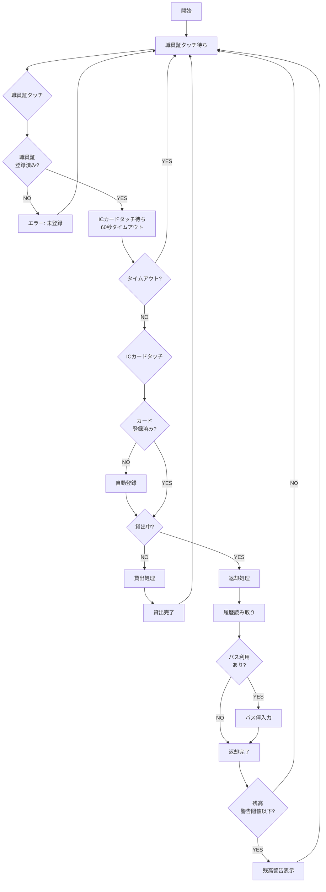
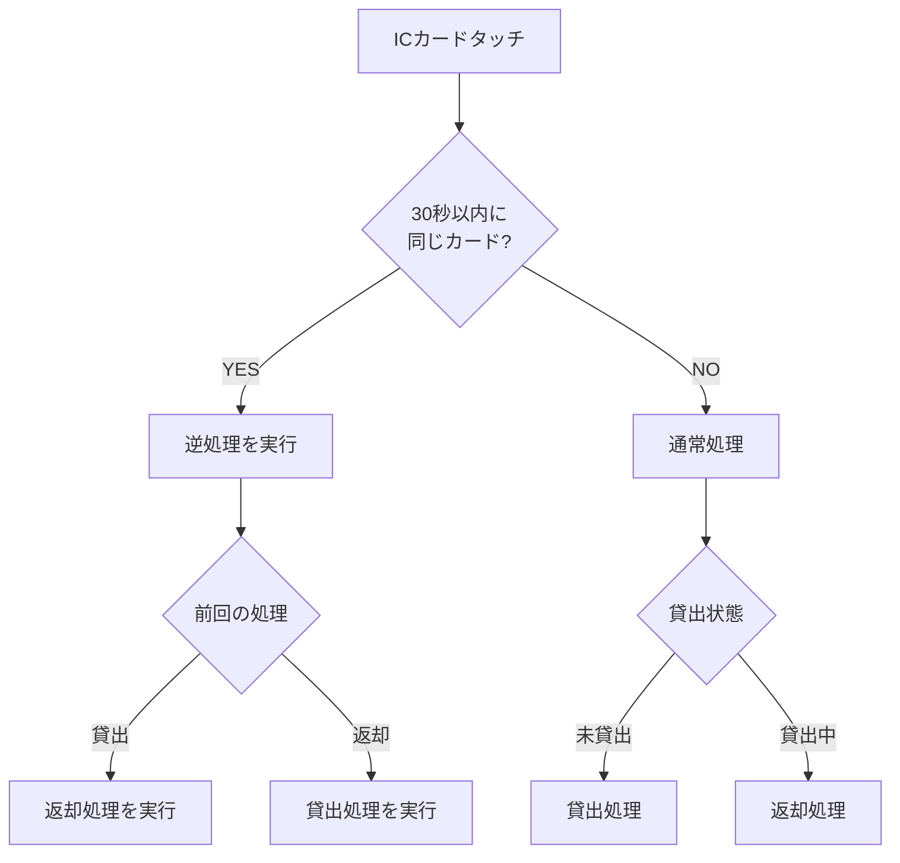
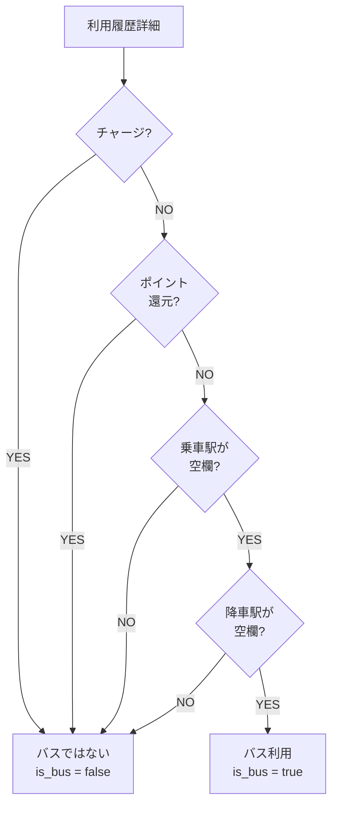

# 機能設計書

## 1. 貸出・返却フロー

### 1.1 基本フロー



### 1.2 貸出処理の詳細

| ステップ | 処理内容 |
|----------|----------|
| 1 | カードの貸出状態を確認（is_lent = 0 であること） |
| 2 | 職員情報を取得 |
| 3 | 貸出レコード（ledger）を作成（summary = "（貸出中）"） |
| 4 | カードの貸出状態を更新（is_lent = 1, last_lent_at, last_lent_staff） |
| 5 | 操作ログを記録 |
| 6 | 音声フィードバック（ピッ） |
| 7 | 画面表示更新 |

### 1.3 返却処理の詳細

| ステップ | 処理内容 |
|----------|----------|
| 1 | カードの貸出状態を確認（is_lent = 1 であること） |
| 2 | 職員情報を取得 |
| 3 | ICカードから利用履歴を読み取り（最大20件） |
| 4 | 貸出時刻以降の履歴のみを抽出 |
| 5 | 日付ごとに履歴レコード（ledger）を作成 |
| 6 | 利用詳細（ledger_detail）を作成 |
| 7 | 貸出レコードを更新（is_lent_record = 0, returner_idm, returned_at） |
| 8 | カードの貸出状態を更新（is_lent = 0） |
| 9 | 残高チェック（警告閾値との比較） |
| 10 | バス利用があればバス停入力を促す |
| 11 | 操作ログを記録 |
| 12 | 音声フィードバック（ピピッ） |
| 13 | 画面表示更新 |

---

## 2. 30秒ルールの仕様

### 2.1 概要

誤操作を防止するため、30秒以内に同じカードを再タッチした場合は、前回と逆の処理を実行する。

### 2.2 動作仕様



### 2.3 実装詳細

```
LastProcessedCardIdm: 最後に処理したカードIDm
LastProcessedTime: 最後に処理した時刻
LastOperationType: 最後の処理種別（Lend/Return）
RetouchTimeoutSeconds: 30秒

IsRetouchWithinTimeout(cardIdm):
    IF LastProcessedCardIdm != cardIdm THEN
        RETURN false
    IF (Now - LastProcessedTime) > RetouchTimeoutSeconds THEN
        RETURN false
    RETURN true
```

### 2.4 ユースケース

| シナリオ | 1回目の操作 | 2回目の操作（30秒以内） | 結果 |
|----------|-------------|-------------------------|------|
| 誤貸出の取消 | 貸出 | 再タッチ | 返却 |
| 誤返却の取消 | 返却 | 再タッチ | 貸出 |
| 別カード | 貸出 | 別カードタッチ | 通常処理 |
| 30秒超過 | 貸出 | 再タッチ（31秒後） | 通常処理 |

---

## 3. バス利用判別ロジック

### 3.1 判別条件

```
IF entry_station（乗車駅）が空欄
   AND exit_station（降車駅）が空欄
   AND is_charge = false
   AND is_point_redemption = false
THEN
    → バス利用（is_bus = true）
```

### 3.2 判別フロー



### 3.3 バス利用時の処理

1. バス利用を検出したら、バス停入力ダイアログを表示
2. ユーザーがバス停名を入力
3. 入力されたバス停名を`bus_stops`カラムに保存
4. スキップした場合は「★」マークで保存

---

## 4. 摘要文字列生成ルール

### 4.1 生成パターン一覧

| パターン | 条件 | 生成例 |
|----------|------|--------|
| 単純片道 | 1区間の鉄道利用 | 鉄道（A駅～B駅） |
| 往復 | A→B と B→A の2区間 | 鉄道（A駅～B駅 往復） |
| 乗継 | 連続する駅での乗換 | 鉄道（A駅～C駅） |
| 複数区間 | 関連しない複数区間 | 鉄道（A駅～B駅、C駅～D駅） |
| バスのみ | バス利用のみ | バス（博多駅前→天神） |
| 鉄道＋バス | 両方の利用 | 鉄道（A駅～B駅）、バス（★） |
| チャージのみ | チャージのみ | 役務費によりチャージ |
| ポイント還元 | ポイント還元のみ | ポイント還元 |
| 払い戻し | カード払い戻し時 | 払戻しによる払出 |
| 貸出中 | 貸出時 | （貸出中） |

### 4.2 往復判定ロジック

```
routes = [(A, B), (B, A)]  // A→B と B→A の経路

FOR i = 0 TO routes.length - 1:
    FOR j = i + 1 TO routes.length - 1:
        IF routes[i].Entry == routes[j].Exit
           AND routes[i].Exit == routes[j].Entry:
            → 往復として検出
```

### 4.3 乗継判定ロジック

```
routes = [(A, B), (B, C)]  // A→B と B→C の経路

IF routes[0].Exit == routes[1].Entry:
    → 乗継として統合 → (A, C)
```

### 4.4 循環移動の取り扱い

```
routes = [(A, B), (B, C), (C, A)]  // 起点と終点が同じ

IF consolidatedStart == consolidatedEnd:
    → 統合せず個別表示 → "A駅～B駅、B駅～C駅、C駅～A駅"
```

### 4.5 残高不足パターンの検出

残高が不足して不足分だけを現金でチャージした場合の特殊処理。

#### 4.5.1 パターン

```
例: 残高200円、運賃210円の場合

FeliCa履歴:
1. チャージ: 10円（残高 → 210円）
2. 利用: 210円（残高 → 0円）

検出条件:
IF charge.Balance == usage.Amount AND usage.Balance == 0:
    → 残高不足パターンとして検出
```

#### 4.5.2 出力

| 項目 | 値 |
|------|-----|
| 摘要 | 通常の利用摘要（鉄道（A駅～B駅）等） |
| 払出金額 | 元の残高（例: 200円） |
| 残額 | 0円 |
| 備考 | 支払額{運賃}円のうち不足額{不足額}円は現金で支払（旅費支給） |

### 4.6 静的メソッド

| メソッド | 戻り値 |
|----------|--------|
| GetLendingSummary() | "（貸出中）" |
| GetChargeSummary() | "役務費によりチャージ" |
| GetRefundSummary() | "払戻しによる払出" |
| GetInsufficientBalanceNote(fare, shortfall) | "支払額{fare}円のうち不足額{shortfall}円は現金で支払（旅費支給）" |
| GetCarryoverFromPreviousYearSummary() | "前年度より繰越" |
| GetCarryoverToNextYearSummary() | "次年度へ繰越" |
| GetMonthlySummary(month) | "{month}月計" |
| GetCumulativeSummary() | "累計" |

---

## 5. 月次帳票の仕様

### 5.1 帳票形式

- ファイル形式: Excel（.xlsx）
- テンプレート: `Resources/Templates/物品出納簿テンプレート.xlsx`
- 出力ファイル名: `物品出納簿_{カード種別}_{管理番号}_{年}年{月}月.xlsx`

### 5.2 帳票レイアウト

```
+--------------------------------------------------------------------+
| 物品出納簿                                                          |
+--------------------------------------------------------------------+
| 物品の分類|雑品（金券類）|品名|はやかけん|規格|H001|単位:|円|頁| |                                                    |
+--------------------------------------------------------------------+
| 出納年月日 | 摘要                    | 受入金額 | 払出金額 | 残額 | 氏名   |備考|
|------------|-------------------------|------|------|------|--------|-----|
| 4/1        | 前年度より繰越          | 5000 |      | 5000 |        ||
| 4/1        | 鉄道（博多～天神）      |      | 260  | 4740 | 山田   ||
| 4/2        | 役務費によりチャージ    | 3000 |      | 7740 | 山田   ||
| 4/2        | 鉄道（天神～博多）      |      | 260  | 7480 | 山田   ||
|            | 4月計                   | 3000 | 520  | 7480 |        ||
+--------------------------------------------------------------------+
```

### 5.3 特殊行の出力条件

| 行種別 | 出力条件 | 備考 |
|--------|----------|------|
| 前年度繰越 | 4月のみ | 前年度3月末残高を表示 |
| 月計 | 毎月 | 当月の受入/払出合計 |
| 累計 | 3月のみ | 年度の受入/払出合計 |
| 次年度繰越 | 3月のみ | 払出欄に残高、残額欄に0 |

### 5.4 除外データ

- `summary = "（貸出中）"` のレコードは出力しない
- 論理削除されたカード・職員も履歴は出力する

### 5.5 和暦変換

- 日付カラムは「元号年.月.日」形式（例: R8.4.1）

---

## 6. カード種別自動判別

### 6.1 判別ロジック

IDmの先頭2バイト（発行者コード）でカード種別を判別する。

| 発行者コード | カード種別 |
|--------------|------------|
| 01 | Suica |
| 02 | PASMO |
| 03 | ICOCA |
| 04 | PiTaPa |
| 05 | nimoca |
| 06 | SUGOCA |
| 07 | はやかけん |
| 08 | Kitaca |
| 09 | TOICA |
| 0A | manaca |
| その他 | Unknown（その他） |

### 6.2 実装

```csharp
public static CardType DetectFromIdm(string idm)
{
    if (string.IsNullOrEmpty(idm) || idm.Length < 2)
        return CardType.Unknown;

    var issuerCode = idm[..2].ToUpperInvariant();

    return issuerCode switch
    {
        "01" => CardType.Suica,
        "02" => CardType.PASMO,
        "03" => CardType.ICOCA,
        "04" => CardType.PiTaPa,
        "05" => CardType.Nimoca,
        "06" => CardType.SUGOCA,
        "07" => CardType.Hayakaken,
        "08" => CardType.Kitaca,
        "09" => CardType.TOICA,
        "0A" => CardType.Manaca,
        _ => CardType.Unknown
    };
}
```

---

## 7. 残高警告機能

### 7.1 概要

返却時にカード残高が設定された閾値を下回っている場合、警告を表示する。

### 7.2 設定

- 設定キー: `warning_balance`
- デフォルト値: 10000円
- 設定画面から変更可能

### 7.3 警告表示

- サイドバーの警告エリアに表示
- 背景色: #FFF3E0（薄いオレンジ）
- 音声フィードバック: warning.wav

---

## 8. データ自動削除

### 8.1 削除タイミング

- アプリケーション起動時に自動実行

### 8.2 削除対象

- 6年以上経過した`ledger`レコード
- 関連する`ledger_detail`レコード（CASCADE削除）

### 8.3 実装

```sql
DELETE FROM ledger WHERE date < date('now', '-6 years');
```

### 8.4 最適化

削除後に`VACUUM`コマンドでデータベースファイルを最適化可能（手動実行）。
