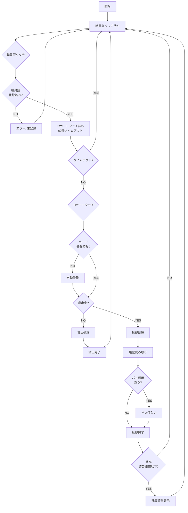
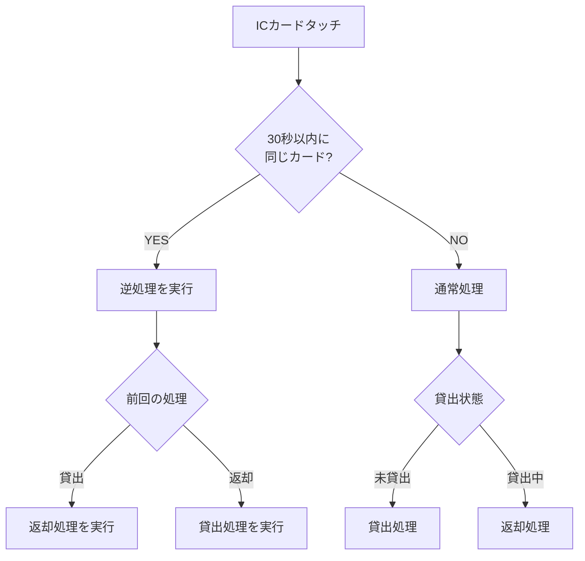
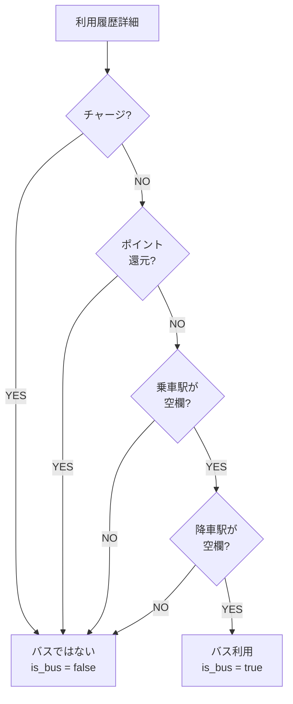
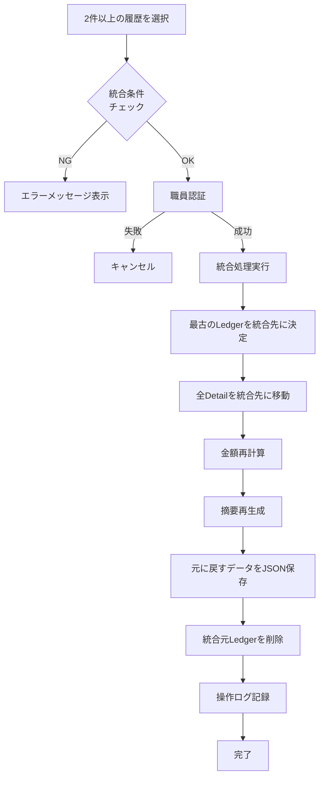
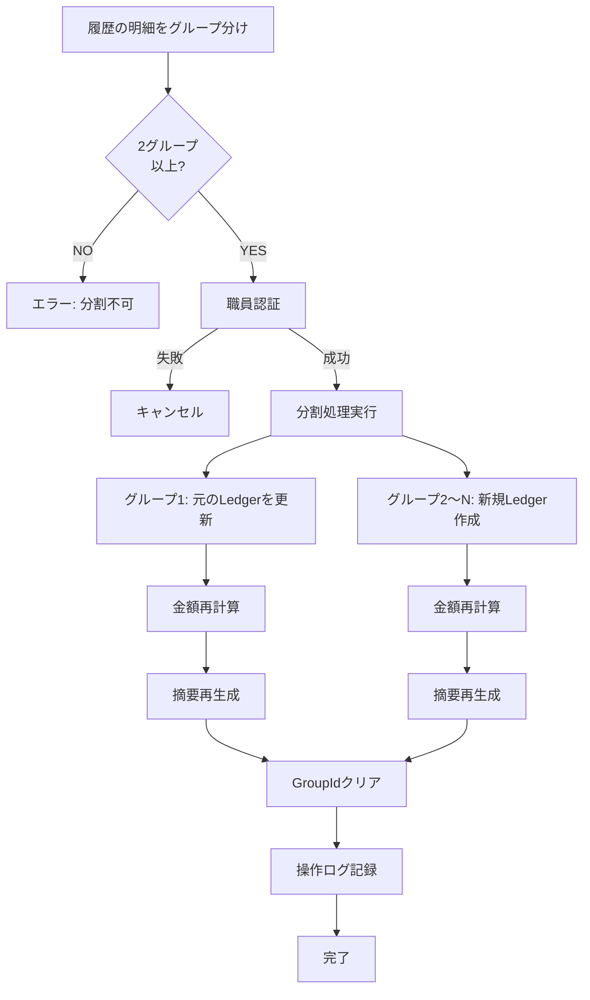
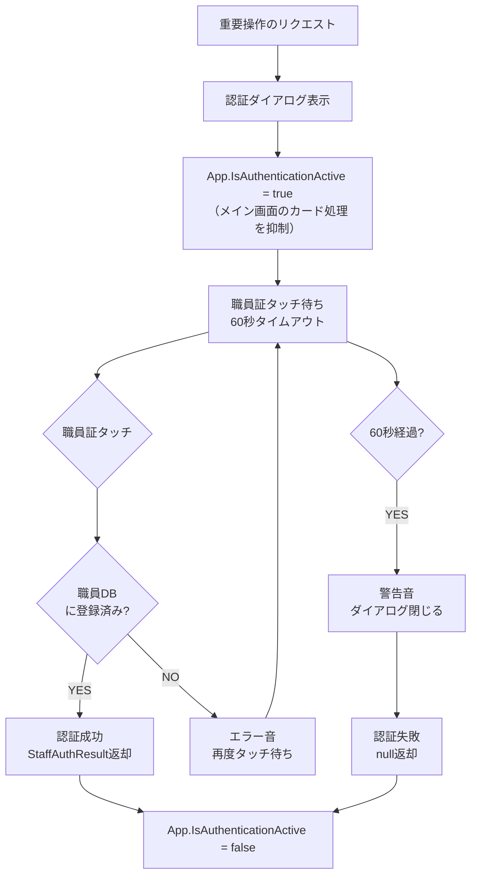

# 機能設計書

## 1. 貸出・返却フロー

### 1.1 基本フロー


```mermaid
flowchart TD
    START[開始] --> WAIT_STAFF[職員証タッチ待ち]
    WAIT_STAFF --> STAFF_TOUCH{職員証タッチ}
    STAFF_TOUCH --> VALIDATE_STAFF{職員証<br>登録済み?}
    VALIDATE_STAFF -->|NO| ERROR_STAFF[エラー: 未登録]
    VALIDATE_STAFF -->|YES| WAIT_CARD[ICカードタッチ待ち<br>60秒タイムアウト]

    WAIT_CARD --> TIMEOUT{タイムアウト?}
    TIMEOUT -->|YES| WAIT_STAFF
    TIMEOUT -->|NO| CARD_TOUCH{ICカードタッチ}

    CARD_TOUCH --> CHECK_CARD{カード<br>登録済み?}
    CHECK_CARD -->|NO| AUTO_REGISTER[自動登録]
    AUTO_REGISTER --> CHECK_LENT
    CHECK_CARD -->|YES| CHECK_LENT{貸出中?}

    CHECK_LENT -->|NO| LEND[貸出処理]
    CHECK_LENT -->|YES| RETURN[返却処理]

    LEND --> LEND_SUCCESS[貸出完了]
    RETURN --> READ_HISTORY[履歴読み取り]
    READ_HISTORY --> CHECK_BUS{バス利用<br>あり?}
    CHECK_BUS -->|YES| INPUT_BUS[バス停入力]
    CHECK_BUS -->|NO| RETURN_SUCCESS[返却完了]
    INPUT_BUS --> RETURN_SUCCESS

    LEND_SUCCESS --> WAIT_STAFF
    RETURN_SUCCESS --> CHECK_BALANCE{残高<br>警告閾値以下?}
    CHECK_BALANCE -->|YES| SHOW_WARNING[残高警告表示]
    CHECK_BALANCE -->|NO| WAIT_STAFF
    SHOW_WARNING --> WAIT_STAFF

    ERROR_STAFF --> WAIT_STAFF
```

### 1.2 貸出処理の詳細

| ステップ | 処理内容 |
|----------|----------|
| 1 | カードの貸出状態を確認（is_lent = 0 であること） |
| 2 | 職員情報を取得 |
| 3 | 貸出レコード（ledger）を作成（summary = "（貸出中）"） |
| 4 | カードの貸出状態を更新（is_lent = 1, last_lent_at, last_lent_staff） |
| 5 | 操作ログを記録 |
| 6 | 音声フィードバック（ピッ） |
| 7 | 画面表示更新 |

### 1.3 返却処理の詳細

| ステップ | 処理内容 |
|----------|----------|
| 1 | カードの貸出状態を確認（is_lent = 1 であること） |
| 2 | 職員情報を取得 |
| 3 | ICカードから利用履歴を読み取り（最大20件） |
| 4 | 貸出時刻以降の履歴のみを抽出 |
| 5 | 日付ごとに履歴レコード（ledger）を作成 |
| 6 | 利用詳細（ledger_detail）を作成 |
| 7 | 貸出レコードを更新（is_lent_record = 0, returner_idm, returned_at） |
| 8 | カードの貸出状態を更新（is_lent = 0） |
| 9 | 残高チェック（警告閾値との比較） |
| 10 | バス利用があればバス停入力を促す |
| 11 | 操作ログを記録 |
| 12 | 音声フィードバック（ピピッ） |
| 13 | 画面表示更新 |

---

## 2. 30秒ルールの仕様

### 2.1 概要

誤操作を防止するため、30秒以内に同じカードを再タッチした場合は、前回と逆の処理を実行する。

### 2.2 動作仕様


```mermaid
flowchart TD
    TOUCH[ICカードタッチ] --> CHECK_30SEC{30秒以内に<br>同じカード?}
    CHECK_30SEC -->|YES| REVERSE[逆処理を実行]
    CHECK_30SEC -->|NO| NORMAL[通常処理]

    REVERSE --> WAS_LEND{前回の処理}
    WAS_LEND -->|貸出| DO_RETURN[返却処理を実行]
    WAS_LEND -->|返却| DO_LEND[貸出処理を実行]

    NORMAL --> IS_LENT{貸出状態}
    IS_LENT -->|未貸出| DO_LEND2[貸出処理]
    IS_LENT -->|貸出中| DO_RETURN2[返却処理]
```

### 2.3 実装詳細

```
LastProcessedCardIdm: 最後に処理したカードIDm
LastProcessedTime: 最後に処理した時刻
LastOperationType: 最後の処理種別（Lend/Return）
RetouchTimeoutSeconds: 30秒

IsRetouchWithinTimeout(cardIdm):
    IF LastProcessedCardIdm != cardIdm THEN
        RETURN false
    IF (Now - LastProcessedTime) > RetouchTimeoutSeconds THEN
        RETURN false
    RETURN true
```

### 2.4 ユースケース

| シナリオ | 1回目の操作 | 2回目の操作（30秒以内） | 結果 |
|----------|-------------|-------------------------|------|
| 誤貸出の取消 | 貸出 | 再タッチ | 返却 |
| 誤返却の取消 | 返却 | 再タッチ | 貸出 |
| 別カード | 貸出 | 別カードタッチ | 通常処理 |
| 30秒超過 | 貸出 | 再タッチ（31秒後） | 通常処理 |

---

## 3. バス利用判別ロジック

### 3.1 判別条件

```
IF entry_station（乗車駅）が空欄
   AND exit_station（降車駅）が空欄
   AND is_charge = false
   AND is_point_redemption = false
THEN
    → バス利用（is_bus = true）
```

### 3.2 判別フロー


```mermaid
flowchart TD
    DETAIL[利用履歴詳細] --> CHECK_CHARGE{チャージ?}
    CHECK_CHARGE -->|YES| NOT_BUS[バスではない<br>is_bus = false]
    CHECK_CHARGE -->|NO| CHECK_POINT{ポイント<br>還元?}
    CHECK_POINT -->|YES| NOT_BUS
    CHECK_POINT -->|NO| CHECK_ENTRY{乗車駅が<br>空欄?}
    CHECK_ENTRY -->|NO| NOT_BUS
    CHECK_ENTRY -->|YES| CHECK_EXIT{降車駅が<br>空欄?}
    CHECK_EXIT -->|NO| NOT_BUS
    CHECK_EXIT -->|YES| IS_BUS[バス利用<br>is_bus = true]
```

### 3.3 バス利用時の処理

1. バス利用を検出したら、バス停入力ダイアログを表示
2. ユーザーがバス停名を入力
3. 入力されたバス停名を`bus_stops`カラムに保存
4. スキップした場合は「★」マークで保存

---

## 4. 摘要文字列生成ルール

### 4.1 生成パターン一覧

| パターン | 条件 | 生成例 |
|----------|------|--------|
| 単純片道 | 1区間の鉄道利用 | 鉄道（A駅～B駅） |
| 往復 | A→B と B→A の2区間 | 鉄道（A駅～B駅 往復） |
| 乗継 | 連続する駅での乗換 | 鉄道（A駅～C駅） |
| 複数区間 | 関連しない複数区間 | 鉄道（A駅～B駅、C駅～D駅） |
| バスのみ | バス利用のみ | バス（博多駅前→天神） |
| 鉄道＋バス | 両方の利用 | 鉄道（A駅～B駅）、バス（★） |
| チャージのみ | チャージのみ | 役務費によりチャージ |
| ポイント還元 | ポイント還元のみ | ポイント還元 |
| 払い戻し | カード払い戻し時 | 払戻しによる払出 |
| 貸出中 | 貸出時 | （貸出中） |

### 4.2 往復判定ロジック

```
routes = [(A, B), (B, A)]  // A→B と B→A の経路

FOR i = 0 TO routes.length - 1:
    FOR j = i + 1 TO routes.length - 1:
        IF routes[i].Entry == routes[j].Exit
           AND routes[i].Exit == routes[j].Entry:
            → 往復として検出
```

### 4.3 乗継判定ロジック

```
routes = [(A, B), (B, C)]  // A→B と B→C の経路

IF AreTransferStations(routes[0].Exit, routes[1].Entry):
    → 乗継として統合 → (A, C)
```

#### 乗り継ぎ駅グループ

同一駅とみなす乗り継ぎ駅のグループ。降車駅と次の乗車駅がグループ内に含まれる場合、乗継として統合する。

| グループ |
|----------|
| 天神、西鉄福岡(天神) |
| 千早、西鉄千早 |

### 4.4 循環移動の取り扱い

```
routes = [(A, B), (B, C), (C, A)]  // 起点と終点が同じ

IF consolidatedStart == consolidatedEnd:
    → 統合せず個別表示 → "A駅～B駅、B駅～C駅、C駅～A駅"
```

### 4.5 残高不足パターンの検出

残高が不足して不足分を現金でチャージした場合の特殊処理。

#### 4.5.1 パターン

```
例1（ぴったりチャージ）: 残高200円、運賃210円
  チャージ: 10円（残高 → 210円）
  利用: 210円（残高 → 0円）

例2（端数あり）: 残高76円、運賃210円
  チャージ: 140円（残高 → 216円）※不足134円だが10円単位で140円チャージ
  利用: 210円（残高 → 6円）

検出条件:
  originalBalance = charge.Balance - charge.Amount  （チャージ前残高）
  IF originalBalance < usage.Amount                 （チャージ前は残高不足）
     AND charge.Balance == usage.Amount + usage.Balance （チャージ→利用の連続性）
     AND charge.Amount <= usage.Amount              （不足分補填のチャージであること）
     AND usage.Balance < 100                        （チャージ超過額が少額であること）
  THEN → 残高不足パターンとして検出

※ Issue #1001: 3・4番目の条件は、通常チャージ後の利用を残高不足パターンと
  誤検出することを防止する。精算機でのチャージは不足額ちょうどか10円単位の
  端数切り上げのため、利用後残高（= チャージ額 - 不足額）は少額になるはず。
  利用後残高が100円以上の場合は通常チャージとみなし、パターンから除外する。
```

#### 4.5.2 出力

| 項目 | 値 |
|------|-----|
| 摘要 | 通常の利用摘要（鉄道（A駅～B駅）等） |
| 払出金額 | 運賃 - チャージ額（カードの元残高から充当した金額。例: 210-140=70円） |
| 残額 | 利用後の実残高（ぴったりチャージなら0、端数チャージなら端数が残る） |
| 備考 | 支払額{運賃}円のうち不足額{チャージ額}円は現金で支払（旅費支給） |

#### 4.5.3 詳細レコードの保存

マージされたLedgerには、チャージ詳細と利用詳細の**両方**を`ledger_detail`に登録する。
チャージ詳細を登録しない場合、次回返却時の重複チェック（`GetExistingDetailKeysAsync`）で
チャージが検出されず、「役務費によりチャージ」として二重登録される問題が発生する（Issue #978）。

- チャージ詳細を**先に**挿入（SequenceNumber小）
- 利用詳細を**後に**挿入（SequenceNumber大）

この順序により、`LedgerMergeService`等の「最新Detail＝最大SequenceNumber」ロジックで
利用詳細（残額0）が最新として正しく扱われる。

### 4.6 静的メソッド

| メソッド | 戻り値 |
|----------|--------|
| GetLendingSummary() | "（貸出中）" |
| GetChargeSummary() | "役務費によりチャージ" |
| GetRefundSummary() | "払戻しによる払出" |
| GetInsufficientBalanceNote(fare, shortfall) | "支払額{fare}円のうち不足額{shortfall}円は現金で支払（旅費支給）" |
| GetCarryoverFromPreviousYearSummary() | "前年度より繰越" |
| GetCarryoverToNextYearSummary() | "次年度へ繰越" |
| GetMonthlySummary(month) | "{month}月計" |
| GetCumulativeSummary() | "累計" |

---

## 5. 月次帳票の仕様

### 5.1 帳票形式

- ファイル形式: Excel（.xlsx）
- テンプレート: `Resources/Templates/物品出納簿テンプレート.xlsx`
- 出力ファイル名: `物品出納簿_{カード種別}_{管理番号}_{年}年{月}月.xlsx`

### 5.2 帳票レイアウト

```
+--------------------------------------------------------------------+
| 物品出納簿                                                          |
+--------------------------------------------------------------------+
| 物品の分類|雑品（金券類）|品名|はやかけん|規格|H001|単位:|円|頁| |                                                    |
+--------------------------------------------------------------------+
| 出納年月日 | 摘要                    | 受入金額 | 払出金額 | 残額 | 氏名   |備考|
|------------|-------------------------|------|------|------|--------|-----|
| 4/1        | 前年度より繰越          | 5000 |      | 5000 |        ||
| 4/1        | 鉄道（博多～天神）      |      | 260  | 4740 | 山田   ||
| 4/2        | 役務費によりチャージ    | 3000 |      | 7740 | 山田   ||
| 4/2        | 鉄道（天神～博多）      |      | 260  | 7480 | 山田   ||
|            | 4月計                   | 3000 | 520  | 7480 |        ||
+--------------------------------------------------------------------+
```

### 5.3 特殊行の出力条件

| 行種別 | 出力条件 | 備考 |
|--------|----------|------|
| 前年度繰越 | 4月のみ | 前年度3月末残高を表示 |
| 月計 | 毎月 | 当月の受入/払出合計 |
| 累計 | 3月のみ | 年度の受入/払出合計 |
| 次年度繰越 | 3月のみ | 払出欄に残高、残額欄に0 |

### 5.4 帳票のフォントサイズ

#### 5.4.1 基本フォントサイズ

| 列 | 内容 | フォントサイズ |
|----|------|---------------|
| A列 | 出納年月日 | 14pt |
| B-D列 | 摘要 | 文字列長に応じて可変（後述） |
| E列 | 受入金額 | 16pt |
| F列 | 払出金額 | 16pt |
| G列 | 残額 | 16pt |
| H列 | 氏名 | 14pt |
| I-L列 | 備考 | 14pt |

#### 5.4.2 摘要欄のフォントサイズ自動調整

摘要欄（B-D列結合セル）の文字列長に応じて、フォントサイズを自動で段階的に縮小する。

| 文字数 | フォントサイズ |
|--------|---------------|
| 15文字未満 | 14pt |
| 15文字以上32文字未満 | 12pt |
| 32文字以上38文字未満 | 10pt |
| 38文字以上93文字未満 | 8pt |
| 93文字以上108文字未満 | 7pt |
| 108文字以上 | 6pt |

- 繰越行・月計行・累計行の摘要は固定文字列のため、常に14ptを適用

### 5.5 除外データ

- `summary = "（貸出中）"` のレコードは出力しない
- 論理削除されたカード・職員も履歴は出力する

### 5.6 和暦変換

- 日付カラムは「元号年.月.日」形式（例: R8.4.1）

---

## 6. 残高警告機能

### 6.1 概要

返却時にカード残高が設定された閾値を下回っている場合、警告を表示する。

### 6.2 設定

- 設定キー: `warning_balance`
- デフォルト値: 10000円
- 設定画面から変更可能

### 6.3 警告表示

- サイドバーの警告エリアに表示
- 背景色: #FFF3E0（薄いオレンジ）
- 音声フィードバック: warning.wav

---

## 7. データ自動削除

### 7.1 削除タイミング

- アプリケーション起動時に自動実行

### 7.2 削除対象

- 6年以上経過した`ledger`レコード
- 関連する`ledger_detail`レコード（CASCADE削除）

### 7.3 実装

```sql
DELETE FROM ledger WHERE date < date('now', '-6 years');
```

### 7.4 最適化

削除後に`VACUUM`コマンドでデータベースファイルを最適化可能（手動実行）。

---

## 8. 履歴統合（マージ）機能

### 8.1 概要

複数の利用履歴（Ledger）レコードを1つに統合する機能。日付の近い履歴が複数行に分かれている場合に、手動で1行にまとめることができる。統合後は「元に戻す」操作も可能。

### 8.2 統合条件

| # | 条件 | エラー時の動作 |
|---|------|----------------|
| 1 | 2件以上のLedgerが選択されていること | エラーメッセージ表示 |
| 2 | 全てのLedgerが同一カード（CardIdm）であること | エラーメッセージ表示 |
| 3 | 貸出中レコード（IsLentRecord = true）を含まないこと | エラーメッセージ表示 |
| 4 | 受入（チャージ）と払出（利用）が混在しないこと | エラーメッセージ表示 |

### 8.3 統合処理フロー


```mermaid
flowchart TD
    SELECT[2件以上の履歴を選択] --> VALIDATE{統合条件<br>チェック}
    VALIDATE -->|NG| ERROR[エラーメッセージ表示]
    VALIDATE -->|OK| AUTH[職員認証]
    AUTH -->|失敗| CANCEL[キャンセル]
    AUTH -->|成功| MERGE[統合処理実行]

    MERGE --> TARGET[最古のLedgerを統合先に決定]
    TARGET --> MOVE_DETAILS[全Detailを統合先に移動]
    MOVE_DETAILS --> CALC[金額再計算]
    CALC --> REGEN_SUMMARY[摘要再生成]
    REGEN_SUMMARY --> SAVE_UNDO[元に戻すデータをJSON保存]
    SAVE_UNDO --> DELETE_SOURCE[統合元Ledgerを削除]
    DELETE_SOURCE --> LOG[操作ログ記録]
    LOG --> DONE[完了]
```

### 8.4 統合時のデータ計算ルール

| 項目 | 計算方法 |
|------|----------|
| 受入金額（Income） | 全統合元の合計 |
| 払出金額（Expense） | 全統合元の合計 |
| 残額（Balance） | 最新DetailのBalance（SequenceNumber/UseDate順） |
| 摘要（Summary） | SummaryGeneratorで全Detailから再生成 |
| 備考（Note） | 非null備考を「、」区切りで結合（重複排除） |

### 8.5 元に戻す機能

- `ledger_merge_history`テーブルにUndoDataをJSON形式で保存
- UndoDataには統合前の各LedgerスナップショットとDetail→Ledgerのマッピングを含む
- 元に戻す操作時にスナップショットから元のLedgerを復元し、Detailを元の所属に戻す
- 元に戻した履歴は`is_undone = true`にマーク

---

## 9. 履歴分割機能

### 9.1 概要

1つの利用履歴（Ledger）レコードに含まれる複数の明細（LedgerDetail）を、グループ分けして別々のLedgerレコードに分割する機能。

### 9.2 分割条件

- 2つ以上のグループに分けられていること（各DetailにGroupIdが設定済み）
- 分割対象のLedgerが存在すること

### 9.3 分割処理フロー


```mermaid
flowchart TD
    SELECT[履歴の明細をグループ分け] --> VALIDATE{2グループ<br>以上?}
    VALIDATE -->|NO| ERROR[エラー: 分割不可]
    VALIDATE -->|YES| AUTH[職員認証]
    AUTH -->|失敗| CANCEL[キャンセル]
    AUTH -->|成功| SPLIT[分割処理実行]

    SPLIT --> GROUP1[グループ1: 元のLedgerを更新]
    SPLIT --> GROUP2[グループ2〜N: 新規Ledger作成]
    GROUP1 --> CALC1[金額再計算]
    GROUP2 --> CALC2[金額再計算]
    CALC1 --> SUMMARY1[摘要再生成]
    CALC2 --> SUMMARY2[摘要再生成]
    SUMMARY1 --> CLEAR[GroupIdクリア]
    SUMMARY2 --> CLEAR
    CLEAR --> LOG[操作ログ記録]
    LOG --> DONE[完了]
```

### 9.4 金額計算ロジック（CalculateGroupFinancials）

```
グループ内の各Detailについて:
  受入金額 = IsCharge=true かつ Amount有値 のDetail.Amountの合計
  払出金額 = IsCharge=false かつ IsPointRedemption=false かつ Amount有値 のDetail.Amountの合計
  残額 = グループ内のDetailをLedgerDetailChronologicalSorter.Sort()で
        残高チェーン順にソートし、最後のDetailのBalance
        （Balance未設定の場合は0）
```

### 9.5 分割後のLedger属性

| 項目 | 値 |
|------|-----|
| CardIdm | 元のLedgerと同一 |
| Date | グループ内最古DetailのUseDate（なければ元の日付） |
| Summary | SummaryGeneratorで再生成（空の場合「（分割）」） |
| IsLentRecord | 常にfalse |
| LenderIdm, StaffName等 | 元のLedgerからコピー |

---

## 10. 残高整合性チェック

### 10.1 概要

カードの利用履歴における残高チェーン（前回残高 + 受入 - 払出 = 今回残高）の整合性を検証する機能。履歴の追加・削除・変更後に呼び出され、不整合を検出する。

### 10.2 検証ロジック

#### 10.2.1 親レコードレベルの検証

```
Ledgerを日付順（Date昇順）にソートし、同一日内はLedgerOrderHelper.ReorderByBalanceChain()で
残高チェーン順に並べ替え

FOR each Ledger (2件目以降):
    期待残高 = 前回のLedger.Balance + 今回のIncome - 今回のExpense
    IF 今回のLedger.Balance ≠ 期待残高:
        → 不整合として記録（LedgerId, 期待残高, 実際残高）
```

#### 10.2.2 詳細レベルの検証（Issue #1059）

同一日にグループ化されたLedgerDetail間の残高チェーンも検証する。親レコードレベルでは隠れてしまう途中の詳細の不整合を検出する。

```
全Ledgerの詳細を時系列順に連結

previousDetailBalance = null

FOR each Ledger:
    IF 詳細なし:
        previousDetailBalance = Ledger.Balance
        CONTINUE

    FOR each Detail in Ledger.Details:
        IF Amount=null OR Balance=null: SKIP

        IF previousDetailBalance != null:
            IF Detail.IsCharge OR Detail.IsPointRedemption:
                期待残高 = previousDetailBalance + Detail.Amount
            ELSE:
                期待残高 = previousDetailBalance - Detail.Amount

            IF Detail.Balance ≠ 期待残高:
                → 詳細不整合として記録（LedgerId, SequenceNumber, 期待残高, 実際残高）

        previousDetailBalance = Detail.Balance
```

### 10.3 検証バリエーション

| メソッド | 用途 |
|----------|------|
| CheckBalanceConsistencyAsync | DB取得→親+詳細レベルを検証 |
| CheckConsistency | 渡されたリストを直接検証（親+詳細） |
| CheckDetailConsistency | 詳細レベルのみ検証（internal static） |
| CheckConsistencyWithPreviousAsync | 期間直前のLedgerも取得して1件目から検証 |

### 10.4 結果

```
ConsistencyResult:
  IsConsistent: true/false
  Inconsistencies: List<(LedgerId, ExpectedBalance, ActualBalance)>        // 親レコードレベル
  DetailInconsistencies: List<DetailInconsistency>                         // 詳細レベル（Issue #1059）

DetailInconsistency:
  LedgerId: int              // 親LedgerのID
  SequenceNumber: int        // 詳細のシーケンス番号（rowid）
  ExpectedBalance: int       // 期待残高
  ActualBalance: int         // 実際残高
```

---

## 11. 職員認証機能

### 11.1 概要

重要な操作（履歴統合・分割・削除等）の実行前に、操作者を職員証タッチで確認する機能。

### 11.2 認証フロー


```mermaid
flowchart TD
    TRIGGER[重要操作のリクエスト] --> SHOW_DIALOG[認証ダイアログ表示]
    SHOW_DIALOG --> SET_FLAG["App.IsAuthenticationActive = true<br>（メイン画面のカード処理を抑制）"]
    SET_FLAG --> WAIT[職員証タッチ待ち<br>60秒タイムアウト]

    WAIT --> TOUCH{職員証タッチ}
    TOUCH --> LOOKUP{職員DB<br>に登録済み?}
    LOOKUP -->|YES| SUCCESS[認証成功<br>StaffAuthResult返却]
    LOOKUP -->|NO| RETRY[エラー音<br>再度タッチ待ち]
    RETRY --> WAIT

    WAIT --> TIMEOUT{60秒経過?}
    TIMEOUT -->|YES| WARN[警告音<br>ダイアログ閉じる]
    WARN --> FAIL[認証失敗<br>null返却]

    SUCCESS --> RESET["App.IsAuthenticationActive = false"]
    FAIL --> RESET
```

### 11.3 タイムアウト仕様

| 経過時間 | 動作 |
|----------|------|
| 0〜50秒 | 通常のカウントダウン表示 |
| 50〜55秒 | 残り時間を赤色表示（5秒カウントダウン） |
| 60秒 | 警告音再生 → ダイアログ自動クローズ |

### 11.4 認証対象操作

- 履歴統合（マージ）
- 履歴分割
- 履歴行の編集・削除
- その他、ViewModelからRequestAuthenticationAsyncを呼び出す操作

---

## 12. 印刷プレビュー機能

### 12.1 概要

月次帳票（物品出納簿）の印刷前にプレビュー表示する機能。ズーム・ページナビゲーション・印刷方向切替をサポートする。

### 12.2 ズーム機能

| 操作 | 動作 |
|------|------|
| ズームイン | 定義済みレベル（50→75→100→125→150→200%）で段階的に拡大 |
| ズームアウト | 定義済みレベルで段階的に縮小 |
| リセット | 100%に戻す |
| カスタム値 | 定義済みレベル以外の値も指定可能 |

### 12.3 ページナビゲーション

| コマンド | 条件 |
|----------|------|
| 次のページ | IsLastPage でなければ実行可能 |
| 前のページ | IsFirstPage でなければ実行可能 |
| 最初のページ | IsFirstPage でなければ実行可能 |
| 最後のページ | IsLastPage でなければ実行可能 |

### 12.4 印刷方向切替

- **縦方向（Portrait）/ 横方向（Landscape）** の切替が可能
- 方向変更時に帳票データからFlowDocumentを再生成する
- 方向変更後は1ページ目にリセット
- 単一カード・複数カードの両方に対応

---

## 13. 操作ログExcel出力

### 13.1 概要

操作ログの検索結果をExcelファイル（.xlsx）にエクスポートする機能。

### 13.2 出力カラム

| 列 | ヘッダー | 幅 | 内容 |
|----|----------|-----|------|
| A | 日時 | 20 | yyyy/MM/dd HH:mm:ss形式 |
| B | 操作種別 | 10 | INSERT/UPDATE/DELETE等（色分け・太字） |
| C | 対象 | 18 | テーブル名の日本語表示 |
| D | 対象ID | 20 | TargetId |
| E | 操作者 | 12 | OperatorName |
| F | 変更内容 | 40 | UPDATE時のみ差分サマリ |
| G | 変更前 | 50 | JSONを日本語ラベル付きで整形 |
| H | 変更後 | 50 | JSONを日本語ラベル付きで整形 |

### 13.3 書式ルール

| 要素 | 書式 |
|------|------|
| ヘッダー行 | 白太字 + 青背景(#4472C4) |
| 操作種別:INSERT/RESTORE | 緑(#2E7D32) |
| 操作種別:UPDATE | オレンジ(#E65100) |
| 操作種別:DELETE | 赤(#C62828) |
| 操作種別:MERGE/SPLIT | 青(#1565C0) |
| データ行 | テキスト折り返し、上寄せ |
| フィルター | 1行目で自動フィルター有効 |
| 固定表示 | 1行目を固定 |

### 13.4 JSON整形ルール

- 単一オブジェクト: `フィールド名: 値` の一覧に変換
- 配列: `[1] フィールド名: 値` のようにインデックス付きで変換
- フィールド名はテーブルごとの日本語マッピングを使用（例: `card_idm` → `カードIDm`）
- 真偽値: `true` → `はい`、`false` → `いいえ`
- null: `（なし）`

### 13.5 変更サマリ（UPDATE時）

変更前後のJSONを比較し、差分のあるフィールドのみ抽出:

```
フィールド名: 変更前の値 → 変更後の値
```

---

## 14. カード排他制御

### 14.1 概要

同一カードに対する同時操作を防止するため、カードIDm単位のロック機構を提供する。

### 14.2 ロック戦略

| 項目 | 仕様 |
|------|------|
| ロック単位 | カードIDm（1カード = 1ロック） |
| ロック方式 | SemaphoreSlim(1, 1)による排他ロック |
| データ構造 | ConcurrentDictionary<string, LockEntry> |
| 参照カウント | GetLock()で+1、ReleaseLockReference()で-1 |

### 14.3 ロック取得・解放

```
GetLock(cardIdm):
    LockEntry = Dictionary.GetOrAdd(cardIdm, new LockEntry)
    LastUsed = UtcNow
    ReferenceCount++
    RETURN SemaphoreSlim

ReleaseLockReference(cardIdm):
    ReferenceCount-- (最小0)
    LastUsed = UtcNow
```

### 14.4 自動クリーンアップ

| 項目 | 値 |
|------|-----|
| クリーンアップ間隔 | 15分 |
| ロック有効期限 | 1時間 |
| 削除条件 | ReferenceCount = 0 AND LastUsed < (現在 - 1時間) AND SemaphoreSlim未ロック |

### 14.5 シャットダウン

- `Dispose()`時に全ロックを強制解放（SemaphoreSlim.Dispose()）
- クリーンアップタイマーを停止

---

## 15. アプリケーション設定

### 15.1 設定項目一覧

| 設定キー | 設定名 | 設定値 | デフォルト | 説明 |
|----------|--------|--------|------------|------|
| toast_position | トースト通知の表示位置 | TopRight/TopLeft/BottomRight/BottomLeft | TopRight | 貸出・返却時のポップアップ通知の表示位置 |
| font_size | 文字サイズ | Small/Medium/Large/ExtraLarge | Medium | 画面全体の文字サイズ |
| warning_balance | 残額警告閾値 | 0～20,000 | 10,000 | この金額以下で警告表示 |
| sound_mode | 音声設定 | Beep/VoiceMale/VoiceFemale/None | Beep | 操作時の音声フィードバック |
| department_type | 部署設定 | MayorOffice/EnterpriseAccount | MayorOffice | チャージ摘要の文言に影響 |
| skip_bus_stop_input_on_return | 返却時のバス停入力スキップ | true/false | false | 有効時、返却時にバス停入力ダイアログを表示しない |
| backup_path | バックアップ先フォルダ | フォルダパス | 空（アプリフォルダ） | データベースバックアップの保存先 |

### 15.2 返却時のバス停入力スキップ（Issue #975）

返却処理でバス利用が検出された場合、通常はバス停入力ダイアログを表示する。
`skip_bus_stop_input_on_return` を有効にすると、ダイアログを表示せずバス停名を「★」として自動記録する。

- 未入力のバス停名は、メイン画面の警告エリアおよびバス停名未入力履歴ダイアログ（Issue #672）から後で入力可能
- バス利用頻度が高い組織向けの運用効率化設定

### 15.3 カードダッシュボードの並び替え

メイン画面のカードダッシュボードは以下の基準で並び替え可能。

| 並び替え | 説明 |
|----------|------|
| カード名順 | カード種別・管理番号の昇順（デフォルト） |
| 残高（少ない順） | 残高が少ないカードを先頭に表示 |
| 残高（多い順） | 残高が多いカードを先頭に表示 |
| 最終利用日順 | 最後に使用されたカードを先頭に表示 |

---

## 16. 暗黙的ポイント還元検出（Issue #942）

### 16.1 概要

FeliCaの履歴データでは、通常のポイント還元は`is_point_redemption`フラグで明示的に検出される。
しかし、一部の交通系ICカードではフラグが立たず、金額がマイナス（チャージでも利用でもない）として記録されるケースがある。

### 16.2 検出ロジック

```
IF amount < 0
   AND is_charge = false
   AND is_point_redemption = false
THEN
   → 暗黙的ポイント還元として扱う（is_point_redemption = true相当）
```

### 16.3 摘要生成への影響

暗黙的ポイント還元として検出された場合、摘要は「ポイント還元」として生成される。
受入金額には金額の絶対値が設定される。
- ConcurrentDictionaryをクリア
