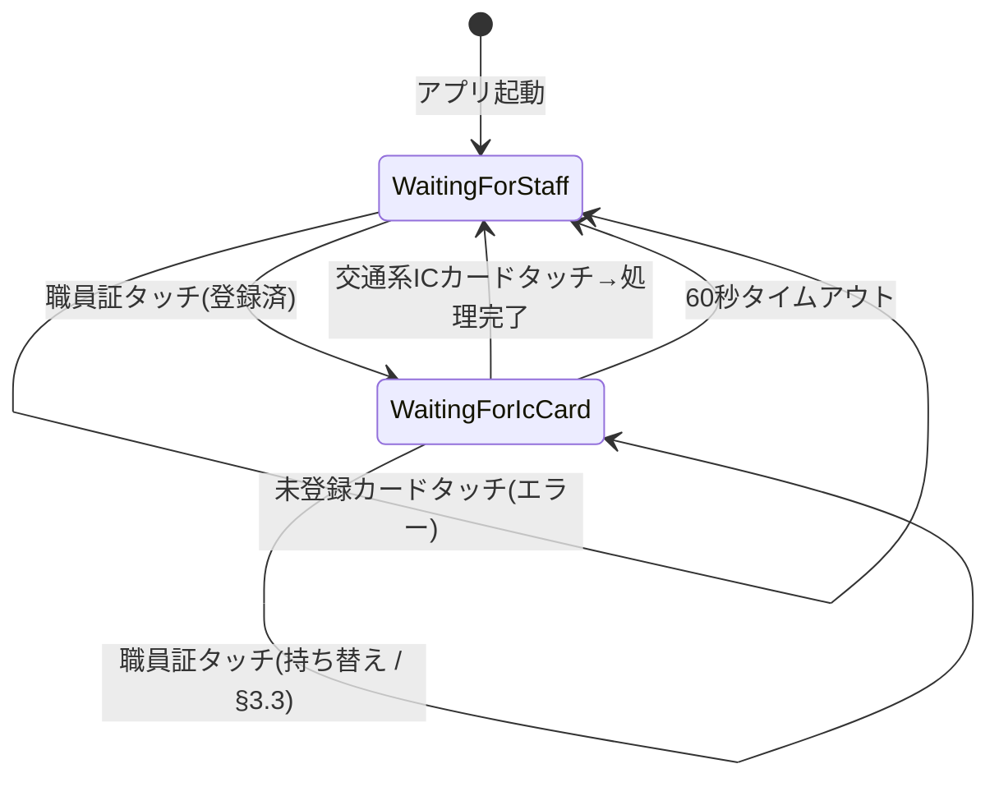
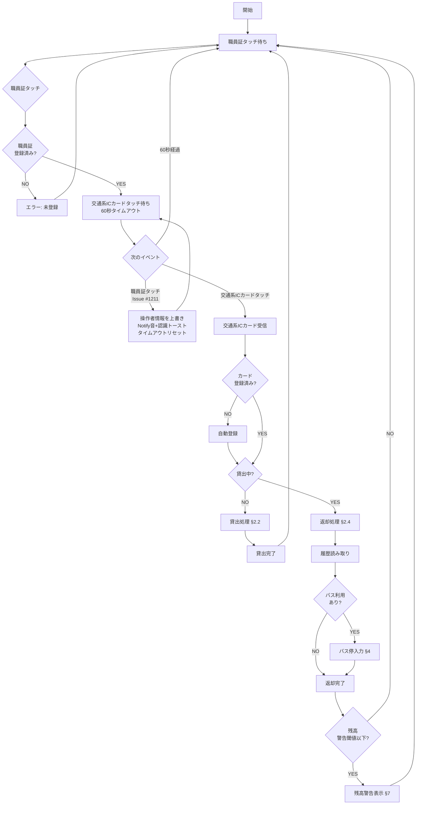
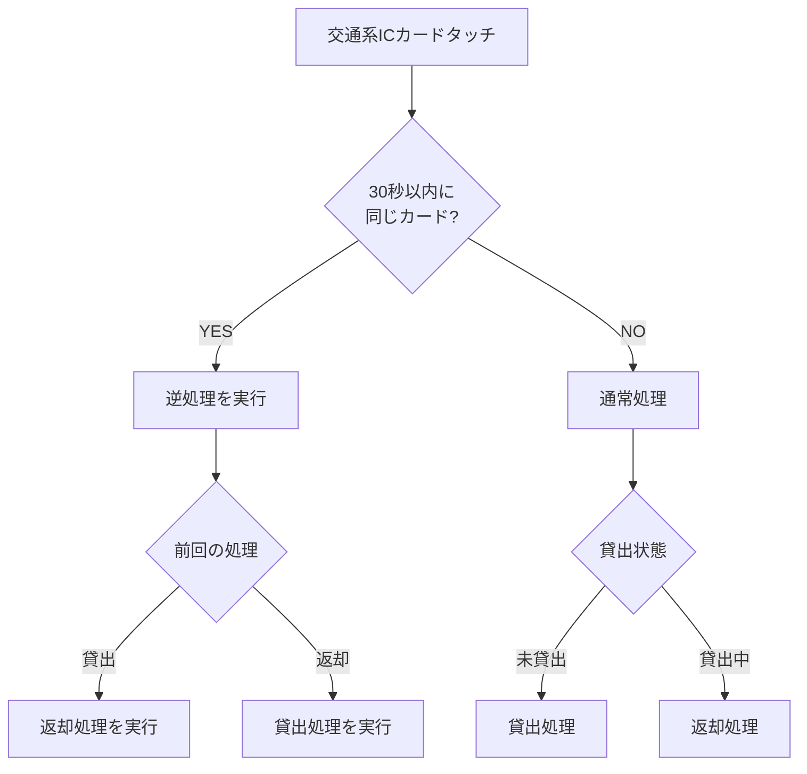
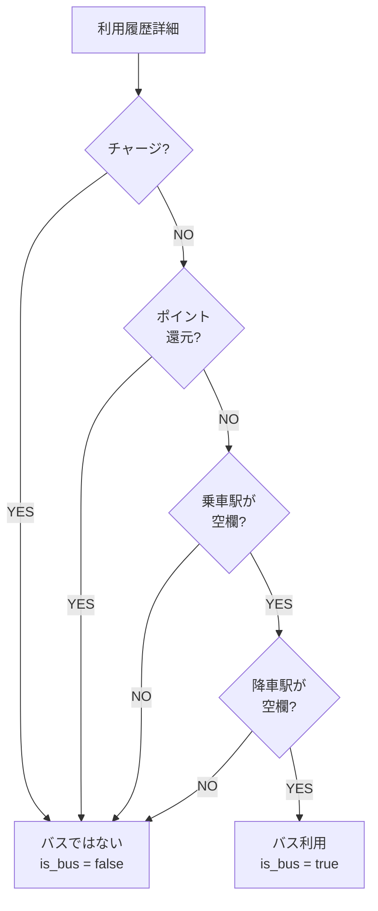
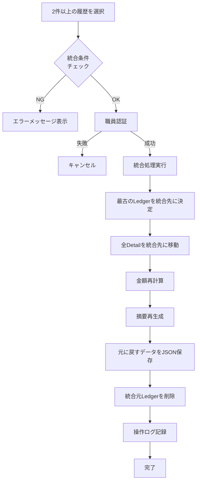
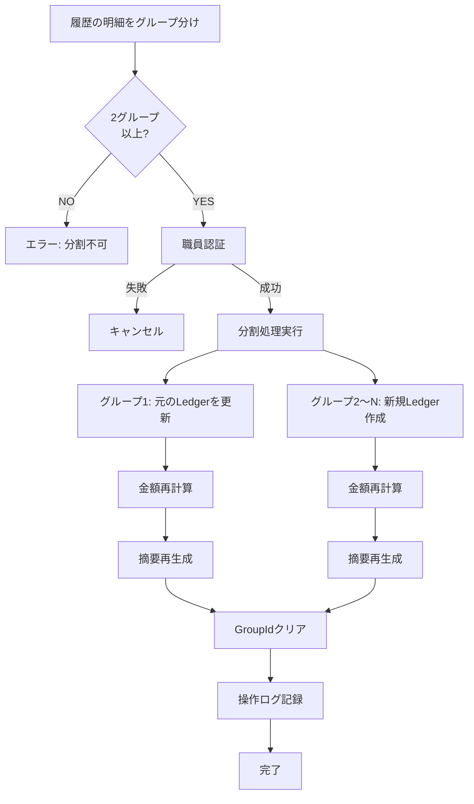
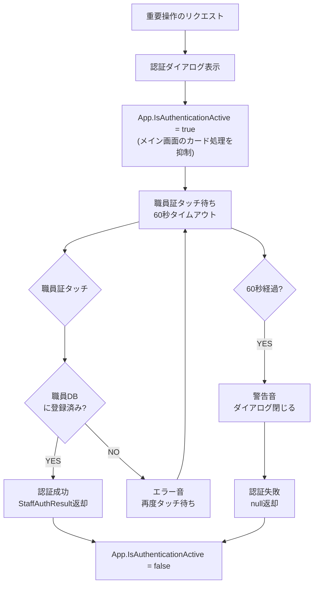

# 機能設計書

## 0. このドキュメントについて

| 項目 | 内容 |
|------|------|
| **対象読者** | 本システムの開発者・保守担当者。業務ロジックやフロー仕様を把握したい人 |
| **前提知識** | `01_システム概要設計書.md` を一読していること。データモデルは `02_DB設計書.md` を参照 |
| **このドキュメントで答えられる問い** | ・貸出/返却はどのように進むのか<br>・30秒ルールとは何か、いつ発動するか<br>・摘要文字列はどのように生成されるか<br>・履歴統合/分割/整合性チェックの仕組み<br>・月次帳票の出力ルール<br>・共有フォルダモードで何が変わるか |
| **関連ドキュメント** | `02_DB設計書.md`(スキーマ) / `03_画面設計書.md`(画面遷移) / `05_クラス設計書.md`(実装クラス) / `06_シーケンス図.md`(処理の時系列) |

> **読み方のヒント**: 全機能を順に読む必要はありません。§1 の機能マップを見て、知りたい機能へ直接ジャンプしてください。核となる業務を押さえたい場合は **【A. 核となる業務フロー】** の §2〜§6 だけでも十分です。

---

## 1. はじめに ─ 機能マップ

### 1.1 本システムの業務の中核

本システムの業務はシンプルな3ステップで表せます。

```
  ① 貸出           ② 利用           ③ 返却
 ┌──────┐         ┌──────┐         ┌──────┐
 │職員証│         │職員が│         │職員証│
 │ タッチ│────▶  │実際に│ ────▶  │＋   │
 │ →   │         │カード│         │カード│
 │カード│         │で移動│         │タッチ│
 │ タッチ│         │      │         │      │
 └──────┘         └──────┘         └──────┘
     │                                  │
     ▼                                  ▼
 ledger に貸出レコード作成          利用履歴を読み取り
 ic_card.is_lent = 1                 日付ごとに ledger 作成
```

この3ステップに付随する判定(30秒ルール / バス利用判別 / 摘要生成 / 残高整合性 等)が機能の大半を占めます。

### 1.2 機能マップ

機能は5つのグループに分類できます。下表のリンクから該当セクションへジャンプしてください。

| グループ | 章 | 重要度 | 概要 |
|---|---|:---:|---|
| **A. 核となる業務フロー** | §2〜§7 | ★★★ | 貸出・返却・30秒ルール・バス判別・摘要生成・ポイント還元・残高警告。日常業務で必ず動く部分 |
| **B. 帳票・出力** | §8〜§10 | ★★ | 月次帳票(物品出納簿)出力、印刷プレビュー、操作ログExcel出力 |
| **C. 履歴の整備・管理** | §11〜§13 | ★★ | 履歴統合(マージ)、履歴分割、残高整合性チェック |
| **D. セキュリティ・同時実行** | §14〜§15 | ★★ | 重要操作の職員認証、カード排他制御 |
| **E. 運用・インフラ** | §16〜§18 | ★ | データ自動削除、アプリ設定、共有フォルダモード |

### 1.3 主要な業務状態

本システムの核となるのは、以下の2状態間を遷移するシンプルな状態機械です。


```mermaid
stateDiagram-v2
    [*] --> WaitingForStaff: アプリ起動
    WaitingForStaff --> WaitingForIcCard: 職員証タッチ(登録済)
    WaitingForIcCard --> WaitingForStaff: 交通系ICカードタッチ→処理完了
    WaitingForIcCard --> WaitingForStaff: 60秒タイムアウト
    WaitingForIcCard --> WaitingForIcCard: 職員証タッチ(持ち替え / §3.3)
    WaitingForStaff --> WaitingForStaff: 未登録カードタッチ(エラー)
```

| 状態 | 説明 | 抜ける契機 |
|---|---|---|
| `WaitingForStaff` | 職員証タッチ待ち。アプリの初期状態 | 登録済み職員証のタッチ |
| `WaitingForIcCard` | 交通系ICカードタッチ待ち。60秒タイムアウトあり | 交通系ICカードタッチ / タイムアウト |

> **持ち替え対応(Issue #1211)**: `WaitingForIcCard` 中に別の職員証がタッチされた場合、状態は遷移せず **操作者情報のみ上書き**されてタイムアウトがリセットされます。詳細は §3.3 参照。

---

# 【A. 核となる業務フロー】

## 2. 貸出・返却フロー

### 2.1 全体フロー

下図は「職員証タッチ → 交通系ICカードタッチ → 処理完了」の全経路をまとめたフローチャートです。Issue #1211 の持ち替え対応(§3.3)も図に含めています。


```mermaid
flowchart TD
    START[開始] --> WAIT_STAFF[職員証タッチ待ち]
    WAIT_STAFF --> STAFF_TOUCH{職員証タッチ}
    STAFF_TOUCH --> VALIDATE_STAFF{職員証<br>登録済み?}
    VALIDATE_STAFF -->|NO| ERROR_STAFF[エラー: 未登録]
    VALIDATE_STAFF -->|YES| WAIT_CARD[交通系ICカードタッチ待ち<br>60秒タイムアウト]

    WAIT_CARD --> EVT{次のイベント}
    EVT -->|職員証タッチ<br>Issue #1211| OVERWRITE[操作者情報を上書き<br>Notify音+認識トースト<br>タイムアウトリセット]
    OVERWRITE --> WAIT_CARD
    EVT -->|60秒経過| WAIT_STAFF
    EVT -->|交通系ICカードタッチ| CARD_TOUCH[交通系ICカード受信]

    CARD_TOUCH --> CHECK_CARD{カード<br>登録済み?}
    CHECK_CARD -->|NO| AUTO_REGISTER[自動登録]
    AUTO_REGISTER --> CHECK_LENT
    CHECK_CARD -->|YES| CHECK_LENT{貸出中?}

    CHECK_LENT -->|NO| LEND[貸出処理 §2.2]
    CHECK_LENT -->|YES| RETURN[返却処理 §2.4]

    LEND --> LEND_SUCCESS[貸出完了]
    RETURN --> READ_HISTORY[履歴読み取り]
    READ_HISTORY --> CHECK_BUS{バス利用<br>あり?}
    CHECK_BUS -->|YES| INPUT_BUS[バス停入力 §4]
    CHECK_BUS -->|NO| RETURN_SUCCESS[返却完了]
    INPUT_BUS --> RETURN_SUCCESS

    LEND_SUCCESS --> WAIT_STAFF
    RETURN_SUCCESS --> CHECK_BALANCE{残高<br>警告閾値以下?}
    CHECK_BALANCE -->|YES| SHOW_WARNING[残高警告表示 §7]
    CHECK_BALANCE -->|NO| WAIT_STAFF
    SHOW_WARNING --> WAIT_STAFF

    ERROR_STAFF --> WAIT_STAFF
```

> **主要な分岐点**は3つ: (1)職員証が登録済みか、(2)交通系ICカードが登録済みか、(3)貸出中か。この3点だけ押さえれば全体が追えます。

### 2.2 貸出処理の詳細

| ステップ | 処理内容 |
|----------|----------|
| 1 | カードの貸出状態を確認(`is_lent = 0` であること) |
| 2 | 職員情報を取得 |
| 3 | 貸出レコード(`ledger`)を作成(`summary = "(貸出中)"`) |
| 4 | カードの貸出状態を更新(`is_lent = 1`, `last_lent_at`, `last_lent_staff`) |
| 5 | 操作ログを記録 |
| 6 | 音声フィードバック(ピッ) |
| 7 | 画面表示更新 |

### 2.3 ICカード待ち中の職員証タッチ(持ち替え対応 / Issue #1211)

**背景:** 運用上、ICカードリーダー上に職員証を置きっぱなしにする職員がおり、他の職員が操作しようとすると置きっぱなしの職員証が先に反応してしまうことがあります。このとき操作者(B)が自分の職員証を改めてタッチし直せるよう、交通系ICカード待ち状態での職員証タッチを「持ち替え」として扱い、以降の貸出/返却はタッチし直した職員の名義で記録します。

| ステップ | 処理内容 |
|----------|----------|
| 1 | 交通系ICカード待ち状態で職員証IDmを受信 |
| 2 | 操作者情報(IDm / 氏名)を受信した職員で(上書き)設定 |
| 3 | 通常の職員証認識と同じフィードバックを実行: Notify 音(ピッ)再生 + 「〇〇 さん / 交通系ICカードをタッチしてください」トースト表示 |
| 4 | 状態は `WaitingForIcCard` を維持し、タイムアウトをリセット |
| 5 | 続いて交通系ICカードがタッチされた場合、**(上書き後の)職員情報で貸出/返却が記録される** |

**挙動上の注意:**
- 交通系ICカード待ち状態中に読み取られた職員証は、**別職員の持ち替え / 同一職員の再タッチを問わず、初回タッチと完全に同じ動作**(Notify 音 + 認識トースト + 操作者(上書き)設定 + タイムアウトリセット)として処理されます
- これにより、持ち替え3回目以降(A→B→C)でも毎回同じフィードバックが得られ、運用者は最後にタッチされた職員名を常にトースト上で確認できます
- 操作者が切り替わっても `ledger` の `lender_idm` / `staff_name` は必ず最後にタッチされた職員のものになります

### 2.4 返却処理の詳細

| ステップ | 処理内容 |
|----------|----------|
| 1 | カードの貸出状態を確認(`is_lent = 1` であること) |
| 2 | 職員情報を取得 |
| 3 | 交通系ICカードから利用履歴を読み取り(最大20件) |
| 4 | 貸出時刻以降の履歴のみを抽出 |
| 5 | 日付ごとに履歴レコード(`ledger`)を作成 |
| 6 | 利用詳細(`ledger_detail`)を作成 |
| 7 | 貸出レコードを更新(`is_lent_record = 0`, `returner_idm`, `returned_at`) |
| 8 | カードの貸出状態を更新(`is_lent = 0`) |
| 9 | 残高チェック(警告閾値との比較) |
| 10 | バス利用があればバス停入力を促す |
| 11 | 操作ログを記録 |
| 12 | 音声フィードバック(ピピッ) |
| 13 | 画面表示更新 |

---

## 3. 30秒ルール

### 3.1 概要

誤操作を防止するため、**30秒以内に同じカードを再タッチした場合は、前回と逆の処理を実行**します。貸出したばかりの直後に気付いて返却したい、というケースを救済する仕組みです。

### 3.2 動作仕様


```mermaid
flowchart TD
    TOUCH[交通系ICカードタッチ] --> CHECK_30SEC{30秒以内に<br>同じカード?}
    CHECK_30SEC -->|YES| REVERSE[逆処理を実行]
    CHECK_30SEC -->|NO| NORMAL[通常処理]

    REVERSE --> WAS_LEND{前回の処理}
    WAS_LEND -->|貸出| DO_RETURN[返却処理を実行]
    WAS_LEND -->|返却| DO_LEND[貸出処理を実行]

    NORMAL --> IS_LENT{貸出状態}
    IS_LENT -->|未貸出| DO_LEND2[貸出処理]
    IS_LENT -->|貸出中| DO_RETURN2[返却処理]
```

### 3.3 実装詳細

```
LastProcessedCardIdm:   最後に処理したカードIDm
LastProcessedTime:      最後に処理した時刻
LastOperationType:      最後の処理種別(Lend/Return)
RetouchTimeoutSeconds:  30秒

IsRetouchWithinTimeout(cardIdm):
    IF LastProcessedCardIdm != cardIdm THEN
        RETURN false
    IF (Now - LastProcessedTime) > RetouchTimeoutSeconds THEN
        RETURN false
    RETURN true
```

### 3.4 ユースケース

| シナリオ | 1回目の操作 | 2回目の操作(30秒以内) | 結果 |
|----------|-------------|-------------------------|------|
| 誤貸出の取消 | 貸出 | 再タッチ | 返却 |
| 誤返却の取消 | 返却 | 再タッチ | 貸出 |
| 別カード | 貸出 | 別カードタッチ | 通常処理 |
| 30秒超過 | 貸出 | 再タッチ(31秒後) | 通常処理 |

---

## 4. バス利用判別

### 4.1 なぜ判別が必要か

交通系ICカードの履歴データには「鉄道/バス」の区別が記録されていません。しかしバス利用はバス停名が必要なので、他の履歴と別扱いする必要があります。そこで、**消去法**でバス利用を判定します。

### 4.2 判別条件

```
IF entry_station(乗車駅)が空欄
   AND exit_station(降車駅)が空欄
   AND is_charge = false
   AND is_point_redemption = false
THEN
    → バス利用(is_bus = true)
```

> **なぜ消去法で判定できるか** — 鉄道は乗車駅/降車駅が必ず記録され、チャージは `is_charge = true`、ポイント還元は `is_point_redemption = true` が立ちます。それらすべてに該当しない履歴は、バス利用と断定できます。ただし**暗黙的ポイント還元**(§6)だけは別処理が必要なので注意。

### 4.3 判別フロー


```mermaid
flowchart TD
    DETAIL[利用履歴詳細] --> CHECK_CHARGE{チャージ?}
    CHECK_CHARGE -->|YES| NOT_BUS[バスではない<br>is_bus = false]
    CHECK_CHARGE -->|NO| CHECK_POINT{ポイント<br>還元?}
    CHECK_POINT -->|YES| NOT_BUS
    CHECK_POINT -->|NO| CHECK_ENTRY{乗車駅が<br>空欄?}
    CHECK_ENTRY -->|NO| NOT_BUS
    CHECK_ENTRY -->|YES| CHECK_EXIT{降車駅が<br>空欄?}
    CHECK_EXIT -->|NO| NOT_BUS
    CHECK_EXIT -->|YES| IS_BUS[バス利用<br>is_bus = true]
```

### 4.4 バス利用時の処理

1. バス利用を検出したら、バス停入力ダイアログ(`BusStopInputDialog`)を表示
2. ユーザーが乗車バス停・降車バス停を入力
3. 入力されたバス停名を `bus_stops` カラムに保存
4. スキップした場合は「★」マークで保存(後から履歴詳細画面で再編集可能)

#### 4.4.1 バス停名オートコンプリート

入力欄には過去入力履歴に基づくオートコンプリート機能を持ちます。

- 候補のソース: `ledger_detail.bus_stops` カラムに格納された過去のバス停名(重複除去)
- 部分一致(前方一致 + 部分一致)でフィルタリングし、利用頻度順に上位を提示
- 「★」(スキップマーカー)は候補から除外
- 設定 `SkipBusStopInputOnReturn = true` の場合、ダイアログ自体を表示せず一律「★」として保存し、後日 `IncompleteBusStopDialog`(Issue #672)で一括入力誘導する

---

## 5. 摘要文字列生成

### 5.1 役割

`SummaryGenerator` は `ledger_detail` の内訳から `ledger.summary` の文字列を組み立てる責務を持ちます。生成結果は物品出納簿の「摘要」欄にそのまま出力されます。

### 5.2 生成パターン一覧

| パターン | 条件 | 生成例 |
|----------|------|--------|
| 単純片道 | 1区間の鉄道利用 | 鉄道(A駅～B駅) |
| 往復 | A→B と B→A の2区間 | 鉄道(A駅～B駅 往復) |
| 乗継 | 連続する駅での乗換 | 鉄道(A駅～C駅) |
| 複数区間 | 関連しない複数区間 | 鉄道(A駅～B駅、C駅～D駅) |
| バスのみ | バス利用のみ | バス(博多駅前→天神) |
| 鉄道＋バス | 両方の利用 | 鉄道(A駅～B駅)、バス(★) |
| チャージのみ | チャージのみ | 役務費によりチャージ |
| ポイント還元 | ポイント還元のみ | ポイント還元 |
| 払い戻し | カード払い戻し時 | 払戻しによる払出 |
| 貸出中 | 貸出時 | (貸出中) |

### 5.3 往復判定ロジック

```
routes = [(A, B), (B, A)]  // A→B と B→A の経路

FOR i = 0 TO routes.length - 1:
    FOR j = i + 1 TO routes.length - 1:
        IF routes[i].Entry == routes[j].Exit
           AND routes[i].Exit == routes[j].Entry:
            → 往復として検出
```

### 5.4 乗継判定ロジック

```
routes = [(A, B), (B, C)]  // A→B と B→C の経路

IF AreTransferStations(routes[0].Exit, routes[1].Entry):
    → 乗継として統合 → (A, C)
```

#### 乗り継ぎ駅グループ

同一駅とみなす乗り継ぎ駅のグループ。降車駅と次の乗車駅がグループ内に含まれる場合、乗継として統合します。

| グループ |
|----------|
| 天神、西鉄福岡(天神) |
| 千早、西鉄千早 |

### 5.5 循環移動の取り扱い

```
routes = [(A, B), (B, C), (C, A)]  // 起点と終点が同じ

IF consolidatedStart == consolidatedEnd:
    → 統合せず個別表示 → "A駅～B駅、B駅～C駅、C駅～A駅"
```

> **なぜ循環は統合しないか** — A→B→C→A を「A駅～A駅」と表示すると意味が失われるため、循環パターンは敢えて個別表示します。

### 5.6 残高不足パターンの検出

残高が不足して不足分を現金でチャージした場合の特殊処理です。

#### 5.6.1 パターン

```
例1(ぴったりチャージ): 残高200円、運賃210円
  チャージ: 10円(残高 → 210円)
  利用:   210円(残高 → 0円)

例2(端数あり): 残高76円、運賃210円
  チャージ: 140円(残高 → 216円) ※不足134円だが10円単位で140円チャージ
  利用:   210円(残高 → 6円)

検出条件:
  originalBalance = charge.Balance - charge.Amount      (チャージ前残高)
  IF originalBalance < usage.Amount                     (チャージ前は残高不足)
     AND charge.Balance == usage.Amount + usage.Balance (チャージ→利用の連続性)
     AND charge.Amount <= usage.Amount                  (不足分補填のチャージであること)
     AND usage.Balance < 100                            (チャージ超過額が少額であること)
  THEN → 残高不足パターンとして検出

※ Issue #1001: 3・4番目の条件は、通常チャージ後の利用を残高不足パターンと
  誤検出することを防止する。精算機でのチャージは不足額ちょうどか10円単位の
  端数切り上げのため、利用後残高(= チャージ額 - 不足額)は少額になるはず。
  利用後残高が100円以上の場合は通常チャージとみなし、パターンから除外する。
```

#### 5.6.2 出力

| 項目 | 値 |
|------|-----|
| 摘要 | 通常の利用摘要(鉄道(A駅～B駅)等) |
| 払出金額 | 運賃 - チャージ額(カードの元残高から充当した金額。例: 210-140=70円) |
| 残額 | 利用後の実残高(ぴったりチャージなら0、端数チャージなら端数が残る) |
| 備考 | 支払額{運賃}円のうち不足額{チャージ額}円は現金で支払(旅費支給) |

#### 5.6.3 詳細レコードの保存

マージされた `ledger` には、チャージ詳細と利用詳細の**両方**を `ledger_detail` に登録します。チャージ詳細を登録しない場合、次回返却時の重複チェック(`GetExistingDetailKeysAsync`)でチャージが検出されず、「役務費によりチャージ」として二重登録される問題が発生します(Issue #978)。

- チャージ詳細を**先に**挿入(SequenceNumber 小)
- 利用詳細を**後に**挿入(SequenceNumber 大)

この順序により、`LedgerMergeService` 等の「最新Detail = 最大 SequenceNumber」ロジックで利用詳細(残額0)が最新として正しく扱われます。

### 5.7 静的メソッド

| メソッド | 戻り値 |
|----------|--------|
| `GetLendingSummary()` | "(貸出中)" |
| `GetChargeSummary()` | "役務費によりチャージ" |
| `GetRefundSummary()` | "払戻しによる払出" |
| `GetInsufficientBalanceNote(fare, shortfall)` | "支払額{fare}円のうち不足額{shortfall}円は現金で支払(旅費支給)" |
| `GetCarryoverFromPreviousYearSummary()` | "前年度より繰越" |
| `GetCarryoverToNextYearSummary()` | "次年度へ繰越" |
| `GetMonthlySummary(month)` | "{month}月計" |
| `GetCumulativeSummary()` | "累計" |

---

## 6. 暗黙的ポイント還元検出(Issue #942)

### 6.1 概要

FeliCaの履歴データでは、通常のポイント還元は `is_point_redemption` フラグで明示的に検出されます。しかし、**一部の交通系ICカードではフラグが立たず、金額がマイナス**(チャージでも利用でもない)として記録されるケースがあります。本システムはこのケースを「暗黙的ポイント還元」として別途検出します。

### 6.2 検出ロジック

```
IF amount < 0
   AND is_charge = false
   AND is_point_redemption = false
THEN
   → 暗黙的ポイント還元として扱う(is_point_redemption = true 相当)
```

### 6.3 摘要生成への影響

暗黙的ポイント還元として検出された場合、摘要は「ポイント還元」として生成されます。受入金額には金額の絶対値が設定されます。

> **バス判別との兼ね合い** — この検出が行われないと、マイナス金額の履歴がバス判別(§4)の「チャージでもポイント還元でもない」条件を満たしてしまい、誤ってバス利用扱いになります。そのため §4 の判別より前にこの補正が適用されます。

---

## 7. 残高警告機能

### 7.1 概要

返却時にカード残高が設定された閾値を下回っている場合、警告を表示します。

### 7.2 設定

- 設定キー: `warning_balance`
- デフォルト値: 10000円
- 設定画面から変更可能

### 7.3 警告表示

- サイドバーの警告エリアに表示
- 背景色: `#FFF3E0`(薄いオレンジ)
- 音声フィードバック: `warning.wav`

---

# 【B. 帳票・出力】

## 8. 月次帳票(物品出納簿)

### 8.1 帳票形式

- ファイル形式: Excel(.xlsx)
- テンプレート: `Resources/Templates/物品出納簿テンプレート.xlsx`
- 出力ファイル名: `物品出納簿_{カード種別}_{管理番号}_{年}年{月}月.xlsx`

### 8.2 帳票レイアウト

```
+--------------------------------------------------------------------+
| 物品出納簿                                                          |
+--------------------------------------------------------------------+
| 物品の分類|雑品(金券類)|品名|はやかけん|規格|H001|単位:|円|頁|    |
+--------------------------------------------------------------------+
| 出納年月日 | 摘要                    | 受入金額 | 払出金額 | 残額 | 氏名   |備考|
|------------|-------------------------|------|------|------|--------|-----|
| 4/1        | 前年度より繰越          | 5000 |      | 5000 |        ||
| 4/1        | 鉄道(博多～天神)        |      | 260  | 4740 | 山田   ||
| 4/2        | 役務費によりチャージ    | 3000 |      | 7740 | 山田   ||
| 4/2        | 鉄道(天神～博多)        |      | 260  | 7480 | 山田   ||
|            | 4月計                   | 3000 | 520  | 7480 |        ||
+--------------------------------------------------------------------+
```

### 8.3 特殊行の出力条件

| 行種別 | 出力条件 | 備考 |
|--------|----------|------|
| 前年度繰越 | 4月のみ | 前年度3月末残高を表示。受入金額欄に残高を記録 |
| ○月から繰越 | 年度途中導入時 | 紙の出納簿からの繰越。受入金額欄は**空欄**（残高のみ表示） |
| 月計 | 毎月 | 当月の受入/払出合計。「○月から繰越」の受入は集計に含めない |
| 累計 | 5月～3月 | 年度の受入/払出合計。年度途中導入時は紙の累計を加算(Issue #1215) |
| 次年度繰越 | 3月のみ | 払出欄に残高、残額欄に0 |

### 8.4 帳票のフォントサイズ

#### 8.4.1 基本フォントサイズ

| 列 | 内容 | フォントサイズ |
|----|------|---------------|
| A列 | 出納年月日 | 14pt |
| B-D列 | 摘要 | 文字列長に応じて可変(後述) |
| E列 | 受入金額 | 16pt |
| F列 | 払出金額 | 16pt |
| G列 | 残額 | 16pt |
| H列 | 氏名 | 14pt |
| I-L列 | 備考 | 14pt |

#### 8.4.2 摘要欄のフォントサイズ自動調整

摘要欄(B-D列結合セル)の文字列長に応じて、フォントサイズを自動で段階的に縮小します。

| 文字数 | フォントサイズ |
|--------|---------------|
| 15文字未満 | 14pt |
| 15文字以上32文字未満 | 12pt |
| 32文字以上38文字未満 | 10pt |
| 38文字以上93文字未満 | 8pt |
| 93文字以上108文字未満 | 7pt |
| 108文字以上 | 6pt |

- 繰越行・月計行・累計行の摘要は固定文字列のため、常に14ptを適用

### 8.5 除外データ

- `summary = "(貸出中)"` のレコードは出力しません
- 論理削除されたカード・職員も履歴は出力します

### 8.6 和暦変換

- 日付カラムは「元号年.月.日」形式(例: R8.4.1)

---

## 9. 印刷プレビュー機能

### 9.1 概要

月次帳票(物品出納簿)の印刷前にプレビュー表示する機能。ズーム・ページナビゲーション・印刷方向切替をサポートします。

### 9.2 ズーム機能

| 操作 | 動作 |
|------|------|
| ズームイン | 定義済みレベル(50→75→100→125→150→200%)で段階的に拡大 |
| ズームアウト | 定義済みレベルで段階的に縮小 |
| リセット | 100%に戻す |
| カスタム値 | 定義済みレベル以外の値も指定可能 |

### 9.3 ページナビゲーション

| コマンド | 条件 |
|----------|------|
| 次のページ | `IsLastPage` でなければ実行可能 |
| 前のページ | `IsFirstPage` でなければ実行可能 |
| 最初のページ | `IsFirstPage` でなければ実行可能 |
| 最後のページ | `IsLastPage` でなければ実行可能 |

### 9.4 印刷方向切替

- **縦方向(Portrait) / 横方向(Landscape)** の切替が可能
- 方向変更時に帳票データから FlowDocument を再生成
- 方向変更後は1ページ目にリセット
- 単一カード・複数カードの両方に対応

---

## 10. 操作ログExcel出力

### 10.1 概要

操作ログの検索結果をExcelファイル(.xlsx)にエクスポートする機能です。

### 10.2 出力カラム

| 列 | ヘッダー | 幅 | 内容 |
|----|----------|-----|------|
| A | 日時 | 20 | `yyyy/MM/dd HH:mm:ss` 形式 |
| B | 操作種別 | 10 | INSERT/UPDATE/DELETE等(色分け・太字) |
| C | 対象 | 18 | テーブル名の日本語表示 |
| D | 対象ID | 20 | TargetId |
| E | 操作者 | 12 | OperatorName |
| F | 変更内容 | 40 | UPDATE時のみ差分サマリ |
| G | 変更前 | 50 | JSONを日本語ラベル付きで整形 |
| H | 変更後 | 50 | JSONを日本語ラベル付きで整形 |

### 10.3 書式ルール

| 要素 | 書式 |
|------|------|
| ヘッダー行 | 白太字 + 青背景(`#4472C4`) |
| 操作種別:INSERT/RESTORE | 緑(`#2E7D32`) |
| 操作種別:UPDATE | オレンジ(`#E65100`) |
| 操作種別:DELETE | 赤(`#C62828`) |
| 操作種別:MERGE/SPLIT | 青(`#1565C0`) |
| データ行 | テキスト折り返し、上寄せ |
| フィルター | 1行目で自動フィルター有効 |
| 固定表示 | 1行目を固定 |

### 10.4 JSON整形ルール

- 単一オブジェクト: `フィールド名: 値` の一覧に変換
- 配列: `[1] フィールド名: 値` のようにインデックス付きで変換
- フィールド名はテーブルごとの日本語マッピングを使用(例: `card_idm` → `カードIDm`)
- 真偽値: `true` → `はい`、`false` → `いいえ`
- null: `(なし)`

### 10.5 変更サマリ(UPDATE時)

変更前後のJSONを比較し、差分のあるフィールドのみ抽出:

```
フィールド名: 変更前の値 → 変更後の値
```

---

# 【C. 履歴の整備・管理】

## 11. 履歴統合(マージ)機能

### 11.1 概要

複数の利用履歴(`ledger`)レコードを1つに統合する機能です。日付の近い履歴が複数行に分かれている場合に、手動で1行にまとめることができます。統合後は「元に戻す」操作も可能です。

### 11.2 統合条件

| # | 条件 | エラー時の動作 |
|---|------|----------------|
| 1 | 2件以上のLedgerが選択されていること | エラーメッセージ表示 |
| 2 | 全てのLedgerが同一カード(`CardIdm`)であること | エラーメッセージ表示 |
| 3 | 貸出中レコード(`IsLentRecord = true`)を含まないこと | エラーメッセージ表示 |
| 4 | 受入(チャージ)と払出(利用)が混在しないこと | エラーメッセージ表示 |

### 11.3 統合処理フロー


```mermaid
flowchart TD
    SELECT[2件以上の履歴を選択] --> VALIDATE{統合条件<br>チェック}
    VALIDATE -->|NG| ERROR[エラーメッセージ表示]
    VALIDATE -->|OK| AUTH[職員認証]
    AUTH -->|失敗| CANCEL[キャンセル]
    AUTH -->|成功| MERGE[統合処理実行]

    MERGE --> TARGET[最古のLedgerを統合先に決定]
    TARGET --> MOVE_DETAILS[全Detailを統合先に移動]
    MOVE_DETAILS --> CALC[金額再計算]
    CALC --> REGEN_SUMMARY[摘要再生成]
    REGEN_SUMMARY --> SAVE_UNDO[元に戻すデータをJSON保存]
    SAVE_UNDO --> DELETE_SOURCE[統合元Ledgerを削除]
    DELETE_SOURCE --> LOG[操作ログ記録]
    LOG --> DONE[完了]
```

### 11.4 統合時のデータ計算ルール

| 項目 | 計算方法 |
|------|----------|
| 受入金額(Income) | 全統合元の合計 |
| 払出金額(Expense) | 全統合元の合計 |
| 残額(Balance) | 最新Detailの Balance(SequenceNumber/UseDate 順) |
| 摘要(Summary) | `SummaryGenerator` で全Detailから再生成 |
| 備考(Note) | 非null備考を「、」区切りで結合(重複排除) |

### 11.5 元に戻す機能

- `ledger_merge_history` テーブルに UndoData を JSON 形式で保存
- UndoData には統合前の各 Ledger スナップショットと Detail → Ledger のマッピングを含む
- 元に戻す操作時にスナップショットから元の Ledger を復元し、Detail を元の所属に戻す
- 元に戻した履歴は `is_undone = true` にマーク

---

## 12. 履歴分割機能

### 12.1 概要

1つの利用履歴(`ledger`)レコードに含まれる複数の明細(`ledger_detail`)を、グループ分けして別々の Ledger レコードに分割する機能です。

### 12.2 分割条件

- 2つ以上のグループに分けられていること(各 Detail に `GroupId` が設定済み)
- 分割対象の Ledger が存在すること

### 12.3 分割処理フロー


```mermaid
flowchart TD
    SELECT[履歴の明細をグループ分け] --> VALIDATE{2グループ<br>以上?}
    VALIDATE -->|NO| ERROR[エラー: 分割不可]
    VALIDATE -->|YES| AUTH[職員認証]
    AUTH -->|失敗| CANCEL[キャンセル]
    AUTH -->|成功| SPLIT[分割処理実行]

    SPLIT --> GROUP1[グループ1: 元のLedgerを更新]
    SPLIT --> GROUP2[グループ2〜N: 新規Ledger作成]
    GROUP1 --> CALC1[金額再計算]
    GROUP2 --> CALC2[金額再計算]
    CALC1 --> SUMMARY1[摘要再生成]
    CALC2 --> SUMMARY2[摘要再生成]
    SUMMARY1 --> CLEAR[GroupIdクリア]
    SUMMARY2 --> CLEAR
    CLEAR --> LOG[操作ログ記録]
    LOG --> DONE[完了]
```

### 12.4 金額計算ロジック(`CalculateGroupFinancials`)

```
グループ内の各Detailについて:
  受入金額 = IsCharge=true かつ Amount有値 の Detail.Amount の合計
  払出金額 = IsCharge=false かつ IsPointRedemption=false かつ Amount有値 の Detail.Amount の合計
  残額   = グループ内の Detail を LedgerDetailChronologicalSorter.Sort() で
          残高チェーン順にソートし、最後の Detail の Balance
          (Balance 未設定の場合は 0)
```

### 12.5 分割後のLedger属性

| 項目 | 値 |
|------|-----|
| CardIdm | 元の Ledger と同一 |
| Date | グループ内最古 Detail の `UseDate`(なければ元の日付) |
| Summary | `SummaryGenerator` で再生成(空の場合「(分割)」) |
| IsLentRecord | 常に `false` |
| LenderIdm, StaffName等 | 元の Ledger からコピー |

---

## 13. 残高整合性チェック

### 13.1 概要

カードの利用履歴における残高チェーン(`前回残高 + 受入 - 払出 = 今回残高`)の整合性を検証する機能です。履歴の追加・削除・変更後に呼び出され、不整合を検出します。

### 13.2 検証ロジック

#### 13.2.1 親レコードレベルの検証

```
Ledger を日付順(Date昇順)にソートし、同一日内は LedgerOrderHelper.ReorderByBalanceChain() で
残高チェーン順に並べ替え

FOR each Ledger (2件目以降):
    期待残高 = 前回の Ledger.Balance + 今回の Income - 今回の Expense
    IF 今回の Ledger.Balance ≠ 期待残高:
        → 不整合として記録(LedgerId, 期待残高, 実際残高)
```

#### 13.2.2 詳細レベルの検証(Issue #1059)

同一日にグループ化された `ledger_detail` 間の残高チェーンも検証します。親レコードレベルでは隠れてしまう途中の詳細の不整合を検出します。

```
全 Ledger の詳細を時系列順に連結

previousDetailBalance = null

FOR each Ledger:
    IF 詳細なし:
        previousDetailBalance = Ledger.Balance
        CONTINUE

    FOR each Detail in Ledger.Details:
        IF Amount=null OR Balance=null: SKIP

        IF previousDetailBalance != null:
            IF Detail.IsCharge OR Detail.IsPointRedemption:
                期待残高 = previousDetailBalance + Detail.Amount
            ELSE:
                期待残高 = previousDetailBalance - Detail.Amount

            IF Detail.Balance ≠ 期待残高:
                → 詳細不整合として記録(LedgerId, SequenceNumber, 期待残高, 実際残高)

        previousDetailBalance = Detail.Balance
```

### 13.3 検証バリエーション

| メソッド | 用途 |
|----------|------|
| `CheckBalanceConsistencyAsync` | DB取得→親+詳細レベルを検証 |
| `CheckConsistency` | 渡されたリストを直接検証(親+詳細) |
| `CheckDetailConsistency` | 詳細レベルのみ検証(internal static) |
| `CheckConsistencyWithPreviousAsync` | 期間直前の Ledger も取得して1件目から検証 |

### 13.4 結果

```
ConsistencyResult:
  IsConsistent: true/false
  Inconsistencies: List<(LedgerId, ExpectedBalance, ActualBalance)>  // 親レコードレベル
  DetailInconsistencies: List<DetailInconsistency>                   // 詳細レベル(Issue #1059)

DetailInconsistency:
  LedgerId: int           // 親 Ledger の ID
  SequenceNumber: int     // 詳細のシーケンス番号(rowid)
  ExpectedBalance: int    // 期待残高
  ActualBalance: int      // 実際残高
```

---

# 【D. セキュリティ・同時実行】

## 14. 職員認証機能

### 14.1 概要

重要な操作(履歴統合・分割・削除等)の実行前に、操作者を職員証タッチで確認する機能です。

### 14.2 認証フロー


```mermaid
flowchart TD
    TRIGGER[重要操作のリクエスト] --> SHOW_DIALOG[認証ダイアログ表示]
    SHOW_DIALOG --> SET_FLAG["App.IsAuthenticationActive = true<br>(メイン画面のカード処理を抑制)"]
    SET_FLAG --> WAIT[職員証タッチ待ち<br>60秒タイムアウト]

    WAIT --> TOUCH{職員証タッチ}
    TOUCH --> LOOKUP{職員DB<br>に登録済み?}
    LOOKUP -->|YES| SUCCESS[認証成功<br>StaffAuthResult返却]
    LOOKUP -->|NO| RETRY[エラー音<br>再度タッチ待ち]
    RETRY --> WAIT

    WAIT --> TIMEOUT{60秒経過?}
    TIMEOUT -->|YES| WARN[警告音<br>ダイアログ閉じる]
    WARN --> FAIL[認証失敗<br>null返却]

    SUCCESS --> RESET["App.IsAuthenticationActive = false"]
    FAIL --> RESET
```

### 14.3 タイムアウト仕様

| 経過時間 | 動作 |
|----------|------|
| 0〜50秒 | 通常のカウントダウン表示 |
| 50〜55秒 | 残り時間を赤色表示(5秒カウントダウン) |
| 60秒 | 警告音再生 → ダイアログ自動クローズ |

### 14.4 認証対象操作

- 履歴統合(マージ)
- 履歴分割
- 履歴行の編集・削除
- その他、ViewModel から `RequestAuthenticationAsync` を呼び出す操作

---

## 15. カード排他制御

### 15.1 概要

同一カードに対する同時操作を防止するため、カードIDm単位のロック機構を提供します。

> **2層ロック構造(共有フォルダモード)**: 共有フォルダモードでは、アプリケーション層の `CardLockManager`(プロセス内排他制御)に加えて、SQLiteの `busy_timeout`(ファイルレベル排他制御)による **2層のロック構造** で同時アクセスを制御します。`CardLockManager` は同一プロセス内のスレッド間排他を担い、`busy_timeout` は異なるPC間のDB書き込み競合を担います。
>
> **物理的制約による天然の排他**については `02_DB設計書.md` §11.4 を参照。同一物理カードを同時に2台のPCでタッチすることは不可能なため、同一カードへの同時書き込みは原理的に発生しません。

### 15.2 ロック戦略

| 項目 | 仕様 |
|------|------|
| ロック単位 | カードIDm(1カード = 1ロック) |
| ロック方式 | `SemaphoreSlim(1, 1)` による排他ロック |
| データ構造 | `ConcurrentDictionary<string, LockEntry>` |
| 参照カウント | `GetLock()` で +1、`ReleaseLockReference()` で -1 |

### 15.3 ロック取得・解放

```
GetLock(cardIdm):
    LockEntry = Dictionary.GetOrAdd(cardIdm, new LockEntry)
    LastUsed = UtcNow
    ReferenceCount++
    RETURN SemaphoreSlim

ReleaseLockReference(cardIdm):
    ReferenceCount-- (最小0)
    LastUsed = UtcNow
```

### 15.4 自動クリーンアップ

| 項目 | 値 |
|------|-----|
| クリーンアップ間隔 | 15分 |
| ロック有効期限 | 1時間 |
| 削除条件 | `ReferenceCount = 0` AND `LastUsed < (現在 - 1時間)` AND `SemaphoreSlim` 未ロック |

### 15.5 シャットダウン

- `Dispose()` 時に全ロックを強制解放(`SemaphoreSlim.Dispose()`)
- クリーンアップタイマーを停止
- `ConcurrentDictionary` をクリア

---

# 【E. 運用・インフラ】

## 16. データ自動削除

### 16.1 削除タイミング

- アプリケーション起動時に自動実行

### 16.2 削除対象

- 6年以上経過した `ledger` レコード
- 関連する `ledger_detail` レコード(CASCADE削除)

### 16.3 実装

```sql
DELETE FROM ledger WHERE date < date('now', '-6 years');
```

### 16.4 最適化

削除後に `VACUUM` コマンドでデータベースファイルを最適化可能(手動実行)。

> **保持期間の根拠**は監査対応(6年)です。詳細は `02_DB設計書.md` §1.1 および §7 を参照。

---

## 17. アプリケーション設定

### 17.1 設定項目一覧

| 設定キー | 設定名 | 設定値 | デフォルト | 説明 |
|----------|--------|--------|------------|------|
| `toast_position` | トースト通知の表示位置 | TopRight/TopLeft/BottomRight/BottomLeft | TopRight | 貸出・返却時のポップアップ通知の表示位置 |
| `font_size` | 文字サイズ | Small/Medium/Large/ExtraLarge | Medium | 画面全体の文字サイズ |
| `warning_balance` | 残額警告閾値 | 0〜20,000 | 10,000 | この金額以下で警告表示 |
| `sound_mode` | 音声設定 | Beep/VoiceMale/VoiceFemale/None | Beep | 操作時の音声フィードバック |
| `department_type` | 部署設定 | MayorOffice/EnterpriseAccount | MayorOffice | チャージ摘要の文言に影響 |
| `skip_bus_stop_input_on_return` | 返却時のバス停入力スキップ | true/false | false | 有効時、返却時にバス停入力ダイアログを表示しない |
| `backup_path` | バックアップ先フォルダ | フォルダパス | 空(アプリフォルダ) | データベースバックアップの保存先 |

> **データベースパス設定**: `C:\ProgramData\ICCardManager\database_config.txt` で DB ファイルの配置先を指定します。settings テーブルではなくファイルで管理します(DB接続前に読み込む必要があるため)。インストーラーの「データベースの保存先」ページまたは設定画面(F5)から変更可能で、変更後はアプリケーション再起動が必要です。

### 17.2 返却時のバス停入力スキップ(Issue #975)

返却処理でバス利用が検出された場合、通常はバス停入力ダイアログを表示します。`skip_bus_stop_input_on_return` を有効にすると、ダイアログを表示せずバス停名を「★」として自動記録します。

- 未入力のバス停名は、メイン画面の警告エリアおよびバス停名未入力履歴ダイアログ(Issue #672)から後で入力可能
- バス利用頻度が高い組織向けの運用効率化設定

### 17.3 カードダッシュボードの並び替え

メイン画面のカードダッシュボードは以下の基準で並び替え可能です。

| 並び替え | 説明 |
|----------|------|
| カード名順 | カード種別・管理番号の昇順(デフォルト) |
| 残高(少ない順) | 残高が少ないカードを先頭に表示 |
| 残高(多い順) | 残高が多いカードを先頭に表示 |
| 最終利用日順 | 最後に使用されたカードを先頭に表示 |

---

## 18. 共有フォルダモード

> **主要な仕様は `02_DB設計書.md` §10〜§11 に集約されています。** 本章ではアプリ層(キャッシュTTL調整・接続監視・切断時のUX)に絞って記載します。

### 18.1 概要

複数PCから同一のSQLiteデータベースにアクセスする運用形態です。SMB共有フォルダ上にDBファイルを配置し、`C:\ProgramData\ICCardManager\database_config.txt` にUNCパスを設定することで有効化されます。インストーラーの「データベースの保存先」ページで「共有フォルダで複数PCから使用」を選択してUNCパスを入力するか、設定画面(F5)から変更できます。

### 18.2 共有モード判定

`database_config.txt` にパスが設定されている場合、アプリケーションは共有フォルダモードとして動作します。`DbContext.IsSharedMode` プロパティで判定可能です。

### 18.3 キャッシュTTLの調整

共有フォルダモードでは、他PCによるデータ変更を早期に反映するため、キャッシュのTTL(Time To Live)を短縮します。ローカル操作ではキャッシュが即座に無効化されるため、TTLは「他PCの操作結果が見えるまでの遅延」のみに影響します。20台同時接続でのネットワーク負荷を考慮し、過度に短くしません。

| キャッシュ項目 | スタンドアロンモード | 共有フォルダモード |
|---------------|--------------------|--------------------|
| カード一覧(CardList) | 60秒 | 15秒 |
| 貸出中カード(LentCards) | 30秒 | 10秒 |
| 職員一覧(Staff) | 60秒 | 30秒 |
| 設定(Settings) | 5分 | 3分 |

### 18.4 接続監視

共有フォルダモードでは、30秒ごとにDB接続のヘルスチェックを実行します。

```
HealthCheckLoop(30秒間隔):
    TRY:
        SELECT 1 を実行
        IF 成功:
            接続正常
            警告バナー非表示
    CATCH:
        接続断と判定
        WarningType.DatabaseConnectionLost 警告を表示
        自動再接続を試行
```

### 18.4a 定期同期の対象（Issue #1131, #1381）

30秒ごとのヘルスチェックが接続成功で完了するたびに、他 PC による変更をメイン画面へ反映するため以下を再読み込みします（`MainViewModel.RefreshSharedDataAsync`）。

| 対象 | 常時更新 | 条件付き更新 |
|------|----------|-------------|
| 貸出中カード一覧（LentCards） | ○ | — |
| ダッシュボード（CardBalanceDashboard） | ○ | — |
| 履歴画面（HistoryLedgers） | — | `IsHistoryVisible == true` のときのみ（Issue #1381） |

`CurrentState == AppState.Processing`（職員証／交通系ICカードタッチ対応中）では、リフレッシュ全体をスキップします。これはタッチ処理中の UI ちらつきと競合状態を避けるためで、次回（30秒後）のヘルスチェックで同期処理が再試行されます。履歴画面を開いていない状態では、`LoadHistoryLedgersAsync` の呼び出しも行われず、共有フォルダへの不要な読み取り負荷を抑えます。

### 18.5 ネットワーク切断時の動作

| 状態 | 動作 |
|------|------|
| 切断検出時 | メイン画面に警告バナーを表示、操作は一時的にエラーとなる |
| 自動再接続 | ヘルスチェック時に再接続を試行。成功すれば警告を解除 |
| 復旧後 | 通常動作に自動復帰 |

---

## 付録A. 用語クイックリファレンス

| 用語 | 意味 |
|------|------|
| IDm | FeliCaカードの製造ID。職員証・交通系ICカードの識別に使用 |
| 貸出 / 返却 | 職員に交通系ICカードを物理的に渡す/受け取る操作 |
| 30秒ルール | 誤操作救済のため、30秒以内の同一カード再タッチで逆処理を実行する機能(§3) |
| 持ち替え | 交通系ICカード待ち中に別の職員証がタッチされたとき、操作者を上書きする挙動(§2.3、Issue #1211) |
| 乗り継ぎ統合 | 複数の鉄道利用を1つの摘要にまとめる機能(§5.4、Issue #484) |
| 残高不足パターン | 不足分を現金でチャージして乗車する際の特殊処理(§5.6) |
| 暗黙的ポイント還元 | フラグが立たないまま金額マイナスで記録されるポイント還元(§6、Issue #942) |
| 30秒/60秒タイムアウト | 30秒=同一カード再タッチ猶予、60秒=状態タイムアウト |

> 本格的な用語集は今後 `00_用語集.md` として整備予定(Issue #1214)。

---

## 付録B. 関連ドキュメント

| ドキュメント | 関連箇所 |
|---|---|
| `02_DB設計書.md` | スキーマ、論理削除、共有フォルダモードのインフラ詳細 |
| `03_画面設計書.md` | 画面遷移、ダイアログ仕様 |
| `05_クラス設計書.md` | `SummaryGenerator`, `LedgerMergeService`, `LedgerConsistencyChecker`, `CardLockManager` 等の実装 |
| `06_シーケンス図.md` | 貸出/返却の時系列、30秒ルール発動時のシーケンス |
| `07_テスト設計書.md` | 各機能のテストケース |
