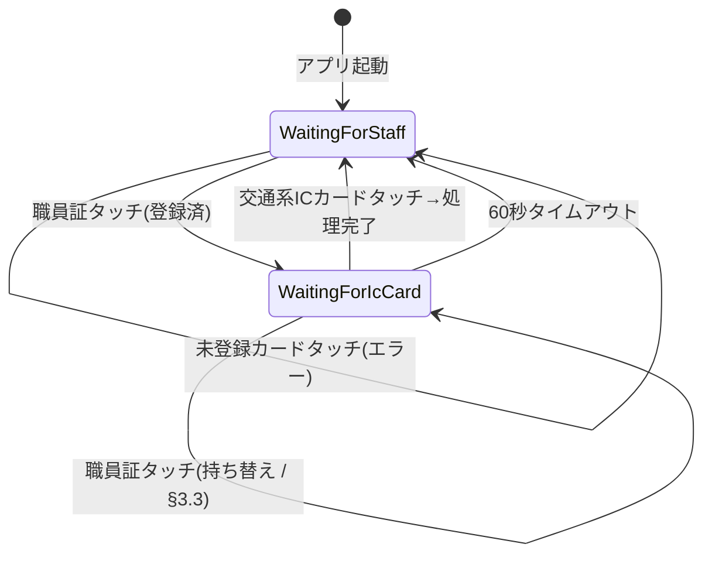
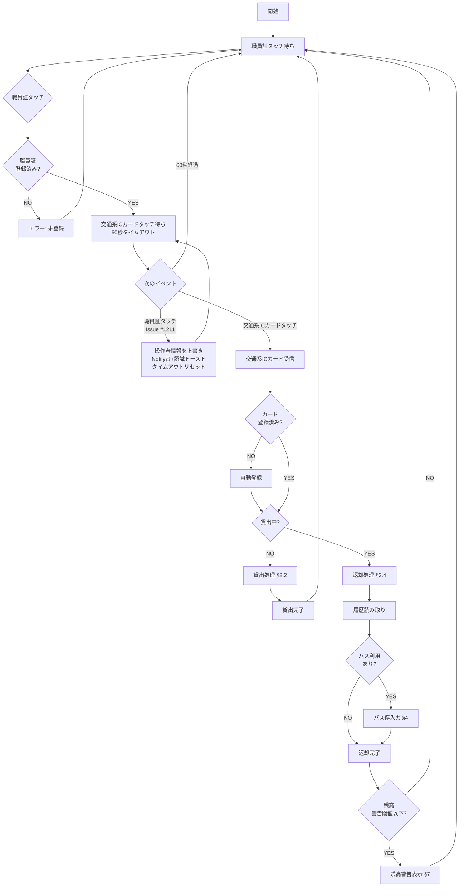
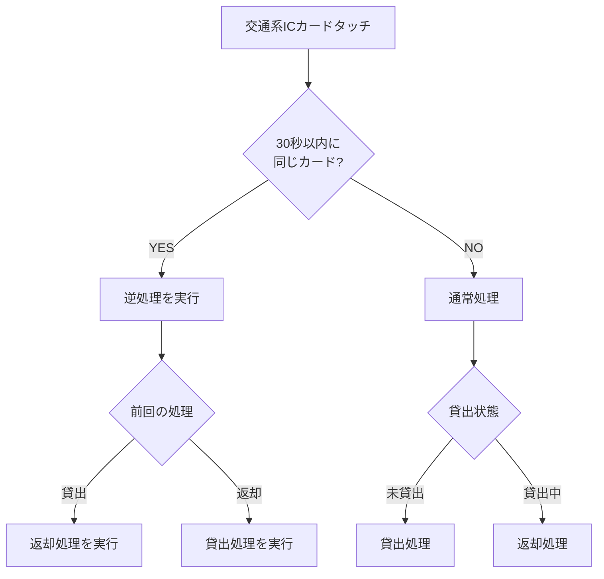
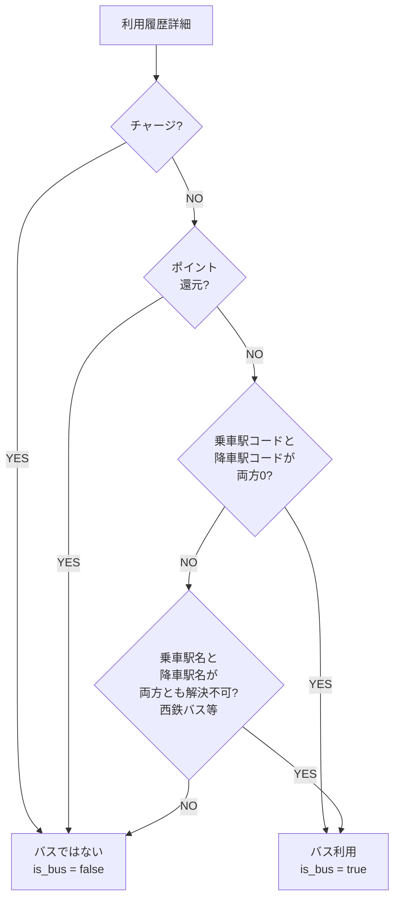
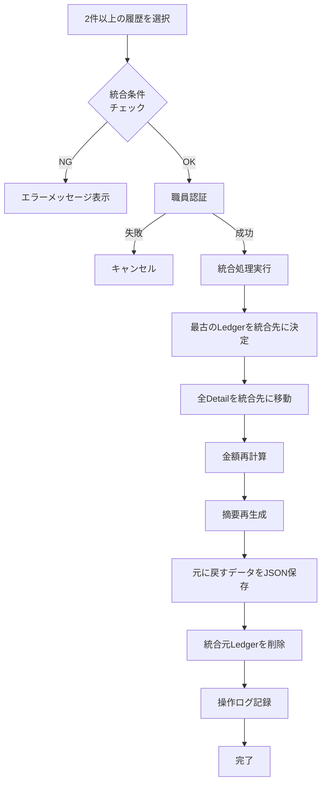
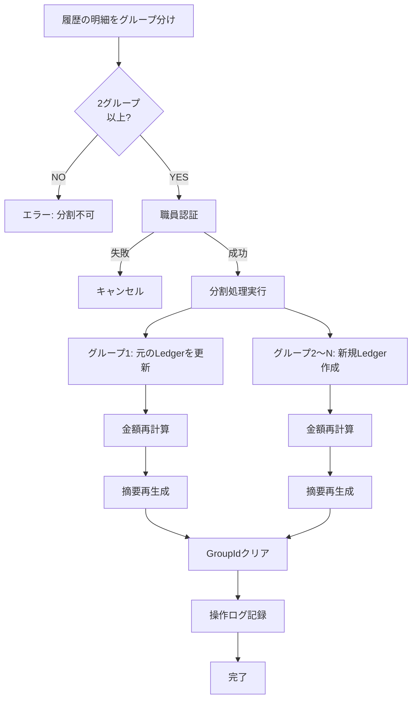
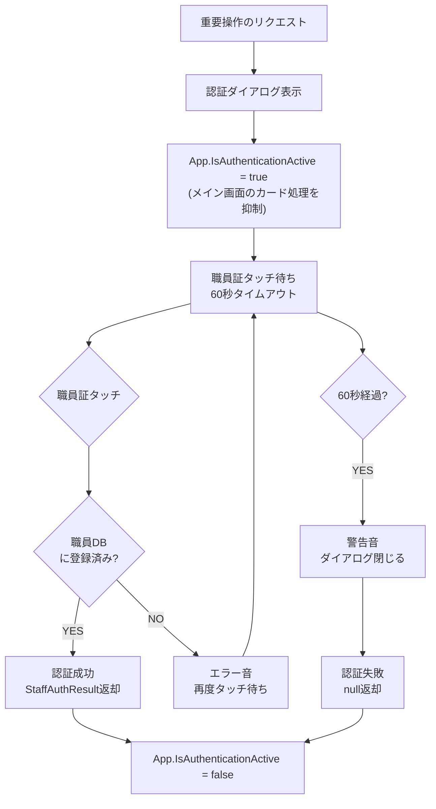

# 機能設計書

## 0. このドキュメントについて

| 項目 | 内容 |
|------|------|
| **対象読者** | 本システムの開発者・保守担当者。業務ロジックやフロー仕様を把握したい人 |
| **前提知識** | `01_システム概要設計書.md` を一読していること。データモデルは `02_DB設計書.md` を参照 |
| **このドキュメントで答えられる問い** | ・貸出/返却はどのように進むのか<br>・30秒ルールとは何か、いつ発動するか<br>・摘要文字列はどのように生成されるか<br>・履歴統合/分割/整合性チェックの仕組み<br>・月次帳票の出力ルール<br>・共有フォルダモードで何が変わるか |
| **関連ドキュメント** | `02_DB設計書.md`(スキーマ) / `03_画面設計書.md`(画面遷移) / `05_クラス設計書.md`(実装クラス) / `06_シーケンス図.md`(処理の時系列) |

> **読み方のヒント**: 全機能を順に読む必要はありません。§1 の機能マップを見て、知りたい機能へ直接ジャンプしてください。核となる業務を押さえたい場合は **【A. 核となる業務フロー】** の §2〜§6 だけでも十分です。

---

## 1. はじめに ─ 機能マップ

### 1.1 本システムの業務の中核

本システムの業務はシンプルな3ステップで表せます。

```
  ① 貸出           ② 利用           ③ 返却
 ┌──────┐         ┌──────┐         ┌──────┐
 │職員証│         │職員が│         │職員証│
 │ タッチ│────▶  │実際に│ ────▶  │＋   │
 │ →   │         │カード│         │カード│
 │カード│         │で移動│         │タッチ│
 │ タッチ│         │      │         │      │
 └──────┘         └──────┘         └──────┘
     │                                  │
     ▼                                  ▼
 ledger に貸出レコード作成          利用履歴を読み取り
 ic_card.is_lent = 1                 日付ごとに ledger 作成
```

この3ステップに付随する判定(30秒ルール / バス利用判別 / 摘要生成 / 残高整合性 等)が機能の大半を占めます。

### 1.2 機能マップ

機能は5つのグループに分類できます。下表のリンクから該当セクションへジャンプしてください。

| グループ | 章 | 重要度 | 概要 |
|---|---|:---:|---|
| **A. 核となる業務フロー** | §2〜§7 | ★★★ | 貸出・返却・30秒ルール・バス判別・摘要生成・ポイント還元・残高警告。日常業務で必ず動く部分 |
| **B. 帳票・出力** | §8〜§10 | ★★ | 月次帳票(物品出納簿)出力、印刷プレビュー、操作ログExcel出力 |
| **C. 履歴の整備・管理** | §11〜§13 | ★★ | 履歴統合(マージ)、履歴分割、残高整合性チェック |
| **D. セキュリティ・同時実行** | §14〜§15 | ★★ | 重要操作の職員認証、カード排他制御 |
| **E. 運用・インフラ** | §16〜§18 | ★ | データ自動削除、アプリ設定、共有フォルダモード |

### 1.3 主要な業務状態

本システムの核となるのは、以下の2状態間を遷移するシンプルな状態機械です。


```mermaid
stateDiagram-v2
    [*] --> WaitingForStaff: アプリ起動
    WaitingForStaff --> WaitingForIcCard: 職員証タッチ(登録済)
    WaitingForIcCard --> WaitingForStaff: 交通系ICカードタッチ→処理完了
    WaitingForIcCard --> WaitingForStaff: 60秒タイムアウト
    WaitingForIcCard --> WaitingForIcCard: 職員証タッチ(持ち替え / §3.3)
    WaitingForStaff --> WaitingForStaff: 未登録カードタッチ(エラー)
```

| 状態 | 説明 | 抜ける契機 |
|---|---|---|
| `WaitingForStaff` | 職員証タッチ待ち。アプリの初期状態 | 登録済み職員証のタッチ |
| `WaitingForIcCard` | 交通系ICカードタッチ待ち。60秒タイムアウトあり | 交通系ICカードタッチ / タイムアウト |

> **持ち替え対応(Issue #1211)**: `WaitingForIcCard` 中に別の職員証がタッチされた場合、状態は遷移せず **操作者情報のみ上書き**されてタイムアウトがリセットされます。詳細は §3.3 参照。

> **判定待ちの間に前提が変わったタッチは中止する(Issue #1842)**: カード読み取りは `HandleCardReadAsync` 冒頭の入口ゲート（処理中・読み取り抑制中は無視）を通ったあと、職員・カードの判定（`GetByIdmAsync`）で待機します。共有モードではこの待機が数十〜数百 ms あり、その間に届いた 2 件目のタッチは**入口ゲートを通過済み**のため、1 件目の継続が「古い前提」で再開し得ます。そこで両分岐（`HandleCardInStaffWaitingStateAsync` / `HandleCardInIcCardWaitingStateAsync`）は判定の直後に**読み取り抑制の有無と現在の状態**を取り直し、変わっていれば処理を中止します。
>
> - 中止する代表例: 未登録カードの判定待ち中に職員証が認識された場合。中止しないと、あとから開く種別選択ダイアログとその後の状態リセットが**確定済みの操作者を消し**、職員は「認識された」と思っているのに次の交通系ICカードタッチが履歴表示になります。
> - タイムアウト発火で状態が戻った場合も同じ判定で中止されます（操作者を失ったまま貸出・返却へ進みません）。
> - 中止したタッチは通知せずに捨てます。再タッチすれば通常どおり処理されるため、副作用を残さない側へ倒す判断です。

---

# 【A. 核となる業務フロー】

## 2. 貸出・返却フロー

### 2.1 全体フロー

下図は「職員証タッチ → 交通系ICカードタッチ → 処理完了」の全経路をまとめたフローチャートです。Issue #1211 の持ち替え対応(§3.3)も図に含めています。


```mermaid
flowchart TD
    START[開始] --> WAIT_STAFF[職員証タッチ待ち]
    WAIT_STAFF --> STAFF_TOUCH{職員証タッチ}
    STAFF_TOUCH --> VALIDATE_STAFF{職員証<br>登録済み?}
    VALIDATE_STAFF -->|NO| ERROR_STAFF[エラー: 未登録]
    VALIDATE_STAFF -->|YES| WAIT_CARD[交通系ICカードタッチ待ち<br>60秒タイムアウト]

    WAIT_CARD --> EVT{次のイベント}
    EVT -->|職員証タッチ<br>Issue #1211| OVERWRITE[操作者情報を上書き<br>Notify音+認識トースト<br>タイムアウトリセット]
    OVERWRITE --> WAIT_CARD
    EVT -->|60秒経過| WAIT_STAFF
    EVT -->|交通系ICカードタッチ| CARD_TOUCH[交通系ICカード受信]

    CARD_TOUCH --> CHECK_CARD{カード<br>登録済み?}
    CHECK_CARD -->|NO| AUTO_REGISTER[自動登録]
    AUTO_REGISTER --> CHECK_LENT
    CHECK_CARD -->|YES| CHECK_LENT{貸出中?}

    CHECK_LENT -->|NO| LEND[貸出処理 §2.2]
    CHECK_LENT -->|YES| RETURN[返却処理 §2.4]

    LEND --> LEND_SUCCESS[貸出完了]
    RETURN --> READ_HISTORY[履歴読み取り]
    READ_HISTORY --> CHECK_BUS{バス利用<br>あり?}
    CHECK_BUS -->|YES| INPUT_BUS[バス停入力 §4]
    CHECK_BUS -->|NO| RETURN_SUCCESS[返却完了]
    INPUT_BUS --> RETURN_SUCCESS

    LEND_SUCCESS --> WAIT_STAFF
    RETURN_SUCCESS --> CHECK_BALANCE{残高<br>警告閾値以下?}
    CHECK_BALANCE -->|YES| SHOW_WARNING[残高警告表示 §7]
    CHECK_BALANCE -->|NO| WAIT_STAFF
    SHOW_WARNING --> WAIT_STAFF

    ERROR_STAFF --> WAIT_STAFF
```

> **主要な分岐点**は3つ: (1)職員証が登録済みか、(2)交通系ICカードが登録済みか、(3)貸出中か。この3点だけ押さえれば全体が追えます。

### 2.2 貸出処理の詳細

| ステップ | 処理内容 |
|----------|----------|
| 1 | カードの貸出状態を確認(`is_lent = 0` であること) |
| 2 | 職員情報を取得 |
| 3 | 貸出レコード(`ledger`)を作成(`summary = "（貸出中）"`) |
| 4 | カードの貸出状態を更新(`is_lent = 1`, `last_lent_at`, `last_lent_staff`) |
| 5 | 操作ログを記録 |
| 6 | 音声フィードバック(ピッ) |
| 7 | 画面表示更新 |

### 2.3 交通系ICカード待ち中の職員証タッチ(持ち替え対応 / Issue #1211)

**背景:** 運用上、ICカードリーダー上に職員証を置きっぱなしにする職員がおり、他の職員が操作しようとすると置きっぱなしの職員証が先に反応してしまうことがあります。このとき操作者(B)が自分の職員証を改めてタッチし直せるよう、交通系ICカード待ち状態での職員証タッチを「持ち替え」として扱い、以降の貸出/返却はタッチし直した職員の名義で記録します。

| ステップ | 処理内容 |
|----------|----------|
| 1 | 交通系ICカード待ち状態で職員証IDmを受信 |
| 2 | 操作者情報(IDm / 氏名)を受信した職員で(上書き)設定 |
| 3 | 通常の職員証認識と同じフィードバックを実行: Notify 音(ピッ)再生 + 「〇〇 さん / 交通系ICカードをタッチしてください」トースト表示 |
| 4 | 状態は `WaitingForIcCard` を維持し、タイムアウトをリセット |
| 5 | 続いて交通系ICカードがタッチされた場合、**(上書き後の)職員情報で貸出/返却が記録される** |

**挙動上の注意:**
- 交通系ICカード待ち状態中に読み取られた職員証は、**別職員の持ち替え / 同一職員の再タッチを問わず、初回タッチと完全に同じ動作**(Notify 音 + 認識トースト + 操作者(上書き)設定 + タイムアウトリセット)として処理されます
- これにより、持ち替え3回目以降(A→B→C)でも毎回同じフィードバックが得られ、運用者は最後にタッチされた職員名を常にトースト上で確認できます
- 操作者が切り替わっても `ledger` の `lender_idm` / `staff_name` は必ず最後にタッチされた職員のものになります

### 2.4 返却処理の詳細

| ステップ | 処理内容 |
|----------|----------|
| 1 | カードの貸出状態を確認(`is_lent = 1` であること) |
| 2 | 職員情報を取得 |
| 3 | 交通系ICカードから利用履歴を読み取り(最大20件) |
| 4 | 貸出時刻以降の履歴のみを抽出 |
| 5 | 日付ごとに履歴レコード(`ledger`)を作成 |
| 6 | 利用詳細(`ledger_detail`)を作成 |
| 7 | 貸出レコードを更新(`is_lent_record = 0`, `returner_idm`, `returned_at`) |
| 8 | カードの貸出状態を更新(`is_lent = 0`) |
| 9 | 残高チェック(警告閾値との比較) |
| 10 | バス利用があればバス停入力を促す |
| 11 | 操作ログを記録 |
| 12 | 音声フィードバック(ピピッ) |
| 13 | 画面表示更新 |

---

### 2.5 後処理（画面表示更新）が失敗したときの扱い（Issue #1725）

貸出・返却の**記録は DB へコミット済みでも、その後の画面表示更新は失敗しうる**。共有モードで SMB が瞬断すると、貸出中カード一覧・残高ダッシュボード・履歴の再取得で `SQLiteException` が発生する。

| 観点 | 仕様 |
|------|------|
| 内部状態 | `Processing` を**必ず解除**する（`try/finally`）。解除しないと以後の全カードタッチが無視され、アプリ再起動以外に復帰できない（→ `03_画面設計書.md` §3.2） |
| 音 | `SoundType.Warning`（中立的な警告音）。記録は成功しているため、エラー音（ピー）は事実と矛盾する |
| 通知 | 「◯◯は記録済み」＋「画面の更新に失敗しました。再タッチしないでください。」 |
| 30秒ルール | 操作者情報は**後処理より前に確定**させるため、直後の再タッチによる逆処理は正常に動作する |
| ログ | `LogError` で例外を記録（IDm はマスクする） |

**「もう一度タッチしてください」と案内してはならない。** 30秒以内の再タッチは §3 の 30秒ルールにより逆処理（貸出→返却）として扱われるため、案内どおり操作すると記録済みの貸出／返却が取り消される。

記録が確定する**前**の失敗（カードリーダー切断など）は従来どおりエラー扱いで、「もう一度タッチしてください」と案内する。両者の判定は「`LendAsync` / `ReturnAsync` が成功を返した後か否か」で行う。

#### 2.5.1 `ReturnAsync` 内部のコミット後処理が失敗したときの扱い（Issue #1805）

上の判定は `ReturnAsync` が**記録の確定を正しく `Success` に反映している**ことを前提にする。`ReturnAsync` は `PersistReturnAsync` でコミットを済ませたあとに、残額の解決（`ResolveReturnBalanceAsync`。カード読取値も作成 ledger も無いときだけ `GetLatestLedgerAsync` の DB I/O へ到達）と残額警告の付与（`ApplyBalanceWarningAsync`。常に `GetAppSettingsAsync` を読む）を行う。修正前はここで例外が出ると同じ `catch` が `Success = false` を返し、**台帳に記録済みなのに「返却処理に失敗しました。もう一度タッチしてください」と案内され**、§2.5 の「記録済み」判定（`result.Success` 依存）も働かなかった。案内どおり再タッチすると `ic_card.is_lent = 0` のため貸出として新規に記録され、手元に無いカードが「貸出中」になり長期未返却の督促対象にもなる。

| 観点 | 仕様 |
|------|------|
| `Success` の意味 | **「台帳への記録が確定した」ことだけ**を表す。コミット直後（`PersistReturnAsync` の戻り直後）に `LastProcessedCardIdm` / `LastProcessedTime` / `LastOperationType` と併せて確定させ、以降の後処理の失敗で落とさない（`catch (Exception) when (result.Success)` で吸収） |
| 付帯情報の欠落 | `LendingResult.HasPostCommitFailure = true`。このとき `Balance` / `IsLowBalance` / `WarningBalance` は信頼できない（既定値のまま、または途中まで解決された値） |
| 通知（`HandleReturnSuccessAsync`） | 残額付きの返却通知（`ShowReturnNotification`）は出さず、「返却は記録済み」＋「残額を確認できませんでした。再タッチしないでください。」＋ `SoundType.Warning`。以降の後処理（貸出中カード一覧・ダッシュボード・履歴の更新、バス停入力ダイアログ）は通常どおり続行する。案内は `NotifyRecordedButIncomplete`（#1725 の「画面の更新に失敗しました」と同じヘルパー）に集約する。後処理が**同じ原因で**失敗して `ProcessReturnAsync` の catch（§2.5 の `NotifyProcessingFailure(recorded: true)`）へ流れた場合は、既に案内済み（`alreadyNotified`）としてログのみ残し、同題のトーストと警告音を重ねない |
| 30秒ルール | `LendingService` 側の処理情報も `MainViewModel` 側の操作者情報も、成功した返却と同じ状態になる |
| ログ | `LogWarning` で例外を記録（返却自体は成功しているため Error ではない。IDm はマスクする） |

「コミット確定後の後処理を、成否の判定に巻き込まない」（`.claude/rules/development-conventions.md`、Issue #1727）の返却経路への適用。**規約が書かれる前から存在した経路**が取り残されていた形で、`LendAsync` はコミット直後に処理情報を確定し後処理の DB I/O を持たないため対象外。

---

## 3. 30秒ルール

### 3.1 概要

誤操作を防止するため、**30秒以内に同じカードを再タッチした場合は、前回と逆の処理を実行**します。貸出したばかりの直後に気付いて返却したい、というケースを救済する仕組みです。

### 3.2 動作仕様


```mermaid
flowchart TD
    TOUCH[交通系ICカードタッチ] --> CHECK_30SEC{30秒以内に<br>同じカード?}
    CHECK_30SEC -->|YES| REVERSE[逆処理を実行]
    CHECK_30SEC -->|NO| NORMAL[通常処理]

    REVERSE --> WAS_LEND{前回の処理}
    WAS_LEND -->|貸出| DO_RETURN[返却処理を実行]
    WAS_LEND -->|返却| DO_LEND[貸出処理を実行]

    NORMAL --> IS_LENT{貸出状態}
    IS_LENT -->|未貸出| DO_LEND2[貸出処理]
    IS_LENT -->|貸出中| DO_RETURN2[返却処理]
```

### 3.3 実装詳細

```
LastProcessedCardIdm:   最後に処理したカードIDm
LastProcessedTime:      最後に処理した時刻
LastOperationType:      最後の処理種別(Lend/Return)
RetouchTimeoutSeconds:  30秒

IsRetouchWithinTimeout(cardIdm):
    IF LastProcessedCardIdm != cardIdm THEN
        RETURN false
    IF (Now - LastProcessedTime) > RetouchTimeoutSeconds THEN
        RETURN false
    RETURN true
```

### 3.4 逆処理を「誰の操作」として記録するか（Issue #1729）

30秒ルールは**職員証をタッチしなくても発動する**（誤操作に気付いた職員がその場でカードだけを再タッチできるようにするため）。このため逆処理の実行時に操作者が確定していない場合があり、その補完規則を定めます。

| 再タッチ時の状態 | `_currentStaffIdm` | 台帳・`ic_card.lender_idm`・操作ログに記録する操作者 |
|------------------|--------------------|--------------------------------------------------|
| ICカードタッチ待ち（直前に職員証をタッチ済み） | 確定済み | **いま職員証をタッチした職員**（前回操作者で上書きしない） |
| 職員証タッチ待ち（職員証をタッチせず再タッチ） | 未確定（null） | 前回操作を行った職員で補完する |
| 職員証タッチ待ち かつ 前回操作者も不明 | 未確定（null） | 記録せずエラー通知（「操作者情報がありません。職員証をタッチしてください。」） |

**原則: 操作者が確定しているときに前回操作者で上書きしてはならない。**

- 職員 A が返却した20秒後に職員 B が自分の職員証をタッチして同じカードを借りると、再タッチ判定が成立して逆処理（貸出）が走ります。ここで前回操作者 A へ差し替えると、実際に持ち出したのは B なのに `ledger.StaffName` / `ic_card.lender_idm` / `operation_log` が A になり、長期未返却の督促も A へ向かいます
- 「操作者が未確定」＝「職員証タッチ待ち経路から来た」と判定できます。`AppState.WaitingForStaffCard` へ遷移する経路は `MainViewModel.ResetState()` ただ1つで、そこで `_currentStaffIdm` は必ず null になるためです
- 3行目のエラー分岐は到達可能です。仮想タッチ（開発用のカード読み取りシミュレーション、Issue #1577）は `LendingService.ReturnAsync` を直接呼ぶため `LastProcessedCardIdm` は記録されますが、`MainViewModel` 側の前回操作者は記録されません
- この規則はユーザーマニュアル §4.4 の注意書き（「30秒ルールで訂正すると返却者が現在タッチした職員として記録されます」）と一致します

### 3.5 ユースケース

| シナリオ | 1回目の操作 | 2回目の操作(30秒以内) | 結果 |
|----------|-------------|-------------------------|------|
| 誤貸出の取消 | 貸出 | 再タッチ | 返却 |
| 誤返却の取消 | 返却 | 再タッチ | 貸出 |
| 別カード | 貸出 | 別カードタッチ | 通常処理 |
| 30秒超過 | 貸出 | 再タッチ(31秒後) | 通常処理 |
| 別職員が引き継ぐ | 職員Aが返却 | 職員Bが職員証タッチ→再タッチ | 貸出（**貸出者は職員B**、§3.4） |

---

## 4. バス利用判別

### 4.1 なぜ判別が必要か

交通系ICカードの履歴データには「鉄道/バス」の区別が記録されていません。しかしバス利用はバス停名が必要なので、他の履歴と別扱いする必要があります。そこで、**消去法**でバス利用を判定します。

### 4.2 判別条件

```
IF is_charge = false
   AND is_point_redemption = false
   AND (
        (乗車駅コード = 0 AND 降車駅コード = 0)          // 第1条件: 駅コードが両方とも空(0)
        OR
        (乗車駅名が解決不可 AND 降車駅名が解決不可)       // 第2条件: 駅コードはあるが駅名が両方とも解決できない(西鉄バス等)
       )
THEN
    → バス利用(is_bus = true)
```

> **なぜ消去法で判定できるか** — 鉄道は乗車駅/降車駅が必ず記録され、チャージは `is_charge = true`、ポイント還元は `is_point_redemption = true` が立ちます。それらすべてに該当しない履歴は、バス利用と断定できます。ただし**暗黙的ポイント還元**(§6)だけは別処理が必要なので注意。
>
> **第2条件の意図(西鉄バス等)** — 一部のバス事業者(西鉄バス等)は履歴に駅コードを記録するため、第1条件の「駅コード=0」だけでは取りこぼします。駅コードを駅名マスター(`StationCode.csv`)で引いても乗車・降車の**両方とも駅名が解決できない**場合は、鉄道駅ではないバス利用と判定します(`FelicaHistoryBlockDecoder.cs`)。

### 4.3 判別フロー


```mermaid
flowchart TD
    DETAIL[利用履歴詳細] --> CHECK_CHARGE{チャージ?}
    CHECK_CHARGE -->|YES| NOT_BUS[バスではない<br>is_bus = false]
    CHECK_CHARGE -->|NO| CHECK_POINT{ポイント<br>還元?}
    CHECK_POINT -->|YES| NOT_BUS
    CHECK_POINT -->|NO| CHECK_CODE{乗車駅コードと<br>降車駅コードが<br>両方0?}
    CHECK_CODE -->|YES| IS_BUS[バス利用<br>is_bus = true]
    CHECK_CODE -->|NO| CHECK_NAME{乗車駅名と<br>降車駅名が<br>両方とも解決不可?<br>西鉄バス等}
    CHECK_NAME -->|YES| IS_BUS
    CHECK_NAME -->|NO| NOT_BUS
```

### 4.4 バス利用時の処理

1. バス利用を検出したら、バス停入力ダイアログ(`BusStopInputDialog`)を表示
2. ユーザーが乗車バス停・降車バス停を入力
3. 入力されたバス停名を `bus_stops` カラムに保存
4. スキップした場合は「★」マークで保存(後から履歴詳細画面で再編集可能)

#### 4.4.1 バス停名オートコンプリート

入力欄には過去入力履歴に基づくオートコンプリート機能を持ちます。

- 候補のソース: `ledger_detail.bus_stops` カラムに格納された過去のバス停名(重複除去)
- 部分一致(前方一致 + 部分一致)でフィルタリングし、利用頻度順に上位を提示
- 「★」(スキップマーカー)は候補から除外
- 設定 `SkipBusStopInputOnReturn = true` の場合、ダイアログ自体を表示せず一律「★」として保存し、後日 `IncompleteBusStopDialog`(Issue #672)で一括入力誘導する

---

## 5. 摘要文字列生成

### 5.1 役割

`SummaryGenerator` は `ledger_detail` の内訳から `ledger.summary` の文字列を組み立てる責務を持ちます。生成結果は物品出納簿の「摘要」欄にそのまま出力されます。

### 5.2 生成パターン一覧

| パターン | 条件 | 生成例 |
|----------|------|--------|
| 単純片道 | 1区間の鉄道利用 | 鉄道(A駅～B駅) |
| 往復 | A→B と B→A の2区間 | 鉄道(A駅～B駅 往復) |
| 乗継 | 連続する駅での乗換 | 鉄道(A駅～C駅) |
| 複数区間 | 関連しない複数区間 | 鉄道(A駅～B駅、C駅～D駅) |
| 片側駅名不明 | 運賃が発生した鉄道利用で片側の駅名を解決できない | 鉄道(A駅～?) |
| 区間不明 | 摘要の自動生成が空文字になる利用（両側駅名不明等） | 鉄道（区間不明） |
| バスのみ | バス利用のみ | バス(博多駅前→天神) |
| 鉄道＋バス | 両方の利用 | 鉄道(A駅～B駅)、バス(★) |
| チャージのみ | チャージのみ | 役務費によりチャージ |
| ポイント還元 | ポイント還元のみ | ポイント還元 |
| 払い戻し | カード払い戻し時 | 払戻しによる払出 |
| 貸出中 | 貸出時 | （貸出中） |

> **片側駅名不明の扱い（Issue #1735）** — StationCode.csv 未収録の新駅などで片側の駅名だけが解決できなかった鉄道明細は、欠落側をプレースホルダ「?」で補完して経路に採用する（従来は経路から黙って落ち、その明細が唯一の利用の場合に摘要が空欄の台帳行が保存されていた）。ただし**運賃 0 円の片側欠落は「入場記録のみ」（未完了移動）とみなし従来どおり摘要に載せない**（摘要は払出金額の説明であり、払出のない未完了記録を載せない仕様を維持）。プレースホルダは往復・乗継判定にもそのまま参加する（「A駅～? 往復」、「?」同士の接続点は乗継統合）。「?」の駅名は履歴画面の編集で修正でき、修正すると摘要が再生成される。

> **駅名マスタの読み込み失敗は本番ログへ残す（Issue #1819）** — 駅コードマスタは埋め込みリソース `StationCode.csv`（約 5,988 行）から起動後の初回参照時に読み込む。読み込みに失敗した場合はフォールバックの主要駅データ（約 136 駅）へ縮退して動作を継続するが、**修正前はこの縮退が Release ビルドで完全に無言**だった（痕跡は `#if DEBUG` の `Debug.WriteLine` のみで、`ILogger` の注入自体がなかった）。結果、埋め込みリソースの欠落（csproj の `<EmbeddedResource>` 削除等のビルド・パッケージング退行）で九州の主要駅以外がすべて解決できなくなり、上の「?」プレースホルダを含む摘要が 6 年保存の台帳へ恒久記録されても、ログにも UI にも痕跡が残らなかった。現在は失敗時に例外つきの `LogError` と縮退後の件数の `LogWarning` を、**正常時も読み込み件数の `LogInformation`** を出力する（件数の比較で縮退を判別するため、正常時の記録が要る）。管理者向けの症状と対処は管理者マニュアル §10.3 に記載。
>
> **区間不明の代替摘要（Issue #1735）** — `LendingService` の返却時 Ledger 生成3経路（新規作成／同一日統合／残高不足マージ）は、`Generate` が空文字を返した場合に摘要が空欄のまま保存しないガードを持つ。新規 INSERT は `GetUnknownUsageSummary()`（既定「鉄道（区間不明）」、`SummaryTextOptions.UnknownUsageSummary` で変更可能）を充て、既存レコードへの統合は既存摘要を維持する（既存も空なら代替文言）。

### 5.3 往復判定ロジック

```
routes = [(A, B), (B, A)]  // A→B と B→A の経路

FOR i = 0 TO routes.length - 1:
    FOR j = i + 1 TO routes.length - 1:
        IF routes[i].Entry == routes[j].Exit
           AND routes[i].Exit == routes[j].Entry:
            → 往復として検出
```

### 5.4 乗継判定ロジック

```
routes = [(A, B), (B, C)]  // A→B と B→C の経路

IF AreTransferStations(routes[0].Exit, routes[1].Entry):
    → 乗継として統合 → (A, C)
```

#### 乗り継ぎ駅グループ

同一駅とみなす乗り継ぎ駅のグループ。降車駅と次の乗車駅がグループ内に含まれる場合、乗継として統合します。

| グループ |
|----------|
| 天神、西鉄福岡(天神) |
| 千早、西鉄千早 |

### 5.5 循環移動の取り扱い

```
routes = [(A, B), (B, C), (C, A)]  // 起点と終点が同じ

IF consolidatedStart == consolidatedEnd:
    → 統合せず個別表示 → "A駅～B駅、B駅～C駅、C駅～A駅"
```

> **なぜ循環は統合しないか** — A→B→C→A を「A駅～A駅」と表示すると意味が失われるため、循環パターンは敢えて個別表示します。

### 5.6 残高不足パターンの検出

残高が不足して不足分を現金でチャージした場合の特殊処理です。

#### 5.6.1 パターン

```
例1(ぴったりチャージ): 残高200円、運賃210円
  チャージ: 10円(残高 → 210円)
  利用:   210円(残高 → 0円)

例2(端数あり): 残高76円、運賃210円
  チャージ: 140円(残高 → 216円) ※不足134円だが10円単位で140円チャージ
  利用:   210円(残高 → 6円)

検出条件:
  originalBalance = charge.Balance - charge.Amount      (チャージ前残高)
  IF originalBalance < usage.Amount                     (チャージ前は残高不足)
     AND charge.Balance == usage.Amount + usage.Balance (チャージ→利用の連続性)
     AND charge.Amount <= usage.Amount                  (不足分補填のチャージであること)
     AND usage.Balance < 100                            (チャージ超過額が少額であること)
  THEN → 残高不足パターンとして検出

※ Issue #1001: 3・4番目の条件は、通常チャージ後の利用を残高不足パターンと
  誤検出することを防止する。精算機でのチャージは不足額ちょうどか10円単位の
  端数切り上げのため、利用後残高(= チャージ額 - 不足額)は少額になるはず。
  利用後残高が100円以上の場合は通常チャージとみなし、パターンから除外する。
```

#### 5.6.2 出力

| 項目 | 値 |
|------|-----|
| 摘要 | 通常の利用摘要(鉄道(A駅～B駅)等) |
| 払出金額 | 運賃 - チャージ額(カードの元残高から充当した金額。例: 210-140=70円) |
| 残額 | 利用後の実残高(ぴったりチャージなら0、端数チャージなら端数が残る) |
| 備考 | 支払額{運賃}円のうち不足額{チャージ額}円は現金で支払(旅費支給) |

#### 5.6.3 詳細レコードの保存

マージされた `ledger` には、チャージ詳細と利用詳細の**両方**を `ledger_detail` に登録します。チャージ詳細を登録しない場合、次回返却時の重複チェック(`GetExistingDetailKeysAsync`)でチャージが検出されず、「役務費によりチャージ」として二重登録される問題が発生します(Issue #978)。

- チャージ詳細を**先に**挿入(SequenceNumber 小)
- 利用詳細を**後に**挿入(SequenceNumber 大)

この順序により、`LedgerMergeService` 等の「最新Detail = 最大 SequenceNumber」ロジックで利用詳細(残額0)が最新として正しく扱われます。

### 5.7 静的メソッド

| メソッド | 戻り値 |
|----------|--------|
| `GetLendingSummary()` | "（貸出中）" |
| `GetChargeSummary(departmentType)` | "役務費によりチャージ"(部局種別で文言可変) |
| `GetRefundSummary()` | "払戻しによる払出" |
| `GetPointRedemptionSummary()` | "ポイント還元" |
| `GetInsufficientBalanceNote(fare, shortfall)` | "支払額{fare}円のうち不足額{shortfall}円は現金で支払(旅費支給)" |
| `GetCarryoverFromPreviousMonthSummary(previousMonth)` | "{previousMonth}月から繰越" |
| `GetCarryoverFromPreviousYearSummary()` | "前年度より繰越" |
| `GetCarryoverToNextYearSummary()` | "次年度へ繰越" |
| `GetMidYearCarryoverSummary(carryoverMonth)` | "{carryoverMonth}月から繰越"(紙出納簿移行カード、Issue #510) |
| `GetMidYearCarryoverDate(carryoverMonth, registrationDate)` | 紙出納簿移行カードの繰越日付(`DateTime`)。繰越月は「登録月以前に最後に現れた同月」とみなし、その翌月1日を返す。繰越月＝登録月なら当年の翌月1日（例: 2026-02-20 に「2月から繰越」→ 2026-03-01）、繰越月＞登録月なら前年扱い（例: 2026-02-15 に「11月から繰越」→ 2025-12-01）。1〜12 以外は `ArgumentOutOfRangeException`(Issue #599、#1812) |
| `GetMidYearCarryoverDateDescription(carryoverMonth, registrationDate)` | カード登録モードダイアログに表示する繰越レコード日付の説明文(`string`)。繰越月＞登録月のときは前年扱いになる旨と「登録月以前の月を選択してください」の行動指示を併記する(Issue #1812) |
| `IsMidYearCarryoverSummary(summary)` | 紙出納簿移行の繰越摘要か判定(`bool`) |
| `GetMidYearCarryoverLikePattern()` | 繰越摘要の SQL LIKE パターン(既定書式では "%月から繰越")。`MidYearCarryoverFormat` の `{0}` を `%` に置換し、リテラル部の LIKE メタ文字をバックスラッシュでエスケープ(SQL 側は `ESCAPE '\'` を併用)。`LedgerRepository` の繰越判定 SQL が組織設定に追従するために使用(Issue #1749) |
| `GetMonthlySummary(month)` | "{month}月計" |
| `GetCumulativeSummary()` | "累計" |

---

## 6. 暗黙的ポイント還元検出(Issue #942)

### 6.1 概要

FeliCaの履歴データでは、通常のポイント還元は `is_point_redemption` フラグで明示的に検出されます。しかし、**一部の交通系ICカードではフラグが立たず、金額がマイナス**(チャージでも利用でもない)として記録されるケースがあります。本システムはこのケースを「暗黙的ポイント還元」として別途検出します。

### 6.2 検出ロジック

```
IF amount < 0
   AND is_charge = false
   AND is_point_redemption = false
THEN
   → 暗黙的ポイント還元として扱う(is_point_redemption = true 相当)
```

### 6.3 摘要生成への影響

暗黙的ポイント還元として検出された場合、摘要は「ポイント還元」として生成されます。受入金額には金額の絶対値が設定されます。

> **バス判別との兼ね合い** — この検出が行われないと、マイナス金額の履歴がバス判別(§4)の「チャージでもポイント還元でもない」条件を満たしてしまい、誤ってバス利用扱いになります。そのため §4 の判別より前にこの補正が適用されます。

---

## 7. 残高警告機能

### 7.1 概要

返却時にカード残高が設定された閾値を下回っている場合、警告を表示します。

### 7.2 設定

- 設定キー: `warning_balance`
- デフォルト値: 10000円
- 設定画面から変更可能

### 7.3 警告表示

- サイドバーの警告エリアに表示
- 背景色: `#FFF3E0`(薄いオレンジ)
- 音声フィードバック: `warning.wav`

### 7.4 警告エリアの更新ルール(Issue #1739)

本節は残額警告に限らず、`MainViewModel.WarningMessages`(メイン画面のシステム警告エリア)**全体**の更新規約を定める。

**規約: 各チェックメソッドは、自分が生成する種別だけを入れ替える。**

貸出・返却・履歴編集・インポートの後処理では `CheckWarningsAsync`(= `ApplyDataWarnings` + `CheckIncompleteBusStopsAsync`)が走る。ここで**自分が作り直さない種別を取り除いてはならない**。取り除くと、その種別を再生成する経路が別にない限り、警告はそのセッション中復活しない。

| `WarningType` | 生成元 | 生成の契機 | 除去の契機 |
|---------------|--------|-----------|-----------|
| `LowBalance` | `ApplyDataWarnings` | 起動時・警告再チェックのたび | 同左(毎回作り直す) |
| `IncompleteBusStop` | `CheckIncompleteBusStopsAsync` | 起動時(fire-and-forget)・警告再チェックのたび | 同左(自分の種別を入れ替える) |
| `BalanceInconsistency` | `CheckAndNotifyConsistencyAsync` / `CheckAllCardsConsistencyAsync` | 履歴表示時・履歴編集後・インポート後 | 同メソッドが同一カード分を入れ替える。加えて `RefreshDashboardAsync` が**有効でなくなったカードの分**を除去する |
| `BackupStale` | `CheckBackupHealthAsync` | 起動時・システム管理画面(F6)を閉じたとき(手動バックアップ後の再判定) | 同左 |
| `DatabaseConnectionLost` | `UpdateConnectionWarning` | 共有モードのヘルスチェック(15秒周期) | 再接続成功時 |
| `DatabaseJournalModeDegraded` | `CheckJournalModeWarning` | 起動時 | なし(再起動まで継続) |
| `CardReaderConnection` | `UpdateConnectionWarningMessage` | カードリーダーの接続状態変更イベント | 同メソッドが状態変更のたび入れ替える |
| `CardReaderError` | `OnCardReaderError` | カードリーダーのエラーイベント | 同メソッドがイベントのたび 1 行に入れ替える(繰り返し回数 `OccurrenceCount` と最終発生時刻を文言に載せる)。自動で解消する契機は無く、**警告クリックで取り除く**(Issue #1811。取り除くと回数も振り出しに戻る) |
| `NewVersionAvailable` | `CheckUpdateNotificationAsync` | 起動時(fire-and-forget) | なし(更新まで継続) |
| `CarryoverDataLoss` | `CheckCarryoverDataLossAsync` | 起動時(fire-and-forget)・警告クリック後・カード管理画面を閉じたとき | 同左(自分の種別を入れ替える) |

**`CarryoverDataLoss` の除去の契機が3つある理由**(Issue #1758): 復旧はアプリ外(DB の直接修正)で行われるため、通常の操作では解消しない。一方で**カードの論理削除**は検出の母集団(`is_deleted = 0`)から対象を外すため、カード管理画面を閉じた時点で再判定しないと「クリックしても対象が無い警告」が再起動まで残る。警告クリック後の再判定は、ダイアログを開いている間に他 PC で復旧された場合に備えたもの。

**この形にした理由**: 以前の `ApplyDataWarnings` は「保持する種別を列挙して残りを `Clear()`」する実装で、`WarningType` を新設するたびに保持リストを更新する義務が発生していた。実際 `BackupStale`(#1689)と `BalanceInconsistency`(#1058)が漏れ、**起動直後の最初の返却操作で警告が消えて二度と出ない**状態になっていた(#1739)。クリア側を列挙する形に反転すれば、再生成手段を持たない新しい種別は既定で残る。

**新しい `WarningType` を追加するときの手順**: `MainViewModel.ReplaceWarnings(selector, replacements)` を呼ぶ形で生成メソッドを書き、上表に1行足す。`ApplyDataWarnings` は触らない。規約は `MainViewModelTests` の UT-WARN-KEEP No.3(`WarningType` の全値を走査)が固定している。

**「入れ替える」形にすると、除去の責任もその種別の生成元が負う**。全消しに頼っていた頃は隠れていた次の3点を、種別ごとに手当てする必要がある。

1. **母集団から外れた対象の警告を誰が消すか**。`BalanceInconsistency` の生成元はどちらも `is_deleted = 0` のカードしか走査しないため、カードを論理削除すると除去経路が消え、クリックしても履歴が開かない警告が再起動まで残る。カードの母集団を知る唯一の地点である `RefreshDashboardAsync` で、ダッシュボードに居ないカードの分を除去する
2. **警告の判定範囲を、生成元どうしで揃える**。`BalanceInconsistency` は `CheckAllCardsConsistencyAsync` が**全期間**で立てるため、`CheckAndNotifyConsistencyAsync` も警告の判定は全期間(`FullPeriodStart`〜`FullPeriodEnd`)で行う。表示期間だけで判定すると、警告をクリックして履歴(既定は当月)を開いた瞬間に期間外の不整合が黙って消える。なお**表示期間の結果を全期間の代用にはできない** — 残高チェーンは範囲の先頭行を起点として扱う(前行が無いため検査を飛ばす)ので、部分範囲の判定が全期間の判定と一致する保証がない。ハイライト表示は画面に出ている行が対象のため、従来どおり表示期間の結果を使う
3. **非同期チェックの結果が陳腐化していないか**。起動時の `CheckIncompleteBusStopsAsync` / `CheckBackupHealthAsync` は fire-and-forget で走る。共有モードの SMB 遅延で保留している間にユーザー操作起点の同じチェックが完了すると、`await` 前のデータから作った警告が最新の結果を上書きして解消済みの警告を復活させる。世代番号(`_busStopCheckSequence` / `_backupHealthCheckSequence`)を採番し、より新しいチェックが始まっていたら結果を捨てる

**発生のたびに「追加」する種別は、集約と除去の両方を持たせる**(Issue #1811)。`CardReaderError` は以前「イベントごとに `Add`・除去経路なし」だったため、読み取り不良のカードを何度も試すと同文言の警告が再起動まで積み上がり、他の警告をスクロール外へ押し出した。上表の「除去の契機: なし」は「再起動まで継続する正当な理由がある」場合(`DatabaseJournalModeDegraded` / `NewVersionAvailable` のように 1 回しか立たず状態が変わらない種別)に限り、**繰り返し発生し得る種別には必ず集約(`ReplaceWarnings`)と利用者による除去(`HandleWarningClick` の case)を与える**。回数のような「繰り返しの状態」は ViewModel のフィールドではなく警告行自身(`WarningItem.OccurrenceCount`)に持たせると、取り除いた時点で状態も一緒に消える。

**再判定の入口は、警告文言が案内する操作すべてに置く**。`BackupStale` の文言は「システム管理画面(F6)で…手動バックアップを実行してください」と案内するため、再判定を警告クリック経由だけに置くと、案内どおり F6 を押した管理者には「復旧したのに警告が消えない」ように見える。`OpenSystemManage` を唯一の入口とし、警告クリックもそこへ委譲する。

### 7.5 繰越情報消失の検知(Issue #1758)

#### 7.5.1 目的

Issue #1726 以前の `UPDATE ic_card` は SET 句に繰越4項目(`starting_page_number` / `carryover_income_total` / `carryover_expense_total` / `carryover_fiscal_year`)を含んでいたため、**カード管理画面で備考の誤字を直して保存しただけで**、紙出納簿から移行したカード(Issue #510 / #1215)の値が既定値へ落ちた。#1726 で SET 句から外して以降の新規被害は止まったが、**既に値を失ったカードはアプリが何も通知しない**ため、利用者は被害の有無を自力で判断できなかった。

本機能は**検知のみ**を行う(Issue #1758 の案A)。復旧 UI は持たない。

#### 7.5.2 なぜ現在値では判定できないか

検出対象の4項目はいずれも既定値(`starting_page_number`=1 / 繰越累計=0 / 対象年度=NULL)を取り得る。特に「開始ページ番号 1」は正当な値でもあるため、**現在の `ic_card` を見ても「元から既定値のカード」と「消失したカード」を区別できない**。

そこで `operation_log`(`target_table='ic_card'` / `action='UPDATE'`)の `before_data` / `after_data` を突き合わせ、**非既定値から既定値へ落ちた瞬間**を証拠として検出する。判定は次の3条件をすべて満たすこと。

1. `before_data` の当該項目が非既定値
2. `after_data` の同項目が既定値
3. **現在の DB 値も依然として既定値**(＝まだ復旧されていない)

条件3が要点で、これが無いと DB を直接修正して復旧した後も、6年間残る消失ログを根拠に警告が出続ける。

同一カードが複数回編集されている場合は**最古の消失ログの `before_data`** を「失われた元の値」として採る。2回目以降の `before_data` は既に既定値へ落ちた後の値のため、最新のログを採ると復旧すべき値として既定値を提示してしまう。

#### 7.5.3 検出できない範囲

- `operation_log` は6年で物理削除されるため、それ以前の消失は検出できない
- 操作ログを書かない経路での更新は対象外
- 論理削除済みカード(`is_deleted = 1`)は帳票の対象外のため母集団から除外する

#### 7.5.4 通知と確認

検出結果はメイン画面の警告エリアに `WarningType.CarryoverDataLoss` として表示する(§7.4 の表を参照)。文言はカード名(先頭 `AppConstants.CarryoverDataLossWarningMaxListedCards` 枚まで)・件数・帳票への影響・行動指示を含む。

警告をクリックすると **繰越情報消失一覧ダイアログ**(画面設計書 §4.10)が開き、カードごとに失われた元の値を確認できる。復旧はシステム管理者による DB の直接修正で行い、修正が反映されると次回起動時(または再判定の契機)に警告が消える。

**関連クラス**: `CarryoverDataLossDetector`(検出、汎用コア) / `WarningService.CheckCarryoverDataLossWarningAsync`(文言生成) / `MainViewModel.CheckCarryoverDataLossAsync`(警告の入れ替え) / `CarryoverDataLossViewModel`(一覧表示)

#### 7.5.5 起動時チェックの直列化(Issue #1758)

DB を読む起動時チェック(バス停名未入力・バックアップ健全性・繰越情報消失)は、**1本のバックグラウンドタスク `MainViewModel.RunStartupDataChecksAsync` へ直列に並べる**。

`DbContext` は `SQLiteConnection` を1本しか持たず、`LeaseConnectionAsync` はセマフォを取らない(Issue #1452 の「並列起動禁止」)。各チェックを個別に `_ =` で捨てると、**戻り値を捨てた async メソッドの継続どうしが同一接続上で並走**し、`SQLITE_MISUSE` または不定動作の原因になる(Issue #1737 と同じ形)。`Task.WhenAll` を書いていなくても起こる点に注意。fire-and-forget の入口を1本に絞れば、起動をブロックせずに直列性を保てる。

**各呼び出しは個別に catch する**。fire-and-forget には「前段が落ちても後段は動く」という副次的な性質があり、単純な `await` の連結はこれを失わせるため、明示的に保存する(Issue #1737)。

更新通知チェック(`CheckUpdateNotificationAsync`)は `latest_version.txt` の読み取りのみで DB を触らないため、この直列化の対象外として独立に走らせる。

---

# 【B. 帳票・出力】

## 8. 月次帳票(物品出納簿)

### 8.1 帳票形式

- ファイル形式: Excel(.xlsx)
- テンプレート: `Resources/Templates/物品出納簿テンプレート（企業会計部局）.xlsx`・`物品出納簿テンプレート（市長事務部局）.xlsx`（部署設定に応じて TemplateResolver が選択）
- 出力ファイル名: `物品出納簿_{カード種別}_{管理番号}_{年度}年度.xlsx`（Issue #477: 年度ごとに1ファイル・月はワークシートで分割。例: `物品出納簿_はやかけん_H001_2024年度.xlsx`）

### 8.2 帳票レイアウト

```
+--------------------------------------------------------------------+
| 物品出納簿                                                          |
+--------------------------------------------------------------------+
| 物品の分類|雑品(金券類)|品名|はやかけん|規格|H001|単位:|円|頁|    |
+--------------------------------------------------------------------+
| 出納年月日 | 摘要                    | 受入金額 | 払出金額 | 残額 | 氏名   |備考|
|------------|-------------------------|------|------|------|--------|-----|
| 4/1        | 前年度より繰越          | 5000 |      | 5000 |        ||
| 4/1        | 鉄道(博多～天神)        |      | 260  | 4740 | 山田   ||
| 4/2        | 役務費によりチャージ    | 3000 |      | 7740 | 山田   ||
| 4/2        | 鉄道(天神～博多)        |      | 260  | 7480 | 山田   ||
|            | 4月計                   | 8000 | 520  | 7480 |        ||
+--------------------------------------------------------------------+
```

### 8.3 特殊行の出力条件

| 行種別 | 出力条件 | 備考 |
|--------|----------|------|
| 前年度繰越 | 4月のみ | 前年度3月末残高を表示。受入金額欄に残高を記録 |
| ○月から繰越 | 年度途中導入時 | 紙の出納簿からの繰越。受入金額欄は**空欄**（残高のみ表示） |
| 月計 | 毎月 | 当月の受入/払出合計。「○月から繰越」の受入は集計に含めない |
| 累計 | 5月～3月 | 年度の受入/払出合計。「○月から繰越」は集計から除外し、前年度繰越額を加算する。年度途中導入時は紙の累計も加算(Issue #1215)。詳細な集計規則は `.claude/rules/business-logic.md`「集計ルール(Issue #1494)」を正典とする |
| 次年度繰越 | 3月のみ | 払出欄に残高、残額欄に0 |

> **累計・次年度繰越の残額(Issue #1728)**: 年度累計の残額は「年度内の最後の台帳行の残額」で決まるが、**年度内に台帳が1件もない場合は前年度繰越額へフォールバックする**。0円へ落としてはならない。年度末残高を持ったまま当年度に一度も使われていない遊休カード(複数職員でシェアする運用では常時発生する)では、繰越行が「○月から繰越 残額 7,500円」を印字する一方で累計行が「受入 7,500円 / 払出 0円 / 残額 0円」となり、同一帳票内で残高が矛盾する。3月の次年度繰越も同じ値を使うため、0円のまま出力すると翌年度4月の「前年度より繰越」(DBから直接取得)と食い違い、年度をまたいで繰越額が消える。4月の月計残額も同じ規則で決まる(4月は累計行を省略し月計行が残額を持つ、Issue #813)。

### 8.4 帳票のフォントサイズ

#### 8.4.1 基本フォントサイズ

| 列 | 内容 | フォントサイズ |
|----|------|---------------|
| A列 | 出納年月日 | 14pt |
| B-D列 | 摘要 | 文字列長に応じて可変(後述) |
| E列 | 受入金額 | 16pt |
| F列 | 払出金額 | 16pt |
| G列 | 残額 | 16pt |
| H列 | 氏名 | 14pt |
| I-L列 | 備考 | 14pt |

#### 8.4.2 摘要欄のフォントサイズ自動調整

摘要欄(B-D列結合セル)の文字列長に応じて、フォントサイズを自動で段階的に縮小します。

| 文字数 | フォントサイズ |
|--------|---------------|
| 15文字未満 | 14pt |
| 15文字以上32文字未満 | 12pt |
| 32文字以上38文字未満 | 10pt |
| 38文字以上93文字未満 | 8pt |
| 93文字以上108文字未満 | 7pt |
| 108文字以上 | 6pt |

- 繰越行・月計行・累計行の摘要は固定文字列のため、常に14ptを適用

### 8.5 除外データ

- `summary = "（貸出中）"` のレコードは出力しません
- 論理削除されたカード・職員も履歴は出力します

### 8.6 和暦変換

- 日付カラムは「元号年.月.日」形式(例: R8.4.1)

---

## 9. 印刷プレビュー機能

### 9.1 概要

月次帳票(物品出納簿)の印刷前にプレビュー表示する機能。ズーム・ページナビゲーション・印刷方向切替をサポートします。

### 9.2 ズーム機能

| 操作 | 動作 |
|------|------|
| ズームイン | 定義済みレベル(50→75→100→125→150→200%)で段階的に拡大 |
| ズームアウト | 定義済みレベルで段階的に縮小 |
| リセット | 100%に戻す |
| カスタム値 | 定義済みレベル以外の値も指定可能 |

### 9.3 ページナビゲーション

| コマンド | 条件 |
|----------|------|
| 次のページ | `IsLastPage` でなければ実行可能 |
| 前のページ | `IsFirstPage` でなければ実行可能 |
| 最初のページ | `IsFirstPage` でなければ実行可能 |
| 最後のページ | `IsLastPage` でなければ実行可能 |

### 9.4 印刷方向切替

- **縦方向(Portrait) / 横方向(Landscape)** の切替が可能
- 方向変更時に帳票データから FlowDocument を再生成
- 方向変更後は1ページ目にリセット
- 単一カード・複数カードの両方に対応

---

## 10. 操作ログExcel出力

### 10.1 概要

操作ログの検索結果をExcelファイル(.xlsx)にエクスポートする機能です。

### 10.2 出力カラム

| 列 | ヘッダー | 幅 | 内容 |
|----|----------|-----|------|
| A | 日時 | 20 | `yyyy/MM/dd HH:mm:ss` 形式 |
| B | 操作種別 | 14 | 日本語表示名（登録/更新/削除/復元/統合/分割/インポート/エクスポート/バックアップ。`OperationLogDisplayNames` に一元化、Issue #1787）。INSERT/UPDATE/DELETE/RESTORE/MERGE/SPLIT は色分け・太字。幅は全角6文字（≒半角12相当）が `WrapText` で折り返さない値（Issue #1787 で 10 → 14） |
| C | 対象 | 18 | テーブル名の日本語表示 |
| D | 対象ID | 20 | TargetId |
| E | 操作者 | 12 | OperatorName |
| F | 変更内容 | 40 | UPDATE時のみ差分サマリ |
| G | 変更前 | 50 | JSONを日本語ラベル付きで整形 |
| H | 変更後 | 50 | JSONを日本語ラベル付きで整形 |

### 10.3 書式ルール

| 要素 | 書式 |
|------|------|
| ヘッダー行 | 白太字 + 青背景(`#4472C4`) |
| 操作種別:INSERT/RESTORE | 緑(`#2E7D32`) |
| 操作種別:UPDATE | オレンジ(`#E65100`) |
| 操作種別:DELETE | 赤(`#C62828`) |
| 操作種別:MERGE/SPLIT | 青(`#1565C0`) |
| 操作種別:IMPORT/EXPORT/BACKUP | 既定色（色付けしない。Issue #1787） |
| データ行 | テキスト折り返し、上寄せ |
| フィルター | 1行目で自動フィルター有効 |
| 固定表示 | 1行目を固定 |

### 10.4 JSON整形ルール

- 単一オブジェクト: `フィールド名: 値` の一覧に変換
- 配列: `[1] フィールド名: 値` のようにインデックス付きで変換
- フィールド名はテーブルごとの日本語マッピングを使用。JSON のキーは **C# プロパティ名そのまま＝PascalCase**（`OperationLogger.SerializeToJson` は `System.Text.Json` 既定で `PropertyNamingPolicy` 未設定のため）。例: `CardIdm` → `カードIDm`、`StaffIdm` → `職員証IDm`（マッピング辞書は `OperationLogExcelExportService` / `OperationLogSearchViewModel` が保持）
- 真偽値: `true` → `はい`、`false` → `いいえ`
- null: `(なし)`

### 10.5 変更サマリ(UPDATE時)

変更前後のJSONを比較し、差分のあるフィールドのみ抽出:

```
フィールド名: 変更前の値 → 変更後の値
```

---

## 10a. 帳票出力前プリフライトチェック(Issue #1688)

### 10a.1 概要

月次帳票を出力する**前**に、月次データの健全性を機械的に検証する機能です。従来は帳票を出力してから Excel を開き、月計・繰越・負残高を目視確認する運用でした(管理者マニュアル §5.6.6)。出力後に問題へ気づくと「修正 → 再出力」の手戻りや検収での差戻しが発生するため、事前に警告として提示します。

**警告があっても出力自体は可能**です(強制ブロックはしません)。判断はユーザーに委ねます。

### 10a.2 検証対象データ

検証対象は `IReportDataBuilder.BuildAsync` が返す `MonthlyReportData`、すなわち**帳票が実際に描画するデータそのもの**です。DB を別クエリで再集計すると「帳票には出ているのにチェックは通る」という乖離が生まれるためです。

例外は未返却検出のみです。`ReportDataBuilder` は「(貸出中)」摘要のレコードを帳票から除外する(§8.5)ため、`ILedgerRepository.GetAllLentRecordsAsync()` から別途取得します。

### 10a.3 検出ルール

| 種別(`ReportPreflightIssueType`) | 判定 | 除外条件 |
|--------------------------------|------|---------|
| `UnreturnedAcrossMonth` | 貸出中レコードの `Date` **<** 対象月の初日 | - |
| `LendingRecordInMonth` | 貸出中レコードの `Date` が対象月内 | - |
| `NegativeBalance` | 明細行・月計・累計のいずれかの残額 `< 0` | - |
| `CarryoverMismatch` | `繰越行残額 + 先頭行受入 − 先頭行払出 ≠ 先頭行残額` | 繰越行なし／先頭行が「○月から繰越」(Issue #510) |
| `TotalMismatch` | 下記参照 | 下記参照 |

#### `TotalMismatch` の検算式

`.claude/rules/business-logic.md`(Issue #1494)が定める「受入 − 払出 = 残額 が月計・累計のいずれでも成立すること」の機械検証です。

```
累計行(5月以降):
    CumulativeTotal.Income − CumulativeTotal.Expense = CumulativeTotal.Balance

月計行(4月。残額が帳票に出る):
    MonthlyTotal.Income − MonthlyTotal.Expense = MonthlyTotal.Balance

月計行(5月以降。残額が null のため残高チェーンで検算):
    PrecedingBalance + MonthlyTotal.Income − MonthlyTotal.Expense = 月末残額(最終行の Balance)
```

5月以降の月計の検算は、以下のいずれかに該当する場合スキップします。

- `PrecedingBalance` が null(新規購入カードで過去データなし) → 検算不能
- 対象月に「○月から繰越」レコードを含む(紙出納簿移行月、Issue #510) → 当該レコードの受入が集計から除外される一方で残高チェーンには寄与するため、式が構造的に成立しない
- 明細行が0件 → 月末残額が確定しない

### 10a.4 `LedgerConsistencyChecker`(§13)との役割分担

| 観点 | `LedgerConsistencyChecker`(§13) | プリフライトチェック(本節) |
|------|-------------------------------|------------------------|
| 目的 | 履歴の追加・削除・変更後の残高チェーン検証 | 帳票出力前の帳票品質保証 |
| 検証単位 | 行と行の連続性(親レコード・詳細レベル) | 帳票1枚分(繰越行・明細行・月計・累計) |
| 期間の先頭行 | **検証しない**(前行がないためスキップ) | 繰越行との接続を検証する(`CarryoverMismatch`) |
| 合計行 | 対象外 | 「受入 − 払出 = 残額」を検証する(`TotalMismatch`) |

プリフライトチェックは §13 が構造上カバーできない「繰越行との接続」と「合計行の検算」を補完します。

### 10a.5 実行タイミングとUI

| 経路 | 動作 |
|------|------|
| 帳票作成画面の「作成」ボタン | 自動実行。警告があれば結果ダイアログで「中止して修正する」(既定)／「このまま作成する」を選択。既存ファイルの上書き確認より**前**に実施し、中止する場合に不要なダイアログを見せない |
| 帳票作成画面の「事前チェック」ボタン | 出力せずに結果だけを表示(参照モード)。警告0件でも「問題は見つかりませんでした」を表示する |

結果ダイアログ(`ReportPreflightDialog`)はカードごとにグループ化した警告一覧を表示し、行を選択すると「なぜ」「どうすれば」を含む詳細説明を表示します。警告メッセージは `.claude/rules/error-messages.md` の3要素に準拠します。

**該当行へのジャンプは提供しません**。`ReportDialog` はメイン画面からのモーダルであり、ジャンプにはダイアログを閉じて `MainViewModel` を操作する経路が必要になるためです。代わりに警告行へ「カード名・日付・摘要・金額」を明記し、ユーザーが自力で履歴画面の該当行を特定できるようにしています。

---

## 10b. 全カード一括出力と出力済みチェックリスト(Issue #1691)

### 10b.1 概要

月次帳票の作成は管理者の最頻定例作業ですが、対象月とカードを選ぶ操作が毎月必要で、どのカードを出力済みかの管理はアプリ外(担当者の記憶・メモ)に依存していました。前月分のワンクリック出力と、カードごとの出力済み/未出力の可視化でこれを解消します。

なお「複数カードを選択して1回で出力する」機能自体は従来から存在します(既定で全カード選択)。本機能が追加するのは **(1) 対象月とカード選択を1操作にまとめる導線**、**(2) 出力済み/未出力の可視化**、**(3) プリフライト警告の一覧上マーク** の3点です。

### 10b.2 出力済み判定

判定は **出力先フォルダの実ファイル走査** で行い、DB に出力履歴を持ちません(`ReportExportStatusService`)。

```
fiscalYear = ReportService.GetFiscalYear(year, month)
fileName   = IReportFileNameFactory.GetFiscalYearFileName(cardType, cardNumber, fiscalYear)
             ※ 書式は組織設定 ReportLayout.FileNameFormat（Issue #1820）
path       = Path.Combine(outputFolder, fileName)

IF   出力先フォルダが未指定 / 存在しない          → Unknown
ELIF path が存在しない                            → NotExported
ELIF path のシート名を読み取れない                → Unknown
ELIF シートに ReportService.GetMonthSheetName(month) が無い → NotExported
ELSE                                              → Exported（最終更新日時を添える）
```

| 判断 | 理由 |
|------|------|
| 年度ファイルの存在だけで判定しない | 年度ファイルは月ごとにシートを追記していく形式(§8 / Issue #477)。ファイル存在で判定すると4月を出しただけで全月が出力済みに見える |
| 読めない場合を `NotExported` にしない | フォルダ指定ミスで解決する問題を「未出力」と表示すると、出力済みのカードを二重に出力させてしまう |
| DB に履歴を持たない | 表示が常に手元のファイルと一致する。マイグレーションも不要。ファイルを消せば「未出力」に戻る |
| ファイル名・シート名を `ReportService` から取得 | 命名規則を変えたときに「出力したのに未出力と表示される」形で静かに乖離するのを防ぐ(`GetMonthSheetName` は本用途のため `internal` へ公開) |

シート名の読み取りは `XlsxSheetNameReader` が xlsx(OPC/ZIP)の `xl/workbook.xml` だけを解析します。ClosedXML でブック全体を開くとセル値・書式まで解析され、カード枚数(最大約20枚)ぶんを画面表示のたびに走査する用途には重すぎるためです。`FileShare.ReadWrite` で開くため、対象ブックを Excel で開いたままでも判定できます。

### 10b.3 実行タイミングとUI

| 経路 | 動作 |
|------|------|
| 「先月分を一括出力」ボタン | 対象年月を先月へ切り替え、**払戻済でない**全カードを選択して `CreateReportAsync` と同じ経路(プリフライト→上書き確認→出力)を通す。対象0枚なら「出力対象のカードがありません」で中止 |
| 「出力状況を更新」ボタン | 出力先フォルダを走査し直す |
| 自動再判定 | ダイアログ初期化時／対象年月の変更時／出力先フォルダの変更時／カード一覧の再読込時／帳票作成の完了時(**中断・一部失敗時も `finally` で実行**。「どこまで出せたか」が最も知りたい場面のため) |

一覧表示は色のみに依存せず**アイコン＋テキスト＋色**の3要素で伝えます(`ReportExportStatusPresenter`)。プリフライトで検出された警告はカードごとの件数として同じ行にマークします。チェック対象は選択中カードのみのため、実行のたびに全カードを0件へ戻してから件数を割り当てます。

画面仕様は 03_画面設計書 §3.6 を参照してください。

---

# 【C. 履歴の整備・管理】

## 11. 履歴統合(マージ)機能

### 11.1 概要

複数の利用履歴(`ledger`)レコードを1つに統合する機能です。日付の近い履歴が複数行に分かれている場合に、手動で1行にまとめることができます。統合後は「元に戻す」操作も可能です。

### 11.2 統合条件

| # | 条件 | エラー時の動作 |
|---|------|----------------|
| 1 | 2件以上のLedgerが選択されていること | エラーメッセージ表示 |
| 2 | 全てのLedgerが同一カード(`CardIdm`)であること | エラーメッセージ表示 |
| 3 | 貸出中レコード(`IsLentRecord = true`)を含まないこと | エラーメッセージ表示 |
| 4 | 受入(チャージ)と払出(利用)が混在しないこと | エラーメッセージ表示 |
| 5 | チャージとポイント還元が混在しないこと（Issue #1736） | エラーメッセージ表示 |

> **条件5の理由（Issue #1736）** — チャージとポイント還元はどちらも受入のみ（Income>0 / Expense=0）のため条件4を通過するが、混在した詳細集合は `SummaryGenerator.Generate` がどの摘要パターンにも該当せず空文字を返し、摘要が空欄の行が保存されてしまう。集計はチャージ／ポイント還元行を摘要文字列の完全一致で分類するため、結合摘要（「役務費によりチャージ、ポイント還元」等）を新設せず統合自体を拒否する。暗黙のポイント還元（Issue #942: 負金額・フラグなし）も `SummaryGenerator.IsImplicitPointRedemption` で同じ分類として扱う。条件1〜4と異なり条件5は履歴一覧画面側の事前チェックには含まれず、`LedgerMergeService.Validate` がエラーメッセージで拒否する（明細フラグを見る必要があり、一覧の DTO では判定できないため）。

### 11.3 統合処理フロー


```mermaid
flowchart TD
    SELECT[2件以上の履歴を選択] --> VALIDATE{統合条件<br>チェック}
    VALIDATE -->|NG| ERROR[エラーメッセージ表示]
    VALIDATE -->|OK| AUTH[職員認証]
    AUTH -->|失敗| CANCEL[キャンセル]
    AUTH -->|成功| MERGE[統合処理実行]

    MERGE --> TARGET[最古のLedgerを統合先に決定]
    TARGET --> MOVE_DETAILS[全Detailを統合先に移動]
    MOVE_DETAILS --> CALC[金額再計算]
    CALC --> REGEN_SUMMARY[摘要再生成]
    REGEN_SUMMARY --> SAVE_UNDO[元に戻すデータをJSON保存]
    SAVE_UNDO --> DELETE_SOURCE[統合元Ledgerを削除]
    DELETE_SOURCE --> LOG[操作ログ記録]
    LOG --> DONE[完了]
```

### 11.4 統合時のデータ計算ルール

| 項目 | 計算方法 |
|------|----------|
| 受入金額(Income) | 全統合元の合計 |
| 払出金額(Expense) | 全統合元の合計 |
| 残額(Balance) | 最新Detailの Balance(SequenceNumber/UseDate 順) |
| 摘要(Summary) | `SummaryGenerator` で全Detailから再生成。空文字が返った場合（明細を持たない手入力行同士の統合等）は統合先の元の摘要を維持し、空欄のまま保存しない（Issue #1736。`LedgerSplitService` の分割時ガードと同じパターン） |
| 備考(Note) | 非null備考を「、」区切りで結合(重複排除) |

### 11.5 元に戻す機能

- `ledger_merge_history` テーブルに UndoData を JSON 形式で保存
- UndoData には統合前の各 Ledger スナップショットと Detail → Ledger のマッピングを含む
- 元に戻す操作時にスナップショットから元の Ledger を復元し、Detail を元の所属に戻す
- 元に戻した履歴は `is_undone = true` にマーク
- **復元とマークは同一トランザクションで確定する**（Issue #1806）。片方だけが確定すると、復元済みの履歴が「取り消し可能」のまま残り、再実行で統合元が二重に登録される（月次帳票の二重計上）
- **次の場合は元に戻せず、その旨を案内する**（Issue #1806）。Detail の所属は明細の rowid で記録しており、統合後に統合先の明細が編集（保存は明細の作り直し）・分割・削除されると rowid が対応しなくなるため、復元を中止する（明細ゼロの復元や、無関係な台帳の明細を巻き込む復元をしない）。統合先そのものが削除された場合、他の PC が先に同じ統合を取り消した場合も同様に中止する
  - 元に戻せない履歴は「統合の取り消し」ダイアログの一覧に残る（Undo データは残したまま）。統合前の状態へ戻したい場合は、履歴の分割・変更で手作業により整える

---

## 12. 履歴分割機能

### 12.1 概要

1つの利用履歴(`ledger`)レコードに含まれる複数の明細(`ledger_detail`)を、グループ分けして別々の Ledger レコードに分割する機能です。

### 12.2 分割条件

- 2つ以上のグループに分けられていること(各 Detail に `GroupId` が設定済み)
- 分割対象の Ledger が存在すること

### 12.3 分割処理フロー


```mermaid
flowchart TD
    SELECT[履歴の明細をグループ分け] --> VALIDATE{2グループ<br>以上?}
    VALIDATE -->|NO| ERROR[エラー: 分割不可]
    VALIDATE -->|YES| AUTH[職員認証]
    AUTH -->|失敗| CANCEL[キャンセル]
    AUTH -->|成功| SPLIT[分割処理実行]

    SPLIT --> GROUP1[グループ1: 元のLedgerを更新]
    SPLIT --> GROUP2[グループ2〜N: 新規Ledger作成]
    GROUP1 --> CALC1[金額再計算]
    GROUP2 --> CALC2[金額再計算]
    CALC1 --> SUMMARY1[摘要再生成]
    CALC2 --> SUMMARY2[摘要再生成]
    SUMMARY1 --> CLEAR[GroupIdクリア]
    SUMMARY2 --> CLEAR
    CLEAR --> LOG[操作ログ記録]
    LOG --> DONE[完了]
```

### 12.4 金額計算ロジック(`CalculateGroupFinancials`)

```
グループ内の各Detailについて:
  受入金額 = IsCharge=true かつ Amount有値 の Detail.Amount の合計
  払出金額 = IsCharge=false かつ IsPointRedemption=false かつ Amount有値 の Detail.Amount の合計
  残額   = グループ内の Detail を LedgerDetailChronologicalSorter.Sort() で
          残高チェーン順にソートし、最後の Detail の Balance
          (Balance 未設定の場合は 0)
```

### 12.5 分割後のLedger属性

| 項目 | 値 |
|------|-----|
| CardIdm | 元の Ledger と同一 |
| Date | グループ内最古 Detail の `UseDate`(なければ元の日付) |
| Summary | `SummaryGenerator` で再生成(空の場合「(分割)」) |
| IsLentRecord | 常に `false` |
| LenderIdm, StaffName等 | 元の Ledger からコピー |

---

## 13. 残高整合性チェック

### 13.1 概要

カードの利用履歴における残高チェーン(`前回残高 + 受入 - 払出 = 今回残高`)の整合性を検証する機能です。履歴の追加・削除・変更後に呼び出され、不整合を検出します。

### 13.2 検証ロジック

#### 13.2.1 親レコードレベルの検証

```
Ledger を日付順(Date昇順)にソートし、同一日内は LedgerOrderHelper.ReorderByBalanceChain() で
残高チェーン順に並べ替え

FOR each Ledger (2件目以降):
    期待残高 = 前回の Ledger.Balance + 今回の Income - 今回の Expense
    IF 今回の Ledger.Balance ≠ 期待残高:
        → 不整合として記録(LedgerId, 期待残高, 実際残高)
```

#### 13.2.2 詳細レベルの検証(Issue #1059)

同一日にグループ化された `ledger_detail` 間の残高チェーンも検証します。親レコードレベルでは隠れてしまう途中の詳細の不整合を検出します。

```
全 Ledger の詳細を時系列順に連結

previousDetailBalance = null

FOR each Ledger:
    IF 詳細なし:
        previousDetailBalance = Ledger.Balance
        CONTINUE

    FOR each Detail in Ledger.Details:
        IF Amount=null OR Balance=null: SKIP

        IF previousDetailBalance != null:
            IF Detail.IsCharge OR Detail.IsPointRedemption:
                期待残高 = previousDetailBalance + Detail.Amount
            ELSE:
                期待残高 = previousDetailBalance - Detail.Amount

            IF Detail.Balance ≠ 期待残高:
                → 詳細不整合として記録(LedgerId, SequenceNumber, 期待残高, 実際残高)

        previousDetailBalance = Detail.Balance
```

### 13.3 検証バリエーション

| メソッド | 用途 |
|----------|------|
| `CheckBalanceConsistencyAsync` | DB取得→親+詳細レベルを検証 |
| `CheckConsistency` | 渡されたリストを直接検証(親+詳細) |
| `CheckDetailConsistency` | 詳細レベルのみ検証(internal static) |
| `CheckConsistencyWithPreviousAsync` | 期間直前の Ledger も取得して1件目から検証 |

### 13.4 結果

```
ConsistencyResult:
  IsConsistent: true/false
  Inconsistencies: List<(LedgerId, ExpectedBalance, ActualBalance)>  // 親レコードレベル
  DetailInconsistencies: List<DetailInconsistency>                   // 詳細レベル(Issue #1059)

DetailInconsistency:
  LedgerId: int           // 親 Ledger の ID
  SequenceNumber: int     // 詳細のシーケンス番号(rowid)
  ExpectedBalance: int    // 期待残高
  ActualBalance: int      // 実際残高
```

### 13.5 帳票出力前プリフライトチェックとの関係(Issue #1688)

本機能は期間の**先頭行を検証しません**(前行がないためスキップする)。また合計行(月計・累計)も対象外です。この2点は §10a の帳票出力前プリフライトチェックが補完します。役割分担は §10a.4 を参照してください。

---

# 【D. セキュリティ・同時実行】

## 14. 職員認証機能

### 14.1 概要

重要な操作(履歴統合・分割・削除等)の実行前に、操作者を職員証タッチで確認する機能です。

### 14.2 認証フロー


```mermaid
flowchart TD
    TRIGGER[重要操作のリクエスト] --> SHOW_DIALOG[認証ダイアログ表示]
    SHOW_DIALOG --> SET_FLAG["App.IsAuthenticationActive = true<br>(メイン画面のカード処理を抑制)"]
    SET_FLAG --> WAIT[職員証タッチ待ち<br>60秒タイムアウト]

    WAIT --> TOUCH{職員証タッチ}
    TOUCH --> LOOKUP{職員DB<br>に登録済み?}
    LOOKUP -->|YES| SUCCESS[認証成功<br>StaffAuthResult返却]
    LOOKUP -->|NO| RETRY[エラー音<br>再度タッチ待ち]
    RETRY --> WAIT

    WAIT --> TIMEOUT{60秒経過?}
    TIMEOUT -->|YES| WARN[警告音<br>ダイアログ閉じる]
    WARN --> FAIL[認証失敗<br>null返却]

    SUCCESS --> RESET["App.IsAuthenticationActive = false"]
    FAIL --> RESET
```

### 14.3 タイムアウト仕様

| 経過時間 | 動作 |
|----------|------|
| 0〜50秒(残り60〜11秒) | 通常のカウントダウン表示 |
| 50〜60秒(残り10秒以下) | 残り時間を赤色表示(`StaffAuthDialog.xaml.cs`) |
| 60秒 | 警告音再生 → ダイアログ自動クローズ |

### 14.4 認証対象操作

- 履歴統合(マージ)
- 履歴分割
- 履歴行の編集・削除
- その他、ViewModel から `RequestAuthenticationAsync` を呼び出す操作

---

## 15. カード排他制御

### 15.1 概要

同一カードに対する同時操作を防止するため、カードIDm単位のロック機構を提供します。

> **2層ロック構造(共有フォルダモード)**: 共有フォルダモードでは、アプリケーション層の `CardLockManager`(プロセス内排他制御)に加えて、SQLiteの `busy_timeout`(ファイルレベル排他制御)による **2層のロック構造** で同時アクセスを制御します。`CardLockManager` は同一プロセス内のスレッド間排他を担い、`busy_timeout` は異なるPC間のDB書き込み競合を担います。
>
> **物理的制約による天然の排他**については `02_DB設計書.md` §11.4 を参照。同一物理カードを同時に2台のPCでタッチすることは不可能なため、同一カードへの同時書き込みは原理的に発生しません。

### 15.2 ロック戦略

| 項目 | 仕様 |
|------|------|
| ロック単位 | カードIDm(1カード = 1ロック) |
| ロック方式 | `SemaphoreSlim(1, 1)` による排他ロック |
| データ構造 | `ConcurrentDictionary<string, LockEntry>` |
| 参照カウント | `GetLock()` で +1、`ReleaseLockReference()` で -1 |

### 15.3 ロック取得・解放

```
GetLock(cardIdm):
    LockEntry = Dictionary.GetOrAdd(cardIdm, new LockEntry)
    LastUsed = UtcNow
    ReferenceCount++
    RETURN SemaphoreSlim

ReleaseLockReference(cardIdm):
    ReferenceCount-- (最小0)
    LastUsed = UtcNow
```

### 15.4 自動クリーンアップ

| 項目 | 値 |
|------|-----|
| クリーンアップ間隔 | 15分 |
| ロック有効期限 | 1時間 |
| 削除条件 | `ReferenceCount = 0` AND `LastUsed < (現在 - 1時間)` AND `SemaphoreSlim` 未ロック |

### 15.5 シャットダウン

- `Dispose()` 時に全ロックを強制解放(`SemaphoreSlim.Dispose()`)
- クリーンアップタイマーを停止
- `ConcurrentDictionary` をクリア

---

# 【E. 運用・インフラ】

## 16. データ自動削除

### 16.1 削除タイミング

- アプリケーション起動時に自動実行

### 16.2 削除対象

- 6年以上経過した `ledger` レコード
- 関連する `ledger_detail` レコード(CASCADE削除)
- 6年以上経過した `operation_log` レコード（`ledger` と同じ保存期間。`DbContext.CleanupOldData` が両テーブルを単一トランザクションで削除、Issue #1170）

### 16.3 実装

```sql
DELETE FROM ledger WHERE date(date) < date('now', '-6 years', 'localtime');
DELETE FROM operation_log WHERE date(timestamp) < date('now', '-6 years', 'localtime');
```

### 16.4 最適化

削除後のデータベースファイル最適化(`VACUUM`)は、**月次で自動実行**される(Issue #1482)。手動実行用の VACUUM コマンドは提供しない。

- 起動時タスク(`StartupTaskRunner`)で、当月かつ月の 10 日以降に初めて起動した PC が対象。
- 共有モードで複数 PC が同時に起動しても、`SettingsRepository.TryAcquireMonthlyVacuumLockAsync` の**先勝ち CAS ロック**(`settings.last_vacuum_date` 行のアトミック更新)により、ロックを獲得した **1 台のみ**が `VACUUM` を試行する。
- ロック獲得後の `VACUUM` 失敗は**当月スキップとして確定**し、翌月（10日以降の初回起動時）までどの PC も再試行しない(失敗のたびに再試行してロックを奪い合うデッドロックスパイラルの防止)。なお試行は毎月10日以降の最初の起動時に限られる(`StartupTaskRunner` の `today.Day >= MonthlyVacuumStartDay` ガード)。
- **VACUUM の失敗は理由を問わず `false`（当月スキップ）に畳み、原因の `ResultCode` を Warning ログに残す**(Issue #1737)。ロックは VACUUM 実行前に消費済みのため、例外を投げ返してもロックは戻らず当月は誰も再試行しない。それでいてログには VACUUM が原因だと分からない形でしか痕跡が残らなかった。
- **起動時タスクは直列に実行する**。`DbContext` は SQLite 接続を1本しか持たないため、自動バックアップを fire-and-forget にすると、その継続（バックアップ成功日時の記録）が古いデータ削除のトランザクションや VACUUM と同一接続上で並走する(Issue #1737、05_クラス設計書 §5.5c)。

> **保持期間の根拠**は監査対応(6年)です。詳細は `02_DB設計書.md` §1.1 および §7 を参照。

---

## 17. アプリケーション設定

### 17.1 設定項目一覧

| 設定キー | 設定名 | 設定値 | デフォルト | 説明 |
|----------|--------|--------|------------|------|
| `toast_position` | トースト通知の表示位置 | TopRight/TopLeft/BottomRight/BottomLeft | TopRight | 貸出・返却時のポップアップ通知の表示位置 |
| `font_size` | 文字サイズ | Small/Medium/Large/ExtraLarge | Medium | 画面全体の文字サイズ |
| `warning_balance` | 残額警告閾値 | 0〜20,000 | 10,000 | この金額以下で警告表示 |
| `sound_mode` | 音声設定 | Beep/VoiceMale/VoiceFemale/None | Beep | 操作時の音声フィードバック |
| `department_type` | 部署設定 | MayorOffice/EnterpriseAccount | MayorOffice | チャージ摘要の文言に影響 |
| `skip_bus_stop_input_on_return` | 返却時のバス停入力スキップ | true/false | false | 有効時、返却時にバス停入力ダイアログを表示しない |
| `backup_path` | バックアップ先フォルダ | フォルダパス | 空(アプリフォルダ) | データベースバックアップの保存先 |

> **状態記録キー**: 上表はユーザーが設定画面から変更する項目。これとは別に、アプリが動作状態を記録するキー(`last_vacuum_date` / `last_backup_success_at` / `last_backup_machine` / `last_vacuum_machine` / `min_app_version`)が settings に保存される。詳細は `02_DB設計書.md` §3.7 を参照。

> **データベースパス設定**: `C:\ProgramData\ICCardManager\database_config.txt` で DB ファイルの配置先を指定します。settings テーブルではなくファイルで管理します(DB接続前に読み込む必要があるため)。インストーラーの「データベースの保存先」ページまたは設定画面(F5)から変更可能で、変更後はアプリケーション再起動が必要です。
>
> **起動時のパス形式検証(Issue #1599)**: 手編集・部分破損・インストーラー書き込みで `database_config.txt` に相対パスや不正文字が混入すると、SQLite が作業フォルダ基準の予期せぬ場所に空 DB を新規作成してしまう。これを防ぐため、起動時に読み込んだパスを `PathValidator.ValidatePathFormat`(I/O を伴わない形式のみ検証 — 絶対パス/不正文字/長さ/UNC 構造/トラバーサル)に通し、形式不正なら既定パスへフォールバックして起動後に警告ダイアログを表示する。到達性・ドライブ準備・書き込み権限は**起動時には検証しない**(一時的なネットワーク切断だけの正当な共有 DB パスを誤って無効判定し、黙ってローカル DB へフォールバックさせる事故を避けるため)。帳票出力先(`report_output_config.txt`)についても、インストーラーの帳票出力先ページに DB 保存先ページと同等の形式検証を追加している。

### 17.2 返却時のバス停入力スキップ(Issue #975)

返却処理でバス利用が検出された場合、通常はバス停入力ダイアログを表示します。`skip_bus_stop_input_on_return` を有効にすると、ダイアログを表示せずバス停名を「★」として自動記録します。

- 未入力のバス停名は、メイン画面の警告エリアおよびバス停名未入力履歴ダイアログ(Issue #672)から後で入力可能
- バス利用頻度が高い組織向けの運用効率化設定

### 17.3 バックアップ健全性の見える化(Issue #1689)

起動時の自動バックアップは結果を UI へ返さずログに書くだけのため、失敗が静かに続いても管理者が気づけなかった。6年保存の監査対応という文脈では「静かな失敗」が最大のリスクになる。

**記録**

| タイミング | 記録内容 | キー |
|-----------|---------|------|
| `BackupService.ExecuteAutoBackupAsync` 成功時 | 成功日時 / 実施PC名 | `last_backup_success_at` / `last_backup_machine` |
| 月次 VACUUM 成功時(`StartupTaskRunner`) | 実施PC名 | `last_vacuum_machine` |

記録の失敗は本処理（バックアップ・VACUUM）の成功を取り消さない。記録は監視用の補助情報であり、Warning ログのみを出して続行する。

**表示**

システム管理画面(F6)の「バックアップ状況」セクションに常設表示する(→ `03_画面設計書.md` §3.15)。PC名関連は共有モード時のみ表示する。

**警告**

最終成功から `AppConstants.BackupStaleWarningDays`(=7日)を**超えて**経過した場合、メイン画面のシステム警告エリアに `WarningType.BackupStale` を表示する。

- 判定を「連続失敗回数」ではなく「最終成功からの経過日数」で行うのは、長期休暇などでアプリを起動しなかった期間は失敗回数が増えないまま古いバックアップだけが残る穴を塞ぐため
- 成功記録が一度もない場合(導入前からの既存環境の初回起動時)は**警告しない**。判断材料がない状態で警告を出すと正常な環境でも必ず警告が出て「オオカミ少年」になる
- 警告クリックでシステム管理画面が開き、手動バックアップが成功すると警告は消える(`MainViewModel.CheckBackupHealthAsync` が既存警告を除去してから再判定する)

### 17.3a バックアップの不可分な書き込み(Issue #1748)

**バックアップは一時ファイルへ書き切ってから最終名へリネームする。** 最終ファイル名へ直接書いてはならない。

SQLite Backup API はページ1(`"SQLite format 3\0"` のマジックヘッダを含む)から昇順にコピーする。したがって**コピー途中で失敗したファイルは必ず「頭だけ正しい」形で残る**。最終名で書いていると、その切り詰めファイルがそのまま有効な世代として観測され、次の2つの実害が生じる。

| 実害 | 経路 |
|------|------|
| 正常な最古世代が1つ余分に削除される | `CleanupOldBackupsAsync` の保持判定に残骸が混ざる(#1748 当時は保持世代30のカウント、#1813 以降は日単位のグルーピング) |
| 6年保存の台帳が破損コピーで上書きされる | リストア画面で最新世代として選ばれ、先頭16バイトしか見ない検証を通過して `File.Copy(overwrite: true)` に至る |

一時ファイル経由にすると切り替え点がメタデータ操作(`File.Move`)1回になり、**「最終名で存在する＝コピーが完了している」が構造的に保証される**。

**設計上の決めごと**

| 項目 | 決定 | 理由 |
|------|------|------|
| 一時ファイルの拡張子 | `.tmp`(最終名の末尾に付加) | 世代の検索パターン `backup_*.db` に一致しないこと。一致すると世代数を消費し、リストア候補にも現れる |
| 一時ファイル名の一意性 | ランダムな8桁の識別子(GUID の先頭8文字)を含める | 共有モードでは最大20台が同じフォルダーへ書き込む。秒単位のタイムスタンプが衝突すると複数台が同一ファイルを開いて互いのコピーを壊す。**32桁ではなく8桁にするのはパス長上限(260文字)への配慮** — `PathValidator` が検証するのはフォルダーのパス長であり、検証を通ったフォルダーでも一時ファイルのフルパスが上限を超えるとバックアップ全体が `PathTooLongException` で失敗する。最終名より長くなる分を 37 文字から 13 文字へ抑える |
| 失敗時の一時ファイル削除 | 削除失敗は Warning ログのみ | catch 内の後始末が例外を投げると本来の失敗要因を置き換えて抜けてしまう |
| リネーム段で失敗した場合 | 一時ファイルを**消さない** | 中身は完全なコピーであり、消すと移動先も一時ファイルも無い状態になる。一覧には出ないため実害はなく、後述の回収に委ねる |
| 中断された一時ファイルの回収 | 自動バックアップ時に `AppConstants.BackupTempFileStaleHours`(=24時間)以上更新されていないものを削除。**コピーの成否によらず**(`finally` で)実行し、回収自体の失敗は Warning ログのみ | コピー中のプロセス強制終了(電源断等)では削除経路を通らず残る。DB本体と同じサイズのため放置すると保存先を圧迫する。「十分に古いもの」に限るのは、**他PCが書き込み中**の一時ファイルを消さないため。成功時にしか掃除しないと、UNC 断で失敗し続ける環境(＝残骸が生まれる環境)でだけ回収が動かない |
| 世代削除の失敗の扱い | 最終名へのリネーム後に走る世代削除・一時ファイル回収の失敗は、バックアップ本体の成功を取り消さない(Warning ログのみ) | 後片付けの失敗を成否判定に混ぜると、実際には書けているのに `last_backup_success_at` が更新されず、7日後に `BackupStale` 警告が出る(→ §17.3) |
| 一時ファイルのジャーナル | `<一時ファイル>-journal` を**成否によらず**(`finally` で)削除し、一時ファイルの回収時にも併せて削除 | ジャーナルの名前は `.tmp` で終わらないため回収処理の検索パターンに一致せず、明示的に消さないと誰も消さない。成功時も一時ファイル本体だけがリネームで消え、ジャーナルは取り残され得る |
| 一覧表示と世代削除の列挙 | `EnumerateBackupFiles` に集約 | 片方だけが一時ファイルを拾うと「一覧に出ないのに世代数だけ消費する」食い違いが生まれる |

**リストア時の検証(読み取り側)**

書き込み側を直しても、**本修正より前に作られた破損世代が保存先に残っている可能性がある**。そのため `IsValidSqliteFile` はマジックヘッダに加えて、ヘッダが宣言するサイズ(ページサイズ × ページ数)と実ファイルサイズの整合を確認する。

- 判定は**ヘッダ100バイトの読み取りだけ**で完結させ、`PRAGMA integrity_check` のような全長読み取りは行わない。`RestoreFromBackup` は #1748 の時点でリストア中に UI スレッド上で実行されており、保存先が UNC だと画面が固まった（Issue #1809 で `RestoreFromBackupAsync`＝`Task.Run` 委譲へ移したが、軽量判定は維持する）
- ページ数フィールドはオフセット24(変更カウンタ)と92(有効時点の変更カウンタ)が一致するときだけ有効。一致しない場合は判定材料が無いため**切り詰めとみなさない**。判定できないことを異常として扱うと、正当なバックアップのリストアを塞いでしまう

### 17.3b バックアップの保持ルール(Issue #1813)

**保持の単位は「ファイル数」ではなく「日数」。** 起動のたびに無条件でバックアップを作る設計(`StartupTaskRunner.RunAsync`。日次のガードは無い)である以上、ファイル数の上限は保持期間を意味しない。

| 運用 | 旧ルール(ファイル数30)の実効保持期間 |
|------|--------------------------------------|
| 単一PC・1日1回起動 | 約30日(コメントが前提としていた唯一のケース) |
| 共有モード20台 | **約1.5日**(1日あたり20世代前後が生まれる) |
| 単一PC・1日30回再起動 | **約1日** |

金曜に混入したデータ破損に月曜気付いても、遡れる世代がすべて破損後のものへ入れ替わっている状態だった。

**保持ルール**

| 対象 | ルール | 定数 |
|------|--------|------|
| 自動バックアップ(`backup_yyyyMMdd_HHmmss.db`) | バックアップが存在する日を新しい順に30日分残し、各日は**最新の1世代**だけを残す | `AppConstants.BackupRetentionDays` |
| 手動・リストア前バックアップ(`backup_manual_…` / `backup_pre_restore_…`)、および `backup_yyyyMMdd_HHmmss.db` に完全一致しないその他の `backup_*.db` | 日単位の間引きの対象外。新しい順に10件を残す(この枠は上記すべてで共有するため、管理者が手で付けた名前のファイルも上限を超えれば削除される。長期保管したいものは保存先フォルダーの外へ退避する) | `AppConstants.MaxManualBackupGenerations` |

**設計上の決めごと**

| 項目 | 決定 | 理由 |
|------|------|------|
| 作成側は変えない | 起動ごとにバックアップを作り、削除側で間引く | 「同じ日の世代があれば作成をスキップ」にすると、その日に残るのは**朝いちばんの状態**になる。作ってから間引けばその日の**最新の状態**が残り、復旧時のデータ欠落が小さい |
| 手動・リストア前を日単位で間引かない | 別枠で件数管理する | 同じ日に間引くと「リストア → 再起動 → 自動バックアップ」の流れで、リストア直前の唯一の退避が同日中に消える。職員が明示的に作ったものを自動処理で消さない |
| 日の判定はファイル名のタイムスタンプ | 解析できない場合のみ `CreationTime` へフォールバック | 共有フォルダーへコピー・移動されると作成日時は書き換わり得るが、ファイル名は書いた側が意図した日時を保つ。フォールバックした(＝命名を解析できない)ファイルは自動バックアップと見なさず、日単位の間引きでは消さない(消すと復旧手段が無いため、取りこぼす側へ倒す) |
| 自動バックアップの判別は完全一致 | `backup_` + `yyyyMMdd_HHmmss` + `.db` に完全一致する名前のみ | 前方一致で判定すると `backup_manual_…` / `backup_pre_restore_…` まで日単位の間引きに巻き込む |
| 「30日」は暦日ではない | バックアップが**存在する日**を数える | 長期休暇でアプリを起動しなかった期間があっても、直近30稼働日分が残る |
| 判定を純関数へ切り出す | `BackupService.SelectBackupsToDelete(IEnumerable<FileInfo>)` | 「20台運用」「1日30回起動」「1年分の履歴」をファイルI/Oなしで単体テストできる(→ `BackupServiceRetentionTests`) |

**画面表示**

システム管理画面(F6)の保持世代表示は「◯/30」ではなく「保持世代: {現存数}件(自動: 直近30日分 / 手動: 最新10件)」とする。単一の件数上限で示すと、共有モードで1日に何世代も生まれる実態と表示が食い違う(→ `03_画面設計書.md` §3.15)。

### 17.4 カードダッシュボードの並び替え

メイン画面のカードダッシュボードは以下の基準で並び替え可能です。

| 並び替え | 説明 |
|----------|------|
| カード名順 | カード種別・管理番号の昇順(デフォルト) |
| 残高(少ない順) | 残高が少ないカードを先頭に表示 |
| 残高(多い順) | 残高が多いカードを先頭に表示 |
| 最終利用日順 | 最後に使用されたカードを先頭に表示 |

---

## 18. 共有フォルダモード

> **主要な仕様は `02_DB設計書.md` §10〜§11 に集約されています。** 本章ではアプリ層(キャッシュTTL調整・接続監視・切断時のUX)に絞って記載します。

### 18.1 概要

複数PCから同一のSQLiteデータベースにアクセスする運用形態です。SMB共有フォルダ上にDBファイルを配置し、`C:\ProgramData\ICCardManager\database_config.txt` に **UNCパス** または **マップドネットワークドライブ** のパスを設定することで自動的に有効化されます（判定の詳細は §18.2、Issue #1559）。インストーラーの「データベースの保存先」ページで「共有フォルダで複数PCから使用」を選択してパスを入力するか、設定画面(F5)から変更できます。ローカルフルパスを指定した場合は共有モードになりません。

### 18.2 共有モード判定

`database_config.txt` に設定されたパスが **UNCパス**（`\\server\share\iccard.db`）または **マップドネットワークドライブ**（`Z:\share\iccard.db` 等で `DriveInfo.DriveType == DriveType.Network`）の場合に、アプリケーションは共有フォルダモードとして動作します（Issue #1559）。ローカルフルパス指定（例: `C:\Users\foo\db\iccard.db`）では共有モードになりません。

判定ロジックは `DbContext.IsSharedModePath(string path)` に一元化されており、`DbContext.IsSharedMode` プロパティ（接続パラメータ切替）とキャッシュTTL短縮設定（§18.3）の双方がこの同一メソッドを参照します（Issue #1597: 「パス指定の有無」だけで判定していた旧実装の修正漏れを是正し、判定基準の二重管理を解消）。

### 18.3 キャッシュTTLの調整

共有フォルダモードでは、他PCによるデータ変更を早期に反映するため、キャッシュのTTL(Time To Live)を短縮します。ローカル操作ではキャッシュが即座に無効化されるため、TTLは「他PCの操作結果が見えるまでの遅延」のみに影響します。20台同時接続でのネットワーク負荷を考慮し、過度に短くしません。短縮の発動条件は §18.2 の共有モード判定（`DbContext.IsSharedModePath`）と一致します（Issue #1597）。

| キャッシュ項目 | スタンドアロンモード | 共有フォルダモード |
|---------------|--------------------|--------------------|
| カード一覧(CardList) | 60秒 | 15秒 |
| 貸出中カード(LentCards) | 30秒 | 10秒 |
| 職員一覧(Staff) | 60秒 | 30秒 |
| 設定(Settings) | 5分 | 3分 |

### 18.4 接続監視

共有フォルダモードでは、15秒ごとにDB接続のヘルスチェックを実行します（Issue #1493: 共有モード時のカード系キャッシュの最長 TTL（カード一覧 15秒・貸出中カード 10秒、§18.3）＝15秒、および stale 判定しきい値=15秒と一致させ、他 PC の変更反映遅延を最小化）。職員一覧（30秒）・設定（3分）など TTL が 15秒 より長いキャッシュは対象外で、「最大 TTL」ではなくカード系キャッシュに限った一致である点に注意してください。

```
HealthCheckLoop(15秒間隔):
    疎通確認をバックグラウンドで実行（最大10秒で打ち切り、Issue #1716）:
        接続リース取得 → 接続オープン（切断後は再オープン）
        SELECT COUNT(*) FROM sqlite_master を実行
        DBファイルへの実到達を確認（File.Exists）

    IF 例外 OR 到達不可 OR 上限時間内に完了しない:
        接続断と判定 → 警告表示・自動再接続へ
    ELSE:
        接続正常 → 警告バナー非表示
```

**切断検知までの最大時間 = ヘルスチェック間隔15秒 ＋ 疎通確認の上限10秒 = 25秒**（`AppConstants.DatabaseConnectionCheckTimeoutSeconds`）。

**クエリの成功だけで「接続正常」と判定しない理由（Issue #1716）**: `DbContext` は接続を開きっぱなしの単一接続として保持しており、`sqlite_master` のスキーマ情報は SQLite のページキャッシュに載る。そのため上記クエリは **SMB へ一切出て行かずに応答され得る**。Issue #1110 の「`sqlite_master` の読み取りで実ファイルアクセスを強制する」という意図は実際には達成できておらず、実機の共有モードでネットワークを切断しても `CheckConnection()` が `true` を返し続け、**切断トースト（#1470）が発火しない**状態だった。是正として `DbContext.CheckConnection()` にファイルシステムへの実問い合わせ（`ProbeDatabaseFileReachable`）を併用し、SMB のラウンドトリップを強制する。

- ファイル実体を持たない **インメモリDB（`:memory:`）とパス未設定は到達確認の対象外**（常に到達可能扱い）。単体テストの大半がインメモリDBを使うため、除外しないと一斉に「接続不可」になる
- **接続一時停止中（リストア中、Issue #1166）は従来どおり `true`**。切断ではないため
- ファイル確認は接続リース解放後に実行する。死んだ UNC パスへの問い合わせは SMB タイムアウトまでブロックするため、その間に接続セマフォを掴んだままにしない
- ヘルスチェックが 15 秒を超えて長引いた場合は `SharedModeMonitor` の実行中フラグにより次回 Tick がスキップされ、多重実行にはならない

**疎通確認「全体」に上限時間を設ける理由（Issue #1716 の実機フィードバック）**: 疎通確認は「接続リース取得 → 接続オープン（切断後は再オープン）→ クエリ → ファイル到達確認」と複数のネットワーク待ちが直列に並び、**どの区間も下位の TCP/SMB タイムアウトまで戻ってこない**。実機ログでは次の値が観測された。

```
07:58:25  結果=接続なし／失敗段階=クエリ（クエリ 82291ms、ファイル到達確認 未実施）
07:58:33  結果=接続なし／失敗段階=クエリ（クエリ 3ms、ファイル到達確認 未実施）
07:58:48  結果=接続なし／失敗段階=クエリ（クエリ 0ms、ファイル到達確認 未実施）
```

**初回だけ 82.3 秒ブロックし、以降は 3ms / 0ms**（SMB セッションが完全に切れた後は即座に失敗する）。同じ非対称性は `File.Exists` にもある（到達不能な UNC への初回が 21〜42 秒、直後の再呼び出しは Windows のネガティブキャッシュにより 0 秒）。

上限を設けない実装では次の 2 つの不具合が観測された。

| 観測された症状 | 機序 |
|---------------|------|
| 切断トーストが出るまで 90 秒以上かかる | 切断 → 最大15秒待って確認開始 → 確認が 82 秒ブロック → 完了して初めて状態遷移。その間の Tick は実行中フラグで全てスキップされる |
| トーストが出たり出なかったりする | 確認がブロックしている間にネットワークが復旧すると、進行中の確認がそのまま成功して `true` を返す。状態は `Connected` のままで遷移が起きず、**切断を一度も検知できない**（トーストは遷移エッジでのみ発火するため） |

> **区間ごとに上限を設ける方式は採らない**: 最初の是正ではファイル到達確認にだけ上限を設けたが、実機では**その手前のクエリ段階で 82 秒ブロック**しており効果がなかった。区間を個別に塞いでも次の区間が無制限に残るため、**確認全体**に上限を設けて「無制限にブロックする区間をひとつも残さない」構造にする。

疎通確認全体をバックグラウンドで実行し、`AppConstants.DatabaseConnectionCheckTimeoutSeconds`（**10秒**）以内に完了しなければ「接続なし」とみなす。10 秒とするのは、正常時の疎通確認が数ミリ秒で完了する一方、共有モードの `busy_timeout`（15秒）で他 PC の書き込み完了を待つ場合があり、短すぎると「混雑しているだけ」を切断と誤判定するため。誤判定しても次回の確認で復旧として扱われるだけで、データへの影響はない。

- **進行中の疎通確認は 1 本に限定する**: 上限で打ち切っても下位の呼び出し（接続オープン / クエリ / `File.Exists`）は中断できない。打ち切るたびに新しい確認を始めると、ブロックしたスレッドが 15 秒ごとに積み上がり、さらに接続セマフォ待ちの行列を作って**本来のDB操作まで巻き添えにする**。進行中のものがあればそれを待ち直す
- **上限時間はヘルスチェック間隔より短くする**: 上限が間隔以上だと 1 回の確認が次の Tick を追い越し、取りこぼしが常態化する。この関係は規約テストで固定する（07_テスト設計書 UT-072-21）
- **25 秒未満の切断→復旧ではトーストが出ない**のは仕様どおり。瞬断のたびに通知すると警告疲れを招くため、検知は「次のヘルスチェックまで継続している切断」を対象とする
- **`CheckConnection()` は UI スレッドから呼ばない**: 上限までの待機（最大10秒）が呼び出しスレッドをブロックする。既存の呼び出し元（`SharedModeMonitor` / `ConnectionDiagnosticsService`）はいずれも `Task.Run` で退避済み

### 18.4a 定期同期の対象（Issue #1131, #1381）

15秒ごとのヘルスチェックが接続成功で完了するたびに、他 PC による変更をメイン画面へ反映するため以下を再読み込みします（`MainViewModel.RefreshSharedDataAsync`）。

| 対象 | 常時更新 | 条件付き更新 |
|------|----------|-------------|
| 貸出中カード一覧（LentCards） | ○ | — |
| ダッシュボード（CardBalanceDashboard） | ○ | — |
| 履歴画面（HistoryLedgers） | — | `IsHistoryVisible == true` のときのみ（Issue #1381） |

`CurrentState == AppState.Processing`（職員証／交通系ICカードタッチ対応中）では、リフレッシュ全体をスキップします。これはタッチ処理中の UI ちらつきと競合状態を避けるためで、次回（15秒後）のヘルスチェックで同期処理が再試行されます。履歴画面を開いていない状態では、`LoadHistoryLedgersAsync` の呼び出しも行われず、共有フォルダへの不要な読み取り負荷を抑えます。

### 18.5 ネットワーク切断時の動作

| 状態 | 動作 |
|------|------|
| 切断検出時 | メイン画面に警告バナーを表示、操作は一時的にエラーとなる |
| 自動再接続 | ヘルスチェック時に再接続を試行。成功すれば警告を解除 |
| 復旧後 | 通常動作に自動復帰 |

### 18.6 バージョン混在の検出とブロック（Issue #1687）

新旧バージョンのピッすいが同一DB（特に共有フォルダ）に混在すると、スキーマ差異によりデータ破損リスクが生じる。これを防ぐため 2 系統の仕組みを持つ。**共有モード専用ではなく全モードで動作する**（ローカルDBでも新バージョンで更新後に旧アプリで開けば同じ破損リスクがあるため）。

#### 18.6.1 共有フォルダ経由の更新通知（受動型）

- 管理者がDBファイル（`iccard.db`）と同じフォルダに `latest_version.txt` を配置し、**1 行目に最新バージョン**を記載する（例: `2.11.0`）。`v` プレフィックス・前後空白・空行スキップを許容し、4 要素表記（`x.y.z.w`）は Revision を無視して 3 要素に正規化する。
- 起動時に `UpdateNotificationService.CheckForNewerVersion()`（`Services/UpdateNotificationService.cs`、`IUpdateNotificationService`）が読み取り、自バージョン（`AssemblyVersion` を Major.Minor.Build に正規化、`Common/AppVersionInfo.cs`）より**新しい場合のみ**検出する。
- 検出時はメイン画面の警告メッセージエリア（`WarningMessages`）に `WarningType.NewVersionAvailable`（`WarningService.CheckUpdateNotificationWarning` が生成）として「ℹ️ 新しいバージョン X.Y.Z が公開されています（このPCは Y.Y.Y）。管理者に更新をご確認ください。」を表示する。
- `MainViewModel.CheckUpdateNotificationAsync` が `Task.Run` でバックグラウンド実行し、SMB遅延で起動をブロックしない。ファイル無し・内容不正・I/Oエラーはいずれも通知なし（起動を阻害しない）。インターネット接続不要。共有モード限定ではない（ローカルモードでは管理者がファイルを置かないだけ）。

#### 18.6.2 旧バージョンの共有DBブロック（能動型防御）

- **判定原理**: `DbContext.InitializeDatabase()` 内、`MigrateToLatest()` の直前で「DBの `schema_migrations` 最大バージョン（`MigrationRunner.GetCurrentVersion`）> アプリが把握する最大マイグレーションバージョン（`MigrationRunner.GetLatestKnownVersion`、新設）」なら `DatabaseVersionMismatchException`（`Common/Exceptions/DatabaseVersionMismatchException.cs`、`AppException` 継承、エラーコード **DB008**）を送出する。
- `App.OnStartup` が専用 catch で捕捉し、`UserFriendlyMessage`（3要素準拠。「このPCのピッすいは旧バージョンです（現在: X.Y.Z）。データベースはより新しいバージョンで更新されており（DBスキーマ: N / このPCの対応スキーマ: M）、このまま使用するとデータが壊れる恐れがあるため、接続を中止しました。このPCのピッすいをバージョン R 以上に更新してください。…」）を警告ダイアログ（タイトル「ピッすいの更新が必要です」）で表示し、`Shutdown(1)` する。
- **要求バージョン R の取得**: settings テーブルの新キー **`min_app_version`**（`DbContext.MinAppVersionSettingKey`）。各アプリが起動時（`MigrateToLatest` 成功後）に `RecordMinimumAppVersion` で「保存値より自バージョンが新しければ上書き」する（**引き上げのみ、下げない**）。キー未設定時は「管理者に最新のインストーラーを確認し…」のフォールバック文言を表示する。
- **マイグレーション追加はなし**（settings への行追加のみ、スキーマ変更なし）。
- **制約**: 本機能を持たない旧バージョン自体のブロックは原理的に不可能。次のスキーマ変更以降の混在事故を防ぐ仕組みである。

---

## 19. 接続診断(Issue #1690)

### 19.1 目的と位置づけ

インターネット非接続の官公庁環境では IT 担当が物理的に遠く、障害時の切り分けが電話越しになりコストが高い。従来のトラブル対応は管理者マニュアル §10 の対応表のみで、庶務担当が自力で原因を特定する手段がなかった。

システム管理画面(F6)の「接続診断」から、アプリが依存する外部リソースの状態を一括確認し、結果を環境情報付きでクリップボードへコピーできるようにする。画面仕様は `03_画面設計書.md §3.22` を参照。

既存の 15 秒ヘルスチェック(`SharedModeMonitor`、§18)とは役割を分ける。ヘルスチェックは常時動く受動的な監視、接続診断は**ユーザーが障害を疑ったときに手動で叩く**能動的な確認である。定期的な自動診断は行わない。

### 19.2 診断項目と判定

| # | 項目 | 判定元 | 正常 | 警告 | 異常 | 対象外 |
|---|------|--------|------|------|------|--------|
| 1 | データベース到達性 | `IDatabaseInfo.CheckConnection()` かつ DB ファイルへの実到達 | 両方成功 | — | いずれか失敗 | — |
| 2 | データベース書込権限 | `IDatabaseInfo.CheckWritable()` | true | — | false | 項目1が異常のとき |
| 3 | ジャーナルモード | `IsJournalModeDegraded` | false | true | — | — |
| 4 | 共有フォルダ接続状態 | `ISharedDbConnectionStateProvider` | Connected | Reconnecting | Disconnected | ローカルモード |
| 5 | ICカードリーダー | `ICardReader.ConnectionState` | Connected | Reconnecting | Disconnected | — |
| 6 | バックアップ保存先 | `FolderWriteAccessProbe` | Writable | — | それ以外 | — |
| 7 | 空きディスク容量 | `DiskSpaceHelper` | しきい値以上 | しきい値未満／取得不能 | — | — |
| 8 | バックアップ実施状況 | `IBackupHealthService` | 経過日数 ≤ しきい値 | 超過 | 取得例外 | 成功記録なし |

**判定を「異常」にしない設計判断:**

- **項目3(ジャーナルモード)**: クラッシュ耐性の低下は「今すぐ使えない」わけではないため警告に留める
- **項目7(空き容量)**: バックアップが失敗し始める予兆であり、本体動作を即座に妨げるものではない。しきい値は `AppConstants.DiagnosticsLowDiskSpaceWarningBytes`(1GB)
- **項目8(記録なし)**: 対象外とする。導入前からの既存環境では初回時点で必ず記録がないため、警告にすると「オオカミ少年」化する(§17.3 / Issue #1689 の方針を踏襲)

**項目1が `CheckConnection()` だけで判定しない理由**: 当初この確認は切断を検知できなかった。`DbContext` は接続を開きっぱなしで保持しており、疎通確認に使う `SELECT COUNT(*) FROM sqlite_master` は SQLite のページキャッシュから応答され得るため、ネットワークが切れた後も成功し続ける。実機ではこれにより「到達性 正常／書込権限 異常」という誤った組み合わせが表示された。書き込み(`BEGIN IMMEDIATE`)だけが RESERVED ロック取得のため必ずファイルへ到達する必要があり、切断を検知できていたのは書込プローブのみだった。そのため `ProbeDatabaseFileReachable`(`protected virtual` のテスト継ぎ目)でファイルシステムへ実際に問い合わせ、SMB のラウンドトリップを強制する。到達できない理由(切断・削除・権限)は区別せず、いずれも「到達できない」として扱う。

> **上流の是正(Issue #1716)**: 同じ弱点が `SharedModeMonitor` の 15 秒ヘルスチェック(同じ `CheckConnection()` を使う)にもあり、メイン画面の切断警告(#1470)が発火しない原因になっていた。これを是正し、**`DbContext.CheckConnection()` 自体がファイル実到達確認を伴う**ようになった(§18.4)。上流が直った後も接続診断側の `ProbeDatabaseFileReachable` は **defense-in-depth として残す**。判定元は `IDatabaseInfo` という interface であり、`DbContext` 以外の実装が到達確認を伴う保証はないため、診断結果の正しさを上流実装に依存させない。

**項目2を項目1の結果に依存させる理由**: 到達できない DB に書込確認まで走らせると、同一原因で異常が 2 件出て「原因が 2 つある」と誤解させる。到達性が異常のときは書込確認自体を実行しない。実機で観測された「書込権限 異常」も原因は切断であり、アクセス権を疑わせる文言を出すのは誤誘導になる。

> **項目2の原因の切り分けはログで行う(Issue #1730)**: `CheckWritable()` は bool しか返さないため、画面には原因**候補**（読み取り専用属性／アクセス権不足／他プログラムによる占有、共有モードではネットワーク断も）を並べるにとどまる。どれであるかを絞れるのは SQLite の結果コード（`ReadOnly` / `Full` / `Busy` / `Locked` 等）だけなので、`DbContext.CheckWritable()` は失敗時に**例外種別・SQLite 結果コード・メッセージ・DB パスを Information でログへ残す**。`LogDebug` は本番の既定フィルタ（`appsettings.json` の `Logging:LogLevel:Default = Information`）で落ちるため痕跡にならない（`.claude/rules/development-conventions.md`「ロギング」/ Issue #1716）。失敗時のみの出力で、呼び出しも本項目の 1 経路のみのためログ肥大化は起きない。管理者はクリップボードコピー（診断結果）とログファイルの**両方**を回収する運用とする。

**項目4が項目1と重複しない理由**: 項目1は診断時点の即時確認、項目4は 15 秒周期ヘルスチェックの直近結果。即時チェックは通っても**直近に断続的な切断が起きていた**ケースを項目4が捉える。

**項目4は項目1の結果と突き合わせる**: 判定元 `SharedModeMonitor.CurrentConnectionState` は `HealthCheckIntervalSeconds`(15秒)周期でしか更新されないため、`Connected` は「最大15秒前の確認が成功していた」を意味するに過ぎない。この時間差を無視すると、ネットワークを抜いた直後の診断で**「項目1: 到達できません(異常)」と「項目4: 正常」が同じ結果に併存する自己矛盾**が生じる。そのため `Connected` かつ項目1が異常の場合は正常と断定せず、**警告**「確認中(監視は未検知)」として監視間隔ゆえの未反映を説明する。逆に `Disconnected` は項目1が正常でも異常のまま扱う(断続的な切断の検知結果を握りつぶさない)。文言中の監視間隔は `SharedModeMonitor.HealthCheckIntervalSeconds` を単一の出典として参照し、間隔変更時に文言だけが取り残されないようにする。

### 19.3 クラス構成

| クラス | 責務 |
|--------|------|
| `ConnectionDiagnosticsService` | 8 項目の実行と判定・文言生成。UI 非依存 |
| `DiagnosticReport` / `DiagnosticItem`(Dtos) | 診断結果と環境情報の保持、総合判定の集約 |
| `DiagnosticStatusPresenter`(Common) | 判定 → アイコン／ラベル／色リソースキーの写像 |
| `DiagnosticReportFormatter`(Common) | 診断結果 → クリップボード用テキスト(純関数) |
| `FolderWriteAccessProbe`(Common) | フォルダ書込可否の実測 |
| `ISharedDbConnectionStateProvider` | `SharedModeMonitor` の接続状態のみを公開する読み取り専用窓口 |
| `IClipboardService` / `WpfClipboardService` | クリップボード書き込みの抽象化 |
| `ConnectionDiagnosticsViewModel` | 実行 → 表示 → コピーの導線。**実行開始時に前回の結果を破棄**する（診断は切断時に数十秒かかり得るため、前回の「正常」が残ると切断中でも正常と読めてしまう。併せてコピーも実行不可になり、古い結果を IT 担当へ送る事故を防ぐ） |

### 19.4 堅牢性

- **項目ごとの例外隔離**: 各項目を独立した `try`/`catch` で実行する。1 項目の例外で診断全体が落ちては本末転倒なので、その項目のみ「異常」として**種別と項目名を保ったまま**報告し、他項目は続行する(§17.3 `BackupHealthService` と同じ方針)
- **技術的詳細を UI へ出さない**: 例外時の文言は `ExceptionMessageFormatter.ToUserMessage` で生成し、生の `ex.Message` はログへ逃がす(Issue #1614)
- **副作用の限定**: 診断は読み取り専用。唯一の副作用である一時ファイルは `FileOptions.DeleteOnClose` で作成し、途中で例外が起きても OS が削除する

### 19.5 クリップボード出力

`DiagnosticReportFormatter.Format()` が書式なしテキストを生成する。ヘッダーに診断日時・総合判定・アプリバージョン・PC名・OS・DB パス・動作モードを載せ、続けて各項目の判定と要約を並べる。**警告・異常の項目のみ**詳細(3 要素メッセージ)を続ける(正常項目の詳細まで載せると対処すべき箇所が埋もれるため)。

クリップボードは OS 全体で共有される資源で、他プロセスにロックされると失敗し得る。`IClipboardService.TrySetText` が成否を返し、失敗時はステータス欄で原因と次の行動を案内する(静かに握りつぶさない)。

---

## 20. 管理者ダッシュボード(Issue #1692)

メイン画面右の警告エリアが「いま操作を妨げている事象」を出すのに対し、本機能は**管理者が定期的に確認したい統制情報**と、6 年分蓄積される台帳を**カード枚数の適正判断**へ変換する分析を 1 画面にまとめる。メイン画面から F8 で開く(画面仕様は `03_画面設計書.md` §3.23)。

> **命名**: メイン画面内の「カード残高ダッシュボード」(`DashboardService`)とは別物。本機能の実装は `AdminDashboardService` で、用語は「管理者ダッシュボード」に統一する。

### 20.1 運用状況の集計

`IAdminDashboardService.GetOperationStatusAsync(asOf, longTermUnreturnedDays)` が 4 指標を集計する。

| 指標 | データ源 |
|------|---------|
| 貸出中 | `ic_card.is_lent` |
| 長期未返却 | `ILedgerRepository.GetAllLentRecordsAsync()` の `lent_at` と基準日時の差(満日数)。既定しきい値は `AppConstants.LongTermUnreturnedDays`(14 日) |
| 残額不足 | `ILedgerQueryService.GetAllLatestBalancesAsync()` と `AppSettings.WarningBalance`。判定は既存の残額不足警告と同じ「以下」 |
| 当月帳票 未出力 | `IReportExportStatusService.GetStatuses()`(Issue #1691) |
| 一覧の「最終利用日」 | `ILedgerQueryService.GetAllLastUsageDatesAsync()`(Issue #1747)。利用実績(貸出中・新規購入・繰越を除く)の最新日付で、利用実績が無いカードは空欄。残額とデータ源を分ける理由は §20.3 参照 |

**リポジトリ呼び出しは直列 `await`** とする。同一の `SQLiteConnection` 上で `SQLiteCommand` を並列実行すると SQLITE_MISUSE の不定動作になるため(Issue #1452)。帳票の出力状況判定は出力先フォルダのファイル走査を伴う**同期処理**のため `Task.Run` へオフロードする。

集計対象は**削除済み・払戻済みを除く**カード。既に運用から外れたカードを分母に含めると「遊んでいるカードが増え続ける」ように見えるため。

貸出中レコードが同一カードに複数残っている場合(共有モードの重複、Issue #1196)は**最も新しい `lent_at` のもの**を採る。古いレコードを採ると経過日数を過大に見せてしまう。

**「未出力」と「判定不可」は合算しない**。出力先フォルダが未設定・アクセス不能なだけのカードを未出力として督促すると、誤った作業を誘発するため別々に数える。

### 20.2 利用分析の集計

`IAdminDashboardService.GetAnalyticsAsync(fromDate, toDate, asOf)` が 3 系列を集計する。台帳は 6 年分保持されるため、**全件を C# へ読み出さず SQL 側で `GROUP BY`** する。既定期間は直近 12 か月(`AppConstants.AdminDashboardDefaultMonths`)。

| 集計 | リポジトリメソッド |
|------|------------------|
| カード別の利用実績(利用日数・回数・金額・最終利用日) | `GetUsageStatsByCardAsync` |
| 月別 × 貸出職員別の利用額 | `GetMonthlyUsageByLenderAsync` |
| カード別 × 月別の月末残高 | `GetMonthEndBalancesByCardAsync` |

いずれも貸出中レコード(`is_lent_record = 1`)を除外する。「（貸出中）」はプレースホルダであり利用実績ではないため(帳票でも出力しない)。

**利用実績の集計では「新規購入」「○月から繰越」も除外する。** これらは台帳に実レコードとして保存されるが利用ではない(「○月から繰越」は紙の出納簿から年度途中で移行したカード、Issue #510)。除外しないと**一度も使っていないカードが「利用 1 回・稼働率 &gt; 0%」に見え**、「遊んでいるカードの発見」という目的に直接反する。条件は `GetByDateRangeAsync` の ORDER BY および `Ledger.IsCarryover` と同じ判定(`summary = '新規購入' OR summary LIKE @midYearCarryoverPattern`)を使う。繰越側の LIKE パターンは `'%月から繰越'` のハードコードではなく、組織設定 `MidYearCarryoverFormat` から `SummaryGenerator.GetMidYearCarryoverLikePattern` が導出した値をパラメータバインドする(書式カスタム時に SQL だけが追従しない乖離の防止、Issue #1749)。

**一方、月末残高(`GetMonthEndBalancesByCardAsync`)ではこの除外を行わない。** 繰越レコードの `balance` はその時点の正しい残高であり、除外すると移行直後の月の残高が欠落して折れ線を描き始められない。**同じレコードでも集計の目的によって扱いが逆になる**点に注意。

チャージ(受入)は除外しない。カードが運用されている証拠であり、除外すると「チャージしたのに稼働 0%」という別の誤解を生む。移動に使ったかどうかは利用総額(払出)で区別できる。

月末残高は「その月の**最終稼働日**」を**CTE ＋ JOIN**で特定し、その日の**全行**を C# 側で残高チェーン(`LedgerOrderHelper.ReorderByBalanceChain`、Issue #784)に掛けて最終レコードを決める(Issue #1770)。集約関数と同じ行の他列が返る SQLite 固有の bare column 仕様には依存しない。

**「その日の最終レコード」を SQL の `ORDER BY … id DESC LIMIT 1` で確定してはいけない。** 同一日の利用系レコードは時刻がすべて 00:00:00 で保存されるため同日のタイブレークは実質 id のみになるが、同日統合(Issue #837: チャージ行を新規 INSERT・利用は古い id の行を UPDATE)等で id 順は時系列と食い違う。id 逆転のある日が月の最終稼働日に当たると、折れ線のその月の点が**実際の月末残高ではなく中間残高(チャージ直後の残高)**で描かれていた。`GetBalancesBeforeAsync`(§20.4)も同じ形状で起点がずれる。

チェーン開始点のシード(`GetPrecedingBalanceAsync`)には 2 つの前提がある。**①母集団を本体クエリと揃える**(グラフ用集計は貸出中レコードを除外するため `excludeLentRecords: true`。返却処理の残高起点に使う単票クエリ(Issue #1731)が貸出中を含めるのとは用途が違う)。**②探索範囲を集計期間に閉じない**(期間先頭の月の最終日が Issue #1004 形状＝同額のポイント還元と利用で残高が循環する日だと、期間内の行だけでは開始点を特定できず id 順フォールバックへ落ちる)。

台帳は 6 年分保持されるため、**全件を C# へ読み出さず「最終稼働日の行だけ」を SQL で絞る**作法は維持する。C# へ渡るのは(カード × 月)あたり数行に留まる。

**最終稼働日の特定に相関サブクエリを使わない(Issue #1834)。** `strftime('%Y-%m', l2.date) = strftime('%Y-%m', l.date)` は両辺とも列に関数を掛けた比較でインデックスの探索キーにできず(非 sargable)、外側の全行ごとにサブクエリが評価される(O(n × m))。20 枚 × 36 か月 × 28,800 行の実測で**約 24.6 秒**かかっていた。(カード × 月)ごとの最終稼働日を CTE の 1 回の `GROUP BY` で求めて `JOIN` する形にすると**約 0.3 秒**(約 80 倍)になる。返却行数・並び順・C# 側の処理はいずれも変わらない。

- **JOIN 条件に年月キー(`ym`)は不要**。1 つの日付が属する月は 1 つだけなので、日付の一致が月の一致を含意する(`ym` は `GROUP BY` の粒度としてのみ必要)。ただし**カード(`card_idm`)の一致は必須** — 落とすと他カードの最終稼働日が自カードの行に一致する
- 日付は ISO 8601 の TEXT(`YYYY-MM-DD HH:MM:SS`)で辞書順＝時系列順のため、旧実装の `DATE(MAX(date))` と CTE の `MAX(DATE(date))` は同値
- スキーマ変更・インデックス追加は不要(`date` 範囲の 1 回のスキャンに変わるため `idx_ledger_date` が効く)
- `GetBalancesBeforeAsync`(§20.4)は相関サブクエリのままでよい。相関条件に `strftime` を含まず、同条件の実測で 40ms のため

**`MonthEndBalanceRow.YearMonth` の年月キー(`"yyyy-MM"`)は C# 側(`LedgerRepository.ToYearMonthKey`)で `Ledger.Date` から作る。** SELECT に `strftime('%Y-%m', …)` を足して読み取る形は、`MapToLedger` が列を**位置指定**で読む契約(14 列)に列番号で乗ることになり、列を1つ足しただけで静かにずれる。整形には必ず `CultureInfo.InvariantCulture` を指定すること — **和暦カレンダーが既定のカルチャで実行されると `ToString("yyyy-MM")` の年が西暦と一致しない**。折れ線の X 軸キーを作る `AdminDashboardService.EnumerateMonthKeys` と書式・カルチャを揃えないと、**キーが一致せず系列が空になる**。

職員の同一性は `lender_idm` を優先する。過去のインポートデータには `lender_idm` を持たない行があり、その場合のみ `ledger.staff_name` を識別子として使う。表示名は職員マスタを優先する(改姓時に最新の氏名で表示するため)。

系列数は `AppConstants.AdminDashboardMaxSeries`(5)を上限とし、超過分は「その他」に集約する。色相差を確保できず凡例も読めなくなるため。

集約した「その他」系列には、上位 5 系列の `AdminDashboardViewModel.SeriesBrushKeys` とは**別枠**の `OtherSeriesBrushKey`(無彩色 `ChartSeriesOtherBrush` = #424242)を固定で割り当てる(Issue #1815、色値は #1855 で変更)。`brushKeys[seriesIndex % brushKeys.Count]` で選ぶと 6 系列目(その他)が 5 % 5 = 0 で最上位系列と同色になり、上限を設けた目的(色相差の確保)がその上限を超えた瞬間に破れる。色の決定は `BuildUsageSeriesBrushKeys` に集約し、棒(`CalculateStackedVerticalBars` へ渡す配列)と凡例(`UsageLegend`)が同じ規則で色を選ぶようにする。「その他」は上位系列の色番号としては数えないため、末尾以外に来ても上位系列の色はずれない。

系列色そのものは業務画面の意味色から分離した専用キー(`ChartSeries1Brush`〜`ChartSeries5Brush`)で持つ(Issue #1855)。意味色(`PrimaryBrush` 等)を流用していた頃は 1 番目 #1976D2 と 5 番目 #1565C0 の ΔE が 7.1 しかなく、**上限ちょうどの 5 系列でも識別できなかった**。配色は Okabe-Ito を採用し、6 色間で最小 ΔE=33.4 / 最小 相対輝度差=0.035 / P・D・T 型シミュレーション後の最小 ΔE=16.5 を確保する。しきい値は `ChartSeriesPaletteTests` が **解決後の色値**で固定する(リソースキーの一意性では、キーが違っても色が同じ状態を検出できない)。あわせて積み上げ棒の区画と凡例スウォッチに線(`ChartSeriesOutlineBrush` = #000000)を引き、色以外の手掛かりを 1 つ足す。線の色は「隣接する塗りから見分けられること」と「地色(白)から見分けられること」の**両方**で決める — 白い線は前者では最良だが後者が 1.00 で、最小高さを設けない積み上げ棒では 1px 未満の区画が線に覆われて消える。詳細は 03_画面設計書 §3.23.4。

### 20.3 稼働率の定義と限界

**稼働率 = 期間内に利用実績があった日数 ÷ 期間の日数**(`CardUtilizationCalculator.CalculateUtilizationRate`)。同日に複数回利用しても 1 日と数える(`COUNT(DISTINCT DATE(date))`)。

「延べ貸出日数 ÷ 期間日数」の方が本来の稼働を表すが、**過去に何日借りていたかは DB のどこにも残らない**ため採用できない。理由:

- 返却時に `LendingService` が `DeleteAllLentRecordsAsync` で貸出中レコードを**物理削除**する(履歴に「（貸出中）」を残さないため)
- 同時に `UpdateLentStatusAsync(idm, false, null, null)` で `ic_card.last_lent_at` も null に戻る
- 貸出・返却は `operation_log` にも記録されていない

この定義は「貸し出されたが使われなかった日」を稼働に数えない。目的が「遊んでいるカードの発見(＝カード枚数の最適化)」であるため目的は満たすが、**単独では実態を誤読させる**。画面・Excel とも利用回数・利用総額・最終利用日からの経過日数を必ず併記し、Excel の概要シートには定義そのものを明記する。

**分母は暦日**(土日祝を含む)。したがって平日のみ利用する運用では稼働率の実質的な上限が 7 割程度になり、絶対値は低く出る。全カードが同じ分母なので**カード間の相対比較には支障がない**が、「30% だから低い」という絶対値での判断はできない。営業日カレンダーを持たない(祝日マスタが無い)ため暦日を採る。

**貸出中カードの利用は返却まで集計に現れない**。`ledger` の行が作られるのは返却処理のとき(`LendingService.CreateUsageLedgersAsync`)であり、貸出中はカードが手元に無いためシステムは利用内容を知らない。したがって月末時点で貸出中のカードがあると、その月の稼働率・利用回数・利用額は未確定になる。

一方 **`ledger.date` に入るのは「返却日」ではなく「カードの利用日」**(`LedgerDetail.UseDate`)。Ledger 生成の 4 経路(通常の利用／チャージ／ポイント還元／残高不足マージ)すべてが `Date = ....UseDate ?? dateGroup.Key` であり、`dateGroup.Key` も `UseDate.Date`。返却時刻は `returned_at` 列に入るが集計には使わない。

したがって「3/31 に乗車し 4/1 に返却」は **3 月**(＝FY2025)に計上される。ただし 3/31 の時点では台帳に無く、4/1 の返却で遡って追加される。この「遅れて確定する」性質は帳票側では `ReportPreflightChecker`(Issue #1688)の「未返却のまま月をまたぐカード」警告が扱う。ダッシュボード側では運用状況タブの「貸出中」「長期未返却」タイルが同じ役割を果たす(集計の完全性の指標を兼ねる)ため、専用の警告は設けない。

**「最終利用日」は 2 か所にあり範囲が異なる**。運用状況の一覧は全期間(`GetAllLastUsageDatesAsync` 由来、Issue #1747)、稼働状況の一覧は集計期間内(`GetUsageStatsByCardAsync` 由来)。集計期間を短くすると片方が空欄になり食い違って見えるため、**列名で範囲を明示する**(「期間内の最終利用日」「期間内の未使用日数」)。

**範囲は異なるが「利用実績」の定義は 2 か所で同じ**(貸出中プレースホルダ・新規購入・○月から繰越を除外、§20.2)。かつて運用状況側は `GetAllLatestBalancesAsync` の「最新レコード日」を表示しており、①登録しただけで一度も使っていないカードの購入日が最終利用日に見える、②貸出中カードでは貸出中プレースホルダ(date=貸出日時)が最新行になり「貸出日時」列と同一の日付が並ぶ、という形で同一画面の 2 タブが矛盾していた(Issue #1747)。`GetAllLatestBalancesAsync` 自体へ除外を足す修正は不可(新規購入レコードしか無いカードの残高が 0 になり、残額不足を誤検知する)。**残高は全レコードから・最終利用日は利用実績のみから**と、用途でクエリを分けるのが正しい(`.claude/rules/business-logic.md` の「同じレコードでも集計の目的によって除外要否が逆になる」)。なお**メイン画面のカード残高ダッシュボード(§3.1.4、`DashboardService`)は #1747 のスコープ判断により従来どおり「最新レコード日」を表示している**。挙動を揃える場合は別 Issue で扱う(利用実績表示への切替はマニュアル・画面設計書 §3.1.4 の同期も伴う)。

### 20.4 残高推移の欠測補完

取引の無い月は `GetMonthEndBalancesByCardAsync` が行を返さない。折れ線では `CardUtilizationCalculator.CarryForward` で**前月の残高を引き継ぐ**(残高は取引が無ければ前月末のままであり、線を切ると「残高が不明になった」と誤読される)。

**集計期間の起点は `GetBalancesBeforeAsync(fromDate)` で取得した期間直前の残高とする。** 期間の先頭に取引が無いだけのカードを起点なしで描くと、最初の取引月から線が始まり「途中から使い始めたカード」に見えるが、実際には期間開始時点から残高を持っている。期間内に一度も取引が無いカードも、期間前の残高があれば水平線として描く(系列ごと落とすと「残高が無い」のか「使われていない」のか区別できない)。この起点も §20.2 と同じく「基準日より前の最終稼働日の全行を残高チェーンで解決した最終レコード」から採る(Issue #1770)。

期間前の残高も無い場合(カード登録前)のみ null のままとし、折れ線を描き始めない。

### 20.5 グラフ描画

外部のチャートライブラリは使わない(インターネット非接続環境向けの自己完結型ビルドであり、NuGet 追加は配布サイズと THIRD_PARTY_LICENSES 同期の負担を伴う)。`Common/Charting` の純粋関数(`ChartScale` / `ChartGeometryCalculator`)が「データ → 座標」を担い、View は `ItemsControl` ＋ `Canvas` で配置するだけに留める。詳細は `03_画面設計書.md` §3.23.4。

### 20.6 Excel 出力

`AdminDashboardExcelExportService.ExportAsync` が 5 シート(概要／運用状況／稼働状況／月別利用額／残高推移)を出力する。作法は `OperationLogExcelExportService` に合わせる(`Task.Run` でのオフロード、ヘッダー書式、`FreezeRows(1)`、`FormulaInjectionSanitizer` の適用/Issue #1267)。

帳票用の `ExcelStyleFormatter` は流用しない。A〜L 列固定・セル結合ありの物品出納簿専用で、汎用の一覧に当てると帳票側の変更が波及するため。

利用分析が未取得(分析タブを開いていない)の場合、分析系 3 シートは作成しない。空のシートを付けると「分析結果が 0 件だった」と誤読されるため。

### 20.7 警告エリアに載せない設計判断

長期未返却・帳票未出力は `WarningType` に追加しない。理由は `03_画面設計書.md` §3.23.6 を参照。将来 `WarningService` から再利用できるよう、`AdminDashboardService` は UI に依存せずしきい値を引数で受け取る形にしてある。

---

## 付録A. 用語クイックリファレンス

| 用語 | 意味 |
|------|------|
| IDm | FeliCaカードの製造ID。職員証・交通系ICカードの識別に使用 |
| 貸出 / 返却 | 職員に交通系ICカードを物理的に渡す/受け取る操作 |
| 30秒ルール | 誤操作救済のため、30秒以内の同一カード再タッチで逆処理を実行する機能(§3) |
| 持ち替え | 交通系ICカード待ち中に別の職員証がタッチされたとき、操作者を上書きする挙動(§2.3、Issue #1211) |
| 乗り継ぎ統合 | 複数の鉄道利用を1つの摘要にまとめる機能(§5.4、Issue #484) |
| 残高不足パターン | 不足分を現金でチャージして乗車する際の特殊処理(§5.6) |
| 暗黙的ポイント還元 | フラグが立たないまま金額マイナスで記録されるポイント還元(§6、Issue #942) |
| 30秒/60秒タイムアウト | 30秒=同一カード再タッチ猶予、60秒=状態タイムアウト |

> 本格的な用語集は今後 `00_用語集.md` として整備予定(Issue #1214)。

---

## 付録B. 関連ドキュメント

| ドキュメント | 関連箇所 |
|---|---|
| `02_DB設計書.md` | スキーマ、論理削除、共有フォルダモードのインフラ詳細 |
| `03_画面設計書.md` | 画面遷移、ダイアログ仕様 |
| `05_クラス設計書.md` | `SummaryGenerator`, `LedgerMergeService`, `LedgerConsistencyChecker`, `CardLockManager` 等の実装 |
| `06_シーケンス図.md` | 貸出/返却の時系列、30秒ルール発動時のシーケンス |
| `07_テスト設計書.md` | 各機能のテストケース |
