# クラス設計書

## 1. クラス図

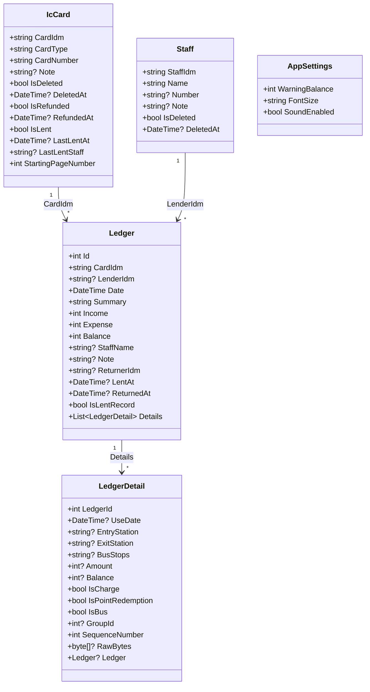
```mermaid
classDiagram
    %% Models
    class Staff {
        +string StaffIdm
        +string Name
        +string? Number
        +string? Note
        +bool IsDeleted
        +DateTime? DeletedAt
    }

    class IcCard {
        +string CardIdm
        +string CardType
        +string CardNumber
        +string? Note
        +bool IsDeleted
        +DateTime? DeletedAt
        +bool IsRefunded
        +DateTime? RefundedAt
        +bool IsLent
        +DateTime? LastLentAt
        +string? LastLentStaff
        +int StartingPageNumber
    }

    class Ledger {
        +int Id
        +string CardIdm
        +string? LenderIdm
        +DateTime Date
        +string Summary
        +int Income
        +int Expense
        +int Balance
        +string? StaffName
        +string? Note
        +string? ReturnerIdm
        +DateTime? LentAt
        +DateTime? ReturnedAt
        +bool IsLentRecord
        +List~LedgerDetail~ Details
    }

    class LedgerDetail {
        +int LedgerId
        +DateTime? UseDate
        +string? EntryStation
        +string? ExitStation
        +string? BusStops
        +int? Amount
        +int? Balance
        +bool IsCharge
        +bool IsPointRedemption
        +bool IsBus
        +int? GroupId
        +int SequenceNumber
        +byte[]? RawBytes
        +Ledger? Ledger
    }

    class AppSettings {
        +int WarningBalance
        +string FontSize
        +bool SoundEnabled
    }

    %% Relationships
    Ledger "1" --> "*" LedgerDetail : Details
    IcCard "1" --> "*" Ledger : CardIdm
    Staff "1" --> "*" Ledger : LenderIdm
```

---

## 2. レイヤー構成図


```mermaid
graph TB
    subgraph "Presentation Layer"
        VIEW[Views/XAML]
        VM[ViewModels]
    end

    subgraph "Business Logic Layer"
        SVC_LEND[LendingService]
        SVC_REPORT[ReportService]
        SVC_BACKUP[BackupService]
        SVC_SUMMARY[SummaryGenerator]
        SVC_CARDTYPE[CardTypeDetector]
        SVC_OPLOG[OperationLogger]
        SVC_CSVEXP[CsvExportService]
        SVC_CSVIMP[CsvImportService]
        SVC_PRINT[PrintService]
        SVC_SANITIZE[InputSanitizer]
        SVC_STATION[StationMasterService]
        SVC_TEMPLATE[TemplateResolver]
        SVC_TOAST[ToastNotificationService]
        SVC_DEBUG[DebugDataService]
        SVC_MERGE[LedgerMergeService]
        SVC_SPLIT[LedgerSplitService]
        SVC_CONSIST[LedgerConsistencyChecker]
        SVC_ORDER[LedgerOrderHelper]
        SVC_REPORT_BUILD[ReportDataBuilder]
        SVC_OPLOGEXCEL[OperationLogExcelExportService]
        SVC_VALID[ValidationService]
        SVC_CARDLOCK[CardLockManager]
        SVC_STAFFAUTH[IStaffAuthService]
        SVC_DIALOG[IDialogService]
    end

    subgraph "Data Access Layer"
        REPO_STAFF[IStaffRepository]
        REPO_CARD[ICardRepository]
        REPO_LEDGER[ILedgerRepository]
        REPO_SETTINGS[ISettingsRepository]
        REPO_OPLOG[IOperationLogRepository]
        DBCTX[DbContext]
    end

    subgraph "Infrastructure Layer"
        READER[ICardReader]
        SOUND[ISoundPlayer]
        CACHE[ICacheService]
        FILELOG[FileLoggerProvider]
    end

    subgraph "External"
        DB[(SQLite)]
        PASORI[PaSoRi]
        SPEAKER[スピーカー]
    end

    VIEW --> VM
    VM --> SVC_LEND
    VM --> SVC_REPORT
    SVC_LEND --> REPO_STAFF
    SVC_LEND --> REPO_CARD
    SVC_LEND --> REPO_LEDGER
    SVC_LEND --> SVC_SUMMARY
    SVC_REPORT --> REPO_LEDGER
    SVC_REPORT --> REPO_CARD

    REPO_STAFF --> DBCTX
    REPO_CARD --> DBCTX
    REPO_LEDGER --> DBCTX
    REPO_SETTINGS --> DBCTX
    REPO_OPLOG --> DBCTX
    DBCTX --> DB

    VM --> READER
    VM --> SOUND
    READER --> PASORI
    SOUND --> SPEAKER
```

---

## 3. 主要クラスの責務

### 3.1 Models（エンティティ）

| クラス | 責務 | 対応テーブル |
|--------|------|--------------|
| Staff | 職員情報を保持 | staff |
| IcCard | ICカード情報を保持 | ic_card |
| Ledger | 利用履歴概要を保持 | ledger |
| LedgerDetail | 利用履歴詳細を保持 | ledger_detail |
| OperationLog | 操作ログを保持 | operation_log |
| AppSettings | アプリケーション設定を保持 | settings |

### 3.2 ViewModels

| クラス | 責務 |
|--------|------|
| ViewModelBase | ViewModelの基底クラス（IsBusy, BusyMessage） |
| MainViewModel | メイン画面のロジック、状態管理 |
| StaffManageViewModel | 職員管理ダイアログのロジック |
| CardManageViewModel | カード管理ダイアログのロジック |
| SettingsViewModel | 設定ダイアログのロジック |
| ReportViewModel | 帳票作成ダイアログのロジック |
| HistoryViewModel | 履歴表示ダイアログのロジック |
| SystemManageViewModel | システム管理（バックアップ・リストア）のロジック |
| PrintPreviewViewModel | 印刷プレビュー画面のズーム・ナビゲーション制御 |
| LedgerDetailViewModel | 利用履歴詳細表示・グループ操作のロジック |
| LedgerRowEditViewModel | 履歴行の追加・編集ダイアログのロジック |
| BusStopInputViewModel | バス停名入力画面のロジック |
| IncompleteBusStopViewModel | バス停未入力一覧ダイアログのロジック |
| VirtualCardViewModel | 仮想ICカードタッチシミュレーター（DEBUG専用） |
| DataExportImportViewModel | データCSVエクスポート・インポートのロジック |
| OperationLogSearchViewModel | 操作ログ検索・表示のロジック |

### 3.3 Services

| クラス | 責務 |
|--------|------|
| LendingService | 貸出・返却処理、30秒ルール管理 |
| ReportService | 月次帳票の作成（Excel出力） |
| BackupService | データベースのバックアップ |
| SummaryGenerator | 摘要文字列の生成 |
| CardTypeDetector | IDmからカード種別を判別 |
| OperationLogger | 操作ログの記録 |
| CsvExportService | CSV形式でのデータエクスポート |
| CsvImportService | CSV形式でのデータインポート |
| PrintService | 帳票の印刷・FlowDocument生成 |
| InputSanitizer | 入力値のサニタイズ処理（静的クラス） |
| StationMasterService | 駅コードから駅名への解決（シングルトン） |
| TemplateResolver | Excelテンプレートのパス解決（静的クラス） |
| ToastNotificationService | トースト通知の表示 |
| DebugDataService | テストデータの管理（DEBUGビルド専用） |
| LedgerMergeService | 複数Ledgerレコードの統合・取り消し（Issue #548） |
| CardLockManager | カードアクセスの排他制御（シングルトン） |
| IStaffAuthService / StaffAuthService | 職員証による操作者認証 |
| IDialogService / DialogService | ダイアログ表示の抽象化（テスタビリティ向上） |
| ReportDataBuilder | 月次帳票の共通データ準備（Excel/印刷で共有） |
| LedgerSplitService | 複数明細を含むLedgerレコードの分割（Issue #634） |
| LedgerConsistencyChecker | 残高チェーンの整合性検証（Issue #635） |
| LedgerOrderHelper | 残高チェーンに基づくLedger順序の復元（Issue #784） |
| OperationLogExcelExportService | 操作ログのExcel出力 |
| ValidationService | 入力値のバリデーション（IDm, カード番号, 氏名等） |

### 3.4 Repositories

| インターフェース | 実装クラス | 責務 |
|------------------|------------|------|
| IStaffRepository | StaffRepository | 職員データのCRUD |
| ICardRepository | CardRepository | ICカードデータのCRUD |
| ILedgerRepository | LedgerRepository | 利用履歴のCRUD |
| ISettingsRepository | SettingsRepository | 設定データのCRUD |
| IOperationLogRepository | OperationLogRepository | 操作ログのCRUD |

### 3.5 Infrastructure

| インターフェース | 実装クラス | 責務 |
|------------------|------------|------|
| ICardReader | PcScCardReader | PC/SC APIでのカード読み取り |
| ICardReader | MockCardReader | テスト用モックリーダー |
| ISoundPlayer | SoundPlayer | 音声フィードバックの再生 |

---

## 4. 依存関係図

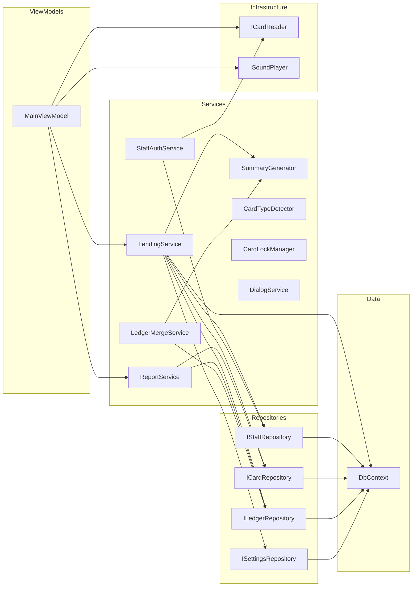
```mermaid
graph LR
    subgraph "ViewModels"
        MVM[MainViewModel]
    end

    subgraph "Services"
        LS[LendingService]
        RS[ReportService]
        SG[SummaryGenerator]
        CD[CardTypeDetector]
        LMS[LedgerMergeService]
        CLM[CardLockManager]
        SAS[StaffAuthService]
        DS[DialogService]
    end

    subgraph "Repositories"
        SR[IStaffRepository]
        CR[ICardRepository]
        LR[ILedgerRepository]
        STR[ISettingsRepository]
    end

    subgraph "Infrastructure"
        ICR[ICardReader]
        ISP[ISoundPlayer]
    end

    subgraph "Data"
        DBC[DbContext]
    end

    MVM --> LS
    MVM --> RS
    MVM --> ICR
    MVM --> ISP

    LS --> SR
    LS --> CR
    LS --> LR
    LS --> STR
    LS --> SG
    LS --> DBC

    RS --> CR
    RS --> LR

    LMS --> LR
    LMS --> SG
    SAS --> SR
    SAS --> ICR

    SR --> DBC
    CR --> DBC
    LR --> DBC
    STR --> DBC
```

---

## 5. クラス詳細

### 5.1 LendingService

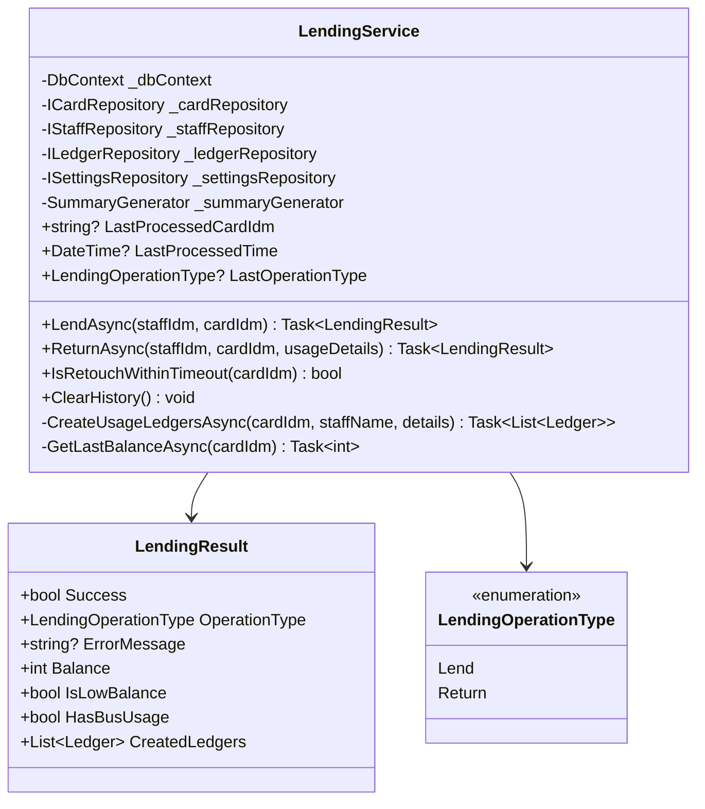
```mermaid
classDiagram
    class LendingService {
        -DbContext _dbContext
        -ICardRepository _cardRepository
        -IStaffRepository _staffRepository
        -ILedgerRepository _ledgerRepository
        -ISettingsRepository _settingsRepository
        -SummaryGenerator _summaryGenerator
        +string? LastProcessedCardIdm
        +DateTime? LastProcessedTime
        +LendingOperationType? LastOperationType
        +LendAsync(staffIdm, cardIdm) Task~LendingResult~
        +ReturnAsync(staffIdm, cardIdm, usageDetails) Task~LendingResult~
        +IsRetouchWithinTimeout(cardIdm) bool
        +ClearHistory() void
        -CreateUsageLedgersAsync(cardIdm, staffName, details) Task~List~Ledger~~
        -GetLastBalanceAsync(cardIdm) Task~int~
    }

    class LendingResult {
        +bool Success
        +LendingOperationType OperationType
        +string? ErrorMessage
        +int Balance
        +bool IsLowBalance
        +bool HasBusUsage
        +List~Ledger~ CreatedLedgers
    }

    class LendingOperationType {
        <<enumeration>>
        Lend
        Return
    }

    LendingService --> LendingResult
    LendingService --> LendingOperationType
```

### 5.2 SummaryGenerator

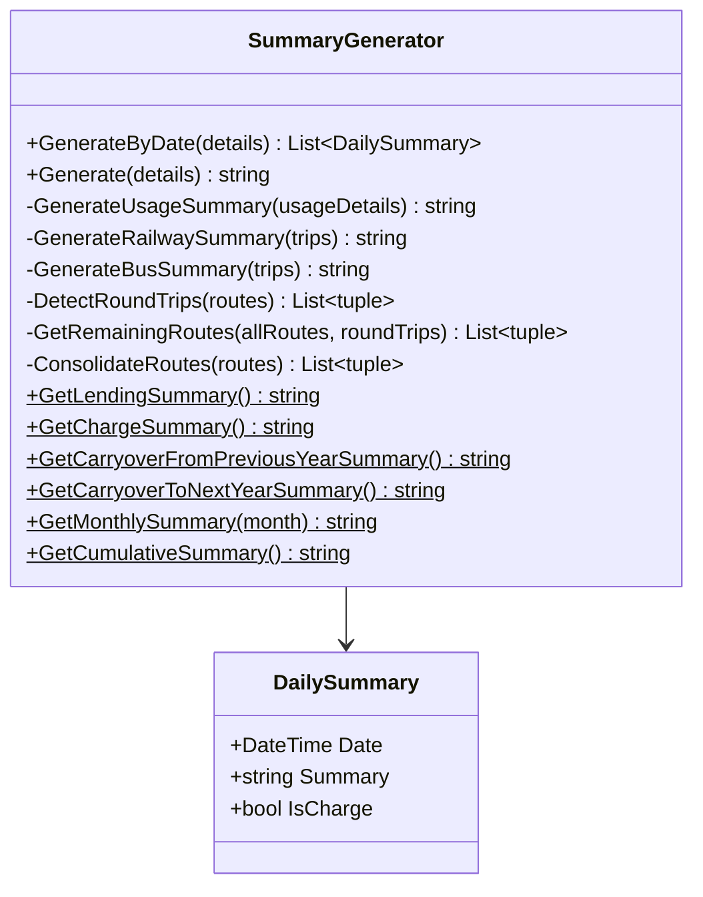
```mermaid
classDiagram
    class SummaryGenerator {
        +GenerateByDate(details) List~DailySummary~
        +Generate(details) string
        -GenerateUsageSummary(usageDetails) string
        -GenerateRailwaySummary(trips) string
        -GenerateBusSummary(trips) string
        -DetectRoundTrips(routes) List~tuple~
        -GetRemainingRoutes(allRoutes, roundTrips) List~tuple~
        -ConsolidateRoutes(routes) List~tuple~
        +GetLendingSummary()$ string
        +GetChargeSummary()$ string
        +GetCarryoverFromPreviousYearSummary()$ string
        +GetCarryoverToNextYearSummary()$ string
        +GetMonthlySummary(month)$ string
        +GetCumulativeSummary()$ string
    }

    class DailySummary {
        +DateTime Date
        +string Summary
        +bool IsCharge
    }

    SummaryGenerator --> DailySummary
```

### 5.3 CardTypeDetector

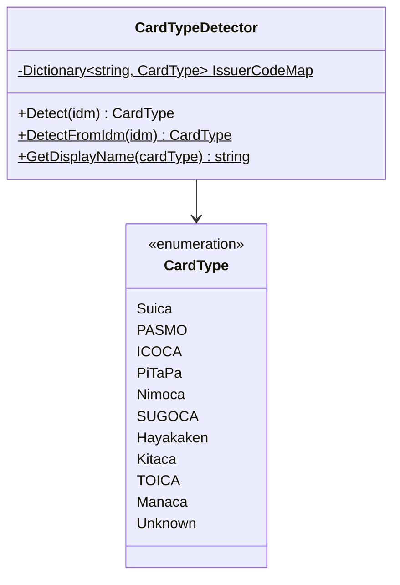
```mermaid
classDiagram
    class CardTypeDetector {
        -Dictionary~string, CardType~ IssuerCodeMap$
        +Detect(idm) CardType
        +DetectFromIdm(idm)$ CardType
        +GetDisplayName(cardType)$ string
    }

    class CardType {
        <<enumeration>>
        Suica
        PASMO
        ICOCA
        PiTaPa
        Nimoca
        SUGOCA
        Hayakaken
        Kitaca
        TOICA
        Manaca
        Unknown
    }

    CardTypeDetector --> CardType
```

### 5.4 ReportService

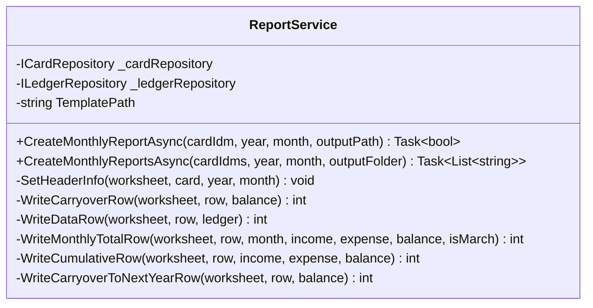
```mermaid
classDiagram
    class ReportService {
        -ICardRepository _cardRepository
        -ILedgerRepository _ledgerRepository
        -string TemplatePath
        +CreateMonthlyReportAsync(cardIdm, year, month, outputPath) Task~bool~
        +CreateMonthlyReportsAsync(cardIdms, year, month, outputFolder) Task~List~string~~
        -SetHeaderInfo(worksheet, card, year, month) void
        -WriteCarryoverRow(worksheet, row, balance) int
        -WriteDataRow(worksheet, row, ledger) int
        -WriteMonthlyTotalRow(worksheet, row, month, income, expense, balance, isMarch) int
        -WriteCumulativeRow(worksheet, row, income, expense, balance) int
        -WriteCarryoverToNextYearRow(worksheet, row, balance) int
    }
```

### 5.5 DbContext

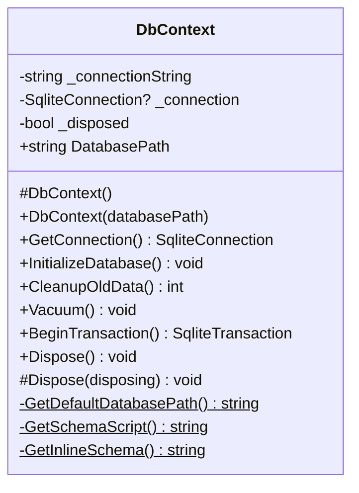
```mermaid
classDiagram
    class DbContext {
        -string _connectionString
        -SqliteConnection? _connection
        -bool _disposed
        +string DatabasePath
        #DbContext()
        +DbContext(databasePath)
        +GetConnection() SqliteConnection
        +InitializeDatabase() void
        +CleanupOldData() int
        +Vacuum() void
        +BeginTransaction() SqliteTransaction
        +Dispose() void
        #Dispose(disposing) void
        -GetDefaultDatabasePath()$ string
        -GetSchemaScript()$ string
        -GetInlineSchema()$ string
    }
```

### 5.6 CsvExportService

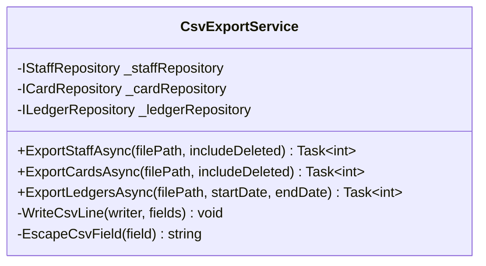
```mermaid
classDiagram
    class CsvExportService {
        -IStaffRepository _staffRepository
        -ICardRepository _cardRepository
        -ILedgerRepository _ledgerRepository
        +ExportStaffAsync(filePath, includeDeleted) Task~int~
        +ExportCardsAsync(filePath, includeDeleted) Task~int~
        +ExportLedgersAsync(filePath, startDate, endDate) Task~int~
        -WriteCsvLine(writer, fields) void
        -EscapeCsvField(field) string
    }
```

### 5.7 CsvImportService

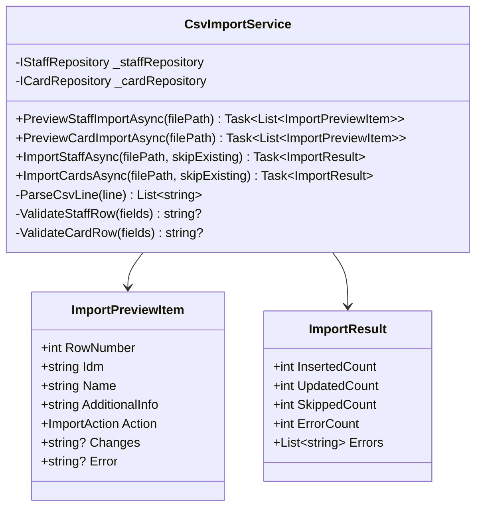
```mermaid
classDiagram
    class CsvImportService {
        -IStaffRepository _staffRepository
        -ICardRepository _cardRepository
        +PreviewStaffImportAsync(filePath) Task~List~ImportPreviewItem~~
        +PreviewCardImportAsync(filePath) Task~List~ImportPreviewItem~~
        +ImportStaffAsync(filePath, skipExisting) Task~ImportResult~
        +ImportCardsAsync(filePath, skipExisting) Task~ImportResult~
        -ParseCsvLine(line) List~string~
        -ValidateStaffRow(fields) string?
        -ValidateCardRow(fields) string?
    }

    class ImportPreviewItem {
        +int RowNumber
        +string Idm
        +string Name
        +string AdditionalInfo
        +ImportAction Action
        +string? Changes
        +string? Error
    }

    class ImportResult {
        +int InsertedCount
        +int UpdatedCount
        +int SkippedCount
        +int ErrorCount
        +List~string~ Errors
    }

    CsvImportService --> ImportPreviewItem
    CsvImportService --> ImportResult
```

### 5.8 PrintService

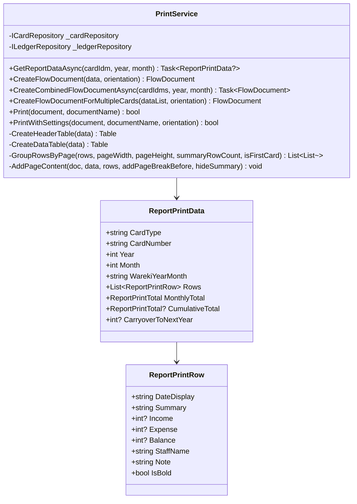
```mermaid
classDiagram
    class PrintService {
        -ICardRepository _cardRepository
        -ILedgerRepository _ledgerRepository
        +GetReportDataAsync(cardIdm, year, month) Task~ReportPrintData?~
        +CreateFlowDocument(data, orientation) FlowDocument
        +CreateCombinedFlowDocumentAsync(cardIdms, year, month) Task~FlowDocument~
        +CreateFlowDocumentForMultipleCards(dataList, orientation) FlowDocument
        +Print(document, documentName) bool
        +PrintWithSettings(document, documentName, orientation) bool
        -CreateHeaderTable(data) Table
        -CreateDataTable(data) Table
        -GroupRowsByPage(rows, pageWidth, pageHeight, summaryRowCount, isFirstCard) List~List~~
        -AddPageContent(doc, data, rows, addPageBreakBefore, hideSummary) void
    }

    class ReportPrintData {
        +string CardType
        +string CardNumber
        +int Year
        +int Month
        +string WarekiYearMonth
        +List~ReportPrintRow~ Rows
        +ReportPrintTotal MonthlyTotal
        +ReportPrintTotal? CumulativeTotal
        +int? CarryoverToNextYear
    }

    class ReportPrintRow {
        +string DateDisplay
        +string Summary
        +int? Income
        +int? Expense
        +int? Balance
        +string StaffName
        +string Note
        +bool IsBold
    }

    PrintService --> ReportPrintData
    ReportPrintData --> ReportPrintRow
```

### 5.9 InputSanitizer

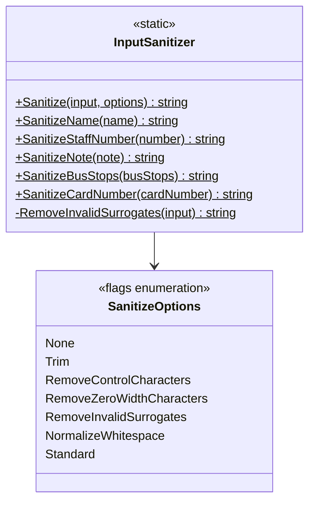
```mermaid
classDiagram
    class InputSanitizer {
        <<static>>
        +Sanitize(input, options)$ string
        +SanitizeName(name)$ string
        +SanitizeStaffNumber(number)$ string
        +SanitizeNote(note)$ string
        +SanitizeBusStops(busStops)$ string
        +SanitizeCardNumber(cardNumber)$ string
        -RemoveInvalidSurrogates(input)$ string
    }

    class SanitizeOptions {
        <<flags enumeration>>
        None
        Trim
        RemoveControlCharacters
        RemoveZeroWidthCharacters
        RemoveInvalidSurrogates
        NormalizeWhitespace
        Standard
    }

    InputSanitizer --> SanitizeOptions
```

### 5.10 StationMasterService

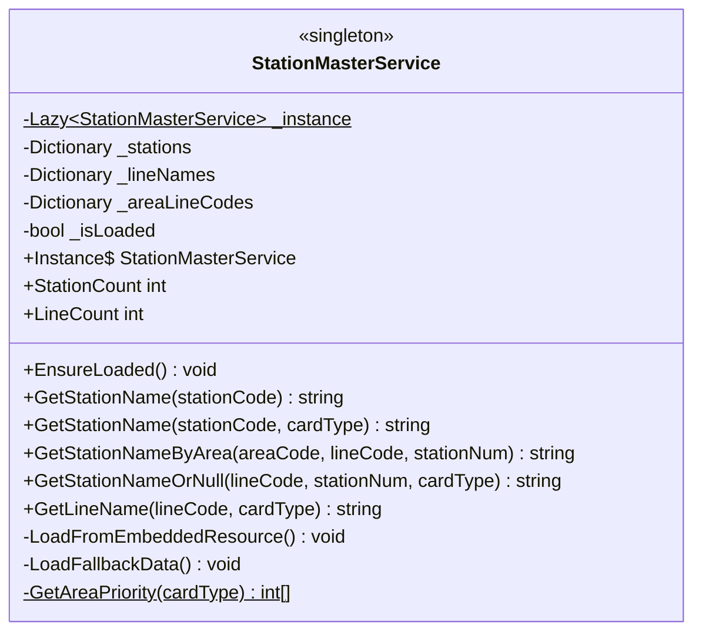
```mermaid
classDiagram
    class StationMasterService {
        <<singleton>>
        -Lazy~StationMasterService~ _instance$
        -Dictionary _stations
        -Dictionary _lineNames
        -Dictionary _areaLineCodes
        -bool _isLoaded
        +Instance$ StationMasterService
        +EnsureLoaded() void
        +GetStationName(stationCode) string
        +GetStationName(stationCode, cardType) string
        +GetStationNameByArea(areaCode, lineCode, stationNum) string
        +GetStationNameOrNull(lineCode, stationNum, cardType) string
        +GetLineName(lineCode, cardType) string
        +StationCount int
        +LineCount int
        -LoadFromEmbeddedResource() void
        -LoadFallbackData() void
        -GetAreaPriority(cardType)$ int[]
    }
```

### 5.11 TemplateResolver

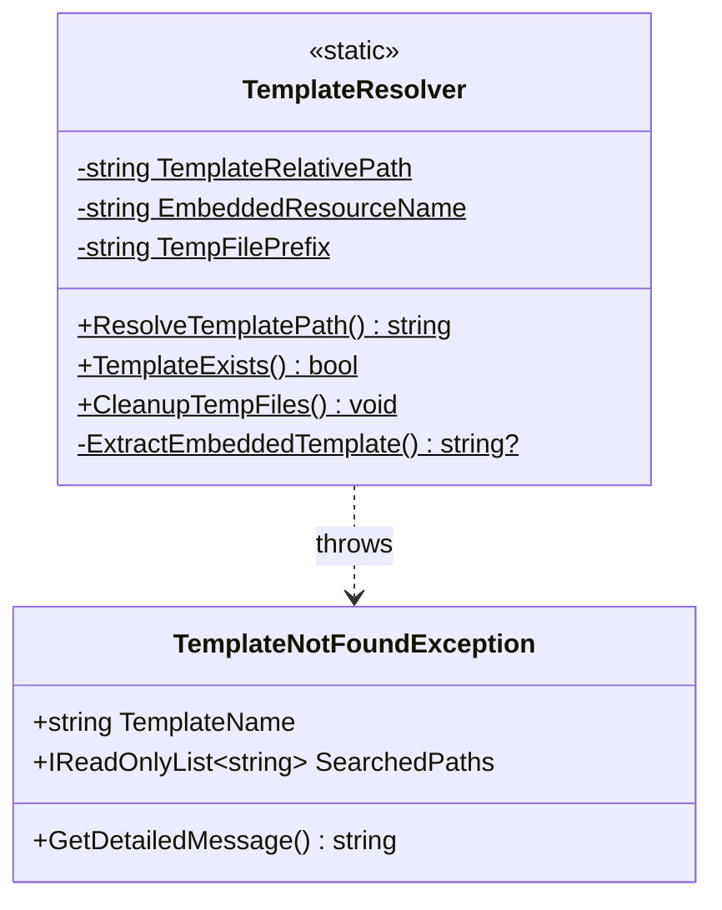
```mermaid
classDiagram
    class TemplateResolver {
        <<static>>
        -string TemplateRelativePath$
        -string EmbeddedResourceName$
        -string TempFilePrefix$
        +ResolveTemplatePath()$ string
        +TemplateExists()$ bool
        +CleanupTempFiles()$ void
        -ExtractEmbeddedTemplate()$ string?
    }

    class TemplateNotFoundException {
        +string TemplateName
        +IReadOnlyList~string~ SearchedPaths
        +GetDetailedMessage() string
    }

    TemplateResolver ..> TemplateNotFoundException : throws
```

### 5.12 ToastNotificationService

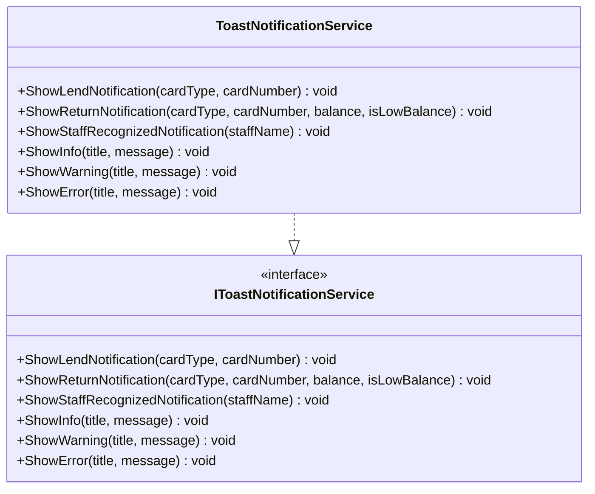
```mermaid
classDiagram
    class IToastNotificationService {
        <<interface>>
        +ShowLendNotification(cardType, cardNumber) void
        +ShowReturnNotification(cardType, cardNumber, balance, isLowBalance) void
        +ShowStaffRecognizedNotification(staffName) void
        +ShowInfo(title, message) void
        +ShowWarning(title, message) void
        +ShowError(title, message) void
    }

    class ToastNotificationService {
        +ShowLendNotification(cardType, cardNumber) void
        +ShowReturnNotification(cardType, cardNumber, balance, isLowBalance) void
        +ShowStaffRecognizedNotification(staffName) void
        +ShowInfo(title, message) void
        +ShowWarning(title, message) void
        +ShowError(title, message) void
    }

    ToastNotificationService ..|> IToastNotificationService
```

### 5.13 DebugDataService

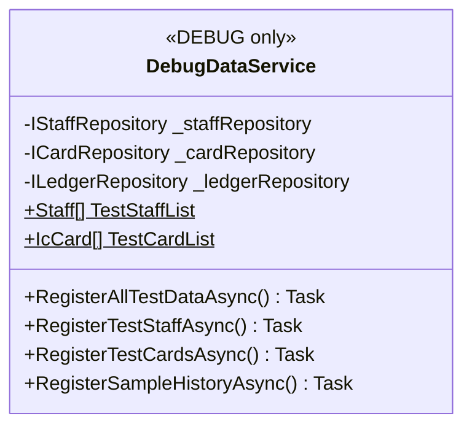
```mermaid
classDiagram
    class DebugDataService {
        <<DEBUG only>>
        -IStaffRepository _staffRepository
        -ICardRepository _cardRepository
        -ILedgerRepository _ledgerRepository
        +Staff[] TestStaffList$
        +IcCard[] TestCardList$
        +RegisterAllTestDataAsync() Task
        +RegisterTestStaffAsync() Task
        +RegisterTestCardsAsync() Task
        +RegisterSampleHistoryAsync() Task
    }
```

### 5.14 LedgerMergeService

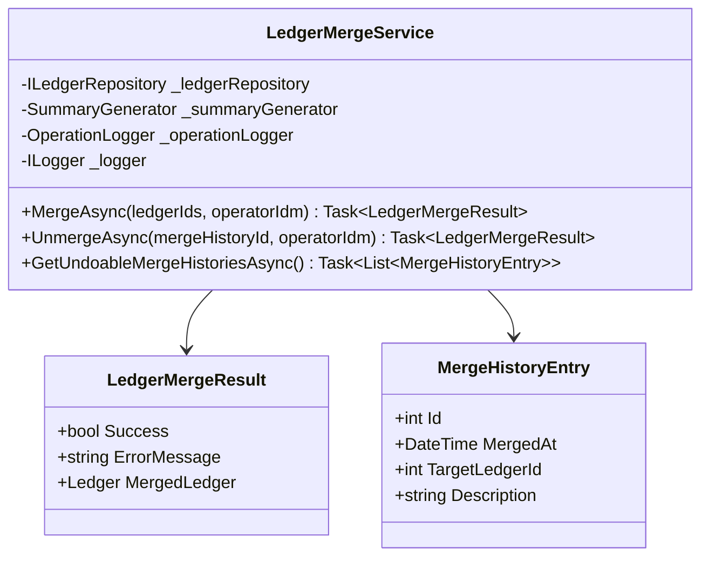
```mermaid
classDiagram
    class LedgerMergeService {
        -ILedgerRepository _ledgerRepository
        -SummaryGenerator _summaryGenerator
        -OperationLogger _operationLogger
        -ILogger _logger
        +MergeAsync(ledgerIds, operatorIdm) Task~LedgerMergeResult~
        +UnmergeAsync(mergeHistoryId, operatorIdm) Task~LedgerMergeResult~
        +GetUndoableMergeHistoriesAsync() Task~List~MergeHistoryEntry~~
    }

    class LedgerMergeResult {
        +bool Success
        +string ErrorMessage
        +Ledger MergedLedger
    }

    class MergeHistoryEntry {
        +int Id
        +DateTime MergedAt
        +int TargetLedgerId
        +string Description
    }

    LedgerMergeService --> LedgerMergeResult
    LedgerMergeService --> MergeHistoryEntry
```

### 5.15 CardLockManager

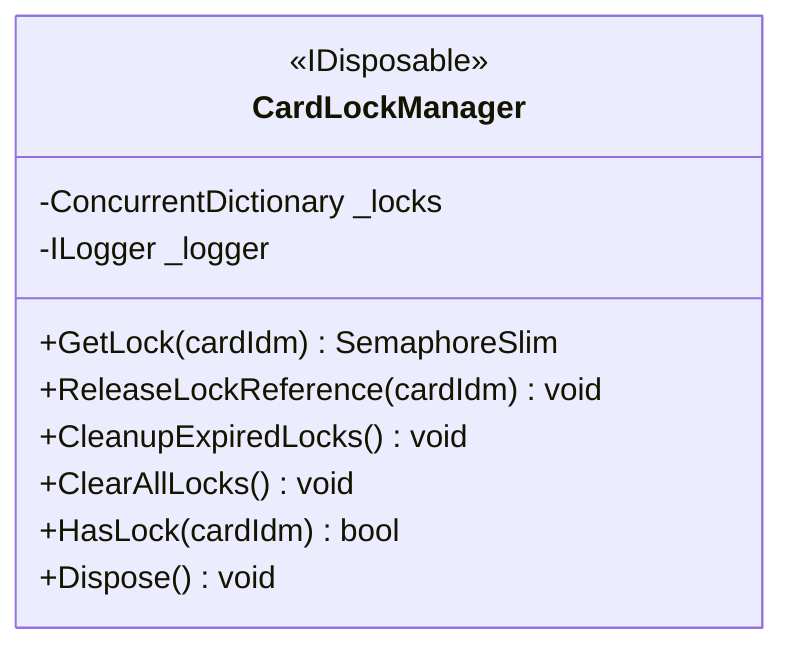
```mermaid
classDiagram
    class CardLockManager {
        <<IDisposable>>
        -ConcurrentDictionary _locks
        -ILogger _logger
        +GetLock(cardIdm) SemaphoreSlim
        +ReleaseLockReference(cardIdm) void
        +CleanupExpiredLocks() void
        +ClearAllLocks() void
        +HasLock(cardIdm) bool
        +Dispose() void
    }
```

### 5.16 StaffAuthService

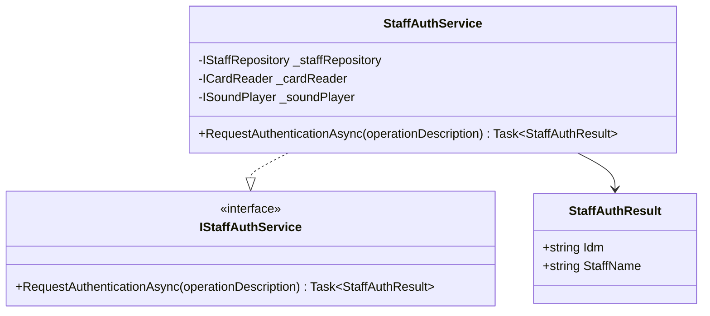
```mermaid
classDiagram
    class IStaffAuthService {
        <<interface>>
        +RequestAuthenticationAsync(operationDescription) Task~StaffAuthResult~
    }

    class StaffAuthService {
        -IStaffRepository _staffRepository
        -ICardReader _cardReader
        -ISoundPlayer _soundPlayer
        +RequestAuthenticationAsync(operationDescription) Task~StaffAuthResult~
    }

    class StaffAuthResult {
        +string Idm
        +string StaffName
    }

    StaffAuthService ..|> IStaffAuthService
    StaffAuthService --> StaffAuthResult
```

### 5.17 DialogService

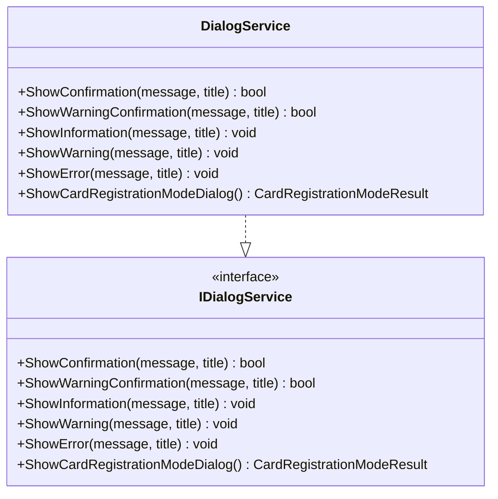
```mermaid
classDiagram
    class IDialogService {
        <<interface>>
        +ShowConfirmation(message, title) bool
        +ShowWarningConfirmation(message, title) bool
        +ShowInformation(message, title) void
        +ShowWarning(message, title) void
        +ShowError(message, title) void
        +ShowCardRegistrationModeDialog() CardRegistrationModeResult
    }

    class DialogService {
        +ShowConfirmation(message, title) bool
        +ShowWarningConfirmation(message, title) bool
        +ShowInformation(message, title) void
        +ShowWarning(message, title) void
        +ShowError(message, title) void
        +ShowCardRegistrationModeDialog() CardRegistrationModeResult
    }

    DialogService ..|> IDialogService
```

### 5.18 ReportDataBuilder

```mermaid
classDiagram
    class IReportDataBuilder {
        <<interface>>
        +BuildAsync(cardIdm, year, month) Task~MonthlyReportData~
    }

    class ReportDataBuilder {
        -ICardRepository _cardRepository
        -ILedgerRepository _ledgerRepository
        +BuildAsync(cardIdm, year, month) Task~MonthlyReportData~
        -GetPreviousMonthBalanceAsync(cardIdm, year, month) Task~int?~
    }

    ReportDataBuilder ..|> IReportDataBuilder
```

### 5.19 LedgerSplitService

```mermaid
classDiagram
    class LedgerSplitService {
        -ILedgerRepository _ledgerRepository
        -SummaryGenerator _summaryGenerator
        -OperationLogger _operationLogger
        -ILogger~LedgerSplitService~ _logger
        +SplitAsync(ledgerId, groupedDetails, operatorIdm?) Task~LedgerSplitResult~
        +CalculateGroupFinancials(groupDetails)$ tuple~int, int, int~
        -GetGroupDate(groupDetails, originalDate)$ DateTime
        -ClearGroupIds(details)$ void
        -CloneLedger(source)$ Ledger
    }

    class LedgerSplitResult {
        +bool Success
        +string ErrorMessage
        +List~int~ CreatedLedgerIds
    }

    LedgerSplitService --> LedgerSplitResult
```

### 5.20 LedgerConsistencyChecker

```mermaid
classDiagram
    class LedgerConsistencyChecker {
        <<internal>>
        -ILedgerRepository _ledgerRepository
        +CheckBalanceConsistencyAsync(cardIdm, fromDate, toDate) Task~ConsistencyResult~
        +CheckConsistency(ledgers, cardIdm, fromDate) ConsistencyResult
        +CheckConsistencyWithPreviousAsync(ledgers, cardIdm, fromDate) Task~ConsistencyResult~
    }

    class ConsistencyResult {
        <<internal>>
        +bool IsConsistent
        +List~tuple~ Inconsistencies
    }

    LedgerConsistencyChecker --> ConsistencyResult
```

### 5.21 LedgerOrderHelper

```mermaid
classDiagram
    class LedgerOrderHelper {
        <<internal, static>>
        +ReorderByBalanceChain(ledgers, precedingBalance?)$ List~Ledger~
        -ReconstructChain(records, startBalance)$ List~Ledger~
        -IsSpecialRecord(ledger)$ bool
    }
```

### 5.22 OperationLogExcelExportService

```mermaid
classDiagram
    class OperationLogExcelExportService {
        -XLColor HeaderBackground$
        -XLColor ColorGreen$
        -XLColor ColorOrange$
        -XLColor ColorRed$
        -XLColor ColorBlue$
        +ExportAsync(logs, filePath) Task
        +GetActionDisplayName(action?)$ string
        +GetTargetTableDisplayName(targetTable?)$ string
        +FormatJsonToReadable(targetTable?, json?)$ string
        +GetChangeSummary(targetTable?, beforeJson?, afterJson?)$ string
        +GetFieldNameMap(targetTable?)$ IReadOnlyDictionary~string, string~
        -WriteHeader(worksheet)$ void
        -WriteDataRow(worksheet, row, log)$ void
        -ApplyFormatting(worksheet, lastDataRow)$ void
        -GetActionColor(action?)$ XLColor?
    }
```

### 5.23 ValidationService

```mermaid
classDiagram
    class IValidationService {
        <<interface>>
        +ValidateCardIdm(idm) ValidationResult
        +ValidateCardNumber(cardNumber) ValidationResult
        +ValidateCardType(cardType) ValidationResult
        +ValidateStaffIdm(idm) ValidationResult
        +ValidateStaffName(name) ValidationResult
        +ValidateWarningBalance(balance) ValidationResult
        +ValidateBusStops(busStops) ValidationResult
    }

    class ValidationService {
        -int IdmLength$
        -int CardNumberMaxLength$
        -int StaffNameMaxLength$
        -int BusStopsMaxLength$
        -Regex HexPatternRegex$
        -Regex AlphanumericPatternRegex$
        +ValidateCardIdm(idm) ValidationResult
        +ValidateCardNumber(cardNumber) ValidationResult
        +ValidateCardType(cardType) ValidationResult
        +ValidateStaffIdm(idm) ValidationResult
        +ValidateStaffName(name) ValidationResult
        +ValidateWarningBalance(balance) ValidationResult
        +ValidateBusStops(busStops) ValidationResult
    }

    ValidationService ..|> IValidationService
```

---

## 6. DIコンテナ設定

### 6.1 サービス登録（想定）

```csharp
// App.xaml.cs または Startup.cs
services.AddSingleton<DbContext>();
services.AddSingleton<ICardRepository, CardRepository>();
services.AddSingleton<IStaffRepository, StaffRepository>();
services.AddSingleton<ILedgerRepository, LedgerRepository>();
services.AddSingleton<ISettingsRepository, SettingsRepository>();
services.AddSingleton<IOperationLogRepository, OperationLogRepository>();

services.AddSingleton<SummaryGenerator>();
services.AddSingleton<LendingService>();
services.AddSingleton<ReportService>();
services.AddSingleton<BackupService>();
services.AddSingleton<OperationLogger>();
services.AddSingleton<CsvExportService>();
services.AddSingleton<CsvImportService>();
services.AddSingleton<PrintService>();
services.AddSingleton<IToastNotificationService, ToastNotificationService>();
services.AddSingleton<LedgerMergeService>();
services.AddSingleton<CardLockManager>();
services.AddSingleton<IStaffAuthService, StaffAuthService>();
services.AddSingleton<IDialogService, DialogService>();
#if DEBUG
services.AddSingleton<DebugDataService>();
#endif

// 静的クラス（DI不要）: InputSanitizer, TemplateResolver
// シングルトン（静的プロパティ）: StationMasterService.Instance

services.AddSingleton<ICardReader, PcScCardReader>();
services.AddSingleton<ISoundPlayer, SoundPlayer>();

services.AddTransient<MainViewModel>();
services.AddTransient<StaffManageViewModel>();
services.AddTransient<CardManageViewModel>();
services.AddTransient<SettingsViewModel>();
services.AddTransient<ReportViewModel>();
```

### 6.2 ライフタイム

| ライフタイム | クラス | 理由 |
|--------------|--------|------|
| Singleton | DbContext | DB接続を共有 |
| Singleton | Repositories | 状態を持たないが、DbContextを共有 |
| Singleton | Services | 状態を持つ（LastProcessedCardIdm等） |
| Singleton | ICardReader | ハードウェアリソースを管理 |
| Singleton | ISoundPlayer | リソース管理 |
| Transient | ViewModels | 画面ごとに新規インスタンス |

---

## 7. 共通ユーティリティ

### 7.1 WarekiConverter

```mermaid
classDiagram
    class WarekiConverter {
        +ToWareki(date)$ string
        +ToWarekiYearMonth(date)$ string
        +ToWarekiYear(date)$ string
        -GetEraName(date)$ string
        -GetEraYear(date)$ int
    }
```

### 7.2 Enums

```csharp
// アプリケーション状態
public enum AppState
{
    WaitingForStaffCard,  // 職員証タッチ待ち
    WaitingForIcCard,     // ICカードタッチ待ち
    Processing            // 処理中
}

// カード種別
public enum CardType
{
    Suica, PASMO, ICOCA, PiTaPa,
    Nimoca, SUGOCA, Hayakaken,
    Kitaca, TOICA, Manaca, Unknown
}

// 文字サイズ
public enum FontSizeOption
{
    Small, Medium, Large, ExtraLarge
}
```

---

## 8. インターフェース定義

### 8.1 ICardReader

```csharp
public interface ICardReader : IDisposable
{
    event EventHandler<CardReadEventArgs>? CardRead;
    event EventHandler<Exception>? Error;
    Task StartReadingAsync();
    Task StopReadingAsync();
    bool IsReading { get; }
    Task<IEnumerable<LedgerDetail>> ReadHistoryAsync(string idm);
    Task<int?> ReadBalanceAsync(string idm);
}
```

### 8.2 ISoundPlayer

```csharp
public interface ISoundPlayer
{
    void PlayLend();
    void PlayReturn();
    void PlayError();
    void PlayWarning();
    bool IsEnabled { get; set; }
}
```

### 8.3 IRepository

```csharp
// 例: ICardRepository
public interface ICardRepository
{
    Task<IcCard?> GetByIdmAsync(string cardIdm, bool includeDeleted = false);
    Task<IEnumerable<IcCard>> GetAllAsync(bool includeDeleted = false);
    Task<IEnumerable<IcCard>> GetLentCardsAsync();
    Task<bool> InsertAsync(IcCard card);
    Task<bool> UpdateAsync(IcCard card);
    Task<bool> UpdateLentStatusAsync(string cardIdm, bool isLent, DateTime? lentAt, string? staffIdm);
    Task<bool> DeleteAsync(string cardIdm); // 論理削除
}
```

---

## 9. インフラストラクチャ詳細

### 9.1 CacheService

```mermaid
classDiagram
    class ICacheService {
        <<interface>>
        +GetOrCreateAsync~T~(key, factory, absoluteExpiration) Task~T~
        +Get~T~(key) T?
        +Set~T~(key, value, absoluteExpiration) void
        +Invalidate(key) void
        +InvalidateByPrefix(prefix) void
        +Clear() void
    }

    class CacheService {
        <<IDisposable>>
        -IMemoryCache _cache
        -ConcurrentDictionary~string, byte~ _keys
        -ILogger~CacheService~ _logger
        -object _lock
        -bool _disposed
        +GetOrCreateAsync~T~(key, factory, absoluteExpiration) Task~T~
        +Get~T~(key) T?
        +Set~T~(key, value, absoluteExpiration) void
        +Invalidate(key) void
        +InvalidateByPrefix(prefix) void
        +Clear() void
        +Dispose() void
        #Dispose(disposing) void
    }

    CacheService ..|> ICacheService
```

### 9.2 FelicaCardReader

```mermaid
classDiagram
    class FelicaCardReader {
        <<ICardReader, IDisposable>>
        -ILogger~FelicaCardReader~ _logger
        -object _felicaLock
        -Timer _pollingTimer
        -Timer _healthCheckTimer
        -bool _isReading
        -bool _disposed
        -CardReaderConnectionState _connectionState
        -string _lastReadIdm
        -DateTime _lastReadTime
        +event CardRead EventHandler~CardReadEventArgs~
        +event Error EventHandler~Exception~
        +event ConnectionStateChanged EventHandler~ConnectionStateChangedEventArgs~
        +bool IsReading
        +CardReaderConnectionState ConnectionState
        +StartReadingAsync() Task
        +StopReadingAsync() Task
        +ReadHistoryAsync(idm) Task~IEnumerable~LedgerDetail~~
        +ReadBalanceAsync(idm) Task~int?~
        +CheckConnectionAsync() Task~bool~
        +ReconnectAsync() Task
        +Dispose() void
        -CheckFelicaLibAvailable() bool
        -StartPollingTimer() void
        -OnPollingTimerElapsed(sender, e) void
        -ParseHistoryData(currentData, previousData, cardType) LedgerDetail
    }

    FelicaCardReader ..|> ICardReader
```

### 9.3 FileLoggerProvider / FileLogger

```mermaid
classDiagram
    class FileLoggerProvider {
        <<ILoggerProvider>>
        -ConcurrentDictionary~string, FileLogger~ _loggers
        -BlockingCollection~string~ _logQueue
        -Task _outputTask
        -CancellationTokenSource _cancellationTokenSource
        -string _logDirectory
        -string _currentLogFilePath
        -DateTime _currentLogDate
        +FileLoggerOptions Options
        +CreateLogger(categoryName) ILogger
        +WriteLog(message) void
        +Dispose() void
        -ProcessLogQueue() void
        -WriteToFile(message) void
        -EnsureLogFile() void
        -CheckFileSize() void
        -CleanupOldLogs() void
    }

    class FileLogger {
        <<ILogger>>
        -string _categoryName
        -FileLoggerProvider _provider
        +BeginScope~TState~(state) IDisposable?
        +IsEnabled(logLevel) bool
        +Log~TState~(logLevel, eventId, state, exception, formatter) void
        -FormatLogEntry(logLevel, message, exception) string
        -GetLogLevelString(logLevel)$ string
        -GetShortCategoryName(categoryName)$ string
    }

    FileLoggerProvider ..|> ILoggerProvider
    FileLogger ..|> ILogger
    FileLoggerProvider "1" --> "*" FileLogger : creates
```

---

## 10. 共通ユーティリティ詳細

### 10.1 ErrorDialogHelper

```mermaid
classDiagram
    class ErrorDialogHelper {
        <<static>>
        -string LogDirectory$
        +ShowError(exception, title?)$ void
        +ShowWarning(message, title?)$ void
        +ShowFatalError(exception)$ void
        +CleanupOldLogs()$ void
        ~GetErrorInfo(exception)$ tuple~string, string~
        -ShowErrorDialog(message, title, errorCode, exception)$ void
        -ShowErrorDialogWithClipboard(message, title, exception)$ void
        -LogError(exception, errorCode, isFatal?)$ void
    }
```

### 10.2 PathValidator

```mermaid
classDiagram
    class PathValidator {
        <<static>>
        -int MaxPathLength$
        +ValidateBackupPath(path)$ ValidationResult
        +NormalizePath(path)$ string
        +GetDefaultBackupPath()$ string
        -IsUncPath(path)$ bool
        -ContainsPathTraversal(path)$ bool
        -CheckWritePermission(path)$ ValidationResult
    }

    class PathValidationResult {
        +bool IsValid
        +string ErrorMessage
        +Success()$ PathValidationResult
        +Failure(errorMessage)$ PathValidationResult
    }

    PathValidator --> PathValidationResult
```

---

## 11. データベース基盤

### 11.1 MigrationRunner

```mermaid
classDiagram
    class MigrationRunner {
        -SQLiteConnection _connection
        -List~IMigration~ _migrations
        +GetCurrentVersion() int
        +MigrateToLatest() int
        +MigrateTo(targetVersion) int
        +GetAppliedMigrations() IReadOnlyList~MigrationInfo~
        +HasPendingMigrations() bool
        +GetPendingMigrations() IReadOnlyList~IMigration~
        +ValidateMigrationSequence() void
        -ApplyMigration(migration) void
        -RollbackMigration(migration) void
        -EnsureMigrationTable() void
        -RecordMigration(migration, transaction) void
        -DiscoverMigrations()$ List~IMigration~
    }

    class IMigration {
        <<interface>>
        +int Version
        +string Description
        +Up(connection, transaction) void
        +Down(connection, transaction) void
    }

    class MigrationInfo {
        +int Version
        +string Description
        +DateTime AppliedAt
    }

    class MigrationException {
        +MigrationException(message)
        +MigrationException(message, innerException)
    }

    MigrationRunner --> IMigration
    MigrationRunner --> MigrationInfo
    MigrationRunner ..> MigrationException : throws
```

---

## 12. DTO詳細

### 12.1 MonthlyReportData

```mermaid
classDiagram
    class MonthlyReportData {
        +IcCard Card
        +int Year
        +int Month
        +int? PrecedingBalance
        +CarryoverRowData Carryover
        +List~Ledger~ Ledgers
        +ReportTotalData MonthlyTotal
        +ReportTotalData CumulativeTotal
        +int? CarryoverToNextYear
    }

    class CarryoverRowData {
        +DateTime Date
        +string Summary
        +int? Income
        +int Balance
    }

    class ReportTotalData {
        +string Label
        +int Income
        +int Expense
        +int? Balance
    }

    MonthlyReportData --> CarryoverRowData
    MonthlyReportData --> ReportTotalData
```

### 12.2 IncompleteBusStopItem / WarningItem / CardBalanceDashboardItem

```mermaid
classDiagram
    class IncompleteBusStopItem {
        +int LedgerId
        +string CardIdm
        +string CardDisplayName
        +DateTime Date
        +string DateDisplay
        +string Summary
        +int Expense
        +string ExpenseDisplay
        +string StaffName
    }

    class WarningItem {
        +string DisplayText
        +WarningType Type
        +string CardIdm
    }

    class WarningType {
        <<enumeration>>
        LowBalance
        IncompleteBusStop
        CardReaderError
        CardReaderConnection
        BalanceInconsistency
    }

    class CardBalanceDashboardItem {
        +string CardIdm
        +string CardType
        +string CardNumber
        +int CurrentBalance
        +bool IsBalanceWarning
        +DateTime? LastUsageDate
        +bool IsLent
        +string LentStaffName
        +string DisplayName
        +string BalanceDisplay
        +string WarningIcon
        +string LentStatusIcon
        +string LentStatusDisplay
        +string LentInfoDisplay
        +string LastUsageDateDisplay
        +string RowBackgroundColor
    }

    WarningItem --> WarningType
```
