# クラス設計書

## 0. このドキュメントについて

| 項目 | 内容 |
|------|------|
| **対象読者** | 本システムの開発者・保守担当者。コード構造・DI 設定・レイヤー間の関係を把握したい人 |
| **前提知識** | MVVM パターン、C# の基本、依存性注入の概念。業務ロジックは `04_機能設計書.md` を参照 |
| **このドキュメントで答えられる問い** | ・どんなクラスがあり、どの層に属するのか<br>・クラス間の依存関係・呼び出し関係<br>・主要クラス(`LendingService`, `SummaryGenerator`, `LedgerMergeService` 等)の責務と主要メソッド<br>・ViewModel と画面の対応 |
| **関連ドキュメント** | `04_機能設計書.md`(業務仕様) / `06_シーケンス図.md`(処理の時系列) / `02_DB設計書.md`(データ層の対象スキーマ) |

> **読み方のヒント**: クラスの全体把握には §1 クラス図 → §2 レイヤー構成図 → §3 責務一覧 の順で見てください。特定クラスの詳細は §5 以降のクラス別詳細を参照。クラスは約 80 個あるので、気になったクラスに的を絞って読むのが効率的です。

> **クラス番号の抜けについて**: §5.4 は存在しません(§5.3 → §5.5)。過去の整理の名残で、欠番のままとしています。必要があれば Issue で整理予定です。

---

## 1. クラス図

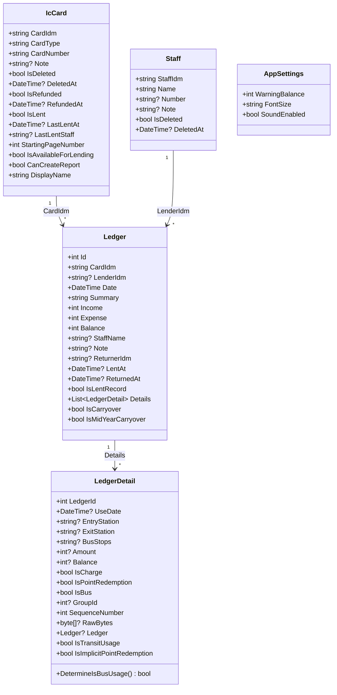
```mermaid
classDiagram
    %% Models
    class Staff {
        +string StaffIdm
        +string Name
        +string? Number
        +string? Note
        +bool IsDeleted
        +DateTime? DeletedAt
    }

    class IcCard {
        +string CardIdm
        +string CardType
        +string CardNumber
        +string? Note
        +bool IsDeleted
        +DateTime? DeletedAt
        +bool IsRefunded
        +DateTime? RefundedAt
        +bool IsLent
        +DateTime? LastLentAt
        +string? LastLentStaff
        +int StartingPageNumber
        +bool IsAvailableForLending
        +bool CanCreateReport
        +string DisplayName
    }

    class Ledger {
        +int Id
        +string CardIdm
        +string? LenderIdm
        +DateTime Date
        +string Summary
        +int Income
        +int Expense
        +int Balance
        +string? StaffName
        +string? Note
        +string? ReturnerIdm
        +DateTime? LentAt
        +DateTime? ReturnedAt
        +bool IsLentRecord
        +List~LedgerDetail~ Details
        +bool IsCarryover
        +bool IsMidYearCarryover
    }

    class LedgerDetail {
        +int LedgerId
        +DateTime? UseDate
        +string? EntryStation
        +string? ExitStation
        +string? BusStops
        +int? Amount
        +int? Balance
        +bool IsCharge
        +bool IsPointRedemption
        +bool IsBus
        +int? GroupId
        +int SequenceNumber
        +byte[]? RawBytes
        +Ledger? Ledger
        +DetermineIsBusUsage() bool
        +bool IsTransitUsage
        +bool IsImplicitPointRedemption
    }

    class AppSettings {
        +int WarningBalance
        +string FontSize
        +bool SoundEnabled
    }

    %% Relationships
    Ledger "1" --> "*" LedgerDetail : Details
    IcCard "1" --> "*" Ledger : CardIdm
    Staff "1" --> "*" Ledger : LenderIdm
```

---

## 2. レイヤー構成図


```mermaid
graph TB
    subgraph "Presentation Layer"
        VIEW[Views/XAML]
        VM[ViewModels]
    end

    subgraph "Business Logic Layer"
        SVC_LEND[LendingService]
        SVC_REPORT[ReportService]
        SVC_BACKUP[BackupService]
        SVC_SUMMARY[SummaryGenerator]
        SVC_CARDTYPE[CardTypeDetector]
        SVC_OPLOG[OperationLogger]
        SVC_CSVEXP[CsvExportService]
        SVC_CSVIMP[CsvImportService]
        SVC_PRINT[PrintService]
        SVC_SANITIZE[InputSanitizer]
        SVC_STATION[StationMasterService]
        SVC_TEMPLATE[TemplateResolver]
        SVC_TOAST[ToastNotificationService]
        SVC_DEBUG[DebugDataService]
        SVC_MERGE[LedgerMergeService]
        SVC_SPLIT[LedgerSplitService]
        SVC_CONSIST[LedgerConsistencyChecker]
        SVC_ORDER[LedgerOrderHelper]
        SVC_REPORT_BUILD[ReportDataBuilder]
        SVC_OPLOGEXCEL[OperationLogExcelExportService]
        SVC_VALID[ValidationService]
        SVC_CARDLOCK[CardLockManager]
        SVC_STAFFAUTH[IStaffAuthService]
        SVC_DIALOG[IDialogService]
    end

    subgraph "Data Access Layer"
        REPO_STAFF[IStaffRepository]
        REPO_CARD[ICardRepository]
        REPO_LEDGER[ILedgerRepository]
        REPO_SETTINGS[ISettingsRepository]
        REPO_OPLOG[IOperationLogRepository]
        DBCTX[DbContext]
    end

    subgraph "Infrastructure Layer"
        READER[ICardReader]
        SOUND[ISoundPlayer]
        CACHE[ICacheService]
        FILELOG[FileLoggerProvider]
    end

    subgraph "External"
        DB[(SQLite)]
        PASORI[PaSoRi]
        SPEAKER[スピーカー]
    end

    VIEW --> VM
    VM --> SVC_LEND
    VM --> SVC_REPORT
    SVC_LEND --> REPO_STAFF
    SVC_LEND --> REPO_CARD
    SVC_LEND --> REPO_LEDGER
    SVC_LEND --> SVC_SUMMARY
    SVC_REPORT --> REPO_LEDGER
    SVC_REPORT --> REPO_CARD

    REPO_STAFF --> DBCTX
    REPO_CARD --> DBCTX
    REPO_LEDGER --> DBCTX
    REPO_SETTINGS --> DBCTX
    REPO_OPLOG --> DBCTX
    DBCTX --> DB

    VM --> READER
    VM --> SOUND
    READER --> PASORI
    SOUND --> SPEAKER
```

---

## 3. 主要クラスの責務

### 3.1 Models（エンティティ）

| クラス | 責務 | 対応テーブル |
|--------|------|--------------|
| Staff | 職員情報を保持 | staff |
| IcCard | ICカード情報を保持。貸出可否判定・帳票作成可否判定・表示名生成のドメインロジックを含む | ic_card |
| Ledger | 利用履歴概要を保持。繰越レコード判定のドメインロジックを含む | ledger |
| LedgerDetail | 利用履歴詳細を保持。バス利用判定・鉄道利用判���・暗黙ポイント還元判定のドメインロジックを含む | ledger_detail |
| OperationLog | 操作ログを保持 | operation_log |
| AppSettings | アプリケーション設定を保持 | settings |
| OrganizationOptions | 組織固有の設定値を保持（appsettings.json） | - |
| DatabaseOptions | DB接続先パスを保持（appsettings.json） | - |

#### Value Objects（Common/ValueObjects/）

自身のプロパティだけで完結する不変の値を型安全に表現する `readonly struct` 群。

| 構造体 | 責務 |
|--------|------|
| CardIdm | 交通系ICカードIDm（16進数16文字、大文字正規化、`implicit operator string`） |
| StaffIdm | 職員証IDm（16進数16文字、大文字正規化、CardIdmとは型レベルで区別） |
| FiscalYear | 日本の会計年度（4月始まり）。`FiscalYearHelper` の後継。開始日・終了日・包含判定・前月取得・比較演算子。両者の棲み分けは [§5.8b](#58b-fiscalyearhelper-と-fiscalyear-valueobject-の棲み分けissue-1246) を参照 |
| Money | 非負の金額（円）。加算・比較演算子、`implicit operator int`） |

### 3.2 ViewModels

| クラス | 責務 |
|--------|------|
| ViewModelBase | ViewModelの基底クラス（IsBusy, BusyMessage） |
| MainViewModel | メイン画面のロジック、状態管理 |
| StaffManageViewModel | 職員管理ダイアログのロジック |
| CardManageViewModel | カード管理ダイアログのロジック |
| SettingsViewModel | 設定ダイアログのロジック |
| ReportViewModel | 帳票作成ダイアログのロジック |
| SystemManageViewModel | システム管理（バックアップ・リストア）のロジック |
| PrintPreviewViewModel | 印刷プレビュー画面のズーム・ナビゲーション制御 |
| LedgerDetailViewModel | 利用履歴詳細表示・グループ操作のロジック |
| LedgerRowEditViewModel | 履歴行の追加・編集ダイアログのロジック |
| BusStopInputViewModel | バス停名入力画面のロジック |
| IncompleteBusStopViewModel | バス停未入力一覧ダイアログのロジック |
| VirtualCardViewModel | 仮想ICカードタッチシミュレーター（DEBUG専用） |
| DataExportImportViewModel | データCSVエクスポート・インポートのロジック |
| OperationLogSearchViewModel | 操作ログ検索・表示のロジック |

### 3.3 Services

| クラス | 責務 |
|--------|------|
| LendingService | 貸出・返却処理、30秒ルール管理 |
| ReportService | 月次帳票の作成（Excel出力） |
| BackupService | データベースのバックアップ（SQLite Backup API使用。共有モード時も安全に実行可能） |
| SummaryGenerator | 摘要文字列の生成 |
| LedgerDetailChronologicalSorter | 利用詳細の時系列ソート・残高再計算 |
| OperationLogger | 操作ログの記録 |
| CsvExportService | CSV形式でのデータエクスポート |
| CsvImportService | CSV形式でのデータインポート（partial classで責務分割: Card/Staff/Ledger/Detail） |
| PrintService | 帳票の印刷・FlowDocument生成 |
| InputSanitizer | 入力値のサニタイズ処理（静的クラス） |
| StationMasterService | 駅コードから駅名への解決（シングルトン） |
| TemplateResolver | Excelテンプレートのパス解決（静的クラス） |
| ToastNotificationService | トースト通知の表示 |
| DebugDataService | テストデータの管理（DEBUGビルド専用） |
| LedgerMergeService | 複数Ledgerレコードの統合・取り消し（Issue #548） |
| CardLockManager | カードアクセスの排他制御（シングルトン） |
| IStaffAuthService / StaffAuthService | 職員証による操作者認証 |
| IDialogService / DialogService | ダイアログ表示の抽象化（テスタビリティ向上） |
| ReportDataBuilder | 月次帳票の共通データ準備（Excel/印刷で共有） |
| LedgerSplitService | 複数明細を含むLedgerレコードの分割（Issue #634） |
| LedgerConsistencyChecker | 残高チェーンの整合性検証（Issue #635） |
| LedgerOrderHelper | 残高チェーンに基づくLedger順序の復元（Issue #784） |
| OperationLogExcelExportService | 操作ログのExcel出力 |
| ValidationService | 入力値のバリデーション（IDm, カード番号, 氏名等） |
| IDatabaseInfo | DB接続情報の読み取り専用インターフェース（DbContextが実装） |
| SharedModeMonitor | 共有モードでのDB接続監視・同期表示管理 |
| WarningService | データ系の警告チェック（残額警告・バス停未入力・ジャーナルモード） |
| DashboardService | カード残高ダッシュボードのデータ構築・ソート |

### 3.4 Repositories

| インターフェース | 実装クラス | 責務 |
|------------------|------------|------|
| ILedgerQueryService | （LedgerRepositoryが実装） | 利用履歴の読み取り専用クエリ（期間検索、ページング、残高取得等） |
| ILedgerMergeRepository | （LedgerRepositoryが実装） | 利用履歴の統合・分割操作 |
| IStaffRepository | StaffRepository | 職員データのCRUD |
| ICardRepository | CardRepository | ICカードデータのCRUD |
| ILedgerRepository | LedgerRepository | 利用履歴のCRUD |
| ISettingsRepository | SettingsRepository | 設定データのCRUD |
| IOperationLogRepository | OperationLogRepository | 操作ログのCRUD |

#### DbContext と接続リース系クラス

| クラス | 責務 |
|--------|------|
| DbContext | SQLite 接続の生成・健全性チェック・マイグレーション実行・トランザクション開始 |
| ConnectionLease | `using` 文で接続を借用し、`Dispose` 時にセマフォを解放するラッパ（→ §5.5b） |
| TransactionScope | `ConnectionLease` と `SQLiteTransaction` を束ね、`Dispose` 時にトランザクション→リースの順で解放。`Commit` / `Rollback` 未呼出しの場合は自動ロールバック（→ §5.5b） |
| ConnectionSuspensionScope | リストア中など接続再オープンを禁止したい期間を RAII 的に表現（Issue #1166、→ §5.5b） |

### 3.5 Infrastructure

| インターフェース | 実装クラス | 責務 |
|------------------|------------|------|
| ICardReader | FelicaCardReader | PaSoRi + felicalib 経由での交通系ICカード読み取り（残高・履歴） |
| ICardReader | HybridCardReader | DEBUG専用。物理リーダーと仮想タッチ機能を統合 |
| ICardReader | MockCardReader | テスト用モックリーダー |
| ISoundPlayer | SoundPlayer | 音声フィードバックの再生 |

---

## 4. 依存関係図

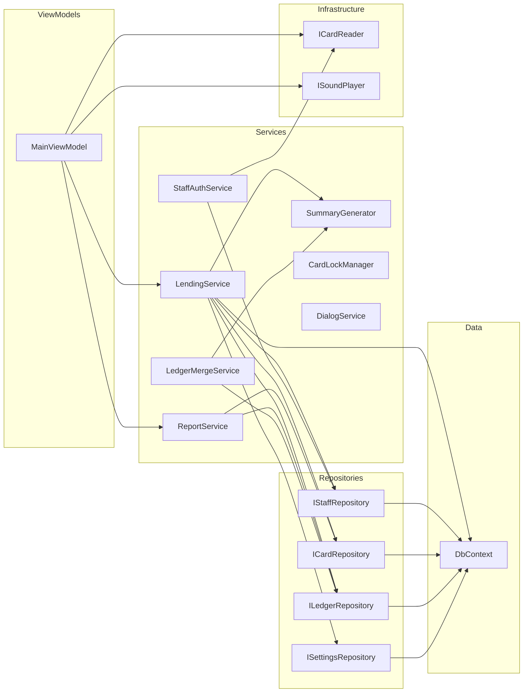
```mermaid
graph LR
    subgraph "ViewModels"
        MVM[MainViewModel]
    end

    subgraph "Services"
        LS[LendingService]
        RS[ReportService]
        SG[SummaryGenerator]
        LMS[LedgerMergeService]
        CLM[CardLockManager]
        SAS[StaffAuthService]
        DS[DialogService]
    end

    subgraph "Repositories"
        SR[IStaffRepository]
        CR[ICardRepository]
        LR[ILedgerRepository]
        STR[ISettingsRepository]
    end

    subgraph "Infrastructure"
        ICR[ICardReader]
        ISP[ISoundPlayer]
    end

    subgraph "Data"
        DBC[DbContext]
    end

    MVM --> LS
    MVM --> RS
    MVM --> ICR
    MVM --> ISP

    LS --> SR
    LS --> CR
    LS --> LR
    LS --> STR
    LS --> SG
    LS --> DBC

    RS --> CR
    RS --> LR

    LMS --> LR
    LMS --> SG
    SAS --> SR
    SAS --> ICR

    SR --> DBC
    CR --> DBC
    LR --> DBC
    STR --> DBC
```

---

## 5. クラス詳細

### 5.1 LendingService

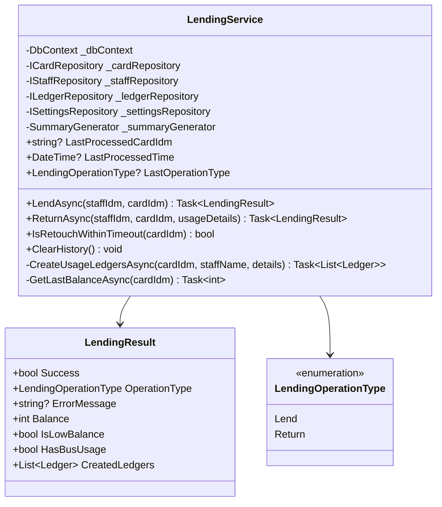
```mermaid
classDiagram
    class LendingService {
        -DbContext _dbContext
        -ICardRepository _cardRepository
        -IStaffRepository _staffRepository
        -ILedgerRepository _ledgerRepository
        -ISettingsRepository _settingsRepository
        -SummaryGenerator _summaryGenerator
        +string? LastProcessedCardIdm
        +DateTime? LastProcessedTime
        +LendingOperationType? LastOperationType
        +LendAsync(staffIdm, cardIdm) Task~LendingResult~
        +ReturnAsync(staffIdm, cardIdm, usageDetails) Task~LendingResult~
        +IsRetouchWithinTimeout(cardIdm) bool
        +ClearHistory() void
        -CreateUsageLedgersAsync(cardIdm, staffName, details) Task~List~Ledger~~
        -GetLastBalanceAsync(cardIdm) Task~int~
    }

    class LendingResult {
        +bool Success
        +LendingOperationType OperationType
        +string? ErrorMessage
        +int Balance
        +bool IsLowBalance
        +bool HasBusUsage
        +List~Ledger~ CreatedLedgers
    }

    class LendingOperationType {
        <<enumeration>>
        Lend
        Return
    }

    LendingService --> LendingResult
    LendingService --> LendingOperationType
```

### 5.2 SummaryGenerator

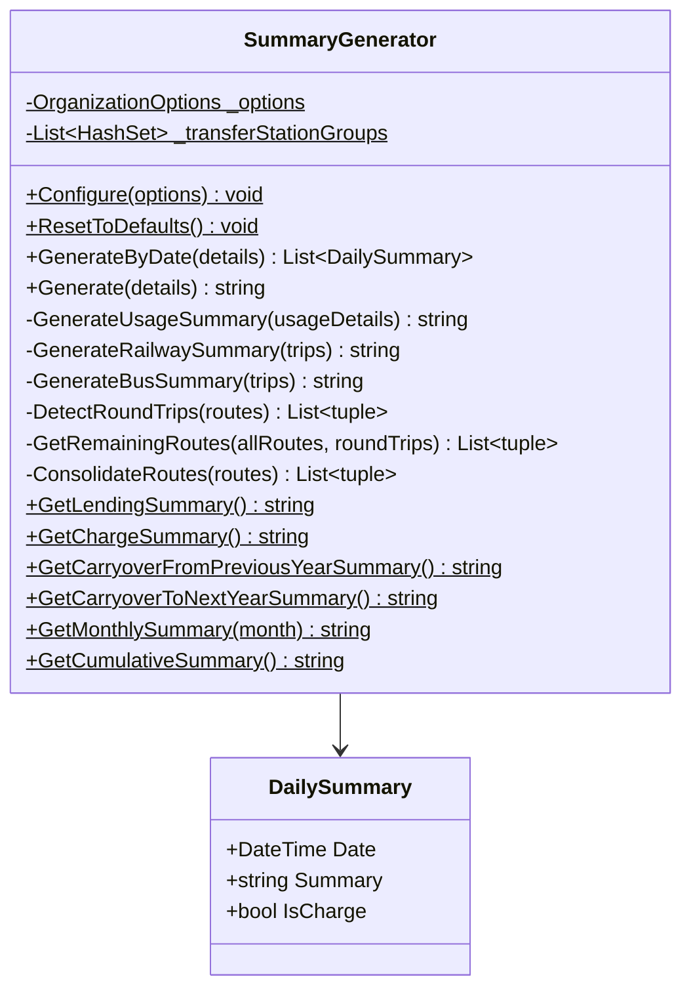
```mermaid
classDiagram
    class SummaryGenerator {
        -OrganizationOptions _options$
        -List~HashSet~ _transferStationGroups$
        +Configure(options)$ void
        +ResetToDefaults()$ void
        +GenerateByDate(details) List~DailySummary~
        +Generate(details) string
        -GenerateUsageSummary(usageDetails) string
        -GenerateRailwaySummary(trips) string
        -GenerateBusSummary(trips) string
        -DetectRoundTrips(routes) List~tuple~
        -GetRemainingRoutes(allRoutes, roundTrips) List~tuple~
        -ConsolidateRoutes(routes) List~tuple~
        +GetLendingSummary()$ string
        +GetChargeSummary()$ string
        +GetCarryoverFromPreviousYearSummary()$ string
        +GetCarryoverToNextYearSummary()$ string
        +GetMonthlySummary(month)$ string
        +GetCumulativeSummary()$ string
    }

    class DailySummary {
        +DateTime Date
        +string Summary
        +bool IsCharge
    }

    SummaryGenerator --> DailySummary
```

### 5.3 ReportService

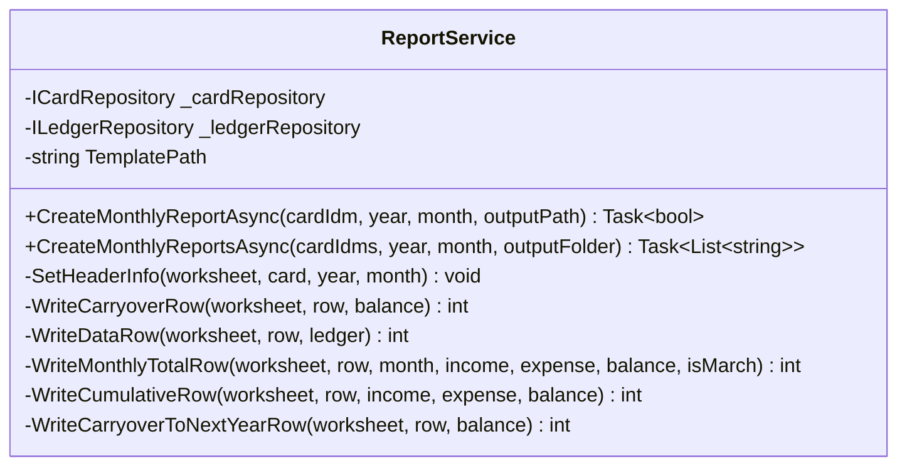
```mermaid
classDiagram
    class ReportService {
        -ICardRepository _cardRepository
        -ILedgerRepository _ledgerRepository
        -string TemplatePath
        +CreateMonthlyReportAsync(cardIdm, year, month, outputPath) Task~bool~
        +CreateMonthlyReportsAsync(cardIdms, year, month, outputFolder) Task~List~string~~
        -SetHeaderInfo(worksheet, card, year, month) void
        -WriteCarryoverRow(worksheet, row, balance) int
        -WriteDataRow(worksheet, row, ledger) int
        -WriteMonthlyTotalRow(worksheet, row, month, income, expense, balance, isMarch) int
        -WriteCumulativeRow(worksheet, row, income, expense, balance) int
        -WriteCarryoverToNextYearRow(worksheet, row, balance) int
    }
```

### 5.5 DbContext

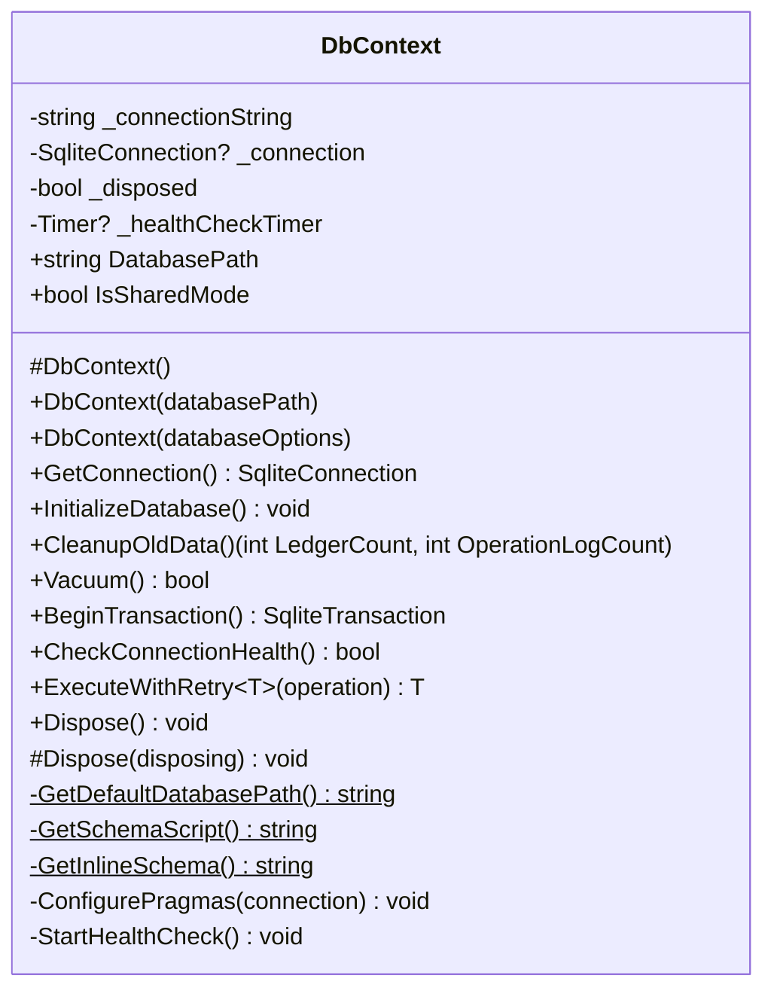
```mermaid
classDiagram
    class DbContext {
        -string _connectionString
        -SqliteConnection? _connection
        -bool _disposed
        -Timer? _healthCheckTimer
        +string DatabasePath
        +bool IsSharedMode
        #DbContext()
        +DbContext(databasePath)
        +DbContext(databaseOptions)
        +GetConnection() SqliteConnection
        +InitializeDatabase() void
        +CleanupOldData() (int LedgerCount, int OperationLogCount)
        +Vacuum() bool
        +BeginTransaction() SqliteTransaction
        +CheckConnectionHealth() bool
        +ExecuteWithRetry~T~(operation) T
        +Dispose() void
        #Dispose(disposing) void
        -GetDefaultDatabasePath()$ string
        -GetSchemaScript()$ string
        -GetInlineSchema()$ string
        -ConfigurePragmas(connection) void
        -StartHealthCheck() void
    }
```

**共有フォルダモード対応:**

- `IsSharedMode`: `DatabaseOptions.Path` が設定されている場合に `true`。共有フォルダモードかどうかを判定する
- `ConfigurePragmas()`: 接続時に `PRAGMA foreign_keys = ON`、`PRAGMA busy_timeout = 5000`、`PRAGMA journal_mode = DELETE` を設定
- `ExecuteWithRetry<T>()`: SQLITE_BUSY/SQLITE_LOCKED発生時に指数バックオフでリトライ（100ms → 500ms → 2000ms、最大3回）
- `CheckConnectionHealth()`: 軽量クエリで接続の正常性を確認。接続断時は自動再接続を試行
- `StartHealthCheck()`: 共有フォルダモード時のみ、30秒間隔の定期ヘルスチェックタイマーを開始
- `Vacuum()`: 戻り値を `bool` に変更。共有モードで他PCが接続中の場合はVACUUMが失敗しうるため、失敗時は `false` を返す（例外にしない）

> **接続リース・トランザクションの正しい使い方**: `DbContext` の接続を借りる際は、`using` 文でリースを取得する `LeaseConnectionAsync()` / `BeginTransactionAsync()` を利用する。詳細は [§5.5b 接続リース・トランザクションスコープ](#55b-接続リーストランザクションスコープissue-1243) を参照。

### 5.5a DatabaseOptions

`appsettings.json` の `DatabaseOptions` セクションからバインドされる構成クラス。

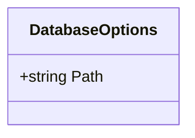
```mermaid
classDiagram
    class DatabaseOptions {
        +string Path
    }
```

| プロパティ | 型 | デフォルト | 説明 |
|-----------|-----|----------|------|
| Path | string | 空文字列 | DBファイルのパス。空の場合はローカルデフォルト。UNCパス指定で共有フォルダモード |

### 5.5b 接続リース・トランザクションスコープ（Issue #1243）

`DbContext` の接続ライフサイクルとトランザクション境界を型安全に管理する 3 つの RAII 的ラッパクラス。いずれも `Data/DbContext.cs` に定義される `public sealed class` であり、`using` 文での利用を前提としている。

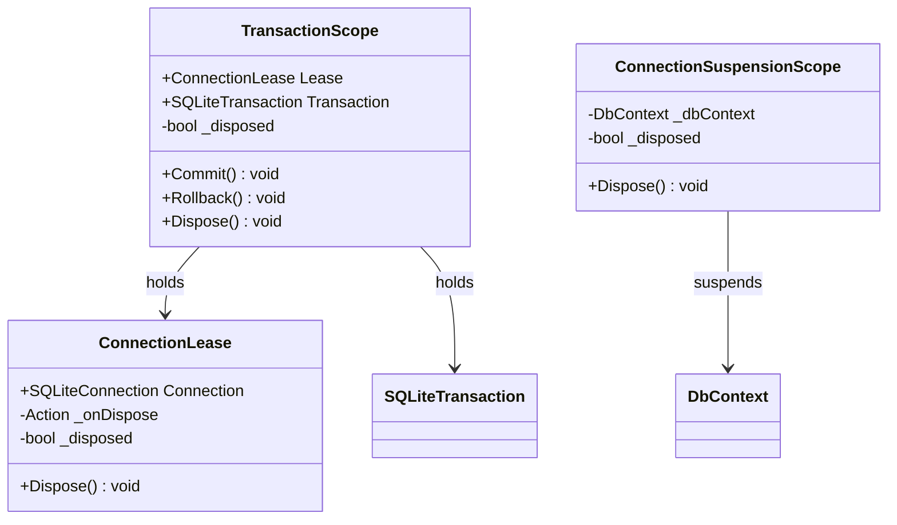
```mermaid
classDiagram
    class ConnectionLease {
        +SQLiteConnection Connection
        -Action _onDispose
        -bool _disposed
        +Dispose() void
    }

    class TransactionScope {
        +ConnectionLease Lease
        +SQLiteTransaction Transaction
        -bool _disposed
        +Commit() void
        +Rollback() void
        +Dispose() void
    }

    class ConnectionSuspensionScope {
        -DbContext _dbContext
        -bool _disposed
        +Dispose() void
    }

    TransactionScope --> ConnectionLease : holds
    TransactionScope --> SQLiteTransaction : holds
    ConnectionSuspensionScope --> DbContext : suspends
```

#### 責務一覧

| クラス | 責務 | 取得元 | 解放契機 |
|--------|------|--------|----------|
| `ConnectionLease` | **接続ライフサイクル管理**: `SQLiteConnection` を貸与し、`Dispose` でセマフォを解放して次の呼び出し者へ譲る | `DbContext.LeaseConnectionAsync()` / `LeaseConnection()` | `using` 文を抜けたとき |
| `TransactionScope` | **トランザクション境界制御**: `ConnectionLease` と `SQLiteTransaction` を束ね、`Dispose` で**トランザクション→リースの順に**解放する | `DbContext.BeginTransactionAsync()` | `using` 文を抜けたとき |
| `ConnectionSuspensionScope` | **接続一時停止制御**: リストア中など接続再オープンを禁止したい期間を RAII 的に表現し、`Dispose` で自動的に解除する（Issue #1166） | `DbContext.SuspendConnections()` | `using` 文を抜けたとき |

#### TransactionScope.Dispose() の自動ロールバック仕様

**重要**: `Commit()` も `Rollback()` も呼ばずに `Dispose` された場合、`SQLiteTransaction.Dispose()` は **未コミットのトランザクションを自動的にロールバック** する。このため、例外経路でも明示的な `Rollback()` 呼び出しは不要である。

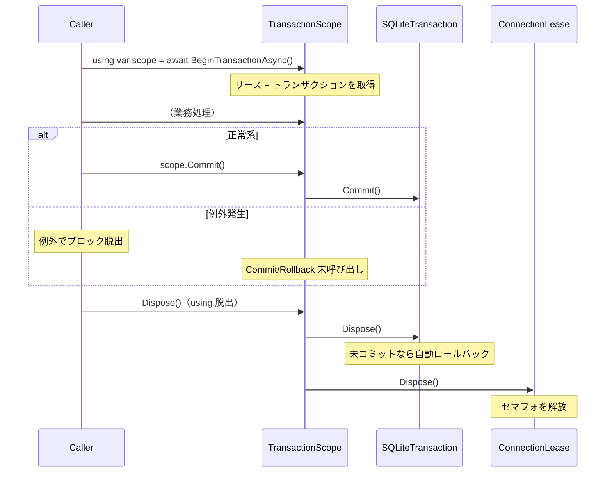
```mermaid
sequenceDiagram
    participant Caller
    participant Scope as TransactionScope
    participant Tx as SQLiteTransaction
    participant Lease as ConnectionLease

    Caller->>Scope: using var scope = await BeginTransactionAsync()
    Note over Scope: リース + トランザクションを取得
    Caller->>Scope: （業務処理）
    alt 正常系
        Caller->>Scope: scope.Commit()
        Scope->>Tx: Commit()
    else 例外発生
        Note over Caller: 例外でブロック脱出
        Note over Scope: Commit/Rollback 未呼び出し
    end
    Caller->>Scope: Dispose()（using 脱出）
    Scope->>Tx: Dispose()
    Note over Tx: 未コミットなら自動ロールバック
    Scope->>Lease: Dispose()
    Note over Lease: セマフォを解放
```

この仕様により、典型的な try/catch 定型文を省略できる:

```csharp
// ❌ 冗長（Dispose が自動ロールバックする）
using var scope = await _dbContext.BeginTransactionAsync();
try
{
    // 処理
    scope.Commit();
}
catch
{
    scope.Rollback();
    throw;
}

// ✅ 簡潔（例外時も Dispose が自動ロールバックする）
using var scope = await _dbContext.BeginTransactionAsync();
// 処理
scope.Commit();
// 例外時は Commit() が呼ばれないまま using を抜け、自動ロールバック
```

#### 典型的な使用パターン

**1. 読み取り専用の接続借用（単発クエリ）**

```csharp
using var lease = await _dbContext.LeaseConnectionAsync();
var connection = lease.Connection;

using var command = connection.CreateCommand();
command.CommandText = "SELECT value FROM settings WHERE key = @key";
command.Parameters.AddWithValue("@key", key);
return (string?)await command.ExecuteScalarAsync();
// using 脱出時にリースを解放、セマフォ返却
```

**2. 複数操作を 1 トランザクションで実行（書き込み系の推奨形）**

```csharp
await _dbContext.ExecuteWithRetryAsync(async () =>
{
    using var scope = await _dbContext.BeginTransactionAsync();

    await SetAsync(KeyWarningBalance, settings.WarningBalance.ToString());
    await SetAsync(KeyFontSize, FontSizeToString(settings.FontSize));
    // ...複数のキー更新...

    scope.Commit();
    // 例外発生時は Commit() に到達せず Dispose で自動ロールバック
});
```

`ExecuteWithRetryAsync` と組み合わせることで、`SQLITE_BUSY` / `SQLITE_LOCKED` 発生時に指数バックオフ + ジッター付きでリトライする（共有モードでは最大 5 回）。

**3. 接続の一時停止（リストア中など）**

```csharp
using var suspension = _dbContext.SuspendConnections();
// この間、バックグラウンドタスクからの GetConnectionInternal() は
// InvalidOperationException をスロー（Issue #1166）
await RestoreFromBackupAsync(backupFile);
// using 脱出時に ResumeConnections() が自動呼び出しされる
```

#### 排他制御（内部実装の注意点）

- `BeginTransactionAsync()` は `DbContext._semaphore` を取得する（`SemaphoreSlim(1, 1)`）。トランザクション中は他の書き込み系呼び出しがブロックされる
- `LeaseConnectionAsync()`（非同期版）は現在セマフォを取得しない。同一 `SQLiteConnection` を複数タスクが共有する前提
- `LeaseConnection()`（同期版）はセマフォを取得し、同一スレッド内でリエントラント（`AsyncLocal<int>` でカウント）
- 結果として、**書き込み系は必ず `BeginTransactionAsync` 経由** で実行することで、他の書き込みとのレース条件を防げる

### 5.6 CsvExportService

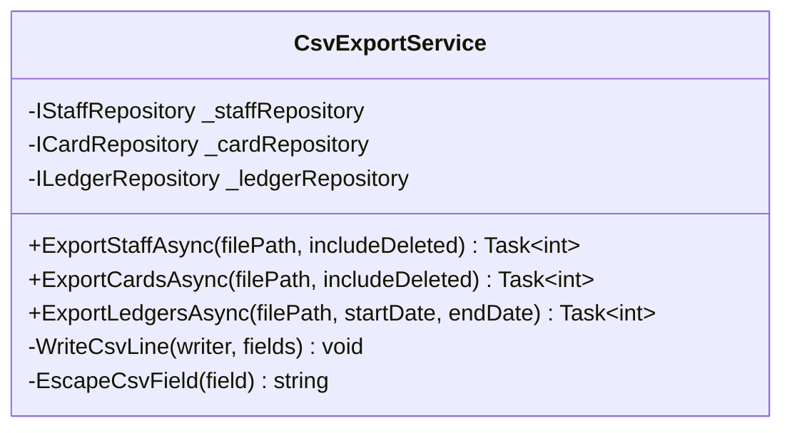
```mermaid
classDiagram
    class CsvExportService {
        -IStaffRepository _staffRepository
        -ICardRepository _cardRepository
        -ILedgerRepository _ledgerRepository
        +ExportStaffAsync(filePath, includeDeleted) Task~int~
        +ExportCardsAsync(filePath, includeDeleted) Task~int~
        +ExportLedgersAsync(filePath, startDate, endDate) Task~int~
        -WriteCsvLine(writer, fields) void
        -EscapeCsvField(field) string
    }
```

### 5.7 CsvImportService

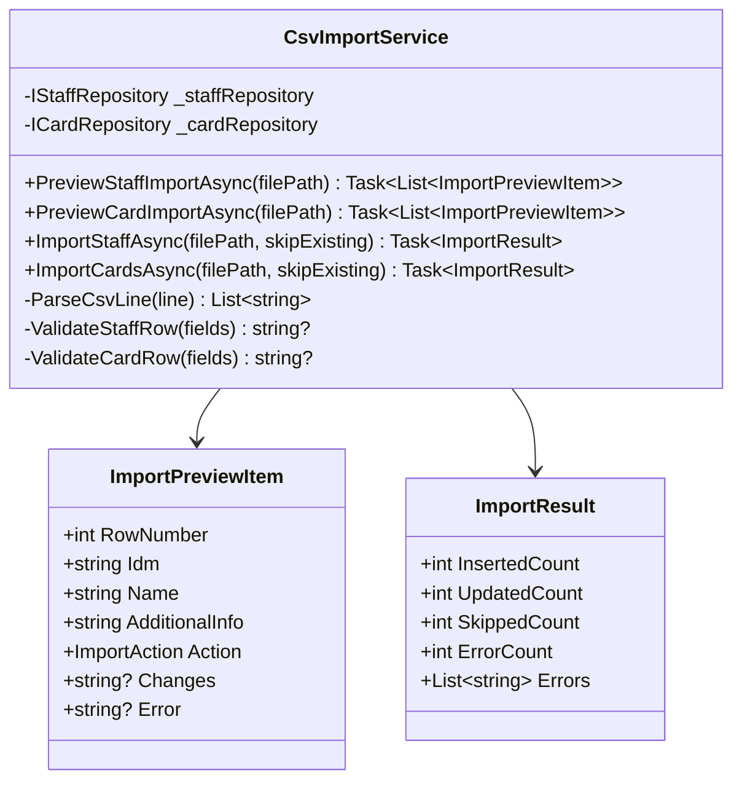
```mermaid
classDiagram
    class CsvImportService {
        -IStaffRepository _staffRepository
        -ICardRepository _cardRepository
        +PreviewStaffImportAsync(filePath) Task~List~ImportPreviewItem~~
        +PreviewCardImportAsync(filePath) Task~List~ImportPreviewItem~~
        +ImportStaffAsync(filePath, skipExisting) Task~ImportResult~
        +ImportCardsAsync(filePath, skipExisting) Task~ImportResult~
        -ParseCsvLine(line) List~string~
        -ValidateStaffRow(fields) string?
        -ValidateCardRow(fields) string?
    }

    class ImportPreviewItem {
        +int RowNumber
        +string Idm
        +string Name
        +string AdditionalInfo
        +ImportAction Action
        +string? Changes
        +string? Error
    }

    class ImportResult {
        +int InsertedCount
        +int UpdatedCount
        +int SkippedCount
        +int ErrorCount
        +List~string~ Errors
    }

    CsvImportService --> ImportPreviewItem
    CsvImportService --> ImportResult
```

### 5.8 PrintService

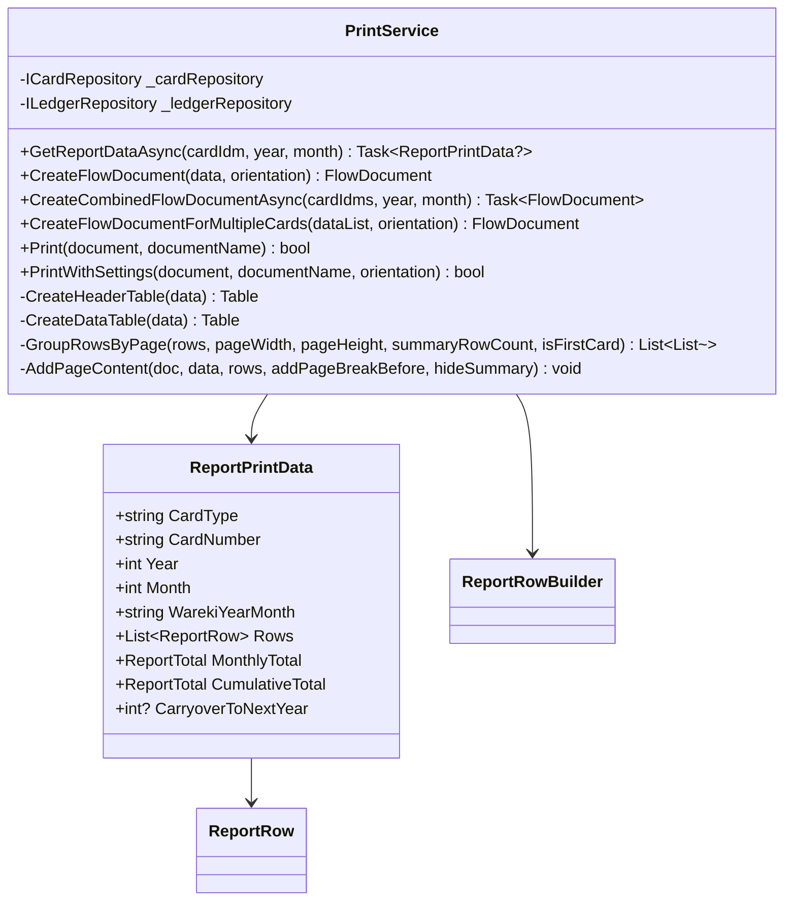
```mermaid
classDiagram
    class PrintService {
        -ICardRepository _cardRepository
        -ILedgerRepository _ledgerRepository
        +GetReportDataAsync(cardIdm, year, month) Task~ReportPrintData?~
        +CreateFlowDocument(data, orientation) FlowDocument
        +CreateCombinedFlowDocumentAsync(cardIdms, year, month) Task~FlowDocument~
        +CreateFlowDocumentForMultipleCards(dataList, orientation) FlowDocument
        +Print(document, documentName) bool
        +PrintWithSettings(document, documentName, orientation) bool
        -CreateHeaderTable(data) Table
        -CreateDataTable(data) Table
        -GroupRowsByPage(rows, pageWidth, pageHeight, summaryRowCount, isFirstCard) List~List~~
        -AddPageContent(doc, data, rows, addPageBreakBefore, hideSummary) void
    }

    class ReportPrintData {
        +string CardType
        +string CardNumber
        +int Year
        +int Month
        +string WarekiYearMonth
        +List~ReportRow~ Rows
        +ReportTotal MonthlyTotal
        +ReportTotal CumulativeTotal
        +int? CarryoverToNextYear
    }

    PrintService --> ReportPrintData
    PrintService --> ReportRowBuilder
    ReportPrintData --> ReportRow
```

### 5.8a ReportRow / ReportRowBuilder（Issue #1023）

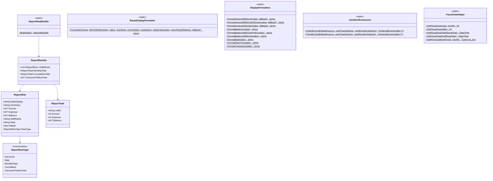
```mermaid
classDiagram
    class ReportRowType {
        <<enumeration>>
        Carryover
        Data
        MonthlyTotal
        Cumulative
        CarryoverToNextYear
    }

    class ReportRow {
        +string DateDisplay
        +string Summary
        +int? Income
        +int? Expense
        +int? Balance
        +string StaffName
        +string Note
        +bool IsBold
        +ReportRowType RowType
    }

    class ReportTotal {
        +string Label
        +int Income
        +int Expense
        +int? Balance
    }

    class ReportRowSet {
        +List~ReportRow~ DataRows
        +ReportTotal MonthlyTotal
        +ReportTotal CumulativeTotal
        +int? CarryoverToNextYear
    }

    class ReportRowBuilder {
        <<static>>
        +Build(data)$ ReportRowSet
    }

    class RouteDisplayFormatter {
        <<static>>
        +Format(isCharge, isPointRedemption, isBus, busStops, entryStation, exitStation, stationSeparator, showPartialStations, fallback)$ string
    }

    class DisplayFormatters {
        <<static>>
        +FormatAmountWithUnit(value, fallback)$ string
        +FormatAmountWithUnitOrEmpty(value, fallback)$ string
        +FormatAmountOrEmpty(value, fallback)$ string
        +FormatBalance(value)$ string
        +FormatBalanceWithYenPrefix(value)$ string
        +FormatBalanceWithUnit(value)$ string
        +FormatDate(date)$ string
        +FormatDateTime(date)$ string
        +FormatTimestamp(date)$ string
    }

    class CardSortExtensions {
        <<static>>
        +OrderByCardDefault(source, cardTypeSelector, cardNumberSelector)$ IOrderedEnumerable~T~
        +ThenByCardDefault(source, cardTypeSelector, cardNumberSelector)$ IOrderedEnumerable~T~
    }

    class FiscalYearHelper {
        <<static>>
        +GetFiscalYear(year, month)$ int
        +GetFiscalYear(date)$ int
        +GetFiscalYearStart(fiscalYear)$ DateTime
        +GetFiscalYearEnd(fiscalYear)$ DateTime
        +GetPreviousMonth(year, month)$ Tuple~int_int~
    }

    ReportRowBuilder --> ReportRowSet
    ReportRowSet --> ReportRow
    ReportRowSet --> ReportTotal
    ReportRow --> ReportRowType
```

### 5.8b FiscalYearHelper と FiscalYear ValueObject の棲み分け（Issue #1246）

日本の会計年度（4月始まり）計算には、**2 つの共存する API** がある。新規コードは **`FiscalYear` ValueObject** を使用することを推奨する。`FiscalYearHelper`（静的メソッド群）は Issue #1024 で導入された先行実装で、Value Object 化（Issue #1221）後も後方互換のため残存している。

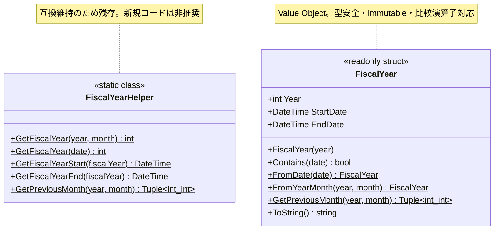
```mermaid
classDiagram
    class FiscalYearHelper {
        <<static class>>
        +GetFiscalYear(year, month)$ int
        +GetFiscalYear(date)$ int
        +GetFiscalYearStart(fiscalYear)$ DateTime
        +GetFiscalYearEnd(fiscalYear)$ DateTime
        +GetPreviousMonth(year, month)$ Tuple~int_int~
    }

    class FiscalYear {
        <<readonly struct>>
        +int Year
        +FiscalYear(year)
        +DateTime StartDate
        +DateTime EndDate
        +Contains(date) bool
        +FromDate(date)$ FiscalYear
        +FromYearMonth(year, month)$ FiscalYear
        +GetPreviousMonth(year, month)$ Tuple~int_int~
        +ToString() string
    }

    note for FiscalYearHelper "互換維持のため残存。新規コードは非推奨"
    note for FiscalYear "Value Object。型安全・immutable・比較演算子対応"
```

#### API 対応表

| FiscalYearHelper（旧 API） | FiscalYear ValueObject（新 API） | 備考 |
|---------------------------|--------------------------------|------|
| `FiscalYearHelper.GetFiscalYear(year, month)` | `FiscalYear.FromYearMonth(year, month).Year` | 戻り値の意味が型で表現される |
| `FiscalYearHelper.GetFiscalYear(date)` | `FiscalYear.FromDate(date).Year` | 同上 |
| `FiscalYearHelper.GetFiscalYearStart(fy)` | `new FiscalYear(fy).StartDate` | インスタンスメソッド化 |
| `FiscalYearHelper.GetFiscalYearEnd(fy)` | `new FiscalYear(fy).EndDate` | インスタンスメソッド化 |
| `FiscalYearHelper.GetPreviousMonth(y, m)` | `FiscalYear.GetPreviousMonth(y, m)` | 年度と無関係な純粋関数のため両者に同名で残存 |
| なし | `fy.Contains(date)` | **新機能**: 日付包含判定 |
| なし | `==`, `!=`, `<`, `>` など比較演算子 | **新機能**: 年度間比較 |
| なし | `implicit operator int(FiscalYear)` | **新機能**: 戻り値を int として扱える |

#### 使用方針

**新規コード**: `FiscalYear` ValueObject を使用すること。

```csharp
// 推奨
var fy = FiscalYear.FromDate(DateTime.Today);
if (fy.Contains(record.Date))
{
    total += record.Amount;
}

// 年度間比較も自然に書ける
var fy2025 = new FiscalYear(2025);
var fy2026 = new FiscalYear(2026);
Assert.True(fy2025 < fy2026);
```

**既存コード**: `FiscalYearHelper` のままでもビルドは通るが、触った際に段階的に `FiscalYear` へ移行する。一括置換は差分が大きくなるため、機能追加や周辺修正のついでに置き換える。

#### 段階的移行計画

既存の `FiscalYearHelper` 呼び出しは全 5 ファイル 12 箇所（本設計書作成時点）。優先度別の移行順を以下に示す。

| 優先度 | 対象ファイル | 呼び出し数 | 移行の判断基準 |
|--------|------------|----------|----------------|
| **高** | `Common/WarekiConverter.cs:137, 147, 157` | 3 | コアユーティリティ。WarekiConverter 自体の責務再整理と合わせて FiscalYear ベースに刷新すべき |
| **高** | `Services/ReportService.cs:671` | 1 | 帳票出力の年度判定。単発呼び出しなので `FiscalYear.FromYearMonth(y, m).Year` に直接置換可能 |
| **高** | `Services/ReportDataBuilder.cs:95, 96, 182, 197` | 4 | 年度跨ぎの月計・累計計算の起点。`Contains(date)` 導入で意図がより明瞭になる |
| **中** | `ViewModels/CardManageViewModel.cs:453` | 1 | 年度途中導入時の `CarryoverFiscalYear` 計算（Issue #1215）。単発で置換容易 |
| **低** | `Services/DebugDataService.cs:196, 197, 703` | 3 | DEBUG ビルドのテストデータ生成。本番挙動に影響しないため後回し可 |

#### 将来の廃止計画

`FiscalYearHelper` は **v3.0 リリース時に `[Obsolete]` 属性付与** → **v3.1 で削除** を目指す。以下が揃った段階で `[Obsolete]` を付与：

1. 上記 12 箇所がすべて `FiscalYear` ValueObject に移行済み
2. 移行後の全体テストが Green
3. 外部プラグイン・拡張が存在しないこと（現状該当なし）

`[Obsolete]` 期間中は `FiscalYearHelper` 内部から `FiscalYear` ValueObject に委譲する形に書き換え、振る舞いの乖離を防ぐ。

### 5.9 InputSanitizer

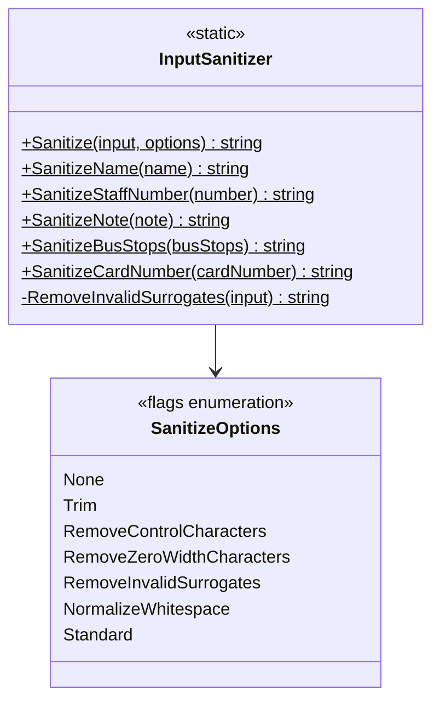
```mermaid
classDiagram
    class InputSanitizer {
        <<static>>
        +Sanitize(input, options)$ string
        +SanitizeName(name)$ string
        +SanitizeStaffNumber(number)$ string
        +SanitizeNote(note)$ string
        +SanitizeBusStops(busStops)$ string
        +SanitizeCardNumber(cardNumber)$ string
        -RemoveInvalidSurrogates(input)$ string
    }

    class SanitizeOptions {
        <<flags enumeration>>
        None
        Trim
        RemoveControlCharacters
        RemoveZeroWidthCharacters
        RemoveInvalidSurrogates
        NormalizeWhitespace
        Standard
    }

    InputSanitizer --> SanitizeOptions
```

### 5.10 StationMasterService

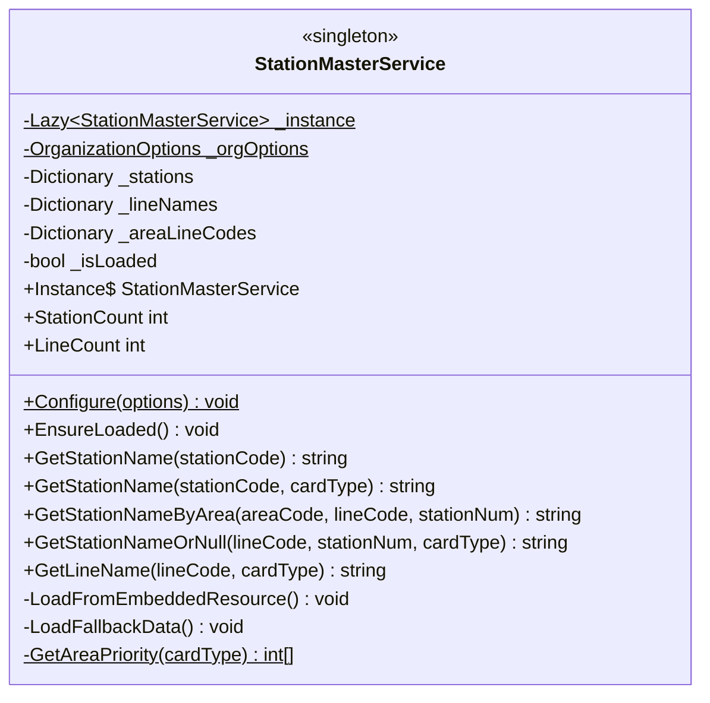
```mermaid
classDiagram
    class StationMasterService {
        <<singleton>>
        -Lazy~StationMasterService~ _instance$
        -OrganizationOptions _orgOptions$
        -Dictionary _stations
        -Dictionary _lineNames
        -Dictionary _areaLineCodes
        -bool _isLoaded
        +Instance$ StationMasterService
        +Configure(options)$ void
        +EnsureLoaded() void
        +GetStationName(stationCode) string
        +GetStationName(stationCode, cardType) string
        +GetStationNameByArea(areaCode, lineCode, stationNum) string
        +GetStationNameOrNull(lineCode, stationNum, cardType) string
        +GetLineName(lineCode, cardType) string
        +StationCount int
        +LineCount int
        -LoadFromEmbeddedResource() void
        -LoadFallbackData() void
        -GetAreaPriority(cardType)$ int[]
    }
```

### 5.11 OrganizationOptions

組織固有の設定値を保持する構成クラス。`appsettings.json` の `OrganizationOptions` セクションからバインドされ、`SummaryGenerator` と `StationMasterService` に静的 `Configure()` メソッドで適用される。セクション未定義時はデフォルト値（福岡市向け）が使用される。

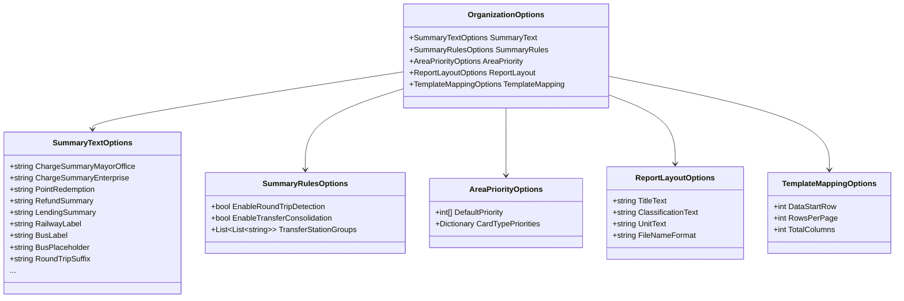
```mermaid
classDiagram
    class OrganizationOptions {
        +SummaryTextOptions SummaryText
        +SummaryRulesOptions SummaryRules
        +AreaPriorityOptions AreaPriority
        +ReportLayoutOptions ReportLayout
        +TemplateMappingOptions TemplateMapping
    }

    class SummaryTextOptions {
        +string ChargeSummaryMayorOffice
        +string ChargeSummaryEnterprise
        +string PointRedemption
        +string RefundSummary
        +string LendingSummary
        +string RailwayLabel
        +string BusLabel
        +string BusPlaceholder
        +string RoundTripSuffix
        ...
    }

    class SummaryRulesOptions {
        +bool EnableRoundTripDetection
        +bool EnableTransferConsolidation
        +List~List~string~~ TransferStationGroups
    }

    class AreaPriorityOptions {
        +int[] DefaultPriority
        +Dictionary CardTypePriorities
    }

    class ReportLayoutOptions {
        +string TitleText
        +string ClassificationText
        +string UnitText
        +string FileNameFormat
    }

    class TemplateMappingOptions {
        +int DataStartRow
        +int RowsPerPage
        +int TotalColumns
    }

    OrganizationOptions --> SummaryTextOptions
    OrganizationOptions --> SummaryRulesOptions
    OrganizationOptions --> AreaPriorityOptions
    OrganizationOptions --> ReportLayoutOptions
    OrganizationOptions --> TemplateMappingOptions
```

### 5.12 TemplateResolver

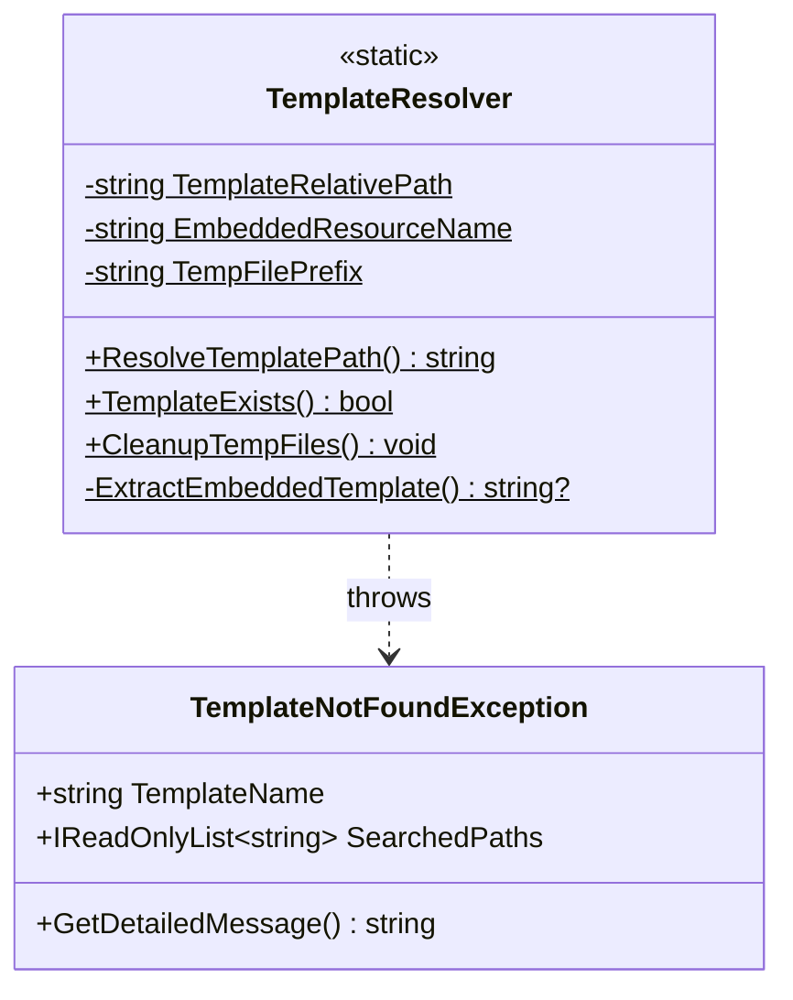
```mermaid
classDiagram
    class TemplateResolver {
        <<static>>
        -string TemplateRelativePath$
        -string EmbeddedResourceName$
        -string TempFilePrefix$
        +ResolveTemplatePath()$ string
        +TemplateExists()$ bool
        +CleanupTempFiles()$ void
        -ExtractEmbeddedTemplate()$ string?
    }

    class TemplateNotFoundException {
        +string TemplateName
        +IReadOnlyList~string~ SearchedPaths
        +GetDetailedMessage() string
    }

    TemplateResolver ..> TemplateNotFoundException : throws
```

### 5.13 ToastNotificationService

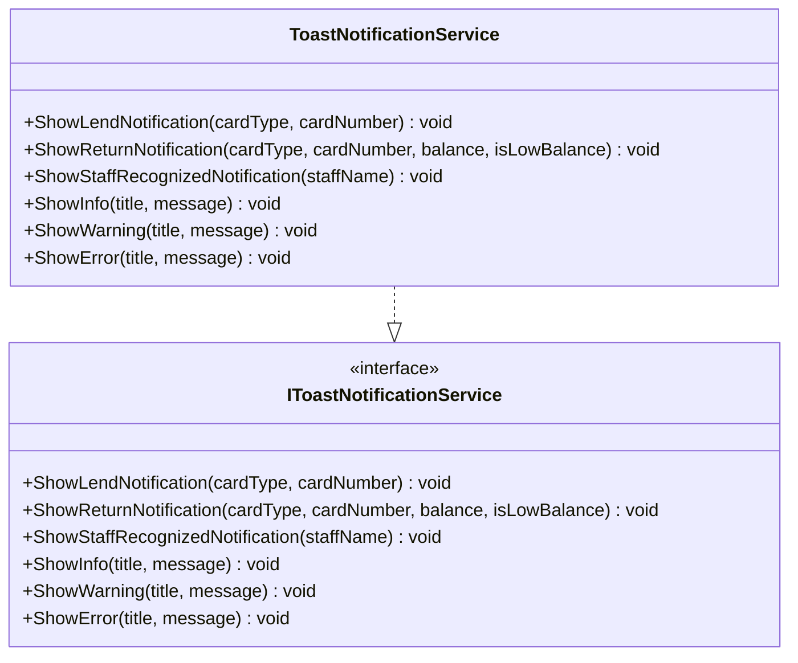
```mermaid
classDiagram
    class IToastNotificationService {
        <<interface>>
        +ShowLendNotification(cardType, cardNumber) void
        +ShowReturnNotification(cardType, cardNumber, balance, isLowBalance) void
        +ShowStaffRecognizedNotification(staffName) void
        +ShowInfo(title, message) void
        +ShowWarning(title, message) void
        +ShowError(title, message) void
    }

    class ToastNotificationService {
        +ShowLendNotification(cardType, cardNumber) void
        +ShowReturnNotification(cardType, cardNumber, balance, isLowBalance) void
        +ShowStaffRecognizedNotification(staffName) void
        +ShowInfo(title, message) void
        +ShowWarning(title, message) void
        +ShowError(title, message) void
    }

    ToastNotificationService ..|> IToastNotificationService
```

### 5.14 DebugDataService

```mermaid
classDiagram
    class DebugDataService {
        <<DEBUG only>>
        -IStaffRepository _staffRepository
        -ICardRepository _cardRepository
        -ILedgerRepository _ledgerRepository
        +Staff[] TestStaffList$
        +IcCard[] TestCardList$
        +RegisterAllTestDataAsync() Task
        +RegisterTestStaffAsync() Task
        +RegisterTestCardsAsync() Task
        +RegisterSampleHistoryAsync() Task
    }
```

### 5.15 LedgerMergeService

```mermaid
classDiagram
    class LedgerMergeService {
        -ILedgerRepository _ledgerRepository
        -SummaryGenerator _summaryGenerator
        -OperationLogger _operationLogger
        -ILogger _logger
        +MergeAsync(ledgerIds, operatorIdm) Task~LedgerMergeResult~
        +UnmergeAsync(mergeHistoryId, operatorIdm) Task~LedgerMergeResult~
        +GetUndoableMergeHistoriesAsync() Task~List~MergeHistoryEntry~~
    }

    class LedgerMergeResult {
        +bool Success
        +string ErrorMessage
        +Ledger MergedLedger
    }

    class MergeHistoryEntry {
        +int Id
        +DateTime MergedAt
        +int TargetLedgerId
        +string Description
    }

    LedgerMergeService --> LedgerMergeResult
    LedgerMergeService --> MergeHistoryEntry
```

### 5.16 CardLockManager

```mermaid
classDiagram
    class CardLockManager {
        <<IDisposable>>
        -ConcurrentDictionary _locks
        -ILogger _logger
        +GetLock(cardIdm) SemaphoreSlim
        +ReleaseLockReference(cardIdm) void
        +CleanupExpiredLocks() void
        +ClearAllLocks() void
        +HasLock(cardIdm) bool
        +Dispose() void
    }
```

### 5.17 StaffAuthService

```mermaid
classDiagram
    class IStaffAuthService {
        <<interface>>
        +RequestAuthenticationAsync(operationDescription) Task~StaffAuthResult~
    }

    class StaffAuthService {
        -IStaffRepository _staffRepository
        -ICardReader _cardReader
        -ISoundPlayer _soundPlayer
        +RequestAuthenticationAsync(operationDescription) Task~StaffAuthResult~
    }

    class StaffAuthResult {
        +string Idm
        +string StaffName
    }

    StaffAuthService ..|> IStaffAuthService
    StaffAuthService --> StaffAuthResult
```

### 5.18 DialogService

```mermaid
classDiagram
    class IDialogService {
        <<interface>>
        +ShowConfirmation(message, title) bool
        +ShowWarningConfirmation(message, title) bool
        +ShowInformation(message, title) void
        +ShowWarning(message, title) void
        +ShowError(message, title) void
        +ShowCardRegistrationModeDialog() CardRegistrationModeResult
    }

    class DialogService {
        +ShowConfirmation(message, title) bool
        +ShowWarningConfirmation(message, title) bool
        +ShowInformation(message, title) void
        +ShowWarning(message, title) void
        +ShowError(message, title) void
        +ShowCardRegistrationModeDialog() CardRegistrationModeResult
    }

    DialogService ..|> IDialogService
```

### 5.19 ReportDataBuilder

```mermaid
classDiagram
    class IReportDataBuilder {
        <<interface>>
        +BuildAsync(cardIdm, year, month) Task~MonthlyReportData~
    }

    class ReportDataBuilder {
        -ICardRepository _cardRepository
        -ILedgerRepository _ledgerRepository
        +BuildAsync(cardIdm, year, month) Task~MonthlyReportData~
        -GetPreviousMonthBalanceAsync(cardIdm, year, month) Task~int?~
    }

    ReportDataBuilder ..|> IReportDataBuilder
```

### 5.20 LedgerSplitService

```mermaid
classDiagram
    class LedgerSplitService {
        -ILedgerRepository _ledgerRepository
        -SummaryGenerator _summaryGenerator
        -OperationLogger _operationLogger
        -ILogger~LedgerSplitService~ _logger
        +SplitAsync(ledgerId, groupedDetails, operatorIdm?) Task~LedgerSplitResult~
        +CalculateGroupFinancials(groupDetails)$ tuple~int, int, int~
        -GetGroupDate(groupDetails, originalDate)$ DateTime
        -ClearGroupIds(details)$ void
        -CloneLedger(source)$ Ledger
    }

    class LedgerSplitResult {
        +bool Success
        +string ErrorMessage
        +List~int~ CreatedLedgerIds
    }

    LedgerSplitService --> LedgerSplitResult
```

### 5.21 LedgerConsistencyChecker

```mermaid
classDiagram
    class LedgerConsistencyChecker {
        <<internal>>
        -ILedgerRepository _ledgerRepository
        +CheckBalanceConsistencyAsync(cardIdm, fromDate, toDate) Task~ConsistencyResult~
        +CheckConsistency(ledgers, cardIdm, fromDate) ConsistencyResult
        +CheckConsistencyWithPreviousAsync(ledgers, cardIdm, fromDate) Task~ConsistencyResult~
    }

    class ConsistencyResult {
        <<internal>>
        +bool IsConsistent
        +List~tuple~ Inconsistencies
    }

    LedgerConsistencyChecker --> ConsistencyResult
```

### 5.22 LedgerOrderHelper

```mermaid
classDiagram
    class LedgerOrderHelper {
        <<internal, static>>
        +ReorderByBalanceChain(ledgers, precedingBalance?)$ List~Ledger~
        -ReconstructChain(records, startBalance)$ List~Ledger~
        -IsSpecialRecord(ledger)$ bool
    }
```

### 5.23 OperationLogExcelExportService

```mermaid
classDiagram
    class OperationLogExcelExportService {
        -XLColor HeaderBackground$
        -XLColor ColorGreen$
        -XLColor ColorOrange$
        -XLColor ColorRed$
        -XLColor ColorBlue$
        +ExportAsync(logs, filePath) Task
        +GetActionDisplayName(action?)$ string
        +GetTargetTableDisplayName(targetTable?)$ string
        +FormatJsonToReadable(targetTable?, json?)$ string
        +GetChangeSummary(targetTable?, beforeJson?, afterJson?)$ string
        +GetFieldNameMap(targetTable?)$ IReadOnlyDictionary~string, string~
        -WriteHeader(worksheet)$ void
        -WriteDataRow(worksheet, row, log)$ void
        -ApplyFormatting(worksheet, lastDataRow)$ void
        -GetActionColor(action?)$ XLColor?
    }
```

### 5.24 ValidationService

```mermaid
classDiagram
    class IValidationService {
        <<interface>>
        +ValidateCardIdm(idm) ValidationResult
        +ValidateCardNumber(cardNumber) ValidationResult
        +ValidateCardType(cardType) ValidationResult
        +ValidateStaffIdm(idm) ValidationResult
        +ValidateStaffName(name) ValidationResult
        +ValidateWarningBalance(balance) ValidationResult
        +ValidateBusStops(busStops) ValidationResult
    }

    class ValidationService {
        -int IdmLength$
        -int CardNumberMaxLength$
        -int StaffNameMaxLength$
        -int BusStopsMaxLength$
        -Regex HexPatternRegex$
        -Regex AlphanumericPatternRegex$
        +ValidateCardIdm(idm) ValidationResult
        +ValidateCardNumber(cardNumber) ValidationResult
        +ValidateCardType(cardType) ValidationResult
        +ValidateStaffIdm(idm) ValidationResult
        +ValidateStaffName(name) ValidationResult
        +ValidateWarningBalance(balance) ValidationResult
        +ValidateBusStops(busStops) ValidationResult
    }

    ValidationService ..|> IValidationService
```

---

## 6. DIコンテナ設定

### 6.1 サービス登録（想定）

```csharp
// App.xaml.cs または Startup.cs
services.Configure<DatabaseOptions>(Configuration.GetSection("DatabaseOptions"));
services.AddSingleton<DbContext>();
services.AddSingleton<ICardRepository, CardRepository>();
services.AddSingleton<IStaffRepository, StaffRepository>();
services.AddSingleton<ILedgerRepository, LedgerRepository>();
services.AddSingleton<ISettingsRepository, SettingsRepository>();
services.AddSingleton<IOperationLogRepository, OperationLogRepository>();

services.AddSingleton<SummaryGenerator>();
services.AddSingleton<LendingService>();
services.AddSingleton<ReportService>();
services.AddSingleton<BackupService>();
services.AddSingleton<OperationLogger>();
services.AddSingleton<CsvExportService>();
services.AddSingleton<CsvImportService>();
services.AddSingleton<PrintService>();
services.AddSingleton<IToastNotificationService, ToastNotificationService>();
services.AddSingleton<LedgerMergeService>();
services.AddSingleton<CardLockManager>();
services.AddSingleton<IStaffAuthService, StaffAuthService>();
services.AddSingleton<IDialogService, DialogService>();
#if DEBUG
services.AddSingleton<DebugDataService>();
#endif

// IOptions<T>パターン
services.Configure<OrganizationOptions>(Configuration.GetSection("OrganizationOptions"));
// DatabaseOptionsはDbContextより先に登録済み（上記参照）

// 静的クラス（DI不要）: InputSanitizer, TemplateResolver
// 起動時に静的Configure()で適用: SummaryGenerator
// IOptions<OrganizationOptions>経由でDI注入: StationMasterService

services.AddSingleton<ICardReader, FelicaCardReader>();
services.AddSingleton<ISoundPlayer, SoundPlayer>();

services.AddTransient<MainViewModel>();
services.AddTransient<StaffManageViewModel>();
services.AddTransient<CardManageViewModel>();
services.AddTransient<SettingsViewModel>();
services.AddTransient<ReportViewModel>();
```

### 6.2 ライフタイム

| ライフタイム | クラス | 理由 |
|--------------|--------|------|
| Singleton | DbContext | DB接続を共有 |
| Singleton | Repositories | 状態を持たないが、DbContextを共有 |
| Singleton | Services | 状態を持つ（LastProcessedCardIdm等） |
| Singleton | ICardReader | ハードウェアリソースを管理 |
| Singleton | ISoundPlayer | リソース管理 |
| Transient | ViewModels | 画面ごとに新規インスタンス |

---

## 7. 共通ユーティリティ

### 7.1 WarekiConverter

```mermaid
classDiagram
    class WarekiConverter {
        +ToWareki(date)$ string
        +ToWarekiYearMonth(date)$ string
        +ToWarekiYear(date)$ string
        -GetEraName(date)$ string
        -GetEraYear(date)$ int
    }
```

### 7.2 LedgerDetailChronologicalSorter

利用詳細を時系列順にソートし、残高チェーンを再計算するユーティリティ。

```mermaid
classDiagram
    class LedgerDetailChronologicalSorter {
        +Sort(details, initialBalance)$ List~LedgerDetail~
    }
```

- 残高チェーン（balance chain）アルゴリズムで時系列順を決定
  - 各明細の「処理前残高（balance_before）」を逆算し、前の明細のBalance == 次の明細のbalance_before となるチェーンを辿る
  - 利用（残高減少）: balance_before = Balance + Amount
  - チャージ・ポイント還元（残高増加）: balance_before = Balance - Amount（Issue #1004）
- チェーン構築失敗時はフォールバック（preserveOrderOnFailure引数で動作制御）
- null金額のレコードも安全に処理（Issue #964）

### 7.3 Enums

```csharp
// アプリケーション状態
public enum AppState
{
    WaitingForStaffCard,  // 職員証タッチ待ち
    WaitingForIcCard,     // ICカードタッチ待ち
    Processing            // 処理中
}

// カード種別
public enum CardType
{
    Suica, PASMO, ICOCA, PiTaPa,
    Nimoca, SUGOCA, Hayakaken,
    Kitaca, TOICA, Manaca, Unknown
}

// 文字サイズ
public enum FontSizeOption
{
    Small, Medium, Large, ExtraLarge
}
```

---

## 8. インターフェース定義

### 8.1 ICardReader

```csharp
public interface ICardReader : IDisposable
{
    event EventHandler<CardReadEventArgs>? CardRead;
    event EventHandler<Exception>? Error;
    Task StartReadingAsync();
    Task StopReadingAsync();
    bool IsReading { get; }
    Task<IEnumerable<LedgerDetail>> ReadHistoryAsync(string idm);
    Task<int?> ReadBalanceAsync(string idm);
}
```

### 8.2 ISoundPlayer

```csharp
public interface ISoundPlayer
{
    void PlayLend();
    void PlayReturn();
    void PlayError();
    void PlayWarning();
    bool IsEnabled { get; set; }
}
```

### 8.3 IRepository

```csharp
// 例: ICardRepository
public interface ICardRepository
{
    Task<IcCard?> GetByIdmAsync(string cardIdm, bool includeDeleted = false);
    Task<IEnumerable<IcCard>> GetAllAsync(bool includeDeleted = false);
    Task<IEnumerable<IcCard>> GetLentCardsAsync();
    Task<bool> InsertAsync(IcCard card);
    Task<bool> UpdateAsync(IcCard card);
    Task<bool> UpdateLentStatusAsync(string cardIdm, bool isLent, DateTime? lentAt, string? staffIdm);
    Task<bool> DeleteAsync(string cardIdm); // 論理削除
}
```

---

## 9. インフラストラクチャ詳細

### 9.1 CacheService

```mermaid
classDiagram
    class ICacheService {
        <<interface>>
        +GetOrCreateAsync~T~(key, factory, absoluteExpiration) Task~T~
        +Get~T~(key) T?
        +Set~T~(key, value, absoluteExpiration) void
        +Invalidate(key) void
        +InvalidateByPrefix(prefix) void
        +Clear() void
    }

    class CacheService {
        <<IDisposable>>
        -IMemoryCache _cache
        -ConcurrentDictionary~string, byte~ _keys
        -ILogger~CacheService~ _logger
        -object _lock
        -bool _disposed
        +GetOrCreateAsync~T~(key, factory, absoluteExpiration) Task~T~
        +Get~T~(key) T?
        +Set~T~(key, value, absoluteExpiration) void
        +Invalidate(key) void
        +InvalidateByPrefix(prefix) void
        +Clear() void
        +Dispose() void
        #Dispose(disposing) void
    }

    CacheService ..|> ICacheService
```

### 9.2 FelicaCardReader

```mermaid
classDiagram
    class FelicaCardReader {
        <<ICardReader, IDisposable>>
        -ILogger~FelicaCardReader~ _logger
        -object _felicaLock
        -Timer _pollingTimer
        -Timer _healthCheckTimer
        -bool _isReading
        -bool _disposed
        -CardReaderConnectionState _connectionState
        -string _lastReadIdm
        -DateTime _lastReadTime
        +event CardRead EventHandler~CardReadEventArgs~
        +event Error EventHandler~Exception~
        +event ConnectionStateChanged EventHandler~ConnectionStateChangedEventArgs~
        +bool IsReading
        +CardReaderConnectionState ConnectionState
        +StartReadingAsync() Task
        +StopReadingAsync() Task
        +ReadHistoryAsync(idm) Task~IEnumerable~LedgerDetail~~
        +ReadBalanceAsync(idm) Task~int?~
        +CheckConnectionAsync() Task~bool~
        +ReconnectAsync() Task
        +Dispose() void
        -CheckFelicaLibAvailable() bool
        -StartPollingTimer() void
        -OnPollingTimerElapsed(sender, e) void
        -ParseHistoryData(currentData, previousData, cardType) LedgerDetail
    }

    FelicaCardReader ..|> ICardReader
```

### 9.3 HybridCardReader

DEBUGビルド専用の複合カードリーダー。物理カードリーダー（FelicaCardReader）と仮想カードタッチ（VirtualCardDialog）を統合する。

```mermaid
classDiagram
    class HybridCardReader {
        <<ICardReader, IDisposable>>
        -ICardReader _physicalReader
        -bool _isReading
        +event CardRead EventHandler~CardReadEventArgs~
        +event Error EventHandler~Exception~
        +event ConnectionStateChanged EventHandler~ConnectionStateChangedEventArgs~
        +StartReadingAsync() Task
        +StopReadingAsync() Task
        +ReadHistoryAsync(idm) Task~IEnumerable~LedgerDetail~~
        +ReadBalanceAsync(idm) Task~int?~
        +SimulateCardRead(idm) void
        +Dispose() void
    }

    HybridCardReader ..|> ICardReader
```

### 9.4 FileLoggerProvider / FileLogger

```mermaid
classDiagram
    class FileLoggerProvider {
        <<ILoggerProvider>>
        -ConcurrentDictionary~string, FileLogger~ _loggers
        -BlockingCollection~string~ _logQueue
        -Task _outputTask
        -CancellationTokenSource _cancellationTokenSource
        -string _logDirectory
        -string _currentLogFilePath
        -DateTime _currentLogDate
        +FileLoggerOptions Options
        +CreateLogger(categoryName) ILogger
        +WriteLog(message) void
        +Dispose() void
        -ProcessLogQueue() void
        -WriteToFile(message) void
        -EnsureLogFile() void
        -CheckFileSize() void
        -CleanupOldLogs() void
    }

    class FileLogger {
        <<ILogger>>
        -string _categoryName
        -FileLoggerProvider _provider
        +BeginScope~TState~(state) IDisposable?
        +IsEnabled(logLevel) bool
        +Log~TState~(logLevel, eventId, state, exception, formatter) void
        -FormatLogEntry(logLevel, message, exception) string
        -GetLogLevelString(logLevel)$ string
        -GetShortCategoryName(categoryName)$ string
    }

    FileLoggerProvider ..|> ILoggerProvider
    FileLogger ..|> ILogger
    FileLoggerProvider "1" --> "*" FileLogger : creates
```

---

## 10. 共通ユーティリティ詳細

### 10.1 ErrorDialogHelper

```mermaid
classDiagram
    class ErrorDialogHelper {
        <<static>>
        -string LogDirectory$
        +ShowError(exception, title?)$ void
        +ShowWarning(message, title?)$ void
        +ShowFatalError(exception)$ void
        +CleanupOldLogs()$ void
        ~GetErrorInfo(exception)$ tuple~string, string~
        -ShowErrorDialog(message, title, errorCode, exception)$ void
        -ShowErrorDialogWithClipboard(message, title, exception)$ void
        -LogError(exception, errorCode, isFatal?)$ void
    }
```

### 10.2 PathValidator

```mermaid
classDiagram
    class PathValidator {
        <<static>>
        -int MaxPathLength$
        +ValidateBackupPath(path)$ ValidationResult
        +NormalizePath(path)$ string
        +GetDefaultBackupPath()$ string
        -IsUncPath(path)$ bool
        -ContainsPathTraversal(path)$ bool
        -CheckWritePermission(path)$ ValidationResult
    }

    class PathValidationResult {
        +bool IsValid
        +string ErrorMessage
        +Success()$ PathValidationResult
        +Failure(errorMessage)$ PathValidationResult
    }

    PathValidator --> PathValidationResult
```

---

## 11. データベース基盤

### 11.1 MigrationRunner

```mermaid
classDiagram
    class MigrationRunner {
        -SQLiteConnection _connection
        -List~IMigration~ _migrations
        +GetCurrentVersion() int
        +MigrateToLatest() int
        +MigrateTo(targetVersion) int
        +GetAppliedMigrations() IReadOnlyList~MigrationInfo~
        +HasPendingMigrations() bool
        +GetPendingMigrations() IReadOnlyList~IMigration~
        +ValidateMigrationSequence() void
        -ApplyMigration(migration) void
        -RollbackMigration(migration) void
        -EnsureMigrationTable() void
        -RecordMigration(migration, transaction) void
        -DiscoverMigrations()$ List~IMigration~
    }

    class IMigration {
        <<interface>>
        +int Version
        +string Description
        +Up(connection, transaction) void
        +Down(connection, transaction) void
    }

    class MigrationInfo {
        +int Version
        +string Description
        +DateTime AppliedAt
    }

    class MigrationException {
        +MigrationException(message)
        +MigrationException(message, innerException)
    }

    MigrationRunner --> IMigration
    MigrationRunner --> MigrationInfo
    MigrationRunner ..> MigrationException : throws
```

---

## 12. DTO詳細

### 12.1 MonthlyReportData

```mermaid
classDiagram
    class MonthlyReportData {
        +IcCard Card
        +int Year
        +int Month
        +int? PrecedingBalance
        +CarryoverRowData Carryover
        +List~Ledger~ Ledgers
        +ReportTotalData MonthlyTotal
        +ReportTotalData CumulativeTotal
        +int? CarryoverToNextYear
    }

    class CarryoverRowData {
        +DateTime Date
        +string Summary
        +int? Income
        +int Balance
    }

    class ReportTotalData {
        +string Label
        +int Income
        +int Expense
        +int? Balance
    }

    MonthlyReportData --> CarryoverRowData
    MonthlyReportData --> ReportTotalData
```

### 12.2 IncompleteBusStopItem / WarningItem / CardBalanceDashboardItem

```mermaid
classDiagram
    class IncompleteBusStopItem {
        +int LedgerId
        +string CardIdm
        +string CardDisplayName
        +DateTime Date
        +string DateDisplay
        +string Summary
        +int Expense
        +string ExpenseDisplay
        +string StaffName
    }

    class WarningItem {
        +string DisplayText
        +WarningType Type
        +string CardIdm
    }

    class WarningType {
        <<enumeration>>
        LowBalance
        IncompleteBusStop
        CardReaderError
        CardReaderConnection
        BalanceInconsistency
    }

    class CardBalanceDashboardItem {
        +string CardIdm
        +string CardType
        +string CardNumber
        +int CurrentBalance
        +bool IsBalanceWarning
        +DateTime? LastUsageDate
        +bool IsLent
        +string LentStaffName
        +string DisplayName
        +string BalanceDisplay
        +string WarningIcon
        +string LentStatusIcon
        +string LentStatusDisplay
        +string LentInfoDisplay
        +string LastUsageDateDisplay
        +string RowBackgroundColor
    }

    WarningItem --> WarningType
```

---

## 付録A. 主要サービスと関連機能の対応

主要な Service クラスがどの業務機能に対応しているかの早見表です。

| Service | 対応する業務機能(04_機能設計書 参照) |
|---|---|
| `LendingService` | §2 貸出・返却、§3 30秒ルール |
| `SummaryGenerator` | §5 摘要文字列生成 |
| `LedgerMergeService` | §11 履歴統合 |
| `LedgerSplitService` | §12 履歴分割 |
| `LedgerConsistencyChecker` | §13 残高整合性チェック |
| `LedgerOrderHelper` | §13 残高整合性チェック(並び替え) |
| `ReportService` / `ReportDataBuilder` | §8 月次帳票 |
| `PrintService` | §9 印刷プレビュー |
| `OperationLogExcelExportService` | §10 操作ログExcel出力 |
| `BackupService` | 運用バックアップ |
| `CardLockManager` | §15 カード排他制御 |
| `StaffAuthService` | §14 職員認証 |
| `CsvExportService` / `CsvImportService` | データCSV入出力 |

---

## 付録B. 関連ドキュメント

| ドキュメント | 関連箇所 |
|---|---|
| `04_機能設計書.md` | 各クラスが実装している業務ロジックの仕様 |
| `06_シーケンス図.md` | クラス間の時系列インタラクション |
| `02_DB設計書.md` | Repository が対象とするテーブル |
| `03_画面設計書.md` | ViewModel に対応する画面 |
| `07_テスト設計書.md` | 各クラスのテストケース |
