# クラス設計書

## 0. このドキュメントについて

| 項目 | 内容 |
|------|------|
| **対象読者** | 本システムの開発者・保守担当者。コード構造・DI 設定・レイヤー間の関係を把握したい人 |
| **前提知識** | MVVM パターン、C# の基本、依存性注入の概念。業務ロジックは `04_機能設計書.md` を参照 |
| **このドキュメントで答えられる問い** | ・どんなクラスがあり、どの層に属するのか<br>・クラス間の依存関係・呼び出し関係<br>・主要クラス(`LendingService`, `SummaryGenerator`, `LedgerMergeService` 等)の責務と主要メソッド<br>・ViewModel と画面の対応 |
| **関連ドキュメント** | `04_機能設計書.md`(業務仕様) / `06_シーケンス図.md`(処理の時系列) / `02_DB設計書.md`(データ層の対象スキーマ) |

> **読み方のヒント**: クラスの全体把握には §1 クラス図 → §2 レイヤー構成図 → §3 責務一覧 の順で見てください。特定クラスの詳細は §5 以降のクラス別詳細を参照。クラスは約 80 個あるので、気になったクラスに的を絞って読むのが効率的です。

> **クラス番号の抜けについて**: §5.4 は意図的に欠番とし、§5.3 → §5.5 となっています。リナンバーすると §5.5〜§5.16 までの章番号、および `§5.5b` / `§5.8a` / `§5.8b` 等の Issue 紐付き派生章の内部リンクを全て書き換える必要があり、変更コストに見合う読みやすさの改善が得られないため、今後も**欠番のまま維持**します（Issue #1490 で決着）。

---

## 1. クラス図

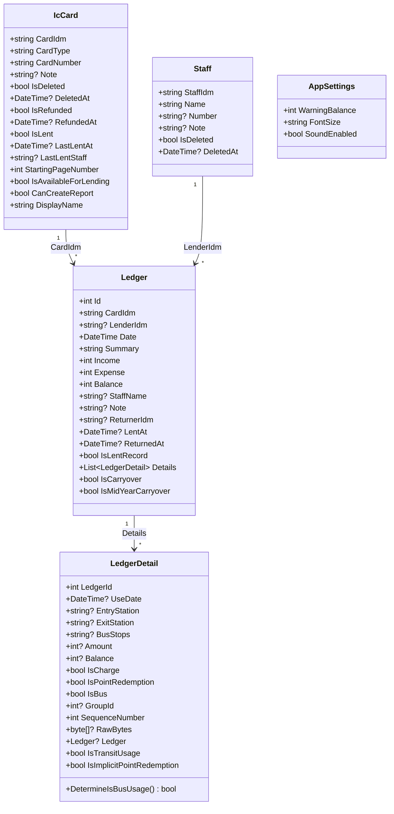
```mermaid
classDiagram
    %% Models
    class Staff {
        +string StaffIdm
        +string Name
        +string? Number
        +string? Note
        +bool IsDeleted
        +DateTime? DeletedAt
    }

    class IcCard {
        +string CardIdm
        +string CardType
        +string CardNumber
        +string? Note
        +bool IsDeleted
        +DateTime? DeletedAt
        +bool IsRefunded
        +DateTime? RefundedAt
        +bool IsLent
        +DateTime? LastLentAt
        +string? LastLentStaff
        +int StartingPageNumber
        +bool IsAvailableForLending
        +bool CanCreateReport
        +string DisplayName
    }

    class Ledger {
        +int Id
        +string CardIdm
        +string? LenderIdm
        +DateTime Date
        +string Summary
        +int Income
        +int Expense
        +int Balance
        +string? StaffName
        +string? Note
        +string? ReturnerIdm
        +DateTime? LentAt
        +DateTime? ReturnedAt
        +bool IsLentRecord
        +List~LedgerDetail~ Details
        +bool IsCarryover
        +bool IsMidYearCarryover
    }

    class LedgerDetail {
        +int LedgerId
        +DateTime? UseDate
        +string? EntryStation
        +string? ExitStation
        +string? BusStops
        +int? Amount
        +int? Balance
        +bool IsCharge
        +bool IsPointRedemption
        +bool IsBus
        +int? GroupId
        +int SequenceNumber
        +byte[]? RawBytes
        +Ledger? Ledger
        +DetermineIsBusUsage() bool
        +bool IsTransitUsage
        +bool IsImplicitPointRedemption
    }

    class AppSettings {
        +int WarningBalance
        +string FontSize
        +bool SoundEnabled
    }

    %% Relationships
    Ledger "1" --> "*" LedgerDetail : Details
    IcCard "1" --> "*" Ledger : CardIdm
    Staff "1" --> "*" Ledger : LenderIdm
```

> **`LedgerDetail.SequenceNumber` の順序規約（Issue #1822）**: DB の rowid から取得する値で、**小さい値ほど新しい（＝後に利用した）**。交通系ICカードの利用履歴サービスが新しい順（block 0 ＝ 最新）で返す並びをそのまま rowid へ写すためで（`FelicaCardReader.ReadHistoryAsync`）、`LendingService` は挿入時に時系列順（古い順）の並びを `Reverse()` してこの順序を維持している。したがって「最新の明細」は**最小**の `SequenceNumber` であり、時系列（古い順）へ並べ替えるには降順ソートが要る（`SummaryGenerator.SortChronologically`）。
>
> **例外**: 残高不足マージ（Issue #978。`LendingService.CreateUsageLedgersAsync`）で作られる台帳は、チャージ明細を先に挿入するため利用明細の側が大きい値になる。この台帳の残高は明細の並びからではなく `Ledger.Balance`（利用後の実残高）から決まるため実害はない。
>
> `LedgerMergeService.MergeAsync` の残高選択は「最大 `SequenceNumber` ＝ 最新」を前提としており本規約と食い違う。挙動を伴う整理は #1822 のスコープ外として別途扱う。

---

## 2. レイヤー構成図


```mermaid
graph TB
    subgraph "Presentation Layer"
        VIEW[Views/XAML]
        VM[ViewModels]
    end

    subgraph "Business Logic Layer"
        SVC_LEND[LendingService]
        SVC_REPORT[ReportService]
        SVC_BACKUP[BackupService]
        SVC_SUMMARY[SummaryGenerator]
        SVC_OPLOG[OperationLogger]
        SVC_CSVEXP[CsvExportService]
        SVC_CSVIMP[CsvImportService]
        SVC_PRINT[PrintService]
        SVC_SANITIZE[InputSanitizer]
        SVC_STATION[StationMasterService]
        SVC_TEMPLATE[TemplateResolver]
        SVC_TOAST[ToastNotificationService]
        SVC_DEBUG[DebugDataService]
        SVC_MERGE[LedgerMergeService]
        SVC_SPLIT[LedgerSplitService]
        SVC_CONSIST[LedgerConsistencyChecker]
        SVC_ORDER[LedgerOrderHelper]
        SVC_REPORT_BUILD[ReportDataBuilder]
        SVC_OPLOGEXCEL[OperationLogExcelExportService]
        SVC_VALID[ValidationService]
        SVC_CARDLOCK[CardLockManager]
        SVC_STAFFAUTH[IStaffAuthService]
        SVC_DIALOG[IDialogService]
    end

    subgraph "Data Access Layer"
        REPO_STAFF[IStaffRepository]
        REPO_CARD[ICardRepository]
        REPO_LEDGER[ILedgerRepository]
        REPO_SETTINGS[ISettingsRepository]
        REPO_OPLOG[IOperationLogRepository]
        DBCTX[DbContext]
    end

    subgraph "Infrastructure Layer"
        READER[ICardReader]
        SOUND[ISoundPlayer]
        CACHE[ICacheService]
        FILELOG[FileLoggerProvider]
    end

    subgraph "External"
        DB[(SQLite)]
        PASORI[PaSoRi]
        SPEAKER[スピーカー]
    end

    VIEW --> VM
    VM --> SVC_LEND
    VM --> SVC_REPORT
    SVC_LEND --> REPO_STAFF
    SVC_LEND --> REPO_CARD
    SVC_LEND --> REPO_LEDGER
    SVC_LEND --> SVC_SUMMARY
    SVC_REPORT --> REPO_LEDGER
    SVC_REPORT --> REPO_CARD

    REPO_STAFF --> DBCTX
    REPO_CARD --> DBCTX
    REPO_LEDGER --> DBCTX
    REPO_SETTINGS --> DBCTX
    REPO_OPLOG --> DBCTX
    DBCTX --> DB

    VM --> READER
    VM --> SOUND
    READER --> PASORI
    SOUND --> SPEAKER
```

---

## 2a. 交通系固有ロジックの境界（Issue #1695）

### 2a.1 なぜこの節があるか

本システムのコア（タッチ認証 → 貸出/返却 → 出納簿）は、「複数職員でシェアする物品の出納管理」として交通系ICカード以外（社用携帯・鍵・公用車両等）にも通用する構造を持つ。

**現時点で汎用化する予定はない。** ただし交通系固有の知識がコアへ静かに染み出すと、将来その選択肢を取り戻すのに大規模改修が必要になる。この節は「どこまでが交通系固有か」を記述して、改修時の判断材料を残すためにある。

前節（§2 レイヤー構成図）が Presentation / Business / Data / Infrastructure の**横方向の層**を示すのに対し、本節の境界はそれと**直交する縦串**である。交通系固有性は特定の層に集まっておらず、`Infrastructure`（FeliCa 読取）・`Services`（摘要生成）・`Models`（乗車駅・降車駅）の 3 層すべてに分散している。

改修時の判断基準は `.claude/rules/domain-boundaries.md` を参照。

### 2a.2 3 リング境界モデル

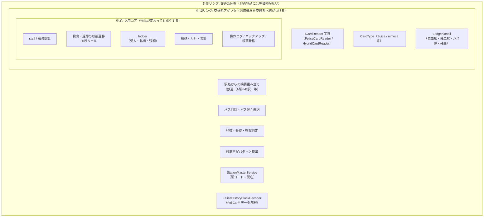
```mermaid
graph TB
    subgraph RING3["外側リング: 交通系固有（他の物品には等価物がない）"]
        SUM_RAIL["駅名からの摘要組み立て<br/>（鉄道（A駅～B駅）等）"]
        SUM_BUS["バス判別・バス混在表記"]
        SUM_TRIP["往復・乗継・循環判定"]
        SUM_SHORT["残高不足パターン検出"]
        STATION["StationMasterService<br/>（駅コード→駅名）"]
        DECODER["FelicaHistoryBlockDecoder<br/>（FeliCa 生データ解釈）"]

        subgraph RING2["中間リング: 交通系アダプタ（汎用概念を交通系へ結びつける）"]
            READER_IMPL["ICardReader 実装<br/>（FelicaCardReader / HybridCardReader）"]
            CARDTYPE["CardType（Suica / nimoca 等）"]
            DETAIL["LedgerDetail<br/>（乗車駅・降車駅・バス停・残高）"]

            subgraph RING1["中心: 汎用コア（物品が変わっても成立する）"]
                CORE_STAFF["staff / 職員認証"]
                CORE_LEND["貸出・返却の状態遷移<br/>30秒ルール"]
                CORE_LEDGER["ledger<br/>（受入・払出・残額）"]
                CORE_AGG["繰越・月計・累計"]
                CORE_MISC["操作ログ / バックアップ / 帳票骨格"]
            end
        end
    end
```

| リング | 定義 | 横展開時の扱い |
|--------|------|----------------|
| **中心（汎用コア）** | 「シェア物品の出納管理」として、交通系ICカードでなくても意味が通る概念 | そのまま流用 |
| **中間（交通系アダプタ）** | 汎用概念を交通系ICカードという具体物へ結びつけている層。名前と型は固有だが、構造は汎用 | 対象物品に合わせて読み替え・差替 |
| **外側（交通系固有）** | 交通系ICカードにしか存在しない概念 | 不要化、または対象物品固有の実装へ置換 |

**唯一のルール: 内側のリングに、外側リングの知識を持ち込まない。**

汎用コアのコード（`LendingService` の状態遷移、`ledger` の集計、帳票骨格）に「駅」「バス」「チャージ」といった交通系語彙の**分岐**を新設しない。必要なら外側リングに置き、コアからは抽象的な値（摘要文字列・金額）としてだけ受け取る。

### 2a.3 境界はクラス境界ではなくメソッド境界を通る（`SummaryGenerator`）

`SummaryGenerator` は 1 クラスの中に 2 種類の責務を同居させており、**クラス単位で固有/汎用を分類する素朴なモデルはここで破綻する**。

| 種別 | メソッド例 |
|------|-----------|
| 汎用（物品出納簿の様式そのもの） | `GetLendingSummary`（貸出中）/ 繰越各種（`GetCarryoverFromPreviousYearSummary` / `IsMidYearCarryoverSummary` / `GetMidYearCarryoverLikePattern`〔SQL 用 LIKE パターン導出、Issue #1749〕等）/ `GetMonthlySummary`（月計）/ `GetCumulativeSummary`（累計）/ `GetChargeSummary` / `GetRefundSummary` |
| 交通系固有 | 駅名からの摘要組み立て / バス混在表記（`BusLabel` / `BusPlaceholder` / `FormatBusSummary` / `GetBusStopExtractionPattern` / `TryExtractBusStops` / `ContainsBusLabel` / `HasIncompleteBusStop` / `IsBusStopPlaceholder`〔いずれも Issue #1818〕）/ 往復・乗継・循環判定 / `GetInsufficientBalanceNote`（残高不足） |

このため `SummaryGenerator` 全体への参照制限は規約テストで**かけていない**（§2a.5）。汎用メソッドは 22 ファイルから正当に使われている。

### 2a.4 seam カタログ（横展開時の拡張点）

「もし横展開するなら差し替えることになる接続点」と、その現在の抽象度。**差替コスト「高」の項目を新設しないこと**が改修時の判断基準になる。

| # | 拡張点 | 現在の実装 | 抽象度 | 差替コスト | 備考 |
|---|--------|-----------|--------|-----------|------|
| 1 | 物品の識別手段 | `FelicaCardReader` / `HybridCardReader` / `MockCardReader` | `ICardReader` で抽象済み | **低** | `CardReadEventArgs.Idm` は `string`。バーコード・QR・手動入力を別実装として DI 差替可能 |
| 2 | 利用履歴の読取 | `FelicaHistoryBlockDecoder` | `Infrastructure/CardReader` 内に閉じている | **低** | 物品によっては履歴読取自体が不要（手入力運用）。`ICardReader.TryReadHistoryAsync` が空リストを返せば成立する |
| 3 | 駅コード→駅名解決 | `StationMasterService`（CSV マスター） | `IStationMasterService` あり、参照元は `FelicaCardReader` と DI 登録の 2 箇所のみ | **低** | 交通系以外では不要化。DI 登録を外すだけで済む形を保つ |
| 4 | 摘要文字列生成 | `SummaryGenerator`（static クラス） | インターフェースなし・22 ファイルから直接呼び出し | **中** | 汎用メソッドと固有メソッドが同居（§2a.3）。横展開時は固有メソッド群のみ抽出する。`Data/` からの参照は汎用の繰越 LIKE パターン導出（`GetMidYearCarryoverLikePattern`、Issue #1749）のみ許可（§2a.5）。バスのラベル・未入力プレースホルダ（Issue #1818）は交通系固有のため `Data/` からは参照させず、`GetBusStopSuggestionsAsync(string busStopPlaceholder)` のように**値を引数で受け取る**形にしている |
| 5 | 利用内訳の項目 | `LedgerDetail`（`EntryStation` / `ExitStation` / `BusStops` / `IsBus`） | 固有列がモデルに直接生えている | **中** | 列名は交通系語彙だが構造は「1 回の利用の内訳」。物品に応じた読み替えで対応可能 |
| 6 | 物品マスター | `ic_card` テーブル / `IcCard` モデル | 交通系固有列は `card_type` のみ | **低** | 他の列（`is_lent` / `last_lent_at` / 繰越累計）はすべて汎用。`card_type` は物品種別として読み替え可能 |
| 7 | 残高の概念 | `ledger.balance` / `LedgerDetail.Balance` | 汎用（物品出納簿の「残額」） | **低** | 交通系固有ではない。鍵・車両なら残数、備品なら在庫数として同じ様式が成立する |

差替コストの読み方:

- **低** = インターフェースがあり参照元が限定されている。DI 登録の差替、または削除で済む
- **中** = 抽象化されていないか参照元が多い。まとまった作業になるが、コアの構造変更は不要
- **高** = コアの構造変更を伴う。**現時点では該当なし。この状態を維持することが Issue #1695 の目的**

### 2a.5 規約テストで固定している境界

`DomainBoundaryConventionTests` が以下をソースの静的検査で固定する（いずれも現状 green）。

| # | 検査内容 | 意図 |
|---|----------|------|
| 1 | `FelicaHistoryBlockDecoder` の参照元が `Infrastructure/CardReader/` 配下のみ | FeliCa 生データの解釈が上位層へ漏れない |
| 2 | `IStationMasterService` / `StationMasterService` の参照元が `Infrastructure/CardReader/` と DI 登録（`App.xaml.cs`）のみ | 駅名解決が「読取直後の変換」に留まり、`Services` / `ViewModels` は駅名を文字列としてのみ扱う |
| 3 | `Data/` 配下に交通系固有の**判断ロジック**（`SummaryGenerator` / `StationMasterService` / `FelicaHistoryBlockDecoder` / `DetermineIsBusUsage`）への実コード参照がない。ただし汎用メソッドの完全修飾呼び出し `SummaryGenerator.GetMidYearCarryoverLikePattern(`〔繰越 LIKE パターン導出、Issue #1749〕のみ許可 | 永続化層に交通系知識が入らない |
| 4 | 上記 3 件の走査が実際に本番ソースを covering していること（走査件数と、検査対象記号が境界内に実在すること） | パス解決が壊れると 3 件すべてが無条件 green になるため（`.claude/rules/testing.md`「通るが目的を果たさないテスト」） |

##### バスのラベル・プレースホルダを `Data/` から参照させない理由（Issue #1818）

`SummaryText.BusLabel`（既定「バス」）/ `BusPlaceholder`（既定「★」）は、生成側だけが設定値を使い、
判定・抽出側が「バス（…）」「★」を直書きしていた（Issue #1604 / #1749 と同型の乖離）。
是正では `SummaryGenerator` に導出ヘルパーを置き 15 箇所を委譲したが、
**`LedgerRepository.GetBusStopSuggestionsAsync` の SQL（`bus_stops != '★'`）だけは扱いを分けた**。

繰越 LIKE パターン（#1749）は§2a.3 の**汎用**群に属するため `Data/` からの参照を許可できたが、
バスのラベル・プレースホルダは**交通系固有**であり、同じ許可リストに載せると境界の意図が崩れる。
そこでリポジトリは判断を持たず、除外する文字列を引数で受け取る
（`GetBusStopSuggestionsAsync(string busStopPlaceholder)`。呼び出し元の `BusStopInputViewModel` が
`SummaryGenerator.BusPlaceholder` を渡す）。§2a.2 の決定木「汎用コアからは抽象的な値としてだけ受け取る」に従う形。

直書きの再発は `BusTextLiteralConventionTests` がリポジトリ全体のソーステキストで検出する
（直書きが許されるのは既定値を宣言する `OrganizationOptions.cs` と、そこから全体を導出する
`SummaryGenerator.cs` の 2 ファイルのみ）。

#### 検査対象に含めないもの（重要）

**`EntryStation` / `ExitStation` / `BusStops` / `IsBus` は #3 の禁止語に含めない。** `LedgerRepository` がこれらを DB 列へマッピングするのは永続化の正当な責務であり、境界違反ではない。禁止するのは「データの**形**」ではなく「データの**解釈**」——摘要生成・駅名解決・バス判別といった判断ロジックが `Data/` に入ること。

#### 汎用メソッドの完全修飾呼び出しは #3 の例外（Issue #1749）

繰越除外の SQL（`'%月から繰越'`）が組織設定 `MidYearCarryoverFormat` に追従しない乖離（Issue #1749）を塞ぐため、`LedgerRepository` は `SummaryGenerator.GetMidYearCarryoverLikePattern()` をパラメータバインドで参照する。繰越判定は交通系固有の「データの解釈」ではなく**物品出納簿の様式に属する汎用ロジック**（§2a.3 の汎用群）であり、境界の意図（交通系知識の染み出し防止）には反しない。ただし記号一致では汎用/固有メソッドを区別できないため、規約テストは**完全修飾の呼び出し形**（`GenericSummaryGeneratorCallsAllowedInDataLayer`、開き括弧まで）に限定して許可し、許可ロジック自体をサンプル入力で固定している（同一行に固有メソッドが同居した場合・許可メソッド名を前方に含む別メソッドは従来どおり検出される）。

#### コメントは検査対象外

検査は実コードのみを対象とし、`//` / `///` / `/* */` のコメントは除去してから照合する。`LedgerRepository.cs` には「`SummaryGenerator.GetMidYearCarryoverSummary` の生成結果で検証している」という**規約の理由を説明したコメント**があり、単純な文字列一致ではこれを違反として誤検出するため（`.claude/rules/development-conventions.md` の「禁止された要素の不在を検査するときは要素タグで照合する」と同じ配慮）。

意図的に境界を変更する場合は、本節の seam カタログを更新したうえでテストを修正する。テストは禁止ではなく**気づきの装置**として置いている。

---

## 3. 主要クラスの責務

### 3.1 Models（エンティティ）

| クラス | 責務 | 対応テーブル |
|--------|------|--------------|
| Staff | 職員情報を保持 | staff |
| IcCard | 交通系ICカード情報を保持。貸出可否判定・帳票作成可否判定・表示名生成のドメインロジックを含む | ic_card |
| Ledger | 利用履歴概要を保持。繰越レコード判定のドメインロジックを含む | ledger |
| LedgerDetail | 利用履歴詳細を保持。バス利用判定・鉄道利用判���・暗黙ポイント還元判定のドメインロジックを含む | ledger_detail |
| OperationLog | 操作ログを保持 | operation_log |
| AppSettings | アプリケーション設定を保持 | settings |
| OrganizationOptions | 組織固有の設定値を保持（appsettings.json） | - |
| DatabaseOptions | DB接続先パスを保持（appsettings.json） | - |

#### Value Objects（Common/ValueObjects/）

自身のプロパティだけで完結する不変の値を型安全に表現する `readonly struct` 群。

| 構造体 | 責務 |
|--------|------|
| CardIdm | 交通系ICカードIDm（16進数16文字、大文字正規化、`implicit operator string`） |
| StaffIdm | 職員証IDm（16進数16文字、大文字正規化、CardIdmとは型レベルで区別） |
| FiscalYear | 日本の会計年度（4月始まり）。`FiscalYearHelper` の後継。開始日・終了日・包含判定・前月取得・比較演算子。両者の棲み分けは [§5.8b](#58b-fiscalyearhelper-と-fiscalyear-valueobject-の棲み分けissue-1246) を参照 |
| Money | 非負の金額（円）。加算・比較演算子、`implicit operator int`） |

### 3.2 ViewModels

| クラス | 責務 |
|--------|------|
| ViewModelBase | ViewModelの基底クラス（IsBusy, BusyMessage）。`BeginBusy` / `BeginCancellableBusy` が処理中スコープを作り、`SuspendBusy` がその**一時中断**を作る（Issue #1793。スコープ内からモーダルダイアログを表示する箇所で使う。`SetBusy(false)` は `CancellationTokenSource` を Dispose するため代用不可。詳細は 03_画面設計書 §3.10） |
| MainViewModel | メイン画面のロジック、状態管理。**DB を読む起動時チェックは `RunStartupDataChecksAsync` の1本へ直列にまとめる**（Issue #1758）。`DbContext` は接続を1本しか持たず `LeaseConnectionAsync` はセマフォを取らないため、各チェックを個別に `_ =` で捨てると `Task.WhenAll` を書かなくても継続どうしが同一接続上で並走する（Issue #1452 / #1737）。各呼び出しは個別に catch し「前段が落ちても後段は動く」性質を保存する |
| StaffManageViewModel | 職員管理ダイアログのロジック |
| CardManageViewModel | カード管理ダイアログのロジック |
| SettingsViewModel | 設定ダイアログのロジック |
| ReportViewModel | 帳票作成ダイアログのロジック |
| SystemManageViewModel | システム管理（バックアップ・リストア）のロジック |
| PrintPreviewViewModel | 印刷プレビュー画面のズーム・ナビゲーション制御 |
| LedgerDetailViewModel | 利用履歴詳細表示・グループ操作のロジック |
| LedgerRowEditViewModel | 履歴行の追加・編集ダイアログのロジック |
| BusStopInputViewModel | バス停名入力画面のロジック |
| IncompleteBusStopViewModel | バス停未入力一覧ダイアログのロジック |
| VirtualCardViewModel | 仮想交通系ICカードタッチシミュレーター（DEBUG専用） |
| DataExportImportViewModel | データCSVエクスポート・インポートのロジック |
| OperationLogSearchViewModel | 操作ログ検索・表示のロジック |
| ReportPreflightViewModel | 帳票事前チェック結果ダイアログのロジック。確認モード（作成フロー経由。続行/中止を選ばせる）と参照モード（「事前チェック」ボタン経由。表示専用）の2モードを持つ（Issue #1688） |
| ConnectionDiagnosticsViewModel | 接続診断ダイアログのロジック（Issue #1690）。判定と文言は `IConnectionDiagnosticsService` 側にあり、本 ViewModel は「実行 → 表示 → コピー」の導線のみを持つ。対処が必要な項目を初期選択して詳細を即座に見せる |
| AdminDashboardViewModel | 管理者ダッシュボードのロジック（Issue #1692）。集計は `IAdminDashboardService` 側にあり、本 ViewModel は「読み込み → 絞り込み → グラフ座標の生成 → Excel 出力」の導線を持つ。利用分析は分析タブを最初に開いたときに遅延ロードする（台帳は 6 年分あり、開いた瞬間に全期間を集計すると初回表示が重い）。グラフのプロット領域は**固定ピクセルの定数**とし `ScrollViewer` で包む（実描画サイズに追随させると ViewModel が `ActualWidth` を知る必要が生じ、UI を起動しないと検証できなくなる） |
| CarryoverDataLossViewModel | 繰越情報消失一覧ダイアログのロジック（Issue #1758）。検出は `ICarryoverDataLossDetector` 側にあり、本 ViewModel は表示用の整形のみを行う。**消失していない項目は `NotLostText`（「（消失なし）」）を表示**する（空欄だと「値が 0 だった」とも読め、復旧作業で現在の正しい値を上書きさせてしまう）。対象年度は `carryover_fiscal_year` 列の生値（西暦）で示す（復旧はこの値を DB へ書き戻す作業のため、和暦変換は依頼先に戻し算を強いる）。**一覧が空になる理由を `EmptyStateMessage` で書き分ける**（`NoLossMessage`＝被害なし／`DetectionFailedMessage`＝確認できなかった）。同じ文言にすると、DB 接続断で確認できなかっただけの利用者に「うちは無事だ」と誤って結論させる。表示条件（`HasItems`）と文言を分離したのは、View 側を単一の `DataTrigger` のまま保つため（`MultiDataTrigger` を避ける）。検出失敗時は文言を切り替えたうえで**例外をそのまま伝える**（エラー通知はダイアログの責務）、成功時は文言を戻す（戻さないと復旧後に「まだ確認できていない」と誤解させる） |

### 3.3 Services

| クラス | 責務 |
|--------|------|
| LendingService | 貸出・返却処理、30秒ルール管理 |
| ReportService | 月次帳票の作成（Excel出力） |
| IReportFileNameFactory / ReportFileNameFactory | 帳票の年度ファイル名の生成（組織設定 `ReportLayout.FileNameFormat` の唯一の消費点、Issue #1820。§5.11b） |
| BackupService | データベースのバックアップ（SQLite Backup API使用。共有モード時も安全に実行可能）。UI スレッドから呼ぶ場合は `CreateBackupAsync` / `RestoreFromBackupAsync` を使用すること（sync 版 `CreateBackup` は `DbContext.LeaseConnection()` の、sync 版 `RestoreFromBackup` は `DbContext.SuspendConnections()` の UI スレッドガード (Issue #1281) に抵触する。Issue #1361 / #1809）。保存先の解決は `ResolveBackupFolderAsync()` に一本化し、成功時は `last_backup_success_at` / `last_backup_machine` を settings に記録する（Issue #1689）。パス検証は必ず非同期版 `PathValidator.ValidateBackupPathAsync` を使う（Issue #1746。直前の `GetAppSettingsAsync` がキャッシュヒット時に同期完了するため、同期版だと UNC 到達性チェック（最大5秒）が UI スレッドをブロックする）。書き込みは**一時ファイル（`.tmp`）へ書き切ってから最終名へリネーム**する（Issue #1748。最終名へ直接書くと、コピー途中で失敗した「マジックヘッダだけ揃った切り詰めファイル」が有効な世代として残り、世代数を消費し、リストアで本番 DB を上書きし得る）。世代の列挙は `EnumerateBackupFiles` に集約し、一覧表示と世代削除が同じ母集団を見ることを構造的に保証する（→ `04_機能設計書.md` §17.3a）。**保持の単位は日数**で、自動バックアップは「バックアップのある日を新しい順に30日分・各日は最新1世代」、手動／リストア前バックアップは日単位の間引きの対象外で最新10件を保持する。判定は純関数 `SelectBackupsToDelete` に切り出す（Issue #1813。ファイル数で上限を決めると、共有モード20台運用で実効保持期間が約1.5日に縮む → `04_機能設計書.md` §17.3b） |
| IBackupHealthService / BackupHealthService | バックアップ健全性（最終成功日時・世代数・保存先・空き容量・VACUUM実施PC）の集約と、VACUUM実施PC名の記録（Issue #1689）。`BackupService` に一方向で依存し、`BackupHealthInfo` を返す。個々の取得は独立して失敗し得るため、1項目の失敗で全体を例外にせず該当項目を null / 0 とする |
| StartupTaskRunner | 起動時タスク（自動バックアップ → 6年経過データ削除 → 月次 VACUUM）の実行（Issue #1737）。**各タスクは必ず直列 await する**（→ §5.5c）。`App.PerformStartupTasksAsync` から呼ばれ、個々の失敗で起動を止めない（catch して Error ログのみ）。VACUUM の実施判定日は引数 `today` で受け取り、月次 CAS ロック（Issue #1482）の分岐を単体テストで検証できるようにしている |
| SummaryGenerator | 摘要文字列の生成 |
| LedgerDetailChronologicalSorter | 利用詳細の時系列ソート・残高再計算 |
| OperationLogger | 操作ログの記録 |
| OperationLogDisplayNames | 操作ログの操作種別・対象テーブル表示名の Single Source of Truth（静的クラス、`OperationLogger.cs` 内で `Actions` / `Tables` 定数に隣接。画面の一覧・絞り込みコンボ・詳細サマリーと Excel 出力がすべてここへ委譲する。Issue #1787） |
| CsvExportService | CSV形式でのデータエクスポート |
| CsvImportService | CSV形式でのデータインポート（partial classで責務分割: Card/Staff/Ledger/Detail） |
| PrintService | 帳票の印刷・FlowDocument生成 |
| InputSanitizer | 入力値のサニタイズ処理（静的クラス） |
| StationMasterService | 駅コードから駅名への解決（シングルトン） |
| TemplateResolver | Excelテンプレートのパス解決（静的クラス） |
| ToastNotificationService | トースト通知の表示 |
| DebugDataService | テストデータの管理（DEBUGビルド専用） |
| LedgerMergeService | 複数Ledgerレコードの統合・取り消し（Issue #548） |
| CardLockManager | カードアクセスの排他制御（シングルトン） |
| IStaffAuthService / StaffAuthService | 職員証による操作者認証。成功時に ICurrentOperatorContext を更新（Issue #1265） |
| ICurrentOperatorContext / CurrentOperatorContext | 認証済み操作者のセッション情報保持（Issue #1265、監査ログなりすまし防止） |
| IDialogService / DialogService | ダイアログ表示の抽象化（テスタビリティ向上） |
| ReportDataBuilder | 月次帳票の共通データ準備（Excel/印刷で共有） |
| LedgerSplitService | 複数明細を含むLedgerレコードの分割（Issue #634） |
| LedgerConsistencyChecker | 残高チェーンの整合性検証（Issue #635） |
| ReportPreflightChecker | 帳票出力前のプリフライトチェック。`ReportDataBuilder` が返す `MonthlyReportData`（帳票の描画元）を検証し、未返却カード・負残高・繰越不一致・「受入 − 払出 = 残額」の不成立を検出する。`LedgerConsistencyChecker` が構造上カバーしない「繰越行と月の先頭行の接続」「合計行の検算」を補完する（Issue #1688、04_機能設計書 §10a） |
| IReportExportStatusService / ReportExportStatusService | 帳票の出力済み / 未出力の判定。出力先フォルダの年度ファイルに対象月のシートがあるかで判定する（DB に出力履歴を持たないため、表示が常に手元のファイルと一致する）。ファイル名は `IReportFileNameFactory`（組織設定 `ReportLayout.FileNameFormat` に追従、Issue #1820）、シート名は `ReportService.GetMonthSheetName` から取得し、命名規則の乖離を防ぐ（Issue #1691、04_機能設計書 §10b） |
| LedgerOrderHelper | 残高チェーンに基づくLedger順序の復元（Issue #784）。同一日の利用系レコードは時刻がすべて 00:00:00 で保存されるため id 順が時系列と一致しない場合がある。表示側（履歴グリッド・帳票）に加え、`LedgerRepository` の「最新残高」系単票クエリ（Issue #1731）と管理者ダッシュボードの残高推移グラフ用集計（Issue #1770）からも同一日内の最終レコード確定に使われる。リポジトリ側の呼び出しは private ヘルパー `ResolveChainFinalLedgerAsync` に集約されており、チェーン開始点のシード母集団に貸出中レコードを含めるかは引数で呼び出し元が明示する（単票クエリ＝含める／グラフ用集計＝含めない。**本体クエリと母集団を揃える**）。Data 層 → Services 層の参照だが、Models のみに依存する純粋関数のため許容。3 リング上はどちらも汎用コアで境界違反ではない |
| ISafeFileLauncher / SafeFileLauncher | `Process.Start(UseShellExecute=true)` で開くフォルダ／ファイルのパス検証を一元化。フォルダは `explorer.exe` を `UseShellExecute=false` で直接起動、ファイルは拡張子ホワイトリスト（`.xlsx` / `.csv`）通過後のみ起動。設定ファイル書換による任意 `.exe` 実行を defense-in-depth で防止（Issue #1465） |
| OperationLogExcelExportService | 操作ログのExcel出力 |
| ValidationService | 入力値のバリデーション（IDm, カード番号, 氏名等） |
| IDatabaseInfo | DB接続情報の読み取り専用インターフェース（DbContextが実装） |
| SharedModeMonitor | 共有モードでのDB接続監視・同期表示管理。`ExecuteHealthCheckAsync` は `.ConfigureAwait(false)` を使用するため `HealthCheckCompleted` / `SyncDisplayUpdated` イベントは **thread pool スレッドから発火される**。購読側 ViewModel は UI バインド `ObservableCollection` を更新する前に `IDispatcherService` で UI スレッドへマーシャリングすること（Issue #1359、`MainViewModel.OnSharedModeHealthCheckCompleted` が参考実装） |
| WarningService | データ系の警告チェック（残額警告・バス停未入力・ジャーナルモード・新バージョン公開通知 `CheckUpdateNotificationWarning`（Issue #1687）・バックアップ健全性 `CheckBackupHealthWarningAsync`（Issue #1689）・繰越情報消失 `CheckCarryoverDataLossWarningAsync`（Issue #1758）） |
| ICarryoverDataLossDetector / CarryoverDataLossDetector | 繰越情報（開始ページ番号・繰越累計）の消失検出（Issue #1758、04_機能設計書 §7.5）。**汎用コアに属する**（駅・バス・チャージで分岐しない）。検出対象の4項目はいずれも既定値を取り得るため現在値だけでは判定できず、`operation_log` の `BeforeData` / `AfterData` を突き合わせて「非既定値 → 既定値へ落ちた瞬間」を証拠とする。**「現在も既定値のままか」を判定に含める**（消失ログは6年残るため、これが無いと復旧後も警告が消えない）。同一カードが複数回編集された場合は**最古**の消失ログの Before 値を採る（2回目以降の Before は既に既定値のため） |
| DashboardService | **メイン画面内の**カード残高ダッシュボードのデータ構築・ソート。F8 の管理者ダッシュボード（`AdminDashboardService`）とは別物 |
| IAdminDashboardService / AdminDashboardService | 管理者ダッシュボード（Issue #1692、04_機能設計書 §20）の集計。運用状況（貸出中・長期未返却・残額不足・当月帳票未出力）と利用分析（稼働状況・職員別の月次利用額・カード別の残高推移）を構築する。UI に依存せずしきい値を引数で受け取るため、将来 `WarningService` からも再利用できる。リポジトリ呼び出しは直列 `await`（Issue #1452）、帳票の出力状況判定はファイル走査の同期処理のため `Task.Run` へオフロードする |
| AdminDashboardExcelExportService | 管理者ダッシュボードの集計結果を 5 シート（概要／運用状況／稼働状況／月別利用額／残高推移）の xlsx へ出力（Issue #1692）。作法は `OperationLogExcelExportService` に合わせる。帳票専用の `ExcelStyleFormatter` は流用しない（A〜L 列固定・セル結合ありの様式専用で、変更が帳票側へ波及するため） |
| IUpdateNotificationService / UpdateNotificationService | 共有フォルダの `latest_version.txt`（1行目に最新バージョン）を読み、自バージョンより新しければ更新案内を検出（`CheckForNewerVersion`）。ファイル無し・不正・I/Oエラーは通知なし（Issue #1687） |
| IConnectionDiagnosticsService / ConnectionDiagnosticsService | 接続診断（DB到達性・書込権限・ジャーナルモード・共有フォルダ接続・ICカードリーダー・バックアップ保存先・空き容量・バックアップ実施状況の8項目）を実行し `DiagnosticReport` を返す（Issue #1690、04_機能設計書 §19）。UI に依存せず判定と 3 要素文言をここに閉じる。項目ごとに例外を隔離し、1項目の失敗で診断全体が落ちないようにする。OS へ問い合わせる部分（`ProbeFolderWriteAccess` / `GetFreeSpaceBytes` / `ProbeDatabaseFileReachable`）は `protected virtual` の継ぎ目とし、権限不足・ディスク満杯・ネットワーク切断を単体テストから決定的に再現できるようにしている。到達性判定に `ProbeDatabaseFileReachable` を併用するのは、`CheckConnection()` が SQLite のページキャッシュから応答され切断を検知できなかったため（04_機能設計書 §19.2）。上流の `DbContext.CheckConnection()` も Issue #1716 で同じ到達確認を持つようになったが、`IDatabaseInfo` は interface で他実装の保証がないため本プローブは defense-in-depth として残す |
| ISharedDbConnectionStateProvider | `SharedModeMonitor` の `CurrentConnectionState` のみを公開する読み取り専用窓口（Issue #1690）。接続診断がタイマー基盤ごと `SharedModeMonitor` に依存するのを避ける。実装は `SharedModeMonitor`（DI では同一インスタンスを両方の型で登録） |
| IClipboardService / WpfClipboardService | クリップボード書き込みの抽象化（Issue #1690）。`System.Windows.Clipboard` が STA を要求するため ViewModel から直接呼ばず、また他プロセスによるロックで失敗し得るため `TrySetText` が成否を返す |

### 3.4 Repositories

| インターフェース | 実装クラス | 責務 |
|------------------|------------|------|
| ILedgerQueryService | （LedgerRepositoryが実装） | 利用履歴の読み取り専用クエリ（期間検索、ページング、残高取得等）。「最新残高」系の単票クエリ（`GetLatestBeforeDateAsync` / `GetLatestLedgerAsync` / `GetCarryoverBalanceAsync` / `GetAllLatestBalancesAsync`）は同一日内を id 順ではなく残高チェーン（`LedgerOrderHelper`）で確定した最終レコードを返す（Issue #1731）。残高推移グラフ用の集計（`GetMonthEndBalancesByCardAsync` / `GetBalancesBeforeAsync`）も同じ方式で、SQL は「（カード × 月）／（カード）ごとの最終稼働日」を絞るところまでを担い、その日の行だけを C# 側でチェーン解決する（Issue #1770。台帳 6 年分の全件を読み出さない #1692 の設計判断を維持）。全期間の最終利用日は `GetAllLastUsageDatesAsync`（貸出中・新規購入・繰越を除外、Issue #1747）が担い、`GetAllLatestBalancesAsync` の「最新レコード日」とは用途で使い分ける（04_機能設計書 §20.3） |
| ILedgerMergeRepository | （LedgerRepositoryが実装） | 利用履歴の統合・分割操作 |
| IStaffRepository | StaffRepository | 職員データのCRUD |
| ICardRepository | CardRepository | 交通系ICカードデータのCRUD |
| ILedgerRepository | LedgerRepository | 利用履歴のCRUD |
| ISettingsRepository | SettingsRepository | 設定データのCRUD |
| IOperationLogRepository | OperationLogRepository | 操作ログのCRUD |

#### DbContext と接続リース系クラス

| クラス | 責務 |
|--------|------|
| DbContext | SQLite 接続の生成・健全性チェック・マイグレーション実行・トランザクション開始 |
| ConnectionLease | `using` 文で接続を借用し、`Dispose` 時にセマフォを解放するラッパ（→ §5.5b） |
| TransactionScope | `ConnectionLease` と `SQLiteTransaction` を束ね、`Dispose` 時にトランザクション→リースの順で解放。`Commit` / `Rollback` 未呼出しの場合は自動ロールバック（→ §5.5b） |
| ConnectionSuspensionScope | リストア中など接続再オープンを禁止したい期間を RAII 的に表現（Issue #1166、→ §5.5b） |

### 3.5 Infrastructure

| インターフェース | 実装クラス | 責務 |
|------------------|------------|------|
| ICardReader | FelicaCardReader | PaSoRi + felicalib 経由での交通系ICカード読み取り（残高・履歴） |
| ICardReader | HybridCardReader | DEBUG専用。物理リーダーと仮想タッチ機能を統合 |
| ICardReader | MockCardReader | テスト用モックリーダー |
| ISoundPlayer | SoundPlayer | 音声フィードバックの再生 |

---

## 4. 依存関係図

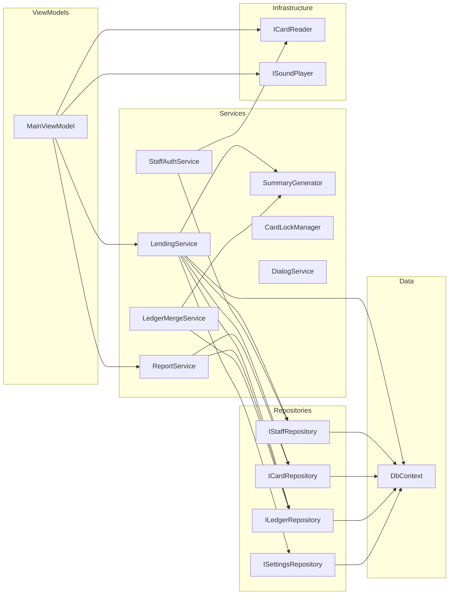
```mermaid
graph LR
    subgraph "ViewModels"
        MVM[MainViewModel]
    end

    subgraph "Services"
        LS[LendingService]
        RS[ReportService]
        SG[SummaryGenerator]
        LMS[LedgerMergeService]
        CLM[CardLockManager]
        SAS[StaffAuthService]
        DS[DialogService]
    end

    subgraph "Repositories"
        SR[IStaffRepository]
        CR[ICardRepository]
        LR[ILedgerRepository]
        STR[ISettingsRepository]
    end

    subgraph "Infrastructure"
        ICR[ICardReader]
        ISP[ISoundPlayer]
    end

    subgraph "Data"
        DBC[DbContext]
    end

    MVM --> LS
    MVM --> RS
    MVM --> ICR
    MVM --> ISP

    LS --> SR
    LS --> CR
    LS --> LR
    LS --> STR
    LS --> SG
    LS --> DBC

    RS --> CR
    RS --> LR

    LMS --> LR
    LMS --> SG
    SAS --> SR
    SAS --> ICR

    SR --> DBC
    CR --> DBC
    LR --> DBC
    STR --> DBC
```

---

## 5. クラス詳細

### 5.1 LendingService

`LendAsync` / `ReturnAsync` は Issue #1283 で責務ごとに internal ヘルパーへ分割され、orchestration 層として機能する（詳細は `tests/ICCardManager.Tests/Services/LendingServiceHelperTests.cs` および `07_テスト設計書.md §2.18 UT-017i`）。

> **例外はユーザー向け文言への変換前に LogError で記録する（Issue #1734）**: `LendAsync` / `ReturnAsync` の catch は `GetUserFriendlyErrorMessage`（#1110）でトースト向け文言を作るだけだったため、貸出・返却の失敗が本番ログに一切残らなかった（トーストは数秒で消え、周辺の LogDebug は既定の `Logging:LogLevel=Information` でファイルに出ない。SQLITE_BUSY/LOCKED 以外の例外は `DbContext.ExecuteWithRetryAsync` のリトライ警告にも掛からない）。catch の先頭で `_logger.LogError(ex, "…（CardIdm={CardIdm}）", IdmMasker.Mask(cardIdm))` を呼び、操作種別・マスク済み IDm・スタックトレースを残してから文言変換する（IDm マスクは履歴インポート失敗ログ（#1727）と同じ方式。回帰は UT-017a7）。

> **返却成功かつ台帳行ゼロを Information で残す（Issue #1819）**: `CreateUsageLedgersAsync` の「重複除外後、登録対象の履歴がありません」は `LogDebug` のため本番のログファイルに出ない。「返却したのに履歴が増えない」という問い合わせを切り分けられるよう、`ReturnAsync` は `result.Success = true` の直後に `CreatedLedgers.Count == 0` を判定し、**受け取った履歴件数・貸出後の抽出件数・重複チェック省略の有無**を Information 1 行へ集約する（IDm は既存ログと同じく `IdmMasker.Mask`）。台帳行が作られた通常の返却では出力しない（正常運用でのログ肥大化を防ぐ）。回帰は `LendingServiceReturnLoggingTests`。

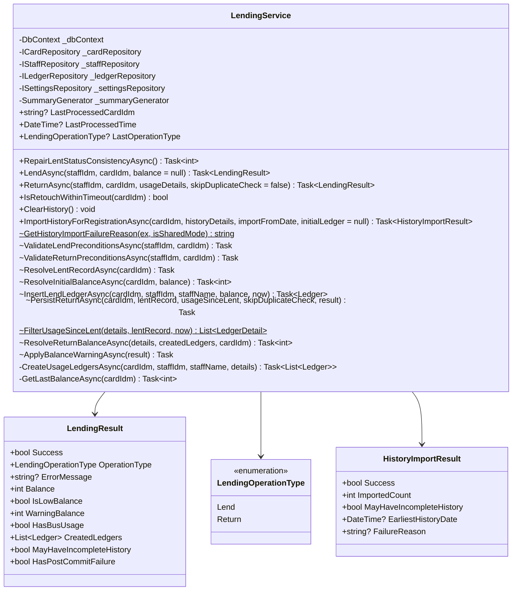
```mermaid
classDiagram
    class LendingService {
        -DbContext _dbContext
        -ICardRepository _cardRepository
        -IStaffRepository _staffRepository
        -ILedgerRepository _ledgerRepository
        -ISettingsRepository _settingsRepository
        -SummaryGenerator _summaryGenerator
        +string? LastProcessedCardIdm
        +DateTime? LastProcessedTime
        +LendingOperationType? LastOperationType
        +RepairLentStatusConsistencyAsync() Task~int~
        +LendAsync(staffIdm, cardIdm, balance = null) Task~LendingResult~
        +ReturnAsync(staffIdm, cardIdm, usageDetails, skipDuplicateCheck = false) Task~LendingResult~
        +IsRetouchWithinTimeout(cardIdm) bool
        +ClearHistory() void
        +ImportHistoryForRegistrationAsync(cardIdm, historyDetails, importFromDate, initialLedger = null) Task~HistoryImportResult~
        ~GetHistoryImportFailureReason(ex, isSharedMode)$ string
        ~ValidateLendPreconditionsAsync(staffIdm, cardIdm) Task
        ~ValidateReturnPreconditionsAsync(staffIdm, cardIdm) Task
        ~ResolveLentRecordAsync(cardIdm) Task
        ~ResolveInitialBalanceAsync(cardIdm, balance) Task~int~
        ~InsertLendLedgerAsync(cardIdm, staffIdm, staffName, balance, now) Task~Ledger~
        ~PersistReturnAsync(cardIdm, lentRecord, usageSinceLent, skipDuplicateCheck, result) Task
        ~FilterUsageSinceLent(details, lentRecord, now)$ List~LedgerDetail~
        ~ResolveReturnBalanceAsync(details, createdLedgers, cardIdm) Task~int~
        ~ApplyBalanceWarningAsync(result) Task
        -CreateUsageLedgersAsync(cardIdm, staffIdm, staffName, details) Task~List~Ledger~~
        -GetLastBalanceAsync(cardIdm) Task~int~
    }

    class LendingResult {
        +bool Success
        +LendingOperationType OperationType
        +string? ErrorMessage
        +int Balance
        +bool IsLowBalance
        +int WarningBalance
        +bool HasBusUsage
        +List~Ledger~ CreatedLedgers
        +bool MayHaveIncompleteHistory
        +bool HasPostCommitFailure
    }

    class LendingOperationType {
        <<enumeration>>
        Lend
        Return
    }

    class HistoryImportResult {
        +bool Success
        +int ImportedCount
        +bool MayHaveIncompleteHistory
        +DateTime? EarliestHistoryDate
        +string? FailureReason
    }

    LendingService --> LendingResult
    LendingService --> LendingOperationType
    LendingService --> HistoryImportResult
```

#### 5.1a カード登録時の台帳書き込みの原子性・失敗通知（Issue #1727 / #1763）

カード登録時、履歴が読み取れた場合の初期残高行は **カードの現残高ではなく、履歴最古エントリから逆算した「その取引の前の残高」**（`CardManageViewModel.CalculatePreHistoryBalance`）である。つまり初期残高行は「この後に履歴行が入る」ことを前提とした値であり、**単独では正しくない**。

そのため次の 3 点を守る。

| 守るべきこと | 実装 |
|-------------|------|
| 初期残高行と履歴行を同時に確定させる | `CardManageViewModel` は `BuildInitialLedgerAsync` で行を**組み立てるだけ**にして、`ImportHistoryForRegistrationAsync(..., initialLedger)` へ渡す。サービス側が 1 つの `BeginTransactionAsync` スコープで両方を INSERT する（リポジトリは同一接続を借りるため暗黙参加する） |
| 一過性の競合で落とさない | トランザクション全体を `DbContext.ExecuteWithRetryAsync` で包む（他の書込み経路と同じ扱い） |
| 失敗を呼び出し元へ届ける | `Success=false` に加えて `FailureReason`（「なぜ」のみ）を設定する。「何が」「どうすれば」は復旧手段を知っている ViewModel が組み立てる |

> **`FailureReason` が「なぜ」だけを持つ理由**: カード登録直後の履歴インポートは、失敗しても**同じ操作をやり直せない**（カード行は既に登録済み）。`LendingService.GetUserFriendlyErrorMessage`（Issue #1110）は「再度○○をお試しください」で終わるため行動指示として誤りになり、既定分岐が生の `Exception.Message` を含む点も Issue #1614 に反する。そこで専用の `GetHistoryImportFailureReason` を設け、行動指示（「履歴画面のCSVインポートで補完してください」）は ViewModel 側に置いた。

> **失敗理由は動作モードで書き分ける**: `GetHistoryImportFailureReason` は `DbContext.IsSharedMode` を受け取り、ローカルモードでは「他のPC」「ネットワーク共有フォルダー」に言及しない。単一 PC でも VACUUM・バックアップ・接続ヘルスチェックといった**自プロセス内の別接続**と競合して SQLITE_BUSY は起こり得るため、存在しない相手を原因として案内すると原因究明が止まる。「なぜ」が正確であることは 3 要素（`.claude/rules/error-messages.md`）の前提。

> **コミット確定後の後処理は成否から切り離す**: 完全性チェック（`CheckHistoryCompleteness` と最古日付の算出）は `scope.Commit()` の**後**に走る。ここでの例外を外側 `catch` に拾わせて `Success=false` にすると、呼び出し元は「台帳には1行も記録されていません。CSVインポートで取り込んでください」と**事実に反する**案内をし、職員がそれに従うとコミット済みの行の上に同じ利用が二重計上される。完全性チェックは「不足しているかもしれない」という助言でしかないため、判定できなければ助言を出さない扱い（`MayHaveIncompleteHistory = false`）で足りる。

> **失敗の通知は、失敗したサブシステムに依存させない**: `CardManageViewModel` は書き込み失敗の通知を後処理（`LoadCardsAsync` → `CancelEdit` → `SelectAndHighlight`）のあとに出すが、`LoadCardsAsync` は書き込み失敗と**同じ原因**（共有フォルダの切断・DB のロック）で例外になり得る。例外フィルタ `catch (Exception ex) when (ledgerFailure != null)` で失敗時のみ握り、通知を必ず到達させる。成功パスの挙動は変えない（成功時まで握ると、一覧が古いまま「登録しました」と表示される）。

##### 履歴が無い経路も同じ仕組みに乗せる（Issue #1763）

カード内に取り込む履歴が無い登録では、初期残高行は逆算値ではなく**カードの実残高そのもの**なので「単独では正しくない行」問題は起きない。しかし**書き込みの失敗を無言にしてよい理由にはならない**。ここで失われる行は「新規購入 / ○月から繰越」＝**そのカード唯一の受入行**で、欠落すると台帳が 0 行のまま払出だけが積み上がり、月次帳票（物品出納簿）で「受入 − 払出 = 残額」が年度を通して成立しなくなる。

`CardManageViewModel` はこの経路でも `ImportHistoryForRegistrationAsync(cardIdm, 空リスト, importFromDate, initialLedger)` を呼ぶ。同メソッドは「`filtered.Count == 0` かつ `initialLedger != null`」の分岐を既に持つため、**リトライ（`ExecuteWithRetryAsync`）・トランザクション・`FailureReason` をそのまま再利用できる**。修正前はこの分岐だけが `_ledgerRepository.InsertAsync` を直接呼び、例外を `LogWarning` で握りつぶしていた。

> **「同じ書き込みを 2 通りの方法で行わない」**: 経路ごとに書き込み方法が分かれていると、片方に足した防御（リトライ・失敗通知）がもう片方に届かない。#1727 でリトライと失敗通知を足したときに履歴なし経路が取り残されたのは、この分岐が別の書き込み手段を持っていたからである（`.claude/rules/error-messages.md`「同じ制約違反は『すべての経路』で同じ例外へ変換する」と同じ判断）。

> **`BuildInitialLedgerAsync` が返す null は書き込みの失敗ではない**: 残額を読み取れなかった（カード未タッチ・読み取りエラー）ことの表現であり、この場合は初期レコードを作らずカード登録のみ成功させる（Issue #1282 の判断を維持）。**通知の対象は「書き込もうとして失敗した」場合だけ**である。

> **ロールバックは個別の `try/catch` で包む**（Issue #1745 の作法をこの経路へ適用）: `COMMIT` が SQLITE_BUSY 等で失敗した後は SQLite 側が自動ロールバック済みで `SQLiteTransaction` が無効化されており、`catch` の中の素の `scope.Rollback()` は `InvalidOperationException` になる。その二次例外が本来の `SQLiteException(Busy)` を置き換えて抜けると、**`ExecuteWithRetryAsync` の判定（`SQLiteException` かつ Busy/Locked）に一致せずリトライが一度も行われず**、`GetHistoryImportFailureReason` も既定分岐へ落ちて「なぜ」が退化する。`TryRollbackRegistrationImport` で包み、ロールバックの失敗は Warning ログに留める（書き込みが確定するのは `Commit()` の成功時だけで、未コミットのトランザクションは `TransactionScope.Dispose()` でも巻き戻るため、握りつぶしてもデータは確定しない）。

> **「どうすれば」は経路で分ける**: 文言は `Common/RegistrationLedgerFailureMessage` に集約し、`ForHistoryImport`（#1727）/ `ForInitialBalance`（#1763）の 2 ファクトリに分ける。「なぜ」は共通（`GetHistoryImportFailureReason`）だが、履歴なし経路には取り込むべき利用履歴が存在しないため「CSVインポートで取り込んでください」が**実行できない指示**になる。この経路の復旧手段は「履歴画面から残高の行を手動で追加」だけ。ダイアログ本文・タイトル・ステータス欄を 1 つのオブジェクトに束ねているのは、表示先ごとに別々の場所へ書くと片方だけ更新されて食い違うため（#1759 の「所在」と「順序」の教訓）。

### 5.2 SummaryGenerator

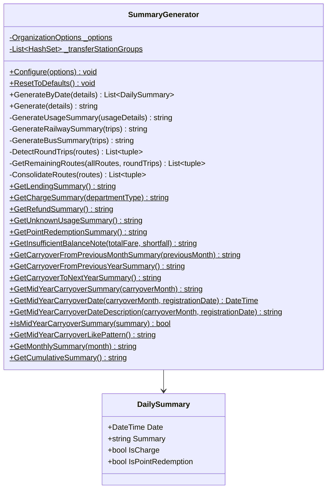
```mermaid
classDiagram
    class SummaryGenerator {
        -OrganizationOptions _options$
        -List~HashSet~ _transferStationGroups$
        +Configure(options)$ void
        +ResetToDefaults()$ void
        +GenerateByDate(details) List~DailySummary~
        +Generate(details) string
        -GenerateUsageSummary(usageDetails) string
        -GenerateRailwaySummary(trips) string
        -GenerateBusSummary(trips) string
        -DetectRoundTrips(routes) List~tuple~
        -GetRemainingRoutes(allRoutes, roundTrips) List~tuple~
        -ConsolidateRoutes(routes) List~tuple~
        +GetLendingSummary()$ string
        +GetChargeSummary(departmentType)$ string
        +GetRefundSummary()$ string
        +GetUnknownUsageSummary()$ string
        +GetPointRedemptionSummary()$ string
        +GetInsufficientBalanceNote(totalFare, shortfall)$ string
        +GetCarryoverFromPreviousMonthSummary(previousMonth)$ string
        +GetCarryoverFromPreviousYearSummary()$ string
        +GetCarryoverToNextYearSummary()$ string
        +GetMidYearCarryoverSummary(carryoverMonth)$ string
        +GetMidYearCarryoverDate(carryoverMonth, registrationDate)$ DateTime
        +GetMidYearCarryoverDateDescription(carryoverMonth, registrationDate)$ string
        +IsMidYearCarryoverSummary(summary)$ bool
        +GetMidYearCarryoverLikePattern()$ string
        +GetMonthlySummary(month)$ string
        +GetCumulativeSummary()$ string
    }

    class DailySummary {
        +DateTime Date
        +string Summary
        +bool IsCharge
        +bool IsPointRedemption
    }

    SummaryGenerator --> DailySummary
```

> **片側駅名欠落のプレースホルダ補完（Issue #1735）** — 鉄道明細の経路採用判定は `IsSummarizableTrip` に集約されている。両側駅名あり＝採用、両側なし＝除外（従来どおり）、**片側のみ＝運賃が発生した完了移動に限り採用**し、欠落側を定数 `UnknownStationPlaceholder`（"?"、CSVインポートの明細説明文と共有）で補完する。運賃 0 円の片側欠落は「入場記録のみ」（未完了移動）として従来どおり除外する。摘要の自動生成が空文字になる場合の安全網として `GetUnknownUsageSummary()`（既定「鉄道（区間不明）」、`SummaryTextOptions.UnknownUsageSummary`）があり、`LendingService.CreateUsageLedgersAsync` の Ledger 生成3経路（新規作成／同一日統合／残高不足マージ）が空文字ガードとして使う（統合経路は既存摘要の維持を優先）。摘要が空欄の台帳行を保存しないための修正（04_機能設計書 §5.2 参照）。

> **明示グループの摘要は 1 区間へ畳む（Issue #1816）** — `GroupId` は「利用者がこの明細群を 1 回の利用として指定した」ことを表す（Issue #484 / #633。履歴詳細ダイアログの「すべて統合」は全項目へ同一 `GroupId` を付与する）。グループ内の摘要生成は自動判定（`GenerateRailwaySummaryAutomatic`）に委ねているため（往復を「A～A」にしないための Issue #548 の判断）、乗継でも往復でもない非連続区間は「A駅～B駅、C駅～D駅」と分かれたままだった。`CollapseExplicitGroupSummary` は**自動判定の結果に区間の区切り「、」が残っている場合だけ**始発駅～終着駅へ置き換える。往復（「A駅～B駅 往復」）と乗継統合（既に 1 区間）は畳まず維持する ― 畳むと Issue #548 が担保した判定結果を壊すため。`GroupId` が `null`（自動検出）の明細はこの畳み込みの対象外で、従来どおり複数区間で表示される。**「、」の有無だけでは条件が広すぎる**（#1816 のコードレビューで判明）ため、次の 2 つは畳まない: ①自動判定の結果に往復（`SummaryText.RoundTripSuffix`）が含まれる場合（「A～B 往復、C～D」を畳むと往復の情報が失われ、さらに「A～D」という**実際には乗っていない区間**が生成される） ②始点と終点が同一駅の場合（`AreTransferStations` による乗継駅の同一視を含む。畳むと「A駅～A駅」となり、Issue #548 が避けたはずの無意味な摘要が台帳・物品出納簿へ入る）。

### 5.3 ReportService

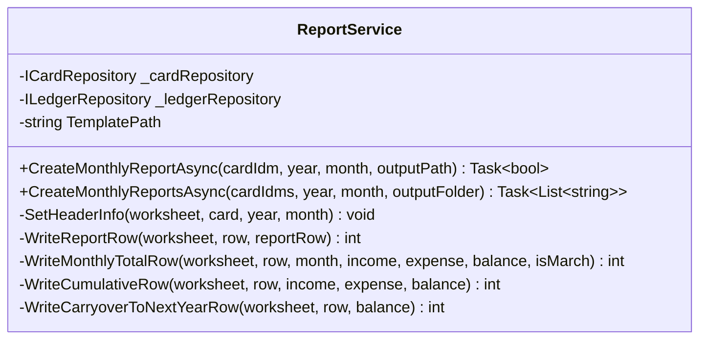
```mermaid
classDiagram
    class ReportService {
        -ICardRepository _cardRepository
        -ILedgerRepository _ledgerRepository
        -string TemplatePath
        +CreateMonthlyReportAsync(cardIdm, year, month, outputPath) Task~bool~
        +CreateMonthlyReportsAsync(cardIdms, year, month, outputFolder) Task~List~string~~
        -SetHeaderInfo(worksheet, card, year, month) void
        -WriteReportRow(worksheet, row, reportRow) int
        -WriteMonthlyTotalRow(worksheet, row, month, income, expense, balance, isMarch) int
        -WriteCumulativeRow(worksheet, row, income, expense, balance) int
        -WriteCarryoverToNextYearRow(worksheet, row, balance) int
    }
```

### 5.5 DbContext


```mermaid
classDiagram
    class DbContext {
        -string _connectionString
        -SqliteConnection? _connection
        -bool _disposed
        -Timer? _healthCheckTimer
        +string DatabasePath
        +bool IsSharedMode
        #DbContext()
        +DbContext(databasePath)
        +DbContext(databaseOptions)
        +GetConnection() SqliteConnection
        +InitializeDatabase() void
        +InitializeDatabaseAsync(CancellationToken) Task
        +CleanupOldData() (int LedgerCount, int OperationLogCount)
        +CleanupOldDataAsync(CancellationToken) Task~(int, int)~
        +Vacuum() bool
        +VacuumAsync(CancellationToken) Task~bool~
        +BeginTransaction() SqliteTransaction
        +ExecuteWithRetry~T~(operation) T
        +Dispose() void
        #Dispose(disposing) void
        -GetDefaultDatabasePath()$ string
        -GetSchemaScript()$ string
        -GetInlineSchema()$ string
        +SuspendConnections() ConnectionSuspensionScope
        #ConfigurePragmas(connection) void
    }
```

**共有フォルダモード対応:**

- `IsSharedMode`: DBパスが **UNCパス**（`\\server\share\...`）または **マップドネットワークドライブ**（`DriveInfo.DriveType == DriveType.Network`）の場合に `true`。判定は `DbContext.IsSharedModePath(string path)` に一元化されており、ローカルフルパス指定では `false`（Issue #1559 / #1597。「パス設定の有無」だけで判定していた旧実装を是正）。共有フォルダモードかどうかを判定する
- `ConfigurePragmas()`: 接続時に `PRAGMA foreign_keys = ON`、`PRAGMA busy_timeout`（ローカルモード: 5000ms / 共有モード: 15000ms、Issue #1107）を設定。共有モード時は `PRAGMA journal_mode = DELETE` を試行し、失敗時は TRUNCATE → PERSIST の順にフォールバック（`ConfigureJournalMode()`、Issue #1107）。**PRAGMA の適用まで済んでから `_connection` へ代入する**（Issue #1809）。適用中に例外（共有モードの SQLITE_BUSY 等）が出た接続は破棄して null のままにし、次回の取得で再構成させる。先に代入すると Open 済み・PRAGMA 未適用の接続がプロセス全体で再利用され続け、busy_timeout 未設定（既定 0）で SQLITE_BUSY が多発し、`CurrentJournalMode` も未設定のまま degraded 検出（Issue #1172）が働かない。`protected virtual` はこの失敗をテストから注入するための継ぎ目（`ProbeDatabaseFileReachable` と同じ設計）
- `SuspendConnections()`（Issue #1166 / #1809）: リストア中に接続を閉じ、スコープの Dispose まで新規接続の取得を拒否する。**使用中の接続を他スレッドから Close+Dispose しない**ため、閉じる前に (1) 接続セマフォを取得して進行中の `BeginTransactionAsync` / `LeaseConnection()` の完了を待ち、(2) セマフォを取らない `LeaseConnectionAsync` の進行中リースが解放されるまで（上限 `AsyncLeaseDrainTimeout`＝既定 10 秒。超過時は Warning ログを残して従来どおり閉じる＝解放漏れがあってもリストアを永久に止めない）待つ。セマフォはスコープの Dispose まで保持するため、停止中に到着した `BeginTransactionAsync` / `LeaseConnection()` は失敗せず解除後に成功する（`GetConnection()` / `LeaseConnectionAsync` は従来どおり `InvalidOperationException`）。セマフォを同期取得するため **UI スレッドから呼ばない**（`LeaseConnection()` と同じガードで拒否。UI 層は `BackupService.RestoreFromBackupAsync` を使う）
- `LeaseConnection()` は接続の確立（Open / PRAGMA）に失敗したとき取得済みのセマフォを必ず返す（Issue #1809）。返さないと以後の `BeginTransactionAsync`（全書き込み）が永久に待機する。`BeginTransactionAsync` には同じ catch が元からあり、こちらだけ欠けていた
- `ExecuteWithRetry<T>()`: SQLITE_BUSY/SQLITE_LOCKED発生時に指数バックオフでリトライ。ローカルモードは最大3回（100ms → 500ms → 2000ms）、共有モードは最大5回（200ms → 500ms → 1000ms → 2000ms → 5000ms、ジッター付き、Issue #1107）。ジッターの生成は `Common/RetryJitter.GetJitter()` に集約（スレッドごとの `Random`。Issue #1823、詳細は 02_DB設計書 §11.2）。詳細は [§5.5b](#55b-接続リーストランザクションスコープissue-1243) 参照
- 接続の正常性確認と定期ヘルスチェックは **`DbContext` ではなく `SharedModeMonitor`**（上記クラス一覧参照）が担う。共有フォルダモード時のみ **15秒間隔**（`SharedModeMonitor.HealthCheckIntervalSeconds = 15`、Issue #1493）でタイマーを起動（`Start()` → `ExecuteHealthCheckAsync()`）し、`DbContext.CheckConnection()` で接続を確認、接続断時は自動再接続を試行する。`DbContext` 自身はヘルスチェック用のメソッド（旧記載の `CheckConnectionHealth()` / `StartHealthCheck()`）を持たない
- `CheckConnection()`: 軽量クエリ（`SELECT COUNT(*) FROM sqlite_master`）**かつ** DB ファイルへの実到達（`ProbeDatabaseFileReachable()` → `File.Exists`）の両方が成功したときのみ `true`。**クエリ単独では到達性の証明にならない**（開きっぱなしの接続ではスキーマ情報が SQLite のページキャッシュから応答され、ネットワーク切断後も成功し続ける。Issue #1110 の意図が達成できていなかったことを Issue #1716 で是正）。インメモリDB（`:memory:`）とパス未設定はファイル実体を持たないため到達確認の対象外、接続一時停止中（Issue #1166）は従来どおり `true`。ファイル確認はリース解放後に行い、死んだ UNC パスの SMB タイムアウト中に接続セマフォを占有しない。到達確認は `protected virtual` のテスト継ぎ目（`ConnectionDiagnosticsService.ProbeDatabaseFileReachable` と同じ設計）
- **疎通確認全体の上限時間**（Issue #1716）: 疎通確認は「接続リース取得 → 接続オープン → クエリ → ファイル到達確認」と複数のネットワーク待ちが直列に並び、**どの区間も下位の TCP/SMB タイムアウトまで戻らない**（実機ログでクエリ段階が 82.3 秒、直後の再確認は 3ms / 0ms）。区間ごとに上限を設けても塞ぎ残しが生じるため、確認**全体**を `Task.Run` で実行し `AppConstants.DatabaseConnectionCheckTimeoutSeconds`（10秒。`ConnectionCheckTimeout` で仮想化しテストから短縮可能）以内に完了しなければ「接続なし」とみなす。上限で打ち切っても下位の呼び出しは中断できないため、**進行中の確認は 1 本に限定**し（`_pendingConnectionCheck`）、ブロック済みスレッドの累積と接続セマフォ待ちの行列を防ぐ。失敗時・1秒超過時は段階別の所要時間を `LogInformation` で記録する（`appsettings.json` の既定フィルタが Information のため `LogDebug` は本番のログファイルに残らない）。**UI スレッドから呼ばないこと**（上限までの待機が呼び出しスレッドをブロックする）。詳細は 04_機能設計書 §18.4
- `CheckWritable()`（Issue #1686、`IDatabaseInfo` 実装）: `CheckConnection()`（到達性＝読み取り）と対で「読み取り→書き込み」の 2 段確認を構成する。`user_version`（本アプリが業務データとして未使用の DB ヘッダ領域）へ +1 を書き込み即 `ROLLBACK` する**実書き込みプローブ**。`BEGIN IMMEDIATE`（RESERVED ロック取得）だけでは読み取り専用ファイルでも成功してしまう（`SQLITE_READONLY` は実際のページ書き込みで初めて発生する）ことを実測で確認済みのため、実書き込み方式を採る。接続一時停止中と**書き込みトランザクション進行中**（`HasActiveTransactionScope`）は `true`（後者は BEGIN の二重開始で失敗し「書込不可」と誤報告するのを避けるため。書き込みが現に機能している状況である）
- **書込可否確認の失敗理由は `LogInformation` で残す**（Issue #1730）: 失敗時に例外種別・SQLite 結果コード（`SQLiteException.ResultCode`）・メッセージ・DB パスを記録する（`LogWritableCheckFailure`）。`CheckWritable()` は `bool` しか返さないため、接続診断の画面は原因**候補**（読み取り専用属性／アクセス権不足／他プログラムの占有）を並べるにとどまり、**候補を 1 つに絞れるのは結果コードだけ**である。`LogDebug` は本番の既定フィルタ（Information）で落ちて痕跡にならないため、`ExecuteConnectionCheck`（Issue #1716）と同じく **`LogDebug` を残したまま Information を併設**する（置き換えないことで、レベルをピン留めした既存テストを弱めずに済む）。失敗時のみの出力かつ本番の呼び出し元は接続診断のオンデマンド 1 経路のみのためログ肥大化は起きない。詳細は 04_機能設計書 §19.2
- `Vacuum()`: 戻り値を `bool` に変更。共有モードで他PCが接続中の場合はVACUUMが失敗しうるため、失敗時は `false` を返す（例外にしない）
- `InitializeDatabaseAsync()` / `CleanupOldDataAsync()` / `VacuumAsync()` (#1356): `App.OnStartup` など UI スレッドから呼び出すと Issue #1281 の `LeaseConnection()` ガードで例外になるため、`Task.Run` で既存 sync 実装へ委譲する非同期版を提供する。テスト経路（スレッドプール/xUnit）は従来どおり sync 版を直接使用

> **接続リース・トランザクションの正しい使い方**: `DbContext` の接続を借りる際は、`using` 文でリースを取得する `LeaseConnectionAsync()` / `BeginTransactionAsync()` を利用する。詳細は [§5.5b 接続リース・トランザクションスコープ](#55b-接続リーストランザクションスコープissue-1243) を参照。

### 5.5a DatabaseOptions

`appsettings.json` の `DatabaseOptions` セクションからバインドされる構成クラス。

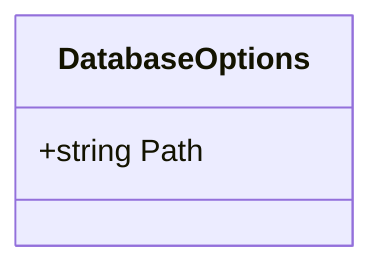
```mermaid
classDiagram
    class DatabaseOptions {
        +string Path
    }
```

| プロパティ | 型 | デフォルト | 説明 |
|-----------|-----|----------|------|
| Path | string | 空文字列 | DBファイルのパス。空の場合はローカルデフォルト。UNCパス指定で共有フォルダモード |

### 5.5b 接続リース・トランザクションスコープ（Issue #1243）

`DbContext` の接続ライフサイクルとトランザクション境界を型安全に管理する 3 つの RAII 的ラッパクラス。いずれも `Data/DbContext.cs` に定義される `public sealed class` であり、`using` 文での利用を前提としている。

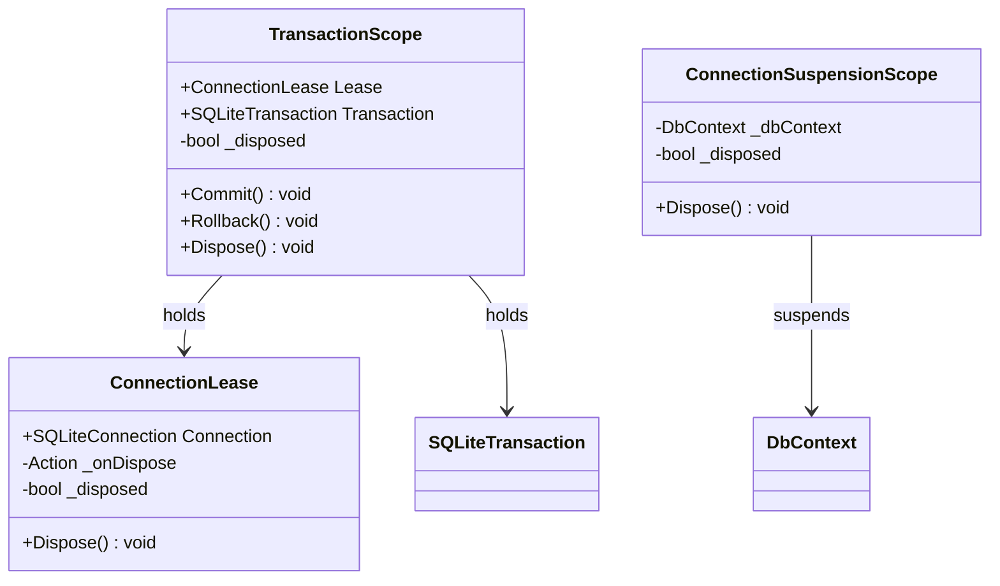
```mermaid
classDiagram
    class ConnectionLease {
        +SQLiteConnection Connection
        -Action _onDispose
        -bool _disposed
        +Dispose() void
    }

    class TransactionScope {
        +ConnectionLease Lease
        +SQLiteTransaction Transaction
        -bool _disposed
        +Commit() void
        +Rollback() void
        +Dispose() void
    }

    class ConnectionSuspensionScope {
        -DbContext _dbContext
        -bool _disposed
        +Dispose() void
    }

    TransactionScope --> ConnectionLease : holds
    TransactionScope --> SQLiteTransaction : holds
    ConnectionSuspensionScope --> DbContext : suspends
```

#### 責務一覧

| クラス | 責務 | 取得元 | 解放契機 |
|--------|------|--------|----------|
| `ConnectionLease` | **接続ライフサイクル管理**: `SQLiteConnection` を貸与し、`Dispose` でセマフォを解放して次の呼び出し者へ譲る | `DbContext.LeaseConnectionAsync()` / `LeaseConnection()` | `using` 文を抜けたとき |
| `TransactionScope` | **トランザクション境界制御**: `ConnectionLease` と `SQLiteTransaction` を束ね、`Dispose` で**トランザクション→リースの順に**解放する | `DbContext.BeginTransactionAsync()` | `using` 文を抜けたとき |
| `ConnectionSuspensionScope` | **接続一時停止制御**: リストア中など接続再オープンを禁止したい期間を RAII 的に表現し、`Dispose` で自動的に解除する（Issue #1166） | `DbContext.SuspendConnections()` | `using` 文を抜けたとき |

#### TransactionScope.Dispose() の自動ロールバック仕様

**重要**: `Commit()` も `Rollback()` も呼ばずに `Dispose` された場合、`SQLiteTransaction.Dispose()` は **未コミットのトランザクションを自動的にロールバック** する。このため、例外経路でも明示的な `Rollback()` 呼び出しは不要である。

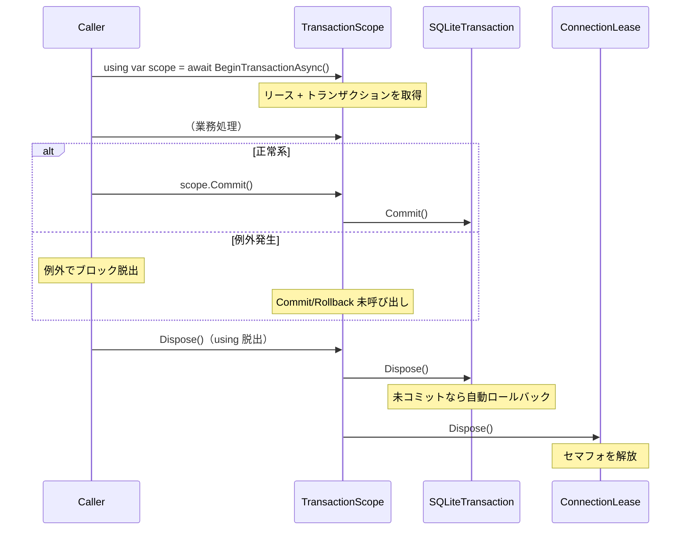
```mermaid
sequenceDiagram
    participant Caller
    participant Scope as TransactionScope
    participant Tx as SQLiteTransaction
    participant Lease as ConnectionLease

    Caller->>Scope: using var scope = await BeginTransactionAsync()
    Note over Scope: リース + トランザクションを取得
    Caller->>Scope: （業務処理）
    alt 正常系
        Caller->>Scope: scope.Commit()
        Scope->>Tx: Commit()
    else 例外発生
        Note over Caller: 例外でブロック脱出
        Note over Scope: Commit/Rollback 未呼び出し
    end
    Caller->>Scope: Dispose()（using 脱出）
    Scope->>Tx: Dispose()
    Note over Tx: 未コミットなら自動ロールバック
    Scope->>Lease: Dispose()
    Note over Lease: セマフォを解放
```

この仕様により、典型的な try/catch 定型文を省略できる:

```csharp
// ❌ 冗長（Dispose が自動ロールバックする）
using var scope = await _dbContext.BeginTransactionAsync();
try
{
    // 処理
    scope.Commit();
}
catch
{
    scope.Rollback();
    throw;
}

// ✅ 簡潔（例外時も Dispose が自動ロールバックする）
using var scope = await _dbContext.BeginTransactionAsync();
// 処理
scope.Commit();
// 例外時は Commit() が呼ばれないまま using を抜け、自動ロールバック
```

#### 典型的な使用パターン

**1. 読み取り専用の接続借用（単発クエリ）**

```csharp
using var lease = await _dbContext.LeaseConnectionAsync();
var connection = lease.Connection;

using var command = connection.CreateCommand();
command.CommandText = "SELECT value FROM settings WHERE key = @key";
command.Parameters.AddWithValue("@key", key);
return (string?)await command.ExecuteScalarAsync();
// using 脱出時にリースを解放、セマフォ返却
```

**2. 複数操作を 1 トランザクションで実行（書き込み系の推奨形）**

```csharp
await _dbContext.ExecuteWithRetryAsync(async () =>
{
    using var scope = await _dbContext.BeginTransactionAsync();

    await SetAsync(KeyWarningBalance, settings.WarningBalance.ToString());
    await SetAsync(KeyFontSize, FontSizeToString(settings.FontSize));
    // ...複数のキー更新...

    scope.Commit();
    // 例外発生時は Commit() に到達せず Dispose で自動ロールバック
});
```

> **リトライラムダは冪等にする（Issue #1733）**: `ExecuteWithRetryAsync` は SQLITE_BUSY/LOCKED でラムダ**全体**を再実行する。ロールバックで巻き戻るのは DB だけであり、ラムダ内でメソッド外のオブジェクト（結果 DTO のリスト等）へ追記すると、失敗した試行の分が残ったまま成功分が積み増され、試行回数分だけ累積する（`LendingService.PersistReturnAsync` が `result.CreatedLedgers.AddRange` をラムダ内で行っていたため、返却リトライ時にバス停入力ダイアログへ同一バス乗車行が2重表示された）。対処は次のいずれか:
>
> - **代入で受ける**: ラムダ内ではローカル変数への代入（上書き）だけを行い、呼び出し元オブジェクトへの反映はリトライ境界の外に置く（`LendingService.PersistReturnAsync` / `LendAsync` の形）
> - **冒頭で初期化する**: ラムダ内で累積が必要な場合は、ラムダ冒頭でカウンタ・リストを毎回初期化する（`RepairLentStatusConsistencyAsync` の `repairCount = 0` の形）

> **`LendingResult.Success` は「記録が確定した」ことだけを表す（Issue #1805）**: `ReturnAsync` は `PersistReturnAsync` のコミット後に残額の解決（`ResolveReturnBalanceAsync`）と残額警告の付与（`ApplyBalanceWarningAsync`）という DB I/O を行う。`Success` と 30秒ルール用の処理情報（`LastProcessedCardIdm` / `LastProcessedTime` / `LastOperationType`）は**コミット直後に確定**させ、以降の例外は `catch (Exception) when (result.Success)` で吸収して `HasPostCommitFailure = true` にする（`Success` / `ErrorMessage` は変えない）。後処理の後ろに置くと、後処理の失敗で「返却失敗・再タッチ」と案内され、案内どおりの再タッチが（`is_lent = 0` のため）貸出として新規に記録される。`LendAsync` はコミット直後に処理情報を確定し後処理の DB I/O を持たないため対象外。呼び出し元（`MainViewModel.HandleReturnSuccessAsync`）は `HasPostCommitFailure` のとき残額付きの返却通知を出さず「記録済み・再タッチしない」を案内する（→ `04_機能設計書.md` §2.5.1）

`ExecuteWithRetryAsync` と組み合わせることで、`SQLITE_BUSY` / `SQLITE_LOCKED` 発生時に指数バックオフ + ジッター付きでリトライする（共有モードでは最大 5 回）。

**3. 接続の一時停止（リストア中など）**

```csharp
// Task.Run 先（非 UI スレッド）で実行すること。セマフォを同期取得するため UI スレッドでは
// LeaseConnection() と同じガードで InvalidOperationException になる（Issue #1809）
using var suspension = _dbContext.SuspendConnections();
// 進行中の BeginTransactionAsync / LeaseConnection() / LeaseConnectionAsync の完了を待ってから接続を閉じる。
// この間、GetConnection() / LeaseConnectionAsync は InvalidOperationException をスロー（Issue #1166）、
// BeginTransactionAsync / LeaseConnection() はセマフォ待ちになり、解除後に成功する（Issue #1809）
ReplaceDatabaseFile(backupFile);
// using 脱出時に ResumeConnections() が自動呼び出しされ、セマフォも返る
```

> **使用中の接続を他スレッドから閉じない（Issue #1809）**: 一時停止の初版（#1166）は `_connectionLock` だけを取って `Close()` + `Dispose()` していたが、`_connectionLock` が守るのは `_connection` フィールドの代入だけで、既に払い出された `SQLiteConnection` 上で実行中のコマンドは守らない。`_isSuspended` も新規取得しか止めない。リストア中（UNC では `File.Move` + `File.Copy` で数秒）に進行中の貸出・返却トランザクションや共有モードの 15 秒ヘルスチェックが同一接続でコマンドを実行していると `ObjectDisposedException` で落ちる。「新規取得を止めるフラグ」と「使用中の接続を守るロック」は別物であり、閉じる前に**使用中でないこと**を待って確かめる。

#### 排他制御（内部実装の注意点）

- `BeginTransactionAsync()` は `DbContext._semaphore` を取得する（`SemaphoreSlim(1, 1)`）。トランザクション中は他の書き込み系呼び出しがブロックされる
- `LeaseConnectionAsync()`（非同期版）は現在セマフォを取得しない。同一 `SQLiteConnection` を複数タスクが共有する前提。進行中件数だけを `_activeAsyncLeaseCount`（`Interlocked`）で数え、`SuspendConnections()` が解放を待てるようにしている（Issue #1809）
- `LeaseConnection()`（同期版）はセマフォを取得し、同一スレッド内でリエントラント（`AsyncLocal<int>` でカウント）。接続の確立に失敗したときはセマフォを返してから例外を伝播する（Issue #1809。`BeginTransactionAsync()` と同じ形）
- `SuspendConnections()` もセマフォを取得し、スコープの Dispose まで保持する（Issue #1809）。取得順は「セマフォ → `_isSuspended = true` → 非同期リースの解放待ち → `_connectionLock` で Close」。フラグを立ててから件数を読むこと（逆だと待っている間に新しいリースが入り続ける）、フラグ書き込みと件数読み取りの間に `Interlocked.MemoryBarrier()` を置くこと（`LeaseConnectionAsync` 側の「件数増加 → フラグ読み取り」と交差させない）
- 結果として、**書き込み系は必ず `BeginTransactionAsync` 経由** で実行することで、他の書き込みとのレース条件を防げる

#### 複数文を発行する書き込みメソッドの 3 分岐（Issue #1724）

`ReplaceDetailsAsync` のように **1 メソッドで 2 文以上（DELETE→INSERT 等）を発行する**リポジトリメソッドは、次の 3 分岐を必ず実装する。分岐を欠くと「片方だけ確定して片方が失敗する」非原子的な経路が生まれる。

| 状況 | 実装 | commit/rollback の責任 |
|------|------|----------------------|
| 引数で `SQLiteTransaction` を受け取った | その tx を全文に適用する | 呼び出し元（介入しない） |
| 引数は null だが `_dbContext.HasActiveTransactionScope == true` | `LeaseConnectionAsync()` で接続だけ借り、`command.Transaction` は null のまま発行して**接続の活性トランザクションへ暗黙参加**する | 外側スコープ（介入しない） |
| 引数が null かつ外側スコープも無い | 自前で `BeginTransactionAsync()` する | **自分で持つ**（成功なら Commit、失敗・例外なら Rollback） |

- **2 番目の分岐を省略してはならない**（Issue #1575）。`BeginTransactionAsync()` は `SemaphoreSlim(1,1)` を取るため、外側スコープ内で自前 tx を開くと自己デッドロックする
- **SQLite は接続に活性トランザクションが無いと各文を autocommit で即確定する**。`command.Transaction` を設定し忘れた文は、同メソッド内の後続文が失敗しても巻き戻らない。Issue #1724 はこれで `ledger_detail` の明細が全消失した（Issue #1456 で INSERT 側だけを tx 化した際、DELETE が tx 外に取り残されたことが原因）
- 実装は `LedgerRepository.InsertDetailsAsync` / `ReplaceDetailsAsync` / `DeleteAsync` / `UnmergeLedgersAsync`（Issue #1806）が参考。いずれも「分岐を持つ公開メソッド」と「接続・tx を引数で受け取り commit/rollback しない `*Core`」に分離している
- **「別メソッドの書き込みと束ねる必要がある」なら tx を受け取るオーバーロードを用意し、呼び出し元（サービス層）が 1 つのスコープで両方を呼ぶ**（Issue #1806）。`UnmergeLedgersAsync` は旧実装が内部で `Commit()` して返り、呼び出し元がその**あと**に別接続で `MarkMergeHistoryUndoneAsync` を呼んでいたため、マークだけが失敗（共有モードの SQLITE_BUSY / UNC 断）すると「台帳は復元済み・履歴は未取消」の状態が残り、案内どおりに再実行した管理者の操作で統合元が**もう一度 INSERT** された（月次帳票の二重計上）。`LedgerMergeService.UnmergeAsync` は `MergeAsync`（Issue #1458）と同じ形で `BeginTransactionAsync` のスコープ内から両方の tx オーバーロードを呼び、どちらかが `false` ならロールバックする
- 回帰は実 SQLite で固定する（テスト設計書 §2 UT-075 / UT-076）。失敗注入は `BEFORE INSERT ... RAISE(ABORT)` トリガーで行い、タイミング依存にしない

#### 更新・削除は影響行数で競合を検出する（Issue #1753）

共有モードでは**読み取りと書き込みが別トランザクション**になるため（サービス層が `GetByIdAsync` で読み、その後 `BeginTransactionAsync` で書く）、その間に他 PC が同じ行を変更・削除し得る。行ロックによる悲観ロックは持たないので、**書き込み時の影響行数で競合を検出する**（楽観ロック）。

- **`ExecuteNonQueryAsync()` の戻り値を捨てない**。UPDATE / DELETE が 0 行なら対象は既に消えている。`MergeLedgersAsync` は 3 文の影響行数を一つも見ずに無条件 `true` を返しており、そのために `LedgerMergeService` の競合エラー分岐が**到達不能なデッドコード**になっていた（Issue #1753）
- **SQLite の `changes()` は WHERE に一致した行を、値が変わらなくても数える**（MySQL と異なる）。したがって「0 行＝行が存在しない」と断定でき、同じ値での冪等な再実行を競合と誤判定しない
- **0 行が正常な文では検証しない**。例: 統合手順1の `UPDATE ledger_detail SET ledger_id` は、明細を持たない ledger（「新規購入」「○月から繰越」）では 0 行が正しい。**どの文で競合を検出するかを決めてコメントに残す**
- **`bool` を返すリポジトリメソッドの戻り値も捨てない**。`UpdateAsync` は `result > 0` を正しく返すのに、`LedgerSplitService` と `LedgerDetailViewModel` が破棄していた（Issue #1753）。「リポジトリは正しいのに呼び出し元が握りつぶす」形の抜けに注意する
- **競合を検出したら UI 側で一覧を再読込する**。エラー文言で「画面を最新の状態に更新してから再度お試しください」と案内する以上、失敗経路でも再読込しないと利用者は同じエラーを繰り返す（`MainViewModel` の統合コマンド・統合取り消しコマンドが該当）
- **暗黙 rowid で行を特定する UPDATE は、所属（親 ID）も WHERE に含める**（Issue #1806）。`ledger_detail` は INTEGER PRIMARY KEY を持たない暗黙 rowid のテーブル（AUTOINCREMENT なし）で、表末尾の行が消えると次の INSERT が同じ rowid を再利用する。統合取り消しの `UPDATE ledger_detail SET ledger_id = … WHERE rowid = @rowid` は、統合後に統合先の明細が編集（`ReplaceDetailsAsync` の DELETE + INSERT）されて rowid が振り直されると、①該当行が無く 0 行のまま「取り消しました」と報告する（統合元が明細ゼロで復活）、②空いた rowid を無関係な別台帳の明細が再利用していればその明細を復活先へ移す（交差破損）、の 2 通りで壊れた。`WHERE rowid = @rowid AND ledger_id = @targetId`（同ファイルの `UpdateDetailBusStopsAsync` と同じスコープ）にして影響行数 0 を競合として `false` を返す。**Undo データが「rowid」という再利用され得る識別子しか持たない以上、統合後に明細が作り直された履歴は取り消せない**（明細の同一性を rowid 以外で確かめる手段が無い）。この場合は復元を拒否して「統合後に編集・分割・削除された可能性」を案内する
  - **例外**: 統合先の明細が編集後も**表末尾**にあり、DELETE + INSERT で Undo データが指す rowid がすべて統合先に再び割り当てられた場合は検出できない（rowid も所属も一致するため。ガードは「その rowid が今も統合先に属するか」しか見ないので、明細の内容・順序・件数が変わっていても通る）。この形は「返却直後に統合し、他の返却が入る前に明細を編集する」ときにだけ成立し、移動先を取り違えても統合先・統合元の組の内側での明細の入れ替わりに留まる（他の台帳には波及しない）。Undo データに明細の内容を含めれば検出できるが、`ledger_merge_history.undo_data` の形式変更を伴うため本 Issue では扱わない
  - `MarkMergeHistoryUndoneAsync` は `WHERE id = @id AND is_undone = 0` として影響行数で「既に取り消し済み」を検出する。2 台の PC が同じ履歴を同時に取り消すと両方が「未取消」を読んでから書き込みに来るため、後着の UPDATE を 0 行にして復元ごとロールバックする

#### UPDATE の SET 句は「その経路で本当に編集する列」に限る（Issue #1726）

エンティティを引数に取る `UpdateAsync(TEntity)` は、**引数のモデルが全列について正しい値を持っている**ことを暗黙の前提にする。呼び出し元が画面の入力だけからモデルを組み立てる場合、その前提は崩れ、**触っていない列がモデル既定値で上書きされる**。

- `ic_card` の `starting_page_number`（Issue #510）/ `carryover_income_total` / `carryover_expense_total` / `carryover_fiscal_year`（Issue #1215）は**登録時にのみ確定し、編集 UI を持たない**。`CardRepository.UpdateAsyncInternal` はこれら4列も無条件に SET していたため、カード管理画面が備考の修正だけを目的に組んだ `IcCard`（当該4項目は既定値 1 / 0 / 0 / NULL）で保存すると、紙出納簿移行カードの繰越累計と出納簿の開始ページ番号が静かに消えていた（Issue #1726）
- **対処は「呼び出し元に引き継がせる」ではなく「SET 句から外す」**。引き継ぎを義務にすると、`UpdateAsync` を呼ぶ経路が増えるたびに同じ抜けが再発する（実際に ViewModel 経路と CSV 経路の2系統があり、片方だけが欠けていた）。列を外せば呼び出し元の実装に依存せず構造的に防げる
- 外した列の扱いは**インターフェースの XML doc に明記する**（「設定しても DB へは反映されない」）。反映されないことを知らずに値を渡す実装が現れると、今度は逆向きの静かな不整合になる
- **登録時専用列を後から更新する要件が出たら専用メソッドを新設する**（`UpdateAsync` の SET 句へ戻さない）。現時点では該当する呼び出し元が無いため、使われないメソッドは作らない
- 操作ログ（`OperationLogger.LogCardUpdateAsync`）は `IcCard` 全体を JSON 化して `BeforeData` / `AfterData` に記録するため、**DB を守るだけでは足りない**。ViewModel 側でも既定値のモデルを渡さないようにする（渡すと「開始ページ番号 7 → 1」という実際には起きていない変更が監査ログに残る）
- **ViewModel 側の引き継ぎは「編集対象の列」以外を網羅する**。カード管理画面が編集するのはカード種別・管理番号・備考の3項目だけなので、残り全部（繰越累計3項目・開始ページ番号・`IsLent` 系3項目・`IsRefunded` 系2項目）を引き継ぐ。一部だけ直すと同じ虚偽差分が別の列で残る（Issue #1726 の初版は繰越4項目だけを直し、`IsRefunded` / `IsLent` の虚偽差分を残していた）
- **引き継ぎ元はキャッシュ由来の一覧（DTO）ではなく、直前に読んだ DB の最新値**。カード一覧は `GetAllAsync` のキャッシュで自動更新されないため、共有モードでは他 PC の貸出が反映されず「貸出中: はい → いいえ」という虚偽の返却を記録し得る
- **「読み取りが null のときのフォールバック」を安易に足さない**。`GetByIdmAsync`（`is_deleted = 0`）が null を返す状況では `UpdateAsync` の WHERE（同じ述語）も一致せず 0 行 → `false` になり、操作ログも記録されない。つまり代替値は**本番で観測されない**。到達不能な分岐とその回帰テストは「競合が手当てされている」という誤った安心感を与えるだけなので置かない（実在する穴は「更新が成功したのに操作ログが残らない」ケースで、Issue #1760 で扱う）
- **モデルにプロパティを足したら `OperationLogExcelExportService.GetFieldNameMap` にも足す**。`FormatJsonToReadable` / `GetChangeSummary` はマップに無いプロパティを読み飛ばすため、載せ忘れると生 JSON には値があるのに操作ログの画面・Excel に一切現れず監査で追跡できない
- 回帰はテスト設計書 §2 UT-021 No.20/21（リポジトリ）・UT-025 No.28（ViewModel）・UT-033 No.9/10（操作ログの可視性）で固定

### 5.5c 保守タスクの直列実行と settings 書き込みの保護（Issue #1737）

`DbContext` は `SQLiteConnection` を **1 本しか持たない**。`LeaseConnectionAsync`（非同期版）はセマフォを取らないため、複数の処理を並列に走らせると同一接続上で `SQLiteCommand` が並列実行される（Issue #1452 の規約）。この規約は Service / ViewModel 層向けに書かれていたが、**起動シーケンス自身がそれを破っていた**。

#### 起動時タスクは直列 await する

`App.PerformStartupTasksAsync` は `_ = backupService.ExecuteAutoBackupAsync();` と戻り値を捨てていた。バックアップ本体（`BackupDatabaseTo`）は同期 `LeaseConnection()` でセマフォを取るため後続タスクはどのみち待たされるが、**セマフォ解放後の継続**が野放しになる:

| 並走していた処理 | 結果 |
|---|---|
| `RecordBackupSuccessAsync`（Issue #1689）の `settings` への INSERT × 2 | `CleanupOldData` が開いているトランザクションの内側に潜り込み、cleanup のロールバックで**記録ごと消える** |
| 同 INSERT が `VACUUM` 実行中に届く | `cannot VACUUM - SQL statements in progress`（`ResultCode=Error`） |

- 実処理は `Services/StartupTaskRunner` に切り出し、**実行順と直列性を単体テストで固定する**（テスト設計書 UT-078）。「順序」ではなく**同時実行数**で表明する
- **await 化のコストはほぼゼロ**。重い部分（DB のコピー）は既にセマフォで直列化されており、増える待ち時間は「古い世代の削除（ファイル走査）＋ INSERT 2 件」分のみ
- **バックアップの呼び出しだけは個別に catch する**。fire-and-forget 時代は「バックアップが落ちても削除・VACUUM は動く」性質があり、単純な await 化はこれを失わせる
- **`Vacuum()` は SQLite 由来の失敗を理由を問わず false（当月スキップ）に畳み、`ResultCode` を Warning ログに残す**。呼び出し元は CAS ロック（Issue #1482）を**消費してから**ここへ来るため、例外を投げ返してもロックは戻らず当月は誰も再試行しない。Busy / Locked だけを catch していると上表の `Error` が素通りし、ログには「起動時タスクでエラー」しか残らなかった

#### `settings` の書き込みはセマフォ保護下で行う

`settings` は、UI 操作を伴わない保守処理（起動時バックアップの成功記録、月次 VACUUM の CAS ロック）から書かれる**唯一のテーブル**である。`SettingsRepository` の書き込みは `WriteGuardedAsync` に集約し、§5.5b の分岐規約に従う:

| 分岐 | 条件 | 動作 |
|---|---|---|
| ① | 呼び出し元が `TransactionScope` を引き渡した | そのトランザクションを全文に適用（commit/rollback は呼び出し元の責務） |
| ② | 引数 null かつ `HasActiveTransactionScope == true` | 接続だけ借りて暗黙参加（自己デッドロック回避の backstop） |
| ③ | それ以外 | 自前で `BeginTransactionAsync`（＝セマフォを取る）→ 実行 → commit |

- **入れ子になる経路は①で明示的に引き渡し、②に頼らない**。`HasActiveTransactionScope` は `DbContext` の**プロセス全体のカウンタ**（`_activeTransactionCount`）であり、**「自分のスコープか他フローのスコープか」を区別できない**。②に依存すると、無関係な別フローがスコープを保持しているだけで書き込みが無保護になり、そのロールバックで消える —— #1737 が直そうとした欠陥そのものが別の形で復活する。`SaveAppSettingsAsync` / `SaveWindowSettingsToDbAsync` は①でスコープを渡す
- **②自体は残す**。`BeginTransactionAsync` は `SemaphoreSlim(1,1)` を取るため、自分のフローが開いたスコープの内側で開き直すと自己デッドロックする（Issue #1575）。①への移行漏れがあってもデッドロックさせないための backstop として維持する
- **③は `ExecuteWithRetryAsync` で包む**。1 文の autocommit だったものが BEGIN → INSERT → COMMIT になり共有モードの SQLITE_BUSY 面が広がるため、既存の同種経路（`SaveAppSettingsAsync`）と同じ防御を掛ける（Issue #1727 の「リトライの適用範囲は経路ごとに確認する」）
- **`CleanupOldData` は同期 `LeaseConnection()` を使うため `HasActiveTransactionScope` は立たない**。したがって cleanup 実行中の `SetAsync` は③に入り、セマフォ待ちで正しく直列化される。テストで外側の保持側を再現するときは `BeginTransactionAsync` で代用せず、実際と同じ同期リースで作ること（代用すると②に入り、検証したい経路を通らない）
- **他リポジトリ（Card / Ledger / Staff）の同型の書き込み（計17箇所）は本 Issue の対象外**。いずれもユーザーの単一操作を起点とし、アプリの状態機械で直列化されるため、保守処理と並走する経路が無い。将来これらをバックグラウンド処理から呼ぶ場合は同じ保護を検討すること

#### 失敗の伝え方

- **`ExecuteAutoBackupAsync` の失敗は「例外」ではなく「null 戻り値」**（内部で全例外を catch する）。`StartupTaskRunner` が戻り値を捨てると、バックアップ先が到達不能でも起動シーケンスのログは正常に見える。**戻り値を観測して Warning を残す**こと。個別の `try/catch` は「将来 `BackupService` が例外を投げるようになっても後続タスクを止めない」ための backstop であり、現在の実装では到達しない
- **`StartupTaskRunner` の DI 解決は `App` 側の `try/catch` で囲む**。`RunAsync` の内部 catch は自分自身の解決を覆えない。保守タスクの依存が構築できないだけで窓口業務（貸出・返却）まで止めない
- **`Vacuum()` の失敗はログレベルで「待てば直るか」を区別する**。`Busy` / `Locked` / `Error`（"SQL statements in progress"）は Warning、`ReadOnly` / `Full` / `Corrupt` / `NotADb` / `CantOpen` / `Perm` は **Error**。CAS ロックは VACUUM 実行前に消費されるため、恒久的な失敗を「来月再試行します」の Warning に紛れさせると、書き込み不可・破損した DB が放置される。判定は `DbContext.IsPermanentVacuumFailure` に集約し、実機で再現困難な `ReadOnly` / `Full` / `Corrupt` は分類そのものをテストで表明する

### 5.6 CsvExportService

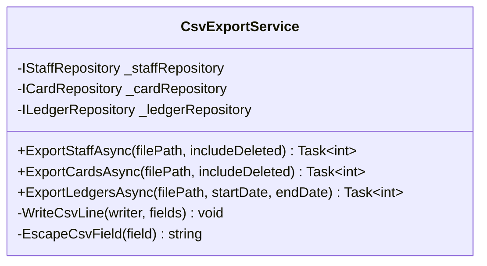
```mermaid
classDiagram
    class CsvExportService {
        -IStaffRepository _staffRepository
        -ICardRepository _cardRepository
        -ILedgerRepository _ledgerRepository
        +ExportStaffAsync(filePath, includeDeleted) Task~int~
        +ExportCardsAsync(filePath, includeDeleted) Task~int~
        +ExportLedgersAsync(filePath, startDate, endDate) Task~int~
        -WriteCsvLine(writer, fields) void
        -EscapeCsvField(field) string
    }
```

### 5.7 CsvImportService

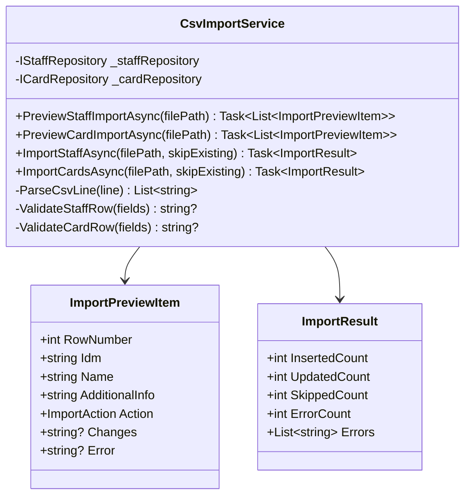
```mermaid
classDiagram
    class CsvImportService {
        -IStaffRepository _staffRepository
        -ICardRepository _cardRepository
        +PreviewStaffImportAsync(filePath) Task~List~ImportPreviewItem~~
        +PreviewCardImportAsync(filePath) Task~List~ImportPreviewItem~~
        +ImportStaffAsync(filePath, skipExisting) Task~ImportResult~
        +ImportCardsAsync(filePath, skipExisting) Task~ImportResult~
        -ParseCsvLine(line) List~string~
        -ValidateStaffRow(fields) string?
        -ValidateCardRow(fields) string?
    }

    class ImportPreviewItem {
        +int RowNumber
        +string Idm
        +string Name
        +string AdditionalInfo
        +ImportAction Action
        +string? Changes
        +string? Error
    }

    class ImportResult {
        +int InsertedCount
        +int UpdatedCount
        +int SkippedCount
        +int ErrorCount
        +List~string~ Errors
    }

    CsvImportService --> ImportPreviewItem
    CsvImportService --> ImportResult
```

#### 5.7.1 CsvImport 補助クラス（Issue #1284）

`CsvImportService.Ledger.cs` (1031行) / `Detail.cs` (1042行) を責務分割し、以下の補助クラスを `Services/Import/` 配下に追加。public API は不変。

| クラス | パス | 種別 | 責務 |
|-------|-----|------|-----|
| `LedgerCsvRowParser` | `Services/Import/Parsers/` | internal static | 利用履歴 CSV の 1 行パース（Import/Preview 共通化） |
| `LedgerDetailCsvRowParser` | `Services/Import/Parsers/` | internal static | 利用履歴詳細 CSV の 13 列パース + `ValidateBooleanField` |
| `NewLedgerFromSegmentsBuilder` | `Services/Import/Builders/` | internal | 履歴ID空欄 → segment 分割を伴う新規 Ledger 自動生成（Issue #906, #918, #1053） |

また、以下の検証系 helper は新 partial `CsvImportService.LedgerValidation.cs` に分離:
- `DetectLedgerChanges` / `ValidateBalanceConsistency` / `ValidateBalanceConsistencyForLedgers` / `GetPreviousBalanceByCardAsync`

効果: `Ledger.cs` 1031→520 行、`Detail.cs` 1042→761 行。Import/Preview 間で重複していた行パース ~200 行を解消。

#### 5.7.2 文字コード判別（`TextEncodingDetector`、Issue #1744）

CSV の読み取り（`CsvImportService.ReadCsvFileAsync`）は、全インポート経路（カード／職員／利用履歴／利用履歴詳細の Import・Preview 計 8 か所）が共有する唯一の入口である。ここで文字コードを誤ると、化けた日本語が `staff` / `ic_card` / `ledger` / `ledger_detail` へそのまま入る。

| クラス | パス | 種別 | 責務 |
|-------|-----|------|-----|
| `TextEncodingDetector` | `Common/` | public static | バイト列の文字コード判別と復号（`Decode` / `GetDisplayName`） |
| `DetectedTextEncoding` | `Common/` | public enum | 判別結果（`Utf8WithBom` / `Utf16*` / `Utf32*` / `Utf8` / `ShiftJis` / `Undecidable`） |
| `TextDecodeFailure` | `Common/` | public enum | 失敗理由（`None` / `Undecidable` / `DeclaredEncodingUnreadable`） |
| `TextDecodeResult` | `Common/` | public sealed | 判別結果・復号済みテキスト・失敗理由（失敗時は `Text` が null） |

**判別順序**: BOM（UTF-32 LE/BE → UTF-8 → UTF-16 LE/BE）→ BOM なし UTF-8 → BOM なし Shift_JIS（cp932）→ 判別不能。

- **UTF-32 LE の BOM（`FF FE 00 00`）は UTF-16 LE の BOM（`FF FE`）と前方一致する**ため、長い BOM から照合する（`StreamReader` の内部判定と同じ順序）
- **UTF-8 を Shift_JIS より先に試すのは仕様**。UTF-8 の日本語（例: `E3 81 82`）は cp932 としても偶然復号できてしまうため、逆順にすると UTF-8 のファイルが化ける。一方 Shift_JIS の日本語はトレイルバイトが `0x40`–`0x7E` を取り得るため、ほぼ確実に不正な UTF-8 になる
- **復号はすべて例外フォールバック**（`throwOnInvalidBytes` / `DecoderFallback.ExceptionFallback`）。既定の `Encoding.UTF8` は不正バイトを U+FFFD へ置換して**成功を返す**ため、呼び出し元が「読めたのか化けたのか」を区別できない。これが Issue #1744 の本体だった
- **BOM なしの復号結果に NUL 文字（U+0000）が含まれたら判別不能とする**。UTF-16 の ASCII 部分（`41 00` 等）は**すべて妥当な UTF-8 バイト**であるため厳格 UTF-8 の検査を素通りし、U+0000 混じりのゴミ文字列が「成功」として返る。CSV に NUL 文字は現れないため、これを中断のシグナルに使う（BOM 付きの経路には適用しない — そちらは文字コードが確定しており、NUL は判別の問題ではなく内容の問題）
- **「判別できない」と「判別できたが読めない」を区別する**。BOM がある時点で文字コードは確定しており曖昧ではないため、BOM 付きで復号に失敗した場合は `DeclaredEncodingUnreadable` とし、**判別された文字コードを結果に残す**。両者を混ぜると、破損した自前エクスポート（UTF-8 BOM 付き）に対して「判別できませんでした／CSV UTF-8 形式で保存し直してください」という誤診断＋無意味な指示になる
- 中断時の例外は理由で使い分ける: 判別不能 → `FileOperationException.UndecidableEncoding`（FILE008）、宣言された文字コードで読めない → `UnreadableDeclaredEncoding`（FILE009）。いずれもインポートを 1 行も実行せずに中断する
- **中断は必ず `LogWarning` で記録してから投げる**。呼び出し元の `catch` は結果オブジェクトへ文言を写すだけでログを書かないため、記録できるのは `ReadCsvFileAsync` の中だけ。成功時（Shift_JIS 判別）だけ Information を出して中断時が無言だと、調査が必要な側の痕跡が残らない
- Shift_JIS 等と判別した場合のみ `LogInformation` を出す（文字化けの相談を受けたときの切り分け材料。`LogDebug` は本番のログレベル設定では出力されない／Issue #1716）。**BOM の有無を文言で断定しない** — UTF-16 / UTF-32 は BOM があるからこそ判別できており、表示名（「UTF-8（BOM付き）」等）が既にそれを示す
- **ファイル全体は長さぶんのバッファ 1 つで読む**。`MemoryStream` + `ToArray()` は倍々バッファと連続配列の二重確保になり、`PlatformTarget=x86` の 2GB 空間で数十MB の台帳 CSV を扱う際に不要なピークを生む

**例外 → ユーザー向け文言の対応表は `CsvImportService.ToUserFacingErrorMessage` の 1 か所**に集約する。以前は共通ハンドラー 2 つと利用履歴の Import / Preview に同じ ladder が計 4 回書かれており、Issue #1744 で `FileOperationException` を足す際も 4 か所すべてに同じ catch を書く必要があった。**次に対応表を変える人が利用履歴経路を取りこぼす**（＝この Issue が直したのと同じ形の欠陥）ため、`catch (Exception)` 1 つから共通の変換関数を呼ぶ形へ統一した。`AppException` は `UserFriendlyMessage` を使い、生の `ex.Message` を UI へ出さない（Issue #1614）。

> **DB 制約違反のドメイン例外は `AppException` を継承させる**（Issue #1757）。`DuplicateCardNumberException`（カード種別＋管理番号の UNIQUE 制約違反、`CARD001`）は `CardRepository` の INSERT / UPDATE / 復元の 3 経路すべてが投げ、カード登録・カード編集・カード復元・カードCSVインポートが `UserFriendlyMessage` をそのまま案内に使う。継承させる意味は、①文言を例外クラス 1 か所に集約して経路ごとの食い違いを防ぐこと、②捕捉漏れがあっても本表の `AppException` 分岐と `App.OnDispatcherUnhandledException` が拾うため「予期しないエラー（SYS999）」へ落ちないこと（多層防御）。一括処理では加えて**行番号付きの `CsvImportError`** へ変換する（`AppException` 継承は文言だけを守り、**行番号は守らない**ため、ループ内の捕捉は省略できない）。
>
> **文言の集約は「経路ごとに取れる行動が同じ」ときにだけ成立する**。復元経路には管理番号の入力欄が無く「別の番号を指定してください」は実行不能な指示になるため、`ForRestore` ファクトリで「どうすれば」だけを差し替える（「何が」「なぜ」は共通のまま）。集約を理由に実行できない指示を出さないこと。

> **`SettingsViewModel.LoadConfigFile` と統合しない**: あちらは Inno Setup が ANSI で書く `database_config.txt` を対象とし「BOM なし＝Shift_JIS」と決め打ちしてよい。CSV は UTF-8（BOM なし）も現実に存在するため判別が要る。**同じ「BOM を見る」処理でも方針が異なる**ので、共通化すると片方の前提がもう片方を壊す。

> **エクスポート側は UTF-8 BOM 付き固定**（`CsvExportService.CsvEncoding = new UTF8Encoding(true)`）。自作ファイルの往復は BOM 付きで成立するが、日本語版 Excel で「CSV（コンマ区切り）」として保存し直すと BOM が失われ ANSI（Shift_JIS）になる。この往復こそがマニュアル §5.6.5 の推奨手順だったため、判別なしでは推奨運用が文字化けの経路になっていた。

#### 5.7.3 インポートの原子性（トランザクション境界、Issue #1745）

**インポートの投入ループは経路を問わずトランザクションで囲み、「全か無か」で確定させる。**

| 経路 | 実装 | 失敗時 |
|------|------|--------|
| `ImportCardsInternalAsync` | `BeginTransactionAsync` | `errors > 0` → `Rollback`、`ImportedCount = 0` |
| `ImportStaffInternalAsync` | 同上 | 同上 |
| `ImportLedgersAsync` | 同上（Issue #1745 で追加） | 同上（`importedCount` と `updatedCount` の両方を 0 に戻す） |

- **書き込みは必ず `scope.Transaction` を引き渡す**（§5.5b の「①」経路）。`InsertAsync(Ledger)` / `UpdateAsync(Ledger)` の tx なしオーバーロードは `LeaseConnectionAsync()` で接続を借りて **autocommit** で書くため、途中行の失敗（共有モードの SQLITE_BUSY・接続断）で部分コミットが残る。`HasActiveTransactionScope` による暗黙参加（②）は backstop であって正規手段ではない（Issue #1737）
- **投入ループに行ごとの `try/catch` を置かない**。例外を握って続行すると、ロックが取れない状況では後続行も同じ理由で失敗して同一のエラーが行数分だけ並び、かつ `ex.Message` が UI のエラー一覧へ直接載る（Issue #1614 違反）。例外はメソッド冒頭の `catch` へ抜けさせ、`ToUserFacingErrorMessage` の集約済み対応表で 3 要素文言へ変換する（§5.7.2）
- **`SQLiteException` は `DatabaseException.QueryFailed` へラップしてから再スローする**。生の `SQLiteException` は `ToUserFacingErrorMessage` の `default` 分岐に落ちて `ex.Message` が漏れる
- **`catch` の中では素の `scope.Rollback()` を呼ばず、`TryRollbackImportTransaction` を使う。ログはロールバックより先に書く**。ロールバック自体が失敗し得るため（`COMMIT` が SQLITE_BUSY 等で失敗すると SQLite 側は既に自動ロールバック済みで `SQLiteTransaction` が無効化されており、続く `Rollback()` は例外になる。接続断でも同様）、素で呼ぶと**二次例外が本来の失敗要因を置き換えて抜け**、①その `catch` の `LogError` が実行されず障害調査の手掛かりが残らない、②`DatabaseException` へのラップも飛ばされて `default` 分岐から生の英語メッセージが UI へ出る（Issue #1614 違反）、という二重の害になる。握りつぶしても**データが確定することはない** — 書き込みが確定するのは `Commit()` の成功時だけで、未コミットのトランザクションは `TransactionScope.Dispose()` で必ず巻き戻る（カード／職員／利用履歴の 3 経路すべてに適用）
- **コミット後のキャッシュ無効化はカード／職員だけに要る**。`LedgerRepository` は `ICacheService` を参照しておらず `CacheKeys` にも ledger 系プレフィックスが無いため、履歴では行わない（「倣う」ことを理由に存在しないキーを足さない）
- 部分コミットが無くなるため、失敗時は `ImportedCount = 0` となり `DataExportImportViewModel.BuildPartialImportGuidance(0)`（Issue #1781）の「登録が確定した行はありません」経路に入る。プレビューも `importCommitted = false` で保持され、修正せずそのまま再実行できる
- **`ImportedCount = 0` は「完了」と通知しない**。`HandleImportResultAsync` のエラー付き終了は無条件に「部分成功」とみなされ、タイトル「インポート完了（一部エラー）」・本文「インポートが完了しましたが」と表示していた。本節の変更で `ImportedCount = 0` が**通常の失敗形**になったため、本文の「登録が確定した行はありません」と見出しが同一ダイアログ内で矛盾する。判定には**新しい条件式を立てず `importCommitted` に相乗りさせる**（同じ判断を2か所に分けない、Issue #1728。この分岐では `Success = false` のため `importCommitted` は `ImportedCount > 0` と等価）。ステータス欄も `IsStatusError = true` にする。カード・職員のインポートも同じ分岐を通るため 3 種別に効く（`ImportLedgerDetailsAsync` はトランザクションを持たず `ImportedCount > 0` になり得るため従来どおり「完了（一部エラー）」）

> **`ImportLedgerDetailsAsync`（`CsvImportService.Detail.cs`）は本節の対象外**。明細インポートは `NewLedgerFromSegmentsBuilder` 経由で `ledger` 行も生成するため、トランザクション境界の検討が別途必要（Issue #1745 のスコープ外）。

### 5.8 PrintService

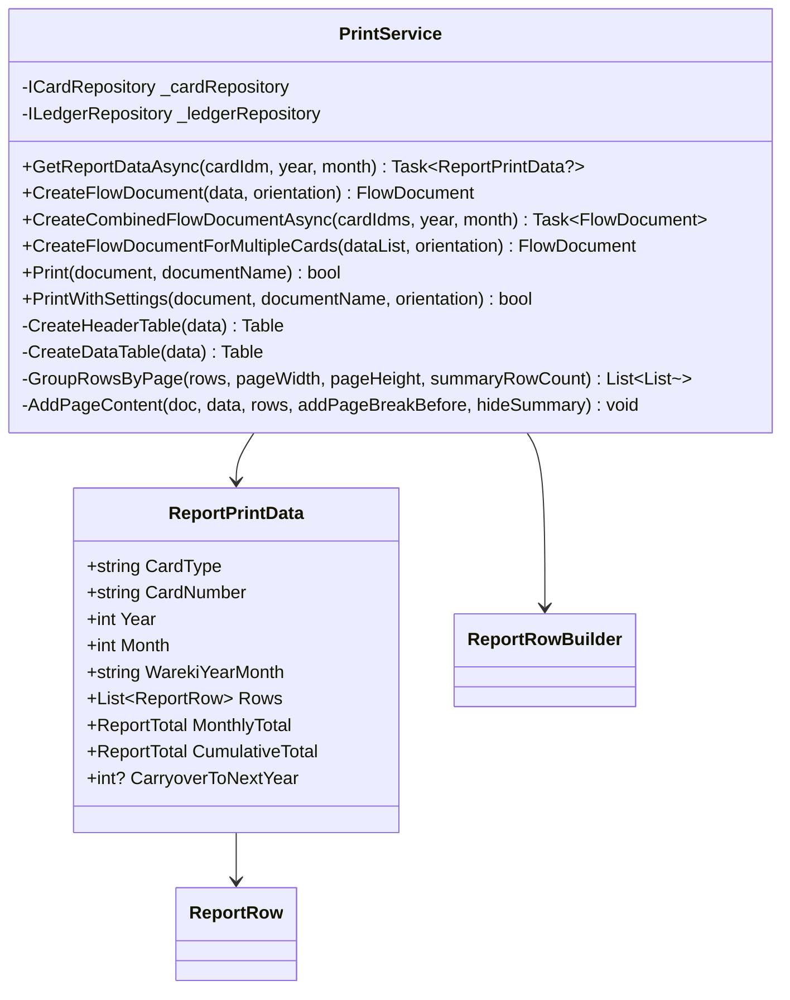
```mermaid
classDiagram
    class PrintService {
        -ICardRepository _cardRepository
        -ILedgerRepository _ledgerRepository
        +GetReportDataAsync(cardIdm, year, month) Task~ReportPrintData?~
        +CreateFlowDocument(data, orientation) FlowDocument
        +CreateCombinedFlowDocumentAsync(cardIdms, year, month) Task~FlowDocument~
        +CreateFlowDocumentForMultipleCards(dataList, orientation) FlowDocument
        +Print(document, documentName) bool
        +PrintWithSettings(document, documentName, orientation) bool
        -CreateHeaderTable(data) Table
        -CreateDataTable(data) Table
        -GroupRowsByPage(rows, pageWidth, pageHeight, summaryRowCount) List~List~~
        -AddPageContent(doc, data, rows, addPageBreakBefore, hideSummary) void
    }

    class ReportPrintData {
        +string CardType
        +string CardNumber
        +int Year
        +int Month
        +string WarekiYearMonth
        +List~ReportRow~ Rows
        +ReportTotal MonthlyTotal
        +ReportTotal CumulativeTotal
        +int? CarryoverToNextYear
    }

    PrintService --> ReportPrintData
    PrintService --> ReportRowBuilder
    ReportPrintData --> ReportRow
```

### 5.8a ReportRow / ReportRowBuilder（Issue #1023）

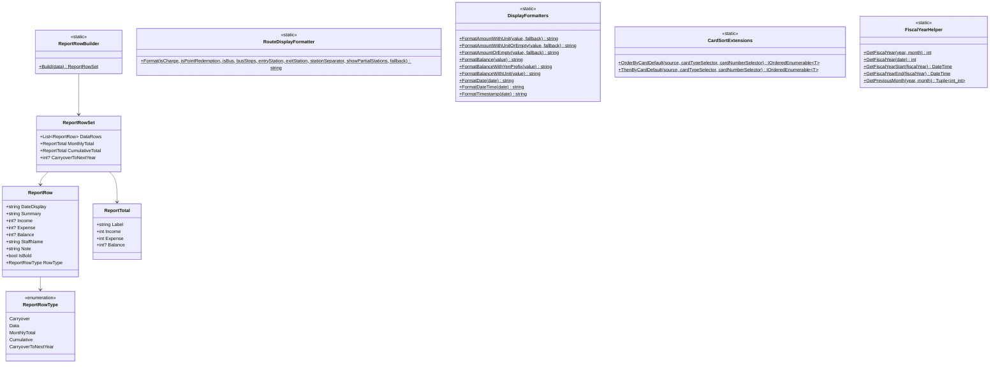
```mermaid
classDiagram
    class ReportRowType {
        <<enumeration>>
        Carryover
        Data
        MonthlyTotal
        Cumulative
        CarryoverToNextYear
    }

    class ReportRow {
        +string DateDisplay
        +string Summary
        +int? Income
        +int? Expense
        +int? Balance
        +string StaffName
        +string Note
        +bool IsBold
        +ReportRowType RowType
    }

    class ReportTotal {
        +string Label
        +int Income
        +int Expense
        +int? Balance
    }

    class ReportRowSet {
        +List~ReportRow~ DataRows
        +ReportTotal MonthlyTotal
        +ReportTotal CumulativeTotal
        +int? CarryoverToNextYear
    }

    class ReportRowBuilder {
        <<static>>
        +Build(data)$ ReportRowSet
    }

    class RouteDisplayFormatter {
        <<static>>
        +Format(isCharge, isPointRedemption, isBus, busStops, entryStation, exitStation, stationSeparator, showPartialStations, fallback)$ string
    }

    class DisplayFormatters {
        <<static>>
        +FormatAmountWithUnit(value, fallback)$ string
        +FormatAmountWithUnitOrEmpty(value, fallback)$ string
        +FormatAmountOrEmpty(value, fallback)$ string
        +FormatBalance(value)$ string
        +FormatBalanceWithYenPrefix(value)$ string
        +FormatBalanceWithUnit(value)$ string
        +FormatDate(date)$ string
        +FormatDateTime(date)$ string
        +FormatTimestamp(date)$ string
    }

    class CardSortExtensions {
        <<static>>
        +OrderByCardDefault(source, cardTypeSelector, cardNumberSelector)$ IOrderedEnumerable~T~
        +ThenByCardDefault(source, cardTypeSelector, cardNumberSelector)$ IOrderedEnumerable~T~
    }

    class FiscalYearHelper {
        <<static>>
        +GetFiscalYear(year, month)$ int
        +GetFiscalYear(date)$ int
        +GetFiscalYearStart(fiscalYear)$ DateTime
        +GetFiscalYearEnd(fiscalYear)$ DateTime
        +GetPreviousMonth(year, month)$ Tuple~int_int~
    }

    ReportRowBuilder --> ReportRowSet
    ReportRowSet --> ReportRow
    ReportRowSet --> ReportTotal
    ReportRow --> ReportRowType
```

### 5.8b FiscalYearHelper と FiscalYear ValueObject の棲み分け（Issue #1246）

日本の会計年度（4月始まり）計算には、**2 つの共存する API** がある。新規コードは **`FiscalYear` ValueObject** を使用することを推奨する。`FiscalYearHelper`（静的メソッド群）は Issue #1024 で導入された先行実装で、Value Object 化（Issue #1221）後も後方互換のため残存している。

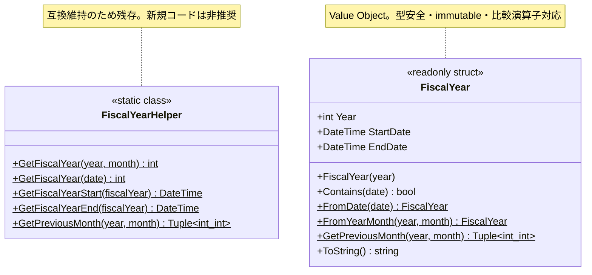
```mermaid
classDiagram
    class FiscalYearHelper {
        <<static class>>
        +GetFiscalYear(year, month)$ int
        +GetFiscalYear(date)$ int
        +GetFiscalYearStart(fiscalYear)$ DateTime
        +GetFiscalYearEnd(fiscalYear)$ DateTime
        +GetPreviousMonth(year, month)$ Tuple~int_int~
    }

    class FiscalYear {
        <<readonly struct>>
        +int Year
        +FiscalYear(year)
        +DateTime StartDate
        +DateTime EndDate
        +Contains(date) bool
        +FromDate(date)$ FiscalYear
        +FromYearMonth(year, month)$ FiscalYear
        +GetPreviousMonth(year, month)$ Tuple~int_int~
        +ToString() string
    }

    note for FiscalYearHelper "互換維持のため残存。新規コードは非推奨"
    note for FiscalYear "Value Object。型安全・immutable・比較演算子対応"
```

#### API 対応表

| FiscalYearHelper（旧 API） | FiscalYear ValueObject（新 API） | 備考 |
|---------------------------|--------------------------------|------|
| `FiscalYearHelper.GetFiscalYear(year, month)` | `FiscalYear.FromYearMonth(year, month).Year` | 戻り値の意味が型で表現される |
| `FiscalYearHelper.GetFiscalYear(date)` | `FiscalYear.FromDate(date).Year` | 同上 |
| `FiscalYearHelper.GetFiscalYearStart(fy)` | `new FiscalYear(fy).StartDate` | インスタンスメソッド化 |
| `FiscalYearHelper.GetFiscalYearEnd(fy)` | `new FiscalYear(fy).EndDate` | インスタンスメソッド化 |
| `FiscalYearHelper.GetPreviousMonth(y, m)` | `FiscalYear.GetPreviousMonth(y, m)` | 年度と無関係な純粋関数のため両者に同名で残存 |
| なし | `fy.Contains(date)` | **新機能**: 日付包含判定 |
| なし | `==`, `!=`, `<`, `>` など比較演算子 | **新機能**: 年度間比較 |
| なし | `implicit operator int(FiscalYear)` | **新機能**: 戻り値を int として扱える |

#### 使用方針

**新規コード**: `FiscalYear` ValueObject を使用すること。

```csharp
// 推奨
var fy = FiscalYear.FromDate(DateTime.Today);
if (fy.Contains(record.Date))
{
    total += record.Amount;
}

// 年度間比較も自然に書ける
var fy2025 = new FiscalYear(2025);
var fy2026 = new FiscalYear(2026);
Assert.True(fy2025 < fy2026);
```

**既存コード**: `FiscalYearHelper` のままでもビルドは通るが、触った際に段階的に `FiscalYear` へ移行する。一括置換は差分が大きくなるため、機能追加や周辺修正のついでに置き換える。

#### 段階的移行計画

既存の `FiscalYearHelper` 呼び出しは全 5 ファイル 12 箇所（本設計書作成時点）。優先度別の移行順を以下に示す。

| 優先度 | 対象ファイル | 呼び出し数 | 移行の判断基準 |
|--------|------------|----------|----------------|
| **高** | `Common/WarekiConverter.cs:137, 147, 157` | 3 | コアユーティリティ。WarekiConverter 自体の責務再整理と合わせて FiscalYear ベースに刷新すべき |
| **高** | `Services/ReportService.cs:671` | 1 | 帳票出力の年度判定。単発呼び出しなので `FiscalYear.FromYearMonth(y, m).Year` に直接置換可能 |
| **高** | `Services/ReportDataBuilder.cs:95, 96, 182, 197` | 4 | 年度跨ぎの月計・累計計算の起点。`Contains(date)` 導入で意図がより明瞭になる |
| **中** | `ViewModels/CardManageViewModel.cs:453` | 1 | 年度途中導入時の `CarryoverFiscalYear` 計算（Issue #1215）。単発で置換容易 |
| **低** | `Services/DebugDataService.cs:196, 197, 703` | 3 | DEBUG ビルドのテストデータ生成。本番挙動に影響しないため後回し可 |

#### 将来の廃止計画

`FiscalYearHelper` は **v3.0 リリース時に `[Obsolete]` 属性付与** → **v3.1 で削除** を目指す。以下が揃った段階で `[Obsolete]` を付与：

1. 上記 12 箇所がすべて `FiscalYear` ValueObject に移行済み
2. 移行後の全体テストが Green
3. 外部プラグイン・拡張が存在しないこと（現状該当なし）

`[Obsolete]` 期間中は `FiscalYearHelper` 内部から `FiscalYear` ValueObject に委譲する形に書き換え、振る舞いの乖離を防ぐ。

### 5.9 InputSanitizer

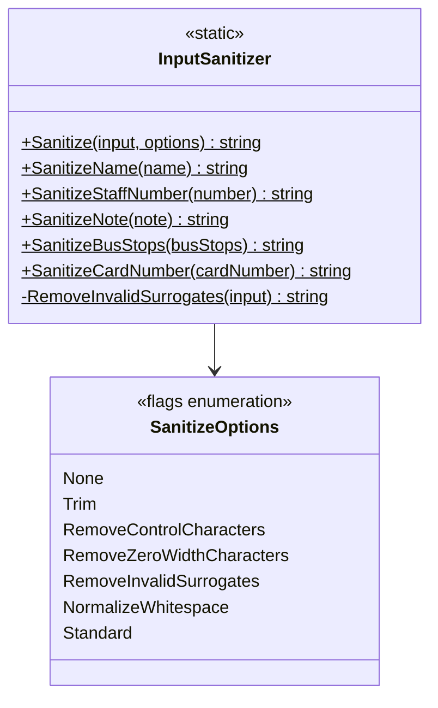
```mermaid
classDiagram
    class InputSanitizer {
        <<static>>
        +Sanitize(input, options)$ string
        +SanitizeName(name)$ string
        +SanitizeStaffNumber(number)$ string
        +SanitizeNote(note)$ string
        +SanitizeBusStops(busStops)$ string
        +SanitizeCardNumber(cardNumber)$ string
        -RemoveInvalidSurrogates(input)$ string
    }

    class SanitizeOptions {
        <<flags enumeration>>
        None
        Trim
        RemoveControlCharacters
        RemoveZeroWidthCharacters
        RemoveInvalidSurrogates
        NormalizeWhitespace
        Standard
    }

    InputSanitizer --> SanitizeOptions
```

### 5.10 StationMasterService

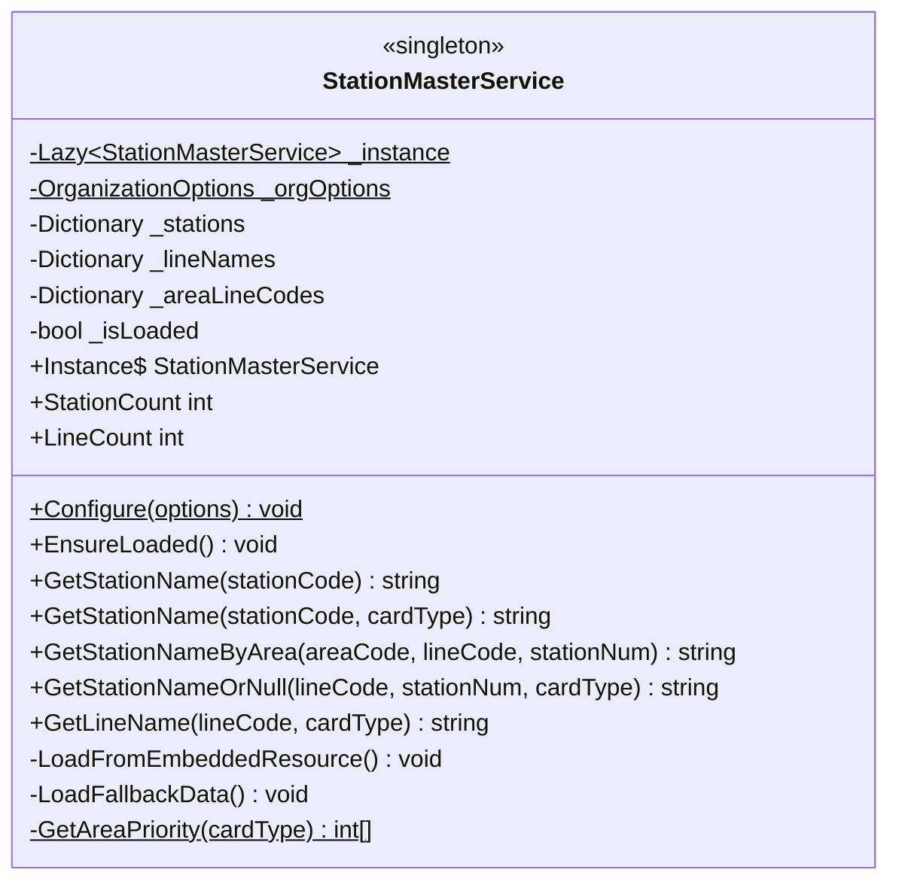
```mermaid
classDiagram
    class StationMasterService {
        <<singleton>>
        -Lazy~StationMasterService~ _instance$
        -OrganizationOptions _orgOptions$
        -Dictionary _stations
        -Dictionary _lineNames
        -Dictionary _areaLineCodes
        -bool _isLoaded
        +Instance$ StationMasterService
        +Configure(options)$ void
        +EnsureLoaded() void
        +GetStationName(stationCode) string
        +GetStationName(stationCode, cardType) string
        +GetStationNameByArea(areaCode, lineCode, stationNum) string
        +GetStationNameOrNull(lineCode, stationNum, cardType) string
        +GetLineName(lineCode, cardType) string
        +StationCount int
        +LineCount int
        -LoadFromEmbeddedResource() void
        -LoadFallbackData() void
        -GetAreaPriority(cardType)$ int[]
    }
```

### 5.11 OrganizationOptions

組織固有の設定値を保持する構成クラス。`appsettings.json` の `OrganizationOptions` セクションからバインドされ、`SummaryGenerator` と `StationMasterService` に静的 `Configure()` メソッドで適用される。セクション未定義時はデフォルト値（福岡市向け）が使用される。

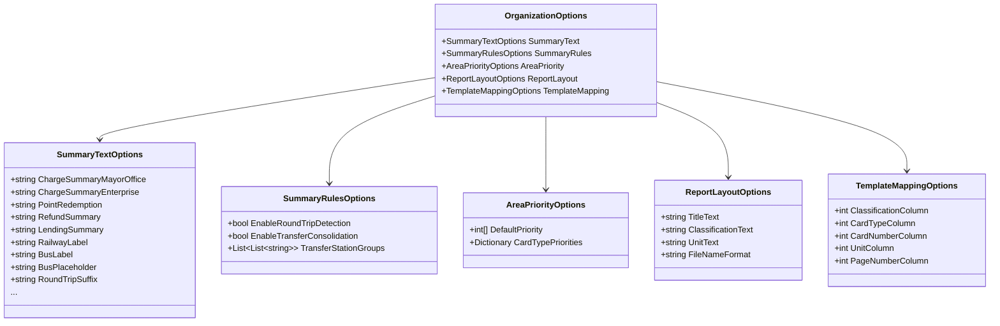
```mermaid
classDiagram
    class OrganizationOptions {
        +SummaryTextOptions SummaryText
        +SummaryRulesOptions SummaryRules
        +AreaPriorityOptions AreaPriority
        +ReportLayoutOptions ReportLayout
        +TemplateMappingOptions TemplateMapping
    }

    class SummaryTextOptions {
        +string ChargeSummaryMayorOffice
        +string ChargeSummaryEnterprise
        +string PointRedemption
        +string RefundSummary
        +string LendingSummary
        +string RailwayLabel
        +string BusLabel
        +string BusPlaceholder
        +string RoundTripSuffix
        ...
    }

    class SummaryRulesOptions {
        +bool EnableRoundTripDetection
        +bool EnableTransferConsolidation
        +List~List~string~~ TransferStationGroups
    }

    class AreaPriorityOptions {
        +int[] DefaultPriority
        +Dictionary CardTypePriorities
    }

    class ReportLayoutOptions {
        +string TitleText
        +string ClassificationText
        +string UnitText
        +string FileNameFormat
    }

    class TemplateMappingOptions {
        +int ClassificationColumn
        +int CardTypeColumn
        +int CardNumberColumn
        +int UnitColumn
        +int PageNumberColumn
    }

    OrganizationOptions --> SummaryTextOptions
    OrganizationOptions --> SummaryRulesOptions
    OrganizationOptions --> AreaPriorityOptions
    OrganizationOptions --> ReportLayoutOptions
    OrganizationOptions --> TemplateMappingOptions
```

#### 5.11a 設定項目は「読まれている」ことを規約テストで担保する（Issue #1820）

`OrganizationOptions` の全プロパティが本番コードから実際に読まれていることを、
`OrganizationOptionsUsageConventionTests` がリフレクション＋ソーステキストの静的検査で固定する。

- **検査対象はリフレクションで導出する**（ファイル名・項目名で列挙しない）。項目を足した人が
  検査の追加を忘れても、自動的に検査対象へ入る（`.claude/rules/development-conventions.md`
  「ガードを書くときは経路を列挙する」）
- **検査はコメント除去後に行う**（`TestSourceInspection.RemoveCommentsPreservingLines`）。
  除去しないと「この項目は未使用」と説明したコメント自体が「使用されている」と判定される（極性の反転）
- **照合は所有者ごと**（`ReportLayout.TitleText` の形）に行う。プロパティ名だけで照合すると、
  XAML から生成される同名の識別子（`ToastNotificationWindow.TitleText`）を拾って空振りする
- 本テストは「読まれているか」だけを見る。読まれた値が**効いている**ことは、消費側の個別テストが
  **既定と異なる値を設定してから**表明する（`ReportFileNameConfigurationConsumerTests` /
  `BusTextConfigurationConsumerTests`）

**背景**: `TemplateMapping` は 18 項目中 5 項目しか読まれておらず、`ReportService` は同名の
ローカル `const` と列リテラルを使っていた。管理者マニュアル §7.4 が設定可能と案内していたため、
「設定できるのに反映されない」状態（dead config）が広告されていた。未実装の 13 項目は削除した。

#### 5.11b ReportFileNameFactory（Issue #1820）

帳票の年度ファイル名を生成する唯一のチョークポイント。

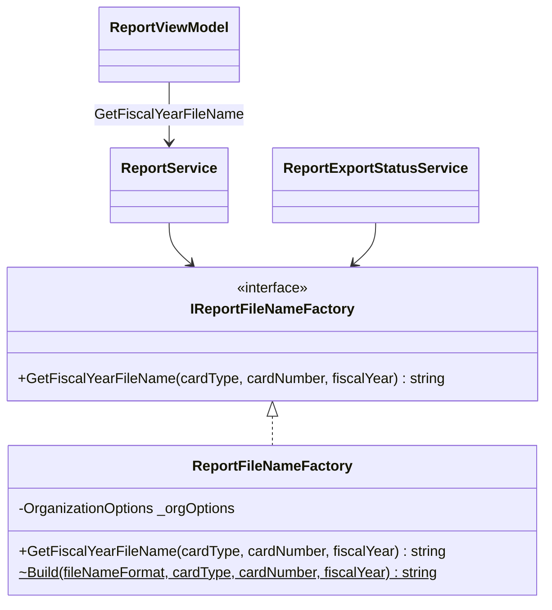
```mermaid
classDiagram
    class IReportFileNameFactory {
        <<interface>>
        +GetFiscalYearFileName(cardType, cardNumber, fiscalYear) string
    }

    class ReportFileNameFactory {
        -OrganizationOptions _orgOptions
        +GetFiscalYearFileName(cardType, cardNumber, fiscalYear) string
        ~Build(fileNameFormat, cardType, cardNumber, fiscalYear)$ string
    }

    IReportFileNameFactory <|.. ReportFileNameFactory
    ReportService --> IReportFileNameFactory
    ReportExportStatusService --> IReportFileNameFactory
    ReportViewModel --> ReportService : GetFiscalYearFileName
```

- **`static` にしない**。修正前は `ReportService.GetFiscalYearFileName` が `static` で、
  注入済みの `OrganizationOptions` を参照できず `new OrganizationOptions()` の既定値を
  ハードコードしていた（同じ帳票の `TitleText` / `ClassificationText` は設定が効くため
  「一部だけ効かない」という最も紛らわしい状態だった）
- **`ReportExportStatusService` の依存は省略可能にしない**。既定値で組み立てるフォールバックを
  置くと、DI の配線漏れが「設定した書式が静かに無視される」形で潜在化する
- **書式そのものを検証する**。Issue #1703 の保証（生成名は単一のファイル名）は、構成要素の
  サニタイズだけでは書式側から破られる。組み立て結果がパス構造を持つ場合・書式が不正な場合
  （`{3}` / 閉じ括弧の欠落）・空の場合は、いずれも既定書式へフォールバックする
- **`Path.GetFileName` との一致だけでは足りない**（コードレビュー指摘）。`*` `?` は
  **ファイル名としては不正だがパスとしては不正でない**ため `Path.GetInvalidPathChars()` に
  含まれず、`Path.GetFileName` を素通りする。`IndexOfAny(Path.GetInvalidFileNameChars())` で
  先に弾かないと `workbook.SaveAs` の時点で例外になり、「管理者の設定ミスで帳票作成を止めない」
  という本クラスの目的そのものが果たせない。**「不正な文字」を扱う API はパス用とファイル名用で
  集合が違う**ことを、どちらを使うか決める前に確認する
- **縮退したことを Information で記録する**（同）。フォールバックは**正常終了する**ため、
  記録が無いと管理者から見て「設定したのに反映されない」＝本 Issue が是正した状態と区別が付かない
  （`.claude/rules/development-conventions.md` #1744「フォールバックが働いたことを呼び出し元が
  知れるか」、#1819「縮退を伴う処理では規模を記録する」）。ログには**設定値と実際に使った既定書式の
  両方**を載せる（片方だけでは突き合わせられない）。一括出力ではカード枚数ぶん呼ばれるため
  **同一書式につき 1 回**に絞る（#1819 のヘルスチェックと同じ判断）。**空設定はログを出さない** —
  空欄は「既定を使う」という正当な指定であり、出すと既定配布の全環境で帳票のたびにログが出て
  本当の設定ミスが埋もれる

### 5.12 TemplateResolver

```mermaid
classDiagram
    class TemplateResolver {
        <<static>>
        -string TemplateRelativePath$
        -string EmbeddedResourceName$
        -string TempFilePrefix$
        +ResolveTemplatePath()$ string
        +TemplateExists()$ bool
        +CleanupTempFiles()$ void
        -ExtractEmbeddedTemplate()$ string?
    }

    class TemplateNotFoundException {
        +string TemplateName
        +IReadOnlyList~string~ SearchedPaths
        +GetDetailedMessage() string
    }

    TemplateResolver ..> TemplateNotFoundException : throws
```

### 5.13 ToastNotificationService

```mermaid
classDiagram
    class IToastNotificationService {
        <<interface>>
        +ShowLendNotification(cardType, cardNumber) void
        +ShowReturnNotification(cardType, cardNumber, balance, isLowBalance) void
        +ShowStaffRecognizedNotification(staffName) void
        +ShowInfo(title, message) void
        +ShowWarning(title, message) void
        +ShowError(title, message) void
    }

    class ToastNotificationService {
        +ShowLendNotification(cardType, cardNumber) void
        +ShowReturnNotification(cardType, cardNumber, balance, isLowBalance) void
        +ShowStaffRecognizedNotification(staffName) void
        +ShowInfo(title, message) void
        +ShowWarning(title, message) void
        +ShowError(title, message) void
    }

    ToastNotificationService ..|> IToastNotificationService
```

### 5.14 DebugDataService

```mermaid
classDiagram
    class DebugDataService {
        <<DEBUG only>>
        -IStaffRepository _staffRepository
        -ICardRepository _cardRepository
        -ILedgerRepository _ledgerRepository
        +Staff[] TestStaffList$
        +IcCard[] TestCardList$
        +RegisterAllTestDataAsync() Task
        +RegisterTestStaffAsync() Task
        +RegisterTestCardsAsync() Task
        +RegisterSampleHistoryAsync() Task
    }
```

### 5.15 LedgerMergeService

```mermaid
classDiagram
    class LedgerMergeService {
        -ILedgerRepository _ledgerRepository
        -SummaryGenerator _summaryGenerator
        -OperationLogger _operationLogger
        -DbContext _dbContext
        -ILogger _logger
        +MergeAsync(ledgerIds, operatorIdm) Task~LedgerMergeResult~
        +UnmergeAsync(mergeHistoryId, operatorIdm) Task~LedgerMergeResult~
        +GetUndoableMergeHistoriesAsync() Task~List~MergeHistoryEntry~~
    }

    class LedgerMergeResult {
        +bool Success
        +string ErrorMessage
        +Ledger MergedLedger
    }

    class MergeHistoryEntry {
        +int Id
        +DateTime MergedAt
        +int TargetLedgerId
        +string Description
    }

    LedgerMergeService --> LedgerMergeResult
    LedgerMergeService --> MergeHistoryEntry
```

**統合バリデーション（`Validate`）**: 以下の統合を拒否する。

| 条件 | 理由 |
|------|------|
| 異なるカードの履歴 | カードごとの残高チェーンが壊れる |
| 貸出中レコードを含む | 返却時に物理削除されるプレースホルダのため |
| チャージと利用の混在（受入と払出の混在） | 月次帳票は「チャージと利用は別行」（Issue #837） |
| チャージとポイント還元の混在（Issue #1736） | 両者とも受入のみで上の3条件を通過するが、混在した詳細集合は `SummaryGenerator.Generate` がどの摘要パターンにも該当せず空文字を返し、摘要が空欄の行が保存される。集計はチャージ／ポイント還元行を摘要文字列の完全一致で分類するため（`business-logic.md`「ledger を集計するときの前提」）、結合摘要を新設せず統合自体を拒否する。暗黙のポイント還元（Issue #942: 負金額・フラグなし）も `SummaryGenerator.IsImplicitPointRedemption` で同じ分類とし、摘要生成との判定一致を保つ |

**摘要再生成の空文字ガード（Issue #1736）**: 統合先の摘要は `SummaryGenerator.Generate` で再生成するが、空文字が返った場合（明細を持たない手入力行同士の統合等）は統合先の元の摘要を維持する（`LedgerSplitService` の分割時ガードと同じパターン）。摘要が空欄の行は物品出納簿でどの取引か判別できなくなるため、空欄のまま保存しない。

**統合の取り消し（`UnmergeAsync`、Issue #1806）**: 台帳の復元（`ILedgerMergeRepository.UnmergeLedgersAsync(undoData, tx)`）と「取り消し済み」マーク（`MarkMergeHistoryUndoneAsync(historyId, tx)`）を `MergeAsync` と同じ形で 1 つの `BeginTransactionAsync` スコープに束ね、どちらかが `false`（競合）ならロールバックする。

| 段階 | 競合の検出 | 利用者への案内 |
|------|-----------|---------------|
| 履歴の取得（`GetMergeHistoryEntryAsync`） | `is_undone = 1` の履歴は対象外（null） | 「統合履歴が見つかりません。他のPCまたは他の操作で既に取り消された可能性…」 |
| 台帳の復元 | 明細の移動 `UPDATE … WHERE rowid = @rowid AND ledger_id = @targetId` と統合先の `UPDATE … WHERE id` の影響行数が 1 でない（統合後の明細編集・分割・削除、統合先の削除） | 「統合の取り消しに失敗しました。統合後にこの履歴の内容が編集・分割・削除されたか、他のPC…で先に取り消された可能性…」 |
| 取り消し済みマーク | `UPDATE ledger_merge_history … WHERE id = @id AND is_undone = 0` が 0 行（他 PC が同時に取り消した） | 「…この統合は他のPCまたは他の操作で既に取り消されています…」 |
| 例外 | — | `ExceptionMessageFormatter.ToUserMessage(ex, "統合の取り消し")`（生の `ex.Message` は UI へ出さない。Issue #1614） |

失敗時は `MainViewModel.ExecuteUnmergeAsync` が履歴一覧と「統合を元に戻す」ボタンの有効状態を再読込する（統合コマンドの失敗分岐と同じ #1753 の作法）。復元だけを先に確定させない理由と、rowid スコープの根拠は §5.5b を参照。

### 5.16 CardLockManager

```mermaid
classDiagram
    class CardLockManager {
        <<IDisposable>>
        -ConcurrentDictionary _locks
        -ILogger _logger
        +GetLock(cardIdm) SemaphoreSlim
        +ReleaseLockReference(cardIdm) void
        +CleanupExpiredLocks() void
        +ClearAllLocks() void
        +HasLock(cardIdm) bool
        +Dispose() void
    }
```

### 5.17 StaffAuthService

```mermaid
classDiagram
    class IStaffAuthService {
        <<interface>>
        +RequestAuthenticationAsync(operationDescription) Task~StaffAuthResult~
    }

    class StaffAuthService {
        -IStaffRepository _staffRepository
        -ICardReader _cardReader
        -ISoundPlayer _soundPlayer
        -ICurrentOperatorContext _operatorContext
        +RequestAuthenticationAsync(operationDescription) Task~StaffAuthResult~
    }

    class StaffAuthResult {
        +string Idm
        +string StaffName
    }

    StaffAuthService ..|> IStaffAuthService
    StaffAuthService --> StaffAuthResult
    StaffAuthService --> ICurrentOperatorContext : BeginSession()
```

**Issue #1265**: 認証成功時に `ICurrentOperatorContext.BeginSession(idm, name)` を呼び、後続の `OperationLogger` が操作者を一元的に解決できるようにする。

### 5.17a CurrentOperatorContext

```mermaid
classDiagram
    class ICurrentOperatorContext {
        <<interface>>
        +string? CurrentIdm
        +string? CurrentName
        +bool HasSession
        +BeginSession(idm, name) void
        +ClearSession() void
    }

    class CurrentOperatorContext {
        -ISystemClock _clock
        -TimeSpan _sessionDuration
        -string? _idm
        -string? _name
        -DateTime _expiresAt
        +static TimeSpan DefaultSessionDuration
    }

    CurrentOperatorContext ..|> ICurrentOperatorContext
    CurrentOperatorContext --> ISystemClock
```

**責務**:
- 認証済み操作者の IDm / 氏名を一元的に保持（Singleton）
- 指定時間（既定 5 分）で自動失効
- 監査ログ（`operation_log`）への操作者なりすましを防止

**使用フロー**:
1. `StaffAuthService.RequestAuthenticationAsync()` が職員証タッチ成功時に `BeginSession()` を呼ぶ
2. `OperationLogger.LogXxxAsync()` が `CurrentIdm` / `CurrentName` を参照してログを記録
3. セッションが失効すると `HasSession=false` となり、以降のログは `GuiOperator` へフォールバック

**Issue #1265**: `OperationLogger` の旧 API（`operatorIdm` 引数付き）は `[Obsolete]` になり、渡された引数は無視される。操作者は常にこのコンテキストから解決される。

### 5.17b OperationLogger

```mermaid
classDiagram
    class OperationLogger {
        -IOperationLogRepository _operationLogRepository
        -ICurrentOperatorContext _operatorContext
        +LogStaffInsertAsync(staff) Task
        +LogStaffUpdateAsync(before, after) Task
        +LogStaffDeleteAsync(staff) Task
        +LogStaffRestoreAsync(staff) Task
        +LogCardInsertAsync(card) Task
        +LogCardUpdateAsync(before, after) Task
        +LogCardDeleteAsync(card) Task
        +LogCardRestoreAsync(card) Task
        +LogLedgerInsertAsync(ledger) Task
        +LogLedgerUpdateAsync(before, after) Task
        +LogLedgerDeleteAsync(ledger) Task
        +LogLedgerMergeAsync(sources, merged) Task
        +LogLedgerSplitAsync(original, splits) Task
        +LogImportAsync(tableName, filePath, inserted, skipped, errors) Task
        +LogExportAsync(tableName, filePath, recordCount) Task
        +LogBackupAsync(filePath) Task
        +LogRestoreAsync(filePath) Task
    }

    OperationLogger --> ICurrentOperatorContext : ResolveOperator()
    OperationLogger --> IOperationLogRepository : InsertAsync()
```

**定数 (`OperationLogger.Actions`)**

| 定数 | 値 | 用途 |
|------|-----|------|
| `Insert` | `INSERT` | レコード新規登録 |
| `Update` | `UPDATE` | レコード更新 |
| `Delete` | `DELETE` | レコード削除（論理／物理） |
| `Restore` | `RESTORE` | 論理削除レコードの復元 または DB 丸ごとリストア（`TargetTable` で区別） |
| `Merge` | `MERGE` | 履歴レコード統合 |
| `Split` | `SPLIT` | 履歴レコード分割 |
| `Import` | `IMPORT` | CSV インポート実行（Issue #1302） |
| `Export` | `EXPORT` | CSV/Excel エクスポート実行（Issue #1302） |
| `Backup` | `BACKUP` | DB バックアップ取得（Issue #1302） |

**定数 (`OperationLogger.Tables`)**

| 定数 | 値 | 用途 |
|------|-----|------|
| `Staff` | `staff` | 職員テーブル |
| `IcCard` | `ic_card` | IC カードテーブル |
| `Ledger` | `ledger` | 履歴テーブル |
| `LedgerDetail` | `ledger_detail` | 履歴詳細テーブル（Issue #1302） |
| `Database` | `database` | DB 丸ごと操作（BACKUP / RESTORE、Issue #1302） |

**Issue #1302**: データ移行・災害復旧系統（CSV インポート / エクスポート / バックアップ / リストア）も監査証跡として `operation_log` に記録する。`LogImportAsync` / `LogExportAsync` は `TargetTable` に対象テーブル名、`TargetId` にファイル名 (basename) を格納し、`AfterData` の JSON にフルパスと件数（Inserted / Skipped / Error、RecordCount）を含める。`LogBackupAsync` / `LogRestoreAsync` は `TargetTable="database"` でレコード単位の復元と区別される。すべての API は `ICurrentOperatorContext` から操作者を解決し、セッション失効時は `GuiOperator`（`Idm=0000000000000000` / `Name=GUI操作`）へフォールバックする（#1265 の方針を踏襲）。

**Issue #1741**: 一括操作ログの呼び出し・記録・表示について、次の3点を守ること。

1. **`filePath` / `tableName` に画面の一時状態プロパティを直接渡さない。** 監査記録の入力（何を取り込んだか）とビュー状態（いま何を選んでいるか）は寿命が異なる。`ExecuteImportAsync` は成功分岐で `ClearPreview()` が `ImportPreviewFile` を空にした後に `LogImportAsync(..., ImportPreviewFile, ...)` を呼んでいたため、`TargetId` と `AfterData.FilePath` が空文字の監査行が残っていた。`Path.GetFileName("")` は例外を投げず空文字を返すので、**この欠落は無言で起きる**。`SelectedImportType` も同様に await 後に読まれており（データ種別コンボはアクセスキーを持ち `IsBusy` 中も操作できる）、実際とは異なる `TargetTable` を記録し得た。呼び出し元は**操作の開始時にパスと対象テーブルをローカル変数へ確定**させ、記録までその値を使い回すこと。なお本欠陥の調査時、同じ結果処理が `ImportAsync`（直接インポート）に全文複製されており、複製側が無傷であることを別途確認する作業が発生した。**Issue #1785 で結果処理を `DataExportImportViewModel.RunImportAsync` / `HandleImportResultAsync` へ共通化済み**であり、インポート結果の扱いを変更するときはコマンド側へ複製せず共通メソッドへ書くこと（複製の復活は `DataExportImportViewModelImportPathSharingTests` が検出する）。なお `ClearPreview()` の位置は Issue #1781 で**成功分岐から `HandleImportResultAsync` の冒頭へ移した**（部分成功でも取り込みが確定していれば畳むため）。呼び出し元でパスを確定させる本規約は、破棄が早まったことでいっそう前提となる。さらに Issue #1782 で `RunImportAsync` の `clearPreviewAfterImport` 引数を撤廃し、**取り込み経路（プレビュー経由／直接インポート）によらず、書き込みが確定したら破棄する**形へ統一した（直接インポートで残していたプレビューは「別ファイル」であるだけでなく、取り込み前の DB を基準に算出した件数のため内容自体が古い）。破棄するかどうかを引数で選ばせない理由は #1726 と同じで、選択の余地がある限り後から増えた経路が再び誤った値を渡すため。あわせて、破棄した対象が**取り込んだファイル以外**だった場合のみ完了ダイアログへ案内を添える（`BuildDiscardedPreviewNotice`）。案内文の材料（プレビューのファイル名）は `ClearPreview()` が `ImportPreviewFile` を空にする前に確定させること — 本項冒頭と同じ罠である。**結果に応じて出す表示は、結果を検査したあとで確定させる**（Issue #1783）。`LastImportedFile`（画面の「インポート完了: ◯◯.csv」）は `switch` の直後・`result` を見る前に無条件で代入されていたため、完全に失敗した取り込みでもエラーダイアログの隣に完了表示が並んだ。判定を新設せず `HandleImportResultAsync` の `importCommitted`（プレビュー破棄と同じ「書き込みが確定したか」）へ相乗りさせ、取り込み開始時（`RunImportAsync` 冒頭）に空へ戻して前回の結果を持ち越さない。エクスポート側の `LastExportedFile` は元から `if (result.Success)` の内側にあり、**同型の正しい実装が同一クラス内にあるのにインポート側だけが外れていた**。**結果ダイアログは `BeginBusy` スコープの外で表示する**（Issue #1784）。`IDialogService` の実装は同期モーダル（`MessageBox.Show`）で職員が OK を押すまでブロックするため、スコープ内から呼ぶと `BusyScope.Dispose()` が走らず、処理中オーバーレイとプログレスバーが完了ダイアログの背後に残り続ける。`HandleImportResultAsync` は**ダイアログを表示せず、表示処理（`Action`）を戻り値として返す**設計とし、`RunImportAsync` がスコープを抜けた後に1回だけ実行する。ステータス文言・エラー一覧・プレビュー破棄といった画面状態の更新はダイアログより先に反映させたいため `HandleImportResultAsync` 内に残す。**分岐を追加するときは `_dialogService.ShowXxx` を直接呼ばず、戻り値の `Action` に載せること**（ダイアログ種別の列挙を持たない形にしてあるため、新分岐で表示地点を書き足し忘れて無表示になる経路は生まれない）。この規約は `DataExportImportViewModelImportPathSharingTests` がソーステキスト検査で固定する — 挙動テストは既存分岐しか通らないため、新しい分岐だけが規約から外れても緑のまま通るためである。遅延させた表示は `try`/`catch` で囲み、**通知の失敗を確定済みの取り込みの失敗として伝播させない**（コミット後の後処理を成否の判定に巻き込まない、Issue #1727）。エクスポート側（`ExportToFileAsync`）は Issue #1383 で同じ構造へ是正済みで、インポート側だけが取り残されていた。**なお本規約が適用済みなのはこの3経路（CSV エクスポート／操作ログ Excel エクスポート／CSV インポート）のみで、カード管理・職員管理・システム管理の各 ViewModel には未是正の箇所が計10か所残っている（Issue #1793）。**
2. **記録の失敗を業務処理の失敗として通知しない。** 本 API 群は `OperationLogRepository` まで含めて例外を握りつぶさないため、共有モードでは `SQLITE_BUSY` が実際に送出される。データの書き込みが確定した後に呼ぶ以上、例外を業務処理の `catch` へ流すと**確定済みの操作が「失敗」と通知され、再実行による二重登録**を招く（#1727「コミット確定後の後処理を、成否の判定に巻き込まない」）。呼び出し元は記録だけを個別に `try/catch` し（`DataExportImportViewModel.TryLogImportAsync` が参考実装）、失敗時は「処理は完了済み・再実行しない・管理者へ連絡」を案内する。**無言で握りつぶさない**（技術的詳細はログへ）。
3. **payload に項目を足したら表示側2か所にも足す。** 一括操作の payload は**対象テーブルではなく Action で形が決まる**ため、テーブル別の仕組みからは漏れる。① `OperationLogExcelExportService.GetFieldNameMap` は全テーブルのマップへ一括操作項目（`BulkOperationFieldNames`）を併合する（マップに無いプロパティは読み飛ばされ、Excel の「変更前 / 変更後」列が空欄になる。#1726 と同型） ② `OperationLogSearchViewModel.GenerateTargetDisplayName` は payload に `FileName` があればそれを「対象詳細」列に表示する（テーブル別の生成メソッドはエンティティ項目しか見ないため必ず空になる）。`RESTORE` は DB 丸ごとリストアと `LogStaffRestoreAsync`（レコード単位復元）で共用されるため、**Action ではなく `FileName` の有無で振り分ける**。

**呼び出し元**:
- `DataExportImportViewModel.ExportAsync` / `HandleImportResultAsync`（`ExecuteImportAsync`・`ImportAsync` の両コマンドが `RunImportAsync` 経由で到達する共通の結果処理、Issue #1785） — CSV 操作の成功時（部分成功時も `ImportedCount > 0` なら記録）
- `SystemManageViewModel.CreateBackupAsync` / `RestoreAsync` / `RestoreFromFileAsync` — バックアップ・リストアの成功時
- リストア成功後の `operation_log` は**リストア後の新 DB** に記録される（既存 DB 接続が同一パスの新ファイルを参照するため）

### 5.18 DialogService

```mermaid
classDiagram
    class IDialogService {
        <<interface>>
        +ShowConfirmation(message, title) bool
        +ShowWarningConfirmation(message, title) bool
        +ShowInformation(message, title) void
        +ShowWarning(message, title) void
        +ShowError(message, title) void
        +ShowCardRegistrationModeDialog() CardRegistrationModeResult
    }

    class DialogService {
        +ShowConfirmation(message, title) bool
        +ShowWarningConfirmation(message, title) bool
        +ShowInformation(message, title) void
        +ShowWarning(message, title) void
        +ShowError(message, title) void
        +ShowCardRegistrationModeDialog() CardRegistrationModeResult
        #ResolveOwner() Window
        #ShowMessageBoxCore(owner, message, title, button, image) MessageBoxResult
        -Show(message, title, button, image) MessageBoxResult
    }

    class DialogOwnerResolver {
        <<static>>
        +Resolve() Window
        ~SelectOwner(windows, isUsable, isActive, isEnabled) T
        ~IsUsableOwnerState(hasHandle, showActivated) bool
        ~ShouldDeferToNativeActiveWindow(activeHandle, windowHandles) bool
    }

    DialogService ..|> IDialogService
    DialogService ..> DialogOwnerResolver
```

#### 5.18a モーダル表示には必ずオーナーを渡す（Issue #1794）

`MessageBox.Show(message, title, button, image)` のようにオーナーを渡さないオーバーロードでは、WPF が `GetActiveWindow()` でオーナーを解決する。**呼び出しスレッドがフォアグラウンドでないときこれは NULL になり**（ownerless）、下位のウィンドウが無効化されない。

処理中オーバーレイ（`Border Grid.RowSpan="6"`）は視覚要素であると同時に**全面クリックシールド**でもあり、`IsBusy=true` の間は下位のボタンへのクリックを遮っていた。Issue #1383 / #1784 / #1793 で「オーバーレイを閉じてから結果ダイアログを表示する」構造へ是正したことにより、このシールドも同時に外れる。結果、職員が alt-tab した状態でエラーダイアログが出ると、**背後の「インポート実行」ボタンが有効なまま押せてしまい、モーダルのメッセージループ内側で処理が再入する**。

- 表示は必ず `DialogService.Show`（private）へ集約し、そこで `ResolveOwner()` の結果を `ShowMessageBoxCore` へ渡す。**`MessageBox.Show` の直呼びを増やさないこと**（`DialogServiceOwnerTests` の静的検査が検出する）
- オーナーの選択規則は `Common/DialogOwnerResolver` が持つ。優先順位は **アクティブ → モーダル子に塞がれていない（Win32 `IsWindowEnabled`）ウィンドウのうち最後 → 使用可能な最後のウィンドウ**。`Application.MainWindow` を特別扱いしない（**モーダルダイアログが開いている間にメイン画面をオーナーにすると、そのダイアログが無効化されず欠陥がそのまま残る**）
  - 「モーダル子に塞がれているか」は **WPF の `Window.IsEnabled` では判定できない**。`ShowDialog()` も Win32 `MessageBox` も無効化は `EnableWindow(FALSE)` で行い、WPF の `Window` は `WM_ENABLE` を扱わないため `IsEnabled` 依存関係プロパティは true のまま。P/Invoke の `IsWindowEnabled(hwnd)` を使う（`IsEnabled` で書くとこの段は「最後に生成されたウィンドウ」に退化し、生成順とモーダルの重なり順が一致する間だけ偶然正しく動く）
- **WPF 以外のウィンドウ（表示中の `MessageBox` / `OpenFileDialog` 等）がアクティブなときは null を返し、WPF の解決（`GetActiveWindow()`）に委ねる**（`ShouldDeferToNativeActiveWindow`）。是正前の ownerless は入れ子の `MessageBox`（確認ダイアログ表示中の職員証タッチで別の確認が出る経路等）で外側の `MessageBox` をオーナーとし外側を無効化していた。ここで WPF ウィンドウを選ぶと外側が押せたまま残る。非フォアグラウンド時は `GetActiveWindow()` が NULL なので選択規則を妨げない
- 候補は「ウィンドウハンドルを持ち（表示済みでクローズ前）、**アクティブ化する**（`ShowActivated`）」ものに限る。ハンドルを持たない（未表示・クローズ済み）ウィンドウを `MessageBox.Show(owner, ...)` へ渡しても例外にはならず、WPF は黙って `GetActiveWindow()` へ退化する（＝オーナーを渡したつもりで ownerless）。`IsLoaded` ではなくハンドルの有無で判定する（クローズ後も `IsLoaded` が true のまま残る場合があるため）。**`IsVisible` は条件に含めない** — オーナー（メイン画面）の最小化で Win32 が所有ウィンドウを隠す（`SW_PARENTCLOSING`）と WPF は所有ダイアログの `IsVisible` を false にするため、含めると最前面のモーダルダイアログだけが候補から落ち、無効化済みのメイン画面がオーナーになって復元後にダイアログのボタンが押せたまま残る（本アプリは `Hide()` を使わないため「ハンドルあり」＝「表示済みでクローズ前」）
- **`ShowActivated="False"` のウィンドウを候補から外す理由**: `ToastNotificationWindow` は `Topmost` かつ `ShowActivated="False"` の非モーダルウィンドウで、貸出・返却のたびに**最後に生成されて** `Application.Windows` に載る。除外しないと、アプリが非フォアグラウンドのとき（＝本 Issue の故障シナリオ）に「アクティブが無い → 有効なウィンドウのうち最後」の分岐が**トーストをオーナーに選ぶ**。①Win32 の `MessageBox` は**オーナーだけ**を無効化するため業務画面は有効なまま残り欠陥が是正されない、②トーストは 3 秒（`DefaultDisplayDurationMs`）で自動的に閉じ、**オーナーが破棄されると Win32 は所有ウィンドウも破棄する**ため表示中の `MessageBox` が消えて `ShowConfirmation` が `MessageBoxResult` 0 を受け取り無言で「いいえ」を返す、③エラー通知のトーストは `autoClose: false` のため①②が持続する。判定は型名ではなく性質（`ShowActivated`）で行う
- **優先順位の網羅だけでは足りない。候補を絞る述語（`IsUsableOwnerState`）も同じ粒度で切り出して検査する**。順位づけのテストは代役オブジェクトの「使用可能」フラグを直接与えるため、本番の絞り込み述語を一度も通らない
- **解決できないときは従来どおり ownerless で表示する**。表示しないより、クリックシールドが無い状態でも表示するほうが望ましい
- 選択規則を WPF 非依存の署名（ジェネリック＋述語）にしているのは、`Window` が STA スレッドでしか生成できず、規則を単体テストで網羅できないため。**「継ぎ目を通っているか」だけを `Window` 実体つきの 1 テストで確かめ、規則の網羅は代役オブジェクトで行う**
- **`Window.ShowDialog()`（`INavigationService.ShowDialog<T>`）は本項の対象外**。WPF の `ShowDialog` はアプリケーション内の他ウィンドウをすべて無効化するため、`Owner` は z 順・タスクバー表示にしか効かない
- **本 Issue のスコープは `DialogService` のみ**。`MainViewModel` / `ReportViewModel` / `ErrorDialogHelper` 等に残る `MessageBox.Show` の直呼び（約34か所）は同じ形の欠陥を持つが、性質の異なる経路（致命エラー・`Window` コードビハインド）を含むため段階的に移行する（Issue #1837）

### 5.19 ReportDataBuilder

```mermaid
classDiagram
    class IReportDataBuilder {
        <<interface>>
        +BuildAsync(cardIdm, year, month) Task~MonthlyReportData~
    }

    class ReportDataBuilder {
        -ICardRepository _cardRepository
        -ILedgerRepository _ledgerRepository
        +BuildAsync(cardIdm, year, month) Task~MonthlyReportData~
        -GetPreviousMonthBalanceAsync(cardIdm, year, month) Task~int?~
    }

    ReportDataBuilder ..|> IReportDataBuilder
```

### 5.20 LedgerSplitService

```mermaid
classDiagram
    class LedgerSplitService {
        -ILedgerRepository _ledgerRepository
        -SummaryGenerator _summaryGenerator
        -OperationLogger _operationLogger
        -ILogger~LedgerSplitService~ _logger
        +SplitAsync(ledgerId, groupedDetails, operatorIdm?) Task~LedgerSplitResult~
        +CalculateGroupFinancials(groupDetails)$ tuple~int, int, int~
        -GetGroupDate(groupDetails, originalDate)$ DateTime
        -ClearGroupIds(details)$ void
        -CloneLedger(source)$ Ledger
    }

    class LedgerSplitResult {
        +bool Success
        +string ErrorMessage
        +List~int~ CreatedLedgerIds
    }

    LedgerSplitService --> LedgerSplitResult
```

### 5.21 LedgerConsistencyChecker

```mermaid
classDiagram
    class LedgerConsistencyChecker {
        <<internal>>
        -ILedgerRepository _ledgerRepository
        +CheckBalanceConsistencyAsync(cardIdm, fromDate, toDate) Task~ConsistencyResult~
        +CheckConsistency(ledgers, cardIdm, fromDate) ConsistencyResult
        +CheckConsistencyWithPreviousAsync(ledgers, cardIdm, fromDate) Task~ConsistencyResult~
    }

    class ConsistencyResult {
        <<internal>>
        +bool IsConsistent
        +List~tuple~ Inconsistencies
    }

    LedgerConsistencyChecker --> ConsistencyResult
```

### 5.21a ReportPreflightChecker（Issue #1688）

```mermaid
classDiagram
    class ReportPreflightChecker {
        -IReportDataBuilder _reportDataBuilder
        -ILedgerRepository _ledgerRepository
        +CheckAsync(cardIdms, year, month) Task~ReportPreflightResult~
        ~CheckReportData(data, lentRecord, result)$ void
        ~CheckUnreturned(data, lentRecord, result)$ void
        ~CheckNegativeBalance(data, result)$ void
        ~CheckCarryoverMismatch(data, result)$ void
        ~CheckTotalMismatch(data, result)$ void
    }

    class ReportPreflightResult {
        +List~ReportPreflightWarning~ Warnings
        +bool HasWarnings
    }

    class ReportPreflightWarning {
        +string CardIdm
        +string CardDisplayName
        +ReportPreflightIssueType IssueType
        +DateTime? Date
        +int? LedgerId
        +string RowSummary
        +string DisplayText
        +string DetailText
    }

    ReportPreflightChecker --> ReportPreflightResult
    ReportPreflightResult --> ReportPreflightWarning
    ReportPreflightChecker ..> IReportDataBuilder
```

判定ロジック（`Check*` 群）は `MonthlyReportData` を引数に取る `internal static` の純粋関数として切り出されており、DB を介さず境界値を単体テストできる。`LedgerConsistencyChecker`（§5.21）との役割分担は 04_機能設計書 §10a.4 を参照。

### 5.22 LedgerOrderHelper

```mermaid
classDiagram
    class LedgerOrderHelper {
        <<internal, static>>
        +ReorderByBalanceChain(ledgers, precedingBalance?)$ List~Ledger~
        -ReconstructChain(records, startBalance)$ List~Ledger~
        -IsSpecialRecord(ledger)$ bool
    }
```

### 5.23 OperationLogExcelExportService

```mermaid
classDiagram
    class OperationLogExcelExportService {
        -XLColor HeaderBackground$
        -XLColor ColorGreen$
        -XLColor ColorOrange$
        -XLColor ColorRed$
        -XLColor ColorBlue$
        +ExportAsync(logs, filePath) Task
        +GetActionDisplayName(action?)$ string
        +GetTargetTableDisplayName(targetTable?)$ string
        +FormatJsonToReadable(targetTable?, json?)$ string
        +GetChangeSummary(targetTable?, beforeJson?, afterJson?)$ string
        +GetFieldNameMap(targetTable?)$ IReadOnlyDictionary~string, string~
        -WriteHeader(worksheet)$ void
        -WriteDataRow(worksheet, row, log)$ void
        -ApplyFormatting(worksheet, lastDataRow)$ void
        -GetActionColor(action?)$ XLColor?
    }
```

### 5.24 ValidationService

```mermaid
classDiagram
    class IValidationService {
        <<interface>>
        +ValidateCardIdm(idm) ValidationResult
        +ValidateCardNumber(cardNumber) ValidationResult
        +ValidateCardType(cardType) ValidationResult
        +ValidateStaffIdm(idm) ValidationResult
        +ValidateStaffName(name) ValidationResult
        +ValidateWarningBalance(balance) ValidationResult
        +ValidateBusStops(busStops) ValidationResult
    }

    class ValidationService {
        -int IdmLength$
        -int CardNumberMaxLength$
        -int StaffNameMaxLength$
        -int BusStopsMaxLength$
        -Regex HexPatternRegex$
        -Regex AlphanumericPatternRegex$
        +ValidateCardIdm(idm) ValidationResult
        +ValidateCardNumber(cardNumber) ValidationResult
        +ValidateCardType(cardType) ValidationResult
        +ValidateStaffIdm(idm) ValidationResult
        +ValidateStaffName(name) ValidationResult
        +ValidateWarningBalance(balance) ValidationResult
        +ValidateBusStops(busStops) ValidationResult
    }

    ValidationService ..|> IValidationService
```

---

## 6. DIコンテナ設定

### 6.1 サービス登録（想定）

```csharp
// App.xaml.cs または Startup.cs
services.Configure<DatabaseOptions>(Configuration.GetSection("DatabaseOptions"));
services.AddSingleton<DbContext>();
services.AddSingleton<ICardRepository, CardRepository>();
services.AddSingleton<IStaffRepository, StaffRepository>();
services.AddSingleton<ILedgerRepository, LedgerRepository>();
services.AddSingleton<ISettingsRepository, SettingsRepository>();
services.AddSingleton<IOperationLogRepository, OperationLogRepository>();

services.AddSingleton<SummaryGenerator>();
services.AddSingleton<LendingService>();
services.AddSingleton<ReportService>();
services.AddSingleton<IReportExportStatusService, ReportExportStatusService>();  // Issue #1691
services.AddSingleton<IAdminDashboardService, AdminDashboardService>();          // Issue #1692
services.AddSingleton<AdminDashboardExcelExportService>();                       // Issue #1692
services.AddSingleton<BackupService>();
services.AddSingleton<StartupTaskRunner>();                                      // Issue #1737
services.AddSingleton<OperationLogger>();
services.AddSingleton<CsvExportService>();
services.AddSingleton<CsvImportService>();
services.AddSingleton<PrintService>();
services.AddSingleton<IToastNotificationService, ToastNotificationService>();
services.AddSingleton<LedgerMergeService>();
services.AddSingleton<CardLockManager>();
services.AddSingleton<IStaffAuthService, StaffAuthService>();
services.AddSingleton<ICurrentOperatorContext, CurrentOperatorContext>();  // Issue #1265
services.AddSingleton<IDialogService, DialogService>();
#if DEBUG
services.AddSingleton<DebugDataService>();
#endif

// IOptions<T>パターン
services.Configure<OrganizationOptions>(Configuration.GetSection("OrganizationOptions"));
// DatabaseOptionsはDbContextより先に登録済み（上記参照）

// 静的クラス（DI不要）: InputSanitizer, TemplateResolver
// 起動時に静的Configure()で適用: SummaryGenerator
// IOptions<OrganizationOptions>経由でDI注入: StationMasterService

services.AddSingleton<ICardReader, FelicaCardReader>();
services.AddSingleton<ISoundPlayer, SoundPlayer>();

services.AddTransient<MainViewModel>();
services.AddTransient<StaffManageViewModel>();
services.AddTransient<CardManageViewModel>();
services.AddTransient<SettingsViewModel>();
services.AddTransient<ReportViewModel>();
```

### 6.2 ライフタイム

| ライフタイム | クラス | 理由 |
|--------------|--------|------|
| Singleton | DbContext | DB接続を共有 |
| Singleton | Repositories | 状態を持たないが、DbContextを共有 |
| Singleton | Services | 状態を持つ（LastProcessedCardIdm等） |
| Singleton | ICardReader | ハードウェアリソースを管理 |
| Singleton | ISoundPlayer | リソース管理 |
| Transient | ViewModels | 画面ごとに新規インスタンス |

---

## 7. 共通ユーティリティ

### 7.0 Charting / CardUtilizationCalculator（Issue #1692）

管理者ダッシュボードのグラフは外部ライブラリを使わず `Canvas` へ自前描画する。UI を起動せずに描画の正しさを固定できるよう、「データ → 座標」の変換を UI 非依存の純粋関数として切り出している。

| クラス | 責務 |
|--------|------|
| `Common/Charting/ChartScale` | 0 を常に含む線形スケールの算出（Heckbert の nice numbers。単純な切り上げだと目盛り本数が目安から大きく外れる）、値→ピクセル写像（Y 軸は呼び出し側が Bottom→Top を渡して上下反転）、金額・百分率のラベル整形 |
| `Common/Charting/ChartGeometryCalculator` | 折れ線（欠測 null で分断）・縦棒・積み上げ縦棒・横棒の座標、Y 軸目盛り、X 軸ラベルの間引き。カテゴリ軸の位置は棒・折れ線・ラベルで共通の関数を使い同じ座標に揃える |
| `Common/Charting/ChartModels` | `ChartPlotArea` / `AxisScale` / `ChartPoint` / `ChartBar` / `ChartAxisTick`。塗り色は色値ではなく**リソースキー名**（`BrushKey`）で持ち、View 側で `ResourceKeyToBrushConverter` により解決する |
| `Common/CardUtilizationCalculator` | 稼働率・経過日数・長期未返却判定・残高の欠測補完（`CarryForward`）。稼働率の定義と限界は 04_機能設計書 §20.3 を参照 |

### 7.1 WarekiConverter

```mermaid
classDiagram
    class WarekiConverter {
        +ToWareki(date)$ string
        +ToWarekiYearMonth(date)$ string
        +ToWarekiYear(date)$ string
        -GetEraName(date)$ string
        -GetEraYear(date)$ int
    }
```

### 7.2 LedgerDetailChronologicalSorter

利用詳細を時系列順にソートし、残高チェーンを再計算するユーティリティ。

```mermaid
classDiagram
    class LedgerDetailChronologicalSorter {
        +Sort(details, initialBalance)$ List~LedgerDetail~
    }
```

- 残高チェーン（balance chain）アルゴリズムで時系列順を決定
  - 各明細の「処理前残高（balance_before）」を逆算し、前の明細のBalance == 次の明細のbalance_before となるチェーンを辿る
  - 利用（残高減少）: balance_before = Balance + Amount
  - チャージ・ポイント還元（残高増加）: balance_before = Balance - Amount（Issue #1004）
- チェーン構築失敗時はフォールバック（preserveOrderOnFailure引数で動作制御）
- null金額のレコードも安全に処理（Issue #964）

### 7.3 Enums

```csharp
// アプリケーション状態
public enum AppState
{
    WaitingForStaffCard,  // 職員証タッチ待ち
    WaitingForIcCard,     // 交通系ICカードタッチ待ち
    Processing            // 処理中
}

// カード種別
public enum CardType
{
    Suica, PASMO, ICOCA, PiTaPa,
    Nimoca, SUGOCA, Hayakaken,
    Kitaca, TOICA, Manaca, Unknown
}

// 文字サイズ
public enum FontSizeOption
{
    Small, Medium, Large, ExtraLarge
}
```

---

## 8. インターフェース定義

### 8.1 ICardReader

```csharp
public interface ICardReader : IDisposable
{
    event EventHandler<CardReadEventArgs>? CardRead;
    event EventHandler<Exception>? Error;
    // 接続状態の変化通知（Issue #1107）
    event EventHandler<ConnectionStateChangedEventArgs>? ConnectionStateChanged;
    Task StartReadingAsync();
    Task StopReadingAsync();
    bool IsReading { get; }
    CardReaderConnectionState ConnectionState { get; }
    Task<IEnumerable<LedgerDetail>> ReadHistoryAsync(string idm);
    // 例外を投げず CardReadResult で成否を返す版（Issue #1169）
    Task<CardReadResult<IReadOnlyList<LedgerDetail>>> TryReadHistoryAsync(string idm);
    Task<int?> ReadBalanceAsync(string idm);
    // 接続ヘルスチェックと自動再接続（共有モード対応、Issue #1107）
    Task<bool> CheckConnectionAsync();
    Task ReconnectAsync();
}
```

### 8.2 ISoundPlayer

```csharp
public interface ISoundPlayer
{
    void PlayLend();
    void PlayReturn();
    void PlayError();
    void PlayWarning();
    bool IsEnabled { get; set; }
}
```

### 8.3 IRepository

```csharp
// 例: ICardRepository
public interface ICardRepository
{
    Task<IEnumerable<IcCard>> GetAllAsync();                                  // 有効カードのみ
    Task<IEnumerable<IcCard>> GetAllIncludingDeletedAsync();                  // 論理削除含む
    Task<IEnumerable<IcCard>> GetAvailableAsync(bool bypassCache = false);    // 貸出可能（共有モードでキャッシュ回避、Issue #1167）
    Task<IEnumerable<IcCard>> GetLentAsync(bool bypassCache = false);         // 貸出中（同上）
    Task<IcCard?> GetByIdmAsync(string cardIdm, bool includeDeleted = false);
    Task<bool> InsertAsync(IcCard card);
    Task<bool> InsertAsync(IcCard card, SQLiteTransaction transaction);
    Task<bool> UpdateAsync(IcCard card);
    Task<bool> UpdateAsync(IcCard card, SQLiteTransaction transaction);
    Task<bool> UpdateLentStatusAsync(string cardIdm, bool isLent, DateTime? lentAt, string? staffIdm);
    Task<CardOperationResult> DeleteAsync(string cardIdm);                    // 論理削除（結果を構造体で返す）
    Task<bool> RestoreAsync(string cardIdm);                                  // 論理削除の復元
    Task<bool> RestoreAsync(string cardIdm, SQLiteTransaction transaction);
    Task<bool> ExistsAsync(string cardIdm);
    Task<string> GetNextCardNumberAsync(string cardType);                     // 管理番号の自動採番
    Task<CardOperationResult> SetRefundedAsync(string cardIdm);              // 払戻済みフラグ設定（Issue #530）
    void InvalidateCache();                                                   // カード系キャッシュの破棄（Issue #1760）
}
```

> **`InvalidateCache` を呼ぶのは「書き込みを 1 回も行わずに競合を検出した」経路だけ**（Issue #1760）。
> 書き込み経路では影響行数 0 のときにリポジトリ内部で破棄する（Issue #1759）ため呼び出し元は意識しなくてよい。
> 一方、更新前データ（操作ログ用）が読めずに書き込み自体を中止する経路は `UpdateAsync` を通らないため
> その契機が無く、破棄しないまま一覧を再読込すると `GetAllAsync` のキャッシュ
> （既定 TTL 60 秒／共有モード カード 15 秒・職員 30 秒）から削除済みの行を含む古い一覧が返り、
> 「一覧を再読み込みしました」という案内が事実にならない。`IStaffRepository` も同じ理由で同名のメソッドを持つ。

---

## 9. インフラストラクチャ詳細

### 9.1 CacheService

```mermaid
classDiagram
    class ICacheService {
        <<interface>>
        +GetOrCreateAsync~T~(key, factory, absoluteExpiration) Task~T~
        +Get~T~(key) T?
        +Set~T~(key, value, absoluteExpiration) void
        +Invalidate(key) void
        +InvalidateByPrefix(prefix) void
        +Clear() void
    }

    class CacheService {
        <<IDisposable>>
        -IMemoryCache _cache
        -ConcurrentDictionary~string, byte~ _keys
        -ILogger~CacheService~ _logger
        -object _lock
        -bool _disposed
        +GetOrCreateAsync~T~(key, factory, absoluteExpiration) Task~T~
        +Get~T~(key) T?
        +Set~T~(key, value, absoluteExpiration) void
        +Invalidate(key) void
        +InvalidateByPrefix(prefix) void
        +Clear() void
        +Dispose() void
        #Dispose(disposing) void
    }

    CacheService ..|> ICacheService
```

### 9.2 FelicaCardReader

```mermaid
classDiagram
    class FelicaCardReader {
        <<ICardReader, IDisposable>>
        -ILogger~FelicaCardReader~ _logger
        -object _felicaLock
        -Timer _pollingTimer
        -Timer _healthCheckTimer
        -bool _isReading
        -bool _disposed
        -CardReaderConnectionState _connectionState
        -string _lastReadIdm
        -DateTime _lastReadTime
        +event CardRead EventHandler~CardReadEventArgs~
        +event Error EventHandler~Exception~
        +event ConnectionStateChanged EventHandler~ConnectionStateChangedEventArgs~
        +bool IsReading
        +CardReaderConnectionState ConnectionState
        +StartReadingAsync() Task
        +StopReadingAsync() Task
        +ReadHistoryAsync(idm) Task~IEnumerable~LedgerDetail~~
        +ReadBalanceAsync(idm) Task~int?~
        +CheckConnectionAsync() Task~bool~
        +ReconnectAsync() Task
        +Dispose() void
        -CheckFelicaLibAvailable() bool
        -StartPollingTimer() void
        -OnPollingTimerElapsed(sender, e) void
        -ParseHistoryData(currentData, previousData, cardType) LedgerDetail
    }

    FelicaCardReader ..|> ICardReader
```

> **ヘルスチェック失敗は本番ログへ残す（Issue #1819）**
> `OnHealthCheckTimerElapsed` の catch は `LogTrace` のみで、`appsettings.json` の既定フィルタ（`Logging:LogLevel:Default = Information`）により本番のログファイルに一切出力されていなかった。`SetConnectionState` は `ConnectionStateChanged` を同期発火するため、購読者（`MainViewModel.OnCardReaderConnectionStateChanged`）の例外もこの catch に集まる。「リーダーを挿しても警告が消えない」という問い合わせの手掛かりがゼロになるため、Issue #1730 の規約どおり **`LogTrace` を残したまま `LogWarning(ex, …)` を併設**する。
> ヘルスチェックは 10 秒周期（`HealthCheckIntervalMs`）で走るため毎回出すとログが肥大化する。連続失敗回数（`_consecutiveHealthCheckFailures`）を数え、**初回と `HealthCheckFailureLogIntervalCount`（=30。約 5 分）ごと**にのみ出力する。判定は実機 felicalib に依存せず検証できるよう純関数 `ShouldLogHealthCheckFailure` へ切り出している（回帰は `FelicaCardReaderHealthCheckLoggingTests`）。失敗が止んだことも `LogInformation` で残し、失敗の Warning と対で継続期間を追えるようにする。**読み取り開始（`StartHealthCheckTimer`。再接続ボタン経由を含む）では連続失敗回数を 0 に戻す** — 監視セッションの区切りであり、持ち越すと「初回は必ず残す」保証が効かず（持ち越した回数が間隔の倍数に達するまで無言になる）、「連続N回目」も再接続をまたいだ値になって継続期間を追えなくなる。カウンタとタイマー起動はいずれも private かつ実機依存のため、この不変条件はソーステキストの静的検査で固定する（抽出範囲の妥当性も併せて表明。#1794 の教訓）。

### 9.3 HybridCardReader

DEBUGビルド専用の複合カードリーダー。物理カードリーダー（FelicaCardReader）と仮想カードタッチ（VirtualCardDialog）を統合する。

> **Release ビルドからの除外（Issue #1487）**
> `VirtualCardDialog`（`Views/Dialogs/VirtualCardDialog.xaml` / `.xaml.cs`）は `ICCardManager.csproj` の Configuration='Release' 専用 ItemGroup により Compile / Page Remove され、Release dll に型メタデータも XAML リソース（baml）も残らない。
> code-behind 側もクラス宣言ごと `#if DEBUG / #endif` で囲み、Release コンパイル時に存在しなくなる。
> `HybridCardReader` 自体もファイル冒頭の `#if DEBUG / #endif` で囲まれており、Release ビルドでは `App.xaml.cs::CreateCardReader` 経由で物理リーダー（`FelicaCardReader`）のみが使用される。
> 4 重ガード（csproj 除外 / UI Visibility / Command 定義 / DI 登録）の詳細は `docs/design/03_画面設計書.md` §3.20「Release ビルドからの除外（Issue #1487）」を参照。

```mermaid
classDiagram
    class HybridCardReader {
        <<ICardReader, IDisposable>>
        -ICardReader _physicalReader
        -bool _isReading
        +event CardRead EventHandler~CardReadEventArgs~
        +event Error EventHandler~Exception~
        +event ConnectionStateChanged EventHandler~ConnectionStateChangedEventArgs~
        +StartReadingAsync() Task
        +StopReadingAsync() Task
        +ReadHistoryAsync(idm) Task~IEnumerable~LedgerDetail~~
        +ReadBalanceAsync(idm) Task~int?~
        +SimulateCardRead(idm) void
        +Dispose() void
    }

    HybridCardReader ..|> ICardReader
```

### 9.4 FileLoggerProvider / FileLogger

```mermaid
classDiagram
    class FileLoggerProvider {
        <<ILoggerProvider>>
        -ConcurrentDictionary~string, FileLogger~ _loggers
        -BlockingCollection~string~ _logQueue
        -Task _outputTask
        -CancellationTokenSource _cancellationTokenSource
        -string _logDirectory
        -string _currentLogFilePath
        -DateTime _currentLogDate
        +FileLoggerOptions Options
        +CreateLogger(categoryName) ILogger
        +WriteLog(message) void
        +Dispose() void
        -ProcessLogQueue() void
        -WriteToFile(message) void
        -EnsureLogFile() void
        -CheckFileSize() void
        -CleanupOldLogs() void
    }

    class FileLogger {
        <<ILogger>>
        -string _categoryName
        -FileLoggerProvider _provider
        +BeginScope~TState~(state) IDisposable?
        +IsEnabled(logLevel) bool
        +Log~TState~(logLevel, eventId, state, exception, formatter) void
        -FormatLogEntry(logLevel, message, exception) string
        -GetLogLevelString(logLevel)$ string
        -GetShortCategoryName(categoryName)$ string
    }

    FileLoggerProvider ..|> ILoggerProvider
    FileLogger ..|> ILogger
    FileLoggerProvider "1" --> "*" FileLogger : creates
```

#### Dispose のキュー排出順序（Issue #1732）

`Dispose()` は **`CompleteAdding()` → `_outputTask.Wait(2秒)` → タイムアウト時のみ `Cancel()`** の順で終了する。この順序は変更しないこと。

- `BlockingCollection.GetConsumingEnumerable(token)` は要素の取り出し前に必ず token のキャンセルを検査するため、`Cancel()` を先に呼ぶと**キュー残量に関係なく列挙が即終了**し、未書き出しのログが破棄される（この破棄は `TryAdd` 失敗経路を通らないため `_droppedLogCount` にも計上されない無言の欠落になる）
- `Cancel()` は「2秒で書き終わらなかった場合の打ち切り手段」としてのみ使う（ディスク遅延等での終了ハング防止）。打ち切り後は短い待機（500ms）を挟み、書き込みタスクがキャンセルを観測して終了する前に `_logQueue.Dispose()` が走ることを防ぐ
- 回帰テスト: `FileLoggerProviderTests.Dispose_キューに積まれた未書き出しのログが全てファイルに書き込まれること`（UT-046 No.18）

---

### 9.5 WpfDispatcherService（Issue #1725）

`IDispatcherService` の本番実装。UI スレッドへ処理をマーシャリングする。**ディスパッチした処理の例外を必ず観測してログへ残す**責務も持つ。

#### なぜ観測が必要か

`Dispatcher.InvokeAsync` は fire-and-forget に見えるが、**例外を握り潰す経路が 2 段ある**。

| 段 | 何が起きるか |
|----|-------------|
| 1. `DispatcherOperation` | `Dispatcher.InvokeAsync` は例外を戻り値の `DispatcherOperation.Task` に格納する。`Invoke`（同期版）と違い `Application.DispatcherUnhandledException` は**発火しない** |
| 2. 内側の `Task` | `InvokeAsync(Func<Task>)` は `InvokeAsync<TResult>` として解決され `DispatcherOperation<Task>` を返す。`.Task` は `Task<Task>` であり、**外側だけ観測しても async lambda 本体の例外は取りこぼす** |

どちらも観測しないと `TaskScheduler.UnobservedTaskException`（`App.xaml.cs`）が **GC ファイナライズ時に遅れて発火するだけ**で、操作と無関係なタイミングで「バックグラウンド処理エラー」トースト（Issue #1742 以前はモーダルダイアログ。§10.1a 参照）が出る一方、障害調査に使えるログは残らない。Issue #1725 で `MainViewModel` の `Processing` 固着が無言のまま起きた原因の半分がこれ。

#### 実装

```csharp
public void InvokeAsync(Func<Task> asyncAction)
{
    var app = Application.Current;
    if (app == null) return;
    // Task<Task> を Unwrap() して内側まで 1 本の Task として観測する
    ObserveTask(app.Dispatcher.InvokeAsync(asyncAction).Task.Unwrap());
}

internal void ObserveTask(Task task) =>
    task?.ContinueWith(
        t => _logger?.LogError(t.Exception, "UIスレッドへディスパッチした処理が例外で終了しました"),
        CancellationToken.None,
        TaskContinuationOptions.OnlyOnFaulted | TaskContinuationOptions.ExecuteSynchronously,
        TaskScheduler.Default);
```

- `ObserveTask` を `internal` 公開しているのはテストのため。`InvokeAsync` 本体は `Application.Current` を必要とし単体テストから駆動できないので、観測ロジックだけを切り出して検証する（`WpfDispatcherServiceTests`）
- ログレベルは `LogError`。`LogDebug` では本番の `Logging:LogLevel:Default = Information` によりファイルへ一切出力されず、「無言で握りつぶさない」という目的を果たせない（Issue #1716 の教訓）。失敗時のみ出力するのでログ肥大化は起きない
- `ILogger` はコンストラクタで省略可能。DI 未登録の環境でも動作させるため
- **`ObserveTask` は状態を復元しない。** 例外の可視化が責務であり、`Processing` 固着のような状態の巻き戻しは各 ViewModel の `try/finally` が担う（Issue #1725 の修正は両方を含む。→ `03_画面設計書.md` §3.2）

---

## 10. 共通ユーティリティ詳細

### 10.1 ErrorDialogHelper

```mermaid
classDiagram
    class ErrorDialogHelper {
        <<static>>
        -string LogDirectory$
        +ShowError(exception, title?)$ void
        +ShowWarning(message, title?)$ void
        +ShowFatalError(exception)$ void
        +CleanupOldLogs()$ void
        ~GetErrorInfo(exception)$ tuple~string, string~
        -ShowErrorDialog(message, title, errorCode, exception)$ void
        -ShowErrorDialogWithClipboard(message, title, exception)$ void
        -LogError(exception, errorCode, isFatal?)$ void
    }
```

### 10.1a UnobservedTaskExceptionHandler（Issue #1742）

```mermaid
classDiagram
    class UnobservedTaskExceptionHandler {
        +NotificationCooldown$ TimeSpan
        -Action~Exception,string~ _logError
        -Func~bool~ _isUiAvailable
        -Action~Action~ _postToUi
        -Action~Exception~ _notifyError
        -Func~DateTime~ _utcNow
        -DateTime _lastNotifiedUtc
        +Handle(AggregateException) void
        -TryLog(Exception, string) void
    }

    App ..> UnobservedTaskExceptionHandler : OnUnobservedTaskException から委譲
```

`TaskScheduler.UnobservedTaskException` のハンドラ本体。このイベントは Task のファイナライズ時（＝**ファイナライザスレッド**）に発火するため、ハンドラの振る舞いには通常のエラー提示と異なる制約がある。

| 制約 | 理由 |
|------|------|
| 同期ディスパッチ（`Dispatcher.Invoke`）禁止 | UI 処理が完了するまでファイナライザスレッドがブロックされ、プロセス全体のファイナライザキュー（SQLite 接続等の後始末）が停止する |
| モーダル表示（`ErrorDialogHelper` の Show 系 → `MessageBox.Show`）禁止 | 無人の共用端末では [OK] が押されるまで長時間放置され、上記ブロックが継続する |
| 例外を一切外へ漏らさない | ファイナライザから例外が漏れるとプロセスが異常終了する |
| シャットダウンガード（`HasShutdownStarted` / `HasShutdownFinished`）必須 | Dispatcher 停止後のポストは実行されず、例外の温床になるだけ |
| 通知はクールダウン（`NotificationCooldown` = 5分）で間引く | エラートーストは自動消去されない（クリックで閉じる）ため、共有モードのヘルスチェック失敗のような繰り返し発生する障害で発火のたびに通知すると、無人の共用端末にトーストが際限なく積み上がる。**ログは間引かず毎回記録する** |

- **通知は `Dispatcher.BeginInvoke`（非同期）＋トースト（`IToastNotificationService.ShowError`、非モーダル）**。文言は `ExceptionMessageFormatter.ToUserMessage(ex, "バックグラウンド処理")` で**例外種別に応じて**組み立てる（固定文言だと「管理者に連絡」と案内された管理者へ原因が伝わらない。トースト本文は `TextWrapping="Wrap"` のため長めでも切れない）
- **ログ記録は `Action<Exception, string>` デリゲートで受け、App 側の配線が経路を選ぶ**: `_logger`（ILogger）が使えればそちら、DI コンテナ構築前・構築失敗時は `ErrorDialogHelper.LogException`（DI 非依存のファイルログ `error_YYYYMMDD.log`、ダイアログ非表示）へフォールバックする。旧実装は `ErrorDialogHelper.ShowError` が DI 非依存でログも書いていたため、単純に ILogger へ寄せると**ロガー未初期化の時期の発火が無痕跡になる**（本 Issue のコードレビューで検出）
- WPF 非依存のデリゲート注入とし、単体テストから駆動できるようにする（`WpfDispatcherService` が `Application.Current` 依存の本体から `ObserveTask` を切り出したのと同じ判断）。時刻も `Func<DateTime>` で注入し、クールダウンを決定論的にテストする
- `App.OnUnobservedTaskException` は `e.SetObserved()` を**最初に**呼んでから本クラスへ委譲する。委譲の `?.` は意図的な fail-safe（配線順の退行でハンドラ未生成のまま発火しても、ファイナライザスレッドで NullReferenceException を投げるよりログ喪失の方が被害が小さい。SetObserved 済みのためプロセスは守られる）。配線の制約は `AppUnobservedTaskExceptionConventionTests` がソーステキストの静的検証で固定し、本体の挙動は `UnobservedTaskExceptionHandlerTests` が検証する（07_テスト設計書 UT-080）

### 10.2 PathValidator

```mermaid
classDiagram
    class PathValidator {
        <<static>>
        -int MaxPathLength$
        +ValidateBackupPath(path)$ ValidationResult
        +ValidateBackupPathAsync(path, ct)$ Task~ValidationResult~
        +NormalizePath(path)$ string
        +GetDefaultBackupPath()$ string
        -IsUncPath(path)$ bool
        -ContainsPathTraversal(path)$ bool
        -CheckWritePermission(path)$ ValidationResult
        ~CreateWriteProbeIoFailure(ex)$ ValidationResult
    }

    class PathValidationResult {
        +bool IsValid
        +string ErrorMessage
        +Success()$ PathValidationResult
        +Failure(errorMessage)$ PathValidationResult
    }

    PathValidator --> PathValidationResult
```

### 10.3 接続診断まわりのユーティリティ（Issue #1690）

```mermaid
classDiagram
    class FolderWriteAccessProbe {
        <<static>>
        +Probe(folderPath)$ FolderWriteAccess
    }

    class DiagnosticStatusPresenter {
        <<static>>
        +GetIcon(status)$ string
        +GetLabel(status)$ string
        +GetForegroundResourceKey(status)$ string
        +GetOverallSummary(status)$ string
    }

    class DiagnosticReportFormatter {
        <<static>>
        +Format(report)$ string
    }

    DiagnosticReportFormatter ..> DiagnosticStatusPresenter
```

| クラス | 責務・設計上のポイント |
|--------|----------------------|
| `FolderWriteAccessProbe` | フォルダへの書込可否を**実測**する。`Directory.Exists` だけでは「見えるが書けない」読み取り専用共有を検出できず、ACL 解析は SMB 越しでは実効権限と一致しないため、一時ファイルを実際に作成する。`FileOptions.DeleteOnClose` により、途中で例外が起きてもハンドルが閉じられた時点で OS が削除するため、診断がゴミファイルを残さないことを構造的に保証する |
| `DiagnosticStatusPresenter` | 判定 → アイコン／日本語ラベル／文字色リソースキーの写像を 1 か所に集約。ダイアログ表示とクリップボード出力で判定の呼び方がずれるのを防ぐ。色値リテラルではなくリソースキー名を返す（Issue #1392 / #1461） |
| `DiagnosticReportFormatter` | `DiagnosticReport` → 共有用プレーンテキスト。クリップボード API に触れない純関数のため単体テストで書式を固定できる。罫線・表組みは等幅フォント以外で崩れるため使わない |
| `DiskSpaceHelper`（既存、Issue #1689） | 空き容量の取得。`DriveInfo` が UNC を扱えないため Win32 `GetDiskFreeSpaceEx` を P/Invoke する。接続診断の項目 7 でも再利用 |

### 10.4 競合検出時のユーザー向け文言（Issue #1759）

```mermaid
classDiagram
    class ConcurrencyConflictMessage {
        <<static>>
        +ForUpdate(target, listName)$ string
        +ForRefund(target, listName)$ string
        +ForRestore(target, listName)$ string
        +ForDelete(target, listName)$ string
        -Build(target, operationName, reason, listName)$ string
    }

    CardManageViewModel ..> ConcurrencyConflictMessage
    StaffManageViewModel ..> ConcurrencyConflictMessage
```

`ICardRepository` / `IStaffRepository` の `UpdateAsync` / `RestoreAsync` / `DeleteAsync` が `false` を返すのは、WHERE 句（`is_deleted = 0` または `is_deleted = 1`）に **1 行も一致しなかった場合だけ**である（影響行数による競合検出、§5.5b / Issue #1753）。つまり「原因不明の失敗」ではなく**競合の検出**であり、原因を具体的に案内できる。

| 論点 | 設計判断 |
|------|---------|
| なぜ 1 クラスに集約するか | 同じ形の分岐が `CardManageViewModel`（更新・復元×2）と `StaffManageViewModel`（更新・復元×2・削除）に計 7 か所あるため。呼び出し側へ直接書くと「次に対応表を変える人が一部の経路を取りこぼす」（`.claude/rules/error-messages.md`） |
| なぜ原因を断定しないか | 「他のパソコンで削除されました」と断定すると、ローカルモード（単一 PC）で同じ分岐に到達したとき職員が存在しない相手を探すことになる。「他のパソコンや別の操作で〜した可能性があります」とモード中立に書く |
| 操作ごとに「なぜ」を変える理由 | 復元できなかった原因は「先に**復元**された」であって「削除された」ではない。取り違えると利用者を真の原因から遠ざける（Issue #1744 の「判別できない／判別できたが読めない」と同じ判断） |
| 「なぜ」が同じでもファクトリを分ける場合 | `ForRefund` の「なぜ」は `ForUpdate` と同じ（対象行が削除された）だが、**「何が」は利用者が実際に行った操作で述べる**。払い戻しを試みた職員に「更新できませんでした」と出すと、自分の操作と結果が結び付かない（Issue #1760） |
| 呼び出し側の責務 | 文言が「一覧を再読み込みしました」と述べるため、**一覧の再読込を先に行ってから**設定する。再読込しないと案内どおりの操作ができず同じエラーを繰り返す（Issue #1753）。あわせて `CancelEdit()` を呼ばない（入力内容を消さない。Issue #1757） |

**表示領域の要件**: 本文言は 90 文字程度になるため、ステータス欄は `TextWrapping="Wrap"` を持ち、かつ `IsEditing` に連動して畳まれる領域の**外側**に置く必要がある（03_画面設計書 §3.3 職員管理ダイアログ／§3.4 カード管理ダイアログ、Issue #1727 / #1759）。とくに削除の結果表示は**非編集時**に設定されるため、編集フォーム内に置くと一度も表示されない。

**適用対象外**: `InsertAsync` が `false` を返す経路（カード・職員の新規登録失敗）は、INSERT の影響行数が 0 になる状況が実質存在せず（制約違反は例外として送出される）原因を断定できないため、本クラスの対象にしない。原因を特定できないまま「他のパソコンで…」と案内すると誤誘導になる。

### 10.4a 監査ログを残せない書き込みを行わない（Issue #1760）

カード・職員の編集／払い戻し／削除は、`operation_log` 用に更新前データを `GetByIdmAsync`（`is_deleted = 0`）で読んでから書き込む。**この読み取りが null を返したら、書き込みを試みずに §10.4 の競合として扱う。**

対象経路は**画面の動詞ではなく、テーブルへの書き込み文で数える**（Issue #1757 の教訓）。`ic_card` / `staff` への UPDATE は 4 種あり、それぞれ扱いが決まる。

| 書き込み文 | 画面の操作 | 事前読み取りが null のとき | 書き込み後の再読取が null のとき |
|-----------|-----------|--------------------------|--------------------------------|
| `UPDATE`（編集項目） | カード編集・職員編集 | 中止して競合案内（`ForUpdate`） | （再読取しない） |
| `UPDATE`（`is_refunded`） | カードの払い戻し | 中止して競合案内（`ForRefund`）。台帳も作らない | `CreateRefundedSnapshot` で記録 |
| `UPDATE`（`is_deleted = 1`） | カード削除・職員削除 | 中止して競合案内（`ForDelete`） | （再読取しない） |
| `UPDATE`（`is_deleted = 0`） | 復元（各3か所） | （復元前データは `includeDeleted: true` で取得済み） | `CreateRestoredSnapshot` で記録 |

| 論点 | 設計判断 |
|------|---------|
| なぜ「ログだけ諦める」ではいけないか | 通常は読み取りが null なら書き込みの WHERE も 0 行になるが、**読み取りと書き込みの間に他 PC が対象行を復元すると書き込みだけが成功**する。`if (before != null)` でログを飛ばす実装では、この経路で**変更が確定したのに監査記録に何も残らない**。`operation_log` は 6 年保存される唯一の監査記録であり、記録の漏れは誤った記録が残るのと同等以上に問題になる |
| なぜ「`BeforeData=null` で記録する」を採らなかったか | 更新経路の `IcCard` は編集 3 項目以外を更新前データから引き継いで組み立てる（§5.5b / Issue #1726）。更新前データが無いまま記録すると `AfterData` に既定値（開始ページ番号 1／繰越累計 0／払戻済いいえ）が入り、**実際には書き換えていない列の虚偽の差分**が監査ログに残る。`UPDATE` の SET 句は 3 列だけなので DB は無事だが、ログだけが嘘をつく |
| 読み取りの位置 | **書き込みより前**に置く。払い戻しは従来「払戻台帳 INSERT → 更新前データ取得 → `SetRefundedAsync`」の順で、競合時に**払戻台帳だけが残る**中途半端な状態を作り得た |
| 書き込み後の再読取が null のとき | 払い戻し・復元は既に確定しているため記録を落とさない。**その操作が変えた列だけ**を読み取り済みデータへ適用したスナップショット（`CreateRefundedSnapshot` / `CreateRestoredSnapshot`）で記録する。全列を既定値にすると #1726 と同じ虚偽の差分になる |
| 競合案内の集約 | 「ラベル確定 → キャッシュ破棄 → 一覧再読込 → 文言設定」の順序を守る箇所が各 ViewModel で複数になったため、`NotifyConflictAsync` / `NotifyDeleteConflictAsync` へ集約する（順序を呼び出し側へ書き写さない） |
| なぜキャッシュ破棄が要るか | 書き込みを中止する経路は**リポジトリの書き込みを 1 回も通らない**ため、影響行数 0 でのキャッシュ破棄（§10.4 / Issue #1759）が働かない。`GetAllAsync` はキャッシュ経由なので、`InvalidateCache()` を再読込より**前**に呼ばないと「一覧を再読み込みしました」が事実にならない。**早期 return は、呼ばなくなったメソッドが担っていた副作用ごと飛ばす** |
| 検出タイミングで文言を変えない | 事前読み取りで検出した場合と影響行数 0 で検出した場合は同じ条件（対象行が無い）なので同じ文言にする。カード削除の `CardOperationResult.NotFound` も同じ案内へ寄せる（Issue #1757） |

> **この判断は「読み取り → 判断 → 書き込み」を分けて行う他の経路にも当てはまる。** 読み取り結果を使って書き込み内容を組み立てているなら、読み取りの失敗は書き込みの中止であって、付随処理（ログ・通知）だけを省く理由にはならない。

### 10.4b 編集対象は選択状態ではなく主キーで特定する（Issue #1761）

`CardManageViewModel` / `StaffManageViewModel`（`IsEditing` を持つ ViewModel はこの 2 つだけ）に共通する不変条件。ただし **`Selected*` を `await` の後ろで参照しない**という後半の規約は編集フォームの有無と無関係で、`SystemManageViewModel.RestoreAsync`（`SelectedBackup`）も同じ対象である（洗い出しは「`IsEditing` を持つか」ではなく「`await` の後ろに `Selected*` の参照があるか」で行う。`.claude/rules/development-conventions.md` 参照）。

> **編集フォームが開いている間、編集対象を指すのは `EditCardIdm` / `EditStaffIdm`（主キー）であって `SelectedCard` / `SelectedStaff` ではない。**

`SelectedItem="{Binding SelectedCard}"` は TwoWay バインドのため、**選択行の Ctrl+クリック**や **`Cards.Clear()`（一覧の再読込）による選択解除の書き戻し**で選択だけが null に戻る。編集フォームは `IsEditing` にのみ連動するため開いたままで、入力内容も残る（画面の見た目は何も変わらない）。

| 論点 | 設計判断 |
|------|---------|
| 選択が外れたらフォームを閉じるか | **閉じない**（Issue #1761 の案A）。選択解除は利用者の明示的な操作以外でも起きるため、閉じると入力途中の備考・氏名が予告なく消える。`OnSelected*Changed(null)` はコマンドの実行可否の再評価だけを行う |
| 競合案内での名指し | 編集開始時（`StartEdit`）および編集中の対象切替時（`OnSelected*Changed(value != null)`）に**一覧の表記を退避**する（`_editTargetCardType` / `_editTargetCardNumber`、`_editTargetName` / `_editTargetNumber`）。`NotifyConflictAsync` はこの退避値を受け取る |
| なぜ「選択があれば選択、無ければ入力値」ではいけないか | §10.4 は「未保存の入力値で名指ししない」（Issue #1759）を定めたが、選択優先＋入力値フォールバックの形は**選択が外れた瞬間に、まさに禁じた形へ落ちる**。フォールバックが書いてあることは、それが正しく機能していることを意味しない |
| 削除・払い戻しの識別情報 | **最初の `await` より前**にローカル変数へ確定させる。`RefundAsync` の残高取得（`GetLatestLedgerAsync`。`BeginBusy` の外＝オーバーレイ無し）が**実際に選択状態の変わり得る待機点**で、待機中に一覧をクリックすると確認ダイアログの組み立てが `NullReferenceException` になっていた。`DeleteAsync` の認証（職員証タッチ待ち）は、現行の `StaffAuthService.RequestAuthenticationAsync` が内部に `await` を持たず（モーダル `ShowDialog()` 後に `Task.FromResult`）モーダル中は他ウィンドウが無効化されるため**現時点では選択が外れない**。同じ形に揃えるのは不変条件の遵守と、認証サービスが非同期化された場合の退行防止のため |
| `!` 演算子について | 本プロジェクトは nullable 参照型を有効にしていないため `SelectedCard!` の `!` は**コンパイル後に何も残らず実行時チェックにならない**。null 安全は「参照しない設計」で担保する |

**残存する `Selected*` の参照**（いずれも同期的で `await` をまたがない）:

- `CanEdit` / `CanDelete` / `CanRefund` の述語（コマンドの実行可否）
- 各コマンド冒頭の null ガードと、その直後のローカル変数への確定

回帰は `CardManageViewModelTests` / `StaffManageViewModelTests` の Issue #1761 region（07_テスト設計書 §2 UT-085）が固定する。画面側の規約は 03_画面設計書 §3.4.2。

---

## 11. データベース基盤

### 11.1 MigrationRunner

```mermaid
classDiagram
    class MigrationRunner {
        -SQLiteConnection _connection
        -List~IMigration~ _migrations
        +GetCurrentVersion() int
        +MigrateToLatest() int
        +MigrateTo(targetVersion) int
        +GetAppliedMigrations() IReadOnlyList~MigrationInfo~
        +HasPendingMigrations() bool
        +GetPendingMigrations() IReadOnlyList~IMigration~
        +ValidateMigrationSequence() void
        ~ApplyMigration(migration) void
        -RollbackMigration(migration) void
        -EnsureMigrationTable() void
        -RecordMigration(migration, transaction) void
        -MigrationRecordExists(version, transaction) bool
        -DiscoverMigrations()$ List~IMigration~
    }

    class IMigration {
        <<interface>>
        +int Version
        +string Description
        +Up(connection, transaction) void
        +Down(connection, transaction) void
    }

    class MigrationInfo {
        +int Version
        +string Description
        +DateTime AppliedAt
    }

    class MigrationException {
        +MigrationException(message)
        +MigrationException(message, innerException)
    }

    MigrationRunner --> IMigration
    MigrationRunner --> MigrationInfo
    MigrationRunner ..> MigrationException : throws
```

> **`ApplyMigration` が `internal`（`~`）である理由**（Issue #1738）: 「他 PC が同じバージョンを先に記録済みの状態で適用する」経路を、`MigrateTo` 冒頭のバージョン読み取り（＝スキップ判定）を経由せずに検証できるようにするため。production コードからは `MigrateTo` 経由でのみ呼ばれる。Issue #1484 で `DbContext.BackfillLegacyMigrationVersion1` を `internal static` へ切り出したのと同じ意図。
>
> **`RecordMigration` / `MigrationRecordExists`**（Issue #1738）: 適用記録の INSERT は `INSERT OR IGNORE` で、複数 PC 同時起動時の PRIMARY KEY 衝突を正常系として扱う。ただし `OR IGNORE` は `NOT NULL` / `CHECK` 違反も握りつぶすため、影響行数が 0 のときは `MigrationRecordExists` で行の有無を読み戻し、「他 PC が先に記録した（正常）」と「書き込めなかった（異常）」を区別する。後者は `MigrationException` とする。詳細は `.claude/rules/migrations.md` および 02_DB設計書 §4 を参照。

---

## 12. DTO詳細

### 12.1 MonthlyReportData

```mermaid
classDiagram
    class MonthlyReportData {
        +IcCard Card
        +int Year
        +int Month
        +int? PrecedingBalance
        +CarryoverRowData Carryover
        +List~Ledger~ Ledgers
        +ReportTotalData MonthlyTotal
        +ReportTotalData CumulativeTotal
        +int? CarryoverToNextYear
    }

    class CarryoverRowData {
        +DateTime Date
        +string Summary
        +int? Income
        +int Balance
    }

    class ReportTotalData {
        +string Label
        +int Income
        +int Expense
        +int? Balance
    }

    MonthlyReportData --> CarryoverRowData
    MonthlyReportData --> ReportTotalData
```

### 12.2 IncompleteBusStopItem / WarningItem / CardBalanceDashboardItem

```mermaid
classDiagram
    class IncompleteBusStopItem {
        +int LedgerId
        +string CardIdm
        +string CardDisplayName
        +DateTime Date
        +string DateDisplay
        +string Summary
        +int Expense
        +string ExpenseDisplay
        +string StaffName
    }

    class WarningItem {
        +string DisplayText
        +WarningType Type
        +string CardIdm
        +int OccurrenceCount
    }

    class WarningType {
        <<enumeration>>
        LowBalance
        IncompleteBusStop
        CardReaderError
        CardReaderConnection
        BalanceInconsistency
        DatabaseConnectionLost
        DatabaseJournalModeDegraded
        NewVersionAvailable
        BackupStale
        CarryoverDataLoss
    }

    class CardBalanceDashboardItem {
        +string CardIdm
        +string CardType
        +string CardNumber
        +int CurrentBalance
        +bool IsBalanceWarning
        +DateTime? LastUsageDate
        +bool IsLent
        +string LentStaffName
        +string DisplayName
        +string BalanceDisplay
        +string WarningIcon
        +string LentStatusIcon
        +string LentStatusDisplay
        +string LentInfoDisplay
        +string LastUsageDateDisplay
        +string RowBackgroundColor
    }

    WarningItem --> WarningType
```

> `WarningType` には**長期未返却・帳票未出力を追加していない**（Issue #1692）。理由は 03_画面設計書 §3.23.6 を参照。
>
> **`WarningType` を新設したときは、この列挙の図・04_機能設計書 §7.4 の表の両方に1行足す**。生成/除去の契機は §7.4 が正典で、`MainViewModel.ApplyDataWarnings` は触らない（Issue #1739）。
>
> `OccurrenceCount`（既定 1）は同じ**種別**の警告の繰り返し回数で、`CardReaderError` が 1 行へ集約するときに使う（Issue #1811）。回数を ViewModel のフィールドではなく警告行自身に持たせることで、`HandleWarningClick` で取り除いた時点で回数も振り出しに戻る。原因（履歴／残高の読み取り失敗など）が異なっても合算し、文言に載る理由は最新の原因を示す — いずれも対処は同じ（抜き差し・再起動）で利用者の行動は変わらず、切断は `CardReaderConnection` として別の行に出るため合算で隠れることはない。

### 12.2a 繰越情報消失 DTO（Issue #1758）

```mermaid
classDiagram
    class CarryoverDataLossItem {
        +string CardIdm
        +string CardDisplayName
        +int? LostStartingPageNumber
        +int? LostCarryoverIncomeTotal
        +int? LostCarryoverExpenseTotal
        +int? LostCarryoverFiscalYear
        +DateTime LostAt
        +string OperatorName
    }
```

> **各 `Lost*` は「その項目が失われたか」と「失われた元の値」を兼ねる**。`null` は**その項目は失われていない**ことを意味する（値 0 やページ番号 1 は既定値であって「失われた値」にはなり得ないため、null との取り違えは起きない）。消失した項目だけを非 null にするのは、復旧を依頼するときに渡す値を誤らせないため — 消失していない項目まで並べると、現在の正しい値を「失われた値」で上書きさせてしまう。

### 12.3 管理者ダッシュボード関連 DTO（Issue #1692）

```mermaid
classDiagram
    class AdminDashboardOperationStatus {
        +DateTime AsOf
        +int LongTermUnreturnedThresholdDays
        +int WarningBalance
        +int ReportYear
        +int ReportMonth
        +int TotalCardCount
        +int LentCardCount
        +int LongTermUnreturnedCount
        +int LowBalanceCount
        +int ReportNotExportedCount
        +int ReportStatusUnknownCount
        +IReadOnlyList~AdminDashboardCardStatus~ Cards
    }

    class AdminDashboardCardStatus {
        +string CardIdm
        +string DisplayName
        +bool IsLent
        +string LentStaffName
        +DateTime? LentAt
        +int? ElapsedLentDays
        +bool IsLongTermUnreturned
        +int CurrentBalance
        +bool IsBalanceWarning
        +ReportExportState ReportState
        +DateTime? LastUsageDate
        +bool HasAttention
        +string ReportStateText
    }

    class AdminDashboardAnalytics {
        +DateTime FromDate
        +DateTime ToDate
        +int PeriodDayCount
        +IReadOnlyList~string~ MonthLabels
        +IReadOnlyList~CardUtilizationItem~ Utilizations
        +IReadOnlyList~MonthlyUsageSeries~ UsageSeries
        +IReadOnlyList~MonthlyBalanceSeries~ BalanceSeries
    }

    class CardUtilizationItem {
        +string CardIdm
        +string DisplayName
        +double UtilizationRate
        +int UsedDayCount
        +int UsageCount
        +int TotalExpense
        +DateTime? LastUsageDate
        +int? UnusedDays
    }

    AdminDashboardOperationStatus --> AdminDashboardCardStatus
    AdminDashboardAnalytics --> CardUtilizationItem
```

集計クエリの戻り値行は `Dtos/LedgerAggregationRows.cs` に置く（`CardUsageStatsRow` / `MonthlyUsageRow` / `MonthEndBalanceRow`）。台帳は 6 年分保持されるため、全件を C# へ読み出さず SQL 側で `GROUP BY` した結果だけを受け取る。

`ReportStateText`（「出力済み」「未出力」「判定不可」）は画面と Excel で同じ文言を使うため DTO 側に置く。**「判定不可」は「未出力」と区別できる語にすること**（出力先フォルダが未設定なだけのカードを未出力として督促すると誤った作業を誘発する）。

---

## 付録A. 主要サービスと関連機能の対応

主要な Service クラスがどの業務機能に対応しているかの早見表です。

| Service | 対応する業務機能(04_機能設計書 参照) |
|---|---|
| `LendingService` | §2 貸出・返却、§3 30秒ルール |
| `SummaryGenerator` | §5 摘要文字列生成 |
| `LedgerMergeService` | §11 履歴統合 |
| `LedgerSplitService` | §12 履歴分割 |
| `LedgerConsistencyChecker` | §13 残高整合性チェック |
| `LedgerOrderHelper` | §13 残高整合性チェック(並び替え) |
| `ReportService` / `ReportDataBuilder` | §8 月次帳票 |
| `PrintService` | §9 印刷プレビュー |
| `OperationLogExcelExportService` | §10 操作ログExcel出力 |
| `BackupService` | 運用バックアップ |
| `CardLockManager` | §15 カード排他制御 |
| `StaffAuthService` | §14 職員認証 |
| `CsvExportService` / `CsvImportService` | データCSV入出力 |
| `AdminDashboardService` / `AdminDashboardExcelExportService` | §20 管理者ダッシュボード |

---

## 付録B. 関連ドキュメント

| ドキュメント | 関連箇所 |
|---|---|
| `04_機能設計書.md` | 各クラスが実装している業務ロジックの仕様 |
| `06_シーケンス図.md` | クラス間の時系列インタラクション |
| `02_DB設計書.md` | Repository が対象とするテーブル |
| `03_画面設計書.md` | ViewModel に対応する画面 |
| `07_テスト設計書.md` | 各クラスのテストケース |
