# クラス設計書

## 0. このドキュメントについて

| 項目 | 内容 |
|------|------|
| **対象読者** | 本システムの開発者・保守担当者。コード構造・DI 設定・レイヤー間の関係を把握したい人 |
| **前提知識** | MVVM パターン、C# の基本、依存性注入の概念。業務ロジックは `04_機能設計書.md` を参照 |
| **このドキュメントで答えられる問い** | ・どんなクラスがあり、どの層に属するのか<br>・クラス間の依存関係・呼び出し関係<br>・主要クラス(`LendingService`, `SummaryGenerator`, `LedgerMergeService` 等)の責務と主要メソッド<br>・ViewModel と画面の対応 |
| **関連ドキュメント** | `04_機能設計書.md`(業務仕様) / `06_シーケンス図.md`(処理の時系列) / `02_DB設計書.md`(データ層の対象スキーマ) |

> **読み方のヒント**: クラスの全体把握には §1 クラス図 → §2 レイヤー構成図 → §3 責務一覧 の順で見てください。特定クラスの詳細は §5 以降のクラス別詳細を参照。クラスは約 80 個あるので、気になったクラスに的を絞って読むのが効率的です。

> **クラス番号の抜けについて**: §5.4 は意図的に欠番とし、§5.3 → §5.5 となっています。リナンバーすると §5.5〜§5.16 までの章番号、および `§5.5b` / `§5.8a` / `§5.8b` 等の Issue 紐付き派生章の内部リンクを全て書き換える必要があり、変更コストに見合う読みやすさの改善が得られないため、今後も**欠番のまま維持**します（Issue #1490 で決着）。

---

## 1. クラス図

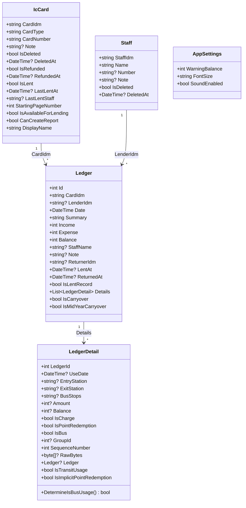
```mermaid
classDiagram
    %% Models
    class Staff {
        +string StaffIdm
        +string Name
        +string? Number
        +string? Note
        +bool IsDeleted
        +DateTime? DeletedAt
    }

    class IcCard {
        +string CardIdm
        +string CardType
        +string CardNumber
        +string? Note
        +bool IsDeleted
        +DateTime? DeletedAt
        +bool IsRefunded
        +DateTime? RefundedAt
        +bool IsLent
        +DateTime? LastLentAt
        +string? LastLentStaff
        +int StartingPageNumber
        +bool IsAvailableForLending
        +bool CanCreateReport
        +string DisplayName
    }

    class Ledger {
        +int Id
        +string CardIdm
        +string? LenderIdm
        +DateTime Date
        +string Summary
        +int Income
        +int Expense
        +int Balance
        +string? StaffName
        +string? Note
        +string? ReturnerIdm
        +DateTime? LentAt
        +DateTime? ReturnedAt
        +bool IsLentRecord
        +List~LedgerDetail~ Details
        +bool IsCarryover
        +bool IsMidYearCarryover
    }

    class LedgerDetail {
        +int LedgerId
        +DateTime? UseDate
        +string? EntryStation
        +string? ExitStation
        +string? BusStops
        +int? Amount
        +int? Balance
        +bool IsCharge
        +bool IsPointRedemption
        +bool IsBus
        +int? GroupId
        +int SequenceNumber
        +byte[]? RawBytes
        +Ledger? Ledger
        +DetermineIsBusUsage() bool
        +bool IsTransitUsage
        +bool IsImplicitPointRedemption
    }

    class AppSettings {
        +int WarningBalance
        +string FontSize
        +bool SoundEnabled
    }

    %% Relationships
    Ledger "1" --> "*" LedgerDetail : Details
    IcCard "1" --> "*" Ledger : CardIdm
    Staff "1" --> "*" Ledger : LenderIdm
```

---

## 2. レイヤー構成図


```mermaid
graph TB
    subgraph "Presentation Layer"
        VIEW[Views/XAML]
        VM[ViewModels]
    end

    subgraph "Business Logic Layer"
        SVC_LEND[LendingService]
        SVC_REPORT[ReportService]
        SVC_BACKUP[BackupService]
        SVC_SUMMARY[SummaryGenerator]
        SVC_OPLOG[OperationLogger]
        SVC_CSVEXP[CsvExportService]
        SVC_CSVIMP[CsvImportService]
        SVC_PRINT[PrintService]
        SVC_SANITIZE[InputSanitizer]
        SVC_STATION[StationMasterService]
        SVC_TEMPLATE[TemplateResolver]
        SVC_TOAST[ToastNotificationService]
        SVC_DEBUG[DebugDataService]
        SVC_MERGE[LedgerMergeService]
        SVC_SPLIT[LedgerSplitService]
        SVC_CONSIST[LedgerConsistencyChecker]
        SVC_ORDER[LedgerOrderHelper]
        SVC_REPORT_BUILD[ReportDataBuilder]
        SVC_OPLOGEXCEL[OperationLogExcelExportService]
        SVC_VALID[ValidationService]
        SVC_CARDLOCK[CardLockManager]
        SVC_STAFFAUTH[IStaffAuthService]
        SVC_DIALOG[IDialogService]
    end

    subgraph "Data Access Layer"
        REPO_STAFF[IStaffRepository]
        REPO_CARD[ICardRepository]
        REPO_LEDGER[ILedgerRepository]
        REPO_SETTINGS[ISettingsRepository]
        REPO_OPLOG[IOperationLogRepository]
        DBCTX[DbContext]
    end

    subgraph "Infrastructure Layer"
        READER[ICardReader]
        SOUND[ISoundPlayer]
        CACHE[ICacheService]
        FILELOG[FileLoggerProvider]
    end

    subgraph "External"
        DB[(SQLite)]
        PASORI[PaSoRi]
        SPEAKER[スピーカー]
    end

    VIEW --> VM
    VM --> SVC_LEND
    VM --> SVC_REPORT
    SVC_LEND --> REPO_STAFF
    SVC_LEND --> REPO_CARD
    SVC_LEND --> REPO_LEDGER
    SVC_LEND --> SVC_SUMMARY
    SVC_REPORT --> REPO_LEDGER
    SVC_REPORT --> REPO_CARD

    REPO_STAFF --> DBCTX
    REPO_CARD --> DBCTX
    REPO_LEDGER --> DBCTX
    REPO_SETTINGS --> DBCTX
    REPO_OPLOG --> DBCTX
    DBCTX --> DB

    VM --> READER
    VM --> SOUND
    READER --> PASORI
    SOUND --> SPEAKER
```

---

## 2a. 交通系固有ロジックの境界（Issue #1695）

### 2a.1 なぜこの節があるか

本システムのコア（タッチ認証 → 貸出/返却 → 出納簿）は、「複数職員でシェアする物品の出納管理」として交通系ICカード以外（社用携帯・鍵・公用車両等）にも通用する構造を持つ。

**現時点で汎用化する予定はない。** ただし交通系固有の知識がコアへ静かに染み出すと、将来その選択肢を取り戻すのに大規模改修が必要になる。この節は「どこまでが交通系固有か」を記述して、改修時の判断材料を残すためにある。

前節（§2 レイヤー構成図）が Presentation / Business / Data / Infrastructure の**横方向の層**を示すのに対し、本節の境界はそれと**直交する縦串**である。交通系固有性は特定の層に集まっておらず、`Infrastructure`（FeliCa 読取）・`Services`（摘要生成）・`Models`（乗車駅・降車駅）の 3 層すべてに分散している。

改修時の判断基準は `.claude/rules/domain-boundaries.md` を参照。

### 2a.2 3 リング境界モデル

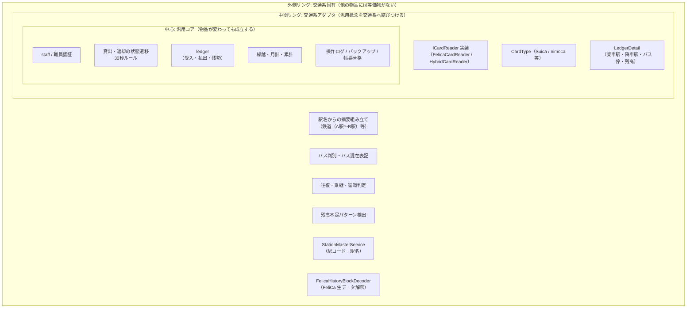
```mermaid
graph TB
    subgraph RING3["外側リング: 交通系固有（他の物品には等価物がない）"]
        SUM_RAIL["駅名からの摘要組み立て<br/>（鉄道（A駅～B駅）等）"]
        SUM_BUS["バス判別・バス混在表記"]
        SUM_TRIP["往復・乗継・循環判定"]
        SUM_SHORT["残高不足パターン検出"]
        STATION["StationMasterService<br/>（駅コード→駅名）"]
        DECODER["FelicaHistoryBlockDecoder<br/>（FeliCa 生データ解釈）"]

        subgraph RING2["中間リング: 交通系アダプタ（汎用概念を交通系へ結びつける）"]
            READER_IMPL["ICardReader 実装<br/>（FelicaCardReader / HybridCardReader）"]
            CARDTYPE["CardType（Suica / nimoca 等）"]
            DETAIL["LedgerDetail<br/>（乗車駅・降車駅・バス停・残高）"]

            subgraph RING1["中心: 汎用コア（物品が変わっても成立する）"]
                CORE_STAFF["staff / 職員認証"]
                CORE_LEND["貸出・返却の状態遷移<br/>30秒ルール"]
                CORE_LEDGER["ledger<br/>（受入・払出・残額）"]
                CORE_AGG["繰越・月計・累計"]
                CORE_MISC["操作ログ / バックアップ / 帳票骨格"]
            end
        end
    end
```

| リング | 定義 | 横展開時の扱い |
|--------|------|----------------|
| **中心（汎用コア）** | 「シェア物品の出納管理」として、交通系ICカードでなくても意味が通る概念 | そのまま流用 |
| **中間（交通系アダプタ）** | 汎用概念を交通系ICカードという具体物へ結びつけている層。名前と型は固有だが、構造は汎用 | 対象物品に合わせて読み替え・差替 |
| **外側（交通系固有）** | 交通系ICカードにしか存在しない概念 | 不要化、または対象物品固有の実装へ置換 |

**唯一のルール: 内側のリングに、外側リングの知識を持ち込まない。**

汎用コアのコード（`LendingService` の状態遷移、`ledger` の集計、帳票骨格）に「駅」「バス」「チャージ」といった交通系語彙の**分岐**を新設しない。必要なら外側リングに置き、コアからは抽象的な値（摘要文字列・金額）としてだけ受け取る。

### 2a.3 境界はクラス境界ではなくメソッド境界を通る（`SummaryGenerator`）

`SummaryGenerator` は 1 クラスの中に 2 種類の責務を同居させており、**クラス単位で固有/汎用を分類する素朴なモデルはここで破綻する**。

| 種別 | メソッド例 |
|------|-----------|
| 汎用（物品出納簿の様式そのもの） | `GetLendingSummary`（貸出中）/ 繰越各種（`GetCarryoverFromPreviousYearSummary` 等）/ `GetMonthlySummary`（月計）/ `GetCumulativeSummary`（累計）/ `GetChargeSummary` / `GetRefundSummary` |
| 交通系固有 | 駅名からの摘要組み立て / バス混在表記 / 往復・乗継・循環判定 / `GetInsufficientBalanceNote`（残高不足） |

このため `SummaryGenerator` 全体への参照制限は規約テストで**かけていない**（§2a.5）。汎用メソッドは 22 ファイルから正当に使われている。

### 2a.4 seam カタログ（横展開時の拡張点）

「もし横展開するなら差し替えることになる接続点」と、その現在の抽象度。**差替コスト「高」の項目を新設しないこと**が改修時の判断基準になる。

| # | 拡張点 | 現在の実装 | 抽象度 | 差替コスト | 備考 |
|---|--------|-----------|--------|-----------|------|
| 1 | 物品の識別手段 | `FelicaCardReader` / `HybridCardReader` / `MockCardReader` | `ICardReader` で抽象済み | **低** | `CardReadEventArgs.Idm` は `string`。バーコード・QR・手動入力を別実装として DI 差替可能 |
| 2 | 利用履歴の読取 | `FelicaHistoryBlockDecoder` | `Infrastructure/CardReader` 内に閉じている | **低** | 物品によっては履歴読取自体が不要（手入力運用）。`ICardReader.TryReadHistoryAsync` が空リストを返せば成立する |
| 3 | 駅コード→駅名解決 | `StationMasterService`（CSV マスター） | `IStationMasterService` あり、参照元は `FelicaCardReader` と DI 登録の 2 箇所のみ | **低** | 交通系以外では不要化。DI 登録を外すだけで済む形を保つ |
| 4 | 摘要文字列生成 | `SummaryGenerator`（static クラス） | インターフェースなし・22 ファイルから直接呼び出し | **中** | 汎用メソッドと固有メソッドが同居（§2a.3）。横展開時は固有メソッド群のみ抽出する |
| 5 | 利用内訳の項目 | `LedgerDetail`（`EntryStation` / `ExitStation` / `BusStops` / `IsBus`） | 固有列がモデルに直接生えている | **中** | 列名は交通系語彙だが構造は「1 回の利用の内訳」。物品に応じた読み替えで対応可能 |
| 6 | 物品マスター | `ic_card` テーブル / `IcCard` モデル | 交通系固有列は `card_type` のみ | **低** | 他の列（`is_lent` / `last_lent_at` / 繰越累計）はすべて汎用。`card_type` は物品種別として読み替え可能 |
| 7 | 残高の概念 | `ledger.balance` / `LedgerDetail.Balance` | 汎用（物品出納簿の「残額」） | **低** | 交通系固有ではない。鍵・車両なら残数、備品なら在庫数として同じ様式が成立する |

差替コストの読み方:

- **低** = インターフェースがあり参照元が限定されている。DI 登録の差替、または削除で済む
- **中** = 抽象化されていないか参照元が多い。まとまった作業になるが、コアの構造変更は不要
- **高** = コアの構造変更を伴う。**現時点では該当なし。この状態を維持することが Issue #1695 の目的**

### 2a.5 規約テストで固定している境界

`DomainBoundaryConventionTests` が以下をソースの静的検査で固定する（いずれも現状 green）。

| # | 検査内容 | 意図 |
|---|----------|------|
| 1 | `FelicaHistoryBlockDecoder` の参照元が `Infrastructure/CardReader/` 配下のみ | FeliCa 生データの解釈が上位層へ漏れない |
| 2 | `IStationMasterService` / `StationMasterService` の参照元が `Infrastructure/CardReader/` と DI 登録（`App.xaml.cs`）のみ | 駅名解決が「読取直後の変換」に留まり、`Services` / `ViewModels` は駅名を文字列としてのみ扱う |
| 3 | `Data/` 配下に交通系固有の**判断ロジック**（`SummaryGenerator` / `StationMasterService` / `FelicaHistoryBlockDecoder` / `DetermineIsBusUsage`）への実コード参照がない | 永続化層に交通系知識が入らない |
| 4 | 上記 3 件の走査が実際に本番ソースを covering していること（走査件数と、検査対象記号が境界内に実在すること） | パス解決が壊れると 3 件すべてが無条件 green になるため（`.claude/rules/testing.md`「通るが目的を果たさないテスト」） |

#### 検査対象に含めないもの（重要）

**`EntryStation` / `ExitStation` / `BusStops` / `IsBus` は #3 の禁止語に含めない。** `LedgerRepository` がこれらを DB 列へマッピングするのは永続化の正当な責務であり、境界違反ではない。禁止するのは「データの**形**」ではなく「データの**解釈**」——摘要生成・駅名解決・バス判別といった判断ロジックが `Data/` に入ること。

#### コメントは検査対象外

検査は実コードのみを対象とし、`//` / `///` / `/* */` のコメントは除去してから照合する。`LedgerRepository.cs` には「`SummaryGenerator.GetMidYearCarryoverSummary` の生成結果で検証している」という**規約の理由を説明したコメント**があり、単純な文字列一致ではこれを違反として誤検出するため（`.claude/rules/development-conventions.md` の「禁止された要素の不在を検査するときは要素タグで照合する」と同じ配慮）。

意図的に境界を変更する場合は、本節の seam カタログを更新したうえでテストを修正する。テストは禁止ではなく**気づきの装置**として置いている。

---

## 3. 主要クラスの責務

### 3.1 Models（エンティティ）

| クラス | 責務 | 対応テーブル |
|--------|------|--------------|
| Staff | 職員情報を保持 | staff |
| IcCard | 交通系ICカード情報を保持。貸出可否判定・帳票作成可否判定・表示名生成のドメインロジックを含む | ic_card |
| Ledger | 利用履歴概要を保持。繰越レコード判定のドメインロジックを含む | ledger |
| LedgerDetail | 利用履歴詳細を保持。バス利用判定・鉄道利用判���・暗黙ポイント還元判定のドメインロジックを含む | ledger_detail |
| OperationLog | 操作ログを保持 | operation_log |
| AppSettings | アプリケーション設定を保持 | settings |
| OrganizationOptions | 組織固有の設定値を保持（appsettings.json） | - |
| DatabaseOptions | DB接続先パスを保持（appsettings.json） | - |

#### Value Objects（Common/ValueObjects/）

自身のプロパティだけで完結する不変の値を型安全に表現する `readonly struct` 群。

| 構造体 | 責務 |
|--------|------|
| CardIdm | 交通系ICカードIDm（16進数16文字、大文字正規化、`implicit operator string`） |
| StaffIdm | 職員証IDm（16進数16文字、大文字正規化、CardIdmとは型レベルで区別） |
| FiscalYear | 日本の会計年度（4月始まり）。`FiscalYearHelper` の後継。開始日・終了日・包含判定・前月取得・比較演算子。両者の棲み分けは [§5.8b](#58b-fiscalyearhelper-と-fiscalyear-valueobject-の棲み分けissue-1246) を参照 |
| Money | 非負の金額（円）。加算・比較演算子、`implicit operator int`） |

### 3.2 ViewModels

| クラス | 責務 |
|--------|------|
| ViewModelBase | ViewModelの基底クラス（IsBusy, BusyMessage） |
| MainViewModel | メイン画面のロジック、状態管理 |
| StaffManageViewModel | 職員管理ダイアログのロジック |
| CardManageViewModel | カード管理ダイアログのロジック |
| SettingsViewModel | 設定ダイアログのロジック |
| ReportViewModel | 帳票作成ダイアログのロジック |
| SystemManageViewModel | システム管理（バックアップ・リストア）のロジック |
| PrintPreviewViewModel | 印刷プレビュー画面のズーム・ナビゲーション制御 |
| LedgerDetailViewModel | 利用履歴詳細表示・グループ操作のロジック |
| LedgerRowEditViewModel | 履歴行の追加・編集ダイアログのロジック |
| BusStopInputViewModel | バス停名入力画面のロジック |
| IncompleteBusStopViewModel | バス停未入力一覧ダイアログのロジック |
| VirtualCardViewModel | 仮想交通系ICカードタッチシミュレーター（DEBUG専用） |
| DataExportImportViewModel | データCSVエクスポート・インポートのロジック |
| OperationLogSearchViewModel | 操作ログ検索・表示のロジック |
| ReportPreflightViewModel | 帳票事前チェック結果ダイアログのロジック。確認モード（作成フロー経由。続行/中止を選ばせる）と参照モード（「事前チェック」ボタン経由。表示専用）の2モードを持つ（Issue #1688） |
| ConnectionDiagnosticsViewModel | 接続診断ダイアログのロジック（Issue #1690）。判定と文言は `IConnectionDiagnosticsService` 側にあり、本 ViewModel は「実行 → 表示 → コピー」の導線のみを持つ。対処が必要な項目を初期選択して詳細を即座に見せる |
| AdminDashboardViewModel | 管理者ダッシュボードのロジック（Issue #1692）。集計は `IAdminDashboardService` 側にあり、本 ViewModel は「読み込み → 絞り込み → グラフ座標の生成 → Excel 出力」の導線を持つ。利用分析は分析タブを最初に開いたときに遅延ロードする（台帳は 6 年分あり、開いた瞬間に全期間を集計すると初回表示が重い）。グラフのプロット領域は**固定ピクセルの定数**とし `ScrollViewer` で包む（実描画サイズに追随させると ViewModel が `ActualWidth` を知る必要が生じ、UI を起動しないと検証できなくなる） |

### 3.3 Services

| クラス | 責務 |
|--------|------|
| LendingService | 貸出・返却処理、30秒ルール管理 |
| ReportService | 月次帳票の作成（Excel出力） |
| BackupService | データベースのバックアップ（SQLite Backup API使用。共有モード時も安全に実行可能）。UI スレッドから呼ぶ場合は `CreateBackupAsync` を使用すること（sync 版 `CreateBackup` は `DbContext.LeaseConnection()` の UI スレッドガード (Issue #1281) に抵触する。Issue #1361）。保存先の解決は `ResolveBackupFolderAsync()` に一本化し、成功時は `last_backup_success_at` / `last_backup_machine` を settings に記録する（Issue #1689） |
| IBackupHealthService / BackupHealthService | バックアップ健全性（最終成功日時・世代数・保存先・空き容量・VACUUM実施PC）の集約と、VACUUM実施PC名の記録（Issue #1689）。`BackupService` に一方向で依存し、`BackupHealthInfo` を返す。個々の取得は独立して失敗し得るため、1項目の失敗で全体を例外にせず該当項目を null / 0 とする |
| SummaryGenerator | 摘要文字列の生成 |
| LedgerDetailChronologicalSorter | 利用詳細の時系列ソート・残高再計算 |
| OperationLogger | 操作ログの記録 |
| CsvExportService | CSV形式でのデータエクスポート |
| CsvImportService | CSV形式でのデータインポート（partial classで責務分割: Card/Staff/Ledger/Detail） |
| PrintService | 帳票の印刷・FlowDocument生成 |
| InputSanitizer | 入力値のサニタイズ処理（静的クラス） |
| StationMasterService | 駅コードから駅名への解決（シングルトン） |
| TemplateResolver | Excelテンプレートのパス解決（静的クラス） |
| ToastNotificationService | トースト通知の表示 |
| DebugDataService | テストデータの管理（DEBUGビルド専用） |
| LedgerMergeService | 複数Ledgerレコードの統合・取り消し（Issue #548） |
| CardLockManager | カードアクセスの排他制御（シングルトン） |
| IStaffAuthService / StaffAuthService | 職員証による操作者認証。成功時に ICurrentOperatorContext を更新（Issue #1265） |
| ICurrentOperatorContext / CurrentOperatorContext | 認証済み操作者のセッション情報保持（Issue #1265、監査ログなりすまし防止） |
| IDialogService / DialogService | ダイアログ表示の抽象化（テスタビリティ向上） |
| ReportDataBuilder | 月次帳票の共通データ準備（Excel/印刷で共有） |
| LedgerSplitService | 複数明細を含むLedgerレコードの分割（Issue #634） |
| LedgerConsistencyChecker | 残高チェーンの整合性検証（Issue #635） |
| ReportPreflightChecker | 帳票出力前のプリフライトチェック。`ReportDataBuilder` が返す `MonthlyReportData`（帳票の描画元）を検証し、未返却カード・負残高・繰越不一致・「受入 − 払出 = 残額」の不成立を検出する。`LedgerConsistencyChecker` が構造上カバーしない「繰越行と月の先頭行の接続」「合計行の検算」を補完する（Issue #1688、04_機能設計書 §10a） |
| IReportExportStatusService / ReportExportStatusService | 帳票の出力済み / 未出力の判定。出力先フォルダの年度ファイルに対象月のシートがあるかで判定する（DB に出力履歴を持たないため、表示が常に手元のファイルと一致する）。ファイル名・シート名は `ReportService.GetFiscalYearFileName` / `GetMonthSheetName` から取得し、命名規則の乖離を防ぐ（Issue #1691、04_機能設計書 §10b） |
| LedgerOrderHelper | 残高チェーンに基づくLedger順序の復元（Issue #784） |
| ISafeFileLauncher / SafeFileLauncher | `Process.Start(UseShellExecute=true)` で開くフォルダ／ファイルのパス検証を一元化。フォルダは `explorer.exe` を `UseShellExecute=false` で直接起動、ファイルは拡張子ホワイトリスト（`.xlsx` / `.csv`）通過後のみ起動。設定ファイル書換による任意 `.exe` 実行を defense-in-depth で防止（Issue #1465） |
| OperationLogExcelExportService | 操作ログのExcel出力 |
| ValidationService | 入力値のバリデーション（IDm, カード番号, 氏名等） |
| IDatabaseInfo | DB接続情報の読み取り専用インターフェース（DbContextが実装） |
| SharedModeMonitor | 共有モードでのDB接続監視・同期表示管理。`ExecuteHealthCheckAsync` は `.ConfigureAwait(false)` を使用するため `HealthCheckCompleted` / `SyncDisplayUpdated` イベントは **thread pool スレッドから発火される**。購読側 ViewModel は UI バインド `ObservableCollection` を更新する前に `IDispatcherService` で UI スレッドへマーシャリングすること（Issue #1359、`MainViewModel.OnSharedModeHealthCheckCompleted` が参考実装） |
| WarningService | データ系の警告チェック（残額警告・バス停未入力・ジャーナルモード・新バージョン公開通知 `CheckUpdateNotificationWarning`、Issue #1687） |
| DashboardService | **メイン画面内の**カード残高ダッシュボードのデータ構築・ソート。F8 の管理者ダッシュボード（`AdminDashboardService`）とは別物 |
| IAdminDashboardService / AdminDashboardService | 管理者ダッシュボード（Issue #1692、04_機能設計書 §20）の集計。運用状況（貸出中・長期未返却・残額不足・当月帳票未出力）と利用分析（稼働状況・職員別の月次利用額・カード別の残高推移）を構築する。UI に依存せずしきい値を引数で受け取るため、将来 `WarningService` からも再利用できる。リポジトリ呼び出しは直列 `await`（Issue #1452）、帳票の出力状況判定はファイル走査の同期処理のため `Task.Run` へオフロードする |
| AdminDashboardExcelExportService | 管理者ダッシュボードの集計結果を 5 シート（概要／運用状況／稼働状況／月別利用額／残高推移）の xlsx へ出力（Issue #1692）。作法は `OperationLogExcelExportService` に合わせる。帳票専用の `ExcelStyleFormatter` は流用しない（A〜L 列固定・セル結合ありの様式専用で、変更が帳票側へ波及するため） |
| IUpdateNotificationService / UpdateNotificationService | 共有フォルダの `latest_version.txt`（1行目に最新バージョン）を読み、自バージョンより新しければ更新案内を検出（`CheckForNewerVersion`）。ファイル無し・不正・I/Oエラーは通知なし（Issue #1687） |
| IConnectionDiagnosticsService / ConnectionDiagnosticsService | 接続診断（DB到達性・書込権限・ジャーナルモード・共有フォルダ接続・ICカードリーダー・バックアップ保存先・空き容量・バックアップ実施状況の8項目）を実行し `DiagnosticReport` を返す（Issue #1690、04_機能設計書 §19）。UI に依存せず判定と 3 要素文言をここに閉じる。項目ごとに例外を隔離し、1項目の失敗で診断全体が落ちないようにする。OS へ問い合わせる部分（`ProbeFolderWriteAccess` / `GetFreeSpaceBytes` / `ProbeDatabaseFileReachable`）は `protected virtual` の継ぎ目とし、権限不足・ディスク満杯・ネットワーク切断を単体テストから決定的に再現できるようにしている。到達性判定に `ProbeDatabaseFileReachable` を併用するのは、`CheckConnection()` が SQLite のページキャッシュから応答され切断を検知できなかったため（04_機能設計書 §19.2）。上流の `DbContext.CheckConnection()` も Issue #1716 で同じ到達確認を持つようになったが、`IDatabaseInfo` は interface で他実装の保証がないため本プローブは defense-in-depth として残す |
| ISharedDbConnectionStateProvider | `SharedModeMonitor` の `CurrentConnectionState` のみを公開する読み取り専用窓口（Issue #1690）。接続診断がタイマー基盤ごと `SharedModeMonitor` に依存するのを避ける。実装は `SharedModeMonitor`（DI では同一インスタンスを両方の型で登録） |
| IClipboardService / WpfClipboardService | クリップボード書き込みの抽象化（Issue #1690）。`System.Windows.Clipboard` が STA を要求するため ViewModel から直接呼ばず、また他プロセスによるロックで失敗し得るため `TrySetText` が成否を返す |

### 3.4 Repositories

| インターフェース | 実装クラス | 責務 |
|------------------|------------|------|
| ILedgerQueryService | （LedgerRepositoryが実装） | 利用履歴の読み取り専用クエリ（期間検索、ページング、残高取得等） |
| ILedgerMergeRepository | （LedgerRepositoryが実装） | 利用履歴の統合・分割操作 |
| IStaffRepository | StaffRepository | 職員データのCRUD |
| ICardRepository | CardRepository | 交通系ICカードデータのCRUD |
| ILedgerRepository | LedgerRepository | 利用履歴のCRUD |
| ISettingsRepository | SettingsRepository | 設定データのCRUD |
| IOperationLogRepository | OperationLogRepository | 操作ログのCRUD |

#### DbContext と接続リース系クラス

| クラス | 責務 |
|--------|------|
| DbContext | SQLite 接続の生成・健全性チェック・マイグレーション実行・トランザクション開始 |
| ConnectionLease | `using` 文で接続を借用し、`Dispose` 時にセマフォを解放するラッパ（→ §5.5b） |
| TransactionScope | `ConnectionLease` と `SQLiteTransaction` を束ね、`Dispose` 時にトランザクション→リースの順で解放。`Commit` / `Rollback` 未呼出しの場合は自動ロールバック（→ §5.5b） |
| ConnectionSuspensionScope | リストア中など接続再オープンを禁止したい期間を RAII 的に表現（Issue #1166、→ §5.5b） |

### 3.5 Infrastructure

| インターフェース | 実装クラス | 責務 |
|------------------|------------|------|
| ICardReader | FelicaCardReader | PaSoRi + felicalib 経由での交通系ICカード読み取り（残高・履歴） |
| ICardReader | HybridCardReader | DEBUG専用。物理リーダーと仮想タッチ機能を統合 |
| ICardReader | MockCardReader | テスト用モックリーダー |
| ISoundPlayer | SoundPlayer | 音声フィードバックの再生 |

---

## 4. 依存関係図

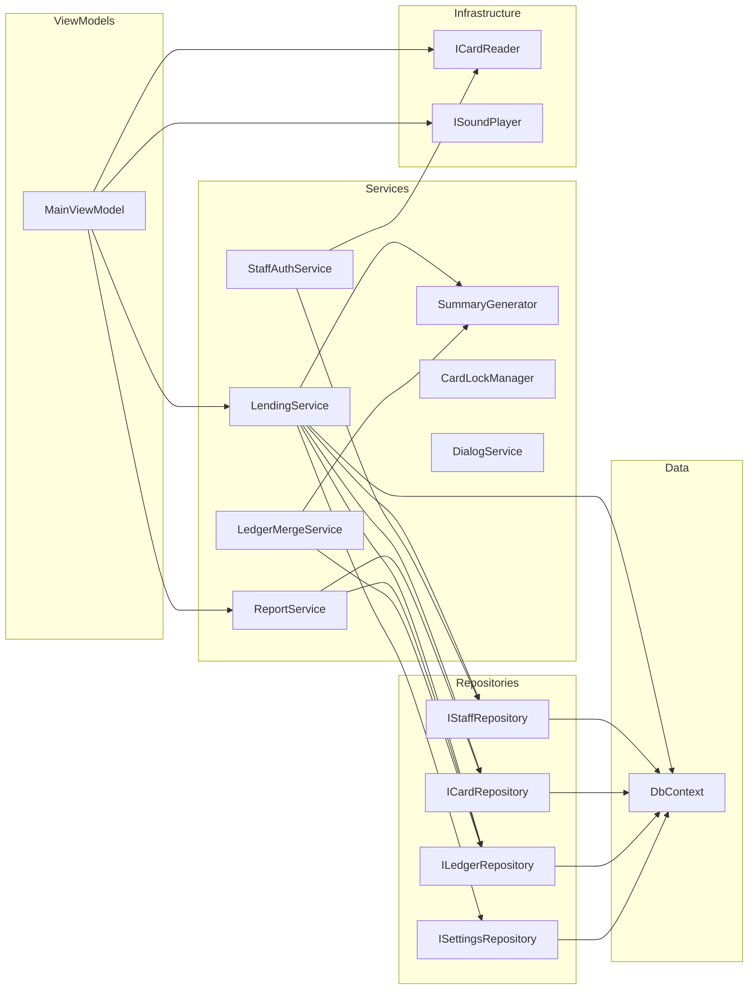
```mermaid
graph LR
    subgraph "ViewModels"
        MVM[MainViewModel]
    end

    subgraph "Services"
        LS[LendingService]
        RS[ReportService]
        SG[SummaryGenerator]
        LMS[LedgerMergeService]
        CLM[CardLockManager]
        SAS[StaffAuthService]
        DS[DialogService]
    end

    subgraph "Repositories"
        SR[IStaffRepository]
        CR[ICardRepository]
        LR[ILedgerRepository]
        STR[ISettingsRepository]
    end

    subgraph "Infrastructure"
        ICR[ICardReader]
        ISP[ISoundPlayer]
    end

    subgraph "Data"
        DBC[DbContext]
    end

    MVM --> LS
    MVM --> RS
    MVM --> ICR
    MVM --> ISP

    LS --> SR
    LS --> CR
    LS --> LR
    LS --> STR
    LS --> SG
    LS --> DBC

    RS --> CR
    RS --> LR

    LMS --> LR
    LMS --> SG
    SAS --> SR
    SAS --> ICR

    SR --> DBC
    CR --> DBC
    LR --> DBC
    STR --> DBC
```

---

## 5. クラス詳細

### 5.1 LendingService

`LendAsync` / `ReturnAsync` は Issue #1283 で責務ごとに internal ヘルパーへ分割され、orchestration 層として機能する（詳細は `tests/ICCardManager.Tests/Services/LendingServiceHelperTests.cs` および `07_テスト設計書.md §2.18 UT-017i`）。

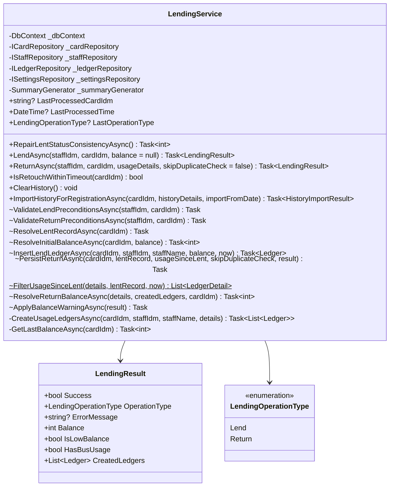
```mermaid
classDiagram
    class LendingService {
        -DbContext _dbContext
        -ICardRepository _cardRepository
        -IStaffRepository _staffRepository
        -ILedgerRepository _ledgerRepository
        -ISettingsRepository _settingsRepository
        -SummaryGenerator _summaryGenerator
        +string? LastProcessedCardIdm
        +DateTime? LastProcessedTime
        +LendingOperationType? LastOperationType
        +RepairLentStatusConsistencyAsync() Task~int~
        +LendAsync(staffIdm, cardIdm, balance = null) Task~LendingResult~
        +ReturnAsync(staffIdm, cardIdm, usageDetails, skipDuplicateCheck = false) Task~LendingResult~
        +IsRetouchWithinTimeout(cardIdm) bool
        +ClearHistory() void
        +ImportHistoryForRegistrationAsync(cardIdm, historyDetails, importFromDate) Task~HistoryImportResult~
        ~ValidateLendPreconditionsAsync(staffIdm, cardIdm) Task
        ~ValidateReturnPreconditionsAsync(staffIdm, cardIdm) Task
        ~ResolveLentRecordAsync(cardIdm) Task
        ~ResolveInitialBalanceAsync(cardIdm, balance) Task~int~
        ~InsertLendLedgerAsync(cardIdm, staffIdm, staffName, balance, now) Task~Ledger~
        ~PersistReturnAsync(cardIdm, lentRecord, usageSinceLent, skipDuplicateCheck, result) Task
        ~FilterUsageSinceLent(details, lentRecord, now)$ List~LedgerDetail~
        ~ResolveReturnBalanceAsync(details, createdLedgers, cardIdm) Task~int~
        ~ApplyBalanceWarningAsync(result) Task
        -CreateUsageLedgersAsync(cardIdm, staffIdm, staffName, details) Task~List~Ledger~~
        -GetLastBalanceAsync(cardIdm) Task~int~
    }

    class LendingResult {
        +bool Success
        +LendingOperationType OperationType
        +string? ErrorMessage
        +int Balance
        +bool IsLowBalance
        +bool HasBusUsage
        +List~Ledger~ CreatedLedgers
    }

    class LendingOperationType {
        <<enumeration>>
        Lend
        Return
    }

    LendingService --> LendingResult
    LendingService --> LendingOperationType
```

### 5.2 SummaryGenerator

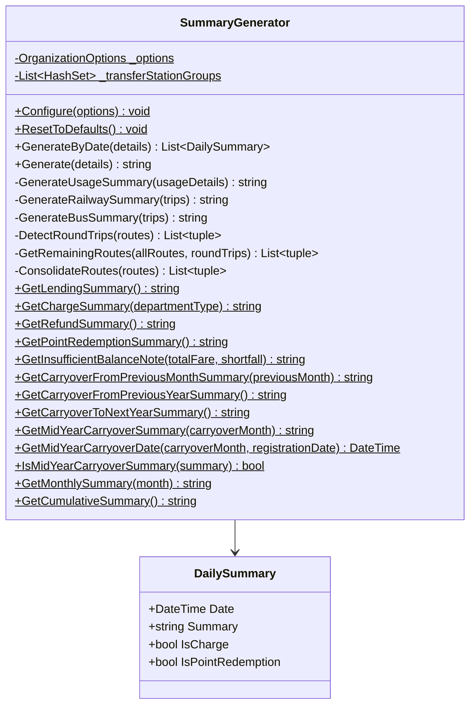
```mermaid
classDiagram
    class SummaryGenerator {
        -OrganizationOptions _options$
        -List~HashSet~ _transferStationGroups$
        +Configure(options)$ void
        +ResetToDefaults()$ void
        +GenerateByDate(details) List~DailySummary~
        +Generate(details) string
        -GenerateUsageSummary(usageDetails) string
        -GenerateRailwaySummary(trips) string
        -GenerateBusSummary(trips) string
        -DetectRoundTrips(routes) List~tuple~
        -GetRemainingRoutes(allRoutes, roundTrips) List~tuple~
        -ConsolidateRoutes(routes) List~tuple~
        +GetLendingSummary()$ string
        +GetChargeSummary(departmentType)$ string
        +GetRefundSummary()$ string
        +GetPointRedemptionSummary()$ string
        +GetInsufficientBalanceNote(totalFare, shortfall)$ string
        +GetCarryoverFromPreviousMonthSummary(previousMonth)$ string
        +GetCarryoverFromPreviousYearSummary()$ string
        +GetCarryoverToNextYearSummary()$ string
        +GetMidYearCarryoverSummary(carryoverMonth)$ string
        +GetMidYearCarryoverDate(carryoverMonth, registrationDate)$ DateTime
        +IsMidYearCarryoverSummary(summary)$ bool
        +GetMonthlySummary(month)$ string
        +GetCumulativeSummary()$ string
    }

    class DailySummary {
        +DateTime Date
        +string Summary
        +bool IsCharge
        +bool IsPointRedemption
    }

    SummaryGenerator --> DailySummary
```

### 5.3 ReportService

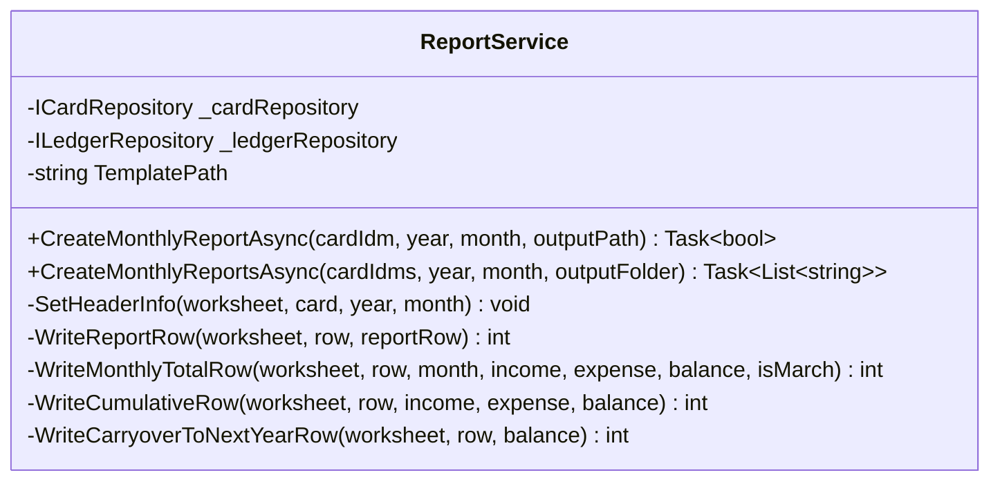
```mermaid
classDiagram
    class ReportService {
        -ICardRepository _cardRepository
        -ILedgerRepository _ledgerRepository
        -string TemplatePath
        +CreateMonthlyReportAsync(cardIdm, year, month, outputPath) Task~bool~
        +CreateMonthlyReportsAsync(cardIdms, year, month, outputFolder) Task~List~string~~
        -SetHeaderInfo(worksheet, card, year, month) void
        -WriteReportRow(worksheet, row, reportRow) int
        -WriteMonthlyTotalRow(worksheet, row, month, income, expense, balance, isMarch) int
        -WriteCumulativeRow(worksheet, row, income, expense, balance) int
        -WriteCarryoverToNextYearRow(worksheet, row, balance) int
    }
```

### 5.5 DbContext

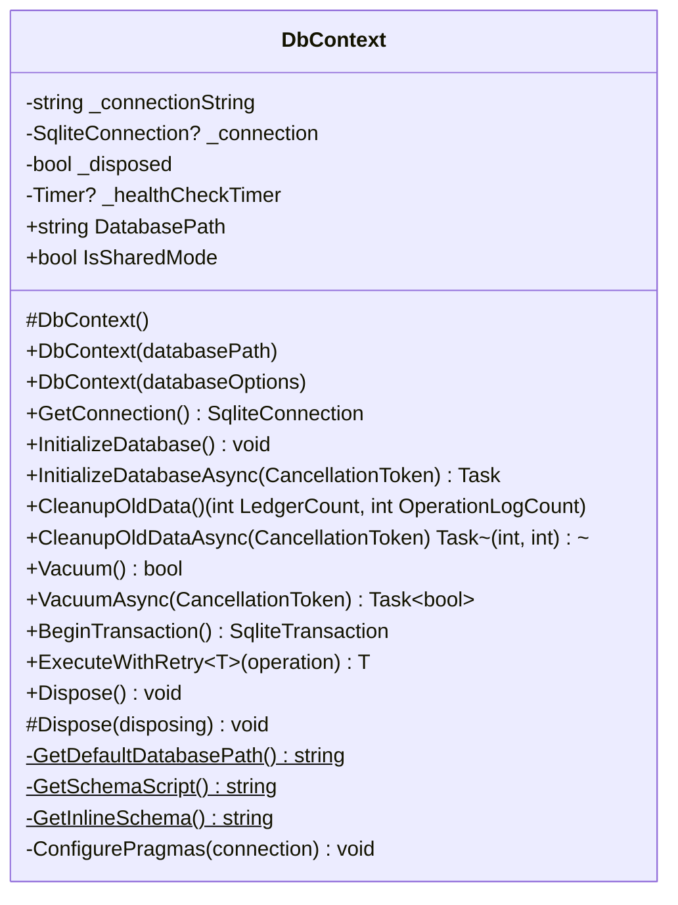
```mermaid
classDiagram
    class DbContext {
        -string _connectionString
        -SqliteConnection? _connection
        -bool _disposed
        -Timer? _healthCheckTimer
        +string DatabasePath
        +bool IsSharedMode
        #DbContext()
        +DbContext(databasePath)
        +DbContext(databaseOptions)
        +GetConnection() SqliteConnection
        +InitializeDatabase() void
        +InitializeDatabaseAsync(CancellationToken) Task
        +CleanupOldData() (int LedgerCount, int OperationLogCount)
        +CleanupOldDataAsync(CancellationToken) Task~(int, int)~
        +Vacuum() bool
        +VacuumAsync(CancellationToken) Task~bool~
        +BeginTransaction() SqliteTransaction
        +ExecuteWithRetry~T~(operation) T
        +Dispose() void
        #Dispose(disposing) void
        -GetDefaultDatabasePath()$ string
        -GetSchemaScript()$ string
        -GetInlineSchema()$ string
        -ConfigurePragmas(connection) void
    }
```

**共有フォルダモード対応:**

- `IsSharedMode`: DBパスが **UNCパス**（`\\server\share\...`）または **マップドネットワークドライブ**（`DriveInfo.DriveType == DriveType.Network`）の場合に `true`。判定は `DbContext.IsSharedModePath(string path)` に一元化されており、ローカルフルパス指定では `false`（Issue #1559 / #1597。「パス設定の有無」だけで判定していた旧実装を是正）。共有フォルダモードかどうかを判定する
- `ConfigurePragmas()`: 接続時に `PRAGMA foreign_keys = ON`、`PRAGMA busy_timeout`（ローカルモード: 5000ms / 共有モード: 15000ms、Issue #1107）を設定。共有モード時は `PRAGMA journal_mode = DELETE` を試行し、失敗時は TRUNCATE → PERSIST の順にフォールバック（`ConfigureJournalMode()`、Issue #1107）
- `ExecuteWithRetry<T>()`: SQLITE_BUSY/SQLITE_LOCKED発生時に指数バックオフでリトライ。ローカルモードは最大3回（100ms → 500ms → 2000ms）、共有モードは最大5回（200ms → 500ms → 1000ms → 2000ms → 5000ms、ジッター付き、Issue #1107）。詳細は [§5.5b](#55b-接続リーストランザクションスコープissue-1243) 参照
- 接続の正常性確認と定期ヘルスチェックは **`DbContext` ではなく `SharedModeMonitor`**（上記クラス一覧参照）が担う。共有フォルダモード時のみ **15秒間隔**（`SharedModeMonitor.HealthCheckIntervalSeconds = 15`、Issue #1493）でタイマーを起動（`Start()` → `ExecuteHealthCheckAsync()`）し、`DbContext.CheckConnection()` で接続を確認、接続断時は自動再接続を試行する。`DbContext` 自身はヘルスチェック用のメソッド（旧記載の `CheckConnectionHealth()` / `StartHealthCheck()`）を持たない
- `CheckConnection()`: 軽量クエリ（`SELECT COUNT(*) FROM sqlite_master`）**かつ** DB ファイルへの実到達（`ProbeDatabaseFileReachable()` → `File.Exists`）の両方が成功したときのみ `true`。**クエリ単独では到達性の証明にならない**（開きっぱなしの接続ではスキーマ情報が SQLite のページキャッシュから応答され、ネットワーク切断後も成功し続ける。Issue #1110 の意図が達成できていなかったことを Issue #1716 で是正）。インメモリDB（`:memory:`）とパス未設定はファイル実体を持たないため到達確認の対象外、接続一時停止中（Issue #1166）は従来どおり `true`。ファイル確認はリース解放後に行い、死んだ UNC パスの SMB タイムアウト中に接続セマフォを占有しない。到達確認は `protected virtual` のテスト継ぎ目（`ConnectionDiagnosticsService.ProbeDatabaseFileReachable` と同じ設計）
- **疎通確認全体の上限時間**（Issue #1716）: 疎通確認は「接続リース取得 → 接続オープン → クエリ → ファイル到達確認」と複数のネットワーク待ちが直列に並び、**どの区間も下位の TCP/SMB タイムアウトまで戻らない**（実機ログでクエリ段階が 82.3 秒、直後の再確認は 3ms / 0ms）。区間ごとに上限を設けても塞ぎ残しが生じるため、確認**全体**を `Task.Run` で実行し `AppConstants.DatabaseConnectionCheckTimeoutSeconds`（10秒。`ConnectionCheckTimeout` で仮想化しテストから短縮可能）以内に完了しなければ「接続なし」とみなす。上限で打ち切っても下位の呼び出しは中断できないため、**進行中の確認は 1 本に限定**し（`_pendingConnectionCheck`）、ブロック済みスレッドの累積と接続セマフォ待ちの行列を防ぐ。失敗時・1秒超過時は段階別の所要時間を `LogInformation` で記録する（`appsettings.json` の既定フィルタが Information のため `LogDebug` は本番のログファイルに残らない）。**UI スレッドから呼ばないこと**（上限までの待機が呼び出しスレッドをブロックする）。詳細は 04_機能設計書 §18.4
- `Vacuum()`: 戻り値を `bool` に変更。共有モードで他PCが接続中の場合はVACUUMが失敗しうるため、失敗時は `false` を返す（例外にしない）
- `InitializeDatabaseAsync()` / `CleanupOldDataAsync()` / `VacuumAsync()` (#1356): `App.OnStartup` など UI スレッドから呼び出すと Issue #1281 の `LeaseConnection()` ガードで例外になるため、`Task.Run` で既存 sync 実装へ委譲する非同期版を提供する。テスト経路（スレッドプール/xUnit）は従来どおり sync 版を直接使用

> **接続リース・トランザクションの正しい使い方**: `DbContext` の接続を借りる際は、`using` 文でリースを取得する `LeaseConnectionAsync()` / `BeginTransactionAsync()` を利用する。詳細は [§5.5b 接続リース・トランザクションスコープ](#55b-接続リーストランザクションスコープissue-1243) を参照。

### 5.5a DatabaseOptions

`appsettings.json` の `DatabaseOptions` セクションからバインドされる構成クラス。

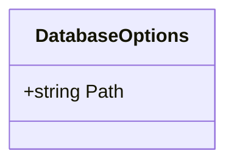
```mermaid
classDiagram
    class DatabaseOptions {
        +string Path
    }
```

| プロパティ | 型 | デフォルト | 説明 |
|-----------|-----|----------|------|
| Path | string | 空文字列 | DBファイルのパス。空の場合はローカルデフォルト。UNCパス指定で共有フォルダモード |

### 5.5b 接続リース・トランザクションスコープ（Issue #1243）

`DbContext` の接続ライフサイクルとトランザクション境界を型安全に管理する 3 つの RAII 的ラッパクラス。いずれも `Data/DbContext.cs` に定義される `public sealed class` であり、`using` 文での利用を前提としている。

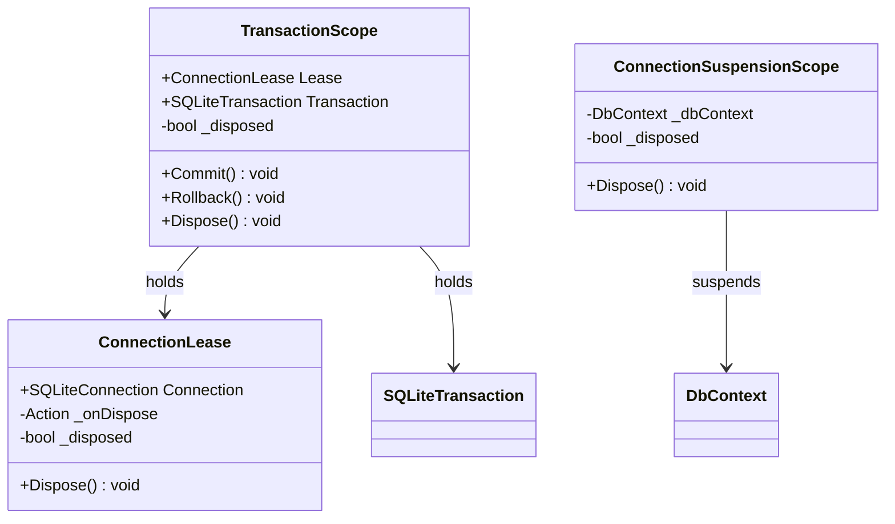
```mermaid
classDiagram
    class ConnectionLease {
        +SQLiteConnection Connection
        -Action _onDispose
        -bool _disposed
        +Dispose() void
    }

    class TransactionScope {
        +ConnectionLease Lease
        +SQLiteTransaction Transaction
        -bool _disposed
        +Commit() void
        +Rollback() void
        +Dispose() void
    }

    class ConnectionSuspensionScope {
        -DbContext _dbContext
        -bool _disposed
        +Dispose() void
    }

    TransactionScope --> ConnectionLease : holds
    TransactionScope --> SQLiteTransaction : holds
    ConnectionSuspensionScope --> DbContext : suspends
```

#### 責務一覧

| クラス | 責務 | 取得元 | 解放契機 |
|--------|------|--------|----------|
| `ConnectionLease` | **接続ライフサイクル管理**: `SQLiteConnection` を貸与し、`Dispose` でセマフォを解放して次の呼び出し者へ譲る | `DbContext.LeaseConnectionAsync()` / `LeaseConnection()` | `using` 文を抜けたとき |
| `TransactionScope` | **トランザクション境界制御**: `ConnectionLease` と `SQLiteTransaction` を束ね、`Dispose` で**トランザクション→リースの順に**解放する | `DbContext.BeginTransactionAsync()` | `using` 文を抜けたとき |
| `ConnectionSuspensionScope` | **接続一時停止制御**: リストア中など接続再オープンを禁止したい期間を RAII 的に表現し、`Dispose` で自動的に解除する（Issue #1166） | `DbContext.SuspendConnections()` | `using` 文を抜けたとき |

#### TransactionScope.Dispose() の自動ロールバック仕様

**重要**: `Commit()` も `Rollback()` も呼ばずに `Dispose` された場合、`SQLiteTransaction.Dispose()` は **未コミットのトランザクションを自動的にロールバック** する。このため、例外経路でも明示的な `Rollback()` 呼び出しは不要である。

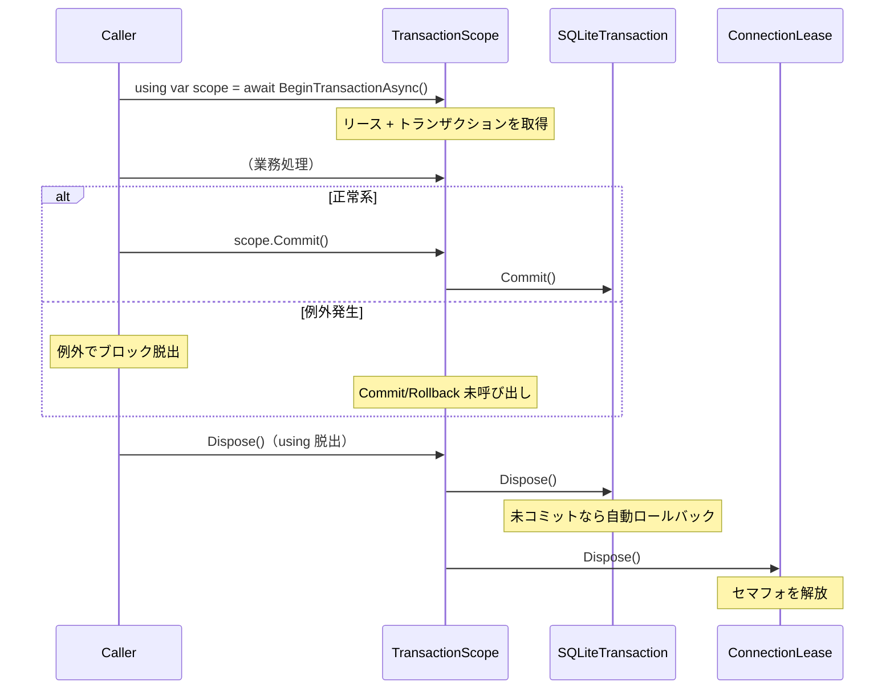
```mermaid
sequenceDiagram
    participant Caller
    participant Scope as TransactionScope
    participant Tx as SQLiteTransaction
    participant Lease as ConnectionLease

    Caller->>Scope: using var scope = await BeginTransactionAsync()
    Note over Scope: リース + トランザクションを取得
    Caller->>Scope: （業務処理）
    alt 正常系
        Caller->>Scope: scope.Commit()
        Scope->>Tx: Commit()
    else 例外発生
        Note over Caller: 例外でブロック脱出
        Note over Scope: Commit/Rollback 未呼び出し
    end
    Caller->>Scope: Dispose()（using 脱出）
    Scope->>Tx: Dispose()
    Note over Tx: 未コミットなら自動ロールバック
    Scope->>Lease: Dispose()
    Note over Lease: セマフォを解放
```

この仕様により、典型的な try/catch 定型文を省略できる:

```csharp
// ❌ 冗長（Dispose が自動ロールバックする）
using var scope = await _dbContext.BeginTransactionAsync();
try
{
    // 処理
    scope.Commit();
}
catch
{
    scope.Rollback();
    throw;
}

// ✅ 簡潔（例外時も Dispose が自動ロールバックする）
using var scope = await _dbContext.BeginTransactionAsync();
// 処理
scope.Commit();
// 例外時は Commit() が呼ばれないまま using を抜け、自動ロールバック
```

#### 典型的な使用パターン

**1. 読み取り専用の接続借用（単発クエリ）**

```csharp
using var lease = await _dbContext.LeaseConnectionAsync();
var connection = lease.Connection;

using var command = connection.CreateCommand();
command.CommandText = "SELECT value FROM settings WHERE key = @key";
command.Parameters.AddWithValue("@key", key);
return (string?)await command.ExecuteScalarAsync();
// using 脱出時にリースを解放、セマフォ返却
```

**2. 複数操作を 1 トランザクションで実行（書き込み系の推奨形）**

```csharp
await _dbContext.ExecuteWithRetryAsync(async () =>
{
    using var scope = await _dbContext.BeginTransactionAsync();

    await SetAsync(KeyWarningBalance, settings.WarningBalance.ToString());
    await SetAsync(KeyFontSize, FontSizeToString(settings.FontSize));
    // ...複数のキー更新...

    scope.Commit();
    // 例外発生時は Commit() に到達せず Dispose で自動ロールバック
});
```

`ExecuteWithRetryAsync` と組み合わせることで、`SQLITE_BUSY` / `SQLITE_LOCKED` 発生時に指数バックオフ + ジッター付きでリトライする（共有モードでは最大 5 回）。

**3. 接続の一時停止（リストア中など）**

```csharp
using var suspension = _dbContext.SuspendConnections();
// この間、バックグラウンドタスクからの GetConnectionInternal() は
// InvalidOperationException をスロー（Issue #1166）
await RestoreFromBackupAsync(backupFile);
// using 脱出時に ResumeConnections() が自動呼び出しされる
```

#### 排他制御（内部実装の注意点）

- `BeginTransactionAsync()` は `DbContext._semaphore` を取得する（`SemaphoreSlim(1, 1)`）。トランザクション中は他の書き込み系呼び出しがブロックされる
- `LeaseConnectionAsync()`（非同期版）は現在セマフォを取得しない。同一 `SQLiteConnection` を複数タスクが共有する前提
- `LeaseConnection()`（同期版）はセマフォを取得し、同一スレッド内でリエントラント（`AsyncLocal<int>` でカウント）
- 結果として、**書き込み系は必ず `BeginTransactionAsync` 経由** で実行することで、他の書き込みとのレース条件を防げる

#### 複数文を発行する書き込みメソッドの 3 分岐（Issue #1724）

`ReplaceDetailsAsync` のように **1 メソッドで 2 文以上（DELETE→INSERT 等）を発行する**リポジトリメソッドは、次の 3 分岐を必ず実装する。分岐を欠くと「片方だけ確定して片方が失敗する」非原子的な経路が生まれる。

| 状況 | 実装 | commit/rollback の責任 |
|------|------|----------------------|
| 引数で `SQLiteTransaction` を受け取った | その tx を全文に適用する | 呼び出し元（介入しない） |
| 引数は null だが `_dbContext.HasActiveTransactionScope == true` | `LeaseConnectionAsync()` で接続だけ借り、`command.Transaction` は null のまま発行して**接続の活性トランザクションへ暗黙参加**する | 外側スコープ（介入しない） |
| 引数が null かつ外側スコープも無い | 自前で `BeginTransactionAsync()` する | **自分で持つ**（成功なら Commit、失敗・例外なら Rollback） |

- **2 番目の分岐を省略してはならない**（Issue #1575）。`BeginTransactionAsync()` は `SemaphoreSlim(1,1)` を取るため、外側スコープ内で自前 tx を開くと自己デッドロックする
- **SQLite は接続に活性トランザクションが無いと各文を autocommit で即確定する**。`command.Transaction` を設定し忘れた文は、同メソッド内の後続文が失敗しても巻き戻らない。Issue #1724 はこれで `ledger_detail` の明細が全消失した（Issue #1456 で INSERT 側だけを tx 化した際、DELETE が tx 外に取り残されたことが原因）
- 実装は `LedgerRepository.InsertDetailsAsync` / `ReplaceDetailsAsync` が参考。いずれも「分岐を持つ公開メソッド」と「接続・tx を引数で受け取り commit/rollback しない `*Core`」に分離している
- 回帰は実 SQLite で固定する（テスト設計書 §2 UT-075）。失敗注入は `BEFORE INSERT ... RAISE(ABORT)` トリガーで行い、タイミング依存にしない

### 5.6 CsvExportService

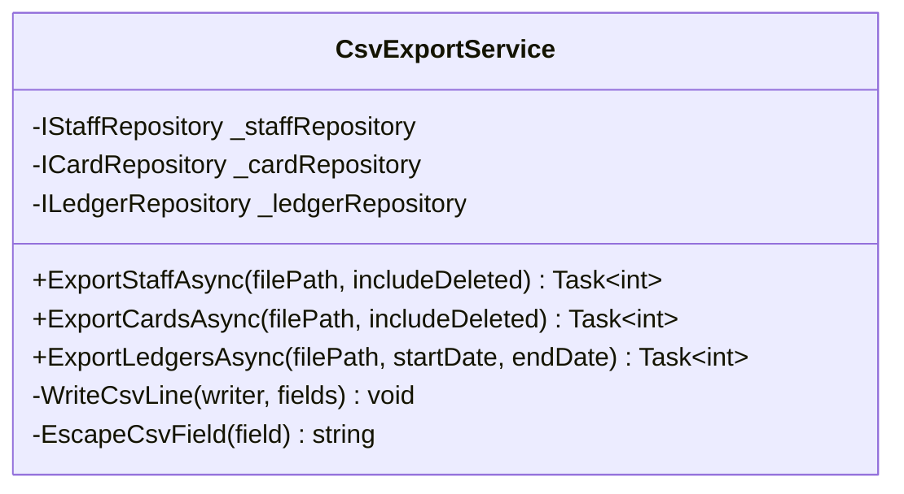
```mermaid
classDiagram
    class CsvExportService {
        -IStaffRepository _staffRepository
        -ICardRepository _cardRepository
        -ILedgerRepository _ledgerRepository
        +ExportStaffAsync(filePath, includeDeleted) Task~int~
        +ExportCardsAsync(filePath, includeDeleted) Task~int~
        +ExportLedgersAsync(filePath, startDate, endDate) Task~int~
        -WriteCsvLine(writer, fields) void
        -EscapeCsvField(field) string
    }
```

### 5.7 CsvImportService

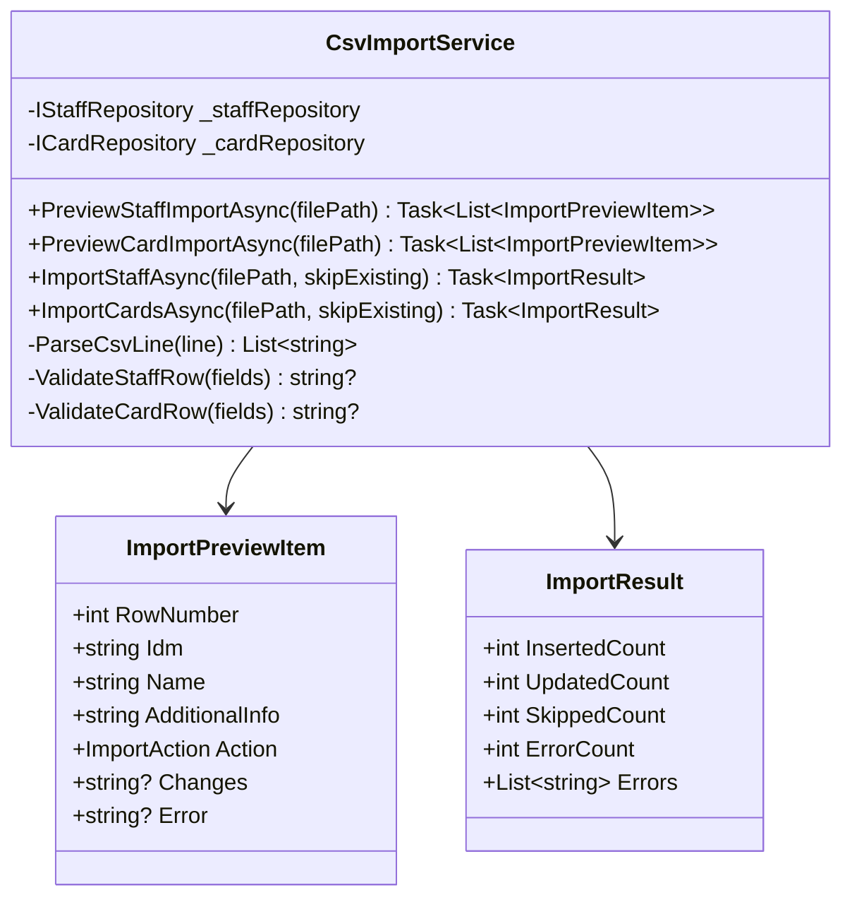
```mermaid
classDiagram
    class CsvImportService {
        -IStaffRepository _staffRepository
        -ICardRepository _cardRepository
        +PreviewStaffImportAsync(filePath) Task~List~ImportPreviewItem~~
        +PreviewCardImportAsync(filePath) Task~List~ImportPreviewItem~~
        +ImportStaffAsync(filePath, skipExisting) Task~ImportResult~
        +ImportCardsAsync(filePath, skipExisting) Task~ImportResult~
        -ParseCsvLine(line) List~string~
        -ValidateStaffRow(fields) string?
        -ValidateCardRow(fields) string?
    }

    class ImportPreviewItem {
        +int RowNumber
        +string Idm
        +string Name
        +string AdditionalInfo
        +ImportAction Action
        +string? Changes
        +string? Error
    }

    class ImportResult {
        +int InsertedCount
        +int UpdatedCount
        +int SkippedCount
        +int ErrorCount
        +List~string~ Errors
    }

    CsvImportService --> ImportPreviewItem
    CsvImportService --> ImportResult
```

#### 5.7.1 CsvImport 補助クラス（Issue #1284）

`CsvImportService.Ledger.cs` (1031行) / `Detail.cs` (1042行) を責務分割し、以下の補助クラスを `Services/Import/` 配下に追加。public API は不変。

| クラス | パス | 種別 | 責務 |
|-------|-----|------|-----|
| `LedgerCsvRowParser` | `Services/Import/Parsers/` | internal static | 利用履歴 CSV の 1 行パース（Import/Preview 共通化） |
| `LedgerDetailCsvRowParser` | `Services/Import/Parsers/` | internal static | 利用履歴詳細 CSV の 13 列パース + `ValidateBooleanField` |
| `NewLedgerFromSegmentsBuilder` | `Services/Import/Builders/` | internal | 履歴ID空欄 → segment 分割を伴う新規 Ledger 自動生成（Issue #906, #918, #1053） |

また、以下の検証系 helper は新 partial `CsvImportService.LedgerValidation.cs` に分離:
- `DetectLedgerChanges` / `ValidateBalanceConsistency` / `ValidateBalanceConsistencyForLedgers` / `GetPreviousBalanceByCardAsync`

効果: `Ledger.cs` 1031→520 行、`Detail.cs` 1042→761 行。Import/Preview 間で重複していた行パース ~200 行を解消。

### 5.8 PrintService

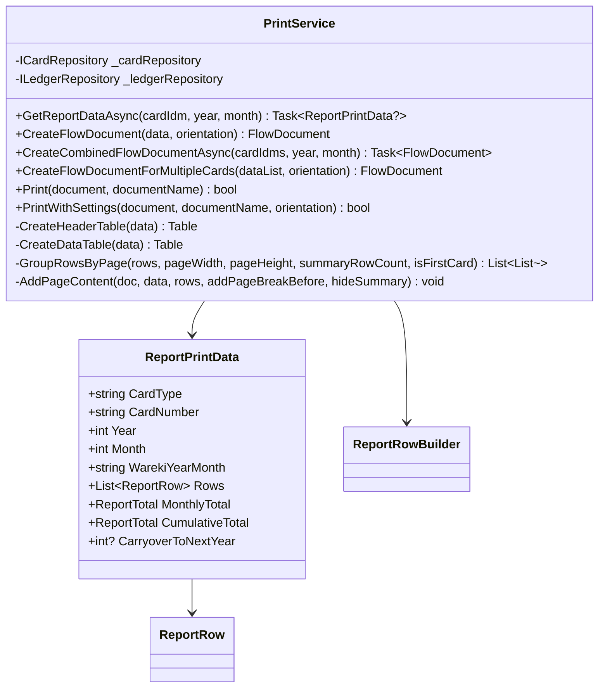
```mermaid
classDiagram
    class PrintService {
        -ICardRepository _cardRepository
        -ILedgerRepository _ledgerRepository
        +GetReportDataAsync(cardIdm, year, month) Task~ReportPrintData?~
        +CreateFlowDocument(data, orientation) FlowDocument
        +CreateCombinedFlowDocumentAsync(cardIdms, year, month) Task~FlowDocument~
        +CreateFlowDocumentForMultipleCards(dataList, orientation) FlowDocument
        +Print(document, documentName) bool
        +PrintWithSettings(document, documentName, orientation) bool
        -CreateHeaderTable(data) Table
        -CreateDataTable(data) Table
        -GroupRowsByPage(rows, pageWidth, pageHeight, summaryRowCount, isFirstCard) List~List~~
        -AddPageContent(doc, data, rows, addPageBreakBefore, hideSummary) void
    }

    class ReportPrintData {
        +string CardType
        +string CardNumber
        +int Year
        +int Month
        +string WarekiYearMonth
        +List~ReportRow~ Rows
        +ReportTotal MonthlyTotal
        +ReportTotal CumulativeTotal
        +int? CarryoverToNextYear
    }

    PrintService --> ReportPrintData
    PrintService --> ReportRowBuilder
    ReportPrintData --> ReportRow
```

### 5.8a ReportRow / ReportRowBuilder（Issue #1023）


```mermaid
classDiagram
    class ReportRowType {
        <<enumeration>>
        Carryover
        Data
        MonthlyTotal
        Cumulative
        CarryoverToNextYear
    }

    class ReportRow {
        +string DateDisplay
        +string Summary
        +int? Income
        +int? Expense
        +int? Balance
        +string StaffName
        +string Note
        +bool IsBold
        +ReportRowType RowType
    }

    class ReportTotal {
        +string Label
        +int Income
        +int Expense
        +int? Balance
    }

    class ReportRowSet {
        +List~ReportRow~ DataRows
        +ReportTotal MonthlyTotal
        +ReportTotal CumulativeTotal
        +int? CarryoverToNextYear
    }

    class ReportRowBuilder {
        <<static>>
        +Build(data)$ ReportRowSet
    }

    class RouteDisplayFormatter {
        <<static>>
        +Format(isCharge, isPointRedemption, isBus, busStops, entryStation, exitStation, stationSeparator, showPartialStations, fallback)$ string
    }

    class DisplayFormatters {
        <<static>>
        +FormatAmountWithUnit(value, fallback)$ string
        +FormatAmountWithUnitOrEmpty(value, fallback)$ string
        +FormatAmountOrEmpty(value, fallback)$ string
        +FormatBalance(value)$ string
        +FormatBalanceWithYenPrefix(value)$ string
        +FormatBalanceWithUnit(value)$ string
        +FormatDate(date)$ string
        +FormatDateTime(date)$ string
        +FormatTimestamp(date)$ string
    }

    class CardSortExtensions {
        <<static>>
        +OrderByCardDefault(source, cardTypeSelector, cardNumberSelector)$ IOrderedEnumerable~T~
        +ThenByCardDefault(source, cardTypeSelector, cardNumberSelector)$ IOrderedEnumerable~T~
    }

    class FiscalYearHelper {
        <<static>>
        +GetFiscalYear(year, month)$ int
        +GetFiscalYear(date)$ int
        +GetFiscalYearStart(fiscalYear)$ DateTime
        +GetFiscalYearEnd(fiscalYear)$ DateTime
        +GetPreviousMonth(year, month)$ Tuple~int_int~
    }

    ReportRowBuilder --> ReportRowSet
    ReportRowSet --> ReportRow
    ReportRowSet --> ReportTotal
    ReportRow --> ReportRowType
```

### 5.8b FiscalYearHelper と FiscalYear ValueObject の棲み分け（Issue #1246）

日本の会計年度（4月始まり）計算には、**2 つの共存する API** がある。新規コードは **`FiscalYear` ValueObject** を使用することを推奨する。`FiscalYearHelper`（静的メソッド群）は Issue #1024 で導入された先行実装で、Value Object 化（Issue #1221）後も後方互換のため残存している。

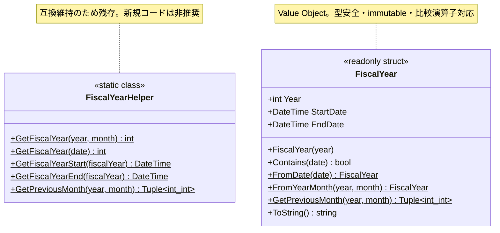
```mermaid
classDiagram
    class FiscalYearHelper {
        <<static class>>
        +GetFiscalYear(year, month)$ int
        +GetFiscalYear(date)$ int
        +GetFiscalYearStart(fiscalYear)$ DateTime
        +GetFiscalYearEnd(fiscalYear)$ DateTime
        +GetPreviousMonth(year, month)$ Tuple~int_int~
    }

    class FiscalYear {
        <<readonly struct>>
        +int Year
        +FiscalYear(year)
        +DateTime StartDate
        +DateTime EndDate
        +Contains(date) bool
        +FromDate(date)$ FiscalYear
        +FromYearMonth(year, month)$ FiscalYear
        +GetPreviousMonth(year, month)$ Tuple~int_int~
        +ToString() string
    }

    note for FiscalYearHelper "互換維持のため残存。新規コードは非推奨"
    note for FiscalYear "Value Object。型安全・immutable・比較演算子対応"
```

#### API 対応表

| FiscalYearHelper（旧 API） | FiscalYear ValueObject（新 API） | 備考 |
|---------------------------|--------------------------------|------|
| `FiscalYearHelper.GetFiscalYear(year, month)` | `FiscalYear.FromYearMonth(year, month).Year` | 戻り値の意味が型で表現される |
| `FiscalYearHelper.GetFiscalYear(date)` | `FiscalYear.FromDate(date).Year` | 同上 |
| `FiscalYearHelper.GetFiscalYearStart(fy)` | `new FiscalYear(fy).StartDate` | インスタンスメソッド化 |
| `FiscalYearHelper.GetFiscalYearEnd(fy)` | `new FiscalYear(fy).EndDate` | インスタンスメソッド化 |
| `FiscalYearHelper.GetPreviousMonth(y, m)` | `FiscalYear.GetPreviousMonth(y, m)` | 年度と無関係な純粋関数のため両者に同名で残存 |
| なし | `fy.Contains(date)` | **新機能**: 日付包含判定 |
| なし | `==`, `!=`, `<`, `>` など比較演算子 | **新機能**: 年度間比較 |
| なし | `implicit operator int(FiscalYear)` | **新機能**: 戻り値を int として扱える |

#### 使用方針

**新規コード**: `FiscalYear` ValueObject を使用すること。

```csharp
// 推奨
var fy = FiscalYear.FromDate(DateTime.Today);
if (fy.Contains(record.Date))
{
    total += record.Amount;
}

// 年度間比較も自然に書ける
var fy2025 = new FiscalYear(2025);
var fy2026 = new FiscalYear(2026);
Assert.True(fy2025 < fy2026);
```

**既存コード**: `FiscalYearHelper` のままでもビルドは通るが、触った際に段階的に `FiscalYear` へ移行する。一括置換は差分が大きくなるため、機能追加や周辺修正のついでに置き換える。

#### 段階的移行計画

既存の `FiscalYearHelper` 呼び出しは全 5 ファイル 12 箇所（本設計書作成時点）。優先度別の移行順を以下に示す。

| 優先度 | 対象ファイル | 呼び出し数 | 移行の判断基準 |
|--------|------------|----------|----------------|
| **高** | `Common/WarekiConverter.cs:137, 147, 157` | 3 | コアユーティリティ。WarekiConverter 自体の責務再整理と合わせて FiscalYear ベースに刷新すべき |
| **高** | `Services/ReportService.cs:671` | 1 | 帳票出力の年度判定。単発呼び出しなので `FiscalYear.FromYearMonth(y, m).Year` に直接置換可能 |
| **高** | `Services/ReportDataBuilder.cs:95, 96, 182, 197` | 4 | 年度跨ぎの月計・累計計算の起点。`Contains(date)` 導入で意図がより明瞭になる |
| **中** | `ViewModels/CardManageViewModel.cs:453` | 1 | 年度途中導入時の `CarryoverFiscalYear` 計算（Issue #1215）。単発で置換容易 |
| **低** | `Services/DebugDataService.cs:196, 197, 703` | 3 | DEBUG ビルドのテストデータ生成。本番挙動に影響しないため後回し可 |

#### 将来の廃止計画

`FiscalYearHelper` は **v3.0 リリース時に `[Obsolete]` 属性付与** → **v3.1 で削除** を目指す。以下が揃った段階で `[Obsolete]` を付与：

1. 上記 12 箇所がすべて `FiscalYear` ValueObject に移行済み
2. 移行後の全体テストが Green
3. 外部プラグイン・拡張が存在しないこと（現状該当なし）

`[Obsolete]` 期間中は `FiscalYearHelper` 内部から `FiscalYear` ValueObject に委譲する形に書き換え、振る舞いの乖離を防ぐ。

### 5.9 InputSanitizer

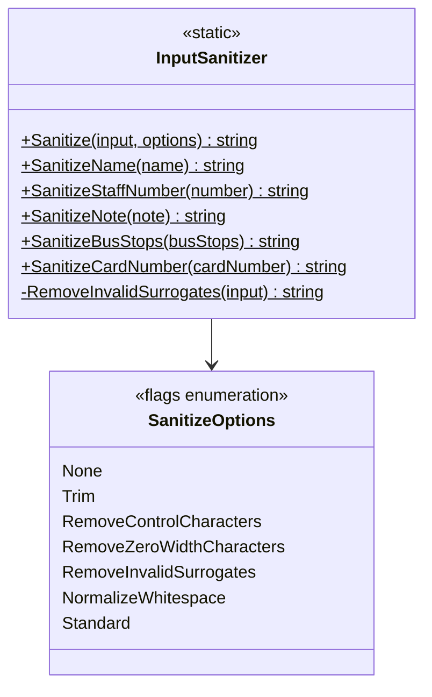
```mermaid
classDiagram
    class InputSanitizer {
        <<static>>
        +Sanitize(input, options)$ string
        +SanitizeName(name)$ string
        +SanitizeStaffNumber(number)$ string
        +SanitizeNote(note)$ string
        +SanitizeBusStops(busStops)$ string
        +SanitizeCardNumber(cardNumber)$ string
        -RemoveInvalidSurrogates(input)$ string
    }

    class SanitizeOptions {
        <<flags enumeration>>
        None
        Trim
        RemoveControlCharacters
        RemoveZeroWidthCharacters
        RemoveInvalidSurrogates
        NormalizeWhitespace
        Standard
    }

    InputSanitizer --> SanitizeOptions
```

### 5.10 StationMasterService

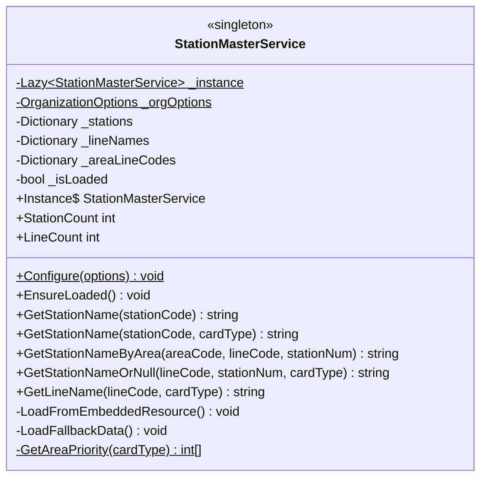
```mermaid
classDiagram
    class StationMasterService {
        <<singleton>>
        -Lazy~StationMasterService~ _instance$
        -OrganizationOptions _orgOptions$
        -Dictionary _stations
        -Dictionary _lineNames
        -Dictionary _areaLineCodes
        -bool _isLoaded
        +Instance$ StationMasterService
        +Configure(options)$ void
        +EnsureLoaded() void
        +GetStationName(stationCode) string
        +GetStationName(stationCode, cardType) string
        +GetStationNameByArea(areaCode, lineCode, stationNum) string
        +GetStationNameOrNull(lineCode, stationNum, cardType) string
        +GetLineName(lineCode, cardType) string
        +StationCount int
        +LineCount int
        -LoadFromEmbeddedResource() void
        -LoadFallbackData() void
        -GetAreaPriority(cardType)$ int[]
    }
```

### 5.11 OrganizationOptions

組織固有の設定値を保持する構成クラス。`appsettings.json` の `OrganizationOptions` セクションからバインドされ、`SummaryGenerator` と `StationMasterService` に静的 `Configure()` メソッドで適用される。セクション未定義時はデフォルト値（福岡市向け）が使用される。

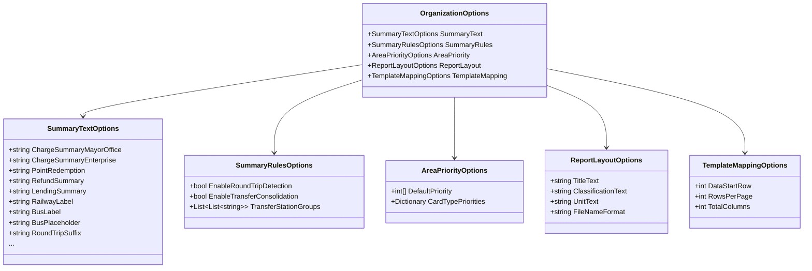
```mermaid
classDiagram
    class OrganizationOptions {
        +SummaryTextOptions SummaryText
        +SummaryRulesOptions SummaryRules
        +AreaPriorityOptions AreaPriority
        +ReportLayoutOptions ReportLayout
        +TemplateMappingOptions TemplateMapping
    }

    class SummaryTextOptions {
        +string ChargeSummaryMayorOffice
        +string ChargeSummaryEnterprise
        +string PointRedemption
        +string RefundSummary
        +string LendingSummary
        +string RailwayLabel
        +string BusLabel
        +string BusPlaceholder
        +string RoundTripSuffix
        ...
    }

    class SummaryRulesOptions {
        +bool EnableRoundTripDetection
        +bool EnableTransferConsolidation
        +List~List~string~~ TransferStationGroups
    }

    class AreaPriorityOptions {
        +int[] DefaultPriority
        +Dictionary CardTypePriorities
    }

    class ReportLayoutOptions {
        +string TitleText
        +string ClassificationText
        +string UnitText
        +string FileNameFormat
    }

    class TemplateMappingOptions {
        +int DataStartRow
        +int RowsPerPage
        +int TotalColumns
    }

    OrganizationOptions --> SummaryTextOptions
    OrganizationOptions --> SummaryRulesOptions
    OrganizationOptions --> AreaPriorityOptions
    OrganizationOptions --> ReportLayoutOptions
    OrganizationOptions --> TemplateMappingOptions
```

### 5.12 TemplateResolver

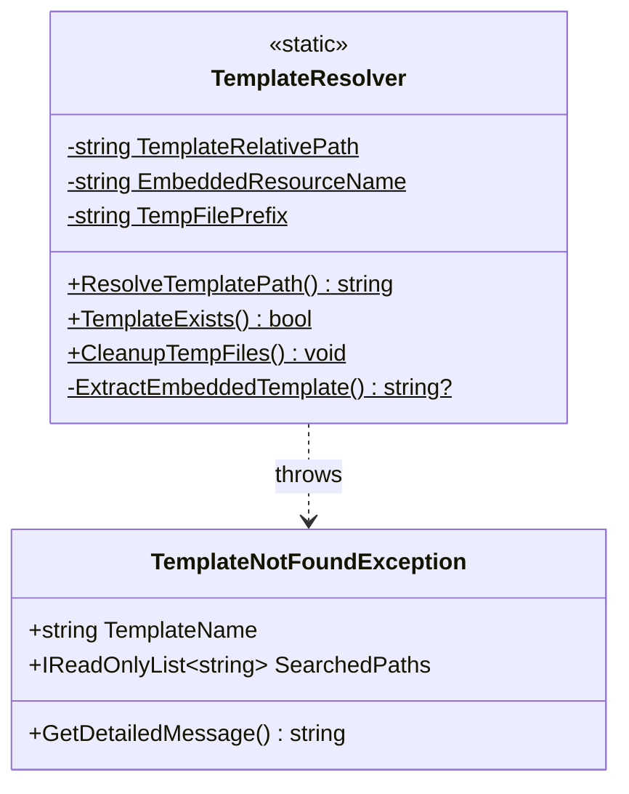
```mermaid
classDiagram
    class TemplateResolver {
        <<static>>
        -string TemplateRelativePath$
        -string EmbeddedResourceName$
        -string TempFilePrefix$
        +ResolveTemplatePath()$ string
        +TemplateExists()$ bool
        +CleanupTempFiles()$ void
        -ExtractEmbeddedTemplate()$ string?
    }

    class TemplateNotFoundException {
        +string TemplateName
        +IReadOnlyList~string~ SearchedPaths
        +GetDetailedMessage() string
    }

    TemplateResolver ..> TemplateNotFoundException : throws
```

### 5.13 ToastNotificationService

```mermaid
classDiagram
    class IToastNotificationService {
        <<interface>>
        +ShowLendNotification(cardType, cardNumber) void
        +ShowReturnNotification(cardType, cardNumber, balance, isLowBalance) void
        +ShowStaffRecognizedNotification(staffName) void
        +ShowInfo(title, message) void
        +ShowWarning(title, message) void
        +ShowError(title, message) void
    }

    class ToastNotificationService {
        +ShowLendNotification(cardType, cardNumber) void
        +ShowReturnNotification(cardType, cardNumber, balance, isLowBalance) void
        +ShowStaffRecognizedNotification(staffName) void
        +ShowInfo(title, message) void
        +ShowWarning(title, message) void
        +ShowError(title, message) void
    }

    ToastNotificationService ..|> IToastNotificationService
```

### 5.14 DebugDataService

```mermaid
classDiagram
    class DebugDataService {
        <<DEBUG only>>
        -IStaffRepository _staffRepository
        -ICardRepository _cardRepository
        -ILedgerRepository _ledgerRepository
        +Staff[] TestStaffList$
        +IcCard[] TestCardList$
        +RegisterAllTestDataAsync() Task
        +RegisterTestStaffAsync() Task
        +RegisterTestCardsAsync() Task
        +RegisterSampleHistoryAsync() Task
    }
```

### 5.15 LedgerMergeService

```mermaid
classDiagram
    class LedgerMergeService {
        -ILedgerRepository _ledgerRepository
        -SummaryGenerator _summaryGenerator
        -OperationLogger _operationLogger
        -ILogger _logger
        +MergeAsync(ledgerIds, operatorIdm) Task~LedgerMergeResult~
        +UnmergeAsync(mergeHistoryId, operatorIdm) Task~LedgerMergeResult~
        +GetUndoableMergeHistoriesAsync() Task~List~MergeHistoryEntry~~
    }

    class LedgerMergeResult {
        +bool Success
        +string ErrorMessage
        +Ledger MergedLedger
    }

    class MergeHistoryEntry {
        +int Id
        +DateTime MergedAt
        +int TargetLedgerId
        +string Description
    }

    LedgerMergeService --> LedgerMergeResult
    LedgerMergeService --> MergeHistoryEntry
```

### 5.16 CardLockManager

```mermaid
classDiagram
    class CardLockManager {
        <<IDisposable>>
        -ConcurrentDictionary _locks
        -ILogger _logger
        +GetLock(cardIdm) SemaphoreSlim
        +ReleaseLockReference(cardIdm) void
        +CleanupExpiredLocks() void
        +ClearAllLocks() void
        +HasLock(cardIdm) bool
        +Dispose() void
    }
```

### 5.17 StaffAuthService

```mermaid
classDiagram
    class IStaffAuthService {
        <<interface>>
        +RequestAuthenticationAsync(operationDescription) Task~StaffAuthResult~
    }

    class StaffAuthService {
        -IStaffRepository _staffRepository
        -ICardReader _cardReader
        -ISoundPlayer _soundPlayer
        -ICurrentOperatorContext _operatorContext
        +RequestAuthenticationAsync(operationDescription) Task~StaffAuthResult~
    }

    class StaffAuthResult {
        +string Idm
        +string StaffName
    }

    StaffAuthService ..|> IStaffAuthService
    StaffAuthService --> StaffAuthResult
    StaffAuthService --> ICurrentOperatorContext : BeginSession()
```

**Issue #1265**: 認証成功時に `ICurrentOperatorContext.BeginSession(idm, name)` を呼び、後続の `OperationLogger` が操作者を一元的に解決できるようにする。

### 5.17a CurrentOperatorContext

```mermaid
classDiagram
    class ICurrentOperatorContext {
        <<interface>>
        +string? CurrentIdm
        +string? CurrentName
        +bool HasSession
        +BeginSession(idm, name) void
        +ClearSession() void
    }

    class CurrentOperatorContext {
        -ISystemClock _clock
        -TimeSpan _sessionDuration
        -string? _idm
        -string? _name
        -DateTime _expiresAt
        +static TimeSpan DefaultSessionDuration
    }

    CurrentOperatorContext ..|> ICurrentOperatorContext
    CurrentOperatorContext --> ISystemClock
```

**責務**:
- 認証済み操作者の IDm / 氏名を一元的に保持（Singleton）
- 指定時間（既定 5 分）で自動失効
- 監査ログ（`operation_log`）への操作者なりすましを防止

**使用フロー**:
1. `StaffAuthService.RequestAuthenticationAsync()` が職員証タッチ成功時に `BeginSession()` を呼ぶ
2. `OperationLogger.LogXxxAsync()` が `CurrentIdm` / `CurrentName` を参照してログを記録
3. セッションが失効すると `HasSession=false` となり、以降のログは `GuiOperator` へフォールバック

**Issue #1265**: `OperationLogger` の旧 API（`operatorIdm` 引数付き）は `[Obsolete]` になり、渡された引数は無視される。操作者は常にこのコンテキストから解決される。

### 5.17b OperationLogger

```mermaid
classDiagram
    class OperationLogger {
        -IOperationLogRepository _operationLogRepository
        -ICurrentOperatorContext _operatorContext
        +LogStaffInsertAsync(staff) Task
        +LogStaffUpdateAsync(before, after) Task
        +LogStaffDeleteAsync(staff) Task
        +LogStaffRestoreAsync(staff) Task
        +LogCardInsertAsync(card) Task
        +LogCardUpdateAsync(before, after) Task
        +LogCardDeleteAsync(card) Task
        +LogCardRestoreAsync(card) Task
        +LogLedgerInsertAsync(ledger) Task
        +LogLedgerUpdateAsync(before, after) Task
        +LogLedgerDeleteAsync(ledger) Task
        +LogLedgerMergeAsync(sources, merged) Task
        +LogLedgerSplitAsync(original, splits) Task
        +LogImportAsync(tableName, filePath, inserted, skipped, errors) Task
        +LogExportAsync(tableName, filePath, recordCount) Task
        +LogBackupAsync(filePath) Task
        +LogRestoreAsync(filePath) Task
    }

    OperationLogger --> ICurrentOperatorContext : ResolveOperator()
    OperationLogger --> IOperationLogRepository : InsertAsync()
```

**定数 (`OperationLogger.Actions`)**

| 定数 | 値 | 用途 |
|------|-----|------|
| `Insert` | `INSERT` | レコード新規登録 |
| `Update` | `UPDATE` | レコード更新 |
| `Delete` | `DELETE` | レコード削除（論理／物理） |
| `Restore` | `RESTORE` | 論理削除レコードの復元 または DB 丸ごとリストア（`TargetTable` で区別） |
| `Merge` | `MERGE` | 履歴レコード統合 |
| `Split` | `SPLIT` | 履歴レコード分割 |
| `Import` | `IMPORT` | CSV インポート実行（Issue #1302） |
| `Export` | `EXPORT` | CSV/Excel エクスポート実行（Issue #1302） |
| `Backup` | `BACKUP` | DB バックアップ取得（Issue #1302） |

**定数 (`OperationLogger.Tables`)**

| 定数 | 値 | 用途 |
|------|-----|------|
| `Staff` | `staff` | 職員テーブル |
| `IcCard` | `ic_card` | IC カードテーブル |
| `Ledger` | `ledger` | 履歴テーブル |
| `LedgerDetail` | `ledger_detail` | 履歴詳細テーブル（Issue #1302） |
| `Database` | `database` | DB 丸ごと操作（BACKUP / RESTORE、Issue #1302） |

**Issue #1302**: データ移行・災害復旧系統（CSV インポート / エクスポート / バックアップ / リストア）も監査証跡として `operation_log` に記録する。`LogImportAsync` / `LogExportAsync` は `TargetTable` に対象テーブル名、`TargetId` にファイル名 (basename) を格納し、`AfterData` の JSON にフルパスと件数（Inserted / Skipped / Error、RecordCount）を含める。`LogBackupAsync` / `LogRestoreAsync` は `TargetTable="database"` でレコード単位の復元と区別される。すべての API は `ICurrentOperatorContext` から操作者を解決し、セッション失効時は `GuiOperator`（`Idm=0000000000000000` / `Name=GUI操作`）へフォールバックする（#1265 の方針を踏襲）。

**呼び出し元**:
- `DataExportImportViewModel.ExportAsync` / `ExecuteImportAsync` / `ImportAsync` — CSV 操作の成功時（部分成功時も `ImportedCount > 0` なら記録）
- `SystemManageViewModel.CreateBackupAsync` / `RestoreAsync` / `RestoreFromFileAsync` — バックアップ・リストアの成功時
- リストア成功後の `operation_log` は**リストア後の新 DB** に記録される（既存 DB 接続が同一パスの新ファイルを参照するため）

### 5.18 DialogService

```mermaid
classDiagram
    class IDialogService {
        <<interface>>
        +ShowConfirmation(message, title) bool
        +ShowWarningConfirmation(message, title) bool
        +ShowInformation(message, title) void
        +ShowWarning(message, title) void
        +ShowError(message, title) void
        +ShowCardRegistrationModeDialog() CardRegistrationModeResult
    }

    class DialogService {
        +ShowConfirmation(message, title) bool
        +ShowWarningConfirmation(message, title) bool
        +ShowInformation(message, title) void
        +ShowWarning(message, title) void
        +ShowError(message, title) void
        +ShowCardRegistrationModeDialog() CardRegistrationModeResult
    }

    DialogService ..|> IDialogService
```

### 5.19 ReportDataBuilder

```mermaid
classDiagram
    class IReportDataBuilder {
        <<interface>>
        +BuildAsync(cardIdm, year, month) Task~MonthlyReportData~
    }

    class ReportDataBuilder {
        -ICardRepository _cardRepository
        -ILedgerRepository _ledgerRepository
        +BuildAsync(cardIdm, year, month) Task~MonthlyReportData~
        -GetPreviousMonthBalanceAsync(cardIdm, year, month) Task~int?~
    }

    ReportDataBuilder ..|> IReportDataBuilder
```

### 5.20 LedgerSplitService

```mermaid
classDiagram
    class LedgerSplitService {
        -ILedgerRepository _ledgerRepository
        -SummaryGenerator _summaryGenerator
        -OperationLogger _operationLogger
        -ILogger~LedgerSplitService~ _logger
        +SplitAsync(ledgerId, groupedDetails, operatorIdm?) Task~LedgerSplitResult~
        +CalculateGroupFinancials(groupDetails)$ tuple~int, int, int~
        -GetGroupDate(groupDetails, originalDate)$ DateTime
        -ClearGroupIds(details)$ void
        -CloneLedger(source)$ Ledger
    }

    class LedgerSplitResult {
        +bool Success
        +string ErrorMessage
        +List~int~ CreatedLedgerIds
    }

    LedgerSplitService --> LedgerSplitResult
```

### 5.21 LedgerConsistencyChecker

```mermaid
classDiagram
    class LedgerConsistencyChecker {
        <<internal>>
        -ILedgerRepository _ledgerRepository
        +CheckBalanceConsistencyAsync(cardIdm, fromDate, toDate) Task~ConsistencyResult~
        +CheckConsistency(ledgers, cardIdm, fromDate) ConsistencyResult
        +CheckConsistencyWithPreviousAsync(ledgers, cardIdm, fromDate) Task~ConsistencyResult~
    }

    class ConsistencyResult {
        <<internal>>
        +bool IsConsistent
        +List~tuple~ Inconsistencies
    }

    LedgerConsistencyChecker --> ConsistencyResult
```

### 5.21a ReportPreflightChecker（Issue #1688）

```mermaid
classDiagram
    class ReportPreflightChecker {
        -IReportDataBuilder _reportDataBuilder
        -ILedgerRepository _ledgerRepository
        +CheckAsync(cardIdms, year, month) Task~ReportPreflightResult~
        ~CheckReportData(data, lentRecord, result)$ void
        ~CheckUnreturned(data, lentRecord, result)$ void
        ~CheckNegativeBalance(data, result)$ void
        ~CheckCarryoverMismatch(data, result)$ void
        ~CheckTotalMismatch(data, result)$ void
    }

    class ReportPreflightResult {
        +List~ReportPreflightWarning~ Warnings
        +bool HasWarnings
    }

    class ReportPreflightWarning {
        +string CardIdm
        +string CardDisplayName
        +ReportPreflightIssueType IssueType
        +DateTime? Date
        +int? LedgerId
        +string RowSummary
        +string DisplayText
        +string DetailText
    }

    ReportPreflightChecker --> ReportPreflightResult
    ReportPreflightResult --> ReportPreflightWarning
    ReportPreflightChecker ..> IReportDataBuilder
```

判定ロジック（`Check*` 群）は `MonthlyReportData` を引数に取る `internal static` の純粋関数として切り出されており、DB を介さず境界値を単体テストできる。`LedgerConsistencyChecker`（§5.21）との役割分担は 04_機能設計書 §10a.4 を参照。

### 5.22 LedgerOrderHelper

```mermaid
classDiagram
    class LedgerOrderHelper {
        <<internal, static>>
        +ReorderByBalanceChain(ledgers, precedingBalance?)$ List~Ledger~
        -ReconstructChain(records, startBalance)$ List~Ledger~
        -IsSpecialRecord(ledger)$ bool
    }
```

### 5.23 OperationLogExcelExportService

```mermaid
classDiagram
    class OperationLogExcelExportService {
        -XLColor HeaderBackground$
        -XLColor ColorGreen$
        -XLColor ColorOrange$
        -XLColor ColorRed$
        -XLColor ColorBlue$
        +ExportAsync(logs, filePath) Task
        +GetActionDisplayName(action?)$ string
        +GetTargetTableDisplayName(targetTable?)$ string
        +FormatJsonToReadable(targetTable?, json?)$ string
        +GetChangeSummary(targetTable?, beforeJson?, afterJson?)$ string
        +GetFieldNameMap(targetTable?)$ IReadOnlyDictionary~string, string~
        -WriteHeader(worksheet)$ void
        -WriteDataRow(worksheet, row, log)$ void
        -ApplyFormatting(worksheet, lastDataRow)$ void
        -GetActionColor(action?)$ XLColor?
    }
```

### 5.24 ValidationService

```mermaid
classDiagram
    class IValidationService {
        <<interface>>
        +ValidateCardIdm(idm) ValidationResult
        +ValidateCardNumber(cardNumber) ValidationResult
        +ValidateCardType(cardType) ValidationResult
        +ValidateStaffIdm(idm) ValidationResult
        +ValidateStaffName(name) ValidationResult
        +ValidateWarningBalance(balance) ValidationResult
        +ValidateBusStops(busStops) ValidationResult
    }

    class ValidationService {
        -int IdmLength$
        -int CardNumberMaxLength$
        -int StaffNameMaxLength$
        -int BusStopsMaxLength$
        -Regex HexPatternRegex$
        -Regex AlphanumericPatternRegex$
        +ValidateCardIdm(idm) ValidationResult
        +ValidateCardNumber(cardNumber) ValidationResult
        +ValidateCardType(cardType) ValidationResult
        +ValidateStaffIdm(idm) ValidationResult
        +ValidateStaffName(name) ValidationResult
        +ValidateWarningBalance(balance) ValidationResult
        +ValidateBusStops(busStops) ValidationResult
    }

    ValidationService ..|> IValidationService
```

---

## 6. DIコンテナ設定

### 6.1 サービス登録（想定）

```csharp
// App.xaml.cs または Startup.cs
services.Configure<DatabaseOptions>(Configuration.GetSection("DatabaseOptions"));
services.AddSingleton<DbContext>();
services.AddSingleton<ICardRepository, CardRepository>();
services.AddSingleton<IStaffRepository, StaffRepository>();
services.AddSingleton<ILedgerRepository, LedgerRepository>();
services.AddSingleton<ISettingsRepository, SettingsRepository>();
services.AddSingleton<IOperationLogRepository, OperationLogRepository>();

services.AddSingleton<SummaryGenerator>();
services.AddSingleton<LendingService>();
services.AddSingleton<ReportService>();
services.AddSingleton<IReportExportStatusService, ReportExportStatusService>();  // Issue #1691
services.AddSingleton<IAdminDashboardService, AdminDashboardService>();          // Issue #1692
services.AddSingleton<AdminDashboardExcelExportService>();                       // Issue #1692
services.AddSingleton<BackupService>();
services.AddSingleton<OperationLogger>();
services.AddSingleton<CsvExportService>();
services.AddSingleton<CsvImportService>();
services.AddSingleton<PrintService>();
services.AddSingleton<IToastNotificationService, ToastNotificationService>();
services.AddSingleton<LedgerMergeService>();
services.AddSingleton<CardLockManager>();
services.AddSingleton<IStaffAuthService, StaffAuthService>();
services.AddSingleton<ICurrentOperatorContext, CurrentOperatorContext>();  // Issue #1265
services.AddSingleton<IDialogService, DialogService>();
#if DEBUG
services.AddSingleton<DebugDataService>();
#endif

// IOptions<T>パターン
services.Configure<OrganizationOptions>(Configuration.GetSection("OrganizationOptions"));
// DatabaseOptionsはDbContextより先に登録済み（上記参照）

// 静的クラス（DI不要）: InputSanitizer, TemplateResolver
// 起動時に静的Configure()で適用: SummaryGenerator
// IOptions<OrganizationOptions>経由でDI注入: StationMasterService

services.AddSingleton<ICardReader, FelicaCardReader>();
services.AddSingleton<ISoundPlayer, SoundPlayer>();

services.AddTransient<MainViewModel>();
services.AddTransient<StaffManageViewModel>();
services.AddTransient<CardManageViewModel>();
services.AddTransient<SettingsViewModel>();
services.AddTransient<ReportViewModel>();
```

### 6.2 ライフタイム

| ライフタイム | クラス | 理由 |
|--------------|--------|------|
| Singleton | DbContext | DB接続を共有 |
| Singleton | Repositories | 状態を持たないが、DbContextを共有 |
| Singleton | Services | 状態を持つ（LastProcessedCardIdm等） |
| Singleton | ICardReader | ハードウェアリソースを管理 |
| Singleton | ISoundPlayer | リソース管理 |
| Transient | ViewModels | 画面ごとに新規インスタンス |

---

## 7. 共通ユーティリティ

### 7.0 Charting / CardUtilizationCalculator（Issue #1692）

管理者ダッシュボードのグラフは外部ライブラリを使わず `Canvas` へ自前描画する。UI を起動せずに描画の正しさを固定できるよう、「データ → 座標」の変換を UI 非依存の純粋関数として切り出している。

| クラス | 責務 |
|--------|------|
| `Common/Charting/ChartScale` | 0 を常に含む線形スケールの算出（Heckbert の nice numbers。単純な切り上げだと目盛り本数が目安から大きく外れる）、値→ピクセル写像（Y 軸は呼び出し側が Bottom→Top を渡して上下反転）、金額・百分率のラベル整形 |
| `Common/Charting/ChartGeometryCalculator` | 折れ線（欠測 null で分断）・縦棒・積み上げ縦棒・横棒の座標、Y 軸目盛り、X 軸ラベルの間引き。カテゴリ軸の位置は棒・折れ線・ラベルで共通の関数を使い同じ座標に揃える |
| `Common/Charting/ChartModels` | `ChartPlotArea` / `AxisScale` / `ChartPoint` / `ChartBar` / `ChartAxisTick`。塗り色は色値ではなく**リソースキー名**（`BrushKey`）で持ち、View 側で `ResourceKeyToBrushConverter` により解決する |
| `Common/CardUtilizationCalculator` | 稼働率・経過日数・長期未返却判定・残高の欠測補完（`CarryForward`）。稼働率の定義と限界は 04_機能設計書 §20.3 を参照 |

### 7.1 WarekiConverter

```mermaid
classDiagram
    class WarekiConverter {
        +ToWareki(date)$ string
        +ToWarekiYearMonth(date)$ string
        +ToWarekiYear(date)$ string
        -GetEraName(date)$ string
        -GetEraYear(date)$ int
    }
```

### 7.2 LedgerDetailChronologicalSorter

利用詳細を時系列順にソートし、残高チェーンを再計算するユーティリティ。

```mermaid
classDiagram
    class LedgerDetailChronologicalSorter {
        +Sort(details, initialBalance)$ List~LedgerDetail~
    }
```

- 残高チェーン（balance chain）アルゴリズムで時系列順を決定
  - 各明細の「処理前残高（balance_before）」を逆算し、前の明細のBalance == 次の明細のbalance_before となるチェーンを辿る
  - 利用（残高減少）: balance_before = Balance + Amount
  - チャージ・ポイント還元（残高増加）: balance_before = Balance - Amount（Issue #1004）
- チェーン構築失敗時はフォールバック（preserveOrderOnFailure引数で動作制御）
- null金額のレコードも安全に処理（Issue #964）

### 7.3 Enums

```csharp
// アプリケーション状態
public enum AppState
{
    WaitingForStaffCard,  // 職員証タッチ待ち
    WaitingForIcCard,     // 交通系ICカードタッチ待ち
    Processing            // 処理中
}

// カード種別
public enum CardType
{
    Suica, PASMO, ICOCA, PiTaPa,
    Nimoca, SUGOCA, Hayakaken,
    Kitaca, TOICA, Manaca, Unknown
}

// 文字サイズ
public enum FontSizeOption
{
    Small, Medium, Large, ExtraLarge
}
```

---

## 8. インターフェース定義

### 8.1 ICardReader

```csharp
public interface ICardReader : IDisposable
{
    event EventHandler<CardReadEventArgs>? CardRead;
    event EventHandler<Exception>? Error;
    // 接続状態の変化通知（Issue #1107）
    event EventHandler<ConnectionStateChangedEventArgs>? ConnectionStateChanged;
    Task StartReadingAsync();
    Task StopReadingAsync();
    bool IsReading { get; }
    CardReaderConnectionState ConnectionState { get; }
    Task<IEnumerable<LedgerDetail>> ReadHistoryAsync(string idm);
    // 例外を投げず CardReadResult で成否を返す版（Issue #1169）
    Task<CardReadResult<IReadOnlyList<LedgerDetail>>> TryReadHistoryAsync(string idm);
    Task<int?> ReadBalanceAsync(string idm);
    // 接続ヘルスチェックと自動再接続（共有モード対応、Issue #1107）
    Task<bool> CheckConnectionAsync();
    Task ReconnectAsync();
}
```

### 8.2 ISoundPlayer

```csharp
public interface ISoundPlayer
{
    void PlayLend();
    void PlayReturn();
    void PlayError();
    void PlayWarning();
    bool IsEnabled { get; set; }
}
```

### 8.3 IRepository

```csharp
// 例: ICardRepository
public interface ICardRepository
{
    Task<IEnumerable<IcCard>> GetAllAsync();                                  // 有効カードのみ
    Task<IEnumerable<IcCard>> GetAllIncludingDeletedAsync();                  // 論理削除含む
    Task<IEnumerable<IcCard>> GetAvailableAsync(bool bypassCache = false);    // 貸出可能（共有モードでキャッシュ回避、Issue #1167）
    Task<IEnumerable<IcCard>> GetLentAsync(bool bypassCache = false);         // 貸出中（同上）
    Task<IcCard?> GetByIdmAsync(string cardIdm, bool includeDeleted = false);
    Task<bool> InsertAsync(IcCard card);
    Task<bool> InsertAsync(IcCard card, SQLiteTransaction transaction);
    Task<bool> UpdateAsync(IcCard card);
    Task<bool> UpdateAsync(IcCard card, SQLiteTransaction transaction);
    Task<bool> UpdateLentStatusAsync(string cardIdm, bool isLent, DateTime? lentAt, string? staffIdm);
    Task<CardOperationResult> DeleteAsync(string cardIdm);                    // 論理削除（結果を構造体で返す）
    Task<bool> RestoreAsync(string cardIdm);                                  // 論理削除の復元
    Task<bool> RestoreAsync(string cardIdm, SQLiteTransaction transaction);
    Task<bool> ExistsAsync(string cardIdm);
    Task<string> GetNextCardNumberAsync(string cardType);                     // 管理番号の自動採番
    Task<CardOperationResult> SetRefundedAsync(string cardIdm);              // 払戻済みフラグ設定（Issue #530）
}
```

---

## 9. インフラストラクチャ詳細

### 9.1 CacheService

```mermaid
classDiagram
    class ICacheService {
        <<interface>>
        +GetOrCreateAsync~T~(key, factory, absoluteExpiration) Task~T~
        +Get~T~(key) T?
        +Set~T~(key, value, absoluteExpiration) void
        +Invalidate(key) void
        +InvalidateByPrefix(prefix) void
        +Clear() void
    }

    class CacheService {
        <<IDisposable>>
        -IMemoryCache _cache
        -ConcurrentDictionary~string, byte~ _keys
        -ILogger~CacheService~ _logger
        -object _lock
        -bool _disposed
        +GetOrCreateAsync~T~(key, factory, absoluteExpiration) Task~T~
        +Get~T~(key) T?
        +Set~T~(key, value, absoluteExpiration) void
        +Invalidate(key) void
        +InvalidateByPrefix(prefix) void
        +Clear() void
        +Dispose() void
        #Dispose(disposing) void
    }

    CacheService ..|> ICacheService
```

### 9.2 FelicaCardReader

```mermaid
classDiagram
    class FelicaCardReader {
        <<ICardReader, IDisposable>>
        -ILogger~FelicaCardReader~ _logger
        -object _felicaLock
        -Timer _pollingTimer
        -Timer _healthCheckTimer
        -bool _isReading
        -bool _disposed
        -CardReaderConnectionState _connectionState
        -string _lastReadIdm
        -DateTime _lastReadTime
        +event CardRead EventHandler~CardReadEventArgs~
        +event Error EventHandler~Exception~
        +event ConnectionStateChanged EventHandler~ConnectionStateChangedEventArgs~
        +bool IsReading
        +CardReaderConnectionState ConnectionState
        +StartReadingAsync() Task
        +StopReadingAsync() Task
        +ReadHistoryAsync(idm) Task~IEnumerable~LedgerDetail~~
        +ReadBalanceAsync(idm) Task~int?~
        +CheckConnectionAsync() Task~bool~
        +ReconnectAsync() Task
        +Dispose() void
        -CheckFelicaLibAvailable() bool
        -StartPollingTimer() void
        -OnPollingTimerElapsed(sender, e) void
        -ParseHistoryData(currentData, previousData, cardType) LedgerDetail
    }

    FelicaCardReader ..|> ICardReader
```

### 9.3 HybridCardReader

DEBUGビルド専用の複合カードリーダー。物理カードリーダー（FelicaCardReader）と仮想カードタッチ（VirtualCardDialog）を統合する。

> **Release ビルドからの除外（Issue #1487）**
> `VirtualCardDialog`（`Views/Dialogs/VirtualCardDialog.xaml` / `.xaml.cs`）は `ICCardManager.csproj` の Configuration='Release' 専用 ItemGroup により Compile / Page Remove され、Release dll に型メタデータも XAML リソース（baml）も残らない。
> code-behind 側もクラス宣言ごと `#if DEBUG / #endif` で囲み、Release コンパイル時に存在しなくなる。
> `HybridCardReader` 自体もファイル冒頭の `#if DEBUG / #endif` で囲まれており、Release ビルドでは `App.xaml.cs::CreateCardReader` 経由で物理リーダー（`FelicaCardReader`）のみが使用される。
> 4 重ガード（csproj 除外 / UI Visibility / Command 定義 / DI 登録）の詳細は `docs/design/03_画面設計書.md` §3.20「Release ビルドからの除外（Issue #1487）」を参照。

```mermaid
classDiagram
    class HybridCardReader {
        <<ICardReader, IDisposable>>
        -ICardReader _physicalReader
        -bool _isReading
        +event CardRead EventHandler~CardReadEventArgs~
        +event Error EventHandler~Exception~
        +event ConnectionStateChanged EventHandler~ConnectionStateChangedEventArgs~
        +StartReadingAsync() Task
        +StopReadingAsync() Task
        +ReadHistoryAsync(idm) Task~IEnumerable~LedgerDetail~~
        +ReadBalanceAsync(idm) Task~int?~
        +SimulateCardRead(idm) void
        +Dispose() void
    }

    HybridCardReader ..|> ICardReader
```

### 9.4 FileLoggerProvider / FileLogger

```mermaid
classDiagram
    class FileLoggerProvider {
        <<ILoggerProvider>>
        -ConcurrentDictionary~string, FileLogger~ _loggers
        -BlockingCollection~string~ _logQueue
        -Task _outputTask
        -CancellationTokenSource _cancellationTokenSource
        -string _logDirectory
        -string _currentLogFilePath
        -DateTime _currentLogDate
        +FileLoggerOptions Options
        +CreateLogger(categoryName) ILogger
        +WriteLog(message) void
        +Dispose() void
        -ProcessLogQueue() void
        -WriteToFile(message) void
        -EnsureLogFile() void
        -CheckFileSize() void
        -CleanupOldLogs() void
    }

    class FileLogger {
        <<ILogger>>
        -string _categoryName
        -FileLoggerProvider _provider
        +BeginScope~TState~(state) IDisposable?
        +IsEnabled(logLevel) bool
        +Log~TState~(logLevel, eventId, state, exception, formatter) void
        -FormatLogEntry(logLevel, message, exception) string
        -GetLogLevelString(logLevel)$ string
        -GetShortCategoryName(categoryName)$ string
    }

    FileLoggerProvider ..|> ILoggerProvider
    FileLogger ..|> ILogger
    FileLoggerProvider "1" --> "*" FileLogger : creates
```

---

## 10. 共通ユーティリティ詳細

### 10.1 ErrorDialogHelper

```mermaid
classDiagram
    class ErrorDialogHelper {
        <<static>>
        -string LogDirectory$
        +ShowError(exception, title?)$ void
        +ShowWarning(message, title?)$ void
        +ShowFatalError(exception)$ void
        +CleanupOldLogs()$ void
        ~GetErrorInfo(exception)$ tuple~string, string~
        -ShowErrorDialog(message, title, errorCode, exception)$ void
        -ShowErrorDialogWithClipboard(message, title, exception)$ void
        -LogError(exception, errorCode, isFatal?)$ void
    }
```

### 10.2 PathValidator

```mermaid
classDiagram
    class PathValidator {
        <<static>>
        -int MaxPathLength$
        +ValidateBackupPath(path)$ ValidationResult
        +NormalizePath(path)$ string
        +GetDefaultBackupPath()$ string
        -IsUncPath(path)$ bool
        -ContainsPathTraversal(path)$ bool
        -CheckWritePermission(path)$ ValidationResult
    }

    class PathValidationResult {
        +bool IsValid
        +string ErrorMessage
        +Success()$ PathValidationResult
        +Failure(errorMessage)$ PathValidationResult
    }

    PathValidator --> PathValidationResult
```

### 10.3 接続診断まわりのユーティリティ（Issue #1690）

```mermaid
classDiagram
    class FolderWriteAccessProbe {
        <<static>>
        +Probe(folderPath)$ FolderWriteAccess
    }

    class DiagnosticStatusPresenter {
        <<static>>
        +GetIcon(status)$ string
        +GetLabel(status)$ string
        +GetForegroundResourceKey(status)$ string
        +GetOverallSummary(status)$ string
    }

    class DiagnosticReportFormatter {
        <<static>>
        +Format(report)$ string
    }

    DiagnosticReportFormatter ..> DiagnosticStatusPresenter
```

| クラス | 責務・設計上のポイント |
|--------|----------------------|
| `FolderWriteAccessProbe` | フォルダへの書込可否を**実測**する。`Directory.Exists` だけでは「見えるが書けない」読み取り専用共有を検出できず、ACL 解析は SMB 越しでは実効権限と一致しないため、一時ファイルを実際に作成する。`FileOptions.DeleteOnClose` により、途中で例外が起きてもハンドルが閉じられた時点で OS が削除するため、診断がゴミファイルを残さないことを構造的に保証する |
| `DiagnosticStatusPresenter` | 判定 → アイコン／日本語ラベル／文字色リソースキーの写像を 1 か所に集約。ダイアログ表示とクリップボード出力で判定の呼び方がずれるのを防ぐ。色値リテラルではなくリソースキー名を返す（Issue #1392 / #1461） |
| `DiagnosticReportFormatter` | `DiagnosticReport` → 共有用プレーンテキスト。クリップボード API に触れない純関数のため単体テストで書式を固定できる。罫線・表組みは等幅フォント以外で崩れるため使わない |
| `DiskSpaceHelper`（既存、Issue #1689） | 空き容量の取得。`DriveInfo` が UNC を扱えないため Win32 `GetDiskFreeSpaceEx` を P/Invoke する。接続診断の項目 7 でも再利用 |

---

## 11. データベース基盤

### 11.1 MigrationRunner

```mermaid
classDiagram
    class MigrationRunner {
        -SQLiteConnection _connection
        -List~IMigration~ _migrations
        +GetCurrentVersion() int
        +MigrateToLatest() int
        +MigrateTo(targetVersion) int
        +GetAppliedMigrations() IReadOnlyList~MigrationInfo~
        +HasPendingMigrations() bool
        +GetPendingMigrations() IReadOnlyList~IMigration~
        +ValidateMigrationSequence() void
        -ApplyMigration(migration) void
        -RollbackMigration(migration) void
        -EnsureMigrationTable() void
        -RecordMigration(migration, transaction) void
        -DiscoverMigrations()$ List~IMigration~
    }

    class IMigration {
        <<interface>>
        +int Version
        +string Description
        +Up(connection, transaction) void
        +Down(connection, transaction) void
    }

    class MigrationInfo {
        +int Version
        +string Description
        +DateTime AppliedAt
    }

    class MigrationException {
        +MigrationException(message)
        +MigrationException(message, innerException)
    }

    MigrationRunner --> IMigration
    MigrationRunner --> MigrationInfo
    MigrationRunner ..> MigrationException : throws
```

---

## 12. DTO詳細

### 12.1 MonthlyReportData

```mermaid
classDiagram
    class MonthlyReportData {
        +IcCard Card
        +int Year
        +int Month
        +int? PrecedingBalance
        +CarryoverRowData Carryover
        +List~Ledger~ Ledgers
        +ReportTotalData MonthlyTotal
        +ReportTotalData CumulativeTotal
        +int? CarryoverToNextYear
    }

    class CarryoverRowData {
        +DateTime Date
        +string Summary
        +int? Income
        +int Balance
    }

    class ReportTotalData {
        +string Label
        +int Income
        +int Expense
        +int? Balance
    }

    MonthlyReportData --> CarryoverRowData
    MonthlyReportData --> ReportTotalData
```

### 12.2 IncompleteBusStopItem / WarningItem / CardBalanceDashboardItem

```mermaid
classDiagram
    class IncompleteBusStopItem {
        +int LedgerId
        +string CardIdm
        +string CardDisplayName
        +DateTime Date
        +string DateDisplay
        +string Summary
        +int Expense
        +string ExpenseDisplay
        +string StaffName
    }

    class WarningItem {
        +string DisplayText
        +WarningType Type
        +string CardIdm
    }

    class WarningType {
        <<enumeration>>
        LowBalance
        IncompleteBusStop
        CardReaderError
        CardReaderConnection
        BalanceInconsistency
    }

    class CardBalanceDashboardItem {
        +string CardIdm
        +string CardType
        +string CardNumber
        +int CurrentBalance
        +bool IsBalanceWarning
        +DateTime? LastUsageDate
        +bool IsLent
        +string LentStaffName
        +string DisplayName
        +string BalanceDisplay
        +string WarningIcon
        +string LentStatusIcon
        +string LentStatusDisplay
        +string LentInfoDisplay
        +string LastUsageDateDisplay
        +string RowBackgroundColor
    }

    WarningItem --> WarningType
```

> `WarningType` には**長期未返却・帳票未出力を追加していない**（Issue #1692）。理由は 03_画面設計書 §3.23.6 を参照。

### 12.3 管理者ダッシュボード関連 DTO（Issue #1692）

```mermaid
classDiagram
    class AdminDashboardOperationStatus {
        +DateTime AsOf
        +int LongTermUnreturnedThresholdDays
        +int WarningBalance
        +int ReportYear
        +int ReportMonth
        +int TotalCardCount
        +int LentCardCount
        +int LongTermUnreturnedCount
        +int LowBalanceCount
        +int ReportNotExportedCount
        +int ReportStatusUnknownCount
        +IReadOnlyList~AdminDashboardCardStatus~ Cards
    }

    class AdminDashboardCardStatus {
        +string CardIdm
        +string DisplayName
        +bool IsLent
        +string LentStaffName
        +DateTime? LentAt
        +int? ElapsedLentDays
        +bool IsLongTermUnreturned
        +int CurrentBalance
        +bool IsBalanceWarning
        +ReportExportState ReportState
        +DateTime? LastUsageDate
        +bool HasAttention
        +string ReportStateText
    }

    class AdminDashboardAnalytics {
        +DateTime FromDate
        +DateTime ToDate
        +int PeriodDayCount
        +IReadOnlyList~string~ MonthLabels
        +IReadOnlyList~CardUtilizationItem~ Utilizations
        +IReadOnlyList~MonthlyUsageSeries~ UsageSeries
        +IReadOnlyList~MonthlyBalanceSeries~ BalanceSeries
    }

    class CardUtilizationItem {
        +string CardIdm
        +string DisplayName
        +double UtilizationRate
        +int UsedDayCount
        +int UsageCount
        +int TotalExpense
        +DateTime? LastUsageDate
        +int? UnusedDays
    }

    AdminDashboardOperationStatus --> AdminDashboardCardStatus
    AdminDashboardAnalytics --> CardUtilizationItem
```

集計クエリの戻り値行は `Dtos/LedgerAggregationRows.cs` に置く（`CardUsageStatsRow` / `MonthlyUsageRow` / `MonthEndBalanceRow`）。台帳は 6 年分保持されるため、全件を C# へ読み出さず SQL 側で `GROUP BY` した結果だけを受け取る。

`ReportStateText`（「出力済み」「未出力」「判定不可」）は画面と Excel で同じ文言を使うため DTO 側に置く。**「判定不可」は「未出力」と区別できる語にすること**（出力先フォルダが未設定なだけのカードを未出力として督促すると誤った作業を誘発する）。

---

## 付録A. 主要サービスと関連機能の対応

主要な Service クラスがどの業務機能に対応しているかの早見表です。

| Service | 対応する業務機能(04_機能設計書 参照) |
|---|---|
| `LendingService` | §2 貸出・返却、§3 30秒ルール |
| `SummaryGenerator` | §5 摘要文字列生成 |
| `LedgerMergeService` | §11 履歴統合 |
| `LedgerSplitService` | §12 履歴分割 |
| `LedgerConsistencyChecker` | §13 残高整合性チェック |
| `LedgerOrderHelper` | §13 残高整合性チェック(並び替え) |
| `ReportService` / `ReportDataBuilder` | §8 月次帳票 |
| `PrintService` | §9 印刷プレビュー |
| `OperationLogExcelExportService` | §10 操作ログExcel出力 |
| `BackupService` | 運用バックアップ |
| `CardLockManager` | §15 カード排他制御 |
| `StaffAuthService` | §14 職員認証 |
| `CsvExportService` / `CsvImportService` | データCSV入出力 |
| `AdminDashboardService` / `AdminDashboardExcelExportService` | §20 管理者ダッシュボード |

---

## 付録B. 関連ドキュメント

| ドキュメント | 関連箇所 |
|---|---|
| `04_機能設計書.md` | 各クラスが実装している業務ロジックの仕様 |
| `06_シーケンス図.md` | クラス間の時系列インタラクション |
| `02_DB設計書.md` | Repository が対象とするテーブル |
| `03_画面設計書.md` | ViewModel に対応する画面 |
| `07_テスト設計書.md` | 各クラスのテストケース |
