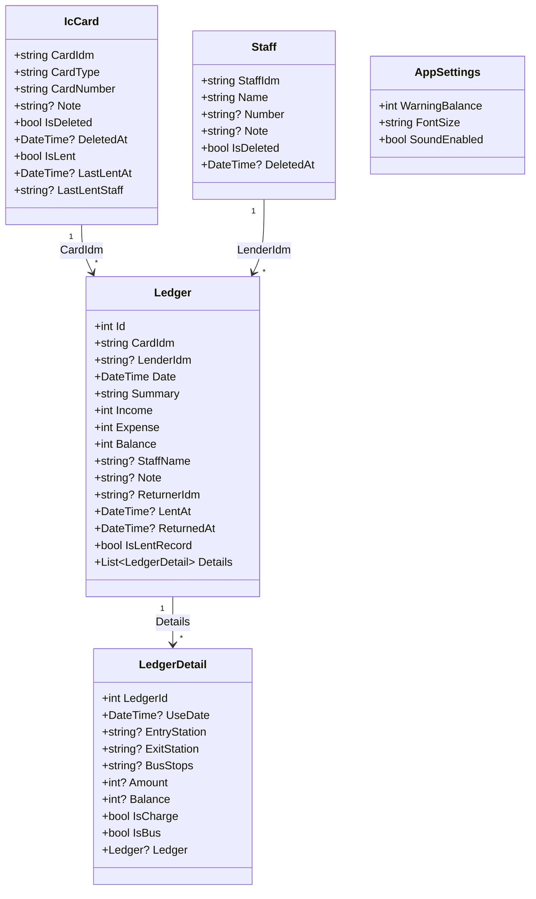
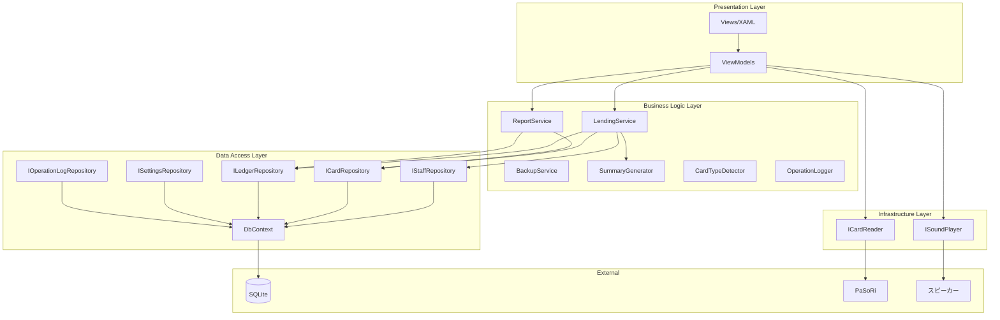
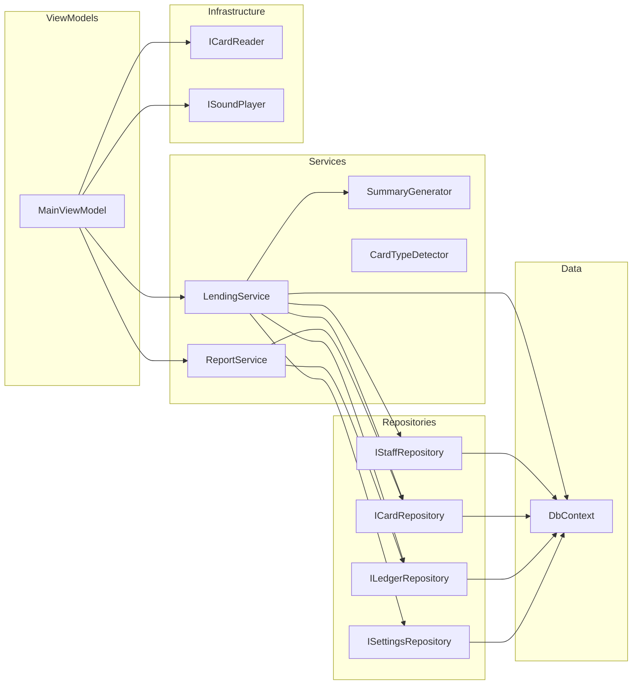
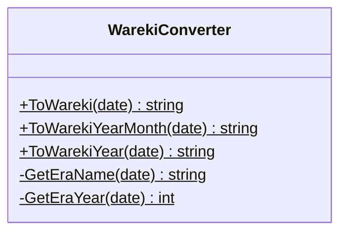

# クラス設計書

## 1. クラス図



---

## 2. レイヤー構成図



---

## 3. 主要クラスの責務

### 3.1 Models（エンティティ）

| クラス | 責務 | 対応テーブル |
|--------|------|--------------|
| Staff | 職員情報を保持 | staff |
| IcCard | ICカード情報を保持 | ic_card |
| Ledger | 利用履歴概要を保持 | ledger |
| LedgerDetail | 利用履歴詳細を保持 | ledger_detail |
| OperationLog | 操作ログを保持 | operation_log |
| AppSettings | アプリケーション設定を保持 | settings |

### 3.2 ViewModels

| クラス | 責務 |
|--------|------|
| ViewModelBase | ViewModelの基底クラス（IsBusy, BusyMessage） |
| MainViewModel | メイン画面のロジック、状態管理 |
| StaffManageViewModel | 職員管理ダイアログのロジック |
| CardManageViewModel | カード管理ダイアログのロジック |
| SettingsViewModel | 設定ダイアログのロジック |
| ReportViewModel | 帳票作成ダイアログのロジック |
| HistoryViewModel | 履歴表示ダイアログのロジック |

### 3.3 Services

| クラス | 責務 |
|--------|------|
| LendingService | 貸出・返却処理、30秒ルール管理 |
| ReportService | 月次帳票の作成（Excel出力） |
| BackupService | データベースのバックアップ |
| SummaryGenerator | 摘要文字列の生成 |
| CardTypeDetector | IDmからカード種別を判別 |
| OperationLogger | 操作ログの記録 |

### 3.4 Repositories

| インターフェース | 実装クラス | 責務 |
|------------------|------------|------|
| IStaffRepository | StaffRepository | 職員データのCRUD |
| ICardRepository | CardRepository | ICカードデータのCRUD |
| ILedgerRepository | LedgerRepository | 利用履歴のCRUD |
| ISettingsRepository | SettingsRepository | 設定データのCRUD |
| IOperationLogRepository | OperationLogRepository | 操作ログのCRUD |

### 3.5 Infrastructure

| インターフェース | 実装クラス | 責務 |
|------------------|------------|------|
| ICardReader | PcScCardReader | PC/SC APIでのカード読み取り |
| ICardReader | MockCardReader | テスト用モックリーダー |
| ISoundPlayer | SoundPlayer | 音声フィードバックの再生 |

---

## 4. 依存関係図



---

## 5. クラス詳細

### 5.1 LendingService


### 5.2 SummaryGenerator


### 5.3 CardTypeDetector


### 5.4 ReportService


### 5.5 DbContext


---

## 6. DIコンテナ設定

### 6.1 サービス登録（想定）

```csharp
// App.xaml.cs または Startup.cs
services.AddSingleton<DbContext>();
services.AddSingleton<ICardRepository, CardRepository>();
services.AddSingleton<IStaffRepository, StaffRepository>();
services.AddSingleton<ILedgerRepository, LedgerRepository>();
services.AddSingleton<ISettingsRepository, SettingsRepository>();
services.AddSingleton<IOperationLogRepository, OperationLogRepository>();

services.AddSingleton<SummaryGenerator>();
services.AddSingleton<LendingService>();
services.AddSingleton<ReportService>();
services.AddSingleton<BackupService>();
services.AddSingleton<OperationLogger>();

services.AddSingleton<ICardReader, PcScCardReader>();
services.AddSingleton<ISoundPlayer, SoundPlayer>();

services.AddTransient<MainViewModel>();
services.AddTransient<StaffManageViewModel>();
services.AddTransient<CardManageViewModel>();
services.AddTransient<SettingsViewModel>();
services.AddTransient<ReportViewModel>();
```

### 6.2 ライフタイム

| ライフタイム | クラス | 理由 |
|--------------|--------|------|
| Singleton | DbContext | DB接続を共有 |
| Singleton | Repositories | 状態を持たないが、DbContextを共有 |
| Singleton | Services | 状態を持つ（LastProcessedCardIdm等） |
| Singleton | ICardReader | ハードウェアリソースを管理 |
| Singleton | ISoundPlayer | リソース管理 |
| Transient | ViewModels | 画面ごとに新規インスタンス |

---

## 7. 共通ユーティリティ

### 7.1 WarekiConverter



### 7.2 Enums

```csharp
// アプリケーション状態
public enum AppState
{
    WaitingForStaffCard,  // 職員証タッチ待ち
    WaitingForIcCard,     // ICカードタッチ待ち
    Processing            // 処理中
}

// カード種別
public enum CardType
{
    Suica, PASMO, ICOCA, PiTaPa,
    Nimoca, SUGOCA, Hayakaken,
    Kitaca, TOICA, Manaca, Unknown
}

// 文字サイズ
public enum FontSizeOption
{
    Small, Medium, Large, ExtraLarge
}
```

---

## 8. インターフェース定義

### 8.1 ICardReader

```csharp
public interface ICardReader : IDisposable
{
    event EventHandler<CardReadEventArgs>? CardRead;
    event EventHandler<Exception>? Error;
    Task StartReadingAsync();
    Task StopReadingAsync();
    bool IsReading { get; }
    Task<IEnumerable<LedgerDetail>> ReadHistoryAsync(string idm);
    Task<int?> ReadBalanceAsync(string idm);
}
```

### 8.2 ISoundPlayer

```csharp
public interface ISoundPlayer
{
    void PlayLend();
    void PlayReturn();
    void PlayError();
    void PlayWarning();
    bool IsEnabled { get; set; }
}
```

### 8.3 IRepository

```csharp
// 例: ICardRepository
public interface ICardRepository
{
    Task<IcCard?> GetByIdmAsync(string cardIdm, bool includeDeleted = false);
    Task<IEnumerable<IcCard>> GetAllAsync(bool includeDeleted = false);
    Task<IEnumerable<IcCard>> GetLentCardsAsync();
    Task<bool> InsertAsync(IcCard card);
    Task<bool> UpdateAsync(IcCard card);
    Task<bool> UpdateLentStatusAsync(string cardIdm, bool isLent, DateTime? lentAt, string? staffIdm);
    Task<bool> DeleteAsync(string cardIdm); // 論理削除
}
```
