# シーケンス図

## 1. 職員証タッチ～ICカードタッチのフロー

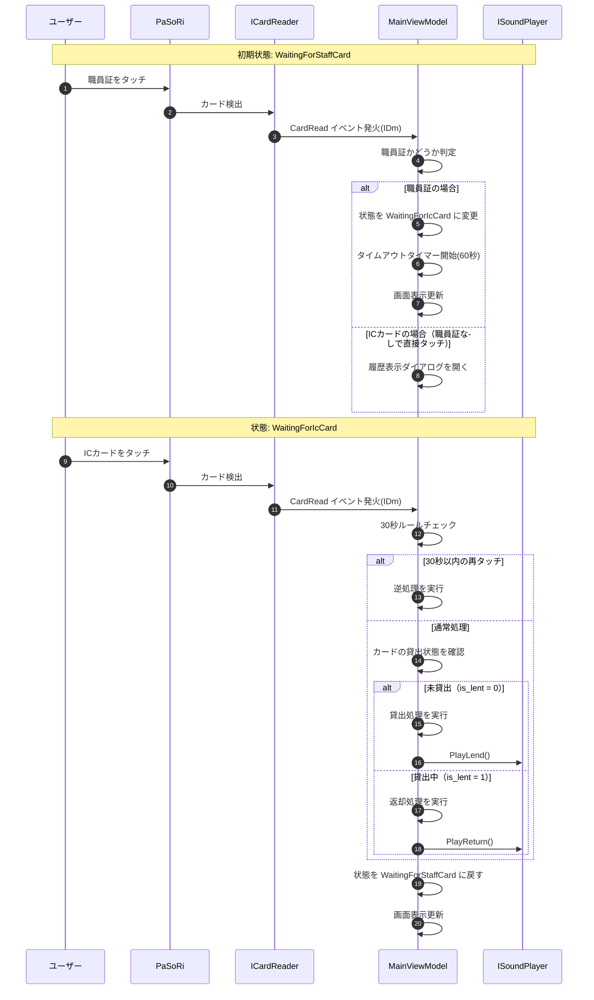
```mermaid
sequenceDiagram
    autonumber
    participant User as ユーザー
    participant PaSoRi as PaSoRi
    participant Reader as ICardReader
    participant VM as MainViewModel
    participant Sound as ISoundPlayer

    Note over User,Sound: 初期状態: WaitingForStaffCard

    User->>PaSoRi: 職員証をタッチ
    PaSoRi->>Reader: カード検出
    Reader->>VM: CardRead イベント発火(IDm)

    VM->>VM: 職員証かどうか判定
    alt 職員証の場合
        VM->>VM: 状態を WaitingForIcCard に変更
        VM->>VM: タイムアウトタイマー開始(60秒)
        VM->>VM: 画面表示更新
    else ICカードの場合（職員証なしで直接タッチ）
        VM->>VM: 履歴表示ダイアログを開く
    end

    Note over User,Sound: 状態: WaitingForIcCard

    User->>PaSoRi: ICカードをタッチ
    PaSoRi->>Reader: カード検出
    Reader->>VM: CardRead イベント発火(IDm)

    VM->>VM: 30秒ルールチェック
    alt 30秒以内の再タッチ
        VM->>VM: 逆処理を実行
    else 通常処理
        VM->>VM: カードの貸出状態を確認
        alt 未貸出（is_lent = 0）
            VM->>VM: 貸出処理を実行
            VM->>Sound: PlayLend()
        else 貸出中（is_lent = 1）
            VM->>VM: 返却処理を実行
            VM->>Sound: PlayReturn()
        end
    end

    VM->>VM: 状態を WaitingForStaffCard に戻す
    VM->>VM: 画面表示更新
```

---

## 2. 貸出処理シーケンス

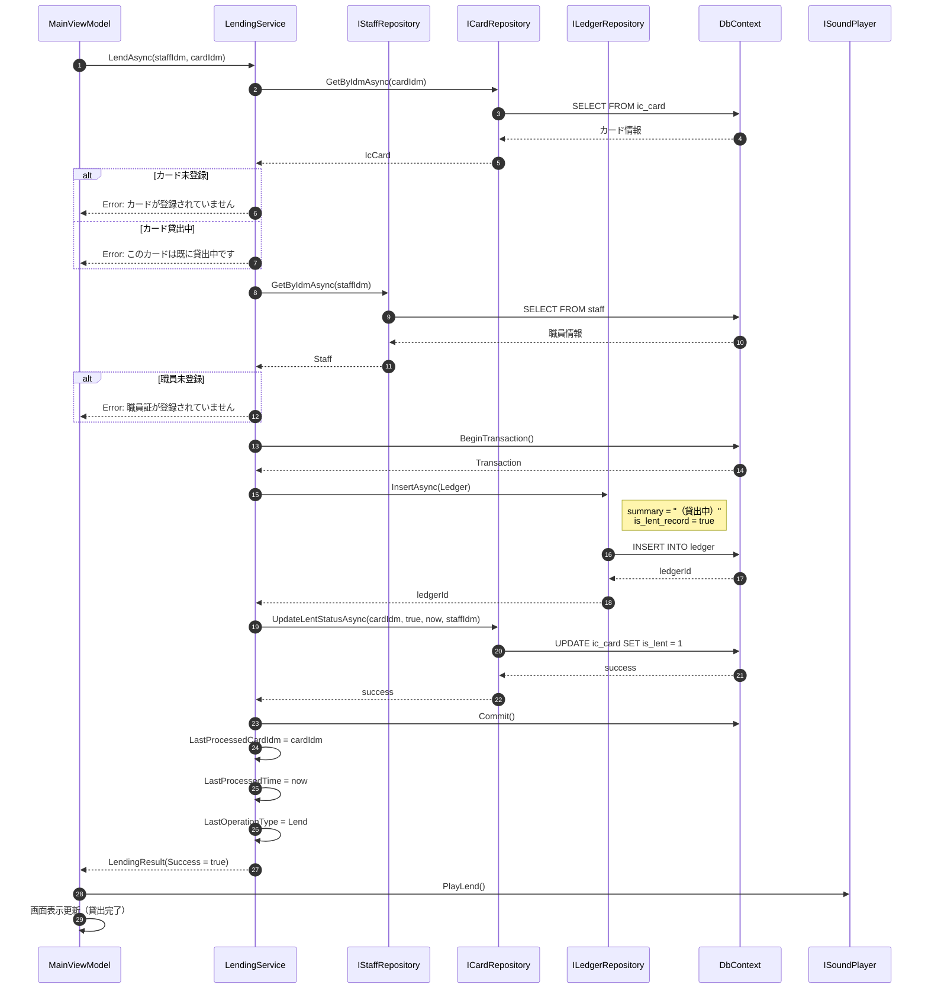
```mermaid
sequenceDiagram
    autonumber
    participant VM as MainViewModel
    participant LS as LendingService
    participant SR as IStaffRepository
    participant CR as ICardRepository
    participant LR as ILedgerRepository
    participant DB as DbContext
    participant Sound as ISoundPlayer

    VM->>LS: LendAsync(staffIdm, cardIdm)

    LS->>CR: GetByIdmAsync(cardIdm)
    CR->>DB: SELECT FROM ic_card
    DB-->>CR: カード情報
    CR-->>LS: IcCard

    alt カード未登録
        LS-->>VM: Error: カードが登録されていません
    else カード貸出中
        LS-->>VM: Error: このカードは既に貸出中です
    end

    LS->>SR: GetByIdmAsync(staffIdm)
    SR->>DB: SELECT FROM staff
    DB-->>SR: 職員情報
    SR-->>LS: Staff

    alt 職員未登録
        LS-->>VM: Error: 職員証が登録されていません
    end

    LS->>DB: BeginTransaction()
    DB-->>LS: Transaction

    LS->>LR: InsertAsync(Ledger)
    Note right of LR: summary = "（貸出中）"<br/>is_lent_record = true
    LR->>DB: INSERT INTO ledger
    DB-->>LR: ledgerId
    LR-->>LS: ledgerId

    LS->>CR: UpdateLentStatusAsync(cardIdm, true, now, staffIdm)
    CR->>DB: UPDATE ic_card SET is_lent = 1
    DB-->>CR: success
    CR-->>LS: success

    LS->>DB: Commit()

    LS->>LS: LastProcessedCardIdm = cardIdm
    LS->>LS: LastProcessedTime = now
    LS->>LS: LastOperationType = Lend

    LS-->>VM: LendingResult(Success = true)

    VM->>Sound: PlayLend()
    VM->>VM: 画面表示更新（貸出完了）
```

---

## 3. 返却処理シーケンス

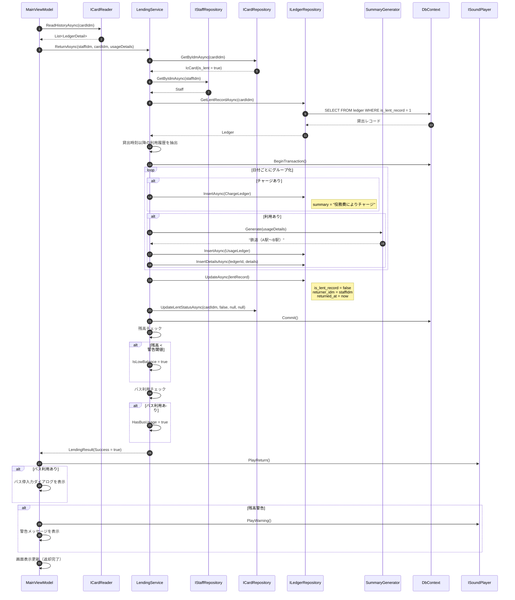
```mermaid
sequenceDiagram
    autonumber
    participant VM as MainViewModel
    participant Reader as ICardReader
    participant LS as LendingService
    participant SR as IStaffRepository
    participant CR as ICardRepository
    participant LR as ILedgerRepository
    participant SG as SummaryGenerator
    participant DB as DbContext
    participant Sound as ISoundPlayer

    VM->>Reader: ReadHistoryAsync(cardIdm)
    Reader-->>VM: List<LedgerDetail>

    VM->>LS: ReturnAsync(staffIdm, cardIdm, usageDetails)

    LS->>CR: GetByIdmAsync(cardIdm)
    CR-->>LS: IcCard(is_lent = true)

    LS->>SR: GetByIdmAsync(staffIdm)
    SR-->>LS: Staff

    LS->>LR: GetLentRecordAsync(cardIdm)
    LR->>DB: SELECT FROM ledger WHERE is_lent_record = 1
    DB-->>LR: 貸出レコード
    LR-->>LS: Ledger

    LS->>LS: 貸出時刻以降の利用履歴を抽出

    LS->>DB: BeginTransaction()

    loop 日付ごとにグループ化
        alt チャージあり
            LS->>LR: InsertAsync(ChargeLedger)
            Note right of LR: summary = "役務費によりチャージ"
        end

        alt 利用あり
            LS->>SG: Generate(usageDetails)
            SG-->>LS: "鉄道（A駅～B駅）"
            LS->>LR: InsertAsync(UsageLedger)
            LS->>LR: InsertDetailsAsync(ledgerId, details)
        end
    end

    LS->>LR: UpdateAsync(lentRecord)
    Note right of LR: is_lent_record = false<br/>returner_idm = staffIdm<br/>returned_at = now

    LS->>CR: UpdateLentStatusAsync(cardIdm, false, null, null)

    LS->>DB: Commit()

    LS->>LS: 残高チェック
    alt 残高 < 警告閾値
        LS->>LS: IsLowBalance = true
    end

    LS->>LS: バス利用チェック
    alt バス利用あり
        LS->>LS: HasBusUsage = true
    end

    LS-->>VM: LendingResult(Success = true)

    VM->>Sound: PlayReturn()

    alt バス利用あり
        VM->>VM: バス停入力ダイアログを表示
    end

    alt 残高警告
        VM->>Sound: PlayWarning()
        VM->>VM: 警告メッセージを表示
    end

    VM->>VM: 画面表示更新（返却完了）
```

---

## 4. 帳票出力シーケンス

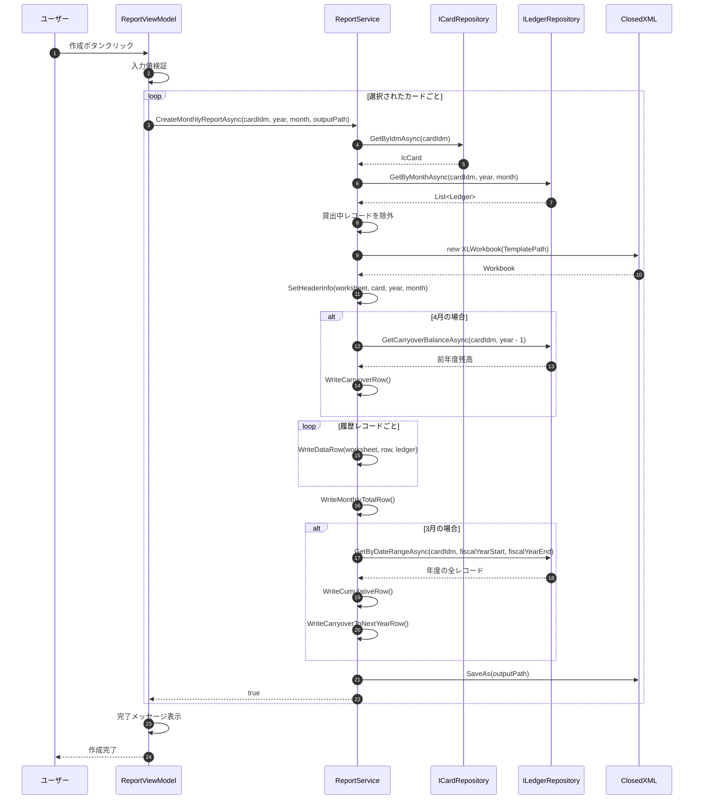
```mermaid
sequenceDiagram
    autonumber
    participant User as ユーザー
    participant VM as ReportViewModel
    participant RS as ReportService
    participant CR as ICardRepository
    participant LR as ILedgerRepository
    participant XL as ClosedXML

    User->>VM: 作成ボタンクリック

    VM->>VM: 入力値検証

    loop 選択されたカードごと
        VM->>RS: CreateMonthlyReportAsync(cardIdm, year, month, outputPath)

        RS->>CR: GetByIdmAsync(cardIdm)
        CR-->>RS: IcCard

        RS->>LR: GetByMonthAsync(cardIdm, year, month)
        LR-->>RS: List<Ledger>

        RS->>RS: 貸出中レコードを除外

        RS->>XL: new XLWorkbook(TemplatePath)
        XL-->>RS: Workbook

        RS->>RS: SetHeaderInfo(worksheet, card, year, month)

        alt 4月の場合
            RS->>LR: GetCarryoverBalanceAsync(cardIdm, year - 1)
            LR-->>RS: 前年度残高
            RS->>RS: WriteCarryoverRow()
        end

        loop 履歴レコードごと
            RS->>RS: WriteDataRow(worksheet, row, ledger)
        end

        RS->>RS: WriteMonthlyTotalRow()

        alt 3月の場合
            RS->>LR: GetByDateRangeAsync(cardIdm, fiscalYearStart, fiscalYearEnd)
            LR-->>RS: 年度の全レコード
            RS->>RS: WriteCumulativeRow()
            RS->>RS: WriteCarryoverToNextYearRow()
        end

        RS->>XL: SaveAs(outputPath)

        RS-->>VM: true
    end

    VM->>VM: 完了メッセージ表示
    VM-->>User: 作成完了
```

---

## 5. 30秒ルール適用シーケンス

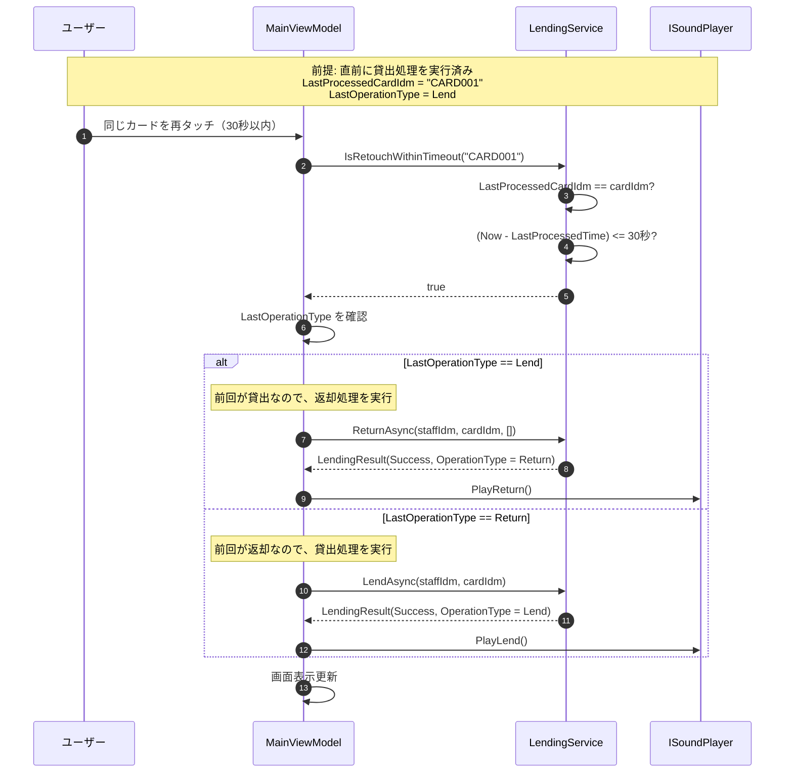
```mermaid
sequenceDiagram
    autonumber
    participant User as ユーザー
    participant VM as MainViewModel
    participant LS as LendingService
    participant Sound as ISoundPlayer

    Note over User,Sound: 前提: 直前に貸出処理を実行済み<br/>LastProcessedCardIdm = "CARD001"<br/>LastOperationType = Lend

    User->>VM: 同じカードを再タッチ（30秒以内）

    VM->>LS: IsRetouchWithinTimeout("CARD001")
    LS->>LS: LastProcessedCardIdm == cardIdm?
    LS->>LS: (Now - LastProcessedTime) <= 30秒?
    LS-->>VM: true

    VM->>VM: LastOperationType を確認

    alt LastOperationType == Lend
        Note over VM: 前回が貸出なので、返却処理を実行
        VM->>LS: ReturnAsync(staffIdm, cardIdm, [])
        LS-->>VM: LendingResult(Success, OperationType = Return)
        VM->>Sound: PlayReturn()
    else LastOperationType == Return
        Note over VM: 前回が返却なので、貸出処理を実行
        VM->>LS: LendAsync(staffIdm, cardIdm)
        LS-->>VM: LendingResult(Success, OperationType = Lend)
        VM->>Sound: PlayLend()
    end

    VM->>VM: 画面表示更新
```

---

## 6. カード自動登録シーケンス

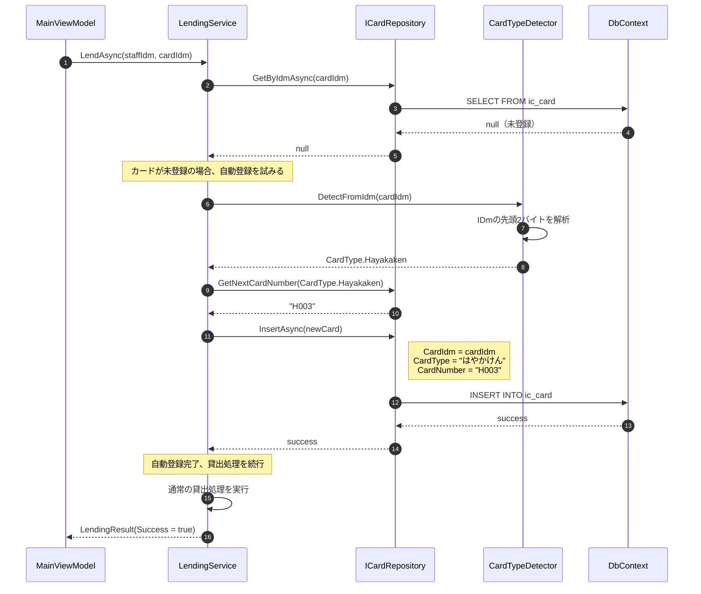
```mermaid
sequenceDiagram
    autonumber
    participant VM as MainViewModel
    participant LS as LendingService
    participant CR as ICardRepository
    participant CD as CardTypeDetector
    participant DB as DbContext

    VM->>LS: LendAsync(staffIdm, cardIdm)

    LS->>CR: GetByIdmAsync(cardIdm)
    CR->>DB: SELECT FROM ic_card
    DB-->>CR: null（未登録）
    CR-->>LS: null

    Note over LS: カードが未登録の場合、自動登録を試みる

    LS->>CD: DetectFromIdm(cardIdm)
    CD->>CD: IDmの先頭2バイトを解析
    CD-->>LS: CardType.Hayakaken

    LS->>CR: GetNextCardNumber(CardType.Hayakaken)
    CR-->>LS: "H003"

    LS->>CR: InsertAsync(newCard)
    Note right of CR: CardIdm = cardIdm<br/>CardType = "はやかけん"<br/>CardNumber = "H003"
    CR->>DB: INSERT INTO ic_card
    DB-->>CR: success
    CR-->>LS: success

    Note over LS: 自動登録完了、貸出処理を続行

    LS->>LS: 通常の貸出処理を実行
    LS-->>VM: LendingResult(Success = true)
```

---

## 7. タイムアウト処理シーケンス

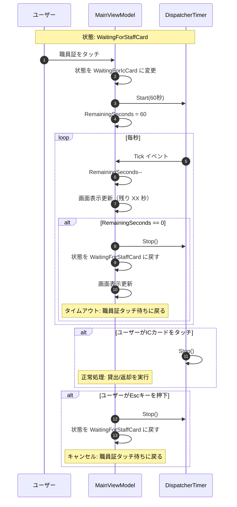
```mermaid
sequenceDiagram
    autonumber
    participant User as ユーザー
    participant VM as MainViewModel
    participant Timer as DispatcherTimer

    Note over User,Timer: 状態: WaitingForStaffCard

    User->>VM: 職員証をタッチ

    VM->>VM: 状態を WaitingForIcCard に変更
    VM->>Timer: Start(60秒)
    VM->>VM: RemainingSeconds = 60

    loop 毎秒
        Timer->>VM: Tick イベント
        VM->>VM: RemainingSeconds--
        VM->>VM: 画面表示更新（残り XX 秒）

        alt RemainingSeconds == 0
            VM->>Timer: Stop()
            VM->>VM: 状態を WaitingForStaffCard に戻す
            VM->>VM: 画面表示更新
            Note over VM: タイムアウト: 職員証タッチ待ちに戻る
        end
    end

    alt ユーザーがICカードをタッチ
        Timer->>Timer: Stop()
        Note over VM: 正常処理: 貸出/返却を実行
    end

    alt ユーザーがEscキーを押下
        VM->>Timer: Stop()
        VM->>VM: 状態を WaitingForStaffCard に戻す
        Note over VM: キャンセル: 職員証タッチ待ちに戻る
    end
```

---

## 8. エラー処理シーケンス

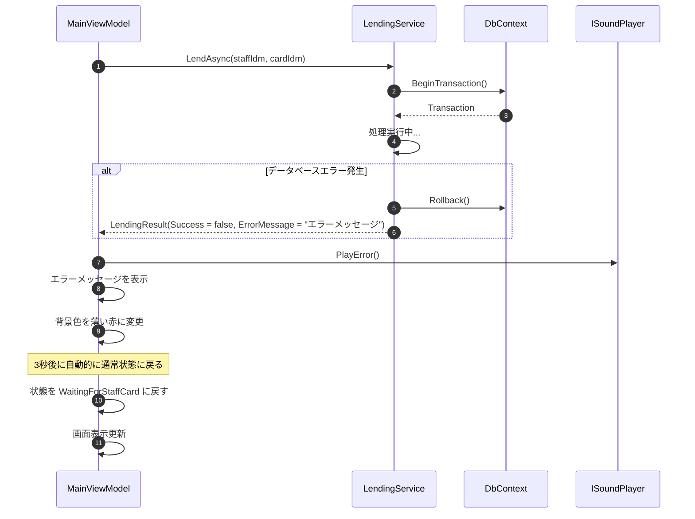
```mermaid
sequenceDiagram
    autonumber
    participant VM as MainViewModel
    participant LS as LendingService
    participant DB as DbContext
    participant Sound as ISoundPlayer

    VM->>LS: LendAsync(staffIdm, cardIdm)

    LS->>DB: BeginTransaction()
    DB-->>LS: Transaction

    LS->>LS: 処理実行中...

    alt データベースエラー発生
        LS->>DB: Rollback()
        LS-->>VM: LendingResult(Success = false, ErrorMessage = "エラーメッセージ")
    end

    VM->>Sound: PlayError()
    VM->>VM: エラーメッセージを表示
    VM->>VM: 背景色を薄い赤に変更

    Note over VM: 3秒後に自動的に通常状態に戻る

    VM->>VM: 状態を WaitingForStaffCard に戻す
    VM->>VM: 画面表示更新
```

---

## 9. 履歴統合シーケンス

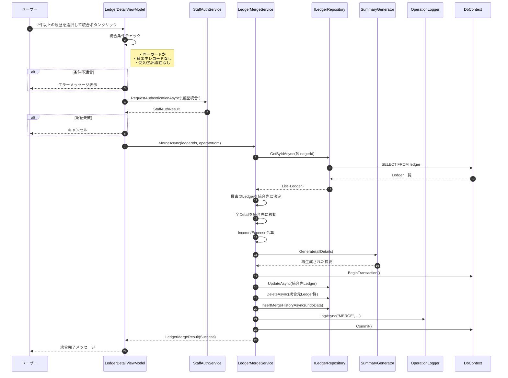
```mermaid
sequenceDiagram
    autonumber
    participant User as ユーザー
    participant VM as LedgerDetailViewModel
    participant Auth as StaffAuthService
    participant MS as LedgerMergeService
    participant LR as ILedgerRepository
    participant SG as SummaryGenerator
    participant OL as OperationLogger
    participant DB as DbContext

    User->>VM: 2件以上の履歴を選択して統合ボタンクリック

    VM->>VM: 統合条件チェック
    Note right of VM: ・同一カードか<br/>・貸出中レコードなし<br/>・受入/払出混在なし

    alt 条件不適合
        VM-->>User: エラーメッセージ表示
    end

    VM->>Auth: RequestAuthenticationAsync("履歴統合")
    Auth-->>VM: StaffAuthResult

    alt 認証失敗
        VM-->>User: キャンセル
    end

    VM->>MS: MergeAsync(ledgerIds, operatorIdm)

    MS->>LR: GetByIdAsync(各ledgerId)
    LR->>DB: SELECT FROM ledger
    DB-->>LR: Ledger一覧
    LR-->>MS: List~Ledger~

    MS->>MS: 最古のLedgerを統合先に決定
    MS->>MS: 全Detailを統合先に移動
    MS->>MS: Income/Expense合算
    MS->>SG: Generate(allDetails)
    SG-->>MS: 再生成された摘要

    MS->>DB: BeginTransaction()
    MS->>LR: UpdateAsync(統合先Ledger)
    MS->>LR: DeleteAsync(統合元Ledger群)
    MS->>LR: InsertMergeHistoryAsync(undoData)
    MS->>OL: LogAsync("MERGE", ...)
    MS->>DB: Commit()

    MS-->>VM: LedgerMergeResult(Success)
    VM-->>User: 統合完了メッセージ
```

---

## 10. 履歴分割シーケンス

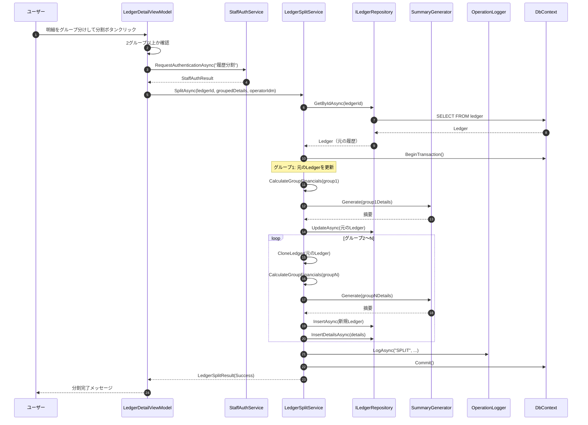
```mermaid
sequenceDiagram
    autonumber
    participant User as ユーザー
    participant VM as LedgerDetailViewModel
    participant Auth as StaffAuthService
    participant SS as LedgerSplitService
    participant LR as ILedgerRepository
    participant SG as SummaryGenerator
    participant OL as OperationLogger
    participant DB as DbContext

    User->>VM: 明細をグループ分けして分割ボタンクリック

    VM->>VM: 2グループ以上か確認

    VM->>Auth: RequestAuthenticationAsync("履歴分割")
    Auth-->>VM: StaffAuthResult

    VM->>SS: SplitAsync(ledgerId, groupedDetails, operatorIdm)

    SS->>LR: GetByIdAsync(ledgerId)
    LR->>DB: SELECT FROM ledger
    DB-->>LR: Ledger
    LR-->>SS: Ledger（元の履歴）

    SS->>DB: BeginTransaction()

    Note over SS: グループ1: 元のLedgerを更新
    SS->>SS: CalculateGroupFinancials(group1)
    SS->>SG: Generate(group1Details)
    SG-->>SS: 摘要
    SS->>LR: UpdateAsync(元のLedger)

    loop グループ2〜N
        SS->>SS: CloneLedger(元のLedger)
        SS->>SS: CalculateGroupFinancials(groupN)
        SS->>SG: Generate(groupNDetails)
        SG-->>SS: 摘要
        SS->>LR: InsertAsync(新規Ledger)
        SS->>LR: InsertDetailsAsync(details)
    end

    SS->>OL: LogAsync("SPLIT", ...)
    SS->>DB: Commit()

    SS-->>VM: LedgerSplitResult(Success)
    VM-->>User: 分割完了メッセージ
```

---

## 11. 職員認証シーケンス

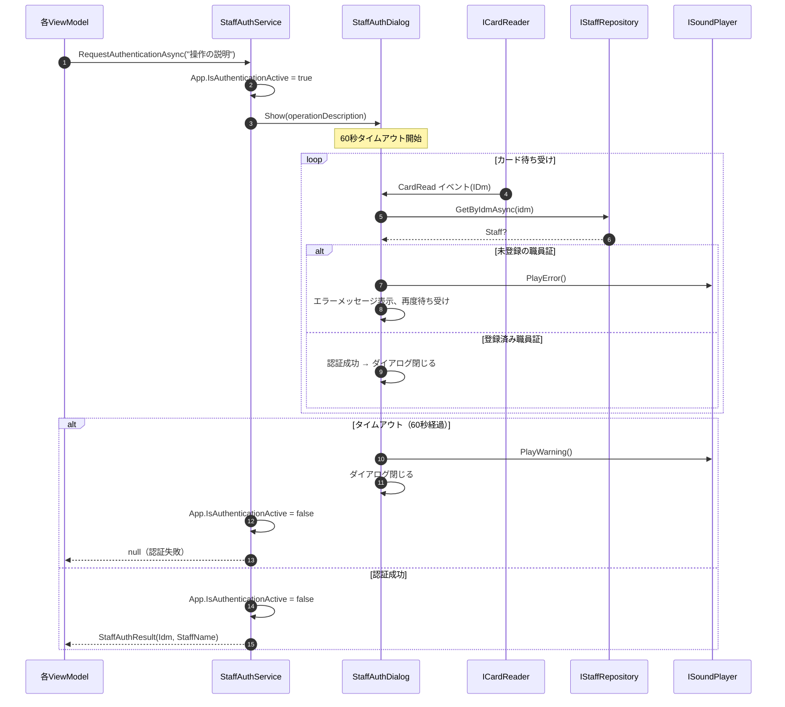
```mermaid
sequenceDiagram
    autonumber
    participant VM as 各ViewModel
    participant Auth as StaffAuthService
    participant Dialog as StaffAuthDialog
    participant Reader as ICardReader
    participant SR as IStaffRepository
    participant Sound as ISoundPlayer

    VM->>Auth: RequestAuthenticationAsync("操作の説明")

    Auth->>Auth: App.IsAuthenticationActive = true
    Auth->>Dialog: Show(operationDescription)

    Note over Dialog: 60秒タイムアウト開始

    loop カード待ち受け
        Reader->>Dialog: CardRead イベント(IDm)
        Dialog->>SR: GetByIdmAsync(idm)
        SR-->>Dialog: Staff?

        alt 未登録の職員証
            Dialog->>Sound: PlayError()
            Dialog->>Dialog: エラーメッセージ表示、再度待ち受け
        else 登録済み職員証
            Dialog->>Dialog: 認証成功 → ダイアログ閉じる
        end
    end

    alt タイムアウト（60秒経過）
        Dialog->>Sound: PlayWarning()
        Dialog->>Dialog: ダイアログ閉じる
        Auth->>Auth: App.IsAuthenticationActive = false
        Auth-->>VM: null（認証失敗）
    else 認証成功
        Auth->>Auth: App.IsAuthenticationActive = false
        Auth-->>VM: StaffAuthResult(Idm, StaffName)
    end
```

---

## 12. バックアップ/リストアシーケンス

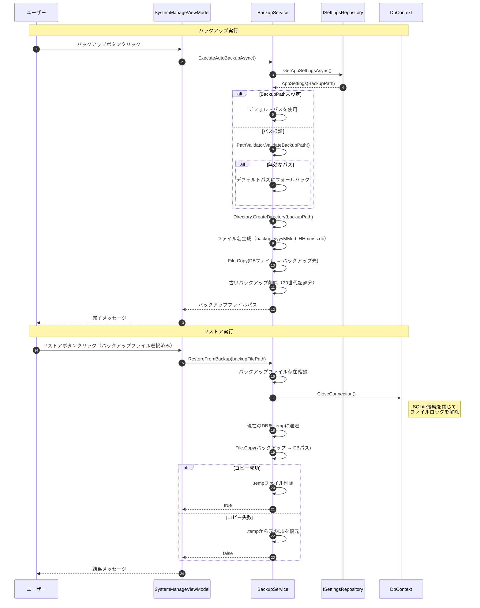
```mermaid
sequenceDiagram
    autonumber
    participant User as ユーザー
    participant VM as SystemManageViewModel
    participant BS as BackupService
    participant SR as ISettingsRepository
    participant DB as DbContext

    Note over User,DB: バックアップ実行

    User->>VM: バックアップボタンクリック
    VM->>BS: ExecuteAutoBackupAsync()

    BS->>SR: GetAppSettingsAsync()
    SR-->>BS: AppSettings(BackupPath)

    alt BackupPath未設定
        BS->>BS: デフォルトパスを使用
    else パス検証
        BS->>BS: PathValidator.ValidateBackupPath()
        alt 無効なパス
            BS->>BS: デフォルトパスにフォールバック
        end
    end

    BS->>BS: Directory.CreateDirectory(backupPath)
    BS->>BS: ファイル名生成（backup_yyyyMMdd_HHmmss.db）
    BS->>BS: File.Copy(DBファイル → バックアップ先)
    BS->>BS: 古いバックアップ削除（30世代超過分）

    BS-->>VM: バックアップファイルパス
    VM-->>User: 完了メッセージ

    Note over User,DB: リストア実行

    User->>VM: リストアボタンクリック（バックアップファイル選択済み）
    VM->>BS: RestoreFromBackup(backupFilePath)

    BS->>BS: バックアップファイル存在確認
    BS->>DB: CloseConnection()
    Note right of DB: SQLite接続を閉じて<br/>ファイルロックを解除

    BS->>BS: 現在のDBを.tempに退避
    BS->>BS: File.Copy(バックアップ → DBパス)

    alt コピー成功
        BS->>BS: .tempファイル削除
        BS-->>VM: true
    else コピー失敗
        BS->>BS: .tempから元のDBを復元
        BS-->>VM: false
    end

    VM-->>User: 結果メッセージ
```

---

## 13. CSV入出力シーケンス

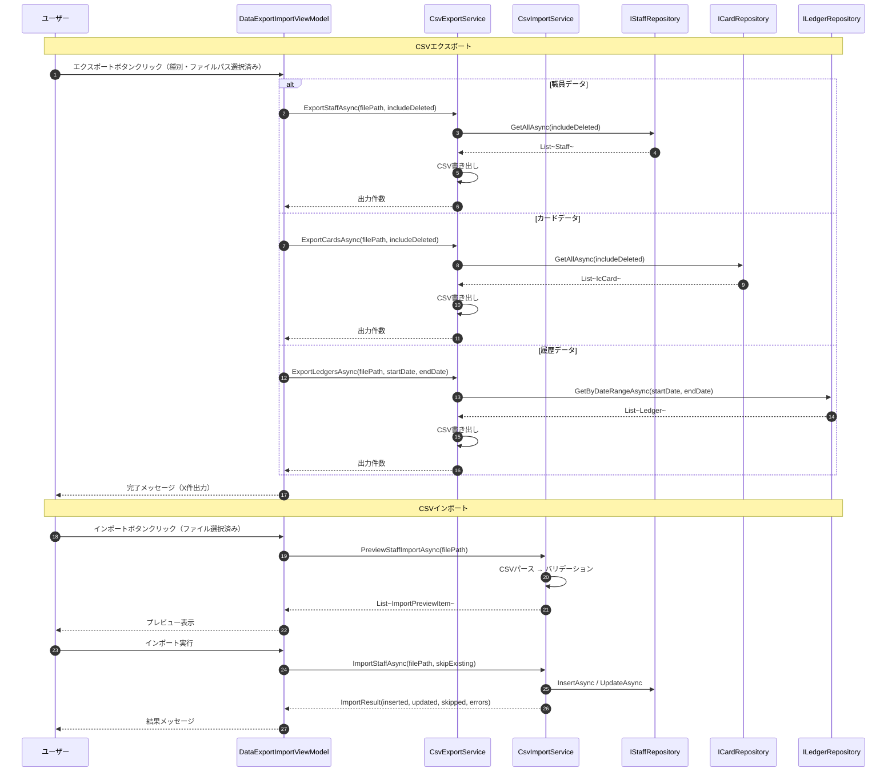
```mermaid
sequenceDiagram
    autonumber
    participant User as ユーザー
    participant VM as DataExportImportViewModel
    participant Exp as CsvExportService
    participant Imp as CsvImportService
    participant SR as IStaffRepository
    participant CR as ICardRepository
    participant LR as ILedgerRepository

    Note over User,LR: CSVエクスポート

    User->>VM: エクスポートボタンクリック（種別・ファイルパス選択済み）

    alt 職員データ
        VM->>Exp: ExportStaffAsync(filePath, includeDeleted)
        Exp->>SR: GetAllAsync(includeDeleted)
        SR-->>Exp: List~Staff~
        Exp->>Exp: CSV書き出し
        Exp-->>VM: 出力件数
    else カードデータ
        VM->>Exp: ExportCardsAsync(filePath, includeDeleted)
        Exp->>CR: GetAllAsync(includeDeleted)
        CR-->>Exp: List~IcCard~
        Exp->>Exp: CSV書き出し
        Exp-->>VM: 出力件数
    else 履歴データ
        VM->>Exp: ExportLedgersAsync(filePath, startDate, endDate)
        Exp->>LR: GetByDateRangeAsync(startDate, endDate)
        LR-->>Exp: List~Ledger~
        Exp->>Exp: CSV書き出し
        Exp-->>VM: 出力件数
    end

    VM-->>User: 完了メッセージ（X件出力）

    Note over User,LR: CSVインポート

    User->>VM: インポートボタンクリック（ファイル選択済み）

    VM->>Imp: PreviewStaffImportAsync(filePath)
    Imp->>Imp: CSVパース → バリデーション
    Imp-->>VM: List~ImportPreviewItem~

    VM-->>User: プレビュー表示

    User->>VM: インポート実行

    VM->>Imp: ImportStaffAsync(filePath, skipExisting)
    Imp->>SR: InsertAsync / UpdateAsync
    Imp-->>VM: ImportResult(inserted, updated, skipped, errors)

    VM-->>User: 結果メッセージ
```

---

## 14. 印刷プレビューシーケンス

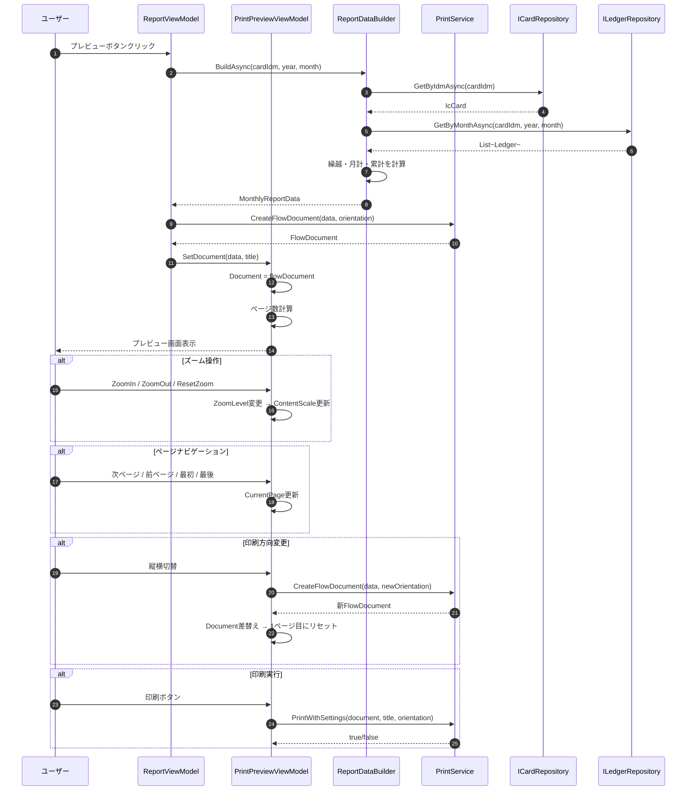
```mermaid
sequenceDiagram
    autonumber
    participant User as ユーザー
    participant RVM as ReportViewModel
    participant PVM as PrintPreviewViewModel
    participant RDB as ReportDataBuilder
    participant PS as PrintService
    participant CR as ICardRepository
    participant LR as ILedgerRepository

    User->>RVM: プレビューボタンクリック

    RVM->>RDB: BuildAsync(cardIdm, year, month)
    RDB->>CR: GetByIdmAsync(cardIdm)
    CR-->>RDB: IcCard
    RDB->>LR: GetByMonthAsync(cardIdm, year, month)
    LR-->>RDB: List~Ledger~
    RDB->>RDB: 繰越・月計・累計を計算
    RDB-->>RVM: MonthlyReportData

    RVM->>PS: CreateFlowDocument(data, orientation)
    PS-->>RVM: FlowDocument

    RVM->>PVM: SetDocument(data, title)
    PVM->>PVM: Document = flowDocument
    PVM->>PVM: ページ数計算

    PVM-->>User: プレビュー画面表示

    alt ズーム操作
        User->>PVM: ZoomIn / ZoomOut / ResetZoom
        PVM->>PVM: ZoomLevel変更 → ContentScale更新
    end

    alt ページナビゲーション
        User->>PVM: 次ページ / 前ページ / 最初 / 最後
        PVM->>PVM: CurrentPage更新
    end

    alt 印刷方向変更
        User->>PVM: 縦横切替
        PVM->>PS: CreateFlowDocument(data, newOrientation)
        PS-->>PVM: 新FlowDocument
        PVM->>PVM: Document差替え → 1ページ目にリセット
    end

    alt 印刷実行
        User->>PVM: 印刷ボタン
        PVM->>PS: PrintWithSettings(document, title, orientation)
        PS-->>PVM: true/false
    end
```
