# シーケンス図

## 0. このドキュメントについて

| 項目 | 内容 |
|------|------|
| **対象読者** | 本システムの開発者・保守担当者。業務フローをオブジェクト間の時系列で追いたい人 |
| **前提知識** | `04_機能設計書.md`(業務仕様) / `05_クラス設計書.md`(登場するクラスの責務) |
| **このドキュメントで答えられる問い** | ・貸出/返却処理の中でクラス間でどうメッセージが飛ぶか ・30秒ルールやタイムアウトはどう実装されているか ・履歴統合/分割/職員認証のフロー ・バックアップ・CSV入出力・印刷プレビューの処理順 |
| **関連ドキュメント** | `04_機能設計書.md`(業務視点) / `05_クラス設計書.md`(実装視点) |

> **Mermaidの読み方**: `participant X as Y` は「X というエイリアスで Y を登場させる」、`A->>B: msg` は同期呼び出し、`B-->>A: resp` は戻り値。`alt` / `loop` / `Note` ブロックで条件分岐・繰り返し・補足を表現します。

> **トランザクション表記について（Issue #1245）**: 本書のシーケンス図では書き込み系処理を `await BeginTransactionAsync()` → `TransactionScope (using)` → `scope.Commit()` の形で表記しています。`scope.Rollback()` は原則として図に出しません — 例外経路では **`scope.Dispose()` が自動的にロールバックする** ためです。この仕様の詳細は [§9.1 TransactionScope の自動ロールバック仕様](#91-transactionscope-の自動ロールバック仕様重要) を参照してください。

---

## 1. シーケンス図マップ

本書には17本のシーケンス図が含まれます（§13 は自動バックアップ・手動バックアップ・リストアの 3 本）。機能グループで整理しました。

| グループ | 章 | 図 | 関連する業務仕様 |
|---|---|---|---|
| **中核フロー** | §2 | 職員証〜交通系ICカードタッチの全体 | 04 §2 |
| | §3 | 貸出処理 | 04 §2.2 |
| | §4 | 返却処理 | 04 §2.4 |
| | §6 | 30秒ルール適用 | 04 §3 |
| | §7 | 未登録カード処理 | - |
| | §8 | タイムアウト処理 | 04 §1.3 |
| | §9 | エラー処理 | - |
| **帳票・出力** | §5 | 月次帳票出力 | 04 §8 |
| | §15 | 印刷プレビュー | 04 §9 |
| **履歴管理** | §10 | 履歴統合(マージ) | 04 §11 |
| | §11 | 履歴分割 | 04 §12 |
| **セキュリティ** | §12 | 職員認証 | 04 §14 |
| **運用** | §13 | 自動バックアップ・手動バックアップ・リストア（3本） | - |
| | §14 | CSV入出力 | - |
| **管理** | §16 | 管理者ダッシュボード | 04 §20 |

> **読み方のコツ**: まず §2〜§4 の3本(職員証→交通系ICカード→貸出/返却)を順に見れば、システムの心臓部が掴めます。他の図は必要になった時だけ参照してください。

---

## 2. 職員証タッチ〜交通系ICカードタッチのフロー

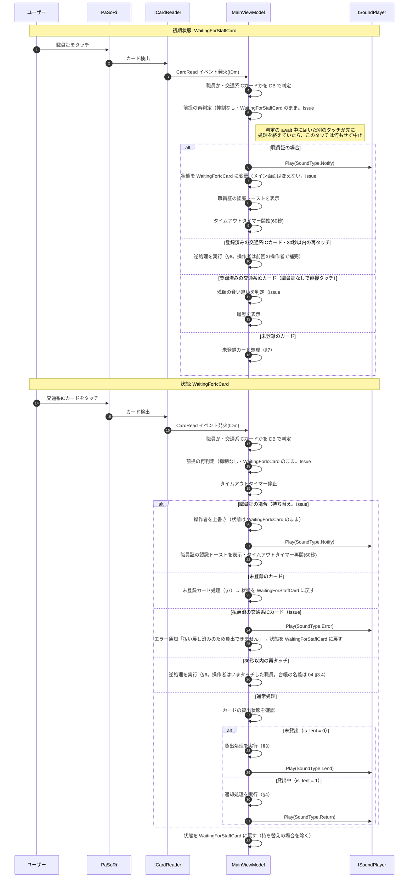
```mermaid
sequenceDiagram
    autonumber
    participant User as ユーザー
    participant PaSoRi as PaSoRi
    participant Reader as ICardReader
    participant VM as MainViewModel
    participant Sound as ISoundPlayer

    Note over User,Sound: 初期状態: WaitingForStaffCard

    User->>PaSoRi: 職員証をタッチ
    PaSoRi->>Reader: カード検出
    Reader->>VM: CardRead イベント発火(IDm)

    VM->>VM: 職員か・交通系ICカードかを DB で判定
    VM->>VM: 前提の再判定（抑制なし・WaitingForStaffCard のまま。Issue #1842）
    Note right of VM: 判定の await 中に届いた別のタッチが先に<br/>処理を終えていたら、このタッチは何もせず中止
    alt 職員証の場合
        VM->>Sound: Play(SoundType.Notify)
        VM->>VM: 状態を WaitingForIcCard に変更（メイン画面は変えない。Issue #186）
        VM->>VM: 職員証の認識トーストを表示
        VM->>VM: タイムアウトタイマー開始(60秒)
    else 登録済みの交通系ICカード・30秒以内の再タッチ
        VM->>VM: 逆処理を実行（§6。操作者は前回の操作者で補完）
    else 登録済みの交通系ICカード（職員証なしで直接タッチ）
        VM->>VM: 残額の食い違いを判定（Issue #1908）
        VM->>VM: 履歴を表示
    else 未登録のカード
        VM->>VM: 未登録カード処理（§7）
    end

    Note over User,Sound: 状態: WaitingForIcCard

    User->>PaSoRi: 交通系ICカードをタッチ
    PaSoRi->>Reader: カード検出
    Reader->>VM: CardRead イベント発火(IDm)

    VM->>VM: 職員か・交通系ICカードかを DB で判定
    VM->>VM: 前提の再判定（抑制なし・WaitingForIcCard のまま。Issue #1842）
    VM->>VM: タイムアウトタイマー停止

    alt 職員証の場合（持ち替え。Issue #1211）
        VM->>VM: 操作者を上書き（状態は WaitingForIcCard のまま）
        VM->>Sound: Play(SoundType.Notify)
        VM->>VM: 職員証の認識トーストを表示・タイムアウトタイマー再開(60秒)
    else 未登録のカード
        VM->>VM: 未登録カード処理（§7）→ 状態を WaitingForStaffCard に戻す
    else 払戻済の交通系ICカード（Issue #530）
        VM->>Sound: Play(SoundType.Error)
        VM->>VM: エラー通知「払い戻し済みのため貸出できません」→ 状態を WaitingForStaffCard に戻す
    else 30秒以内の再タッチ
        VM->>VM: 逆処理を実行（§6。操作者はいまタッチした職員。台帳の名義は 04 §3.4）
    else 通常処理
        VM->>VM: カードの貸出状態を確認
        alt 未貸出（is_lent = 0）
            VM->>VM: 貸出処理を実行（§3）
            VM->>Sound: Play(SoundType.Lend)
        else 貸出中（is_lent = 1）
            VM->>VM: 返却処理を実行（§4）
            VM->>Sound: Play(SoundType.Return)
        end
    end

    VM->>VM: 状態を WaitingForStaffCard に戻す（持ち替えの場合を除く）
```

> **30秒ルールは職員証タッチ待ちでも働く**: 判定（`IsRetouchWithinTimeout`）は交通系ICカードの IDm しか見ないため、職員証をタッチせずに同じ交通系ICカードを時間内に再タッチしても逆処理になる。誰の操作として記録するかは §6 と 04_機能設計書 §3.4 を参照。

---

## 3. 貸出処理シーケンス

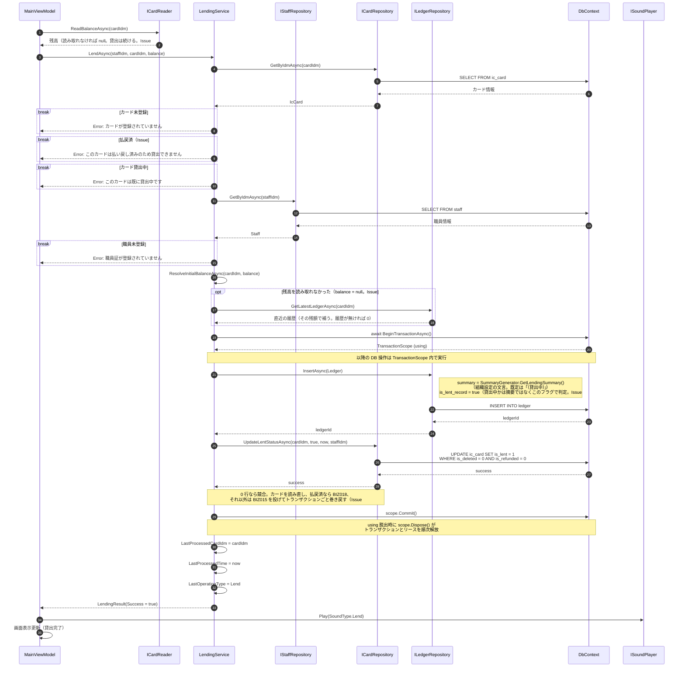
```mermaid
sequenceDiagram
    autonumber
    participant VM as MainViewModel
    participant Reader as ICardReader
    participant LS as LendingService
    participant SR as IStaffRepository
    participant CR as ICardRepository
    participant LR as ILedgerRepository
    participant DB as DbContext
    participant Sound as ISoundPlayer

    VM->>Reader: ReadBalanceAsync(cardIdm)
    Reader-->>VM: 残高（読み取れなければ null。貸出は続ける。Issue #526）
    VM->>LS: LendAsync(staffIdm, cardIdm, balance)

    LS->>CR: GetByIdmAsync(cardIdm)
    CR->>DB: SELECT FROM ic_card
    DB-->>CR: カード情報
    CR-->>LS: IcCard

    break カード未登録
        LS-->>VM: Error: カードが登録されていません
    end
    break 払戻済（Issue #2322）
        LS-->>VM: Error: このカードは払い戻し済みのため貸出できません
    end
    break カード貸出中
        LS-->>VM: Error: このカードは既に貸出中です
    end

    LS->>SR: GetByIdmAsync(staffIdm)
    SR->>DB: SELECT FROM staff
    DB-->>SR: 職員情報
    SR-->>LS: Staff

    break 職員未登録
        LS-->>VM: Error: 職員証が登録されていません
    end

    LS->>LS: ResolveInitialBalanceAsync(cardIdm, balance)
    opt 残高を読み取れなかった（balance = null。Issue #656）
        LS->>LR: GetLatestLedgerAsync(cardIdm)
        LR-->>LS: 直近の履歴（その残額で補う。履歴が無ければ 0）
    end

    LS->>DB: await BeginTransactionAsync()
    DB-->>LS: TransactionScope (using)
    Note over LS,DB: 以降の DB 操作は TransactionScope 内で実行

    LS->>LR: InsertAsync(Ledger)
    Note right of LR: summary = SummaryGenerator.GetLendingSummary()<br/>（組織設定の文言。既定は「（貸出中）」）<br/>is_lent_record = true（貸出中かは摘要ではなくこのフラグで判定。Issue #2044）
    LR->>DB: INSERT INTO ledger
    DB-->>LR: ledgerId
    LR-->>LS: ledgerId

    LS->>CR: UpdateLentStatusAsync(cardIdm, true, now, staffIdm)
    CR->>DB: UPDATE ic_card SET is_lent = 1<br/>WHERE is_deleted = 0 AND is_refunded = 0
    DB-->>CR: success
    CR-->>LS: success
    Note over LS,CR: 0 行なら競合。カードを読み直し、払戻済なら BIZ018、<br/>それ以外は BIZ015 を投げてトランザクションごと巻き戻す（Issue #1953 / #2322）

    LS->>DB: scope.Commit()
    Note over LS,DB: using 脱出時に scope.Dispose() が<br/>トランザクションとリースを順次解放

    LS->>LS: LastProcessedCardIdm = cardIdm
    LS->>LS: LastProcessedTime = now
    LS->>LS: LastOperationType = Lend

    LS-->>VM: LendingResult(Success = true)

    VM->>Sound: Play(SoundType.Lend)
    VM->>VM: 画面表示更新（貸出完了）
```

---

## 4. 返却処理シーケンス

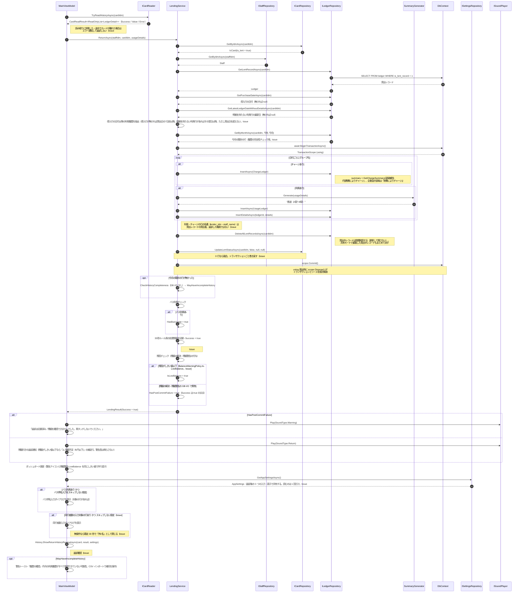
```mermaid
sequenceDiagram
    autonumber
    participant VM as MainViewModel
    participant Reader as ICardReader
    participant LS as LendingService
    participant SR as IStaffRepository
    participant CR as ICardRepository
    participant LR as ILedgerRepository
    participant SG as SummaryGenerator
    participant DB as DbContext
    participant Set as ISettingsRepository
    participant Sound as ISoundPlayer

    VM->>Reader: TryReadHistoryAsync(cardIdm)
    Reader-->>VM: CardReadResult<IReadOnlyList<LedgerDetail>>（Success / Value / Error）
    Note right of VM: 読み取りに失敗した・途中でカードが離れた場合は<br/>エラー通知して返却しない（Issue #1169 / #2301）

    VM->>LS: ReturnAsync(staffIdm, cardIdm, usageDetails)

    LS->>CR: GetByIdmAsync(cardIdm)
    CR-->>LS: IcCard(is_lent = true)

    LS->>SR: GetByIdmAsync(staffIdm)
    SR-->>LS: Staff

    LS->>LR: GetLentRecordAsync(cardIdm)
    LR->>DB: SELECT FROM ledger WHERE is_lent_record = 1
    DB-->>LR: 貸出レコード
    LR-->>LS: Ledger

    LS->>LR: GetPurchaseDateAsync(cardIdm)
    LR-->>LS: 導入行の日付（無ければ null）
    LS->>LR: GetLatestLedgerDateWithoutDetailsAsync(cardIdm)
    LR-->>LS: 明細を持たない利用行の最新日（無ければ null）
    LS->>LS: 導入行の日付以降の利用履歴を抽出（導入行が無ければ貸出日の7日前以降。明細を持たない利用行があればその翌日以降。ただし貸出日を超えない。Issue #2237）
    LS->>LR: GetByMonthAsync(cardIdm, 今年, 今月)
    LR-->>LS: 今月の既存の行（履歴の完全性チェック用。Issue #596）

    LS->>DB: await BeginTransactionAsync()
    DB-->>LS: TransactionScope (using)

    loop 日付ごとにグループ化
        alt チャージあり
            LS->>LR: InsertAsync(ChargeLedger)
            Note right of LR: summary = GetChargeSummary(部局種別)<br/>（「役務費によりチャージ」、企業会計部局は「旅費によりチャージ」）
        end

        alt 利用あり
            LS->>SG: Generate(usageDetails)
            SG-->>LS: "鉄道（A駅～B駅）"
            LS->>LR: InsertAsync(UsageLedger)
            LS->>LR: InsertDetailsAsync(ledgerId, details)
        end
    end

    Note right of LS: 利用・チャージの行の名義（lender_idm・staff_name）は<br/>貸出レコードの貸出者。返却した職員ではない（Issue #2323）

    LS->>LR: DeleteAllLentRecordsAsync(cardIdm)
    Note right of LR: 貸出中レコードは物理削除する（更新して残さない）。<br/>共有モードで重複した貸出中レコードもまとめて消す

    LS->>CR: UpdateLentStatusAsync(cardIdm, false, null, null)
    Note over LS,CR: 0 行なら競合。トランザクションごと巻き戻す（Issue #1953）

    LS->>DB: scope.Commit()
    Note over LS,DB: using 脱出時に scope.Dispose() が<br/>トランザクションとリースを順次解放

    opt 今月の既存の行が無かった
        LS->>LS: CheckHistoryCompleteness（DB I/O なし）→ MayHaveIncompleteHistory
    end

    LS->>LS: バス利用チェック
    alt バス利用あり
        LS->>LS: HasBusUsage = true
    end

    LS->>LS: 30秒ルール用の処理情報を記録・Success = true
    Note right of LS: Issue #1805: ここで返却は確定。<br/>以降の後処理の失敗で Success は落とさない

    LS->>LS: 残高チェック（残額の解決・残額警告の付与）
    alt 残高がしきい値以下（BalanceWarningPolicy.IsLowBalance、Issue #1998）
        LS->>LS: IsLowBalance = true
    else 残額の解決・残額警告の DB I/O で例外
        LS->>LS: HasPostCommitFailure = true（Success は true のまま）
    end

    LS-->>VM: LendingResult(Success = true)

    alt HasPostCommitFailure
        VM->>Sound: Play(SoundType.Warning)
        VM->>VM: 「返却は記録済み／残額を確認できませんでした。再タッチしないでください。」
    else
        VM->>Sound: Play(SoundType.Return)
        VM->>VM: 残額付きの返却通知（残額がしきい値以下なら「⚠️ 残額不足（N円以下）」の補足行。警告音は鳴らさない）
    end

    VM->>VM: ダッシュボード更新（警告アイコンと残額警告 LowBalance を同じしきい値で作り直す）

    VM->>Set: GetAppSettingsAsync()
    Set-->>VM: AppSettings（返却後の 3 つの入力・表示で共有する。読むのは 1 回だけ。Issue #1805）

    alt バス利用あり かつ バス停名入力をスキップしない設定
        VM->>VM: バス停名入力ダイアログを表示（対象の行があれば）
    end

    alt 同行者数の入力対象の行あり かつ スキップしない設定（Issue #1906）
        VM->>VM: 同行者数入力ダイアログを表示
        Note right of VM: 無操作なら既定 30 秒で「外0名」として閉じる（Issue #2009）
    end

    VM->>VM: History.ShowReturnHistoryReviewAsync(card, result, settings)
    Note right of VM: 返却確認（Issue #1907）。設定 ShowHistoryOnReturn（既定 有効）なら<br/>返却したカードの履歴を表示し、今回記録した行を強調する。<br/>閉じる契機は次の職員証タッチ

    opt MayHaveIncompleteHistory
        VM->>VM: 警告トースト「履歴の確認」（今月の利用履歴がすべて取得できていない可能性。CSV インポートで補完を案内）
    end
```

---

## 5. 帳票出力シーケンス

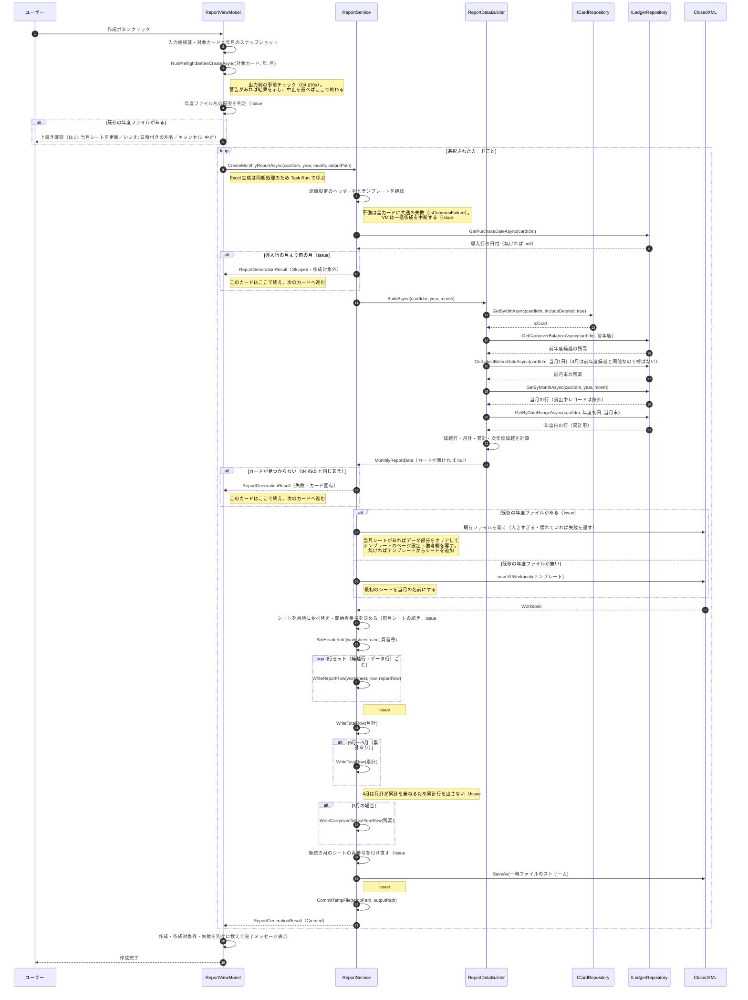
```mermaid
sequenceDiagram
    autonumber
    participant User as ユーザー
    participant VM as ReportViewModel
    participant RS as ReportService
    participant RDB as ReportDataBuilder
    participant CR as ICardRepository
    participant LR as ILedgerRepository
    participant XL as ClosedXML

    User->>VM: 作成ボタンクリック

    VM->>VM: 入力値検証・対象カードと年月のスナップショット

    VM->>VM: RunPreflightBeforeCreateAsync(対象カード, 年, 月)
    Note right of VM: 出力前の事前チェック（04 §10a）。<br/>警告があれば結果を示し、中止を選べばここで終わる
    VM->>VM: 年度ファイル名の衝突を判定（Issue #2154。衝突するカードは作らない）
    alt 既存の年度ファイルがある
        VM-->>User: 上書き確認（はい: 当月シートを更新／いいえ: 日時付きの別名／キャンセル: 中止）
    end

    loop 選択されたカードごと
        VM->>RS: CreateMonthlyReportAsync(cardIdm, year, month, outputPath)
        Note right of VM: Excel 生成は同期処理のため Task.Run で呼ぶ

        RS->>RS: 組織設定のヘッダー列とテンプレートを確認
        Note right of RS: 不備は全カードに共通の失敗（IsCommonFailure）。<br/>VM は一括作成を中断する（Issue #2042）

        RS->>LR: GetPurchaseDateAsync(cardIdm)
        LR-->>RS: 導入行の日付（無ければ null）
        alt 導入行の月より前の月（Issue #501）
            RS-->>VM: ReportGenerationResult（Skipped・作成対象外）
            Note right of VM: このカードはここで終え、次のカードへ進む
        end

        RS->>RDB: BuildAsync(cardIdm, year, month)
        RDB->>CR: GetByIdmAsync(cardIdm, includeDeleted: true)
        CR-->>RDB: IcCard
        RDB->>LR: GetCarryoverBalanceAsync(cardIdm, 前年度)
        LR-->>RDB: 前年度繰越の残高
        RDB->>LR: GetLatestBeforeDateAsync(cardIdm, 当月1日)（4月は前年度繰越と同値なので呼ばない）
        LR-->>RDB: 前月末の残高
        RDB->>LR: GetByMonthAsync(cardIdm, year, month)
        LR-->>RDB: 当月の行（貸出中レコードは除外）
        RDB->>LR: GetByDateRangeAsync(cardIdm, 年度初日, 当月末)
        LR-->>RDB: 年度内の行（累計用）
        RDB->>RDB: 繰越行・月計・累計・次年度繰越を計算
        RDB-->>RS: MonthlyReportData（カードが無ければ null）

        alt カードが見つからない（04 §9.5 と同じ文言）
            RS-->>VM: ReportGenerationResult（失敗・カード固有）
            Note right of VM: このカードはここで終え、次のカードへ進む
        end

        alt 既存の年度ファイルがある（Issue #477）
            RS->>XL: 既存ファイルを開く（大きすぎる・壊れていれば失敗を返す）
            Note right of RS: 当月シートがあればデータ部分をクリアして<br/>テンプレートのページ設定・備考欄を写す。<br/>無ければテンプレートからシートを追加
        else 既存の年度ファイルが無い
            RS->>XL: new XLWorkbook(テンプレート)
            Note right of RS: 最初のシートを当月の名前にする
        end
        XL-->>RS: Workbook

        RS->>RS: シートを月順に並べ替え・開始頁番号を決める（前月シートの続き。Issue #809）
        RS->>RS: SetHeaderInfo(worksheet, card, 頁番号)

        loop 行セット（繰越行・データ行）ごと
            RS->>RS: WriteReportRow(worksheet, row, reportRow)
        end
        Note right of RS: Issue #1023: 行セットは ReportRowBuilder.Build(data) が作る。<br/>12 行ごとに改ページして頁番号を進める

        RS->>RS: WriteTotalRow(月計)

        alt 5月〜3月（累計あり）
            RS->>RS: WriteTotalRow(累計)
        end
        Note right of RS: 4月は月計が累計を兼ねるため累計行を出さない（Issue #813）

        alt 3月の場合
            RS->>RS: WriteCarryoverToNextYearRow(残高)
        end

        RS->>RS: 後続の月のシートの頁番号を付け直す（Issue #2048）

        RS->>XL: SaveAs(一時ファイルのストリーム)
        Note right of RS: Issue #2040: 年度ファイルへ直接保存しない。<br/>{年度ファイル名}.{8桁}.tmp へ書き切ってから<br/>File.Replace（新規は File.Move）で差し替える
        RS->>RS: CommitTempFile(tempPath, outputPath)

        RS-->>VM: ReportGenerationResult（Created）
    end

    VM->>VM: 作成・作成対象外・失敗を別々に数えて完了メッセージ表示
    VM-->>User: 作成完了
```

---

## 6. 30秒ルール適用シーケンス

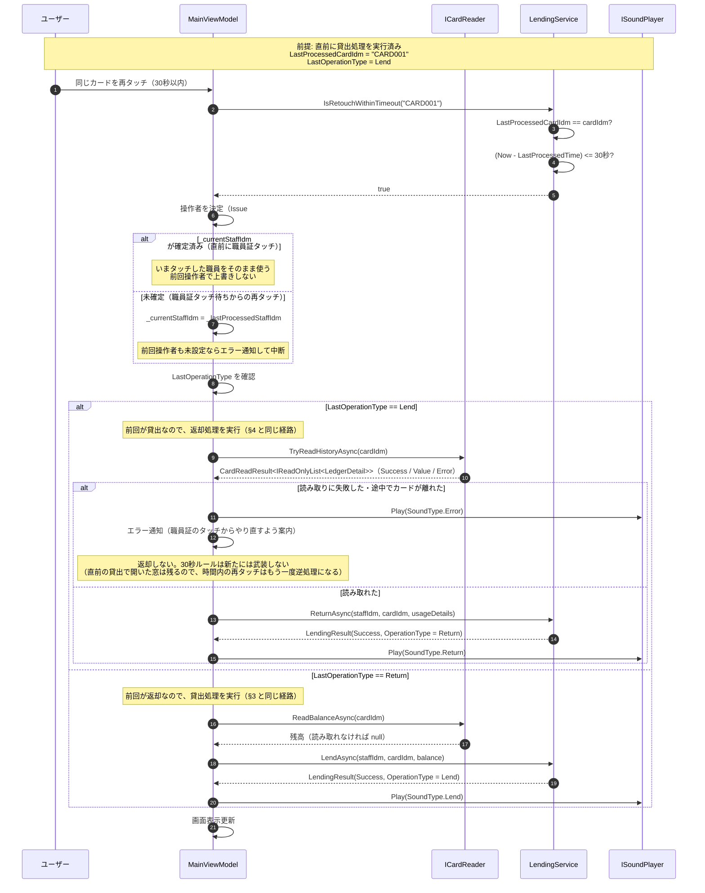
```mermaid
sequenceDiagram
    autonumber
    participant User as ユーザー
    participant VM as MainViewModel
    participant Reader as ICardReader
    participant LS as LendingService
    participant Sound as ISoundPlayer

    Note over User,Sound: 前提: 直前に貸出処理を実行済み<br/>LastProcessedCardIdm = "CARD001"<br/>LastOperationType = Lend

    User->>VM: 同じカードを再タッチ（30秒以内）

    VM->>LS: IsRetouchWithinTimeout("CARD001")
    LS->>LS: LastProcessedCardIdm == cardIdm?
    LS->>LS: (Now - LastProcessedTime) <= 30秒?
    LS-->>VM: true

    VM->>VM: 操作者を決定（Issue #1729）

    alt _currentStaffIdm が確定済み（直前に職員証タッチ）
        Note over VM: いまタッチした職員をそのまま使う<br/>前回操作者で上書きしない
    else 未確定（職員証タッチ待ちからの再タッチ）
        VM->>VM: _currentStaffIdm = _lastProcessedStaffIdm
        Note over VM: 前回操作者も未設定ならエラー通知して中断
    end

    VM->>VM: LastOperationType を確認

    alt LastOperationType == Lend
        Note over VM: 前回が貸出なので、返却処理を実行（§4 と同じ経路）
        VM->>Reader: TryReadHistoryAsync(cardIdm)
        Reader-->>VM: CardReadResult<IReadOnlyList<LedgerDetail>>（Success / Value / Error）
        alt 読み取りに失敗した・途中でカードが離れた
            VM->>Sound: Play(SoundType.Error)
            VM->>VM: エラー通知（職員証のタッチからやり直すよう案内）
            Note over VM: 返却しない。30秒ルールは新たには武装しない<br/>（直前の貸出で開いた窓は残るので、時間内の再タッチはもう一度逆処理になる）
        else 読み取れた
            VM->>LS: ReturnAsync(staffIdm, cardIdm, usageDetails)
            LS-->>VM: LendingResult(Success, OperationType = Return)
            VM->>Sound: Play(SoundType.Return)
        end
    else LastOperationType == Return
        Note over VM: 前回が返却なので、貸出処理を実行（§3 と同じ経路）
        VM->>Reader: ReadBalanceAsync(cardIdm)
        Reader-->>VM: 残高（読み取れなければ null）
        VM->>LS: LendAsync(staffIdm, cardIdm, balance)
        LS-->>VM: LendingResult(Success, OperationType = Lend)
        VM->>Sound: Play(SoundType.Lend)
    end

    VM->>VM: 画面表示更新
```

---

## 7. 未登録カード処理シーケンス

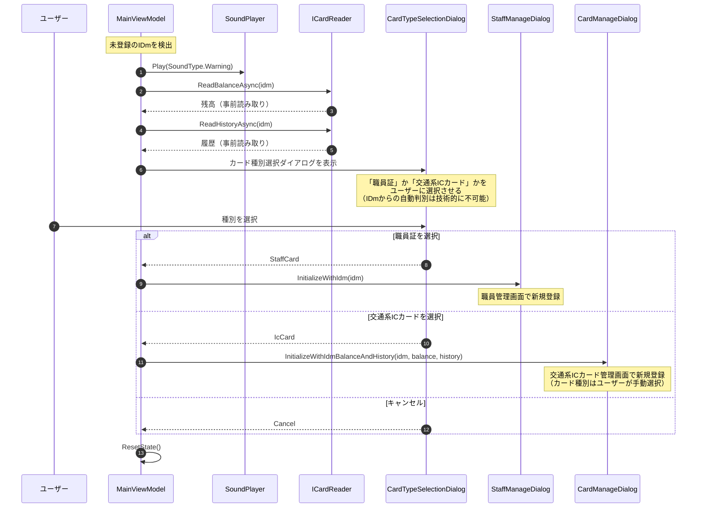
```mermaid
sequenceDiagram
    autonumber
    participant User as ユーザー
    participant VM as MainViewModel
    participant Sound as SoundPlayer
    participant Reader as ICardReader
    participant Dialog as CardTypeSelectionDialog
    participant StaffDlg as StaffManageDialog
    participant CardDlg as CardManageDialog

    Note over VM: 未登録のIDmを検出

    VM->>Sound: Play(SoundType.Warning)
    VM->>Reader: ReadBalanceAsync(idm)
    Reader-->>VM: 残高（事前読み取り）
    VM->>Reader: ReadHistoryAsync(idm)
    Reader-->>VM: 履歴（事前読み取り）

    VM->>Dialog: カード種別選択ダイアログを表示
    Note over Dialog: 「職員証」か「交通系ICカード」かを<br/>ユーザーに選択させる<br/>（IDmからの自動判別は技術的に不可能）
    User->>Dialog: 種別を選択

    alt 職員証を選択
        Dialog-->>VM: StaffCard
        VM->>StaffDlg: InitializeWithIdm(idm)
        Note over StaffDlg: 職員管理画面で新規登録
    else 交通系ICカードを選択
        Dialog-->>VM: IcCard
        VM->>CardDlg: InitializeWithIdmBalanceAndHistory(idm, balance, history)
        Note over CardDlg: 交通系ICカード管理画面で新規登録<br/>（カード種別はユーザーが手動選択）
    else キャンセル
        Dialog-->>VM: Cancel
    end

    VM->>VM: ResetState()
```

---

## 8. タイムアウト処理シーケンス

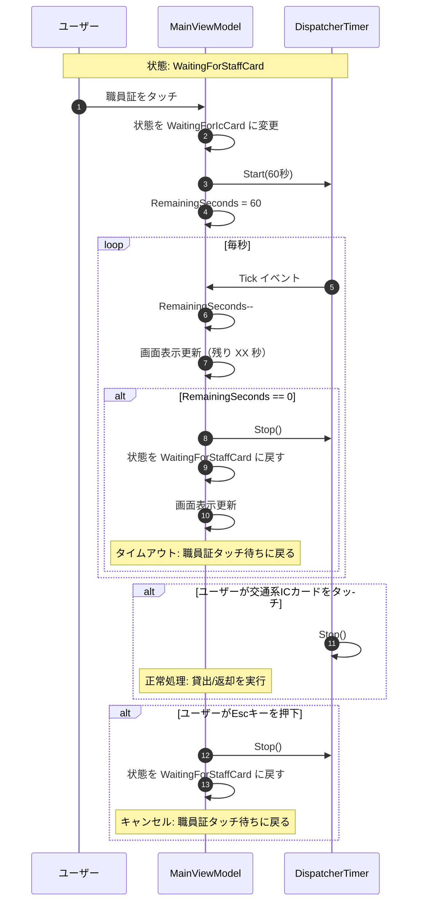
```mermaid
sequenceDiagram
    autonumber
    participant User as ユーザー
    participant VM as MainViewModel
    participant Timer as DispatcherTimer

    Note over User,Timer: 状態: WaitingForStaffCard

    User->>VM: 職員証をタッチ

    VM->>VM: 状態を WaitingForIcCard に変更
    VM->>Timer: Start(60秒)
    VM->>VM: RemainingSeconds = 60

    loop 毎秒
        Timer->>VM: Tick イベント
        VM->>VM: RemainingSeconds--
        VM->>VM: 画面表示更新（残り XX 秒）

        alt RemainingSeconds == 0
            VM->>Timer: Stop()
            VM->>VM: 状態を WaitingForStaffCard に戻す
            VM->>VM: 画面表示更新
            Note over VM: タイムアウト: 職員証タッチ待ちに戻る
        end
    end

    alt ユーザーが交通系ICカードをタッチ
        Timer->>Timer: Stop()
        Note over VM: 正常処理: 貸出/返却を実行
    end

    alt ユーザーがEscキーを押下
        VM->>Timer: Stop()
        VM->>VM: 状態を WaitingForStaffCard に戻す
        Note over VM: キャンセル: 職員証タッチ待ちに戻る
    end
```

---

## 9. エラー処理シーケンス

### 9.1 TransactionScope の自動ロールバック仕様（重要）

`DbContext.BeginTransactionAsync()` が返す `TransactionScope` は RAII 的なラッパーであり、**`using` を抜けた時点で `scope.Commit()` も `scope.Rollback()` も呼ばれていなければ `Dispose()` が自動的にロールバックする**。

このため、例外経路での明示的な `Rollback()` 呼び出しは**不要**である（呼んでも冗長になるだけ）。

- 正常系: `scope.Commit()` → トランザクション確定
- 例外系: 例外が `using` 文を突き抜ける → `scope.Dispose()` が自動ロールバック
- 明示ロールバック: `scope.Rollback()` は "明示的にロールバックしたい" ことを意図的に示す場合のみ使用（可読性向上）

詳細は [`05_クラス設計書.md` §5.5b 接続リース・トランザクションスコープ](05_クラス設計書.md#55b-接続リーストランザクションスコープissue-1243) を参照。

### 9.2 エラー処理シーケンス図

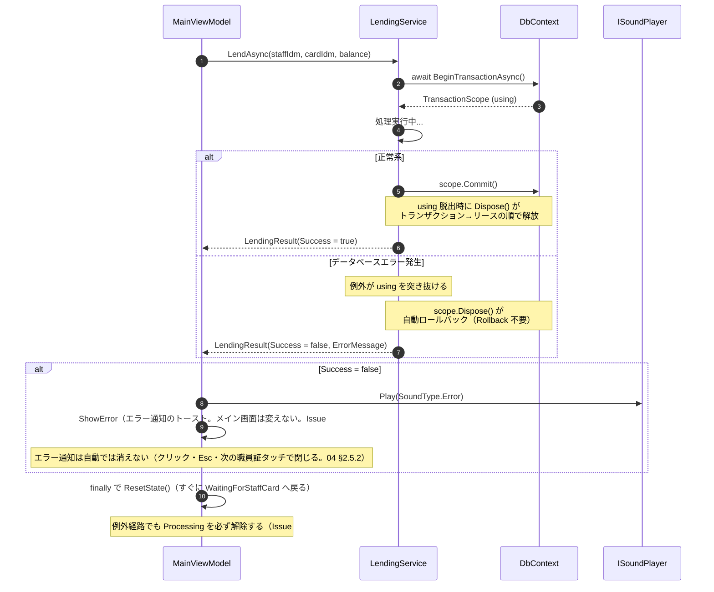
```mermaid
sequenceDiagram
    autonumber
    participant VM as MainViewModel
    participant LS as LendingService
    participant DB as DbContext
    participant Sound as ISoundPlayer

    VM->>LS: LendAsync(staffIdm, cardIdm, balance)

    LS->>DB: await BeginTransactionAsync()
    DB-->>LS: TransactionScope (using)

    LS->>LS: 処理実行中...

    alt 正常系
        LS->>DB: scope.Commit()
        Note over LS,DB: using 脱出時に Dispose() が<br/>トランザクション→リースの順で解放
        LS-->>VM: LendingResult(Success = true)
    else データベースエラー発生
        Note over LS: 例外が using を突き抜ける
        Note over LS,DB: scope.Dispose() が<br/>自動ロールバック（Rollback 不要）
        LS-->>VM: LendingResult(Success = false, ErrorMessage)
    end

    alt Success = false
        VM->>Sound: Play(SoundType.Error)
        VM->>VM: ShowError（エラー通知のトースト。メイン画面は変えない。Issue #186）
        Note over VM: エラー通知は自動では消えない（クリック・Esc・次の職員証タッチで閉じる。04 §2.5.2）
    end

    VM->>VM: finally で ResetState()（すぐに WaitingForStaffCard へ戻る）
    Note over VM: 例外経路でも Processing を必ず解除する（Issue #1725）
```

> **SQLITE_BUSY / SQLITE_LOCKED 時の自動リトライ**: 書き込み系では `await _dbContext.ExecuteWithRetryAsync(async () => { ... })` で上記トランザクションブロックを包むのが推奨形（共有モードでは最大 5 回、指数バックオフ + ジッター付き）。本図では簡略化のため省略している。

---

## 10. 履歴統合シーケンス

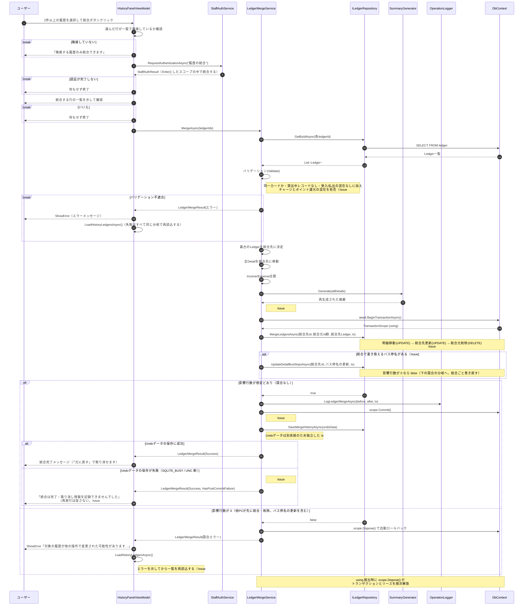
```mermaid
sequenceDiagram
    autonumber
    participant User as ユーザー
    participant VM as HistoryPanelViewModel
    participant Auth as StaffAuthService
    participant MS as LedgerMergeService
    participant LR as ILedgerRepository
    participant SG as SummaryGenerator
    participant OL as OperationLogger
    participant DB as DbContext

    User->>VM: 2件以上の履歴を選択して統合ボタンクリック

    VM->>VM: 選んだ行が一覧で隣接しているか確認

    break 隣接していない
        VM-->>User: 「隣接する履歴のみ統合できます」
    end

    VM->>Auth: RequestAuthenticationAsync("履歴の統合")
    Auth-->>VM: StaffAuthResult（Enter() したスコープの中で統合する）

    break 認証が完了しない
        VM-->>User: 何もせず終了
    end

    VM-->>User: 統合する行の一覧を示して確認
    break いいえ
        VM-->>User: 何もせず終了
    end

    VM->>MS: MergeAsync(ledgerIds)

    MS->>LR: GetByIdAsync(各ledgerId)
    LR->>DB: SELECT FROM ledger
    DB-->>LR: Ledger一覧
    LR-->>MS: List~Ledger~

    MS->>MS: バリデーション(Validate)
    Note right of MS: 同一カードか・貸出中レコードなし・受入/払出の混在なしに加え<br/>チャージとポイント還元の混在を拒否（Issue #1736）<br/>混在集合はGenerateが空文字を返し<br/>摘要が空欄の行が保存されるため

    break バリデーション不適合
        MS-->>VM: LedgerMergeResult(エラー)
        VM-->>User: ShowError（エラーメッセージ）
        VM->>VM: LoadHistoryLedgersAsync()（失敗はすべて同じ分岐で再読込する）
    end

    MS->>MS: 最古のLedgerを統合先に決定
    MS->>MS: 全Detailを統合先に移動
    MS->>MS: Income/Expense合算
    MS->>SG: Generate(allDetails)
    SG-->>MS: 再生成された摘要
    Note right of MS: Issue #1736: 空文字が返った場合は<br/>統合先の元の摘要を維持（空欄で保存しない）

    MS->>DB: await BeginTransactionAsync()
    DB-->>MS: TransactionScope (using)
    MS->>LR: MergeLedgersAsync(統合先Id, 統合元Id群, 統合先Ledger, tx)
    Note over LR,DB: 明細移動(UPDATE) → 統合先更新(UPDATE) → 統合元削除(DELETE)<br/>Issue #1753: 統合先UPDATEと統合元DELETEの影響行数を検証
    opt 統合で書き換えるバス停名がある（Issue #2306）
        MS->>LR: UpdateDetailBusStopsAsync(統合先Id, バス停名の更新, tx)
        Note over LR,DB: 影響行数が 0 なら false（下の競合の分岐へ。統合ごと巻き戻す）
    end

    alt 影響行数が想定どおり（競合なし）
        LR-->>MS: true
        MS->>OL: LogLedgerMergeAsync(before, after, tx)
        MS->>DB: scope.Commit()
        Note right of MS: Issue #1954: ここで Success=true を確定させる<br/>（以降の失敗は成否に巻き込まない）
        MS->>LR: SaveMergeHistoryAsync(undoData)
        Note right of MS: Undoデータは別系統のため独立した tx
        alt Undoデータの保存に成功
            MS-->>VM: LedgerMergeResult(Success)
            VM-->>User: 統合完了メッセージ（「元に戻す」で取り消せます）
        else Undoデータの保存が失敗（SQLITE_BUSY / UNC 断）
            Note right of MS: Issue #1954: catch (ex) when (result.Success) で吸収<br/>Success は落とさず HasPostCommitFailure=true
            MS-->>VM: LedgerMergeResult(Success, HasPostCommitFailure)
            VM-->>User: 「統合は完了・取り消し情報を記録できませんでした」<br/>（再実行は促さない。Issue #1725）
        end
    else 影響行数が 0（他PCが先に統合・削除。バス停名の更新を含む）
        LR-->>MS: false
        MS->>DB: scope.Dispose() で自動ロールバック
        MS-->>VM: LedgerMergeResult(競合エラー)
        VM-->>User: ShowError「対象の履歴が他の操作で変更された可能性があります…」
        VM->>VM: LoadHistoryLedgersAsync()
        Note right of VM: エラーを示してから一覧を再読込する（Issue #1727）。<br/>失敗時も再読込するのは、文言で「画面を更新して再試行」と<br/>案内するため（Issue #1753）。再読込の失敗はログに残して握りつぶす
    end

    Note over MS,DB: using 脱出時に scope.Dispose() が<br/>トランザクションとリースを順次解放
```

> **競合検出は影響行数で行う（Issue #1753）**: 読み取り（`GetByIdAsync`）と書き込み（`MergeLedgersAsync`）は別トランザクションのため、共有モードではその間に他 PC が同じ履歴を統合・削除し得る。行ロックを持たないため、書き込み時の影響行数で競合を検出する（楽観ロック）。詳細と適用範囲は `05_クラス設計書.md` §5.5b「更新・削除は影響行数で競合を検出する」を参照。

> **統合の取り消しも認証を経る（Issue #2265）**: 統合の取り消し（`ConfirmAndExecuteUnmergeAsync`）は、取り消す統合の確認で「はい」を選んだ後に `RequestAuthenticationAsync("統合の取り消し")` を呼び、認証結果を `Enter()` したスコープの中で `LedgerMergeService.UnmergeAsync` を実行する（本図の統合と同じゲート）。認証が完了しなければ台帳を書き戻さない。取り消しは台帳の書き戻し・取り消し済みのマークと同じトランザクションで `LogLedgerUnmergeAsync`（操作種別 `UNMERGE`）を記録し、記録に失敗したら取り消しごと巻き戻る（04_機能設計書 §14.4）。

---

## 11. 履歴分割シーケンス

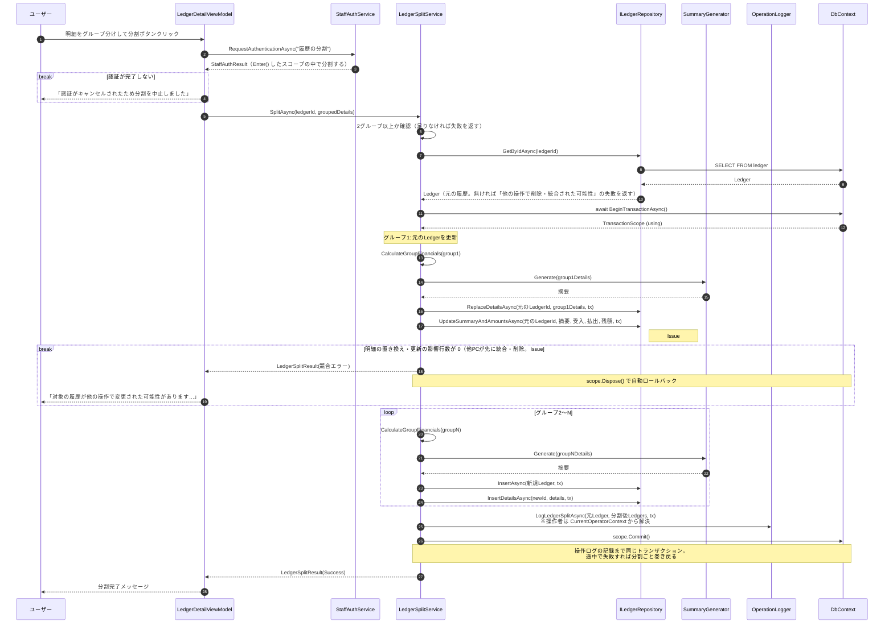
```mermaid
sequenceDiagram
    autonumber
    participant User as ユーザー
    participant VM as LedgerDetailViewModel
    participant Auth as StaffAuthService
    participant SS as LedgerSplitService
    participant LR as ILedgerRepository
    participant SG as SummaryGenerator
    participant OL as OperationLogger
    participant DB as DbContext

    User->>VM: 明細をグループ分けして分割ボタンクリック

    VM->>Auth: RequestAuthenticationAsync("履歴の分割")
    Auth-->>VM: StaffAuthResult（Enter() したスコープの中で分割する）

    break 認証が完了しない
        VM-->>User: 「認証がキャンセルされたため分割を中止しました」
    end

    VM->>SS: SplitAsync(ledgerId, groupedDetails)

    SS->>SS: 2グループ以上か確認（足りなければ失敗を返す）

    SS->>LR: GetByIdAsync(ledgerId)
    LR->>DB: SELECT FROM ledger
    DB-->>LR: Ledger
    LR-->>SS: Ledger（元の履歴。無ければ「他の操作で削除・統合された可能性」の失敗を返す）

    SS->>DB: await BeginTransactionAsync()
    DB-->>SS: TransactionScope (using)

    Note over SS: グループ1: 元のLedgerを更新
    SS->>SS: CalculateGroupFinancials(group1)
    SS->>SG: Generate(group1Details)
    SG-->>SS: 摘要
    SS->>LR: ReplaceDetailsAsync(元のLedgerId, group1Details, tx)
    SS->>LR: UpdateSummaryAndAmountsAsync(元のLedgerId, 摘要, 受入, 払出, 残額, tx)
    Note right of LR: Issue #2212: 書くのは摘要・金額だけ。<br/>全列の UpdateAsync は使わない（備考・同行者数などを<br/>読み取り時点の値へ巻き戻さない）

    break 明細の置き換え・更新の影響行数が 0（他PCが先に統合・削除。Issue #1753）
        SS-->>VM: LedgerSplitResult(競合エラー)
        Note over SS,DB: scope.Dispose() で自動ロールバック
        VM-->>User: 「対象の履歴が他の操作で変更された可能性があります…」
    end

    loop グループ2〜N
        SS->>SS: CalculateGroupFinancials(groupN)
        SS->>SG: Generate(groupNDetails)
        SG-->>SS: 摘要
        SS->>LR: InsertAsync(新規Ledger, tx)
        SS->>LR: InsertDetailsAsync(newId, details, tx)
    end

    SS->>OL: LogLedgerSplitAsync(元Ledger, 分割後Ledgers, tx)<br/>※操作者は CurrentOperatorContext から解決
    SS->>DB: scope.Commit()
    Note over SS,DB: 操作ログの記録まで同じトランザクション。<br/>途中で失敗すれば分割ごと巻き戻る

    SS-->>VM: LedgerSplitResult(Success)
    VM-->>User: 分割完了メッセージ
```

---

## 12. 職員認証シーケンス

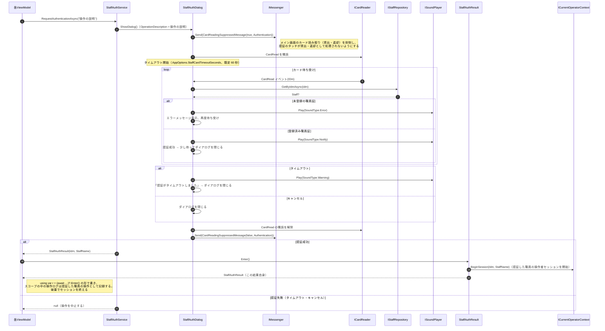
```mermaid
sequenceDiagram
    autonumber
    participant VM as 各ViewModel
    participant Auth as StaffAuthService
    participant Dialog as StaffAuthDialog
    participant Msg as IMessenger
    participant Reader as ICardReader
    participant SR as IStaffRepository
    participant Sound as ISoundPlayer
    participant Res as StaffAuthResult
    participant Ctx as ICurrentOperatorContext

    VM->>Auth: RequestAuthenticationAsync("操作の説明")
    Auth->>Dialog: ShowDialog()（OperationDescription = 操作の説明）

    Dialog->>Msg: Send(CardReadingSuppressedMessage(true, Authentication))
    Note right of Msg: メイン画面のカード読み取り（貸出・返却）を抑制し、<br/>認証のタッチが貸出・返却として処理されないようにする
    Dialog->>Reader: CardRead を購読
    Note over Dialog: タイムアウト開始（AppOptions.StaffCardTimeoutSeconds、既定 60 秒）

    loop カード待ち受け
        Reader->>Dialog: CardRead イベント(IDm)
        Dialog->>SR: GetByIdmAsync(idm)
        SR-->>Dialog: Staff?

        alt 未登録の職員証
            Dialog->>Sound: Play(SoundType.Error)
            Dialog->>Dialog: エラーメッセージ表示、再度待ち受け
        else 登録済み職員証
            Dialog->>Sound: Play(SoundType.Notify)
            Dialog->>Dialog: 認証成功 → 少し待ってダイアログを閉じる
        end
    end

    alt タイムアウト
        Dialog->>Sound: Play(SoundType.Warning)
        Dialog->>Dialog: 「認証がタイムアウトしました」→ ダイアログを閉じる
    else キャンセル
        Dialog->>Dialog: ダイアログを閉じる
    end

    Dialog->>Reader: CardRead の購読を解除
    Dialog->>Msg: Send(CardReadingSuppressedMessage(false, Authentication))

    alt 認証成功
        Auth-->>VM: StaffAuthResult(Idm, StaffName)
        VM->>Res: Enter()
        Res->>Ctx: BeginSession(Idm, StaffName)（認証した職員の操作者セッションを開始）
        Res-->>VM: StaffAuthResult（この結果自身）
        Note right of VM: using var r = (await …)?.Enter() の形で書き、<br/>スコープの中の操作ログは認証した職員の操作として記録する。<br/>破棄でセッションを終える
    else 認証失敗（タイムアウト・キャンセル）
        Auth-->>VM: null（操作を中止する）
    end
```

---

## 13. バックアップ/リストアシーケンス

### 13.1 起動時の自動バックアップ

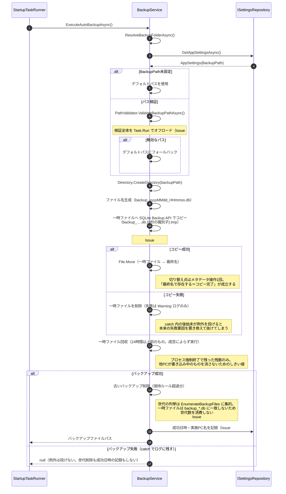
```mermaid
sequenceDiagram
    autonumber
    participant STR as StartupTaskRunner
    participant BS as BackupService
    participant SR as ISettingsRepository

    STR->>BS: ExecuteAutoBackupAsync()

    BS->>BS: ResolveBackupFolderAsync()
    BS->>SR: GetAppSettingsAsync()
    SR-->>BS: AppSettings(BackupPath)
    alt BackupPath未設定
        BS->>BS: デフォルトパスを使用
    else パス検証
        BS->>BS: PathValidator.ValidateBackupPathAsync()
        Note over BS: 検証全体を Task.Run でオフロード（Issue #1746）。<br/>同期版は UNC 到達性チェック（最大5秒）が<br/>UI スレッドをブロックするため使わない
        alt 無効なパス
            BS->>BS: デフォルトパスにフォールバック
        end
    end

    BS->>BS: Directory.CreateDirectory(backupPath)
    BS->>BS: ファイル名生成（backup_yyyyMMdd_HHmmss.db）

    BS->>BS: 一時ファイルへ SQLite Backup API でコピー<br/>（backup_….db.{8桁の識別子}.tmp）
    Note over BS: Issue #1748: 最終名へ直接書くと、コピー途中で失敗した<br/>「マジックヘッダだけ揃った切り詰めファイル」が<br/>有効な世代として残る。ランダムな識別子は共有モードで<br/>複数台が同一の一時ファイルを開くのを防ぐ

    alt コピー成功
        BS->>BS: File.Move（一時ファイル → 最終名）
        Note right of BS: 切り替え点はメタデータ操作1回。<br/>「最終名で存在する＝コピー完了」が成立する
    else コピー失敗
        BS->>BS: 一時ファイルを削除（失敗は Warning ログのみ）
        Note right of BS: catch 内の後始末が例外を投げると<br/>本来の失敗要因を置き換えて抜けてしまう
    end

    BS->>BS: 一時ファイル回収（24時間以上前のもの。成否によらず実行）
    Note right of BS: プロセス強制終了で残った残骸のみ。<br/>他PCが書き込み中のものを消さないためのしきい値

    alt バックアップ成功
        BS->>BS: 古いバックアップ削除（保持ルール超過分）
        Note right of BS: 世代の列挙は EnumerateBackupFiles に集約。<br/>一時ファイルは backup_*.db に一致しないため<br/>世代数を消費しない<br/>Issue #1813: 保持は「ファイル数」ではなく<br/>自動＝直近30日分（各日1世代）／<br/>手動・リストア前＝最新10件。<br/>削除の失敗はバックアップの失敗に混ぜない
        BS->>SR: 成功日時・実施PC名を記録（Issue #1689）
        BS-->>STR: バックアップファイルパス
    else バックアップ失敗（catch でログに残す）
        BS-->>STR: null（例外は投げない。世代削除も成功日時の記録もしない）
    end
```

### 13.2 手動バックアップ

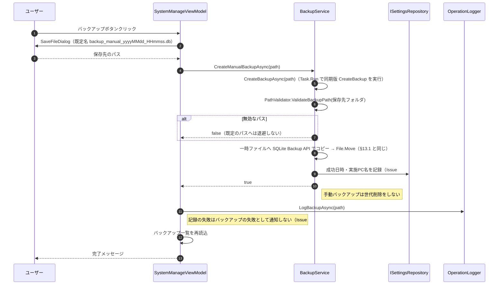
```mermaid
sequenceDiagram
    autonumber
    participant User as ユーザー
    participant VM as SystemManageViewModel
    participant BS as BackupService
    participant SR as ISettingsRepository
    participant OL as OperationLogger

    User->>VM: バックアップボタンクリック
    VM->>User: SaveFileDialog（既定名 backup_manual_yyyyMMdd_HHmmss.db）
    User-->>VM: 保存先のパス

    VM->>BS: CreateManualBackupAsync(path)
    BS->>BS: CreateBackupAsync(path)（Task.Run で同期版 CreateBackup を実行）
    BS->>BS: PathValidator.ValidateBackupPath(保存先フォルダ)
    alt 無効なパス
        BS-->>VM: false（既定のパスへは退避しない）
    end
    BS->>BS: 一時ファイルへ SQLite Backup API でコピー → File.Move（§13.1 と同じ）
    BS->>SR: 成功日時・実施PC名を記録（Issue #2304。記録しないと BackupStale 警告が消えない）
    BS-->>VM: true
    Note right of BS: 手動バックアップは世代削除をしない

    VM->>OL: LogBackupAsync(path)
    Note right of VM: 記録の失敗はバックアップの失敗として通知しない（Issue #2130）
    VM->>VM: バックアップ一覧を再読込
    VM-->>User: 完了メッセージ
```

### 13.3 リストア

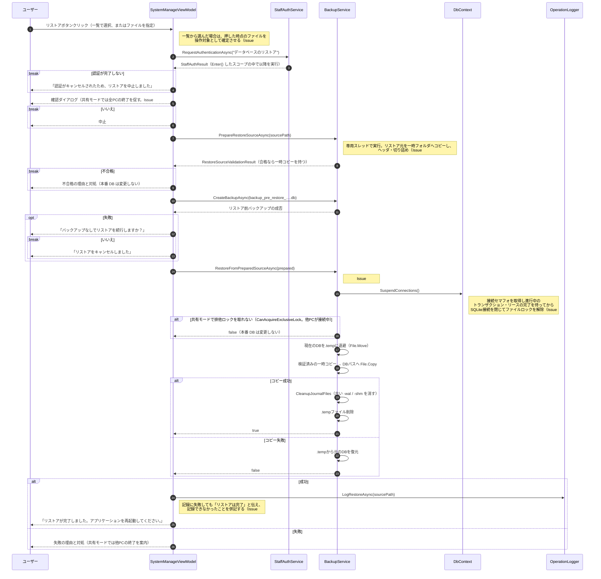
```mermaid
sequenceDiagram
    autonumber
    participant User as ユーザー
    participant VM as SystemManageViewModel
    participant Auth as StaffAuthService
    participant BS as BackupService
    participant DB as DbContext
    participant OL as OperationLogger

    User->>VM: リストアボタンクリック（一覧で選択、またはファイルを指定）
    Note right of VM: 一覧から選んだ場合は、押した時点のファイルを<br/>操作対象として確定させる（Issue #1761）

    VM->>Auth: RequestAuthenticationAsync("データベースのリストア")
    Auth-->>VM: StaffAuthResult（Enter() したスコープの中で以降を実行）
    break 認証が完了しない
        VM-->>User: 「認証がキャンセルされたため、リストアを中止しました」
    end

    VM-->>User: 確認ダイアログ（共有モードでは全PCの終了を促す。Issue #1108）
    break いいえ
        VM-->>User: 中止
    end

    VM->>BS: PrepareRestoreSourceAsync(sourcePath)
    Note right of BS: 専用スレッドで実行。リストア元を一時フォルダへコピーし、<br/>ヘッダ・切り詰め（Issue #1748）・PRAGMA quick_check・<br/>本システムの DB の印・SchemaObjectInspector・<br/>スキーマの版を検証する（Issue #2269）
    BS-->>VM: RestoreSourceValidationResult（合格なら一時コピーを持つ）
    break 不合格
        VM-->>User: 不合格の理由と対処（本番 DB は変更しない）
    end

    VM->>BS: CreateBackupAsync(backup_pre_restore_….db)
    BS-->>VM: リストア前バックアップの成否
    opt 失敗
        VM-->>User: 「バックアップなしでリストアを続行しますか？」
        break いいえ
            VM-->>User: 「リストアをキャンセルしました」
        end
    end

    VM->>BS: RestoreFromPreparedSourceAsync(prepared)
    Note right of BS: Issue #1809: Task.Run で同期版を委譲（SuspendConnections が<br/>セマフォを同期取得するため UI スレッドでは<br/>#1281 のガードで拒否される）
    BS->>DB: SuspendConnections()
    Note right of DB: 接続セマフォを取得し進行中の<br/>トランザクション・リースの完了を待ってから<br/>SQLite接続を閉じてファイルロックを解除（Issue #1809）。<br/>停止中に到着した書き込みは解除まで待機
    alt 共有モードで排他ロックを取れない（CanAcquireExclusiveLock。他PCが接続中）
        BS-->>VM: false（本番 DB は変更しない）
    end
    BS->>BS: 現在のDBを.tempに退避（File.Move）
    BS->>BS: 検証済みの一時コピー → DBパスへ File.Copy

    alt コピー成功
        BS->>BS: CleanupJournalFiles（古い -wal / -shm を消す）
        BS->>BS: .tempファイル削除
        BS-->>VM: true
    else コピー失敗
        BS->>BS: .tempから元のDBを復元
        BS-->>VM: false
    end

    alt 成功
        VM->>OL: LogRestoreAsync(sourcePath)
        Note right of VM: 記録に失敗しても「リストアは完了」と伝え、<br/>記録できなかったことを併記する（Issue #2130）
        VM-->>User: 「リストアが完了しました。アプリケーションを再起動してください。」
    else 失敗
        VM-->>User: 失敗の理由と対処（共有モードでは他PCの終了を案内）
    end
```

---

## 14. CSV入出力シーケンス

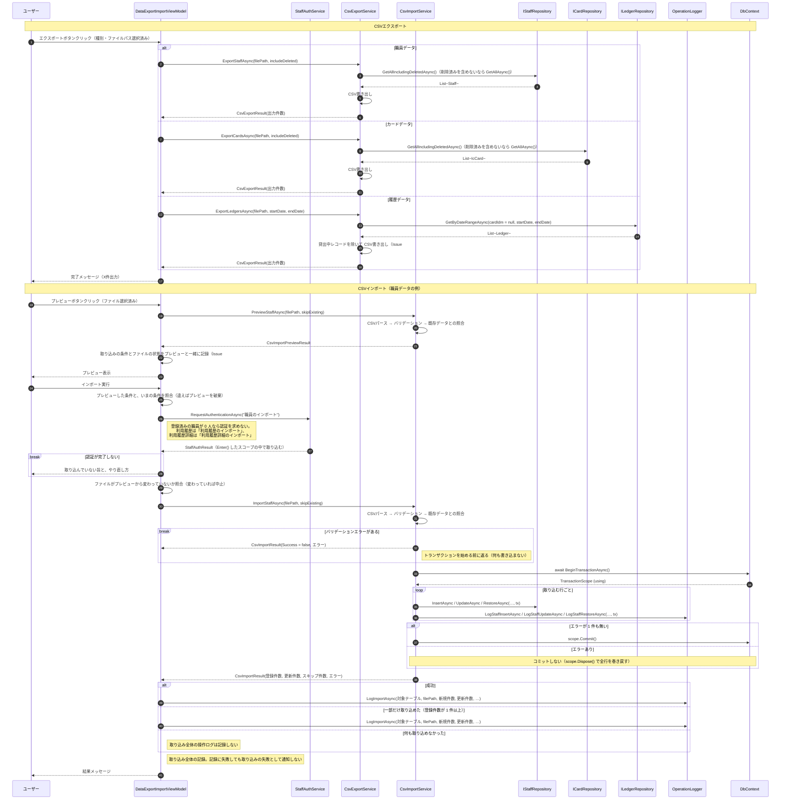
```mermaid
sequenceDiagram
    autonumber
    participant User as ユーザー
    participant VM as DataExportImportViewModel
    participant Auth as StaffAuthService
    participant Exp as CsvExportService
    participant Imp as CsvImportService
    participant SR as IStaffRepository
    participant CR as ICardRepository
    participant LR as ILedgerRepository
    participant OL as OperationLogger
    participant DB as DbContext

    Note over User,DB: CSVエクスポート

    User->>VM: エクスポートボタンクリック（種別・ファイルパス選択済み）

    alt 職員データ
        VM->>Exp: ExportStaffAsync(filePath, includeDeleted)
        Exp->>SR: GetAllIncludingDeletedAsync()（削除済みを含めないなら GetAllAsync()）
        SR-->>Exp: List~Staff~
        Exp->>Exp: CSV書き出し
        Exp-->>VM: CsvExportResult(出力件数)
    else カードデータ
        VM->>Exp: ExportCardsAsync(filePath, includeDeleted)
        Exp->>CR: GetAllIncludingDeletedAsync()（削除済みを含めないなら GetAllAsync()）
        CR-->>Exp: List~IcCard~
        Exp->>Exp: CSV書き出し
        Exp-->>VM: CsvExportResult(出力件数)
    else 履歴データ
        VM->>Exp: ExportLedgersAsync(filePath, startDate, endDate)
        Exp->>LR: GetByDateRangeAsync(cardIdm = null, startDate, endDate)
        LR-->>Exp: List~Ledger~
        Exp->>Exp: 貸出中レコードを除いて CSV書き出し（Issue #2307）
        Exp-->>VM: CsvExportResult(出力件数)
    end

    VM-->>User: 完了メッセージ（X件出力）

    Note over User,DB: CSVインポート（職員データの例）

    User->>VM: プレビューボタンクリック（ファイル選択済み）

    VM->>Imp: PreviewStaffAsync(filePath, skipExisting)
    Imp->>Imp: CSVパース → バリデーション → 既存データとの照合
    Imp-->>VM: CsvImportPreviewResult
    VM->>VM: 取り込みの条件とファイルの状態をプレビューと一緒に記録（Issue #2262）

    VM-->>User: プレビュー表示

    User->>VM: インポート実行
    VM->>VM: プレビューした条件と、いまの条件を照合（違えばプレビューを破棄）

    VM->>Auth: RequestAuthenticationAsync("職員のインポート")
    Note right of VM: 登録済みの職員が 0 人なら認証を求めない。<br/>利用履歴は「利用履歴のインポート」、<br/>利用履歴詳細は「利用履歴詳細のインポート」
    Auth-->>VM: StaffAuthResult（Enter() したスコープの中で取り込む）
    break 認証が完了しない
        VM-->>User: 取り込んでいない旨と、やり直し方
    end

    VM->>VM: ファイルがプレビューから変わっていないか照合（変わっていれば中止）

    VM->>Imp: ImportStaffAsync(filePath, skipExisting)
    Imp->>Imp: CSVパース → バリデーション → 既存データとの照合
    break バリデーションエラーがある
        Imp-->>VM: CsvImportResult(Success = false, エラー)
        Note right of Imp: トランザクションを始める前に返る（何も書き込まない）
    end
    Imp->>DB: await BeginTransactionAsync()
    DB-->>Imp: TransactionScope (using)
    loop 取り込む行ごと
        Imp->>SR: InsertAsync / UpdateAsync / RestoreAsync(…, tx)
        Imp->>OL: LogStaffInsertAsync / LogStaffUpdateAsync / LogStaffRestoreAsync(…, tx)
    end
    alt エラーが 1 件も無い
        Imp->>DB: scope.Commit()
    else エラーあり
        Note over Imp,DB: コミットしない（scope.Dispose() で全行を巻き戻す）
    end
    Imp-->>VM: CsvImportResult(登録件数, 更新件数, スキップ件数, エラー)

    alt 成功
        VM->>OL: LogImportAsync(対象テーブル, filePath, 新規件数, 更新件数, …)
    else 一部だけ取り込めた（登録件数が 1 件以上）
        VM->>OL: LogImportAsync(対象テーブル, filePath, 新規件数, 更新件数, …)
    else 何も取り込めなかった
        Note right of VM: 取り込み全体の操作ログは記録しない
    end
    Note right of VM: 取り込み全体の記録。記録に失敗しても取り込みの失敗として通知しない
    VM-->>User: 結果メッセージ
```

---

## 15. 印刷プレビューシーケンス

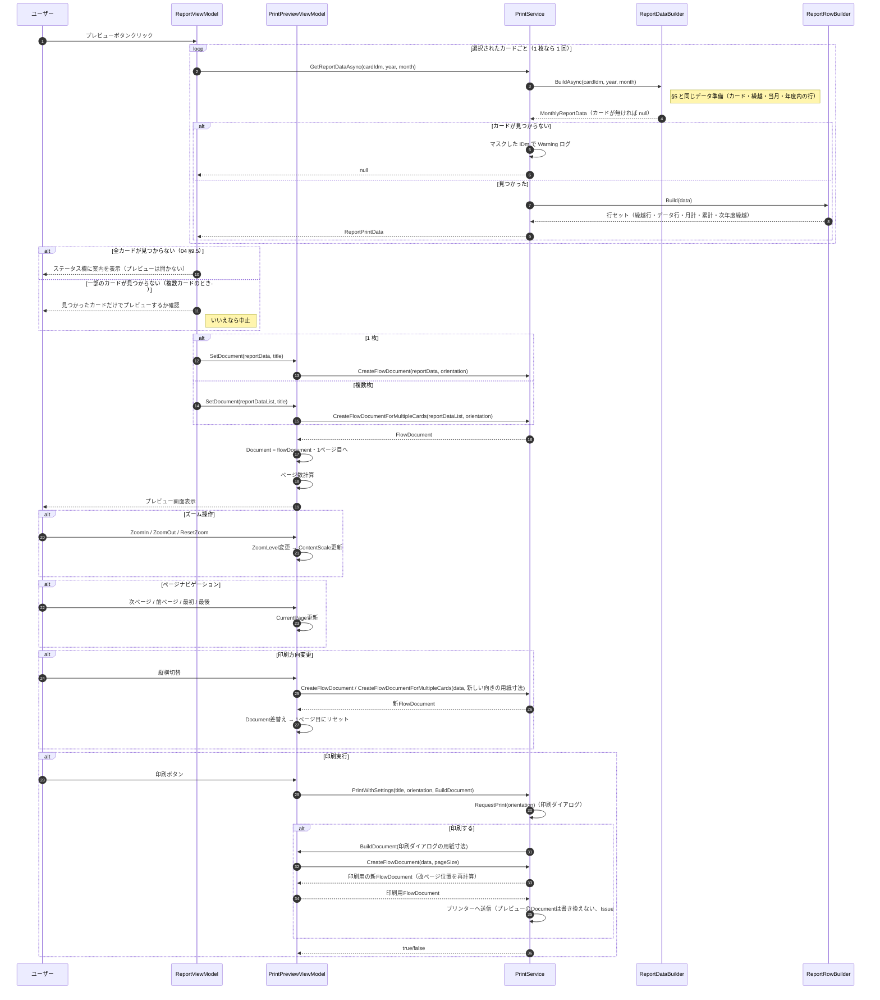
```mermaid
sequenceDiagram
    autonumber
    participant User as ユーザー
    participant RVM as ReportViewModel
    participant PVM as PrintPreviewViewModel
    participant PS as PrintService
    participant RDB as ReportDataBuilder
    participant RRB as ReportRowBuilder

    User->>RVM: プレビューボタンクリック

    loop 選択されたカードごと（1 枚なら 1 回）
        RVM->>PS: GetReportDataAsync(cardIdm, year, month)
        PS->>RDB: BuildAsync(cardIdm, year, month)
        Note right of RDB: §5 と同じデータ準備（カード・繰越・当月・年度内の行）
        RDB-->>PS: MonthlyReportData（カードが無ければ null）
        alt カードが見つからない
            PS->>PS: マスクした IDm で Warning ログ
            PS-->>RVM: null
        else 見つかった
            PS->>RRB: Build(data)
            RRB-->>PS: 行セット（繰越行・データ行・月計・累計・次年度繰越）
            PS-->>RVM: ReportPrintData
        end
    end

    alt 全カードが見つからない（04 §9.5）
        RVM-->>User: ステータス欄に案内を表示（プレビューは開かない）
    else 一部のカードが見つからない（複数カードのとき）
        RVM-->>User: 見つかったカードだけでプレビューするか確認
        Note right of RVM: いいえなら中止
    end

    alt 1 枚
        RVM->>PVM: SetDocument(reportData, title)
        PVM->>PS: CreateFlowDocument(reportData, orientation)
    else 複数枚
        RVM->>PVM: SetDocument(reportDataList, title)
        PVM->>PS: CreateFlowDocumentForMultipleCards(reportDataList, orientation)
    end
    PS-->>PVM: FlowDocument
    PVM->>PVM: Document = flowDocument・1ページ目へ
    PVM->>PVM: ページ数計算

    PVM-->>User: プレビュー画面表示

    alt ズーム操作
        User->>PVM: ZoomIn / ZoomOut / ResetZoom
        PVM->>PVM: ZoomLevel変更 → ContentScale更新
    end

    alt ページナビゲーション
        User->>PVM: 次ページ / 前ページ / 最初 / 最後
        PVM->>PVM: CurrentPage更新
    end

    alt 印刷方向変更
        User->>PVM: 縦横切替
        PVM->>PS: CreateFlowDocument / CreateFlowDocumentForMultipleCards(data, 新しい向きの用紙寸法)
        PS-->>PVM: 新FlowDocument
        PVM->>PVM: Document差替え → 1ページ目にリセット
    end

    alt 印刷実行
        User->>PVM: 印刷ボタン
        PVM->>PS: PrintWithSettings(title, orientation, BuildDocument)
        PS->>PS: RequestPrint(orientation)（印刷ダイアログ）
        alt 印刷する
            PS->>PVM: BuildDocument(印刷ダイアログの用紙寸法)
            PVM->>PS: CreateFlowDocument(data, pageSize)
            PS-->>PVM: 印刷用の新FlowDocument（改ページ位置を再計算）
            PVM-->>PS: 印刷用FlowDocument
            PS->>PS: プリンターへ送信（プレビューのDocumentは書き換えない、Issue #2047）
        end
        PS-->>PVM: true/false
    end
```

---

## 16. 管理者ダッシュボードシーケンス(Issue #1692)

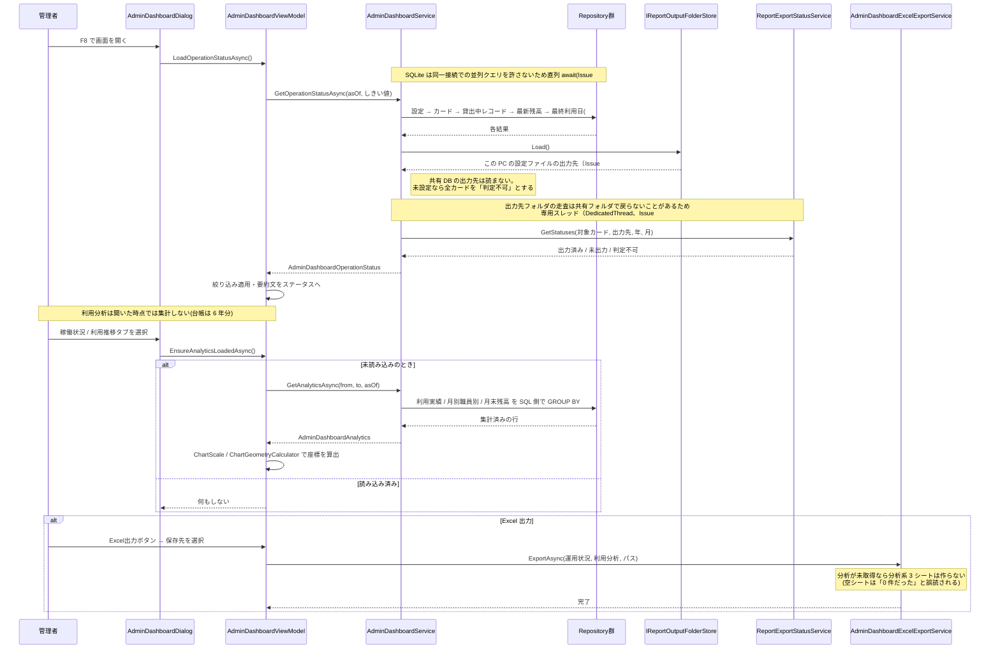
```mermaid
sequenceDiagram
    participant User as 管理者
    participant Dlg as AdminDashboardDialog
    participant VM as AdminDashboardViewModel
    participant Svc as AdminDashboardService
    participant Repo as Repository群
    participant Store as IReportOutputFolderStore
    participant RES as ReportExportStatusService
    participant Xls as AdminDashboardExcelExportService

    User->>Dlg: F8 で画面を開く
    Dlg->>VM: LoadOperationStatusAsync()

    Note over Svc,Repo: SQLite は同一接続での並列クエリを許さないため直列 await(Issue #1452)
    VM->>Svc: GetOperationStatusAsync(asOf, しきい値)
    Svc->>Repo: 設定 → カード → 貸出中レコード → 最新残高 → 最終利用日(#1747) → 職員
    Repo-->>Svc: 各結果
    Svc->>Store: Load()
    Store-->>Svc: この PC の設定ファイルの出力先（Issue #2266）
    Note right of Svc: 共有 DB の出力先は読まない。<br/>未設定なら全カードを「判定不可」とする
    Note over Svc,RES: 出力先フォルダの走査は共有フォルダで戻らないことがあるため<br/>専用スレッド（DedicatedThread、Issue #2221）で実行
    Svc->>RES: GetStatuses(対象カード, 出力先, 年, 月)
    RES-->>Svc: 出力済み / 未出力 / 判定不可
    Svc-->>VM: AdminDashboardOperationStatus
    VM->>VM: 絞り込み適用・要約文をステータスへ

    Note over User,VM: 利用分析は開いた時点では集計しない(台帳は 6 年分)
    User->>Dlg: 稼働状況 / 利用推移タブを選択
    Dlg->>VM: EnsureAnalyticsLoadedAsync()

    alt 未読み込みのとき
        VM->>Svc: GetAnalyticsAsync(from, to, asOf)
        Svc->>Repo: 利用実績 / 月別職員別 / 月末残高 を SQL 側で GROUP BY
        Repo-->>Svc: 集計済みの行
        Svc-->>VM: AdminDashboardAnalytics
        VM->>VM: ChartScale / ChartGeometryCalculator で座標を算出
    else 読み込み済み
        VM-->>Dlg: 何もしない
    end

    alt Excel 出力
        User->>VM: Excel出力ボタン → 保存先を選択
        VM->>Xls: ExportAsync(運用状況, 利用分析, パス)
        Note over Xls: 分析が未取得なら分析系 3 シートは作らない<br/>(空シートは「0 件だった」と誤読される)
        Xls-->>VM: 完了
    end
```

---

## 付録A. 関連ドキュメント

| ドキュメント | 関連箇所 |
|---|---|
| `04_機能設計書.md` | 各シーケンスの業務仕様・状態遷移の背景 |
| `05_クラス設計書.md` | 登場するクラス(`LendingService`, `LedgerMergeService`, `StaffAuthService` 等)の責務 |
| `02_DB設計書.md` | シーケンス中で参照される SQL / テーブル |
| `07_テスト設計書.md` | 各シーケンスに対応するテストケース |
