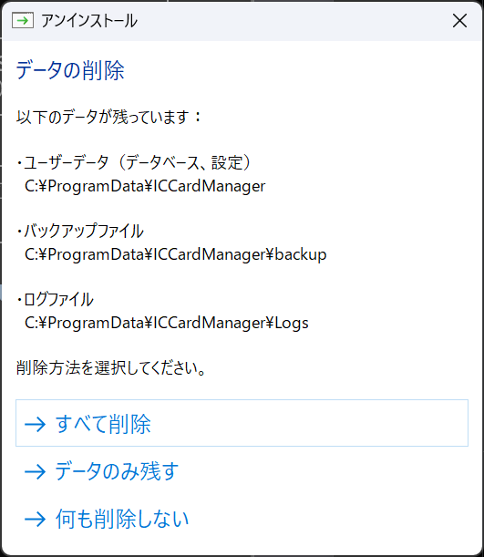
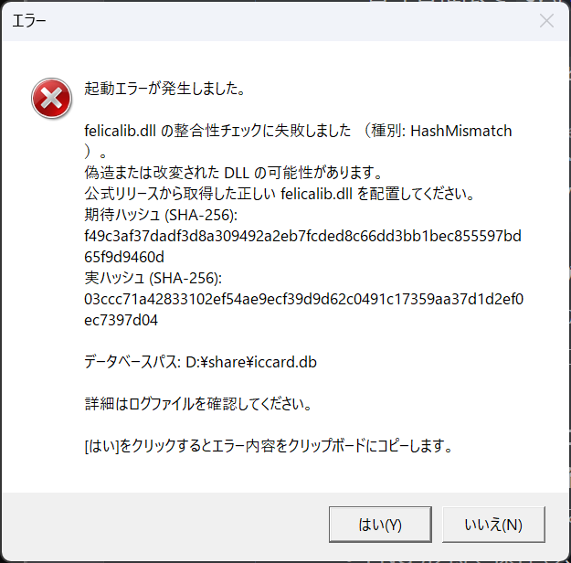

# 交通系ICカード管理システム：ピッすい IT担当者ガイド

**バージョン**: 2.10.0
**最終更新日**: 2026年9月

---

## 目次

1. [このガイドの対象](#1-このガイドの対象)
2. [動作環境と配布形態](#2-動作環境と配布形態)
3. [共有フォルダの構築](#3-共有フォルダの構築)
4. [データベースの配置と接続](#4-データベースの配置と接続)
5. [設定ファイル](#5-設定ファイル)
6. [バックアップ・VACUUM の仕組み](#6-バックアップvacuum-の仕組み)
7. [バージョン管理](#7-バージョン管理)
8. [セキュリティ](#8-セキュリティ)
9. [障害対応](#9-障害対応)

---

## 1. このガイドの対象

本ガイドは、ピッすいを導入する組織の情報システム担当者向けです。共有フォルダの構築、設定ファイルの編集、障害時のログ解析など、管理者マニュアルでは「システム担当者に依頼してください」としている作業を扱います。

| 文書 | 読者 | 扱う内容 |
|------|------|----------|
| 管理者マニュアル | 部署の庶務担当者 | 画面から行う日常の管理作業 |
| IT担当者ガイド（本書） | 情報システム担当者 | 共有フォルダ、設定ファイル、セキュリティ、障害対応 |
| 開発者ガイド | 開発・保守担当者 | ソースコードの構成と規約 |

---

## 2. 動作環境と配布形態

### 2.1 システム要件

| 項目 | 要件 |
|------|------|
| OS | Windows 10/11 (32bit/64bit 両対応) |
| CPU | x86またはx64プロセッサ（本体は32bit (x86) ビルドのため、64bit OS上ではWoW64で動作） |
| メモリ | 4GB以上 |
| ストレージ | 100MB以上の空き容量 |
| ICカードリーダー | Sony PaSoRi (RC-S300/RC-S380等) |
| ネットワーク | 不要（スタンドアロン動作）※共有フォルダモード利用時はSMBネットワーク接続が必要 |

### 2.2 アンインストール時のデータの扱い

アンインストールは「設定」→「アプリ」から実行できます。アンインストール終了直前に、ユーザーデータの取り扱いを 3 択で選択できる「データの削除」ダイアログが表示されます。

{width=70%}

ダイアログには `C:\ProgramData\ICCardManager` 配下に残っているデータ（ユーザーデータ・バックアップ・ログ）の実際のパスが列挙されます。ユーザーデータが存在しないクリーン環境ではこのダイアログは表示されず、プログラムのみが削除されます。

| 選択肢 | 動作 |
|--------|------|
| **すべて削除** | プログラムとユーザーデータ（データベース・バックアップ・ログ）をすべて削除します |
| **データのみ残す** | プログラムを削除し、ユーザーデータ（データベース・設定）は残します。バックアップとログは削除されます |
| **何も削除しない** | プログラムのみ削除し、ユーザーデータ・バックアップ・ログをすべて残します |

各選択肢で削除／保持される対象（`C:\ProgramData\ICCardManager` 配下）は次のとおりです。

| 対象パス | すべて削除 | データのみ残す | 何も削除しない |
|----------|:---------:|:--------------:|:--------------:|
| `\ICCardManager\` 直下（`*.db` / 設定ファイル等） | 削除 | 保持 | 保持 |
| `\ICCardManager\backup\`（バックアップ） | 削除 | 削除 | 保持 |
| `\ICCardManager\Logs\`（操作ログ・診断ログ） | 削除 | 削除 | 保持 |

> **注意**: 再インストールを予定している場合は「データのみ残す」または「何も削除しない」を選んでください。「すべて削除」を選ぶと履歴データを復元できなくなります。誤って「すべて削除」を選んだ場合でも、別の PC や共有フォルダにバックアップが残っていれば復元できます。

> 設計書参照: 01_システム概要設計書 §5. 運用環境要件

---

## 3. 共有フォルダの構築

複数の PC から同時に利用する場合は、**インストール前に**共有フォルダを準備してください。1 台の PC のみで使用する場合は本章の作業は不要です。

> **想定規模**: 共有フォルダモードは最大約 20 台の PC での利用を想定しています。

### 3.1 共有フォルダの準備

1. ファイルサーバ上に、各 PC から同じパスで参照できる共有フォルダを用意します（例: `K:\ICCardShare\ICCardManager\` や `\\Server\ICCardShare\ICCardManager\`）
2. 各 PC のログインアカウントでその共有フォルダが開けること（エクスプローラで開いて、新規にファイルを保存できること）を確認します

組織内ファイルサーバで通常利用する共有フォルダには、業務上必要な読み取り／書き込み権限があらかじめ付与されています。その場合は追加の権限設定は不要です。次のいずれかに当てはまるときだけ、§3.2 以降の権限設定を行ってください。

- 本システム専用に新規の共有フォルダをファイルサーバ上に作成する
- 既定のドメイングループから外れる利用者（外部委託先、特定部門のみ等）に個別に権限を付与する
- 初回起動時に「書き込み権限がありません」「データベースを開けません」等のエラーが出る

### 3.2 アクセス権の設定方針

Windows ファイルサーバの共有設定では、**SMB 共有権限**（ネットワーク経由のアクセス制御）と **NTFS 権限**（ファイル／フォルダ自体のアクセス制御）の**両方**を正しく設定してください。どちらか一方のみでは期待どおりに動作しません（実効権限は両者の AND）。

> **重要**: 「読み取り専用」権限では動作しません。データベースの読み書きに加え、SQLite が一時ファイル（journal ファイル）を作成するため、書き込み権限が必須です。

### 3.3 GUI から設定する場合（推奨）

1. ファイルサーバ上で共有フォルダを右クリックし、**プロパティ** を開きます
2. **共有** タブ → **詳細な共有** を開き、「このフォルダーを共有する」に☑を入れて共有名を設定します（例: `ICCardManager`）
3. **アクセス許可** を開きます
   - 本システム利用者のドメイングループ（例: `DOMAIN\ICCardUsers`）を追加します
   - 「変更」および「読み取り」に☑を入れます（= 読み取り／書き込み権限）
4. **セキュリティ** タブ → **編集** → **追加** を開きます
   - 同じドメイングループを追加します
   - 「変更」および「読み取りと実行」「フォルダーの内容の一覧表示」「読み取り」「書き込み」に☑を入れます
5. **OK** で設定を保存します
6. エクスプローラーで共有フォルダ（UNC パス例: `\\サーバ名\ICCardManager`、マップドドライブ例: `K:\ICCardManager`）を開き、ファイルの作成・編集・削除ができることを確認します

### 3.4 コマンドから設定する場合（PowerShell / 管理者権限）

```powershell
# SMB共有権限（例: 共有名 ICCardShare にドメイングループへ Change 権限）
Grant-SmbShareAccess -Name ICCardShare -AccountName "DOMAIN\ICCardUsers" -AccessRight Change -Force

# NTFS権限（例: D:\share\ICCardManager にドメイングループへ Modify 権限）
icacls "D:\share\ICCardManager" /grant "DOMAIN\ICCardUsers:(OI)(CI)M"
```

権限不足が疑われる場合は、共有フォルダの実効権限を `Get-Acl` / `Get-SmbShareAccess` で確認してから調整してください。

単一 PC 運用であれば「Everyone」や「Authenticated Users」で単純化しても構いません。複数部署が同じファイルサーバを共用する環境では、対象者だけを含むセキュリティグループを作成して付与することを推奨します。

### 3.5 推奨 PC 台数・同時接続数

| 項目 | 推奨値 | 備考 |
|------|--------|------|
| 同時接続PC台数 | 最大約20台 | これを超えるとSQLITE_BUSYエラーの頻度が増加する可能性があります |
| 同時操作 | 2〜3台程度 | 同時にカードタッチ操作を行うPCの推奨台数。同時に多くのPCで操作すると待機時間が発生します |
| ネットワーク | 有線LAN推奨 | Wi-Fiでも動作しますが、安定性の面で有線LANを推奨します |

共有モードでは busy_timeout（15 秒）とリトライ機構（最大 5 回）により、同時書き込みが発生しても待機して順番に処理されます。ただし多数の PC が同時に書き込むと、待機時間が累積して操作のレスポンスが低下する場合があります。

> 設計書参照: 04_機能設計書 §18. 共有フォルダモード

---

## 4. データベースの配置と接続

### 4.1 設定の保存場所

設定は 2 か所に分かれて保存されます。

| 設定の種類 | 保存場所 | 変更方法 |
|------------|----------|----------|
| アプリケーション設定 | データベース（`iccard.db`） | 設定画面（F5）から変更 |
| ログ設定 | `appsettings.json` | テキストエディタで直接編集 |

データベースの保存先そのものは `C:\ProgramData\ICCardManager\database_config.txt` で指定します。このファイルが無い場合はローカルの既定パス（`C:\ProgramData\ICCardManager\iccard.db`）が使われます。

### 4.2 共有モードの自動判定

保存先に **UNC パス**（`\\server\share\...`）または **マップドネットワークドライブ**（`Z:\share\...` 等で `DriveType.Network`）を指定すると、共有モードが自動的に有効になります。ローカルフルパス（例: `C:\Users\...`）を指定した場合は共有モードになりません。

| 項目 | 説明 |
|------|------|
| ネットワーク接続 | ネットワーク接続が切断されると警告が表示されます。接続が復旧すると自動的に再接続します |
| データの反映 | 他のPCでの変更は短時間で自動的に反映されます |
| アプリケーションの再起動 | データベースパスを変更した場合、アプリケーションの再起動が必要です |
| DB最適化（VACUUM） | DB最適化（VACUUM）は月次で1台のみが自動実行します。共有モードで失敗した場合、その月はスキップされ、**翌月の月初に自動で再試行**されます（同じ月のうちは再起動しても再試行されません） |

### 4.3 設定画面からの変更

インストール後に保存先を変更する場合は、設定画面（F5）の「データベース保存先」欄から変更できます。変更後はアプリケーションを再起動してください。

「データベース保存先」欄の横にある **デフォルトに戻す** ボタンを押すと、`C:¥ProgramData¥ICCardManager¥database_config.txt` が削除され、ローカルの既定パス（`C:¥ProgramData¥ICCardManager¥iccard.db`）へ復旧します。共有モードからローカルモードへ確実に切り替えたい場合は、保存先欄を手で空欄にするよりこのボタンを使ってください。押下後はアプリケーションを再起動してください。

### 4.4 インストーラーによる上書き動作

同じ PC に対してアップグレードインストールや再インストールを行うと、インストーラーは既存の `C:¥ProgramData¥ICCardManager¥database_config.txt` を読み込み、次のように振る舞います。

1. 「データベースの保存先」ページで「**共有フォルダで複数PCから使用**」が自動的に選択されます
2. パス欄に既存の共有フォルダパスが自動入力されます（ファイル名 `iccard.db` は除去されてフォルダ部分のみ表示）
3. そのまま「次へ」で進めると、**同じ設定で上書き保存**されます
4. パスを変更してから「次へ」で進めると、**新しいパスで上書き**されます

既存設定が共有モードの状態で「**このPCのみで使用**」を選んで進めると、既存の `database_config.txt` は**削除され、ローカルモードへ切り替わります**。あわせて「共有フォルダのパス」入力欄も空になります。旧共有パス（例: `V:\...`）が残存して起動時にアクセスエラーになることはありません。

### 4.5 2 台目以降の接続と待機動作

| 1台目の状態 | 2台目のインストール | 2台目の初回起動 |
|------------|---------------------|-----------------|
| **非起動** | 問題なく完了 | 即座に接続成功 |
| **起動中** | 問題なく完了（インストーラーは DB に触れない） | 接続成功。書き込み時は最大 15 秒まで待機してリトライ |

共有モードでは SQLite の `journal_mode=DELETE` と `busy_timeout=15000ms` を使用します。WAL モードと異なり、複数 PC からの同時接続に対応します。1 台目が貸出／返却などの書き込み処理中に 2 台目からアクセスがあっても、通常は数百ミリ秒以内にロックが解放されます。

> **リストア時の注意**: リストア（バックアップからの復元）を実施する場合は、**他のすべてのPCでアプリを終了**してから実行してください。リストア中は他 PC からのアクセスを受け付けません。

### 4.6 ネットワーク切断時のフォールバック

| 状況 | アプリの挙動 |
|------|-------------|
| ネットワーク切断を検知 | ステータスバーに「🔗 共有モード」の警告表示、接続不可を通知 |
| 自動再接続 | 15秒ごとのヘルスチェックで接続復旧を検知、自動的に再接続 |
| 書き込み処理中の切断 | トランザクション単位でロールバック（整合性修復処理もトランザクションで保護） |
| 復旧後の整合性 | 起動時に整合性チェックが実行され、必要に応じて自動修復 |

ネットワークが長時間切断される環境では、共有モードを一時的に解除してローカル運用に切り替えることもできます。ただしその間の入力は別 DB に記録されるため、復旧後にデータを手動でマージしてください（運用上は避けることを推奨します）。

### 4.7 バックアップ・リストア時の注意（共有モード）

**バックアップ**

- バックアップは SQLite Backup API を使用するため、他の PC が接続中でも安全に実行できます
- バックアップ先は共有フォルダとは別の場所を推奨します（同一ストレージ障害時のリスク分散）

**リストア**

- **リストア前に他の全 PC でアプリケーションを終了してください**
- 他の PC が接続中にリストアを行うと、データの不整合が発生する恐れがあります
- 手順は次のとおりです
  1. 管理者 PC で他の利用者にアプリケーション終了を連絡します
  2. 全 PC でアプリケーションが終了したことを確認します
  3. 管理者 PC のシステム管理画面（F6）からリストアを実行します
  4. リストア完了後、各 PC でアプリケーションを再起動します

> 設計書参照: 04_機能設計書 §18.2 共有モード判定 / §18.5 ネットワーク切断時の動作

---

## 5. 設定ファイル

### 5.1 ログ設定（appsettings.json）

ログ出力に関する設定は `appsettings.json` ファイルで管理されます。

**保存場所**

- インストーラー使用時: `C:\Program Files\ICCardManager\appsettings.json`
- 手動インストール時: アプリケーションの実行ファイルと同じフォルダ

> **注意**: 設定ファイルを直接編集する場合は、アプリケーションを終了してから編集してください。

```json
{
  "Logging": {
    "LogLevel": {
      "Default": "Information",
      "ICCardManager": "Information",
      "Microsoft": "Warning"
    },
    "File": {
      "Enabled": true,
      "Path": "Logs",
      "RetentionDays": 30,
      "MaxFileSizeMB": 10
    },
    "Debug": {
      "Enabled": false
    }
  }
}
```

#### LogLevel（ログレベル）

アプリケーションが出力するログの詳細度を制御します。

| 項目 | 説明 | デフォルト値 |
|------|------|-------------|
| Default | 全体のデフォルトログレベル | Information |
| ICCardManager | アプリケーション固有のログレベル | Information |
| Microsoft | Microsoftライブラリのログレベル | Warning |

ログレベルの種類は次のとおりです（詳細度の高い順）。

| レベル | 説明 |
|--------|------|
| Trace | 最も詳細なログ |
| Debug | デバッグ情報 |
| Information | 一般的な動作情報（デフォルト） |
| Warning | 警告 |
| Error | エラー |
| Critical | 致命的なエラー |
| None | ログを出力しない |

> **ヒント**: トラブルシューティング時には `Default` を `Debug` に変更すると、より詳細なログが出力されます。調査終了後は `Information` に戻してください。

#### File（ファイル出力設定）

ログファイルは `%PROGRAMDATA%\ICCardManager\Logs\` に出力されます。

| 項目 | 説明 | デフォルト値 |
|------|------|-------------|
| Enabled | ファイルへのログ出力の有効/無効 | true |
| Path | ログファイルの出力先フォルダ名 | Logs |
| RetentionDays | ログファイルの保持日数（超過した古いログは自動削除） | 30 |
| MaxFileSizeMB | 1ファイルあたりの最大サイズ（MB） | 10 |

#### Debug（デバッグ出力設定）

| 項目 | 説明 | デフォルト値 |
|------|------|-------------|
| Enabled | デバッグ出力の有効/無効 | false |

> **注意**: Debug 設定は開発者向けです。通常の運用では `false` のままにしてください。

### 5.2 組織固有設定（OrganizationOptions）

他の組織で本システムを利用する場合、`appsettings.json` に `OrganizationOptions` セクションを追加すると、組織固有のテキストや動作をカスタマイズできます。

> **重要**: このセクションを追加しない場合は、デフォルト値（福岡市向け）がそのまま使用されます。福岡市で利用する場合は設定不要です。

#### 設定例

```json
{
  "OrganizationOptions": {
    "SummaryText": {
      "ChargeSummaryMayorOffice": "需用費によりチャージ",
      "ChargeSummaryEnterprise": "旅費によりチャージ",
      "RailwayLabel": "電車",
      "BusLabel": "路線バス"
    },
    "SummaryRules": {
      "EnableRoundTripDetection": true,
      "EnableTransferConsolidation": true,
      "TransferStationGroups": [
        ["梅田", "大阪梅田"],
        ["難波", "なんば"]
      ]
    },
    "AreaPriority": {
      "DefaultPriority": [1, 0, 2, 3]
    },
    "ReportLayout": {
      "TitleText": "物品出納簿",
      "ClassificationText": "雑品（金券類）",
      "UnitText": "円"
    }
  }
}
```

#### 摘要テキスト（SummaryText）

物品出納簿に出力される各種テキストをカスタマイズできます。

| 設定キー | 説明 | デフォルト値 |
|----------|------|--------------|
| ChargeSummaryMayorOffice | 市長事務部局のチャージ摘要 | 役務費によりチャージ |
| ChargeSummaryEnterprise | 企業会計部局のチャージ摘要 | 旅費によりチャージ |
| PointRedemption | ポイント還元の摘要 | ポイント還元 |
| RefundSummary | 払い戻しの摘要 | 払戻しによる払出 |
| LendingSummary | 貸出中の摘要 | （貸出中） |
| CarryoverFromPreviousYear | 前年度繰越の摘要 | 前年度より繰越 |
| CarryoverToNextYear | 次年度繰越の摘要 | 次年度へ繰越 |
| CarryoverFromMonthFormat | 前月繰越のフォーマット（{0}=月番号） | {0}月より繰越 |
| MidYearCarryoverFormat | 年度途中繰越のフォーマット（{0}=月番号） | {0}月から繰越 |
| MidYearCarryoverPattern | 年度途中繰越の判定用正規表現 | ^(1[0-2]\|[1-9])月から繰越$ |
| MonthlySummaryFormat | 月計のフォーマット（{0}=月番号） | {0}月計 |
| CumulativeSummary | 累計の摘要 | 累計 |
| InsufficientBalanceNoteFormat | 残高不足時の備考（{0}=支払額、{1}=不足額） | 支払額{0}円のうち不足額{1}円は現金で支払（旅費支給） |
| RailwayLabel | 鉄道利用のラベル | 鉄道 |
| BusLabel | バス利用のラベル | バス |
| BusPlaceholder | バス停名未入力時のプレースホルダ | ★ |
| RoundTripSuffix | 往復の接尾辞 | &nbsp;往復 |

> **BusLabel / BusPlaceholder を変更した場合、変更前に保存された履歴は古い表記のままです。** これらの設定値は摘要の生成だけでなく、バス停名の抽出（履歴の統合・摘要の直接編集）、バス停入力ダイアログの起動判定、バス停名未入力の警告・一覧の判定にも使われます。設定を変更しても既存の台帳データは書き換わらないため、変更前に「バス（★）」として保存された履歴は、変更後は「バス停名未入力」として検出されなくなります。**運用開始前に決めてください。** やむを得ず途中で変更する場合は、変更前にメイン画面の「バス停名未入力」警告からすべて入力を済ませてください。

> **MidYearCarryoverFormat と MidYearCarryoverPattern は必ずセットで変更してください。** Format は繰越行の摘要の生成に、Pattern はその摘要の判定（月次帳票の月計・累計からの除外、履歴一覧での繰越行の先頭表示、管理者ダッシュボードの稼働率集計からの除外）に使われます。片方だけを変更すると、生成された繰越行が繰越として認識されず、月計・累計の二重計上や、登録しただけのカードが「利用あり」に見える誤集計につながります。変更後は、繰越行のあるカードの月次帳票プレビューで月計・累計が正しいことを確認してください。

#### 摘要生成ルール（SummaryRules）

摘要文字列の生成ルールを個別に ON/OFF できます。

| 設定キー | 説明 | デフォルト値 |
|----------|------|-------------|
| EnableRoundTripDetection | 往復検出（A→B + B→A → 「A～B 往復」） | true |
| EnableTransferConsolidation | 乗継統合（A→B + B→C → 「A～C」） | true |
| TransferStationGroups | 同一とみなす駅・バス停のグループの**初期値** | 天神/西鉄福岡(天神)、千早/西鉄千早 |

> **`TransferStationGroups` はシステム管理画面から編集してください。** この項目は、名前が異なるが実質同じ場所である駅・バス停のグループです。同一グループ内の移動は乗継として統合され、そこで折り返す移動は往復として扱われます。
>
> **設定値はデータベースに保存され、DB の値が優先されます。** appsettings.json のこの項目は「システム管理画面から一度も保存していないときの初期値」として働きます。一度でも画面から保存すると、以後 appsettings.json を書き換えても反映されません。運用中の変更は必ずシステム管理画面（F6）→「摘要の設定」→「同一とみなす駅・バス停を設定」から行ってください。

#### エリア優先順位（AreaPriority）

駅コードからの駅名検索で、カード種別に応じたエリアの優先順位を設定します。

| 設定キー | 説明 | デフォルト値 |
|----------|------|-------------|
| DefaultPriority | デフォルトの優先順位（エリアコードの配列） | [3, 0, 1, 2]（九州優先） |
| CardTypePriorities | カード種別ごとの優先順位（辞書形式） | {}（空＝組み込みのデフォルト使用） |

エリアコードは次のとおりです。

- 0 = JR東日本・関東圏
- 1 = JR西日本・関西圏
- 2 = JR東海・中部圏
- 3 = JR九州・九州圏

#### 帳票レイアウト（ReportLayout）

帳票のタイトルや固定テキストをカスタマイズできます。

| 設定キー | 説明 | デフォルト値 |
|----------|------|-------------|
| TitleText | 帳票タイトル | 物品出納簿 |
| ClassificationText | 物品分類の表示テキスト | 雑品（金券類） |
| UnitText | 単位の表示テキスト | 円 |
| FileNameFormat | ファイル名フォーマット（{0}=カード種別、{1}=管理番号、{2}=年度） | 物品出納簿\_{0}\_{1}\_{2}年度.xlsx |

> **FileNameFormat の注意**
>
> - **プレースホルダは `{0}` `{1}` `{2}` のみ**使えます。`{3}` のように存在しない番号や、閉じ括弧の欠落があると既定の書式で出力されます。
> - **フォルダー区切り（`\` `/`）を含めることはできません**。含まれている場合は既定の書式で出力されます（出力先フォルダーの外へファイルが作られることを防ぐため）。
> - **ファイル名に使えない文字（`* ? : " < > |`）も含められません**。含まれている場合は既定の書式で出力されます。
> - 既定の書式へ切り替わったときは、アプリのログファイルに「帳票ファイル名の書式 … は使用できないため、既定の書式 … で出力します」と記録されます。設定したのに反映されないときはログを確認してください。
> - **空欄にすると既定の書式**が使われます。
> - **書式を変更しても、変更前に出力済みのファイルの名前は変わりません。** 帳票作成ダイアログの「出力済み / 未出力」表示は新しい書式のファイル名で判定するため、変更直後は出力済みの月が「未出力」と表示されます。**年度の途中で変更しないでください。**

#### テンプレート列マッピング（TemplateMapping）

独自の Excel テンプレートを使用する場合に、**ヘッダー行（2行目）**のセル配置を指定します。通常は変更不要です。

| 設定キー | 説明 | デフォルト値 |
|----------|------|--------------|
| ClassificationColumn | 物品分類の列番号 | 2 |
| CardTypeColumn | カード種別の列番号 | 5 |
| CardNumberColumn | 管理番号の列番号 | 8 |
| UnitColumn | 単位の列番号 | 10 |
| PageNumberColumn | ページ番号の列番号 | 12 |

> **各列は 1〜12（A〜L 列）の範囲で指定してください。** 物品出納簿のテンプレートは A〜L 列で構成され、罫線・結合セル・印刷範囲がテンプレートファイル自体に埋め込まれているため、**帳票の幅そのものは設定では変えられません**。範囲外の列を指定すると、値の書き込み自体は成功しても印刷範囲の外になり帳票に現れないため、帳票作成時にエラーとして案内し、帳票ファイルを作りません（どの設定が範囲外かはエラーメッセージに表示されます）。

> **`PageNumberColumn` は帳票のページ番号全体に効きます。** 1 ページ目のヘッダーだけでなく、改ページ後の継続ページのページ番号、および「前月シートの最終ページ番号を読み取って翌月へ継続する」処理も同じ列を使います。

> **明細行（出納年月日・摘要・受入金額・払出金額・残額・氏名・備考）の配置は変更できません。** 明細行のレイアウトは列番号だけでは決まらず、結合セル（摘要 B〜D 列・備考 I〜L 列）・罫線・改ページ位置（1ページ＝22行。ヘッダー1〜4行／データ5〜16行／備考17〜22行）と一体で、テンプレートファイル自体に埋め込まれているためです。

> **廃止された項目**: `DataStartRow` / `RowsPerPage` / `DateColumn` など 13 項目は、プログラムから読まれないため設定項目そのものを削除しました。`appsettings.json` にこれらの記述が残っていても、無視されるだけでエラーにはなりません（削除して構いません）。

> 設計書参照: 04_機能設計書 §17.1 設定項目一覧

---

## 6. バックアップ・VACUUM の仕組み

### 6.1 自動バックアップと保持ルール

アプリケーションは起動時に自動でバックアップを作成します。保存先は設定画面（F5）で変更できます。

- 保持ルールは**自動バックアップ＝直近 30 日分（各日は最新の 1 つだけ）**、**手動・リストア前バックアップ＝最新 10 件**です。これを超える古いファイルは次回の自動バックアップ実行時に削除されます
- 保持ルール（自動 30 日分 / 手動 10 件）はアプリケーションで固定されており、設定画面から変更できません
- それ以上長く保管したい場合は、手動バックアップを併用してください

### 6.2 一時ファイル（`.tmp`）について

バックアップは、いったん `backup_YYYYMMDD_HHMMSS.db.（英数字）.tmp` という作業用ファイルへ書き出し、**書き終えてから** `backup_YYYYMMDD_HHMMSS.db` に名前を変える方式で作成されます。これにより、コピー中にネットワークが切れたり PC の電源が落ちたりしても、**中途半端なファイルが正規のバックアップとして残ることがありません**。

- 通常はバックアップ完了と同時に消えるため、目にする機会はほとんどありません
- コピーの途中で PC の電源が落ちた場合などに残ることがありますが、**24 時間以上経過したものは次回の自動バックアップ時に自動で削除**されます。手動で消す必要はありません
- `.tmp` ファイルはリストア（復元）の一覧には表示されません。保持ルール（自動 30 日分 / 手動 10 件）の対象にも数えられません

### 6.3 バックアップ状況（健全性の確認）

システム管理画面（F6）の「バックアップ状況」セクションに、バックアップが正しく動き続けているかを確認するための情報が常時表示されます。バックアップは自動で行われるため、失敗が静かに続いても気づきにくくなりがちです。**月に一度はこの欄を確認してください。**

| 表示項目 | 内容 |
|---------|------|
| 最終成功 | 最後にバックアップが成功した日時と、そこからの経過（本日／昨日／N日前）。一度も記録がない場合は「記録なし（次回の自動バックアップ成功後に表示されます）」と表示されます |
| 保持世代 | 保存先に現存するバックアップファイルの数と上限（例: 「保持世代: 12 / 30」） |
| 保存先の空き容量 | バックアップ保存先ドライブ・共有フォルダの空き容量。取得できない場合は「不明」 |
| 保存先 | 実際にバックアップが書き込まれるフォルダのパス |
| （保存先の退避の案内） | 設定したバックアップ先を使用できず、既定の場所（`C:\ProgramData\ICCardManager\backup`）に保存しているときだけ、その理由とともに赤字で表示されます |
| 最終実施PC | 最後にバックアップを実施したPC名（**共有モードのときのみ表示**） |
| 最終最適化(VACUUM) | 月次のデータベース最適化を最後に実行した日付と実施PC名（**共有モードのときのみ表示**） |

- 状態は色だけでなくアイコンでも示されます。正常時は **✔**、警告状態では **⚠** になります
- **「設定した保存先『…』を使用できないため、上記の既定の場所に保存しています」と表示されている場合、共有フォルダーにはバックアップが作られていません。** バックアップ自体は既定の場所へ成功しているため、長期間成功していない警告は出ません。表示された理由に従って設定画面（F5）でバックアップ先を確認し、指定し直してください
- 「バックアップを作成」ボタンで手動バックアップを行うと、この欄も即座に更新されます

### 6.4 長期間成功していないときの警告

最後にバックアップが成功してから **7 日を超えて** 経過すると、メイン画面のシステム警告エリアに次の警告が表示されます。

> ⚠️ 自動バックアップが12日間成功していません（最終成功: 2026/07/13 08:30）。保存先フォルダーの空き容量やアクセス権に問題がある可能性があります。システム管理画面（F6）でバックアップ状況を確認し、手動バックアップを実行してください。

- この警告をクリックすると、システム管理画面（F6）が直接開きます
- 判定は「起動回数」ではなく「最終成功日時からの経過日数」で行うため、長期休暇などでアプリを起動しなかった期間も検知できます
- 手動バックアップが成功すると警告は消えます
- **貸出・返却などの通常操作では消えません。** バックアップが復旧するまで表示され続けます

主な原因と対処は次のとおりです。

| 原因 | 対処 |
|------|------|
| 保存先の空き容量不足 | 「保存先の空き容量」を確認し、不足していれば古いファイルの整理か保存先の変更（設定画面 F5）を行ってください |
| 保存先フォルダのアクセス権不足 | 保存先フォルダに「変更」権限があるか確認してください（→ §3. 共有フォルダの構築） |
| 保存先（共有フォルダ）に到達できない | ネットワーク接続と共有フォルダの状態を確認してください |
| 保存先パスの設定が誤っている | 「保存先」の表示が意図したフォルダになっているか確認してください。不正なパスが設定されている場合、アプリは既定のフォルダ（`C:\ProgramData\ICCardManager\backup`）に自動的に切り替えます |

### 6.5 定期メンテナンスとデータベースサイズ

| 頻度 | 作業内容 |
|------|----------|
| 起動時 | （自動）バックアップ |
| 週次 | 管理者ダッシュボード（F8）で長期未返却・残額不足を確認 |
| 月次 | 帳票出力、残額確認、当月の帳票出力漏れの確認 |
| 年次 | 古いデータの確認、ディスク容量確認、カード枚数の見直し |

自動バックアップはアプリケーション起動時に作成されます。常時 PC を起動したまま運用する場合は実質的に日次バックアップとなりますが、毎日アプリを起動・終了する運用ではその頻度に依存します。長期間アプリを起動しない場合は、システム管理画面（F6）から手動バックアップを取得してください。

通常の使用では、データベースファイルは数十 MB 程度です。極端に大きくなった場合は、古いデータの削除やバックアップ後の再インストールを検討してください。

### 6.6 VACUUM 失敗時の対処

VACUUM はデータベースファイルを最適化（圧縮）する処理です。共有モードでは排他ロックが必要なため、他の PC が接続中は失敗します。

- **通常**: VACUUM は月初の起動時に 1 台のみが自動実行します。失敗した場合はその月はスキップされ、翌月の月初に自動で再試行されます。対処は不要です（同じ月のうちは再起動しても再試行されません）
- **その月のうちに確実に VACUUM を実行したい場合**: VACUUM の実行権はその月の最初の試行で確定するため、いったん失敗するとアプリの再起動では同月内に再試行できません。どうしても当月中に最適化したい場合は、他の全 PC でアプリケーションを終了し排他状態を確保したうえで、最終手段としてバックアップ取得後に SQLite ツール等で手動最適化してください（通常運用では不要です）
- **データベースサイズが大きくなりすぎた場合**: 古いデータの削除（システム管理画面 → 古い履歴の削除）を行うとファイルの空き領域が増え、翌月の自動 VACUUM でサイズが縮小されます

> 設計書参照: 04_機能設計書 §17.3 バックアップ健全性の見える化 / §17.3b バックアップの保持ルール / §16.4 最適化

---

## 7. バージョン管理

バージョンアップは**全 PC で同じバージョンに揃える**のが原則です。特に共有モードでは、新旧バージョンが混在すると予期しない動作やデータ破損の原因になります。これを支援・防止するため、次の 2 つの仕組みが備わっています。

### 7.1 更新通知（`latest_version.txt`）

共有フォルダ（データベース `iccard.db` と同じ場所）に `latest_version.txt` というテキストファイルを置き、その **1 行目に最新バージョン**を記載しておくと、まだ更新していない PC のメイン画面上部に次のような更新案内が表示されます。

```
ℹ️ 新しいバージョン 2.11.0 が公開されています（このPCは 2.10.0）。管理者に更新をご確認ください。
```

| 項目 | 内容 |
|------|------|
| 置き場所 | データベースファイルと同じフォルダ（共有フォルダ） |
| 記載内容 | 1 行目に最新バージョン（例: `2.11.0`）。先頭の `v`・前後の空白・空行は無視されます |
| 運用 | 新バージョンを配布するタイミングでこのファイルの中身を最新バージョンに書き換えます |
| 表示条件 | ファイル記載のバージョンが、そのPCのバージョンより新しい場合のみ案内を表示します |
| 任意運用 | このファイルを置かない運用も可能です（その場合、更新案内が出ないだけで動作に影響はありません） |

この通知はインターネット接続を必要としません。共有モード専用の機能ではありませんが、ローカルモード（単一 PC）では管理者がこのファイルを置く場面がないため、実質的に共有運用時に活用する機能です。ファイルが無い・内容が不正・読み取りに失敗した場合はいずれも案内を出さず、起動を妨げません。

### 7.2 旧バージョンの起動ブロック

データベースがより新しいバージョンのピッすいによって更新されている場合、**古いバージョンの PC で起動しようとすると**、起動時に「**ピッすいの更新が必要です**」という警告ダイアログが表示され、アプリケーションは**データベースに接続せずに終了**します。これは、古いバージョンがそのまま使用を続けるとデータが壊れる恐れがあるための保護です。

- **対処法**: 表示されたダイアログの案内に従い、**その PC のピッすいを最新版に更新**してください。更新後は正常に起動できます
- この保護が働くのは、**データベースの構造（スキーマ）変更を含む更新**が行われた場合です。スキーマ変更を伴わない更新では起動はブロックされません
- 共有モードだけでなく、単一 PC（ローカルモード）でも同様に働きます（新バージョンで更新した DB を、誤って旧バージョンで開いた場合の保護）

> **注意**: この起動ブロックは本機能を搭載したバージョン以降でのみ有効です。本機能を搭載していない古いバージョン自体をブロックすることは仕組み上できません。今後のスキーマ変更以降のバージョン混在事故を防ぐための仕組みです。

> 設計書参照: 04_機能設計書 §18.6 バージョン混在の検出とブロック

---

## 8. セキュリティ

### 8.1 アクセス制御

本システムはスタンドアロン動作のため、OS レベルでのアクセス制御を推奨します。

- 管理者用 PC でのみ管理機能を使用する
- Windows ユーザーアカウントでアクセスを制限する

### 8.2 データ保護

| 項目 | 対策 |
|------|------|
| データベース | ローカルファイル（暗号化なし） |
| バックアップ | 定期的なバックアップを推奨 |
| 個人情報 | 職員氏名を含むため取り扱い注意 |

### 8.3 監査ログ

操作ログは `operation_log` テーブルに記録され、6 年経過後に自動削除されます。記録される操作は次のとおりです。

- 貸出・返却（利用履歴の登録・編集・削除）
- 職員の登録・編集・削除・復元
- 交通系ICカードの登録・編集・削除・復元
- 履歴の統合・分割
- CSVインポート・エクスポート（データエクスポート/インポート画面）
- バックアップの取得・リストア（システム管理画面）
- 操作ログ自体のExcelエクスポート（操作ログ画面。職員氏名を含む情報の持ち出しのため記録されます）

> **注意**: 起動時に自動取得されるバックアップと、リストア実行前に自動取得されるバックアップは操作ログに記録されません（職員の操作ではなくシステムの自動処理のため）。バックアップの実施状況はシステム管理画面（F6）の「バックアップ状況」で確認してください。

> **参考**: インポートは完了したものの、操作ログへの記録だけが失敗する場合があります。そのときは完了ダイアログにその旨が表示されます。**データの取り込みは済んでいるので、同じファイルを再度インポートしないでください**（二重登録になります）。共有フォルダーモードで他の PC が同時にデータベースを使用しているときに起こり得ます。

画面での絞り込み方法や表示項目の見方は、管理者マニュアルの付録 B を参照してください。

### 8.4 felicalib.dll の完全性管理

本システムは交通系ICカードの読み取りに `felicalib.dll`（Sony PaSoRi 用のネイティブライブラリ）を使用します。この DLL がアプリディレクトリで偽造・改変されると、IDm の盗聴・改ざんを通じた不正な貸出／返却記録のリスクがあります。

#### 自動整合性検証

**アプリ起動時に `felicalib.dll` の SHA-256 ハッシュを自動検証**します。既知の正規ハッシュと不一致の場合、エラーダイアログを表示してアプリを終了します。

- 期待ハッシュ (SHA-256): `f49c3af37dadf3d8a309492a2eb7fcded8c66dd3bb1bec855597bd65f9d9460d`
- 出自: [tmurakam/felicalib](https://github.com/tmurakam/felicalib) (MIT License)

#### 検証失敗時のエラーダイアログ

ハッシュが一致しない場合、起動シーケンス中に次のエラーダイアログ（タイトル: 「エラー」、赤い ❌ アイコン、[はい]/[いいえ] ボタン）が表示されます。[いいえ] を押すかウィンドウを閉じるとアプリは終了コード `1` で終了します。[はい] を押すとエラー本文がクリップボードにコピーされます。

{width=70%}

ダイアログ本文の例（Release ビルド）:

```
起動エラーが発生しました。

felicalib.dll の整合性チェックに失敗しました （種別: HashMismatch）。
偽造または改変された DLL の可能性があります。
公式リリースから取得した正しい felicalib.dll を配置してください。
期待ハッシュ (SHA-256): f49c3af37dadf3d8a309492a2eb7fcded8c66dd3bb1bec855597bd65f9d9460d
実ハッシュ (SHA-256):   <実際に計算されたハッシュ>

データベースパス: <共有モード設定時のみ表示>

詳細はログファイルを確認してください。

[はい]をクリックするとエラー内容をクリップボードにコピーします。
```

「種別」フィールドの値による切り分けは次のとおりです。

| 値 | 意味 | 想定原因 |
|----|------|----------|
| `HashMismatch` | ファイル存在・ハッシュ不一致 | **改ざん・偽造** の最も典型的なケース |
| `FileNotFound` | 検証対象ファイルが存在しない | DLL が削除された、または別パスへ移動された |
| `Error` | 検証実行不能 | 読み取り権限不足・I/O エラー等 |

#### 検証失敗時のログ出力

エラーダイアログ表示と同時に、`%PROGRAMDATA%\ICCardManager\logs\iccardmanager-YYYYMMDD.log` に次の形式でエラーログ（カテゴリ: `FelicalibIntegrity`、レベル: `Error`）が記録されます。

```
felicalib.dll の整合性検証に失敗: Result=HashMismatch, Expected=f49c3af37dadf3d8a309492a2eb7fcded8c66dd3bb1bec855597bd65f9d9460d, Actual=<実際のハッシュ>, File=<DLLの絶対パス>, Error=SHA-256 ハッシュが期待値と一致しません。
```

ダイアログ本文には含まれない検証対象ファイルの**絶対パス** (`File=...`) もログには記録されているため、改ざんされた DLL の配置場所の特定に利用できます。

#### 運用上の責務

1. **公式リリースからの取得のみ許容**: インストーラーに同梱される `felicalib.dll` 以外を配置しないでください
2. **アプリディレクトリの書き込み権限制限**: `Program Files\ICCardManager\` への書き込みは管理者のみとしてください
3. **更新時のハッシュ照合**: `felicalib.dll` を更新する場合は、GitHub リリース署名または SHA-256 ハッシュを必ず照合してください
4. **検証失敗時の対応**: 起動エラーダイアログが表示された場合はインストーラーで再インストールしてください。意図せず差し替わっていた場合は、誰がアクセスしたか Windows セキュリティログで調査してください

#### 手動でのハッシュ検証（任意）

PowerShell で SHA-256 ハッシュを手動確認する手順です。

```powershell
Get-FileHash "C:\Program Files\ICCardManager\felicalib.dll" -Algorithm SHA256
```

結果の Hash 列が上記の期待値と一致していれば正規ファイルです。

### 8.5 CSV/Excel 式インジェクション対策

本システムは CSV・Excel 入出力時に **式インジェクション (CSV Injection / Formula Injection) 対策**を自動適用します。これは Excel で開いた CSV ファイルのセル先頭が `=`, `+`, `-`, `@`, タブ, CR で始まる場合、表計算ソフトが数式として自動評価してしまう脆弱性への対策です。

#### 攻撃シナリオ例

- 悪意ある担当者が職員登録 CSV の「備考」列に `=1+1` を書き込む
- 別の管理者がその CSV をインポートし、後で帳票をエクスポートすると、Excel で開いた時に `2` と評価される（想定外の表示）
- 古い Excel では `=cmd|'/c calc'!A1` 形式で外部コマンド実行のリスクがある

#### 自動防御

**出力側（sink 側）**で自動サニタイズ（先頭に `'` 付与）を実施します。

1. **CSV エクスポート時**: `CsvExportService` がすべての文字列フィールドに適用します
2. **Excel エクスポート時** (`ReportService`, `OperationLogExcelExportService`, `AdminDashboardExcelExportService`):
   - 月次帳票: `Summary` / `StaffName` / `Note` / `CardType` / `CardNumber`
   - 操作ログ: `OperatorName` / `TargetId` / 変更内容サマリ
   - 管理者ダッシュボード: カード名・職員名等の文字列セル

**CSV インポート時はサニタイズしません。** 取り込み時にも `'` を付与すると、UI から入力した値には付与されないため、エクスポート → 取り込みの往復で `-異動予定` が `'-異動予定` に変わってしまいます。現在は取り込み時に**エクスポート由来の先頭 `'`（直後が `=` `+` `-` `@` 等の危険文字の場合のみ）を取り除き**、UI 入力と同じ自然な値で保存します。防御は出力側がすべて担うため、DB に `'` を残す必要はありません。

#### 表示上の影響

- セルに `'=SUM(1,2)` と書かれていても、Excel では `=SUM(1,2)` と**見た目は同じ**です（`'` は Excel のテキスト指示子として認識され表示されません）
- DB・UI 画面では `=SUM(1,2)` のままです（`'` は付きません）。UI 画面は数式を評価しないため安全です
- 過去のバージョンで CSV インポート経由に登録したデータには `'` が残っている場合があります。そのデータをエクスポートして再取り込みすると、`'` が取り除かれた値に更新されます（プレビューには「備考: `'-異動予定` → `-異動予定`」のような差分として表示されます）

#### 問い合わせ対応

- **「Excel で開いたセルに `'` が見える」と問い合わせがあった場合**: 正常な動作で、セキュリティ対策による表示です。Excel 上では保存時に自動で取り除かれます。CSV エディタで `'` が見えたままの CSV を取り込んでも、`'` は自動的に取り除かれます
- **合法的に `=` で始めたいデータ**（例: 化学式 `=H2O`）: 画面上は `=H2O` のまま登録・表示され、Excel 出力時のみ `'` 付きになります
- **`'` で始まる備考を意図的に登録したい場合**: `'メモ` のように `'` の直後が危険文字でなければそのまま保存されます。`'-メモ` のように直後が危険文字の場合は、CSV 取り込みでは `'` が取り除かれます（画面から入力すれば保存できます）

> 設計書参照: 01_システム概要設計書 §6. セキュリティ要件

---

## 9. 障害対応

### 9.1 まず接続診断を実行する

不具合の原因が分からないときは、**症状から探す前に「接続診断」を実行してください**。アプリが動くために必要な 8 項目をまとめて確認し、問題があれば原因と対処方法を画面に表示します。

**手順**

1. メイン画面で **F6** キーを押し、システム管理画面を開きます
2. 「データベース情報」欄の **［接続診断］** ボタンを押します
3. ダイアログが開くと自動で診断が始まります（数秒〜十数秒）

**診断される項目**

| 項目 | 何を確認しているか |
|------|-------------------|
| データベース到達性 | データベースファイルを読み取れるか |
| データベース書込権限 | データベースに書き込めるか |
| ジャーナルモード | 停電などに強い設定で動いているか |
| 共有フォルダ接続状態 | 共有フォルダとの接続が続いているか（共有モードのときのみ） |
| ICカードリーダー | ICカードリーダーが認識されているか |
| バックアップ保存先 | バックアップ先フォルダに書き込めるか |
| 空きディスク容量 | バックアップを保存できるだけの空きがあるか |
| バックアップ実施状況 | 直近でバックアップが成功しているか |

**判定の見方**

| 表示 | 意味 | 対応 |
|------|------|------|
| ✔ 正常 | 問題ありません | 対応不要 |
| ⚠ 警告 | いま使えますが、放っておくと問題になります（または、まだ確認しきれていません） | 画面の対処方法に従ってください |
| ✖ 異常 | その機能が使えません | 画面の対処方法に従ってください |
| － 対象外 | この環境では確認する必要がない項目です | 対応不要（異常ではありません） |

一覧から項目を選ぶと、画面下部に「何が起きているか・なぜそうなるか・どうすればよいか」が表示されます。

**［結果をコピー］** ボタンを押すと、診断結果に加えてアプリのバージョン・PC 名・OS・データベースの場所・動作モードがまとめてコピーされます。庶務担当者から状況を受け取るときは、このボタンで貼り付けてもらってください。

診断はデータを読み取って確認するだけで、設定やデータを書き換えることはありません（バックアップ先の書き込み確認のためだけに一時ファイルを作り、確認後すぐに消します）。何度実行しても安全です。

### 9.2 ログファイルの場所と読み方

アプリケーションログは次の場所に出力されます。

```
%PROGRAMDATA%\ICCardManager\Logs\
```

ファイル名は `iccardmanager-YYYYMMDD.log` の形式で、1 日 1 ファイルです。既定では 30 日分を保持し、1 ファイルが 10MB を超えると分割されます（保持日数・サイズは §5.1 の `RetentionDays` / `MaxFileSizeMB` で変更できます）。

- **「データベース書込権限」が異常のとき**は、ログファイルも一緒に確認してください。画面には原因の**候補**（読み取り専用属性・アクセス権不足・他のプログラムによる占有など）しか表示できませんが、ログにはそのどれであったかを示す情報が記録されています。診断を実行した日時のログを見ると原因を 1 つに絞れます
- 詳しい調査が必要なときは、§5.1 の `Default` を `Debug` に変更して再現させてください。調査終了後は `Information` に戻してください
- ログのカテゴリ（例: `FelicalibIntegrity`）とレベル（`Warning` / `Error`）で絞り込むと、該当箇所を見つけやすくなります

### 9.3 共有フォルダモードの切り分け

共有モードで接続や動作に問題が出た場合は、まずシステム管理画面（F6）の最上部「データベース情報」欄で、**その PC が見ているデータベースのパス**（他の PC と同じ共有先を指しているか）を確認し、**［接続診断］** を実行してください。

- パスが想定と違う → `database_config.txt` の設定ミス（→ §4.1）
- 「データベース到達性」が異常 → ネットワーク／共有フォルダ（→ §3）
- 「データベース書込権限」が異常 → アクセス権が読み取り専用（→ §3.2）
- 「共有フォルダ接続状態」が **「再接続中」** → 接続が断続的に切れています。ネットワークの安定性を疑ってください
- 「共有フォルダ接続状態」が **「確認中（監視は未検知）」** → 15 秒ごとの自動確認がまだ切断に気づいていないだけで、実際には切れています。先に「データベース到達性」の対処を行い、しばらく待ってから再診断してください

| 症状 | 原因 | 対処法 |
|------|------|--------|
| 「ネットワーク接続が切断されました」と表示される | ファイルサーバへの接続が切断された | ネットワーク接続を確認し、ファイルサーバが稼働しているか確認してください。接続が復旧すると自動的に再接続されます |
| 設定画面で保存時「ネットワーク共有に到達できません」 | UNCパス先にSMBで到達できない・サーバ停止・ファイアウォール閉塞 | 5秒の到達性チェックがタイムアウトしたため表示されます。以下を確認: (1) `\\サーバ名\共有名` が Explorer から開けるか、(2) ファイルサーバが稼働しているか、(3) Windows Defender ファイアウォールでSMB (ポート445) が許可されているか |
| 起動時に「データベースを開けません」「ネットワーク共有フォルダへの接続に失敗しました」等が表示されアプリが起動しない | アプリ起動時点で SMB が一時切断されている（LANケーブル抜け／無線LAN切断／ファイルサーバ停止／Windows のネットワーク再起動直後 等） | (1) Explorer で `\\サーバ名\共有名` が開けることを確認、(2) 開ければそのままアプリを再起動すれば正常起動します。SMB が一時切断していても、復旧後の再起動でデータ欠損は発生しません。(3) 数分待っても開けない場合は LAN ケーブル接続・ネットワークアダプタ状態・ファイルサーバ稼働状況を確認してください |
| 共有フォルダ上のDBに接続できない | アクセス権限が不足している | ファイルサーバの共有フォルダに対する読み取り/書き込み権限を確認してください。「読み取り専用」では起動できません（SQLite の一時ファイル作成に書き込み権限が必須） |
| データベースパス変更後に起動しない | 指定したパスが存在しないか、アクセスできない | `C:¥ProgramData¥ICCardManager¥database_config.txt` の内容を空にするか、正しいパスに修正してください |
| 他のPCで行った変更が反映されない | キャッシュの更新タイミング | 共有モードではメイン画面・ダッシュボード・表示中の履歴画面が **30 秒ごとに自動同期** されます。即時反映ではないため、しばらく待つか、メイン画面ステータスバー右の **手動同期ボタン** で即時反映させてください。カードタッチ対応中は同期がスキップされるため、処理完了後の次サイクル（最大 30 秒後）に反映されます |
| DB最適化（VACUUM）が失敗する | 他のPCが接続中 | 共有モードではVACUUMが失敗することがあります。その月はスキップされ、翌月の月初に自動で再試行されるため、通常は対処不要です（同じ月のうちは再起動しても再試行されません） |
| 履歴の統合・分割で「対象の履歴が他の操作で変更された可能性があります」「統合対象の履歴が見つかりません」と表示される | 別のPCが同じ履歴を先に統合・分割・削除した | **異常ではなく、二重更新を防ぐための正常な動作です**。エラーを閉じると履歴一覧が自動で最新状態に更新されるので、内容を確認したうえで必要なら統合・分割をやり直してください。データが壊れることはありません。同じカードの履歴整理は1台のPCで行うか、担当を分けると発生しません |

### 9.4 SQLite エラーの切り分け

共有フォルダモードでは、複数 PC からの同時アクセスにより次の SQLite エラーが発生する場合があります。

| エラー | 意味 | 対処法 |
|--------|------|--------|
| SQLITE_BUSY | 他のPCがデータベースに書き込み中 | システムが自動的にリトライします（最大5回）。通常は操作をやり直す必要はありません。頻繁に発生する場合は同時利用台数を減らすことを検討してください |
| SQLITE_LOCKED | データベーステーブルがロックされている | SQLITE_BUSYと同様に自動リトライされます。解消しない場合はアプリケーションを再起動してください |
| 「ネットワーク共有フォルダへの接続に失敗」 | ファイルサーバへのネットワーク経路が途切れている | LANケーブル・Wi-Fi接続を確認し、ファイルサーバが稼働中であることを確認してください |

> **注意**: エラーが断続的に発生する場合、ネットワーク環境（LAN ケーブルの接触不良、Wi-Fi の不安定な接続）に問題がある可能性があります。有線 LAN 接続を推奨します。

> 設計書参照: 04_機能設計書 §19. 接続診断

---

*本ガイドは予告なく変更される場合があります。*
