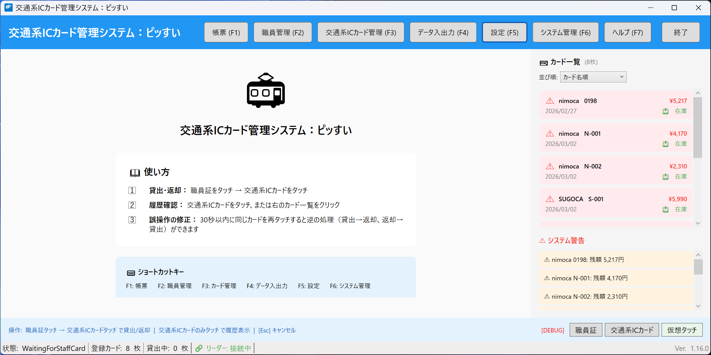
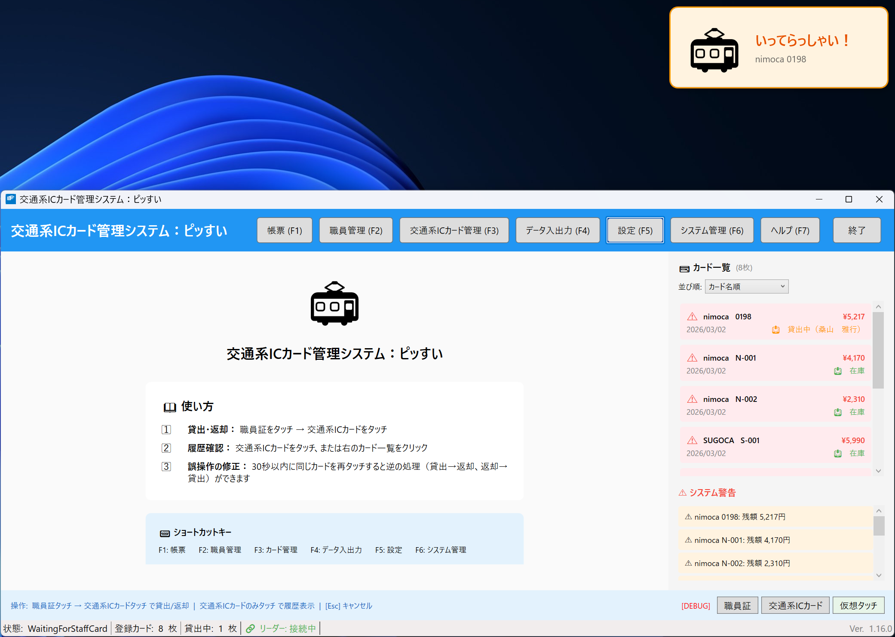
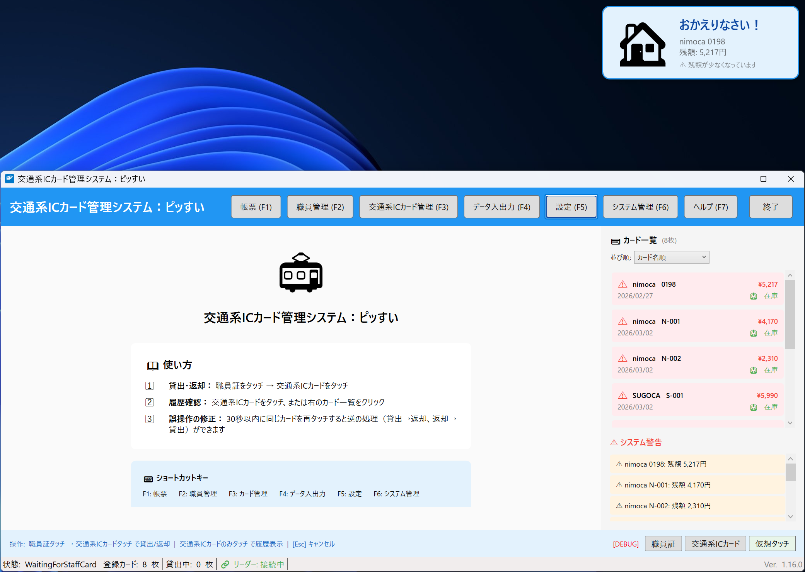
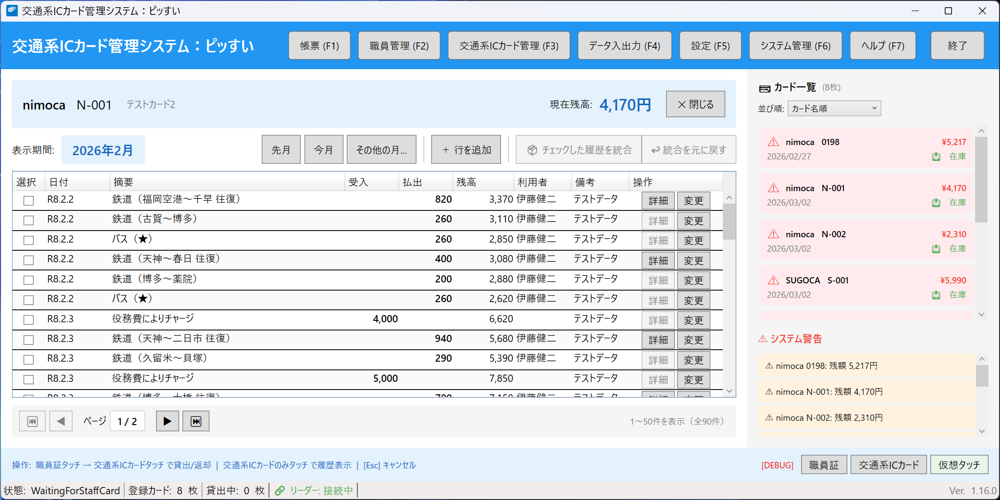

# 交通系ICカード管理システム ユーザーマニュアル

**バージョン**: 1.3
**最終更新日**: 2026年2月

---

## 目次

1. [はじめに](#1-はじめに)
2. [システムの起動と終了](#2-システムの起動と終了)
3. [メイン画面の説明](#3-メイン画面の説明)
4. [交通系ICカードの貸出・返却](#4-交通系icカードの貸出返却)
5. [履歴の確認](#5-履歴の確認)
6. [帳票の出力](#6-帳票の出力)
7. [設定の変更](#7-設定の変更)
8. [よくある質問（FAQ）](#8-よくある質問faq)
9. [トラブルシューティング](#9-トラブルシューティング)

---

## 1. はじめに

### 1.1 このシステムについて

交通系ICカード管理システムは、複数の交通系ICカード（はやかけん、nimoca、SUGOCA等）を職員間で共有利用する際の出納記録を管理するシステムです。

### 1.2 主な機能

| 機能 | 説明 |
|------|------|
| 貸出・返却管理 | 職員証と交通系ICカードをタッチするだけで貸出・返却を記録 |
| 利用履歴照会 | 過去の利用記録を検索・閲覧 |
| 帳票出力 | 月次の物品出納簿をExcel形式で出力 |
| 30秒ルール | 誤操作時に30秒以内の再タッチで取消可能 |

### 1.3 必要な機器

- Windows パソコン
- ICカードリーダー（Sony PaSoRi）
- 職員証（FeliCa対応）
- 管理対象の交通系ICカード

---

## 2. システムの起動と終了

### 2.1 システムの起動

デフォルトインストールの場合、ユーザーがWindowsにログインした際にシステムが自動で起動するため、改めて起動する必要はありません。

手動で起動する場合は、以下のいずれかの方法があります。

1. デスクトップの「交通系ICカード管理システム」アイコンをダブルクリックします
2. またはスタートメニューから「交通系ICカード管理システム」を選択します

### 2.2 システムの終了

1. 画面右上の「×」ボタンをクリックします
2. またはヘッダーの「終了」ボタンをクリックします

> **注意**: 貸出中のカードがある場合でも、システムを終了できます。貸出状態は保持されます。

---

## 3. メイン画面の説明

### 3.1 画面構成

メイン画面は以下の要素で構成されています。



**画面の構成要素：**

| エリア | 説明 |
|--------|------|
| ヘッダーバー | 機能ボタン（F1～F7）と終了ボタン |
| メインエリア（左側） | 操作ガイドまたは選択したカードの履歴を表示 |
| カード一覧（右側） | 登録カードの残高・貸出状態を一覧表示 |
| システム警告（右側下部） | 残額不足やカードリーダーの異常など、対処が必要な警告を表示 |
| 操作ヒントバー | 基本操作の説明を常時表示 |
| ステータスバー | 状態、登録カード数、貸出中数、カードリーダー接続状態 |

**ヘッダーバーの機能ボタン：**

| ボタン | 機能 |
|--------|------|
| 帳票（F1） | 物品出納簿の出力 |
| 職員管理（F2） | 職員の登録・編集・削除 |
| 交通系ICカード管理（F3） | 交通系ICカードの登録・編集・削除 |
| データ入出力（F4） | データのエクスポート・インポート |
| 設定（F5） | システム設定の変更 |
| システム管理（F6） | バックアップ・リストア・操作ログ |
| ヘルプ（F7） | ユーザーマニュアル等のドキュメントフォルダを開く |
| 終了 | システムを終了 |

### 3.2 状態表示の色と音

システムは状態に応じて色と音で通知します。

| 状態 | 背景色 | 音 | 説明 |
|------|--------|-----|------|
| 待機中 | 白 | なし | 職員証のタッチを待っています |
| 貸出完了 | オレンジ | ピッ | 交通系ICカードを貸し出しました |
| 返却完了 | 水色 | ピピッ | 交通系ICカードが返却されました |
| エラー | 赤 | ピー | エラーが発生しました |

### 3.3 カード一覧の見方

画面右側のカード一覧には、登録されている交通系ICカードが表示されます。

**表示される情報：**

| 項目 | 説明 |
|------|------|
| カード種別・番号 | カードの種類（nimoca等）と管理番号 |
| 残高 | カードの現在残高（警告閾値以下の場合は赤色で表示） |
| 最終利用日 | 最後に利用した日付 |
| 貸出状態 | 「利用可」（緑）または「貸出中」（オレンジ） |

**状態の色分け：**

| 状態 | 色 | 説明 |
|------|-----|------|
| 利用可 | 緑 | カードは返却済みで、貸出可能です |
| 貸出中 | オレンジ | 現在誰かに貸し出されています |
| 残高警告 | 赤背景 | 残高が警告閾値を下回っています |

> **ヒント**: カードをクリックすると、そのカードの利用履歴が左側のメインエリアに表示されます。

### 3.4 システム警告の見方

カード一覧の下に「⚠ システム警告」エリアが表示されることがあります。このエリアには、対処が必要な警告がリアルタイムで表示されます。

> **注意**: 警告がない場合、このエリアは表示されません。

**表示される警告の種類：**

| 警告 | 表示例 | 意味・対処 |
|------|--------|------------|
| 残額不足 | ⚠️ nimoca 5043: 残額 500円 | カード残高が警告閾値（設定画面で変更可能）を下回っています。チャージを検討してください |
| バス停名未入力 | ⚠️ バス停名が未入力の履歴が3件あります | 返却時にスキップされたバス停名があります。履歴画面から入力してください |
| カードリーダー切断 | ⚠️ カードリーダーが切断されています | カードリーダーのUSB接続を確認してください |
| カードリーダー再接続中 | 🔄 カードリーダーに再接続中... (1/10) | 自動的に再接続を試みています。しばらくお待ちください |
| カードリーダーエラー | ⚠️ カードリーダーエラー: （詳細） | カードリーダーで問題が発生しました。抜き差しや再起動をお試しください |

> **ヒント**: カードリーダーの再接続に成功すると「✅ カードリーダーに再接続しました」と一時的に表示され、数秒後に自動的に消えます。

---

## 4. 交通系ICカードの貸出・返却

### 4.1 基本的な操作手順

貸出・返却は以下の2ステップで行います。

```
ステップ1: 職員証をタッチ → ステップ2: 交通系ICカードをタッチ
```

### 4.2 カードを借りるとき（貸出）

1. **職員証をICカードリーダーにタッチします**
   - 「○○さん、交通系ICカードをタッチしてください」と表示されます

2. **借りたい交通系ICカードをタッチします**
   - オレンジ色のポップアップが表示され「ピッ」と音が鳴ります
   - 「貸出完了」と表示されます



> **ポイント**: 貸出完了時は、オレンジ色のポップアップと「いってらっしゃい！」のメッセージが表示されます。ポップアップの表示位置は設定画面で変更できます（右上/左上/右下/左下）。

### 4.3 カードを返すとき（返却）

1. **職員証をICカードリーダーにタッチします**
   - 「○○さん、交通系ICカードをタッチしてください」と表示されます

2. **返却する交通系ICカードをタッチします**
   - 水色のポップアップが表示され「ピピッ」と音が鳴ります
   - 「返却完了」と表示され、利用履歴が記録されます



> **ポイント**: 返却完了時は、水色のポップアップと「おかえりなさい！」のメッセージが表示されます。ポップアップの表示位置は設定画面で変更できます（右上/左上/右下/左下）。

3. **バス利用がある場合はバス停名を入力します**
   - バス利用が検出されると、バス停名入力ダイアログが表示されます
   - 乗車したバス停と降車したバス停を入力してください
   - 入力欄にはオートコンプリート機能があり、過去に入力したバス停名が候補として表示されます
   - 「スキップ」をクリックすると、バス停名を「★」として記録します（後から履歴画面で編集可能）

### 4.4 30秒ルール（誤操作の訂正）

操作を間違えた場合、**30秒以内に同じカードを再度タッチ**すると、直前に実行されなかった方の操作（貸出または返却）を実行したうえで、改めて次の操作を行います。

| 直前の操作 | 再タッチで起きること |
|------------|----------------------|
| 貸出 | → 返却処理を実行（貸出を訂正） |
| 返却 | → 再貸出処理を実行（返却を訂正） |

**よくある誤操作の例：**

| 状況 | 起きること | 30秒ルールでの対処 |
|------|------------|-------------------|
| 貸出時にカードをタッチできていなかった | 返却時に「貸出完了」と認識される | 30秒以内に再タッチ→返却に訂正 |
| 前の人が返却時にタッチできていなかった | 貸出時に「返却完了」と認識される | 30秒以内に再タッチ→貸出に訂正 |

> **注意**: 「前の人が返却時にタッチできていなかった」場合、30秒ルールで訂正すると返却者が現在タッチした職員として記録されます。正しい返却者に修正する必要がある場合は、後日、履歴画面から該当の記録を編集してください。

> **ヒント**: 操作結果（貸出/返却）は、ポップアップの色で確認できます。オレンジ＝貸出、水色＝返却です。意図と異なる場合は、30秒以内に同じカードを再タッチしてください。

### 4.5 タイムアウト

職員証をタッチした後、**60秒以内**に交通系ICカードをタッチしないと、自動的に待機状態に戻ります。

---

## 5. 履歴の確認

### 5.1 履歴を表示する

カードの利用履歴を確認するには、以下のいずれかの方法があります。

**方法1: カード一覧からクリック**
1. 画面右側のカード一覧から、確認したいカードをクリックします
2. 画面左側に選択したカードの履歴が表示されます

**方法2: 交通系ICカードをタッチ**
1. 職員証をタッチせずに、交通系ICカードだけをリーダーにタッチします
2. 画面左側にそのカードの履歴が表示されます

> **注意**: 貸出処理・返却処理の直後（30秒以内）にカードをタッチすると、30秒ルール（→「4.4 30秒ルール」参照）により意図しない貸出・返却処理が行われる場合があります。履歴を確認する場合は、30秒以上経過してからタッチするか、方法1（カード一覧からクリック）をご利用ください。



### 5.2 表示期間の変更

履歴画面では、表示する期間を変更できます。

| ボタン | 説明 |
|--------|------|
| 先月 | 前月の履歴を表示 |
| 今月 | 当月の履歴を表示 |
| その他の月... | 任意の年月を選択して表示 |

### 5.3 履歴の見方

| 列名 | 説明 |
|------|------|
| 日付 | 利用日（和暦表示） |
| 摘要 | 利用内容（鉄道区間、バス、チャージ等） |
| 受入 | チャージ等で増加した金額 |
| 払出 | 利用等で減少した金額 |
| 残高 | 利用後のカード残高 |
| 利用者 | カードを利用した職員名 |
| 備考 | 補足情報（バス停名、現金支払い等） |

> **ヒント**: 「貸出中」と表示されている行は、まだ返却されていない貸出記録です。オレンジ色の背景で区別されます。

#### 摘要欄の自動統合について

交通系ICカードから読み取った乗車履歴は、同日の利用について自動的に統合され、摘要欄にまとめて表示されます。

**乗り継ぎの自動統合**

同日に連続する乗車記録で、前の降車駅と次の乗車駅が一致する場合、1つの区間として統合されます。

| カード内の乗車記録 | 摘要欄の表示 |
|------|------|
| A駅→B駅、B駅→C駅 | 鉄道（A駅～C駅） |
| A駅→B駅、B駅→C駅、C駅→D駅 | 鉄道（A駅～D駅） |

**往復の自動検出**

同日に同じ区間を往復した場合、自動的に「往復」として表示されます。

| カード内の乗車記録 | 摘要欄の表示 |
|------|------|
| A駅→B駅、B駅→A駅 | 鉄道（A駅～B駅 往復） |

**乗り継ぎ駅の自動認識**

以下の駅は、異なる鉄道会社の同一乗り継ぎ駅として自動的に認識されます。乗り継ぎ統合や往復検出の際に同一駅として扱われます。

| 駅名の組み合わせ |
|------|
| 天神 ＝ 福岡（天神） |
| 千早 ＝ 西鉄千早 |

例えば、「天神→博多」と「福岡（天神）→博多」は同じ乗車駅として扱われます。

**複数区間の表示**

乗り継ぎや往復に該当しない複数の乗車がある場合は、読点（、）で区切って表示されます。

| カード内の乗車記録 | 摘要欄の表示 |
|------|------|
| A駅→B駅、C駅→D駅 | 鉄道（A駅～B駅、C駅～D駅） |

**バスとの混在**

鉄道とバスの利用が同日にある場合は、それぞれ別に表示されます。

| カード内の利用記録 | 摘要欄の表示 |
|------|------|
| A駅→B駅（鉄道）＋バス利用 | 鉄道（A駅～B駅）、バス（★） |

> **ヒント**: バス利用の「★」は、バス停名が未入力であることを示します。バス停名は返却時のダイアログや、履歴の編集画面から入力できます。

> **ヒント**: 自動統合の結果が実際の乗り継ぎと異なる場合は、「5.4 乗車履歴の統合・分割」の機能を使って手動で修正できます。

### 5.4 乗車履歴の統合・分割（乗り継ぎの編集）

乗車履歴の統合・分割には、以下の2種類があります。

| 種類 | 操作場所 | 用途 |
|------|----------|------|
| **詳細画面での統合・分割** | 利用履歴詳細ダイアログ | 1つの履歴行の中で、乗車記録のグループ分けを編集する（乗り継ぎの認識を修正） |
| **履歴一覧での統合** | 履歴一覧画面 | 複数の履歴行を1つの行にまとめる（別々に記録された同日の利用をまとめる等） |

#### 種類1: 詳細画面での統合・分割

1つの履歴行に含まれる複数の乗車記録を、乗り継ぎ（1つの行程）としてまとめたり、逆に分割したりできます。

##### 詳細画面を開く

1. 履歴一覧で、編集したい行をダブルクリックします
2. 利用履歴詳細ダイアログが表示されます

##### 画面の見方

| 要素 | 説明 |
|------|------|
| グループ列 | アルファベット（A, B, C...）でグループを表示。同じ文字は同じ乗り継ぎです |
| 背景色 | グループごとに異なる色（青・緑・オレンジ・紫・赤）で表示されます |
| 太い線 | グループの境界を示します（クリックで削除可能） |
| 「-」 | グループに属していない行（自動検出モード） |

> **アクセシビリティ**: 色だけでなくアルファベット（A, B, C...）でもグループを区別できます。

##### 分割線の操作方法

行と行の間にマウスを合わせると、クリック可能な領域が表示されます。

**分割線を挿入（グループを分割）**:
1. 分割したい位置（行と行の間）にマウスを合わせます
2. 「クリックして分割」と表示されたらクリックします
3. 太い分割線が挿入され、グループが分かれます

**分割線を削除（グループを統合）**:
1. 削除したい分割線（太い線）をクリックします
2. 分割線が消え、上下の行が同じグループになります

**例**:
- 統合前: 「博多駅→天神駅」｜「天神駅→薬院駅」（分割線あり）
- 統合後: 「博多駅～薬院駅」（分割線を削除すると1つの乗り継ぎに）

##### ツールバーボタン

| ボタン | 説明 |
|--------|------|
| すべて統合 | すべての分割線を削除し、全体を1つのグループにします |
| すべて分割 | すべての行の間に分割線を挿入し、個別にします |
| 自動検出に戻す | すべての分割線を削除し、自動検出モードに戻します |

##### キーボードショートカット

| 操作 | ショートカット |
|------|----------------|
| 保存 | Ctrl + S |

#### 種類2: 履歴一覧での統合

履歴一覧画面で、複数の履歴行を1つの行にまとめることができます。例えば、同じ日の利用が別々の行として記録されている場合に使います。

##### 統合の手順

1. 履歴一覧で、統合したい行のチェックボックスにチェックを入れます（2行以上）
2. 「統合」ボタンをクリックします
3. 確認ダイアログが表示されるので、内容を確認して「OK」をクリックします
4. 選択した行が1つの行にまとめられます

> **注意**: 統合できるのは隣接する（連続した）行のみです。離れた行を統合することはできません。

##### 統合を元に戻す

統合した履歴は「統合を元に戻す」ボタンで元の状態に戻せます。

---

## 6. 帳票の出力

### 6.1 帳票出力画面を開く

1. メイン画面の「帳票 (F1)」ボタンをクリックします
2. またはキーボードの **F1** キーを押します

### 6.2 物品出納簿の出力

1. **対象月を選択**
   - 「先月」または「今月」ボタンをクリックするか、年と月のドロップダウンから選択します
   - よく使う「先月」「今月」はワンクリックで選択できます

2. **対象カードを選択**
   - 出力する交通系ICカードにチェックを入れます
   - 「すべて選択」で全カードを選択できます

3. **作成ボタンをクリック**
   - 出力先フォルダを確認します（変更する場合は「参照」ボタンで指定）
   - 「作成」ボタンをクリックします

4. **出力完了**
   - Excel形式（.xlsx）でファイルが保存されます
   - 作成されたファイルの一覧が表示されます
   - ファイル名をクリックすると直接開けます

### 6.3 印刷プレビュー

1. 「プレビュー」ボタンをクリックします
2. 印刷イメージが表示されます
3. 用紙の向き（縦/横）を変更できます
4. 「印刷」ボタンで直接印刷できます

---

## 7. 設定の変更

### 7.1 設定画面を開く

1. メイン画面の「設定 (F5)」ボタンをクリックします
2. またはキーボードの **F5** キーを押します

### 7.2 変更できる設定

#### 文字サイズ

| 設定値 | 説明 |
|--------|------|
| 小 | 標準より小さい文字 |
| 中 | 標準サイズ（デフォルト） |
| 大 | 標準より大きい文字 |
| 特大 | 最も大きい文字 |

#### 残額警告

残額が設定値を下回ると警告が表示されます。

- デフォルト: 10,000円
- 設定範囲: 0円～20,000円

#### 音声設定

貸出・返却時に再生される音声を設定できます。

| 設定値 | 説明 |
|--------|------|
| 効果音（ピッ/ピピッ） | 貸出時に「ピッ」、返却時に「ピピッ」（デフォルト） |
| 音声（男性） | 貸出時に「いってらっしゃい」、返却時に「おかえりなさい」 |
| 音声（女性） | 貸出時に「いってらっしゃい」、返却時に「おかえりなさい」 |
| 無し | 音声を再生しない |

#### トースト通知の表示位置

貸出・返却時に表示される通知（「いってらっしゃい！」「おかえりなさい！」）の表示位置を設定できます。

| 設定値 | 説明 |
|--------|------|
| 右上 | 画面右上に表示（デフォルト） |
| 左上 | 画面左上に表示 |
| 右下 | 画面右下に表示 |
| 左下 | 画面左下に表示 |

#### バックアップ先フォルダ

データベースのバックアップ先フォルダを指定できます。「参照...」ボタンからフォルダを選択してください。

- 空欄の場合、アプリケーションフォルダにバックアップされます

---

## 8. よくある質問（FAQ）

### Q1. 職員証を忘れた場合はどうすればいいですか？

A. 利用者の変更は後日可能ですので、お近くの職員にタッチしてもらってください。

### Q2. 同じカードを複数人で同時に使えますか？

A. いいえ、1枚のカードは1人にのみ貸し出せます。前の利用者が返却してから借りてください。

### Q3. 返却を忘れて帰宅してしまいました

A. 翌日以降に返却してください。履歴には実際の返却日時が記録されます。

### Q4. バスで利用した場合はどう記録されますか？

A. 乗車駅・降車駅が空欄の利用は「バス利用」として自動判定されます。返却時にバス停名入力ダイアログが表示されるので、乗車バス停と降車バス停を入力してください。入力をスキップした場合は「★」マークで記録され、後から履歴画面で編集できます。

### Q5. 履歴が表示されません

A. 交通系ICカードの履歴は最大20件までしか保持されません。古い履歴は新しい利用により上書きされます。また、カードをリーダーにタッチして返却処理を行わないと履歴は取得されません。

---

## 9. トラブルシューティング

### 9.1 ICカードリーダーが認識されない

1. USBケーブルが正しく接続されているか確認
2. カードリーダーのランプが点灯しているか確認
3. 他のアプリ（FeliCaポートソフトウェア等）を終了
4. パソコンを再起動

### 9.2 カードをタッチしても反応しない

1. カードをリーダーの中央に置く
2. カードを数秒間動かさずに保持
3. カードとリーダーの間に物を挟まない
4. 複数のカードを同時にタッチしない

### 9.3 「エラー」と表示される

| エラーメッセージ | 対処法 |
|------------------|--------|
| 「未登録のカードです」 | 管理者にカードの登録を依頼してください |
| 「未登録の職員証です」 | 管理者に職員証の登録を依頼してください |
| 「カードリーダーが見つかりません」 | カードリーダーの接続を確認してください |

### 9.4 アプリケーションが起動しない

1. `Resources` フォルダが存在するか確認
2. アンチウイルスソフトの除外設定に追加
3. 右クリック → 「管理者として実行」を試行
4. システム管理者にお問い合わせください

### 9.5 帳票出力でエラーが発生する

1. 出力先フォルダに書き込み権限があるか確認
2. 同名のファイルが開いていないか確認
3. ディスクの空き容量を確認

---

## お問い合わせ

システムに関するお問い合わせは、システム管理者までご連絡ください。

---

*本マニュアルは予告なく変更される場合があります。*
