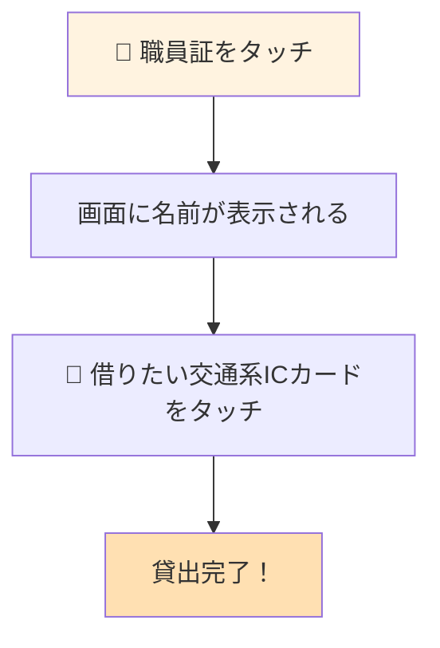
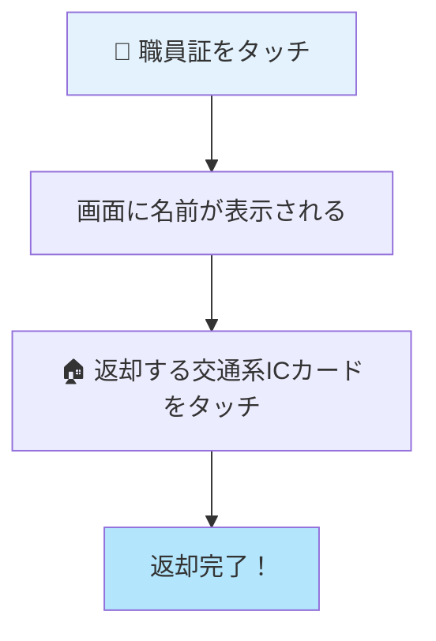
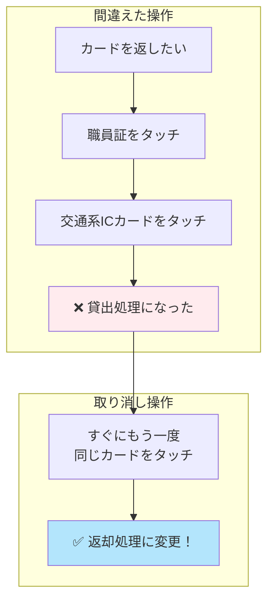
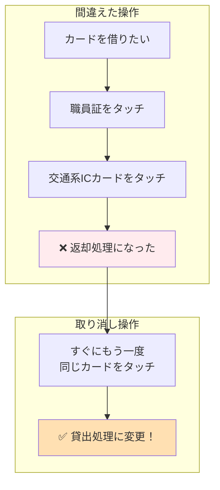

# 交通系ICカード管理システム：ピッすい 操作ガイド（概要版）

---

## 交通系ICカードの貸出・返却操作

<table style="width: 100%; border-collapse: collapse;">
<tr>
<td style="width: 50%; vertical-align: top; padding: 20px; border-right: 2px solid #ccc;">

### カードを借りるとき

#### 操作手順

**ステップ1**
職員証をICカードリーダーにタッチします。

> 画面に「○○さん、交通系ICカードをタッチしてください」と表示されます。

**ステップ2**
借りたい交通系ICカードをタッチします。

> 画面がオレンジ色になり「ピッ」と音が鳴ります。

#### 完了の確認

| 確認項目 | 状態 |
|----------|------|
| 画面の色 | オレンジ色 |
| 音 | ピッ |
| メッセージ | 「貸出完了」 |

</td>
<td style="width: 50%; vertical-align: top; padding: 20px;">

### カードを返すとき

#### 操作手順

**ステップ1**
職員証をICカードリーダーにタッチします。

> 画面に「○○さん、交通系ICカードをタッチしてください」と表示されます。

**ステップ2**
返却する交通系ICカードをタッチします。

> 画面が水色になり「ピピッ」と音が鳴ります。

#### 完了の確認

| 確認項目 | 状態 |
|----------|------|
| 画面の色 | 水色 |
| 音 | ピピッ |
| メッセージ | 「返却完了」 |

> **バス利用時**: バス利用があると、バス停名入力ダイアログが表示されます。乗車・降車バス停を入力してください。

</td>
</tr>
</table>

---

## 操作を間違えたときの対処法

<table style="width: 100%; border-collapse: collapse;">
<tr>
<td style="width: 50%; vertical-align: top; padding: 20px; border-right: 2px solid #ccc;">

### 返却処理を忘れていて貸出処理をした場合

カードを返すつもりで操作したのに、返却処理をしていなかったため貸出処理になってしまった場合

#### 対処手順

1. **すぐに**同じ交通系ICカードをもう一度タッチします
2. 画面が水色に変わり「返却完了」と表示されます
3. 正しく返却処理が完了しました

> **重要**: 交通系ICカードをタッチしてから**30秒以内**に再タッチしてください。

#### 確認ポイント

| 項目 | 変更前 | 変更後 |
|------|--------|--------|
| 画面の色 | オレンジ | 水色 |
| 処理内容 | 貸出 | 返却 |
| メッセージ | 貸出完了 | 返却完了 |

</td>
<td style="width: 50%; vertical-align: top; padding: 20px;">

### 貸出処理を忘れていて返却処理をした場合

カードを借りるつもりで操作したのに、貸出処理をしていなかったため返却処理になってしまった場合

#### 対処手順

1. **すぐに**同じ交通系ICカードをもう一度タッチします
2. 画面がオレンジ色に変わり「貸出完了」と表示されます
3. 正しく貸出処理が完了しました

> **重要**: 交通系ICカードをタッチしてから**30秒以内**に再タッチしてください。

#### 確認ポイント

| 項目 | 変更前 | 変更後 |
|------|--------|--------|
| 画面の色 | 水色 | オレンジ |
| 処理内容 | 返却 | 貸出 |
| メッセージ | 返却完了 | 貸出完了 |

</td>
</tr>
</table>

---

**お問い合わせ**: 詳しい操作方法は「ユーザーマニュアル」をご覧ください。
