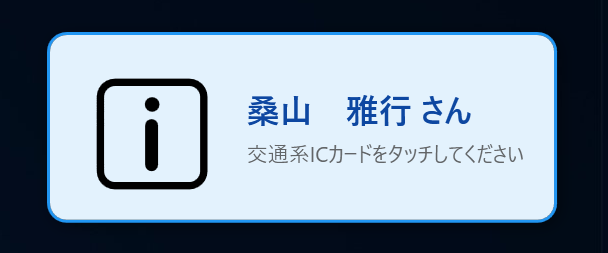
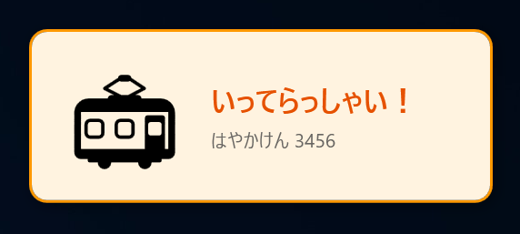
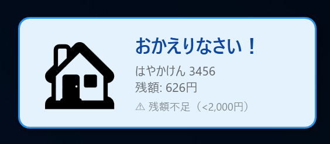

# カードを借りるとき

```{=openxml}
<w:p><w:pPr><w:spacing w:after="120"/></w:pPr></w:p>
```

### ステップ1　職員証をタッチ

職員証をICカードリーダーにタッチすると、画面に名前が表示されます。

| 動作 | 画面表示 |
|:---:|:---:|
| {width=5cm} | {width=6cm} |

```{=openxml}
<w:p><w:pPr><w:spacing w:after="360"/></w:pPr></w:p>
```

### ステップ2　交通系ICカードをタッチ

借りたい交通系ICカードをタッチすると、画面がオレンジ色になり「ピッ」と音が鳴れば完了です。

| 動作 | 画面表示 |
|:---:|:---:|
| {width=5cm} | {width=6cm} |

```{=openxml}
<w:p><w:r><w:br w:type="page"/></w:r></w:p>
```

# カードを返すとき

```{=openxml}
<w:p><w:pPr><w:spacing w:after="120"/></w:pPr></w:p>
```

### ステップ1　職員証をタッチ

職員証をICカードリーダーにタッチすると、画面に名前が表示されます。

| 動作 | 画面表示 |
|:---:|:---:|
| {width=5cm} | {width=6cm} |

```{=openxml}
<w:p><w:pPr><w:spacing w:after="360"/></w:pPr></w:p>
```

### ステップ2　交通系ICカードをタッチ

返却する交通系ICカードをタッチすると、画面が水色になり「ピピッ」と音が鳴れば完了です。

| 動作 | 画面表示 |
|:---:|:---:|
| {width=5cm} | {width=6cm} |

> **バス利用時**: バス利用があると、バス停名入力ダイアログが表示されます。乗車・降車バス停を入力してください。
