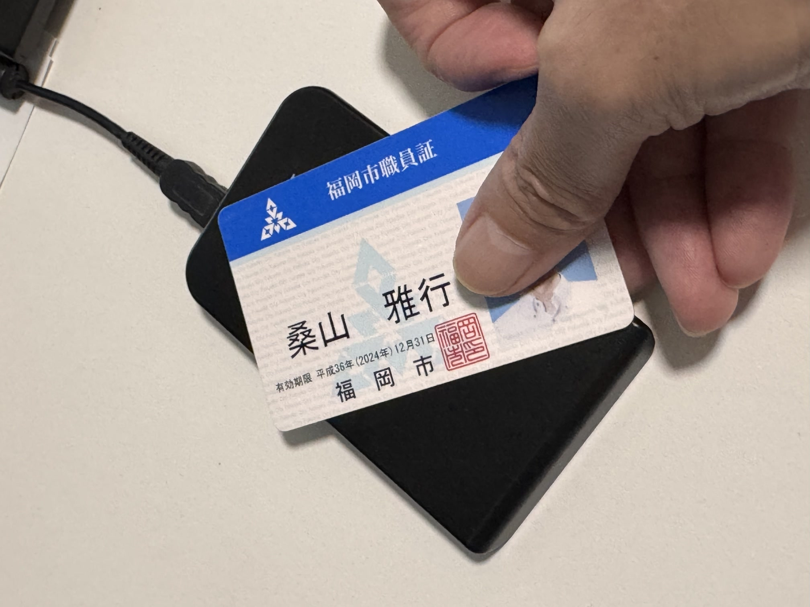
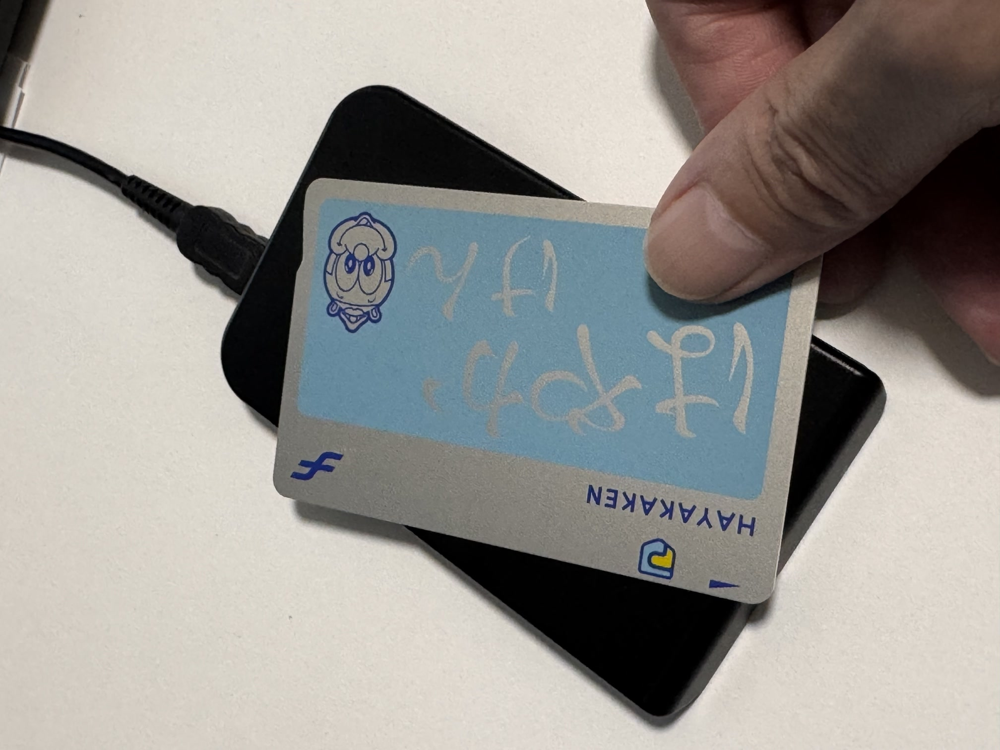

# 交通系ICカード管理システム：ピッすい 操作ガイド（概要版）

**バージョン**: 2.9.0
**最終更新日**: 2026年5月

---

## カードを借りるとき

### ステップ1　職員証をタッチ

職員証をICカードリーダーにタッチします。

> 画面に「○○さん、交通系ICカードをタッチしてください」と表示されます。

### ステップ2　交通系ICカードをタッチ

借りたい交通系ICカードをタッチします。

> 画面がオレンジ色になり「ピッ」と音が鳴ります。

### 完了の確認

| 確認項目 | 状態 |
|----------|------|
| 画面の色 | オレンジ色 |
| 音 | ピッ |
| メッセージ | 「貸出完了」 |

## カードを返すとき

### ステップ1　職員証をタッチ

職員証をICカードリーダーにタッチします。

> 画面に「○○さん、交通系ICカードをタッチしてください」と表示されます。

### ステップ2　交通系ICカードをタッチ

返却する交通系ICカードをタッチします。

> 画面が水色になり「ピピッ」と音が鳴ります。

### 完了の確認

| 確認項目 | 状態 |
|----------|------|
| 画面の色 | 水色 |
| 音 | ピピッ |
| メッセージ | 「返却完了」 |

> **バス利用時**: バス利用があると、バス停名入力ダイアログが表示されます。乗車・降車バス停を入力してください。

---

**お問い合わせ**: 詳しい操作方法は「ユーザーマニュアル」をご覧ください。
