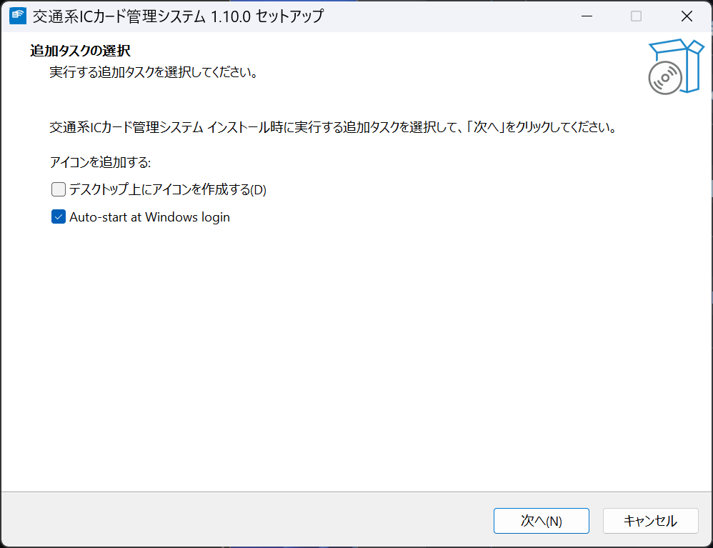
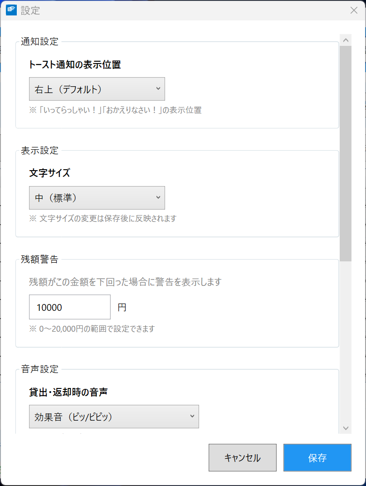
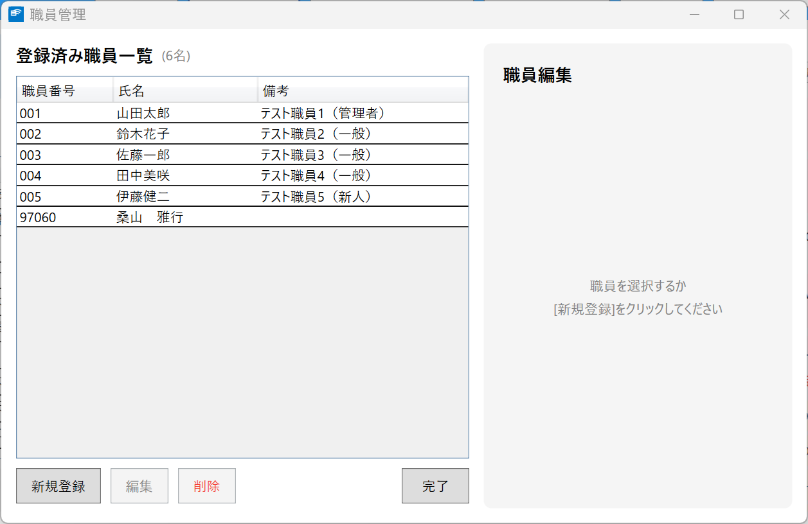
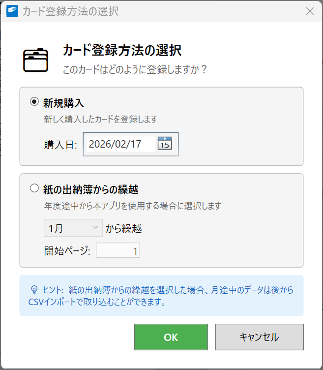
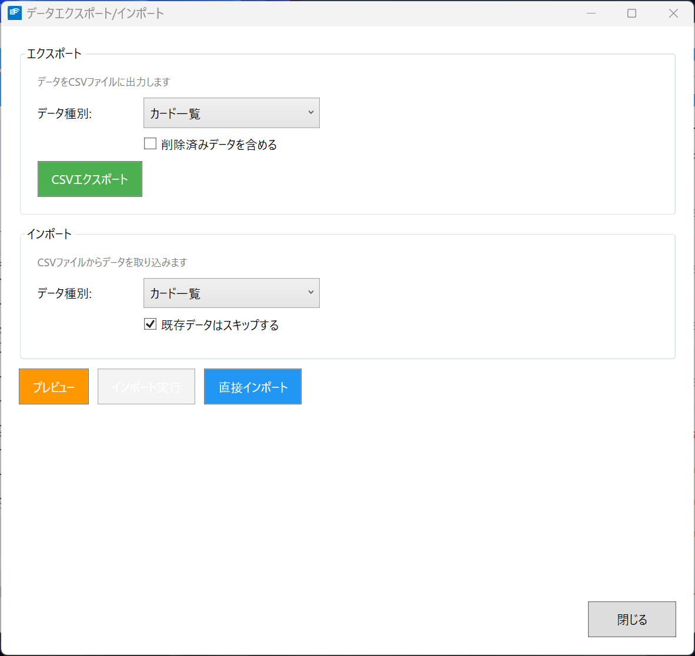
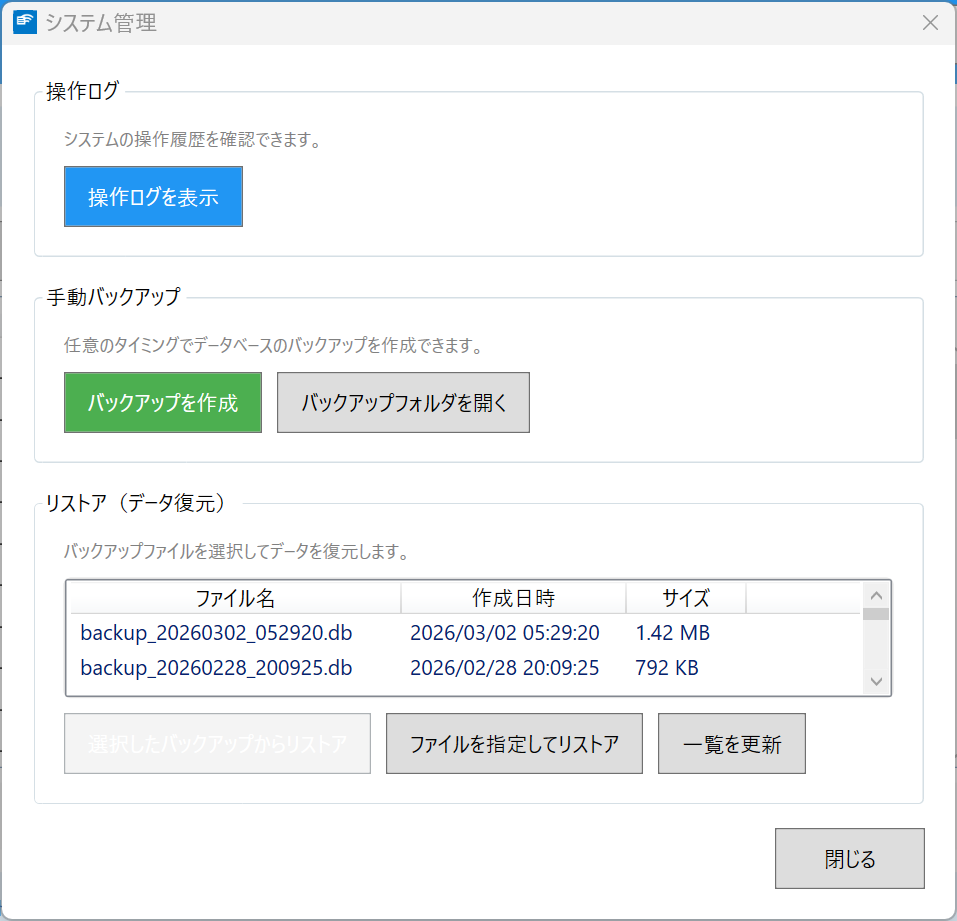
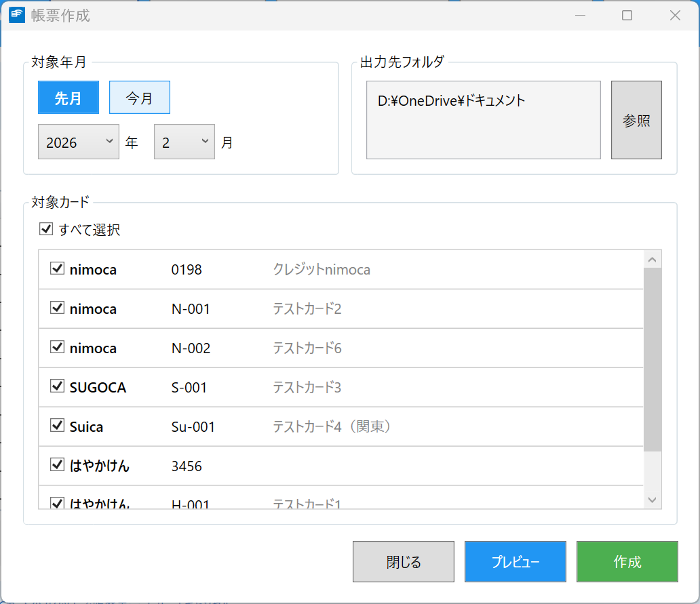

# 交通系ICカード管理システム 管理者マニュアル

**バージョン**: 1.10.0
**最終更新日**: 2026年2月

---

## 目次

1. [はじめに](#1-はじめに)
2. [システムのインストール](#2-システムのインストール)
3. [初期設定](#3-初期設定)
4. [職員管理](#4-職員管理)
5. [交通系ICカード管理](#5-交通系icカード管理)
6. [データ管理](#6-データ管理)
7. [システム設定](#7-システム設定)
8. [セキュリティ](#8-セキュリティ)
9. [メンテナンス](#9-メンテナンス)
10. [トラブルシューティング](#10-トラブルシューティング)

---

## 1. はじめに

### 1.1 本マニュアルについて

本マニュアルは、交通系ICカード管理システムの管理者向けドキュメントです。システムのインストール、初期設定、職員・交通系ICカードの管理、データ管理などの管理業務について説明します。

### 1.2 管理者の役割

管理者は以下の業務を担当します。

| 業務 | 説明 |
|------|------|
| システム管理 | インストール、設定、バックアップ |
| 職員管理 | 職員の登録・編集・削除 |
| カード管理 | 交通系ICカードの登録・編集・削除 |
| データ管理 | バックアップ、エクスポート、古いデータの削除 |

### 1.3 システム要件

| 項目 | 要件 |
|------|------|
| OS | Windows 10/11 (64-bit) |
| CPU | x64プロセッサ |
| メモリ | 4GB以上 |
| ストレージ | 100MB以上の空き容量 |
| ICカードリーダー | Sony PaSoRi (RC-S380等) |
| ネットワーク | 不要（スタンドアロン動作） |

---

## 2. システムのインストール

### 2.1 インストーラーを使用する場合

1. `ICCardManager_Setup_x.x.x.exe` を実行します
2. インストールウィザードの指示に従います
3. インストール先を指定します（デフォルト: `C:\Program Files\ICCardManager`）
4. インストールオプションを選択します（下記参照）

   

5. 「インストール」をクリックします

#### インストールオプション

| オプション | 説明 | デフォルト |
|------------|------|------------|
| デスクトップにアイコンを作成 | デスクトップにショートカットを作成します | オフ |
| **Windowsログイン時に自動起動する（常駐）** | Windowsにログインすると自動的にアプリケーションが起動します | **オン** |

> **注意**: 常駐オプションをオンにすると、PCを起動してユーザーがログインした際に自動的にアプリケーションが起動します。常時交通系ICカードの読み取りを行う運用に適しています。手動で起動したい場合はオフにしてください。

### 2.2 PaSoRiドライバのインストール

1. [ソニー公式サイト](https://www.sony.co.jp/Products/felica/consumer/support/download/)からドライバをダウンロード
2. ダウンロードしたインストーラーを実行
3. パソコンを再起動

### 2.3 初回起動

1. `ICCardManager.exe` を実行
2. Windows SmartScreen警告が表示された場合は「詳細情報」→「実行」をクリック
3. データベースファイル `iccard.db` が自動作成されます

---

## 3. 初期設定

### 3.1 設定画面を開く

1. メイン画面の「設定」ボタン（F5）をクリック
2. 設定ダイアログが開きます

### 3.2 基本設定



| 設定項目 | 説明 | デフォルト値 |
|----------|------|--------------|
| 残額警告 | 警告を表示する残高の閾値（0～20,000円） | 10,000円 |
| 文字サイズ | 画面の文字サイズ | 中 |
| 音声設定 | 操作時の音声（効果音のみ/音声・男性/音声・女性/無し） | 効果音のみ |
| 通知設定 | ポップアップの表示位置（右上/左上/右下/左下） | 右上 |

### 3.3 バックアップ設定

バックアップの保存先を設定できます。

| 設定項目 | 説明 | デフォルト値 |
|----------|------|--------------|
| バックアップ保存先 | バックアップファイルの保存フォルダ | アプリケーションフォルダ |

> **重要**: デフォルトではローカルPC上にバックアップが保存されます。火災や機器故障などの災害に備え、**ファイルサーバなどの外部ストレージ**にバックアップ先を設定することを強く推奨します。

**バックアップの世代管理:**
- システムは起動時に自動でバックアップを作成します
- 古いバックアップは自動的に削除され、最新の数世代のみ保持されます
- 定期的に手動でバックアップを取得し、別の場所に保管することも推奨します

### 3.4 データ保存場所

データベースファイルは以下の場所に保存されます。

```
%PROGRAMDATA%\ICCardManager\iccard.db
```

例: `C:\ProgramData\ICCardManager\iccard.db`

> **補足**: この場所はすべてのユーザーで共有されるため、異なるWindowsユーザーでログインしても同じデータにアクセスできます。

---

## 4. 職員管理

### 4.1 職員管理画面を開く

1. メイン画面の「職員管理」ボタン（F2）をクリック
2. またはキーボードの **F2** キーを押します



### 4.2 職員の登録

1. 「新規登録」ボタンをクリック
2. 職員情報を入力

   | 項目 | 必須 | 説明 |
   |------|------|------|
   | 氏名 | ○ | 職員の氏名 |
   | 職員番号 | - | 職員番号（組織で定められた番号） |
   | 備考 | - | 任意のメモ |

3. 職員証をICカードリーダーにタッチ（自動でIDmが取得されます）
4. 「保存」ボタンをクリック

### 4.3 職員情報の編集

1. 一覧から編集する職員を選択
2. 「編集」ボタンをクリック
3. 情報を修正
4. 「保存」ボタンをクリック

### 4.4 職員の削除

1. 一覧から削除する職員を選択
2. 「削除」ボタンをクリック
3. 確認ダイアログで「はい」をクリック

> **注意**: 削除された職員は論理削除されます。過去の履歴は保持され、履歴照会で氏名が表示されます。

### 4.5 職員証の再登録

職員証を紛失・変更した場合：

1. 該当する職員を選択
2. 「編集」→「職員証を登録」をクリック
3. 新しい職員証をタッチ
4. 「保存」をクリック

---

## 5. 交通系ICカード管理

### 5.1 交通系ICカード管理画面を開く

1. メイン画面の「カード管理」ボタン（F3）をクリック
2. またはキーボードの **F3** キーを押します


### 5.2 交通系ICカードの登録

1. 「新規登録」ボタンをクリック
2. 交通系ICカードをリーダーにタッチ（IDmと残高が自動取得されます）
3. カード情報を入力

   | 項目 | 必須 | 説明 |
   |------|------|------|
   | カード種別 | ○ | ドロップダウンから選択 |
   | 管理番号 | ○ | 例: 001, 002（未入力の場合は自動採番） |
   | 備考 | - | 任意のメモ |

4. 「保存」ボタンをクリック

5. 「カード登録方法の選択」ダイアログが表示されます

   

   以下の2つの登録方法から選択します。

   **(A) 新規購入**

   新しく交通系ICカードを購入した場合に選択します。

   - 初期残高がカードから読み取られ、「新規購入」として記録されます
   - 帳票のページ番号は1ページから始まります
   - 購入日を指定できます（デフォルトは当日。過去の日付も指定可能です）
   - **該当するケース**: 新年度にカードを新たに購入した場合など

   > **ヒント**: 購入日は「新規購入」レコードの日付として記録されます。購入してから数日後に登録する場合は、実際の購入日を指定してください。

   **(B) 紙の出納簿からの繰越**

   既に使用中の交通系ICカードを、紙の出納簿から本アプリに移行する場合に選択します。

   | 設定項目 | 説明 | 例 |
   |----------|------|-----|
   | 繰越月 | 紙の出納簿で最後に管理した月（4月～3月の会計年度順） | 5月（6月から本アプリで管理する場合） |
   | 開始ページ | 紙の物品出納簿で使用していたページ番号の続き | 3（紙の出納簿が2ページまで使用済みの場合） |

   > **ヒント**: 繰越月のデフォルトは前月が選択されています。例えば7月に作業を行う場合は「6月」がデフォルトで選択されます。

   > **参照**: 初期導入時の詳細な手順（CSVインポートを含む）は「[5.6 利用開始時の交通系ICカード登録（初期導入手順）](#56-利用開始時の交通系icカード登録初期導入手順)」を参照してください。

6. 「OK」ボタンをクリック

> **補足**: カード種別はドロップダウンから選択します（はやかけん、nimoca、SUGOCA、Suica、PASMO、ICOCA、PiTaPa、Kitaca、TOICA、manaca、その他）。デフォルトは「nimoca」が選択されていますので、登録するカードに合わせて適切な種別を選択してください。

> **注意**: カードの残高はタッチ時に自動で読み取られます。手動で入力する必要はありません。

### 5.3 交通系ICカード情報の編集

1. 一覧から編集するカードを選択
2. 「編集」ボタンをクリック
3. 情報を修正
4. 「保存」ボタンをクリック

### 5.4 交通系ICカードの削除

1. 一覧から削除するカードを選択
2. 「削除」ボタンをクリック
3. 確認ダイアログで「はい」をクリック

> **注意**: 削除されたカードは論理削除されます。過去の履歴は保持されます。

### 5.5 交通系ICカードの払い戻し

交通系ICカードを払い戻す場合は、以下の手順で操作します。

1. 一覧から払い戻すカードを選択
2. 「払い戻し」ボタンをクリック
3. 確認ダイアログで現在の残高を確認し、「はい」をクリック

> **重要**: 払い戻し処理を行うと、以下の処理が実行されます。
> - 残高が払出金額として記録されます（物品出納簿に反映）
> - カードの残高は0になります
> - カードは論理削除されます（手元にないため）
>
> 払い戻し後もカードの過去の履歴は保持されます。

### 5.6 利用開始時の交通系ICカード登録（初期導入手順）

本アプリを初めて導入する際は、紙で管理していた物品出納簿からの移行作業が必要です。この節では、年度途中からの導入を想定した詳細な手順を説明します。

#### 5.6.1 導入作業の全体像

本アプリの導入時に必要な作業は以下のとおりです。

| 手順 | 作業内容 | 必須 |
|------|----------|------|
| 1 | 職員の登録 | ○ |
| 2 | 交通系ICカードの登録（登録方法の選択） | ○ |
| 3 | 過去履歴のCSVインポート | △（月途中導入時） |
| 4 | 帳票出力の確認 | ○ |

> **重要**: 導入作業は必ず**月初め**、または**月の区切りがよいタイミング**で行うことを推奨します。月途中からの導入は、当月分の履歴を手動で入力する必要があるため、作業量が増えます。

#### 5.6.2 カード登録方法の選択

カード情報を入力して「保存」をクリックすると、「カード登録方法の選択」ダイアログが表示されます。各登録方法の詳細は「[5.2 交通系ICカードの登録](#52-交通系icカードの登録)」を参照してください。

本アプリの初期導入時は、通常 **(B) 紙の出納簿からの繰越** を選択します。

#### 5.6.3 登録手順（紙の出納簿からの繰越の場合）

以下に、年度途中（例: 6月）から本アプリを導入する場合の具体的な手順を示します。

**前提条件:**
- 4月～5月分は紙の物品出納簿で管理済み（2ページ分）
- 6月1日から本アプリで管理を開始する
- カードの現在残高: 5,000円

**手順:**

1. メイン画面の「カード管理」ボタン（F3）をクリック

   

2. 「新規登録」ボタンをクリック

3. 交通系ICカードをリーダーにタッチ
   - カードのIDmと残高（5,000円）が自動的に読み取られます

4. カード情報を入力

   | 項目 | 入力内容 |
   |------|----------|
   | カード種別 | 使用しているカードに合わせて選択（例: nimoca） |
   | 管理番号 | 組織で定めた番号（例: 001）。空欄の場合は自動採番 |
   | 備考 | 必要に応じてメモを記入 |

5. 「保存」ボタンをクリック

6. 「カード登録方法の選択」ダイアログが表示される

   

7. **「紙の出納簿からの繰越」** を選択

8. 繰越月と開始ページを設定

   | 設定項目 | 設定値 | 説明 |
   |----------|--------|------|
   | 繰越月 | 5月 | 5月まで紙で管理し、6月から本アプリで管理するため |
   | 開始ページ | 3 | 紙の出納簿が2ページまで使用済みのため |

9. 「OK」ボタンをクリック

10. カードの残高（5,000円）が「5月から繰越」として記録されます

> **確認ポイント**: メイン画面の履歴一覧に「5月から繰越」の行が表示され、受入金額に5,000円が記録されていることを確認してください。

#### 5.6.4 月途中からの履歴入力（CSVインポート）

月の途中から本アプリを導入する場合は、当月の月初めから導入日までの履歴をCSVファイルでインポートする必要があります。CSVインポート機能の概要については「[6.4 データインポート](#64-データインポート)」も参照してください。

##### CSVファイルの準備

1. メイン画面の「データ入出力」ボタン（F4）をクリック

   

2. まず**CSVテンプレート**を入手します
   - エクスポートセクションで「利用履歴」を選択してエクスポートすると、ヘッダー行を含むCSVファイルが出力されます
   - このファイルをテンプレートとして使用します

3. CSVファイルを以下の形式で作成します

   **CSVファイルのヘッダー行:**
   ```
   ID,日時,カードIDm,管理番号,摘要,受入金額,払出金額,残額,利用者,備考
   ```

   **入力規則:**

   | 列名 | 入力方法 | 備考 |
   |------|----------|------|
   | ID | **空欄** | 新規追加の場合は空欄にします |
   | 日時 | `YYYY-MM-DD HH:MM:SS` | 例: `2024-06-03 09:15:00` |
   | カードIDm | カードのIDm | カード一覧のCSVエクスポートで確認できます。インポート時にカードを指定する場合は空欄でも可 |
   | 管理番号 | カードの管理番号 | 例: `001` |
   | 摘要 | 利用内容 | 例: `鉄道（博多駅～天神駅）` |
   | 受入金額 | チャージ金額 | チャージ時のみ入力（利用時は空欄） |
   | 払出金額 | 利用金額 | 利用時のみ入力（チャージ時は空欄） |
   | 残額 | 利用後の残高 | 前行の残額 + 受入 - 払出 と一致させます |
   | 利用者 | 利用した職員名 | |
   | 備考 | メモ | 必要に応じて記入 |

   **CSVファイルの記入例:**
   ```
   ID,日時,カードIDm,管理番号,摘要,受入金額,払出金額,残額,利用者,備考
   ,2024-06-03 09:15:00,0102030405060708,001,鉄道（博多駅～天神駅）,,220,4780,山田太郎,
   ,2024-06-03 17:30:00,0102030405060708,001,鉄道（天神駅～博多駅）,,220,4560,山田太郎,
   ,2024-06-05 10:00:00,0102030405060708,001,役務費によりチャージ,5000,,9560,,
   ,2024-06-07 08:45:00,0102030405060708,001,鉄道（博多駅～福岡空港駅）,,260,9300,鈴木花子,
   ```

> **注意**: 残額は必ず前の行の残額と整合性を持たせてください。繰越記録の残額からの連続になるようにします。上の例では、繰越残額5,000円から最初の220円利用で4,780円となっています。

##### CSVインポートの実行

1. 「データエクスポート/インポート」画面のインポートセクションで操作します

2. データ種別で **「利用履歴」** を選択

3. 「インポート先カード」セクションが表示されます

   | 方法 | 説明 |
   |------|------|
   | 登録済みカード一覧から選択 | ドロップダウンからカードを選択します（推奨） |
   | カードをタッチして指定 | ICカードリーダーにカードをタッチして指定します |

   > **補足**: CSVファイルにカードIDm列が正しく入力されている場合、カード指定は不要です（CSVのIDmで自動的にマッチングされます）。

4. **「プレビュー」** ボタンをクリック
   - ファイル選択ダイアログでCSVファイルを選択します
   - 変更点プレビューが表示されます

5. プレビュー結果を確認

   | アクション表示 | 意味 |
   |----------------|------|
   | **追加**（緑色） | 新規データとして追加されます |
   | **更新**（オレンジ色） | 既存データが更新されます |
   | **スキップ**（灰色） | 既に同一データが存在するためスキップされます |

   > **重要**: 必ずプレビューで内容を確認してからインポートを実行してください。特に残額の整合性に問題がないか確認します。

6. 問題がなければ **「インポート実行」** ボタンをクリック

7. インポート完了のメッセージが表示されます

8. メイン画面に戻り、履歴一覧にインポートしたデータが正しく表示されていることを確認します

#### 5.6.5 帳票出力の確認

導入作業が完了したら、帳票が正しく出力されることを確認します。

1. メイン画面の「帳票」ボタン（F1）をクリック

2. 対象月（導入月）とカードを選択

3. 「作成」ボタンをクリック

4. 出力されたExcelファイルを開き、以下を確認

   | 確認項目 | 期待される結果 |
   |----------|----------------|
   | ページ番号 | 紙の出納簿の続き番号から開始されている（例: 3ページから） |
   | 繰越行 | 「○月から繰越」として前月までの残高が記載されている |
   | 履歴データ | CSVインポートした履歴が正しく表示されている |
   | 月計 | 受入金額・払出金額の月計が正しく計算されている |

> **ヒント**: 帳票のページ番号は、カード登録時に指定した「開始ページ」から自動的に振られます。開始ページ番号は登録時にのみ設定できるため、カード登録時に正しい値を入力してください。

#### 5.6.6 複数カードの導入

複数の交通系ICカードを管理している場合は、カードごとに手順5.6.3～5.6.4を繰り返します。

| カード | 繰越月 | 開始ページ | CSVインポート |
|--------|--------|------------|---------------|
| nimoca 001 | 5月 | 3 | 6月1日～導入日までの履歴 |
| nimoca 002 | 5月 | 2 | 6月1日～導入日までの履歴 |
| はやかけん 003 | 5月 | 4 | 6月1日～導入日までの履歴 |

> **注意**: カードごとにCSVファイルを分けて作成するか、1つのCSVファイルにカードIDm列を正しく設定して全カード分をまとめることもできます。

#### 5.6.7 導入時のよくある質問

**Q1: 月の最初から本アプリで管理する場合、CSVインポートは必要ですか？**

A1: 不要です。カード登録時に「紙の出納簿からの繰越」を選択し、繰越月と開始ページを設定するだけで完了です。翌日以降の利用は、通常の貸出・返却操作で自動的に記録されます。

**Q2: 紙の出納簿の開始ページ番号がわかりません。**

A2: 紙の物品出納簿の最後のページ番号を確認し、その次のページ番号を「開始ページ」に設定してください。開始ページ番号は登録時にのみ設定でき、後から変更することはできませんので、登録前に必ず紙の出納簿を確認してください。

**Q3: CSVファイルの残額が合いません。**

A3: 残額は「前行の残額 + 受入金額 - 払出金額」で計算されます。紙の出納簿と照合して正しい値を入力してください。プレビュー機能を使うと、インポート前にデータの整合性を確認できます。

**Q4: 新年度（4月）から本アプリで管理を開始する場合は？**

A4: 2つの方法があります。
- **前年度末にカードを新規購入した場合**: 「新規購入」を選択します
- **前年度から継続利用のカードの場合**: 「紙の出納簿からの繰越」を選択し、繰越月を「3月」（前年度最終月）、開始ページを「1」に設定します

**Q5: 導入後に過去の履歴を追加インポートできますか？**

A5: はい、CSVインポートはいつでも実行できます。「既存データはスキップする」オプションがオンの場合、既にインポート済みのデータは重複しません。

---

## 6. データ管理

### 6.1 バックアップとリストア

メイン画面の「システム管理」ボタン（F6）をクリックすると、バックアップ・リストア・操作ログの管理画面が開きます。



> **ヒント**: 本システムはアプリケーション起動時に自動でバックアップを作成します（「3.3 バックアップ設定」参照）。そのため、通常は手動でバックアップを行う必要はありません。以下の手動バックアップは、システム移行や重要な設定変更の前など、任意のタイミングでバックアップを取得したい場合にご利用ください。

#### 手動バックアップ

1. 「システム管理」画面（F6）を開きます
2. 「手動バックアップ」セクションの「バックアップを作成」ボタンをクリックします
3. バックアップが設定済みの保存先に作成されます

バックアップファイル: `backup_YYYYMMDD_HHMMSS.db`

> **ヒント**: 「バックアップフォルダを開く」ボタンをクリックすると、バックアップの保存先フォルダをエクスプローラーで開けます。

#### 自動バックアップ

アプリケーションは起動時に自動でバックアップを作成します。古いバックアップは自動的に削除され、最新の数世代のみ保持されます。バックアップの保存先は設定画面（F5）で変更できます。

### 6.2 リストア（復元）

1. 「システム管理」画面（F6）を開きます
2. 「リストア（データ復元）」セクションのバックアップ一覧から復元したいファイルを選択します
3. 「選択したバックアップからリストア」ボタンをクリックします
4. 確認ダイアログで「はい」をクリックします

外部のバックアップファイルから復元する場合は、「ファイルを指定してリストア」ボタンをクリックし、ファイルを選択します。

> **警告**: リストアを実行すると、現在のデータは上書きされます。

### 6.3 データエクスポート

「データ入出力」画面（F4）のエクスポートセクションから操作します。


#### CSVエクスポート

1. メイン画面の「データ入出力」ボタン（F4）をクリックします
2. エクスポートセクションでデータ種別（カード一覧 / 職員一覧 / 利用履歴）を選択します
3. 必要に応じて「削除済みデータを含める」にチェックを入れます
4. 「CSVエクスポート」ボタンをクリックします
5. 保存先を指定します

#### 月次帳票のExcel出力

1. メイン画面の「帳票」ボタン（F1）をクリックします

   

2. 対象月とカードを選択します
3. 「作成」ボタンをクリックします

### 6.4 データインポート

CSVファイルからデータを取り込むことができます。「データ入出力」画面（F4）のインポートセクションから操作します。

#### インポート可能なデータ種別

| データ種別 | 用途 |
|------------|------|
| カード一覧 | 交通系ICカード情報の一括登録・更新 |
| 職員一覧 | 職員情報の一括登録・更新 |
| 利用履歴 | 過去の利用履歴データの取り込み |

#### インポートの手順

1. データ種別を選択
2. 「利用履歴」の場合は、インポート先のカードを指定（CSVにカードIDmが含まれている場合は不要）
3. **「プレビュー」** ボタンでCSVファイルを選択し、変更内容を確認
4. 問題がなければ **「インポート実行」** ボタンで取り込み

> **推奨**: 必ずプレビューで内容を確認してからインポートを実行してください。「既存データはスキップする」オプションにより、既に登録済みのデータとの重複を防止できます。

> **参照**: 本アプリの初期導入時に紙の物品出納簿から過去履歴を移行する場合の詳細な手順（CSVファイルの書式・記入例を含む）は、「[5.6.4 月途中からの履歴入力（CSVインポート）](#564-月途中からの履歴入力csvインポート)」を参照してください。

### 6.5 古いデータの削除

システムは6年経過したデータ（ledgerテーブル）を起動時に自動削除します。これは監査対応の保存期間に基づいています。

> **注意**: 職員データとカードデータは自動削除されません（論理削除のみ）。

---

## 7. システム設定

### 7.1 設定の保存場所

本システムでは、設定が2か所に分かれて保存されています。

| 設定の種類 | 保存場所 | 変更方法 |
|------------|----------|----------|
| アプリケーション設定 | データベース（`iccard.db`） | 設定画面（F5）から変更 |
| ログ設定 | `appsettings.json` | テキストエディタで直接編集 |

### 7.2 アプリケーション設定

アプリケーション設定は、設定画面（F5）から変更できます。設定はデータベースに自動保存されます。

| 項目 | 説明 | 設定値 |
|------|------|--------|
| 残額警告 | 残額警告閾値 | 0～20,000円。デフォルト: 10,000円 |
| 文字サイズ | 画面の文字サイズ | 小 / 中 / 大 / 特大。デフォルト: 中 |
| 音声モード | 操作時の音声 | 効果音（ピッ/ピピッ）/ 音声（男性）/ 音声（女性）/ 無し。デフォルト: 効果音 |
| ポップアップ位置 | 通知の表示位置 | 右上 / 左上 / 右下 / 左下。デフォルト: 右上 |
| バックアップ保存先 | バックアップフォルダパス | フォルダパス（空欄時はアプリフォルダ） |

> **補足**: ウィンドウの位置・サイズやDB最適化日時もデータベースに保存されますが、アプリケーションが自動的に管理するため、手動で変更する必要はありません。

### 7.3 ログ設定（appsettings.json）

ログ出力に関する設定は `appsettings.json` ファイルで管理されます。

**保存場所:**
- インストーラー使用時: `C:\Program Files\ICCardManager\appsettings.json`
- 手動インストール時: アプリケーションの実行ファイルと同じフォルダ

> **注意**: 設定ファイルを直接編集する場合は、アプリケーションを終了してから編集してください。

```json
{
  "Logging": {
    "LogLevel": {
      "Default": "Information",
      "ICCardManager": "Information",
      "Microsoft": "Warning"
    },
    "File": {
      "Enabled": true,
      "Path": "Logs",
      "RetentionDays": 30,
      "MaxFileSizeMB": 10
    },
    "Debug": {
      "Enabled": false
    }
  }
}
```

#### LogLevel（ログレベル）

アプリケーションが出力するログの詳細度を制御します。

| 項目 | 説明 | デフォルト値 |
|------|------|-------------|
| Default | 全体のデフォルトログレベル | Information |
| ICCardManager | アプリケーション固有のログレベル | Information |
| Microsoft | Microsoftライブラリのログレベル | Warning |

**ログレベルの種類（詳細度の高い順）：**

| レベル | 説明 |
|--------|------|
| Trace | 最も詳細なログ |
| Debug | デバッグ情報 |
| Information | 一般的な動作情報（デフォルト） |
| Warning | 警告 |
| Error | エラー |
| Critical | 致命的なエラー |
| None | ログを出力しない |

> **ヒント**: トラブルシューティング時には `Default` を `Debug` に変更すると、より詳細なログが出力されます。調査終了後は `Information` に戻してください。

#### File（ファイル出力設定）

ログファイルの出力に関する設定です。ログファイルは `%PROGRAMDATA%\ICCardManager\Logs\` に出力されます。

| 項目 | 説明 | デフォルト値 |
|------|------|-------------|
| Enabled | ファイルへのログ出力の有効/無効 | true |
| Path | ログファイルの出力先フォルダ名 | Logs |
| RetentionDays | ログファイルの保持日数（超過した古いログは自動削除） | 30 |
| MaxFileSizeMB | 1ファイルあたりの最大サイズ（MB） | 10 |

#### Debug（デバッグ出力設定）

| 項目 | 説明 | デフォルト値 |
|------|------|-------------|
| Enabled | デバッグ出力の有効/無効 | false |

> **注意**: Debug設定は開発者向けです。通常の運用では `false` のままにしてください。

---

## 8. セキュリティ

### 8.1 アクセス制御

本システムはスタンドアロン動作のため、OSレベルでのアクセス制御を推奨します。

- 管理者用PCでのみ管理機能を使用
- Windows ユーザーアカウントでアクセス制限

### 8.2 データ保護

| 項目 | 対策 |
|------|------|
| データベース | ローカルファイル（暗号化なし） |
| バックアップ | 定期的なバックアップを推奨 |
| 個人情報 | 職員氏名を含むため取り扱い注意 |

### 8.3 監査ログ

操作ログは `operation_log` テーブルに記録されます。

記録される操作：
- 貸出・返却（利用履歴の登録・編集・削除）
- 職員の登録・編集・削除・復元
- 交通系ICカードの登録・編集・削除・復元
- 履歴の統合

---

## 9. メンテナンス

### 9.1 定期メンテナンス

| 頻度 | 作業内容 |
|------|----------|
| 日次 | （自動）バックアップ |
| 月次 | 帳票出力、残額確認 |
| 年次 | 古いデータの確認、ディスク容量確認 |

### 9.2 データベースサイズ

通常の使用では、データベースファイルは数十MB程度です。
極端に大きくなった場合は、古いデータの削除やバックアップ後の再インストールを検討してください。

### 9.3 ログファイル

アプリケーションログは以下に出力されます。

```
%PROGRAMDATA%\ICCardManager\logs\
```

問題発生時の調査に使用します。

---

## 10. トラブルシューティング

### 10.1 起動時の問題

| 症状 | 原因 | 対処法 |
|------|------|--------|
| 起動しない | .NET Runtimeなし | 自己完結型のため通常は発生しない。再インストールを試行 |
| エラーメッセージ | データベース破損 | バックアップからリストア |
| 動作が遅い | ディスク容量不足 | 不要ファイルの削除 |

### 10.2 ICカードリーダーの問題

| 症状 | 原因 | 対処法 |
|------|------|--------|
| 認識されない | ドライバ未インストール | PaSoRiドライバをインストール |
| 認識されない | 他アプリが使用中 | FeliCaポートソフトウェア等を終了 |
| 反応しない | USB接続不良 | ケーブルを差し直す |

### 10.3 データの問題

| 症状 | 原因 | 対処法 |
|------|------|--------|
| データが消えた | 誤操作 | バックアップからリストア |
| 履歴が表示されない | 検索条件 | 期間・条件を確認 |
| 帳票が出力できない | 書き込み権限なし | 出力先フォルダの権限を確認 |

### 10.4 バックアップ・リストア

#### バックアップが作成されない

1. 保存先フォルダが存在するか確認
2. 書き込み権限があるか確認
3. ディスク空き容量を確認

#### リストアに失敗する

1. バックアップファイルが破損していないか確認
2. 別のバックアップファイルを試す
3. アプリケーションを再起動して再試行

---

## 11. 特殊なケースの取り扱い

### 11.1 残高不足時の現金支払い

交通系ICカードの残高が運賃に不足している場合、降車時に不足分を現金で支払うことがあります。この場合、システムは自動的に以下のように処理します。

#### 状況の例

- カード残高: 200円
- 運賃: 210円
- 不足額: 10円（現金で支払い）

#### システムの処理

FeliCa履歴には「10円チャージ」「210円利用」の2件が記録されますが、システムは以下のように**1件の履歴**として出力します。

| 項目 | 値 |
|------|-----|
| 摘要 | 鉄道（A駅～B駅） |
| 払出金額 | 200円（カードの元残高） |
| 残額 | 0円 |
| 備考 | 支払額210円のうち不足額10円は現金で支払（旅費支給） |

> **ポイント**: 不足分の10円は現金で支払ったため、カードからの払出としては計上されません。備考欄に現金支払いの旨が記載されるため、旅費精算の際に参照してください。

---

## 付録

### A. ショートカットキー

| キー | 機能 |
|------|------|
| F1 | 帳票出力画面を開く |
| F2 | 職員管理画面を開く |
| F3 | カード管理画面を開く |
| F4 | データ入出力画面を開く |
| F5 | 設定画面を開く |
| F6 | システム管理画面を開く |
| Esc | 操作をキャンセル |
| Space | カード一覧で選択したカードの履歴を表示 |

### B. 用語集

| 用語 | 説明 |
|------|------|
| IDm | FeliCaカードの固有識別番号 |
| 論理削除 | データを物理的に削除せず、削除フラグを立てる方式 |
| 物品出納簿 | 物品の受入・払出を記録する帳票 |

---

*本マニュアルは予告なく変更される場合があります。*
