# 交通系ICカード管理システム：ピッすい 管理者マニュアル

**バージョン**: 2.8.1
**最終更新日**: 2026年5月

---

## 目次

- [こんなときはどこを見る？（作業別クイックガイド）](#こんなときはどこを見る作業別クイックガイド)
- [管理者の年間作業イメージ](#管理者の年間作業イメージ)

1. [はじめに](#1-はじめに)
2. [システムのインストール](#2-システムのインストール)
3. [初期設定](#3-初期設定)
4. [職員管理](#4-職員管理)
5. [交通系ICカード管理](#5-交通系icカード管理)
6. [データ管理](#6-データ管理)
7. [システム設定](#7-システム設定)
8. [セキュリティ](#8-セキュリティ)
9. [メンテナンス](#9-メンテナンス)
10. [トラブルシューティング](#10-トラブルシューティング)
11. [特殊なケースの取り扱い](#11-特殊なケースの取り扱い)

[付録](#付録)
- [A. ショートカットキー](#a-ショートカットキー)
- [B. 用語集](#b-用語集)
- [C. アクセス権限の設定（IT 担当者向け）](#c-アクセス権限の設定it-担当者向け)

---

## こんなときはどこを見る？（作業別クイックガイド）

本マニュアルは管理者向けの詳細リファレンスとして機能ごとに章立てされています。「自分の担当作業がどこに書かれているか」を最短で探すための逆引き表を以下にまとめました。該当する行の右列のリンクから参照先へ飛べます。

> **ヒント**: 毎年 4 月から新規に利用を開始する場合は、別紙「かんたん導入ガイド」（2 ページ）にコンパクトな手順をまとめています。本マニュアルは、それ以外のすべての管理業務・トラブル対応を網羅します。

### 導入・セットアップ

| こういうとき | 参照先 |
|---|---|
| 1 台の PC で新しく導入したい | [§2.2 インストーラーを使用する場合](#22-インストーラーを使用する場合) |
| 複数の PC で共有して使いたい（事前準備） | [§2.1 複数PCで利用する場合の事前準備](#21-複数pcで利用する場合の事前準備) |
| 2 台目以降の PC をセットアップしたい | [§2.3 2台目以降のPCのセットアップ](#23-2台目以降のpcのセットアップ) |
| 共有モードの挙動や注意点を知りたい | [§2.5 共有モードについて](#25-共有モードについて) |
| 新しいバージョンに更新したい | [§2.6 バージョンアップ（更新インストール）](#26-バージョンアップ更新インストール) |
| 導入直後の初期設定をしたい | [§3. 初期設定](#3-初期設定) |
| 紙の出納簿から引き継いで運用を始めたい | [§5.6 利用開始時の交通系ICカード登録（初期導入手順）](#56-利用開始時の交通系icカード登録初期導入手順) |
| 年度途中（4月以外）から使い始めたい | [§5.6.4 月途中からの導入時の履歴について](#564-月途中からの導入時の履歴について) |
| 既存の履歴を CSV でまとめて取り込みたい | [§5.6.5 月途中からの履歴入力（CSVインポート）](#565-月途中からの履歴入力csvインポート) |

### 職員に関すること

| こういうとき | 参照先 |
|---|---|
| 新しく職員が加わった | [§4.2 職員の登録](#42-職員の登録) |
| 職員情報（氏名・職員番号など）を直したい | [§4.3 職員情報の編集](#43-職員情報の編集) |
| 退職・異動で職員を外したい | [§4.4 職員の削除](#44-職員の削除) |
| 職員証を紛失・再発行した | [§4.5 職員証の再登録](#45-職員証の再登録) |

### 交通系ICカードに関すること

| こういうとき | 参照先 |
|---|---|
| 交通系ICカードを新しく追加した | [§5.2 交通系ICカードの登録](#52-交通系icカードの登録) |
| カードの情報（管理番号・種別など）を直したい | [§5.3 交通系ICカード情報の編集](#53-交通系icカード情報の編集) |
| 使わなくなったカードを管理対象から外したい | [§5.4 交通系ICカードの削除](#54-交通系icカードの削除) |
| カードを払い戻した（デポジット精算等） | [§5.5 交通系ICカードの払い戻し](#55-交通系icカードの払い戻し) |

### データの保存・書き出し・取り込み

| こういうとき | 参照先 |
|---|---|
| 自動バックアップを設定したい | [§3.3 バックアップ設定](#33-バックアップ設定) |
| 今すぐ手動でバックアップを取りたい | [§6.1 バックアップとリストア](#61-バックアップとリストア) |
| バックアップから復元したい | [§6.2 リストア（復元）](#62-リストア復元) |
| データを CSV や Excel で取り出したい | [§6.3 データエクスポート](#63-データエクスポート) |
| 他で用意した CSV/Excel を取り込みたい | [§6.4 データインポート](#64-データインポート) |
| 保存期間を過ぎた古いデータを整理したい | [§6.5 古いデータの削除](#65-古いデータの削除) |

### 設定・カスタマイズ

| こういうとき | 参照先 |
|---|---|
| 基本設定（音量・文字サイズなど）を変えたい | [§3.2 基本設定](#32-基本設定) |
| 設定ファイルの保存場所を知りたい | [§7.1 設定の保存場所](#71-設定の保存場所) |
| アプリ全体の動作を細かく調整したい | [§7.2 アプリケーション設定](#72-アプリケーション設定) |
| ログの出力量を変えたい（調査・省略） | [§7.3 ログ設定（appsettings.json）](#73-ログ設定appsettingsjson) |
| 組織名・摘要文言など独自の設定を変えたい | [§7.4 組織固有設定（OrganizationOptions）](#74-組織固有設定organizationoptions) |

### セキュリティ・監査

| こういうとき | 参照先 |
|---|---|
| 誰がいつ何を操作したかを確認したい | [§8.3 監査ログ](#83-監査ログ) |
| カードリーダーのドライバ（felicalib.dll）の正当性を確認したい | [§8.4 felicalib.dll の完全性管理（Issue #1266）](#84-felicalibdll-の完全性管理issue-1266) |
| CSV/Excel の式インジェクション対策を確認したい | [§8.5 CSV/Excel 式インジェクション対策（Issue #1267）](#85-csvexcel-式インジェクション対策issue-1267) |
| アクセス制御・データ保護の方針を知りたい | [§8.1 アクセス制御](#81-アクセス制御) / [§8.2 データ保護](#82-データ保護) |

### 困ったとき（トラブル対応）

| こういうとき | 参照先 |
|---|---|
| アプリが起動しない | [§10.1 起動時の問題](#101-起動時の問題) |
| ICカードリーダーが反応しない | [§10.2 ICカードリーダーの問題](#102-icカードリーダーの問題) |
| データが表示されない・内容が変 | [§10.3 データの問題](#103-データの問題) |
| 共有フォルダモードで接続できない・遅い | [§10.4 共有フォルダモードの問題](#104-共有フォルダモードの問題) |
| バックアップまたはリストアが失敗する | [§10.5 バックアップ・リストア](#105-バックアップリストア) |
| 残高不足で精算機で現金チャージした | [§11.1 残高不足時の精算機での現金チャージ](#111-残高不足時の精算機での現金チャージ) |
| 普段の使い方（貸出・返却など）を調べたい | ユーザーマニュアルを参照してください |

---

## 管理者の年間作業イメージ

管理者の業務は毎日発生するものではありません。**多くの作業は「最初の導入時」と「随時の対応」に集中**し、定期的に発生するのは月次帳票の出力程度です。以下の頻度別の早見表で、自分の作業の位置づけを把握してください。

| 発生頻度 | 代表的な作業 | 主な参照先 |
|---|---|---|
| **最初の導入時のみ** | インストール → 初期設定 → 職員登録 → 交通系ICカード登録 | [§2](#2-システムのインストール) → [§3](#3-初期設定) → [§4.2](#42-職員の登録) → [§5.2](#52-交通系icカードの登録) |
| **毎月** | 物品出納簿（月次帳票）の出力、自動バックアップの動作確認 | [§6.3 月次帳票のExcel出力](#63-データエクスポート) / [§6.1 バックアップとリストア](#61-バックアップとリストア) |
| **随時（人やカードの増減時）** | 新規職員登録、退職に伴う削除、カードの追加・払戻し・削除 | [§4](#4-職員管理) / [§5](#5-交通系icカード管理) |
| **随時（トラブル時）** | アプリ・リーダー・共有フォルダ関連のトラブル対応 | [§10. トラブルシューティング](#10-トラブルシューティング) |
| **年 1 回程度** | バージョンアップ、保存期間を超えた古いデータの削除 | [§2.6 バージョンアップ](#26-バージョンアップ更新インストール) / [§6.5 古いデータの削除](#65-古いデータの削除) |
| **日常（職員が実施）** | 貸出・返却、履歴確認、帳票閲覧 | ユーザーマニュアル（管理者は直接担当しません） |

> 本マニュアルは「辞書」として作られているため、最初から通読する必要はありません。このページのクイックガイドまたは上の頻度別表から、該当する章へ飛んで読むと効率的です。

---

## 1. はじめに

### 1.1 本マニュアルについて

本マニュアルは、交通系ICカード管理システム：ピッすいの管理者向けドキュメントです。システムのインストール、初期設定、職員・交通系ICカードの管理、データ管理などの管理業務について説明します。

> **まず最初に読むところ**: 本マニュアルは機能別・網羅的に書かれているため、すべてを順に読む必要はありません。冒頭の[こんなときはどこを見る？（作業別クイックガイド）](#こんなときはどこを見る作業別クイックガイド)で該当する作業を探してから、そこに示された章・節をピンポイントで読むのが効率的です。管理者として IT 操作に必ずしも詳しくない場合でも、まずは作業別クイックガイドで全体像を把握してください。

### 1.2 管理者の役割

管理者は以下の業務を担当します。

| 業務 | 説明 |
|------|------|
| システム管理 | インストール、設定、バックアップ |
| 職員管理 | 職員の登録・編集・削除 |
| カード管理 | 交通系ICカードの登録・編集・削除 |
| データ管理 | バックアップ、エクスポート、古いデータの削除 |

### 1.3 システム要件

| 項目 | 要件 |
|------|------|
| OS | Windows 10/11 (32bit/64bit 両対応) |
| CPU | x86またはx64プロセッサ（本体は32bit (x86) ビルドのため、64bit OS上ではWoW64で動作） |
| メモリ | 4GB以上 |
| ストレージ | 100MB以上の空き容量 |
| ICカードリーダー | Sony PaSoRi (RC-S380等) |
| ネットワーク | 不要（スタンドアロン動作）※共有フォルダモード利用時はSMBネットワーク接続が必要 |

---

## 2. システムのインストール

### 2.1 複数PCで利用する場合の事前準備

複数のPCから同時に利用する場合は、**インストール前に**共有フォルダを準備してください。1台のPCのみで使用する場合はこの手順をスキップし、「[2.2 インストーラーを使用する場合](#22-インストーラーを使用する場合)」に進んでください。

> **注意**: 共有フォルダモードは最大約20台のPCでの利用を想定しています。

#### 共有フォルダの準備

1. ファイルサーバ上に、各 PC から同じパスで参照できる共有フォルダを用意します（例: `K:\ICCardShare\ICCardManager\` や `\\Server\ICCardShare\ICCardManager\`）
2. 各 PC のログインアカウントでその共有フォルダが開けること（エクスプローラで開いて、新規にファイルを保存できること）を確認します[^share-permissions]

[^share-permissions]: 組織内ファイルサーバで通常利用する共有フォルダには、業務上必要な読み取り／書き込み権限があらかじめ付与されているため、本手順で追加の権限設定を行う必要はありません。権限不足で開けない場合（初回起動時に「書き込み権限がありません」「データベースを開けません」と表示される等）や、本システム専用の共有フォルダを新設する場合は、[付録 C. アクセス権限の設定（IT 担当者向け）](#c-アクセス権限の設定it-担当者向け)を IT 担当者と確認してください。

### 2.2 インストーラーを使用する場合

1. `ICCardManager_Setup_x.x.x.exe` を実行します
2. インストールウィザードの指示に従います
3. インストール先を指定します（デフォルト: `C:\Program Files\ICCardManager`）
4. インストールオプションを選択します（下記参照）

   {width=50%}

5. 部署及び支出科目を選択します（下記参照）
6. データベースの保存先を選択します（下記参照）
7. 帳票出力先フォルダを選択します（下記参照）
8. 「インストール」をクリックします

#### インストールオプション

| オプション | 説明 | デフォルト |
|------------|------|------------|
| デスクトップにアイコンを作成 | デスクトップにショートカットを作成します | オフ |
| **Windowsログイン時に自動起動する（常駐）** | Windowsにログインすると自動的にアプリケーションが起動します | **オン** |

> **注意**: 常駐オプションをオンにすると、PCを起動してユーザーがログインした際に自動的にアプリケーションが起動します。常時交通系ICカードの読み取りを行う運用に適しています。手動で起動したい場合はオフにしてください。

#### 部署の選択

| 選択肢 | チャージ摘要 |
|--------|------------|
| **市長事務部局** | 役務費によりチャージ |
| 企業会計部局（水道局、交通局等） | 旅費によりチャージ |

> **注意**: 部署の選択により、チャージ時の摘要文と帳票テンプレートが切り替わります。この設定は後からアプリケーションの「設定」画面（F5）で変更できます。

#### データベースの保存先

複数のPCから同時に利用する場合は、共有フォルダを指定します。1台のPCのみで使用する場合は「このPCのみで使用」を選択してください。

{width=50%}

| 選択肢 | 説明 |
|--------|------|
| **このPCのみで使用** | データベースをこのPCのローカルフォルダに保存します（従来どおり） |
| 共有フォルダで複数PCから使用 | 共有フォルダのパスを入力します。複数のPCから同じデータにアクセスできます |

共有フォルダを使用する場合は、パス欄に共有フォルダのパスを入力するか、「参照...」ボタンで選択してください。

- 例: `K:¥ICCardShare¥` や `¥¥Server¥ICCardShare¥`

> **補足**: データベース保存先を空欄にすると、ローカルのデフォルトパス（`C:¥ProgramData¥ICCardManager¥`）が使用されます。この設定は後から「設定」画面（F5）で変更できます。設定は `C:¥ProgramData¥ICCardManager¥database_config.txt` に保存されます。

#### 帳票出力先フォルダ

物品出納簿（月次帳票）などの Excel ファイルを保存するフォルダをあらかじめ指定します。

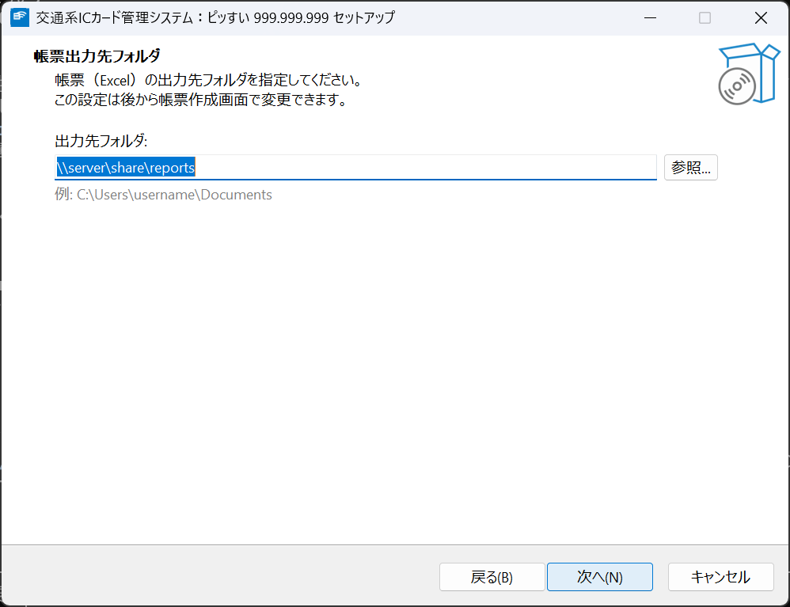{width=50%}

| 項目 | 説明 |
|------|------|
| 出力先フォルダ | 帳票（Excel）を保存するフォルダのパスを入力します。「参照...」ボタンでフォルダを選択することもできます |

**デフォルト値の表示について**:

- **新規インストール時**: ログインユーザーのマイドキュメント（`C:¥Users¥<ユーザー名>¥Documents`）が初期表示されます
- **アップグレード／再インストール時**: 既存の `C:¥ProgramData¥ICCardManager¥report_output_config.txt` を読み込み、現在設定されている出力先フォルダが初期表示されます。そのまま「次へ」で進めれば設定が維持されます

> **重要（書き込み権限）**: 指定するフォルダには **書き込み権限** が必要です。書き込み権限のないフォルダ（他ユーザーのドキュメントフォルダ、読み取り専用の共有フォルダなど）を指定すると、帳票出力時にエラーになります。共有フォルダ上のフォルダを指定する場合は、本アプリを利用する全 PC・全ユーザーのアカウントから書き込みできることをあらかじめ確認してください。

> **補足**: この設定は後から **帳票作成画面**（メイン画面の「帳票」ボタン、または `F1` キー）の「出力先フォルダ」欄でいつでも変更できます（[§6.3 データエクスポート](#63-データエクスポート) の月次帳票出力手順を参照）。変更すると `C:¥ProgramData¥ICCardManager¥report_output_config.txt` も自動的に更新され、次回インストーラー起動時のデフォルト値にも反映されます。「設定」画面（F5）には帳票出力先の項目はありません。

### 2.3 2台目以降のPCのセットアップ

共有フォルダモードで運用する場合、**2台目以降のPC**のセットアップには1台目と異なる注意点があります。

> **前提**: 「[2.1 複数PCで利用する場合の事前準備](#21-複数pcで利用する場合の事前準備)」に従い共有フォルダの準備が済んでおり、1台目のPCでインストールおよび初回起動が完了し、共有フォルダ上に `iccard.db` が作成されていること。

#### 事前確認

2台目以降のPCでインストールを開始する前に、次を確認してください。

| 確認項目 | 確認方法 |
|----------|----------|
| 共有フォルダへネットワーク到達できる | エクスプローラーで `¥¥Server¥ICCardShare¥ICCardManager` を開けるか |
| 共有フォルダへ書き込み権限がある | 共有フォルダ内で任意のファイルを作成・削除できるか |
| 1台目で `iccard.db` が作成済み | 共有フォルダ内に `iccard.db` ファイルが存在するか |

#### インストール手順

2台目以降のPCでも、インストーラーの基本操作は1台目と同じです（「[2.2 インストーラーを使用する場合](#22-インストーラーを使用する場合)」参照）。ただし以下の点が異なります。

1. インストーラーを実行し、オプション選択・部署選択まで進めます
2. 「データベースの保存先」ページで「**共有フォルダで複数PCから使用**」を選択します

   {width=50%}

3. パス欄に **1台目で指定したのと同じ共有フォルダのパス** を入力します（末尾のファイル名 `iccard.db` は不要、**フォルダパスのみ**）

   | 形式 | 入力例 | 備考 |
   |------|--------|------|
   | UNCパス（**推奨**） | `¥¥Server¥ICCardShare¥ICCardManager` | 全PCで同じ表記で統一できる |
   | マップドドライブ | `K:¥ICCardShare¥ICCardManager` | 各PCで同じドライブレターへのマップが必要 |

   > **補足**: UNCパスを推奨します。マップドドライブは PC ごとにドライブレターが異なると運用が複雑になり、またログインユーザーによって接続状態が変わるため、無人起動（常駐起動）との相性が悪い場合があります。

4. 「次へ」をクリックすると入力値が検証されます。次の形式エラーが出た場合は入力を見直してください。
   - `¥¥` で始まる UNC パス、または `X:¥` で始まるドライブレター付き絶対パスである必要があります
5. インストールを完了し、`ICCardManager.exe` を起動します
6. 起動後、ステータスバーに「🔗 共有モード」と表示され、1台目で登録済みの職員／カード情報が表示されることを確認します

#### 1台目が起動中／非起動時の挙動

| 1台目の状態 | 2台目のインストール | 2台目の初回起動 |
|------------|---------------------|-----------------|
| **非起動** | 問題なく完了 | 即座に接続成功 |
| **起動中** | 問題なく完了（インストーラーは DB に触れない） | 接続成功。書き込み時は最大 15 秒まで待機してリトライ |

> **補足**: 共有モードでは SQLite の `journal_mode=DELETE` と `busy_timeout=15000ms` を使用しています。WAL モードと異なり、複数PCからの同時接続に対応します。1台目が貸出／返却などの書き込み処理中に2台目からアクセスがあっても、通常は数百ミリ秒以内にロックが解放されます。

> **注意**: リストア（バックアップからの復元）を実施する場合は、**他のすべてのPCでアプリを終了**してから実行してください。リストア中は他PCからのアクセスを受け付けません。

#### 既存設定（`database_config.txt`）がある場合の上書き動作

同じPCに対してアップグレードインストールや再インストールを行うと、インストーラーは既存の `C:¥ProgramData¥ICCardManager¥database_config.txt` を読み込み、次のように振る舞います。

1. 「データベースの保存先」ページで「**共有フォルダで複数PCから使用**」が自動的に選択されます
2. パス欄に既存の共有フォルダパスが自動入力されます（ファイル名 `iccard.db` は除去されてフォルダ部分のみ表示）
3. そのまま「次へ」で進めると、**同じ設定で上書き保存**されます
4. パスを変更してから「次へ」で進めると、**新しいパスで上書き**されます

> **重要**: 既存設定が共有モードになっている状態で、アップグレード時に「**このPCのみで使用**」を選択して進めた場合、既存の `database_config.txt` は**上書きされません**（共有モードのまま継続します）。意図的にローカルモードへ切り替えたい場合は、インストール完了後にアプリの「設定」画面（F5）でデータベース保存先を空欄に変更し、アプリを再起動してください。

#### ネットワーク切断時のフォールバック

共有フォルダへのネットワーク接続が切断された場合の挙動は次のとおりです。

| 状況 | アプリの挙動 |
|------|-------------|
| ネットワーク切断を検知 | ステータスバーに「🔗 共有モード」の警告表示、接続不可を通知 |
| 自動再接続 | 30秒ごとのヘルスチェックで接続復旧を検知、自動的に再接続 |
| 書き込み処理中の切断 | トランザクション単位でロールバック（Issue #1239 で整合性修復処理もトランザクション保護済み） |
| 復旧後の整合性 | 起動時に整合性チェックが実行され、必要に応じて自動修復 |

> **補足**: ネットワークが長時間切断される環境では、共有モードを一時的に解除してローカル運用に切り替えることも可能です。ただしその間の入力は別DBに記録されるため、復旧後にデータを手動マージする必要があります（運用上は避けることを推奨）。

### 2.4 初回起動

1. `ICCardManager.exe` を実行
2. Windows SmartScreen警告が表示された場合は「詳細情報」→「実行」をクリック
3. データベースファイル `iccard.db` が自動作成されます
4. 共有フォルダを指定した場合、ステータスバーに「🔗 共有モード」と表示されることを確認します

### 2.5 共有モードについて

#### 共有モードの注意事項

| 項目 | 説明 |
|------|------|
| ネットワーク接続 | ネットワーク接続が切断されると警告が表示されます。接続が復旧すると自動的に再接続します |
| データの反映 | 他のPCでの変更は短時間で自動的に反映されます |
| アプリケーションの再起動 | データベースパスを変更した場合、アプリケーションの再起動が必要です |
| DB最適化（VACUUM） | 共有モードでは自動最適化が失敗する場合がありますが、次回起動時に再試行されます |

#### 設定画面からの変更

インストール後に保存先を変更する場合は、設定画面（F5）の「データベース保存先」欄から変更できます。変更後はアプリケーションの再起動が必要です。

### 2.6 バージョンアップ（更新インストール）

新しいバージョンのインストーラーを実行すると、既存のインストール環境に上書きインストールされます。**アンインストールは不要**です。

#### バージョンアップ前の確認事項

| 確認項目 | 内容 |
|----------|------|
| **アプリケーションの終了** | バージョンアップ前に、すべてのPCでピッすいを終了してください。共有モードの場合は**全PCで終了**が必要です |
| **データのバックアップ** | 念のため、バックアップを取得してください（下記手順参照） |

#### バックアップの取得

バージョンアップ前にバックアップを取得しておくと、万が一の際にデータを復元できます。

1. メイン画面の「システム管理」ボタン（F6）をクリック
2. 「バックアップ」タブで「バックアップを実行」をクリック
3. バックアップが完了したことを確認

> **補足**: システムは起動時に自動バックアップを作成しますが、バージョンアップ前には手動バックアップを推奨します。

#### バージョンアップ手順

1. 最新の `ICCardManager_Setup_x.x.x.exe` をダウンロードします
2. **すべてのPCでピッすいを終了**します
3. インストーラーを実行します
4. インストール先は既存のインストールフォルダが自動的に選択されます
5. ウィザードの指示に従い「インストール」をクリックします
6. インストール完了後、アプリケーションを起動して動作を確認します

> **共有モードの場合**: 全PCで同じバージョンのインストーラーを実行してください。バージョンが混在すると予期しない動作が発生する可能性があります。

#### バージョンアップで保持されるデータ

| データ | 保存場所 | 保持 |
|--------|----------|:----:|
| データベース（履歴・カード・職員情報） | `C:¥ProgramData¥ICCardManager¥` | ○ |
| バックアップファイル | `C:¥ProgramData¥ICCardManager¥backup¥` | ○ |
| データベース保存先設定 | `C:¥ProgramData¥ICCardManager¥database_config.txt` | ○ |
| 部署設定 | `C:¥ProgramData¥ICCardManager¥department_config.txt` | ○ |
| ログファイル | `C:¥ProgramData¥ICCardManager¥Logs¥` | ○ |
| アプリケーション本体 | `C:¥Program Files¥ICCardManager¥` | 上書き |
| マニュアル・テンプレート | `C:¥Program Files¥ICCardManager¥Docs¥` 等 | 上書き |

> **重要**: ユーザーデータ（データベース・バックアップ・設定）はプログラムフォルダとは別の場所（`C:¥ProgramData¥ICCardManager¥`）に保存されているため、上書きインストールで失われることはありません。

#### バージョンアップ後の確認

1. アプリケーションを起動し、バージョン番号が更新されていることを確認します（タイトルバーに表示）
2. 履歴データが正常に表示されることを確認します
3. 共有モードの場合、ステータスバーに「🔗 共有モード」と表示されることを確認します

#### アンインストールについて

アンインストールは「設定」→「アプリ」から実行できます。アンインストール終了直前に、ユーザーデータの取り扱いを 3 択で選択できる「データの削除」ダイアログが表示されます。

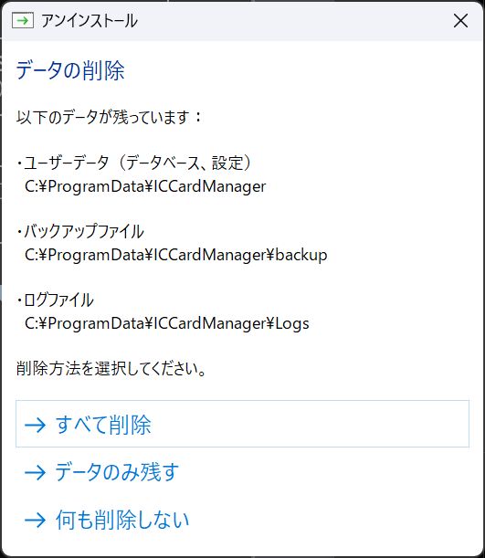{width=70%}

ダイアログには `C:\ProgramData\ICCardManager` 配下に残っているデータ（ユーザーデータ・バックアップ・ログ）の実際のパスが列挙されます。なお、ユーザーデータが存在しないクリーン環境ではこのダイアログは表示されず、プログラムのみがそのまま削除されます。

| 選択肢 | 動作 |
|--------|------|
| **すべて削除** | プログラムとユーザーデータ（データベース・バックアップ・ログ）をすべて削除します |
| **データのみ残す** | プログラムを削除し、ユーザーデータ（データベース・設定）は残します。バックアップとログは削除されます |
| **何も削除しない** | プログラムのみ削除し、ユーザーデータ・バックアップ・ログをすべて残します |

各選択肢で削除/保持される対象（`C:\ProgramData\ICCardManager` 配下）は次のとおりです。

| 対象パス | すべて削除 | データのみ残す | 何も削除しない |
|----------|:---------:|:--------------:|:--------------:|
| `\ICCardManager\` 直下（`*.db` / 設定ファイル等） | 削除 | 保持 | 保持 |
| `\ICCardManager\backup\`（バックアップ） | 削除 | 削除 | 保持 |
| `\ICCardManager\Logs\`（操作ログ・診断ログ） | 削除 | 削除 | 保持 |

> **注意**: 再インストールを予定している場合は「データのみ残す」または「何も削除しない」を選択してください。「すべて削除」を選択すると、履歴データを復元できなくなります。誤って「すべて削除」を選んだ場合でも、別の PC や共有フォルダにバックアップが残っていれば §6.2 の手順で復元できます。

---

## 3. 初期設定

### 3.1 設定画面を開く

1. メイン画面の「設定」ボタン（F5）をクリック
2. 設定ダイアログが開きます

### 3.2 基本設定

{width=40%}

| 設定項目 | 説明 | デフォルト値 |
|----------|------|--------------|
| 通知設定 | ポップアップの表示位置（右上/左上/右下/左下） | 右上 |
| 文字サイズ | 画面の文字サイズ | 中 |
| 残額警告 | 警告を表示する残高の閾値（0～20,000円） | 10,000円 |
| 音声設定 | 操作時の音声（効果音のみ/音声・男性/音声・女性/無し） | 効果音のみ |
| 部署設定 | 部署及び支出科目（市長事務部局：役務費/企業会計部局：旅費） | 市長事務部局：役務費 |
| 返却時のバス停入力スキップ | 返却時にバス停入力ダイアログを表示せず「★」で自動記録 | 無効 |

### 3.3 バックアップ設定

バックアップの保存先を設定できます。

| 設定項目 | 説明 | デフォルト値 |
|----------|------|--------------|
| バックアップ保存先 | バックアップファイルの保存フォルダ | アプリケーションフォルダ |

> **重要**: バックアップは、データベースの保存場所とは**異なる場所**に保存してください。同じ場所に保存すると、機器故障やネットワーク障害の際にデータベースとバックアップの両方を同時に失う恐れがあります。
>
> - **1台のPCのみで使用している場合**: ファイルサーバなどの外部ストレージをバックアップ先に指定してください
> - **共有フォルダモードの場合**: 共有フォルダとは別のフォルダ、またはローカルPCをバックアップ先に指定してください

**バックアップの世代管理:**
- システムは起動時に自動でバックアップを作成します
- 自動バックアップは作成日時の新しいものから**最大 30 世代**を保持し、それを超える古いファイルは次回の自動バックアップ実行時に自動削除されます
- 保持世代数（30）はアプリケーションで固定されており、設定画面から変更することはできません
- 30 世代を超えてさかのぼる必要がある場合や、長期保管が必要な場合は、定期的に手動でバックアップを取得して別の場所（外部ストレージ等）に保管してください
- 起動時バックアップを 1 日 1 回程度の頻度で運用する場合、おおむね**直近約 1 か月分**をさかのぼって復元できる目安となります

### 3.4 データ保存場所

データベースファイルは、インストール時に指定したフォルダに保存されます。

| 設定 | 保存場所 |
|------|---------|
| このPCのみで使用（デフォルト） | `C:¥ProgramData¥ICCardManager¥` |
| 共有フォルダを指定した場合 | 指定した共有フォルダ（例: `K:¥ICCardShare¥`） |

> **補足**: デフォルトの `C:¥ProgramData¥ICCardManager¥` はすべてのWindowsユーザーで共有されるため、異なるユーザーでログインしても同じデータにアクセスできます。保存場所はインストール後に設定画面（F5）から変更できます。

---

## 4. 職員管理

### 4.1 職員管理画面を開く

1. メイン画面の「職員管理」ボタン（F2）をクリック
2. またはキーボードの **F2** キーを押します

{width=60%}

### 4.2 職員の登録

1. 「新規登録」ボタンをクリック → 新規登録ダイアログが開きます。右側のフォームに「職員証をタッチしてください」と表示されます。

   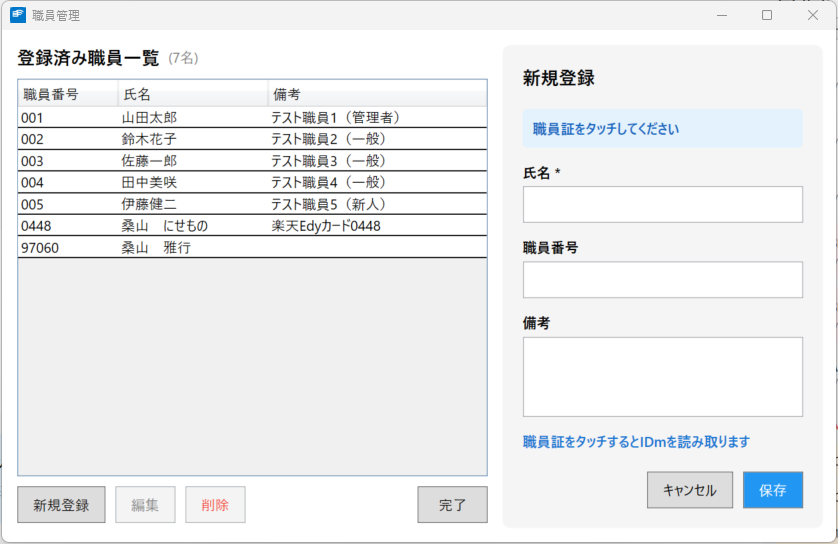{width=80%}

   職員証をタッチすると、IDm が自動入力され表示が「職員証を読み取りました」に切り替わります。

   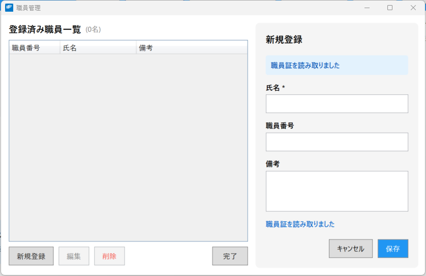{width=80%}

2. 職員情報を入力

   | 項目 | 必須 | 説明 |
   |------|------|------|
   | 氏名 | ○ | 職員の氏名 |
   | 職員番号 | - | 職員番号（組織で定められた番号） |
   | 備考 | - | 任意のメモ |

3. 職員証をICカードリーダーにタッチ（IDmが自動取得され、ダイアログの「IDm」欄に表示されます）
4. 「保存」ボタンをクリック

### 4.3 職員情報の編集

1. 一覧から編集する職員を選択
2. 「編集」ボタンをクリック → 職員情報編集ダイアログが開きます

   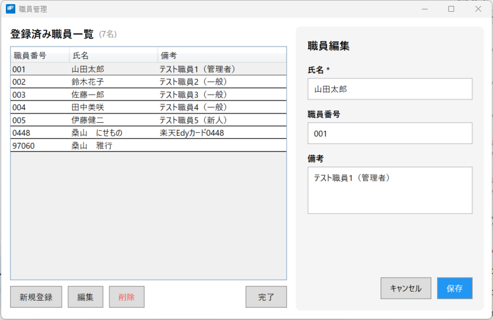{width=60%}

3. 情報を修正
4. 「保存」ボタンをクリック

### 4.4 職員の削除

1. 一覧から削除する職員を選択
2. 「削除」ボタンをクリック
3. 確認ダイアログで「はい」をクリック

> **注意**: 削除された職員は論理削除されます。過去の履歴は保持され、履歴照会で氏名が表示されます。

### 4.5 職員証の再登録

職員証を紛失・変更した場合：

1. 該当する職員を選択
2. 「編集」をクリック（右側の編集フォームが入力可能になります）
3. 新しい職員証をカードリーダーにタッチ（IDmが自動的に読み取られ、IDm欄が新しい値に更新されます）
4. 「保存」をクリック

---

## 5. 交通系ICカード管理

### 5.1 交通系ICカード管理画面を開く

1. メイン画面の「カード管理」ボタン（F3）をクリック
2. またはキーボードの **F3** キーを押します

{width=60%}

### 5.2 交通系ICカードの登録

1. 「新規登録」ボタンをクリック
2. 交通系ICカードをリーダーにタッチ（IDmと残高が自動取得されます）
3. カード情報を入力

   | 項目 | 必須 | 説明 |
   |------|------|------|
   | カード種別 | ○ | ドロップダウンから選択 |
   | 管理番号 | ○ | 例: 001, 002（未入力の場合は自動採番） |
   | 備考 | - | 任意のメモ |

4. 「保存」ボタンをクリック

5. 「カード登録方法の選択」ダイアログが表示されます

   {width=50%}

   以下の2つの登録方法から選択します。

   **(A) 新規購入**

   新しく交通系ICカードを購入した場合に選択します。

   - 初期残高がカードから読み取られ、「新規購入」として記録されます
   - 帳票のページ番号は1ページから始まります
   - 購入日を指定できます（デフォルトは当日。過去の日付も指定可能です）
   - **該当するケース**: 新年度にカードを新たに購入した場合など

   > **ヒント**: 購入日は「新規購入」レコードの日付として記録されます。購入してから数日後に登録する場合は、実際の購入日を指定してください。

   **(B) 紙の出納簿からの繰越**

   既に使用中の交通系ICカードを、紙の出納簿から本アプリに移行する場合に選択します。

   | 設定項目 | 説明 | 例 |
   |----------|------|-----|
   | 繰越月 | 紙の出納簿で最後に管理した月（4月～3月の会計年度順）。3月を選択した場合は「前年度より繰越」として扱われます | 5月（6月から本アプリで管理する場合） |
   | 開始ページ | 紙の物品出納簿で使用していたページ番号の続き | 3（紙の出納簿が2ページまで使用済みの場合） |
   | 繰越額 | 紙の出納簿の前月末残高。デフォルトはカードの現在残高 | 3,500（紙の出納簿の前月末残高が3,500円の場合） |
   | 累計受入 | 紙の出納簿の前月末時点での累計受入金額。月次帳票の「累計」受入欄に加算されます（当該年度のみ） | 15,000 |
   | 累計払出 | 紙の出納簿の前月末時点での累計払出金額。月次帳票の「累計」払出欄に加算されます（当該年度のみ） | 8,200 |

   > **ヒント**: 繰越月のデフォルトは前月が選択されています。例えば7月に作業を行う場合は「6月」がデフォルトで選択されます。

   > **注意（最古の履歴の利用金額について）**: 交通系ICカード内の履歴データには利用金額が直接保存されていません。金額は前後の履歴の残高差から逆算して求めています。そのため、カード内に保持されている最も古い履歴（最大20件目）については、それより前の残高情報がないため、入力した繰越額との差額が利用金額として表示されます。繰越額と実際のその時点の残高が異なる場合、最古の履歴の利用金額が実際とは異なる値になることがあります。これは交通系ICカードの仕様上の制約であり、2番目以降の履歴の金額には影響しません。

   > **参照**: 初期導入時の詳細な手順（CSVインポートを含む）は「[5.6 利用開始時の交通系ICカード登録（初期導入手順）](#56-利用開始時の交通系icカード登録初期導入手順)」を参照してください。

6. 「OK」ボタンをクリック

> **補足**: カード種別はドロップダウンから選択します（はやかけん、nimoca、SUGOCA、Suica、PASMO、ICOCA、PiTaPa、Kitaca、TOICA、manaca、その他）。デフォルトは「nimoca」が選択されていますので、登録するカードに合わせて適切な種別を選択してください。

> **注意**: カードの残高はタッチ時に自動で読み取られます。手動で入力する必要はありません。

### 5.3 交通系ICカード情報の編集

1. 一覧から編集するカードを選択
2. 「編集」ボタンをクリック
3. 情報を修正
4. 「保存」ボタンをクリック

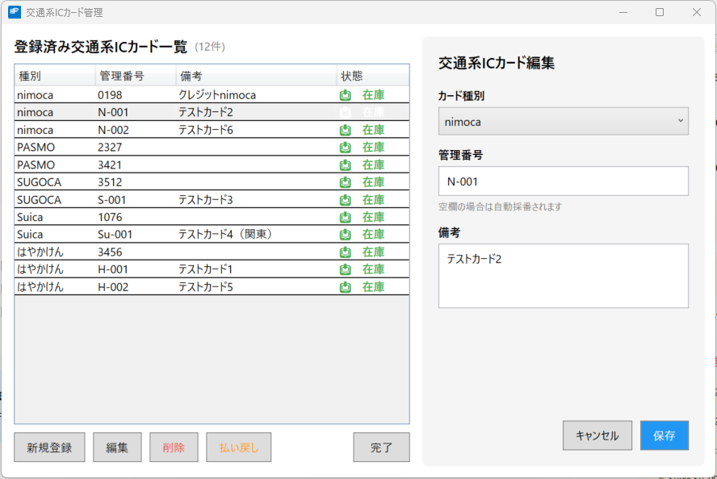{width=80%}

### 5.4 交通系ICカードの削除

1. 一覧から削除するカードを選択
2. 「削除」ボタンをクリック
3. 確認ダイアログで「はい」をクリック

> **注意**: 削除されたカードは論理削除されます。過去の履歴は保持されます。

### 5.5 交通系ICカードの払い戻し

交通系ICカードを払い戻す場合は、以下の手順で操作します。

1. 一覧から払い戻すカードを選択
2. 「払い戻し」ボタンをクリック
3. 確認ダイアログで現在の残高を確認し、「はい」をクリック

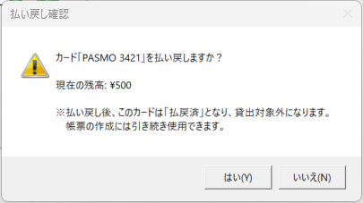{width=70%}

> **重要**: 払い戻し処理を行うと、以下の処理が実行されます。
> - 残高が払出金額として記録されます（物品出納簿に反映）
> - カードの残高は0になります
> - カードは「払戻済」状態となり、一覧では「払戻済」と表示され貸出対象から除外されます
>
> 払い戻し後もカードの過去の履歴は保持されます。

### 5.6 利用開始時の交通系ICカード登録（初期導入手順）

本アプリを初めて導入する際は、紙で管理していた物品出納簿からの移行作業が必要です。この節では、年度途中からの導入を想定した詳細な手順を説明します。

#### 5.6.1 導入作業の全体像

本アプリの導入時に必要な作業は以下のとおりです。

| 手順 | 作業内容 | 必須 |
|------|----------|------|
| 1 | 職員の登録 | ○ |
| 2 | 交通系ICカードの登録（登録方法の選択） | ○ |
| 3 | 月途中導入時の履歴確認・補完（[5.6.4](#564-月途中からの導入時の履歴について) 参照） | △（月途中導入時） |
| 4 | 帳票出力の確認 | ○ |

> **重要**: 導入作業は必ず**月初め**、または**月の区切りがよいタイミング**で行うことを推奨します。月途中からの導入は、カード内の履歴状況によっては当月分の履歴を手動で入力する必要がある場合があります（詳しくは [5.6.4](#564-月途中からの導入時の履歴について) を参照）。

#### 5.6.2 カード登録方法の選択

カード情報を入力して「保存」をクリックすると、「カード登録方法の選択」ダイアログが表示されます。各登録方法の詳細は「[5.2 交通系ICカードの登録](#52-交通系icカードの登録)」を参照してください。

本アプリの初期導入時は、通常 **(B) 紙の出納簿からの繰越** を選択します。

#### 5.6.3 登録手順（紙の出納簿からの繰越の場合）

以下に、年度途中（例: 6月）から本アプリを導入する場合の具体的な手順を示します。

**前提条件:**
- 4月～5月分は紙の物品出納簿で管理済み（2ページ分）
- 6月1日から本アプリで管理を開始する
- カードの現在残高: 5,000円

**手順:**

1. メイン画面の「カード管理」ボタン（F3）をクリック

   {width=60%}

2. 「新規登録」ボタンをクリック

3. 交通系ICカードをリーダーにタッチ
   - カードのIDmと残高（5,000円）が自動的に読み取られます

4. カード情報を入力

   | 項目 | 入力内容 |
   |------|----------|
   | カード種別 | 使用しているカードに合わせて選択（例: nimoca） |
   | 管理番号 | 組織で定めた番号（例: 001）。空欄の場合は自動採番 |
   | 備考 | 必要に応じてメモを記入 |

5. 「保存」ボタンをクリック

6. 「カード登録方法の選択」ダイアログが表示される

   {width=50%}

7. **「紙の出納簿からの繰越」** を選択

8. 繰越月と開始ページを設定

   | 設定項目 | 設定値 | 説明 |
   |----------|--------|------|
   | 繰越月 | 5月 | 5月まで紙で管理し、6月から本アプリで管理するため |
   | 開始ページ | 3 | 紙の出納簿が2ページまで使用済みのため |

9. 繰越額の入力欄に、紙の出納簿の前月末残高を入力します（デフォルトはカードの現在残高）

> **注意**: 繰越額には**紙の出納簿の前月末残高**を入力してください。カードの現在残高がデフォルト値として表示されますが、月の途中で導入する場合、導入日までの利用によりカード残高が月初めの残高より少なくなっている場合があります。

> **注意（最古の履歴の利用金額について）**: 登録後、履歴一覧に表示される最も古い履歴の利用金額が、実際の利用金額と異なる場合があります。これは、交通系ICカード内の履歴データには利用金額が直接保存されておらず、前後の履歴の残高差から逆算しているためです。最も古い履歴（最大20件目）にはそれより前の残高情報がないため、繰越額との差額が利用金額として計算されます。紙の出納簿の前月末残高とカード内の最古の履歴時点の実際の残高が異なる場合に、この差異が生じます。2番目以降の履歴の金額は正確に計算されますので、最古の1件のみの問題です。必要に応じて、CSVインポート機能で正しい金額に修正してください。

10. 累計受入・累計払出に、紙の出納簿の前月末時点での累計金額を入力します（デフォルトは0）

> **ヒント**: 累計受入・累計払出は月次帳票の「累計」欄に加算されます。紙の出納簿で管理していた期間の累計が月次帳票に反映されるため、年度途中で本アプリに移行しても帳票の累計が途切れません。この加算は当該年度のみ有効で、翌年度以降は通常の累計計算に戻ります。

11. 「OK」ボタンをクリックすると、入力した繰越額が「5月から繰越」として記録されます

> **確認ポイント**: メイン画面の履歴一覧に「5月から繰越」の行が表示され、残額に入力した繰越額が記録されていることを確認してください。なお、年度途中の繰越行の受入金額欄は空欄です（受入金額が表示されるのは4月の「前年度より繰越」行のみです）。

> **補足: 3月からの繰越**: 繰越月に3月を選択した場合は、3月が年度末のため「前年度より繰越」として記録されます。この場合は4月の前年度繰越と同じ扱いとなり、受入金額欄に残高が表示されます。

#### 5.6.4 月途中からの導入時の履歴について

月の途中から本アプリを導入する場合、交通系ICカード内に残っている利用履歴の状況によって、必要な対応が異なります。この節では、どのような場合に追加の作業が必要になるのかを詳しく説明します。

##### 交通系ICカードの履歴は最大20件

交通系ICカードには、**最大20件**の利用履歴しか保存されません。カードを使うたびに古い履歴は消えていきます。月の途中から本アプリを導入する場合、カード内の20件の履歴で当月1日以降の利用をすべてカバーできるかどうかが重要なポイントになります。

以下の図は、2つのケースを比較したものです。青い帯がカード内の履歴20件の範囲、赤い帯が手動追加が必要な期間を示します。

{width=90%}

##### ケース①：前月の履歴を含む場合（追加作業不要）

カード内の20件の履歴の中に前月以前の履歴も含まれている場合、今月1日以降の履歴はすべてカード内に残っています。

この場合、前節（5.6.3）の手順でカードを登録するだけで、本アプリが自動的にカード内の履歴を読み取り、当月の利用履歴が正しく記録されます。**CSVインポートや手動での履歴追加は不要です。**

##### ケース②：今月の履歴のみの場合（手動追加が必要）

カードの利用頻度が高く、20件の履歴がすべて今月分で埋まっている場合、月の前半の履歴がカードから消えている可能性があります。

この場合、カード登録だけでは月初めからの利用履歴が不足するため、**不足分（図の赤い部分）をCSVインポートまたは履歴画面からの手動追加で補う必要があります。**

> **判断方法**: カード登録後に履歴一覧を確認し、前月以前の履歴が含まれているかどうかで判断できます。前月以前の履歴が含まれていれば、当月の履歴はすべてカード内に残っています（ケース①）。当月の履歴しか表示されない場合は、月初めの一部が欠けている可能性があります（ケース②）。紙の出納簿と照らし合わせて確認してください。

##### ケース②の場合の対応手順

ケース②に該当する場合は、以下のいずれかの方法で不足分の履歴を補います。

**方法A: CSVインポートで追加する**

紙の出納簿を参照して、不足している期間の履歴をCSVファイルに記入し、インポートします。手順の詳細は後述の「[CSVファイルの準備](#csvファイルの準備)」を参照してください。

**方法B: 履歴画面から手動で追加する**

件数が少ない場合は、履歴画面の「追加」ボタンから1件ずつ手動で入力することもできます。

##### 最古の履歴の利用金額に関する注意

交通系ICカードの履歴データには**利用金額が直接保存されていません**。本アプリでは、前後の履歴の残高差から利用金額を逆算しています。このため、カード内の最も古い履歴（20件目）は、それより前の残高情報がないため、**利用金額が正確に計算されない場合があります**。

**具体例で理解する:**

以下のような履歴がカード内に残っているとします（20件中の最後の2件）。

| 順番 | 日付 | 内容 | 残高 |
|------|------|------|------|
| 19番目（1つ前の履歴） | R8.2.27 | 博多→薬院 | 1,736円 |
| 20番目（最古の履歴） | R8.2.27 | 薬院→博多 | 1,946円 |

- **19番目の利用金額**: 1,946円 − 1,736円 = **210円**（正しく計算できる）
- **20番目の利用金額**: それより前の残高がカード内に存在しないため、**正確な金額がわからない**

このとき、繰越額（紙の出納簿の前月末残高）が仮に2,156円だった場合、本アプリは「2,156円 − 1,946円 = 210円」と計算し、摘要欄に「鉄道（薬院～博多 往復） 210 1736」と表示します。

一見正しい履歴のように見えますが、実際には薬院→博多も博多→薬院もそれぞれ210円であるため、正しい利用金額は**420円**（往復分）です。繰越額が実際の残高と一致していなければ、この計算結果は不正確になります。

> **重要**: この問題は往復の場合に限らず、片道の場合でも、繰越額と最古の履歴の直前の実際の残高にずれがあれば発生します。

**対処方法:**

最古の履歴の利用金額が正しくない場合は、以下のいずれかの方法で修正してください。

1. **履歴画面で直接修正する**: 該当の履歴行を選択して「編集」ボタンをクリックし、正しい利用金額（払出金額）と残額を入力します
2. **CSVインポートで修正する**: 該当の履歴行をいったん削除し、正しい金額を記入したCSVファイルをインポートします

> **ヒント**: 2番目以降の履歴は前後の残高差から正確に計算されますので、修正が必要なのは最古の1件のみです。

#### 5.6.5 月途中からの履歴入力（CSVインポート）

前節でCSVインポートが必要と判断された場合の、具体的なインポート手順を説明します。前節でカード登録時に入力した繰越額は**紙の出納簿の前月末残高**であり、CSVで月初めからの利用履歴をインポートすることで、正しい残高推移が記録されます。CSVインポート機能の概要については「[6.4 データインポート](#64-データインポート)」も参照してください。

##### CSVファイルの準備

1. メイン画面の「データ入出力」ボタン（F4）をクリック

   {width=50%}

2. まず**CSVテンプレート**を入手します
   - エクスポートセクションで「利用履歴」を選択してエクスポートすると、ヘッダー行を含むCSVファイルが出力されます
   - このファイルをテンプレートとして使用します

3. CSVファイルを以下の形式で作成します

   **CSVファイルのヘッダー行:**
   ```
   ID,日時,カードIDm,管理番号,摘要,受入金額,払出金額,残額,利用者,備考
   ```

   **入力規則:**

   | 列名 | 入力方法 | 備考 |
   |------|----------|------|
   | ID | **空欄** | 新規追加の場合は空欄にします |
   | 日時 | `YYYY-MM-DD HH:MM:SS` | 例: `2024-06-03 09:15:00` |
   | カードIDm | カードのIDm | カード一覧のCSVエクスポートで確認できます。インポート時にカードを指定する場合は空欄でも可 |
   | 管理番号 | カードの管理番号 | 例: `001` |
   | 摘要 | 利用内容 | 例: `鉄道（博多駅～天神駅）` |
   | 受入金額 | チャージ金額 | チャージ時のみ入力（利用時は空欄） |
   | 払出金額 | 利用金額 | 利用時のみ入力（チャージ時は空欄） |
   | 残額 | 利用後の残高 | 前行の残額 + 受入 - 払出 と一致させます |
   | 利用者 | 利用した職員名 | |
   | 備考 | メモ | 必要に応じて記入 |

   **CSVファイルの記入例:**
   ```
   ID,日時,カードIDm,管理番号,摘要,受入金額,払出金額,残額,利用者,備考
   ,2024-06-03 09:15:00,0102030405060708,001,鉄道（博多駅～天神駅）,,220,4780,山田太郎,
   ,2024-06-03 17:30:00,0102030405060708,001,鉄道（天神駅～博多駅）,,220,4560,山田太郎,
   ,2024-06-05 10:00:00,0102030405060708,001,役務費によりチャージ,5000,,9560,,
   ,2024-06-07 08:45:00,0102030405060708,001,鉄道（博多駅～福岡空港駅）,,260,9300,鈴木花子,
   ```

> **注意**: 残額は必ず前の行の残額と整合性を持たせてください（前行の残額 + 受入金額 - 払出金額 = 今回の残額）。CSVの最初の行の残額は、繰越記録の残額（前節で入力した紙の出納簿の前月末残高）からの連続になるようにします。上の例では、繰越残額5,000円から最初の220円利用で4,780円となっています。

##### CSVインポートの実行

1. 「データエクスポート/インポート」画面のインポートセクションで操作します

2. データ種別で **「利用履歴」** を選択

   > **補足**: CSVファイルにカードIDm列が正しく入力されている場合、インポート先のカード指定は不要です（CSVのIDmで自動的にマッチングされます）。CSVにIDmが含まれない場合は、「インポート先カード」でカードを指定してください。

3. **「プレビュー」** ボタンをクリック
   - ファイル選択ダイアログでCSVファイルを選択します
   - 変更点プレビューが表示されます

   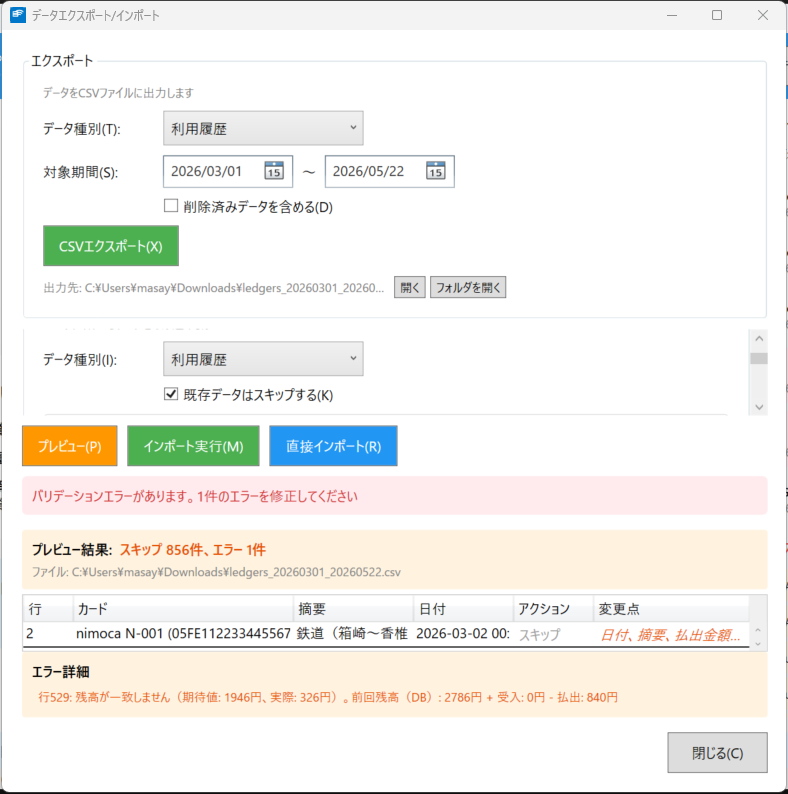{width=85%}

4. プレビュー結果を確認

   | アクション表示 | 意味 |
   |----------------|------|
   | **追加**（緑色） | 新規データとして追加されます |
   | **修正**（オレンジ色） | 既存データが修正されます |
   | **スキップ**（灰色） | 既に同一データが存在するためスキップされます |
   | **復元**（青色） | 論理削除されたデータが復元されます |

   > **重要**: 必ずプレビューで内容を確認してからインポートを実行してください。特に残額の整合性に問題がないか確認します。

5. 問題がなければ **「インポート実行」** ボタンをクリック
   - プレビューなしでインポートしたい場合は、**「直接インポート」** ボタンからCSVファイルを選択して即座に取り込むこともできます

6. インポート完了のメッセージが表示されます

7. メイン画面に戻り、履歴一覧にインポートしたデータが正しく表示されていることを確認します

#### 5.6.6 帳票出力の確認

導入作業が完了したら、帳票が正しく出力されることを確認します。

1. メイン画面の「帳票」ボタン（F1）をクリック

2. 対象月（導入月）とカードを選択

3. 「作成」ボタンをクリック

4. 出力されたExcelファイルを開き、以下を確認

   | 確認項目 | 期待される結果 |
   |----------|----------------|
   | ページ番号 | 紙の出納簿の続き番号から開始されている（例: 3ページから） |
   | 繰越行 | 「○月から繰越」として前月までの残高が記載されている（受入金額欄は空欄） |
   | 履歴データ | CSVインポートした履歴が正しく表示されている |
   | 月計 | 受入金額・払出金額の月計が正しく計算されている |

> **ヒント**: 帳票のページ番号は、カード登録時に指定した「開始ページ」から自動的に振られます。開始ページ番号は登録時にのみ設定できるため、カード登録時に正しい値を入力してください。

#### 5.6.7 複数カードの導入

複数の交通系ICカードを管理している場合は、カードごとに手順5.6.3～5.6.5を繰り返します。

| カード | 繰越月 | 開始ページ | CSVインポート |
|--------|--------|------------|---------------|
| nimoca 001 | 5月 | 3 | 6月1日～導入日までの履歴 |
| nimoca 002 | 5月 | 2 | 6月1日～導入日までの履歴 |
| はやかけん 003 | 5月 | 4 | 6月1日～導入日までの履歴 |

> **注意**: カードごとにCSVファイルを分けて作成するか、1つのCSVファイルにカードIDm列を正しく設定して全カード分をまとめることもできます。

#### 5.6.8 導入時のよくある質問

**Q1: 月の最初から本アプリで管理する場合、CSVインポートは必要ですか？**

A1: 不要です。カード登録時に「紙の出納簿からの繰越」を選択し、繰越月と開始ページを設定するだけで完了です。翌日以降の利用は、通常の貸出・返却操作で自動的に記録されます。月途中から導入する場合でも、カード内に当月の履歴がすべて残っていればCSVインポートは不要です（詳しくは [5.6.4](#564-月途中からの導入時の履歴について) を参照）。

**Q2: 紙の出納簿の開始ページ番号がわかりません。**

A2: 紙の物品出納簿の最後のページ番号を確認し、その次のページ番号を「開始ページ」に設定してください。開始ページ番号は登録時にのみ設定でき、後から変更することはできませんので、登録前に必ず紙の出納簿を確認してください。

**Q3: CSVファイルの残額が合いません。**

A3: 残額は「前行の残額 + 受入金額 - 払出金額」で計算されます。紙の出納簿と照合して正しい値を入力してください。プレビュー機能を使うと、インポート前にデータの整合性を確認できます。

**Q4: 新年度（4月）から本アプリで管理を開始する場合は？**

A4: 2つの方法があります。
- **前年度末にカードを新規購入した場合**: 「新規購入」を選択します
- **前年度から継続利用のカードの場合**: 「紙の出納簿からの繰越」を選択し、繰越月を「3月」（前年度最終月）、開始ページを「1」に設定します

**Q5: 導入後に過去の履歴を追加インポートできますか？**

A5: はい、CSVインポートはいつでも実行できます。「既存データはスキップする」オプションがオンの場合、CSVと既存データが**全項目一致する行のみスキップ**され、備考や管理番号などいずれかの項目に差分がある行は更新されます（重複登録は発生しません）。

---

## 6. データ管理

### 6.1 バックアップとリストア

メイン画面の「システム管理」ボタン（F6）をクリックすると、バックアップ・リストア・操作ログの管理画面が開きます。

{width=50%}

> **ヒント**: 本システムはアプリケーション起動時に自動でバックアップを作成します（「3.3 バックアップ設定」参照）。そのため、通常は手動でバックアップを行う必要はありません。以下の手動バックアップは、システム移行や重要な設定変更の前など、任意のタイミングでバックアップを取得したい場合にご利用ください。

#### 手動バックアップ

1. 「システム管理」画面（F6）を開きます
2. 「手動バックアップ」セクションの「バックアップを作成」ボタンをクリックします
3. バックアップが設定済みの保存先に作成され、ステータスバーに「バックアップを作成しました: <ファイル名>」と表示されます

   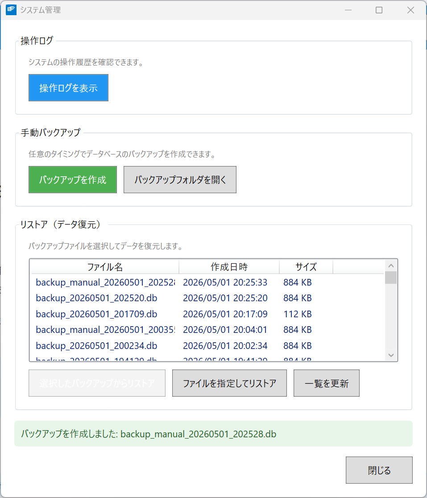{width=50%}

バックアップファイル: `backup_YYYYMMDD_HHMMSS.db`

> **ヒント**: 「バックアップフォルダを開く」ボタンをクリックすると、バックアップの保存先フォルダをエクスプローラーで開けます。

#### 自動バックアップ

アプリケーションは起動時に自動でバックアップを作成します。バックアップの保存先は設定画面（F5）で変更できます。

- 保持世代数は**最大 30 世代**（作成日時の新しい順）で、これを超える古いファイルは次回の自動バックアップ実行時に削除されます
- 保持世代数（30）はアプリケーションで固定されており、設定画面から変更することはできません
- それ以上長く保管したい場合は、§3.3 の案内のとおり手動バックアップを併用してください

### 6.2 リストア（復元）

1. 「システム管理」画面（F6）を開きます
2. 「リストア（データ復元）」セクションのバックアップ一覧から復元したいファイルを選択します

   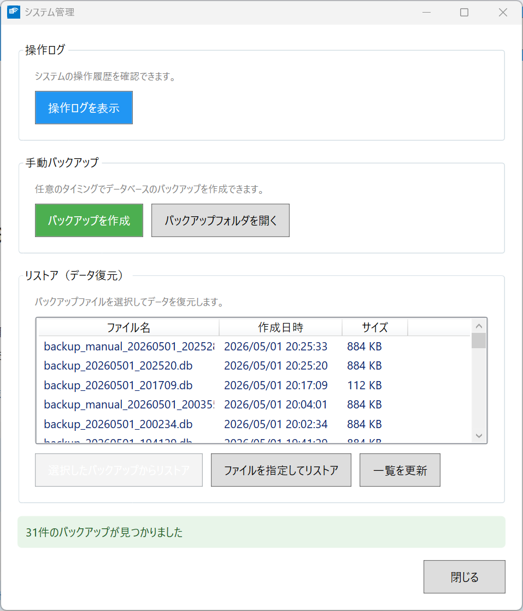{width=50%}

3. 「選択したバックアップからリストア」ボタンをクリックします
4. 確認ダイアログで「はい」をクリックします

外部のバックアップファイルから復元する場合は、「ファイルを指定してリストア」ボタンをクリックし、ファイルを選択します。

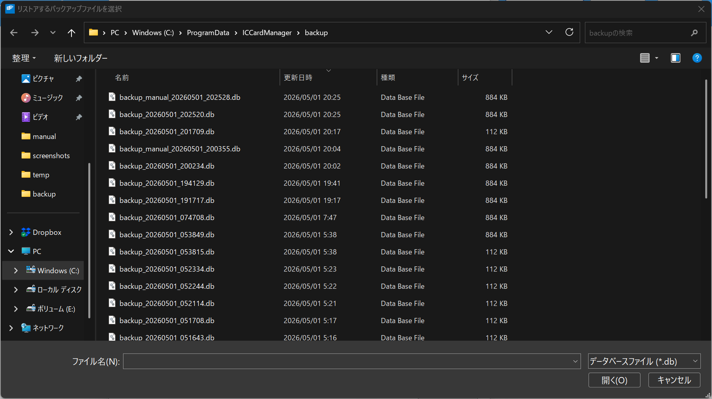{width=60%}

> **警告**: リストアを実行すると、現在のデータは上書きされます。

> **共有フォルダモードでの注意**: バックアップはSQLite Backup APIを使用しており、他のPCがデータベースにアクセス中でも安全に実行できます。ただし、リストア（復元）を行う場合は、**他のすべてのPCでアプリケーションを終了してから**実行してください。他のPCが接続中にリストアを行うとデータの不整合が発生する可能性があります。

### 6.3 データエクスポート

「データ入出力」画面（F4）のエクスポートセクションから操作します。

{width=40%}

#### CSVエクスポート

1. メイン画面の「データ入出力」ボタン（F4）をクリックします
2. エクスポートセクションでデータ種別（カード一覧 / 職員一覧 / 利用履歴 / 利用履歴詳細）を選択します
3. 必要に応じて「削除済みデータを含める」にチェックを入れます
4. 「CSVエクスポート」ボタンをクリックします
5. 保存先を指定します

#### 月次帳票のExcel出力

1. メイン画面の「帳票」ボタン（F1）をクリックします

   {width=40%}

2. 対象月とカードを選択します
3. 「作成」ボタンをクリックします

### 6.4 データインポート

CSVファイルからデータを取り込むことができます。「データ入出力」画面（F4）のインポートセクションから操作します。

#### インポート可能なデータ種別

| データ種別 | 用途 |
|------------|------|
| カード一覧 | 交通系ICカード情報の一括登録・更新 |
| 職員一覧 | 職員情報の一括登録・更新 |
| 利用履歴 | 過去の利用履歴データの取り込み（日単位の集計データ） |
| 利用履歴詳細 | 個別の乗車記録データの取り込み（FeliCaから読み取った1件ごとの乗車・チャージ記録） |

> **「利用履歴」と「利用履歴詳細」の違い**: 「利用履歴」は物品出納簿に対応する日単位の集計行（日付・摘要・受入・払出・残高）です。「利用履歴詳細」は各利用履歴に紐づく個別の乗車・チャージ記録（乗車駅・降車駅・残高等）で、FeliCaカードリーダーから読み取ったデータに相当します。

#### インポートの手順

1. データ種別を選択
2. 「利用履歴」の場合は、インポート先のカードを指定（CSVにカードIDmが含まれている場合は不要）
3. **「プレビュー」** ボタンでCSVファイルを選択し、変更内容を確認
4. 問題がなければ **「インポート実行」** ボタンで取り込み

{width=85%}

プレビューなしでインポートしたい場合は、**「直接インポート」** ボタンからCSVファイルを選択して即座に取り込むこともできます。

> **推奨**: 必ずプレビューで内容を確認してからインポートを実行してください。「既存データはスキップする」オプションがオンの場合、CSVと既存データが**全項目一致する行のみスキップ**され、備考などいずれかの項目に差分がある行は更新されます（重複登録は発生しません）。

> **参照**: 本アプリの初期導入時に紙の物品出納簿から過去履歴を移行する場合の詳細な手順（CSVファイルの書式・記入例を含む）は、「[5.6.5 月途中からの履歴入力（CSVインポート）](#565-月途中からの履歴入力csvインポート)」を参照してください。

### 6.5 古いデータの削除

システムは6年経過したデータ（ledgerテーブル）を起動時に自動削除します。これは監査対応の保存期間に基づいています。

> **注意**: 職員データとカードデータは自動削除されません（論理削除のみ）。

---

## 7. システム設定

### 7.1 設定の保存場所

本システムでは、設定が2か所に分かれて保存されています。

| 設定の種類 | 保存場所 | 変更方法 |
|------------|----------|----------|
| アプリケーション設定 | データベース（`iccard.db`） | 設定画面（F5）から変更 |
| ログ設定 | `appsettings.json` | テキストエディタで直接編集 |

### 7.2 アプリケーション設定

アプリケーション設定は、設定画面（F5）から変更できます。設定はデータベースに自動保存されます。

| 項目 | 説明 | 設定値 |
|------|------|--------|
| ポップアップ位置 | 通知の表示位置 | 右上 / 左上 / 右下 / 左下。デフォルト: 右上 |
| 文字サイズ | 画面の文字サイズ | 小 / 中 / 大 / 特大。デフォルト: 中 |
| 残額警告 | 残額警告閾値 | 0～20,000円。デフォルト: 10,000円 |
| 音声モード | 操作時の音声 | 効果音（ピッ/ピピッ）/ 音声（男性）/ 音声（女性）/ 無し。デフォルト: 効果音 |
| 部署設定 | 部署及び支出科目。チャージ摘要と帳票テンプレートに影響 | 市長事務部局：役務費 / 企業会計部局：旅費。デフォルト: 市長事務部局：役務費 |
| バックアップ保存先 | バックアップフォルダパス | フォルダパス（空欄時はアプリフォルダ） |

> **補足**: ウィンドウの位置・サイズやDB最適化日時もデータベースに保存されますが、アプリケーションが自動的に管理するため、手動で変更する必要はありません。

> **音声素材のクレジット（VOICEVOX 利用規約に基づく義務表記）**
> 「音声（男性）」「音声（女性）」の音声素材は [VOICEVOX](https://voicevox.hiroshiba.jp/) を使用して生成されています。VOICEVOX の利用規約により、音声を配布物に含める場合は以下のクレジット表記が必須です。
>
> - **VOICEVOX:四国めたん** — 女性音声に使用
> - **VOICEVOX:玄野武宏** — 男性音声に使用
>
> これらのクレジットは **設定画面（F5）の音声設定項目** にもアプリケーション内で表示されています。本アプリを再配布・改変する場合も、同クレジットを維持してください。利用規約の全文は [VOICEVOX キャラクター利用規約](https://voicevox.hiroshiba.jp/term/) を参照してください。より詳細なライセンス一覧は `docs/THIRD_PARTY_LICENSES.md` の「4. 音声素材」を参照してください。

### 7.3 ログ設定（appsettings.json）

ログ出力に関する設定は `appsettings.json` ファイルで管理されます。

**保存場所:**
- インストーラー使用時: `C:\Program Files\ICCardManager\appsettings.json`
- 手動インストール時: アプリケーションの実行ファイルと同じフォルダ

> **注意**: 設定ファイルを直接編集する場合は、アプリケーションを終了してから編集してください。

```json
{
  "Logging": {
    "LogLevel": {
      "Default": "Information",
      "ICCardManager": "Information",
      "Microsoft": "Warning"
    },
    "File": {
      "Enabled": true,
      "Path": "Logs",
      "RetentionDays": 30,
      "MaxFileSizeMB": 10
    },
    "Debug": {
      "Enabled": false
    }
  }
}
```

#### LogLevel（ログレベル）

アプリケーションが出力するログの詳細度を制御します。

| 項目 | 説明 | デフォルト値 |
|------|------|-------------|
| Default | 全体のデフォルトログレベル | Information |
| ICCardManager | アプリケーション固有のログレベル | Information |
| Microsoft | Microsoftライブラリのログレベル | Warning |

**ログレベルの種類（詳細度の高い順）：**

| レベル | 説明 |
|--------|------|
| Trace | 最も詳細なログ |
| Debug | デバッグ情報 |
| Information | 一般的な動作情報（デフォルト） |
| Warning | 警告 |
| Error | エラー |
| Critical | 致命的なエラー |
| None | ログを出力しない |

> **ヒント**: トラブルシューティング時には `Default` を `Debug` に変更すると、より詳細なログが出力されます。調査終了後は `Information` に戻してください。

#### File（ファイル出力設定）

ログファイルの出力に関する設定です。ログファイルは `%PROGRAMDATA%\ICCardManager\Logs\` に出力されます。

| 項目 | 説明 | デフォルト値 |
|------|------|-------------|
| Enabled | ファイルへのログ出力の有効/無効 | true |
| Path | ログファイルの出力先フォルダ名 | Logs |
| RetentionDays | ログファイルの保持日数（超過した古いログは自動削除） | 30 |
| MaxFileSizeMB | 1ファイルあたりの最大サイズ（MB） | 10 |

#### Debug（デバッグ出力設定）

| 項目 | 説明 | デフォルト値 |
|------|------|-------------|
| Enabled | デバッグ出力の有効/無効 | false |

> **注意**: Debug設定は開発者向けです。通常の運用では `false` のままにしてください。

### 7.4 組織固有設定（OrganizationOptions）

他の組織で本システムを利用する場合、`appsettings.json` に `OrganizationOptions` セクションを追加することで、組織固有のテキストや動作をカスタマイズできます。

> **重要**: このセクションを追加しない場合は、デフォルト値（福岡市向け）がそのまま使用されます。福岡市で利用する場合は設定不要です。

#### 設定例

```json
{
  "OrganizationOptions": {
    "SummaryText": {
      "ChargeSummaryMayorOffice": "需用費によりチャージ",
      "ChargeSummaryEnterprise": "旅費によりチャージ",
      "RailwayLabel": "電車",
      "BusLabel": "路線バス"
    },
    "SummaryRules": {
      "EnableRoundTripDetection": true,
      "EnableTransferConsolidation": true,
      "TransferStationGroups": [
        ["梅田", "大阪梅田"],
        ["難波", "なんば"]
      ]
    },
    "AreaPriority": {
      "DefaultPriority": [1, 0, 2, 3]
    },
    "ReportLayout": {
      "TitleText": "物品出納簿",
      "ClassificationText": "雑品（金券類）",
      "UnitText": "円"
    }
  }
}
```

#### 摘要テキスト（SummaryText）

物品出納簿に出力される各種テキストをカスタマイズできます。

| 設定キー | 説明 | デフォルト値 |
|----------|------|--------------|
| ChargeSummaryMayorOffice | 市長事務部局のチャージ摘要 | 役務費によりチャージ |
| ChargeSummaryEnterprise | 企業会計部局のチャージ摘要 | 旅費によりチャージ |
| PointRedemption | ポイント還元の摘要 | ポイント還元 |
| RefundSummary | 払い戻しの摘要 | 払戻しによる払出 |
| LendingSummary | 貸出中の摘要 | （貸出中） |
| CarryoverFromPreviousYear | 前年度繰越の摘要 | 前年度より繰越 |
| CarryoverToNextYear | 次年度繰越の摘要 | 次年度へ繰越 |
| CarryoverFromMonthFormat | 前月繰越のフォーマット（{0}=月番号） | {0}月より繰越 |
| MidYearCarryoverFormat | 年度途中繰越のフォーマット（{0}=月番号） | {0}月から繰越 |
| MonthlySummaryFormat | 月計のフォーマット（{0}=月番号） | {0}月計 |
| CumulativeSummary | 累計の摘要 | 累計 |
| InsufficientBalanceNoteFormat | 残高不足時の備考（{0}=支払額、{1}=不足額） | 支払額{0}円のうち不足額{1}円は現金で支払（旅費支給） |
| RailwayLabel | 鉄道利用のラベル | 鉄道 |
| BusLabel | バス利用のラベル | バス |
| BusPlaceholder | バス停名未入力時のプレースホルダ | ★ |
| RoundTripSuffix | 往復の接尾辞 | &nbsp;往復 |

#### 摘要生成ルール（SummaryRules）

摘要文字列の生成ルールを個別にON/OFFできます。

| 設定キー | 説明 | デフォルト値 |
|----------|------|-------------|
| EnableRoundTripDetection | 往復検出（A→B + B→A → 「A～B 往復」） | true |
| EnableTransferConsolidation | 乗継統合（A→B + B→C → 「A～C」） | true |
| TransferStationGroups | 乗り継ぎ駅として同一視するグループ | 天神/西鉄福岡(天神)、千早/西鉄千早 |

> **補足**: `TransferStationGroups` は、異なる事業者間で駅名が異なるが物理的に近接する駅のグループです。同一グループ内の駅間の移動は乗り継ぎとして扱われます。

#### エリア優先順位（AreaPriority）

駅コードからの駅名検索で、カード種別に応じたエリアの優先順位を設定します。

| 設定キー | 説明 | デフォルト値 |
|----------|------|-------------|
| DefaultPriority | デフォルトの優先順位（エリアコードの配列） | [3, 0, 1, 2]（九州優先） |
| CardTypePriorities | カード種別ごとの優先順位（辞書形式） | {}（空＝組み込みのデフォルト使用） |

**エリアコード:**
- 0 = JR東日本・関東圏
- 1 = JR西日本・関西圏
- 2 = JR東海・中部圏
- 3 = JR九州・九州圏

#### 帳票レイアウト（ReportLayout）

帳票のタイトルや固定テキストをカスタマイズできます。

| 設定キー | 説明 | デフォルト値 |
|----------|------|-------------|
| TitleText | 帳票タイトル | 物品出納簿 |
| ClassificationText | 物品分類の表示テキスト | 雑品（金券類） |
| UnitText | 単位の表示テキスト | 円 |
| FileNameFormat | ファイル名フォーマット（{0}=カード種別、{1}=管理番号、{2}=年度） | 物品出納簿\_{0}\_{1}\_{2}年度.xlsx |

#### テンプレート列マッピング（TemplateMapping）

独自のExcelテンプレートを使用する場合に、列・行の配置を指定します。通常は変更不要です。

| 設定キー | 説明 | デフォルト値 |
|----------|------|-------------|
| DataStartRow | データ開始行 | 5 |
| RowsPerPage | 1ページあたりの最大データ行数 | 12 |
| TotalColumns | 総列数 | 12 |
| DateColumn | 出納日の列番号 | 1 |
| SummaryColumn | 摘要の開始列番号 | 2 |
| IncomeColumn | 受入金額の列番号 | 5 |
| ExpenseColumn | 払出金額の列番号 | 6 |
| BalanceColumn | 残額の列番号 | 7 |
| StaffNameColumn | 氏名の列番号 | 8 |
| NoteColumn | 備考の開始列番号 | 9 |
| PageNumberColumn | ページ番号の列番号 | 12 |

---

## 8. セキュリティ

### 8.1 アクセス制御

本システムはスタンドアロン動作のため、OSレベルでのアクセス制御を推奨します。

- 管理者用PCでのみ管理機能を使用
- Windows ユーザーアカウントでアクセス制限

### 8.2 データ保護

| 項目 | 対策 |
|------|------|
| データベース | ローカルファイル（暗号化なし） |
| バックアップ | 定期的なバックアップを推奨 |
| 個人情報 | 職員氏名を含むため取り扱い注意 |

### 8.3 監査ログ

操作ログは `operation_log` テーブルに記録されます。

{width=50%}

記録される操作：
- 貸出・返却（利用履歴の登録・編集・削除）
- 職員の登録・編集・削除・復元
- 交通系ICカードの登録・編集・削除・復元
- 履歴の統合

### 8.4 felicalib.dll の完全性管理（Issue #1266）

本システムは交通系ICカードの読み取りに `felicalib.dll`（Sony PaSoRi 用のネイティブライブラリ）を使用します。このDLLがアプリディレクトリで偽造・改変されると、IDm の盗聴・改ざんを通じた不正な貸出/返却記録のリスクがあります。

#### 自動整合性検証

**アプリ起動時に `felicalib.dll` の SHA-256 ハッシュを自動検証**します。
既知の正規ハッシュと不一致の場合、エラーダイアログを表示してアプリを終了します。

- 期待ハッシュ (SHA-256): `f49c3af37dadf3d8a309492a2eb7fcded8c66dd3bb1bec855597bd65f9d9460d`
- 出自: [tmurakam/felicalib](https://github.com/tmurakam/felicalib) (MIT License)

#### 検証失敗時のエラーダイアログ

ハッシュが一致しない場合、起動シーケンス中に以下のエラーダイアログ（タイトル: 「エラー」、赤い ❌ アイコン、[はい]/[いいえ] ボタン）が表示されます。[いいえ] を押すかウィンドウを閉じるとアプリは終了コード `1` で終了します。[はい] を押すとエラー本文がクリップボードにコピーされ、Issue 報告等への貼付けが容易になります。

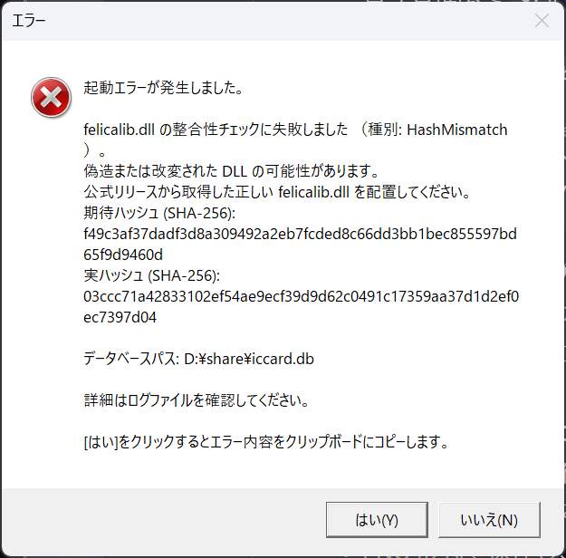{width=70%}

ダイアログ本文の例（Release ビルド）:

```
起動エラーが発生しました。

felicalib.dll の整合性チェックに失敗しました （種別: HashMismatch）。
偽造または改変された DLL の可能性があります。
公式リリースから取得した正しい felicalib.dll を配置してください。
期待ハッシュ (SHA-256): f49c3af37dadf3d8a309492a2eb7fcded8c66dd3bb1bec855597bd65f9d9460d
実ハッシュ (SHA-256):   <実際に計算されたハッシュ>

データベースパス: <共有モード設定時のみ表示>

詳細はログファイルを確認してください。

[はい]をクリックするとエラー内容をクリップボードにコピーします。
```

「種別」フィールドの値による切り分け:

| 値 | 意味 | 想定原因 |
|----|------|----------|
| `HashMismatch` | ファイル存在・ハッシュ不一致 | **改ざん・偽造** の最も典型的なケース |
| `FileNotFound` | 検証対象ファイルが存在しない | DLL が削除された、または別パスへ移動された |
| `Error` | 検証実行不能 | 読み取り権限不足・I/O エラー等 |

#### 検証失敗時のログ出力

エラーダイアログ表示と同時に、`%PROGRAMDATA%\ICCardManager\logs\iccardmanager-YYYYMMDD.log` に以下の形式でエラーログ（カテゴリ: `FelicalibIntegrity`、レベル: `Error`）が記録されます:

```
felicalib.dll の整合性検証に失敗: Result=HashMismatch, Expected=f49c3af37dadf3d8a309492a2eb7fcded8c66dd3bb1bec855597bd65f9d9460d, Actual=<実際のハッシュ>, File=<DLLの絶対パス>, Error=SHA-256 ハッシュが期待値と一致しません。
```

ダイアログ本文には含まれない検証対象ファイルの**絶対パス** (`File=...`) もログには記録されているため、改ざんされた DLL の配置場所特定に利用できます。

#### 管理者の運用責務

1. **公式リリースからの取得のみ許容**: インストーラーに同梱される `felicalib.dll` 以外を配置しない
2. **アプリディレクトリの書き込み権限制限**: `Program Files\ICCardManager\` への書き込みは管理者のみとする
3. **更新時のハッシュ照合**: `felicalib.dll` を更新する場合は、GitHub リリース署名または SHA-256 ハッシュを必ず照合する
4. **検証失敗時の対応**:
   - 起動エラーダイアログが表示された場合、インストーラーを使って再インストールする
   - 意図せず差し替わっていた場合は、誰がアクセスしたか Windows セキュリティログで調査する

#### 手動でのハッシュ検証（任意）

PowerShell で SHA-256 ハッシュを手動確認する手順:

```powershell
Get-FileHash "C:\Program Files\ICCardManager\felicalib.dll" -Algorithm SHA256
```

結果の Hash 列が上記の期待値と一致していれば正規ファイルです。

### 8.5 CSV/Excel 式インジェクション対策（Issue #1267）

本システムは CSV・Excel 入出力時に **式インジェクション (CSV Injection / Formula Injection) 対策**を自動適用します。これは Excel で開いた CSV ファイルのセル先頭が `=`, `+`, `-`, `@`, タブ, CR で始まる場合、表計算ソフトが数式として自動評価してしまう脆弱性への対策です。

#### 攻撃シナリオ例

- 悪意ある担当者が職員登録 CSV の「備考」列に `=1+1` を書き込む
- 別の管理者がその CSV をインポート・後で帳票をエクスポート → Excel が開いた時に `2` と評価される（想定外の表示）
- 古い Excel では `=cmd|'/c calc'!A1` 形式で外部コマンド実行リスクあり

#### 自動防御

以下のタイミングで自動サニタイズ（先頭に `'` 付与）を実施します:

1. **CSV インポート時**: 以下のフィールドに防御を適用
   - カード: `note`
   - 職員: `note`
   - 履歴: `summary`, `note`
   - 履歴詳細: `entry_station`, `exit_station`, `bus_stops`

2. **CSV エクスポート時**: `CsvExportService` がすべての文字列フィールドに適用

3. **Excel エクスポート時** (`ReportService`, `OperationLogExcelExportService`):
   - 月次帳票: `Summary` / `StaffName` / `Note` / `CardType` / `CardNumber`
   - 操作ログ: `OperatorName` / `TargetId` / 変更内容サマリ

#### 表示上の影響

- セルに `'=SUM(1,2)` と書かれていても、Excel では `=SUM(1,2)` と**見た目は同じ**（`'` はExcelのテキスト指示子として認識され表示されない）
- DB 上は `'=SUM(1,2)` として保存される場合がある（CSV インポート経由データ）
- UI 画面では `'=SUM(1,2)` と `'` 込みで表示される（意図しない数式入力と区別可能）

#### 管理者の確認事項

- **ユーザーから「Excel で開いたセルに `'` が見える」と問い合わせがあった場合**: これは正常な動作で、セキュリティ対策による表示です。Excel 上では保存時に自動で取り除かれます
- **合法的に `=` で始めたいデータ**（例: 化学式 `=H2O`）: `'` 付きで表示されますが、Excel の数式解釈リスクを優先するため許容してください

---

## 9. メンテナンス

### 9.1 定期メンテナンス

| 頻度 | 作業内容 |
|------|----------|
| 起動時 | （自動）バックアップ |
| 月次 | 帳票出力、残額確認 |
| 年次 | 古いデータの確認、ディスク容量確認 |

> **補足**: 自動バックアップはアプリケーション起動時に作成されます（[§3.3 バックアップ設定](#33-バックアップ設定)・[§6.1 バックアップとリストア](#61-バックアップとリストア)参照）。常時 PC を起動したまま運用する場合は実質的に日次バックアップとなりますが、毎日アプリを起動・終了する運用ではその頻度に依存します。長期間アプリを起動しない場合は、システム管理画面（F6）から手動バックアップを取得することを推奨します。

### 9.2 データベースサイズ

通常の使用では、データベースファイルは数十MB程度です。
極端に大きくなった場合は、古いデータの削除やバックアップ後の再インストールを検討してください。

### 9.3 ログファイル

アプリケーションログは以下に出力されます。

```
%PROGRAMDATA%\ICCardManager\logs\
```

問題発生時の調査に使用します。

---

## 10. トラブルシューティング

### 10.1 起動時の問題

| 症状 | 原因 | 対処法 |
|------|------|--------|
| 起動しない | .NET Runtimeなし | 自己完結型のため通常は発生しない。再インストールを試行 |
| エラーメッセージ | データベース破損 | バックアップからリストア |
| 動作が遅い | ディスク容量不足 | 不要ファイルの削除 |

### 10.2 ICカードリーダーの問題

| 症状 | 原因 | 対処法 |
|------|------|--------|
| 認識されない | 他アプリが使用中 | FeliCaポートソフトウェア等を終了 |
| 反応しない | USB接続不良 | ケーブルを差し直す |

### 10.3 データの問題

| 症状 | 原因 | 対処法 |
|------|------|--------|
| データが消えた | 誤操作 | バックアップからリストア |
| 履歴が表示されない | 検索条件 | 期間・条件を確認 |
| 帳票が出力できない | 書き込み権限なし | 出力先フォルダの権限を確認 |

### 10.4 共有フォルダモードの問題

| 症状 | 原因 | 対処法 |
|------|------|--------|
| 「ネットワーク接続が切断されました」と表示される | ファイルサーバへの接続が切断された | ネットワーク接続を確認し、ファイルサーバが稼働しているか確認してください。接続が復旧すると自動的に再接続されます |
| 設定画面で保存時「ネットワーク共有に到達できません」（Issue #1269） | UNCパス先にSMBで到達できない・サーバ停止・ファイアウォール閉塞 | 5秒の到達性チェックがタイムアウトしたため表示されます。以下を確認: (1) `\\サーバ名\共有名` が Explorer から開けるか、(2) ファイルサーバが稼働しているか、(3) Windows Defender ファイアウォールでSMB (ポート445) が許可されているか |
| 共有フォルダ上のDBに接続できない | アクセス権限が不足している | ファイルサーバの共有フォルダに対する読み取り/書き込み権限を確認してください |
| データベースパス変更後に起動しない | 指定したパスが存在しないか、アクセスできない | `C:¥ProgramData¥ICCardManager¥database_config.txt` の内容を空にするか、正しいパスに修正してください |
| 他のPCで行った変更が反映されない | キャッシュの更新タイミング | 共有モードではメイン画面・ダッシュボード・表示中の履歴画面が **30 秒ごとに自動同期** されます（Issue #1381 以降）。即時反映ではないため、しばらくお待ちいただくか、メイン画面ステータスバー右の **手動同期ボタン** で即時反映させてください。カードタッチ対応中は同期がスキップされるため、処理完了後の次サイクル（最大 30 秒後）に反映されます |
| DB最適化（VACUUM）が失敗する | 他のPCが接続中 | 共有モードではVACUUMが失敗することがあります。次回起動時に自動で再試行されるため、通常は対処不要です |

#### SQLiteエラーのトラブルシューティング

共有フォルダモードでは、複数PCからの同時アクセスにより以下のSQLiteエラーが発生する場合があります。

| エラー | 意味 | 対処法 |
|--------|------|--------|
| SQLITE_BUSY | 他のPCがデータベースに書き込み中 | システムが自動的にリトライします（最大5回）。通常は操作をやり直す必要はありません。頻繁に発生する場合は同時利用台数を減らすことを検討してください |
| SQLITE_LOCKED | データベーステーブルがロックされている | SQLITE_BUSYと同様に自動リトライされます。解消しない場合はアプリケーションを再起動してください |
| 「ネットワーク共有フォルダへの接続に失敗」 | ファイルサーバへのネットワーク経路が途切れている | LANケーブル・Wi-Fi接続を確認し、ファイルサーバが稼働中であることを確認してください |

> **注意**: エラーが断続的に発生する場合、ネットワーク環境（LANケーブルの接触不良、Wi-Fiの不安定な接続）に問題がある可能性があります。有線LAN接続を推奨します。

#### ネットワーク共有フォルダのアクセス権設定ガイド

共有フォルダモードを利用するには、SMB共有フォルダに適切なアクセス権を設定する必要があります。

**推奨設定手順:**

1. **共有フォルダの作成**: ファイルサーバ上にデータベース保存用のフォルダを作成します（例: `D:\SharedData\ICCardManager`）
2. **SMB共有の設定**:
   - フォルダを右クリック → プロパティ → 共有タブ → 詳細な共有
   - 共有名を設定（例: `ICCardManager`）
   - アクセス許可で利用するユーザーまたはグループに**変更**（読み取り/書き込み）権限を付与
3. **NTFSアクセス権の設定**:
   - セキュリティタブ → 編集
   - 利用するユーザーまたはグループに**変更**権限を付与
   - 「読み取りと実行」「フォルダーの内容の一覧表示」「読み取り」「書き込み」が有効であることを確認
4. **UNCパスでの接続確認**: エクスプローラーで `\\サーバ名\ICCardManager` にアクセスし、ファイルの作成・編集・削除が可能であることを確認

> **重要**: 「読み取り専用」権限では動作しません。データベースの読み書きに加え、SQLiteが一時ファイル（journalファイル）を作成するため、書き込み権限が必須です。

#### 推奨PC台数・同時接続数

| 項目 | 推奨値 | 備考 |
|------|--------|------|
| 同時接続PC台数 | 最大約20台 | これを超えるとSQLITE_BUSYエラーの頻度が増加する可能性があります |
| 同時操作 | 2〜3台程度 | 同時にカードタッチ操作を行うPCの推奨台数。同時に多くのPCで操作すると待機時間が発生します |
| ネットワーク | 有線LAN推奨 | Wi-Fiでも動作しますが、安定性の面で有線LANを推奨します |

> **性能特性**: 共有モードでは、busy_timeout（15秒）とリトライ機構（最大5回）により、同時書き込みが発生しても待機して順番に処理されます。ただし、多数のPCが同時に書き込みを行うと、待機時間が累積して操作のレスポンスが低下する場合があります。

#### バックアップ・リストア時の注意事項（共有モード）

**バックアップ:**
- バックアップはSQLite Backup APIを使用するため、他のPCが接続中でも安全に実行できます
- バックアップ先は共有フォルダとは別の場所を推奨します（同一ストレージ障害時のリスク分散）

**リストア:**
- **リストア前に他の全PCでアプリケーションを終了してください**
- 他のPCが接続中にリストアを行うと、データの不整合が発生する恐れがあります
- リストア手順:
  1. 管理者PCで他の利用者にアプリケーション終了を連絡
  2. 全PCでアプリケーションが終了したことを確認
  3. 管理者PCのシステム管理画面（F6）からリストアを実行
  4. リストア完了後、各PCでアプリケーションを再起動

#### VACUUM失敗時の対処方法

VACUUMはデータベースファイルを最適化（圧縮）する処理です。共有モードでは排他ロックが必要なため、他のPCが接続中は失敗します。

- **通常**: VACUUMは起動時に自動実行され、失敗した場合は次回起動時に再試行されます。特に対処は不要です
- **手動でVACUUMを実行したい場合**: 他の全PCでアプリケーションを終了してから、管理者PCでアプリケーションを再起動してください
- **データベースサイズが大きくなりすぎた場合**: 古いデータの削除（システム管理画面 → 古い履歴の削除）を行った後にVACUUMを実行すると効果的です

### 10.5 バックアップ・リストア

#### バックアップが作成されない

1. 保存先フォルダが存在するか確認
2. 書き込み権限があるか確認
3. ディスク空き容量を確認

#### リストアに失敗する

1. バックアップファイルが破損していないか確認
2. 別のバックアップファイルを試す
3. アプリケーションを再起動して再試行

---

## 11. 特殊なケースの取り扱い

### 11.1 残高不足時の精算機での現金チャージ

交通系ICカードの残高が運賃に不足している場合、精算機で不足分を現金チャージしてから改札を通ることがあります。この場合、システムは自動的に以下のように処理します。

#### 状況の例

- カード残高: 76円
- 運賃: 210円
- 精算機での現金チャージ: 140円（運賃の不足分 134円＋10円単位への端数切り上げ）
- 利用後のカード残高: 6円

#### システムの処理

FeliCa履歴には「140円チャージ」「210円利用」の2件が記録されますが、システムは以下のように**1件の履歴**として出力します。

| 項目 | 値 |
|------|-----|
| 摘要 | 鉄道（A駅～B駅） |
| 払出金額 | 70円（運賃 − 現金チャージ額 = 210円 − 140円） |
| 残額 | 6円（利用後の実残高） |
| 備考 | 支払額210円のうち不足額140円は現金で支払（旅費支給） |

> **ポイント**: 「不足額」は**実際に精算機で現金チャージした金額**です。払出金額はカードの元残高から充当された部分のみが計上されます。精算機のチャージは10円単位の端数切り上げに対応するため、利用後にカード残高がわずかに残るケース（本例では6円）もこのパターンとして検出されます。

#### 検出条件（参考）

`LendingHistoryAnalyzer.DetectInsufficientBalancePattern` が以下の条件をすべて満たす「チャージ → 利用」のペアを残高不足パターンとして検出します。

- チャージ前の残高 < 利用額（残高不足だった）
- チャージ後残高 = 利用額 + 利用後残高（チャージと利用が連続している）
- チャージ額 ≤ 利用額（不足分補填のための小額チャージである）
- 利用後残高 < 100円（`InsufficientBalanceExcessThreshold`。端数切り上げ分を許容）

通常のチャージ（例: 500円、1000円など運賃を大きく上回る額）はこの条件に該当しないため、残高不足パターンとして誤検出されることはありません（Issue #1001 で対応）。

---

## 付録

### A. ショートカットキー

| キー | 機能 |
|------|------|
| F1 | 帳票出力画面を開く |
| F2 | 職員管理画面を開く |
| F3 | カード管理画面を開く |
| F4 | データ入出力画面を開く |
| F5 | 設定画面を開く |
| F6 | システム管理画面を開く |
| F7 | ヘルプ（ユーザーマニュアル等のドキュメントフォルダを開く） |
| Esc | 操作をキャンセル |
| Space | カード一覧で選択したカードの履歴を表示 |

> **⚠ Windows 慣習との差異について（Issue #1289）**
>
> 一般的な Windows アプリケーションでは **F1 = ヘルプ** が慣習ですが、本アプリでは **F1 = 帳票**、**F7 = ヘルプ** としています。
>
> **採用理由**: 本アプリの利用シーンでは「月次帳票の出力」が日常的に最も頻繁に使用される機能であり、最もアクセスしやすい F1 に配置することで業務効率を優先しました。ヘルプは使用頻度が相対的に低いため F7（機能ボタン列の末尾）に配置しています。
>
> 初回利用者に対しては、メイン画面の「帳票 (F1)」ボタンおよび「ヘルプ (F7)」ボタンのツールチップ上にこの差異を明示しています。新規に導入したユーザーへ操作研修を行う際は、本差異をあらかじめ説明してください。

### B. 用語集

トラブルシューティング章（§10）で使用する技術用語を中心に、本マニュアル内で頻出する用語の意味をまとめます。詳細解説のある節は「→」で参照先を示します。

| 用語 | 説明 |
|------|------|
| IDm | FeliCa カードの固有識別番号（16 桁の英数字）。ICカードリーダーが自動読み取りする内部キーで、職員証および交通系ICカードの一意識別に使用します |
| 論理削除 | データを物理削除せず `is_deleted` フラグで非表示化する方式。職員 / 交通系ICカード に適用されます（→ [§6.5 古いデータの削除](#65-古いデータの削除)） |
| 物品出納簿 | 月次で出力する Excel 形式の帳票名称。会計監査向けの公式帳票で、交通系ICカードの受入（チャージ・残額）と払出（運賃利用）を時系列で記録します |
| 共有モード | データベースを UNC パス（`\\サーバ名\共有名\iccard.db`）で指定したときに自動的に有効化される複数 PC 共有運用モード。最大約 20 台で同時利用できます（→ [§2.5 共有モードについて](#25-共有モードについて)） |
| 繰越月 | 紙の出納簿で最後に管理した月。交通系ICカード登録時に指定し、本アプリでの管理開始月の前月にあたります（→ [§5.2 交通系ICカードの登録](#52-交通系icカードの登録)） |
| 開始ページ | 紙の物品出納簿の続きとして本アプリで採番を始めるページ番号。交通系ICカード登録時にのみ設定でき、後から変更できません（→ [§5.2 交通系ICカードの登録](#52-交通系icカードの登録)） |
| 30秒ルール | 直前に行った貸出または返却を取り消すための再タッチ猶予時間。同じ職員証と同じ交通系ICカードを 30 秒以内に再タッチすると、直前操作の逆処理（貸出 ⇔ 返却）が行われます |
| バス利用 | 乗車駅・降車駅が空欄かつチャージ・ポイント還元でない履歴を、本システムが自動的にバス利用と判定する仕組み。摘要欄では「バス（★）」のように表記されます |
| journal_mode=DELETE | 共有モードで使用する SQLite のジャーナル方式。WAL モードはネットワーク共有（SMB）では非推奨のため、共有モード時は自動的に DELETE モードへ切り替えられます（DELETE 設定不可時は TRUNCATE → PERSIST の順にフォールバック） |
| busy_timeout | データベース書き込みでロック待ちが発生したときの最大待機時間（ミリ秒）。共有モードでは SMB 遅延を考慮して 15 秒、ローカルモードでは 5 秒に設定されます（→ [§10.4 共有フォルダモードの問題](#104-共有フォルダモードの問題)） |
| VACUUM | データベースの最適化処理（断片化解消・領域回収）。起動時に自動実行され、共有モードで他 PC が接続中の場合は失敗しますが次回起動時に再試行されます（→ [§10.4 共有フォルダモードの問題](#104-共有フォルダモードの問題)） |
| SQLITE_BUSY / SQLITE_LOCKED | 同時アクセス時に発生し得る SQLite エラー。busy_timeout 内にロックが解放されれば自動でリトライされます（最大 5 回）（→ [§10.4 共有フォルダモードの問題](#104-共有フォルダモードの問題)） |

### C. アクセス権限の設定（IT 担当者向け）

> **この付録について**: 本付録は、組織のファイルサーバで新規に共有フォルダを作成する、または既定の権限セットから外れる運用が必要な IT 担当者向けの補足です。**通常、組織内ファイルサーバの共有フォルダには読み取り／書き込み権限が既に付与されているため、本システム導入時に改めて権限を設定する必要はありません**。庶務担当者は本付録を参照する必要はなく、[§2.1 複数PCで利用する場合の事前準備](#21-複数pcで利用する場合の事前準備)の手順で共有フォルダがエクスプローラから開けることだけ確認すれば十分です。

#### 権限設定が必要となる代表的なケース

- 本システム専用に新規の共有フォルダをファイルサーバ上に作成する
- 既定のドメイングループから外れる利用者（外部委託先、特定部門のみ等）に個別に権限を付与する
- 初回起動時に「書き込み権限がありません」「データベースを開けません」等のエラーが出る

#### 設定方針

Windows ファイルサーバの共有設定では、**SMB 共有権限**（ネットワーク経由のアクセス制御）と **NTFS 権限**（ファイル／フォルダ自体のアクセス制御）の**両方**を正しく設定する必要があります。どちらか一方のみでは期待どおりに動作しません（実効権限は両者の AND）。

#### GUI から設定する場合（推奨）

1. ファイルサーバ上で共有フォルダを右クリック → 「プロパティ」
2. 「共有」タブ → 「詳細な共有」 → 「アクセス許可」
   - 本システム利用者のドメイングループ（例: `DOMAIN\ICCardUsers`）を追加
   - 「変更」および「読み取り」に☑（= 読み取り／書き込み権限）
3. 「セキュリティ」タブ → 「編集」 → 「追加」
   - 同じドメイングループを追加
   - 「変更」および「読み取りと実行」「フォルダーの内容の一覧表示」「読み取り」「書き込み」に☑
4. 「OK」で設定を保存

#### コマンドから設定する場合（PowerShell / 管理者権限）

```powershell
# SMB共有権限（例: 共有名 ICCardShare にドメイングループへ Change 権限）
Grant-SmbShareAccess -Name ICCardShare -AccountName "DOMAIN\ICCardUsers" -AccessRight Change -Force

# NTFS権限（例: D:\share\ICCardManager にドメイングループへ Modify 権限）
icacls "D:\share\ICCardManager" /grant "DOMAIN\ICCardUsers:(OI)(CI)M"
```

#### 補足

- 単一 PC 運用であれば「Everyone」や「Authenticated Users」で単純化しても構いませんが、複数部署が同じファイルサーバを共用する環境では、対象者だけを含むセキュリティグループを作成して付与することを推奨します。
- 権限不足が疑われる場合は、共有フォルダの実効権限を `Get-Acl` / `Get-SmbShareAccess` で確認してから調整してください。

---

*本マニュアルは予告なく変更される場合があります。*
