# 交通系ICカード管理システム：ピッすい 管理者マニュアル

**バージョン**: 2.1.2
**最終更新日**: 2026年3月

---

## 目次

1. [はじめに](#1-はじめに)
2. [システムのインストール](#2-システムのインストール)
3. [初期設定](#3-初期設定)
4. [職員管理](#4-職員管理)
5. [交通系ICカード管理](#5-交通系icカード管理)
6. [データ管理](#6-データ管理)
7. [システム設定](#7-システム設定)
8. [セキュリティ](#8-セキュリティ)
9. [メンテナンス](#9-メンテナンス)
10. [トラブルシューティング](#10-トラブルシューティング)

---

## 1. はじめに

### 1.1 本マニュアルについて

本マニュアルは、交通系ICカード管理システム：ピッすいの管理者向けドキュメントです。システムのインストール、初期設定、職員・交通系ICカードの管理、データ管理などの管理業務について説明します。

### 1.2 管理者の役割

管理者は以下の業務を担当します。

| 業務 | 説明 |
|------|------|
| システム管理 | インストール、設定、バックアップ |
| 職員管理 | 職員の登録・編集・削除 |
| カード管理 | 交通系ICカードの登録・編集・削除 |
| データ管理 | バックアップ、エクスポート、古いデータの削除 |

### 1.3 システム要件

| 項目 | 要件 |
|------|------|
| OS | Windows 10/11 (64-bit) |
| CPU | x64プロセッサ |
| メモリ | 4GB以上 |
| ストレージ | 100MB以上の空き容量 |
| ICカードリーダー | Sony PaSoRi (RC-S380等) |
| ネットワーク | 不要（スタンドアロン動作）※共有フォルダモード利用時はSMBネットワーク接続が必要 |

---

## 2. システムのインストール

### 2.1 複数PCで利用する場合の事前準備

複数のPCから同時に利用する場合は、**インストール前に**共有フォルダを準備してください。1台のPCのみで使用する場合はこの手順をスキップし、「[2.2 インストーラーを使用する場合](#22-インストーラーを使用する場合)」に進んでください。

> **注意**: 共有フォルダモードは最大約20台のPCでの利用を想定しています。

#### 共有フォルダの作成

1. ファイルサーバ上に共有フォルダを作成します（例: `K:¥ICCardShare¥` や `¥¥Server¥ICCardShare¥`）
2. 本システムを利用するすべてのPCのユーザーに対して、共有フォルダへの**読み取り/書き込み権限**を付与します
3. 共有フォルダが各PCからアクセス可能であることを確認します

> **重要**: ファイルサーバの共有設定で、適切なアクセス権限（NTFS権限およびSMB共有権限の両方）を設定してください。

#### 2台目以降のPCでインストールする場合

2台目以降のPCでは、1台目で既に作成されたデータベースが使用されます。インストーラーでは**1台目と同じ共有フォルダのパス**を入力してください。

### 2.2 インストーラーを使用する場合

1. `ICCardManager_Setup_x.x.x.exe` を実行します
2. インストールウィザードの指示に従います
3. インストール先を指定します（デフォルト: `C:\Program Files\ICCardManager`）
4. インストールオプションを選択します（下記参照）

   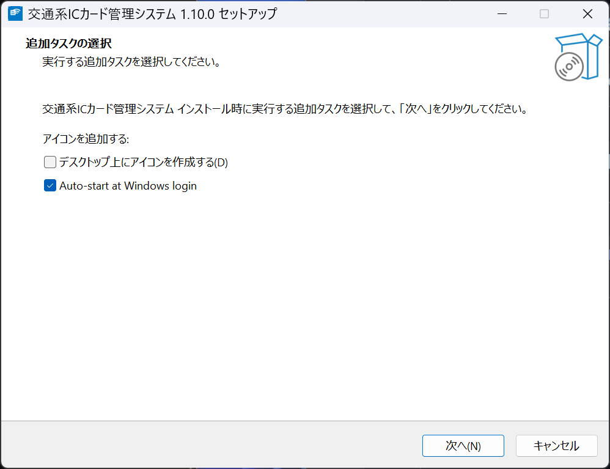{width=50%}

5. 部署及び支出科目を選択します（下記参照）
6. データベースの保存先を選択します（下記参照）
7. 「インストール」をクリックします

#### インストールオプション

| オプション | 説明 | デフォルト |
|------------|------|------------|
| デスクトップにアイコンを作成 | デスクトップにショートカットを作成します | オフ |
| **Windowsログイン時に自動起動する（常駐）** | Windowsにログインすると自動的にアプリケーションが起動します | **オン** |

> **注意**: 常駐オプションをオンにすると、PCを起動してユーザーがログインした際に自動的にアプリケーションが起動します。常時交通系ICカードの読み取りを行う運用に適しています。手動で起動したい場合はオフにしてください。

#### 部署の選択

| 選択肢 | チャージ摘要 |
|--------|------------|
| **市長事務部局** | 役務費によりチャージ |
| 企業会計部局（水道局、交通局等） | 旅費によりチャージ |

> **注意**: 部署の選択により、チャージ時の摘要文と帳票テンプレートが切り替わります。この設定は後からアプリケーションの「設定」画面（F5）で変更できます。

#### データベースの保存先

複数のPCから同時に利用する場合は、共有フォルダを指定します。1台のPCのみで使用する場合は「このPCのみで使用」を選択してください。

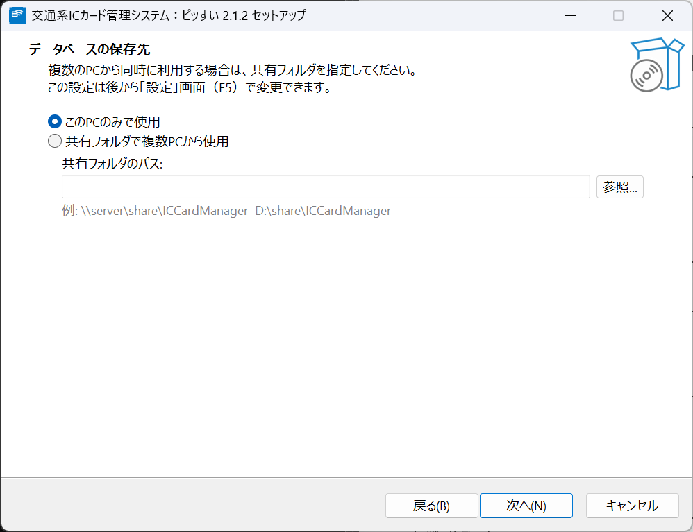{width=50%}

| 選択肢 | 説明 |
|--------|------|
| **このPCのみで使用** | データベースをこのPCのローカルフォルダに保存します（従来どおり） |
| 共有フォルダで複数PCから使用 | 共有フォルダのパスを入力します。複数のPCから同じデータにアクセスできます |

共有フォルダを使用する場合は、パス欄に共有フォルダのパスを入力するか、「参照...」ボタンで選択してください。

- 例: `K:¥ICCardShare¥` や `¥¥Server¥ICCardShare¥`

> **補足**: データベース保存先を空欄にすると、ローカルのデフォルトパス（`C:¥ProgramData¥ICCardManager¥`）が使用されます。この設定は後から「設定」画面（F5）で変更できます。設定は `C:¥ProgramData¥ICCardManager¥database_config.txt` に保存されます。

### 2.3 初回起動

1. `ICCardManager.exe` を実行
2. Windows SmartScreen警告が表示された場合は「詳細情報」→「実行」をクリック
3. データベースファイル `iccard.db` が自動作成されます
4. 共有フォルダを指定した場合、ステータスバーに「🔗 共有モード」と表示されることを確認します

### 2.4 共有モードについて

#### 共有モードの注意事項

| 項目 | 説明 |
|------|------|
| ネットワーク接続 | ネットワーク接続が切断されると警告が表示されます。接続が復旧すると自動的に再接続します |
| データの反映 | 他のPCでの変更は短時間で自動的に反映されます |
| アプリケーションの再起動 | データベースパスを変更した場合、アプリケーションの再起動が必要です |
| DB最適化（VACUUM） | 共有モードでは自動最適化が失敗する場合がありますが、次回起動時に再試行されます |

#### 設定画面からの変更

インストール後に保存先を変更する場合は、設定画面（F5）の「データベース保存先」欄から変更できます。変更後はアプリケーションの再起動が必要です。

---

## 3. 初期設定

### 3.1 設定画面を開く

1. メイン画面の「設定」ボタン（F5）をクリック
2. 設定ダイアログが開きます

### 3.2 基本設定

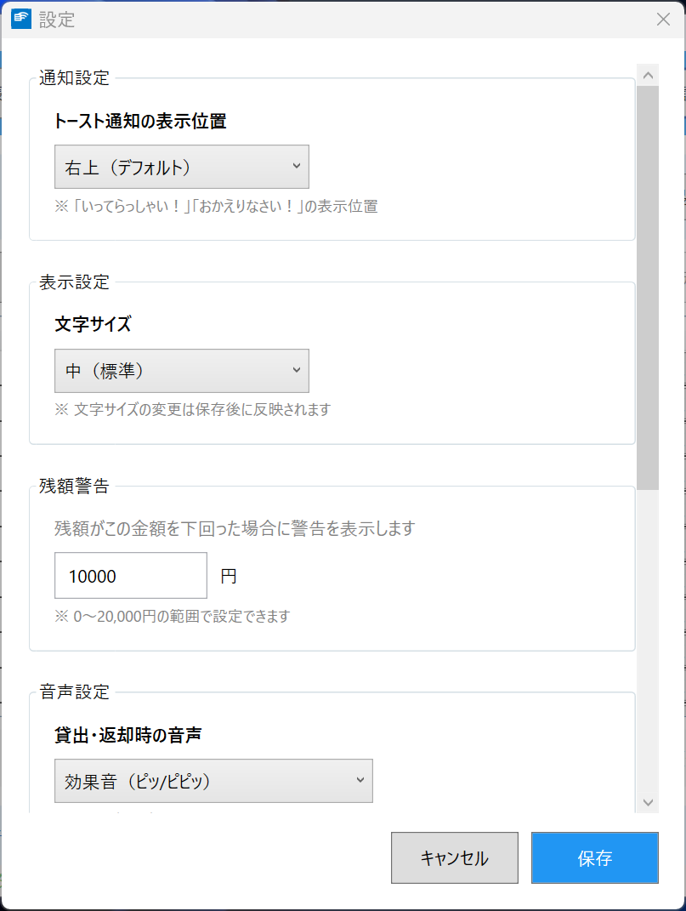{width=40%}

| 設定項目 | 説明 | デフォルト値 |
|----------|------|--------------|
| 通知設定 | ポップアップの表示位置（右上/左上/右下/左下） | 右上 |
| 文字サイズ | 画面の文字サイズ | 中 |
| 残額警告 | 警告を表示する残高の閾値（0～20,000円） | 10,000円 |
| 音声設定 | 操作時の音声（効果音のみ/音声・男性/音声・女性/無し） | 効果音のみ |
| 部署設定 | 部署及び支出科目（市長事務部局：役務費/企業会計部局：旅費） | 市長事務部局：役務費 |
| 返却時のバス停入力スキップ | 返却時にバス停入力ダイアログを表示せず「★」で自動記録 | 無効 |

### 3.3 バックアップ設定

バックアップの保存先を設定できます。

| 設定項目 | 説明 | デフォルト値 |
|----------|------|--------------|
| バックアップ保存先 | バックアップファイルの保存フォルダ | アプリケーションフォルダ |

> **重要**: デフォルトではローカルPC上にバックアップが保存されます。火災や機器故障などの災害に備え、**ファイルサーバなどの外部ストレージ**にバックアップ先を設定することを強く推奨します。

**バックアップの世代管理:**
- システムは起動時に自動でバックアップを作成します
- 古いバックアップは自動的に削除され、最新の数世代のみ保持されます
- 定期的に手動でバックアップを取得し、別の場所に保管することも推奨します

### 3.4 データ保存場所

データベースファイルは、インストール時に指定したフォルダに保存されます。

| 設定 | 保存場所 |
|------|---------|
| このPCのみで使用（デフォルト） | `C:¥ProgramData¥ICCardManager¥` |
| 共有フォルダを指定した場合 | 指定した共有フォルダ（例: `K:¥ICCardShare¥`） |

> **補足**: デフォルトの `C:¥ProgramData¥ICCardManager¥` はすべてのWindowsユーザーで共有されるため、異なるユーザーでログインしても同じデータにアクセスできます。保存場所はインストール後に設定画面（F5）から変更できます。

---

## 4. 職員管理

### 4.1 職員管理画面を開く

1. メイン画面の「職員管理」ボタン（F2）をクリック
2. またはキーボードの **F2** キーを押します

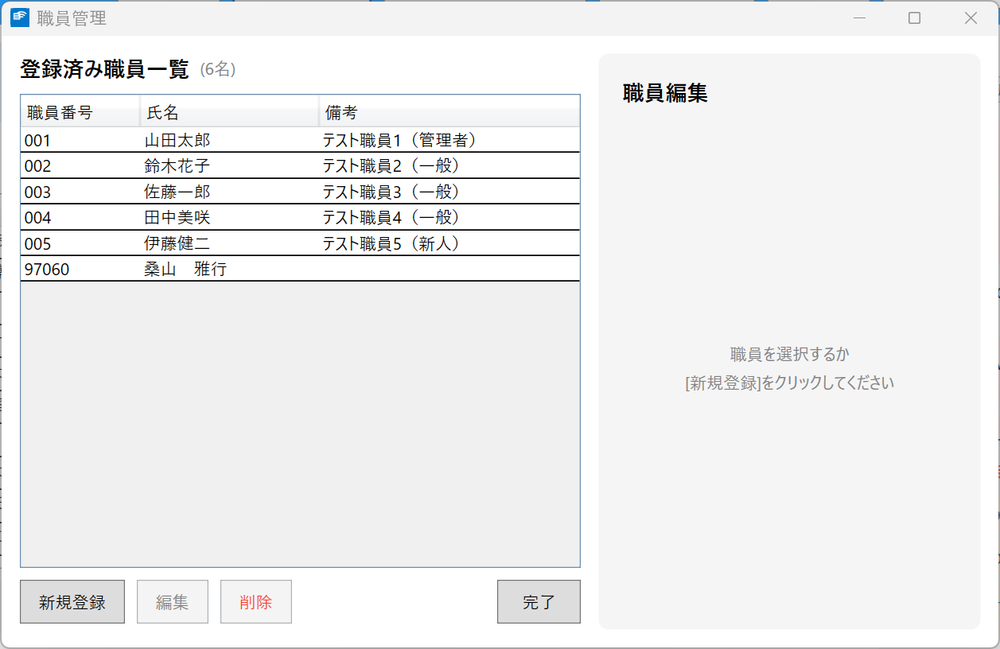{width=60%}

### 4.2 職員の登録

1. 「新規登録」ボタンをクリック
2. 職員情報を入力

   | 項目 | 必須 | 説明 |
   |------|------|------|
   | 氏名 | ○ | 職員の氏名 |
   | 職員番号 | - | 職員番号（組織で定められた番号） |
   | 備考 | - | 任意のメモ |

3. 職員証をICカードリーダーにタッチ（自動でIDmが取得されます）
4. 「保存」ボタンをクリック

### 4.3 職員情報の編集

1. 一覧から編集する職員を選択
2. 「編集」ボタンをクリック
3. 情報を修正
4. 「保存」ボタンをクリック

### 4.4 職員の削除

1. 一覧から削除する職員を選択
2. 「削除」ボタンをクリック
3. 確認ダイアログで「はい」をクリック

> **注意**: 削除された職員は論理削除されます。過去の履歴は保持され、履歴照会で氏名が表示されます。

### 4.5 職員証の再登録

職員証を紛失・変更した場合：

1. 該当する職員を選択
2. 「編集」をクリック（編集モードに入ると「職員証をタッチしてください」と表示されます）
3. 新しい職員証をカードリーダーにタッチ（IDmが自動的に読み取られます）
4. 「保存」をクリック

---

## 5. 交通系ICカード管理

### 5.1 交通系ICカード管理画面を開く

1. メイン画面の「カード管理」ボタン（F3）をクリック
2. またはキーボードの **F3** キーを押します

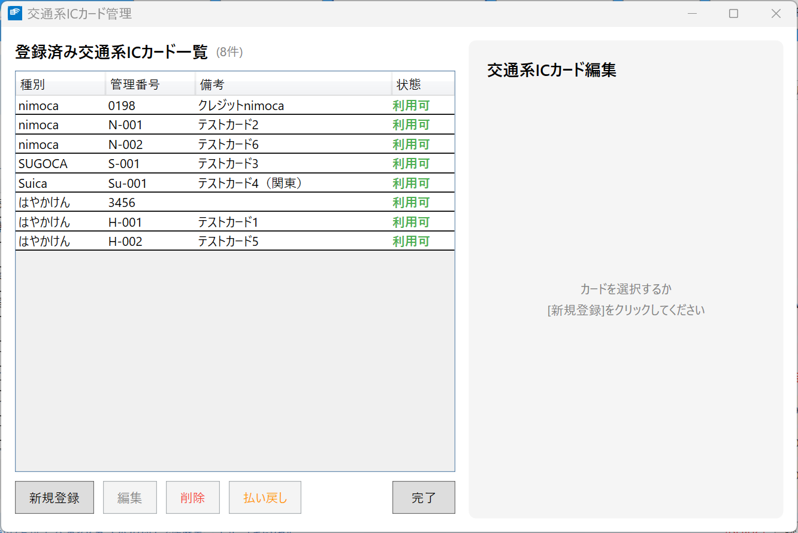{width=60%}

### 5.2 交通系ICカードの登録

1. 「新規登録」ボタンをクリック
2. 交通系ICカードをリーダーにタッチ（IDmと残高が自動取得されます）
3. カード情報を入力

   | 項目 | 必須 | 説明 |
   |------|------|------|
   | カード種別 | ○ | ドロップダウンから選択 |
   | 管理番号 | ○ | 例: 001, 002（未入力の場合は自動採番） |
   | 備考 | - | 任意のメモ |

4. 「保存」ボタンをクリック

5. 「カード登録方法の選択」ダイアログが表示されます

   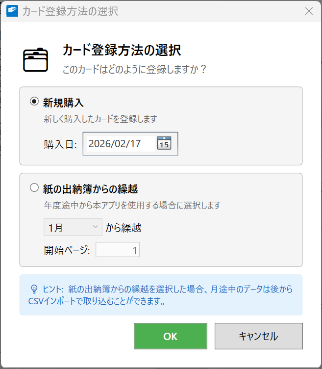{width=50%}

   以下の2つの登録方法から選択します。

   **(A) 新規購入**

   新しく交通系ICカードを購入した場合に選択します。

   - 初期残高がカードから読み取られ、「新規購入」として記録されます
   - 帳票のページ番号は1ページから始まります
   - 購入日を指定できます（デフォルトは当日。過去の日付も指定可能です）
   - **該当するケース**: 新年度にカードを新たに購入した場合など

   > **ヒント**: 購入日は「新規購入」レコードの日付として記録されます。購入してから数日後に登録する場合は、実際の購入日を指定してください。

   **(B) 紙の出納簿からの繰越**

   既に使用中の交通系ICカードを、紙の出納簿から本アプリに移行する場合に選択します。

   | 設定項目 | 説明 | 例 |
   |----------|------|-----|
   | 繰越月 | 紙の出納簿で最後に管理した月（4月～3月の会計年度順） | 5月（6月から本アプリで管理する場合） |
   | 開始ページ | 紙の物品出納簿で使用していたページ番号の続き | 3（紙の出納簿が2ページまで使用済みの場合） |
   | 繰越額 | 紙の出納簿の前月末残高。デフォルトはカードの現在残高 | 3,500（紙の出納簿の前月末残高が3,500円の場合） |

   > **ヒント**: 繰越月のデフォルトは前月が選択されています。例えば7月に作業を行う場合は「6月」がデフォルトで選択されます。

   > **注意（最古の履歴の利用金額について）**: 交通系ICカード内の履歴データには利用金額が直接保存されていません。金額は前後の履歴の残高差から逆算して求めています。そのため、カード内に保持されている最も古い履歴（最大20件目）については、それより前の残高情報がないため、入力した繰越額との差額が利用金額として表示されます。繰越額と実際のその時点の残高が異なる場合、最古の履歴の利用金額が実際とは異なる値になることがあります。これは交通系ICカードの仕様上の制約であり、2番目以降の履歴の金額には影響しません。

   > **参照**: 初期導入時の詳細な手順（CSVインポートを含む）は「[5.6 利用開始時の交通系ICカード登録（初期導入手順）](#56-利用開始時の交通系icカード登録初期導入手順)」を参照してください。

6. 「OK」ボタンをクリック

> **補足**: カード種別はドロップダウンから選択します（はやかけん、nimoca、SUGOCA、Suica、PASMO、ICOCA、PiTaPa、Kitaca、TOICA、manaca、その他）。デフォルトは「nimoca」が選択されていますので、登録するカードに合わせて適切な種別を選択してください。

> **注意**: カードの残高はタッチ時に自動で読み取られます。手動で入力する必要はありません。

### 5.3 交通系ICカード情報の編集

1. 一覧から編集するカードを選択
2. 「編集」ボタンをクリック
3. 情報を修正
4. 「保存」ボタンをクリック

### 5.4 交通系ICカードの削除

1. 一覧から削除するカードを選択
2. 「削除」ボタンをクリック
3. 確認ダイアログで「はい」をクリック

> **注意**: 削除されたカードは論理削除されます。過去の履歴は保持されます。

### 5.5 交通系ICカードの払い戻し

交通系ICカードを払い戻す場合は、以下の手順で操作します。

1. 一覧から払い戻すカードを選択
2. 「払い戻し」ボタンをクリック
3. 確認ダイアログで現在の残高を確認し、「はい」をクリック

> **重要**: 払い戻し処理を行うと、以下の処理が実行されます。
> - 残高が払出金額として記録されます（物品出納簿に反映）
> - カードの残高は0になります
> - カードは論理削除されます（手元にないため）
>
> 払い戻し後もカードの過去の履歴は保持されます。

### 5.6 利用開始時の交通系ICカード登録（初期導入手順）

本アプリを初めて導入する際は、紙で管理していた物品出納簿からの移行作業が必要です。この節では、年度途中からの導入を想定した詳細な手順を説明します。

#### 5.6.1 導入作業の全体像

本アプリの導入時に必要な作業は以下のとおりです。

| 手順 | 作業内容 | 必須 |
|------|----------|------|
| 1 | 職員の登録 | ○ |
| 2 | 交通系ICカードの登録（登録方法の選択） | ○ |
| 3 | 月途中導入時の履歴確認・補完（[5.6.4](#564-月途中からの導入時の履歴について) 参照） | △（月途中導入時） |
| 4 | 帳票出力の確認 | ○ |

> **重要**: 導入作業は必ず**月初め**、または**月の区切りがよいタイミング**で行うことを推奨します。月途中からの導入は、カード内の履歴状況によっては当月分の履歴を手動で入力する必要がある場合があります（詳しくは [5.6.4](#564-月途中からの導入時の履歴について) を参照）。

#### 5.6.2 カード登録方法の選択

カード情報を入力して「保存」をクリックすると、「カード登録方法の選択」ダイアログが表示されます。各登録方法の詳細は「[5.2 交通系ICカードの登録](#52-交通系icカードの登録)」を参照してください。

本アプリの初期導入時は、通常 **(B) 紙の出納簿からの繰越** を選択します。

#### 5.6.3 登録手順（紙の出納簿からの繰越の場合）

以下に、年度途中（例: 6月）から本アプリを導入する場合の具体的な手順を示します。

**前提条件:**
- 4月～5月分は紙の物品出納簿で管理済み（2ページ分）
- 6月1日から本アプリで管理を開始する
- カードの現在残高: 5,000円

**手順:**

1. メイン画面の「カード管理」ボタン（F3）をクリック

   {width=60%}

2. 「新規登録」ボタンをクリック

3. 交通系ICカードをリーダーにタッチ
   - カードのIDmと残高（5,000円）が自動的に読み取られます

4. カード情報を入力

   | 項目 | 入力内容 |
   |------|----------|
   | カード種別 | 使用しているカードに合わせて選択（例: nimoca） |
   | 管理番号 | 組織で定めた番号（例: 001）。空欄の場合は自動採番 |
   | 備考 | 必要に応じてメモを記入 |

5. 「保存」ボタンをクリック

6. 「カード登録方法の選択」ダイアログが表示される

   {width=50%}

7. **「紙の出納簿からの繰越」** を選択

8. 繰越月と開始ページを設定

   | 設定項目 | 設定値 | 説明 |
   |----------|--------|------|
   | 繰越月 | 5月 | 5月まで紙で管理し、6月から本アプリで管理するため |
   | 開始ページ | 3 | 紙の出納簿が2ページまで使用済みのため |

9. 「OK」ボタンをクリック

10. 繰越額の入力欄に、紙の出納簿の前月末残高を入力します（デフォルトはカードの現在残高）

> **注意**: 繰越額には**紙の出納簿の前月末残高**を入力してください。カードの現在残高がデフォルト値として表示されますが、月の途中で導入する場合、導入日までの利用によりカード残高が月初めの残高より少なくなっている場合があります。

> **注意（最古の履歴の利用金額について）**: 登録後、履歴一覧に表示される最も古い履歴の利用金額が、実際の利用金額と異なる場合があります。これは、交通系ICカード内の履歴データには利用金額が直接保存されておらず、前後の履歴の残高差から逆算しているためです。最も古い履歴（最大20件目）にはそれより前の残高情報がないため、繰越額との差額が利用金額として計算されます。紙の出納簿の前月末残高とカード内の最古の履歴時点の実際の残高が異なる場合に、この差異が生じます。2番目以降の履歴の金額は正確に計算されますので、最古の1件のみの問題です。必要に応じて、CSVインポート機能で正しい金額に修正してください。

11. 「OK」ボタンをクリックすると、入力した繰越額が「5月から繰越」として記録されます

> **確認ポイント**: メイン画面の履歴一覧に「5月から繰越」の行が表示され、受入金額に入力した繰越額が記録されていることを確認してください。

#### 5.6.4 月途中からの導入時の履歴について

月の途中から本アプリを導入する場合、交通系ICカード内に残っている利用履歴の状況によって、必要な対応が異なります。この節では、どのような場合に追加の作業が必要になるのかを詳しく説明します。

##### 交通系ICカードの履歴は最大20件

交通系ICカードには、**最大20件**の利用履歴しか保存されません。カードを使うたびに古い履歴は消えていきます。月の途中から本アプリを導入する場合、カード内の20件の履歴で当月1日以降の利用をすべてカバーできるかどうかが重要なポイントになります。

以下の図は、2つのケースを比較したものです。青い帯がカード内の履歴20件の範囲、赤い帯が手動追加が必要な期間を示します。

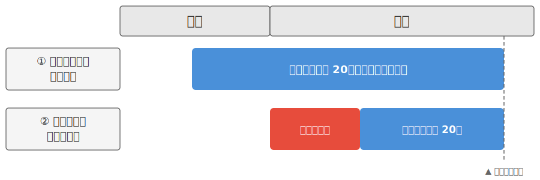{width=90%}

##### ケース①：前月の履歴を含む場合（追加作業不要）

カード内の20件の履歴の中に前月以前の履歴も含まれている場合、今月1日以降の履歴はすべてカード内に残っています。

この場合、前節（5.6.3）の手順でカードを登録するだけで、本アプリが自動的にカード内の履歴を読み取り、当月の利用履歴が正しく記録されます。**CSVインポートや手動での履歴追加は不要です。**

##### ケース②：今月の履歴のみの場合（手動追加が必要）

カードの利用頻度が高く、20件の履歴がすべて今月分で埋まっている場合、月の前半の履歴がカードから消えている可能性があります。

この場合、カード登録だけでは月初めからの利用履歴が不足するため、**不足分（図の赤い部分）をCSVインポートまたは履歴画面からの手動追加で補う必要があります。**

> **判断方法**: カード登録後に履歴一覧を確認し、前月以前の履歴が含まれているかどうかで判断できます。前月以前の履歴が含まれていれば、当月の履歴はすべてカード内に残っています（ケース①）。当月の履歴しか表示されない場合は、月初めの一部が欠けている可能性があります（ケース②）。紙の出納簿と照らし合わせて確認してください。

##### ケース②の場合の対応手順

ケース②に該当する場合は、以下のいずれかの方法で不足分の履歴を補います。

**方法A: CSVインポートで追加する**

紙の出納簿を参照して、不足している期間の履歴をCSVファイルに記入し、インポートします。手順の詳細は後述の「[CSVファイルの準備](#csvファイルの準備)」を参照してください。

**方法B: 履歴画面から手動で追加する**

件数が少ない場合は、履歴画面の「追加」ボタンから1件ずつ手動で入力することもできます。

##### 最古の履歴の利用金額に関する注意

交通系ICカードの履歴データには**利用金額が直接保存されていません**。本アプリでは、前後の履歴の残高差から利用金額を逆算しています。このため、カード内の最も古い履歴（20件目）は、それより前の残高情報がないため、**利用金額が正確に計算されない場合があります**。

**具体例で理解する:**

以下のような履歴がカード内に残っているとします（20件中の最後の2件）。

| 順番 | 日付 | 内容 | 残高 |
|------|------|------|------|
| 19番目（1つ前の履歴） | R8.2.27 | 博多→薬院 | 1,736円 |
| 20番目（最古の履歴） | R8.2.27 | 薬院→博多 | 1,946円 |

- **19番目の利用金額**: 1,946円 − 1,736円 = **210円**（正しく計算できる）
- **20番目の利用金額**: それより前の残高がカード内に存在しないため、**正確な金額がわからない**

このとき、繰越額（紙の出納簿の前月末残高）が仮に2,156円だった場合、本アプリは「2,156円 − 1,946円 = 210円」と計算し、摘要欄に「鉄道（薬院～博多 往復） 210 1736」と表示します。

一見正しい履歴のように見えますが、実際には薬院→博多も博多→薬院もそれぞれ210円であるため、正しい利用金額は**420円**（往復分）です。繰越額が実際の残高と一致していなければ、この計算結果は不正確になります。

> **重要**: この問題は往復の場合に限らず、片道の場合でも、繰越額と最古の履歴の直前の実際の残高にずれがあれば発生します。

**対処方法:**

最古の履歴の利用金額が正しくない場合は、以下のいずれかの方法で修正してください。

1. **履歴画面で直接修正する**: 該当の履歴行を選択して「編集」ボタンをクリックし、正しい利用金額（払出金額）と残額を入力します
2. **CSVインポートで修正する**: 該当の履歴行をいったん削除し、正しい金額を記入したCSVファイルをインポートします

> **ヒント**: 2番目以降の履歴は前後の残高差から正確に計算されますので、修正が必要なのは最古の1件のみです。

#### 5.6.5 月途中からの履歴入力（CSVインポート）

前節でCSVインポートが必要と判断された場合の、具体的なインポート手順を説明します。前節でカード登録時に入力した繰越額は**紙の出納簿の前月末残高**であり、CSVで月初めからの利用履歴をインポートすることで、正しい残高推移が記録されます。CSVインポート機能の概要については「[6.4 データインポート](#64-データインポート)」も参照してください。

##### CSVファイルの準備

1. メイン画面の「データ入出力」ボタン（F4）をクリック

   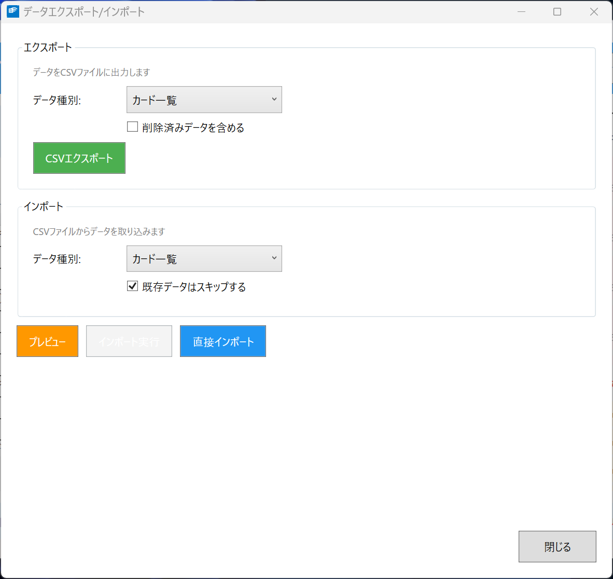{width=50%}

2. まず**CSVテンプレート**を入手します
   - エクスポートセクションで「利用履歴」を選択してエクスポートすると、ヘッダー行を含むCSVファイルが出力されます
   - このファイルをテンプレートとして使用します

3. CSVファイルを以下の形式で作成します

   **CSVファイルのヘッダー行:**
   ```
   ID,日時,カードIDm,管理番号,摘要,受入金額,払出金額,残額,利用者,備考
   ```

   **入力規則:**

   | 列名 | 入力方法 | 備考 |
   |------|----------|------|
   | ID | **空欄** | 新規追加の場合は空欄にします |
   | 日時 | `YYYY-MM-DD HH:MM:SS` | 例: `2024-06-03 09:15:00` |
   | カードIDm | カードのIDm | カード一覧のCSVエクスポートで確認できます。インポート時にカードを指定する場合は空欄でも可 |
   | 管理番号 | カードの管理番号 | 例: `001` |
   | 摘要 | 利用内容 | 例: `鉄道（博多駅～天神駅）` |
   | 受入金額 | チャージ金額 | チャージ時のみ入力（利用時は空欄） |
   | 払出金額 | 利用金額 | 利用時のみ入力（チャージ時は空欄） |
   | 残額 | 利用後の残高 | 前行の残額 + 受入 - 払出 と一致させます |
   | 利用者 | 利用した職員名 | |
   | 備考 | メモ | 必要に応じて記入 |

   **CSVファイルの記入例:**
   ```
   ID,日時,カードIDm,管理番号,摘要,受入金額,払出金額,残額,利用者,備考
   ,2024-06-03 09:15:00,0102030405060708,001,鉄道（博多駅～天神駅）,,220,4780,山田太郎,
   ,2024-06-03 17:30:00,0102030405060708,001,鉄道（天神駅～博多駅）,,220,4560,山田太郎,
   ,2024-06-05 10:00:00,0102030405060708,001,役務費によりチャージ,5000,,9560,,
   ,2024-06-07 08:45:00,0102030405060708,001,鉄道（博多駅～福岡空港駅）,,260,9300,鈴木花子,
   ```

> **注意**: 残額は必ず前の行の残額と整合性を持たせてください（前行の残額 + 受入金額 - 払出金額 = 今回の残額）。CSVの最初の行の残額は、繰越記録の残額（前節で入力した紙の出納簿の前月末残高）からの連続になるようにします。上の例では、繰越残額5,000円から最初の220円利用で4,780円となっています。

##### CSVインポートの実行

1. 「データエクスポート/インポート」画面のインポートセクションで操作します

2. データ種別で **「利用履歴」** を選択

   > **補足**: CSVファイルにカードIDm列が正しく入力されている場合、インポート先のカード指定は不要です（CSVのIDmで自動的にマッチングされます）。CSVにIDmが含まれない場合は、「インポート先カード」でカードを指定してください。

3. **「プレビュー」** ボタンをクリック
   - ファイル選択ダイアログでCSVファイルを選択します
   - 変更点プレビューが表示されます

4. プレビュー結果を確認

   | アクション表示 | 意味 |
   |----------------|------|
   | **追加**（緑色） | 新規データとして追加されます |
   | **修正**（オレンジ色） | 既存データが修正されます |
   | **スキップ**（灰色） | 既に同一データが存在するためスキップされます |
   | **復元**（青色） | 論理削除されたデータが復元されます |

   > **重要**: 必ずプレビューで内容を確認してからインポートを実行してください。特に残額の整合性に問題がないか確認します。

5. 問題がなければ **「インポート実行」** ボタンをクリック
   - プレビューなしでインポートしたい場合は、**「直接インポート」** ボタンからCSVファイルを選択して即座に取り込むこともできます

6. インポート完了のメッセージが表示されます

7. メイン画面に戻り、履歴一覧にインポートしたデータが正しく表示されていることを確認します

#### 5.6.6 帳票出力の確認

導入作業が完了したら、帳票が正しく出力されることを確認します。

1. メイン画面の「帳票」ボタン（F1）をクリック

2. 対象月（導入月）とカードを選択

3. 「作成」ボタンをクリック

4. 出力されたExcelファイルを開き、以下を確認

   | 確認項目 | 期待される結果 |
   |----------|----------------|
   | ページ番号 | 紙の出納簿の続き番号から開始されている（例: 3ページから） |
   | 繰越行 | 「○月から繰越」として前月までの残高が記載されている |
   | 履歴データ | CSVインポートした履歴が正しく表示されている |
   | 月計 | 受入金額・払出金額の月計が正しく計算されている |

> **ヒント**: 帳票のページ番号は、カード登録時に指定した「開始ページ」から自動的に振られます。開始ページ番号は登録時にのみ設定できるため、カード登録時に正しい値を入力してください。

#### 5.6.7 複数カードの導入

複数の交通系ICカードを管理している場合は、カードごとに手順5.6.3～5.6.5を繰り返します。

| カード | 繰越月 | 開始ページ | CSVインポート |
|--------|--------|------------|---------------|
| nimoca 001 | 5月 | 3 | 6月1日～導入日までの履歴 |
| nimoca 002 | 5月 | 2 | 6月1日～導入日までの履歴 |
| はやかけん 003 | 5月 | 4 | 6月1日～導入日までの履歴 |

> **注意**: カードごとにCSVファイルを分けて作成するか、1つのCSVファイルにカードIDm列を正しく設定して全カード分をまとめることもできます。

#### 5.6.8 導入時のよくある質問

**Q1: 月の最初から本アプリで管理する場合、CSVインポートは必要ですか？**

A1: 不要です。カード登録時に「紙の出納簿からの繰越」を選択し、繰越月と開始ページを設定するだけで完了です。翌日以降の利用は、通常の貸出・返却操作で自動的に記録されます。月途中から導入する場合でも、カード内に当月の履歴がすべて残っていればCSVインポートは不要です（詳しくは [5.6.4](#564-月途中からの導入時の履歴について) を参照）。

**Q2: 紙の出納簿の開始ページ番号がわかりません。**

A2: 紙の物品出納簿の最後のページ番号を確認し、その次のページ番号を「開始ページ」に設定してください。開始ページ番号は登録時にのみ設定でき、後から変更することはできませんので、登録前に必ず紙の出納簿を確認してください。

**Q3: CSVファイルの残額が合いません。**

A3: 残額は「前行の残額 + 受入金額 - 払出金額」で計算されます。紙の出納簿と照合して正しい値を入力してください。プレビュー機能を使うと、インポート前にデータの整合性を確認できます。

**Q4: 新年度（4月）から本アプリで管理を開始する場合は？**

A4: 2つの方法があります。
- **前年度末にカードを新規購入した場合**: 「新規購入」を選択します
- **前年度から継続利用のカードの場合**: 「紙の出納簿からの繰越」を選択し、繰越月を「3月」（前年度最終月）、開始ページを「1」に設定します

**Q5: 導入後に過去の履歴を追加インポートできますか？**

A5: はい、CSVインポートはいつでも実行できます。「既存データはスキップする」オプションがオンの場合、既にインポート済みのデータは重複しません。

---

## 6. データ管理

### 6.1 バックアップとリストア

メイン画面の「システム管理」ボタン（F6）をクリックすると、バックアップ・リストア・操作ログの管理画面が開きます。

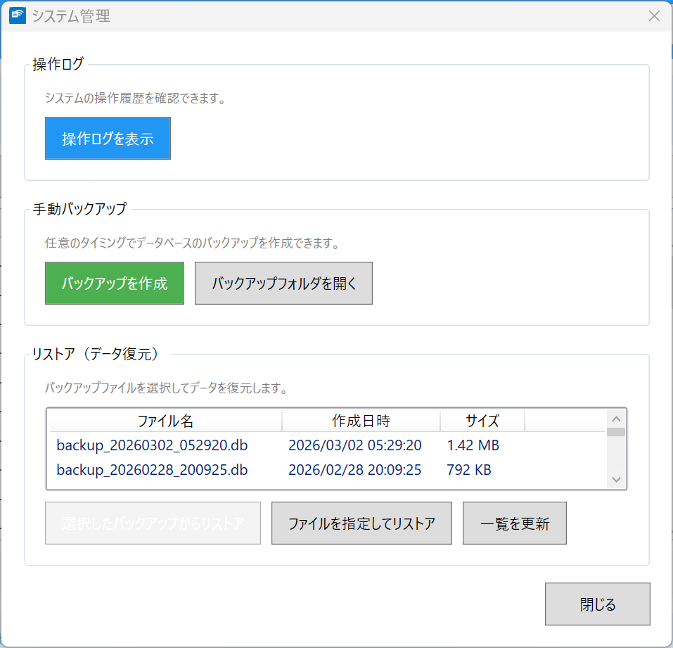{width=50%}

> **ヒント**: 本システムはアプリケーション起動時に自動でバックアップを作成します（「3.3 バックアップ設定」参照）。そのため、通常は手動でバックアップを行う必要はありません。以下の手動バックアップは、システム移行や重要な設定変更の前など、任意のタイミングでバックアップを取得したい場合にご利用ください。

#### 手動バックアップ

1. 「システム管理」画面（F6）を開きます
2. 「手動バックアップ」セクションの「バックアップを作成」ボタンをクリックします
3. バックアップが設定済みの保存先に作成されます

バックアップファイル: `backup_YYYYMMDD_HHMMSS.db`

> **ヒント**: 「バックアップフォルダを開く」ボタンをクリックすると、バックアップの保存先フォルダをエクスプローラーで開けます。

#### 自動バックアップ

アプリケーションは起動時に自動でバックアップを作成します。古いバックアップは自動的に削除され、最新の数世代のみ保持されます。バックアップの保存先は設定画面（F5）で変更できます。

### 6.2 リストア（復元）

1. 「システム管理」画面（F6）を開きます
2. 「リストア（データ復元）」セクションのバックアップ一覧から復元したいファイルを選択します
3. 「選択したバックアップからリストア」ボタンをクリックします
4. 確認ダイアログで「はい」をクリックします

外部のバックアップファイルから復元する場合は、「ファイルを指定してリストア」ボタンをクリックし、ファイルを選択します。

> **警告**: リストアを実行すると、現在のデータは上書きされます。

> **共有フォルダモードでの注意**: バックアップはSQLite Backup APIを使用しており、他のPCがデータベースにアクセス中でも安全に実行できます。ただし、リストア（復元）を行う場合は、**他のすべてのPCでアプリケーションを終了してから**実行してください。他のPCが接続中にリストアを行うとデータの不整合が発生する可能性があります。

### 6.3 データエクスポート

「データ入出力」画面（F4）のエクスポートセクションから操作します。

{width=40%}

#### CSVエクスポート

1. メイン画面の「データ入出力」ボタン（F4）をクリックします
2. エクスポートセクションでデータ種別（カード一覧 / 職員一覧 / 利用履歴 / 利用履歴詳細）を選択します
3. 必要に応じて「削除済みデータを含める」にチェックを入れます
4. 「CSVエクスポート」ボタンをクリックします
5. 保存先を指定します

#### 月次帳票のExcel出力

1. メイン画面の「帳票」ボタン（F1）をクリックします

   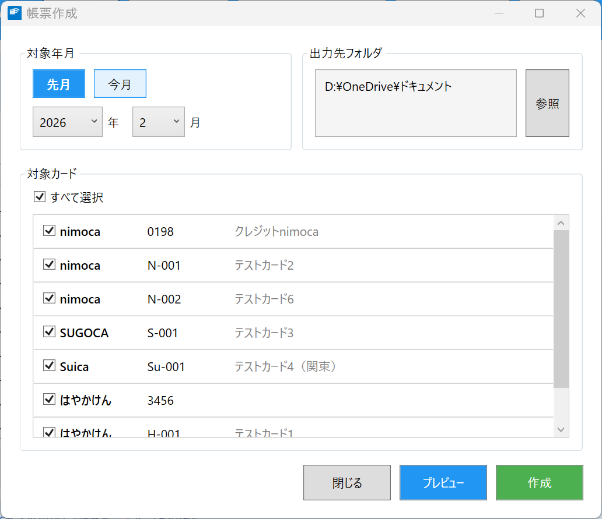{width=40%}

2. 対象月とカードを選択します
3. 「作成」ボタンをクリックします

### 6.4 データインポート

CSVファイルからデータを取り込むことができます。「データ入出力」画面（F4）のインポートセクションから操作します。

#### インポート可能なデータ種別

| データ種別 | 用途 |
|------------|------|
| カード一覧 | 交通系ICカード情報の一括登録・更新 |
| 職員一覧 | 職員情報の一括登録・更新 |
| 利用履歴 | 過去の利用履歴データの取り込み（日単位の集計データ） |
| 利用履歴詳細 | 個別の乗車記録データの取り込み（FeliCaから読み取った1件ごとの乗車・チャージ記録） |

> **「利用履歴」と「利用履歴詳細」の違い**: 「利用履歴」は物品出納簿に対応する日単位の集計行（日付・摘要・受入・払出・残高）です。「利用履歴詳細」は各利用履歴に紐づく個別の乗車・チャージ記録（乗車駅・降車駅・残高等）で、FeliCaカードリーダーから読み取ったデータに相当します。

#### インポートの手順

1. データ種別を選択
2. 「利用履歴」の場合は、インポート先のカードを指定（CSVにカードIDmが含まれている場合は不要）
3. **「プレビュー」** ボタンでCSVファイルを選択し、変更内容を確認
4. 問題がなければ **「インポート実行」** ボタンで取り込み

プレビューなしでインポートしたい場合は、**「直接インポート」** ボタンからCSVファイルを選択して即座に取り込むこともできます。

> **推奨**: 必ずプレビューで内容を確認してからインポートを実行してください。「既存データはスキップする」オプションにより、既に登録済みのデータとの重複を防止できます。

> **参照**: 本アプリの初期導入時に紙の物品出納簿から過去履歴を移行する場合の詳細な手順（CSVファイルの書式・記入例を含む）は、「[5.6.5 月途中からの履歴入力（CSVインポート）](#565-月途中からの履歴入力csvインポート)」を参照してください。

### 6.5 古いデータの削除

システムは6年経過したデータ（ledgerテーブル）を起動時に自動削除します。これは監査対応の保存期間に基づいています。

> **注意**: 職員データとカードデータは自動削除されません（論理削除のみ）。

---

## 7. システム設定

### 7.1 設定の保存場所

本システムでは、設定が2か所に分かれて保存されています。

| 設定の種類 | 保存場所 | 変更方法 |
|------------|----------|----------|
| アプリケーション設定 | データベース（`iccard.db`） | 設定画面（F5）から変更 |
| ログ設定 | `appsettings.json` | テキストエディタで直接編集 |

### 7.2 アプリケーション設定

アプリケーション設定は、設定画面（F5）から変更できます。設定はデータベースに自動保存されます。

| 項目 | 説明 | 設定値 |
|------|------|--------|
| ポップアップ位置 | 通知の表示位置 | 右上 / 左上 / 右下 / 左下。デフォルト: 右上 |
| 文字サイズ | 画面の文字サイズ | 小 / 中 / 大 / 特大。デフォルト: 中 |
| 残額警告 | 残額警告閾値 | 0～20,000円。デフォルト: 10,000円 |
| 音声モード | 操作時の音声 | 効果音（ピッ/ピピッ）/ 音声（男性）/ 音声（女性）/ 無し。デフォルト: 効果音 |
| 部署設定 | 部署及び支出科目。チャージ摘要と帳票テンプレートに影響 | 市長事務部局：役務費 / 企業会計部局：旅費。デフォルト: 市長事務部局：役務費 |
| バックアップ保存先 | バックアップフォルダパス | フォルダパス（空欄時はアプリフォルダ） |

> **補足**: ウィンドウの位置・サイズやDB最適化日時もデータベースに保存されますが、アプリケーションが自動的に管理するため、手動で変更する必要はありません。

### 7.3 ログ設定（appsettings.json）

ログ出力に関する設定は `appsettings.json` ファイルで管理されます。

**保存場所:**
- インストーラー使用時: `C:\Program Files\ICCardManager\appsettings.json`
- 手動インストール時: アプリケーションの実行ファイルと同じフォルダ

> **注意**: 設定ファイルを直接編集する場合は、アプリケーションを終了してから編集してください。

```json
{
  "Logging": {
    "LogLevel": {
      "Default": "Information",
      "ICCardManager": "Information",
      "Microsoft": "Warning"
    },
    "File": {
      "Enabled": true,
      "Path": "Logs",
      "RetentionDays": 30,
      "MaxFileSizeMB": 10
    },
    "Debug": {
      "Enabled": false
    }
  }
}
```

#### LogLevel（ログレベル）

アプリケーションが出力するログの詳細度を制御します。

| 項目 | 説明 | デフォルト値 |
|------|------|-------------|
| Default | 全体のデフォルトログレベル | Information |
| ICCardManager | アプリケーション固有のログレベル | Information |
| Microsoft | Microsoftライブラリのログレベル | Warning |

**ログレベルの種類（詳細度の高い順）：**

| レベル | 説明 |
|--------|------|
| Trace | 最も詳細なログ |
| Debug | デバッグ情報 |
| Information | 一般的な動作情報（デフォルト） |
| Warning | 警告 |
| Error | エラー |
| Critical | 致命的なエラー |
| None | ログを出力しない |

> **ヒント**: トラブルシューティング時には `Default` を `Debug` に変更すると、より詳細なログが出力されます。調査終了後は `Information` に戻してください。

#### File（ファイル出力設定）

ログファイルの出力に関する設定です。ログファイルは `%PROGRAMDATA%\ICCardManager\Logs\` に出力されます。

| 項目 | 説明 | デフォルト値 |
|------|------|-------------|
| Enabled | ファイルへのログ出力の有効/無効 | true |
| Path | ログファイルの出力先フォルダ名 | Logs |
| RetentionDays | ログファイルの保持日数（超過した古いログは自動削除） | 30 |
| MaxFileSizeMB | 1ファイルあたりの最大サイズ（MB） | 10 |

#### Debug（デバッグ出力設定）

| 項目 | 説明 | デフォルト値 |
|------|------|-------------|
| Enabled | デバッグ出力の有効/無効 | false |

> **注意**: Debug設定は開発者向けです。通常の運用では `false` のままにしてください。

### 7.4 組織固有設定（OrganizationOptions）

他の組織で本システムを利用する場合、`appsettings.json` に `OrganizationOptions` セクションを追加することで、組織固有のテキストや動作をカスタマイズできます。

> **重要**: このセクションを追加しない場合は、デフォルト値（福岡市向け）がそのまま使用されます。福岡市で利用する場合は設定不要です。

#### 設定例

```json
{
  "OrganizationOptions": {
    "SummaryText": {
      "ChargeSummaryMayorOffice": "需用費によりチャージ",
      "ChargeSummaryEnterprise": "旅費によりチャージ",
      "RailwayLabel": "電車",
      "BusLabel": "路線バス"
    },
    "SummaryRules": {
      "EnableRoundTripDetection": true,
      "EnableTransferConsolidation": true,
      "TransferStationGroups": [
        ["梅田", "大阪梅田"],
        ["難波", "なんば"]
      ]
    },
    "AreaPriority": {
      "DefaultPriority": [1, 0, 2, 3]
    },
    "ReportLayout": {
      "TitleText": "物品出納簿",
      "ClassificationText": "雑品（金券類）",
      "UnitText": "円"
    }
  }
}
```

#### 摘要テキスト（SummaryText）

物品出納簿に出力される各種テキストをカスタマイズできます。

| 設定キー | 説明 | デフォルト値 |
|----------|------|--------------|
| ChargeSummaryMayorOffice | 市長事務部局のチャージ摘要 | 役務費によりチャージ |
| ChargeSummaryEnterprise | 企業会計部局のチャージ摘要 | 旅費によりチャージ |
| PointRedemption | ポイント還元の摘要 | ポイント還元 |
| RefundSummary | 払い戻しの摘要 | 払戻しによる払出 |
| LendingSummary | 貸出中の摘要 | （貸出中） |
| CarryoverFromPreviousYear | 前年度繰越の摘要 | 前年度より繰越 |
| CarryoverToNextYear | 次年度繰越の摘要 | 次年度へ繰越 |
| CarryoverFromMonthFormat | 前月繰越のフォーマット（{0}=月番号） | {0}月より繰越 |
| MidYearCarryoverFormat | 年度途中繰越のフォーマット（{0}=月番号） | {0}月から繰越 |
| MonthlySummaryFormat | 月計のフォーマット（{0}=月番号） | {0}月計 |
| CumulativeSummary | 累計の摘要 | 累計 |
| InsufficientBalanceNoteFormat | 残高不足時の備考（{0}=支払額、{1}=不足額） | 支払額{0}円のうち不足額{1}円は現金で支払（旅費支給） |
| RailwayLabel | 鉄道利用のラベル | 鉄道 |
| BusLabel | バス利用のラベル | バス |
| BusPlaceholder | バス停名未入力時のプレースホルダ | ★ |
| RoundTripSuffix | 往復の接尾辞 | &nbsp;往復 |

#### 摘要生成ルール（SummaryRules）

摘要文字列の生成ルールを個別にON/OFFできます。

| 設定キー | 説明 | デフォルト値 |
|----------|------|-------------|
| EnableRoundTripDetection | 往復検出（A→B + B→A → 「A～B 往復」） | true |
| EnableTransferConsolidation | 乗継統合（A→B + B→C → 「A～C」） | true |
| TransferStationGroups | 乗り継ぎ駅として同一視するグループ | 天神/西鉄福岡(天神)、千早/西鉄千早 |

> **補足**: `TransferStationGroups` は、異なる事業者間で駅名が異なるが物理的に近接する駅のグループです。同一グループ内の駅間の移動は乗り継ぎとして扱われます。

#### エリア優先順位（AreaPriority）

駅コードからの駅名検索で、カード種別に応じたエリアの優先順位を設定します。

| 設定キー | 説明 | デフォルト値 |
|----------|------|-------------|
| DefaultPriority | デフォルトの優先順位（エリアコードの配列） | [3, 0, 1, 2]（九州優先） |
| CardTypePriorities | カード種別ごとの優先順位（辞書形式） | {}（空＝組み込みのデフォルト使用） |

**エリアコード:**
- 0 = JR東日本・関東圏
- 1 = JR西日本・関西圏
- 2 = JR東海・中部圏
- 3 = JR九州・九州圏

#### 帳票レイアウト（ReportLayout）

帳票のタイトルや固定テキストをカスタマイズできます。

| 設定キー | 説明 | デフォルト値 |
|----------|------|-------------|
| TitleText | 帳票タイトル | 物品出納簿 |
| ClassificationText | 物品分類の表示テキスト | 雑品（金券類） |
| UnitText | 単位の表示テキスト | 円 |
| FileNameFormat | ファイル名フォーマット（{0}=カード種別、{1}=管理番号、{2}=年度） | 物品出納簿\_{0}\_{1}\_{2}年度.xlsx |

#### テンプレート列マッピング（TemplateMapping）

独自のExcelテンプレートを使用する場合に、列・行の配置を指定します。通常は変更不要です。

| 設定キー | 説明 | デフォルト値 |
|----------|------|-------------|
| DataStartRow | データ開始行 | 5 |
| RowsPerPage | 1ページあたりの最大データ行数 | 12 |
| TotalColumns | 総列数 | 12 |
| DateColumn | 出納日の列番号 | 1 |
| SummaryColumn | 摘要の開始列番号 | 2 |
| IncomeColumn | 受入金額の列番号 | 5 |
| ExpenseColumn | 払出金額の列番号 | 6 |
| BalanceColumn | 残額の列番号 | 7 |
| StaffNameColumn | 氏名の列番号 | 8 |
| NoteColumn | 備考の開始列番号 | 9 |
| PageNumberColumn | ページ番号の列番号 | 12 |

---

## 8. セキュリティ

### 8.1 アクセス制御

本システムはスタンドアロン動作のため、OSレベルでのアクセス制御を推奨します。

- 管理者用PCでのみ管理機能を使用
- Windows ユーザーアカウントでアクセス制限

### 8.2 データ保護

| 項目 | 対策 |
|------|------|
| データベース | ローカルファイル（暗号化なし） |
| バックアップ | 定期的なバックアップを推奨 |
| 個人情報 | 職員氏名を含むため取り扱い注意 |

### 8.3 監査ログ

操作ログは `operation_log` テーブルに記録されます。

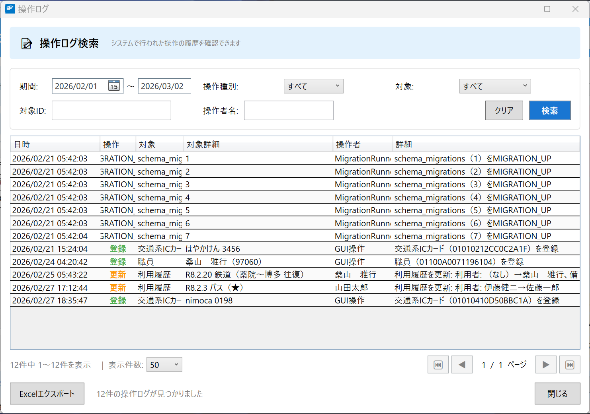{width=50%}

記録される操作：
- 貸出・返却（利用履歴の登録・編集・削除）
- 職員の登録・編集・削除・復元
- 交通系ICカードの登録・編集・削除・復元
- 履歴の統合

---

## 9. メンテナンス

### 9.1 定期メンテナンス

| 頻度 | 作業内容 |
|------|----------|
| 日次 | （自動）バックアップ |
| 月次 | 帳票出力、残額確認 |
| 年次 | 古いデータの確認、ディスク容量確認 |

### 9.2 データベースサイズ

通常の使用では、データベースファイルは数十MB程度です。
極端に大きくなった場合は、古いデータの削除やバックアップ後の再インストールを検討してください。

### 9.3 ログファイル

アプリケーションログは以下に出力されます。

```
%PROGRAMDATA%\ICCardManager\logs\
```

問題発生時の調査に使用します。

---

## 10. トラブルシューティング

### 10.1 起動時の問題

| 症状 | 原因 | 対処法 |
|------|------|--------|
| 起動しない | .NET Runtimeなし | 自己完結型のため通常は発生しない。再インストールを試行 |
| エラーメッセージ | データベース破損 | バックアップからリストア |
| 動作が遅い | ディスク容量不足 | 不要ファイルの削除 |

### 10.2 ICカードリーダーの問題

| 症状 | 原因 | 対処法 |
|------|------|--------|
| 認識されない | 他アプリが使用中 | FeliCaポートソフトウェア等を終了 |
| 反応しない | USB接続不良 | ケーブルを差し直す |

### 10.3 データの問題

| 症状 | 原因 | 対処法 |
|------|------|--------|
| データが消えた | 誤操作 | バックアップからリストア |
| 履歴が表示されない | 検索条件 | 期間・条件を確認 |
| 帳票が出力できない | 書き込み権限なし | 出力先フォルダの権限を確認 |

### 10.4 共有フォルダモードの問題

| 症状 | 原因 | 対処法 |
|------|------|--------|
| 「ネットワーク接続が切断されました」と表示される | ファイルサーバへの接続が切断された | ネットワーク接続を確認し、ファイルサーバが稼働しているか確認してください。接続が復旧すると自動的に再接続されます |
| 共有フォルダ上のDBに接続できない | アクセス権限が不足している | ファイルサーバの共有フォルダに対する読み取り/書き込み権限を確認してください |
| データベースパス変更後に起動しない | 指定したパスが存在しないか、アクセスできない | `C:¥ProgramData¥ICCardManager¥database_config.txt` の内容を空にするか、正しいパスに修正してください |
| 他のPCで行った変更が反映されない | キャッシュの更新タイミング | 共有モードではキャッシュの更新間隔が短縮されていますが、即時反映ではありません。しばらく待つか、画面を更新してください |
| DB最適化（VACUUM）が失敗する | 他のPCが接続中 | 共有モードではVACUUMが失敗することがあります。次回起動時に自動で再試行されるため、通常は対処不要です |

### 10.5 バックアップ・リストア

#### バックアップが作成されない

1. 保存先フォルダが存在するか確認
2. 書き込み権限があるか確認
3. ディスク空き容量を確認

#### リストアに失敗する

1. バックアップファイルが破損していないか確認
2. 別のバックアップファイルを試す
3. アプリケーションを再起動して再試行

---

## 11. 特殊なケースの取り扱い

### 11.1 残高不足時の現金支払い

交通系ICカードの残高が運賃に不足している場合、降車時に不足分を現金で支払うことがあります。この場合、システムは自動的に以下のように処理します。

#### 状況の例

- カード残高: 200円
- 運賃: 210円
- 不足額: 10円（現金で支払い）

#### システムの処理

FeliCa履歴には「10円チャージ」「210円利用」の2件が記録されますが、システムは以下のように**1件の履歴**として出力します。

| 項目 | 値 |
|------|-----|
| 摘要 | 鉄道（A駅～B駅） |
| 払出金額 | 200円（カードの元残高） |
| 残額 | 0円 |
| 備考 | 支払額210円のうち不足額10円は現金で支払（旅費支給） |

> **ポイント**: 不足分の10円は現金で支払ったため、カードからの払出としては計上されません。備考欄に現金支払いの旨が記載されるため、旅費精算の際に参照してください。

---

## 付録

### A. ショートカットキー

| キー | 機能 |
|------|------|
| F1 | 帳票出力画面を開く |
| F2 | 職員管理画面を開く |
| F3 | カード管理画面を開く |
| F4 | データ入出力画面を開く |
| F5 | 設定画面を開く |
| F6 | システム管理画面を開く |
| Esc | 操作をキャンセル |
| Space | カード一覧で選択したカードの履歴を表示 |

### B. 用語集

| 用語 | 説明 |
|------|------|
| IDm | FeliCaカードの固有識別番号 |
| 論理削除 | データを物理的に削除せず、削除フラグを立てる方式 |
| 物品出納簿 | 物品の受入・払出を記録する帳票 |

---

*本マニュアルは予告なく変更される場合があります。*
