# 交通系ICカード管理システム：ピッすい 管理者マニュアル

**バージョン**: 2.10.0
**最終更新日**: 2026年9月

---

## 目次

- [はじめに](#はじめに)
  - [このマニュアルの読み方](#このマニュアルの読み方)
  - [管理者の役割](#管理者の役割)
  - [動作環境](#動作環境)
- [困ったときの早見表](#困ったときの早見表)
- [第1部 はじめて使うとき](#第1部-はじめて使うとき)
  - [1.1 導入の流れ](#11-導入の流れ)
  - [1.2 1台のPCで使う場合のインストール](#12-1台のpcで使う場合のインストール)
  - [1.3 複数のPCで使う場合のインストール](#13-複数のpcで使う場合のインストール)
  - [1.4 初回起動と初期設定](#14-初回起動と初期設定)
  - [1.5 職員を登録する](#15-職員を登録する)
  - [1.6 交通系ICカードを登録する（4月から使い始める場合）](#16-交通系icカードを登録する4月から使い始める場合)
  - [1.7 年度途中から使い始める場合](#17-年度途中から使い始める場合)
    - [1.7.1 紙の出納簿から引き継ぐ](#171-紙の出納簿から引き継ぐ)
    - [1.7.2 カードに残っていない履歴を取り込む](#172-カードに残っていない履歴を取り込む)
    - [1.7.3 取り込んだあとの帳票を確かめる](#173-取り込んだあとの帳票を確かめる)
  - [1.8 導入時のよくある質問](#18-導入時のよくある質問)
- [第2部 毎月すること](#第2部-毎月すること)
  - [2.1 物品出納簿（月次帳票）を出す](#21-物品出納簿月次帳票を出す)
  - [2.2 出力前の事前チェックで警告が出たとき](#22-出力前の事前チェックで警告が出たとき)
  - [2.3 バックアップが動いているか確かめる](#23-バックアップが動いているか確かめる)
- [第3部 人やカードが増減したとき](#第3部-人やカードが増減したとき)
  - [3.1 職員に関する作業](#31-職員に関する作業)
    - [3.1.1 職員が加わった](#311-職員が加わった)
    - [3.1.2 職員の情報を直す](#312-職員の情報を直す)
    - [3.1.3 職員が退職・異動した](#313-職員が退職異動した)
    - [3.1.4 職員証を再発行した](#314-職員証を再発行した)
  - [3.2 交通系ICカードに関する作業](#32-交通系icカードに関する作業)
    - [3.2.1 カードを追加する](#321-カードを追加する)
    - [3.2.2 カードの情報を直す](#322-カードの情報を直す)
    - [3.2.3 カードを払い戻す](#323-カードを払い戻す)
    - [3.2.4 カードを削除する](#324-カードを削除する)
  - [3.3 読み取らずに持ち出されたカードの貸出記録を作る](#33-読み取らずに持ち出されたカードの貸出記録を作る)
  - [3.4 繰越情報が失われたカードを復旧する](#34-繰越情報が失われたカードを復旧する)
  - [3.5 残高不足で現金チャージした利用の扱い](#35-残高不足で現金チャージした利用の扱い)
- [第4部 年に一度すること](#第4部-年に一度すること)
  - [4.1 新しいバージョンに更新する](#41-新しいバージョンに更新する)
  - [4.2 古いデータを削除する](#42-古いデータを削除する)
  - [4.3 同一とみなす駅・バス停を登録する](#43-同一とみなす駅バス停を登録する)
- [第5部 困ったとき](#第5部-困ったとき)
  - [5.1 まず接続診断を実行する](#51-まず接続診断を実行する)
  - [5.2 起動しない](#52-起動しない)
  - [5.3 カードが読めない](#53-カードが読めない)
  - [5.4 データがおかしい](#54-データがおかしい)
  - [5.5 共有モードの警告が出る](#55-共有モードの警告が出る)
  - [5.6 バックアップ・リストアがうまくいかない](#56-バックアップリストアがうまくいかない)
  - [5.7 「ピッすいの更新が必要です」と表示される](#57-ピッすいの更新が必要ですと表示される)
- [第6部 データを取り出す・戻す](#第6部-データを取り出す戻す)
  - [6.1 手動バックアップ](#61-手動バックアップ)
  - [6.2 リストア（復元）](#62-リストア復元)
  - [6.3 CSV エクスポート](#63-csv-エクスポート)
  - [6.4 CSV インポート](#64-csv-インポート)
- [付録](#付録)
  - [A. 設定画面（F5）の項目一覧](#a-設定画面f5の項目一覧)
  - [B. システム管理画面（F6）の項目一覧](#b-システム管理画面f6の項目一覧)
  - [C. 管理者ダッシュボード（F8）の見方](#c-管理者ダッシュボードf8の見方)
    - [C.1 運用状況タブ](#c1-運用状況タブ)
    - [C.2 稼働状況タブ](#c2-稼働状況タブ)
    - [C.3 利用推移タブ](#c3-利用推移タブ)
    - [C.4 Excel 出力](#c4-excel-出力)
  - [D. ショートカットキー](#d-ショートカットキー)
  - [E. 用語集](#e-用語集)

---

## はじめに

### このマニュアルの読み方

このマニュアルは、ピッすいの管理者（部署の庶務担当者）向けです。「いつ発生する作業か」の順に章を分けています。最初から通読する必要はありません。

| 章 | こんなとき |
|----|-----------|
| 第1部 はじめて使うとき | 導入時に一度だけ行う作業 |
| 第2部 毎月すること | 月次帳票の出力とバックアップの確認 |
| 第3部 人やカードが増減したとき | 職員・交通系ICカードの追加や削除 |
| 第4部 年に一度すること | バージョンアップ、古いデータの削除 |
| 第5部 困ったとき | 症状別の対処 |
| 第6部 データを取り出す・戻す | バックアップ、リストア、CSV の入出力 |

共有フォルダの作成やネットワークの設定など、情報システム担当者に依頼する作業は **IT担当者ガイド** にまとめています。本文中では「IT 担当者に依頼してください」と示します。

> **ヒント**: 4 月から新しく使い始める場合は、別紙「かんたん導入ガイド」（2 ページ）が最短の手順です。

### 管理者の役割

管理者は次の業務を担当します。

| 業務 | 内容 |
|------|------|
| システム管理 | インストール、設定、バックアップ |
| 職員管理 | 職員の登録・編集・削除 |
| カード管理 | 交通系ICカードの登録・編集・削除 |
| データ管理 | バックアップ、CSV の入出力、古いデータの削除 |

### 動作環境

| 項目 | 要件 |
|------|------|
| OS | Windows 10 / 11 |
| メモリ | 4GB 以上 |
| ICカードリーダー | Sony PaSoRi（RC-S300 / RC-S380 等） |

そのほかの条件（CPU、ストレージ、ネットワーク）は IT担当者ガイド §2 にまとめています。

## 困ったときの早見表

| 症状 | 参照先 |
|------|--------|
| 起動しない、エラーが出て終了する | [5.2 起動しない](#52-起動しない) |
| 「ピッすいの更新が必要です」と表示される | [5.7](#57-ピッすいの更新が必要ですと表示される) |
| カードをかざしても反応しない | [5.3 カードが読めない](#53-カードが読めない) |
| 残額が合わない、履歴が食い違う | [5.4 データがおかしい](#54-データがおかしい) |
| 画面上部に共有モードの警告が出る | [5.5](#55-共有モードの警告が出る) |
| バックアップの警告が出る | [2.3](#23-バックアップが動いているか確かめる) |
| 帳票の事前チェックで警告が出る | [2.2](#22-出力前の事前チェックで警告が出たとき) |
| 読み取らずにカードが持ち出された | [3.3](#33-読み取らずに持ち出されたカードの貸出記録を作る) |
| 残高不足で現金チャージした | [3.5](#35-残高不足で現金チャージした利用の扱い) |

---

## 第1部 はじめて使うとき

### 1.1 導入の流れ

導入時の作業は次の 6 ステップです。上から順に進めてください。

1. 使い方を決めます。1 台の PC だけで使うなら [1.2](#12-1台のpcで使う場合のインストール)、複数の PC で同じ記録を共有するなら [1.3](#13-複数のpcで使う場合のインストール) に進みます。
2. ピッすいをインストールします。
3. アプリを起動し、最初の設定を確認します（[1.4](#14-初回起動と初期設定)）。
4. カードを使う職員を登録します（[1.5](#15-職員を登録する)）。
5. 交通系ICカードを登録します。
6. 帳票を出して、登録内容が正しく反映されているかを確かめます（[1.7.3](#173-取り込んだあとの帳票を確かめる)）。

導入は**月初め**、または月の区切りのよいタイミングで行ってください。月の途中から始めると、当月分の履歴を手で補う作業が増えます。

ステップ 5 は、いつから使い始めるかで分かれます。**4 月から使い始める場合は [1.6](#16-交通系icカードを登録する4月から使い始める場合)**、**年度途中から使い始める場合は [1.7](#17-年度途中から使い始める場合)** に進んでください。ステップ 6 の帳票の確認は、どちらの場合も行ってください。

### 1.2 1台のPCで使う場合のインストール

**この作業をするとき**: 1 台の PC だけでピッすいを使うとき。

**前提**: PC にソフトをインストールできる権限があること。ICカードリーダーは接続前でもかまいません。

**手順**

1. 配布された `ICCardManager_Setup_x.x.x.exe` を実行します。
2. インストール先を確認します（既定は `C:\Program Files\ICCardManager`）。
3. **インストールオプション** を選びます。

   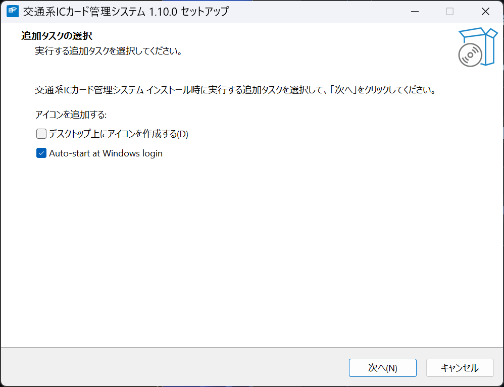{width=50%}

   | オプション | 内容 | 既定 |
   |------------|------|------|
   | デスクトップにアイコンを作成 | デスクトップにショートカットを作ります | オフ |
   | **Windowsログイン時に自動起動する（常駐）** | Windows にログインすると自動的に起動します | **オン** |

   常時カードを読み取る運用には、常駐をオンのままにしてください。手で起動したい場合はオフにします。

4. **部署及び支出科目** を選びます。ここでチャージの摘要と帳票テンプレートが切り替わります。

   | 選択肢 | チャージの摘要 |
   |--------|----------------|
   | **市長事務部局** | 役務費によりチャージ |
   | 企業会計部局（水道局、交通局等） | 旅費によりチャージ |

5. **データベースの保存先** で「**このPCのみで使用**」を選びます。

   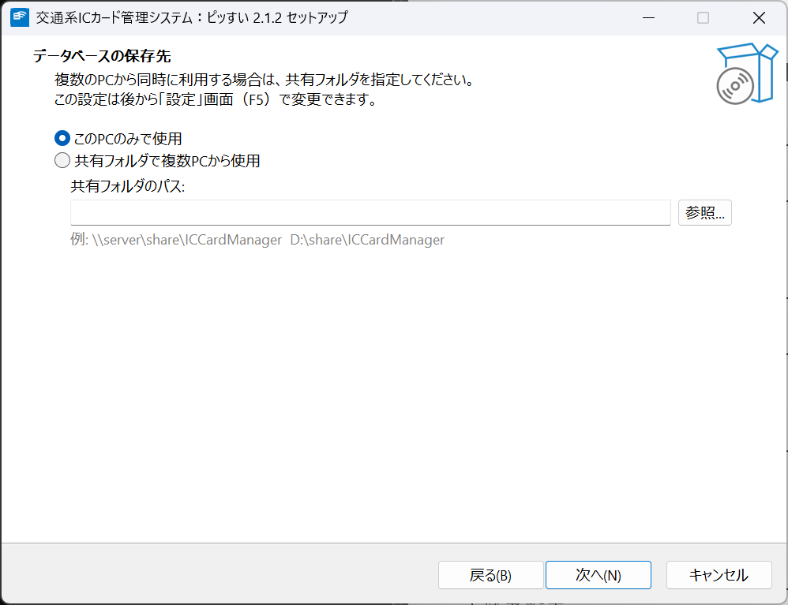{width=50%}

6. **帳票出力先フォルダ** を指定します。物品出納簿（月次帳票）の Excel ファイルがここに保存されます。

   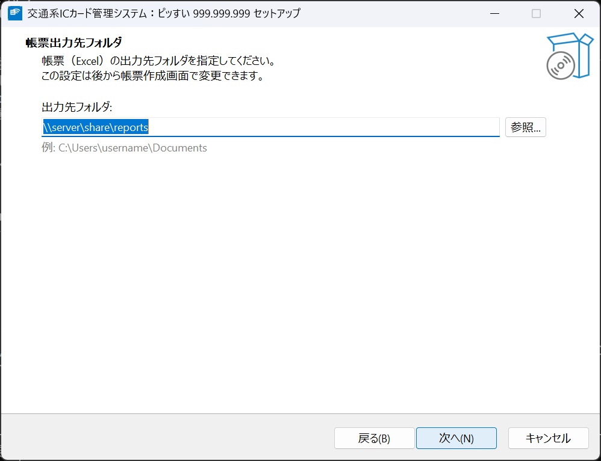{width=50%}

   新規インストールではマイドキュメントが初期表示されます。入れ直しのときは現在の設定が初期表示されるので、そのまま **次へ** で進めれば維持されます。

7. **インストール** をクリックします。

**できたことの確認**: スタートメニューに「ICCardManager」が追加され、起動するとメイン画面が表示されます。

**補足**

- 部署の選択は、あとから設定画面（**F5**）で変更できます。
- 帳票出力先は、あとから帳票作成画面（**F1**）の「出力先フォルダ」欄で変更できます。設定画面（F5）には帳票出力先の項目はありません。
- 帳票出力先には**書き込みできるフォルダ**を指定してください。読み取り専用のフォルダを指定すると、帳票の出力時にエラーになります。
- データベースの保存先は、あとから設定画面（**F5**）の「データベース保存先」欄で変更できます。変更したあとはピッすいを再起動してください。

### 1.3 複数のPCで使う場合のインストール

**この作業をするとき**: 複数の PC から同じ貸出・返却の記録を共有するとき。最大 20 台程度までを想定しています。

**前提**: 共有フォルダの作成とアクセス権の設定は、IT 担当者に依頼してください（IT担当者ガイド §3）。各 PC のログインアカウントで、その共有フォルダをエクスプローラーから開いてファイルを保存できる状態にしておきます。

**1 台目の PC**

1. [1.2](#12-1台のpcで使う場合のインストール) の手順 1〜4 と同じように進めます。
2. **データベースの保存先** で「**共有フォルダで複数PCから使用**」を選びます。

   {width=50%}

3. パス欄に共有フォルダのパスを入力します。**フォルダのパスだけ**を入力し、末尾のファイル名 `iccard.db` は付けません。

   | 形式 | 入力例 |
   |------|--------|
   | `\\サーバー名\共有名\...` の形式 | `\\Server\ICCardShare\ICCardManager` |
   | ドライブレターの形式 | `K:\ICCardShare\ICCardManager` |

4. 帳票出力先フォルダを指定し、**インストール** をクリックします。
5. ピッすいを起動します。共有フォルダに `iccard.db` が作られます。

**2 台目以降の PC**

1. 1 台目の共有フォルダに `iccard.db` ができていることを、エクスプローラーで確認します。
2. インストーラーを実行し、**データベースの保存先** で「**共有フォルダで複数PCから使用**」を選びます。
3. **1 台目と同じ共有フォルダのパス** を入力します。
4. インストールを完了し、ピッすいを起動します。

**できたことの確認**: 画面下部のステータスバーに「🔗 共有モード」と表示され、1 台目で登録した職員や交通系ICカードの情報が表示されます。

**補足**

- 1 台目を使っている最中でも、2 台目のインストールと起動は行えます。共有中の待ち合わせやネットワークが切れたときの動き、入れ直したときに前の設定がどう引き継がれるかは IT担当者ガイド §4 にまとめています。
- パスの形式が誤っていると、**次へ** をクリックしたときに入力の確認メッセージが表示されます。表示に従って入力し直してください。
- 保存先を入力したときに「指定されたフォルダーは存在しません」と確認が出たら、**いいえ** を選んでパスを見直してください。**はい** を選ぶと、そこに空のデータベースが新しく作られ、これまでの記録と切り離されます。新しい保存先をこれから作る場合だけ **はい** を選びます。
- 「参照...」ボタンの一覧にネットワークドライブが出ないときは、`\\サーバー名\共有名\...` の形式でパス欄に直接入力してください。帳票出力先フォルダを共有フォルダに置く場合も同じです。
- 共有フォルダのパスを誤って設定してしまったときは、設定画面（**F5**）の「データベース保存先」欄の横にある **デフォルトに戻す** ボタンを押すと、このPCだけで使う既定の保存先に戻ります。保存先欄を手で空欄にするより確実です。押したあとはピッすいを再起動してください。
- リストア（バックアップからの復元）を行うときは、ほかのすべての PC でピッすいを終了してから実行してください。
- 保存先を変えたあとは、ピッすいを再起動してください。

### 1.4 初回起動と初期設定

**この作業をするとき**: インストール後、はじめてピッすいを起動したとき。

**手順**

1. デスクトップまたはスタートメニューから **ICCardManager** を起動します。
2. Windows の警告（SmartScreen）が出たら、**詳細情報** → **実行** をクリックします。
3. メイン画面が表示されたら、**設定** ボタン（**F5**）をクリックします。

   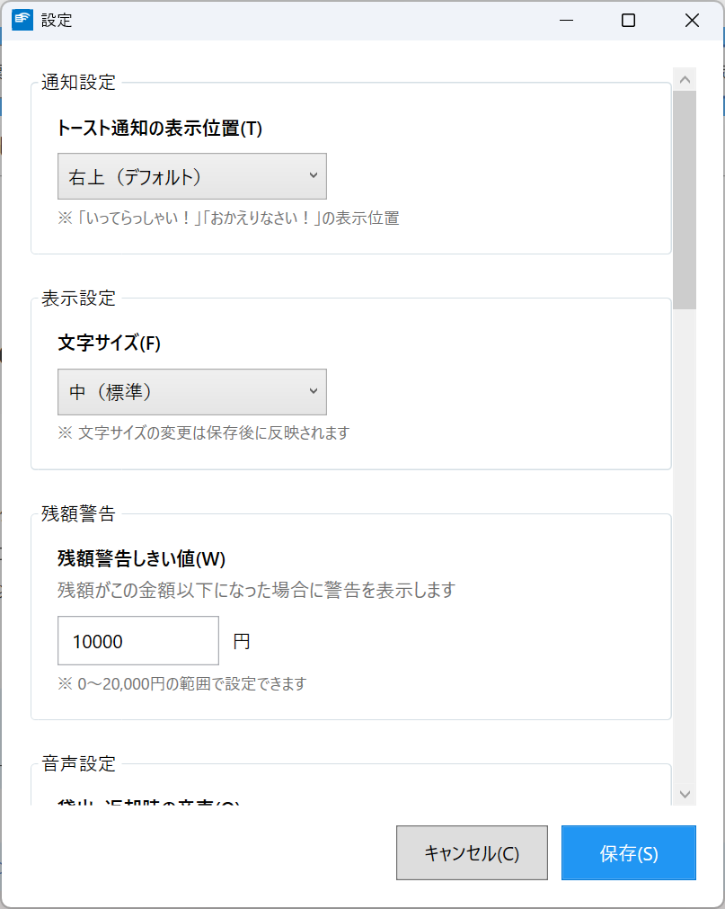{width=40%}

4. **部署設定** が自部署のもの（市長事務部局：役務費／企業会計部局：旅費）になっていることを確認します。
5. **バックアップ保存先** が、データベースとは別の場所になっていることを確認します。
6. **OK** をクリックして設定画面を閉じます。
7. 帳票作成画面（**F1**）を開き、**出力先フォルダ** が意図した場所になっていることを確認します。

**できたことの確認**: メイン画面に「職員証をタッチしてください」と表示され、待機中の状態になります。共有フォルダを指定した場合は、ステータスバーに「🔗 共有モード」と表示されます。

**補足**

- バックアップ保存先をデータベースと同じ場所にしないでください。機器の故障やネットワーク障害のときに、データベースとバックアップの両方を同時に失うおそれがあります。1 台で使っている場合はファイルサーバーなどの外部を、共有フォルダで使っている場合は共有フォルダとは別のフォルダかローカル PC を指定してください。
- 設定画面のそのほかの項目（通知の位置、文字サイズ、残額警告、音声、返却時の入力ダイアログなど）は「付録 A」にまとめています。運用しながら必要になったときに確認してください。
- データベースは、既定では `C:\ProgramData\ICCardManager\` に保存されます。この場所は Windows のどのユーザーでログインしても同じデータを参照します。

### 1.5 職員を登録する

**この作業をするとき**: 導入時に、カードを使う職員をまとめて登録するとき。

**前提**: 登録する職員の職員証を手元に用意してください。

**手順**

1. メイン画面の **職員管理** ボタン（**F2**）をクリックします。
2. **新規登録** ボタンをクリックします。右側のフォームに「職員証をタッチしてください」と表示されます。

   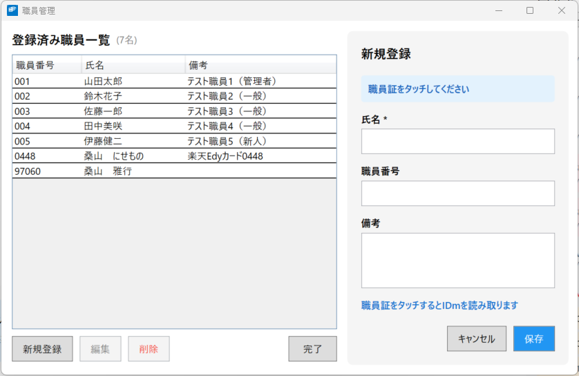{width=80%}

3. 職員証をICカードリーダーにタッチします。IDm が自動で入力され、表示が「職員証を読み取りました」に切り替わります。

   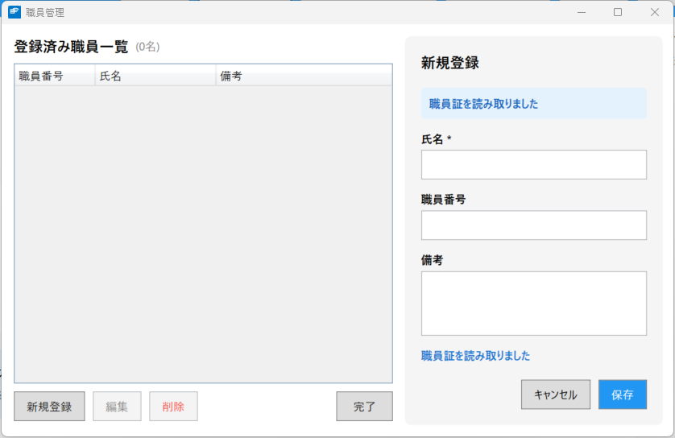{width=80%}

4. 職員情報を入力します。

   | 項目 | 必須 | 内容 |
   |------|------|------|
   | 氏名 | ○ | 職員の氏名 |
   | 職員番号 | - | 組織で定められた番号 |
   | 備考 | - | 任意のメモ |

5. **保存** ボタンをクリックします。
6. 登録する職員の人数だけ、手順 2 から繰り返します。

**できたことの確認**: 職員管理画面の一覧に登録した氏名が並び、選択すると IDm が表示されます。

### 1.6 交通系ICカードを登録する（4月から使い始める場合）

**この作業をするとき**: 新しく購入した交通系ICカードを登録するとき。新年度に合わせて 4 月から使い始める場合が該当します。

**前提**: 登録する交通系ICカードを手元に用意してください。年度の途中から使い始める場合は、代わりに [1.7](#17-年度途中から使い始める場合) に進みます。

**手順**

1. メイン画面の **カード管理** ボタン（**F3**）をクリックします。
2. **新規登録** ボタンをクリックします。
3. 交通系ICカードをリーダーにタッチします。IDm と残高が自動で読み取られます。
4. カード情報を入力します。

   | 項目 | 必須 | 内容 |
   |------|------|------|
   | カード種別 | ○ | はやかけん、nimoca、SUGOCA、Suica、PASMO、ICOCA、PiTaPa、Kitaca、TOICA、manaca、その他から選びます |
   | 管理番号 | ○ | 例: 001、002。空欄にすると自動で採番されます |
   | 備考 | - | 任意のメモ |

5. **保存** ボタンをクリックします。
6. 「カード登録方法の選択」ダイアログで **新規購入** を選びます。

   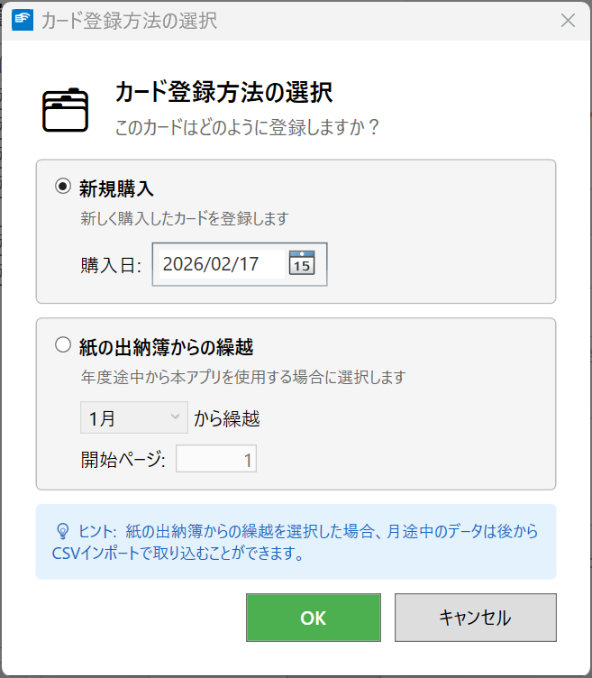{width=50%}

7. **購入日** を確認します。既定は当日です。数日前に購入したカードは、実際の購入日を指定してください。
8. **OK** ボタンをクリックします。
9. 登録するカードの枚数だけ、手順 2 から繰り返します。

**できたことの確認**: 画面右側の下部に「**登録しました**」と表示され、一覧に追加されたカードが選択された状態になります。履歴一覧には「新規購入」の行が作られ、残額にカードの残高が記録されています。帳票のページ番号は 1 ページから始まります。

**補足**

- カード種別の初期表示は「nimoca」です。登録するカードに合わせて選び直してください。IDm からカード種別を自動で判別することはできないため、必ず手で選びます。
- 残高はタッチしたときに自動で読み取られます。手で入力しないでください。
- 「**利用履歴の取込に失敗**」と表示されたときは、カードの登録は済んでいますが、台帳にこのカードの行が 1 行も作られていません。放置すると月次帳票の残額が実際の残高と合わなくなります。履歴画面の CSV インポートで利用履歴を取り込むか（[1.7.2](#172-カードに残っていない履歴を取り込む)）、履歴画面から登録時の残高の行を手で追加してください。カードをもう一度タッチして登録し直すことはできません。
- 「**登録時の残高の記録に失敗**」と表示されたときは、登録時の残高の行（「新規購入」または「○月から繰越」）だけが台帳に記録できていません。この行はそのカードで唯一の受入の行なので、欠けたままだと年度を通して「受入 − 払出 = 残額」が合わなくなります。履歴画面から手で追加してください。この場合は CSV インポートでは補えません。
- すべてのカードを登録したら、[1.7.3](#173-取り込んだあとの帳票を確かめる) の手順で帳票を出し、登録内容が正しく反映されていることを確かめてください。

### 1.7 年度途中から使い始める場合

紙の物品出納簿で管理していたカードを、年度の途中からピッすいへ引き継ぐ手順です。次の 3 つを順に行います。

1. 紙の出納簿の残高と累計を引き継いでカードを登録します（[1.7.1](#171-紙の出納簿から引き継ぐ)）。
2. カードに残っていない当月の履歴を取り込みます（[1.7.2](#172-カードに残っていない履歴を取り込む)）。
3. 帳票を出して、引き継ぎが正しくできたかを確かめます（[1.7.3](#173-取り込んだあとの帳票を確かめる)）。

#### 1.7.1 紙の出納簿から引き継ぐ

**この作業をするとき**: 紙の物品出納簿で管理していた交通系ICカードを、年度の途中でピッすいへ移すとき。

**前提**: 紙の出納簿から次の 4 つを控えておいてください。

- 前月末の残高（繰越額）
- 紙の出納簿で最後に使ったページ番号
- 前月末時点の累計受入
- 前月末時点の累計払出

**手順**

以下は、4 月〜5 月を紙の出納簿（2 ページ分）で管理し、6 月 1 日からピッすいで管理する例です。

1. メイン画面の **カード管理** ボタン（**F3**）をクリックします。

   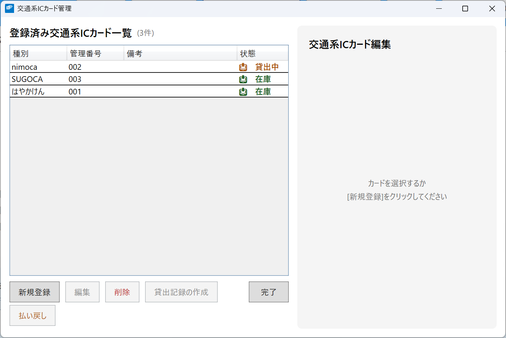{width=60%}

2. **新規登録** ボタンをクリックします。
3. 交通系ICカードをリーダーにタッチします。IDm と残高が自動で読み取られます。
4. カード種別・管理番号・備考を入力します。
5. **保存** ボタンをクリックします。
6. 「カード登録方法の選択」ダイアログで **紙の出納簿からの繰越** を選びます。

   {width=50%}

7. **繰越月** を選びます。例では「5月」（5 月まで紙で管理し、6 月からピッすいで管理するため）です。初期表示は前月です（7 月に作業する場合は「6月」）。
8. すぐ下に表示される **繰越レコードの日付**（繰越月の翌月 1 日）が意図どおりかを確認します。
9. **開始ページ** に、紙の出納簿の続きのページ番号を入力します。例では「3」です。
10. **繰越額** に、紙の出納簿の前月末残高を入力します。
11. **累計受入** に、紙の出納簿の前月末時点の累計受入金額を入力します。
12. **累計払出** に、紙の出納簿の前月末時点の累計払出金額を入力します。
13. **OK** ボタンをクリックします。
14. 管理しているカードの枚数だけ、手順 2 から繰り返します。

**できたことの確認**: メイン画面の履歴一覧に「5月から繰越」の行が表示され、残額に入力した繰越額が記録されています。年度途中の繰越行の受入金額欄は空欄です（受入金額が表示されるのは 4 月の「前年度より繰越」行だけです）。

**補足**

- **繰越額はカードの現在残高より優先して記録されます**。既定値としてカードの現在残高が表示されますが、月の途中で導入する場合、その日までの利用で残高は月初より少なくなっています。必ず紙の出納簿の前月末残高を入力してください。桁を誤っても登録は成功し、その後の利用はカードの実残高に追随するため、誤りは登録時の行だけに残って年度を通して累計が合わなくなります。
- 登録後にメイン画面へ「⚠️ 導入時の残額が直後の記録と合いません」の警告が出たら、警告をクリックして登録時の行を開き、**逆算した金額を適用** で直してください。
- **開始ページ・累計受入・累計払出は登録時にしか設定できません**。誤って入力すると、その年度の 5 月以降の帳票の「累計」欄がずれたまま出力され続けます。登録前に必ず紙の出納簿の値を確認してください。累計の加算は当該年度だけ有効で、翌年度からは通常の累計計算に戻ります。
- 繰越月は「登録日の月以前で最後に来た同じ月」として解釈されます。登録日の月より後の月を選ぶと**前年の同じ月**として扱われ、その旨の注意書きが表示されます。意図しない場合は選び直してください。
- 繰越月に**当月**を選ぶと、繰越レコードの日付は翌月 1 日（未来の日付）になります。その月のうちは紙の出納簿での管理を続け、ピッすいでの貸出・返却は翌月から始めてください。
- 繰越月に **3月** を選ぶと、年度末のため「前年度より繰越」として記録されます。この場合は受入金額欄に残高が表示されます。
- **最も古い履歴の利用金額はずれることがあります**。交通系ICカードの履歴には利用金額そのものが保存されておらず、前後の残高の差から逆算しているためです。いちばん古い履歴（20 件目）にはそれより前の残高がないため、入力した繰越額との差額が利用金額として表示されます。これはカードの仕様上の制約で、2 番目以降の履歴の金額には影響しません。金額が誤っていれば、履歴画面の **編集** で正しい払出金額と残額に直してください。
- カードごとに繰越月・開始ページ・取り込む履歴の期間は異なります。複数枚まとめて導入するときは、次のように一覧にしておくと作業を進めやすくなります。

  | カード | 繰越月 | 開始ページ | 取り込む履歴 |
  |--------|--------|------------|--------------|
  | nimoca 001 | 5月 | 3 | 6月1日〜導入日 |
  | nimoca 002 | 5月 | 2 | 6月1日〜導入日 |
  | はやかけん 003 | 5月 | 4 | 6月1日〜導入日 |

#### 1.7.2 カードに残っていない履歴を取り込む

交通系ICカードには**最大 20 件**の利用履歴しか保存されません。カードを使うたびに古い履歴は消えていきます。月の途中から導入する場合、この 20 件で当月 1 日以降の利用をすべてカバーできるかどうかが分かれ目です。

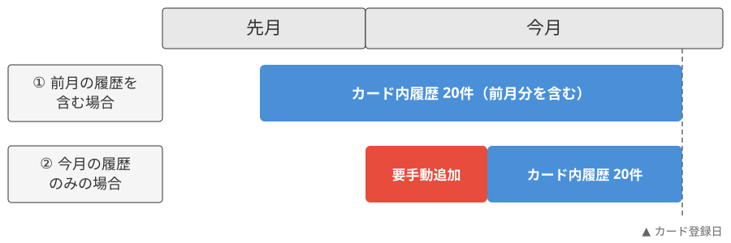{width=90%}

カードを登録したあと履歴一覧を開き、**前月以前の履歴が含まれているか**を確認してください。含まれていれば当月の履歴はすべてカードに残っているので、この節の作業は不要です。当月の履歴しか表示されない場合は、月初めの一部が欠けている可能性があります。紙の出納簿と照らし合わせ、欠けている分をこの節の手順で補ってください。件数が数件なら、履歴画面の **追加** ボタンから 1 件ずつ手で入力してもかまいません。

**この作業をするとき**: カードに残っていない当月の利用履歴を、紙の出納簿から補うとき。

**前提**: 紙の出納簿に、欠けている期間の利用日・摘要・金額・残額が記録されていること。

**手順**

1. メイン画面の **データ入出力** ボタン（**F4**）をクリックします。

   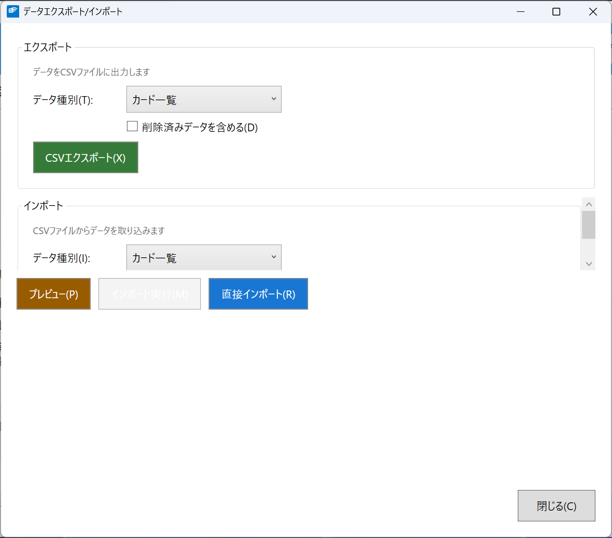{width=50%}

2. エクスポートセクションで **利用履歴** を選んでエクスポートし、ヘッダー行だけのファイルをテンプレートとして入手します。
3. テンプレートを Excel で開き、欠けている履歴を次の形式で記入します。

   ```
   ID,日時,カードIDm,管理番号,摘要,受入金額,払出金額,残額,利用者,備考
   ```

   | 列名 | 入力方法 | 備考 |
   |------|----------|------|
   | ID | **空欄** | 新規追加は空欄にします |
   | 日時 | `YYYY-MM-DD HH:MM:SS` | 例: `2024-06-03 09:15:00` |
   | カードIDm | カードの IDm | カード一覧の CSV エクスポートで確認できます。取り込み先のカードを画面で指定する場合は空欄でも可 |
   | 管理番号 | カードの管理番号 | 例: `001` |
   | 摘要 | 利用内容 | 例: `鉄道（博多駅～天神駅）` |
   | 受入金額 | チャージ金額 | チャージのときだけ入力（利用時は空欄） |
   | 払出金額 | 利用金額 | 利用のときだけ入力（チャージ時は空欄） |
   | 残額 | 利用後の残高 | 前の行の残額 ＋ 受入 − 払出 と一致させます |
   | 利用者 | 利用した職員名 | |
   | 備考 | メモ | 必要に応じて記入 |

   記入例:

   ```
   ID,日時,カードIDm,管理番号,摘要,受入金額,払出金額,残額,利用者,備考
   ,2024-06-03 09:15:00,0102030405060708,001,鉄道（博多駅～天神駅）,,220,4780,山田太郎,
   ,2024-06-03 17:30:00,0102030405060708,001,鉄道（天神駅～博多駅）,,220,4560,山田太郎,
   ,2024-06-05 10:00:00,0102030405060708,001,役務費によりチャージ,5000,,9560,,
   ,2024-06-07 08:45:00,0102030405060708,001,鉄道（博多駅～福岡空港駅）,,260,9300,鈴木花子,
   ```

   最初の行の残額は、[1.7.1](#171-紙の出納簿から引き継ぐ) で入力した繰越額からの続きになるようにします。上の例では、繰越残額 5,000 円から最初の 220 円の利用で 4,780 円になっています。

4. Excel の **名前を付けて保存** で「**CSV UTF-8（コンマ区切り）(\*.csv)**」を選んで保存します。
5. データ入出力画面のインポートセクションで、データ種別に **利用履歴** を選びます。
6. **プレビュー** ボタンをクリックし、作成した CSV ファイルを選びます。

   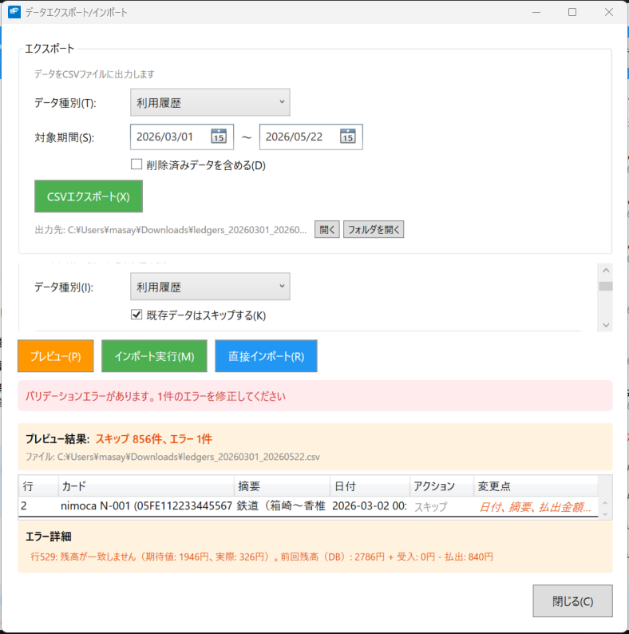{width=85%}

7. プレビューの内容、とくに残額のつながりを確認します。

   | アクション表示 | 意味 |
   |----------------|------|
   | **追加**（緑色） | 新規データとして追加されます |
   | **修正**（オレンジ色） | 既存データが修正されます |
   | **スキップ**（灰色） | 同じデータがすでにあるため取り込みません |
   | **復元**（青色） | 削除されたデータが復元されます |

8. 問題がなければ **インポート実行** ボタンをクリックします。
9. メイン画面に戻り、履歴一覧に取り込んだデータが正しく並んでいることを確認します。

**できたことの確認**: 画面に「**インポート完了: <ファイル名>**」と表示されます。この表示は取り込みが確定したときだけ出るので、データが入ったかどうかの判断に使えます。

**補足**

- CSV の文字コードは **UTF-8（BOM 付き）を推奨** します。ピッすいのエクスポートはこの形式なので、エクスポートしたファイルをそのまま編集する運用なら意識する必要はありません。Shift_JIS のファイルも自動で判別して取り込めます。Excel の「名前を付けて保存」で単に「CSV（コンマ区切り）」を選ぶと Shift_JIS になります。
- どちらの文字コードとしても読めないファイルは、取り込みを行わずにエラーで中断します。データが壊れたまま登録されることはありません。Excel で開き直し、「CSV UTF-8（コンマ区切り）」で保存し直してください。
- CSV に IDm が正しく入っていれば、画面での取り込み先カードの指定は不要です。IDm を入れない場合は「インポート先カード」でカードを指定してください。
- プレビューを省いて **直接インポート** で取り込むこともできます。この場合、画面に表示していたプレビューはクリアされます。別のファイルのプレビューを表示したままだったときは、あらためて **プレビュー** からやり直してください。
- 「操作ログへの記録に失敗しました」と併記されたときも、データの取り込みは完了しています。同じファイルを取り込み直さないでください。監査記録が必要な場合は IT 担当者に相談してください。
- カードごとに CSV を分けても、1 つの CSV にカードIDm 列を正しく設定して全カード分をまとめてもかまいません。

**一部エラーで終わったときの対処**

対処はデータ種別によって異なります。ダイアログの見出しで見分けられます。

| データ種別 | 1 行でもエラーになったときの結果 | ダイアログの見出し | 対処 |
|-----------|--------------------------------|-------------------|------|
| 職員 / カード / **利用履歴** | **1 件も登録されません**。それまで正常だった行も取り消されます | 「**インポートを中断しました**」 | CSV 全体を直し、**そのまま丸ごと**取り込み直します |
| 利用履歴**詳細** | エラーにならなかった行は**取り込みが確定します** | 「**インポート完了（一部エラー）**」 | **エラー行だけ**を残した CSV を作り直します |

「インポートを中断しました」と表示された場合は、本文にも「登録が確定した行はありません」と案内されます。画面下部のエラー一覧を見て CSV を直し、あらためて **プレビュー** → **インポート実行** を行ってください。取り込み前の状態に戻っているため、二重登録の心配はありません。プレビューもそのまま残ります。

「インポート完了（一部エラー）」と表示された場合は、確定した行があるため、同じファイルをそのまま取り込み直すと**二重に登録**されます。このとき「既存データはスキップする」オプションは効かないため、二重登録を自動では防げません。次の手順で対処してください。

1. 画面下部の**エラー一覧**で、行番号とエラー内容を確認します。
2. **エラーになった行だけ**を残した新しい CSV を作成します。正常に取り込まれた行は含めません。
3. そのファイルで **プレビュー** を実行し、内容を確認してから **インポート実行** をクリックします。

1 件でも登録が確定すると、**インポート実行** ボタンは押せなくなります。同じファイルを誤って取り込み直さないための動作です。エラー一覧は画面に残るので、そのまま修正作業に使えます。

#### 1.7.3 取り込んだあとの帳票を確かめる

**この作業をするとき**: 導入作業を終えたあと、帳票が正しく出ることを確かめるとき。

**前提**: カードの登録と、必要な履歴の取り込みが終わっていること。

**手順**

1. メイン画面の **帳票** ボタン（**F1**）をクリックします。
2. 対象月（導入した月）とカードを選びます。
3. **事前チェック** ボタンをクリックし、警告が出ないことを確認します。
4. **作成** ボタンをクリックします。
5. 出力された Excel ファイルを開き、次を確認します。

   | 確認項目 | 期待される結果 |
   |----------|----------------|
   | ページ番号 | 紙の出納簿の続き番号から始まっている（例: 3 ページから） |
   | 繰越行 | 「○月から繰越」として前月までの残高が記載されている（受入金額欄は空欄） |
   | 履歴データ | 取り込んだ履歴が正しく表示されている |
   | 月計 | 受入金額・払出金額の月計が正しく計算されている |

**できたことの確認**: 上の 4 項目がすべて期待どおりで、「受入 − 払出 = 残額」が成り立っています。

**補足**

- 事前チェックで警告が出たときの対処は「2.2」を参照してください。
- 帳票のページ番号は、カード登録時に指定した開始ページから自動で振られます。開始ページは登録時にしか設定できないので、値が誤っていた場合は帳票の出力前に気付けるよう、この確認を必ず行ってください。

### 1.8 導入時のよくある質問

**Q1: 月の最初からピッすいで管理する場合、CSV の取り込みは必要ですか。**

A1: 不要です。カード登録時に「紙の出納簿からの繰越」を選び、繰越月と開始ページを設定するだけで完了します。翌日以降の利用は、通常の貸出・返却の操作で自動的に記録されます。月の途中から導入する場合でも、カード内に当月の履歴がすべて残っていれば取り込みは不要です（[1.7.2](#172-カードに残っていない履歴を取り込む)）。

**Q2: 紙の出納簿の開始ページ番号がわかりません。**

A2: 紙の物品出納簿の最後のページ番号を確認し、その次の番号を「開始ページ」に設定してください。開始ページは登録時にしか設定できないため、登録前に必ず紙の出納簿を確認してください。

**Q3: CSV の残額が合いません。**

A3: 残額は「前の行の残額 ＋ 受入金額 − 払出金額」で計算されます。紙の出納簿と照合して正しい値を入力してください。プレビューを使うと、取り込む前に整合性を確認できます。

**Q4: 新年度（4月）から管理を開始する場合はどうしますか。**

A4: 2 つの方法があります。前年度末にカードを新規購入した場合は「新規購入」を選びます（[1.6](#16-交通系icカードを登録する4月から使い始める場合)）。前年度から継続して使っているカードの場合は「紙の出納簿からの繰越」を選び、繰越月を「3月」（前年度の最終月）、開始ページを「1」に設定します（[1.7.1](#171-紙の出納簿から引き継ぐ)）。

**Q5: 導入後に過去の履歴を追加で取り込めますか。**

A5: 取り込めます。CSV の取り込みはいつでも実行できます。「既存データはスキップする」オプションがオンの場合、CSV と既存データが**全項目一致する行だけ**が取り込まれず、備考や管理番号などいずれかの項目に差があれば更新されます。重複して登録されることはありません。

---

## 第2部 毎月すること

### 2.1 物品出納簿（月次帳票）を出す

**この作業をするとき**: 毎月初めに、前月分の物品出納簿を出すとき。

**前提**: 前月に貸し出した交通系ICカードがすべて返却されていること。貸出中のカードの利用分は帳票に載りません。

**手順**

1. メイン画面の **帳票** ボタン（**F1**）をクリックします。

   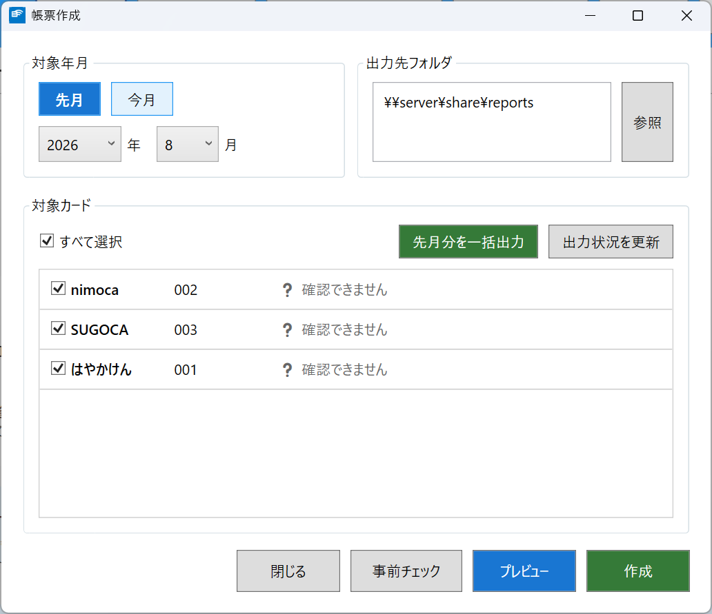{width=40%}

2. カード一覧の上にある **先月分を一括出力** ボタンをクリックします。対象年月が先月に切り替わり、払戻済を除くすべての交通系ICカードが選ばれます。
3. **事前チェック** ボタンをクリックします。
4. 警告が出たときは [2.2](#22-出力前の事前チェックで警告が出たとき) の手順で直し、もう一度 **事前チェック** をクリックします。
5. **作成** ボタンをクリックします。
6. 出力先フォルダにできた Excel ファイルを開き、内容を確かめます。

**できたことの確認**: カード一覧の右端が対象のカードすべてで「✅ 出力済み（日時）」になり、一覧の上の集計が「未出力 0件」になっています。

**補足**

- カード一覧の右端の表示は次の意味です。

  | 表示 | 意味 |
  |------|------|
  | ✅ 出力済み（日時） | その月の帳票が出力先フォルダにあります。カッコ内は年度ファイルを最後に更新した日時です |
  | ⬜ 未出力 | その月の帳票がまだありません |
  | ❓ 確認できません | 出力先フォルダが見つからないか、帳票ファイルを開けませんでした。出力先フォルダの指定を確かめてください |
  | ⚠ 警告N件 | 事前チェックで問題が見つかったカードです。内訳は **事前チェック** ボタンで確認できます |

- 一覧の上には「2026年6月: 出力済み 3件 / 未出力 5件」のように、その月の進み具合がまとめて表示されます。どのカードを出したかをメモで管理する必要はありません。
- 出力済みかどうかは、出力先フォルダにある年度ファイル（`物品出納簿_○○_2026年度.xlsx`）を実際に開いて判定しています。ファイルを削除したり別のフォルダへ移したりすると「未出力」に戻ります。出力先フォルダを変えたときや、他の PC で出したファイルをコピーしたときは、**出力状況を更新** ボタンで最新にしてください。
- 払戻済のカードは「先月分を一括出力」では選ばれません。必要なときは一覧で手でチェックを付けてから **作成** をクリックします。
- 特定の月や特定のカードだけを出すときは、手順 2 の代わりに対象年月とカードを一覧から選び、**作成** をクリックします。

### 2.2 出力前の事前チェックで警告が出たとき

**この作業をするとき**: 帳票の **事前チェック**、または **作成** のときに警告が表示されたとき。

**前提**: 警告を直すには、対象のカードの履歴画面を開ける状態であること。

**手順**

1. 警告の一覧で行をクリックします。画面下部にその警告の詳しい説明と対処が表示されます。
2. 警告の種類を次の表で確かめます。

   | 警告 | 意味 | 直す場所 |
   |------|------|----------|
   | 未返却のまま月をまたいでいます | 前月以前に貸し出したカードが返却されていません。そのカードの利用分が帳票に載りません | カードをメイン画面でタッチして返却します |
   | ○月○日の貸出が未返却です | 対象月に貸出中のままの履歴があります。「（貸出中）」の行は帳票に出力されません | カードをメイン画面でタッチして返却します |
   | 残額がマイナスです | 交通系ICカードの残額がマイナスになっています。入力の誤りが確定しています | 履歴画面で該当行の受入金額・払出金額を直します |
   | 繰越額と先頭行の残額が一致しません | 「○月から繰越」の残額に先頭行の受入・払出を加減した額が、先頭行の残額と合いません | 前月の帳票と突き合わせ、履歴画面で該当行を直します |
   | 受入 − 払出 = 残額 が成立しません | 月計または累計の検算が合いません。検収で指摘される可能性があります | 履歴画面で残高の食い違いを直します（下の補足も参照） |

3. 表の「直す場所」に従って直します。
4. 帳票画面に戻り、もう一度 **事前チェック** をクリックします。

**できたことの確認**: 事前チェックの警告が 0 件になり、カード一覧の「⚠ 警告N件」の表示が消えています。

**補足**

- 警告の一覧にはカード名・利用日・摘要・金額が表示されます。履歴画面で同じカードを開き、表示された利用日の行を探してください。
- 「受入 − 払出 = 残額 が成立しません」が年度を通して出るのに、前年度からの繰越額は正しい場合は、カード登録時に入力した残高の誤りが典型です。メイン画面の警告「導入時の残額が直後の記録と合いません」をクリックして登録時の行を開き、**逆算した金額を適用** で直してください。
- **作成** ボタンから実行したときは「中止して修正する」（既定）と「このまま作成する」を選べます。警告があっても帳票を作ること自体はできます。ただし「未返却のまま月をまたいでいます」「受入 − 払出 = 残額 が成立しません」は、そのまま提出すると検収で差し戻される可能性が高い項目です。原則として直してから作成してください。
- 既に出力した Excel ファイルは、あとからデータを直しても自動では書き換わりません。該当する年月とカードを選び直して、帳票を作り直してください。

### 2.3 バックアップが動いているか確かめる

**この作業をするとき**: 月に一度。バックアップは自動で行われるため、失敗が静かに続いても気づきにくくなりがちです。

**手順**

1. メイン画面の **システム管理** ボタン（**F6**）をクリックします。
2. 「バックアップ状況」の欄を開きます。
3. 次の項目を確かめます。

   | 表示項目 | 確かめること |
   |----------|--------------|
   | 最終成功 | 「本日」「昨日」など、最近の日付になっていること。一度も記録がないときは「記録なし」と表示されます |
   | 保持世代 | 保存先にあるバックアップの数と上限（例: 「保持世代: 12 / 30」） |
   | 保存先の空き容量 | 余裕があること。「不明」のときは保存先を確かめてください |
   | 保存先 | 意図したフォルダのパスになっていること |
   | 最終実施PC | 最後にバックアップを行った PC 名（共有モードのときだけ表示されます） |
   | 最終最適化(VACUUM) | 月次のデータベース最適化を最後に行った日付と PC 名（共有モードのときだけ表示されます） |

4. 欄の先頭のアイコンが **✔** であることを確かめます。**⚠** のときは補足を読んでください。

**できたことの確認**: 「最終成功」が数日以内の日付で、アイコンが ✔ になっています。

**補足**

- 自動バックアップはアプリの起動のたびに作られます。**バックアップのある日を新しい順に 30 日分**残し、各日についてはその日の最後に作られた 1 つだけを残します。
- 手動バックアップとリストア前の自動退避は、日単位の整理の対象外です。新しい順に **最新 10 件** まで残ります。
- この保持ルール（自動 30 日分 / 手動 10 件）は変更できません。30 日より前までさかのぼる必要があるときや長期保管が要るときは、手動バックアップ（[6.1](#61-手動バックアップ)）を取り、バックアップ先とは別の場所へ保管してください。バックアップ先フォルダの中に置いたままにすると、手で名前を付けたファイルも「最新 10 件」の枠を共有し、古い側から自動削除されます。
- 「30 日分」は暦日ではなく、バックアップがある日を数えます。長期休暇などでアプリを起動しなかった期間があっても、直近 30 日分の稼働日が残ります。
- 「最終成功」から 7 日を超えると、メイン画面に「自動バックアップが○日間成功していません」という警告が出ます。クリックするとシステム管理画面が開きます。手動バックアップが成功すると警告は消えます。
- 「設定した保存先『…』を使用できないため、上記の既定の場所に保存しています」と赤字で表示されているときは、指定した共有フォルダーにはバックアップが作られていません。設定画面（**F5**）でバックアップ先を確かめ、指定し直してください。
- 保存先フォルダに `.tmp` で終わるファイルが見えることがあります。書き込み途中の作業用ファイルで、24 時間以上経過したものは次回の自動バックアップ時に自動で削除されます。手で消す必要はありません。
- 空き容量やアクセス権を直しても警告が消えないときは、IT 担当者に依頼してください（IT担当者ガイド §6）。

---

## 第3部 人やカードが増減したとき

### 3.1 職員に関する作業

職員管理画面（メイン画面の **職員管理** ボタン、**F2**）で行う作業です。

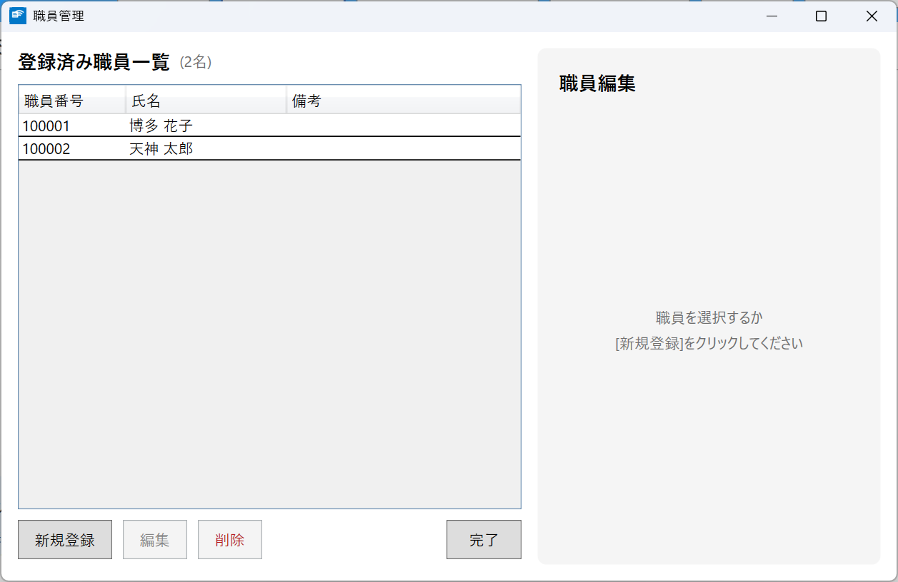{width=60%}

#### 3.1.1 職員が加わった

**この作業をするとき**: 異動や採用で、交通系ICカードを使う職員が増えたとき。

**前提**: 加わった職員の職員証を手元に用意してください。

**手順**

導入時と同じ手順です。[1.5 職員を登録する](#15-職員を登録する) の手順 1 から 5 までを行ってください。

**できたことの確認**: 職員管理画面の一覧に登録した氏名が並び、その職員証でメイン画面のタッチができます。

#### 3.1.2 職員の情報を直す

**この作業をするとき**: 氏名や職員番号が変わったとき。

**手順**

1. メイン画面の **職員管理** ボタン（**F2**）をクリックします。
2. 一覧から対象の職員を選びます。
3. **編集** ボタンをクリックします。

   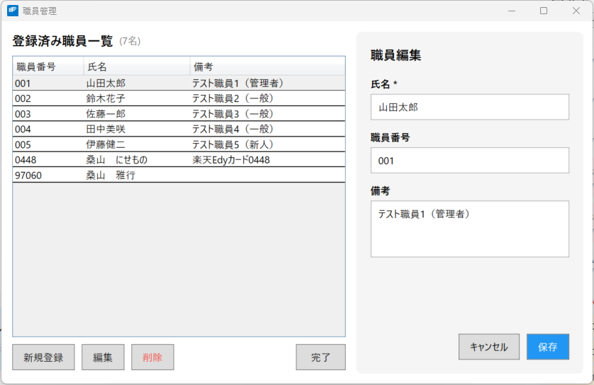{width=60%}

4. 情報を直します。
5. **保存** ボタンをクリックします。

**できたことの確認**: 一覧の表示が直した内容に変わっています。

#### 3.1.3 職員が退職・異動した

**この作業をするとき**: 職員が退職・異動し、交通系ICカードを使わなくなったとき。

**前提**: その職員が借りているカードがすべて返却されていること。

**手順**

1. メイン画面の **職員管理** ボタン（**F2**）をクリックします。
2. 一覧から対象の職員を選びます。
3. **削除** ボタンをクリックします。
4. 確認ダイアログで **はい** をクリックします。

**できたことの確認**: 一覧からその職員が消え、その職員証ではメイン画面のタッチができなくなっています。

**補足**: 削除しても過去の履歴は残ります。履歴照会では、削除した職員の氏名がそのまま表示されます。

#### 3.1.4 職員証を再発行した

**この作業をするとき**: 職員証を紛失・更新し、新しい職員証になったとき。

**前提**: 新しい職員証を手元に用意してください。

**手順**

1. メイン画面の **職員管理** ボタン（**F2**）をクリックします。
2. 一覧から対象の職員を選びます。
3. **編集** ボタンをクリックします。右側の編集フォームが入力できる状態になります。
4. 新しい職員証をICカードリーダーにタッチします。IDm 欄が新しい値に変わります。
5. **保存** ボタンをクリックします。

**できたことの確認**: 新しい職員証でメイン画面のタッチができ、古い職員証ではタッチできなくなっています。

**補足**: 職員を登録し直す必要はありません。同じ職員として、過去の履歴がそのまま引き継がれます。

### 3.2 交通系ICカードに関する作業

カード管理画面（メイン画面の **カード管理** ボタン、**F3**）で行う作業です。

#### 3.2.1 カードを追加する

**この作業をするとき**: 交通系ICカードを買い足したとき。

**前提**: 追加するカードを手元に用意してください。

**手順**

導入時と同じ手順です。[1.6 交通系ICカードを登録する（4月から使い始める場合）](#16-交通系icカードを登録する4月から使い始める場合) の手順で登録してください。年度の途中で買い足した場合も、購入したカードであれば「新規購入」を選びます。

**できたことの確認**: 一覧に追加したカードが並び、履歴一覧に「新規購入」の行が作られて、残額にカードの残高が記録されています。

#### 3.2.2 カードの情報を直す

**この作業をするとき**: カード種別・管理番号・備考を直すとき。

**手順**

1. メイン画面の **カード管理** ボタン（**F3**）をクリックします。
2. 一覧から対象のカードを選びます。
3. **編集** ボタンをクリックします。

   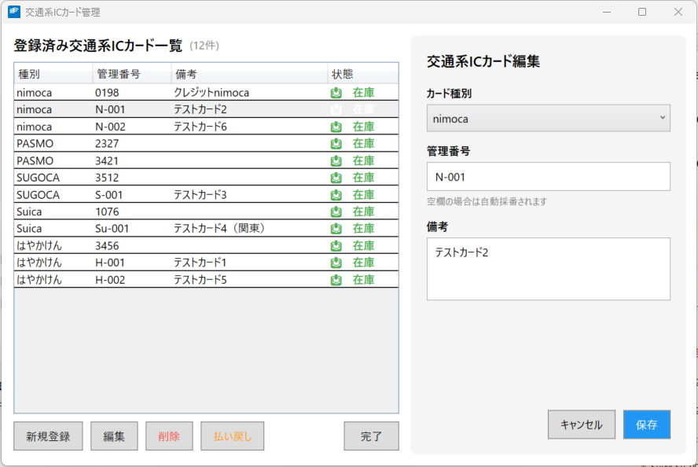{width=80%}

4. 情報を直します。
5. **保存** ボタンをクリックします。

**できたことの確認**: 一覧の表示が直した内容に変わっています。

**補足**

- 編集で変わるのはカード種別・管理番号・備考の 3 項目だけです。登録時に設定した「開始ページ」と、紙の出納簿から引き継いだ「累計受入」「累計払出」は編集の影響を受けません。これらは登録時にしか設定できません。
- 管理番号は同じカード種別の中で重複できません。既に使われている番号で保存すると「管理番号 ○○ は同じ種別で既に使用されています。別の番号を指定してください。」と表示されます。入力した内容はそのまま残るので、管理番号だけを直してもう一度 **保存** をクリックしてください。
- カード種別が違えば同じ番号を使えます（はやかけんの「001」と nimoca の「001」は共存できます）。削除したカードが使っていた番号も再利用できます。
- ただし番号を再利用したあとに、元のカードを復元することはできません。「管理番号 ○○ は同じ種別の別のカードが使用中のため、このカードを復元できません。」と表示されたときは、先に使用中のカードの管理番号を別の値に変えてから復元してください。

#### 3.2.3 カードを払い戻す

**この作業をするとき**: カードを使わなくなり、残額を払い戻したとき。

**前提**: カードが返却済み（貸出中でない）であること。

**手順**

1. メイン画面の **カード管理** ボタン（**F3**）をクリックします。
2. 一覧から払い戻すカードを選びます。
3. **払い戻し** ボタンをクリックします。
4. 確認ダイアログで現在の残高を確かめ、**はい** をクリックします。

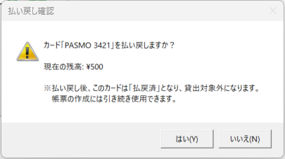{width=70%}

**できたことの確認**: 一覧のカードに「払戻済」と表示され、履歴に「払戻しによる払出」の行が追加されて残額が 0円 になっています。

**補足**

- 残額は払出金額として記録され、物品出納簿に反映されます。
- 払戻済のカードは一覧に残ります。過去の履歴を見るためで、貸出の対象からは外れます。

#### 3.2.4 カードを削除する

**この作業をするとき**: 誤って登録したカードなど、一覧から外したいとき。

**前提**: カードが返却済みであること。残額を払い戻すときは、削除ではなく [3.2.3](#323-カードを払い戻す) を行ってください。

**手順**

1. メイン画面の **カード管理** ボタン（**F3**）をクリックします。
2. 一覧から削除するカードを選びます。
3. **削除** ボタンをクリックします。
4. 確認ダイアログで **はい** をクリックします。

**できたことの確認**: 一覧からそのカードが消えています。

**補足**: 削除しても過去の履歴は残ります。

### 3.3 読み取らずに持ち出されたカードの貸出記録を作る

**この作業をするとき**: 職員がピッすいにタッチせずに交通系ICカードを持ち出し、そのことに職場で後から気付いたとき。

**前提**: 自分の職員証を手元に用意してください。対象のカードが払戻済でなく、貸出中でもないこと。

**手順**

1. メイン画面の **カード管理** ボタン（**F3**）をクリックします。
2. 一覧から、持ち出されたカードを選びます。
3. **貸出記録の作成** ボタンをクリックします。
4. 自分の職員証をICカードリーダーにタッチします。
5. **借用者** の一覧から、カードを持ち出した職員を選びます。
6. **貸出日時** を入力します。既定は現在時刻です。時刻は 24 時間制で「9:30」「17:05」のように入力します。
7. **貸出記録を作成** をクリックします。

**できたことの確認**: 一覧のそのカードが「貸出中」になり、手順 5 で選んだ職員の氏名が借用者として表示されています。

**補足**

- 記録される内容は次のとおりです。

  | 項目 | 内容 |
  |------|------|
  | 利用履歴の氏名 | 手順 5 で選んだ借用者 |
  | 操作ログの操作者 | 手順 4 でタッチしたあなた（庶務担当者） |
  | 残額 | カードが手元にないため読み取れません。直近の履歴の残額が引き継がれます |

- 入力は職員証をタッチしてから 5 分以内に終えてください。5 分を超えると操作者の認証が切れ、操作ログの操作者が「GUI操作」として記録されます（貸出記録そのものは正しく作られます）。中断したときは **キャンセル** で閉じてからやり直してください。
- 次の日時は指定できません。**未来の日時**は、持ち出した日時が現在より後になることはないためです。**そのカードの直近の履歴より前の日時**は、貸出中の記録が履歴の途中に入ると残額の並びが実際と食い違って表示されるためです。
- カードが返ってきたら、通常どおりメイン画面でタッチしてください。乗車区間や運賃は、そのときカードから読み取って記録されます。この作業は貸出中の状態を作るだけで、利用内容は作りません。
- 返却側にこの機能はありません。カードが返っているのに記録していないときは、メイン画面でタッチすれば通常の返却として記録されます。

### 3.4 繰越情報が失われたカードを復旧する

**この作業をするとき**: メイン画面に「紙の出納簿から移行したカードの繰越累計・開始ページ番号が失われています」という警告が表示されたとき。

**前提**: データベースの修正が必要なため、IT 担当者へ依頼できる状態であること。

**手順**

1. メイン画面の警告をクリックします。「繰越情報が失われたカード」の一覧が開きます。
2. カードごとに、失われた元の値（開始ページ番号・繰越累計受入・繰越累計払出・対象年度）と、値が消えた日時・操作者を確かめます。
3. 一覧のセルを選び、`Ctrl` + `C` でコピーします。見出し付きでコピーされます。
4. コピーした内容を IT 担当者に渡し、データベースの修正を依頼してください（IT担当者ガイド §4）。
5. 修正が反映されたら、アプリを起動し直します。

**できたことの確認**: 起動時に警告が表示されなくなっています。カード管理画面を開いて閉じたときにも、再確認されます。

**補足**

- 「（消失なし）」と表示されている項目は、そのカードでは失われていません。復旧の対象は、値が表示されている項目だけです。すべての項目を書き換えると、正しい値まで壊れます。
- 操作ログは 6 年で自動削除されるため、それより前に編集したカードは検出できません。心配なときは次の 2 点を確かめてください。
  - 累計受入・累計払出: **5月以降**の月次帳票の「累計」欄に、紙の出納簿時代の累計が加算されているか。4月の帳票では確認できません。4月は月計が累計を兼ねる様式のため累計行そのものがなく、値が失われていても正常な帳票と同じ見た目になります。
  - 開始ページ: 帳票のページ番号が、登録時に指定した開始ページから始まっているか。こちらは4月の帳票でも確認できます。
- 元の値は、システム管理画面（**F6**）の操作ログで、そのカードの「更新」の記録を開いても確認できます。変更前の値が記録されています。

### 3.5 残高不足で現金チャージした利用の扱い

**この作業をするとき**: 帳票や履歴に「支払額○○円のうち不足額○○円は現金で支払（旅費支給）」という備考の行があり、金額の意味を確かめたいとき。

交通系ICカードの残高が運賃に足りないとき、精算機で不足分を現金チャージしてから改札を通ることがあります。カードの履歴には「チャージ」と「利用」の 2 件が記録されますが、システムはこれを **1 件の履歴** としてまとめます。手で直す必要はありません。

たとえば、残高 76円 のカードで運賃 210円 の区間を利用し、精算機で 140円 を現金チャージした場合（不足額 134円 を 10円単位へ切り上げ）、利用後のカード残高は 6円 になります。このとき、次のように記録されます。

| 項目 | 値 |
|------|-----|
| 摘要 | 鉄道（A駅～B駅） |
| 払出金額 | 70円（運賃 210円 − 現金チャージ額 140円） |
| 残額 | 6円（利用後の実残高） |
| 備考 | 支払額210円のうち不足額140円は現金で支払（旅費支給） |

**できたことの確認**: この行でも「受入 − 払出 = 残額」が成立し、備考に現金で支払った額が記載されています。

**補足**

- 「不足額」は、実際に精算機で現金チャージした金額です。払出金額には、カードの元の残高から充てられた分だけが計上されます。
- 精算機のチャージは 10円単位に切り上げられるため、利用後にカード残高がわずかに残ることがあります（例では 6円）。この形もまとめの対象です。
- 500円・1000円 など、運賃を大きく上回る通常のチャージはまとめの対象になりません。チャージと利用が別々の行として記録されます。

---

## 第4部 年に一度すること

### 4.1 新しいバージョンに更新する

**この作業をするとき**: 新しいバージョンのピッすいが提供されたとき。

**前提**

- 使用しているすべての PC を同じバージョンに揃えてください。バージョンが混ざると、予期しない動作の原因になります。
- 更新の前に、すべての PC でピッすいを終了してください。
- アンインストールは不要です。既存のインストール先へ上書きされます。

**手順**

1. メイン画面の **システム管理** ボタン（**F6**）をクリックします。
2. 「バックアップ」タブで **バックアップを実行** をクリックし、完了したことを確かめます。
3. すべての PC でピッすいを終了します。
4. 新しい `ICCardManager_Setup_x.x.x.exe` を用意します。
5. インストーラーを実行します。インストール先は、既存のインストールフォルダが自動で選ばれます。
6. ウィザードの指示に従い **インストール** をクリックします。
7. 使用しているすべての PC で、手順 5・6 を繰り返します。
8. アプリを起動して動作を確かめます。

**できたことの確認**: タイトルバーのバージョン番号が新しくなり、履歴データが今までどおり表示されます。共有モードのときは、ステータスバーに「🔗 共有モード」と表示されます。

**補足**

- 上書きインストールでデータが失われることはありません。次のデータは、プログラムのフォルダとは別の場所に保存されています。

  | データ | 保存場所 |
  |--------|----------|
  | データベース（履歴・カード・職員情報） | `C:\ProgramData\ICCardManager\` |
  | バックアップファイル | `C:\ProgramData\ICCardManager\backup\` |
  | データベース保存先の設定 | `C:\ProgramData\ICCardManager\database_config.txt` |
  | 部署設定 | `C:\ProgramData\ICCardManager\department_config.txt` |
  | ログファイル | `C:\ProgramData\ICCardManager\Logs\` |

  アプリケーション本体（`C:\Program Files\ICCardManager\`）と、マニュアル・テンプレートは上書きされます。

- 起動時にも自動でバックアップが作られますが、更新の前には手順 2 の手動バックアップを行ってください。
- 一部の PC だけ古いままだと、起動時に「ピッすいの更新が必要です」と表示されて操作できなくなります。対処は [5.7](#57-ピッすいの更新が必要ですと表示される) を参照してください。
- 新しいバージョンの案内を共有フォルダーで配る仕組み（`latest_version.txt`）の設定は、IT 担当者に依頼してください（IT担当者ガイド §7）。

### 4.2 古いデータを削除する

**この作業をするとき**: 年に一度、古いデータが整理されていることを確かめるとき。削除の操作そのものは要りません。

6 年を過ぎたデータ（出納記録と操作ログ）は、アプリの起動時に自動で削除されます。監査対応の保存期間に基づく動作です。

**できたことの確認**: 履歴画面で 6 年より前の履歴が表示されなくなっていれば、削除が行われています。

**補足**

- 削除は、ほかの処理がデータベースを使っていないことを確かめてから行われます。起動直後に交通系ICカードのタッチなどが重なって確認が取れないときは、その回の削除は見送られ、次の起動時に改めて行われます。記録が失われることはありません。
- 職員データとカードデータは自動削除されません。削除しても一覧から見えなくなるだけで、過去の履歴に氏名やカード名を表示するために保持されます。

### 4.3 同一とみなす駅・バス停を登録する

この作業は年に一度ではなく、必要になったときに行います。

**この作業をするとき**: 摘要から目的地が消えてしまう、という問い合わせがあったとき。名前は違うが実質同じ場所である駅・バス停を登録します。

バスで「天神日銀前 → 下原中央」「下原中央 → 天神中央郵便局前」と移動すると、摘要が「バス（天神日銀前～天神中央郵便局前）」となり、実際に用務のあった下原中央が消えます。システムが「降車地と次の乗車地が同じ」を乗り継ぎとみなして途中を省くためで、道路を挟んで向かい合う 2 つの停留所は、名前が違うと往復だと判断できません。この 2 つを同一とみなすグループへ登録すると「バス（天神日銀前（天神中央郵便局前）～下原中央 往復）」となり、目的地が摘要に残ります。

**手順**

1. メイン画面で **F6** を押して、システム管理画面を開きます。
2. 「摘要の設定」の **［同一とみなす駅・バス停を設定］** をクリックします。
3. **［追加］** をクリックします。
4. 同一とみなす名前を、読点（、）で区切って 2 つ以上入力します（例: `天神日銀前、天神中央郵便局前`）。
5. **［保存］** をクリックします。

**できたことの確認**: 一覧に登録したグループが表示されます。以後に作られる摘要では、この 2 つが同じ場所として扱われます。

**補足**

- 括弧の中は、帰りに降りたバス停です（「乗車したバス停（帰りに降りたバス停）～目的地 往復」）。行きと帰りが同じ場所なら、括弧は付きません。
- 3 つ以上（例: `天神、西鉄福岡(天神)、天神南`）も登録できます。1 グループには 2 つ以上の名前が必要です。
- 既にあるグループを直すときは、一覧で選んで ［編集］、不要になったら ［削除］ を使います。追加・編集・削除は操作のたびに保存されるため、［閉じる］で取り消されることはありません。
- 1 つの駅・バス停は、1 つのグループにだけ登録できます。別のグループに登録済みの名前を入力すると、どのグループと重複しているかを示すエラーが表示されます。
- 登録しても、既に保存されている履歴の摘要は書き換わりません。反映されるのは、以後に作成・再生成される摘要です。過去の履歴を直したいときは、履歴画面で該当行の摘要を直接編集するか、履歴を分割・統合し直してください。
- 保存後は、アプリを起動し直さずに反映されます。複数の PC で共有しているときは、ほかの PC には次回起動時に反映されます。
- 登録に向くのは、次のような場合です。

  | 状況 | 例 |
  |------|-----|
  | 道路を挟んで向かい合うバス停 | 天神日銀前 ／ 天神中央郵便局前 |
  | 同じ場所だが事業者で名前が違う駅 | 天神 ／ 西鉄福岡(天神) |
  | 同じ場所だが路線で名前が違う駅 | 千早 ／ 西鉄千早 |

  逆に、歩いて移動するような離れた場所は登録しないでください。実際には乗車していない区間が往復としてまとめられ、摘要が実態と食い違います。

---
