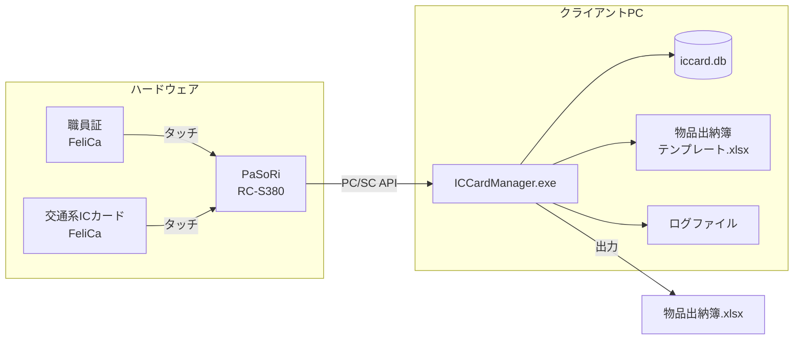
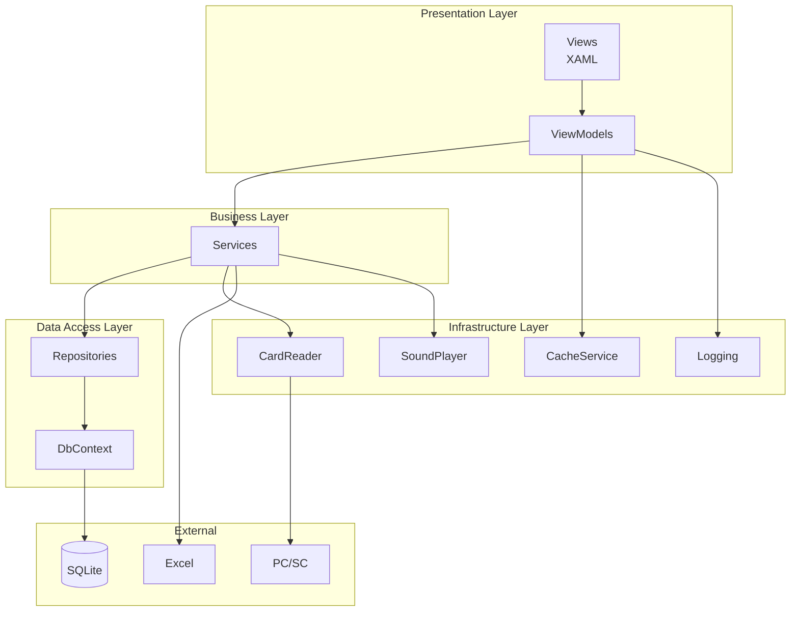
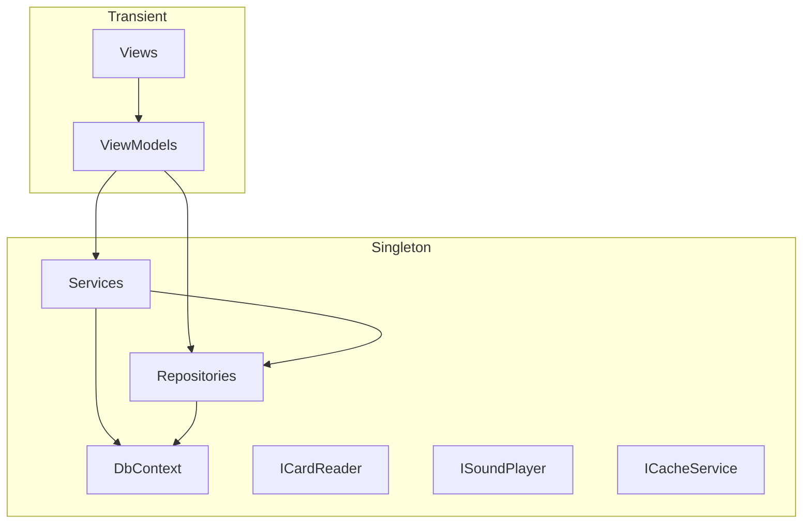
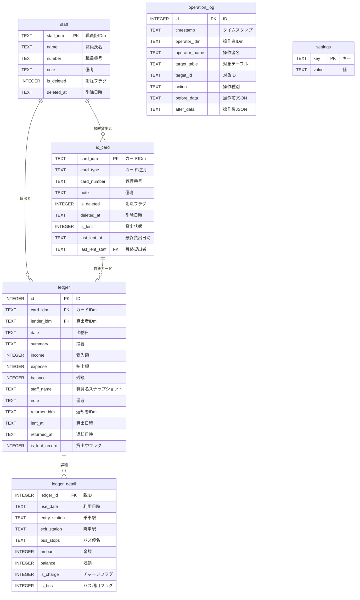
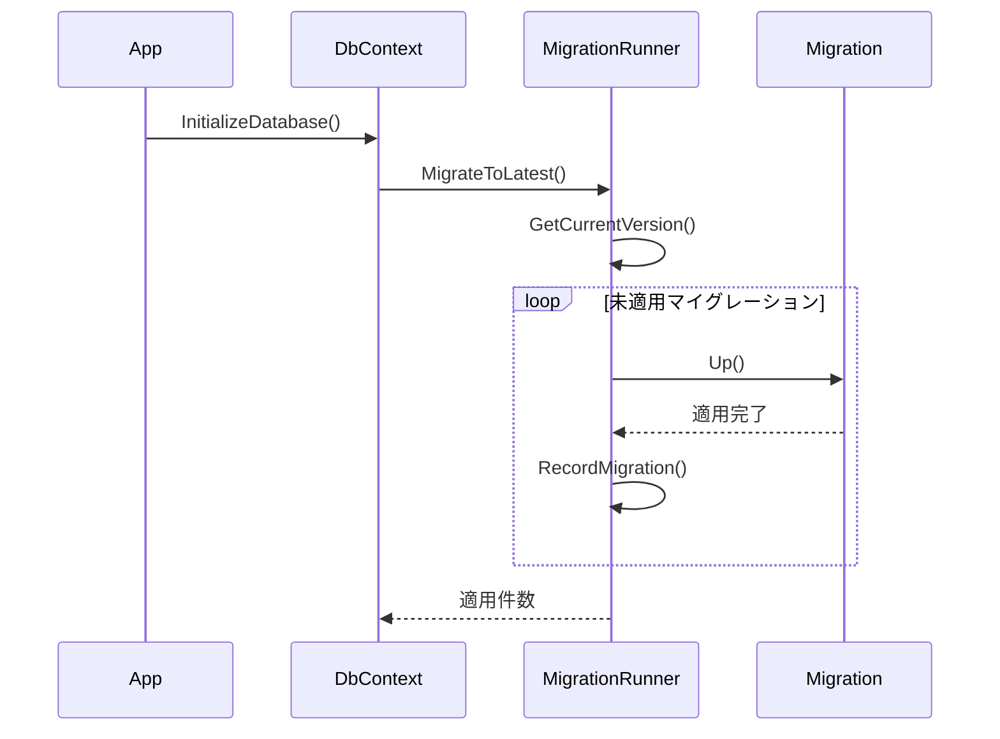
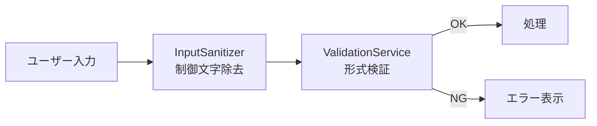
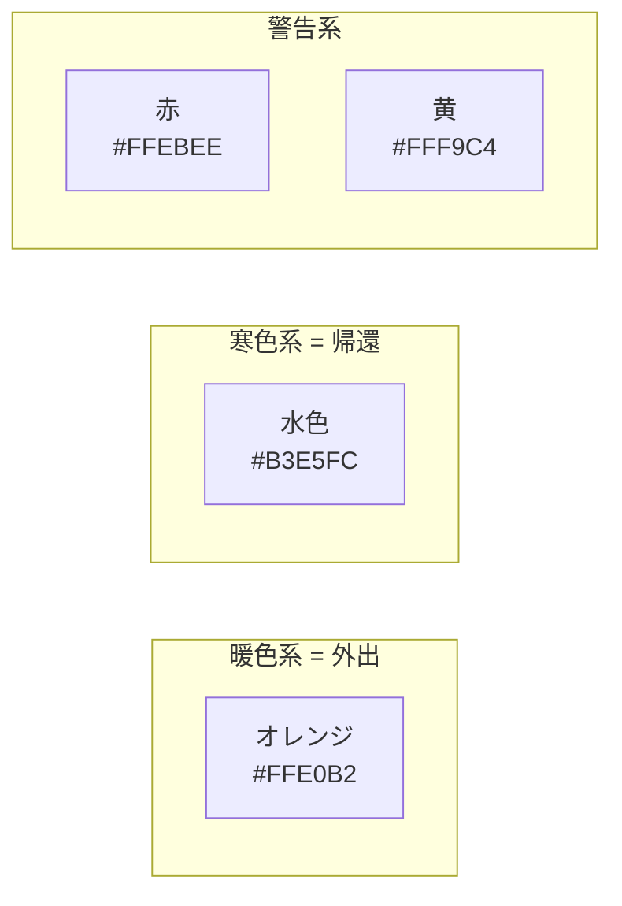

# 交通系ICカード管理システム 開発者ガイド

**バージョン**: 1.0
**最終更新日**: 2025年12月

---

## 目次

1. [システム構成](#1-システム構成)
2. [ソフトウェア構成](#2-ソフトウェア構成)
3. [データベース構成](#3-データベース構成)
4. [コーディング規約](#4-コーディング規約)
5. [セキュリティ規約](#5-セキュリティ規約)
6. [アクセシビリティ規約](#6-アクセシビリティ規約)
7. [テスト規約](#7-テスト規約)
8. [ビルドとデプロイ](#8-ビルドとデプロイ)

---

## 1. システム構成

### 1.1 システム概要図



### 1.2 動作環境

| 項目 | 要件 |
|------|------|
| OS | Windows 10/11 (64-bit) |
| CPU | x64プロセッサ |
| メモリ | 4GB以上 |
| ストレージ | 100MB以上の空き容量 |
| ICカードリーダー | Sony PaSoRi (RC-S380等) |
| ネットワーク | **不要**（オフライン動作） |

### 1.3 技術スタック

| カテゴリ | 技術 | バージョン |
|----------|------|------------|
| 言語 | C# | 12 |
| フレームワーク | .NET | 8.0 |
| UIフレームワーク | WPF | - |
| MVVMツールキット | CommunityToolkit.Mvvm | 8.x |
| データベース | SQLite (Microsoft.Data.Sqlite) | 3.x |
| ICカード | PC/SC API | - |
| Excel出力 | ClosedXML | 0.102.x |
| ロギング | Microsoft.Extensions.Logging | 8.x |

---

## 2. ソフトウェア構成

### 2.1 レイヤーアーキテクチャ

本システムはMVVM（Model-View-ViewModel）パターンを採用し、4層のレイヤー構造で構成される。



### 2.2 ディレクトリ構造

```
ICCardManager/
├── ICCardManager.sln
├── src/
│   └── ICCardManager/
│       ├── App.xaml(.cs)               # アプリケーションエントリポイント・DI設定
│       ├── Views/                      # View層（XAML）
│       │   ├── MainWindow.xaml         # メイン画面
│       │   ├── Dialogs/                # ダイアログ
│       │   └── Controls/               # カスタムコントロール
│       ├── ViewModels/                 # ViewModel層
│       │   ├── ViewModelBase.cs        # 基底クラス
│       │   └── *.cs
│       ├── Models/                     # エンティティ
│       │   ├── Staff.cs
│       │   ├── IcCard.cs
│       │   └── Ledger.cs
│       ├── Services/                   # ビジネスロジック
│       │   ├── LendingService.cs       # 貸出・返却
│       │   ├── ReportService.cs        # 帳票作成
│       │   ├── ValidationService.cs    # 入力検証
│       │   ├── InputSanitizer.cs       # 入力サニタイズ
│       │   └── ...
│       ├── Data/                       # データアクセス層
│       │   ├── DbContext.cs            # DB接続管理
│       │   ├── Repositories/           # リポジトリ
│       │   ├── Migrations/             # DBマイグレーション
│       │   └── schema.sql              # スキーマ定義
│       ├── Infrastructure/             # インフラストラクチャ
│       │   ├── CardReader/             # ICカードリーダー
│       │   ├── Sound/                  # 音声再生
│       │   ├── Caching/                # キャッシュ
│       │   └── Logging/                # ログ
│       ├── Common/                     # 共通ユーティリティ
│       │   ├── Enums.cs
│       │   └── Exceptions/
│       └── Resources/                  # リソース
│           ├── Sounds/
│           └── Templates/
├── tests/
│   └── ICCardManager.Tests/            # ユニットテスト
└── docs/                               # ドキュメント
```

### 2.3 依存性注入（DI）

本システムはMicrosoft.Extensions.DependencyInjectionを使用したDIコンテナを採用している。



**登録パターン**:

| ライフタイム | 用途 | 例 |
|--------------|------|-----|
| Singleton | 状態を持つサービス、DB接続 | DbContext, Repositories, Services |
| Transient | 画面ごとに独立 | ViewModels, Views |

**App.xaml.cs での登録例**:

```csharp
private void ConfigureServices(IServiceCollection services)
{
    // Data層
    services.AddSingleton<DbContext>();
    services.AddSingleton<IStaffRepository, StaffRepository>();

    // Services層
    services.AddSingleton<IValidationService, ValidationService>();
    services.AddSingleton<LendingService>();

    // Infrastructure層
#if DEBUG
    services.AddSingleton<ICardReader, MockCardReader>();
#else
    services.AddSingleton<ICardReader, PcScCardReader>();
#endif

    // ViewModels
    services.AddTransient<MainViewModel>();
}
```

### 2.4 インターフェース一覧

| インターフェース | 実装クラス | 責務 |
|------------------|------------|------|
| ICardReader | PcScCardReader, MockCardReader | ICカード読み取り |
| ISoundPlayer | SoundPlayer | 操作音再生 |
| ICacheService | CacheService | データキャッシュ |
| IValidationService | ValidationService | 入力検証 |
| IStaffRepository | StaffRepository | 職員データアクセス |
| ICardRepository | CardRepository | カードデータアクセス |
| ILedgerRepository | LedgerRepository | 履歴データアクセス |
| ISettingsRepository | SettingsRepository | 設定データアクセス |
| IOperationLogRepository | OperationLogRepository | 操作ログアクセス |
| IToastNotificationService | ToastNotificationService | トースト通知 |

---

## 3. データベース構成

### 3.1 ER図



### 3.2 テーブル詳細

#### staffテーブル（職員マスタ）

| カラム | 型 | NULL | 説明 |
|--------|-----|------|------|
| staff_idm | TEXT | × | 職員証IDm（PK、16進数16文字） |
| name | TEXT | × | 職員氏名 |
| number | TEXT | ○ | 職員番号 |
| note | TEXT | ○ | 備考 |
| is_deleted | INTEGER | × | 削除フラグ（0:有効、1:削除） |
| deleted_at | TEXT | ○ | 削除日時 |

#### ic_cardテーブル（ICカードマスタ）

| カラム | 型 | NULL | 説明 |
|--------|-----|------|------|
| card_idm | TEXT | × | カードIDm（PK、16進数16文字） |
| card_type | TEXT | × | カード種別（はやかけん、nimoca等） |
| card_number | TEXT | × | 管理番号 |
| note | TEXT | ○ | 備考 |
| is_deleted | INTEGER | × | 削除フラグ |
| deleted_at | TEXT | ○ | 削除日時 |
| is_lent | INTEGER | × | 貸出状態（0:未貸出、1:貸出中） |
| last_lent_at | TEXT | ○ | 最終貸出日時 |
| last_lent_staff | TEXT | ○ | 最終貸出者IDm（FK→staff） |

#### ledgerテーブル（出納記録）

| カラム | 型 | NULL | 説明 |
|--------|-----|------|------|
| id | INTEGER | × | ID（PK、AUTO INCREMENT） |
| card_idm | TEXT | × | カードIDm（FK→ic_card） |
| lender_idm | TEXT | ○ | 貸出者IDm（FK→staff） |
| date | TEXT | × | 出納日（YYYY-MM-DD） |
| summary | TEXT | × | 摘要 |
| income | INTEGER | × | 受入額（チャージ） |
| expense | INTEGER | × | 払出額（利用） |
| balance | INTEGER | × | 残額 |
| staff_name | TEXT | ○ | 職員名（スナップショット） |
| note | TEXT | ○ | 備考 |
| returner_idm | TEXT | ○ | 返却者IDm |
| lent_at | TEXT | ○ | 貸出日時 |
| returned_at | TEXT | ○ | 返却日時 |
| is_lent_record | INTEGER | × | 貸出中レコードフラグ |

#### ledger_detailテーブル（出納詳細）

| カラム | 型 | NULL | 説明 |
|--------|-----|------|------|
| ledger_id | INTEGER | × | 親ID（FK→ledger、CASCADE DELETE） |
| use_date | TEXT | ○ | 利用日時 |
| entry_station | TEXT | ○ | 乗車駅 |
| exit_station | TEXT | ○ | 降車駅 |
| bus_stops | TEXT | ○ | バス停名（手入力） |
| amount | INTEGER | ○ | 金額 |
| balance | INTEGER | ○ | 残額 |
| is_charge | INTEGER | × | チャージフラグ |
| is_bus | INTEGER | × | バス利用フラグ |

#### operation_logテーブル（操作ログ）

| カラム | 型 | NULL | 説明 |
|--------|-----|------|------|
| id | INTEGER | × | ID（PK） |
| timestamp | TEXT | × | タイムスタンプ |
| operator_idm | TEXT | × | 操作者IDm |
| operator_name | TEXT | × | 操作者名（スナップショット） |
| target_table | TEXT | ○ | 対象テーブル名 |
| target_id | TEXT | ○ | 対象レコードID |
| action | TEXT | ○ | 操作種別（INSERT/UPDATE/DELETE） |
| before_data | TEXT | ○ | 操作前データ（JSON） |
| after_data | TEXT | ○ | 操作後データ（JSON） |

### 3.3 日付・時刻の形式

| 用途 | 形式 | 例 |
|------|------|-----|
| 日付のみ | YYYY-MM-DD | 2024-01-15 |
| 日時 | YYYY-MM-DD HH:MM:SS | 2024-01-15 14:30:00 |
| SQLiteデフォルト | CURRENT_TIMESTAMP | 2024-01-15 05:30:00（UTC） |

> **注意**: `date('now')` はUTCを返すため、ローカル時刻が必要な場合は `date('now', 'localtime')` を使用すること。

### 3.4 論理削除と物理削除

| テーブル | 削除方式 | 理由 |
|----------|----------|------|
| staff | 論理削除 | 履歴参照時に氏名を表示するため |
| ic_card | 論理削除 | 履歴参照時にカード情報を表示するため |
| ledger | 物理削除（6年後自動） | 監査対応の保存期間経過後は不要 |
| operation_log | 削除しない | 監査証跡として永続保存 |

### 3.5 マイグレーション

マイグレーションは `Data/Migrations/` 配下の `IMigration` 実装クラスで管理される。



**新規マイグレーションの追加手順**:

1. `IMigration` インターフェースを実装するクラスを作成
2. `Version` プロパティに一意のバージョン番号を設定
3. `Up()` メソッドにスキーマ変更を実装
4. `MigrationRunner.GetAllMigrations()` に登録

---

## 4. コーディング規約

### 4.1 命名規則

| 対象 | 規則 | 例 |
|------|------|-----|
| 名前空間 | PascalCase | ICCardManager.Services |
| クラス | PascalCase | LendingService |
| インターフェース | I + PascalCase | ICardReader |
| メソッド | PascalCase | GetCardAsync() |
| プロパティ | PascalCase | CardNumber |
| privateフィールド | _camelCase | _repository |
| ローカル変数 | camelCase | cardIdm |
| 定数 | PascalCase | MaxHistoryCount |
| 列挙型 | PascalCase | FontSizeOption |

### 4.2 非同期処理

- 非同期メソッドには `Async` サフィックスを付ける
- I/O操作は非同期を優先する
- `async void` は避け、`async Task` を使用する
- `ConfigureAwait(false)` はUI層以外で使用を検討する

```csharp
// Good
public async Task<Staff?> GetStaffAsync(string idm)
{
    return await _repository.GetByIdmAsync(idm);
}

// Bad
public async void LoadData()  // async void は避ける
{
    var data = await FetchDataAsync();
}
```

### 4.3 例外処理

- アプリケーション固有の例外は `AppException` を継承する
- 例外のログ出力には `ILogger` を使用する
- 握りつぶし（空のcatch）は原則禁止

```csharp
try
{
    await _service.ExecuteAsync();
}
catch (CardReaderException ex)
{
    _logger.LogError(ex, "カードリーダーエラー: {Message}", ex.Message);
    throw new AppException("カードの読み取りに失敗しました", ex);
}
```

### 4.4 MVVM パターン

**ViewModelBase の使用**:

```csharp
public partial class MyViewModel : ViewModelBase
{
    private readonly IMyService _service;

    [ObservableProperty]
    private string _userName = string.Empty;

    [RelayCommand]
    private async Task SaveAsync()
    {
        using (BeginBusy("保存中..."))
        {
            await _service.SaveAsync();
        }
    }
}
```

**プロパティ変更通知**:
- `[ObservableProperty]` 属性を使用
- 複雑なロジックが必要な場合は `SetProperty()` を直接使用

**コマンド**:
- `[RelayCommand]` 属性を使用
- 非同期コマンドには `Async` サフィックスを付ける

### 4.5 コメント・ドキュメント

- public API には XML ドキュメントコメントを付ける
- 複雑なロジックには説明コメントを追加
- TODO コメントは Issue 番号を含める

```csharp
/// <summary>
/// 指定したIDmの職員を取得する
/// </summary>
/// <param name="idm">職員証IDm</param>
/// <returns>職員情報。見つからない場合はnull</returns>
public async Task<Staff?> GetStaffAsync(string idm)
{
    // 削除済み職員は除外
    return await _repository.GetByIdmAsync(idm, includeDeleted: false);
}
```

---

## 5. セキュリティ規約

### 5.1 入力検証

すべてのユーザー入力は `ValidationService` と `InputSanitizer` で検証・サニタイズする。



**InputSanitizer の処理**:

| 処理 | 対象 |
|------|------|
| 制御文字除去 | \x00-\x1F, \x7F, \x80-\x9F |
| ゼロ幅文字除去 | \u200B-\u200F, \u2028-\u202F, \uFEFF |
| 前後空白除去 | 全角・半角スペース |
| 内部空白正規化 | 連続スペースを単一に |

**ValidationService のルール**:

| 対象 | ルール |
|------|--------|
| IDm | 16進数16文字 `^[0-9A-Fa-f]{16}$` |
| 管理番号 | 1-20文字 `^[a-zA-Z0-9\-_]+$` |
| 職員氏名 | 1-50文字、制御文字禁止 |
| バス停名 | 1-100文字/件、カンマ区切り |

### 5.2 SQLインジェクション対策

- 生SQLは避け、パラメータ化クエリを使用する
- LIKE句のワイルドカードはエスケープする

```csharp
// Good - パラメータ化クエリ
cmd.CommandText = "SELECT * FROM staff WHERE staff_idm = @idm";
cmd.Parameters.AddWithValue("@idm", idm);

// Bad - 文字列連結
cmd.CommandText = $"SELECT * FROM staff WHERE staff_idm = '{idm}'";
```

**LIKE句のエスケープ**:

```csharp
private static string EscapeLikeWildcards(string value)
{
    return value
        .Replace("\\", "\\\\")
        .Replace("%", "\\%")
        .Replace("_", "\\_");
}

// 使用例
var escaped = EscapeLikeWildcards(searchTerm);
cmd.CommandText = "SELECT * FROM staff WHERE name LIKE @pattern ESCAPE '\\'";
cmd.Parameters.AddWithValue("@pattern", $"%{escaped}%");
```

### 5.3 ファイルパス検証

バックアップ等でユーザーが指定するパスは `PathValidator` で検証する。

**検証ルール**:

| チェック | 理由 |
|----------|------|
| null/空文字 | 必須入力 |
| パス長 (≤260) | Windowsの制限 |
| 絶対パス | 相対パスは危険 |
| UNCパス禁止 | ネットワークパス禁止 |
| パストラバーサル禁止 | `..` を含むパス禁止 |
| 不正文字チェック | `<>"|` 等 |

### 5.4 データベースファイルの保護

- データベースファイルは現在のユーザーのみアクセス可能に設定
- 継承を無効化し、明示的なACLを設定

```csharp
private static void RestrictDatabaseFilePermissions(string dbPath)
{
    var fileInfo = new FileInfo(dbPath);
    var fileSecurity = fileInfo.GetAccessControl();

    // 継承を無効化
    fileSecurity.SetAccessRuleProtection(isProtected: true, preserveInheritance: false);

    // 現在のユーザーにのみフルコントロール
    var currentUser = WindowsIdentity.GetCurrent().User;
    var accessRule = new FileSystemAccessRule(
        currentUser,
        FileSystemRights.FullControl,
        AccessControlType.Allow);
    fileSecurity.AddAccessRule(accessRule);

    fileInfo.SetAccessControl(fileSecurity);
}
```

### 5.5 監査ログ

すべての重要な操作は `operation_log` テーブルに記録する。

**記録対象**:

| 操作 | 記録内容 |
|------|----------|
| 貸出・返却 | カードIDm、職員IDm、日時 |
| マスタ登録・編集・削除 | 変更前後のJSON |
| バックアップ・リストア | 実行日時、ファイルパス |
| 設定変更 | 変更前後の設定値 |

**ログ出力例**:

```json
{
  "timestamp": "2024-01-15 14:30:00",
  "operator_idm": "0123456789ABCDEF",
  "operator_name": "山田太郎",
  "target_table": "ic_card",
  "target_id": "FEDCBA9876543210",
  "action": "UPDATE",
  "before_data": "{\"card_number\":\"001\"}",
  "after_data": "{\"card_number\":\"002\"}"
}
```

---

## 6. アクセシビリティ規約

### 6.1 基本方針

- **多重表現**: 情報は色・アイコン・テキスト・音の4要素で伝達する
- **色覚多様性対応**: 色相差を明確にし、色のみに依存しない
- **高齢者対応**: 文字サイズの変更機能を提供

### 6.2 状態表示

| 状態 | 背景色 | アイコン | テキスト | 音 |
|------|--------|----------|----------|-----|
| 貸出 | 薄いオレンジ (#FFE0B2) | 🚃→ | 「貸出しました」 | ピッ |
| 返却 | 薄い水色 (#B3E5FC) | 🏠← | 「返却しました」 | ピピッ |
| エラー | 薄い赤 (#FFEBEE) | ⚠ | エラーメッセージ | ピー |
| 残高警告 | 薄い黄色 | ⚠ | 「残高が少なくなっています」 | - |

### 6.3 色使用のガイドライン



**色覚多様性への配慮**:

- 赤/緑の組み合わせを避ける
- 暖色（貸出）と寒色（返却）で色相差を明確に
- テキストと背景のコントラスト比を4.5:1以上確保

### 6.4 文字サイズ

設定画面から4段階の文字サイズを選択可能。

| 設定 | 基本サイズ | 大サイズ | 小サイズ |
|------|-----------|----------|----------|
| 小 | 12px | 16px | 10px |
| 中 | 14px | 18px | 12px |
| 大 | 16px | 21px | 14px |
| 特大 | 20px | 26px | 17px |

**適用方法**:

```csharp
App.ApplyFontSize(FontSizeOption.Large);
```

### 6.5 音声フィードバック

- 音声のオン/オフは設定で切り替え可能
- 音声が無効でもテキスト・色で同等の情報を提供

---

## 7. テスト規約

### 7.1 テストの種類

| 種類 | 対象 | フレームワーク |
|------|------|----------------|
| ユニットテスト | Services, Repositories, ViewModels | xUnit + FluentAssertions |
| 統合テスト | DB操作を含む処理 | xUnit + インメモリDB |

### 7.2 テストの命名規則

```
{メソッド名}_{シナリオ}_{期待結果}
```

例:
- `GetStaffAsync_ValidIdm_ReturnsStaff`
- `ValidateIdm_EmptyString_ReturnsFalse`
- `SearchAsync_WithDateRange_FiltersCorrectly`

### 7.3 テストの構造

```csharp
[Fact]
public async Task GetStaffAsync_ValidIdm_ReturnsStaff()
{
    // Arrange - 準備
    var idm = "0123456789ABCDEF";
    await _repository.InsertAsync(new Staff { StaffIdm = idm, Name = "テスト" });

    // Act - 実行
    var result = await _repository.GetByIdmAsync(idm);

    // Assert - 検証
    result.Should().NotBeNull();
    result!.Name.Should().Be("テスト");
}
```

### 7.4 禁止事項

| 禁止事項 | 理由 |
|----------|------|
| `expect(true).toBe(true)` のような無意味なアサーション | テストの意味がない |
| テストを通すためだけのハードコード | 本番コードの品質低下 |
| `if (testMode)` 条件分岐 | テストと本番の乖離 |
| カバレッジだけを目的としたテスト | 実際の品質が担保されない |

### 7.5 インメモリDB の使用

```csharp
public class RepositoryTests : IDisposable
{
    private readonly DbContext _dbContext;

    public RepositoryTests()
    {
        _dbContext = new DbContext(":memory:");
        _dbContext.InitializeDatabase();
    }

    public void Dispose()
    {
        _dbContext?.Dispose();
    }
}
```

---

## 8. ビルドとデプロイ

### 8.1 開発環境でのビルド

```bash
# ビルド
dotnet build

# 実行
dotnet run --project src/ICCardManager

# テスト実行
dotnet test

# 特定のテストを実行
dotnet test --filter "FullyQualifiedName~ValidationServiceTests"
```

### 8.2 配布用ビルド

本システムは自己完結型（self-contained）でビルドし、.NET Runtimeのインストールを不要とする。

```bash
# 自己完結型ビルド
dotnet publish -c Release -r win-x64 --self-contained true -p:PublishSingleFile=true
```

**出力ファイル**:
- `ICCardManager.exe` - 単一の実行ファイル
- `appsettings.json` - 設定ファイル（オプション）
- `Resources/` - テンプレート等のリソース

### 8.3 デバッグモードとリリースモード

| 機能 | DEBUG | RELEASE |
|------|-------|---------|
| ICカードリーダー | MockCardReader | PcScCardReader |
| テストデータ | 自動登録 | なし |
| デバッグログ | 出力 | 最小限 |

**条件付きコンパイル**:

```csharp
#if DEBUG
    services.AddSingleton<ICardReader, MockCardReader>();
#else
    services.AddSingleton<ICardReader, PcScCardReader>();
#endif
```

### 8.4 データファイルの配置

| ファイル | 場所 | 備考 |
|----------|------|------|
| iccard.db | %PROGRAMDATA%\ICCardManager\ | 全ユーザー共有 |
| ログファイル | %PROGRAMDATA%\ICCardManager\logs\ | ローテーション |
| バックアップ | ユーザー指定 | デフォルトは%LOCALAPPDATA% |

---

## 付録

### A. よく使うコマンド

```bash
# ビルド
dotnet build

# 実行
dotnet run --project src/ICCardManager

# テスト
dotnet test

# 配布ビルド
dotnet publish -c Release -r win-x64 --self-contained true -p:PublishSingleFile=true

# テストカバレッジ（要: coverlet）
dotnet test /p:CollectCoverage=true
```

### B. 参照ドキュメント

| ドキュメント | 内容 |
|--------------|------|
| CLAUDE.md | 開発ガイド（簡易版） |
| docs/design/01_システム概要設計書.md | システム概要 |
| docs/design/02_DB設計書.md | データベース設計 |
| docs/design/03_画面設計書.md | UI設計 |
| docs/design/04_機能設計書.md | 機能仕様 |
| docs/design/05_クラス設計書.md | クラス設計 |
| docs/design/06_シーケンス図.md | 処理フロー |

### C. トラブルシューティング

| 症状 | 原因 | 対処 |
|------|------|------|
| ビルドエラー | NuGetパッケージ不足 | `dotnet restore` を実行 |
| テスト失敗 | DBマイグレーション | テスト前に `ClearOperationLogs()` を呼ぶ |
| デバッグ時にカード認識しない | MockCardReaderが使用されている | 正常動作（デバッグモード） |
| 本番でカード認識しない | PaSoRiドライバ未インストール | ドライバをインストール |

---

*本ガイドは予告なく変更される場合があります。*
