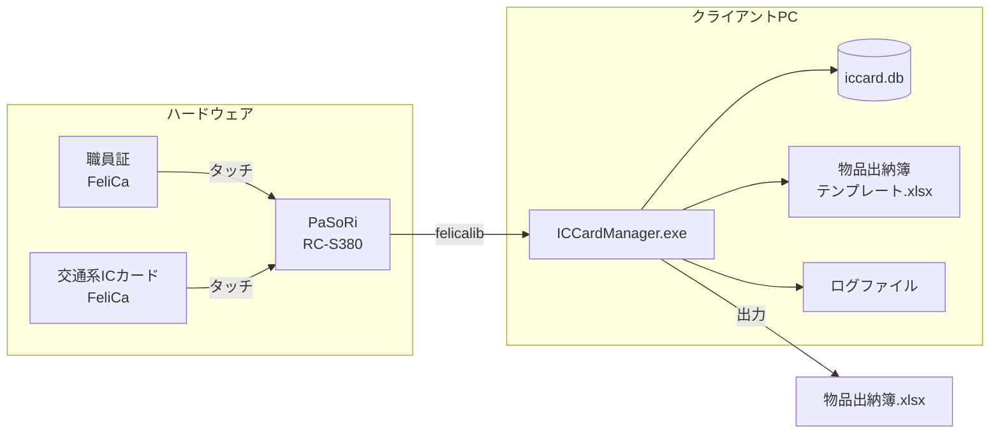
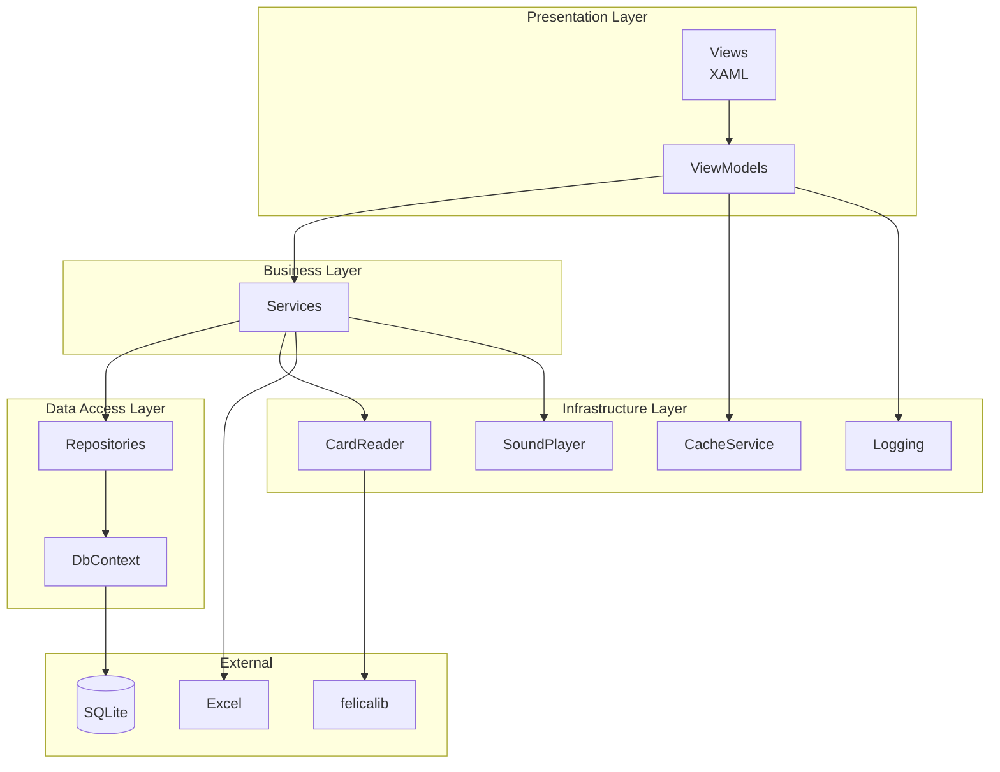
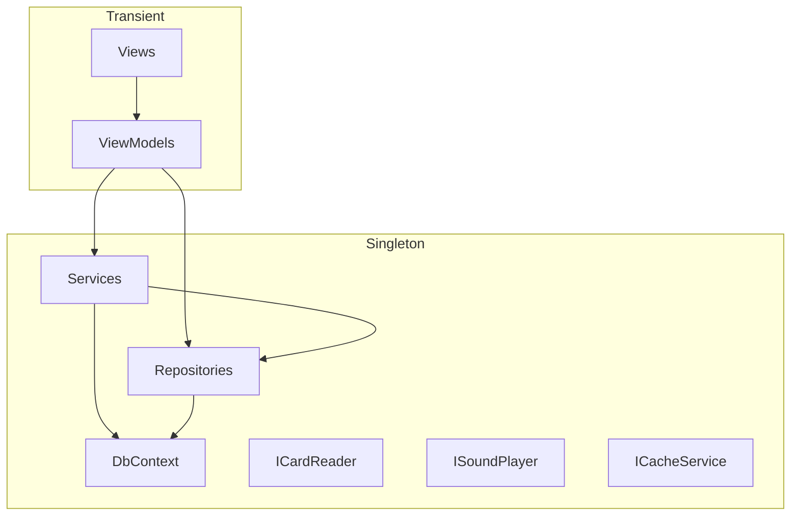
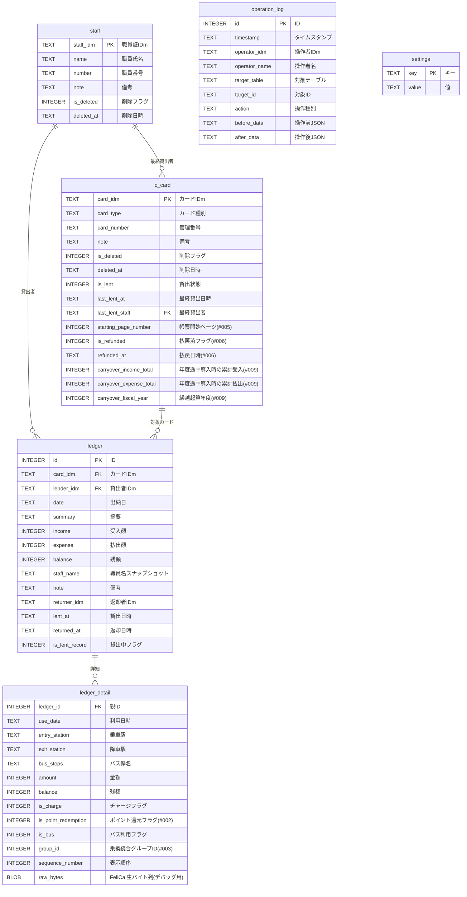
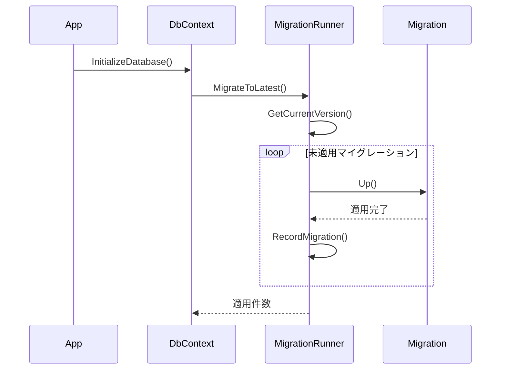
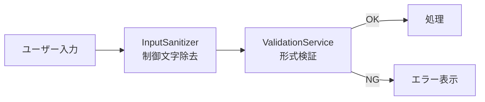
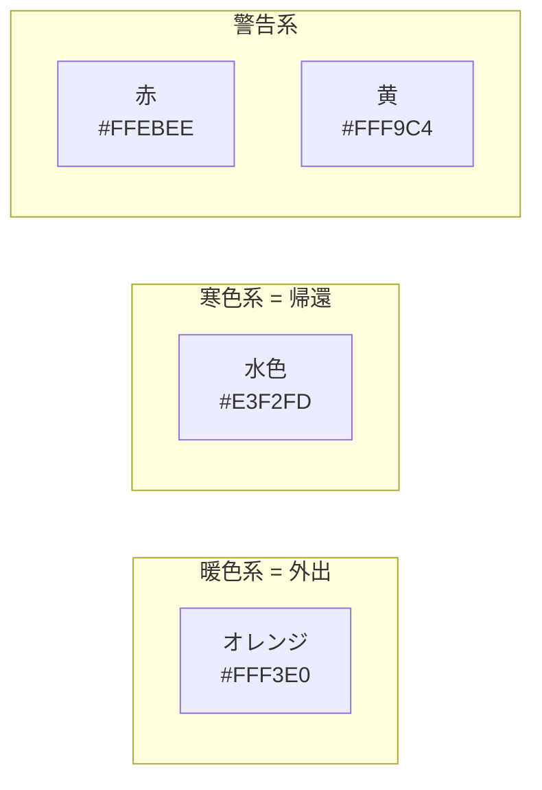

# 交通系ICカード管理システム：ピッすい 開発者ガイド

**バージョン**: 2.7.0
**最終更新日**: 2026年4月15日

---

## 目次

1. [システム構成](#1-システム構成)
2. [ソフトウェア構成](#2-ソフトウェア構成)
3. [データベース構成](#3-データベース構成)
4. [コーディング規約](#4-コーディング規約)
5. [セキュリティ規約](#5-セキュリティ規約)
6. [アクセシビリティ規約](#6-アクセシビリティ規約)
7. [テスト規約](#7-テスト規約)
8. [ビルドとデプロイ](#8-ビルドとデプロイ)

---

## 1. システム構成

### 1.1 システム概要図


```mermaid
graph LR
    subgraph "クライアントPC"
        APP[ICCardManager.exe]
        DB[(iccard.db)]
        TEMPLATE[物品出納簿<br>テンプレート.xlsx]
        LOG[ログファイル]
    end

    subgraph "ハードウェア"
        PASORI[PaSoRi<br>RC-S380]
        STAFF_CARD[職員証<br>FeliCa]
        IC_CARD[交通系ICカード<br>FeliCa]
    end

    PASORI -->|felicalib| APP
    STAFF_CARD -->|タッチ| PASORI
    IC_CARD -->|タッチ| PASORI
    APP --> DB
    APP --> TEMPLATE
    APP --> LOG
    APP -->|出力| OUTPUT[物品出納簿.xlsx]
```

### 1.2 動作環境

| 項目 | 要件 |
|------|------|
| OS | Windows 10/11 (64-bit) |
| CPU | x64プロセッサ |
| メモリ | 4GB以上 |
| ストレージ | 100MB以上の空き容量 |
| ICカードリーダー | Sony PaSoRi (RC-S380等) |
| ネットワーク | **不要**（オフライン動作）。共有フォルダモード利用時はSMBネットワーク接続が必要 |

### 1.3 技術スタック

| カテゴリ | 技術 | バージョン | 備考 |
|----------|------|------------|------|
| 言語 | C# | 10 | `<LangVersion>10.0</LangVersion>` |
| フレームワーク | .NET Framework | 4.8 | `<TargetFramework>net48</TargetFramework>` |
| プラットフォームターゲット | x86 | - | felicalib.dll が x86 のため |
| UIフレームワーク | WPF | - | `<UseWPF>true</UseWPF>` |
| MVVMツールキット | CommunityToolkit.Mvvm | 8.4.2 | `[ObservableProperty]` / `[RelayCommand]` ソースジェネレータ。最新版は `csproj` を参照 |
| データベース | System.Data.SQLite.Core | 1.0.119 | SQLite 3 系 |
| ICカード | FelicaLib.DotNet | 1.2.67 | + `felicalib.dll`（ネイティブ） |
| Excel出力 | ClosedXML | 0.105.0 | |
| DIコンテナ | Microsoft.Extensions.DependencyInjection | 8.0.1 | |
| ロギング | Microsoft.Extensions.Logging | 8.0.1 | |
| メモリキャッシュ | Microsoft.Extensions.Caching.Memory | 8.0.1 | CVE-2024-43485 修正済み |
| 設定ファイル | Microsoft.Extensions.Configuration.Json | 8.0.1 | `appsettings.json` 読み込み |
| テストフレームワーク | xUnit + FluentAssertions + Moq | - | |

> **NuGet ロックファイル**: `<RestorePackagesWithLockFile>true</RestorePackagesWithLockFile>` を有効化し、`packages.lock.json` で推移的依存のバージョンを固定している（サプライチェーン攻撃対策）。

---

## 2. ソフトウェア構成

### 2.1 レイヤーアーキテクチャ

本システムはMVVM（Model-View-ViewModel）パターンを採用し、4層のレイヤー構造で構成される。


```mermaid
graph TB
    subgraph "Presentation Layer"
        VIEW[Views<br>XAML]
        VM[ViewModels]
    end

    subgraph "Business Layer"
        SVC[Services]
    end

    subgraph "Data Access Layer"
        REPO[Repositories]
        CTX[DbContext]
    end

    subgraph "Infrastructure Layer"
        CARD[CardReader]
        SOUND[SoundPlayer]
        CACHE[CacheService]
        LOG[Logging]
    end

    subgraph "External"
        DB[(SQLite)]
        FELICA[felicalib]
        EXCEL[Excel]
    end

    VIEW --> VM
    VM --> SVC
    SVC --> REPO
    REPO --> CTX
    CTX --> DB
    SVC --> CARD
    CARD --> FELICA
    SVC --> EXCEL
    VM --> CACHE
    SVC --> SOUND
    VM --> LOG
```

### 2.2 ディレクトリ構造

```
ICCardManager/
├── ICCardManager.sln
├── Directory.Build.props                # 全プロジェクト共通のビルド設定（LangVersion 等）
├── src/
│   └── ICCardManager/
│       ├── App.xaml(.cs)                # アプリケーションエントリポイント・DI 設定
│       ├── appsettings.json             # 設定（AppOptions, CacheOptions, Logging 等）
│       ├── Views/                       # View 層（XAML）
│       │   ├── MainWindow.xaml          # メイン画面
│       │   ├── Dialogs/                 # ダイアログ（職員管理、カード管理、設定、帳票、履歴編集 等）
│       │   ├── Converters/              # IValueConverter 実装（IntToVisibility など）
│       │   └── Helpers/                 # View 専用ヘルパ
│       ├── ViewModels/                  # ViewModel 層
│       │   ├── ViewModelBase.cs         # 基底クラス（IsBusy / BusyMessage）
│       │   └── *.cs                     # 画面ごとの ViewModel
│       ├── Models/                      # エンティティ（DB テーブル対応）
│       │   ├── Staff.cs / IcCard.cs / Ledger.cs / LedgerDetail.cs
│       │   ├── OperationLog.cs / AppSettings.cs
│       │   └── ...
│       ├── Dtos/                        # View 向け DTO / Mapper（#1222 でサービス境界を明確化）
│       │   ├── CardDto.cs / StaffDto.cs / LedgerDto.cs / LedgerDetailDto.cs
│       │   └── DtoMapper.cs
│       ├── Services/                    # ビジネスロジック
│       │   ├── LendingService.cs        # 貸出・返却・30秒ルール
│       │   ├── ReportService.cs         # 月次帳票生成
│       │   ├── ReportDataBuilder.cs     # 帳票共通データ構築
│       │   ├── SummaryGenerator.cs      # 摘要文字列生成
│       │   ├── LedgerMergeService.cs    # 履歴統合・取消（#548）
│       │   ├── LedgerSplitService.cs    # 履歴分割（#634）
│       │   ├── OperationLogger.cs       # 監査ログ記録
│       │   ├── ValidationService.cs / InputSanitizer.cs
│       │   ├── SharedModeMonitor.cs     # 共有モード監視（ヘルスチェック・同期表示）
│       │   ├── CardLockManager.cs       # カードアクセスの排他制御
│       │   ├── StaffAuthService.cs      # 職員証による操作者認証（#429）
│       │   ├── NavigationService.cs     # ダイアログ解決・遷移
│       │   ├── Import/                  # CSV インポートを責務別に partial class 分割（#1223）
│       │   │   ├── CsvImportService.Card.cs
│       │   │   ├── CsvImportService.Staff.cs
│       │   │   ├── CsvImportService.Ledger.cs
│       │   │   └── CsvImportService.Detail.cs
│       │   └── ...
│       ├── Data/                        # データアクセス層
│       │   ├── DbContext.cs             # DB 接続管理・ConnectionLease / TransactionScope
│       │   ├── Repositories/            # リポジトリ（ILedgerRepository は CQRS 分離: #1224）
│       │   ├── Migrations/              # DB マイグレーション（#001〜#009）
│       │   └── schema.sql               # 初期スキーマ（埋め込みリソース）
│       ├── Infrastructure/              # インフラストラクチャ
│       │   ├── CardReader/              # ICカードリーダー（Felica, Hybrid, Mock）
│       │   ├── Sound/                   # 音声再生
│       │   ├── Caching/                 # キャッシュ
│       │   ├── Timing/                  # ISystemClock / ITimerFactory / IDispatcherService（#1228）
│       │   └── Logging/                 # FileLogger
│       ├── Common/                      # 共通ユーティリティ
│       │   ├── Enums.cs / PathValidator.cs / FiscalYearHelper.cs
│       │   ├── Exceptions/              # AppException / DatabaseException 等
│       │   ├── Messages/                # WeakReferenceMessenger 用メッセージ（#852）
│       │   └── ValueObjects/            # Value Objects（#1221）: CardIdm, StaffIdm, FiscalYear, Money
│       └── Resources/                   # リソース
│           ├── Sounds/                  # ピッ/ピピッ/エラー等の音声
│           ├── Styles/                  # XAML スタイル（AccessibilityStyles.xaml 等）
│           └── Templates/               # 物品出納簿 Excel テンプレート
├── tests/
│   ├── ICCardManager.Tests/             # ユニットテスト
│   └── ICCardManager.UITests/           # UI 統合テスト
├── installer/                           # InnoSetup インストーラー（.iss）
├── publish/                             # 配布ビルド出力
└── docs/                                # ドキュメント（設計書・マニュアル）
    ├── design/                          # 01〜08 設計書
    └── manual/                          # ユーザー / 管理者 / 開発者ガイド
```

> **refactor 履歴（v2.5.0〜v2.7.0）**: `MainViewModel` からのサービス抽出（#1222）、`CsvImportService` の partial class 分割（#1223）、`LedgerRepository` のインターフェース階層分離（#1224）、`ISystemClock` 導入によるテスト容易化（#1228）、Value Object 化（#1221）により、責務分離が進んでいる。詳細は §2.5 「アーキテクチャの発展」を参照。

### 2.3 依存性注入（DI）

本システムはMicrosoft.Extensions.DependencyInjectionを使用したDIコンテナを採用している。


```mermaid
graph TB
    subgraph "Singleton"
        DB[DbContext]
        REPO[Repositories]
        SVC[Services]
        CARD[ICardReader]
        SOUND[ISoundPlayer]
        CACHE[ICacheService]
    end

    subgraph "Transient"
        VM[ViewModels]
        VIEW[Views]
    end

    VM --> SVC
    VM --> REPO
    SVC --> REPO
    SVC --> DB
    REPO --> DB
    VIEW --> VM
```

**登録パターン**:

| ライフタイム | 用途 | 例 |
|--------------|------|-----|
| Singleton | 状態を持つサービス、DB接続 | DbContext, Repositories, Services |
| Transient | 画面ごとに独立 | ViewModels, Views |

**App.xaml.cs での登録例**:

```csharp
private void ConfigureServices(IServiceCollection services)
{
    // Data層
    services.AddSingleton<DbContext>();
    services.AddSingleton<IStaffRepository, StaffRepository>();

    // Services層
    services.AddSingleton<IValidationService, ValidationService>();
    services.AddSingleton<LendingService>();

    // Infrastructure層
#if DEBUG
    services.AddSingleton<ICardReader, HybridCardReader>();
#else
    services.AddSingleton<ICardReader, FelicaCardReader>();
#endif

    // ViewModels
    services.AddTransient<MainViewModel>();
}
```

### 2.4 インターフェース一覧

主要なインターフェースをレイヤーごとに整理する。新規開発者はこの表から「どのレイヤに何があるか」の全体像を把握してほしい。

#### Infrastructure 層

| インターフェース | 実装クラス | 責務 |
|------------------|------------|------|
| ICardReader | FelicaCardReader, HybridCardReader (DEBUG), MockCardReader (DEBUG) | ICカード読み取り |
| ISoundPlayer | SoundPlayer | 操作音再生（ピッ / ピピッ / エラー / VOICEVOX 音声） |
| ICacheService | CacheService | データキャッシュ（共有モードでは TTL を短縮） |
| ISystemClock | SystemClock | 現在時刻の抽象化（#1228）。テストでは FakeClock を注入して時間依存ロジックを検証 |
| ITimerFactory | DispatcherTimerFactory, TestTimerFactory | `DispatcherTimer` のファクトリ。WPF 文脈外テストを可能にする |
| ITimer | DispatcherTimerAdapter, TestTimer | タイマ抽象化（Tick / Start / Stop） |
| IDispatcherService | WpfDispatcherService, SynchronousDispatcherService | UI スレッドへのマーシャリング抽象化 |

#### Data 層

| インターフェース | 実装クラス | 責務 |
|------------------|------------|------|
| IStaffRepository | StaffRepository | 職員データアクセス |
| ICardRepository | CardRepository | カードデータアクセス |
| ILedgerRepository | LedgerRepository | 履歴データアクセス（下記 ILedgerQueryService / ILedgerMergeRepository を包含: #1224） |
| ILedgerQueryService | LedgerRepository | 履歴の参照専用インターフェース（CQRS 風分離、#1224） |
| ILedgerMergeRepository | LedgerRepository | 履歴統合・取消専用インターフェース（#1224） |
| ISettingsRepository | SettingsRepository | 設定データアクセス |
| IOperationLogRepository | OperationLogRepository | 操作ログアクセス |
| IMigration | Migration_001〜Migration_009 | 各マイグレーションの実装契約 |

#### Service 層

| インターフェース | 実装クラス | 責務 |
|------------------|------------|------|
| IValidationService | ValidationService | 入力検証（IDm, 管理番号, 氏名 等） |
| IStaffAuthService | StaffAuthService | 職員証タッチによる操作者認証（#429） |
| IDialogService | NavigationService | 確認・警告・モード選択ダイアログの抽象化（テスト容易化） |
| INavigationService | NavigationService | ダイアログ解決・ウィンドウ遷移 |
| IStationMasterService | StationMasterService | 駅コードから駅名への解決（シングルトン） |
| IToastNotificationService | ToastNotificationService | トースト通知の表示 |
| IReportDataBuilder | ReportDataBuilder | 月次帳票用データ構築（Excel/印刷で共有） |
| IDatabaseInfo | DbContext | DB 情報（共有モード判定・接続情報）の読み取り専用公開 |

> **クラスのみで提供されている代表例**: `LendingService`, `ReportService`, `BackupService`, `SummaryGenerator`, `LedgerMergeService`, `LedgerSplitService`, `OperationLogger`, `CardLockManager`, `SharedModeMonitor`, `WarningService`, `DashboardService` など。これらはインターフェース未抽出だが、テストでは `Mock<ConcreteClass>` で代替できるよう `virtual` メソッドを中心に設計している。

---

### 2.5 アーキテクチャの発展（v2.5.0〜v2.7.0）

v2.5.0〜v2.7.0 で導入された主要な構造変更は、いずれも **「テスト容易性」** と **「責務分離」** の向上を目的としている。新規開発者はこの節で現在のコード構造の背景を理解してほしい。

#### 2.5.1 Value Object（#1221）

`Common/ValueObjects/` に以下の不変 `readonly struct` を定義し、プリミティブ文字列・整数に型安全性を付与した。

| 構造体 | 責務 | 代表的 API |
|--------|------|------------|
| `CardIdm` | 交通系ICカードの IDm（16進数16文字） | コンストラクタで大文字正規化 + 形式検証 / `implicit operator string` |
| `StaffIdm` | 職員証の IDm（型レベルで CardIdm と区別） | 同上 |
| `FiscalYear` | 日本の会計年度（4月始まり） | `Contains(DateTime)` / `StartDate` / `EndDate` / `PreviousMonth()` |
| `Money` | 非負の金額（円） | 加算・比較演算子 / `implicit operator int` |

> `FiscalYearHelper`（静的メソッド群）は互換性のため残存するが、新規コードは `FiscalYear` ValueObject を推奨。

#### 2.5.2 MainViewModel からのサービス抽出（#1222）

巨大化していた `MainViewModel` から以下を抽出し、DbContext への直接依存を排除した。

- `SharedModeMonitor` — 共有モードの同期表示・ヘルスチェック
- `WarningService` — 残高警告の算出
- `DashboardService` — ダッシュボードの集計ロジック
- `LedgerConsistencyChecker` — 残高チェーン整合性検証

#### 2.5.3 CsvImportService の partial class 分割（#1223）

単一ファイル 3,311 行 → 5 ファイルに分割。責務単位で読み解けるようになった。

- `CsvImportService.cs`（共通ロジック）
- `Services/Import/CsvImportService.Card.cs`
- `Services/Import/CsvImportService.Staff.cs`
- `Services/Import/CsvImportService.Ledger.cs`
- `Services/Import/CsvImportService.Detail.cs`

#### 2.5.4 LedgerRepository のインターフェース階層分離（#1224）

巨大化していた `ILedgerRepository` を **CQRS（コマンド・クエリ分離）風** に以下へ分割した。

- `ILedgerQueryService` — 参照系メソッド
- `ILedgerMergeRepository` — 履歴統合・取消
- `ILedgerRepository` — 上記を継承する包括インターフェース

> 新しい書き込み系メソッドを追加する場合、まず `ILedgerQueryService` ではなく `ILedgerRepository` に足すこと。既存 ViewModel 側は `ILedgerRepository` を注入しているので、互換性は保たれる。

#### 2.5.5 ISystemClock による時間依存テストの容易化（#1228）

`DateTime.Now` を直接呼び出す代わりに、`ISystemClock` を DI 経由で注入する。

```csharp
// 本番: Singleton 登録された SystemClock が DateTime.Now を返す
services.AddSingleton<ISystemClock, SystemClock>();

// テスト: FakeClock で時刻を制御
public class FakeClock : ISystemClock
{
    public DateTime Now { get; set; } = new DateTime(2026, 4, 12);
}
```

これにより `MainViewModelSyncDisplayTests` などの時間依存テストはリフレクション不要で決定論的に書ける。

#### 2.5.6 DbContext の並行アクセス保護（#1165, #1209）

`GetConnection()` を非推奨（`[Obsolete]`）化し、以下のスコープベース API に統一中。

```csharp
// 非同期：推奨
using var lease = await _dbContext.LeaseConnectionAsync();
var connection = lease.Connection;

// トランザクション：TransactionScope.Dispose() で自動ロールバック
using var scope = await _dbContext.BeginTransactionAsync();
// ... 処理 ...
await scope.CommitAsync();
```

`ConnectionLease` が内部でセマフォによる排他を行い、複数スレッドから安全にアクセスできる。共有モードでは `busy_timeout=15000ms`（SMB 遅延と最大 20 台の同時アクセスを考慮、Issue #1107。ローカルモードは 5000ms）と組み合わせて耐障害性を確保している。

---

## 3. データベース構成

### 3.1 ER図


```mermaid
erDiagram
    staff ||--o{ ic_card : "最終貸出者"
    staff ||--o{ ledger : "貸出者"
    ic_card ||--o{ ledger : "対象カード"
    ledger ||--o{ ledger_detail : "詳細"

    staff {
        TEXT staff_idm PK "職員証IDm"
        TEXT name "職員氏名"
        TEXT number "職員番号"
        TEXT note "備考"
        INTEGER is_deleted "削除フラグ"
        TEXT deleted_at "削除日時"
    }

    ic_card {
        TEXT card_idm PK "カードIDm"
        TEXT card_type "カード種別"
        TEXT card_number "管理番号"
        TEXT note "備考"
        INTEGER is_deleted "削除フラグ"
        TEXT deleted_at "削除日時"
        INTEGER is_lent "貸出状態"
        TEXT last_lent_at "最終貸出日時"
        TEXT last_lent_staff FK "最終貸出者"
        INTEGER starting_page_number "帳票開始ページ(#005)"
        INTEGER is_refunded "払戻済フラグ(#006)"
        TEXT refunded_at "払戻日時(#006)"
        INTEGER carryover_income_total "年度途中導入時の累計受入(#009)"
        INTEGER carryover_expense_total "年度途中導入時の累計払出(#009)"
        INTEGER carryover_fiscal_year "繰越起算年度(#009)"
    }

    ledger {
        INTEGER id PK "ID"
        TEXT card_idm FK "カードIDm"
        TEXT lender_idm FK "貸出者IDm"
        TEXT date "出納日"
        TEXT summary "摘要"
        INTEGER income "受入額"
        INTEGER expense "払出額"
        INTEGER balance "残額"
        TEXT staff_name "職員名スナップショット"
        TEXT note "備考"
        TEXT returner_idm "返却者IDm"
        TEXT lent_at "貸出日時"
        TEXT returned_at "返却日時"
        INTEGER is_lent_record "貸出中フラグ"
    }

    ledger_detail {
        INTEGER ledger_id FK "親ID"
        TEXT use_date "利用日時"
        TEXT entry_station "乗車駅"
        TEXT exit_station "降車駅"
        TEXT bus_stops "バス停名"
        INTEGER amount "金額"
        INTEGER balance "残額"
        INTEGER is_charge "チャージフラグ"
        INTEGER is_point_redemption "ポイント還元フラグ(#002)"
        INTEGER is_bus "バス利用フラグ"
        INTEGER group_id "乗換統合グループID(#003)"
        INTEGER sequence_number "表示順序"
        BLOB raw_bytes "FeliCa 生バイト列(デバッグ用)"
    }

    operation_log {
        INTEGER id PK "ID"
        TEXT timestamp "タイムスタンプ"
        TEXT operator_idm "操作者IDm"
        TEXT operator_name "操作者名"
        TEXT target_table "対象テーブル"
        TEXT target_id "対象ID"
        TEXT action "操作種別"
        TEXT before_data "操作前JSON"
        TEXT after_data "操作後JSON"
    }

    settings {
        TEXT key PK "キー"
        TEXT value "値"
    }
```

### 3.2 テーブル詳細

#### staffテーブル（職員マスタ）

| カラム | 型 | NULL | 説明 |
|--------|-----|------|------|
| staff_idm | TEXT | × | 職員証IDm（PK、16進数16文字） |
| name | TEXT | × | 職員氏名 |
| number | TEXT | ○ | 職員番号 |
| note | TEXT | ○ | 備考 |
| is_deleted | INTEGER | × | 削除フラグ（0:有効、1:削除） |
| deleted_at | TEXT | ○ | 削除日時 |

#### ic_cardテーブル（ICカードマスタ）

| カラム | 型 | NULL | 説明 | 導入 |
|--------|-----|------|------|------|
| card_idm | TEXT | × | カードIDm（PK、16進数16文字） | #001 |
| card_type | TEXT | × | カード種別（はやかけん、nimoca等） | #001 |
| card_number | TEXT | × | 管理番号（カード種別内で一意、UNIQUE INDEX） | #001/#008 |
| note | TEXT | ○ | 備考 | #001 |
| is_deleted | INTEGER | × | 削除フラグ（DEFAULT 0） | #001 |
| deleted_at | TEXT | ○ | 削除日時 | #001 |
| is_lent | INTEGER | × | 貸出状態（0:未貸出、1:貸出中、DEFAULT 0） | #001 |
| last_lent_at | TEXT | ○ | 最終貸出日時 | #001 |
| last_lent_staff | TEXT | ○ | 最終貸出者IDm（FK→staff） | #001 |
| starting_page_number | INTEGER | × | 帳票開始ページ番号（DEFAULT 1） | #005 |
| is_refunded | INTEGER | × | 払戻済フラグ（DEFAULT 0） | #006 |
| refunded_at | TEXT | ○ | 払戻日時 | #006 |
| carryover_income_total | INTEGER | × | 年度途中導入時の累計受入（DEFAULT 0） | #009 |
| carryover_expense_total | INTEGER | × | 年度途中導入時の累計払出（DEFAULT 0） | #009 |
| carryover_fiscal_year | INTEGER | ○ | 繰越起算年度（NULL=該当なし） | #009 |

#### ledgerテーブル（出納記録）

| カラム | 型 | NULL | 説明 |
|--------|-----|------|------|
| id | INTEGER | × | ID（PK、AUTO INCREMENT） |
| card_idm | TEXT | × | カードIDm（FK→ic_card） |
| lender_idm | TEXT | ○ | 貸出者IDm（FK→staff） |
| date | TEXT | × | 出納日（YYYY-MM-DD） |
| summary | TEXT | × | 摘要 |
| income | INTEGER | × | 受入額（チャージ） |
| expense | INTEGER | × | 払出額（利用） |
| balance | INTEGER | × | 残額 |
| staff_name | TEXT | ○ | 職員名（スナップショット） |
| note | TEXT | ○ | 備考 |
| returner_idm | TEXT | ○ | 返却者IDm |
| lent_at | TEXT | ○ | 貸出日時 |
| returned_at | TEXT | ○ | 返却日時 |
| is_lent_record | INTEGER | × | 貸出中レコードフラグ |

#### ledger_detailテーブル（出納詳細）

| カラム | 型 | NULL | 説明 | 導入 |
|--------|-----|------|------|------|
| ledger_id | INTEGER | × | 親ID（FK→ledger、CASCADE DELETE） | #001 |
| use_date | TEXT | ○ | 利用日時 | #001 |
| entry_station | TEXT | ○ | 乗車駅 | #001 |
| exit_station | TEXT | ○ | 降車駅 | #001 |
| bus_stops | TEXT | ○ | バス停名（カンマ区切り、手入力） | #001 |
| amount | INTEGER | ○ | 金額 | #001 |
| balance | INTEGER | ○ | 残額 | #001 |
| is_charge | INTEGER | × | チャージフラグ（DEFAULT 0） | #001 |
| is_point_redemption | INTEGER | × | ポイント還元フラグ（DEFAULT 0） | #002 |
| is_bus | INTEGER | × | バス利用フラグ（DEFAULT 0） | #001 |
| group_id | INTEGER | ○ | 乗換統合グループ ID（null=自動判定、非null=手動分割） | #003 |
| sequence_number | INTEGER | × | 同一 ledger 内の表示順序（DEFAULT 0） | #001 |
| raw_bytes | BLOB | ○ | FeliCa 履歴の生バイト列（デバッグ用途） | #001 |

#### operation_logテーブル（操作ログ）

| カラム | 型 | NULL | 説明 |
|--------|-----|------|------|
| id | INTEGER | × | ID（PK） |
| timestamp | TEXT | × | タイムスタンプ |
| operator_idm | TEXT | × | 操作者IDm |
| operator_name | TEXT | × | 操作者名（スナップショット） |
| target_table | TEXT | ○ | 対象テーブル名 |
| target_id | TEXT | ○ | 対象レコードID |
| action | TEXT | ○ | 操作種別（INSERT/UPDATE/DELETE） |
| before_data | TEXT | ○ | 操作前データ（JSON） |
| after_data | TEXT | ○ | 操作後データ（JSON） |

### 3.3 日付・時刻の形式

| 用途 | 形式 | 例 |
|------|------|-----|
| 日付のみ | YYYY-MM-DD | 2024-01-15 |
| 日時 | YYYY-MM-DD HH:MM:SS | 2024-01-15 14:30:00 |
| SQLiteデフォルト | CURRENT_TIMESTAMP | 2024-01-15 05:30:00（UTC） |

> **注意**: `date('now')` はUTCを返すため、ローカル時刻が必要な場合は `date('now', 'localtime')` を使用すること。

### 3.4 論理削除と物理削除

| テーブル | 削除方式 | 理由 |
|----------|----------|------|
| staff | 論理削除 | 履歴参照時に氏名を表示するため |
| ic_card | 論理削除 | 履歴参照時にカード情報を表示するため |
| ledger | 物理削除（6年後自動） | 監査対応の保存期間経過後は不要 |
| operation_log | 物理削除（6年後自動） | ledgerと同じ保存期間経過後に削除 |

### 3.5 マイグレーション

マイグレーションは `Data/Migrations/` 配下の `IMigration` 実装クラスで管理される。


```mermaid
sequenceDiagram
    participant App
    participant DbContext
    participant MigrationRunner
    participant Migration

    App->>DbContext: InitializeDatabase()
    DbContext->>MigrationRunner: MigrateToLatest()
    MigrationRunner->>MigrationRunner: GetCurrentVersion()
    loop 未適用マイグレーション
        MigrationRunner->>Migration: Up()
        Migration-->>MigrationRunner: 適用完了
        MigrationRunner->>MigrationRunner: RecordMigration()
    end
    MigrationRunner-->>DbContext: 適用件数
```

**適用済みマイグレーション一覧**:

| バージョン | クラス名 | 内容 | 関連 Issue/PR |
|-----------|---------|------|----------------|
| 1 | Migration_001_Initial | 初期スキーマ作成 | - |
| 2 | Migration_002_AddPointRedemption | ledger_detail に `is_point_redemption` 列追加 | - |
| 3 | Migration_003_AddTripGroupId | ledger_detail に `group_id` 列追加（乗換統合用） | - |
| 4 | Migration_004_AddPerformanceIndexes | パフォーマンス向上のためのインデックス追加 | - |
| 5 | Migration_005_AddStartingPageNumber | ic_card に `starting_page_number` 列追加（帳票開始ページ、DEFAULT 1） | - |
| 6 | Migration_006_AddRefundedStatus | ic_card に `is_refunded` (DEFAULT 0) / `refunded_at` 列追加（払戻済状態） | - |
| 7 | Migration_007_AddMergeHistory | ledger_merge_history テーブル追加（統合取り消し用） | #548 |
| 8 | Migration_008_AddCardTypeNumberUniqueIndex | `(card_type, card_number)` に UNIQUE INDEX を追加（採番競合防止） | #1106 |
| 9 | Migration_009_AddCarryoverTotals | ic_card に `carryover_income_total` / `carryover_expense_total` / `carryover_fiscal_year` 列追加（年度途中導入対応） | #1215 |

**新規マイグレーションの追加手順**:

1. `IMigration` インターフェースを実装するクラスを作成
2. `Version` プロパティに一意のバージョン番号（既存最大 +1）を設定
3. `Up()` メソッドに冪等なスキーマ変更を実装（下記「冪等性ガイドライン」参照）
4. `Down()` メソッドに可能な範囲で逆操作を実装（SQLite 制約で不可な場合は空実装 + 理由コメント）
5. `MigrationIdempotencyTests` に対応するテストを追加
6. `docs/design/02_DB設計書.md` の該当テーブルに反映

登録は不要: `MigrationRunner.DiscoverMigrations()` が Reflection で `IMigration` 実装クラスを自動検出する。

#### 冪等性ガイドライン（Issue #1285）

全マイグレーションの `Up()` は**二重実行しても例外を出さないこと**（共有モード運用や `schema_migrations` 部分破損に備える）。

| 操作 | 書き方 |
|------|--------|
| テーブル作成 | `CREATE TABLE IF NOT EXISTS ...` |
| インデックス作成 | `CREATE INDEX IF NOT EXISTS ...` |
| 列追加 | `MigrationHelpers.AddColumnIfNotExists(conn, tx, "table", "column", "TYPE DEFAULT ...")` |
| 行追加 | `INSERT OR IGNORE INTO ...` |

素の `ALTER TABLE ADD COLUMN` は SQLite で非冪等のため禁止。`MigrationHelpers.AddColumnIfNotExists` を利用する。全マイグレーションは `MigrationIdempotencyTests` で二重実行安全性を検証している。

詳細な規約は `.claude/rules/migrations.md` を参照。

---

## 4. コーディング規約

### 4.1 命名規則

| 対象 | 規則 | 例 |
|------|------|-----|
| 名前空間 | PascalCase | ICCardManager.Services |
| クラス | PascalCase | LendingService |
| インターフェース | I + PascalCase | ICardReader |
| メソッド | PascalCase | GetCardAsync() |
| プロパティ | PascalCase | CardNumber |
| privateフィールド | _camelCase | _repository |
| ローカル変数 | camelCase | cardIdm |
| 定数 | PascalCase | MaxHistoryCount |
| 列挙型 | PascalCase | FontSizeOption |
| settings テーブルのキー文字列 | snake_case | `warning_balance`, `font_size` |
| settings キーを参照するC#定数 | `Key` + PascalCase | `KeyWarningBalance`, `KeyFontSize` |

> **設定キー命名規則**: `settings` テーブルに保存するキーはDB側ではsnake_case、C#側では `SettingsRepository` 内に `KeyXxx` という `const string` を定義して参照する。新規設定追加時は両側を必ずペアで追加し、`AppSettings` のプロパティ名（PascalCase）と対応関係が明確になるよう命名すること。

### 4.2 非同期処理

- 非同期メソッドには `Async` サフィックスを付ける
- I/O操作は非同期を優先する
- `async void` は避け、`async Task` を使用する
- `ConfigureAwait(false)` はUI層以外で使用を検討する

```csharp
// Good
public async Task<Staff?> GetStaffAsync(string idm)
{
    return await _repository.GetByIdmAsync(idm);
}

// Bad
public async void LoadData()  // async void は避ける
{
    var data = await FetchDataAsync();
}
```

### 4.3 例外処理

- アプリケーション固有の例外は `AppException` を継承する
- 例外のログ出力には `ILogger` を使用する
- 握りつぶし（空のcatch）は原則禁止

```csharp
try
{
    await _service.ExecuteAsync();
}
catch (CardReaderException ex)
{
    _logger.LogError(ex, "カードリーダーエラー: {Message}", ex.Message);
    throw new AppException("カードの読み取りに失敗しました", ex);
}
```

### 4.4 MVVM パターン

**ViewModelBase の使用**:

```csharp
public partial class MyViewModel : ViewModelBase
{
    private readonly IMyService _service;

    [ObservableProperty]
    private string _userName = string.Empty;

    [RelayCommand]
    private async Task SaveAsync()
    {
        using (BeginBusy("保存中..."))
        {
            await _service.SaveAsync();
        }
    }
}
```

**プロパティ変更通知**:
- `[ObservableProperty]` 属性を使用（`CommunityToolkit.Mvvm` 8.4.2 のソースジェネレータ）
- 複雑なロジックが必要な場合は `SetProperty()` を直接使用

**コマンド**:
- `[RelayCommand]` 属性を使用
- 非同期コマンドには `Async` サフィックスを付ける

**On*Changed コールバック**:

`[ObservableProperty]` は `partial void On<Name>Changed(newValue)` / `partial void On<Name>Changing(oldValue, newValue)` のフックメソッドを自動生成する。プロパティ変更に伴う派生処理はこのフックに書く。

```csharp
public partial class CardManageViewModel : ViewModelBase
{
    [ObservableProperty]
    private string _editCardType = "nimoca";

    // _editCardType の変更に追随して再検証
    partial void OnEditCardTypeChanged(string value)
    {
        if (!_isInitializing)
        {
            RevalidateCardNumber();
        }
    }
}
```

**カスケード実行の抑制**:

ViewModel の初期化で複数プロパティを連続設定すると、`On*Changed` が多重に発火して副作用が重なることがある。このようなケースでは `_isInitializing` フラグでガードする。

```csharp
public MyViewModel(...)
{
    _isInitializing = true;
    try
    {
        // ここで複数プロパティを設定しても副作用を抑制
        UserId = 42;
        UserName = "初期値";
    }
    finally
    {
        _isInitializing = false;
    }
}
```

> メイン画面のように `[ObservableProperty]` が 30 個超あるケースでは、初期化順序・カスケードを意識して実装すること。`MainViewModel` はこのパターンを採用している。

### 4.6 Value Objects の使用（#1221）

プリミティブ型（`string`, `int`）の代わりに、`Common/ValueObjects/` 配下の `readonly struct` を積極的に利用する。**型レベルで意味が分離されるため、`CardIdm` を期待する引数に `StaffIdm` を渡すとコンパイルエラーになる**。

```csharp
// Good: Value Object で意図が明確・取り違えを防止
public async Task<IcCard?> GetCardAsync(CardIdm idm)
{
    return await _repository.GetByIdmAsync(idm);  // implicit operator string で透過的に DB に渡る
}

// Bad: 生の string では StaffIdm を誤って渡せてしまう
public async Task<IcCard?> GetCardAsync(string idm) { ... }
```

`FiscalYear` は年度境界判定・月の列挙をカプセル化する。`FiscalYearHelper` の静的メソッドは互換性のため残っているが、新規コードは `FiscalYear` を推奨。

```csharp
var fiscalYear = new FiscalYear(2026);
if (fiscalYear.Contains(DateTime.Today))
{
    // 2026年4月〜2027年3月の範囲
}
```

### 4.5 コメント・ドキュメント

- public API には XML ドキュメントコメントを付ける
- 複雑なロジックには説明コメントを追加
- TODO コメントは Issue 番号を含める

```csharp
/// <summary>
/// 指定したIDmの職員を取得する
/// </summary>
/// <param name="idm">職員証IDm</param>
/// <returns>職員情報。見つからない場合はnull</returns>
public async Task<Staff?> GetStaffAsync(string idm)
{
    // 削除済み職員は除外
    return await _repository.GetByIdmAsync(idm, includeDeleted: false);
}
```

---

## 5. セキュリティ規約

### 5.1 入力検証

すべてのユーザー入力は `ValidationService` と `InputSanitizer` で検証・サニタイズする。


```mermaid
flowchart LR
    INPUT[ユーザー入力] --> SANITIZE[InputSanitizer<br>制御文字除去]
    SANITIZE --> VALIDATE[ValidationService<br>形式検証]
    VALIDATE --> |OK| PROCESS[処理]
    VALIDATE --> |NG| ERROR[エラー表示]
```

**InputSanitizer の処理**:

| 処理 | 対象 |
|------|------|
| 制御文字除去 | \x00-\x1F, \x7F, \x80-\x9F |
| ゼロ幅文字除去 | \u200B-\u200F, \u2028-\u202F, \uFEFF |
| 前後空白除去 | 全角・半角スペース |
| 内部空白正規化 | 連続スペースを単一に |

**ValidationService のルール**:

| 対象 | ルール |
|------|--------|
| IDm | 16進数16文字 `^[0-9A-Fa-f]{16}$` |
| 管理番号 | 1-20文字 `^[a-zA-Z0-9\-_]+$` |
| 職員氏名 | 1-50文字、制御文字禁止 |
| バス停名 | 1-100文字/件、カンマ区切り |

### 5.2 SQLインジェクション対策

- 生SQLは避け、パラメータ化クエリを使用する
- LIKE句のワイルドカードはエスケープする

```csharp
// Good - パラメータ化クエリ
cmd.CommandText = "SELECT * FROM staff WHERE staff_idm = @idm";
cmd.Parameters.AddWithValue("@idm", idm);

// Bad - 文字列連結
cmd.CommandText = $"SELECT * FROM staff WHERE staff_idm = '{idm}'";
```

**LIKE句のエスケープ**:

```csharp
private static string EscapeLikeWildcards(string value)
{
    return value
        .Replace("\\", "\\\\")
        .Replace("%", "\\%")
        .Replace("_", "\\_");
}

// 使用例
var escaped = EscapeLikeWildcards(searchTerm);
cmd.CommandText = "SELECT * FROM staff WHERE name LIKE @pattern ESCAPE '\\'";
cmd.Parameters.AddWithValue("@pattern", $"%{escaped}%");
```

### 5.3 ファイルパス検証

バックアップ等でユーザーが指定するパスは `PathValidator` で検証する。

**検証ルール**:

| チェック | 理由 |
|----------|------|
| null/空文字 | 必須入力 |
| パス長 (≤260) | Windowsの制限 |
| 絶対パス | 相対パスは危険 |
| UNCパス | 共有フォルダモード時のみ許可（`database_config.txt` 経由） |
| パストラバーサル禁止 | `..` を含むパス禁止 |
| 不正文字チェック | `<>"|` 等 |

### 5.4 データベースファイルの保護

- ディレクトリ（`C:\ProgramData\ICCardManager`）にUsersフルコントロール＋継承を設定
- ファイルはディレクトリからの**権限継承**により保護（ファイルに明示的ACLは設定しない）
- 複数の職員（Windowsユーザー）が同一PCで利用するため、ディレクトリレベルで全ユーザーにアクセスを許可
- SQLite関連ファイル（-wal, -shm, -journal）も同様に継承を有効化

```csharp
// ディレクトリ: Usersグループにフルコントロール＋継承を設定（新規・既存問わず）
internal static void EnsureDirectoryWithPermissions(string directoryPath)
{
    Directory.CreateDirectory(directoryPath);
    var directoryInfo = new DirectoryInfo(directoryPath);
    var directorySecurity = directoryInfo.GetAccessControl();
    var usersIdentity = new SecurityIdentifier(WellKnownSidType.BuiltinUsersSid, null);
    var accessRule = new FileSystemAccessRule(
        usersIdentity, FileSystemRights.FullControl,
        InheritanceFlags.ContainerInherit | InheritanceFlags.ObjectInherit,
        PropagationFlags.None, AccessControlType.Allow);
    directorySecurity.AddAccessRule(accessRule);
    directoryInfo.SetAccessControl(directorySecurity);
}

// ファイル: 継承を有効化し、明示的ACLを削除（親ディレクトリからの権限継承に任せる）
private static void EnableInheritance(string filePath)
{
    var fileInfo = new FileInfo(filePath);
    var fileSecurity = fileInfo.GetAccessControl();
    if (!fileSecurity.AreAccessRulesProtected) return; // 既に継承有効なら何もしない

    fileSecurity.SetAccessRuleProtection(isProtected: false, preserveInheritance: false);
    // 明示的ACLを削除
    var rules = fileSecurity.GetAccessRules(true, false, typeof(SecurityIdentifier));
    foreach (FileSystemAccessRule rule in rules)
        fileSecurity.PurgeAccessRules(rule.IdentityReference);
    fileInfo.SetAccessControl(fileSecurity);
}
```

### 5.5 共有フォルダモード（複数PC共有データベース）

複数のPCから同一のSQLiteデータベースにアクセスするための共有フォルダモードを提供する。

#### 設定方法

`C:\ProgramData\ICCardManager\database_config.txt` にデータベースファイルのパスを指定する。空欄（またはファイルが存在しない）の場合はローカルのデフォルトパス（`C:\ProgramData\ICCardManager\iccard.db`）が使用される。

```
\\server\ICCardShare\iccard.db
```

インストーラーの「データベースの保存先」ページまたは設定画面（F5）から変更可能。変更後はアプリケーションの再起動が必要。

#### 共有モードの判定

UNCパス（`\\` で始まるパス）が指定された場合、自動的に共有モードとして動作する。

#### SQLite PRAGMA設定（共有モード時）

共有フォルダ上のSQLiteでは、WALモードのファイルロック制約を回避するため、以下のPRAGMAが設定される。

| PRAGMA | 値 | 理由 |
|--------|-----|------|
| journal_mode | DELETE | WALモードはネットワークファイルシステムで非推奨のため |
| busy_timeout | 15000 | 複数PC同時アクセス時のロック待機（15秒。SMB遅延と最大20台の同時アクセスを考慮、Issue #1107。ローカルモードは5000ms） |
| synchronous | NORMAL | ネットワーク越しのI/O性能を考慮 |

#### キャッシュTTLの調整

共有モードでは、他のPCからの変更を早期に反映するため、キャッシュのTTL（Time To Live）が短縮される。ローカル操作ではキャッシュが即座に無効化されるため、TTLは「他PCの操作結果が見えるまでの遅延」のみに影響する。

| キャッシュ項目 | スタンドアロンモード | 共有フォルダモード |
|---------------|--------------------|--------------------|
| カード一覧（CardList） | 60秒 | 15秒 |
| 貸出中カード（LentCards） | 30秒 | 10秒 |
| 職員一覧（Staff） | 60秒 | 30秒 |
| 設定（Settings） | 5分 | 3分 |

#### 接続ヘルスチェック

共有モードでは30秒ごとにデータベースへの接続を確認し、接続が失われた場合は自動的に再接続を試行する。ネットワーク切断時はステータスバーに警告が表示される。

#### VACUUM制約

共有モードでは他のPCが接続中の場合にVACUUMが失敗する可能性がある。失敗した場合は次回起動時に再試行される。

#### バックアップとリストア

- **バックアップ**: SQLite Backup APIを使用しており、他のPCが接続中でも安全に実行可能
- **リストア**: 他のすべてのPCでアプリケーションを終了してから実行する必要がある

#### 制約事項

- 最大約20台のPCでの利用を想定
- 書き込み頻度が低い環境を前提としている（貸出・返却操作が中心）

### 5.6 監査ログ

すべての重要な操作は `operation_log` テーブルに記録する。

**記録対象**:

| 操作 | 記録内容 |
|------|----------|
| 貸出・返却 | カードIDm、職員IDm、日時 |
| マスタ登録・編集・削除 | 変更前後のJSON |
| バックアップ・リストア | 実行日時、ファイルパス |
| 設定変更 | 変更前後の設定値 |

**ログ出力例**:

```json
{
  "timestamp": "2024-01-15 14:30:00",
  "operator_idm": "0123456789ABCDEF",
  "operator_name": "山田太郎",
  "target_table": "ic_card",
  "target_id": "FEDCBA9876543210",
  "action": "UPDATE",
  "before_data": "{\"card_number\":\"001\"}",
  "after_data": "{\"card_number\":\"002\"}"
}
```

### 5.7 依存パッケージのCVE管理（Issue #1272）

本プロジェクトは**インターネット非接続環境**で動作するため、依存パッケージの脆弱性が実行時に直接悪用されるリスクは限定的ですが、内部者・物理アクセス経由の攻撃や、ビルド環境への侵害リスクは残ります。以下の仕組みで継続的に CVE を監視します。

#### 自動監視の仕組み

| 仕組み | 頻度 | 検出内容 | 対応 |
|-------|------|---------|------|
| **`dotnet list package --vulnerable`** (`.github/workflows/vulnerability-scan.yml`) | 週次（月曜JST 09:00）+ csproj 更新時 + 手動実行 | 既知 CVE を持つ直接/推移的依存 | ワークフロー失敗 → 対応PR作成 |
| **Dependabot** (`.github/dependabot.yml`) | 週次 | 通常アップデート・セキュリティアップデート | 自動 PR 作成 |
| **リリース前チェック** (`/release` スキル) | リリース毎 | リリース前に `dotnet list package --vulnerable` 実行 | 発見時はリリース保留 |

#### 重大 CVE 発見時の対応プロセス

脆弱性が検出された場合、**重大度に応じて以下の SLA で対応**してください。

| 重大度 | 対応期限 | アクション |
|--------|---------|-----------|
| **Critical / High** | 24 時間以内 | 1. 影響範囲評価 → 2. パッチ版へアップグレード → 3. 回帰テスト → 4. 緊急リリース |
| **Moderate** | 次回定例リリースまで | 1. 影響評価 → 2. 通常のアップグレード PR → 3. 次リリースに含める |
| **Low** | 計画的対応 | 1. Issue 化 → 2. バックログ管理 → 3. メジャーバージョンアップ時等にまとめて対応 |

#### 発見時の基本手順

1. **影響範囲の評価**:
   ```bash
   # WSL2の場合
   "/mnt/c/Program Files/dotnet/dotnet.exe" list package --vulnerable --include-transitive
   ```
   影響を受けるアセンブリ・コードパスを特定。実行時に該当機能が使われるかを評価。

2. **修正版の確認**:
   - NuGet.org でパッケージの最新安定版を確認
   - CVE Advisory で修正バージョンを確認（例: GitHub Security Advisory, NVD）

3. **アップグレード**:
   ```bash
   # 例: Microsoft.Extensions.Caching.Memory を 8.0.1 → 8.0.2 に更新
   # csproj の <PackageReference Version="..."> を手動編集
   "/mnt/c/Program Files/dotnet/dotnet.exe" restore
   ```

4. **検証**:
   - `dotnet build` エラーなし
   - `dotnet test` 全テスト合格
   - CVE スキャンが緑になること再実行

5. **PR 作成**:
   - ブランチ: `fix/cve-YYYY-NNNNN-<パッケージ名>` または `chore/deps-<パッケージ名>-<version>`
   - CHANGELOG の **セキュリティ修正** セクションに記載（`(#<Issue番号>)` 付き）
   - Critical / High の場合はホットフィックスとして main に直接マージ後リリース

#### 誤検出・例外の扱い

**抑制が必要な場合**（例: 実行時に該当機能を使用しないため影響なし、依存の依存でアップグレード不可）:

- `.github/dependabot.yml` の `ignore:` セクションに追加
- 理由を記載したコメントを併置
- 抑制判断の妥当性は四半期ごとに見直す

#### 参考リンク

- [NuGet セキュリティアドバイザリ (.NET doc)](https://learn.microsoft.com/ja-jp/nuget/concepts/auditing-packages)
- [GitHub Security Advisories](https://github.com/advisories)
- [NVD (National Vulnerability Database)](https://nvd.nist.gov/)

### 5.8 改行コードポリシー（Issue #1368）

リポジトリルートの `.gitattributes` で、**lock file / JSON / YAML / dotfile / `.sh`** の改行コードを LF に強制正規化している。

**目的**: WSL / Windows 併用開発時に `dotnet restore` が生成する `packages.lock.json` の CRLF/LF 混在が git 差分として毎回現れる「誤差分ループ」を防止する。

**対象外**: `.cs` / `.xaml` / `.csproj` など Windows 主戦場ファイルは `* text=auto` を**意図的に指定せず**、現状の改行コード（通常 CRLF）を保持する。Visual Studio の保存設定との衝突を避けるため。

**開発者の行動指針**:

- 通常は意識不要（git が自動で LF に正規化する）
- 誤って CRLF でコミットしてしまった場合は `git add --renormalize <ファイル>` で修正
- 新しい lock file / YAML / JSON を追加する際は特別な設定不要

---

## 6. アクセシビリティ規約

### 6.1 基本方針

- **多重表現**: 情報は色・アイコン・テキスト・音の4要素で伝達する
- **色覚多様性対応**: 色相差を明確にし、色のみに依存しない
- **高齢者対応**: 文字サイズの変更機能を提供

### 6.2 状態表示

| 状態 | 背景色 | ブラシキー | アイコン | テキスト | 音 |
|------|--------|-----------|----------|----------|-----|
| 貸出 | 薄いオレンジ (#FFF3E0) | `LendingBackgroundBrush` | 🚃→ | 「貸出しました」 | ピッ |
| 返却 | 薄い水色 (#E3F2FD) | `ReturnBackgroundBrush` | 🏠← | 「返却しました」 | ピピッ |
| エラー | 薄い赤 (#FFEBEE) | `ErrorBackgroundBrush` | ⚠ | エラーメッセージ | ピー |
| 残高警告 | 薄い黄色 | -（直接指定） | ⚠ | 「残高が少なくなっています」 | - |

> **実装上の参照方法（Issue #1392）**: View では上表のブラシキーを `DynamicResource` で参照する。色値そのものを XAML / コードに直接書かないこと。色値の正本は `Resources/Styles/AccessibilityStyles.xaml`。

### 6.3 色使用のガイドライン


```mermaid
graph LR
    subgraph "暖色系 = 外出"
        ORANGE[オレンジ<br>#FFF3E0]
    end

    subgraph "寒色系 = 帰還"
        BLUE[水色<br>#E3F2FD]
    end

    subgraph "警告系"
        RED[赤<br>#FFEBEE]
        YELLOW[黄<br>#FFF9C4]
    end
```

**色覚多様性への配慮**:

- 赤/緑の組み合わせを避ける
- 暖色（貸出）と寒色（返却）で色相差を明確に
- テキストと背景のコントラスト比を4.5:1以上確保

### 6.4 文字サイズ

設定画面から4段階の文字サイズを選択可能。

| 設定 | 基本サイズ | 大サイズ | 小サイズ |
|------|-----------|----------|----------|
| 小 | 12px | 16px | 10px |
| 中 | 14px | 18px | 12px |
| 大 | 16px | 21px | 14px |
| 特大 | 20px | 26px | 17px |

**適用方法**:

```csharp
App.ApplyFontSize(FontSizeOption.Large);
```

### 6.5 音声フィードバック

- 音声のオン/オフは設定で切り替え可能
- 音声が無効でもテキスト・色で同等の情報を提供

---

## 7. テスト規約

### 7.1 テストの種類

| 種類 | 対象 | フレームワーク |
|------|------|----------------|
| ユニットテスト | Services, Repositories, ViewModels | xUnit + FluentAssertions |
| 統合テスト | DB操作を含む処理 | xUnit + インメモリDB |

### 7.2 テストの命名規則

```
{メソッド名}_{シナリオ}_{期待結果}
```

例:
- `GetStaffAsync_ValidIdm_ReturnsStaff`
- `ValidateIdm_EmptyString_ReturnsFalse`
- `SearchAsync_WithDateRange_FiltersCorrectly`

### 7.3 テストの構造

```csharp
[Fact]
public async Task GetStaffAsync_ValidIdm_ReturnsStaff()
{
    // Arrange - 準備
    var idm = "0123456789ABCDEF";
    await _repository.InsertAsync(new Staff { StaffIdm = idm, Name = "テスト" });

    // Act - 実行
    var result = await _repository.GetByIdmAsync(idm);

    // Assert - 検証
    result.Should().NotBeNull();
    result!.Name.Should().Be("テスト");
}
```

### 7.4 禁止事項

| 禁止事項 | 理由 |
|----------|------|
| `expect(true).toBe(true)` のような無意味なアサーション | テストの意味がない |
| テストを通すためだけのハードコード | 本番コードの品質低下 |
| `if (testMode)` 条件分岐 | テストと本番の乖離 |
| カバレッジだけを目的としたテスト | 実際の品質が担保されない |

### 7.5 インメモリDB の使用

```csharp
public class RepositoryTests : IDisposable
{
    private readonly DbContext _dbContext;

    public RepositoryTests()
    {
        _dbContext = new DbContext(":memory:");
        _dbContext.InitializeDatabase();
    }

    public void Dispose()
    {
        _dbContext?.Dispose();
    }
}
```

### 7.6 時間依存テスト（ISystemClock / FakeClock）

時刻に依存するロジック（30秒ルール、共有モード同期表示、失効判定など）は `DateTime.Now` を直接使わず `ISystemClock` を注入してテストする（#1228）。

```csharp
public class MyViewModelTests
{
    private class FakeClock : ISystemClock
    {
        public DateTime Now { get; set; } = new DateTime(2026, 4, 12, 10, 0, 0);
    }

    [Fact]
    public void 30秒経過後の挙動()
    {
        var clock = new FakeClock();
        var viewModel = new MyViewModel(clock);

        viewModel.StartOperation();

        // 時刻を 31 秒進めて「30秒ルール」の境界を検証
        clock.Now = clock.Now.AddSeconds(31);
        viewModel.OnTimerTick();

        viewModel.IsExpired.Should().BeTrue();
    }
}
```

> `Mock<ISystemClock>` でも代用できるが、戻り値を動的に変化させるケースでは `FakeClock` の方が読みやすい。既存テストは両方のパターンが混在している。

### 7.7 WPF コンテキスト外での ViewModel テスト

`DispatcherTimer` や `Dispatcher.Invoke` を直接使う ViewModel は WPF UI スレッドがないテスト環境では動かない。このため、抽象化を DI 経由で差し替える。

- `ITimerFactory` → `TestTimerFactory`（Tick を手動でトリガ可能）
- `IDispatcherService` → `SynchronousDispatcherService`（同期実行）

```csharp
var timerFactory = new TestTimerFactory();
var dispatcher = new SynchronousDispatcherService();
var viewModel = new MainViewModel(..., timerFactory, dispatcher);

// Tick を手動トリガ
timerFactory.LastTimer.Trigger();
```

### 7.8 InternalsVisibleTo

`ICCardManager.csproj` で `ICCardManager.Tests` を `InternalsVisibleTo` 指定しているため、`internal` メソッドもテストから直接呼び出せる。純粋関数はあえて `internal` にして、public API を汚さずにテストカバレッジを拡張するのが本プロジェクトの方針。

---

## 8. ビルドとデプロイ

### 8.1 開発環境でのビルド

```bash
# ビルド
dotnet build

# 実行
dotnet run --project src/ICCardManager

# テスト実行
dotnet test

# 特定のテストを実行
dotnet test --filter "FullyQualifiedName~ValidationServiceTests"
```

### 8.2 配布用ビルド

本システムは.NET Framework 4.8上で動作する。Windows 10/11には.NET Framework 4.8がプリインストールされているため、通常は追加のランタイムインストールは不要である。

```bash
# リリースビルド（配布用）
dotnet publish -c Release
```

**出力ファイル**:
- `ICCardManager.exe` - 単一の実行ファイル
- `appsettings.json` - ログ設定ファイル（オプション）
- `Resources/` - テンプレート等のリソース

**リリース手順の詳細**については `docs/DISTRIBUTION.md` の「リリース手順」セクションを参照。インストーラービルド（マニュアル変換含む）はWindowsネイティブのPowerShellから実行する必要がある。

#### バージョン番号の単一情報源（Single Source of Truth）

バージョン番号は **`src/ICCardManager/ICCardManager.csproj` の `<Version>` を唯一の正とする**。リリース時は次の順で更新すること（重複転記を避けるため、可能であれば置換スクリプトで一括更新する）。

1. `ICCardManager.csproj` の `<Version>` / `<FileVersion>` / `<AssemblyVersion>`
2. `installer/ICCardManager.iss` の `MyAppVersion`
3. `CHANGELOG.md` の新規エントリ
4. 各マニュアル冒頭の `**バージョン**:` 行（ユーザー / 管理者 / 開発者ガイド / 概要版）

> 将来的にはCIで csproj から各ドキュメントへバージョンを差し込むスクリプトを導入し、手動同期を廃止する方針。

### 8.3 デバッグモードとリリースモード

| 機能 | DEBUG | RELEASE |
|------|-------|---------|
| ICカードリーダー | HybridCardReader（MockCardReader併用可） | FelicaCardReader |
| テストデータ | 自動登録 | なし |
| デバッグログ | 出力 | 最小限 |

**条件付きコンパイル**:

```csharp
#if DEBUG
    services.AddSingleton<ICardReader, HybridCardReader>();
#else
    services.AddSingleton<ICardReader, FelicaCardReader>();
#endif
```

### 8.4 データファイルの配置

| ファイル | 場所 | 備考 |
|----------|------|------|
| iccard.db | %PROGRAMDATA%\ICCardManager\ | 全ユーザー共有（デフォルト）。`database_config.txt` でUNCパス指定時は共有フォルダ上に配置 |
| ログファイル | %PROGRAMDATA%\ICCardManager\logs\ | ローテーション |
| バックアップ | ユーザー指定 | デフォルトは%LOCALAPPDATA% |

---

## 付録

### A. よく使うコマンド

```bash
# ビルド
dotnet build

# 実行
dotnet run --project src/ICCardManager

# テスト
dotnet test

# 配布ビルド
dotnet publish -c Release

# テストカバレッジ（要: coverlet）
dotnet test /p:CollectCoverage=true
```

### B. 参照ドキュメント

| ドキュメント | 内容 |
|--------------|------|
| CLAUDE.md | 開発ガイド（簡易版）・必読ルール集 |
| CHANGELOG.md | バージョン履歴（変更内容の正） |
| docs/design/00_用語集.md | 業務用語・システム用語の一覧 |
| docs/design/00a_技術スタック用語集.md | 初学者向け技術スタック解説（#1231） |
| docs/design/01_システム概要設計書.md | システム概要 |
| docs/design/02_DB設計書.md | データベース設計 |
| docs/design/03_画面設計書.md | UI設計 |
| docs/design/04_機能設計書.md | 機能仕様 |
| docs/design/05_クラス設計書.md | クラス設計 |
| docs/design/06_シーケンス図.md | 処理フロー |
| docs/design/07_テスト設計書.md | テストケース一覧・テスト戦略 |
| docs/design/08_ドキュメント設計書.md | ドキュメント管理方針 |
| docs/DISTRIBUTION.md | リリース手順・配布方法 |
| docs/THIRD_PARTY_LICENSES.md | サードパーティライブラリ / 音声素材のライセンス一覧 |

### C. トラブルシューティング

| 症状 | 原因 | 対処 |
|------|------|------|
| ビルドエラー | NuGetパッケージ不足 | `dotnet restore` を実行 |
| テスト失敗 | DBマイグレーション | テスト前に `ClearOperationLogs()` を呼ぶ |
| デバッグ時にカード認識しない | MockCardReaderが使用されている | 正常動作（デバッグモード） |
| 本番でカード認識しない | PaSoRiドライバ未インストール | ドライバをインストール |

---

*本ガイドは予告なく変更される場合があります。*
