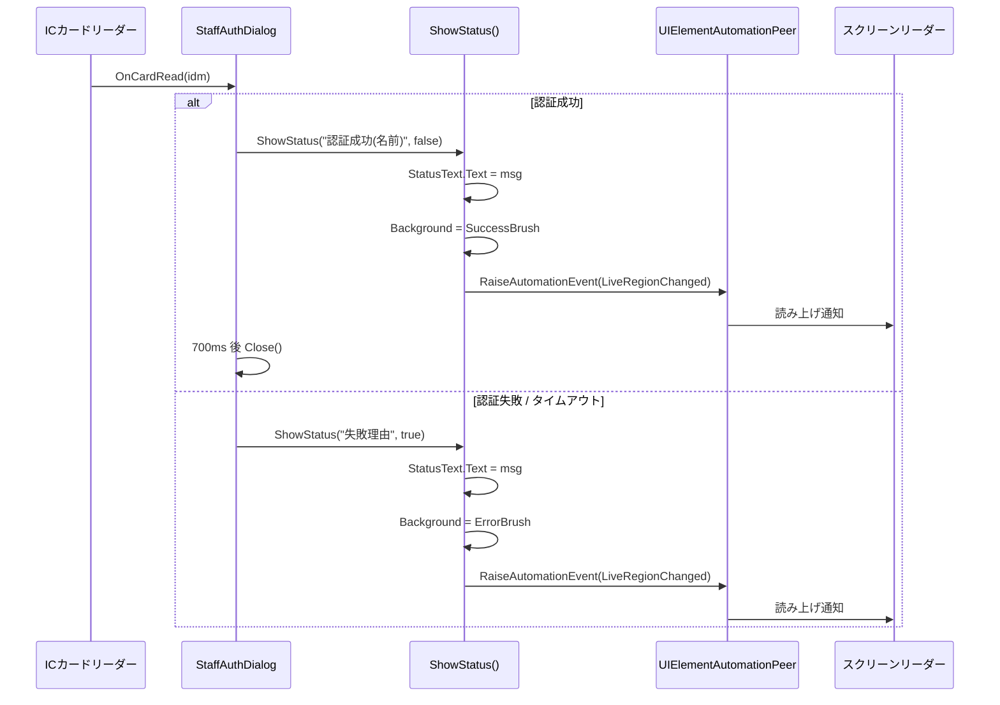

# Issue #1509: 職員証認証ダイアログの LiveRegion 即時通知不発火の修正

- **対象 Issue**: [#1509](https://github.com/kuwayamamasayuki/ICCardManager/issues/1509)
- **関連 PR**: [#1500](https://github.com/kuwayamamasayuki/ICCardManager/pull/1500) (Issue #1468) のフォローアップ
- **作成日**: 2026-05-11
- **ステータス**: ドラフト

## 1. 背景

PR #1500（Issue #1468）で `StaffAuthDialog.xaml` の `StatusText` に `AutomationProperties.LiveSetting="Assertive"` を付与し、CHANGELOG / PR 本文・テストプランで「**認証成功・失敗時に StatusText が即時通知（Assertive）で読み上げられる**」と記載した。しかし NVDA / Windows ナレーターでの実機検証の結果、**いずれの状況でもスクリーンリーダーは沈黙する**。

### 1.1 根本原因

| # | 原因 | 影響 |
|---|------|------|
| 1 | `StaffAuthDialog.xaml.cs` の `OnCardRead` 認証成功パスで `ShowStatus()` を呼ばず即 `Close()` する | 「成功時に読み上げ」は実装上ありえない |
| 2 | `StatusBorder` の初期 `Visibility="Collapsed"` により、子 `StatusText` が AutomationTree から除外。`Collapsed→Visible` 遷移は WPF UI Automation 仕様上 `LiveRegionChanged` イベントを発火しない | 失敗・タイムアウト時も無音 |
| 3 | 既存の `DialogAutomationPropertiesCoverageTests` は XAML 上の `LiveSetting="Assertive"` 文字列存在のみを検査し、ランタイムでのイベント発火を検証していない | バグがすり抜けた |

加えて、`ShowStatus()` 内で色値リテラル（`#FFEBEE` 等）を直接指定しており、`development-conventions.md` の **「色値の Single Source of Truth」原則（Issue #1392）違反** が併発している。

## 2. 目的とスコープ

### 2.1 目的
スクリーンリーダー利用者が以下を確実に音声で受け取れること：
- 認証**成功** → 認証成功と認証された職員名
- 認証**失敗**（未登録カード） → 失敗理由と対処
- 認証**タイムアウト** → タイムアウト発生

### 2.2 スコープ内
- `StaffAuthDialog.xaml` / `StaffAuthDialog.xaml.cs` の修正
- 派生問題: `ShowStatus()` 内の色値リテラル → `AccessibilityStyles.xaml` の `DynamicResource` 化（Issue #1392 該当箇所のみ）
- 既存 `DialogAutomationPropertiesCoverageTests` への静的セーフティネット追加
- 新規 UI Automation 統合テストケースを既存 `ICCardManager.UITests` に追加
- PR #1500 で誤って導入された CHANGELOG.md の主張の訂正
- 設計書（`03_画面設計書.md` §5.7, `07_テスト設計書.md` §2.45）の同期更新

### 2.3 スコープ外（YAGNI）
- 他ダイアログ（`ReportDialog` / `SettingsDialog` / `CardManageDialog` 等）の LiveRegion 動作検証
- `ReportDialog.xaml:273` の `Name="帳票作成ステータス"`（Issue #1468 の「動的 Text 更新では Name 付与禁止」原則との矛盾） → 別 Issue 起票推奨
- `ShowStatus()` の MVVM 化（ViewModel への抽出）
- Issue #1392（色値 Single Source of Truth）の他箇所への一括適用 — 本 Issue では `StaffAuthDialog.xaml.cs` の `ShowStatus()` のみ

## 3. アーキテクチャ

単一ダイアログ（`StaffAuthDialog`）に閉じたバグ修正。既存 code-behind パターンを維持し最小侵襲。テストインフラ拡張は不要（既存 `ICCardManager.UITests` プロジェクトに FlaUI 5.0.0 が導入済み、CI は windows-latest 構成）。



## 4. 詳細設計

### 4.1 `StaffAuthDialog.xaml` の変更

```xml
<!-- 変更前 -->
<Border x:Name="StatusBorder" Grid.Row="2" CornerRadius="4" Padding="12" Margin="0,0,0,15"
        Background="{DynamicResource LendingBackgroundBrush}" Visibility="Collapsed">
    <TextBlock x:Name="StatusText"
               Text=""
               ...
               AutomationProperties.LiveSetting="Assertive"/>
</Border>

<!-- 変更後 -->
<!-- Issue #1509: StatusBorder は常時可視化し、AutomationTree 上に常駐させる。
     Collapsed→Visible 遷移では LiveRegionChanged が発火しないため、Text 更新時に
     code-behind から AutomationPeer.RaiseAutomationEvent(LiveRegionChanged) を明示発火する。
     初期状態は背景透明・枠なしで視覚的に中立。Text 設定時に背景色・枠が現れる。 -->
<Border x:Name="StatusBorder" Grid.Row="2" CornerRadius="4" Padding="12" Margin="0,0,0,15"
        Background="Transparent" BorderThickness="0" MinHeight="44">
    <TextBlock x:Name="StatusText"
               Text=""
               ...
               AutomationProperties.LiveSetting="Assertive"/>
</Border>
```

`MinHeight="44"` は WCAG 2.1 SC 2.5.5 のターゲットサイズに合わせ、初期状態でもレイアウトジャンプを防ぐためのプレースホルダ高さ。

### 4.2 `StaffAuthDialog.xaml.cs` の変更

#### 4.2.1 `ShowStatus()` の刷新

```csharp
private void ShowStatus(string message, bool isError)
{
    StatusText.Text = message;

    // Issue #1509: 視覚的に表示する状態へ切り替え（Border は常時可視だが、空文字時は透明）
    var bgKey = isError ? "ErrorBackgroundBrush" : "SuccessBackgroundBrush";
    var fgKey = isError ? "ErrorForegroundBrush" : "SuccessForegroundBrush";
    StatusBorder.Background = (Brush)Application.Current.FindResource(bgKey);
    StatusText.Foreground = (Brush)Application.Current.FindResource(fgKey);
    StatusBorder.BorderThickness = new Thickness(1);
    StatusBorder.BorderBrush = (Brush)Application.Current.FindResource(
        isError ? "ErrorBorderBrush" : "SuccessBorderBrush");

    // Issue #1509: LiveRegionChanged を明示的に発火してスクリーンリーダーに通知。
    // Text 更新だけでは WPF UI Automation 仕様上、確実な発火が保証されないため。
    var peer = UIElementAutomationPeer.FromElement(StatusText)
               ?? UIElementAutomationPeer.CreatePeerForElement(StatusText);
    peer?.RaiseAutomationEvent(AutomationEvents.LiveRegionChanged);
}
```

- `FindResource` の null フォールバックは設けない（`AccessibilityStyles.xaml` 不在は致命的設定ミスとして即座に例外）
- `AutomationPeer` が null の場合は silently 続行（視覚は正常で致命でない）

#### 4.2.2 認証成功パスでの `ShowStatus()` 呼び出し追加

```csharp
private async void OnCardRead(object? sender, CardReadEventArgs e)
{
    await Dispatcher.InvokeAsync(async () =>
    {
        try
        {
            var staff = await _staffRepository.GetByIdmAsync(e.Idm);

            if (staff != null)
            {
                AuthenticatedIdm = e.Idm;
                AuthenticatedStaffName = staff.Name;

                _soundPlayer.Play(SoundType.Notify);
                _timeoutTimer.Stop();

                // Issue #1509: 成功時もステータス表示でスクリーンリーダーに認証成功を通知。
                // 700ms 表示してから閉じる（タイムアウト失敗側のクローズパターンと同じテンプレート）。
                ShowStatus($"認証に成功しました（{staff.Name}）", isError: false);
                CloseAfterDelay(TimeSpan.FromMilliseconds(700), dialogResult: true);
            }
            else
            {
                _soundPlayer.Play(SoundType.Error);
                ShowStatus("このカードは職員証として登録されていません。\n登録済みの職員証をタッチしてください。", isError: true);
            }
        }
        catch (Exception ex)
        {
            ShowStatus($"エラー: {ex.Message}", isError: true);
        }
    });
}

/// <summary>
/// Issue #1509: 短時間ステータス表示後にダイアログを閉じる共通テンプレート。
/// </summary>
private void CloseAfterDelay(TimeSpan delay, bool dialogResult)
{
    var closeTimer = new DispatcherTimer { Interval = delay };
    closeTimer.Tick += (s, args) =>
    {
        closeTimer.Stop();
        DialogResult = dialogResult;
        Close();
    };
    closeTimer.Start();
}
```

`OnTimeoutTick` 内の既存クローズタイマーも `CloseAfterDelay(TimeSpan.FromSeconds(1), false)` に置き換えて重複を排除する。

### 4.3 `AccessibilityStyles.xaml`

`SuccessBackgroundBrush` / `SuccessForegroundBrush` / `SuccessBorderBrush` は既存（`AccessibilityStyles.xaml:28-30`）。`ErrorBackgroundBrush` / `ErrorForegroundBrush` / `ErrorBorderBrush` も既存。追加変更なし。

なお `AccessibilityStyles.xaml:262-264` に `SuccessStatusStyle`（Border 用合成スタイル）が定義されている。`ShowStatus()` をさらに簡潔化するため `StatusBorder.Style` を切り替える設計も可能だが、最適化として別 Issue 化する（本 Issue では直接ブラシ参照を採用し、変更を最小限に保つ）。

## 5. テスト戦略

### 5.1 静的検査（`DialogAutomationPropertiesCoverageTests` 拡張）

新規追加するテストケース：

1. **`StaffAuthDialog_StatusBorder_should_not_be_initially_collapsed`**
   - `StatusBorder` の宣言に `Visibility="Collapsed"` が**含まれない**ことを正規表現で検証
   - 失敗時メッセージ: 「Collapsed→Visible 遷移は LiveRegionChanged を発火しないため、StatusBorder は常時可視化すべき」

2. **`StaffAuthDialog_code_behind_should_raise_LiveRegionChanged`**
   - `StaffAuthDialog.xaml.cs` に `RaiseAutomationEvent(AutomationEvents.LiveRegionChanged)` の呼び出しが含まれることを検証
   - 失敗時メッセージ: 「Text 更新だけでは LiveRegionChanged が確実に発火しないため、明示的に RaiseAutomationEvent を呼ぶ必要がある」

3. **`StaffAuthDialog_authentication_success_path_should_call_ShowStatus`**
   - `OnCardRead` のメソッド本体（`if (staff != null) { ... }` ブロック）内に `ShowStatus(` の呼び出しが含まれることを検証
   - 失敗時メッセージ: 「認証成功時にもステータス表示でスクリーンリーダーに通知すべき（Issue #1509）」

4. **`StaffAuthDialog_ShowStatus_should_use_DynamicResource_for_colors`**
   - `ShowStatus` メソッド本体に色値リテラル（`#[0-9A-Fa-f]{6}`）が**含まれない**ことを検証
   - 失敗時メッセージ: 「色値は AccessibilityStyles.xaml のブラシキーを DynamicResource/FindResource 経由で参照すべき（Issue #1392）」

### 5.2 UI Automation 統合テスト

新規ファイル: `ICCardManager/tests/ICCardManager.UITests/Dialogs/StaffAuthDialogLiveRegionTests.cs`

FlaUI 5.0.0 の `AutomationEventHandler` で `LiveRegionChangedEvent` を購読し、以下のシナリオを検証：

| ケース | シナリオ | 検証 |
|--------|----------|------|
| 失敗時発火 | 未登録カードをタッチ | LiveRegionChanged が StatusText 由来で 1 回以上発火 |
| タイムアウト時発火 | タイムアウト経過 | LiveRegionChanged が発火 |
| 成功時発火 | 登録済みカード（モックリーダー）をタッチ | LiveRegionChanged が発火、その後 1 秒以内に Close される |

実行戦略：
- テストカテゴリ: `[Trait("Category", "UiAutomation")]` を付与し、通常テストと分離可能にする
- CI: `ci.yml` で UI Automation テストも実行（既存 `windows-latest` ランナーで可能）
- フレイキー性対策: イベント発火待機に `WaitForCondition` を使い、最大 3 秒待つ

### 5.3 既存テストへの影響

- `StaffAuthDialog_status_text_should_have_assertive_live_setting` — 変更なし（XAML 属性は維持）
- `StaffAuthDialog_timeout_text_should_have_polite_live_setting` — 変更なし
- `Dynamic_text_blocks_should_not_have_AutomationProperties_Name` — 変更なし

## 6. ドキュメント同期

| ファイル | 変更内容 |
|----------|----------|
| `ICCardManager/CHANGELOG.md` | PR #1500 の Issue #1468 セクションから「認証成功・失敗の読み上げまで網羅」記述を訂正し、Issue #1509 として「LiveRegionChanged の実発火を実装」セクションを追加 |
| `docs/design/03_画面設計書.md` §5.7 | `StatusBorder` 常時可視化と `LiveRegionChanged` 明示発火の設計記述 |
| `docs/design/07_テスト設計書.md` §2.45 | UT-058a 拡張（静的検査）と新規 UT-058b（UI Automation 統合テスト） |
| `docs/superpowers/specs/.../this-design.md` | 本設計書（コミット対象） |

## 7. 受入基準

- [ ] NVDA で `StaffAuthDialog` を開き、未登録カードをタッチ → エラーメッセージが読み上げられる
- [ ] NVDA で `StaffAuthDialog` を開き、タイムアウト経過 → タイムアウトメッセージが読み上げられる
- [ ] NVDA で `StaffAuthDialog` を開き、登録カードをタッチ → 「認証に成功しました（職員名）」が読み上げられる
- [ ] Windows ナレーターでも上記 3 ケースが読み上げられる
- [ ] `DialogAutomationPropertiesCoverageTests` の新規 4 ケースがグリーン
- [ ] `ICCardManager.UITests` の新規 3 ケースがグリーン
- [ ] 既存テスト 3128 件がグリーン継続
- [ ] ビルド警告ゼロ
- [ ] CHANGELOG.md / 03_画面設計書.md / 07_テスト設計書.md 同期更新済み

## 8. リスクと緩和

| リスク | 緩和策 |
|--------|--------|
| FlaUI テストがフレイキーになる | `WaitForCondition` でイベント発火待機、`[Trait("Category","UiAutomation")]` で分離実行可能に |
| `Application.Current` が null（純粋ユニットテスト環境） | `ShowStatus()` はダイアログ表示中のイベントハンドラから呼ばれるため `Application.Current` は常に初期化済み。UI Automation テスト（`ICCardManager.UITests`）でも実プロセスでダイアログを起動するため null は発生しない。純粋ユニットテストで `ShowStatus` 単独呼び出しはしない設計とする（ロジックを ViewModel に抽出する MVVM 化は別 Issue） |
| 既存タイムアウト動作（1秒後クローズ）への影響 | `OnTimeoutTick` のクローズタイマーロジックを `CloseAfterDelay()` に集約。同じ 1 秒待機を維持 |
| `SuccessBorderBrush` 等が未定義の可能性 | 実装前に `AccessibilityStyles.xaml` の存在確認、不足分は同 PR で追加 |

## 9. 実装フェーズ（概要）

1. XAML 修正 (`StatusBorder` 常時可視化)
2. `ShowStatus()` の DynamicResource 化 + `RaiseAutomationEvent` 追加
3. `OnCardRead` 認証成功パスへの `ShowStatus` 呼び出し追加 + `CloseAfterDelay` ヘルパ抽出
4. 静的検査テスト 4 件追加
5. UI Automation テスト 3 件追加
6. 設計書同期更新（03, 07）+ CHANGELOG 訂正
7. ビルド・全テスト実行・手動 NVDA 検証
8. PR 作成（Issue #1509）

## 10. 参考

- Issue #1509 — 本 Issue
- PR #1500 / Issue #1468 — 元の属性付与 PR
- Issue #1392 — 色値 Single Source of Truth ルール
- `.claude/rules/development-conventions.md` — UI/UX 原則
- `ICCardManager/src/ICCardManager/Resources/Styles/AccessibilityStyles.xaml` — ブラシ定義
- FlaUI 5.0.0 ドキュメント: https://github.com/FlaUI/FlaUI
- MS Learn `AutomationEvents.LiveRegionChanged`: WPF UI Automation の LiveRegion 仕様
