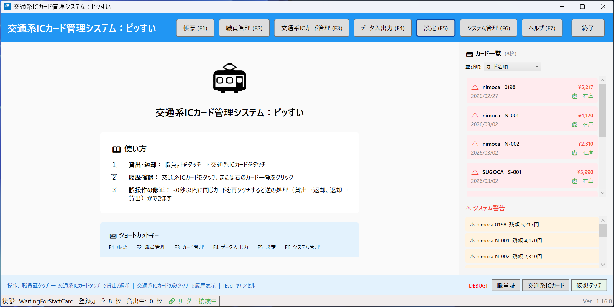
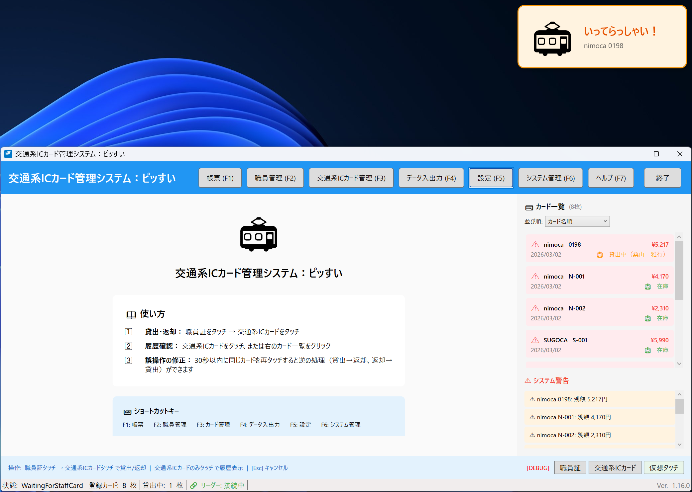

# 交通系ICカード管理システム「ピッすい」

複数の交通系ICカード（はやかけん・nimoca・SUGOCA 等）を複数職員でシェア利用する際の **出納記録を管理する Windows デスクトップアプリケーション** です。

貸出時と返却時に、職員証と交通系ICカードをそれぞれ一回ずつタッチするだけ。ICカードリーダー（PaSoRi）に「ピッ」とかざす簡単操作で、誰がいつどのカードを使ったかを自動で記録します。

---

## スクリーンショット

| メイン画面 | 貸出操作 |
|:---:|:---:|
|  |  |

## 主な機能

- **貸出・返却管理** — 職員証タッチ → 交通系ICカードタッチの2ステップで記録完了
- **利用履歴の自動取得** — カード内の乗降履歴（駅名・運賃）を読み取り、出納簿に反映
- **月次帳票（物品出納簿）出力** — Excel 形式で帳票を自動生成（市長事務部局 / 企業会計部局の2様式に対応）
- **共有フォルダモード** — SMB 共有フォルダ上に DB を配置し、複数 PC（最大約20台）で同時利用可能
- **誤操作の取消** — 30秒以内の再タッチで貸出⇔返却を逆転
- **バス利用の自動判別** — 乗降駅が空欄の履歴をバス利用として自動分類
- **アクセシビリティ対応** — 色覚多様性に配慮した配色、文字サイズ変更（小〜特大）、音声フィードバック

## 動作環境

| 項目 | 要件 |
|------|------|
| OS | Windows 10 / 11 |
| ランタイム | .NET Framework 4.8（Windows 10 以降は標準搭載） |
| ICカードリーダー | Sony PaSoRi（RC-S300 等） |
| ネットワーク | 不要（スタンドアロン動作。共有モード利用時のみ LAN 接続が必要） |

## ドキュメント

| ドキュメント | 説明 |
|-------------|------|
| [はじめに](ICCardManager/docs/manual/はじめに.md) | システムの導入背景と概要 |
| [ユーザーマニュアル概要版](ICCardManager/docs/manual/ユーザーマニュアル概要版.md) | よく使う操作を2ページにまとめた概要版 |
| [ユーザーマニュアル](ICCardManager/docs/manual/ユーザーマニュアル.md) | 全機能の操作方法 |
| [管理者マニュアル](ICCardManager/docs/manual/管理者マニュアル.md) | 設定・バックアップ・共有モードの管理手順 |
| [開発者ガイド](ICCardManager/docs/manual/開発者ガイド.md) | ビルド・テスト・アーキテクチャの解説 |

## リンク

- [更新履歴（CHANGELOG）](ICCardManager/CHANGELOG.md)
- [Issue・要望・バグ報告](../../issues)
- [設計書一式](ICCardManager/docs/design/)
