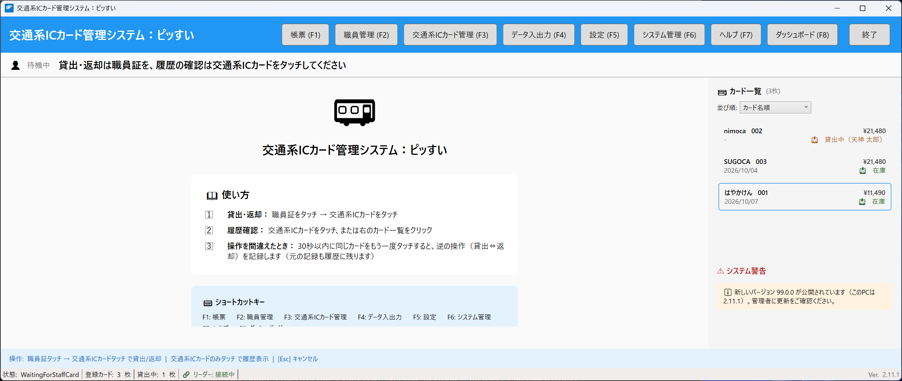

# 交通系ICカード管理システム「ピッすい」

複数の交通系ICカード（はやかけん・nimoca・SUGOCA 等）を複数職員でシェア利用する際の **出納記録を管理する Windows デスクトップアプリケーション** です。

貸出時と返却時に、職員証と交通系ICカードをそれぞれ一回ずつタッチするだけ。ICカードリーダー（PaSoRi）に「ピッ」とかざす簡単操作で、誰がいつどのカードを使ったかを自動で記録します。

---

## スクリーンショット

| メイン画面 | 貸出操作 |
|:---:|:---:|
|  |  |

## 主な機能

機能の一覧（画面との対応を含む）は [01_システム概要設計書 §2](ICCardManager/docs/design/01_システム概要設計書.md#2-主要機能一覧) にあります。

**日々の貸出・返却**
- **貸出・返却** — 職員証タッチ → 交通系ICカードタッチの 2 ステップで記録完了
- **利用履歴の自動取得** — 返却時にカード内の乗降履歴（駅名・運賃・チャージ）を読み取り、出納簿に反映。乗降駅が空欄の履歴はバス利用として分類し、バス停名を入力
- **30秒ルール** — 30 秒以内の再タッチで、続けて逆の操作（貸出→返却、返却→貸出）を記録
- **同行者数の入力** — 複数名で 1 枚のカードを使ったとき、氏名欄を「○○ 外N名」で記録
- **返却確認** — 返却直後にそのカードの履歴を表示し、今回記録した行を強調
- **貸出記録の作成** — 読み取らずに持ち出されたカードを、庶務担当者の操作で貸出中にする
- **システム警告** — 残額不足・バス停名未入力・残高の不整合・バックアップの長期未実施をメイン画面に表示

**履歴と帳票**
- **履歴の確認と修正** — 月単位の履歴表示、行の追加・変更・削除、乗り継ぎの統合・分割と取り消し、同一とみなす駅・バス停の登録
- **月次帳票（物品出納簿）** — Excel 形式で作成（市長事務部局 / 企業会計部局の 2 様式）。全カードの一括出力・出力済みの一覧・出力前の事前チェック・印刷プレビュー

**管理と運用**
- **交通系ICカード・職員の管理** — 登録・編集・削除・復元、交通系ICカードの払い戻し
- **データ入出力** — 職員・交通系ICカード・利用履歴・利用履歴詳細の CSV 出力・取り込み
- **操作ログ** — 登録・変更・削除・取り込み・バックアップ等の記録の検索と Excel 出力
- **バックアップ・リストア** — 起動時の自動バックアップ、バックアップ状況の表示、接続診断
- **管理者ダッシュボード（F8）** — 貸出中・長期未返却・残額不足・帳票未出力の俯瞰と、利用額・残高推移・稼働状況の分析
- **共有フォルダモード** — SMB 共有フォルダ上に DB を配置し、複数 PC（最大約 20 台）で同時利用可能
- **アクセシビリティ対応** — 色覚多様性に配慮した配色、文字サイズ変更（小〜特大）、音声フィードバック

## 動作環境

| 項目 | 要件 |
|------|------|
| OS | Windows 10 / 11 |
| ランタイム | .NET Framework 4.8（Windows 10 以降は標準搭載） |
| ICカードリーダー | Sony PaSoRi（RC-S300/RC-S380 等） |
| ネットワーク | 不要（スタンドアロン動作。共有モード利用時のみ LAN 接続が必要） |

## ドキュメント

| ドキュメント | 説明 |
|-------------|------|
| [はじめに](ICCardManager/docs/manual/はじめに.md) | システムの導入背景と概要 |
| [ユーザーマニュアル概要版](ICCardManager/docs/manual/ユーザーマニュアル概要版.md) | よく使う操作を2ページにまとめた概要版 |
| [ユーザーマニュアル](ICCardManager/docs/manual/ユーザーマニュアル.md) | 全機能の操作方法 |
| [管理者マニュアル](ICCardManager/docs/manual/管理者マニュアル.md) | 設定・バックアップ・共有モードの管理手順 |
| [IT担当者ガイド](ICCardManager/docs/manual/IT担当者ガイド.md) | 共有フォルダ・設定ファイル・セキュリティ・障害対応 |
| [開発者ガイド](ICCardManager/docs/manual/開発者ガイド.md) | ビルド・テスト・アーキテクチャの解説 |

## リンク

- [更新履歴（CHANGELOG）](ICCardManager/CHANGELOG.md)
- [Issue・要望・バグ報告](https://github.com/kuwayamamasayuki/ICCardManager/issues)
- [設計書一式](ICCardManager/docs/design/)
